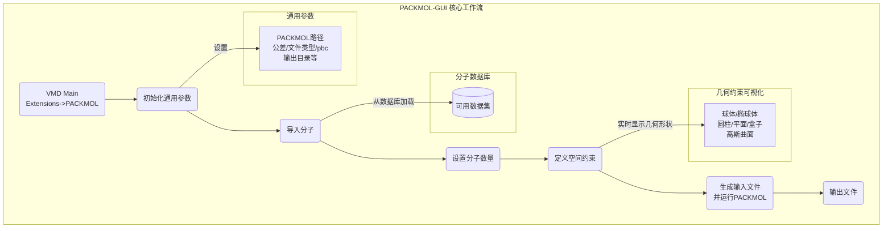

---
---
# VMD再添利器！PACKMOL-GUI：一站式搞定复杂分子体系的“搭积木”难题

## 本文信息

  - **标题**: PACKMOL-GUI: An All-In-One VMD Interface for Efficient Molecular Packing
  - **作者**: Jian Huang, Chenchen Wu, Xiner Yang, Zaixing Yang, Shengtang Liu, Gang Yu
  - **单位**: Soochow University, Children's Hospital of Zhejiang University School of Medicine
  - **引用格式**: Huang, J., Wu, C., Yang, X., Yang, Z., Liu, S., & Yu, G. (2025). PACKMOL-GUI: An All-In-One VMD Interface for Efficient Molecular Packing. *Journal of Chemical Information and Modeling*, *65*, 778-784.

-----

## 摘要

> PACKMOL是计算化学领域广泛使用的分子建模工具。然而，长期以来，它一直缺乏一个强大的、集参数设置与分子和几何约束可视化于一体的开源图形用户界面（GUI），这在很大程度上阻碍了其巨大优势的发挥。为了解决这一局限，我们开发了一款名为PACKMOL-GUI的VMD插件，它利用了Tcl/Tk工具包的动态可扩展性。该GUI允许用户通过一个直观的面板配置PACKMOL的所有参数，同时借助VMD软件，能够方便地可视化分子结构以及包括立方体、盒子、球体等在内的各种几何约束。VMD与PACKMOL之间的无缝交互，为构建复杂的分子系统提供了一个直观、高效的一体化平台。

-----

## 背景

分子动力学（MD）模拟是研究复杂分子系统热力学和动力学行为的核心计算方法。在MD模拟工作流程中，一个至关重要的前提步骤是构建一个包含多种分子混合物的、合理的初始构象。想象一下，要在一个模拟盒子中搭建一个复杂的细胞膜体系，你需要精确地放置成百上千个脂质分子、水分子，甚至还有蛋白质和离子，这就像是在一个微观世界里玩一个极其精密的“搭积木”游戏。

为了解决这个分子“堆叠”或“填充”的问题，**PACKMOL**应运而生，并成为该领域应用最广泛的程序之一。它允许用户在定义的空间区域内（如球体、立方体或更复杂的形状）放置指定数量的不同类型的分子，同时避免原子间的严重重叠。然而，PACKMOL的强大功能长期以来被其原始的命令行操作方式所束缚。用户需要手动编写包含大量坐标、几何约束和分子类型的文本输入文件，这个过程不仅繁琐、耗时，而且极易出错。更重要的是，用户无法直观地看到自己设置的几何约束区域与分子之间的关系，只能在运行结束后通过可视化软件检查结果，这使得调试过程非常低效。

尽管之前有研究者尝试开发PACKMOL的GUI，例如GEMS-Pack和Atomistica.online，但它们仍存在诸多不足。GEMS-Pack目前已无法访问，并且其依赖的Python 2.7和PyQt5技术栈面临被淘汰的风险，给安装带来挑战。而Atomistica.online则在PACKMOL参数设置、分子与几何约束的可视化方面功能有限，并且有计算时间限制。因此，科研社区迫切需要一个友好的、开源的、并且能将**参数设置、分子可视化和约束可视化**三者无缝集成的GUI工具。

## 关键科学问题

本文旨在解决的核心科学问题是：如何为功能强大但操作繁琐的PACKMOL程序开发一个**稳定、开源且功能全面的一体化图形用户界面**，使其能够无缝集成到主流的分子可视化软件（如VMD）中，从而将复杂的命令行输入文件生成过程，转变为一个直观的、“所见即所得”的交互式建模体验，最终大幅提升构建复杂分子体系的效率和便捷性？

## 创新点

  - **VMD插件形式**：利用VMD广泛的用户基础及其通过Tcl/Tk脚本的动态可扩展性，将PACKMOL的功能直接集成到科研人员熟悉的可视化环境中，无需修改VMD源码或重新编译。
  - **一体化平台**：首次实现了一个**集参数配置、分子结构可视化和几何约束实时可视化于一体**的完整工作流。用户可以直接在VMD窗口中看到设置的几何形状（如球体、盒子），极大地增强了操作的直观性。
  - **用户友好设计**：提供了丰富的内置功能以提升效率，包括一个**包含常用分子（脂质、溶剂、离子等）的共享数据库**，以及**基于体积或表面积自动估算最大可容纳分子数**的功能。
  - **开源与跨平台**：该工具是开源的，并且由于VMD本身支持Windows、Linux和macOS，PACKMOL-GUI也天然地支持这些主流操作系统。

-----

## 研究内容

### 核心方法：PACKMOL-GUI工作流详解

PACKMOL-GUI的设计遵循PACKMOL程序本身的数据流逻辑，将整个建模过程分解为一系列有序的步骤。用户在VMD的“Extensions”菜单中启动插件后，便可进入其主界面。

**图1：PACKMOL-GUI工作流概览**
整个工作流程可以清晰地划分为几个核心模块，从通用参数的初始化开始，到分子导入、空间约束定义，最终生成输入文件并运行PACKMOL。

**图2：PACKMOL-GUI的布局**
PACKMOL-GUI的界面布局遵循自上而下的逻辑顺序，分为五个核心模块，每个模块由不同颜色的虚线边框明确区分。
1.  **通用参数模块 (General Parameters Module)**:

      - 首次使用时，用户需要指定本地PACKMOL程序的可执行文件路径。
      - 该模块允许设置全局参数，如公差（tolerance）、输出文件类型（filetype）、周期性边界条件（PBC）等。
      - 所有设置（如输出目录、参数等）都会被保存在一个名为`packmol_info.json`的文件中，方便下次使用。
      - 为了方便用户，界面右侧还内嵌了PACKMOL的用户手册，可随时查阅。

2.  **分子导入模块 (Molecule Import Module)**:

      - 用户可以通过“Import”, “Delete”, “Refresh”按钮来导入、删除或同步分子列表。
      - 该模块集成了一个**包含常用生物分子、溶剂、气体分子、离子和纳米材料的数据库**，极大地便利了复杂系统的建模。例如，离子类别甚至包括了放射性核素离子。
      - **一个关键特性是自动估算最大分子数**。我们知道，在一个有限的空间里能塞进多少分子是有限的。PACKMOL-GUI提供了两种估算方法：

    #### 体积估算法

    $$
    N_{vmax}=\frac{V_{constraints}}{V_{molecule}}
    $$

    ##### 公式的通俗解释
    
    这个公式用于估算在一个给定的约束体积 $V_{constraints}$ 中，最多可以填充多少个分子。$N_{vmax}$ 是最大分子数，$V_{molecule}$ 是单个分子的体积。这个体积值可以通过MoloVol等工具计算得出。
        
    
    #### 表面积估算法（针对膜系统）
    
    $$
        N_{smax}=\frac{S_{constraints}}{APL_{molecule}}
    $$
    
    ##### 公式的通俗解释
    
    对于脂双层这样的膜系统，更关心的是在膜的表面能铺多少个脂质分子。$N_{smax}$ 是最大脂质分子数，$S_{constraints}$ 是约束形状提供的膜表面积，$APL_{molecule}$ 是每个脂质分子的平均占用面积（Area Per Lipid）。

3.  **约束模块 (Constraints Module)**:

      - 这是PACKMOL程序最具特色的功能，也是该GUI的核心。
      - 用户可以为导入的分子或其中的特定原子添加、修改或删除约束。
      - **位置约束**: 可以定义分子位于某个几何形状的“内部(inside)”、“外部(outside)”、“上方(over)”或“下方(below)”。
      - **几何类型**: 支持多种几何形状，包括立方体、盒子、球体、椭球体、平面、圆柱体和高斯曲面。
      - **实时可视化**: **当用户输入几何参数并按下回车键后，相应的几何形状会立即在VMD的主显示窗口中被绘制出来**。用户还可以通过界面上的单选按钮控制形状和标签的显示/隐藏，并修改线条粗细、颜色等，实现了真正的“所见即所得”。

4.  **输入文件生成与执行模块 (Input File Generation and Execution Module)**:

      - 在所有参数配置完成后，点击“generate”按钮，即可在左侧的文本框中看到生成的PACKMOL输入文件。
      - 用户可以点击“save”保存该文件，同时为了防止文件丢失，程序在生成时会自动在工作目录下保存一个带时间戳的副本。
      - 确认无误后，点击“run”按钮即可在后台调用PACKMOL程序执行计算。

5.  **输出日志模块 (Output Log Module)**:

      - PACKMOL程序的实时运行状态和输出信息会被重定向到该模块的文本框中，方便用户监控执行过程并快速定位和修正输入文件中的错误。

### 案例研究

为了展示PACKMOL-GUI的强大性能，作者复现了两个复杂的分子体系构建任务。

**案例一：构建双层棕榈酸球形囊泡**
这是一个来自PACKMOL官网的经典案例，目标是构建一个被水溶液包围的、内部也含有水核的脂质囊泡。

**图3：内外均有水的双层球形囊泡示例**
这个复杂的体系需要对水分子和棕榈酸分子施加四种不同的空间几何约束。

  - **内部水核 (water-0)**：被约束在一个半径为13 Å的球体内部。
  - **内层脂质 (palmitoyl-1)**：其亲水头部被约束在一个半径为14 Å的球内，而疏水尾部则被约束在一个半径26 Å的球外。
  - **外层脂质 (palmitoyl-2)**：其疏水尾部被约束在一个半径29 Å的球内，而亲水头部则被约束在一个半径41 Å的球外。
  - **外部溶剂 (water-3)**：被约束在一个边长为90 Å的立方体盒子内部，同时还要满足位于半径为43 Å的球体外部的条件。

**在PACKMOL-GUI中，用户可以直观地看到这几个层层相套的球形和立方体约束（如图3a所示），并使用Molcontroller工具将不同分子移动到各自的几何区域内进行预览，从而确保约束设置的准确性**。

**案例二：阳离子MOF材料富集放射性离子**
这个案例来自作者之前的研究，目标是构建一个包含阳离子金属有机框架（MOF）材料SCU-103、多种竞争性阴离子（OH⁻, NO₃⁻, SO₄²⁻, ⁹⁹TcO₄⁻）、抗衡离子和大量水分子的复杂体系。作者提到，在之前的工作中，他们使用GROMACS和Molcontroller等工具迭代构建这个体系，过程非常繁琐耗时。

**图4：用于吸附⁹⁹TcO₄⁻的阳离子MOF SUC-103**

使用PACKMOL-GUI，这个过程变得异常高效。

  - **MOF约束**：首先将SCU-103材料放置在由一个蓝色盒子定义的中心区域。
  - **离子约束**：在MOF表面的上下两侧，使用黄色和橙色的盒子来定义各种离子的初始分布区域。
  - **溶剂约束**：最后，使用一个赭石色的盒子来定义整个水溶剂的边界。

**通过GUI的可视化功能，用户可以清晰地看到代表不同约束区域的彩色盒子（如图4a所示），从而快速、准确地完成整个复杂系统的初始构象搭建**。

-----

## Q\&A

  - **Q1**: PACKMOL-GUI相比于之前的GEMS-Pack等GUI工具有哪些本质上的优势？

  - **A1**: 最核心的优势是**深度集成与可视化**。PACKMOL-GUI是作为VMD的插件运行的，这意味着它能直接利用VMD强大的分子可视化和操作能力。用户在设置几何约束时，可以**实时在VMD窗口中看到这些约束（如球体、盒子）的3D表示**，并可以同时显示分子，这是之前工具所不具备的。这种“所见即所得”的方式从根本上解决了命令行操作“盲人摸象”的痛点。此外，它是一个活跃维护的开源项目，避免了旧工具有的技术栈过时和无法访问的问题。

  - **Q2**: 安装和使用PACKMOL-GUI对用户的技术背景有什么要求？

  - **A2**: 要求非常低。用户需要预先安装好VMD和PACKMOL。PACKMOL-GUI的安装过程非常简单，只需将下载的文件夹放置到VMD的插件目录中，并在VMD的启动文件中添加一行命令即可。整个过程无需编译，并且有详细的README文件指导。熟悉VMD基本操作的用户可以非常快速地上手。

  - **Q3**: 既然PACKMOL-GUI如此强大，它是否存在一些潜在的局限性？

  - **A3**: 尽管论文没有专门讨论局限性，但可以推断出几点。首先，它的性能和稳定性**完全依赖于VMD**。如果VMD在处理超大规模体系（例如数百万原子）时变得卡顿，那么GUI的交互体验也会下降。其次，虽然GUI简化了操作，但**正确设置物理化学上合理的约束仍然需要用户的专业知识**。例如，在囊泡案例中，如何确定内外层脂质的约束半径，仍然需要用户对手头体系的尺寸有清晰的理解。最后，GUI的最终产物是PACKMOL的输入文件，如果PACKMOL本身在处理某些极端复杂的几何约束时收敛困难，GUI也无法解决这个后端计算的根本问题。

-----

## 关键结论与批判性总结

### 核心结论

  - **成功开发了一款名为PACKMOL-GUI的VMD插件**，它首次为PACKMOL提供了一个集参数设置、分子可视化和几何约束实时可视化于一体的强大、开源图形用户界面。
  - **实现了与VMD的无缝集成**，创建了一个直观、高效的一体化平台，用户可以通过“所见即所得”的方式交互式地构建复杂的分子系统。
  - **显著提升了建模效率**，通过内置的分子数据库、自动分子数估算和清晰的模块化界面，将原本繁琐耗时的命令行操作转变为简单的图形化点击和设置。
  - **通过两个复杂的案例研究**（球形囊泡和MOF吸附体系），证明了PACKMOL-GUI在处理真实科研问题时的高效性和可靠性。

### 批判性总结与展望

PACKMOL-GUI的出现，无疑是计算化学和分子模拟领域一个**极其重要且实用的工程实践成果**。它精准地解决了PACKMOL这个“叫好不叫座”（功能强大但使用不便）工具的核心痛点，极大地降低了构建复杂分子体系初始构象的门槛。通过将其巧妙地植入VMD这一事实上的行业标准可视化软件中，作者确保了该工具能被最广泛的科研群体快速接受和使用。可以预见，该插件将**极大地促进VMD和PACKMOL的用户群体增长，并成为教授分子模拟课程、进行探索性建模的必备工具**。

**潜在的局限性**在于，该工具的价值主要体现在“提效”而非“创新”。它没有改变PACKMOL的算法核心，因此无法解决PACKMOL本身可能存在的收敛性或算法上的难题。

**未来的发展方向**可能包括：1）与更多的分子操纵或模拟设置工具（如Molcontroller的更深度集成）联动，实现更复杂的自动化建模流程。2）引入机器学习模型，根据分子类型和约束形状，智能推荐更优的堆叠策略或参数。3）进一步扩充和维护其内置的分子数据库，使其成为一个更加全面的分子建模资源库。