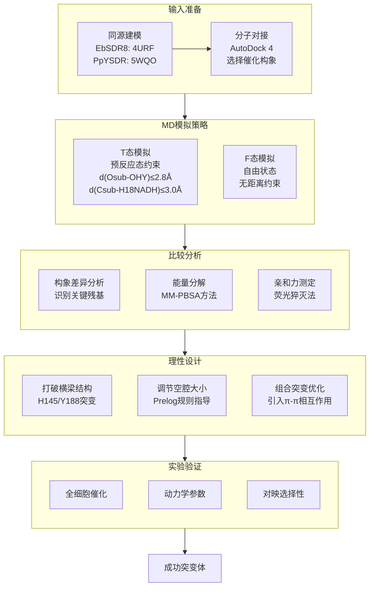

# 用MD模拟的T态与F态比较分析指导脱氢酶理性设计

## 本文信息

- **标题**: Rational Design of Dehydrogenase/Reductases Based on Comparative Structural Analysis of Prereaction-State and Free-State Simulations for Efficient Asymmetric Reduction of Bulky Aryl Ketones
- **作者**: Bing-Mei Su, Ze-Hui Shao, Ai-Peng Li, Muhammad Naeem, Juan Lin, Li-Dan Ye, Hong-Wei Yu
- **发表时间**: 2019年12月4日
- **单位**: 浙江大学生物工程研究所、福州大学化学工程学院、浙江工业大学药学院、西北工业大学生命科学学院（中国）
- **引用格式**: Su, B.-M., Shao, Z.-H., Li, A.-P., Naeem, M., Lin, J., Ye, L.-D., & Yu, H.-W. (2020). Rational Design of Dehydrogenase/Reductases Based on Comparative Structural Analysis of Prereaction-State and Free-State Simulations for Efficient Asymmetric Reduction of Bulky Aryl Ketones. *ACS Catalysis*, *10*(1), 864-876. https://doi.org/10.1021/acscatal.9b04778

## 摘要

> 本研究受分子动力学（MD）模拟中酶-底物复合物在距离限制条件下构象变化的启发，提出了一种**基于T态（预反应态）与F态（自由态）模拟比较分析来识别工程改造靶点**的策略。以短链脱氢酶/还原酶（SDR）突变体EbSDR8-G94A/S153L（Mu0）为例，该酶对大位阻芳香酮活性较低。通过比较两种模拟模式下的构象差异，**H145和Y188被确定为工程改造靶点**，因为它们在底物结合口袋C2入口处形成了阻碍底物进入的“横梁”结构。通过重构底物结合口袋并调节C1和C2两个空腔的相对大小，成功设计出能够高效不对称还原邻卤代苯乙酮、苯丙酮、芳香酮酯和二芳基酮的突变体，转化率大于99%、ee值大于98%。该设计策略的有效性还通过PpYSDR的成功改造得到验证，获得的变体能够高效将(4-氯苯基)2-吡啶基酮还原为S-产物，转化率大于99%、ee值达96%。

### 核心结论

- 通过**T态与F态MD模拟的比较分析**，可以直观地识别导致酶活性低下的关键残基
- H145和Y188形成的“横梁”结构是阻碍大位阻底物进入活性位点的主要原因
- 根据**Prelog规则**调节C1和C2空腔的相对大小，可以同时优化活性和对映选择性
- 该策略具有普适性，成功应用于两种不同的SDR酶（EbSDR8和PpYSDR）

## 背景

手性醇是复杂化合物的重要构建单元，在制药、农业化学、香料和精细化学工业中有广泛应用。据统计，超过25%的药物分子含有手性醇结构单元，其中相当一部分是通过生物催化合成的。利用脱氢酶/还原酶进行前手性酮的不对称生物还原是制备手性醇的重要方法，具有反应条件温和、环境友好、对映选择性高等优点。

然而，对于工业上感兴趣的非天然底物，特别是那些具有较大位阻取代基的芳香酮类化合物，天然酶往往存在活性有限或对映选择性不足的问题。这一瓶颈严重限制了生物催化在合成复杂手性药物中间体中的应用。例如：
- **邻卤代苯乙酮类**：重要的药物中间体，但邻位卤素的位阻效应大大降低酶活性
- **二芳基酮类**：如(4-氯苯基)2-吡啶基酮，是抗过敏药物贝泊替芬的关键前体
- **芳香酮酯类**：在合成手性药物和香料中具有重要应用价值

蛋白质工程已证明其在改善酶催化性能方面的强大能力。对于通过蛋白质工程产生的突变体，计算分子动力学模拟被广泛用于解释酶活性、稳定性和对映选择性变化的机制。**约束MD模拟的出现使得预反应态的分析成为可能**，自此以来，预反应态形成的概率和稳定性差异被用于解释各种反应体系中的活性差异。

### Prelog规则与Kazlauskas规则

短链脱氢酶/还原酶（SDR）是一类重要的氧化还原酶，其底物结合口袋通常呈"葫芦形"结构，包含两个相邻但大小不同的空腔：
- **C1腔**：通常较小，容纳底物羰基碳的小取代基
- **C2腔**：通常较大，容纳底物羰基碳的大取代基

根据**Prelog规则**：
- **较大C1 + 较小C2** → R-选择性（anti-Prelog构型）
- **较小C1 + 较大C2** → S-选择性（Prelog构型）

类似的规则也存在于酯酶和脂肪酶中，被称为**Kazlauskas规则**。这些规则为酶的对映选择性预测和工程设计提供了重要指导，但其应用前提是底物能够顺利进入催化构象。

### 约束MD模拟与预反应态分析

**预反应态（Prereaction State）**是指酶-底物-辅因子复合物中，底物和辅因子处于可发生催化反应的空间构象。对于脱氢酶/还原酶，预反应态的形成需要满足两个关键距离条件：
1. $d(\text{O}_{\text{sub}}-\text{OH}_{\text{Y156}}) \leq 2.8$ Å（质子转移距离）
2. $d(\text{C}_{\text{sub}}-\text{H18}_{\text{NADH}}) \leq 3.0$ Å（氢负离子转移距离）

**约束MD模拟**通过施加外部谐振势约束这些关键距离，可以强制系统保持在预反应态附近采样，从而分析预反应态的稳定性。而**自由态（Free-State）模拟**则无约束，允许系统自然演化，反映底物在酶中的真实结合行为。

**核心假设**：如果底物结合口袋不适合目标底物，那么T态模拟和F态模拟中的结合模式会存在显著差异。通过分析这些差异，可以识别限制酶活性的关键残基，为理性设计提供靶点。

### 关键科学问题

如何在没有晶体结构的情况下，**系统地识别限制酶对非天然底物活性的关键残基**？传统的理性设计方法往往需要大量的试错，而本研究提出的T态/F态比较分析策略能够更直接地揭示导致低反应性的关键残基，从而更准确地确定工程改造靶点。

### 创新点

- 提出了**T态与F态比较分析**的新策略，用于识别酶工程改造的靶点残基
- 系统阐明了SDR酶底物结合口袋“葫芦形”结构与对映选择性的构效关系
- 结合Prelog规则，通过调控C1/C2空腔相对大小实现活性与对映选择性的同步优化
- 建立了从亲和力测定到能量分解的多层次机制解析方法

---

## 研究内容

### 方法概述

**计算方法**:
- 同源建模：EbSDR8基于4URF（52%序列一致性），PpYSDR基于5WQO（39%序列一致性）
- MD模拟：使用Amber18，T态模拟时对$d(\text{O}_\text{sub}-\text{OH}_{\text{Y156}})$和$d(\text{C}_\text{sub}-\text{H18}_{\text{NADH}})$施加谐波势约束
- 预反应态判定标准：$d(\text{O}_\text{sub}-\text{OH}_{\text{Y156}}) \leq 2.8$ Å 且 $d(\text{C}_\text{sub}-\text{H18}_{\text{NADH}}) \leq 3.0$ Å

**实验验证**:
- 全细胞催化还原反应
- 动力学参数测定（$K_m$、$k_\text{cat}$）
- 荧光猝灭法测定全酶/脱辅酶对底物的亲和力

### 问题诊断：Mu0对大位阻底物活性低下的原因

EbSDR8-G94A/S153L（Mu0）对简单苯乙酮类底物表现出优异的R-选择性还原活性，但对邻卤代苯乙酮（2a）、苯丙酮（3a）、芳香酮酯（4a）等大位阻底物活性很低或完全无活性。

**实验证据**：
在50 mM底物浓度的全细胞还原反应中：
- **2'-溴代苯乙酮（2a）**：转化率仅8.0%
- **苯丙酮（3a）**：转化率38%
- **芳香酮酯（4a）**：转化率35%，但对映选择性从R型反转为S型（67% ee）
- **3-氯代丙酮（5a）**和**二芳基酮（6a）**：完全无法还原

**动力学参数分析**揭示了更深层的原因：
- **$k_\text{cat}$值极低**：所有测试底物的$k_\text{cat}$均小于0.1 s$^{-1}$，或因严重底物抑制而无法测定
- **邻位效应显著**：2a的活性显著低于1a，表明邻位卤素的位阻效应是活性的主要限制因素
- **取代基大小敏感**：当邻位取代基从氯增大到溴时，$k_\text{cat}$急剧下降

这些结果表明，Mu0的底物结合口袋可能不适合容纳大位阻取代基，限制了对工业上重要的底物的催化能力。</think>
</tool_call>

**图1：EbSDR8-G94A/S153L（Mu0）的重新设计策略。** 关键残基以棍状显示，底物以球棍模型显示。绿色虚线代表氢键，黑色虚线代表氢负离子转移方向。图中展示了：（A）Mu0的"葫芦形"底物结合口袋结构，包含较大的开放腔C1和较小的封闭腔C2；（B）T态与F态模拟的比较分析策略；（C）通过打破H145-Y188"横梁"结构并调节C1/C2相对大小来优化活性和对映选择性。

**T态/F态比较分析揭示了问题根源**：

为了深入理解Mu0对大位阻底物活性低下的分子机制，作者构建了Mu0全酶的预测模型。通过同源建模（模板：4URF，52%序列一致性）和MD模拟优化，模型质量评估显示：VERIFY值为96%、ERRAT值为93、Ramachandran图中>99%的残基位于允许区域，表明模型合理可靠。

**结构分析显示**，Mu0的底物结合口袋呈典型的"葫芦形"结构：
- **C1腔**：较大的开放空腔，通常容纳底物羰基碳的小取代基
- **C2腔**：较小的封闭空腔，通常容纳底物羰基碳的大取代基
- **催化三联体**：S143、Y156、K160，分别负责底物稳定、质子转移和NADH结合

关键发现：**H145和Y188通过氢键相互作用形成"横梁"结构**（$d(\text{OH}_{\text{Y188}}-\text{NE2}_{\text{H145}}) \leq 3.2$ Å的比例高达78%），阻挡了底物进入C2腔到达活性位点。

**能量分解分析**（MM-PBSA方法）进一步证实了这一发现：
- **催化残基贡献小**：S143、Y156、K160对2a$_{\text{ProR}}$结合的能量贡献极小
- **C1腔吸引力强**：I93、A94、Y188、S199、Y202等C1腔残基对底物结合的能量贡献较大
- **非生产性结合**：底物被C1腔强烈吸引，但无法进入催化构象，导致非生产性结合

这一发现解释了为什么Mu0对大位阻底物活性低下：底物虽然能够与酶结合，但无法形成有效的预反应态，因此无法完成催化反应。

关键发现：**H145和Y188通过氢键相互作用形成"横梁"结构**（$d(\text{OH}_{\text{Y188}}-\text{NE2}_{\text{H145}}) \leq 3.2$ Å的比例高达78%），阻挡了底物进入C2腔到达活性位点。

### 突变设计与验证

**图2：2a和6a与Mu0及其变体在T态和F态模拟中的结合模式。** （A）2a$_{\text{ProR}}$与Mu0的结合模式，橙色为T态、蓝色为F态；（B）2a$_{\text{ProR}}$与Mu1的结合模式；（C）6a$_{\text{ProR}}$与Mu0的结合模式；（D）6a$_{\text{ProR}}$与Mu14的结合模式；（E）2a$_{\text{ProS}}$与Mu14的结合模式，青色为T态、粉色为F态。黄色虚线表示氢键，黑色虚线和数值（Å）表示距离。

**第一轮突变**：将H145和Y188替换为较小残基（Ala、Gly、Cys）

| 突变体 | 描述 | 底物2a转化率 | ee值 | 底物3a转化率 | ee值 |
|--------|------|--------------|------|--------------|------|
| Mu0 | E-G94A/S153L | 8.0% | >99%(R) | 38% | >99%(R) |
| Mu1 | Mu0-H145A | >99% | >99%(R) | 92% | >99%(R) |
| Mu4 | Mu0-Y188A | 25% | 22%(R) | 95% | >99%(R) |

- Mu1（H145A）显著提高了对2a的活性，$k_\text{cat}$提高**35倍以上**
- 但Y188A突变导致对2a的对映选择性下降，因为C2腔过度扩大

**第二轮突变：针对二芳基酮6a**

单点突变无法使酶还原更大的二芳基酮(4-氯苯基)2-吡啶基酮（6a）。通过组合突变和引入π-π相互作用：

| 突变体 | 描述 | 底物6a转化率 | ee值 |
|--------|------|--------------|------|
| Mu10 | Mu0-H145F/Y188A | 94% | 91%(R) |
| Mu14 | Mu0-G94Q/H145F/Y188A | 99% | **98**%(R) |

关键设计逻辑：
- H145F引入苯环与底物芳环形成π-π相互作用
- Y188A扩大C2腔容纳大位阻取代基
- G94Q缩小C1腔并增加极性，吸引吡啶环，提高R-选择性

### 机制解析

**图3：F态模拟中底物结合口袋残基的构象分布图和能量分解。** （A）Mu0-2a$_{\text{ProR}}$（红）和Mu1-2a$_{\text{ProR}}$（蓝）的构象分布；（B）Mu0-6a$_{\text{ProR}}$（红）、Mu14-6a$_{\text{ProR}}$（蓝）和Mu14-6a$_{\text{ProS}}$（粉）的构象分布；（C）P-6a$_{\text{ProR}}$（红）、P-6a$_{\text{ProS}}$（绿）、Mu17-6a$_{\text{ProR}}$（蓝）和Mu17-6a$_{\text{ProS}}$（粉）的构象分布；（D-F）相应复合物中底物结合口袋残基对底物结合的能量贡献。绿色区域表示"催化距离"限制范围。

#### 第一轮突变的活性提升机制

**Mu1（H145A）对2a的活性提升**：
- **结合模式一致性提高**：Mu1-2a$_{\text{ProR}}$在F态的结合模式与T态高度一致，表明底物能够自发进入催化构象
- **预反应态形成能力增强**：F态模拟中预反应态构象比例从0%提高到5.6%
- **距离优化**：平均$d(\text{O}_{\text{sub}}-\text{OH}_{\text{Y156}})$从4.24 Å缩短到3.7 Å，$d(\text{C}_{\text{sub}}-\text{H18}_{\text{NADH}})$从4.68 Å缩短到3.5 Å
- **能量贡献重分布**：催化残基S143、Y156、K160对底物结合的能量贡献显著增加，从几乎无贡献变为-1.5至-2.0 kcal/mol
- **催化效率大幅提升**：$k_\text{cat}$从0.030 s$^{-1}$提高到1.1 s$^{-1}$，**35倍以上的提升**

**为什么简单的H145A突变能产生如此大的效果？**

H145A突变的成功在于：
1. **消除空间位阻**：组氨酸的咪唑环被较小的丙氨酸取代，消除了对C2腔入口的空间阻碍
2. **打破氢键网络**：H145与Y188之间的氢键相互作用被破坏，"横梁"结构被打破
3. **增加柔性**：A145比H145更灵活，允许底物更容易调整构象进入C2腔
4. **非极性环境维持**：丙氨酸的非极性侧链维持了C2腔的疏水环境，适合芳香底物结合

#### 对映选择性反转的机制分析

**底物4a的对映选择性反转现象**：
Mu0对4a表现为S-选择性（67% ee），但经过Y188A突变后，变体Mu4表现为R-选择性（>99% ee）。这一现象可以通过以下机制解释：

**构象分布差异**：
- **Mu0-4a**：底物在F态模拟中倾向于形成S-选择性构象，C1腔容纳羰基苯环，C2腔容纳乙酯基团
- **Mu4-4a**：Y188A扩大C2腔后，乙酯基团在C2腔中的空间限制减弱，底物可以"翻转"，使苯环进入C2腔，乙酯基团进入C1腔，符合anti-Prelog规则的R-选择性

**能量分解证据**：
- **Mu0**：C1腔残基（I93、A94）对底物结合的能量贡献更大，倾向于将苯环定位在C1
- **Mu4**：C2腔扩大后，C2腔残基的能量贡献相对增加，有利于乙酯基团占据C2腔
- **静电效应**：乙酯基团的酯键与S143、Y156的静电相互作用在翻转构象中更有利

这一发现表明，通过调节两个空腔的相对大小，不仅可以影响底物结合，还可以完全改变对映选择性，为工程设计提供了精确的控制手段。

#### 组合突变的协同效应

**第二轮突变针对二芳基酮6a的设计逻辑**：

单点突变无法使酶还原具有两个大芳环的底物6a，需要更精细的设计策略：

**分子识别的挑战**：
- **空间位阻极大**：两个芳环（4-氯苯基和2-吡啶基）都需要较大的容纳空间
- **电子云分布不均**：吡啶环的电子云分布比氯苯环更不均匀，需要特定的极性环境
- **构象限制**：两个大芳环的存在限制了底物在结合口袋中的取向自由度

**三突变协同机制**：

1. **H145F突变**：
   - **π-π相互作用**：苯环与底物芳环形成π-π相互作用，增强结合亲和力
   - **刚性化效应**：苯环比组氨酸更刚性，限制了底物的构象自由度
   - **电子互补**：苯环的π电子云与底物芳环的π电子云形成互补，优化结合能量

2. **Y188A突变**：
   - **空间释放**：去除酪氨酸的大侧链，为吡啶环提供足够的空间
   - **极性调节**：丙氨酸的非极性侧链降低了C2腔的极性，有利于疏水性芳香环结合
   - **柔性增加**：增加了底物调整构象的自由度

3. **G94Q突变**：
   - **空间调控**：谷氨酰胺的侧链比丙氨酸大，适度缩小C1腔，平衡两个空腔大小
   - **极性增强**：引入的酰胺基增加了C1腔的极性，有利于与吡啶环的氮原子形成氢键
   - **选择性控制**：通过调节C1腔的大小和极性，引导底物以R-选择性模式结合

**能量分解证据**：
- **Mu0**：催化残基Y156、K154对6a$_{\text{ProS}}$的结合能量贡献更大，与S-选择性一致
- **Mu14**：通过三突变，能量贡献重新分布，使6a$_{\text{ProR}}$的结合更有利
- **协同效应**：三个突变产生的能量变化不是简单的加和，而是通过复杂的相互作用网络产生协同效应

这一设计展示了多突变协同工程在解决复杂底物识别问题中的强大能力。

### 策略验证：PpYSDR的改造

为验证策略的普适性，对另一种SDR酶PpYSDR（来自*Pseudomonas putida*）进行改造：

| 酶 | 描述 | 底物6a转化率 | ee值 |
|----|------|--------------|------|
| P | PpYSDR | 44% | 41%(S) |
| Mu17 | P-M85S | >99% | **96**%(S) |

PpYSDR的C2腔天然开放较大，主要问题是C1腔相对较小。通过M85S突变扩大C1腔，成功提高了对S-构型产物的选择性和转化率。$k_\text{cat}$提高约**5倍**。

---

## Q&A

- **Q1**: 为什么选择T态/F态比较分析而不是直接的自由能计算？
- **A1**: T态/F态比较分析的优势在于能够**直观地揭示**哪些残基导致了预反应态难以形成。当两种模拟模式下的结合模式差异显著时，说明底物难以自发进入反应构象，而残基构象差异最大的位置就是改造靶点。这比复杂的自由能计算更直接、更易于指导实验设计。
- **Q2**: 为什么$k_\text{cat}$提高的同时$K_m$也增加了？
- **A2**: $k_\text{cat}$和$K_m$的同时增加表明**非生产性结合减少**。虽然$K_m$升高意味着底物亲和力降低，但在工业应用中高底物浓度可以弥补这一不足。更重要的是，高$k_\text{cat}$代表更高的催化效率，且较低的亲和力还可以缓解底物抑制问题。
- **Q3**: 这种策略对其他类型的酶是否适用？
- **A3**: 该策略的核心思想——**比较有/无约束条件下的底物结合模式差异**——具有较好的普适性。对于任何具有明确反应几何要求的酶（如需要特定底物-辅因子距离），都可以应用类似的分析方法。但对于反应机制复杂或多步反应的酶，可能需要调整约束条件的设置。
- **Q4**: 如何避免扩大结合口袋后对映选择性下降？
- **A4**: 关键是**同步调节两个空腔的相对大小**，而非单纯扩大其中一个。根据Prelog规则，需要在扩大容纳大取代基的空腔的同时，通过引入大残基或极性残基来调整另一个空腔的大小和化学环境，以维持或提高对映选择性。

---

## 关键结论与批判性总结

**主要贡献**:
- 建立了T态/F态比较分析的系统方法论，为酶理性设计提供了新工具
- 深入阐明了SDR酶“葫芦形”结合口袋与对映选择性的构效关系
- 成功设计了多个高活性、高对映选择性的SDR突变体

**局限性**:
- 依赖于同源建模的准确性，对于无合适模板的酶可能受限
- 能量分解方法（MM-PBSA）存在固有的近似误差
- 主要关注底物结合，未深入探讨过渡态稳定化

**未来方向**:
- 结合机器学习方法，自动识别T态/F态差异显著的残基
- 扩展到其他氧化还原酶和非氧化还原酶体系
- 开发高通量计算筛选流程，减少实验验证工作量
