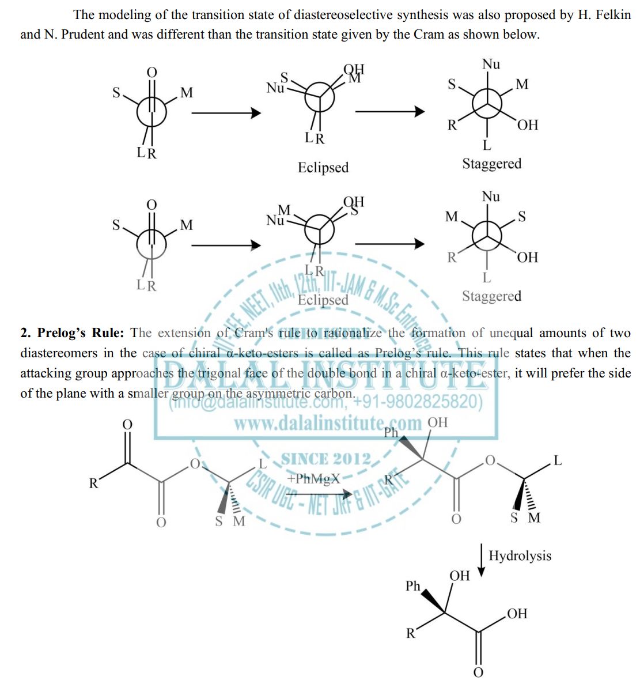
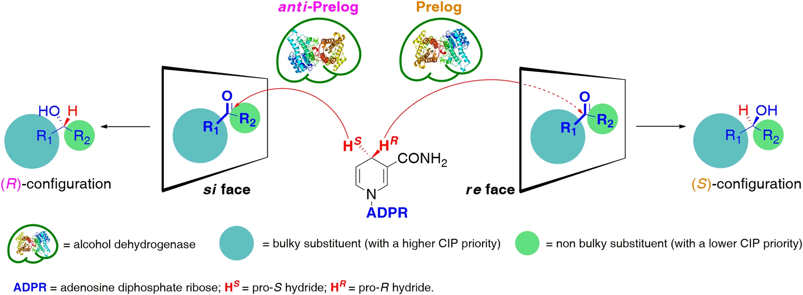
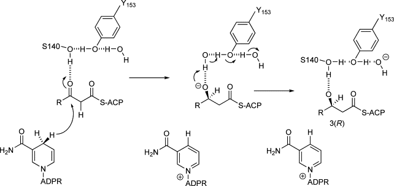
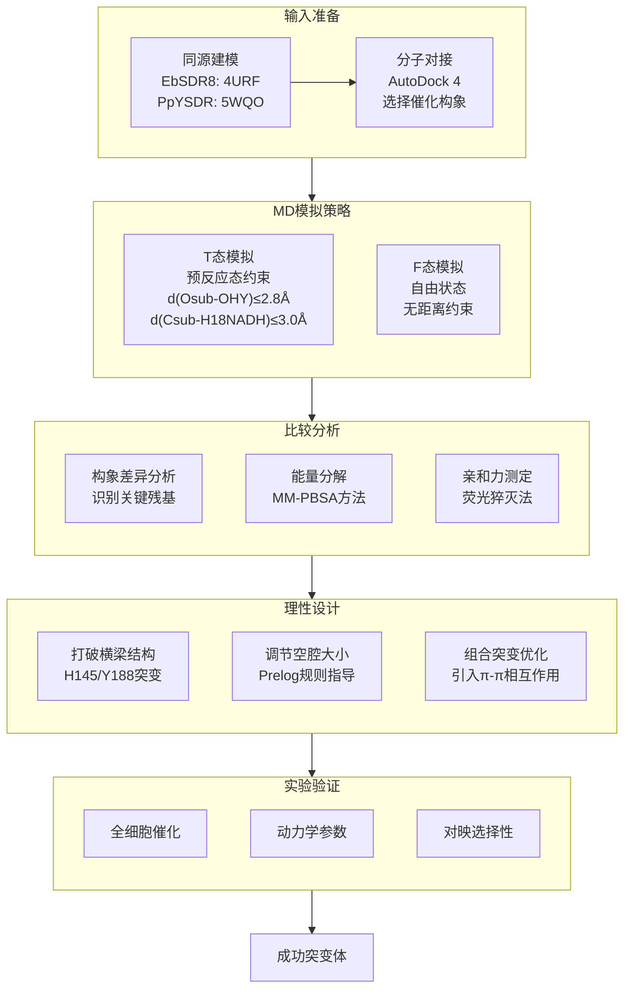
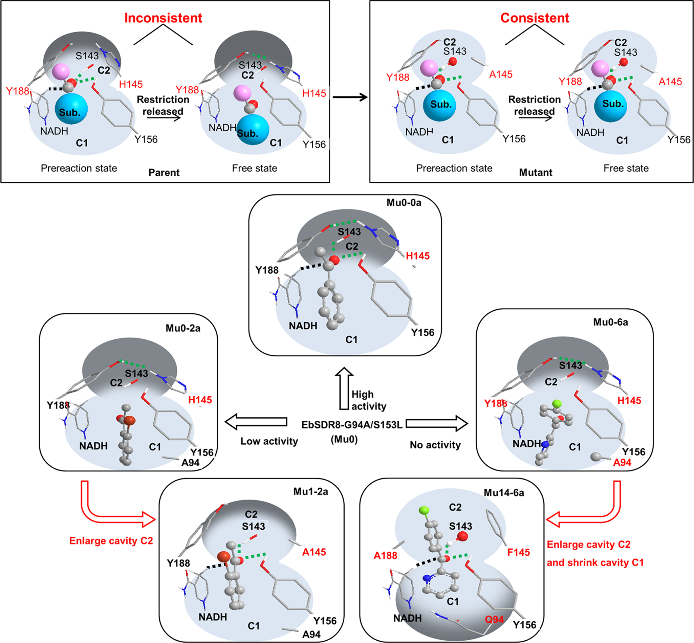
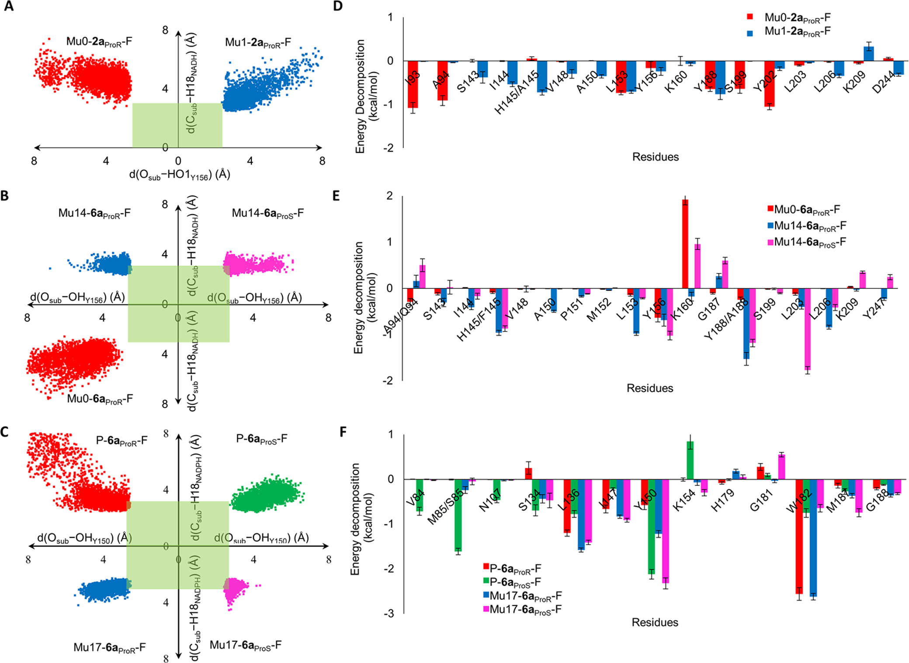

# 预反应态vs自由态：用双态MD梳理SDR“葫芦口袋”精准打开大位阻芳香酮入口

## 本文信息

- **标题**: Rational Design of Dehydrogenase/Reductases Based on Comparative Structural Analysis of Prereaction-State and Free-State Simulations for Efficient Asymmetric Reduction of Bulky Aryl Ketones
- **作者**: Bing-Mei Su, Ze-Hui Shao, Ai-Peng Li, Muhammad Naeem, Juan Lin, Li-Dan Ye, Hong-Wei Yu
- **发表时间**: 2019年12月4日
- **单位**: 浙江大学生物工程研究所、福州大学化学工程学院、浙江工业大学药学院、西北工业大学生命科学学院（中国）
- **引用格式**: Su, B.-M., Shao, Z.-H., Li, A.-P., Naeem, M., Lin, J., Ye, L.-D., & Yu, H.-W. (2020). Rational Design of Dehydrogenase/Reductases Based on Comparative Structural Analysis of Prereaction-State and Free-State Simulations for Efficient Asymmetric Reduction of Bulky Aryl Ketones. *ACS Catalysis*, *10*(1), 864-876. https://doi.org/10.1021/acscatal.9b04778

## 摘要

> 本研究受分子动力学（MD）模拟中酶-底物复合物在距离限制条件下构象变化的启发，提出了一种**基于T态（预反应态）与F态（自由态）模拟比较分析来识别工程改造靶点**的策略。以短链脱氢酶/还原酶（SDR）突变体EbSDR8-G94A/S153L（Mu0）为例，该酶对大位阻芳香酮活性较低。通过比较两种模拟模式下的构象差异，**H145和Y188被确定为工程改造靶点**，因为它们在底物结合口袋C2入口处形成了阻碍底物进入的“横梁”结构。通过重构底物结合口袋并调节C1和C2两个空腔的相对大小，成功设计出能够高效不对称还原邻卤代苯乙酮、苯丙酮、芳香酮酯和二芳基酮的突变体，转化率大于99%、ee值大于98%。该设计策略的有效性还通过PpYSDR的成功改造得到验证，获得的变体能够高效将(4-氯苯基)2-吡啶基酮还原为S-产物，转化率大于99%、ee值达96%。

### 核心结论

- 通过**T态与F态MD模拟的比较分析**，可以直观地识别导致酶活性低下的关键残基
- H145和Y188形成的“横梁”结构是阻碍大位阻底物进入活性位点的主要原因
- 根据**Prelog规则**调节C1和C2空腔的相对大小，可以同时优化活性和对映选择性
- 该策略具有普适性，成功应用于两种不同的SDR酶（EbSDR8和PpYSDR）

## 背景

**手性醇是复杂化合物的重要构建单元**，在制药、农业化学、香料和精细化学工业中有广泛应用。据统计，超过25%的药物分子含有手性醇结构单元，其中相当一部分是通过生物催化合成的。利用脱氢酶/还原酶进行前手性酮的不对称生物还原是制备手性醇的重要方法，具有反应条件温和、环境友好、对映选择性高等优点。

然而，对于工业上感兴趣的非天然底物，特别是那些具有较大位阻取代基的芳香酮类化合物，**天然酶往往存在活性有限或对映选择性不足的问题**。这一瓶颈严重限制了生物催化在合成复杂手性药物中间体中的应用。例如：
- **邻卤代苯乙酮类**：重要的药物中间体，但邻位卤素的位阻效应大大降低酶活性
- **二芳基酮类**：如(4-氯苯基)2-吡啶基酮，是抗过敏药物贝泊替芬的关键前体
- **芳香酮酯类**：在合成手性药物和香料中具有重要应用价值

蛋白质工程已证明其在改善酶催化性能方面的强大能力。对于通过蛋白质工程产生的突变体，计算分子动力学模拟被广泛用于解释酶活性、稳定性和对映选择性变化的机制。**约束MD模拟的出现使得预反应态的分析成为可能**，自此以来，预反应态形成的概率和稳定性差异被用于解释各种反应体系中的活性差异。

### Prelog规则与Kazlauskas规则

短链脱氢酶/还原酶（SDR）是一类重要的氧化还原酶，其底物结合口袋通常呈葫芦形结构，包含两个相邻但大小不同的空腔：
- **C1腔**：通常较小，容纳底物羰基碳的小取代基
- **C2腔**：通常较大，容纳底物羰基碳的大取代基

根据**Prelog规则**：
- **较大C1 + 较小C2** → R-选择性（anti-Prelog构型）
- **较小C1 + 较大C2** → S-选择性（Prelog构型）

类似的规则也存在于酯酶和脂肪酶中，被称为**Kazlauskas规则**。这些规则为酶的对映选择性预测和工程设计提供了重要指导，但其应用前提是底物能够顺利进入催化构象。

> https://www.dalalinstitute.com/books/a-textbook-of-organic-chemistry-volume-1/asymmetric-synthesis-crams-rule-and-its-modifications-prelogs-rule/

**Prelog规则的本质是辅因子NAD(P)H的氢负离子转移方向与底物羰基碳的立体化学之间的关系**。在脱氢酶/还原酶催化的羰基还原反应中，辅因子NAD(P)H的C4位置携带一个pro-S氢和一个pro-R氢（根据Re/Si面命名规则，这也被称为pro-4R和pro-4S氢）：

- **Prelog选择性**（S-构型产物）：NADH的pro-S氢（4S-H）转移到底物羰基的Re面
- **Anti-Prelog选择性**（R-构型产物）：NADH的pro-R氢（4R-H）转移到底物羰基的Si面

> https://www.nature.com/articles/s42004-023-01013-1/figures/1

这种选择性的分子基础在于：
1. **辅因子结合方向**：NAD(P)H在活性位点的结合构象决定了哪个面（pro-S或pro-R氢）朝向底物羰基
2. **底物取向控制**：底物结合口袋中C1和C2空腔的相对大小决定了底物的取向——大取代基被引导进入较大的空腔，小取代基进入较小的空腔
3. **空间匹配原则**：当底物以特定取向结合时，其羰基碳的Re面或Si面会暴露给NADH的相应氢原子，从而决定最终产物的立体化学

**空腔大小与氢负离子转移方向的耦合**：
- 当C2腔较大、C1腔较小时，底物的大取代基进入C2腔，小取代基进入C1腔，这种取向使得羰基碳的Re面暴露给NADH的pro-S氢，产生S-构型产物（Prelog选择性）
- 当C1腔较大、C2腔较小时，底物取向翻转，羰基碳的Si面暴露给NADH的pro-R氢，产生R-构型产物（anti-Prelog选择性）

**非保守残基的协同调控**：近年来的研究表明，除了空腔大小外，**底物结合口袋中非保守残基的协同作用**对立体选择性至关重要。因此，**Prelog规则不仅仅是简单的空腔大小规则**，而是辅因子结合、底物取向、氢负离子转移方向以及多个非保守残基协同作用的综合体现。这一认识为理性设计提供了更精确的指导：不仅要调节空腔大小，还需要考虑关键残基的化学性质和空间排布。

### 约束MD模拟与预反应态分析

**预反应态（Prereaction State）**是指酶-底物-辅因子复合物中，底物和辅因子处于可发生催化反应的空间构象。对于脱氢酶/还原酶，预反应态的形成需要满足两个关键距离条件：
1. $d(\text{O}_{\text{sub}}-\text{OH}_{\text{Y156}}) \leq 2.8$ Å（质子转移距离）
2. $d(\text{C}_{\text{sub}}-\text{H18}_{\text{NADH}}) \leq 3.0$ Å（氢负离子转移距离）

**约束MD模拟**通过施加外部谐振势约束这些关键距离，可以强制系统保持在预反应态附近采样，从而分析预反应态的稳定性。而**自由态（Free-State）模拟**则无约束，允许系统自然演化，反映底物在酶中的真实结合行为。

**核心假设**：如果底物结合口袋不适合目标底物，那么T态模拟和F态模拟中的结合模式会存在显著差异。通过分析这些差异，可以识别限制酶活性的关键残基，为理性设计提供靶点。

### 关键科学问题

如何在没有晶体结构的情况下，**系统地识别限制酶对非天然底物活性的关键残基**？传统的理性设计方法往往需要大量的试错，而本研究提出的T态/F态比较分析策略能够更直接地揭示导致低反应性的关键残基，从而更准确地确定工程改造靶点。

### 创新点

- 提出了**T态与F态比较分析**的新策略，用于识别酶工程改造的靶点残基
- 系统阐明了SDR酶底物结合口袋“葫芦形”结构与对映选择性的构效关系
- 结合Prelog规则，通过调控C1/C2空腔相对大小实现活性与对映选择性的同步优化
- 建立了从亲和力测定到能量分解的多层次机制解析方法

---

## 研究内容

### 方法概述

**方法要点**：
- **模型构建**：
  - EbSDR8 以4URF（52%序列一致性）为模板，同法得到PpYSDR（模板5WQO，39%）；
  - AutoDock 4 选取满足催化几何的初始姿势，再用Amber18（FF14SB/GAFF2/TIP3P）补氢、加离子与溶剂。

- **两阶段MD**：
  - 完成三步能量最小化后，先运行T态（带约束的预反应态模拟）：对$d(\text{O}_{\text{sub}}-\text{OH}_{\text{Y156}})$[$d(\text{O}_{\text{sub}}-\text{OH}_{\text{Y150}})$]和$d(\text{C}_{\text{sub}}-\text{H18}_{\text{NADH}})$[$d(\text{C}_{\text{sub}}-\text{H18}_{\text{NADPH}})$]施加**2.8 Å/3.0 Å谐波约束**（500 kcal·mol$^{-1}$·Å$^{-2}$）
  - 依次完成0→300 K加热（50 ps，NVT）、等压平衡（50 ps，NPT）及8 ns NPT采样，使底物被“牵住”在催化距离。
  - **F态诊断**：直接从T态末帧解除约束，再跑8 ns NPT。
    - 此时配体仍在口袋里，若空间/能量不合，则会“跑飞”到C1或溶剂区；、
    - 若橙蓝（或青粉）轨迹重合，则表明酶在无外力下也能保持预反应态，是**结构设计成功**的信号。

- **催化判据与分析**：
  - $d(\text{O}_{\text{sub}}-\text{OH}_{\text{Y156}})\le 2.8$ Å 且$d(\text{C}_{\text{sub}}-\text{H18}_{\text{NADH}})\le 3.0$ Å
  - **统计满足的帧的占比**，再结合MM-PBSA能量分解和荧光淬灭测得的亲和力，判断哪些残基需要工程化。F态若频繁跑飞，就与后续低转化率或ee崩塌一一对应。

**实验验证**:
- 全细胞催化还原反应
- 动力学参数测定（$K_m$、$k_\text{cat}$）
- 荧光猝灭法测定全酶/脱辅酶对底物的亲和力

### 问题诊断：Mu0对大位阻底物活性低下的原因

本研究涉及的底物结构如下：

| 编号 | 名称                  | 结构特点       |
| ---- | --------------------- | -------------- |
| 0a   | 苯乙酮                | 基准底物       |
| 1a   | 2'-氯代苯乙酮         | 邻位卤代       |
| 2a   | 2'-溴代苯乙酮         | 邻位大位阻卤代 |
| 3a   | 苯丙酮                | 乙基取代       |
| 4a   | 2-氧代-4-苯基丁酸乙酯 | 芳香酮酯       |
| 5a   | 3-氯丙酮              | 氯丙基取代     |
| 6a   | (4-氯苯基)2-吡啶基酮  | 二芳基酮       |

EbSDR8-G94A/S153L（Mu0）对简单苯乙酮类底物表现出优异的R-选择性还原活性，但对邻卤代苯乙酮（2a）、苯丙酮（3a）、芳香酮酯（4a）等大位阻底物活性很低或完全无活性。

**实验证据**：
在50 mM底物浓度的全细胞还原反应中：
- **2'-溴代苯乙酮（2a）**：转化率仅8.0%
- **苯丙酮（3a）**：转化率38%
- **芳香酮酯（4a）**：转化率35%，但对映选择性从R型反转为S型（67% ee）
- **3-氯代丙酮（5a）**和**二芳基酮（6a）**：完全无法还原

**动力学参数分析**揭示了更深层的原因：
- **$k_\text{cat}$值极低**：所有测试底物的$k_\text{cat}$均小于0.1 s$^{-1}$，或因严重底物抑制而无法测定
- **邻位效应显著**：2a的活性显著低于1a，表明邻位卤素的位阻效应是活性的主要限制因素
- **取代基大小敏感**：当邻位取代基从氯增大到溴时，$k_\text{cat}$急剧下降

这些结果表明，Mu0的底物结合口袋可能不适合容纳大位阻取代基，限制了对工业上重要的底物的催化能力。

**图1：EbSDR8-G94A/S153L（Mu0）的重新设计策略。** 关键残基以棍状显示，底物以球棍模型显示。绿色虚线代表氢键，黑色虚线代表氢负离子转移方向。图中展示了：（A）Mu0的“葫芦形”底物结合口袋结构，包含较大的开放腔C1和较小的封闭腔C2；（B）T态与F态模拟的比较分析策略；（C）通过打破H145-Y188“横梁”结构并调节C1/C2相对大小来优化活性和对映选择性。

**T态/F态比较分析揭示了问题根源**：为了深入理解Mu0对大位阻底物活性低下的分子机制，作者构建了Mu0全酶的预测模型。通过同源建模（模板：4URF，52%序列一致性）和MD模拟优化，模型质量评估显示：**VERIFY值为96%**（衡量3D-1D相容性，>80%为合格）、**ERRAT值为93**（评估非键原子间相互作用，>50为高质量）、**Ramachandran图中>99%的残基位于允许区域**（评估主链二面角合理性），表明模型合理可靠。

**结构分析显示**，Mu0的底物结合口袋呈典型的“葫芦形”结构：
- **C1腔**：较大的开放空腔，通常容纳底物羰基碳的小取代基
- **C2腔**：较小的封闭空腔，通常容纳底物羰基碳的大取代基
- **催化三联体**：S143、Y156、K160，分别负责底物稳定、质子转移和NADH结合

关键发现：**H145和Y188通过氢键相互作用形成“横梁”结构**（$d(\text{OH}_{\text{Y188}}-\text{NE2}_{\text{H145}}) \leq 3.2$ Å的比例高达78%），阻挡了底物进入C2腔到达活性位点。

**能量分解分析**（MM-PBSA方法，见后文图3D）进一步证实了这一发现：
- **催化残基贡献小**：S143、Y156、K160对2a$_{\text{ProR}}$结合的能量贡献极小
- **C1腔吸引力强**：I93、A94、Y188、S199、Y202等C1腔残基对底物结合的能量贡献较大
- **非催化构象（noncatalytic conformation）**：底物被C1腔强烈吸引，但无法进入质子/氢负离子可转移的几何状态

这一发现解释了为什么Mu0对大位阻底物活性低下：底物虽然能够与酶结合，但无法形成有效的预反应态，因此无法完成催化反应。

### 突变设计与验证

**图2：2a和6a与Mu0及其变体在T态和F态模拟中的结合模式。** （A）2a$_{\text{ProR}}$与Mu0的结合模式，橙色为T态、蓝色为F态；（B）2a$_{\text{ProR}}$与Mu1的结合模式；（C）6a$_{\text{ProR}}$与Mu0的结合模式；（D）6a$_{\text{ProR}}$与Mu14的结合模式；（E）2a$_{\text{ProS}}$与Mu14的结合模式，青色为T态、粉色为F态。黄色虚线表示氢键，黑色虚线和数值（Å）表示距离。

**第一轮突变**：将H145和Y188替换为较小残基（Ala、Gly、Cys）

| 突变体 | 描述 | 底物2a转化率 | ee值 | 底物3a转化率 | ee值 |
|--------|------|--------------|------|--------------|------|
| Mu0 | E-G94A/S153L | 8.0% | >99%(R) | 38% | >99%(R) |
| Mu1 | Mu0-H145A | >99% | >99%(R) | 92% | >99%(R) |
| Mu4 | Mu0-Y188A | 25% | 22%(R) | 95% | >99%(R) |

- **Mu0（基线）**：图2A的橙蓝分离，2a$_{\text{ProR}}$在F态滑入C1腔，平均$d(\mathrm{O}_{\text{sub}}-\mathrm{OH}_{\text{Y156}})$/$d(\mathrm{C}_{\text{sub}}-\mathrm{H18}_{\text{NADH}})$拉长至4.2/4.7 Å，0%轨迹落在催化窗口，对应表格中对大位阻底物的个位数转化率。
- **Mu1（H145A）**：图2B叠加列几乎重合，F态距离缩短到3.7/3.5 Å，5.6%构象满足催化限制，使2a、3a的转化率跃升至>90%，$k_\text{cat}$提高**35倍以上**。
- **Mu4（Y188A）**：虽然列表显示对3a的转化率达到95%，但C2腔被过度放大，2a的ee值跌到22%(R)，提示即便橙蓝差异来自“过度扩腔”，也会导致对映选择性崩塌。

**第二轮突变：针对二芳基酮6a**

单点突变无法使酶还原更大的二芳基酮(4-氯苯基)2-吡啶基酮（6a）。通过组合突变和引入π-π相互作用：

| 突变体 | 描述 | 底物6a转化率 | ee值 |
|--------|------|--------------|------|
| Mu10 | Mu0-H145F/Y188A | 94% | 91%(R) |
| Mu14 | Mu0-G94Q/H145F/Y188A | 99% | **98**%(R) |

图2C对照显示，Mu0-6a$_{\text{ProR}}$在F态下完全偏离催化距离，必须通过重构C2腔与调节底物取向来恢复T/F一致性。

关键设计逻辑：
- **H145F**：提供π-π相互作用并稳定6a的大芳环，使图2D中橙蓝叠加的右列距离保持3.0 Å。
- **Y188A**：释放C2腔空间，让p-氯苯环进入更大的空腔，消除图2C那种F态偏离。
- **G94Q**：缩小C1腔、增加极性来吸引吡啶环，从而在图2D中维持R取向；图2E显示若底物试图以S构象结合（青粉分离，仅15%时间满足催化距离），就需要巨大结构波动，因而实验上仍检测到**98**% ee(R)。

- **Mu14（G94Q/H145F/Y188A）**：图2D的橙蓝完全对齐，F态有21%的时间处在绿色催化区域，对应表格里6a的99%转化率和**98**% ee(R)。
- **Mu14-2a**$_{\text{ProS}}$：图2E青粉分叉，只能偶发性满足催化距离（15%），因此不会输出S产物。通过“叠加列对齐=自由态维持催化构象”这一判据，可以把图2、图3的理论分析与表格中的活性/ee数据串联起来，形成完整的诊断—设计—验证闭环。

### 机制解析

**图3：F态轨迹分布与能量分解。** （A）Mu0-2a$_{\text{ProR}}$（红）与Mu1-2a$_{\text{ProR}}$（蓝）的F态采样；（B）Mu0-6a$_{\text{ProR}}$（红）、Mu14-6a$_{\text{ProR}}$（蓝）与Mu14-6a$_{\text{ProS}}$（粉）的采样；（C）P-6a$_{\text{ProR/S}}$与Mu17-6a$_{\text{ProR/S}}$的采样；（D-F）对应能量分解。**绿色区域表示满足**$d(\text{O}_{\text{sub}}-\text{OH}_{\text{Tyr}})\le 2.8$ Å和$d(\text{C}_{\text{sub}}-\text{H18}_{\text{NAD(P)H}})\le 3.0$ Å的“**催化窗口**”。（感觉都没怎么满足。。）

图3把构象云图与能量贡献拆成三类体系：
- **图3A**：Mu0（红）完全漂在绿色窗口之外，而Mu1（蓝）明显向窗口收敛，提示LOGO突变让自由态更容易进入催化几何。
- **图3B**：Mu14-6a$_{\text{ProR}}$（蓝）集中在窗口内，Mu14-6a$_{\text{ProS}}$（粉）偏离窗口，Mu0-6a（红）几乎无法到达窗口，揭示组合突变只稳定R-构象。
- **图3C**：PpYSDR（红/绿）对R/S采样差异不大；M85S（蓝/粉）把粉色点推入窗口，说明策略可推广到其它SDR。
- **图3D-F**：从Mu0到Mu1或Mu14，催化残基及C2腔残基的能量贡献由正转负，开始稳定底物；Mu17也让Y150/K154对S-构象提供更多负能量。

#### 第一轮突变：H145A如何拉近T/F轨迹

**Mu1（H145A）对2a的活性提升**：

- **构象收敛（图3A）**：Mu1-2a$_{\text{ProR}}$的蓝色轨迹侵入绿色窗口，预反应态比例**由0增至5.6**%。
- **距离优化**：平均$d(\text{O}_{\text{sub}}-\text{OH}_{\text{Y156}})$从**4.24 Å缩到3.7 Å**，$d(\text{C}_{\text{sub}}-\text{H18}_{\text{NADH}})$从4.68 Å缩到3.5 Å。
- **能量重分布（图3D）**：S143/Y156/K160对底物的贡献**从接近0变为-1.5~-2.0 kcal/mol**，C2腔残基也转为稳定力。
- **催化效率提升**：$k_\text{cat}$从0.030 s$^{-1}$提升到1.1 s$^{-1}$，**35倍以上**。

**为什么简单的H145A突变能产生如此大的效果？**

H145A突变的成功在于：
1. **消除空间位阻**：组氨酸的咪唑环被较小的丙氨酸取代，消除了对C2腔入口的空间阻碍
2. **打破氢键网络**：H145与Y188之间的氢键相互作用被破坏， “横梁”结构被打破
3. **增加柔性**：A145比H145更灵活，允许底物更容易调整构象进入C2腔
4. **非极性环境维持**：丙氨酸的非极性侧链维持了C2腔的疏水环境，适合芳香底物结合

#### 对映选择性反转机制（Mu4-4a）

**底物4a的对映选择性反转现象**：Mu0对4a表现为S-选择性（67% ee），但经过Y188A突变后，变体Mu4表现为R-选择性（>99% ee）。这一现象可以通过以下机制解释：

**构象分布差异**：
- **Mu0-4a**：底物在F态模拟中倾向于形成S-选择性构象，C1腔容纳羰基苯环，C2腔容纳乙酯基团
- **Mu4-4a**：Y188A扩大C2腔后，乙酯基团在C2腔中的空间限制减弱，**底物可以翻转，使苯环进入C2腔，乙酯基团进入C1腔**，符合anti-Prelog规则的R-选择性

**能量分解证据**：
- **Mu0**：C1腔残基（I93、A94）对底物结合的能量贡献更大，倾向于将苯环定位在C1
- **Mu4**：C2腔扩大后，C2腔残基的能量贡献相对增加，有利于乙酯基团占据C2腔
- **静电效应**：乙酯基团的酯键与S143、Y156的静电相互作用在翻转构象中更有利

这一发现表明，通过调节两个空腔的相对大小，不仅可以影响底物结合，还可以完全改变对映选择性，为工程设计提供了精确的控制手段。

#### 组合突变的协同效应（图3B、3E）

**分子识别挑战**：
- **空间位阻**：6a包含4-氯苯基和2-吡啶基两个大芳环，需要重新分配C1/C2腔体积。
- **极性需求**：吡啶环电子云不均，要求C1腔提供更强的极性配合。
- **构象限制**：两个芳环限制底物转动自由度，需要诱导其以最有利的取向进入催化区。

**三突变协同机制**：
1. **H145F**：提供π-π堆叠与刚性骨架，压制无意义的旋转，保持芳环在C2腔。
2. **Y188A**：释放C2腔空间、降低极性，容纳p-氯苯基。
3. **G94Q**：缩小C1腔并增强极性，引导吡啶氮与谷氨酰胺氢键配对，固定R-取向。

**能量分解（图3E）**：
- Mu0-6a$_{\text{ProR}}$（红）主要依赖C1腔残基（I93/A94）稳定底物，催化残基贡献微弱，因而偏向S-构型。
- Mu14-6a$_{\text{ProR}}$（蓝）让S143/Y156/K160和C2腔残基贡献转负，R-构象得以稳定。
- Mu14-6a$_{\text{ProS}}$（粉）仍出现正值，说明S-取向在突变体中受排斥。

### 策略验证：PpYSDR的改造（图3C、3F）

为验证策略的普适性，对另一种SDR酶PpYSDR（来自*Pseudomonas putida*）进行改造：

| 酶 | 描述 | 底物6a转化率 | ee值 |
|----|------|--------------|------|
| P | PpYSDR | 44% | 41%(S) |
| Mu17 | P-M85S | >99% | **96**%(S) |

图3C显示，野生型PpYSDR（红/绿）对R/S构象采样差异不大；M85S（蓝/粉）则让粉色点群进入绿色窗口。图3F进一步表明，M85S让Y150/K154对S构型提供负能量，而对R构型贡献仍为正，从而仅需扩张C1腔就能稳定S-产物。最终6a的转化率达到>99%，ee 提升至**96**%(S)，$k_\text{cat}$提高约**5倍**，验证了“T态/F态比较+能量分解”在其他SDR上的可迁移性。

## 关键结论与批判性总结

**主要贡献**:
- 建立了T态/F态比较分析的系统方法论，为酶理性设计提供了新工具
- 深入阐明了SDR酶“葫芦形”结合口袋与对映选择性的构效关系
- 成功设计了多个高活性、高对映选择性的SDR突变体

**局限性**:
- 依赖于同源建模的准确性，对于无合适模板的酶可能受限
- 能量分解方法（MM-PBSA）存在固有的近似误差
- 主要关注底物结合，**未深入探讨过渡态稳定化**

**未来方向**:
- 结合机器学习方法，自动识别T态/F态差异显著的残基
- 扩展到其他氧化还原酶和非氧化还原酶体系
- 开发高通量计算筛选流程，减少实验验证工作量

> 小编锐评：
>
> - MD跑得太短了，而且我以为free态应该是没有底物的。而且跑出底物翻转这种构象变化略难，还得靠先验知识建模，MD只是采个样relax一下（倒也确实不用太长。。）
> - 学一下原理、讲故事角度（也不过是几何约束和能量分解）好了。原理和现实（模拟）还是有点差距的，不会完美对上，不然放结果就不会遮遮掩掩的。还好这篇有湿实验
