# 【综述】计算酶学全景：QM/MM方法揭示催化机制、蛋白质动力学与变构调控，指导从头酶设计与共价药物开发

## 本文信息

- **标题**：Perspectives on Computational Enzyme Modeling：From Mechanisms to Design and Drug Development
- **作者**：Kwangho Nam, Yihan Shao, Dan T. Major, Magnus Wolf-Watz
- **发表时间**：2024年2月8日
- **单位**:
  - 美国德克萨斯大学阿灵顿分校化学与生物化学系
  - 美国俄克拉荷马大学化学与生物化学系
  - 以色列巴伊兰大学化学系与纳米技术和先进材料研究所
  - 瑞典于默奥大学化学系
- **引用格式**：Nam, K.; Shao, Y.; Major, D. T.; Wolf-Watz, M. Perspectives on Computational Enzyme Modeling: From Mechanisms to Design and Drug Development. *ACS Omega* **2024**, *9*, 7393−7412. https://doi.org/10.1021/acsomega.3c09084

## 摘要

> 理解酶的催化机制对于揭示生命复杂的分子机器至关重要。本综述系统梳理了计算酶学领域的核心原理、面临的挑战及最新进展。多年来，计算机模拟已成为研究酶机制不可或缺的工具，实验与计算相结合的整合策略已成为深入理解酶催化的标准范式。大量研究证明，**计算模拟在表征反应路径、过渡态、底物选择性、产物分布及动态构象变化方面具有强大能力**。然而，在研究复杂多步反应、大尺度构象变化和变构调控等方面仍存在重大挑战。除机制研究外，计算酶建模已成为**计算机辅助酶设计**和**共价药物理性开发**的核心工具。总体而言，酶设计/工程和共价药物开发将极大受益于计算研究所揭示的酶的详细机制，如蛋白质动力学、熵贡献和变构效应等。这种不同研究方法的融合将持续推动酶研究领域的协同发展。

### 核心结论

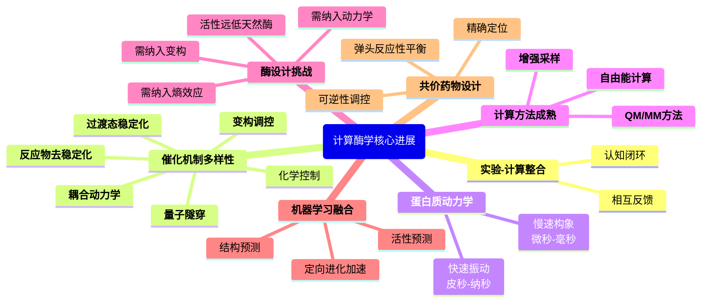

---

## 背景

酶作为生物催化剂，能够将反应速率提升**百万倍以上**，同时表现出极高的底物选择性，并通过多种机制实现精准调控。这种卓越的催化能力源于酶在漫长进化过程中对化学反应和蛋白质动力学的精细优化。理解酶的催化机制不仅是基础生物化学的核心问题，更是生物技术和医药研发的关键基础。

传统上，酶催化理论主要基于Pauling在1946年提出的**过渡态稳定化**概念：酶通过优化活性位点与过渡态的相互作用来降低反应能垒。然而，近几十年的研究表明，**酶催化是一个多维度、多层次的复杂过程**，涉及多种协同作用的机制。

随着计算能力的飞速提升和理论方法的不断完善，**计算酶学**（computational enzymology）已从早期的简单模型发展为能够精确描述酶催化全过程的系统性研究范式。当前，计算模拟不仅能够揭示化学反应的原子级细节，还能探索蛋白质在多个时间尺度上的动力学行为、变构调控网络，甚至指导全新酶的从头设计和共价药物的理性开发。

### 关键科学问题

- **机制复杂性**：如何系统性地理解酶催化中多种机制（静电作用、动力学、熵效应、变构等）的协同作用？
- **多尺度挑战**：如何在合理的计算成本下准确模拟从电子转移（飞秒）到构象变化（毫秒）跨越多个时间尺度的酶功能过程？
- **构象子态**：酶存在多个相似构象状态，每个状态具有不同的催化活性，如何全面表征这些子态及其对整体催化速率的贡献？
- **变构调控**：如何理解远离活性位点的结构改变或配体结合如何通过**构象驱动**或**熵驱动**机制远程调控催化活性？
- **理性设计**：如何将机制洞察转化为设计原则，创造具有天然酶活性水平的人工酶或开发高选择性的共价抑制剂？
- **实验整合**：如何建立计算与实验（动力学、NMR、X射线、冷冻电镜、单分子等）的有机融合框架，形成相互验证和互补的研究闭环？

---

## 研究内容

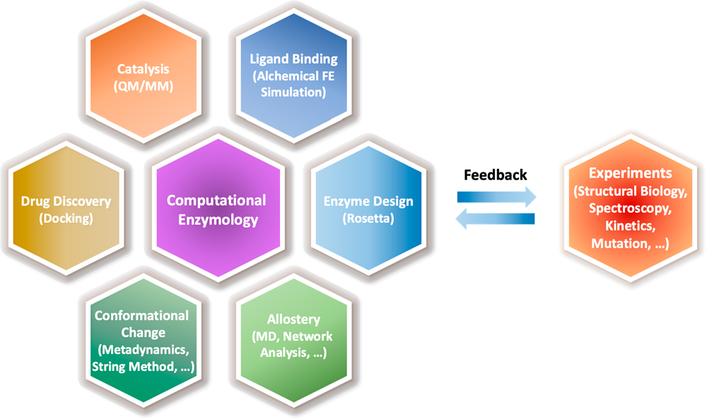

**图1：计算酶学研究的主题图谱**

本综述涵盖的核心主题及其相互关系，中心为计算酶学，周围六大模块展示了该领域的主要研究方向，外围标注了实验与计算间的双向反馈机制。

### 1. 建模复杂酶催化机制的方法学基础

#### 核心计算方法

**量子力学/分子力学方法**（QM/MM）是当前研究酶催化机制的标准工具。该方法将体系划分为两个区域：
- **QM区**：包含发生化学键断裂/形成的活性位点，用量子化学方法（DFT、半经验、从头算）处理
- **MM区**：包含蛋白质主体和溶剂环境，用分子力场描述

这种分层策略在保持化学精度的同时大幅降低了计算成本，使得含数万原子的酶体系模拟成为可能。

**自由能计算技术**是获得催化反应能垒的关键：
- **伞形采样 + WHAM/MBAR分析**（Umbrella Sampling）：沿反应坐标施加偏置势，后处理获得自由能曲线
- **元动力学**（Metadynamics）：通过在已访问区域添加排斥势（高斯型偏置势）驱动体系探索罕见事件
- **弦方法**（String Methods）：优化连接反应物和产物的最小自由能路径
- **变分自由能微扰和DHAM**（vFEP）：结合多个哈密顿量的信息提高采样效率

**过渡态理论**（TST）用于从自由能垒计算反应速率：

$$
k = \frac{k_B T}{h} e^{-\Delta G^{\ddagger}/RT}
$$

其中，$\Delta G^{\ddagger}$ 是自由能垒，$k_B$ 是玻尔兹曼常数，$h$ 是普朗克常数。

#### 多步反应的挑战

实验测得的 $k_{\text{cat}}$ 是**集体速率常数**，无法直接对应单一微观步骤。对于多步反应：

$$
E + S \rightleftharpoons ES \rightarrow E\text{-}TS_1 \rightarrow EI \rightarrow E\text{-}TS_2 \rightarrow EP \rightarrow E + P
$$

需要计算每个步骤的能垒，才能确定**速率决定步骤**（rate-determining step）。然而，计算成本随反应复杂度急剧增加，且需要准确描述中间体的质子化状态、水分子的进出及构象重排等。

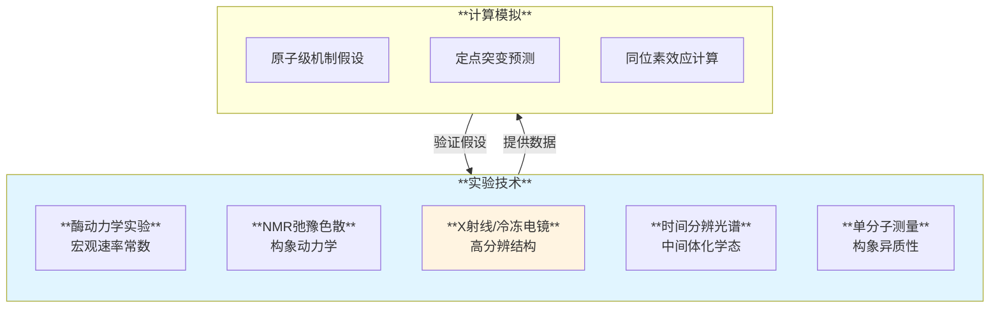

**实验-计算整合**形成假设-验证-修正的迭代循环，两者相互反馈、互补验证。

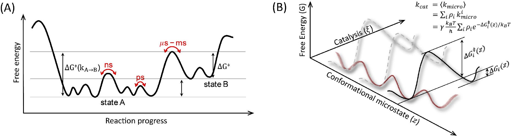

**图2：酶催化中蛋白质运动的层级结构**

- **(A) 自由能景观**：展示蛋白质在不同时间尺度上的运动层级。反应物态A包含多个构象子态（绿色），通过快速子态交换（皮秒-纳秒）和慢速催化反应（微秒-毫秒）转化为产物态B
- **(B) 三维自由能表面**：从构象子态的角度理解酶催化。不同构象状态（z坐标）具有不同的催化能垒 $\Delta G^{\ddagger}(z)$，总体催化速率为各子态速率的群体加权和：$k_{\text{cat}} = \sum \rho_i k_{\text{micro},i}$

### 2. 功能性蛋白质运动的层级结构

酶的动力学行为跨越从**飞秒到秒**的巨大时间尺度，不同尺度的运动对催化具有不同的功能意义。

#### 快速运动（皮秒-纳秒）

- **键振动和弯曲**：碳-氢键伸缩（~10 fs）、角度振动（~100 fs）
- **活性位点侧链重排**：催化残基的微调优化过渡态几何
- **贡献机制**：
  - **熵效应**：限制性振动模式的冻结降低熵，有利于过渡态稳定
  - **几何优化**：快速调整使反应中心达到近攻击构象（NAC）
  - **量子隧穿**：氢原子/质子转移中的隧穿概率受振动模式调控

**计算方法**：标准分子动力学模拟（MD）即可探索纳秒时间尺度，从轨迹中提取振动频率、相关函数和构象分布。

#### 慢速运动（微秒-毫秒）

- **大尺度集体运动**：结构域开合、loop环移动、螺旋重排
- **功能意义**：
  - **配体结合/释放**：开放构象允许底物进入，闭合构象形成催化活性构象
  - **变构激活**：远程位点的信号通过构象传播影响活性位点
  - **构象子态交换**：在多个相似构象间转换，每个子态具有不同活性

**计算挑战**：直接MD模拟难以达到毫秒尺度，需要增强采样技术：
- **长时程MD**：利用GPU加速或专用硬件（Anton）达到微秒-毫秒
- **弦方法**：直接优化连接两个构象态的最小自由能路径
- **元动力学**：通过集体变量（如RMSD、接触数、扭转角）加速采样
- **马尔可夫状态模型**（MSM）：从大量短轨迹中构建状态转移概率矩阵

**特殊挑战：质子化状态变化**

许多构象变化伴随质子化状态改变（如组氨酸的质子化/去质子化），需要**恒pH分子动力学方法**（constant-pH MD），在模拟过程中动态调整残基质子化状态。

#### 配体结合机制模型

**诱导契合模型**（Induced-Fit）：
- 酶首先以开放构象结合底物
- 底物结合诱导酶向闭合构象转变
- 形成催化活性的ES复合物

**构象选择模型**（Conformational Selection）：
- 酶在平衡态下存在开放/闭合构象预平衡
- 底物选择性结合到合适的构象（通常是闭合态）
- 结合使平衡向该构象偏移

**真实情况：大多数酶表现出更复杂的行为，结合了两种机制**。例如，腺苷酸激酶（adenylate kinase）的开合速率在游离酶和结合态酶中不同，表明存在构象耦合。

### 3. 构象子态及其对催化的影响

#### 构象子态的概念

酶并非存在于单一的刚性结构，而是处于多个相似构象的动态平衡中（图2B）。这些构象子态在结构上微小差异（通常RMSD < 2 Å），但在催化活性上可能显著不同。

**实验证据**：单分子酶学研究（如β-半乳糖苷酶）观察到**连续催化事件之间的等待时间存在很大变异性**，这种变化不能仅用底物扩散解释，而是表明酶在不同构象子态间跳跃，每个子态有不同的催化速率。

#### 群体加权速率模型

总体催化速率是各构象子态速率的**群体加权平均**：

$$
k_{\text{cat}} = \sum_{i} \rho_i k_{\text{micro},i}
$$

其中：
- $\rho_i$ 是构象子态 $i$ 的群体占比（$\sum \rho_i = 1$）
- $k_{\text{micro},i}$ 是子态 $i$ 的微观催化速率

这意味着：
- 即使单个子态活性低，如果群体占比高仍可贡献显著的整体速率
- 突变或配体结合可通过**改变子态分布** $\rho_i$ 或**改变单个子态活性** $k_{\text{micro},i}$ 来调控整体催化

#### 铰链运动与几何调控

铰链运动（hinge motions）是指**结构域间通过铰链区域连接处的开合运动**（如腺苷酸激酶的两个结构域）。这种低频运动可以调节反应中心几何，影响：
- 底物与催化残基的相对取向（最优 ↔ 次优）
- 过渡态的几何优化程度
- 亲核进攻角度和距离

**QM/MM模拟策略**：在反应坐标模拟中加入**构象坐标约束**，系统探索不同构象子态下的催化能垒 $\Delta G^{\ddagger}(z)$，直接揭示构象-活性关系。

### 4. 变构调控的双重机制

**变构效应**（allostery）是指远离活性位点的扰动（如配体结合、翻译后修饰）通过长程通讯改变酶活性的现象。变构调控可通过两种非互斥的机制实现。

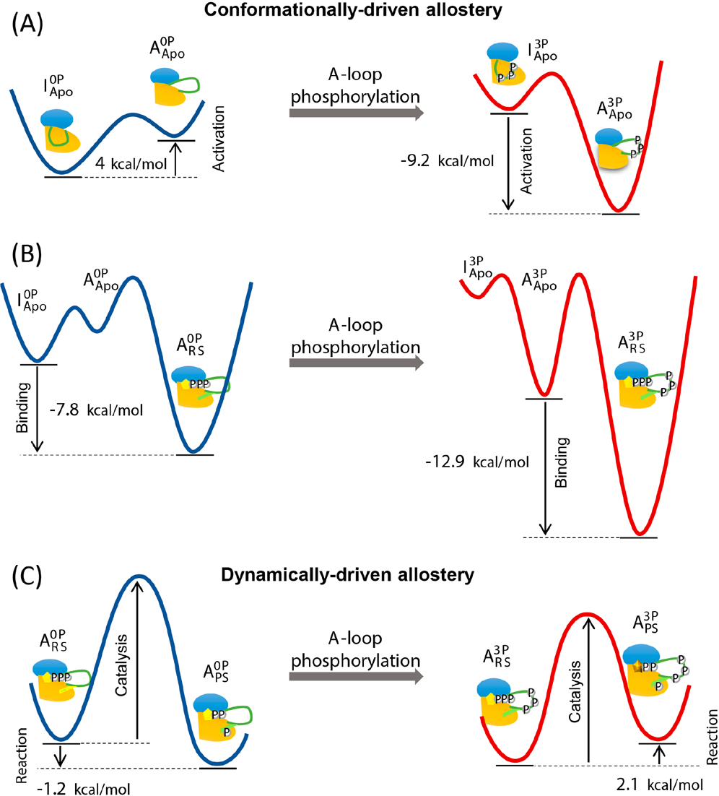

**图3：胰岛素样生长因子1受体激酶（IGF-1RK）的变构调控机制**

以蛋白激酶为例展示两种变构机制的共存：
- **(A) 构象驱动变构**：激活环（A-loop）磷酸化使构象平衡从非活性态（蓝线）向活性态（红线）偏移约9.2 kcal/mol，限制了非活性构象的访问
- **(B) 底物结合亲和力变化**：磷酸化降低了底物ATP结合的自由能垒（12.9 → 7.8 kcal/mol），增强结合亲和力
- **(C) 动力学驱动变构**：磷酸化通过改变蛋白质协同运动降低磷酰基转移反应的能垒（2.4 → 2.1 kcal/mol），尽管结构变化微小

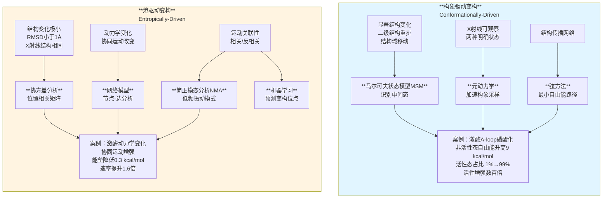

#### 两种机制的协同

**IGF-1RK案例**展示了两种机制如何在同一蛋白质中共存：
- **构象变构**：改变构象平衡（9.2 kcal/mol）→ 最大效应
- **底物结合**：增强ATP亲和力（5.1 kcal/mol）→ 中等效应
- **动力学变构**：降低化学反应能垒（0.3 kcal/mol）→ 微调效应

总效应是三者的**协同组合**，实现精密的多层级调控。

#### 变构效应的远程传递

**F1-ATPase** 是变构长程通讯的经典例子：
- 三个活性位点相距 >50 Å
- 表现出**负协同性**：一个位点结合ATP抑制其他位点
- 通过360°旋转运动实现三个位点的循环激活

### 5. 从头酶设计与定向进化

计算酶建模已从**理解**天然酶转向**创造**全新催化剂。从头酶设计（de novo enzyme design）旨在为非天然反应设计具有天然酶活性的人工酶。

#### 设计流程

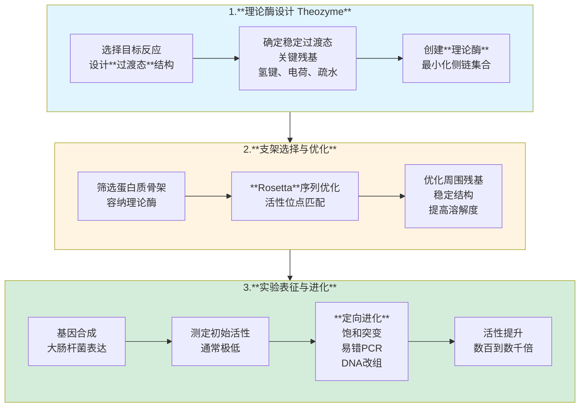

#### 成功案例

已成功设计的酶包括：
- **Kemp消除酶**：催化非天然的Kemp消除反应
- **逆醛缩酶**：催化逆向的醛缩反应
- **Diels-Alderase**：催化Diels-Alder环加成反应
- **酯酶和荧光素酶变体**：改造自然酶实现新功能
- **PET水解酶**：分解聚对苯二甲酸乙二醇酯塑料

#### 设计挑战与差距

尽管取得重要进展，**设计酶的活性仍比天然酶低10³-10⁶倍**。主要原因包括：

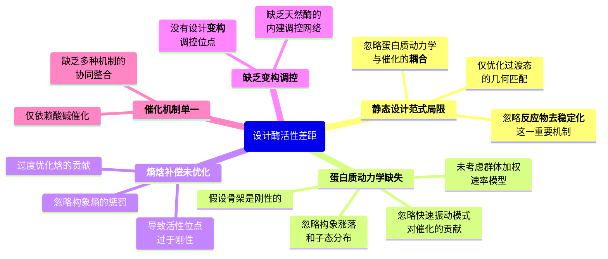

#### 机器学习辅助设计

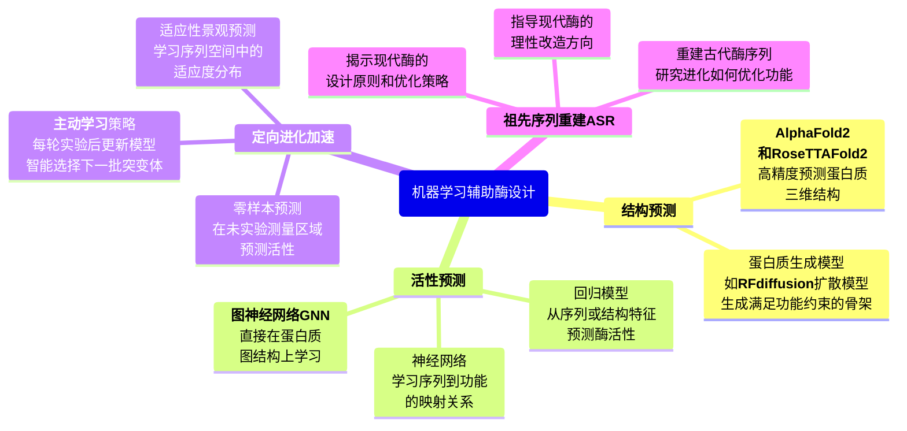

### 6. 共价药物设计的计算策略

共价抑制剂通过与靶酶形成**共价键**实现长效抑制，近年来在药物开发中复兴，成功案例包括：
- **Remdesivir** 和 **Nirmatrelvir**（Paxlovid）：COVID-19治疗药物
- **Sotorasib**：首个获批的KRAS G12C共价抑制剂

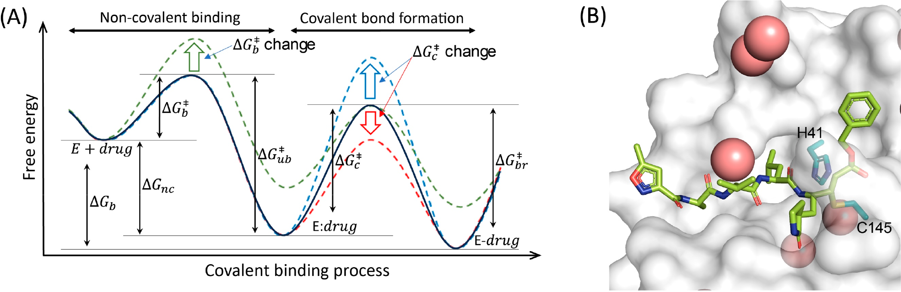

**图4：共价药物的双步结合机制**

- **(A) 自由能图**：共价配体结合分为两步。第一步是非共价结合（自由能垒 $\Delta G_b^{\ddagger}$），第二步是共价键形成（自由能垒 $\Delta G_c^{\ddagger}$）。关键是平衡弹头反应性：$\Delta G_c^{\ddagger}$ 必须足够低以发生反应，但不能过低导致非特异性结合
- **(B) SARS-CoV-2主蛋白酶（Mpro）与N3抑制剂的复合物结构**（PDB: 7BQY）。深青色显示催化二联体Cys145-His41，黄色是结合的N3配体，粉色是水分子，灰色是蛋白质表面。共价药物设计需要确保弹头（如Michael受体）正确定位于亲核残基（Cys145）附近

#### 共价结合的双步机制

类似于Michaelis-Menten机制，共价抑制剂结合分为两步：

$$
E + \text{药物} \xrightarrow{\Delta G_b^{\ddagger}} E:\text{药物（非共价）} \xrightarrow{\Delta G_c^{\ddagger}} E\text{-药物（共价）}
$$

**第一步：非共价结合**
- 由氢键、疏水作用、静电相互作用驱动
- 能垒 $\Delta G_b^{\ddagger}$ 决定初始识别和结合亲和力

**第二步：共价键形成**
- 弹头基团（warhead）与靶残基（通常是半胱氨酸）反应
- 能垒 $\Delta G_c^{\ddagger}$ 决定反应速率和可逆性

#### 设计关键考量

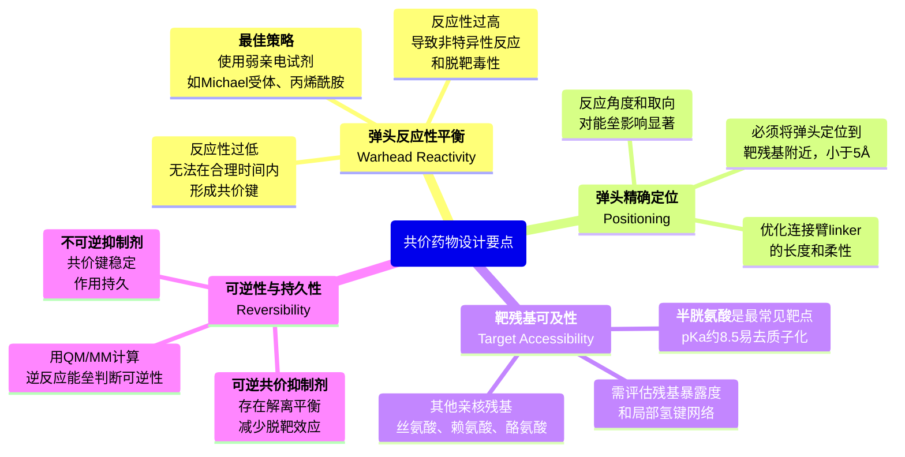

#### 计算方法在共价药物设计中的应用

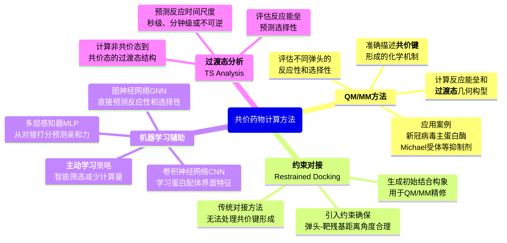

#### 共价药物设计的成功范式

**SARS-CoV-2 Mpro抑制剂开发**：
- **结构导向**：利用高分辨率晶体结构（如PDB: 7BQY）
- **弹头筛选**：测试Michael受体、醛类、酮酰胺等多种弹头
- **QM/MM优化**：计算不同抑制剂的反应机制和能垒
- **结构-活性关系**：系统优化P1-P4位点的侧链，提高选择性
- **临床成功**：Nirmatrelvir（Paxlovid）成为首个口服COVID-19特效药

---

## Q&A

- **Q1**：为什么设计酶的活性远低于天然酶？主要瓶颈是什么？
- **A1**：当前设计酶活性比天然酶低10³-10⁶倍，主要原因包括：静态设计范式仅优化过渡态几何，忽略蛋白质动力学；缺乏反应物去稳定化机制；熵-焓补偿未优化；单一催化机制而非多重机制协同；缺乏天然酶的变构调控网络

- **Q2**：构象驱动和熵驱动变构可以通过哪些实验技术区分？
- **A2**：X射线晶体学可区分明显的结构差异（构象驱动）；NMR弛豫色散探测动力学变化；氢氘交换质谱检测溶剂可及性；单分子FRET实时观察构象分布；计算协方差分析验证相关矩阵变化

- **Q3**：共价药物如何避免脱靶毒性？计算能提供什么帮助？
- **A3**：使用弱亲电试剂平衡反应性；优化非共价结合特异性；选择靶蛋白特有的暴露残基；设计可逆共价键降低累积毒性。计算可通过QM/MM预测选择性，对接评估脱靶亲和力，机器学习预测ADMET性质

## 关键结论与批判性总结

### 主要贡献

- 系统整合了酶催化机制、蛋白质动力学、变构调控、从头设计和药物开发等多个子领域，构建了完整的计算酶学知识框架
- 超越传统过渡态稳定化理论，深入讨论反应物去稳定化、耦合动力学、量子隧穿等多重催化机制的协同作用
- 详细介绍了QM/MM、自由能计算、增强采样、变构分析等核心计算方法及其适用场景
- 明确指出计算酶学在酶工程、合成生物学和药物发现中的关键作用和未来发展方向

### 存在的局限性

- 精确的QM/MM自由能计算对复杂多步反应仍然昂贵，限制了大规模应用
- 毫秒尺度构象变化和罕见事件采样仍是挑战
- MM力场参数对QM/MM结果有显著影响，特殊残基参数化仍不完善
- 多步反应中的质子化状态变化处理复杂
- 从头设计的酶活性仍远低于天然酶，**机制洞察到设计原则的转化是开放问题**

### 未来研究方向

- 开发统一的多尺度整合框架，连接电子结构到细胞尺度
- 将时间分辨实验技术（XFEL、冷冻电镜）与实时模拟结合
- 系统表征所有催化相关的构象子态及其对整体速率的贡献
- 将物理约束嵌入机器学习模型，提高预测可靠性
- 开发靶向变构位点的调控分子，超越活性位点抑制
- 将祖先序列重建的进化原则系统应用于现代酶改造
