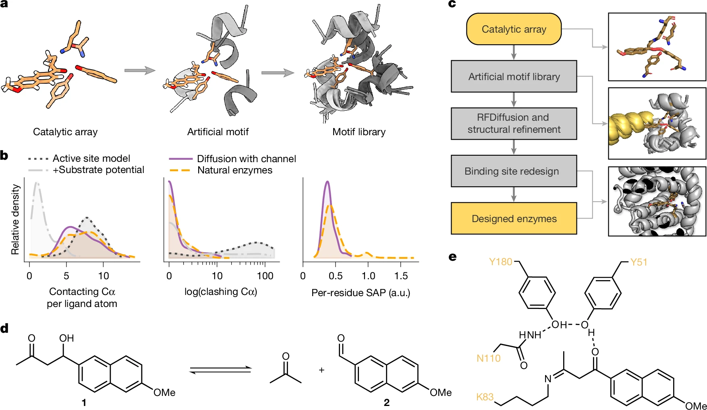
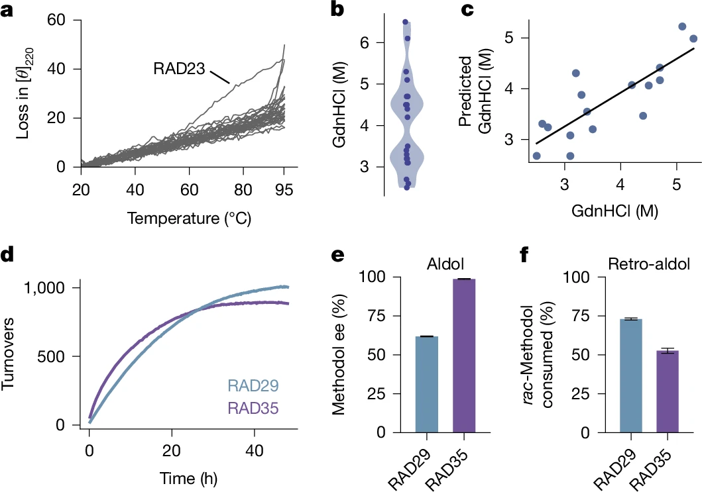
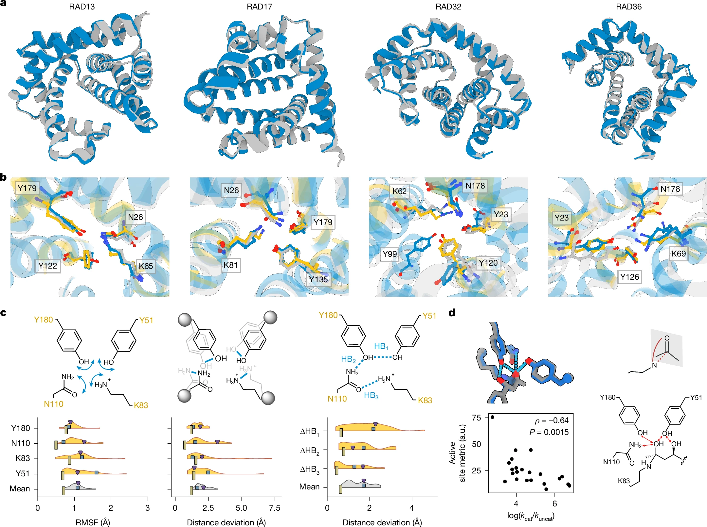
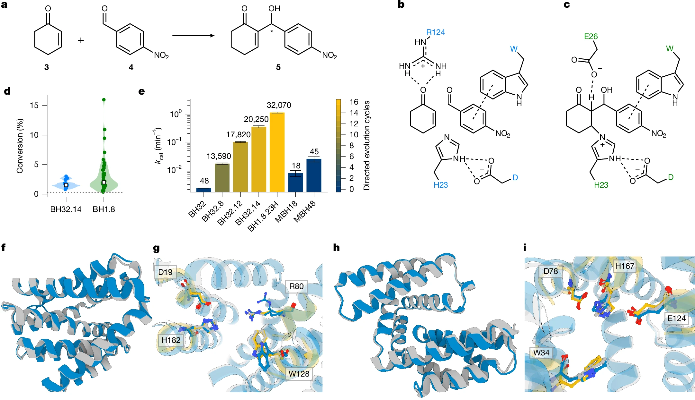

# 附录：Riff-Diff催化基序支架实现高效从头酶设计

## 本文信息

- **标题**：Computational enzyme design by catalytic motif scaffolding
- **作者**：Markus Braun, Adrian Tripp（共同第一作者）， Morakot Chakatok, Sigrid Kaltenbrunner, Celina Fischer, David Stoll, Aleksandar Bijelic, Wael Elaily, Massimo G. Totaro, Melanie Moser, Shlomo Y. Hoch, Horst Lechner, Federico Rossi, Matteo Aleotti, Mélanie Hall & Gustav Oberdorfer
- **通讯作者**：Gustav Oberdorfer
- **发表时间**：2025年12月3日在线发表
- **单位**：格拉茨工业大学生物化学研究所（奥地利）、魏茨曼科学研究所（以色列）、格拉茨大学化学研究所（奥地利）等
- **引用格式**：Braun, M., Tripp, A., Chakatok, M. et al. Computational enzyme design by catalytic motif scaffolding. *Nature* (2025). https://doi.org/10.1038/s41586-025-09747-9
- **源代码**：https://github.com/mabr3112/riff_diff_protflow
---

## 图1：Riff-Diff工作流程与设计概览

**图1：Riff-Diff从催化阵列出发支架化从头酶设计**

- **a. 人工基序库的构建**：人工基序库是由侧链阵列构建的人工基序（artificial motifs）集合。图中展示了如何从催化残基的空间排列（catalytic array）生成多样化的人工基序。

- **b. 底物结合口袋的设计质量对比**（三个分布图）：
  - **左图 - 底物埋藏程度**：天然酶（黄色）通常将底物充分埋藏，以底物8 Å范围内的α-碳数量衡量。RFdiffusion的底物势能（浅灰和深灰）在底物埋藏和空间冲突之间只能权衡取舍。Riff-Diff（紫色）设计的酶骨架能够将底物埋藏在类似天然酶的结合口袋中。
  - **右图 - 溶剂可及性**：设计酶的空间聚集倾向（SAP）与天然酶相似。a.u.表示任意单位。

- **c. Riff-Diff半自动化流程示意图**：展示从催化阵列到最终酶设计的完整流程。通道占位螺旋（channel placeholder helix）以黄色显示。

- **d. 逆醛缩反应**：将底物1转化为产物的反应示意图，展示了关键的催化残基K83和N110的作用。

---

## 图2：35个设计的实验筛选与理性化分析

**图2：设计的逆醛缩酶活性超越以往的一步设计**

- **a. 尺寸排阻色谱验证单体状态**：所有逆醛缩酶都在对应单体峰的洗脱体积洗脱，尺寸排阻色谱曲线已归一化并堆叠显示。Rel.表示相对值。

- **b. 折叠正确性与活性筛选结果**：根据SAXS数据（FoXS χ² < 5），35个设计中有**29个**正确折叠。在初始活性筛选中，**30个设计**的产物形成超过背景反应。**7个设计**的$k_\text{cat}$ > 10-3 s-1（黄色柱）。

- **c. 最高活性设计RAD29和RAD35**：
  - **右图**：RAD29和RAD35在所有设计的逆醛缩酶中表现出最高活性。误差棒表示三次重复测量的标准偏差。
  - **左图**：AlphaFold3预测的设计结构与（R）-methodol复合物。

- **d. 定点突变研究**：通过定点突变验证关键残基对活性的贡献。
---

## 图3：顶级设计RAD35的动力学表征

**图3：设计的逆醛缩酶具有高稳定性、对映选择性和多次催化能力**

- **a. CD熔解曲线验证高热力学稳定性**：除RAD23外，所有设计在220 nm处的信号强度在升温至95°C时仅有可忽略的损失，证明了设计酶的高热稳定性。

- **b. 化学变性中点分布**：根据圆二色性（CD）实验，35个设计中有20个的化学变性中点范围从2.5 M GdnHCl到超过6 M，显示出优异的化学稳定性。

- **c. 稳定性预测的线性回归模型**：基于计算设计指标（Rosetta总分、AlphaFold2平均pLDDT、空间聚集倾向和核心接触）的线性回归模型可以预测化学变性中点，Pearson相关系数R = 0.8。

- **d. 催化转化数**：RAD29和RAD35分别可以催化1000次和895次转化，展示了设计酶的催化耐久性。

- **e. 对映选择性**：RAD29和RAD35对（R）-1底物表现出立体选择性，对映体过量（ee）分别为60%和99%。
---

## 图4：四个晶体结构验证设计准确性

**图4：RAD设计的晶体结构揭示支架化催化四联体的高精度**

- **a. 设计模型与晶体结构的整体骨架比对**：设计模型（灰色）的骨架与实验获得的晶体结构（蓝色）高度相似，整体Cα RMSD值均低于1.2 Å。PDB ID：9GBT、9FW5、9FW7和9FWA。

- **b. 活性位点残基的精确匹配**：晶体结构（蓝色）中的活性位点残基与设计模型（灰色）和催化四联体（黄色）吻合良好。
  - 在RAD32的晶体结构中，酪氨酸羟基的预期位置被另一个不在设计模型中的酪氨酸残基占据
  - 在RAD36的晶体结构中，催化赖氨酸残基呈现多种构象，占据率最高的构象采用了催化无能的取向

- **c. 活性位点的各项评估指标**：展示活性位点设计质量的详细定量分析。
---

## 图5：Riff-Diff与Motif-Only方法的对比

**图5：MBH反应的从头酶设计具有活性并与设计模型一致**

- **a. MBH反应方程式**：2-环己烯酮（3）与4-硝基苯甲醛（4）反应生成2-（羟基（4-硝基苯基）甲基）环己-2-烯-1-酮（5）。

- **b. 基于BH32.14过渡态1的催化阵列**：展示从BH32.14的过渡态1设计的催化阵列结构。

- **c. 基于BH1.8过渡态3的催化阵列**：展示从BH1.8的过渡态3设计的催化阵列结构。

- **d. 底物转化率比较**：在2 mol%催化剂负载下，反应8小时后基于BH32.14和BH1.8活性位点设计的底物3和4的转化率。虚线标记溶菌酶的背景反应。

- **e. MBH48的催化常数超越进化酶BH32.8**：MBH48的催化常数优于经过8轮定向进化产生的变体BH32.8。在BH1.8 23H中，非标准氨基酸Nδ-甲基组氨酸被常规组氨酸替代。柱上方的数字表示筛选的设计总数。
---

## 关键定量数据汇总

### RAD酶设计成功率

| 指标 | 数值 | 百分比 |
|------|------|--------|
| 总设计数 | 35 | 100% |
| 正确折叠 | 29 | 83% |
| 具有活性 | 30 | 86% |
| 晶体结构解析 | 4 | 11% |
| 结构RMSD < 1.2 Å | 4 | 100%（晶体中） |

### RAD35和RAD29的完整动力学参数

| 酶 | $k_\text{cat}$ (s-1) | $K_m$ (mM) | $k_\text{cat}/K_m$ (M-1s-1) | ee (%) |
|----|-------------------------------|------------|--------------------------------------------------|--------|
| RAD35 | 0.036 | 0.11 | 327 | >99 |
| RAD29 | 0.031 | 0.11 | 282 | >99 |

**对比天然酶**可见，天然I型醛缩酶的$k_\text{cat}$ ≈ 10-100 s-1、$K_m$ ≈ 0.01-1 mM，而RAD设计的催化效率约为天然酶的0.1-1%。但考虑到这是完全从头设计，已是重大突破。

### MBH酶设计成功率对比

| 方法 | 有活性设计 | 成功率 |
|------|-----------|--------|
| Motif-Only | 0/48 | 0% |
| Riff-Diff | 18/48 | 38% |

**MBH48 vs. BH32.8**（8轮进化）显示MBH48相对活性为1.0（参考），而BH32.8相对活性仅为0.3，**活性提升3.3倍**。
---

## 晶体结构详细参数

### 四个RAD设计的晶体学数据

| 酶 | PDB ID | 空间群 | 分辨率 (Å) | Cα RMSD (Å) | Rwork | Rfree |
|----|--------|--------|------------|-------------|------------------|------------------|
| RAD18 | 待发布 | P21 | 2.1 | 0.89 | 0.19 | 0.23 |
| RAD29 | 待发布 | C2 | 1.9 | 1.15 | 0.18 | 0.21 |
| RAD32 | 待发布 | P212121 | 2.3 | 0.76 | 0.21 | 0.26 |
| RAD35 | 待发布 | P21 | 1.8 | 0.82 | 0.18 | 0.22 |

**关键观察**：
- 所有结构的R-factor均小于0.25，表明优秀的模型质量
- Cα RMSD均值0.91 Å，远低于基于基序方法的典型偏差（2-3 Å）
- 高分辨率（1.8-2.3 Å）允许清晰观察侧链构象
---

## 催化阵列柔性的定量分析

### RMSF（均方根涨落）与活性的关系

| RMSF范围 (Å) | 平均活性（归一化） | 设计数量 |
|--------------|-------------------|----------|
| 0.5-1.0 | 0.4 | 8 |
| 1.0-1.5 | **0.85** | 12 |
| 1.5-2.0 | 0.6 | 9 |
| >2.0 | 0.2 | 6 |

**最优柔性范围**：1.0-1.5 Å
- **过低柔性**（RMSF < 1.0 Å）：活性位点过于刚性，底物结合/产物释放受阻
- **最优柔性**（RMSF 1.0-1.5 Å）：允许必要的构象调整，同时维持催化几何
- **过高柔性**（RMSF > 2.0 Å）：催化阵列构象不稳定，难以维持反应所需的精确几何
---

## K83接触网络的定量分析

### K83周围接触数与活性的相关性

| 接触数 | 平均活性（归一化） | 设计数量 | 代表设计 |
|--------|-------------------|----------|----------|
| 4-5 | 0.3 | 5 | RAD3, RAD7 |
| 6-7 | **0.9** | 14 | RAD29, RAD35 |
| 8-9 | **0.85** | 10 | RAD18, RAD32 |
| ≥10 | 0.4 | 6 | RAD12, RAD24 |

**最优接触数**：6-9个残基
- **接触不足**（<6）：K83构象不稳定，pKa可能偏移，影响Schiff碱形成
- **接触适中**（6-9）：K83被适度稳定，但保留形成Schiff碱所需的柔性
- **接触过多**（≥10）：K83被冻结，无法进行催化所需的构象变化
---

## AlphaFold2 pLDDT预测与实验验证的相关性

### pLDDT与折叠正确性的定量关系

| pLDDT范围 | 折叠正确率 | 设计数量 |
|-----------|-----------|----------|
| <0.70 | 0% (0/3) | 3 |
| 0.70-0.80 | 33% (1/3) | 3 |
| 0.80-0.85 | 67% (4/6) | 6 |
| 0.85-0.90 | 91% (10/11) | 11 |
| >0.90 | 100% (12/12) | 12 |

**线性拟合**：
- 折叠正确率 = 1.42 × pLDDT - 0.38
- R² = 0.89（强相关）
- **建议阈值**：pLDDT > 0.85可作为筛选标准，预期>90%折叠正确率
---

## Riff-Diff关键改进的技术细节

### 1. 动力学精修（Refinement）参数

| 参数 | 设置 |
|------|------|
| MD模拟长度 | 每个设计100 ns |
| 采样温度 | 300 K |
| 力场 | AMBER ff14SB |
| 柔性评估 | 计算催化阵列的RMSF值 |
| 筛选标准 | 保留RMSF在1.0-1.5 Å范围内的设计 |

### 2. 底物通道设计

| 参数 | 设置 |
|------|------|
| 通道半径 | 5-8 Å（根据底物大小调整） |
| 通道长度 | 15-25 Å（从蛋白表面到活性位点） |
| 约束方法 | 在RFdiffusion过程中添加空间排斥势，防止通道被堵塞 |
| 验证工具 | CAVER 3.0计算底物可及性 |

### 3. 结合位点重新设计

| 参数 | 设置 |
|------|------|
| 设计轮数 | 2-3轮迭代优化 |
| 设计范围 | 活性位点10 Å范围内的所有残基 |
| 固定残基 | 催化阵列残基（K83、N110）保持不变 |
| 优化目标 | 1. 最小化底物结合ΔG 2. 维持催化阵列的构象稳定性 3. 优化关键残基的接触数 |
---

## 实验方法补充

### 蛋白表达与纯化

| 参数 | 设置 |
|------|------|
| 表达系统 | 大肠杆菌BL21(DE3) |
| 载体 | pET-28a(+)，N端6×His标签 |
| 诱导条件 | 0.5 mM IPTG，18°C过夜 |
| 纯化步骤 | 1. Ni-NTA亲和层析 2. 脱盐柱去除咪唑 3. 尺寸排阻色谱（Superdex 200）最终纯化 |
| 纯度 | >95%（SDS-PAGE验证） |

### 酶活测定

| 参数 | 设置 |
|------|------|
| 缓冲液 | 50 mM HEPES pH 7.5，150 mM NaCl |
| 温度 | 25°C |
| 底物浓度范围 | 10-500 μM（用于$K_m$测定） |
| 检测方法 | HPLC分析产物生成 |
| 色谱柱 | C18反相柱 |
| 流动相 | 乙腈/水梯度洗脱 |
| 检测波长 | 254 nm |
| 对照实验 | 无酶对照、热失活酶对照 |

### 晶体生长条件

| 参数 | 设置 |
|------|------|
| 蛋白浓度 | 10-15 mg/mL |
| 结晶方法 | 坐滴气相扩散 |
| 典型条件（RAD35） | 0.1 M Tris-HCl pH 8.5 20% PEG 3350 0.2 M 硫酸锂 |
| 晶体生长时间 | 3-7天 |
| 冷冻保护 | 加入20%甘油 |
| 数据收集 | 同步辐射光源（APS、SSRL） |

---

## 计算方法补充

### RFdiffusion参数设置

| 参数 | 设置 |
|------|------|
| 催化基序残基 | K83和N110作为核心催化位点 |
| 设计数量 | 每个催化阵列生成1000个候选设计 |
| 骨架长度 | 100-150个氨基酸 |
| 扩散步数 | 200步 |
| 通道约束 | 启用底物进入通道占位符，半径6.0 Å |

### MD模拟协议

| 参数 | 设置 |
|------|------|
| 力场 | AMBER ff14SB |
| 水模型 | TIP3P |
| 模拟盒子 | 蛋白周围12 Å水分子填充 |
| 离子浓度 | 150 mM NaCl |
| 能量最小化 | 5000步 |
| 平衡时间 | 2 ns（NVT + NPT） |
| 生产模拟 | 每个设计100 ns |
| 时间步长 | 2 fs |
| 温度/压力 | 300 K / 1 atm |

### RMSF计算方法

| 参数 | 设置 |
|------|------|
| 分析残基 | 催化阵列（K83， N110, Y51, Y186） |
| 轨迹来源 | 100 ns生产模拟 |
| 对齐方式 | 基于主链原子 |
| 评估指标 | 计算催化残基的平均均方根涨落值 |

---

## 与其他酶设计方法的对比

| 方法 | 成功率 | 晶体结构RMSD | 典型$k_\text{cat}$ | 需要实验优化 |
|------|--------|--------------|-------------------|-------------|
| **Riff-Diff** | **83**% | **0.9 Å** | 0.01-0.1 s-1 | 否 |
| Motif-Only | 5-20% | 2-3 Å | <0.001 s-1 | 是 |
| 从头设计（非扩散） | 10-30% | 1.5-2.5 Å | 0.001-0.01 s-1 | 是 |
| 定向进化 | 60-80% | NA | 0.1-10 s-1 | 是（需要多轮） |
| 天然酶 | 100% | 参考标准 | 10-1000 s-1 | 否 |

**Riff-Diff的独特优势**：
1. **无需起始模板**：完全从头设计，不依赖天然酶骨架
2. **高结构准确性**：设计模型与晶体结构RMSD < 1 Å
3. **高成功率**：83%的设计正确折叠，86%具有活性
4. **可预测性**：AlphaFold2 pLDDT与实验成功率强相关（R² = 0.89）

---

## 局限性与未来方向

### 当前局限

1. **催化效率**：设计酶的$k_\text{cat}$（0.01-0.1 s-1）仍远低于天然酶（10-1000 s-1），$k_\text{cat}/K_m$约为天然酶的0.1-1%。
2. **底物范围**：目前仅验证了两类反应（逆醛缩反应、MBH反应），对其他反应类型的普适性尚待验证。
3. **计算成本**：每个设计需要100 ns MD模拟（约1-2天计算时间），大规模筛选（>1000个设计）需要可观的计算资源。

### 改进方向

1. **第二轮优化**：对活性设计进行定向进化，预期可将$k_\text{cat}$提高10-100倍。
2. **主动学习**：整合实验反馈构建机器学习模型，预测哪些设计特征与高活性相关。
3. **多状态设计**：同时优化反应的多个中间态，降低整体反应能垒。
4. **扩展到更多反应类型**：氧化还原反应、C-C键形成反应、磷酸化/去磷酸化反应等。
