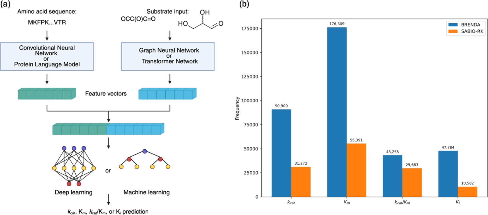
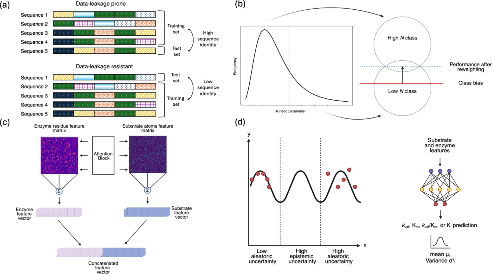
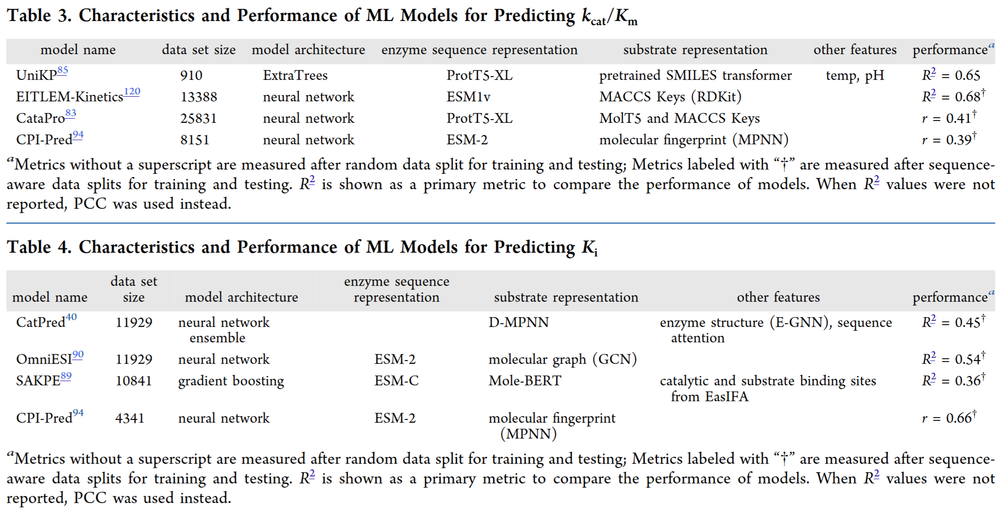
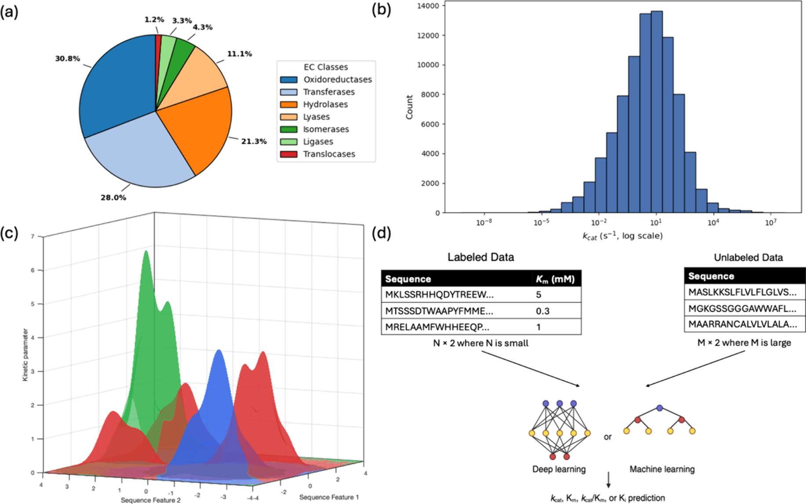

# 机器学习如何预测酶的催化能力：从数据到应用的系统综述

## 本文信息

- **标题**：Advances in Machine Learning Models for Predicting Enzyme Kinetic Parameters
- **作者**：Ali Malli, Denys Vasyutyn, Jin Ryoun Kim
- **发表时间**：2025年12月2日接收
- **单位**：New York University, Department of Chemical and Biomolecular Engineering, Brooklyn, New York, United States
- **引用格式**：Malli, A., Vasyutyn, D., & Kim, J. R. (2025). Advances in Machine Learning Models for Predicting Enzyme Kinetic Parameters. *Journal of Chemical Information and Modeling*. https://doi.org/10.1021/acs.jcim.5c02428

## 摘要

> 酶动力学参数，包括**催化常数**（$k_{\mathrm{cat}}$）、**米氏常数**（$K_{\mathrm{m}}$）、**催化效率**（$k_{\mathrm{cat}}/K_{\mathrm{m}}$）以及**抑制常数**（$K_{\mathrm{i}}$），对于**指导酶工程、代谢建模和合成生物学**应用至关重要。这些参数提供了关于酶在不同条件下活性的定量信息。然而，实验测定这些参数往往**成本高昂且耗时**。此外，传统的计算方法并不适合估计这些参数，这促使了**机器学习模型**的发展以进行计算机模拟预测。本综述回顾了基于机器学习预测酶动力学参数的最新进展，重点介绍了**在多种酶类上训练的全局模型**以及**针对特定酶家族定制的局部模型**。这些模型已被应用于多种场景，包括预测突变效应、加速酶挖掘以及参数化基因组尺度代谢模型。虽然**数据稀缺**仍然是这些模型的主要限制，但本文概述了一些新兴机会，如**高通量数据生成**和**半监督学习**，作为克服这一问题的手段。

### 核心结论

- 机器学习模型为预测酶动力学参数提供了快速、低成本的替代方案，可以加速酶工程和发现过程
- 全局模型（如DLKcat、UniKP、CatPred）在多种酶家族上展现了合理的预测性能，但在未见序列上的泛化能力仍有限
- 数据稀缺和质量不均是当前模型面临的最大挑战，高通量实验技术和半监督学习是未来发展方向
- 模型已成功应用于突变效应预测、酶挖掘和基因组尺度代谢建模，但仍需提升预测的准确性和可靠性
- 未来需要发展混合模型，结合全局pLM的广度和家族特异性微调的精度，并引入物理约束以提高模型的生物学合理性

## 背景

酶作为天然催化剂，能够选择性且高效地加速化学反应。随着重组DNA和基因克隆技术的进步，酶可以在微生物宿主中规模化表达，使其成为**合成高附加值化学品的理想候选者**。在向循环经济转型的背景下，这些生物过程为材料和能源生产提供了可持续的途径。然而，这些过程的有效性取决于一组**动力学参数**，这些参数控制着酶将底物催化为产物的速率和效率。因此，为了工业应用而优化酶系统变得至关重要，这需要精细的工程和筛选，以实现与工艺条件兼容的催化活性和稳定性。

尽管酶通常仅由20种氨基酸构成，但它们展现出巨大的多样性。例如，一个典型的100个残基的肽链有$20^{100}$种组合可能性，这超过了已知宇宙中的粒子数量。然而，估计只有$10^{77}$分之一的这些序列能够折叠成稳定且具有功能的结构。传统上，探索这些序列空间是通过**定向进化**（寻找已知酶的增强突变体）或**宏基因组挖掘**（发现新酶）等实验方法来实现的。虽然这些策略缩小了搜索空间，但它们对昂贵、耗时和迭代实验的依赖性构成了规模化的障碍，导致大量酶未被表征。

尽管存在上述限制，搜索序列空间的实验努力导致了可用数据规模的激增。这使得可以使用**统计方法**来揭示隐藏的模式和关系。因此，近年来，一种有前景的替代方法依赖于**人工智能**的进步，将模型拟合到可用数据上，并对酶性质进行计算机模拟预测。在这方面，机器学习和深度学习模型已经成功用于预测酶的结构、功能和适应性。然而，**适应性评分**并不直接量化反应条件下的催化性能，而且**预测活性的计算工具**与预测稳定性和表达的工具相比仍然缺乏。因此，从通用的适应性指标转向**参数特异性预测**代表了一种更具可解释性的酶工程方法，可以设计出具有所需催化性质的酶。

### 关键科学问题

- **数据稀缺与不平衡**：公共数据库中的酶动力学参数数据有限且分布不均，大多数集中在少数几个酶类（水解酶、氧化还原酶、转移酶），而其他酶类数据匮乏。此外，数据多来自不同实验条件，存在显著的异质性和噪音
- **模型泛化能力**：现有全局模型在训练集相似序列上表现良好，但在与训练集序列相似度低的未见序列上预测性能显著下降，尤其是对低代表性酶家族
- **实验与计算的鸿沟**：大多数动力学参数来自体外测量，而酶在体内的行为因**分子拥挤、蛋白质相互作用和翻译后修饰**而显著不同，基于体外数据训练的模型可能无法完全捕获生理学相关的动力学性质
- **预测不确定性量化**：多数模型是确定性的，输出单一预测值，缺乏对预测可靠性的量化，这在实际应用中限制了模型的可信度
- **物理约束的整合**：现有模型大多是**纯数据驱动**的，缺乏对酶催化基本物理化学原理（如过渡态理论、热力学约束）的明确整合，导致预测可能违反生物学合理性

**图1：机器学习和深度学习模型在酶动力学参数预测领域的发表趋势**。该图展示了2010-2025年间发表的ML/DL模型数量的增长趋势，说明这些模型作为酶工程有用工具正在受到越来越多的关注。从图中可以看出，自2020年以来，相关研究呈现爆发式增长，尤其是2023-2025年间模型数量急剧上升至15篇以上，反映了该领域的快速发展和日益重要的地位。

## 机器学习在酶动力学预测中的基础

在深入探讨具体模型之前，有必要先了解机器学习在酶动力学预测中的基本要素。

### 输入特征表示

ML模型通常需要两个主要输入：

**酶表示**：可以使用氨基酸序列或3D结构来表示
- **one-hot编码**：最简单的方法，但导致高维且稀疏的特征向量
- **卷积神经网络**（CNN）：提取局部motif模式，但无法捕获长程依赖关系
- **蛋白质语言模型**（pLM）：如ESM2、ProtT5、UniRep，在数百万未标记蛋白质序列上预训练，能够学习生物学相关特征，生成包含短程和长程关系的高维嵌入向量（约1000-1300维）
- **结构特征**：当有3D结构时，可以使用图卷积网络（GCN）或图注意力网络（GAN）编码残基-残基接触图

**底物表示**：可以使用化学结构、SMILES字符串或分子指纹来表示
- **分子指纹**：如MACCS keys，将分子子结构和官能团制表为固定长度向量
- **图神经网络**（GNN）：将底物编码为分子图，节点代表原子，边代表化学键，使用GCN、GAN或消息传递神经网络（MPNN）聚合原子级特征
- **Transformer模型**：如SMILES transformer和ChemBERTa，将SMILES字符串标记化为数值特征

### ML工作流程概览

**图2：机器学习在酶动力学参数预测中的工作流程概览与数据集规模**

- **(a) 典型模型架构示意图**：展示了ML/DL模型预测酶动力学参数的完整流程。**酶序列**（Enzyme sequence）通过**卷积神经网络（CNN）** 或**蛋白质语言模型（pLM）** 如ESM2、ProtT5进行特征提取，编码为高维向量；**底物结构**（Substrate structure）通过**图神经网络（GNN）** 或**Transformer**处理分子图或SMILES字符串，捕获化学结构信息。两种特征向量经过拼接或交互融合后，输入到**深度学习**（Deep Learning）或**机器学习**（Machine Learning）模型（如随机森林、梯度提升）中，最终输出动力学参数预测值（$k_{\mathrm{cat}}$、$K_{\mathrm{m}}$、$k_{\mathrm{cat}}/K_{\mathrm{m}}$、$K_{\mathrm{i}}$）。

- **(b) 主要公共数据库中的动力学参数数据规模**（截至2025年7月）：柱状图展示了BRENDA和SABIO-RK两大数据库中可用动力学参数的数量。**BRENDA**（深色柱）包含约94,000条$k_{\mathrm{cat}}$记录、约126,000条$K_{\mathrm{m}}$记录、约41,000条$k_{\mathrm{cat}}/K_{\mathrm{m}}$记录和约41,000条$K_{\mathrm{i}}$记录；**SABIO-RK**（浅色柱）包含约30,000条$k_{\mathrm{cat}}$记录、约55,000条$K_{\mathrm{m}}$记录以及较少的其他参数数据。这些数据集为训练和评估ML模型提供了基础，但仍存在分布不均、质量参差不齐等挑战。

## 酶动力学数据库

ML模型的性能高度依赖于训练数据的质量和规模。目前主要的公共数据库包括：

### 主要数据库

- **BRENDA**（BRaunschweig ENzyme DAtabase）：最全面的酶数据库之一，从超过100,000篇文献中提取实验数据，包含动力学参数、EC编号、来源生物体和实验条件等信息。截至2025年7月，BRENDA包含约**94,000**条$k_{\mathrm{cat}}$记录、约**126,000**条$K_{\mathrm{m}}$记录、约**41,000**条$k_{\mathrm{cat}}/K_{\mathrm{m}}$记录和约**41,000**条$K_{\mathrm{i}}$记录。
- **SABIO-RK**（System for the Analysis of BIOchemical Pathways - Reaction Kinetics）：专注于酶促反应及其动力学参数，与BRENDA相比更侧重于反应本身，超越了动力学常数，涵盖速率定律和实验条件。包含约**30,000**条$k_{\mathrm{cat}}$记录、约**55,000**条$K_{\mathrm{m}}$记录以及较少的其他参数数据。
- **UniProt**（UNIversal PROTein resource）：最大的蛋白质数据库，包含蛋白质序列、结构和功能信息。虽然动力学数据稀缺（仅约1%的酶有实验测定的$k_{\mathrm{cat}}$值），但UniProt ID通常用作锚点，将BRENDA和SABIO-RK的动力学记录与相应序列对齐。

**专用整合数据库**：
- **SKiD**（Structure-oriented Kinetic Database）：整合了13,654个酶-底物对的$k_{\mathrm{cat}}$和$K_{\mathrm{m}}$及其3D结构数据
- **CatPred-DB**：整合了23,197条$k_{\mathrm{cat}}$、41,174条$K_{\mathrm{m}}$和11,929条$K_{\mathrm{i}}$记录，并映射到AlphaFold预测的3D结构

**预测数据库**：
- **GotEnzyme**：提供了2570万个酶-化合物对的预测$k_{\mathrm{cat}}$值
- **GotEnzyme2**：扩展到5960万条记录，包括$K_{\mathrm{m}}$和$k_{\mathrm{cat}}/K_{\mathrm{m}}$预测

### 数据质量挑战

尽管这些数据库规模庞大，但仍面临诸多挑战：

- **非标准化**：数据在各种实验条件（温度、pH、底物浓度）下收集，许多条目缺少关键元数据
- **数据不一致**：据报道，BRENDA中高达20%的条目与其发表的参考文献不一致，可能由于人为错误和单位替换错误
- **底物映射问题**：同一化合物在不同条目下可能有不同的常见名称，导致SMILES映射不准确
- **体外vs体内差异**：大多数动力学参数来自体外测量，而酶在体内的行为因分子拥挤、蛋白质相互作用和翻译后调控而显著不同

为了改善数据的可查找性、可访问性、互操作性和可重用性（FAIR原则），Beilstein研究所提出了**STRENDA（STandards for Reporting ENzymology DAta）标准**，并开发了EnzymeML和STRENDA DB等验证工具，以确保酶学数据在发表前的完整性和有效性。

## 全局模型：跨酶家族的预测

全局模型在涵盖多种酶家族、类别和生物体的大型数据集上训练，理论上能够泛化到各种序列和反应。本节重点介绍几个代表性的全局模型及其演化历程。

**表1：$k_{\mathrm{cat}}$预测ML模型的特征与性能对比**

| 模型名称 | 发表年份 | 数据集规模 | 模型架构 | 酶序列表示 | 底物表示 | 其他特征 | 性能指标 |
|---------|---------|-----------|---------|-----------|---------|---------|---------|
| kcat in E. coli | 2018 | 215 | 随机森林 | 蛋白质结构、网络相互作用 | - | 生化性质、实验条件、反应通量 | R² = 0.34 |
| DLKcat | 2022 | 16838 | 神经网络 | n-gram (CNN) | 分子图 (GNN) | - | R² = 0.44 |
| TurNuP | 2023 | 4271 | 梯度提升 | pLM嵌入 (ProtT5-XL) | 数值反应指纹 (ESP) | 序列感知分割 | R² = 0.44 (全体), R² = 0.33 (<40%相似度) |
| UniKP | 2023 | - | 神经网络 | pLM嵌入 | 分子图 (GNN) | 类别平衡重加权 | R² = 0.68 |
| DLTKcat | 2023 | - | 神经网络 | n-gram (CNN) | 分子图 (GNN) | 温度、双向注意力机制 | R² = 0.66 |
| PreTKcat | 2023 | - | ExtraTrees集成 | - | - | 温度 | R² = 0.69 |
| CataPro | 2025 | - | - | pLM嵌入 (ESM-2) | - | 序列感知分割 (40%阈值) | PCC r = 0.48 |
| DeepEnzyme | 2024 | - | 神经网络 | pLM嵌入 | 分子图 | 蛋白质结构特征 | R² = 0.58 (全体), R² = 0.42 (<50%相似度) |
| KcatNet | 2024 | - | 神经网络 | - | - | 注意力机制、结构特征 | 比UniKP提高18% |
| CatPred | 2025 | 23197 | 神经网络集成 | pLM嵌入 (ESM-2) | 预训练SMILES Transformer | 概率回归、不确定性量化 | R² = 0.68 |

**注释**：
- **PCC**：皮尔逊相关系数（Pearson Correlation Coefficient）
- **序列感知分割**：训练集和测试集之间采用低序列相似度划分，以避免数据泄漏
- **概率回归**：输出高斯分布（均值和方差）而非单一预测值，提供不确定性估计
- 部分模型未在原文提供完整的数据集规模信息，标记为"-"

### $k_{\mathrm{cat}}$预测模型的演化

#### 早期探索：Heckmann et al. (2018)

最早的大规模ML模型之一由Heckmann等人于2018年开发，使用随机森林预测大肠杆菌中各种酶反应的体外$k_{\mathrm{cat}}$值。训练数据包含172个$k_{\mathrm{cat}}$值，模型在独立测试集上达到**R² = 0.34**。最重要的特征是通过节约通量平衡分析计算的反应通量。然而，该模型的适用性有限，因为所需的输入特征（如反应通量、网络相互作用）仅对少数模式生物（如大肠杆菌、酿酒酵母、人类）可用。

#### 突破性进展：DLKcat (2022)

Li等人于2022年开发的DLKcat是一个**生物体独立的深度学习模型**，仅依赖于酶的氨基酸序列和底物结构。模型在16,838个数据点上训练，使用：
- **n-gram CNN**编码酶序列
- **图神经网络**（GNN）编码底物分子图

DLKcat在随机测试集上达到**R² = 0.44**，预测的对数$k_{\mathrm{cat}}$值平均在实验值的1个数量级内。然而，该模型存在严重的**数据泄漏问题**：67.9%的测试集酶序列也出现在训练集中，90%与训练集序列相似度>99%。因此，DLKcat在与训练集序列相似度<60%的未见序列上表现很差，甚至出现负R²值。

#### 解决数据泄漏：TurNuP (2023)

Kroll等人在2023年开发的TurNuP通过**序列感知数据分割**解决了数据泄漏问题，确保训练集和测试集中的酶序列不相似（序列相似度阈值）。尽管训练数据较小（4,271个数据点），TurNuP结合：
- **数值反应指纹**（ESP）
- **pLM嵌入**（ESM2）

在低序列相似度测试集上达到**R² = 0.44**，包括对序列相似度<40%的序列达到**R² = 0.33**。这证明了序列感知分割对于评估真实泛化能力的重要性。

#### 处理数据不平衡：UniKP (2023)

Yu等人在2023年开发的UniKP使用**类别平衡重加权**来改善对极端$k_{\mathrm{cat}}$值的预测。由于$k_{\mathrm{cat}}$分布呈现中间值密集、两端稀疏的特点，模型倾向于高估低值、低估高值。通过重加权策略降低中间范围的相对权重，UniKP在高$k_{\mathrm{cat}}$条目上的RMSE降低了6.5%，最终达到**R² = 0.68**。

#### 纳入环境因素：EF-UniKP 和 DLTKcat (2023)

数据噪音的另一来源是不同的实验条件（温度、pH）。Yu等人开发了EF-UniKP，在包含温度或pH信息的较小数据集上重新训练UniKP，并使用两层框架：
- 基础层：UniKP预测
- 线性回归层：根据pH或温度调整预测

在严格测试集上（酶或底物不在训练集中），pH数据集达到**R² = 0.44**，温度数据集达到**R² = 0.38**。

几乎同时，Qiu和Zhao开发了**DLTKcat**，纳入了双向注意力块来描述底物原子和酶残基之间的相互作用，并将温度值添加到加权向量中。该模型达到**R² = 0.66**，但由于对低温（<20°C）和高温（>40°C）条目的过采样和随机数据分割，存在数据泄漏问题。

更稳健的温度依赖性$k_{\mathrm{cat}}$预测模型是**PreTKcat**（2023），使用ExtraTrees集成模型，在10折随机分割测试集上达到**R² = 0.69**，比UniKP提高了2.98%。

#### 整合结构特征：DeepEnzyme 和 KcatNet (2024)

酶功能在很大程度上由其3D结构决定，但之前的模型很少考虑结构特征。Wang等人开发的**DeepEnzyme**除了蛋白质序列和底物结构外，还利用蛋白质结构特征（使用ColabFold预测所有缺少实验结构的酶）。模型达到**R² = 0.58**，在测试序列与训练序列相似度<50%时仍保持**R² = 0.42**。

**KcatNet**也纳入了注意力机制来捕获酶-底物相互作用，并使用结构特征，在同一数据集上比UniKP提高了18%。

#### 不确定性量化：CatPred (2025)

所有前述模型都是确定性的，输出单一预测值。Boorla和Maranas在2025年开发的**CatPred**使用**概率回归**为$k_{\mathrm{cat}}$预测添加置信度指标，通过估计相关不确定性：
- **偶然不确定性**（aleatoric）：训练数据中的固有噪音
- **认知不确定性**（epistemic）：训练样本在某些潜在空间区域稀缺导致的不确定性

CatPred训练了10个模型的集成，输出$k_{\mathrm{cat}}$预测的高斯分布（均值和方差）。模型在保留测试集上达到**R² = 0.61**，在分布外测试集（序列相似度<99%）上达到**R² = 0.39**。约76%的预测值落在实验值的1个数量级内。

**图3：改进ML酶动力学参数模型预测性能的策略**

- **(a) 数据分割方法减轻数据泄漏**：对比了数据泄漏易发生（Data-leakage prone）和数据泄漏抗性（Data-leakage resistant）两种分割方式。前者随机分割导致训练集和测试集中存在相同或高度相似的序列，后者通过**控制序列相似度**确保训练集和测试集分离（低序列相似度），如TurNuP使用序列感知分割。
- **(b) 通过重加权方案解决动力学参数分布的类别不平衡**：动力学参数（如$k_{\mathrm{cat}}$）的分布呈钟形，中间值密集而两端稀疏。模型倾向于高估低$k_{\mathrm{cat}}$类别、低估高$k_{\mathrm{cat}}$类别。通过重加权，**降低高频率类别的权重**，提升低频率类别的重要性，使模型在极端值上的性能提升。
- **(c) 整合交互感知特征捕获酶与底物的依赖关系**：简单拼接酶和底物的特征向量限制了模型捕获复杂交互的能力。通过注意力机制（Attention Block），模型可以学习酶残基与底物原子之间的相互作用权重，从而更准确地预测催化参数。
- **(d) 不确定性感知建模框架区分偶然和认知不确定性**：CatPred等模型输出高斯分布而非单一预测值。模型**通过集成学习区分两种不确定性**：偶然不确定性（Aleatoric uncertainty）来自训练数据的固有噪音，认知不确定性（Epistemic uncertainty）来自模型在某些序列空间区域缺乏训练样本。通过估计这两种不确定性，模型可以**量化预测的可靠性**。

### $K_{\mathrm{m}}$、$k_{\mathrm{cat}}/K_{\mathrm{m}}$ 和 $K_{\mathrm{i}}$ 预测模型

#### $K_{\mathrm{m}}$预测

Kroll等人在2021年首次开发了大规模$K_{\mathrm{m}}$预测模型，在BRENDA测试集上达到**R² = 0.53**，在SABIO-RK独立测试集上达到**R² = 0.49**。模型对数据泄漏具有鲁棒性，当测试集中的底物或酶不在训练集中时，性能降至**R² = 0.26**。平均相对预测误差约为4.1倍。

后续模型如GraphKM、CatPred、MPEK、UniKP等在$K_{\mathrm{m}}$预测上也取得了类似或更好的性能（R² = 0.53-0.61）。

#### $k_{\mathrm{cat}}/K_{\mathrm{m}}$预测

由于$k_{\mathrm{cat}}/K_{\mathrm{m}}$代表催化效率，ML模型相对较少。Yu等人在UniKP中训练了$k_{\mathrm{cat}}/K_{\mathrm{m}}$模块，在910个数据点上达到**R² = 0.65**。他们还发现，简单地将单独的$k_{\mathrm{cat}}$和$K_{\mathrm{m}}$预测相除表现很差（r = -0.02），因为这会累积两个模型的误差并忽略参数间的相关性。

Shen等人在2024年开发的**EITLEM-Kinetics**使用**迁移学习**来提高$k_{\mathrm{cat}}/K_{\mathrm{m}}$预测。他们迭代地根据$k_{\mathrm{cat}}/K_{\mathrm{m}}$模型重新调整$k_{\mathrm{cat}}$和$K_{\mathrm{m}}$网络的权重参数，经过8次迭代后，$k_{\mathrm{cat}}/K_{\mathrm{m}}$模型的性能从0.61提高到**0.83**。

#### $K_{\mathrm{i}}$预测

相对较少的ML模型针对$K_{\mathrm{i}}$预测，大多数研究集中在半抑制浓度（$\mathrm{IC}_{50}$）和药物-靶标结合亲和力（DTBA）。CatPred、SAKPE、CPI-Pred和OmniESI包含了$K_{\mathrm{i}}$模块，性能在**R² = 0.36-0.54**之间。

## 应用场景：从理论到实践

ML模型不仅仅是预测工具，它们已经在实际的酶工程和发现中展现出价值。

### 预测突变效应

酶的催化效率通常不能满足工业过程的要求，因此**优化酶活性**成为降低生产和运营成本的关键。突变对功能的影响不是加性的，因此模型预测多重突变对酶活性影响的能力是其理解残基-残基相互作用及其与目标动力学参数关系的直接指标。

DLKcat通过神经注意力机制评估氨基酸取代对$k_{\mathrm{cat}}$值的影响，在测试集的突变体上达到**r = 0.78**。然而，由于数据泄漏，当测试未见序列（但仍与训练序列相似度>99%）时，性能降至**R² = -0.18**。

更稳健的模型如**DeepEnzyme**预测高活性碱性磷酸酶突变体的中位$k_{\mathrm{cat}}$值比低活性突变体高15%。**MPEK**将突变数据分为野生型样、增强型和降低型$k_{\mathrm{cat}}$或$K_{\mathrm{m}}$类别，模型对所有类别和两个参数的预测PCC值在0.8-0.9之间。**EITLEM-Kinetics**在$k_{\mathrm{cat}}$数据集上对最多6个突变的预测达到**R² = 0.85**，对超过10倍增强$k_{\mathrm{cat}}$的突变体也达到**R² = 0.66**。

### 酶工程与挖掘

设计具有增强活性的突变酶是蛋白质工程和合成生物学的关键目标。然而，识别有效的进化路径需要对反应机制的深刻理解，并受到生物学和物理约束（如蛋白质折叠和表达）的限制。在实验室中进行定向进化成本高、耗时长，且往往只能带来边际改进。

**酶挖掘案例**：Zhou等人通过定向进化构建和筛选4,800个红球菌（*Rhodotorula glutinis*）酪氨酸氨裂解酶（TAL）突变体库，发现了一个$k_{\mathrm{cat}}$ = 142 $\mathrm{s}^{-1}$的变体，仅比野生型（114 $\mathrm{s}^{-1}$）略有改善。为了解决实验方法的有限成功，作者使用BLAST搜索识别了野生型序列的前1000个同源物，并使用**UniKP**预测它们的$k_{\mathrm{cat}}$值进行**计算机酶挖掘**。实验验证了前5个预测，其中**2个序列的$k_{\mathrm{cat}}$值比野生型高约4倍**。此外，UniKP还用于**预测TAL所有可能的单点变体**的$k_{\mathrm{cat}}/K_{\mathrm{m}}$值进行计算机酶进化，识别并实验表征了两个比野生型高效3.5倍的突变体。

类似地，**KcatNet**用于α-葡萄糖苷酶的计算机进化，**筛选所有单点突变体**，最高预测显示$k_{\mathrm{cat}}$比野生型提高了47%。**CataPro**在类胡萝卜素裂解双加氧酶的酶挖掘中，识别了1500个同源物，实验验证了顶部预测*Sphingobium sp.* CSO（SsCSO）比起始酶CSO2活性高**19.53倍**。通过两轮**计算机定向进化**，识别了一个双点突变体，比CSO2活性高**65倍**。

**从头酶设计**：虽然上述模型主要用于预测现有序列或突变体的动力学参数，它们并不专门用于建议提高酶活性的突变。Yu等人在2024年解决了这一限制，构建了一个**扩散模型kcatDiffuser**，将优化活性的目标表述为逆折叠任务结合回归器引导的扩散模型。kcatDiffuser生成与给定骨架结构兼容的多个酶序列，同时被采样过程引导，偏好导致更高$k_{\mathrm{cat}}$值的氨基酸组合。模型在log $k_{\mathrm{cat}}$上的总体改进为0.21，例如将十异戊二烯焦磷酸合成酶的log $k_{\mathrm{cat}}$提高了0.486。

### 基因组尺度代谢建模

**基因组尺度代谢模型**（GEMs）是生物体内完整代谢反应集合的数学表示，从注释的基因组序列重建而来。它们在不同条件下模拟代谢通量、指导代谢工程和研究蛋白质组分配方面具有优势。通常，GEMs基于反应网络和质量平衡原理的化学计量约束来估计可行的反应通量。然而，它们的准确性受到一个关键假设的限制：**酶被视为无限快速的催化剂或酶以过量存在**。

为了解决这一问题，**酶约束的基因组尺度代谢模型**（ecGEMs）整合了酶容量约束，最常见的是通过$k_{\mathrm{cat}}$值和酶丰度，从而将可达到的最大通量与催化反应的酶的催化效率联系起来。尽管有前景，但ecGEMs仍然受到不完整或嘈杂的动力学数据的阻碍，因为许多酶缺乏实验测量的$k_{\mathrm{cat}}$值。此外，可用数据通常来自不同的生物体、实验条件和底物，增加了额外的不确定性。虽然已经为几个研究良好的生物体（如大肠杆菌）开发了ecGEMs，但BRENDA中只有约10%的酶促反应具有完全匹配的$k_{\mathrm{cat}}$值。

**减轻动力学数据瓶颈的一种方法是使用ML模型预测的$k_{\mathrm{cat}}$来扩展基因组尺度重建的覆盖范围**。Heckmann等人的模型旨在参数化大肠杆菌iML1515的GEMs，整合ML衍生的$k_{\mathrm{cat}}$值而不是从可用数据集中值插补，导致模型的RMSE大幅降低了34%。类似地，**DLKcat**被用于重建343个酵母/真菌物种的ecGEMs，预测了约300万个酶-底物对的$k_{\mathrm{cat}}$值。为了解决体外预测与体内值之间的差异，作者采用了贝叶斯基因组尺度建模方法，其中DLKcat预测作为先验$k_{\mathrm{cat}}$分布的均值，模型的RMSE作为方差。然后，这些值根据实验测量的表型数据迭代更新以产生后验分布。总体而言，基于DLKcat的ecGEM的RMSE比原始ecGEM低30%。**KcatNet**在同一ecGEM上的参数化在22种碳源和氧气条件下的16个条件中有16个优于DLKcat。

此外，**DLTKcat**被用于演示ML模型如何用于**温度敏感的代谢建模**。作者表明，DLTKcat预测了*Lactococcus lactis* MG1363中分解代谢活性随温度升高而降低，这与实验观察一致。

## 局部模型：针对特定酶家族的精细预测

虽然全局模型旨在跨多种酶家族泛化，但**局部模型**专注于更窄的序列空间，聚焦于单个酶及其变体或一组密切相关的酶家族。通过利用这一受限域中的高质量数据，局部模型有潜力捕获细粒度的相互作用，尽管以泛化能力为代价。

### 早期尝试：β-葡萄糖苷酶

Yan等人在2012年开发了最早的酶家族特异性模型之一，旨在预测β-葡萄糖苷酶对其天然底物纤维二糖的$K_{\mathrm{m}}$。模型使用前馈反向传播神经网络，以氨基酸概率分布和11种AAIndex性质作为输入。网络在24个β-葡萄糖苷酶序列上训练，在另外12个序列上测试，达到**R² = 0.67**。然而，该模型由于数据规模极小而存在过拟合问题。

在2016年，Carlin等人在来自*Paenibacillus polymyxa*的β-葡萄糖苷酶的100个突变体上训练了一个**弹性网回归器集成**。集成方法比单个回归器更稳健，PCC从0.57提高到0.76（$k_{\mathrm{cat}}/K_{\mathrm{m}}$）、从0.43提高到0.6（$k_{\mathrm{cat}}$）、从0.29提高到0.71（1/$K_{\mathrm{m}}$）。

### 覆盖更广的局部模型

Li等人在2023年构建了**DeepGH**，一个用于糖苷水解酶催化活性的深度学习平台。DeepGH在从CAZy数据库检索的64,057个序列上训练，跨越119个糖苷水解酶家族，训练集和测试集之间的序列相似度最多为65%以避免数据泄漏。模型被应用于壳聚糖酶CHIS1754，识别了9个残基作为突变的目标位点。实验验证表明，9个单点突变体中的8个比野生型更活跃。他们还创建了CHIS1754-MUT7变体，包括DeepGH建议的9个突变中的7个，其$k_{\mathrm{cat}}/K_{\mathrm{m}}$比野生型高**24倍**。

Muir等人在2024年为**腺苷酸激酶**（ADK）创建了一个模型。利用高通量微流控平台，他们测量了193个ADK直系同源物的$k_{\mathrm{cat}}$、$K_{\mathrm{m}}$和$k_{\mathrm{cat}}/K_{\mathrm{m}}$，并证明ADK功能景观是崎岖且多峰的。他们将约5000个ADK序列输入ESM-2，观察到输出可以按LID域类型聚类。利用pLM捕获高级结构组织的能力，作者在ADK序列的ESM-2嵌入上训练了一个随机森林回归器。该模型在$k_{\mathrm{cat}}$上达到Spearman相关系数**r = 0.44**，而DLKcat在同一测试集上仅为**r = -0.09**。尽管使用的序列更少，这个局部模型优于在大型数据集上训练的深度学习模型，突显了在相对狭窄的序列空间内进行高质量动力学测量对于构建稳健的家族特异性预测器的价值。

### 全局 vs 局部：权衡与互补

全局模型和局部模型代表了序列空间探索的两种不同视角：
- **全局模型**覆盖广泛且多样的酶家族和类别，能够跨距离相关的酶泛化，但在高度不相似于训练数据的序列上准确性有限
- **局部模型**专注于特定家族或单个酶及其变体，能够捕获细微的序列-功能或结构-功能关系，但预测能力局限于狭窄的序列空间区域

一个有前景的方向是开发**混合模型**，利用全局蛋白质语言模型进行序列空间的广泛上下文描述，同时在家族特异性动力学数据集上进行微调以保留局部信息。

## 挑战与未来方向

尽管ML模型在酶动力学参数预测方面取得了显著进展，但仍面临诸多挑战，需要社区共同努力克服。

### 数据稀缺与不平衡

**数据分布不均**：BRENDA中的大多数$k_{\mathrm{cat}}$和$K_{\mathrm{m}}$值属于水解酶、氧化还原酶和转移酶对其天然底物的小子集。因此，大多数ML模型在这些家族上表现出强劲性能，但在代表性不足的酶家族和非天然底物上泛化能力较差。此外，收集文献中发表的动力学数据固有地偏向于具有中间值的参数，导致对无效或极高效酶的数据稀缺。

**高通量数据生成**：为了规避这一问题，可以通过自动化实验（如**生物铸造厂**和**微流控平台**）获得大量均匀分布的高质量数据。生物铸造厂提供了一个自驱动的实验室，代理设计酶并将其部署到合成、表达和动力学测量的表征单元中。微流控平台可以通过小型化和多重化反应，允许对数千个酶-底物组合进行并行测量动力学参数。这些方法有潜力生成大型、高质量的动力学数据，覆盖研究良好和代表性不足的酶类，从而为ML模型的性能和泛化做出贡献。这些自动化方法还为实际的**设计-构建-测试-学习（DBTL）循环**提供了现实途径。

### 全局 vs 局部模型的权衡

从本综述讨论的所有模型来看，大多数ML方法探索的是序列空间的**全局或局部视图**。这种区别反映了搜索的范围：
- 全局模型旨在覆盖广泛且多样的酶家族和类别
- 局部模型将其焦点限制在特定家族

全局模型在多样酶家族上训练，跨广泛的序列区域泛化。然而，当预测与训练数据高度不相似的序列参数时，它们通常精度较低。相反，局部模型在野生型或突变体的高质量数据集上训练，可以捕获细微的序列-功能关系。然而，它们的预测能力局限于狭窄的序列空间区域。因此，一个有前景的方向是开发**混合模型**，利用全局蛋白质语言模型进行序列空间的广泛上下文描述，同时在家族特异性动力学数据上进行微调以保留局部信息。

### 半监督学习

当前用于动力学参数预测的ML模型几乎完全依赖于**监督学习**，这需要大量标记数据进行训练。鉴于上述讨论的限制，**半监督学习**提供了一个有前景的替代方案，通过利用有限数量的标记动力学数据和大量未标记的酶序列（如UniProt中的）来训练模型。通过利用序列空间中的功能模式以及有限数量的标记示例，半监督框架可以扩展模型的适用性并提高对数据稀缺的鲁棒性。

**图4：当前数据集和模型类型的局限性及半监督学习的应用前景**

- **(a) BRENDA中酶类别的数据不平衡**：饼图展示了BRENDA数据库中不同酶类别（EC分类）的$k_{\mathrm{cat}}$数据分布。图中可以看出，**水解酶（Hydrolases，蓝色）、氧化还原酶（Oxidoreductases，橙色）和转移酶（Transferases，绿色）占据了绝大部分数据**，而其他酶类（如裂解酶Lyases、异构酶Isomerases、连接酶Ligases等）的数据相对稀少，这种不均衡分布导致ML模型在代表性不足的酶家族上泛化能力较差。
- **(b) BRENDA中$k_{\mathrm{cat}}$值的分布偏差**：直方图显示了$k_{\mathrm{cat}}$值（以$\log_{10}$形式，单位$\mathrm{s}^{-1}$）的分布呈现**钟形曲线**，集中在中等活性范围（约-1到3之间），而极低活性（<0.01 $\mathrm{s}^{-1}$）和极高活性（>1000 $\mathrm{s}^{-1}$）的酶数据极为稀缺。这种偏向于中间值的固有偏差源于文献报道倾向，使得ML模型难以准确预测极端情况下的动力学参数。
- **(c) 全局模型与局部模型在功能景观探索中的互补性**：该示意图用**不同颜色的山峰代表不同的酶家族功能景观**。**全局模型**（Global models）能够跨越多个酶家族（不同颜色区域）进行广泛导航和预测，但在每个特定家族的局部序列空间内精度有限（山峰内部分辨率较低）。相反，**局部模型**（Local models）专注于单一功能景观（单个山峰），能够提供该家族内序列-功能关系的精细信息，但无法扩展到其他酶序列空间。理想的策略是开发混合模型，结合两者优势。
- **(d) 半监督学习框架示意图**：该子图展示了如何利用**少量标记的酶动力学数据**（Labeled enzyme data，左侧彩色点）和**大量未标记的酶序列数据**（Unlabeled enzyme data，右侧灰色点，如来自UniProt数据库的数百万序列）共同训练模型。通过半监督学习方法，模型可以从未标记数据中学习序列空间的功能模式，并利用有限的标记样本进行指导，从而在数据稀缺情况下提高预测性能和泛化能力。

### 物理基础的机器学习

酶动力学预测的另一个有前景的方向在于**物理基础的ML**。与本综述讨论的纯数据驱动方法不同，物理基础的ML将生物物理约束嵌入到学习过程中，以确保预测与酶催化原理保持一致。例如，激活自由能与$k_{\mathrm{cat}}$之间的关系可以作为约束在模型训练期间纳入。这可以通过使用惩罚项来正则化神经网络来完成，这些惩罚项强制执行与过渡态理论的一致性，要求$k_{\mathrm{cat}}$预测**落在激活能的可行范围内**。此外，将深度学习模型与量子力学/分子力学（QM/MM）描述符耦合可以帮助捕获控制酶动力学的分子机制。

最近的发展是出现了**生成框架**，明确纳入生物物理约束以确保预测的动力学参数的机制合理性。Choudhury等人在2022年的工作中引入了一个条件生成对抗网络，纳入生物物理和物理化学约束以创建生物学相关的动力学模型，满足热力学要求、稳定性约束和实验观察的时间尺度限制。他们在2024年的工作将化学计量、调控信息、通量分析和动态时间尺度约束整合到生成过程中，允许估计缺失的动力学参数。

## 关键结论与批判性总结

### 潜在影响

- **加速酶发现与工程**：ML模型能够在几秒钟内预测数百万个酶-底物对的动力学参数，相比传统实验方法（每个测量可能需要数天至数周）大幅缩短了时间。这使得大规模的酶挖掘和虚拟筛选成为可能，有助于快速识别高活性候选酶
- **降低实验成本**：通过计算机预测，研究人员可以优先实验验证最有希望的候选序列或突变体，减少盲目筛选的实验次数，从而降低试剂、人力和时间成本
- **推动合成生物学和代谢工程**：准确的动力学参数预测能够改善基因组尺度代谢模型的质量，使其更好地预测细胞行为和代谢通量，指导代谢途径的优化和设计，促进生物制造和绿色化学的发展
- **促进个性化医学和药物发现**：$K_{\mathrm{i}}$预测模型可以用于快速筛选潜在的酶抑制剂，加速药物发现过程，特别是在靶向治疗和精准医疗领域

### 局限性

- **数据质量和覆盖面不足**：现有公共数据库中的动力学参数数据有限、分布不均且质量参差不齐，许多酶类和非天然底物缺乏数据，限制了模型的训练和泛化能力。此外，数据多来自体外实验，与体内条件存在差异
- **模型泛化能力有限**：尽管全局模型在多种酶家族上训练，但在与训练集高度不相似的序列或低代表性酶家族上预测性能显著下降。局部模型虽然在特定家族上精度更高，但不能跨家族应用
- **缺乏物理约束**：大多数现有模型是纯数据驱动的，缺乏对酶催化基本物理化学原理的明确整合，可能导致预测结果违反热力学定律或生物学合理性
- **不确定性量化不足**：多数模型输出单一预测值，缺乏对预测可靠性的量化，限制了其在实际决策中的应用。虽然CatPred等模型引入了概率回归和不确定性估计，但尚未成为主流
- **实验验证的挑战**：即使模型预测出有希望的候选酶或突变体，实验验证仍然需要大量时间和资源。此外，模型的预测往往只能提供相对趋势（哪个更好），而非精确的数量级，这在某些应用中可能不够

### 未来研究方向

- **高通量实验技术的发展**：利用生物铸造厂、微流控平台和自动化实验系统生成大规模、高质量、均衡分布的动力学参数数据，覆盖更多酶类和底物，为ML模型提供更好的训练数据
- **半监督和主动学习**：开发能够利用大量未标记酶序列数据的半监督学习框架，以及通过主动学习策略优先实验验证最具信息价值的样本，提高数据利用效率
- **混合模型架构**：结合全局蛋白质语言模型的广度和家族特异性微调的精度，开发能够在保持泛化能力的同时提供高精度预测的混合模型
- **物理约束的整合**：将过渡态理论、热力学定律、QM/MM计算等物理化学原理嵌入ML模型，确保预测结果的生物学合理性和机制可解释性
- **闭环自动化系统**：构建完整的设计-构建-测试-学习循环，将ML预测、自动化合成、高通量表征和模型更新紧密结合，实现真正的自驱动酶工程
- **多任务和迁移学习**：开发能够同时预测多个动力学参数（$k_{\mathrm{cat}}$、$K_{\mathrm{m}}$、$k_{\mathrm{cat}}/K_{\mathrm{m}}$、$K_{\mathrm{i}}$）并捕获它们之间内在关系的多任务学习模型，以及能够从数据丰富的酶家族迁移知识到数据稀缺家族的迁移学习方法
- **体内动力学数据的积累**：开发和应用体内动力学测量技术，积累更多反映真实生理条件的数据，缩小体外预测与体内应用之间的鸿沟

总体而言，机器学习为酶动力学参数预测开辟了新的途径，但要实现其在酶工程和发现中的全部潜力，仍需在数据质量、模型架构、物理约束整合和实验验证等多个方面持续努力。
