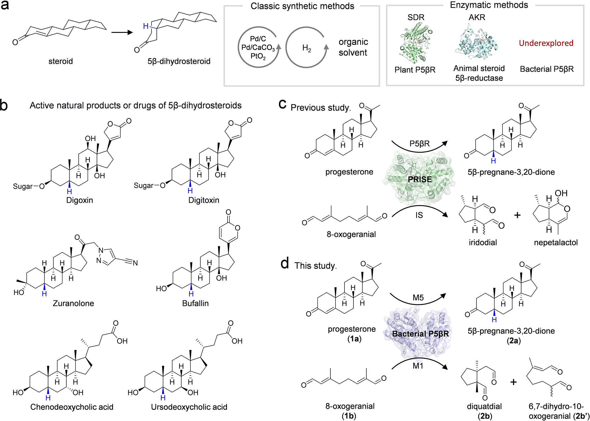
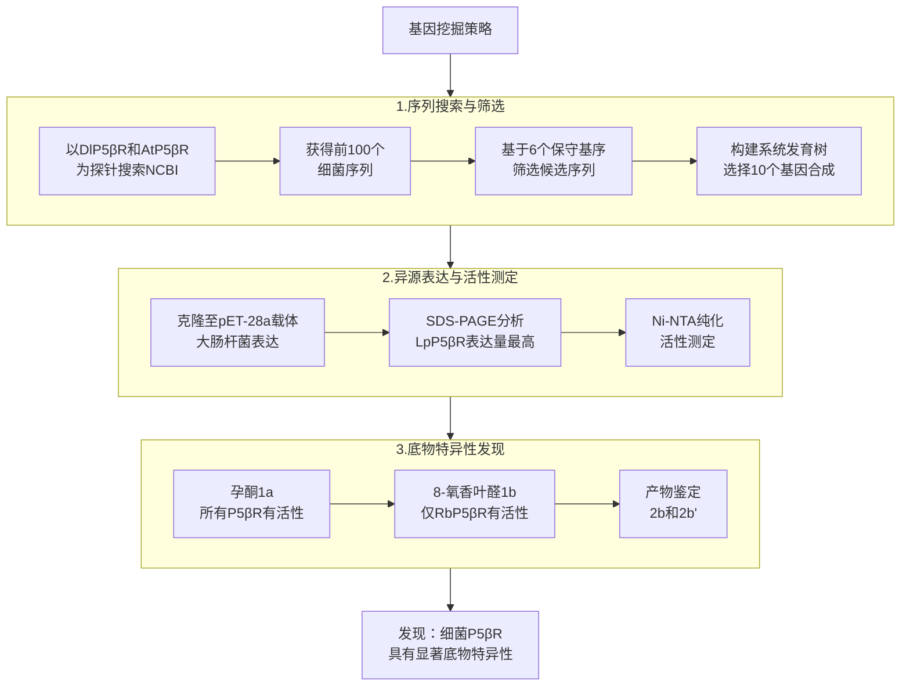
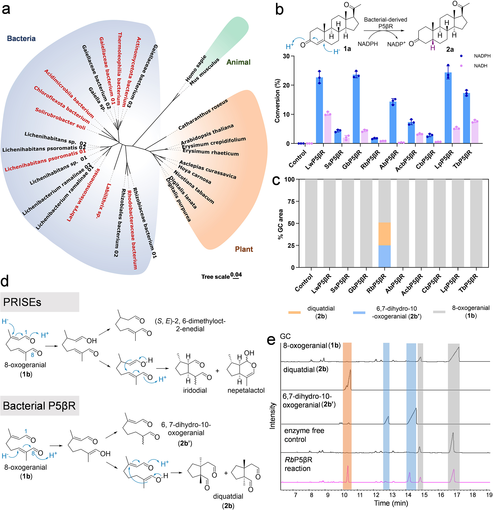
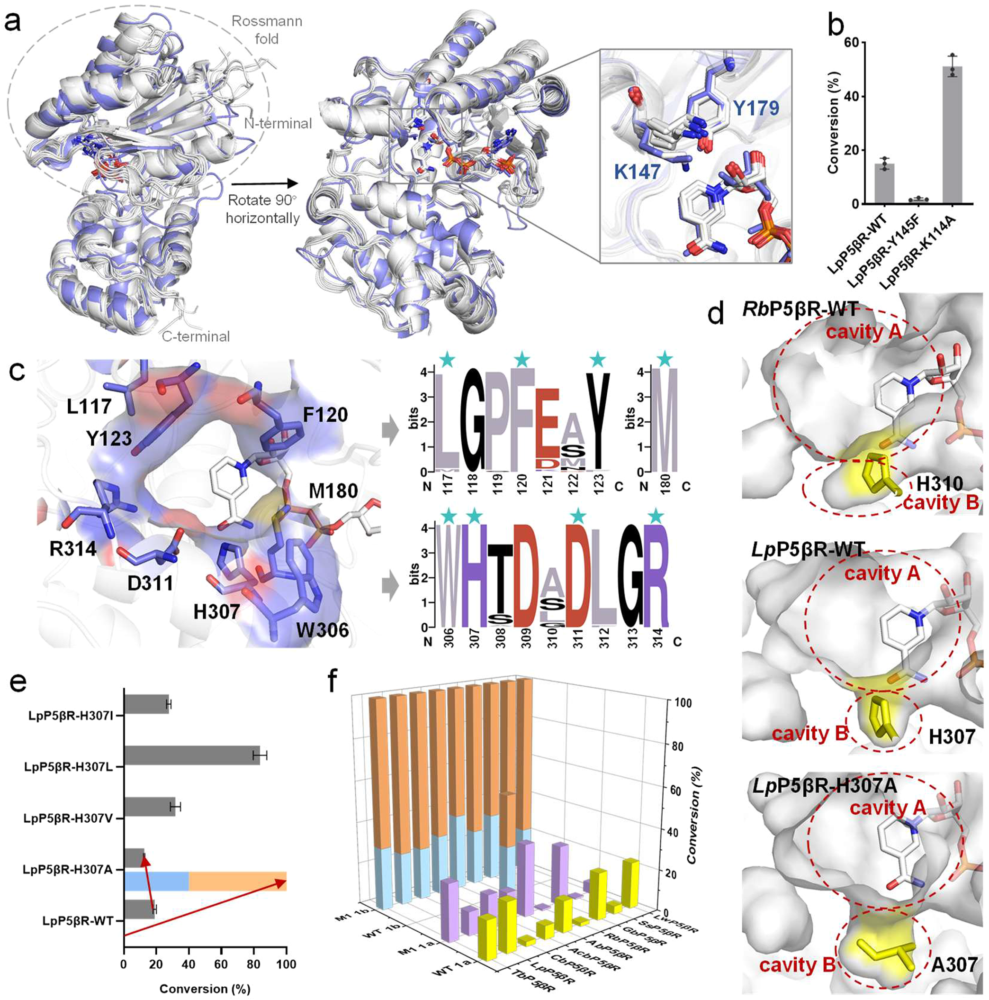
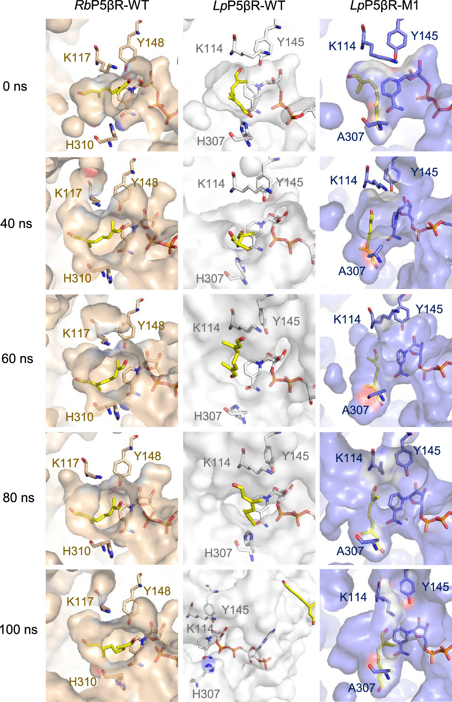
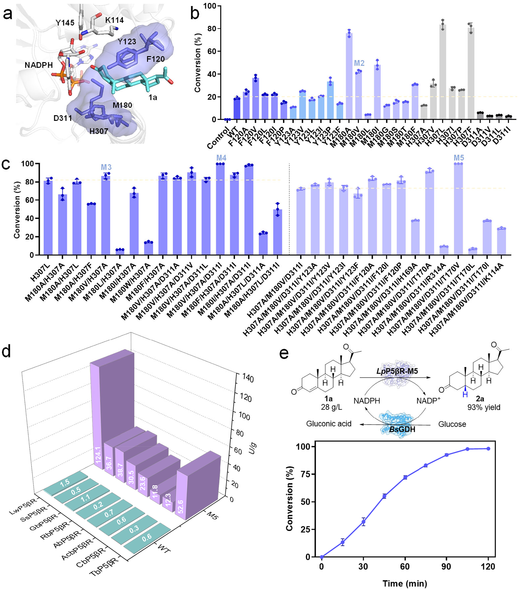
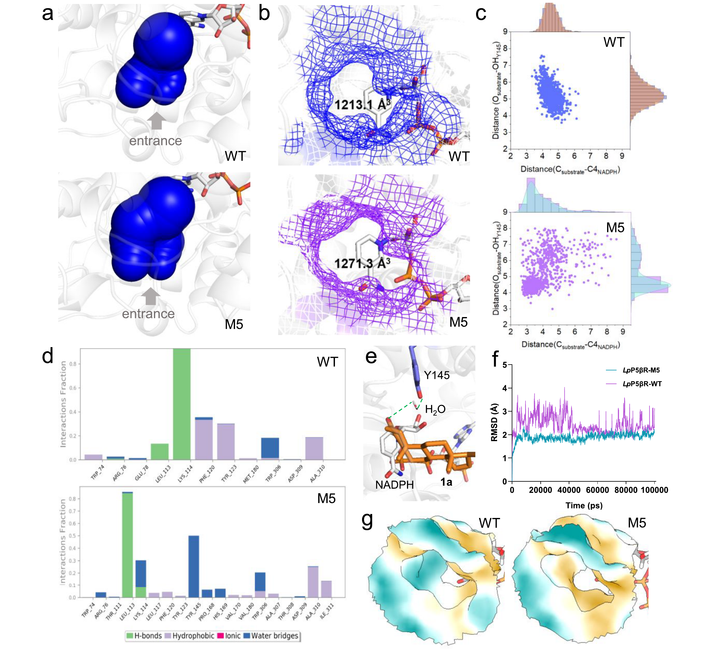
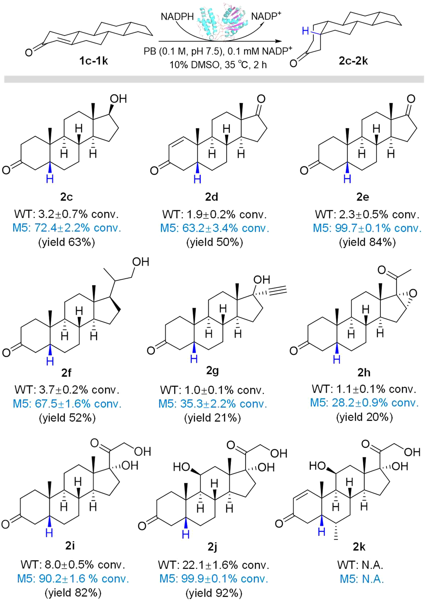

# 细菌孕酮5β-还原酶的底物选择性调控与5β-二氢类固醇的高效合成

## 本文信息

- **标题**：Engineered Bacterial Progesterone 5β-Reductase: Tunable Substrate Preference and Synthesis of 5β-Dihydrosteroids
- **作者**：Changli Che, Wenhe Zhang, Xiao Qiu, Qingyu Wang, Lichun Tang, Bin Qin, Xian Jia, Song You
- 发表时间: 2025年9月16日
- **单位**：沈阳药科大学生命科学与生物制药学院、药物工程学院、伍亚创新学院（中国）
- **引用格式**：Che, C., Zhang, W., Qiu, X., Wang, Q., Tang, L., Qin, B., Jia, X., & You, S. (2025). Engineered Bacterial Progesterone 5β-Reductase: Tunable Substrate Preference and Synthesis of 5β-Dihydrosteroids. *ACS Catalysis*, *15*, 16560-16573. https://doi.org/10.1021/acscatal.5c04685
- **源代码**：无公开代码

## 摘要

> 类固醇在5β位置的立体选择性氢化是类固醇药物合成中的关键步骤。然而，现有植物孕酮5β-还原酶（P5βR）和动物来源的类固醇5β-还原酶存在催化效率低和异源表达水平差的问题，限制了其实际应用。为了拓展5β-二氢类固醇的酶法合成途径，本研究首次从细菌中挖掘了P5βR，并研究了其对孕酮和8-氧香叶醛的催化活性。与植物来源的PRISE（孕酮5β-还原酶和/或鸢尾苷合成酶样1,4-烯酮还原酶）类似，细菌P5βR尽管保持高度保守的蛋白序列和结构架构，但表现出不同的底物偏好。通过整合序列-结构比较分析，研究者识别了控制底物选择性的构象开关，实现了细菌P5βR底物偏好的精准调控。分子动力学模拟结果表明，突变体M1能够打开底物结合口袋内的cavity B，使线性底物8-氧香叶醛稳定结合。**本研究首次证明细菌P5βR可通过单点突变实现底物偏好的程控反转**。此外，研究者提出了一种基于底物特征的理性策略，进一步增强了细菌P5βR对类固醇的催化活性。最优突变体LpP5βR-M5对孕酮的催化效率比野生型提高了**700倍以上**。**准工业化的反应体系在2小时内几乎完全转化28 g/L孕酮并实现330 g/L·d的时空产率，标志着5β-二氢类固醇绿色合成进入可放大阶段**。本研究不仅阐明了细菌P5βR的结构-功能关系，还开创了5β-二氢类固醇合成的环境友好型生物催化途径。

### 核心结论

- **细菌来源P5βR全面挖掘**：首次从细菌中成功获得孕酮5β-还原酶集合，并同步解决植物/动物同源酶可溶表达差的瓶颈
- **保守骨架孕育新底物偏好**：尽管整体折叠与PRISE高度保守，细菌P5βR展现与植物体系截然不同的底物特异性
- **H307构象开关实现偏好反转**：单点突变即可通过cavity B门控调节，实现孕酮与8-氧香叶醛之间的底物选择性切换
- **理性工程显著提升动力学参数**：面向空间位阻与疏水性需求的组合突变将催化效率提升至773倍，对应$k_\text{cat}/K_\text{m}=348.4\,\mathrm{mM^{-1}\,min^{-1}}$
- **准工业化反应体系验证放大潜力**：28 g/L孕酮在2小时内完成高立体选择性转化并达到330 g/L·d时空产率，为绿色工业化提供直接路径

## 背景

类固醇Δ4,5-双键的立体选择性β面氢化能够形成具有A/B环顺式稠合构象的5β-二氢类固醇。这一转化在强心苷和胆汁酸的生物合成途径中具有关键意义。**5β-二氢类固醇决定着强心苷与胆汁酸的终端产量，因此任何调控Δ4,5双键氢化的酶都直接关系到药物供应链的安全**。尽管对动物和植物来源的同源酶进行了广泛研究，但**微生物来源的催化该反应的酶仍未被表征**。

动物来源的类固醇5β-还原酶（如AKR1D1和AKR1D2）是类固醇激素代谢和胆汁酸合成的必需酶，属于醛酮还原酶（AKR）超家族，采用其特征性的(α/β)8-桶状结构。在植物中，孕酮5β-还原酶（P5βR, EC 1.3.99.6）最早从洋地黄叶片中纯化，参与强心苷的生物合成。与动物类固醇5β-还原酶不同，植物来源的P5βR由于关键催化残基的差异而属于短链脱氢酶/还原酶（SDR）的特殊类别。**动物AKR与植物SDR在催化骨架和辅酶识别上的根本差异，凸显了跨界挖掘全新催化架构的紧迫性**。

植物P5βR和鸢尾苷合成酶（IS）共享高度的序列和结构同一性，IS活性也被证实广泛存在于植物P5βR中，因此它们被统称为VEP1编码的孕酮5β-还原酶/鸢尾苷合成酶（PRISE）。尽管PRISE家族酶具有几乎无法区分的结构和相似的催化机制，但P5βR和IS表现出明显不同的底物特异性。

5β-二氢类固醇作为众多生物活性分子和药物的关键中间体，包括强心苷类药物地高辛（Digoxin）、蟾毒灵（Bufallin）、胆汁酸衍生物鹅去氧胆酸（Chenodeoxycholic acid）以及新型抗抑郁药zuranolone等。然而，现有类固醇5β-脱氢酶在大肠杆菌中异源表达效率低、对Δ4,5-3-酮类固醇的催化性能欠佳，限制了其在5β-二氢类固醇合成中的实际应用。

尽管许多研究尝试通过基因挖掘或工程化改进类固醇5β-脱氢酶的催化活性，但至今仍未开发出可工业化规模的生物催化工艺。因此，工业合成5β-还原酶主要依赖传统化学方法。然而，类固醇Δ4,5-双键的立体选择性和区域选择性还原对化学合成是一个挑战，硼氢化物的使用更倾向于还原3-酮基。最广泛采用的化学方法涉及钯催化氢化（Pd/C或Pd/CaCO3），但通常只能达到约50%的立体选择性，且不同类固醇底物之间存在显著差异。**传统氢化工艺在立体纯度、成本与环境负担之间的矛盾，逼迫行业寻求可放大的生物催化替代方案**。实现更高的立体选择性需要费力优化反应溶剂和催化剂配方，显著增加了生产成本并限制了商业可行性。

**图1：5β-二氢类固醇合成的现状与本研究定位**

- **(a) 合成方法对比**：左侧展示类固醇Δ4,5-双键的立体选择性β面氢化反应；右侧对比传统化学法（Pd/C催化加氢，需有机溶剂，立体选择性仅约50%）与酶法（SDR/AKR/P5βR，水相反应，立体选择性>99%）。**关键信息**：标注"Bacterial P5βR - Underexplored"点明本研究切入点
- **(b) 天然产物与药物应用**：展示6个重要的5β-二氢类固醇分子，蓝色氢原子标记β构型：
  - **强心苷类**：地高辛（Digoxin）、毛地黄毒苷（Digitoxin）
  - **新型神经活性药物**：Zuranolone、Bufallin
  - **胆汁酸类**：鹅去氧胆酸（Chenodeoxycholic acid）、熊去氧胆酸（Ursodeoxycholic acid）
- **(c) 已知PRISE催化反应**：植物来源的PRISE家族催化孕酮（1a）生成5β-孕烷-3,20-二酮（2a），或催化8-氧香叶醛（1b）生成鸢尾苷前体（nepetalactol + iridodial）
- **(d) 本研究发现**：细菌P5βR（紫色蛋白结构）同样催化1a生成2a，但对1b的催化产物为diquatdial（2b）和6,7-二氢-10-氧香叶醛（2b'），**产物路线与PRISE不同**

### 关键科学问题

- **异源表达瓶颈**：现有植物P5βR和动物类固醇5β-还原酶在大肠杆菌中可溶性表达水平低，难以满足工业化应用需求
- **催化效率低下**：野生型P5βR对孕酮等类固醇底物的催化活性不足，限制了酶法合成的经济可行性
- **底物选择性机制不明**：PRISE家族酶的底物特异性决定因素尚未阐明，阻碍了理性设计和底物范围拓展
- **工业化应用缺失**：缺乏可工业化规模生产5β-二氢类固醇的环境友好型生物催化工艺

### 创新点

- **首次挖掘细菌P5βR**：以植物P5βR为探针，从NCBI数据库中挖掘了10个细菌来源的P5βR，解决了异源表达问题
- **揭示底物选择性开关**：通过序列-结构比较分析，识别了H307位点作为控制底物偏好的构象开关，单点突变即可反转底物选择性
- **底物特征导向的理性设计**：提出了基于底物特性（大空间位阻和疏水性）的工程策略，系统性提升了对类固醇的催化活性
- **分子机制深入解析**：结合分子对接、分子动力学模拟和腔体分析，阐明了突变体活性提升的结构基础
- **实现克级规模制备**：最优突变体LpP5βR-M5实现了28 g/L孕酮的高效转化（STY 330 g/L·d），为工业化应用提供了可行方案

---

## 研究内容

### 基因挖掘与细菌P5βR的活性测定

为了克服植物P5βR和动物类固醇5β-脱氢酶异源表达差的障碍，研究者采用基因挖掘技术从细菌中搜索潜在的P5βR。首先，以洋地黄（*Digitalis lanata*）的经典DlP5βR和拟南芥（*Arabidopsis thaliana*）的AtP5βR为探针，在NCBI数据库中搜索了序列同一性最高的前100个细菌P5βR序列。所有序列在NCBI数据库中均被预测为SDR家族的氧化还原酶。

随后，基于植物P5βR的**六个特征性保守基序**（32GXTGIXG40、59GXXRR65、80DXXD85、143TGXKHYXGP153、176NFYYXXED185、197WSVHRP204）进行序列筛选。最终选择了约20个符合标准的候选序列。为了提高基因挖掘的成功率，研究者使用邻接算法（Neighbor-Joining Algorithm）构建了系统发育树，并分析了序列同一性。**最终选择了10个序列进行基因合成**。

这些基因广泛分布于不同的细菌科，与DlP5βR和AtP5βR的序列同一性为35-42%，彼此之间的序列同一性为45-86%。合成基因克隆至pET-28a(+)载体，在大肠杆菌BL21(DE3)中表达。SDS-PAGE结果显示，**这些酶的可溶性表达差异很大**，其中**LpP5βR的可溶性表达量最高**（来源于*Lichenihabitans psoromatis*）。

**活性测定结果令人惊喜**：**所有纯化的酶均表现出P5βR催化活性**，能够立体选择性地还原孕酮（1a）的Δ4,5-双键形成5β-孕烷-3,20-二酮（2a）。其中，LwP5βR、GbP5βR和LpP5βR的催化活性较高，**转化率超过20%**。值得注意的是，与植物PRISE家族类似，**细菌P5βR也依赖NADPH而非NADH作为辅酶**，这归因于细菌P5βR具有与PRISE家族类似的辅酶结合口袋。

为了探索细菌P5βR是否像PRISE一样具有鸢尾苷合成酶活性，研究者以8-氧香叶醛（1b）作为底物进行活性测试。结果显示，细菌P5βR对1b普遍没有可检测的催化活性，**只有RbP5βR表现出例外的催化活性**（来源于*Rhodobacteraceae bacterium*）。产物经GC、MS和NMR鉴定为diquatdial（2b）和6,7-二氢-10-氧香叶醛（2b'），这与PRISE的催化产物不同，而与真菌还原酶EasA（来自*Aspergillus fumigatus*）的催化产物相同。推测在细菌P5βR催化过程中，**氢负离子攻击1b的C6位而非C3位**。

**图2：细菌P5βR的基因挖掘与活性鉴定全景图**

- **(a) 系统发育树**：以植物DlP5βR和AtP5βR为探针，从NCBI筛选出的P5βR序列构建邻接树。**红色标记**为本研究合成并验证的10个细菌P5βR（来自蓝色区域的细菌分支），橙色为植物PRISE，灰色为动物类固醇5β-还原酶。树的尺度条表示0.54的进化距离
- **(b) 底物特异性测试**：柱状图展示10个细菌P5βR对孕酮（1a，蓝色柱）和8-氧香叶醛（1b，紫色柱）的转化率。**关键发现**：大多数P5βR偏好1a（蓝色柱高），仅RbP5βR对1b有显著活性（紫色柱高）
- **(c) 可溶性表达差异**：SDS-PAGE凝胶电泳图。灰色背景柱代表不同底物组合（diquatdial、6,7-二氢-10-氧香叶醛、8-氧香叶醛），橙色柱标记LpP5βR对1a的高转化率（**>25%**），显著高于其他P5βR
- **(d) 催化产物示意**：上方为PRISE家族催化1b的产物（8-氧香叶醛→鸢尾苷前体），下方为细菌P5βR催化的产物路线（8-氧香叶醛→diquatdial + 6,7-二氢-10-氧香叶醛）
- **(e) GC色谱验证**：时间-强度曲线显示无酶对照、RbP5βR反应和标准品的峰位对比，证实产物身份

### 细菌P5βR的底物特异性调控

挖掘的10个细菌P5βR在催化1b和1a时**表现出显著的底物特异性**：RbP5βR偏好催化线性底物1b而非1a，而其他P5βR则偏好催化1a而非1b。为了实现细菌P5βR底物特异性的理性调控并寻找影响底物选择性的分子基础，研究者首先使用**AlphaFold3**获得了细菌P5βR与NADPH复合物的蛋白结构。

#### 分子动力学模拟方法

为解析底物偏好反转与活性增强的结构机制，作者针对RbP5βR、LpP5βR及其M1、M5突变体开展了100 ns全原子MD模拟。所有体系在Schrödinger Release 2018-1环境中构建，采用OPLS3力场与SPC水模型，将蛋白-底物复合物置于正交水盒，并通过添加Na+/Cl−调节至pH 7.0并整体中和。每个体系先进行10 000步最陡下降能量最小化，随后在300 K、1.01325 bar的NPT系综下跑100 ns，轨迹每100 ps输出一次，以便统计氢键、距离、溶剂可及表面积和配体RMSD等指标。后处理统一借助Simulation Interaction Diagram模块，输出的接触占有率、SASA和结构快照构成了图4、图6及SI图S14-S19中氢键网络、Ligand-Contact-Diagram、SASA与RMSD分析的原始数据。

结构比较显示，**细菌P5βR的整体结构与植物来源的DlP5βR相似**，均具有SDR家族的Rossmann折叠和延伸的C端结构域。DlP5βR关键催化残基（Y179和K147）位置的酪氨酸和赖氨酸在细菌P5βR中也存在，推测为细菌P5βR的关键催化残基。

- LpP5βR-Y145F突变体对1a的**催化活性几乎完全丧失**，进一步证明了该残基参与细菌P5βR的催化。
- K114A突变体对1a的催化活性增强，表明**K114氨基酸侧链不参与催化**，可能是K114骨架酰胺氮与底物形成氢键，稳定底物并促进质子转移。

由于RbP5βR的底物特异性与其他挖掘的P5βR不同，研究者从序列和结构两方面分析了RbP5βR的特殊性。序列保守性分析显示，**细菌P5βR底物结合口袋的氨基酸高度保守**（L117、F120、Y123、M180、W306、H307、D311、R314），**难以仅根据序列判断底物偏好**。

结构比较显示，细菌P5βR的底物结合口袋可分为主体cavity A和靠近辅酶向下延伸的cavity B。**RbP5βR的cavity B明显长于其他P5βR**，推测更大的cavity B对于细菌P5βR催化8-氧香叶醛至关重要。通过观察cavity B周围的残基，识别出残基**H307能够直接影响cavity B的大小**。

**图3：底物选择性的结构基础与H307门控开关**

- **(a) 整体结构与保守骨架**：左侧为RbP5βR-WT的AlphaFold3预测结构（浅蓝色ribbon），标注Rossmann fold（辅酶结合域）、N端和C端。右上插图展示Y179（对应LpP5βR的Y145）与NADPH、底物1a的空间位置关系。右侧底物结合口袋俯视图（紫蓝色表面）清晰显示**水平延伸的cavity A和垂直向下的cavity B**
- **(b) 关键催化残基特写**：Y179与底物1a的羰基氧形成氢键（红色虚线），K147起辅助稳定作用。柱状图显示不同P5βR的相对活性，RbP5βR（紫色柱）对1b活性最高
- **(c) 底物结合口袋的保守残基网络**：棒状模型展示8个高度保守的残基（L117、F120、Y123、M180、W306、H307、D311、R314）围绕底物1a（白色骨架）。右侧sequence logo显示这些位点在PRISE家族中的保守性，**H307位点几乎100%保守**
- **(d) Cavity B的门控效应可视化**：三个蛋白表面模型对比（RbP5βR-WT、LpP5βR-WT、LpP5βR-H307A）。黄色区域标记cavity B，红色圈标注H307/A307位置。**关键量化**：LpP5βR-M1的cavity B比WT增大**52.8 Å3**（从1213 Å3到1271 Å3）
- **(e) H307突变体的底物选择性反转**：柱状图显示5个突变体（H307A、H307V、H307L、H307I、H307F）对1a和1b的催化活性。**H307A实现完全反转**：对1b的活性从0提升至约60%，对1a的活性从80%降至20%
- **(f) 底物谱系统测试**：3D柱状图展示不同突变体对多种底物的转化率，验证H307A在拓宽底物范围中的作用

为了验证这一假设，研究者对LpP5βR的H307进行了定点诱变（H307A、H307V、H307L、H307I），并测试了对1a和1b的催化活性。令人惊喜的是，LpP5βR-H307A（M1突变体）对1b的催化活性相比野生型显著提高，而对1a的催化活性降低。活性位点腔体体积测量显示，LpP5βR-M1比LpP5βR-WT的体积增加了52.8 Å3。**突变体M1成功实现了底物特异性的反转**，也证实了研究者的推测。

随后，研究者在其他挖掘的P5βR上构建了M1突变体（LwP5βR-H307A、SsP5βR-H307A、GbP5βR-H311A、RbP5βR-H310A、AbP5βR-H306A、AcbP5βR-H309A、CbP5βR-H306A、TbP5βR-H311A），活性测试结果显示，所有突变体相比野生型都成功实现了底物特异性的改变。**通过理性设计和工程化，研究者仅用单点突变就实现了细菌P5βR底物选择性的反转**。

为了进一步探索细菌P5βR底物偏好改变的潜在机制，研究者进行了分子对接和分子动力学（MD）模拟。首先，通过比较RbP5βR-WT和LpP5βR-WT与1b的催化过程，发现底物1b在RbP5βR-WT的底物结合口袋中稳定，但在LpP5βR-WT的底物结合口袋中不稳定。这可能是RbP5βR相比其他细菌P5βR-WT对1b有催化活性的原因。

**图4：底物结合稳定性的分子动力学证据（100 ns MD模拟）**

这是一个**3列×5行**的MD模拟快照网格，系统性地展示了底物1b在不同酶中的动力学行为：

**列布局（从左到右）**：
- **第1列 - RbP5βR-WT**（米色蛋白表面）：天然对1b有活性的酶
- **第2列 - LpP5βR-WT**（白色蛋白表面）：野生型，对1b无活性
- **第3列 - LpP5βR-M1**（淡紫色蛋白表面）：H307A突变体，获得对1b的活性

**行布局（从上到下）时间序列**：0 ns → 40 ns → 60 ns → 80 ns → 100 ns

**关键观察**：
- **黄色棒状**：底物1b的线性骨架
- **标注残基**：K117/K114（催化赖氨酸），Y148/Y145（质子给体），H310/H307/A307（门控残基）
- **RbP5βR-WT（左列）**：1b在整个100 ns过程中始终稳定地停留在活性位点，保持合适的催化距离
- **LpP5βR-WT（中列）**：1b在模拟过程中逐渐偏离最佳催化位置，**H307的咪唑环（粉色）形成空间冲突**，导致底物无法稳定结合
- **LpP5βR-M1（右列）**：H307A突变消除了空间位阻后，1b重新获得稳定的结合姿态，**证明H307确实是控制底物选择性的门控开关**

通过理性设计扩大LpP5βR的cavity B后，1b能够在突变体LpP5βR-M1的底物结合口袋中形成合适的预反应构象，并在整个催化过程中保持稳定。**307位高度保守的组氨酸充当门控开关，抑制对1b的催化活性**。将该位点突变为丙氨酸使细菌P5βR的底物结合口袋更适合线性底物1b的稳定结合。

作者在Discussion中特别强调，**cavity B门控是细菌P5βR底物偏好反转的唯一开关**，借助这一点既能解释RbP5βR对1b的天然适配，也能为植物PRISE体系提供结构参照。团队计划围绕该门控位点开展跨物种序列比对，**构建能够预测未知P5βR/IS序列底物偏好的规则库**，为后续精准控制底物选择性奠定基础。

### 工程化细菌P5βR增强孕酮催化活性

尽管通过基因挖掘识别的细菌P5βR能够立体选择性地还原1a为2a，但其对1a的催化活性普遍较低。为了克服现有P5βR的局限性并为5β-二氢类固醇合成提供潜在的生物催化剂，研究者对细菌P5βR进行了理性设计指导的结构工程。由于LpP5βR在大肠杆菌中表达量高且对1a有良好的催化活性，因此选择LpP5βR进行工程化。

考虑到1a的性质（大空间位阻和疏水性），研究者制定了理性工程策略：**将底物结合口袋中具有大空间位阻或极性的残基突变为具有小空间位阻的非极性氨基酸**。通过观察LpP5βR的底物结合口袋，识别出F120、Y123、M180、H307和D311作为工程位点。其中F120和Y123位于底物通道入口，而M180、H307和D311更靠近辅酶。

**图5：理性设计策略与迭代工程优化路线**

- **(a) 工程热点定位**：LpP5βR-WT的活性位点放大图。**紫色棒状**标记5个候选突变位点：F120和Y123（底物通道入口），M180、H307、D311（靠近NADPH）。底物1a（白色骨架）和NADPH（橙色棒状）清晰可见
- **(b) 单点突变筛选结果**：柱状图展示野生型和单突变体对1a的转化率（条件A：0.5 mg/mL酶，1 h反应）。**紫色柱**为突变体，**灰色柱**为对照。**关键发现**：M180V（M2）、M180I、H307L活性显著提升（>60%转化率），而D311I活性降低
- **(c) 组合突变的迭代优化**：柱状图展示从单突变H307L到双突变M3（M180V/H307A）、三突变M4（M180V/H307A/D311I）、四突变M5（T170V/M180V/H307A/D311I）的活性递增。**分级筛选条件**：左侧虚线前用条件B（0.25 mg/mL），右侧用条件C（0.04 mg/mL，20 min）。M5在最严格条件下仍完全转化底物
- **(d) M5在不同P5βR上的普适性**：3D柱状图展示8个不同细菌P5βR的野生型（浅色柱）vs M5突变体（深色柱）对1a的转化率。**所有M5突变体均显著优于野生型**，证明策略的广泛适用性
- **(e) 克级制备验证**：反应方案展示NADPH/NADP+循环系统（BsGDH偶联葡萄糖氧化）。时间-转化率曲线显示28 g/L底物在2 h内达到>98%转化率，产率93%

这五个氨基酸被突变为具有小空间位阻的非极性氨基酸，如A、V、L、I、P。**为了准确评估不同突变体的活性变化，研究者设计了三套分级筛选条件**：

- **条件A**（野生型和单突变体）：0.5 mg/mL纯酶，1 h反应
- **条件B**（双/三突变体）：0.25 mg/mL纯酶，1 h反应
- **条件C**（四突变体）：0.04 mg/mL纯酶，20 min反应

这种**分级筛选策略的设计逻辑**在于：随着突变累积导致活性不断提升，若继续使用高酶浓度和长反应时间，所有突变体都会达到完全转化，无法区分活性差异。因此必须逐步降低酶浓度并缩短反应时间，才能准确捕捉活性提升的梯度。

突变结果显示，F120和Y123突变体的催化活性与野生型相差不大，而M180A、M180V（**M2**）、M180I、H307L和H307F的转化率显著提高。此外，D311I突变体的催化活性相比野生型显著降低。

随后，构建了M180和H307的组合突变，发现突变体M180V/H307A（**M3**）和M180F/H307A相比单突变H307L的活性进一步提高。鉴于酶工程中上位效应的普遍性，研究者在M180/H307双突变体的基础上构建了D311突变。所得到的最优三突变体M180V/H307A/D311I（**M4**）在条件B下能够完全转化1a。

为了进一步消除底物结合口袋中的不利作用力并提高LpP5βR对1a的催化活性，研究者在M4的基础上构建了K114、H169、T170、R314突变体。最终获得了催化活性最高的突变体T170V/M180V/H307A/D311I（**M5**），在条件C下能够完全转化底物。这意味着M5的活性是野生型的**至少12.5倍**（0.5/0.04），而实际催化效率提升达到773倍，说明不仅酶浓度可以大幅降低，催化速率也显著加快。

为了测试理性工程策略是否普遍适用于细菌P5βR，研究者在其他挖掘的P5βR上引入了M5突变（LwP5βR-T170V/M180V/H307A/D311I、SsP5βR-T170V/M180V/H307A/D311I等）。活性测试显示，**工程化P5βR的酶活性相比野生型显著提高**。这些P5βR之间的低序列同一性表明，工程策略对不同细菌来源的P5βR具有广泛适用性。

为了研究LpP5βR-M5的应用价值，研究者使用LpP5βR-M5粗酶液作为催化剂进行2a的不对称合成。**反应体系采用NADPH作为辅酶，并耦合葡萄糖脱氢酶（GDH）循环系统实现辅酶再生**。该GDH来源于枯草芽孢杆菌（*Bacillus subtilis*, BsGDH），对D-葡萄糖的催化活性约为10 U/mg（25°C）。**辅酶循环的工作原理**是：GDH将葡萄糖氧化为葡萄糖酸的同时将NADP+还原为NADPH，从而持续供给P5βR催化所需的还原当量，使得系统仅需**催化量的NADP+**（0.1 mM）即可维持反应进行。

通过优化反应条件（包括助溶剂类型、底物浓度和辅酶浓度），确定了最佳反应条件：
- **底物浓度**：28 g/L（约90 mM）
- **助溶剂**：20% (v/v) DMSO
- **辅酶**：0.1 mM NADP+（催化量）
- **辅助底物**：50 g/L葡萄糖（为GDH循环提供驱动力）
- **酶用量**：40 g/L湿菌体粗酶液（LpP5βR-M5）+ 5 g/L湿菌体粗酶液（BsGDH）
- **反应温度**：35°C，220 rpm

在100 mL规模的不对称还原反应中，1a的转化率在2小时内超过98%，时空产率（STY）高达**330 g/L·d**。最终通过硅胶柱层析纯化得到纯净的化合物2a（2.6 g，93%产率）。**值得强调的是**，28 g/L的底物负载和330 g/L·d的STY已接近工业生物催化的标准要求，而仅需0.1 mM的辅酶浓度大大降低了成本。

### LpP5βR突变体活性增强的分子机制

为了探索LpP5βR突变体对1a催化活性增强的分子机制，研究者测试了LpP5βR-WT及相关突变体的动力学常数。结果显示：

- **M2突变体通过降低$K_\text{m}$显著提升了酶对1a的亲和力**：$K_\text{m}$从0.16 mM下降到0.091 mM，证明缩小空间位阻的有效性
- **M3突变体依靠减小辅酶附近的腔体空间位阻显著提高$k_\text{cat}$**，从而同步提升周转速率
- **M4与M5突变体通过增强口袋疏水性实现亲和力与速率的双向提升**，共同奠定了后续克级合成的基础

| 酶 | $K_\text{m}$ (mM) | $k_\text{cat}$ (min-1) | $k_\text{cat}/K_\text{m}$ (mM-1 min-1) | 倍数 |
|---|---|---|---|---|
| LpP5βR-WT | 0.16 ± 0.04 | 0.066 ± 0.012 | 0.45 | 1 |
| LpP5βR-M2 | 0.091 ± 0.028 | 0.342 ± 0.054 | 3.8 | 8 |
| LpP5βR-M3 | 0.10 ± 0.02 | 3.42 ± 0.48 | 34.2 | 76 |
| LpP5βR-M4 | 0.06 ± 0.01 | 6.60 ± 0.59 | 110.0 | 244 |
| LpP5βR-M5 | 0.062 ± 0.009 | 21.6 ± 2.4 | 348.4 | **773** |

此外，研究者使用分子对接、腔体分析和MD模拟分析了LpP5βR的变化。首先，使用AlphaFold3预测了LpP5βR-M5的蛋白结构，预测模板建模分数（pTM）和界面预测模板建模分数（ipTM）分别为0.95和0.97。腔体分析显示，LpP5βR-M5的底物结合口袋相比野生型增大了约58 Å3，主要由于180、307位置（靠近辅酶结合口袋位置）的空间位阻减小。

**图6：M5活性提升的三重分子机制全景解析**

- **(a) 腔体体积的可视化对比（Caver分析）**：蓝色球形区域表示底物结合口袋和辅酶结合口袋的共同空间。**上图（WT）**：腔体入口较窄；**下图（M5）**：腔体明显扩大，标注"entrance"指示底物进入通道

- **(b) 腔体体积量化**：紫色网格显示WT和M5的三维腔体轮廓。数值标注显示WT为**1213 Å3**，M5为**1271 Å3**，净增加**58 Å3**

- **(c) 催化构象优化（关键距离缩短）**：散点图显示100 ns MD模拟中两个关键催化距离的分布。**上排（WT）**：d(Osub-OHY145)和d(Csub-C4NADH)距离较长且分散；**下排（M5）**：两个距离显著缩短并聚集在催化最优范围（3-5 Å），**证明质子和氢负离子传递更容易**

- **(d) 相互作用力谱分析（Ligand-Contact-Diagram）**：柱状图展示底物1a与不同残基的相互作用占有率。**上图（WT）**：主要依赖K114的氢键（绿色柱，>80%），Y145几乎无贡献；**下图（M5）**：相互作用更丰富，出现多个水介导接触（蓝色柱），**Y145通过水分子参与催化**

- **(e) 水介导氢键网络的关键证据**：3D结构特写显示M5中Y145（黄色棒状）通过1-2个水分子（红色球）与底物1a（白色骨架）形成氢键网络（绿色虚线）。NADPH（橙色）提供氢负离子。**这种水桥结构在WT中几乎不存在**，是M5催化效率提升的核心创新

- **(f) 结构稳定性增强（RMSD分析）**：时间序列曲线显示0-100 ns的蛋白和底物RMSD。**紫色曲线（M5）**比粉色曲线（WT）波动更小，RMSD均值更低，**证明M5在催化过程中更稳定**

- **(g) 疏水性增强的可视化**：蛋白表面着色图。**黄色区域**表示疏水性，**蓝色区域**表示亲水性。**WT（左）**：底物结合口袋有较多蓝色亲水区；**M5（右）**：口袋疏水性显著增强（更多黄色），**与类固醇疏水骨架的范德华相互作用更强**

**MD模拟从分子层面揭示了M5活性提升的三重机制**：

首先，**催化构象优化**。突变体M5的两个关键催化距离[d(Osub-OHY145)和d(Csub-C4NADH)]明显短于WT，表明在突变体M5的催化过程中**氢质子和氢负离子的传递距离更短**，因此反应更容易发生。这直接解释了$k_\text{cat}$的大幅提升（从0.066到21.6 min-1，提升327倍）。

其次，**水介导氢键网络的建立是M5活性提升的关键创新**。力分析显示，在野生型中，虽然底物能够与K114形成连续且稳定的氢键，但**与关键催化残基Y145没有直接相互作用**，这导致质子传递效率低下。相比之下，M5在催化过程中与底物的相互作用力更丰富，**许多水分子参与其中充当质子传递的桥梁**。这归因于突变体相比WT具有更大的溶剂可及表面积（SASA）——突变引入的小侧链残基使得水分子更容易进入活性位点。**定量分析显示**，在M5中，Y145在大约**49%的模拟时间**内通过1-2个水分子与底物形成氢键网络，从而有效促进质子从Y145羟基转移到底物羰基，完成还原反应。这种**水介导的质子传递机制**在野生型中几乎不存在，是M5催化效率大幅提升的分子基础。

最后，**结构稳定性增强**。M5和WT的RMSD（均方根偏差）分析表明，M5在整个反应过程中的构象波动更小，蛋白结构更稳定。这可能是由于M5相比WT具有**更疏水的底物结合口袋**，与类固醇疏水骨架的范德华相互作用更强，因此底物结合更加稳定，减少了蛋白构象的扰动。

基于以上分析，突变体LpP5βR-M5对1a催化活性提高的原因可归纳为三点：

1. **减小空间位阻**：底物结合口袋中靠近辅酶位置的空间位阻减小
2. **增加疏水性**：底物结合口袋疏水性增加
3. **水介导氢键网络**：活性位点腔体的SASA增加，从而在酶的关键催化残基与底物之间建立水介导的氢键网络

### 底物范围探索

为了测试LpP5βR对类固醇化合物的催化效果，研究者使用LpP5βR-WT和LpP5βR-M5作为生物催化剂催化不同的类固醇。结果显示，LpP5βR-M5相比野生型具有更广的底物范围，其对所有类固醇底物的催化活性均显著提高。

**图7：底物范围拓展与结构-活性关系**

图示展示了LpP5βR-WT和M5对11个类固醇底物（1c-1k）的催化转化率对比，反应条件：0.1 M磷酸钾缓冲液（pH 7.5）、0.1 mM NADP+、10% DMSO、35°C、2 h。

**颜色编码**：
- **黑色文字**：LpP5βR-WT的转化率
- **蓝色文字**：LpP5βR-M5的转化率（下方括号内为分离产率）

**关键结构-活性规律**：
- **C17取代耐受性强**：2c（11-OH）、2f（25-OH）、2g（17-炔丙基）、2h（17-环氧）的高转化率（M5达67-99%）证明C17位大取代不影响催化，因为**该位置位于口袋外部**
- **Δ1-双键显著抑制**：2d和2e的转化率明显低于饱和类似物，符合**1,4-加成机制**的要求
- **11-OH提升活性**：2i（11β-OH，90%）和2j（11β-OH + 17,21-二羟基，99%）的超高转化率表明**极性羟基增强底物亲水性有利于催化**
- **C6-甲基完全阻断**：2k（6α-Me）对WT和M5均无活性（N.A.），证明**该位置的空间位阻阻止催化构象形成**
- **M5的全面优势**：对所有可转化底物，M5的活性均为WT的**2-30倍**，最大提升见于2i（从8%到90%）

通过比较LpP5βR对不同类固醇化合物的催化活性发现：
- **C17位取代的空间位阻影响小**：类固醇17位取代的空间位阻对酶活性影响很小，LpP5βR能够高效催化大的C17取代类固醇（如1f、1i），这可能是由于**催化过程中类固醇的该位置位于P5βR底物结合口袋外部**
- **Δ1-双键显著降低活性**：Δ1-双键的存在（1d、1e）显著降低了P5βR的催化活性，因为**P5βR的催化遵循1,4-加成原理**
- **11位羟基取代提升活性**：类固醇11位的羟基取代进一步增强了P5βR的催化活性，表明该位点的空间位阻对P5βR活性没有影响，且**底物亲水性的增加有利于P5βR活性的提高**（1i、1j）
- **C6-甲基阻碍催化**：对于底物1k，LpP5βR-WT和M5均未表现出催化活性，可能是因为**底物C6-甲基的空间位阻阻止了其处于合适的预反应姿态**

**总之，通过理性设计获得的LpP5βR-M5不仅高效催化1a，也能覆盖多种药用类固醇**，包括4-雄烯二酮（2e）、二苄醇（2f）、氢化可的松（2j）等关键中间体。

---

## Q&A

### Q1：为什么细菌P5βR与植物PRISE在序列和结构高度保守的情况下，底物特异性却存在显著差异？

这是酶学研究中的经典现象——高度保守的整体结构并不意味着完全相同的底物选择性。尽管细菌P5βR与植物PRISE的整体序列同一性为35-42%，关键催化残基（如Y145、K114）高度保守，但底物结合口袋的**微小结构差异**足以导致底物偏好的显著改变。

具体而言，本研究发现cavity B（靠近辅酶的向下延伸腔体）的大小是决定性因素。RbP5βR的cavity B显著长于其他细菌P5βR，使其能够容纳线性底物8-氧香叶醛。而大多数细菌P5βR由于H307残基的存在，cavity B较小，更适合孕酮等刚性类固醇底物的结合。这种**门控效应**（gatekeeper effect）在酶工程中非常常见——单个关键残基就能控制底物通道的开闭和底物选择性。

此外，底物结合口袋的**疏水性和形状互补性**也是重要因素。孕酮作为疏水性强的刚性四环骨架分子，需要一个紧密的疏水性口袋才能稳定结合；而8-氧香叶醛作为线性柔性分子，需要一个更开放的腔体来容纳其延伸构象。MD模拟清晰地显示了这种差异：在LpP5βR-WT中，1b无法形成稳定的预反应构象，而在cavity B扩大后的M1突变体中，1b能够稳定结合并维持整个催化过程。

### Q2：H307A单点突变如何实现底物选择性的完全反转？这一发现对PRISE家族底物特异性研究有何启示？

H307A突变能够反转底物选择性的根本原因在于其**打开了cavity B的门控**。组氨酸是一个相对较大的极性氨基酸（侧链含咪唑环），在307位时其侧链会延伸到cavity B空间，物理性地阻碍了线性底物1b的进入和稳定结合。当突变为丙氨酸（最小的非极性氨基酸）后，cavity B的体积增加了52.8 Å3，这一空间扩展足以容纳1b的延伸链状结构。

从结构动力学角度看，MD模拟揭示了更深层的机制：
- 在**野生型**中，H307的咪唑环与底物形成空间冲突，导致1b无法在活性位点建立稳定的催化构象
- 在M1突变体中，H307A的空间释放使1b能够以合适的角度接近NADPH的C4位（氢负离子给体），并维持这种构象达100 ns以上

这一发现对PRISE家族研究具有重要启示。植物PRISE家族也面临同样的底物特异性之谜——为什么结构几乎无法区分的P5βR和IS会表现出对孕酮和8-氧香叶醛的选择性差异？现有研究尝试通过loop区域的动力学、活性位点苯丙氨酸的保守性等因素解释，但结论仍不清晰。

本研究提示**cavity B大小可能是PRISE家族底物特异性的通用决定因素**。考虑到细菌P5βR与植物PRISE的结构同源性，推测植物PRISE中也存在类似的门控残基。未来可以通过比较具有不同底物偏好的PRISE的cavity B结构，识别关键门控位点，进而通过定点突变实现底物选择性的理性调控。

### Q3：基于底物特征的理性设计策略为何能普遍适用于不同来源的细菌P5βR？这种策略的局限性在哪里？

这一理性设计策略之所以具有普遍适用性，根源在于其**基于底物-酶相互作用的普遍原理**而非特定酶的个性化特征。孕酮作为底物具有两个显著特点：（1）刚性的四环骨架导致**大空间位阻**；（2）完全由碳氢骨架组成，具有**强疏水性**。因此，任何旨在提升孕酮结合和催化的策略，都应该围绕这两个特征展开：

1. **减小活性位点的空间位阻**：将大侧链残基（如M180、H307）突变为小侧链残基（如A、V），为刚性的类固醇骨架腾出空间，使其能够以最佳角度接近辅酶
2. **增加活性位点的疏水性**：将极性残基（如D311）突变为疏水残基（如I），增强与类固醇疏水骨架的范德华相互作用

这种策略的普适性体现在：研究者在序列同一性仅45-86%的10个不同细菌P5βR上应用M5组合突变（T170V/M180V/H307A/D311I），所有工程化酶的活性均显著提高。这表明**这些位点在不同细菌P5βR中具有结构保守性和功能等效性**。

然而，这种策略也存在局限性：

- **依赖保守的底物结合口袋**：如果目标酶的底物结合口袋与LpP5βR差异较大（如关键位点编号不同、腔体形状显著不同），则需要重新识别等效位点
- **可能影响酶稳定性**：疏水性增加虽然有利于类固醇结合，但过度突变可能导致酶稳定性下降或溶解度降低（幸运的是，本研究中M5的稳定性良好）
- **底物范围限制**：这一策略是针对类固醇骨架优化的，对于其他类型的底物（如线性萜类、小分子酮）可能不适用，甚至产生负面效应
- **上位效应的不可预测性**：虽然M5在多个P5βR上都有效，但不同突变的组合效应（epistasis）在不同酶中可能存在差异，最优组合可能需要针对每个酶单独筛选

### Q4：LpP5βR-M5的催化效率提高了773倍，但这是否足以支撑工业化应用？还需要解决哪些问题？

LpP5βR-M5的催化效率（$k_\text{cat}/K_\text{m}$ = 348.4 mM-1 min-1）相比野生型（0.45 mM-1 min-1）提高了773倍，这是一个非常显著的改进。从酶工程角度看，单纯依靠理性设计实现如此大幅度的活性提升是相当罕见的（通常理性设计能实现10-100倍提升已属优秀）。

从工业化应用的角度评估，LpP5βR-M5已经展现了良好的潜力：

**优势**：
- **克级规模验证**：28 g/L底物浓度、2小时内>98%转化率、时空产率330 g/L·d，这些指标已经接近工业化生物催化的要求
- **底物负载量高**：28 g/L（约90 mM）已经是相当高的底物浓度，远超大多数酶促反应（通常为1-10 mM）
- **辅酶循环高效**：使用GDH循环系统，NADP+仅需0.1 mM（催化量），大大降低了成本
- **异源表达良好**：LpP5βR在大肠杆菌中可溶性表达量高，便于大规模生产

**仍需解决的问题**：

1. **转化率瓶颈**：无论底物浓度如何增加，转化率最多达到98%而无法完全转化，这暗示存在**酶催化的可逆性**问题。需要通过产物移除或平衡移动策略（如原位产物沉淀、膜分离）来提高最终转化率
2. **助溶剂依赖**：20% DMSO的使用增加了下游分离成本和环境负担。可以探索使用生物相容性更好的助溶剂（如甘油、PEG）或两相体系（如离子液体、深共晶溶剂）
3. **产物抑制**：虽然论文未明确提及，但98%转化率上限可能与产物抑制有关。需要研究产物与酶的结合动力学，必要时通过突变降低产物亲和力
4. **放大验证**：目前仅在100 mL规模验证，工业化需要升至升级甚至吨级，过程中的传质、混合、热管理等工程问题需要解决
5. **酶稳定性**：论文未报告M5的热稳定性、有机溶剂耐受性、pH稳定性等。工业应用通常需要酶在苛刻条件下仍保持活性，可能需要进一步的稳定性工程（如固定化、定向进化）

综合来看，LpP5βR-M5已经是一个**准工业化的生物催化剂**，但从实验室到工厂仍需要过程工程和进一步的酶优化。

---

## 关键结论与批判性总结

### 潜在影响

- **系统建立细菌P5βR平台**：作者通过基因挖掘获得10条细菌来源P5βR并验证其对孕酮/8-氧香叶醛的活性，证明微生物SDR可弥补植物与动物P5βR在可溶表达和催化效率上的短板
- **cavity B门控锁定底物偏好**：结论强调扩大cavity B即可让线性底物1b稳定结合，单点突变即反转底物选择性，为解析PRISE家族长期未解的底物特异性提供了结构化线索
- **理性工程输出工业级催化剂**：基于底物空间位阻与疏水性设计的LpP5βR-M5将$k_\text{cat}/K_\text{m}$提升700余倍，并在28 g/L孕酮条件下实现330 g/L·d的STY，展示了绿色合成5β-二氢类固醇的放大潜力
- **底物谱得到实证扩展**：M5对4-androstenedione、hydrocortisone等多种类固醇的高转化度表明该策略可直接支撑多条药物中间体的酶法路线

### 局限性

- **特定骨架仍不可及**：底物范围实验显示Δ1-双键或C6-甲基取代会使酶完全失活，说明现有腔体工程尚无法兼容所有类固醇结构
- **线性底物须专属突变**：只有扩大cavity B的M1类突变才能高效催化8-氧香叶醛，尚未形成可同时处理线性与类固醇底物的统一方案
- **高效率依赖助溶体系**：克级放大实验需要20% DMSO加GDH循环维持28 g/L底物负载，提示与理想工业工艺之间仍存在溶剂与成本压力

### 未来研究方向

- **将门控策略迁移至PRISE**：利用细菌P5βR与植物PRISE的同源性，对后者的cavity B位点进行系统比对，验证是否能同样实现底物偏好反转
- **针对难底物继续工程化**：围绕Δ1-双键、C6-甲基等难以容纳的骨架开展新的腔体扩展或柔性门控设计，进一步拓宽类固醇谱
- **优化放大流程**：在现有28 g/L体系基础上探索低助溶甚至无助溶条件、替代辅酶循环方案与酶固定化策略，以降低工业化成本并提升可持续性
