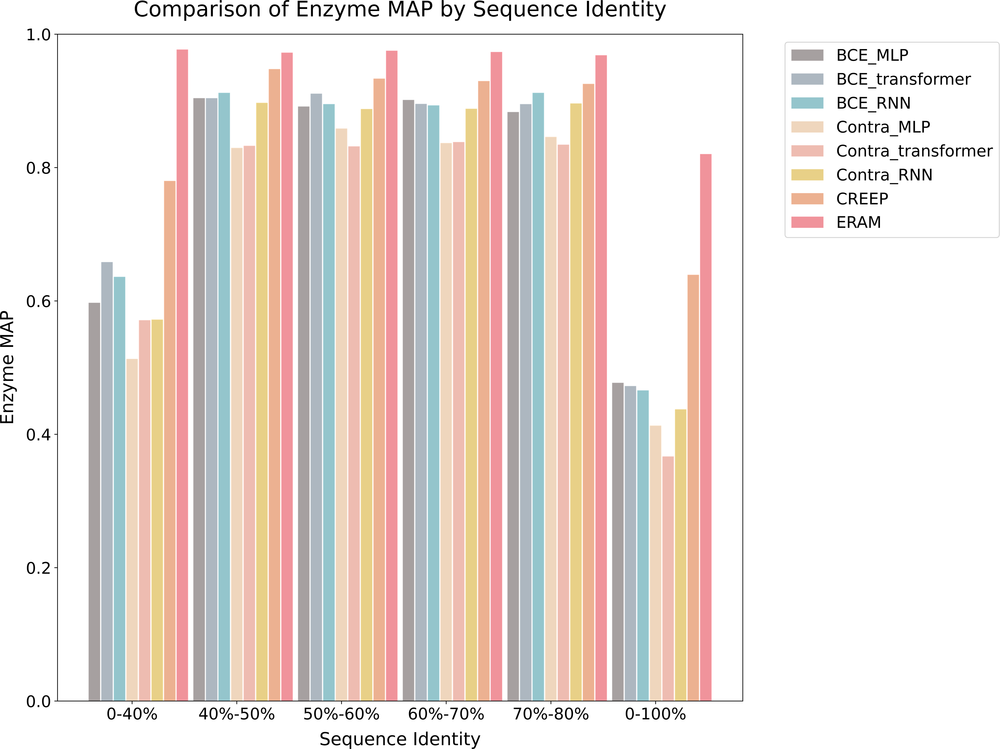
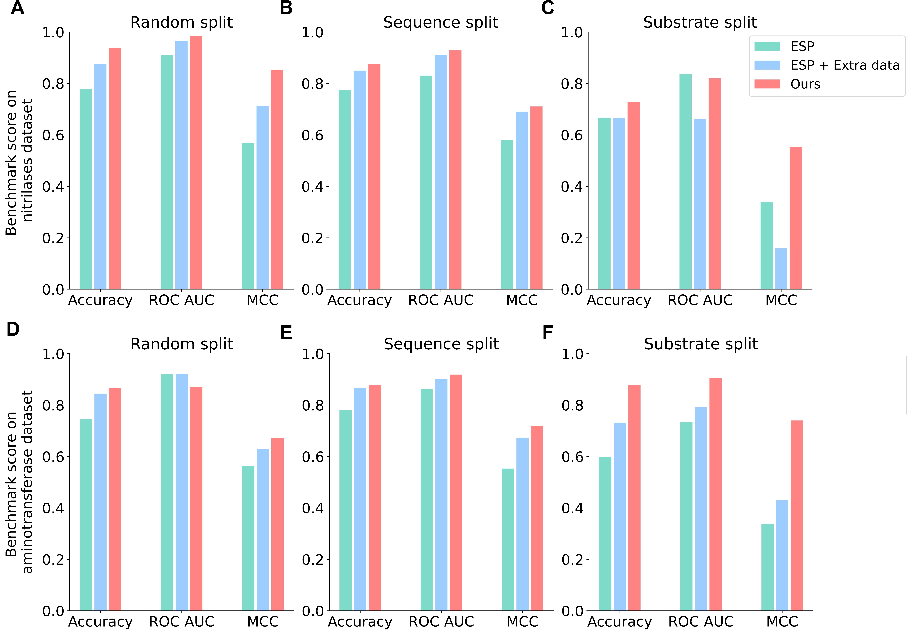
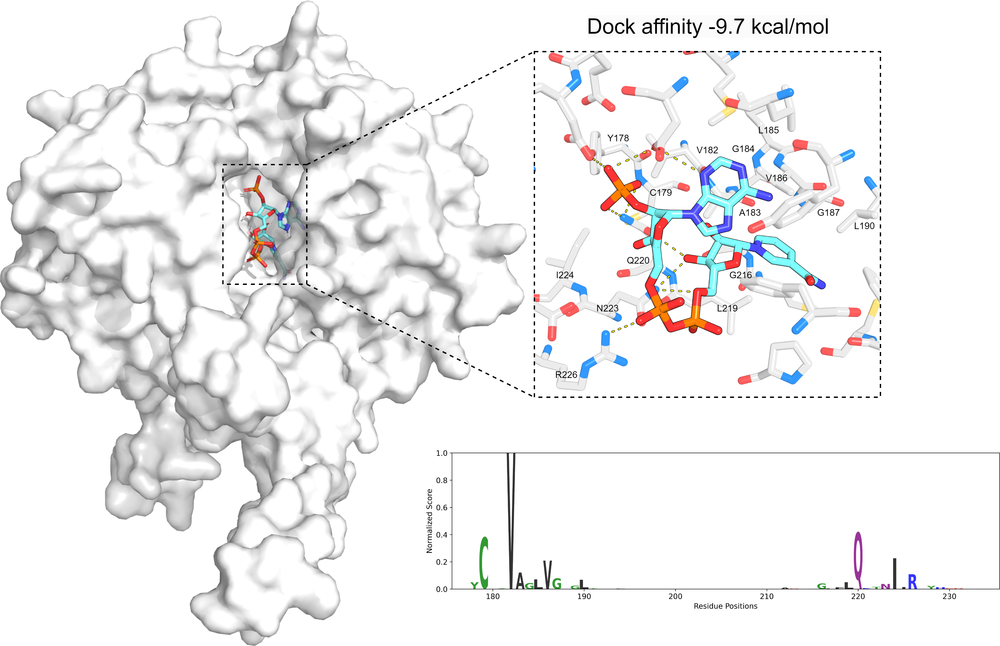
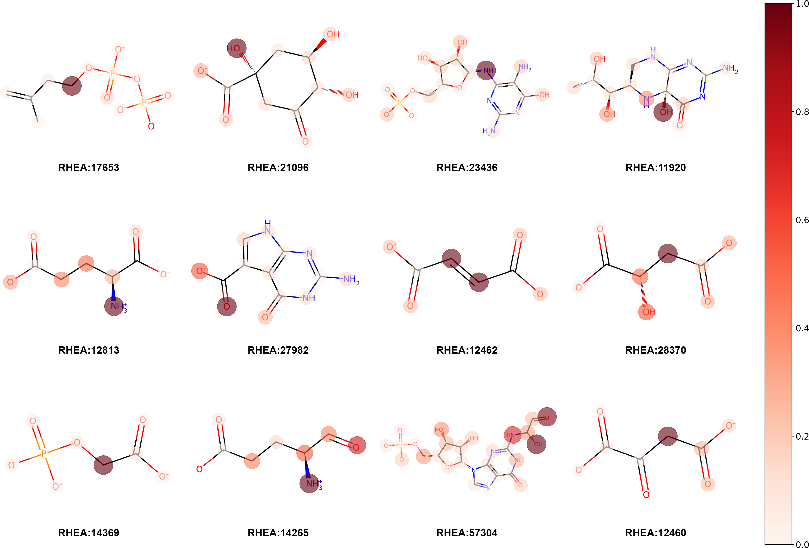

# AI读懂酶促反应：ERAM框架实现任务无关的多模态酶反应建模

## 本文信息

- **标题**：通过多模态关系学习实现准确且任务无关的酶反应建模
- **作者**：Yuansheng Huang, Lanqing Li, Wenjia Qian, Jiahui Yu, Huifeng Zhao, Xiaorui Wang, Odin Zhang, Guangyong Chen, Shukai Gu, Pheng-Ann Heng, Tingjun Hou, Yu Kang
- **发表时间**：2026年3月30日
- **单位**：浙江大学药学院（中国杭州）、浙江实验室生命科学计算研究中心（中国杭州）、香港中文大学计算机科学与工程系（中国香港）、新加坡国立大学计算学院（新加坡）、华盛顿大学 Paul G. Allen 计算机科学与工程学院（美国西雅图）
- **引用格式**：Huang Y, Li L, Qian W, Yu J, Zhao H, Wang X, Zhang O, Chen G, Gu S, Heng PA, Hou T, Kang Y. Accurate and task-agnostic modeling of enzymatic reactions through multimodal relational learning. *Acta Pharmaceutica Sinica B*. 2026. https://doi.org/10.1016/j.apsb.2026.03.052
- **代码与资源**：
  - Web服务器：http://cadd.zju.edu.cn/eram/

## 摘要

> 酶功能预测在合成生物学和药物发现中起着关键作用。然而，现有方法往往关注单一任务，缺乏统一框架来捕捉酶、底物和产物之间的复杂相互作用。本文提出了**ERAM**（Enzymatic-Reaction-Aware Molecular representation learning），一种通过多关系学习进行准确且任务无关的酶反应建模框架。ERAM将酶反应表示为**知识图谱三元组**，并将来自蛋白质语言模型的酶表示与小分子表示对齐。通过**双粒度对比学习**，ERAM在酶检索任务中比最先进的**CREEP**方法获得了**28.31**%的更高平均精度（MAP）。在底物预测任务中，ERAM在两个数据集上比**ESP**方法分别实现了**35.53**%和**22.97**%的更高马修斯相关系数。值得注意的是，ERAM可以在无需额外训练的情况下进行**无监督结合位点预测**，相比**RXNAAMapper**获得了**42.36**%的更低假阳性率和**70.59**%的更高重叠分数。实验结果表明，ERAM在三个任务上的有效性，为酶功能分析提供了统一的表示学习框架。

### 核心结论

- **统一预训练表示**：ERAM用同一套酶反应表示支撑**酶检索、底物预测和结合位点分析**，减少了为每个任务单独设计模型的需求
- **知识图谱式反应建模**：把酶反应写成底物—酶—产物三元组后，蛋白序列和小分子可以在**同一嵌入空间**中对齐
- **双粒度对比学习**：底物或产物替换对应**更大的几何间隔**，酶替换对应**更小的几何间隔**，模型据此学习不同层次的功能差异
- **注意力具备生物学指向性**：酶编码器和小分子编码器都能把高注意力集中到**结合位点或反应位点**附近

## 背景

酶是生物体内最重要的催化分子之一，也是绿色合成、代谢工程和合成生物学的核心工具。想要真正用好酶，研究者不仅要知道它属于哪个 EC 类别，还需要知道它能识别什么底物、能生成什么产物，以及催化残基大致位于哪里。**功能注释是否充分**，直接决定了这些序列能不能进入后续设计和应用流程。

困难在于，酶功能注释的速度远远赶不上序列积累的速度。UniProt 知识库已经包含超过 **2500万** 条酶序列，但只有 **0.91**% 有人工注释。传统实验路线又慢又贵，很难靠逐一测定去填平这条**序列—功能鸿沟**。

现有方法大致可以分成两类：一类是为某个单一任务设计专门模型，例如只做 EC 分类、只做底物预测，或者只做位点识别；另一类则尝试利用预训练蛋白模型和反应表示来做检索或匹配。前者往往**任务碎片化**，后者则容易只利用单一模态，难以完整表达“酶—底物—产物“这个催化单元。文中拿来对照的几条路线也很典型：**CREEP**对应专门的酶反应检索，**ESP**对应底物预测，**RXNAAMapper**对应无监督位点映射。
这里的核心问题是：**能否将酶反应建模为多关系数据，让酶、底物和产物的嵌入在同一几何框架下交互**？如果能做到这一点，同一个模型就能支持多种下游任务，研究者也就不用在不同工具之间来回切换。这个问题之所以重要，是因为在真实的酶工程流程中，科学家通常会连续问多个问题：这个反应由哪些酶催化？这些酶能接受哪些底物？催化位点大概在哪里？如果能用同一套表示空间回答这些问题，工作流会明显更顺畅。
这里的核心问题是：**能否将酶反应建模为多关系数据，让酶、底物和产物的嵌入在同一几何框架下交互**？如果能做到这一点，同一个模型就能支持多种下游任务，研究者也就不用在不同工具之间来回切换。这个问题之所以重要，是因为在真实的酶工程流程中，科学家通常会连续问多个问题：这个反应由哪些酶催化？这些酶能接受哪些底物？催化位点大概在哪里？如果能用同一套表示空间回答这些问题，工作流会明显更顺畅。

### 关键科学问题

- **酶功能的统一表示问题**：酶功能不是单一的序列属性，而是由底物、酶和产物共同决定的**关系属性**。如何将这种三元关系映射到一个统一的嵌入空间里，是整篇论文要解决的核心问题
- **多模态对齐问题**：蛋白质序列（氨基酸）和小分子（SMILES/3D结构）处于完全不同的表征空间。如何让这两种模态在**同一个嵌入空间**中对齐，而不是简单地拼接或投影，是技术上的一大难点。简单来说，这就像要把中文和英文翻译到同一个语义空间里，让模型理解“酶”和它的英文描述是同一个东西。
- **任务无关性边界问题**：“任务无关“更准确的含义是什么？是真正的**零样本学习**，还是**统一预训练表示**后在不同任务上微调？这个问题直接影响对模型能力的评价和实际应用场景的界定

### 创新点

- **知识图谱式反应建模**：将酶反应形式化为底物—酶—产物的三元组，在嵌入空间中满足”**头 + 关系 ≈ 尾**“的平移关系，把蛋白和小分子真正放进同一个几何问题里
- **双粒度对比学习**：区分**粗粒度负样本**（替换产物，破坏反应可行性）和**细粒度负样本**（替换酶，影响催化效率），分别对应不同大小的几何边界，让模型学习不同层次的功能差异
- **交叉注意力机制**：将底物信息注入酶编码器，使同一条酶序列在面对不同底物时可以形成**不同表示**，捕捉酶的**广谱性**和**诱导契合效应**
- **统一的预训练框架**：用同一套酶反应表示支撑**检索、底物预测和位点分析**三个任务，减少了为每个任务单独设计模型的需求

> **ERAM的核心想法**：把酶反应写成底物—酶—产物三元组，再用统一的嵌入空间去学习这些实体之间的关系。这样得到的表示既能支持检索，也能迁移到其他下游任务。更完整的技术细节和对照表请见[附录](2026-04-14-eram-enzymatic-reaction-附录.md)。

## 研究内容

### 数据集与任务设置

> 理解这篇论文，先要把两个基础问题搞清楚：**数据是怎么过滤的、任务到底在测什么**。这两点如果不说清，后面的检索、底物预测和位点分析就会混在一起看。

数据来源是 **UniProtKB/Swiss-Prot** 和 **RHEA**。经过过滤后，最终数据集包含 **254,106** 个反应样本、**197,352** 条独特酶序列、**1718** 个 EC 编号和 **3048** 个化学反应，训练／验证／测试按 **8:1:1** 划分。

这里有几条过滤规则特别关键，因为它们直接决定了模型的适用边界：

| 过滤维度 | 条件 | 含义 |
|---|---|---|
| 序列长度 | 超过 1024 aa 的酶序列去掉 | 受 ESM-2 编码长度限制 |
| 分子大小 | 超过 256 个原子的小分子去掉 | 受 Uni-Mol 编码范围限制 |
| 反应平衡性 | 底物和产物完全相同的反应去掉 | 保证三元组平移关系有意义 |
| EC 频次 | 出现少于 10 次的 EC 样本去掉 | 保证训练稳定和正样本数量 |

这组设置有一个很实际的后果：**ERAM主要验证的是“频次足够、定义相对清楚的酶反应“**。它能保证训练稳定，但也意味着模型对真正长尾 EC、极少见反应类型和更复杂体系的能力，没有在这篇论文里被直接展开。

把下游任务拆开看，也会更清楚：

| 任务 | 输入 | 输出 | 真正检验的能力 |
|---|---|---|---|
| 产物检索 | 底物 + 酶 | 候选产物排序 | 是否学到正确的反应映射 |
| 酶检索 | 底物 + 产物 | 候选酶排序 | 是否学到反应级功能表示 |
| 底物预测 | 酶 + 候选底物 | 二分类或打分 | 表示迁移后是否保留催化相容性 |
| 位点分析 | 酶序列 + 底物SMILES | 注意力热区 | 内部表示是否含有功能位点信息 |

这样看就很清楚：**检索任务是表示学习的直接考试**，底物预测更像迁移测试，位点分析则更像可解释性测试。三者都重要，但证据强度本来就不该被等量齐观。

### 核心方法：ERAM框架设计

**图1：ERAM框架与方法概述**。（A）模型结构概览：酶编码器包含冻结的ESM-2骨干、自注意力块、**交叉注意力块**、MLP和均值池化；小分子编码器由冻结的Uni-Mol、自注意力块、MLP和均值池化组成；底物和产物共享同一个编码器。（B）知识图谱中反应物（底物）、酶和产物之间的关系，以及小批量数据的**三元组损失函数**，其中 $d(e_q, e_t)$ 表示查询嵌入与目标嵌入之间的欧氏距离。（C）**双粒度对比学习**：产物被替换的样本归类为粗粒度负样本（大边界），酶被替换的样本归类为细粒度负样本（小边界）。（D）**酶原型学习过程**：通过计算酶嵌入与原型的余弦相似度交叉熵来更新编码器，再使用动量方法（如指数移动平均）更新原型。

ERAM由两条主分支构成。**小分子编码器**把底物和产物转成 SMILES，再用预训练的 Uni-Mol 生成原子级表示；**酶编码器**则把氨基酸序列输入 ESM-2，得到残基级表示。两边最终都会被投影到同一个嵌入空间里——你可以把这个空间想象成一个多维坐标系，相似的分子或酶会靠得更近。

**交叉注意力模块**让酶编码器在处理酶序列时，能够“关注”底物相关的部分，这样同一条酶序列在面对不同底物时可以形成不同表示。这个设计对应的，其实就是论文反复强调的**酶广谱性**（一个酶能催化多种底物）和**诱导契合**（底物结合后酶构象发生变化）：底物不同，酶的有效表示也应该不同，否则很难把”同一酶催化不同底物”的差异学出来。

更关键的设计是**双粒度对比学习**和**酶原型学习**。双粒度对比学习区分了两种不同层次的负样本：**粗粒度负样本替换产物**，会直接破坏反应可行性，对应较大的几何边界；**细粒度负样本替换酶**，更多影响催化效率或特异性，对应较小的几何边界。这个区分很重要，因为“换错产物”和”换错酶”在生化意义上本来就不是同一种错误。

**酶原型学习**为每个**酶类别**（不是单个酶）学习一个代表性向量（原型）。具体来说，**原型初始化为同一类别内所有酶嵌入的均值**，训练过程中通过动量方法（如指数移动平均）持续更新。在每次迭代中，编码器通过计算小批量内酶嵌入与对应原型的余弦相似度交叉熵来优化，使**同类酶的嵌入更接近各自的原型**。这就像给每个酶类别建立了一个“移动的标杆”，即使同一个酶在不同反应中出现，模型也能通过原型识别出它们属于同一类别。消融实验显示，去掉原型学习后酶检索MAP从 $0.8202$ 降到 $0.8014$，说明原型学习对建立稳定的酶级表示特别重要。

### 方法：知识图谱引导的关系学习

**图2：嵌入空间可视化**。T-SNE二维可视化展示（A）我们模型的表示和（B）ESM-2的表示；每个点代表一个酶的嵌入表示，随机选择15个酶类别进行高亮显示。我们模型的表示将**相同类别的酶聚集在一起**，而ESM-2表示中对应的类别更加分散。（C）ERAM学习的酶（灰色）和小分子（红色）表示的T-SNE二维可视化。（D）酶和（E）小分子表示的正态分布也一并给出。

ERAM把一个酶反应概念化为**知识图谱三元组**：底物是头实体，酶是关系，产物是尾实体。知识图谱就像社交网络，节点是实体（人和人之间的关系），边是它们之间的联系。训练目标要求底物嵌入加上酶嵌入后尽量接近产物嵌入，也就是“头 + 关系 ≈ 尾“。你可以把这个理解为向量空间中的“国王 - 男人 + 女人 ≈ 王后”这种类比关系。这一步把蛋白和小分子真正放进了同一个几何问题里。

围绕这条主线，作者又设计了两类负样本。在机器学习中，“负样本“指的是错误的或不匹配的样本，用来教模型什么是“不对的”。**粗粒度负样本**替换产物，会直接破坏反应可行性（就像把水变成了火，完全不对了），对应较大的边界；**细粒度负样本**替换酶，更多对应催化效率或特异性的变化（就像把高效的催化剂换成低效的，反应还能进行但变慢了），对应较小的边界。这个区分很重要，因为“换错产物”和“换错酶”在生化意义上本来就不是同一种错误。

这一部分解决的是最核心的问题：**如何把酶功能从单独的序列属性，改写成底物—酶—产物共同决定的关系问题**。只要这一层站得住，后面检索、底物预测和位点分析才有可能共用同一套表示。

### 结果1：检索任务给出了最核心的证据

**图3：涉及同分化合物的酶反应产物检索结果**。结果显示反应物和酶的组合表示与候选同分化合物之间计算的欧氏距离，以及对应的排序位置；**正确产物的距离最近、排名最高**。（A）反应示例1的检索结果。（B）反应示例2的检索结果。（C）反应示例3的检索结果。

检索任务是全文最硬的证据。摘要先给出一句最关键的话：**ERAM 的酶检索 MAP 相对 CREEP 提高了 28.31%**。主文表1进一步给出了不同序列同一性测试集上的完整结果：

**图4：Reactyme模型、CREEP和ERAM在酶检索任务中的性能比较**。（A）不同序列同一性范围下的产物检索MRR和Hit@1。（B）不同序列同一性范围下的酶检索MAP，**ERAM明显优于基线方法**。（C）不同EC子集下的酶检索MAP，ERAM在各个EC门类上表现稳定。BCE表示使用二元交叉熵损失训练，Contra表示使用对比损失训练。

| 序列同一性范围 | 产物MRR | 产物Hit@1 | 酶MAP |
|---|---:|---:|---:|
| 完整测试集（0–100%） | 0.9836 | 0.9701 | 0.8202 |
| 70–80% | 0.9980 | 0.9961 | 0.9684 |
| 60–70% | 0.9988 | 0.9980 | 0.9733 |
| 50–60% | 0.9982 | 0.9968 | 0.9752 |
| 40–50% | 0.9949 | 0.9898 | 0.9723 |
| 0–40% | 0.9952 | 0.9903 | 0.9770 |

这组结果有两个最值得记住的点。第一，**完整测试集上的产物检索已经非常强**，MRR 和 Hit@1 分别达到 0.9836 和 0.9701。第二，**低序列同一性子集并没有明显拖垮表现**，作者据此认为 sequence identity 对模型影响较小。

论文还按 EC 大类统计了酶检索 MAP：

| EC子集 | 酶MAP |
|---|---:|
| EC1 | 0.7874 |
| EC2 | 0.8913 |
| EC3 | 0.9465 |
| EC4 | 0.8102 |
| EC5 | 0.8433 |
| EC6 | 0.9513 |
| EC7 | 0.9395 |
| w/o EC | 0.8180 |

这张表说明 ERAM 并不只在某一个 EC 门类上工作。EC1 和无 EC 注释子集更难，EC3、EC6 和 EC7 则明显更高，说明不同子集的候选复杂度和酶多样性仍会带来波动。也正因为这组检索结果最完整，**它才是全文真正的骨架证据**。如果这一部分站不住，后面的迁移任务和位点分析就很难成立。

### 结果2：底物预测验证了表示的可迁移性

**图5：底物预测任务中的模型性能**。（A-C）Nitrilase底物预测在不同数据划分方法下的准确率（ACC）、ROC-AUC和马修斯相关系数（MCC）：随机划分、序列划分和底物划分，分别显示ERAM与基线方法的对比。（D-F）Aminotransferase底物预测在不同数据划分方法下的ACC、ROC-AUC和MCC，**ERAM在三种划分下都优于ESP方法**。

这里要先说清：**底物预测不是零样本读取，而是在 ERAM 预训练表示上继续微调**。“零样本“是指模型在没有见过任何示例的情况下直接预测，就像让一个从来没学过中文的人直接读中文报纸。论文原文明确说明底物预测阶段先对模型进行 fine-tune（微调，就像在已经学好的基础上再做一点针对性练习），所以“任务无关”更准确地说是统一预训练表示，而不是完全不训练。

定量结果来自摘要和图5：

| 数据集 | ERAM MCC | ESP MCC | 提升幅度 |
|---|---:|---:|---:|
| Nitrilase | 0.712 | 0.525 | 35.53% |
| Aminotransferase | 0.689 | 0.560 | 22.97% |

作者还指出，ESP 在底物划分场景下下降更明显，而 ERAM 下降较小。这说明 ERAM 学到的不只是“见过哪些底物“，而是更接近**酶反应层面的相容性**。主文还提到，除了 Nitrilase 和 Aminotransferase，Supporting Information 里又测试了 OleA thiolase 家族和 DUF849 家族；虽然正文没有逐项展开，但它至少说明这种迁移性不只停留在一个数据集上。

从批判性角度看，这部分支持的是“**表示可迁移**“，但证据强度仍然弱于检索任务。因为主文这里更多是两个代表性数据集和百分比提升，还没有像检索任务那样给出成体系的子集分析和消融闭环。

### 结果3：注意力权重可以落到已知结合位点上

**图6：ERAM在已注释酶上的结合位点注意力分布**。左侧展示酶氨基酸序列的**注意力分数可视化**（序列logo），右侧显示UniProtKB中注释的**酶结合位点**；高注意力残基与已知结合位点高度一致。（A）磷酸核糖基转移酶A1AXP4，模型对**124-132位残基**（DDVITVGTA）赋予高注意力，对应**PRPP结合位点**。（B）磷酸核糖基转移酶B5BDQ2，模型对**88-96位残基**（DDLVDTGGT）赋予高注意力，同样对应PRPP结合位点。（C）腺苷酰硫酸激酶A6KXG9，模型对**34-41位残基**（GLSGSGKS）赋予高注意力，对应**ATP结合位点**。（D）NAD激酶Q49897，模型对**204-209位残基**（TAYAFS）赋予高注意力，对应**NAD结合位点**。

结合位点分析走的是另一条路线：模型并没有额外训练一个位点分类器，而是直接读取酶编码器的注意力。在Transformer模型（包括ESM-2这样的蛋白语言模型）中，“注意力头“（Attention Head）就像是模型中的多个“观察者”，每个关注不同的部分。作者比较了不同注意力头在 PLIP 数据上的表现，其中 **Head 7** 的 Overlap 为 70.85%、FPR 为 45.28%，**Head 5** 的 Overlap 为 70.59%、FPR 为 42.36%。FPR（假阳性率）就是模型说“这里是结合位点”但其实不是的比例，越低越好。

正文最终采用的是 **Head 5**，因为它在重叠分数几乎不变的前提下，把假阳性率进一步压低。摘要里与 RXNAAMapper 的对照也对应这组结果：ERAM 的 FPR 为 42.36%，Overlap 为 70.59%，优于 RXNAAMapper 的 57.64% 和 51.43%。

**这一部分该怎么理解？**它说明注意力里确实带有位点信息，但这仍然是“从模型内部信号读出功能区域“，不是通过位点标签直接训练出来的监督分类器。证据层级目前还是结构映射和基准对照，还不是突变实验级别的因果验证。

### 结果4：未注释酶上的位点推断更像“可用示例“而不是终点验证

**图7：ERAM对未充分注释酶位点的案例分析**。以**角鲨烯合酶（A0A1D8PI71）**为例，展示**AlphaFold2预测结构**与AutoDock Vina对接结果；高注意力分数的氨基酸残基位于**结合口袋内**，且与类异戊二烯生物合成酶家族的保守结构域残基**Y178、A183、V186、G187、L190、G216、L219和R226**完全一致，证明ERAM在无注释酶上的**位点预测能力**。

这一部分的重点不是再做一次基准测试，而是展示 ERAM 在真实、注释不完整的蛋白上是否还能给出有用线索。作者选取 A0A1D8PI71 作为案例，先用 AlphaFold2 补结构，再用 AutoDock Vina 做 NADP 对接，最后用 BLAST 和保守位点信息辅助解释。

这组证据说明 ERAM 的高注意力残基可以和已知保守口袋对应上，但证据层级仍然是**结构建模—对接—保守位点对照**。如果再往下追一步，真正想看到的是：挑几个高注意力残基做突变，再看活性和底物谱是否真的变化。

### 结果5：小分子编码器也学到了反应位点

**图8：小分子编码器注意力权重的可视化**。展示多条RHEA反应中模型对小分子的**注意力分布**；红色高亮表示**高注意力原子**，主要集中在**键断裂、加成、消除和立体化学变化**等真正发生化学反应的**活性位点**，以及参与反应的**重要官能团**上，证明小分子编码器学习到了**反应相关的化学知识**。

这张图和酶侧的位点分析正好形成对应：**酶编码器**把高注意力放到结合位点附近，**小分子编码器**把高注意力放到反应位点附近。如果两边都成立，说明 ERAM 学到的不是简单的序列相似性或分子相似性，而是更接近“谁和谁发生催化作用、在哪些位置发生反应“的表征。

这也是为什么这篇论文虽然把“任务无关“写在标题里，真正最有说服力的地方仍然是**同一套表示在多个层面都能读出化学和生物学结构**。

### 结果6：消融实验告诉我们哪些设计最重要

论文的表3给出了最关键的一组消融结果：

| 方法 | 产物MRR | 产物Hit@1 | 酶MAP |
|---|---:|---:|---:|
| Margin-Fine | 0.9773 | 0.9655 | 0.8325 |
| Margin-Coarse | 0.9669 | 0.9502 | 0.7525 |
| w/o Prototype | 0.9829 | 0.9696 | 0.8014 |
| Self-Attn | 0.9781 | 0.9593 | 0.6755 |
| **ERAM** | **0.9836** | **0.9701** | **0.8202** |

这张表最值得细看的是三点：

- **交叉注意力很关键**：Self-Attn 的酶 MAP 只有 0.6755，明显低于 ERAM，说明底物信息注入酶编码器至关重要
- **原型学习主要拉高酶检索**：原型学习是一种机器学习技巧，为每个类别（这里是每个酶）学习一个代表性向量。去掉原型后，产物检索变化不大，但酶 MAP 从 0.8202 降到 0.8014，说明原型学习对酶级表示特别重要，就像给每个酶建立了一个“标准档案“一样
- **双粒度学习的收益并不平均**：ERAM 明显优于 Margin-Coarse，但与 Margin-Fine 非常接近，说明细粒度负样本已经能覆盖相当一部分收益

因此，更稳的表述不是“双粒度在所有指标上都不可替代“，而是：双粒度设计至少避免了统一大边界带来的明显退化，但它相对 Margin-Fine 的额外收益主要体现在产物检索，酶检索上的优势没有被拉得很开。

这里其实藏着全文最值得追问的一点：如果只保留细粒度负样本，模型已经能拿到非常接近的结果，那么双粒度设计的额外价值究竟主要体现在哪些反应类型、哪些检索场景，论文还没有讲到完全闭环。

### 和现有方法放在一起看，ERAM到底新在哪里

如果只看摘要，很容易把 ERAM 理解成“又一个把蛋白和小分子拼在一起的模型“。但把正文里的几个基线放在一起看，它的区别其实很清楚。**CREEP** 的重点是酶反应检索，**ESP** 的重点是底物预测，**RXNAAMapper** 的重点是无监督位点映射；ERAM想做的，则是把这三件事尽量压缩到**同一套预训练表示**里。

这也是为什么这篇论文真正有价值的地方，不只是几个百分点的提升，而是它提出了一种**统一入口**：先用酶反应级表示作为基础，再把不同任务当作不同读取方式，而不是为每个任务从头建一个模型。

这个想法有现实价值。因为在酶工程场景里，研究者通常不会只问一个问题，而是会连续地问：这个反应可能由哪些酶催化，这个酶可能接受哪些底物，真正起作用的位点又大概在哪里。**如果这三件事都要切换模型，工作流会非常碎；如果它们能回到同一套表示空间，后续分析就会顺很多。**

当然，这里的“统一“也要读得克制一点。统一的是**预训练入口和表示空间**，不是说三个任务都已经被同样彻底地解决了。检索任务最完整，底物预测次之，位点分析更像一个很有潜力的解释出口。这样理解，整篇论文的定位就会更稳。

### 三个任务放在一起，ERAM到底证明了什么

如果把全文最重要的几组结果连起来看，ERAM真正证明的是下面这条链：**统一表示可以先把检索做好，同一套表示还能迁移到底物预测，同一个编码器内部又能读出位点相关信号**。

这条链条是顺的，而且每一步都比上一步更“松“一点。检索任务是最直接的验证，因为它直接考察反应级嵌入空间是不是站得住；底物预测往前走了一步，证明这些表示能迁移到判别任务；位点分析再往前走一步，说明模型内部注意力并不是完全无生物学意义。

但也正因为如此，整篇论文最稳的总结应该是：**ERAM提出了一套统一的酶反应表示学习入口**，而不是已经把所有相关任务都用同样硬度的证据证明完毕。这个区分很重要，因为它决定了我们该如何评价“任务无关“这几个字。

### 这一套证据链到底支撑到了哪一步

把前面的结果合在一起看，ERAM 的论证链条大致是：**检索任务**证明统一表示本身确实有信息量，**底物预测**证明这套表示可以迁移到另一类判别任务，**位点分析**证明模型内部信号和真实功能区域存在对应关系。

这个逻辑总体是成立的，但证据强度并不完全对称：**检索任务最硬，底物预测次之，位点分析最需要后续实验补强**。因此，比较稳妥的总体判断是：ERAM已经提出了一套有说服力的统一表示框架，但“统一框架“这四个字更接近统一预训练入口，而不是所有任务都已经被同等强度地证明。

### 这篇论文没有真正回答什么

把优点说清之后，边界也要说清。最明显的一条边界来自数据筛选：**出现少于 10 次的 EC 样本在建库前就被去掉了**。这一步对训练稳定当然有帮助，但也意味着 ERAM 还没有直接回答“极低频 EC 怎么办““训练时完全没见过的功能类别怎么办”。

同样，位点分析虽然已经很有启发性，但它解决的是“**模型内部信号是否能和已知功能区域对上**“，还没有解决“这些高注意力残基是不是因果位点”。如果后续能补几组突变实验，这一部分的说服力会立刻上一个台阶。

再往前一步看，ERAM把底物、酶和产物压进同一套表示空间，本身就默认了一个前提：**很多酶反应可以被一个相对统一的三元组框架概括**。对经典单酶反应，这个前提通常成立；但对多酶复合物、强依赖辅因子的体系或者更复杂的反应网络，这篇论文还没有展开。

### 如果把ERAM放回真实酶工程流程里

把这篇论文放回实际工作流里看，它最适合扮演的角色不是“终局预测器“，而是一个**统一的前端筛选器**。研究者可以先用它做酶检索，再用同一套表示去筛底物兼容性，最后再把高分样本的注意力区域拿去辅助位点设计。

这种定位有两个好处。第一，**信息在同一套表示空间里流动**，不用在多个模型之间来回切换。第二，就算后面仍然要接结构建模、分子对接或突变实验，前面的搜索空间也已经被明显压小。

所以更贴切的评价不是“ERAM已经解决了酶功能预测“，而是：**ERAM把酶反应建模这件事从零散任务，推进成了一条更连贯的表示学习工作流。**

### 还缺什么，才能把这篇论文再往前推一步

从正文和提取文本里能直接看出的缺口，主要有四类：

- **效率评估**：主文没有报告训练时间、推理速度和显存占用，大模型在实际部署中的成本仍不清楚
- **长尾 EC 测试**：当前数据筛选会压缩低频 EC，后续需要更直接地检验少样本或零样本能力  
- **失败案例系统分析**：原文提到多反应酶、层级分类和 R 基团等难点，但主文没有把错误模式拆开讲
- **实验验证闭环**：位点分析如果能接上突变实验，解释力会明显更强

---

## Q&A

- **ERAM 的“任务无关“到底是什么意思**：这里更准确的说法是“统一预训练表示”。酶检索可以直接用嵌入距离完成（就像查字典，看哪个词的意思最接近），底物预测需要在预训练表示上继续微调（就像在已学知识的基础上再做练习），结合位点分析则是从训练好的酶编码器注意力中读取信号（就像翻看模型的“笔记”，看它关注了哪些位置）。

- **双粒度对比学习是不是这篇最关键的创新**：它很重要，但不能说收益在所有指标上都压倒性。表3显示 ERAM 明显优于 Margin-Coarse，说明统一大边界不合适；但 ERAM 和 Margin-Fine 非常接近，说明细粒度负样本已经能覆盖相当一部分收益。

- **结合位点预测为什么能叫“无监督“**：因为模型没有额外用结合位点标签训练一个分类器，而是直接读取酶编码器的注意力分布。这个说法在方法定义上成立，但它和“已经得到实验级解释”仍然是两回事。

---

## 关键结论与批判性总结

- **主要贡献**：ERAM把酶反应学习从“单一任务的专用表示“推进到了“围绕底物—酶—产物关系的统一多模态表示”
- **最硬证据**：相对 CREEP 的 28.31% MAP 提升，以及在不同序列同一性和 EC 子集上的稳定表现
- **最需要收住的表述**：所谓“任务无关“，更接近统一预训练表示，而不是所有任务都零样本完成
- **最明显的边界**：长尾 EC 泛化、双粒度相对 Margin-Fine 的额外收益，以及位点解释的实验级验证，仍然需要补强

---

**详细技术细节、完整子集结果和更精简的对照表请参见**：[附录](2026-04-14-eram-enzymatic-reaction-附录.md)

