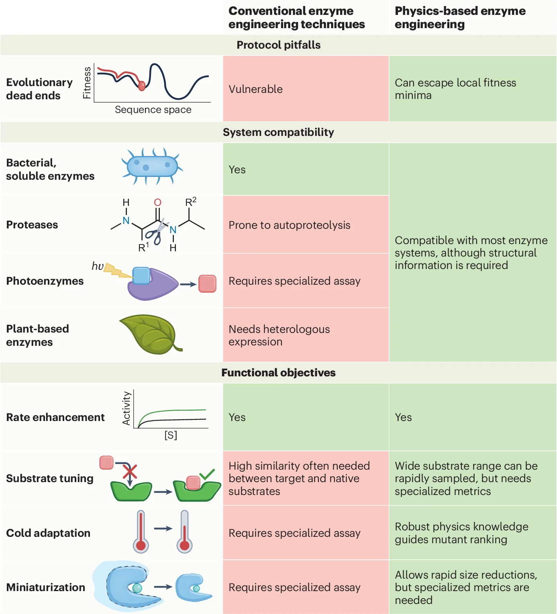
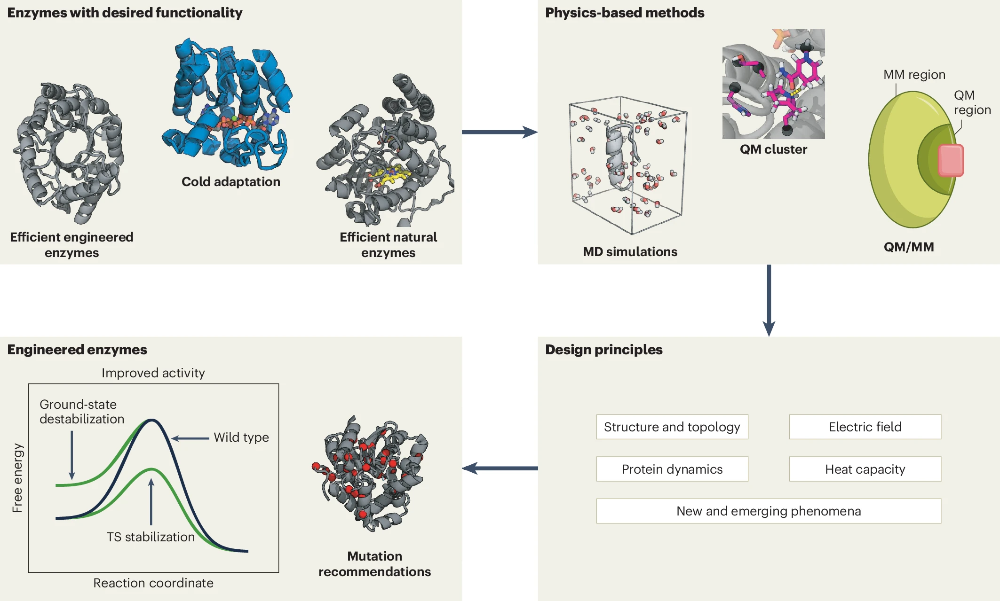
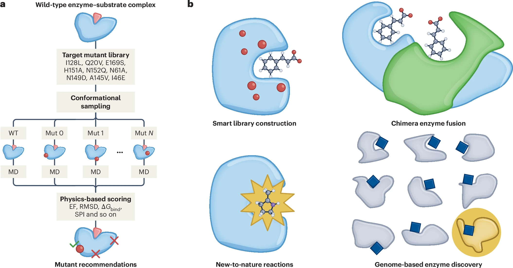
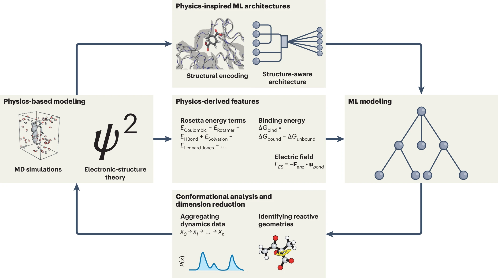

# 酶工程新时代的基石：物理建模如何突破定向进化的天花板

## 本文信息

- **标题**：酶工程新时代中的物理建模
- **作者**：Christopher Jurich, Qianzhen Shao, Xinchun Ran, Zhongyue J. Yang
- **发表时间**：2025年4月24日在线发表（Nature Computational Science, 2025年4月，第5卷，279–291页）
- **单位**：范德堡大学（Vanderbilt University）
- **引用格式**：Jurich, C., Shao, Q., Ran, X. & Yang, Z. J. Physics-based modeling in the new era of enzyme engineering. *Nat. Comput. Sci.* **5**, 279–291 (2025). https://doi.org/10.1038/s43588-025-00788-8

---

## 摘要

> 酶工程正在进入一个以**计算策略整合为特征**的新时代。虽然生物信息学和人工智能方法已被广泛用于加速功能增强型突变体的筛选，但基于物理的建模方法（如分子力学和量子力学）在许多目标中是必不可少的补充。在本文中，我们强调了基于物理的建模如何通过探索当前进展、未解决的挑战以及工具开发的新兴机遇，帮助计算酶工程领域充分发挥其潜力。

### 核心结论

- **定向进化存在固有局限**：依赖高通量筛选的定向进化难以处理蛋白酶（自水解）、光酶（利用光进行催化的酶，需要恒定光照设备）、植物源/哺乳动物酶（异源表达困难）等体系，也容易陷入进化死胡同。
- **基于物理的建模填补关键空白**：量子力学（QM）、分子力学（MM）和QM/MM方法可以在原子分辨率上计算任意有三维结构的酶体系的实验相关性质，不受酶来源或操作条件限制。
- **设计原理的提炼与自动化**：通过分析**酶的结构、静电、动力学和热容等**特征，可以归纳出定量的设计原理，并借助高通量工作流（如EnzyHTP、SubTuner）自动筛选突变体。
- **物理建模与机器学习形成共生关系**：物理建模为ML提供有化学意义的描述符（如电场、结合能、底物定位指数），ML则帮助降维、生成过渡态几何构型、加速动力学模拟。
- **亟需高质量的基准数据集**：与结构预测领域的 CASP 类似，酶工程领域需要盲测式的功能预测竞赛和标准化数据库，以公正评估计算方法。

---

## 背景

### 酶工程的工业化需求与定向进化的辉煌

酶工程的目标是让酶为合成、治疗和可持续性服务。工业界对工程化酶的需求强劲，预计未来十年复合年增长率在5%至6%之间。一个理想的未来是：计算协议能够以定量精度定位功能性野生型酶及其工程化变体，从而以最少的筛选工作实现生物催化开发，同时降低经济和环境成本。

历史上，**定向进化一直主导着该领域**。通过迭代诱变和高通量筛选，定向进化已成功创造出无数用于化学合成、环境污染物降解或升级回收以及治疗的酶。然而，定向进化依赖高通量实验筛选，这使其在多个场景下难以应用：

- **副反应不可忽略时**：例如蛋白酶会自我水解，难以构建筛选体系。
- **需要专门设备时**：例如光酶（利用光进行催化的酶）需要恒定光照且无污染的特殊装置。
- **工程目标不匹配时**：例如微型化（在保持高活性的同时减小酶的大小）无法通过高通量删除或截短可靠实现；工业生物合成中高低温度适应性的改造，由于生物条件与工业条件（温度、pH等）的普遍不匹配，也难以用高通量筛选解决。
- **表达系统受限时**：植物源和哺乳动物酶在大肠杆菌中表达困难或具有免疫原性，无法用于常规高通量筛选。

更令人警醒的是，定向进化常把催化过程当成**黑箱**，容易陷入**进化死胡同**——一旦被困，即使再筛选$10^9$个变体也无法改善效率（如人源犬尿氨酸酶的案例）。

### 计算方法的崛起与物理建模的不可替代性

计算方法为酶工程提供了突破这些局限的路径。尽管生物信息学和人工智能（AI）被越来越广泛地应用，但由于酶序列-结构-功能关系数据的数量和质量普遍不足，**基于物理的分子建模技术仍然不可或缺**。

**图1**：基于物理的计算方法作为实现酶工程全部潜力的途径。传统酶工程技术（中间列）在提高细菌、非膜结合酶的催化效率方面表现出色。基于物理的计算酶工程技术（右列）可扩展到更广泛的酶性质和系统。

QM和MM方法在理论上可以应用于任意具有原子分辨率三维结构的体系，无论酶来源于细菌、植物还是哺乳动物，无论其偏好何种操作条件（高温、低温、极端pH）。通过物理建模，**从头酶设计**已经展示了第一性原理方法创造催化新自然反应的人工酶的能力。虽然这些人工骨架通常还需要用定向进化进一步优化（从而再次打开进化死胡同的大门），但从头设计活动证明了虚拟的、基于物理的设计能够提供理性设计独有的骨架，这是计算酶工程的一个概念性里程碑。

## 研究内容

**图2**：基于物理的原理的生命周期。左上：通过观察具有所需功能特征（如高效率或冷适应）的天然和工程化来源，推导出基于物理的原理。左中：高效工程化Kemp eliminase（KE，灰色，PDB ID 8usi）和冷适性酶（蓝色，PDB ID 6tkl）。左下：通过理性突变或定向进化实现工程化。右侧：将基于物理的原理应用于新系统，实现酶工程的迭代优化循环。

### 设计原理一：结构与拓扑

结构启发的酶工程最为直观——当活性位点与底物形状互补时，催化效率更高。例如：
- 保守的鸟嘌呤结合位点广泛驱动核酶的选择性。
- 儿茶酚-O-甲基转移酶中的一个残基通过定位S-腺苷甲硫氨酸辅因子来达到理想的供体-受体距离。
- 细菌芳胺脱羧酶的活性位点残基通过调节疏水口袋的大小来适应不同底物。

**拓扑工程**侧重于选择突变以促进底物结合，或改善隧道可及性以加速反应物/产物的扩散。通过突变连接活性位点与酶表面的隧道中的残基，可以调节底物和水到达活性位点的能力。这一原理已在实验中广泛验证，并用于隧道的从头设计。

此外，改变表面带电残基的数量可以调节酶的**pH最适性**。大多数酶在中性pH附近进化，而耐受非生物常见pH条件为在碱性或酸性环境中更快进行的反应打开了大门。改变pH最适性是一个尚未充分利用的工程策略。

> 结构信息工程的一个关键挑战是：仅仅稳定基态相互作用是不够的——酶还必须确保协调的相互作用将底物定位在能够生成产物的**反应性构象**上。AlphaFold3可以预测底物-酶复合物，但稳定基态相互作用并不等同于稳定过渡态。

### 设计原理二：静电（电场）

Linus Pauling提出酶通过稳定过渡态实现催化，而Ariel Warshel通过多尺度分子模拟证明**预组织的静电效应**在很大程度上贡献了这种稳定化。Boxer课题组利用振动斯塔克位移光谱实验测量了电场，证明电场强度与过渡态稳定化之间存在定量联系。

电场可以通过库仑定律近似计算（基于固定电荷MM、可极化MM或QM方法得到的原子电荷）。将计算出的电场投影到反应键的偶极矩上，可以得到稳定化能，该能量量化了酶促进过渡态中键断裂和形成的能力。这一原理已在酮类固醇异构酶、Kemp eliminase、P450、二氢叶酸还原酶等多种体系中得到广泛验证。

Head-Gordon课题组的开创性工作将静电理解转化为设计原理：Kemp eliminase中的单个突变可以有效地微调投影到催化相关化学键上的电场大小，从而设计出高效KE。另一个例子是，对高效水解酶静电基础的观察促使引入一个天冬氨酸残基，通过静电稳定过渡态将枯草芽孢杆菌酯酶Bs2转化为酰胺酶。

**电场稳定化能的计算**有两种常用公式：

$$
E_{\mathrm{ES}} = -\mathbf{F}_{\mathrm{env}}\cdot \mathbf{u}_{\mathrm{bond}} \quad (1)
$$

$$
E_{\mathrm{ES}} = \int \rho (\mathbf{r})V_{\mathrm{env}}(\mathbf{r})\mathrm{d}^3 \mathbf{r} \quad (2)
$$

其中$\mathbf{F}_{\mathrm{env}}$是酶环境产生的电场，$\mathbf{u}_{\mathrm{bond}}$是反应键的偶极矩（反映化学键正负电荷分布的极性），$\rho$是电子密度，$V_{\mathrm{env}}$是静电势。

> 理性工程依赖于部署点突变来增强电场强度或稳定化效应，但关键假设是突变体保留野生型蛋白的整体折叠和底物定位动力学。后者尤其重要——底物取向的微小改变可能会迅速抵消预期的静电增益。基于侧链互信息的残基耦合分析提供了一种识别不太可能扰动底物动力学的电场介导残基的潜在方法。

### 设计原理三：蛋白质动力学

蛋白质动力学启发的酶工程强调构象变化如何介导催化活性，提供静态结构分析无法获得的物理见解和设计假设。一个从 PDB 得到的单一静态结构，并不能告诉我们酶的重组如何影响底物结合和化学转化。

- **近攻击构象**（NAC）概念：Hur和Bruice提出，酶通过稳定底物的反应性构象来加速反应。在分支酸变位酶中，底物在活性位点采用 NAC 构象的概率与催化速率直接相关。这一原理已被用于工程化 **Kemp eliminase** 和荧光素酶。
- **动力学网络与远程突变**：通过分子动力学模拟可以识别出与催化相关的动力学网络。例如，文中提到的祖先荧光素酶 **AncHLD-RLuc**，本质上是一个通过祖先序列重建得到的荧光素酶相关蛋白；针对它的工程化研究显示，**环区突变可以通过改变柔性来增强配体结合和酶活性**。Osuna课题组开发的“最短路径图”工具则进一步帮助识别从活性位点向外传播的动力学耦合残基。
- **构象集合**：Yabukarski等利用X射线衍生的构象集合评估活性位点定位，Du等最近利用构象集合揭示了丝氨酸蛋白酶催化的起源。这些工作表明，**酶活性不仅取决于单一结构，还取决于整个构象集合的统计分布**。

一个未解之谜是：酶是否利用飞秒级的快速蛋白运动来促进化学反应？过渡路径分析表明，嘌呤核苷磷酸化酶中一个远端残基贡献了这样一种快速促进振动。**基于 QM/MM 的准经典轨迹模拟**则展示了反应后分叉如何决定 SpnF 催化的 Diels–Alder 反应中的产物选择性。对这些化学活化网络的基本理解，将揭示工程化生物催化剂的新途径。

### 设计原理四：热容与温度适应性

酶的**最适温度**由催化速率与热失活的平衡决定。嗜冷酶在低温下具有高活性，但热稳定性差；嗜热酶则相反。通过设计改变酶的热容（$\Delta C_p^\ddagger$）可以调节最适温度。

Åqvist课题组通过计算机模拟解释了嗜冷酶异常最适温度的来源：低温下活性位点的构象波动增加，反而促进了底物结合。van der Ent等最近展示了通过计算设计酶反应最适温度的可能性。

**冷适应的设计原理**：来自嗜冷生物（如节杆菌、假单胞菌）的酶具有更灵活的活性位点环、更少的盐桥和更少的脯氨酸。通过将嗜热酶的结构特征反向应用，可以将中温酶改造为冷适应酶。同样，通过增加疏水核心的致密性、引入盐桥和脯氨酸，可以提高热稳定性。

> 一个未被充分利用的策略是**连接子介导的结构域分离**：在多结构域酶中，通过延长连接子使结构域分离，可以增加活性位点的柔性，从而增强冷适应能力。这一原理在纤维素酶中已得到初步验证。

### 高通量计算工作流：从CADEE到SubTuner

为了将设计原理自动化、规模化地应用于突变筛选，研究者开发了多个高通量工作流。

**图3**：高通量工作流在酶工程中的作用。a. 传统计算酶工程工作流的通用模式：从野生型酶-底物复合物出发，构建突变体库，对每个突变体进行构象采样（通常用MD），计算物理描述符（如RMSD、电场、底物结合能$\Delta G_{\text{bind}}$、底物定位指数$\text{SPI}$等），然后根据与野生型的比较对突变体进行排序和推荐。b. 现有工作流主要集中在通过突变优化速率效率，但其他功能目标（如智能库构建、嵌合酶融合、新自然反应工程、基因组酶发现）仍有待开发。

图3的左侧工作流之所以能走通，关键在于**每一步都锚定在物理可观测量上**：RMSD反映结构变化幅度，电场度量对过渡态的静电稳定化，$\Delta G_{\text{bind}}$和SPI描述底物结合质量。这些描述符不是经验打分，而是从原子模拟里直接算出来的物理量，所以理论上可以在不同酶体系之间迁移。但现实是，大多数工作流目前只覆盖了"速率优化"这一类目标。右侧列出的几类任务——智能库构建（如何选最有信息量的突变组合）、嵌合酶融合（如何拼接不同酶的结构域）、新自然反应工程（如何从头设计催化新反应的活性位点）、基因组酶发现（如何在大规模序列中快速筛选）——每一个都要求工作流能回答的问题不只是"哪个突变更稳定"，而是"哪个设计策略真正改变化学路径"。这才是图3真正想说的：**工作流的覆盖面还不够**。

#### CADEE（2017）

CADEE（计算机辅助定向进化）是第一个专门为基于活化能（通过经验价键理论EVB自由能微扰和伞形采样计算）排序和推荐突变体而设计的平台。它突破性地实现了自动化，但其性能对EVB力场的参数化质量敏感，缺乏实验数据时需要专家输入，且主要支持EVB方法。

#### 相关工具与数据库

- **Rosetta**：强大的蛋白质建模套件，提供能量函数和多种设计协议，是计算酶工程的基础工具之一。
- **AlphaFold2/3**：虽然主要用于结构预测，但其高精度的结构模型可作为物理建模的输入。Brown等指出，AlphaFold预测可作为构象Boltzmann分布的近似，但存在一定局限性。
- **KLIFS**：激酶结构数据库，提供激酶-配体相互作用的功能位点信息，有助于工程化激酶的底物特异性。
- **BioFragment Database（BFDb）**：QM衍生的蛋白相互作用能数据库，为ML模型训练提供可解释的物理描述符。
- **IntEnzyDB**：集成结构-动力学酶学数据库，正在弥补序列-结构-功能数据的缺口。

#### EnzyHTP（2022）

EnzyHTP是一个通用的高通量酶建模平台，完全使用Python编写，自动化了酶工程的每一步：准备、诱变、几何采样和事后分析。它支持任意分子建模任务，包括MD、QM、配体对接、轨迹分析等。EnzyHTP更像一个模块化面包板，其他工作流可以构建在其之上。

#### SubTuner（2025）

基于EnzyHTP构建的SubTuner，是一个专门用于工程化酶催化非天然底物的计算工具。它基于三个假设：有益突变必须（1）热稳定，（2）能够结合限速过渡态，（3）通过活性位点电场优化稳定过渡态的发育偶极。在数百个突变体和多种底物上评估，SubTuner在命中率、功能增强速度和有益多突变设计的多样性方面优于现有AI模型。

这段在原文里其实很重要，因为它把前面零散讨论的**热稳定性、过渡态结合和电场优化**压缩成了一个可执行工作流。换句话说，SubTuner 不是简单把 MD、QM 和打分函数串起来，而是先假定有益突变至少要同时满足这三个物理条件，再据此筛掉大量不靠谱候选。这样做的好处是：**工作流终于开始显式回答为什么这个突变可能有用**，而不只是给出一个黑箱排序。

原文还特别提醒了一点：这类工作流并不是已经完全成熟。即便 SubTuner 展示了不错的效果，**计算成本、突变体排序精度、smart library construction 和 functional scoring 之间的 Pareto 权衡** 仍然没有真正解决。说白一点，就是算得更精、更全，往往也更贵、更慢；算得更快，又可能牺牲命中率和多突变设计质量。这个矛盾本身，就是高通量物理建模今天最现实的瓶颈之一。

### 物理建模与机器学习的共生关系

**图4**：物理建模与ML建模的共生关系。物理建模（左）提供Rosetta能量项、结合能、电场稳定化能等描述符（中），可直接作为ML模型的输入（右）。物理建模也启发了编码结构信息的ML架构（上中），例如将主链表示为结构编码。ML帮助从高维数据中提取催化相关特征（下中），如识别反应性几何构型。

这张图最值得看的地方，是它把物理建模和机器学习之间的关系从谁替代谁改写成了**双向供给**。往一个方向看，物理模型产出的电场、结合能、Rosetta 能量项和过渡态信息，可以直接变成 ML 的输入特征；往另一个方向看，ML 又能帮助压缩高维模拟结果、生成过渡态几何、甚至近似 QM/MM 势能面。原文的真正立场不是物理方法终将被端到端模型替代，而是：**未来强模型更可能来自物理约束和数据驱动的耦合**。

#### 物理建模赋能ML

- **结构特征提升ML性能**：将MD衍生的构象描述符（如$\text{RMSF}$、主成分）纳入模型，改善了对牛肠激酶突变效应的预测。EnzyKR使用活性位点-反应物相互作用编码结构特征，成功预测了水解酶动力学拆分中的优势对映体。
- **QM衍生描述符**：对接得分、QM衍生电荷等使得分类器能够准确预测细菌腈水解酶的底物混杂性。
- **结构感知图神经网络**：将Rosetta能量项和序列同一性整合到结构感知蛋白图卷积网络中，改善了对蛋白酶特异性的预测。

> 然而，获取与实验表征的活性和选择性数据相链接的高质量酶-底物复合物结构是一个实际挑战。酶突变和不同底物的组合爆炸使得单纯依赖AI方法不切实际。大规模数据集如ProteinGym提供适应性值，但物理化学相关性有限。集成序列-结构-功能数据库（如IntEnzyDB）正在出现，但规模仍远远落后于社区需求。

这里对 **ProteinGym** 的批评值得单独拎出来。原文不是说它没用，而是说它更适合做**蛋白 fitness 预测**，不太适合直接支持酶工程里的物理建模。原因有两层：第一，它缺少底物、反应机制和酶—底物复合物结构这些关键信息；第二，它把很多不同实验条件下得到的 readout 放在一起，**不同 assay 反映的物理量并不完全可比**。所以 ProteinGym 对 ML 很有价值，但如果想训练真正理解催化机制的模型，数据还是不够“物理”。

这也是为什么原文把 **IntEnzyDB** 一类数据库看得很重。它们的意义不只是多存一点序列，而是试图把**序列、结构、动力学和功能**放进同一张表里。对酶工程来说，真正缺的不是更多活不活的标签，而是**在什么底物、什么条件、什么构象下、为什么会活** 这类可回溯信息。

#### ML赋能物理建模

- **过渡态几何生成**：等变扩散模型可以从反应物和产物的结构出发，生成高精度的气相过渡态几何结构。将其扩展到考虑活性位点和溶剂分子的相互作用是一个活跃方向。
- **ML势函数加速模拟**：AI2BMD框架使用基于蛋白片段QM计算训练的ML势，实现了媲美纯QM精度的动力学模拟，成本大幅降低。
- **从高维MD中提取催化意义**：在酮醇酸还原异构酶（KARI）中，ML模型分析了底物转化事件，识别出与反应性强烈相关的可测量量。将此技术推广到更多体系，有望提炼出关于配体几何如何影响反应性的普适理解。

---

## 讨论

### 为什么物理建模是“新纪元”的关键？

尽管定向进化和高通量筛选的能力令人印象深刻，但这只是一个中间步骤。**最终目标是开发能够解决任何工程目标、应用于任何酶系统的方法**。基于物理的建模凭借其独特能力——从第一性原理直接预测实验可观测量、阐明分子机制、识别关键分子描述符作为设计原理——在推动下一代酶工程方法中扮演着不可或缺的角色。

### 当前挑战

- **计算成本**：MD和QM/MM可能需要数天时间。硬件上，量子计算可能成为下一代电子结构模拟的引擎，但真正的量子优势尚未实现。算法上，AI加速的高精度能量计算和采样（如ML势函数、生成式自由能映射）展现出巨大潜力。
- **缺乏标准化基准**：与传统计算化学有成熟的基准集（如热化学预测）不同，计算酶工程面临一个不断变化的目标。一些模型系统（如Kemp eliminase）已成为事实上的基准，但从单一酶得出结论存在偏差。需要类似于CASP的“Critical Assessment of Enzyme Functional Prediction”盲测竞赛。2023年的Protein Engineering Tournament是一个里程碑，但还远远不够。
- **软件工程的可持续性**：许多软件包在开发活跃期过后即停止维护，导致无意的专业化。社区缺乏软件工程指南（尽管有FAIR原则和ELIXIR基础设施的类比）。Loschmidt Lab公开了15个软件工具和3个数据库，是榜样。Molecular Sciences Software Institute（MolSSI）在提高社区对软件设计原则重要性的认识方面产生了巨大影响。

这三条里，**基准测试缺失** 可能是最根本的问题。原文专门提到 2023 年的 **Protein Engineering Tournament**，把它视为一个重要起点：不同团队对同一批酶活性做预测，最后统一公开结果。这个思路之所以重要，是因为酶工程现在最缺的不是单篇案例，而是**可重复、可横向比较、可定期更新** 的盲测体系。没有这种共同试卷，方法论文就很容易陷入“各自挑数据、各自挑指标、各自宣称更强”的循环。

所以原文提出的 **Critical Assessment of Enzyme Functional Prediction**，本质上是想给酶工程造一个类似 CASP 的共同战场。它不只是为了排榜单，更是为了逼着社区统一任务定义、数据格式、评价指标和失败案例的报告方式。对这个领域来说，这一步甚至可能和某个新模型本身一样重要。

### 未被充分探索的物理现象

- **质子耦合电子转移（PCET）**：是无数高效酶反应的基础，但如何预测有益突变仍理解有限。
- **氢隧穿**：大豆脂氧合酶中远端蛋白运动如何激活氢隧穿已被研究，但设计原理尚未提炼。
- **飞秒级蛋白运动**：可能影响在相当时间尺度上发生的过渡态轨迹。
- **反应后分叉**：决定产物选择性的关键因素，在SpnF催化的Diels-Alder反应中已展示。
- **短暂的手性中间体**：在手性和非手性产物都产生的酶中，这些短暂中间体可能蕴含着关于选择性和活性的新设计规则。

这一节其实不是在罗列冷门名词，而是在点出现有工作流的盲区。像 **PCET**、**氢隧穿** 和 **飞秒级蛋白运动**，都牵涉到非常快的电子—核耦合过程；它们很难被简单的打分函数或静态结构特征吸收。**反应后分叉** 更麻烦，因为它关心的不是单一过渡态够不够低，而是过渡态之后轨迹会滑向哪个产物通道。换句话说，很多今天常用的工作流擅长回答“这个突变会不会更稳定、更会结合”，却还不擅长回答“这个突变会不会改变真正的化学路径”。

### AlphaFold与结构建模的作用

AlphaFold2和AlphaFold3的出现深刻改变了酶工程的研究范式。Du等利用AlphaFold2生成的构象集合揭示了丝氨酸蛋白酶催化的起源，这表明AI预测的结构可以服务于物理机制研究。然而，Brown等指出，AlphaFold预测可作为构象Boltzmann分布的近似估计，但存在一定偏差：预测的构象分布可能过于集中或遗漏某些重要构象。因此，**AlphaFold最适合作为物理建模的起点**，而非终点。真正的设计验证仍需通过MD或QM/MM模拟来检验。

### 从头酶设计的新突破

基于物理的从头设计已经创造出能够催化新自然反应的人工酶，这是计算酶工程的里程碑。然而，这些人工骨架通常活性较低，需要后续的定向进化来优化。Burns等的BioFragment Database提供了一个新思路：通过 QM 计算建立标准化的相互作用能数据库，使物理描述符可以作为 ML 模型的特征，从而加速设计过程。

原文这里的态度也很克制。它并没有把从头设计写成已经成熟的工业路线，而是把它当成一个**概念验证已经成立、工程效率仍待提升**的方向。也就是说，物理建模已经证明自己能提出全新骨架和新自然反应的催化框架，但离高活性、可泛化、少依赖后续定向进化，还有明显距离。这个判断很重要，因为它把从头设计放回了现实位置：**已经走通第一步，但远没到终局**。

### 数据库与基准测试的现状

现有的酶工程数据库存在明显不足。以 ProteinGym 为例，虽然提供大量适应性值，但缺乏底物、反应机制和酶—底物复合物结构等关键信息，难以公平评估物理基工具。相比之下，Loschmidt Lab 公开了 15 个软件工具和 3 个数据库，树立了开放科学的榜样。IntEnzyDB 等新一代集成数据库正在弥补这一缺口，但其规模仍远落后于社区需求。建立类似 CASP 的 Critical Assessment of Enzyme Functional Prediction 盲测竞赛，是推动领域标准化的关键一步。

原文对这件事的判断其实很明确：**大数据不等于好基准**。ProteinGym 之类资源当然有价值，但如果没有底物身份、反应类型、复合物结构和可比的实验条件，就很难支撑物理建模方法的公平评估。对酶工程来说，真正需要的是那种既有规模、又保留**微观物理特征**的数据集——比如活性位点几何、电场、结合模式、反应障碍和动力学读数之间能互相对上的数据。

这也是为什么文章最后会把数据库、benchmark 和软件工程放在一起讲。因为这三者其实连在一起：**没有结构化数据库，就很难做可靠 benchmark；没有可维护的软件，就很难持续更新数据库和 benchmark。** 这不是单纯的数据问题，而是整个社区基础设施的问题。

### 软件工程与社区建设

计算酶工程面临严重的软件可持续性问题：大多数工具由博士生或博士后开发，他们毕业后维护往往停止。ELIXIR倡议和FAIR原则（可查找、可访问、可互操作、可重用）为改善这一状况提供了框架。Molecular Sciences Software Institute（MolSSI）在提高社区对软件设计原则的重视方面产生了巨大影响。Loschmidt Lab的模式表明，开源共享和长期维护对于推动领域发展至关重要。

---

## 关键结论与批判性总结

### 主要贡献

- **提供了基于物理的建模在酶工程中的全景式路线图**：从设计原理（结构、静电、动力学、热容）到高通量工作流（CADEE、EnzyHTP、SubTuner），再到与ML的共生关系，涵盖了领域的现状、痛点和未来方向。
- **明确指出了定向进化的局限性**：不是要否定定向进化，而是要说明物理建模作为互补技术的必要性，尤其是在处理难搞系统和避免进化死胡同时。
- **首次系统总结了SubTuner等新一代工作流的设计哲学**：基于热稳定性、过渡态结合和电场优化的三原则，展示了物理建模在非天然底物工程中的强大能力。
- **提出了建立酶功能预测盲测竞赛的倡议**：模仿CASP，这将极大推动计算方法的客观评估和迭代改进。
- **强调了软件工程可持续性的重要性**：呼吁社区建立代码开发的最佳实践和长期维护机制。

### 局限性（来自Perspective的自我审视）

- **物理建模的计算成本仍然是主要瓶颈**：虽然ML加速有希望，但尚未达到广泛可用的程度。
- **基准数据集严重缺乏**：现有数据库（如ProteinGym）缺乏底物、反应机制、酶-底物复合物结构等关键信息，无法公平评估基于物理的工具。
- **许多设计原理尚未在高通量工作流中实现**：例如PCET、飞秒动力学、反应后分叉等，仍停留在学术研究层面。
- **软件可持续性问题普遍存在**：大部分工具由博士生/博士后开发，他们毕业后维护往往停止，导致社区碎片化。

### 未来方向

- **建立Critical Assessment of Enzyme Functional Prediction**：定期、盲测、多目标的酶功能预测竞赛，将极大推动领域标准化。
- **开发集成物理描述符的大规模数据库**：类似BioFragment Database（QM衍生相互作用能）的模式，为ML提供有化学意义的特征。
- **将生成模型（如ProteinMPNN）与催化相关物理特征（电场、动力学）条件化**：直接设计具有初始活性的酶，而非仅稳定骨架。
- **探索量子计算在酶模拟中的应用**：虽然量子优势尚未确定，但早期应用已展示在蛋白结构预测中的潜力。
- **将ML加速的QM/MM和过渡态生成推向常规应用**：使高精度势能面计算不再是专家特权。

> **定向进化只是中间步骤，物理建模才是解锁酶工程全部潜力的关键**。对于那些希望跳出黑箱筛选、真正理解并设计酶的科研人员，本文提供了从第一性原理出发的系统框架。而对于计算化学家，本文则清晰地指出了软件工程、基准数据集和未探索物理现象这三个最值得投入的方向。
