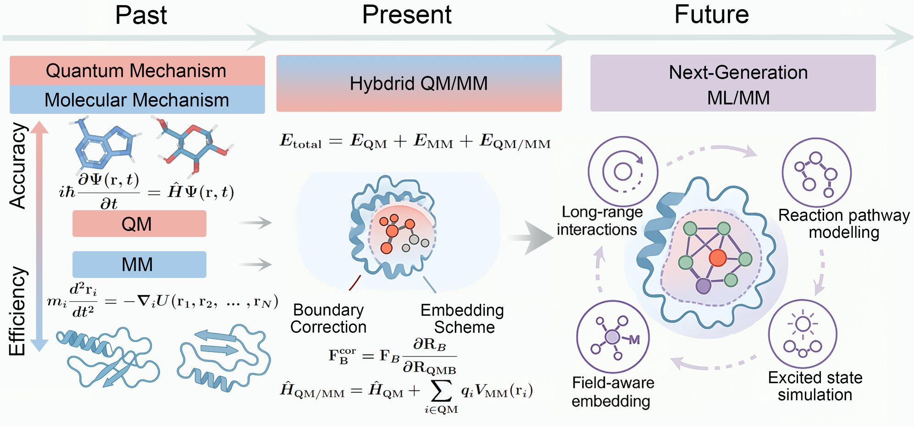
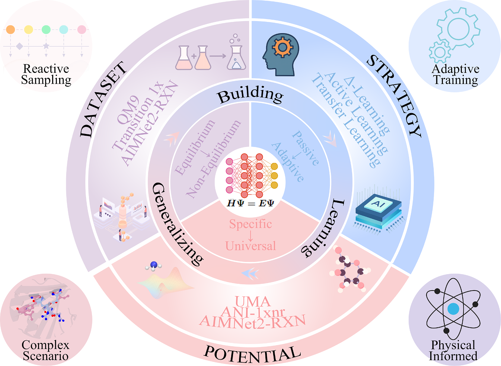
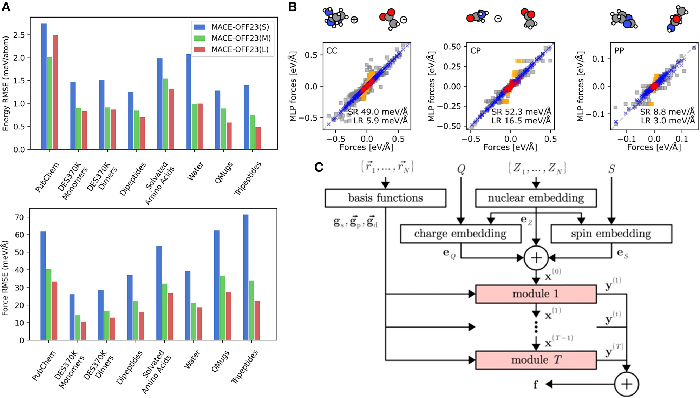
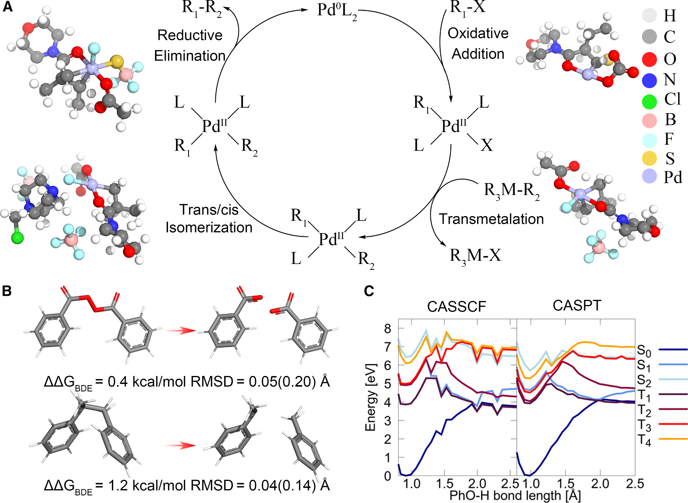

# 机器学习势函数让酶反应模拟从量子精度走向分子力学速度

## 本文信息

- **标题**：面向下一代计算酶催化的机器学习/分子力学酶学
- **作者**：Xujian Wang、Junmei Wang、Wan-Lu Li
- **期刊**：Chem Catalysis
- **发表时间**：2026年3月19日
- **类型**：Perspective综述
- **DOI**：https://doi.org/10.1016/j.checat.2026.101658
- **单位**：
  - 美国加州大学圣地亚哥分校 Aiiso Yufeng Li 化学与纳米工程系
  - 美国匹兹堡大学药学院药物科学系
  - 美国匹兹堡大学医学院计算与系统生物学系
- **引用格式**：Wang X, Wang J, Li W-L. Machine learning/molecular mechanics enzymology for the next generation of computational enzymatic catalysis. *Chem Catalysis*. 2026;6:101658. https://doi.org/10.1016/j.checat.2026.101658

## 摘要

> 传统QM/MM框架虽然在酶反应模拟中取得了显著成就，但始终面临**精度与效率的权衡**。近年来，**机器学习原子间势函数**（MLIPs）的出现打破了这一僵局——它们以接近量子力学的精度、分子力学的效率，正在重塑计算酶学的版图。本文系统综述了反应性MLIP的**数据集构建**和**训练策略**，梳理了ML/MM在酶催化模拟中的最新进展，并展望了向更复杂场景扩展的机遇与挑战。

### 核心观点

- **范式转移**：从传统QM/MM到ML/MM，计算效率提升**三个数量级**，实现了**量子精度**与**分子力学效率**的结合
- **数据驱动**：反应性MLIP的训练从平衡结构扩展到**反应路径采样**和**过渡态采样**，涵盖断键/成键过程
- **物理约束**：通过**长程相互作用**、**静电嵌入**等物理机制增强模型鲁棒性，避免纯数据驱动的黑箱问题
- **应用拓展**：从小分子反应到**全酶模拟**，从单一路径到**复杂催化循环**，覆盖更广泛的生物催化场景

## 背景：计算酶学的演进之路

**图1：计算酶学从QM和MM到下一代ML/MM框架的演进**。（A）过去：QM和MM方法在**精度**和**效率**上各有优势但独立运作；（B）现在：混合QM/MM框架通过**边界修正**和**嵌入方案**，整合两种方法，实现了真实环境中酶反应的**原子级模拟**；（C）未来：下一代ML/MM将用**MLIPs替代QM区域**，结合**接近QM的精度**和**MM的效率**，并扩展能力到**长程相互作用**。

酶是自然界最高效的催化剂，理解其催化机制一直是计算化学的核心挑战。过去几十年，**量子力学/分子力学**（QM/MM）混合方法彻底改变了这一领域。Warshel等人开创的QM/MM框架，用**量子力学描述反应中心**，用**分子力学处理蛋白质环境**，使得在真实溶剂和蛋白基质中模拟酶反应成为可能。

然而，QM/MM始终面临着无法回避的限制：量子区域的计算开销极大，限制了可模拟的**时间尺度**、**系统尺寸**和**采样效率**。即便是最先进的QM/MM，模拟**纳秒级**的酶催化过程也需要数月计算时间，这严重制约了其在酶发现和设计中的应用。

转折点出现在机器学习原子间势函数（MLIPs）的兴起。

> MLIPs用神经网络等数据驱动方法拟合量子力学数据，实现了**近乎量子精度的势能面**，同时保持了**分子力学的计算效率**。将MLIPs嵌入QM/MM框架，形成**ML/MM范式**，计算效率比传统QM/MM**快三个数量级**以上。

本文特别强调，这里说的快并不只是单点能计算更快，而是**整个反应模拟流程的可及性被改写了**：原来很难做到的长时间尺度采样、更大ML区域以及更高通量的候选比较，现在开始进入可执行范围。也正因为如此，本文把ML/MM视为计算酶学下一阶段最值得投入的基础框架，而不只是QM/MM的局部加速插件。

## 反应性MLIP：数据与训练的双重突破

**图2：构建反应性ML原子间势函数的框架**。左侧展示了生成反应路径数据集的策略：从平衡结构扩展到沿反应坐标和过渡态附近的采样；右侧展示了多样化的学习策略，包括**两阶段训练**、**迁移学习**和**主动学习**。

要让MLIPs真正描述化学反应，关键在于它们能否捕捉**反应路径**、**过渡态**和**断键/成键过程**。早期数据集如SPICE、QM7-X、ANI-1x主要包含稳定分子的平衡结构，对反应过程的描述能力有限。

里程碑出现在**Transition1x**和**ANI-1xnr**数据集的发布，它们分别代表了反应性MLIP数据集构建的两条互补路径。

- **Transition1x**（2022年）系统采样了小分子（≤7原子）的**完整反应路径**，而非仅仅单一过渡态。
  - 它包含了约**960万个反应路径**的能量和力数据，覆盖了83种元素，采用**ωB97X/6-31G(d)理论级别**。
  - 这种沿反应坐标系统采样的策略确保了从反应物到产物整个连续过程的覆盖，避免了仅在过渡态附近采样的局限性。
- **ANI-1xnr**则采用了截然不同的**纳米反应器结合主动学习**方法。
  - 它在MD模拟中让分子经历高温碰撞（高达数千开尔文），迫使系统探索远离平衡态的反应构型空间，然后通过不确定性估计自动选择需要高精度QM计算的新构型，迭代改进模型。
  - 最终生成的约**2.6万个非平衡反应子集采用BLYP-D3/TZV2P理论级别**，专门针对C、H、N、O系统。
  - 这种方法的独特之处在于它不预设反应路径，而是让系统自己撞出反应构型，更容易发现意想不到的反应通道。

数据集构建的核心挑战在于**全面覆盖反应坐标**。简单采样平衡结构会遗漏关键的过渡态区域，导致模型在描述化学反应时失效。为此，研究者发展了**增强采样**、**正则模式扰动**等非平衡采样策略，将构型空间扩展到沿反应坐标和过渡态附近的区域。

> **仅沿最小能量路径采样是不够的**。捕获偏离路径的构型——代表势能面的高能区域——同样至关重要，因为忽略它们可能导致MLIP在ML/MM模拟中**低估或高估扭曲或非物理结构的能量代价**，从而造成灾难性失败。这意味着数据集必须包含足够多样的困难样本，让模型学会区分物理合理的反应路径和不合理的构型扭曲。

另一个重要进展是**训练策略**的革新。

- **AIMNet2-rxn**采用两阶段训练：先在大规模稳定结构上预训练，再通过迁移学习在反应路径构型上微调。这种策略既保证了模型对稳定结构的学习，又增强了对反应过程的描述能力。
- **主动学习**也在数据集构建中扮演着越来越重要的角色。这种自适应采样策略比盲目地毯式搜索更高效，能够集中计算资源在最需要精确描述的区域。

这里还有一个容易被忽略的判断：**这些数据集并不是为了提供跨数据集的绝对能量参考**。本文明确指出，它们使用的量子化学参考级别并不相同，所以在ML/MM里的主要作用，是为某个建模框架提供**内部一致**的训练和微调数据，而不是拿来直接比较不同数据集之间的绝对能量高低。

举例来说，QM9用的是B3LYP/6-31G(2df,p)，而Transition1x用的是ωB97X/6-31G(d)，这两个DFT泛函和基组的差异本身就可能在某些系统上产生亚$\mathrm{kcal\cdot mol^{-1}}$级别的系统偏差。如果直接混用，很可能把方法学差异误认为模型性能差异。因此，在选择MLIP进行酶模拟时，理论级别的自洽性比单纯追求最大数据集更重要。

### 表1：代表性MLIP数据集

| 数据集 | 类型 | 描述 | 规模 | 计算级别 | 元素 |
|---|---|---|---|---|---|
| QM7-X | 非反应性 | 小有机分子的平衡与亚稳平衡结构 | 约420万 | PBE0/NAOs | H、C、N、O、S、Cl |
| SPICE | 非反应性 | 药物样分子与肽的可转移参考集 | 约110万 | ωB97M-D3/def2-TZVPPD | H、Li、C、N、O、F、Na、Mg、P、S、Cl、K、Ca、Br、I |
| ANI-1x | 非反应性 | 主动学习循环得到的小到中型分子 | 约500万 | 多级别参考 | H、C、N、O |
| QM9 | 反应性 | 以平衡结构为主，含少量简单反应物种 | 约13.4万 | B3LYP/6-31G(2df,p) | H、C、N、O、F |
| OMol | 反应性 | 含反应性、带电和材料相关体系的大规模集合 | 约1000万 | ωB97M-V/def2-TZVPD | 83种元素 |
| Transition1x | 反应性 | 小分子（≤7原子）反应路径的能量和力 | 约960万 | ωB97X/6-31G(d) | H、C、N、O |
| DORTS | 反应性 | 动力学采样得到的反应轨迹与过渡态 | 约750万 | ωB97M-V/def2-TZVP | H、C、N、O、P、S、F、Cl、Br、I |
| AIMNet2-rxn | 反应性 | 反应性和带电分子，多重自旋态 | 约470万 | ωB97M-V/def2-TZVPP | H、C、N、O |
| ANI-1xnr | 反应性 | 纳米反应器+主动学习生成的非平衡反应子集 | 约2.6万 | BLYP-D3/TZV2P | H、C、N、O |
| AIMNet-NSE | 特殊体系 | 中性、离子和自由基分子 | 约3340万 | B97M-D3(BJ)/def2-TZVPP | H、C、N、O、F、Si、P、S、Cl、Br、I、B、Na、K |
| GEMS | 特殊体系 | 生物大分子片段数据集 | 约300万 | PBE0/def2-TZVPP | H、C、N、O、S |
| AQuaRef | 特殊体系 | 肽、氨基酸衍生物和小型生物分子片段 | 约100万 | ωB97M-D4/def2-QZVP/CPCM（水） | H、C、N、O、S、Se |
| AIMNet2-Pd | 特殊体系 | 含钯有机金属配合物与反应中间体 | 约140万 | B97-3c/def2-mTZVP/CPCM（四氢呋喃） | H、B、C、N、O、F、Si、P、S、Cl、Se、Br、I、Pd |

## ML/MM在酶催化中的应用现状

### 表2：ML/MM在酶催化中的代表性应用

| 系统 | 模型 | 框架 | ML区域 | 备注 |
|---|---|---|---|---|
| 二氢叶酸还原酶 | 系统特异性 | Δ-ML QM/MM MD | 69原子 | 证明ML势在酶催化中的可行性 |
| 环氧合酶-1/2 | 系统特异性 | Δ-ML QM/MM MD | 65原子 | 证明ML势在酶催化中的可行性 |
| Diels-Alderase / chorismate mutase | 系统特异性 | ML/MM MD | 66原子 | 早期纯ML/MM框架在酶催化中的示范 |
| Chorismate mutase | UMA | ML/MM扫描 | 208原子 | 引入link-atom边界方案，扩展到更大的ML区域 |
| Diels-Alderase | ANI-1xnr | ML/MM MetaD | 212原子 | 结合增强采样，量化突变体效应和立体选择性 |

早期工作中，ML势函数主要作为**Δ-势**用于修正QM计算，形成**Δ-ML QM/MM**框架。所谓Δ-势，是指用ML势学习低级别QM方法（如半经验方法）与高级别QM方法（如DFT）之间的能量差，然后用这个ML修正项来提升低级别QM计算的精度。这种方法的计算瓶颈仍然在QM计算上，因此ML区域处理的原子数非常有限（65-69个），但这些研究成功证明了ML势在酶催化中的可行性。

随着MLIPs的发展，框架也从以 **Δ-ML QM/MM** 为主，逐步走向更独立的 **ML/MM**。二氢叶酸还原酶和环氧合酶-1/2的早期工作证明了可行性；随后，Diels-Alderase / chorismate mutase、chorismate mutase 和 Diels-Alderase 等体系进一步把ML区域扩展到 66、208 和 212 个原子，说明ML/MM开始具备处理更真实酶环境的能力。

然而，将ML/MM应用于酶催化也面临独特挑战。**酶的催化效率**很大程度上源于特定残基对过渡态的稳定和活化能的降低。扩展ML区域到包含关键残基，会超出典型MLIP的截断半径（通常为4-6 Å），而长程相互作用对过渡态稳定至关重要。

除长程相互作用外，本文还点了一个很实际的问题：**边界修正**。一旦为了把关键侧链纳入ML区域而切断氨基酸残基内部的共价键，传统QM/MM里那些成熟的边界处理经验就必须重新搬进ML/MM。

> **link-atom边界方案**是处理这一问题的关键技术。当侧链与蛋白质骨架之间的共价键被切断时，link-atom方案在切断位置引入氢原子来饱和 dangling bond，从而避免产生不合理的边界效应。Ohmura等人首次将link-atom方案与通用模型UMA结合，应用于chorismate mutase，使ML/MM框架能够捕获活性位点内的侧链-底物簇，展示了突变如何调控Claisen重排。虽然该工作限于反应路径扫描而非完整的分子动力学模拟，但标志着ML/MM走向通用和实用协议的重要一步。

在此基础上，作者团队将反应性ANI-1xnr势函数整合到ML/MM框架中，并采用link-atom边界处理。由于自发催化事件在常规时间尺度上极其罕见，他们进一步耦合了**增强采样策略**来加速势垒穿越，同时保持ML区域的近QM精度。

也就是说，ML/MM不是把QM区域简单替换成ML势就结束了，真正麻烦的是如何在边界、嵌入和长程作用三件事上同时做到**不漏算、不错算、也不重复算**。

### ML/MM的计算效率革命

> ML/MM的核心突破：通过**量子精度**与**分子力学效率**的结合，计算效率提升了**三个数量级**。这意味着原来需要数月的纳秒级模拟现在可以在几天内完成，**改写了整个反应模拟流程的可及性**。

作者团队近期工作将反应性ANI-1xnr势函数整合到ML/MM框架中，并采用link-atom边界处理。由于自发催化事件在常规时间尺度上极其罕见，他们进一步耦合了**增强采样策略**来加速势垒穿越，同时保持ML区域的近QM精度。

在NVIDIA L40s GPU和Intel Xeon Platinum 8462Y+ CPU的组合下，配合link-atom增强的机械嵌入方案，这套ML/MM设置能够在**每天**完成**多纳秒级**的MD轨迹模拟。这种计算效率使得：

- **多个反应事件**可以在一次模拟中被观察到
- **反应路径的统计采样**变得可行
- 包含**十个以上残基**的反应核心可以用近QM精度建模
- 能够解析**对映体之间微妙的自由能差异**
- 定量描述**底物依赖性活性**和**立体选择性**

更重要的是，在给定酶系统和一致的理论级别下，ML/MM能够实现**定量的自由能预测**。这标志着ML/MM从定性的机制理解工具，走向定量的预测设计平台。

### 从系统特异性到通用模型

ML/MM在酶催化中的应用经历了从**系统特异性模型**到**更通用的反应性MLIPs**的演进。早期研究主要针对特定酶系统训练专门的ML势，虽然精度高但缺乏普适性。随着Transition1x、ANI-1xnr、AIMNet2-rxn等数据集，以及UMA等更通用模型和边界方案的发展，ML/MM正在走向更广阔的应用场景。

这种演进带来的优势是显而易见的：

- **无需重新训练**：通用模型可以直接应用于新的酶系统，大幅降低使用门槛
- **一致性基准**：不同酶系统可以用统一的理论级别进行比较，消除了量子方法差异带来的系统偏差
- **加速发现**：结合高通量筛选，ML/MM可以快速评估大量酶突变体或底物的催化性能

当然，通用性也带来了新的挑战。当ML区域超出训练数据中的分子模式时，模型的**转移能力**仍需进一步验证。这也是当前ML/MM研究的热点方向之一。

为应对长程相互作用等挑战，研究者探索了三条互补路径：

### 长程相互作用的三种解决方案

- **1. 模型规模扩展**：MACE-OFF23家族（S/M/L）通过扩大感受野和提升表达能力处理长程相互作用。

  随着模型尺寸从S增加到L，能量和力的均方根误差（RMSE）系统性下降，反映了更大截断半径和更高角动量通道带来的表示能力提升。更大的模型能够捕捉更远距离的原子间相互作用，从而部分缓解了长程静电描述的不足。

- **2. 隐式Ewald求和**：从局部描述符预测隐藏原子变量，通过倒易空间求和处理长程静电相互作用。

  该框架的核心思想是将长程静电作用从局部MLIP中分离出来，用经典物理方法处理。它通过预测隐藏的原子变量（如部分电荷），然后在倒易空间中进行Ewald求和，从而在**不牺牲局部ML表达能力**的前提下提供非局域通信。在添加长程修正后，带电（CC）、混合（CP）和极化（PP）分子对的力误差显著降低，证明了这种方法对离子系统的有效性。

- **3. 物理整合**：如**SpookyNet**模型将核、电荷和自旋信息嵌入到消息传递框架中，并耦合解析库仑和色散修正项，实现局部和非局部相互作用的一致处理。

  SpookyNet的创新在于它不是简单地把长程修正拼接到局部模型外面，而是从物理原理出发，将核、电荷和自旋信息直接编码到消息传递框架中。这种物理整合方式能同时处理带电体系和开壳层系统，展示了物理约束对提升MLIP泛化能力的价值。

**图3：物理信息驱动的MLIPs代表性进展**。（A）MACE-OFF23家族（S/M/L变体）在多个基准集上的性能对比，能量和力的均方根误差（RMSE）随模型尺寸增加系统性下降，反映了更大截断半径和更高角动量通道带来的表示能力提升；（B）Ewald求和框架内加入潜在长程（LR）项后，短程（SR）预测和总力得到明显改进，带电（CC）、混合（CP）和极化（PP）分子对的误差显著下降；（C）SpookyNet把核、电荷和自旋嵌入到消息传递网络中，并结合解析库仑与色散修正，实现局部与非局部相互作用的一体化处理。

### 静电嵌入：让MLIP感知蛋白质环境

在酶中，反应核心嵌入在由带电残基和氢键网络形成的**静电结构化、动态极化环境**中。类似于QM/MM中的静电嵌入，ML/MM应该让MLIP暴露在MM环境的正确外场和极化响应中。

目前有两条互补的探索路径：

- **1. 物理层嵌入**：将ML能量与评估经典静电的外部极化层耦合，使ML势能够响应MM环境的静电外场。

  **Zinovjev等人**的静电嵌入模型将ML/MM能量重构为解耦形式，其中真空ML能量与物理动机的嵌入项（表示电荷场相互作用和诱导极化）结合。该框架在~$\mathrm{2\,kcal\cdot mol^{-1}}$内重现了QM/MM嵌入能量，显著改善了对静电结构化环境的描述。

- **2. 场感知模型**：通过在训练中包含外部静电场，使MLIP能够感知并适应酶和溶剂系统相关的静电环境。

  这种方法使能量和力预测相对于无场基线提高了近一个数量级，证明了场感知模型可以有效感知并适应与酶和溶剂相关的静电环境。

### 理论级别的一致性挑战

表2中总结的ML/MM研究都依赖于用量子参考数据训练的ML势，但这些研究使用的电子结构理论**级别各不相同**。这意味着报告的活化势垒、自由能和反应能即使在同一个酶系统中，也可能因为理论方法差异而无法直接比较。

> 关键精度要求：即便在同一个系统内，亚$\mathrm{kcal\cdot mol^{-1}}$的能量差异也可能具有化学意义——这正好是酶催化中区分不同反应路径或突变效应的精度要求。而不同量子方法间的系统偏差可能掩盖这些细微差异。

因此，在进行ML/MM模拟时，研究者需要谨慎选择：

- **理论级别的自洽性**：整个建模流程——从训练数据到验证到最终预测——应该使用一致的DFT泛函和基组，避免混用带来的系统误差
- **相对能量 vs 绝对能量**：如果只关心相对趋势（比如哪个突变体活性更高），理论级别差异的影响可能较小；但如果需要定量的自由能预测，就必须严格统一方法学
- **基准测试策略**：在新系统上应用通用MLIP时，最好先用小规模计算验证其在特定化学环境下的精度，而不是盲目假设通用模型就一定准确

> 这种对方法学一致性的强调，实际上反映了ML/MM从演示可行性走向建立可信赖的预测平台的过程中必须面对的严谨性要求。

### 超越有机体系：金属和自由基反应

> 标准MM力场无法处理的化学场景正逐步被MLIPs攻克，这标志着MLIPs正从**有机小分子**走向**金属催化**和**自由基反应**的更广阔天地。

**AIMNet2-Pd**成功描述了钯催化的Suzuki-Miyaura偶联反应，证明金属元素可以纳入传统上专注于有机体系的MLIPs。**AIMNet2-NSE**成功模拟了自由基反应并定位了最小能量交叉点（MECPs），这对描述自旋态转变和绘制不同多重态间的能量景观至关重要。

**图4：MLIPs应用于复杂催化场景的示例**。（A）钯催化Suzuki-Miyaura交叉偶联反应的催化循环；（B）AIMNet2-NSE在键解离反应上的性能基准测试，ΔΔGBDE表示键解离自由能与QM参考值的偏差，RMSD表示MLIP优化结构与参考结构在反应物态和产物态上的均方根偏差；（C）用完全活性空间自洽场（CASSCF）和完全活性空间二阶微扰理论（CASPT2）计算的苯酚O-H键解离能谱，S和T分别表示单重态和三重态激发态。

这些进展表明MLIPs正朝着**更复杂的催化体系**扩展，包括：

- **金属有机催化**：AIMNet2-Pd成功描述了**钯催化的Suzuki-Miyaura偶联反应**，证明过渡金属可以纳入传统上专注于有机元素的MLIPs
- **自由基中间体**：AIMNet2-NSE能够处理**开壳层体系**和**自由基反应机制**，突破了传统力场对单电子描述的限制
- **自旋态转变**：通过定位**最小能量交叉点（MECPs）**，MLIPs可以绘制不同多重态间的能量景观，这对于理解金属酶的催化机制至关重要
- **复杂环境**：带电和**极化溶剂环境**中的反应过程，通过**静电嵌入**和**场感知模型**得到更准确的描述

## 当前挑战与未来方向

ML/MM已经从概念验证走到可以讨论**定量预测**的阶段。它把反应模拟能力和动态模拟逐步整合到同一计算框架中，但要真正变成稳健的酶设计工具，仍需克服几个关键挑战：

- **理论级别一致性**：生成训练数据所用的量子化学理论级别直接决定了MLIP的精度上限。当前不同研究使用的电子结构方法差异较大，即便在同一系统内，亚$\mathrm{kcal\cdot mol^{-1}}$的能量差异也可能具有化学意义，而不同量子方法间的系统偏差可能掩盖这些细微差异
- **统一能量框架**：目前没有一个普遍接受的统一ML/MM能量分解，能够严谨地整合长程相互作用、静电嵌入和边界修正而不产生冗余。如果长程静电、极化和边界修正分别由不同模块负责，但彼此之间没有统一的守恒能量表达式，就很容易出现重复计算或漏算
- **转移性与边界**：当前MLIPs在应用于大型、异质生物分子系统时，转移能力仍有限。将催化必需的侧链纳入ML区域会引入边界复杂性，需要稳健处理边界处的相互作用和能量守恒

> **ML/MM最大的问题已经不再是可不可运行，而是算出来的能量是否足够干净。** 本文对这一点非常谨慎，这也是它一直强调single、conservative energy framework的原因。QM/MM框架中积累的经验——在单一保守能量框架中整合长程相互作用和静电嵌入——为ML/MM的发展提供了重要参考。

## 展望：通往预测性酶设计之路

### 未来发展方向

- **物理约束架构**：物理信息架构、自动化数据集生成和不确定性量化的主动学习的发展，将是使ML/MM模型既可预测又可解释的关键
- **多尺度整合**：ML/MM将进化为一个**定量、原子分辨的酶设计平台**，而不仅仅是最优酶模型。它将统一机制洞察、预测设计和动态模拟于单一计算框架
- **自动化流程**：随着自动化数据集生成和标准化ML/MM框架的发展，酶发现和设计工作流将变得更加高效和可重复
- **从工具到平台**：ML/MM有望从酶学专门工具发展为**通用的化学转化建模平台**，不仅能够理解酶催化机制，还能指导**理性酶设计**、**底物工程**和**催化路径优化**，为合成生物学和工业生物催化提供强大的计算支持

这种从理解到设计的转变，意味着ML/MM不再仅仅是事后解释实验现象的手段，而是能够在实验之前预测和优化催化性能的前瞻性工具。当这种能力与自动化工作流结合，就有望实现**计算驱动的酶工程闭环**：设计→模拟→筛选→实验验证→数据反馈→改进模型，形成持续迭代的加速循环。

## 关键结论

- **效率革命**：ML/MM比传统QM/MM快**三个数量级**，使**大规模酶模拟**和**高通量筛选**成为现实
- **数据驱动**：Transition1x（~960万反应路径）、ANI-1xnr（纳米反应器+主动学习）、AIMNet2-rxn（470万反应结构）等数据集奠定了MLIP描述**化学键断裂和形成**的基础
- **物理约束**：MACE-OFF23（模型规模扩展）、隐式Ewald求和（长程静电）、SpookyNet（物理整合）三种路径解决了**长程相互作用挑战**
- **静电嵌入**：Zinovjev等人的框架在~$\mathrm{2\,kcal\cdot mol^{-1}}$内重现QM/MM嵌入能量，**场感知模型**使能量和力预测提高近一个数量级
- **超越有机体系**：AIMNet2-Pd（金属有机）和AIMNet2-NSE（自由基反应）展示MLIPs正突破传统MM力场的限制，拓展到**过渡金属催化**和**自旋态转变**
- **整合趋势**：从Δ-ML QM/MM到独立ML/MM，框架正朝着更**统一**、更**保守**的能量表示发展，但需避免重复计算
- **未来方向**：**物理约束架构**、**自动化数据集生成**、**不确定性量化**的主动学习将推动ML/MM走向预测性酶设计

这些发展方向并非孤立推进，而是相互促进。物理约束可以提高数据效率，自动化流程可以加速数据集迭代，而不确定性量化则为主动学习提供指导信号。三者结合，有望让ML/MM从当前的手工调参、小规模演示，走向工业化级别的稳健预测平台。

## 批判性总结

- **潜在影响**：ML/MM将酶学从理解机制推向**预测设计**，有望显著改变**酶工程**和**合成生物学**中的建模方式
- **主要局限**：当前MLIPs在大型生物分子系统上的**转移能力**仍有限，**统一ML/MM能量框架**尚未建立
- **数据瓶颈**：不同研究使用的量子化学理论级别差异大，系统偏差可能掩盖亚$\mathrm{kcal\cdot mol^{-1}}$级别的化学意义差异
- **技术挑战**：催化必需侧链纳入ML区域引入**边界复杂性**，**10 Å以上长程静电**和**极化效应**仍需特别处理
- **未来方向**：**自动化数据集生成**、**物理约束架构**、**不确定性量化**的主动学习是关键突破口
