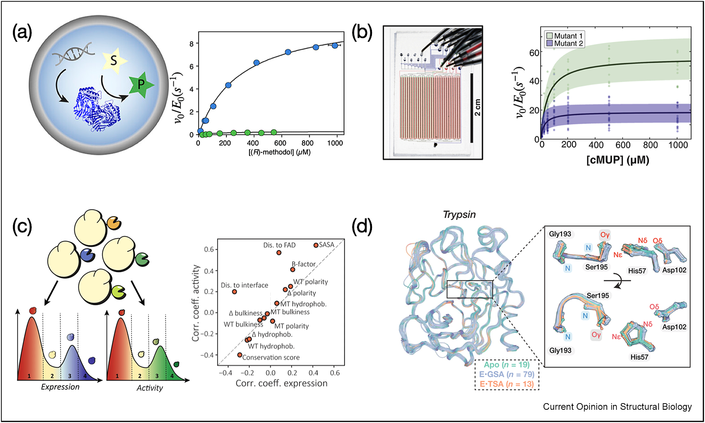
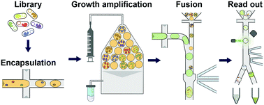
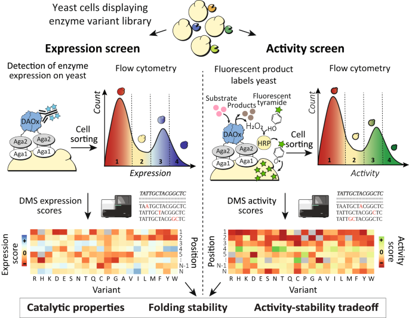
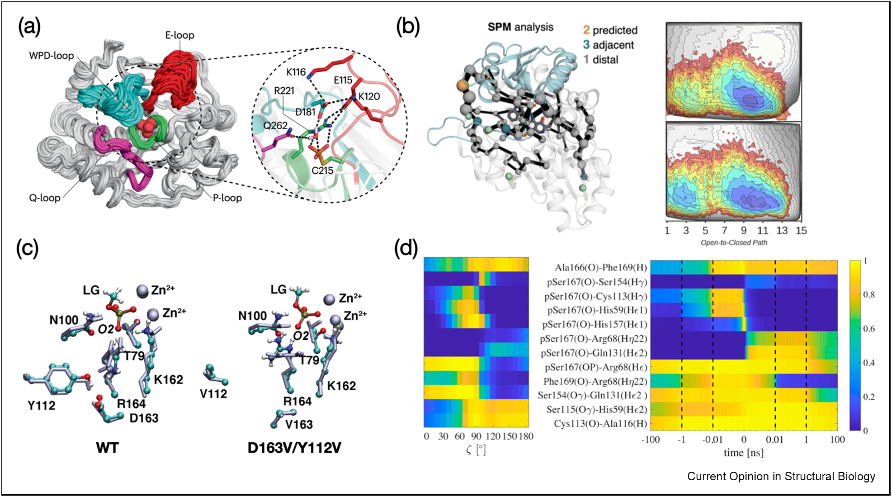
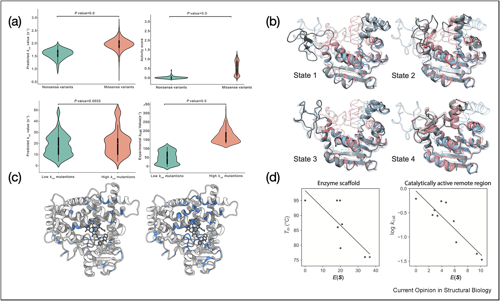

# 【QC的综述】高通量测量、构象动力学和机器学习怎样一起解释酶活性调控

## 本文信息

- **标题**：酶活性调控的方法：实验与计算的最新进展
- **作者：Qiang Cui**
- **发表期刊**：Current Opinion in Structural Biology
- **发表时间**：2025年7月29日在线发表
- **DOI**：https://doi.org/10.1016/j.sbi.2025.103124
- **单位**：波士顿大学，化学系、物理系与生物医学工程系
- **引用格式**：Cui, Q. Approaches for regulating enzyme activities: Recent advances in experiment and computation. *Curr. Opin. Struct. Biol.* 94, 103124 (2025). https://doi.org/10.1016/j.sbi.2025.103124

---

## 摘要

> 酶活性的调控是生命系统与生物工程的核心问题。近年来，**高通量酶动力学实验**与**高效计算方法**的快速发展，使我们得以更深入地理解控制酶活性的分子机制，并据此理性设计调控策略。本文综述了实验与计算领域的最新进展：高通量筛选技术（uHT、HT-MEK、EP-Seq）带来海量功能数据；结构集合分析揭示了活性位点**并非越精准定位越好**；loop动力学与最短路径图工具阐明了远端残基如何传递调控效应；机器学习则开始整合物理模型与数据驱动方法，推动酶工程从大规模筛选走向**机制约束下的理性设计**。

### 核心结论

- **两条路都要走**：机制理解缩小设计空间，高通量工程（定向进化/ML）负责精细调优
- **数据富集时代已来**：HT-MEK可在数天内对**数千个突变**体完成动力学表征；EP-Seq一次性测数千个突变体的稳定性与活性
- **活性位点不是全部**：远端残基（>20 Å）可显著影响催化效率，活性位点刚好够用的定位策略可能是自然演化的结果
- **机器学习尚有局限**：DeepEnzyme能区分高低$k_\mathrm{cat}$突变体，但预测精度仍有很大提升空间
- **动力学不只是平衡涨落**：过渡态之后的反应路径分析（而非仅自由能景观）对于理解酶催化至关重要

---

## 背景

### 两条路：自下而上 vs 自上而下

天然酶不仅催化效率高，而且活性受到精确调控——这正是生命系统复杂性的体现。然而，理性调控酶活性面临巨大挑战：**序列—结构—功能的关系极其复杂**，即使知道应该调哪个结构旋钮，也往往不知道该调到什么程度。

酶活性调控的实践需求广泛存在于工业与医学领域。工业生物催化需要酶在非自然条件（高温、有机溶剂、非生理pH）下保持活性；精准医学要求针对特定患者突变定制酶功能；合成生物学则需要精确调控代谢通路中多个酶的相对活性——这些场景都指向同一个核心问题：**我们能否通过理性设计实现对酶活性的精确调控**？

传统上，科学家走了两条路：

- **自下而上**（bottom-up）：先搞清催化机制，再据此理性设计调控策略。这一方法从还原论角度最有吸引力，但现实是序列—结构—功能关系极其复杂，**即使知道该调什么，往往也不知该怎么调**。
- **自上而下**（brute-force）：直接用定向进化或机器学习技术来调活性。近年的连续进化方法（如OrthoRep）已能将基因突变率提升至基因组的百万倍，**极大扩展了定向进化的搜索空间**。

> **高效的策略是两者结合**：机制理解缩小设计空间，实验筛选和机器学习负责精细调优。机制研究指明关键位点之后，定向进化和ML就能在更小的空间里找到更优解。

本文并没有把机制研究和大规模筛选对立起来。恰恰相反，原文把 **OrthoRep** 这类连续进化技术视为重要推进，但同时强调：如果没有机制信息来约束搜索方向，哪怕突变率再高，也仍然可能把搜索资源浪费在无关区域。**数据富集解决的是搜索深度，机制分析解决的是搜索方向**。

---

## 数据富集时代：实验技术进展

**图1**：数据富集实验技术示例。

- **（a）微滴微流控超高通量（uHT）筛选**：每天可处理超过$10^7$个突变体
- **（b）微流控高通量酶动力学（HT-MEK）**：数天内对数千个突变体完成高质量动力学表征
- **（c）酶邻近测序（EP-Seq）**：一次性测数千个突变体的稳定性与活性
- **（d）多态结构集合分析**：结合功能实验评估催化机制模型

### 超高通量筛选（uHT）

它的基本原理是把**单个细胞或单个酶变体**与底物一起封装进皮升级微滴，让每个液滴都充当一个彼此隔离的微反应器。这样做最关键的好处，是把**基因型—表型对应关系**锁在同一个液滴里，既避免不同变体之间串扰，也把传统孔板实验的体积和成本压到极低水平。

后续读出通常依赖**荧光底物**或可转化为荧光信号的耦联反应。活性更高的液滴会积累更强荧光，再通过类似FACS的**荧光激活液滴分选**（FADS）完成在线筛选。也就是说，微滴微流控真正放大的不只是反应数量，而是生成微反应器、孵育、检测、分选这一整条闭环流程。

> uHT 的关键不只是提高通量，而是把基因型与表型在微滴内一一配对，再以分选流程把高活性变体快速富集出来。

微滴微流控技术使uHT筛选成为现实——**每天可处理超过$10^7$个突变体**。这一通量对于三个方向至关重要：
- 系统研究残基间的表观遗传相互作用（epistasis）——搞清楚突变之间的非线性效应；
- 筛选宏基因组学文库——从自然界汲取多样性；
- 以及增强定向进化的搜索能力。

一个代表性案例是将uHT整合进定向进化流程：拯救了一个原本陷入瓶颈的人工醛缩酶，**将活性提升30倍**。代价是完全重建了活性位点——加入了新的催化四单元（catalytic tetrad）。这说明当序列空间搜索足够深时，可以发现**完全意料之外的结构重构**。

### 微流控高通量酶动力学（HT-MEK）

如果说uHT解决的是通量问题，HT-MEK解决的则是定量质量问题。在数天内对数千个PafA（phosphate-irrepressible alkaline phosphatase）突变体完成**折叠稳定性、催化动力学和磷酸盐抑制**的系统性表征，得到超过65万个动力学数据点和6000余个动力学与热力学常数。这意味着**HT-MEK把系统性酶活性图谱带入了可操作阶段**——有望像基因组测序催生功能基因组学一样，推动酶工程研究方式发生实质变化。

> HT-MEK的工作流程中，突变体以微液滴形式包裹，利用荧光底物（cMUP：7-（二羟基磷酰氧基）香豆素-4-乙酸）通过酶切释放荧光信号，实现高通量动力学测量。

**关键发现**：在PafA体系中，HT-MEK对约1036个变体同时表征了折叠稳定性、催化动力学和无机磷抑制，累计得到超过65万个动力学观测值与6000余个动力学/热力学常数。

由此可将不同残基组影响不同环节**具体化为三类**：
- 一类主要改变催化循环中的步骤速率。
- 一类主要改变对不同底物类别的催化特异性。
- 一类主要影响折叠稳定性。

**影响催化效率的关键位点不仅在活性位点附近，还可延伸到距活性位点约20 Å的蛋白表面**，说明酶活性调控是由局部化学作用与长程结构耦合共同决定的。

### 酶邻近测序（EP-Seq）

EP-Seq利用过氧化物酶介导的单细胞精度自由基标记，在单次实验中分析数千个氧化还原酶突变体的稳定性与活性。它的实验逻辑可以拆成三步：
- 先把**酶突变体库展示在酵母细胞表面**，再用抗体荧光读出表达量，把它当作折叠稳定性和展示效率的近似指标。
- 随后让氧化还原酶在细胞表面催化底物，生成局部$\ce{H2O2}$或等效氧化信号。
- 最后借助HRP触发**tyramide自由基沉积**，把荧光标签限制在产生活性的那个细胞附近。

因此，EP-Seq读出的不只是宽泛的生长优势，而是**单细胞尺度的局部催化活性**。

后续再通过流式分选和深度测序，统计不同突变体在高表达、低表达、高活性、低活性群体中的富集程度，就能同时重建**表达适应度**和**活性适应度**两张图谱。

> EP-Seq 的核心价值是把表达适应度和活性适应度在同一实验中解耦读出，从而更清楚地区分稳定性效应与催化效应。

在D-氨基酸氧化酶的系统分析中，EP-Seq揭示了关键的结构-功能关系：**突变位点的一些空间与理化属性（如到FAD辅因子和二聚界面的距离）与活性、稳定性呈差异相关**。

这说明不同结构区域对两类表型的贡献权重并不相同。原文据此提出的是一种演化约束线索：**以活性为中心的选择压力，可能会限制折叠稳定性的上限**。因此，这里更合适的理解是支持存在约束，而不是直接证明活性提升必然导致稳定性下降的一一对应因果关系。

同时，EP-Seq也识别出了远离活性位点的热点突变——这些是改善催化活性而不牺牲稳定性的理想候选位点，因为它们通过长程相互作用影响活性，而不直接破坏折叠。**这使得远端调控成为可能**：通过影响活性位点的静电环境或构象 ensemble 来间接调节催化，而无需直接改造活性位点本身。

65万量级的数据点还有一个直接价值：**为计算模型的训练与验证提供了前所未有的训练集**。过去酶工程的数据往往只有几十到几百个突变体，难以支撑统计学习方法；而HT-MEK产生的系统化数据使得构建高置信度的 genotype-phenotype 模型成为可能，也为检验计算预测的准确性提供了可靠基准。

三种高通量技术各有侧重与局限，适用于不同场景：

| 技术 | 通量 | 优势 | 局限 |
| --- | --- | --- | --- |
| **uHT** | $>10^7$突变体/天 | 规模最大，适合表观遗传研究和宏基因组筛选 | 数据精度有限，需要后续验证 |
| **HT-MEK** | 数千突变体/天 | 数据质量高，同时获得动力学与热力学常数 | 通量相对较低 |
| **EP-Seq** | 数千突变体/单次实验 | 同时分析稳定性与活性，适合权衡分析 | 需要过氧化物酶兼容的化学反应 |

---

## 结构集合观：从单一快照到统计分布

现代结构生物学技术使我们能够系统收集酶在不同功能态下的结构数据，从而批判性地评估各种催化机制模型。**关键思想是把酶看成构象的集合，而不是单一的静态结构**。这种视角的转变对于理解酶催化至关重要——传统的钥匙—锁模型或诱导契合模型，本质上都只抓住了某个瞬间的结构，而真实酶始终在动态采样。

### 酮类固醇异构酶（KSI）案例：活性位点并非越精准越好

对KSI系列变体的研究采用了一套三步工作流程：
- **第一步**：用（伪）结构集合描述不同变体在构象空间中的统计分布。这里的（伪）结构集合主要指由多组X射线结构拼接得到的近似构象集合，而非长时间MD采样得到的严格热平衡集合
- **第二步**：结合NMR实验和功能数据，验证这些结构集合是否真实反映溶液中的构象分布
- **第三步**：用功能实验检验这些分布差异是否真的对应催化效率变化

> **氧阴离子孔的催化机制**：KSI的氧阴离子孔通过比水中更强的氢键稳定过渡态，从而实现催化。但某些突变会通过改变氢键网络的电子效应（如感应效应）削弱这种优势——这说明催化效率不只取决于活性位点的几何形状，还取决于电子性质的精细调控。

这一研究出人意料地发现：
- 催化残基的定位确实优于非催化残基，但**并非越精准定位越好**
- 催化残基在功能循环中的构象分布变化也不大
- 真正重要的是**柔性与定位之间的平衡**：既要刚到能有效催化，又不能太僵硬以至于无法完成多步质子转移

这一结果**否定了活性位点越精准定位越好的简单模型**，说明自然演化选择的可能是刚好够用的定位策略，而非极致优化。

### 丝氨酸蛋白酶：建立定量贡献框架

在KSI研究否定错误模型的基础上，对超过1000个来自17种丝氨酸蛋白酶的X射线晶体结构进行比较分析，进一步建立了**定量贡献框架**。

研究将酶结构特征与溶液中相应反应的特性进行半定量比较，成功建立了各种结构和能量特征对催化效率的**可量化贡献**，包括**底物定位、氢键网络强度、以及其他结构和能量特征**。虽然每个特征的单独贡献可能有限，但它们协同作用共同决定了催化效率。

虽然（伪）结构集合并不完全等同于溶液中的构象分布，但这些研究说明了**集合视角对于识别和评估酶活性调控因素的必要性和价值**——它不仅能否定错误的机制模型，还能建立定量分析框架。

### 工程启示

集合观的工程启示在于：**追求活性位点的完美静态结构可能是一个错误目标**。既然催化依赖于构象集合的统计行为，那么工程的目标更应该是调控这个分布本身——例如增强某一类构象的占比，或者改变构象之间的跃迁速率，而非单纯把活性位点固定在某一位置。

## 动力学与远端贡献：构象景观、集体运动与别构通路

**图2**：酶动力学与远端残基对催化贡献的代表性案例。

- **（a）蛋白质酪氨酸磷酸酶的WPD loop动力学**：含催化Asp181的WPD loop动力学决定磷酶中间体水解活性，并与其他loop共同参与调控
- **（b）最短路径图（SPM）别构网络识别**：可识别多种酶中的别构调控残基；模板化AlphaFold2与MD联用后，可在约50 ns轨迹上得到可靠的SPM网络与自由能景观，并解释OB2-PfTrpB比PfTrpB更高的独立活性
- **（c）PafA第二壳层残基的作用**：QM/MM、经典MD与DFT簇模型计算表明，第二壳层残基突变主要扰动apo态，而对磷酸根转移的基态和过渡态影响较小
- **（d）Pin1的全局动力学与过渡路径采样**：自由能模拟与过渡路径采样给出不同图像——沿最小自由能路径逐步重排的氢键网络，并不等同于真实动态路径中的关键相互作用形成顺序

### Loop动力学：WPD loop的故事

**蛋白质酪氨酸磷酸酶（PTP）**是理解loop动力学与催化活性关系的经典案例。NMR实验发现，催化活性与**WPD loop**（含催化Asp181）的动力学行为高度相关——该loop在非活性（开放）和活性（闭合）构象之间切换。计算研究（增强采样MD + EVB模型）进一步揭示了PTP1B和YopH两种酶的关键差异：WPD loop的自由能景观完全不同，而化学步骤的过渡态能垒几乎不受影响，活性差异却可以超过一个数量级——这说明调控可以在反应步骤之外生效。

这一发现已通过嵌合体实验得到验证：交换不同PTP间的WPD loop，可以系统改变嵌合酶的催化活性及pH依赖性。**这一结果把loop动力学从相关性线索推进到可操作的因果杠杆**——通过改变loop的力学性质，如净电荷或疏水性，可以直接调控酶的催化效率。

> 在PTP中，**loop动力学决定了底物能否及时进入活性位点、以及产物能否及时释放**，属于非化学但同样关键的步骤。这意味着酶工程的靶点远不只是催化残基本身，任何影响底物/产物传输路径的构象动力学都可以成为调控活性的杠杆。

### 最短路径图（SPM）：别构网络识别

Osuna课题组的**最短路径图**（shortest-path map，SPM）方法基于motif相关性分析，已成为识别别构通路残基的标准工具。其核心思想是：把蛋白质看成一张图，节点是残基，边是运动相关性的强弱；然后用图论算法找出连接两个位置之间的最短路径——这条路径上的残基，就是最有可能把远端突变影响传递到活性位点的桥梁。

在PTP1B中，11个非WPD/P-loop突变（实验表明可改变$k_\mathrm{cat}$或$K_\mathrm{M}$超过50%）中有8个被SPM成功识别，余下3个距SPM别构网络也在4 Å以内——这一结果有力证明了动态网络探测的价值：即使是**非活性位点突变，SPM也能提前预测其对活性的潜在影响**，从而扩大了可设计的靶点范围。

SPM的另一个代表性应用是**色氨酸合成酶PfTrpB**的研究：该酶受TrpA亚基别构调控，**本身没有独立的活性**。定向进化得到独立活性变体OB2-PfTrpB后，将其与tAF2（模板化AlphaFold2）结合进行MD分析，仅用约50 ns的轨迹就生成了可靠的自由能景观与SPM网络——相比传统MD大大缩短了采样时间。关键发现：OB2-PfTrpB变体具有更高的构象异质性和**更强的COMM domain闭合态采样能力**，从而解释了更高的独立活性。这一研究也为未来SPM与增强采样方法的深度整合提供了思路。

### 第二壳层残基的作用

**PafA的系统性HT-MEK分析**也激发了深入的计算研究：QM/MM自由能计算 + MD + DFT簇模型分析表明，第二壳层残基（如D163、Y112）的突变主要扰动的是PafA的apo态和底物结合，而非过渡态本身。计算结果与vanadate（钒酸盐）和磷酸盐过渡态类似物结合数据高度一致。

> **活性位点水合水平的调控机制**：第二壳层突变通过调节活性位点的水分子进入/排出速度，影响了活性位点的水合水平。由于磷酸根转移是亲核取代反应，活性位点水合程度的细微变化会显著影响反应能学——水既可以是催化参与者，也可以是竞争者。

### 全局动力学与过渡路径采样

过去大多数研究把动力学理解为平衡构象涨落，假设其与化学反应处于准平衡。但Pin1（催化磷酸化Ser/Thr-脯氨酰基肽键的顺反异构）的系统模拟表明：**准平衡假设对快速反应（皮秒级）可能是错误的**。

关键差异在于：Pin1的异构化事件在本质上很快，约为皮秒级，而大多数酶运动显著更慢。因此，自由能模拟假设酶自由度在反应坐标变化时处于平衡——但这个假设对快速反应并不成立。**自由能景观给出的是平均统计图像，TPS揭示的则是实际过渡路径**，两者缺一不可，共同构成对酶催化动力学的完整理解。

> 这里的准平衡假设可理解为：当反应坐标推进到任一位置时，**其他构象自由度已经足够快地完成局部弛豫并接近平衡**，因此可以用一条最小自由能路径来近似描述结构重排顺序。

自由能模拟和过渡路径采样（TPS）给出截然不同的图像：
- **自由能模拟**（准平衡假设）：关键氢键网络与配体之间的相互作用随着反应坐标$\zeta$变化而逐渐重排
- **TPS**（非平衡处理）：这些氢键在$\zeta$改变之前就已就位——相互作用形成于反应发生之前，而非之后

要完整理解酶催化，还必须表征瞬态激发（高能）构象态，并识别哪些结构重排最有利于化学反应发生。这也是**过渡路径采样等非平衡方法**越来越受重视的原因。

---

## 机器学习赋能酶工程

**图3**：机器学习技术在酶催化与工程中的应用。

- **（a）DeepEnzyme预测酶周转数**：整合图神经网络与Transformer，在CYP2C9和PafA等大规模序列—活性数据集上评估性能
- **（b）AlphaFold2-RAVE构象集合生成**：整合结构预测与ML增强采样，为apo态腺苷酸激酶生成四类跨越开放和闭合构象的结构集合
- **（c）统计模型预测功能位点**：结合蛋白序列信息与稳定性模型，图中给出CYP2C9实验位点与预测位点的对照，蓝色区域表示功能位点
- **（d）最大熵模型与稳定性—活性权衡**：统计能量与设计Kemp eliminase活性位点远端区域的稳定性和活性位点区域的催化活性分别相关，支持稳定性——活性权衡的解释

### DeepEnzyme：预测酶周转数

图神经网络加Transformer架构的DeepEnzyme被用于预测酶的$k_\mathrm{cat}$。在6500余个CYP2C9突变体上表现良好，能清楚区分错义和无义变体的$k_\mathrm{cat}$差异，说明模型至少学到了活性存在与否的边界；但在PafA HT-MEK数据上，虽然统计差异显著（P = 0.0033），中位数差异仅约15%，远低于实验数据所揭示的高低活性变体之间的实际差距。这提示ML模型目前擅长捕捉定性趋势，但定量预测能力仍然有限。

> **15%的差距看似不大，却意味着模型尚无法可靠地区分中等活性与高活性变体**——这正是工程应用最需要区分的区域。

关键在于，CYP2C9和PafA的差异本身就说明了问题：不同酶家族、不同实验条件下的ML表现可能大相径庭。**没有万能的酶活性预测模型**，这与分子性质预测（LogP、溶解度等）的情形类似——通用模型和专用模型各有优势。

### AlphaFold2-RAVE：构象集合生成

AlphaFold2-RAVE将结构预测与ML增强采样结合，为apo态腺苷酸激酶生成了四类构象——跨越开放与闭合两种状态。这对于研究构象动力学驱动的催化机制尤为重要，也为大规模构象采样提供了新的思路。**结构预测与MD增强采样的组合正在成为构象动力学研究的重要路线**，未来有望覆盖更大的蛋白空间。

### 直接耦合分析（DCA）与最大熵模型

**共进化信息是另一种理解酶功能的强大武器**。Ranganathan课题组的DCA利用多序列比对（MSA）中的共进化信号，提取残基间直接的相互作用信息，绕过了间接相关的干扰。用这种方法生成的非天然序列，45%在大肠杆菌中具有功能性——远高于随机设计的成功率。

Xie和Warshel的类似分析则揭示了一个不对称性：**统计能量与活性位点区域的催化活性正相关，与远端区域的稳定性负相关**。活性位点的残基如果偏离了共进化最优构型，主要影响催化；而骨架区域的残基如果变化，则更多破坏折叠稳定性。这一发现为**稳定性—活性权衡假说**提供了直接证据——而且DCA这把尺子还能用来预测哪些突变有望提升活性而不损害稳定性。

### 功能位点预测与committor函数

> 除了预测活性值，ML还被用于两个更具挑战性的任务：**识别潜在功能/调控位点**，以及**建模反应坐标本身**。

通过将蛋白质序列的统计模型与生物物理稳定性模型结合，可以系统预测功能位点。在CYP2C9上的验证表明，这种方法能够识别新的功能热点，为后续突变设计提供候选。**这一思路将ML的预测能力与生物物理的先验知识相结合**，比纯序列统计更有可能筛选出真正有功能意义的位点。

另一方面，ML也被用来建模**committor函数**——这是统计力学中定义最理想反应坐标的数学对象：对于任一构象状态，committor给出体系**先到达产物态而不是先回到反应物态的概率**。如果某个构象的committor接近0，说明它仍偏向反应物一侧；接近1，则说明它更偏向产物一侧；而**接近0.5的构象通常最接近过渡态集合**。如果能可靠地预测committor，就意味着找到了一个比简单键长、距离或自由能谷底更有动力学意义的反应坐标，从而更深入地理解催化机制。

目前committor建模仍是活跃的前沿方向，主要挑战在于：**它需要稀有事件的精确采样**——只有极少数构象会最终越过过渡态，而ML模型必须从大量非反应构象中学会识别这些稀有例外。随着增强采样方法，如自适应偏置力或主动学习，持续进步，这一方向有望取得突破。

---

## 展望

### 数据与机理并重

进入数据富集时代后，关键挑战变成：如何用分子术语理解这些数据，从而发展可指导工程的机理模型。**单纯依靠物理模型计算量太大，单纯依靠ML准确性不够**——两者的创造性地结合才有出路。具体来说，可扩展的自由能方法（如λ动力学）越来越高效准确，但在**使用QM/MM势能时计算量仍然很大**；ML模型已被用于预测催化活性，但预测精度有限。

> 将物理模型与ML技术创造性地整合——用物理模型标定ML，用ML加速物理计算——将是未来十年的重要方向。

### 多尺度构象动力学

尤其是**集体网络动力学与催化活性的关联**、**构象异质性与动态无序**的区分，以及功能循环中构象演化的研究。Saito等人的观点可以概括为：
- 酶动力学涉及非马尔可夫、非泊松、调控性反应动力学，理解其分子机制需要多种先进实验技术与大量MD模拟的结合。
- **快的局部重排与慢的集体运动之间的联系**——尤其是在大型别构生物分子机器，包括大型酶复合物，中的功能调控作用——需要更深入的理解。

### 复杂环境中的酶催化

酶不是在真空中工作的。生物分子凝聚体（biomolecular condensates）中的酶催化与稀溶液的差异才刚刚开始被理解——关键因素可能包括强静电作用、拥挤效应，以及底物传输的复杂性。基因型与表型之间的关系也因表观遗传效应而变得极为复杂。

> **真实细胞环境对酶催化的影响仍缺少足够清晰的机制图像**——凝聚体内部的高分子拥挤、液-液相分离界面附近的特殊化学环境，都可能从根本上改变酶活性与底物特异性。

从长远看，**酶活性调控的终极目标是从调控已知酶走向从头设计全新调控逻辑**。当我们可以系统地表征序列—结构—动力学—活性的映射关系时，就有望发展出可预测的酶设计理论框架，类似于化学合成中已经成熟的逆合成分析思路。

人工调控元件的引入为酶活性调控提供了新的维度。例如将光控开关（如LOV结构域）嫁接到酶上，用光照实时开关酶活；或利用外部自由基源，通过光敏剂或电化学方法原位产生自由基，来驱动非常规反应。随着蛋白质设计工具，如RFdiffusion和ProteinMPNN，逐渐成熟，**将天然调控逻辑迁移到全新蛋白骨架**或从头设计全新调控通路，可能会成为未来几年的重要方向。

### 主要贡献

- **提供了酶活性调控的全景式综述**：从高通量实验到计算方法，从结构集合分析到动力学网络，全面梳理了领域的现状与挑战
- **强调了机制理解与暴力工程的互补价值**：自下而上与自上而下结合，才能最有效地缩小设计空间并完成精细调优
- **清晰展示了动力学视角的重要性**：loop动力学、远端残基、第二壳层效应——这些都不只是背景噪声，而是催化活性的直接调控者

### 局限与挑战

- **HT-MEK等高通量技术虽然数据量大，但每种平台都有局限**（通量、可操作性、兼容化学反应类型、稳健性），新技术仍在不断涌现
- **机器学习预测精度仍不够**：DeepEnzyme在中位数差异上与实验相差15%，远未达到工程应用的可靠标准
- **物理模型与ML的整合尚处于早期阶段**：如何创造性地结合两者仍有大量机会
- **全局动力学与催化活性的关系**：文中提到的相关研究（Kemp eliminase变体的集体运动差异）仍需更直接的因果证据
