# 如何设计出高对映选择性的人工金属酶？David Baker等团队的从头设计尝试

## 本文信息

- **标题**：从头设计对映选择性人工金属酶光催化剂：含金属多吡啶辅因子的从头设计
- **作者**：Sandip Mishra, Declan Evans, Kingsley Bortey, Husayn Bootwala, Giovanni Gonzalez-Gutierrez, Ricardo Javier Vázquez, David Baker, Jared C. Lewis
- **发表期刊**：ChemRxiv预印本（尚未经同行评审）
- **发表时间**：2026年5月7日在线发表
- **DOI**：https://doi.org/10.26434/chemrxiv.15002852/v1
- **单位**：印第安纳大学分子与细胞生物化学系；霍华德·休斯医学研究所，华盛顿大学
- **引用格式**：Mishra, S., Evans, D., Bortey, K., Bootwala, H., Gonzalez-Gutierrez, G., Vázquez, R. J., Baker, D., & Lewis, J. C. (2026). De Novo Design of Enantioselective Artificial Metalloenzyme Photocatalysts Containing Metal Polypyridine Cofactors. *ChemRxiv Preprint*. https://doi.org/10.26434/chemrxiv.15002852/v1

## 摘要

> 如果蛋白支架能把手性环境传递给简单、易得的金属光催化剂，不对称光催化就会多一种可调控的设计方式。人工金属酶由合成金属辅因子与蛋白支架组成，但支架发现长期受限于试错筛选和天然蛋白框架的功能边界。本文表明，**生成式蛋白设计可以直接用于构建对映选择性的人工金属酶光催化剂**。作者从头设计了能够非共价结合金属多吡啶配合物的蛋白支架，其中部分支架对Λ型金属配合物显示出明显的对映选择性结合。随后通过定向进化，作者把这些支架优化为可在[2+2]光环化中实现3:97 e.r.的人工金属酶。进一步的光物理、动力学和结构分析说明，蛋白支架既改变了辅因子的结合构型，也改变了其激发态行为和底物预组织方式。

### 核心结论

- **从头设计实现**：本文展示了用生成式蛋白设计直接构建人工金属酶光催化支架的可行性，减少了完全依赖试错筛选的需求
- **非共价结合策略**：通过疏水口袋和氢键网络实现金属辅因子的非共价结合
- **高对映选择性**：优化后的变体在[2+2]光环化反应中达到3:97 e.r.，并且在较低辅因子载量下仍保持高选择性
- **光物理性质被蛋白改变**：辅因子结合后，寿命、发光强度和量子产率都发生了可测变化，这与催化提升直接相关
- **结构与模拟共同支持设计模型**：本文得到的是 apo 结构而非辅因子复合物晶体，但晶体结构、AF3 模型和 MD 模拟表明，设计的辅因子结合构象在溶液中是可以达到的

## 背景

### 人工金属酶的挑战

人工金属酶概念提出已有数十年，核心思路是把均相催化剂的反应类型和蛋白的手性环境放到同一个体系里。传统方法主要依赖两大策略：**将金属配合物共价连接到天然蛋白支架**，或**通过基因工程改造现有金属蛋白的活性位点**。这两条路线都能做出有用体系，但也都受限于已有蛋白骨架和活性位点几何。

共价结合策略通常需要对蛋白或配合物进行化学修饰，增加了合成复杂性和不确定性。而改造天然金属蛋白则受限于天然折叠空间的有限性——现有蛋白的活性位点几何形状难以精确匹配合成金属催化剂的配位环境需求。更重要的是，**试错筛选方法效率低下**，往往需要测试数千个突变体才能找到性能改进的变体。

从头蛋白设计的优势在于，它可以先定义金属辅因子需要的口袋形状，再反过来生成能容纳这个辅因子的蛋白骨架。对人工金属酶来说，这一点很关键：**设计目标从改造已有蛋白，转向围绕配合物生成新的结合环境**。

### 光催化反应的特殊性

光催化反应在有机合成中具有重要价值，能够通过激发态金属配合物实现热化学难以达到的转化。钌和铱的多吡啶配合物是经典的光催化剂，在溶液中可以高效引发[2+2]光环化、烯烃异构化、C–H键官能团化等多种反应。**然而，这些均相催化剂缺乏手性环境，无法实现高对映选择性**。

将金属光催化剂嵌入手性蛋白支架，理论上可以在激发态反应过程中引入立体选择性。但光催化反应涉及三线态激子、能量转移和电子转移等复杂过程，对蛋白支架的刚性和微环境要求极高。**支架必须在保持辅因子结合的同时，提供足够的手性环境来区分对映过渡态**。

此前已有 DNA、肽和天然蛋白改造等多种人工光酶路线，但往往要依赖较重的化学修饰、天然骨架适配，或较长的筛选迭代。本文的切入点正是：**如果从一开始就为金属多吡啶辅因子量身定制结合口袋，是否能更快进入高选择性空间**。

## 关键科学问题

1. **从头设计能否为金属光催化剂创建合适的结合口袋**？金属多吡啶配合物体积大、形状复杂，蛋白支架能否提供精确的非共价结合位点？
2. **如何实现对映选择性结合**？设计出的支架能否区分金属配合物的Λ和Δ对映体，为后续反应提供手性环境？
3. **定向进化能否优化初始设计**？计算设计的支架是否具有足够的可进化性，通过实验进化继续提高亲和力、选择性和低载量下的表现？

这三个问题直指人工金属酶设计的核心：**能否先用计算设计把体系推到可用的功能空间，再用少量实验进化完成精修**。

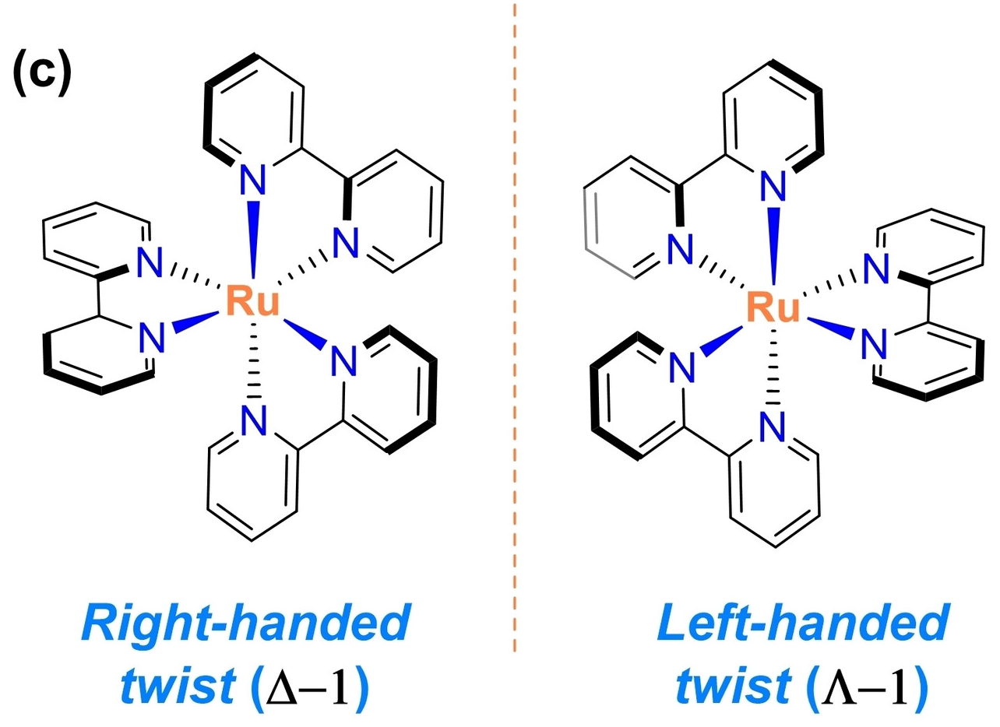

> **Λ和Δ对映体**：金属多吡啶配合物具有手性对映体，用希腊字母Λ（Lambda）和Δ（Delta）表示。这两个希腊字母描述的是**配体围绕金属中心的螺旋走向**：当从八面体顶点望向中心金属原子时，如果三条双齿联吡啶（bpy）配体从近到远顺时针排列则为Λ型，逆时针则为Δ型。这就好比我们的左手和右手，虽然组成元素完全相同，但三维空间排列不同，互为镜像。在这项研究中，作者设计时使用的是Λ型配合物作为模板，但实际合成得到的外消旋混合物包含Λ和Δ两种对映体。

### 创新点

- **方法创新**：将 RFdiffusion All-Atom、LigandMPNN、AlphaFold2初筛、AF3指导突变和后续定向进化串成一条完整路线，用于从头设计人工金属酶光催化支架
- **结合策略创新**：通过非共价相互作用实现金属配合物的对映选择性结合，避免了共价修饰的复杂性
- **设计-进化融合**：计算设计负责产生能结合辅因子的初始支架，定向进化再处理底物取向、局部柔性和低载量性能

## 研究内容

### 核心方法：Scaffold设计流程详解

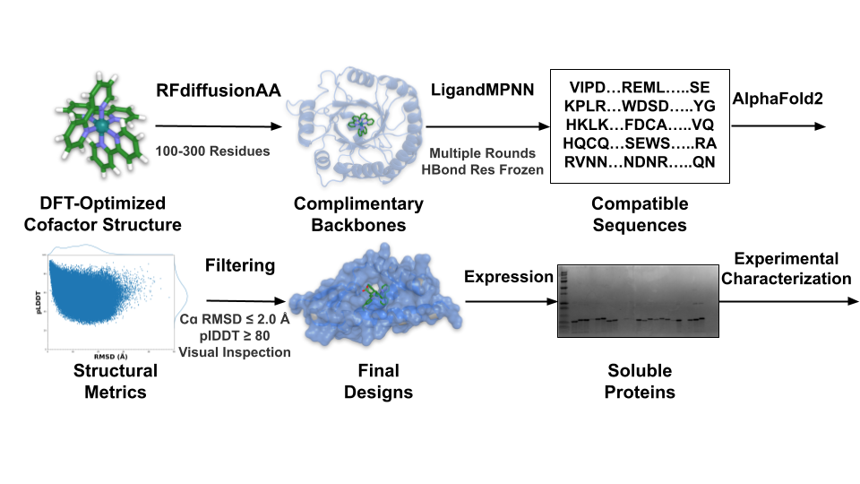

**图S1：计算设计工作流程详情**。本研究采用RFdiffusion + Rosetta的组合设计流程，分为以下几个关键步骤：

1. **辅因子选择**：选择Ru和Ir的多吡啶配合物作为目标金属配合物。本文主要研究四种辅因子：**Ru配合物2**（$\ce{[Ru(bpy)3]^{2+}}$衍生物）、**Ir配合物3**（$\ce{[Ir(dF(CF3)ppy)2(bpy)]^{+}}$的二羧酸衍生物，其中$\ce{\mathrm{d}F(CF3)ppy}$为二氟三氟甲基苯基吡啶）、以及用于比较的配合物4和5。

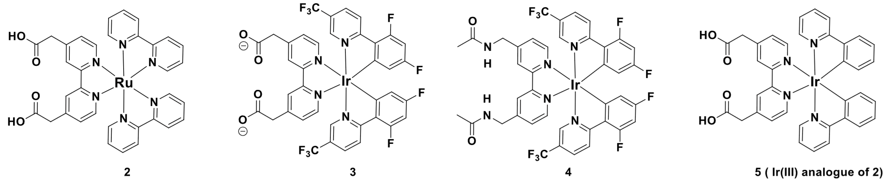

**图S4：不同辅因子变体的化学结构**。包括Ru配合物2、Ir配合物3（$\ce{[Ir(dF(CF3)ppy)2(bpy)]^{+}}$的二羧酸衍生物）以及用于比较的配合物4和5。配合物3带有羧酸基团，用于增强与蛋白的相互作用并帮助控制结合取向。

2. **骨架生成**：使用RFdiffusion生成10万个长度为100–300个氨基酸的能结合金属配合物的蛋白骨架
3. **疏水残基填充**：用Rosetta脚本将生成的骨架用疏水残基填充，改善packing
4. **筛选标准**：根据`contact_molecular_surface`、`dSASA`、`holes_around_lig`和`interface buried SASA`等指标选择高质量设计，确保蛋白-配体界面packing紧密、配合物被充分掩埋，且口袋周围没有明显空洞
5. **序列设计**：使用LigandMPNN为通过筛选的骨架设计序列，以带羧酸盐的Λ2配合物为条件模板，随后用AlphaFold2检查序列是否能折回设计骨架
6. **实验验证**：在大肠杆菌中表达设计蛋白，测试辅因子结合能力和催化活性。设计序列被克隆到表达载体后转化E. coli BL21Gold(DE3)，在TB培养基中培养，用IPTG诱导蛋白表达，通过SDS-PAGE验证可溶性表达

#### 骨架生成阶段

1. 作者先用DFT优化的$\ce{Λ\text{-}Ru(bpy)3^{2+}}$（Λ1）作为初始模板。DFT计算使用Gaussian16软件，采用**B3LYP泛函**、**Grimme的GD3经验色散校正**和**6-31+G(d)基组**，并在**CPCM溶剂模型**（参数设为乙醚）中优化几何结构。
2. 这个优化的辅因子结构作为条件配体输入RFdiffusion All-Atom，随后用默认全原子参数和`RFD_17.pt` checkpoint一共生成了**100,000个**、长度为**100–300个氨基酸**的蛋白骨架。这里的目标：先尽量多地产生能容纳金属多吡啶整体形状的候选口袋，再用界面指标筛掉明显松散或暴露的设计。
3. **初步筛选标准**：这些骨架先用作者自写的Rosetta XML脚本进行疏水残基填充，以改善蛋白-配体界面的packing，再按一组已建立的界面指标筛选，包括`contact_molecular_surface > 267`、`dSASA > 0.77`、`holes_around_lig > 4.95`和`interface buried SASA`$>850\,\mathrm{Å^2}$。这里的几个指标从不同角度检查同一个问题：**这个口袋是否足以稳定抓住金属多吡啶辅因子**。

| 指标 | 原文阈值 | 主要含义 | 直观理解 |
| --- | --- | --- | --- |
| `contact_molecular_surface` | $>267$ | 衡量蛋白和辅因子之间的有效接触表面，Rosetta会按表面距离给接触加权，因此它同时反映接触面积和贴合程度 | 辅因子被口袋**贴实地抱住** |
| `dSASA` | $>0.77$ | fractional interface $\Delta$SASA，表示辅因子结合后损失的溶剂可及表面积比例；接近1说明更接近完全埋藏，接近0说明仍大量暴露 | 辅因子**大部分埋入口袋** |
| `holes_around_lig` | $>4.95$ | 原文称为ligand cavity quality，反映配体周围腔体质量和局部packing状态；这里应按作者的Rosetta筛选分数理解，分数超过阈值才进入下一步 | 口袋周围的腔体质量**通过本文筛选标准** |
| `interface buried SASA` | $>850\,\mathrm{Å^2}$ | 衡量蛋白-辅因子界面形成后被埋藏的总表面积，原文将其解释为广泛的protein-cofactor contacts | 接触面**足够大、由多处接触共同稳定** |

> **筛选标准的物理意义**：这四个阈值合在一起，实际是在筛掉三类假阳性：能装进去但露在外面的口袋、接触面积够大但贴得不紧的口袋，以及腔体质量不过关的口袋。作者想保留的是**装得深、贴得紧、腔体质量合格、接触面还足够大的候选口袋**。

#### 序列设计阶段

通过筛选的骨架使用LigandMPNN进行序列设计，以带羧酸盐的Λ2配合物作为**条件配体上下文**，也就是把这个辅因子结构作为输入条件，指导序列设计生成能够与之匹配的蛋白序列。

> **光化学兼容性约束**：LigandMPNN设计时特意排除了苯丙氨酸、酪氨酸和色氨酸，因为这些芳香残基可能淬灭激发态或引入不需要的能量转移。

序列设计工作流程迭代优化辅因子结合相互作用：
- 首先，LigandMPNN为所有**可设计位置**生成序列和侧链构象；这里的“可设计位置”不是算法自动判定的功能位点，而是设计流程中没有被固定、允许LigandMPNN重新选择氨基酸类型的残基位置；
- 然后基于**几何标准**（氢键供体-受体距离和角度截断，具体数值在正文中未明确给出）识别与辅因子Λ2羧酸盐形成潜在氢键的残基；
- 这些氢键残基在后续设计轮次中被固定，以保持与羧酸盐取代基的有利静电相互作用。
- 这种**迭代设计-固定过程重复三次**，逐步精炼结合位点架构，同时保持关键的辅因子稳定相互作用。

最终生成的序列中，结合位点残基被设计为通过疏水作用、氢键和静电相互作用与配合物的特定部分相互作用，从而实现精确的定位和稳定。

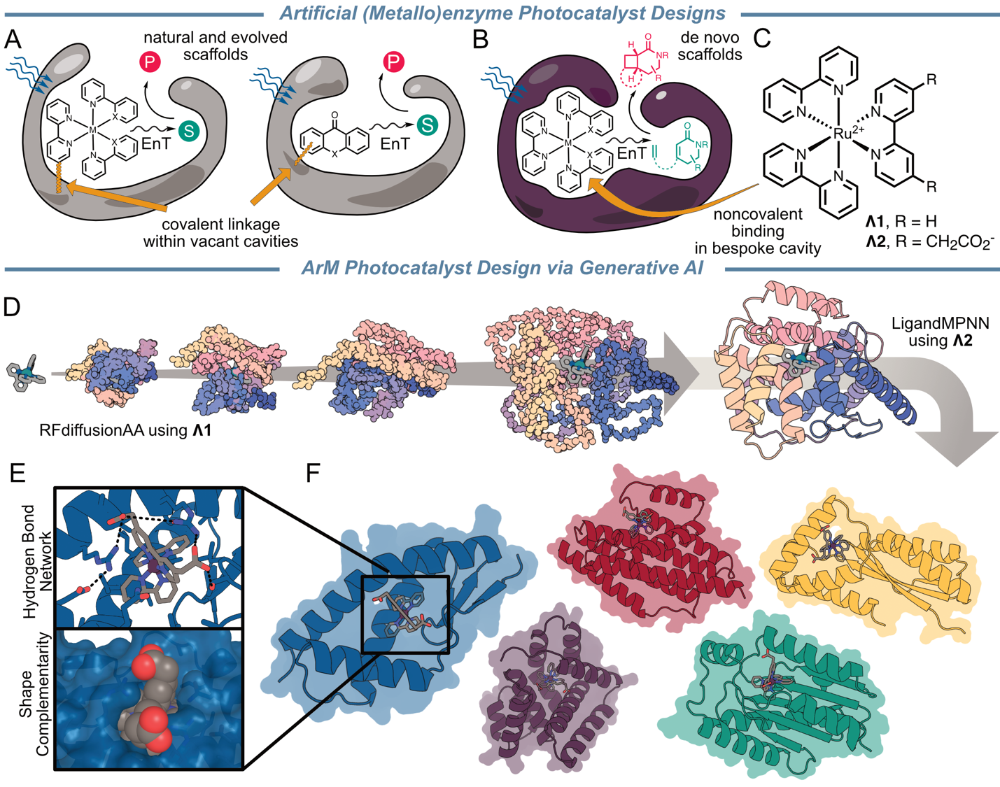

**图1**：从头设计金属多吡啶光催化剂非共价结合的计算策略。A）过去的人工光酶路线主要依赖共价偶联或把光敏基团嵌入现有支架。

B）本文转而设计可通过非共价方式容纳金属多吡啶辅因子的蛋白口袋。C）作者使用的$\ce{Ru}$多吡啶模板从 A1 到带羧酸取代基的 A2。D）RFdiffusion All-Atom 先生成口袋骨架，再由 LigandMPNN 在 A2 条件下做序列设计。

E）设计目标包括氢键网络和形状互补。F）最终保留的是一组能够容纳辅因子的不同折叠候选。

#### 候选选择与实验验证

最终共有96条设计序列进入实验测试。这些序列在大肠杆菌中表达后，通过SDS-PAGE分析验证，其中**63条成功以可溶蛋白形式表达**（66%成功率），覆盖32种不同折叠。进一步的native PAGE显示，16条序列对应的**5种折叠表现为单一寡聚状态**。作者从这5类折叠中**各选一个代表支架做后续辅因子结合和催化测试**。

### 设计支架的表征

计算设计产生了多个候选支架，研究团队选择其中五个进行实验表征。这些支架在序列上各不相同，但都共享相同的核心设计理念。这里有一个关键问题需要回答：设计出来的支架真的能结合辅因子吗？能区分Λ和Δ吗？

#### 第一步：用透析-Cotton效应筛选能结合的支架

> **Cotton效应是什么**？Cotton效应是指**手性物质在吸收带附近出现的特征性ORD或CD信号变化**。在这篇文章里，作者看的是CD谱：如果蛋白优先结合某一对映体（如Λ型），透析后保留下来的辅因子会富集该对映体，其CD谱图会在特定波长（如314 nm附近）表现出明显信号。这个信号的符号和形状可以用来判断蛋白更偏好结合哪种对映体。**如果Λ和Δ以接近等量保留，它们的CD信号会相互抵消，观察到的Cotton效应就会很弱。**

**透析-Cotton效应方法**：为了定量评估蛋白支架对金属配合物对映体的选择性结合，研究团队开发了“透析-Cotton效应”方法。**图S25：透析流程示意图**。具体步骤为：

- 将200 $\mu\mathrm{M}$蛋白支架与5倍过量的外消旋辅因子在50 mM MOPS、150 mM NaCl（pH 7.4）缓冲液中孵育，**透析去除未结合的辅因子**后记录 ArM 复合物的 CD 光谱，观察是否出现 Cotton 效应；
- 再将 ArM 的 CD 谱图与独立制备的 Λ 和 Δ 对映体标准谱进行比对，通过**匹配 Cotton 效应的符号和形状判定蛋白选择性结合的辅因子对映体**，最后使用标准曲线定量计算结合对映体过量（ee）。
- 该方法的优势在于**能够直接检测对映选择性结合，无需复杂的化学衍生或分离步骤**。

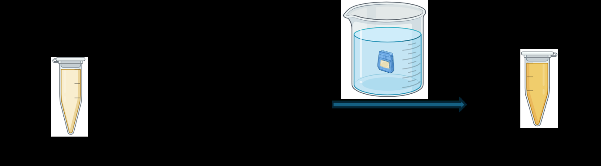

作者首先测试了五个支架的结合选择性。**$\ce{Ru}$配合物2几乎没有信号**，而$\ce{Ir}$配合物3给出了明显的Cotton效应。在所有测试的支架中，**DE3对Λ3的结合选择性最高，透析后达到94%的ee**。

> 为什么$\ce{Ru}$配合物2结合这么弱？这可能是因为$\ce{Ru}$配合物整体形式电荷更高（$\ce{Ru}$配合物为 $+2$，$\ce{Ir}$配合物为 $+1$），而LigandMPNN的设计流程**主要基于几何形状，没有完全编码电荷效应**。这反映了当前计算设计的局限性。

#### 第二步：用发光增强定量结合亲和力

> **支架命名规则**：DE3、DE18、DE52等支架名称中的DE代表**“Designed”（设计）**，表示这些是**从头设计的蛋白支架**。数字3、18、52等是不同设计序列的编号。这种命名直接表明了这些支架是通过计算设计生成的，而非来自天然蛋白的改造。

**发光滴定方法**：作者采用固定辅因子浓度、逐渐滴加蛋白支架的方法测量结合亲和力。具体而言，保持配合物3浓度恒定，向体系中连续加入不同浓度的蛋白支架，记录发光强度变化并生成结合曲线，最后用OriginPro 2021拟合得到$K_d$值。这种方法的原理在于：**游离辅因子的发光较弱，而结合到疏水口袋后发光显著增强**，因此发光强度直接反映了结合态辅因子的比例。

- 通过发光滴定，作者发现支架DE3对配合物3的亲和力最强，$K_d$约为 $13\,\mu\mathrm{M}$。为了区分Λ和Δ对映体，作者用纯对映体分别测试，发现DE3对Λ3的$K_d$是$8\,\mu\mathrm{M}$，对Δ3的$K_d$是$80\,\mu\mathrm{M}$。
- **10倍的差异**意味着DE3确实能区分这两个对映体——它对Λ的亲和力更强。这个差异也解释了透析实验的结果：结合更紧的Λ3更难被透析去除，而结合较弱的Δ3更容易被洗掉。

**等温滴定量热法（ITC）验证**：作者还用ITC对DE3•Λ3做了独立的亲和力测量。SI中给出的实验条件为：在25 °C下，用1.5 mM的Λ3滴定0.15 mM的蛋白支架，共25次注射，每次2.02 μL，注射间隔5分钟，并用独立结合模型拟合数据。ITC测量得到$K_d$约$9\,\mu\mathrm{M}$，与发光滴定结果（约$8\,\mu\mathrm{M}$）一致。**两种不同方法得到相近的结果，互相支持了亲和力测量**。

> **配合物3与蛋白支架结合后发光显著增强，寿命也延长**。这一现象为直接定量结合亲和力提供了基础。

####  为什么选择DE3作为进化起点？

DE3很快成为后续进化的主线，它在所有测试支架中表现最好：结合最强、选择性最高（94% ee）。其他支架要么结合较弱（DE18的$K_d=70\,\mu\mathrm{M}$），要么选择性较差（DE52只有5% ee），还有一些支架（如DE01、DE17等）没有明显Cotton效应。

| 支架 | 对 3 的总体 $K_d$ / $\mu\mathrm{M}$ | 偏好对映体 | 结合 e.e. / % | 备注 |
| --- | --- | --- | --- | --- |
| DE3 | 13 | Λ | 94 | **选中作为进化起点** |
| DE18 | 70 | Λ | 约 34 | 亲和力和选择性都弱于DE3 |
| DE52 | 23 | Δ | 约 5 | 选择性太差，几乎不能区分Λ和Δ |
| DE01/17/21 | - | - | - | 没有明显Cotton效应 |

下一步，作者的目标是**通过定向进化，把结合亲和力提得更高，同时保持或提高对映选择性**。

### 定向进化优化

#### 辅因子结合的优化：用AF3指导突变

虽然DE3已经能结合辅因子，但$13\,\mu\mathrm{M}$的$K_d$还不够强。这意味着需要较高蛋白浓度才能让大部分辅因子处于结合状态；在后续反应条件里，作者常用1 mol%辅因子和20 mol% scaffold，在这些条件下约对应20:1的scaffold:cofactor比例。

怎么改进？作者用AlphaFold3（AF3）生成DE3•Λ3的结构模型，然后**用AF3的pTM和ipTM分数辅助判断哪些突变可能提高结合**（图2D显示了AF3预测的六个关键位点）。这两个分数反映预测结构和界面相互作用的可信度；如果某个突变让AF3预测的复合物更可信，它就更值得进入实验筛选。

> 通过系统性的单点突变筛选，作者发现苯丙氨酸突变特别有效，尤其是R65F和R85F。把这两个突变组合起来后，DE3 R65F R85F对Λ3的$K_d$降到0.42 $\mu\mathrm{M}$——**这是约30倍的亲和力提升**。

为什么苯丙氨酸这么有用？苯丙氨酸是疏水的大侧链，可能通过填充口袋空隙、增强疏水接触，或与芳香配体形成堆积相互作用来改善结合。这是一个合理推断，但原文没有逐一证明每个突变的原子机制。

> 小编锐评：这是计算的最后挣扎了，做不了催化。训练数据里少有这种金属配合物的话，还是得通过基于物理的方法，如FEP。。

#### 催化测试的残酷现实：结合≠催化

DE3变体能紧密结合辅因子后，接下来的问题是：它能催化吗？能区分对映体吗？

> 结合亲和力主要告诉我们辅因子能否被保留在蛋白中；催化选择性还取决于底物在辅因子附近的取向，以及反应路径中哪一个手性产物更容易形成。**上文中的e.e.（enantiomeric excess）用于描述辅因子结合的选择性，而e.r.（enantiomeric ratio）用于描述催化产物的对映比**。
>
> **e.r.（对映比）是什么**：e.r.表示催化反应中两种对映产物的比例，本文通常按“次要对映体:主要对映体”的形式写。例如20:80 e.r.意味着产物中次要对映体约占20份，主要对映体约占80份；3:97 e.r.则对应约94% e.e.，选择性明显更高。**判断e.r.时不能只看第一个数字大小，而要看主要对映体是否占绝对优势**。
>
> **d.r.（非对映异构体比）是什么**：d.r.表示反应中生成的两种非对映异构体的比例。非对映异构体是指**具有多个手性中心但互不为镜像关系的立体异构体**。例如d.r.=1.2:1意味着产物中一种非对映异构体约占1.2份，另一种约占1份。这个指标通常用于描述具有多个手性中心的反应的立体选择性。

作者选择了[2+2]光环化反应作为模型反应（**图2E**）。这个反应把一个平面分子（6a）环化成一个有手性的四元环产物。理想情况下，人工金属酶应该主要生成一种对映体。然而，未优化的DE3•Λ3只给出低对映选择性；在随后测试的苯丙氨酸突变体中，单突变DE3 R85F给出了最高的20:80 e.r.，仍低于实用要求。

为什么会这样？这反映了**仅仅实现辅因子结合并不足以保证高对映选择性催化**。结合主要描述辅因子能否留在口袋里；催化还涉及底物进入、底物取向、能量转移和过渡态选择性。DE3能抓住辅因子，但口袋形状可能还不足以精确控制底物如何接近、如何反应。

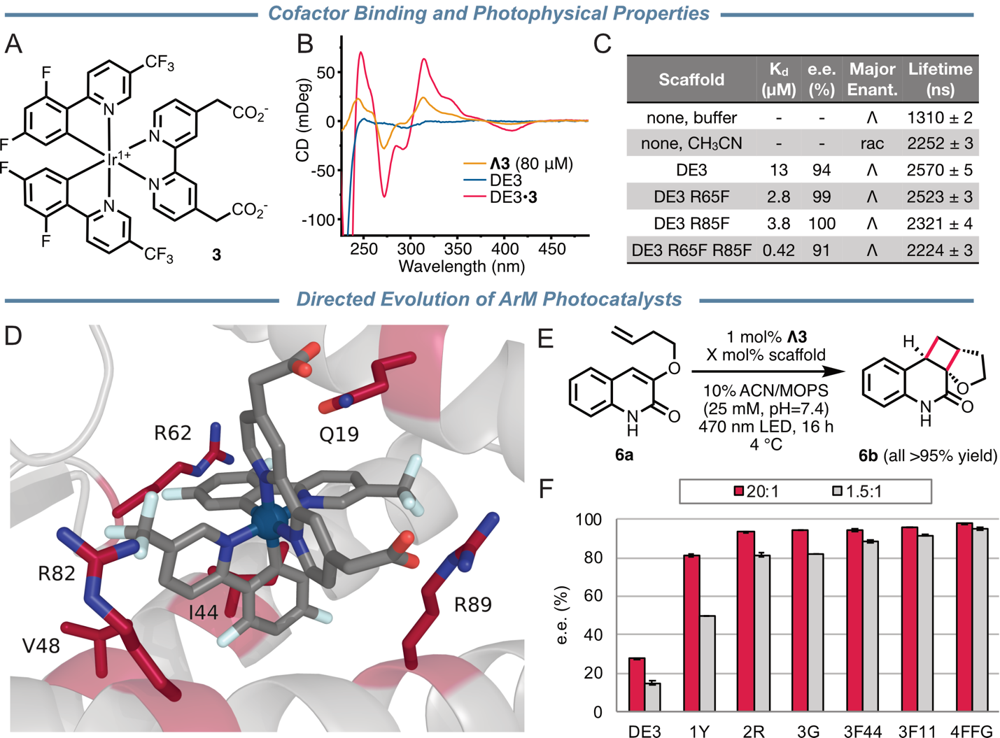

**图2**：从头设计人工金属酶支架的辅因子结合与催化。A）辅因子 3 的化学结构。B）真实 Λ3（金线）、支架 DE3（蓝线）和 ArM 复合物 DE3•Λ3（红线）的圆二色谱。C）选定支架与 Λ3 的 $K_d$、**结合ee**（辅因子结合的对映体过量）、优先结合的对映体以及发光寿命。D）基于 pTM 和 ipTM 分数锁定的潜在有益突变位点。E）用于进化筛选的 [2+2] 光环化反应。F）不同支架变体在筛选条件下得到的**产物e.r.**。

> **变体命名规则**：进化变体采用简写命名。例如“1Y”表示第1轮进化的酪氨酸突变（DE3 R85Y），“2R”表示第2轮进化的精氨酸突变（1Y Q22R），“3G/3F11/3F44”表示第3轮进化的甘氨酸或苯丙氨酸突变（2R R65G/L11F/L44F），“4FFG”表示Final组合突变（DE3 L11F Q22R L44F R65G R85Y）。这种命名简洁地标注了进化轮次和关键突变。

#### 定向进化：从“能催化”到“高选择性”

面对这个挑战，作者采用了定向进化——这是有策略的实验优化。作者采用**位点饱和突变**（site saturation mutagenesis）技术，使用**简并NNK密码子**（N=A/T/G/C，K=G/T）通过**重叠延伸PCR**（SOE PCR）构建突变文库。NNK密码子能编码所有20种氨基酸，同时尽可能减少终止密码子。每个目标位点构建一个饱和突变文库，转化大肠杆菌后表达突变蛋白，然后在标准[2+2]光环化反应条件下筛选e.r.。筛选采用96孔板格式，在定制400 nm LED光反应器中同时测试上千个克隆，通过UHPLC分析产物e.r.值。

##### 第一轮：从低选择性到10:90

在此前的苯丙氨酸突变中，单突变DE3 R85F给出最高的20:80 e.r.。进一步的饱和突变显示，**R85Y（命名为1Y）可以把选择性提高到10:90 e.r.**，这是本文进化路径中第一次达到90%以上的对映选择性。

为什么R85Y这么有效？精氨酸（R）带正电荷，可能通过静电作用与辅因子的羧酸基团相互作用；但酪氨酸（Y）有酚羟基，既能形成氢键，又能通过芳香环提供π-π堆积。这个改变可能既保持了结合，又调整了口袋的形状，让底物以更有利的方式接近。

##### 第二轮：从10:90到3:97

以1Y为基础，**在剩余五个位点构建文库**。Q22R把结果进一步推到**3:97 e.r.**，已接近实用要求。得到的变体**命名为2R**。

##### 第三轮：把高选择性带到低蛋白用量

2R虽然选择性高，但还需要20 mol%的scaffold loading。作者把筛选条件改得更苛刻：直接在更低scaffold loading下看能否保住选择性。在2R基础上，**对辅因子结合位点周围8 Å内的13个残基继续做饱和突变**。

筛选结果（图2F显示了不同变体的催化产物e.r.值）显示**三个有益单突变**：L11F（命名为3F11）、L44F（命名为3F44）和R65G（命名为3G）。这三个突变都能在1.5 mol% scaffold loading下提高选择性。组合后的4FFG（DE3 L11F Q22R L44F R65G R85Y）在1.5 mol% scaffold loading下**仍能给出3:97 e.r.**，说明**低蛋白用量下的选择性也能通过进化保住**。

scaffold loading从20 mol%降到1.5 mol%，约降低13倍，但选择性保持不变。

| 变体 | 关键突变 | 代表结果 | 为什么重要？ |
| --- | --- | --- | --- |
| DE3•Λ3 | - | 低对映选择性 | 能结合但选择性差 |
| DE3 R85F | R85F | 20:80 e.r. | 苯丙氨酸单突变中的最好结果 |
| 1Y | R85Y | 10:90 e.r. | **首次达到高选择性** |
| 2R | Q22R, R85Y | 3:97 e.r. | **达到实用选择性** |
| 3G | Q22R, R65G, R85Y | 在1.5 mol%下改善 | **第三轮单突变之一** |
| 3F11 | L11F, Q22R, R85Y | 在1.5 mol%下改善 | **第三轮单突变之二** |
| 3F44 | Q22R, L44F, R85Y | 在1.5 mol%下改善 | **第三轮单突变之三** |
| 4FFG | L11F, Q22R, L44F, R65G, R85Y | 3:97 e.r. | **降低蛋白用量13倍** |

> **设计和进化的分工**：计算设计把支架带到能结合辅因子的区域，定向进化再处理侧链柔性、底物预组织和溶剂效应这些难以一次算准的细节。关键在于**初始设计已经足够接近功能空间，进化只需局部调整而非全局重构**。

### 催化性能与机理研究

#### 反应机理与动力学研究

做到高 e.r. 之后，作者继续用稳态动力学和光谱实验追问一个更具体的问题：**蛋白到底改了什么**。稳态动力学结果显示，DE3•Λ3、2R•Λ3 和 2R•Δ3 都符合 Michaelis–Menten 动力学。

#### 不同变体的动力学参数对比

> **为什么只测DE3和2R**，不用那几个优化后的研究动力学：作者选择2R进行动力学和机理研究，是因为它具有高对映选择性，而后续变体（如4FFG）的主要改进是在更低scaffold loading下实现类似选择性，而非改变催化机制本身。因此研究DE3和2R就能代表从头设计和进化后变体的基本动力学特征。

| 变体 | $K_M$ / mM | $k_\text{cat}$ / $\mathrm{min^{-1}}$ | 催化效率 / $\mathrm{mM^{-1}\cdot min^{-1}}$ | 提升倍数 |
| --- | --- | --- | --- | --- |
| DE3•Λ3 | 1.3 | 0.46 | 0.36 | 基准 |
| 2R•Λ3 | 0.48 | 0.84 | 1.8 | 约5倍 |
| 2R•Δ3 | 0.67 | 1.1 | 1.7 | 约5倍 |

DE3 到 2R 的变化：$K_M$ 变小了，$k_\text{cat}$ 变大了，结果就是催化效率提高。**这个蛋白口袋同时提高了对映选择性和整体催化效率**。

虽然2R•Λ3和2R•Δ3的催化效率相似（1.8 vs 1.7 $\mathrm{mM^{-1}\cdot min^{-1}}$），但对映选择性差异巨大。使用20 mol% 2R和1 mol%辅因子时，2R•Λ3催化6a达到3:97 e.r.，而2R•Δ3只能达到11:89 e.r.。这说明**辅因子对映体对反应立体化学没有直接控制作用，而是通过差异结合亲和力间接影响选择性**：DE3对Λ3的亲和力远高于Δ3（见前文设计支架的表征那里），导致Δ3更容易游离并产生外消旋背景反应。

##### 光谱证据揭示机制变化

**光致发光表征**：DE3•Λ3相比游离辅因子发光更强、寿命更长；2RF•Λ3的绝对量子产率进一步升高。这里用2RF，而不是直接用2R，是因为2R含有Tyr85，酪氨酸可能和辅因子的电子激发态发生反应，容易把光谱解释复杂化。

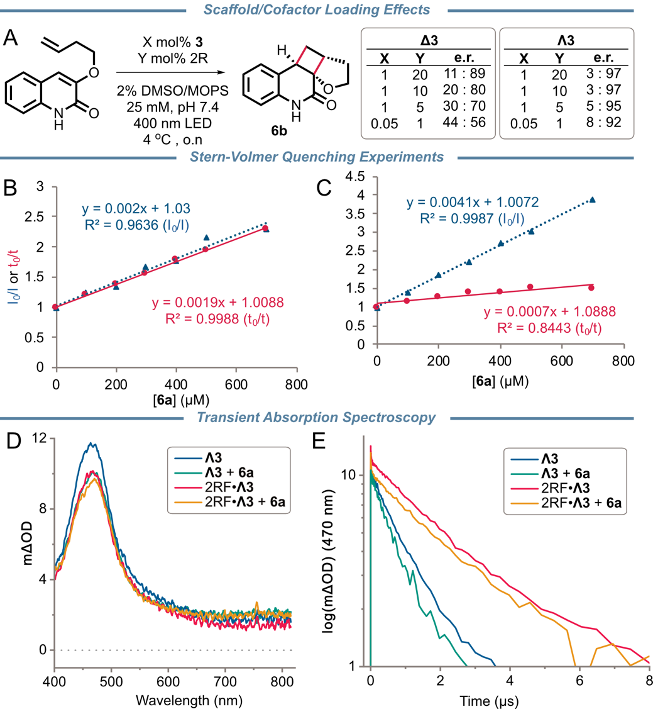

**图5**：支架-辅因子相互作用影响反应选择性和激发态行为。

- A）辅因子（X）和支架（Y）载量对ArM选择性的影响，因辅因子对映体不同而不同。红色方块代表Λ3，蓝色圆圈代表Δ3。
- Stern–Volmer实验看的是底物6a加入后，Λ3的发光强度和寿命怎么变
  - B）游离Λ3与底物6a。发光强度淬灭和寿命淬灭基本重合，说明**6a主要通过碰撞淬灭激发态Λ3**。
  - C）蛋白结合后的。**发光强度淬灭明显强于寿命淬灭**，说明**一部分Λ3和6a在激发前已经处于接近或结合状态**，表现为静态淬灭。
- D/E）瞬态吸收光谱（TAS）则直接跟踪Λ3激发态吸收（470 nm）随时间的衰减，纵坐标为光密度变化（log mΔOD），横坐标为时间。
  - 蓝色曲线（游离Λ3）：单指数衰减；绿色曲线（Λ3+6a）：**衰减更快**，斜率更陡，说明6a通过碰撞淬灭游离Λ3的激发态。
  - 红色曲线（2RF•Λ3）：双指数衰减，长寿命组分比游离Λ3延长2.2倍
  - 橙色曲线（2RF•Λ3+6a）：长寿命组分与红色曲线斜率相近**，说明加入6a后激发态寿命几乎不变。
- 两组实验相互印证，回答同一个问题：**6a到底是靠溶液碰撞淬灭Λ3，还是已经在蛋白口袋里靠近Λ3**。

> **强度和寿命的物理意义**：发光强度反映有多少激发态分子通过辐射跃迁回到基态并发出光子；如果周围有淬灭剂（如6a）通过能量转移把能量用于化学反应，强度就会下降。激发态寿命反映激发态本身的固有属性——即激发态分子在回到基态前平均能存活多久，这和有多少分子能激发无关。6a的淬灭就是把激发态Λ3的能量用于驱动[2+2]光环化反应。

##### Stern-Volmer淬灭分析

Stern-Volmer方程用于定量分析淬灭效率。有两种测量方式：

**稳态测量**（看发光强度）：
$$
I_0/I = 1 + K_{ISV}[Q]
$$

**时间分辨测量**（看激发态寿命）：
$$
\tau_0/\tau = 1 + K_{tSV}[Q]
$$

其中$I_0$和$I$是无/有淬灭剂时的发光强度，$\tau_0$和$\tau$是无/有淬灭剂时的激发态寿命，$[Q]$是淬灭剂浓度。**$K_{SV}$就是Stern-Volmer图的斜率**，越大表示淬灭越强。

两种淬灭机制的判据：

- **动态淬灭**（碰撞淬灭）：淬灭剂在扩散过程中与激发态分子碰撞，通过能量转移把能量用于反应。**$K_{ISV} \approx K_{tSV}$**，因为发光强度下降和寿命缩短同步发生——激发态分子更容易失活。
- **静态淬灭**（预组织淬灭）：淬灭剂在激发前就已与发光分子形成复合物。**$K_{ISV} > K_{tSV}$**，因为只有一部分分子能发光（那些和6a预组织的Λ3被"锁住"不发光），但真正发光的那些分子寿命不变。

| 样品 | 绝对量子产率 / % | 无底物寿命 / μs | 有6a底物寿命 / μs | $K_{ISV}$ / $\mathrm{M^{-1}}$ | $K_{tSV}$ / $\mathrm{M^{-1}}$ | 淬灭机制 | 含义 |
| --- | --- | --- | --- | --- | --- | --- | --- |
| 游离Λ3 | 26 | 0.96 | 0.76 | 2000 | 2000 | 动态淬灭 | 6a在溶液中随机碰撞Λ3，能量转移导致发光变暗、寿命缩短 |
| DE3•Λ3 | 44 | - | - | 约1500 | 约500 | 静态淬灭为主 | 部分Λ3与6a在口袋中预组织，激发前就形成非发光复合物 |
| 2RF•Λ3 | 55 | 2.14 | 2.09 | 4000 | 主文未给出 | 更强的预组织淬灭 | 寿命基本不变，说明是静态淬灭；但淬灭效率翻倍 |
| 2R•Λ3 | - | - | - | 3600 | 主文未给出 | 更强的预组织淬灭 | 进化后底物更容易靠近Λ3，预组织更有效 |

1. **游离Λ3是纯动态淬灭**：$K_{ISV}$和$K_{tSV}$都是$2000\,\mathrm{M^{-1}}$，说明6a在溶液中通过碰撞淬灭激发态Λ3，把能量用于反应。

2. **蛋白结合后出现静态淬灭特征**：DE3•Λ3的$K_{ISV}$（约1500）大于$K_{tSV}$（约500），说明部分Λ3在激发前就已经和6a形成复合物。这些预组织的Λ3-6a对不发光，但那些没有预组织的Λ3寿命不变。

3. **进化后淬灭效率翻倍**：2RF•Λ3和2R•Λ3的$K_{ISV}$分别达到4000和3600，是游离Λ3的两倍。这说明**进化支架把底物6a更有效地预组织在Λ3周围**，更多Λ3在激发前就与6a形成复合物。

4. **2RF•Λ3的寿命不变问题**：虽然$K_{ISV}$很大（4000），但**激发态寿命几乎不变**（2.14→2.09 μs）。这正是静态淬灭的特征——那些真正发光的Λ3分子寿命不变，但发光分子总数减少。

从结构上看，这个解释和后面的AF3模型是连在一起的：**Q22R可能通过离子配对帮助定向辅因子，R85Y让底物结合口袋更封闭，4FFG中的F11还可能与85Y协同包住底物**。这样，Λ3不是暴露在溶液里等底物随机撞上来，而是被固定在一个疏水、较封闭的口袋中；底物6a也更容易在同一个口袋里靠近Λ3。这个环境一方面减少溶剂碰撞、构象松动等非辐射失活（延长寿命），另一方面把能量转移发生的位置提前组织好（提高淬灭效率）。**图5支持的是激发态保护和底物预组织这两个结论**。

#### 结构验证

本文**没有拿到辅因子结合态的晶体结构**。真正获得的是 2R 和 2RCC 的 apo 结构。数据在 ALS 8.2.2 收集；2R 的分子置换主要借助 Arcimboldo Shredder，而 2RCC 则可以直接使用 AF3 模型完成分子置换。

> **2RCC的设计目的**：2R的N端柔性过大导致只能解析出63个残基。为限制这种柔性，作者在2R基础上引入了V7C和Q74C突变，形成了**第二个二硫键C7-C74**（2RCC）。2R原本已经有一个设计的二硫键C60-C71，2RCC新增的二硫键稳定了N端结构，使得完整序列得以解析，同时保持了与2R相似的辅因子结合亲和力（$K_d$=1.8 μM vs 3.4 μM）和对映选择性（4:96 e.r. vs 3:97 e.r.）。

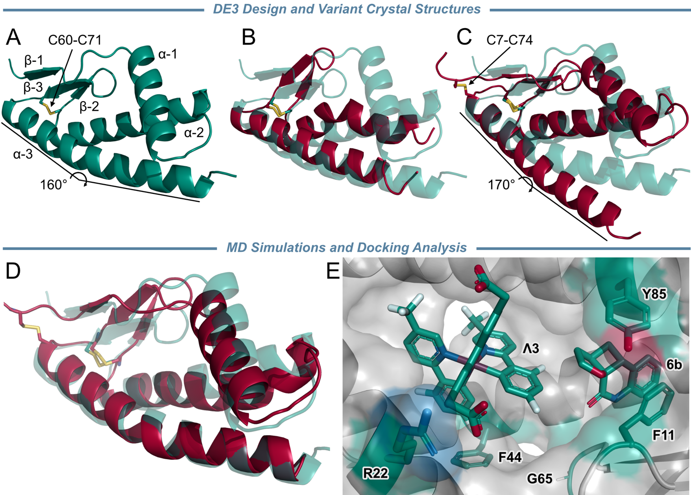

**图6**：进化人工金属酶的结构分析。A）apo 2R的注释模型，其中kink角度由L74、A85和L96的Cα位置定义。

- B）2R晶体结构的链A（红色，PDB ID 11EJ）与2R的AF3预测结构（透明绿色）叠加，晶体结构显示非对称单元中有一个63个残基的螺旋-环-螺旋（HLH）基序。
- C）2RCC晶体结构的链A（红色，PDB ID 11EK）与2R的AF3预测结构（透明绿色）叠加，晶体结构显示完整序列、设计的C7-C74二硫键和被拉直的α-3。
- D）从2RCC晶体结构链A出发的500 ns MD代表性轨迹与2R的AF3预测结构叠加，显示α-3可以回到AF3模型中的弯折位置。
- E）4FFG与Λ3和底物6a结合的AF3模型，显示辅因子与底物接近，并标出4FFG中的Q22R和R85Y突变。

为验证设计的辅因子结合口袋在溶液中是否可达，作者进行了**500 ns分子动力学模拟**。

- **软件**：AMBER（GPU加速的pmemd.cuda引擎）；**力场**：ff14SB
- **溶剂模型**：TIP3P水分子，150 mM NaCl；**时间步长**：2 fs
- **温度控制**：300 K，Langevin恒温器（碰撞频率$\gamma=5.0\,\mathrm{ps^{-1}}$）；**压力控制**：1 atm，Monte Carlo恒压器
- **模拟时长**：5条独立轨迹，每条500 ns；**起始结构**：从2RCC晶体结构（PDB ID 11EK）开始

**MD模拟结果**：从2RCC晶体结构开始的五重独立模拟轨迹显示，C末端的α-3螺旋可以恢复到设计态的弯折构象，kink角度和α-1/α-3距离都与DE3设计相似。

> **MD模拟解决了什么问题？**2RCC的晶体结构显示α-3螺旋被“拉直”了（因为晶体中形成了二聚体），这与设计态不一致。MD模拟表明，**在溶液中α-3会回到弯折的构象**——晶体中的拉直更可能来自晶体堆积或二聚界面，溶液中则更接近弯折构象。**这表明尽管apo晶体结构显示柔性，但设计的辅因子结合口袋在溶液中是可以达到的**。

### 实用性验证

#### 底物范围研究

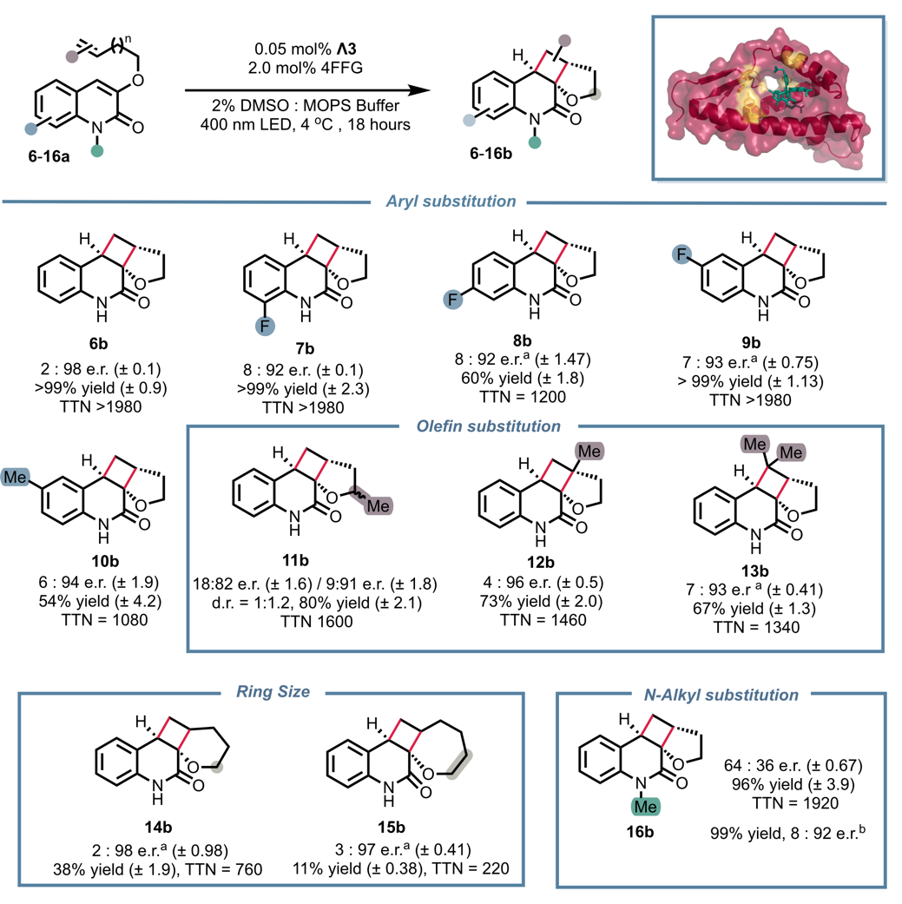

**图3**：进化人工金属酶的底物范围。展示了进化DE3变体的底物范围，包括收率和对映比：a使用4–10% v/v DMSO；b使用1 mol% Λ3和20 mol% 3P。图上标注了不同底物（6a–16b）在进化支架催化下的收率和对映选择性结果，其中主线结果主要来自4FFG•Λ3，N-甲基底物16b则使用进一步筛选得到的3P•Λ3条件。

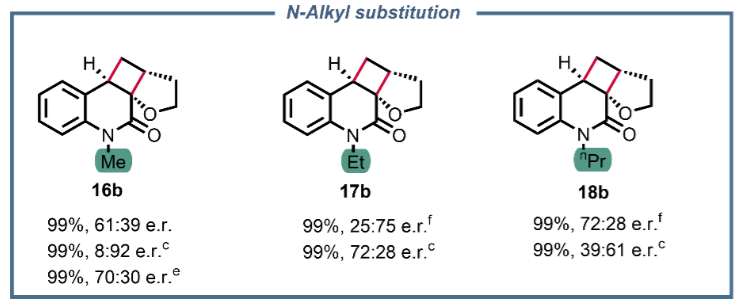

部分**图S12**：N-烷基取代底物的扩展研究。展示了17b-18b等更大N-烷基取代底物的反应结果，以及不同载量条件下的性能改善。

**图3展示了4FFG•Λ3对多种4-烯丙氧基喹啉酮底物的系统性研究**，这些底物具有不同的电子和立体特征。在标准反应条件下，大多数底物实现了高化学收率和中等到优秀的对映选择性控制。

| 底物类型 | 代表底物 | 收率概况 | e.r. | 含义、结论 |
| --- | --- | --- | --- | --- |
| 主模型底物 | 6a | 高 | 3:97 | 全文的基准结果 |
| 卤素/甲基取代 | 7b–10b | 高 | 6:94至8:92 | 芳环电子环境变化对催化效率影响有限 |
| 烯烃上甲基取代 | 12b–13b | 高 | 良好 | 不管甲基和偕二甲基，反应烯烃附近的立体位阻不会阻碍有效结合 |
| 烯烃tether甲基取代 | 11b | 高 | 18:82和9:91（两个非对映体） | 各自表现出显著但不同的对映富集。说明手性口袋对不同非对映异构体的识别存在差异 |
| 更长tether | 14b–15b | 良好 | 良好 | 尽管环尺寸更大且构象自由度增加，但仍能高效环化并具有良好的对映选择性 |
| N-甲基 | 16b | 可反应 | 61:39（4FFG）/8:92（3P） | 3P•Λ3（2R E89P突变体，专门针对N-甲基底物优化），说明**DE3支架可以重新优化以适应缺乏常规氢键结合模体的底物** |
| 更大N-烷基 | 17b–18b | 可反应 | 中等 | 也能有效环化，但对映选择性中等 |

- N-甲基底物16b：4FFG•Λ3选择性只有61:39，但进一步筛库得到的**3P•Λ3（2R E89P突变体，专门针对N-甲基底物优化）**可提升至8:92 e.r.
- **更大N-烷基底物17b–18b**：包括N-乙基和N-丙基。将辅因子和支架载量分别提高到0.5 mol%和2.5 mol%可以显著提高所有研究反应的对映选择性和收率。
- 有趣的是，对于底物6b和16b-18b，还发现了显示相反对映选择性的变体，说明**DE3支架能够生成替代的手性环境用于光催化**。例如，3P•Λ3催化17b达到72:28 e.r.（相反），催化18b达到39:61 e.r.（相反）

#### TTN与回收利用

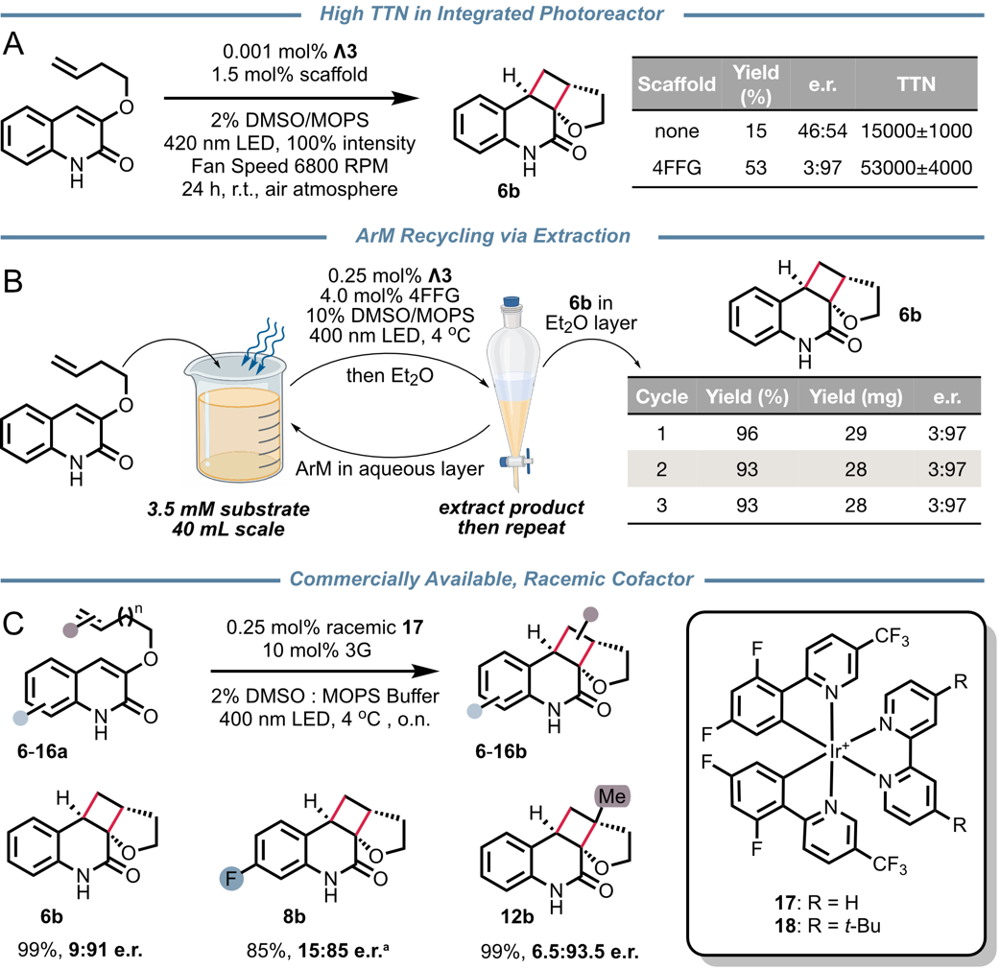

**图4**：新型人工金属酶表现出高总周转数和高可回收性。

- A）在Penn光反应器中进行反应**达到很高的总周转数**（TTN）。即使辅因子载量低至0.001 mol%，仍能达到53,000的TTN，这远超大多数人工光酶的报道值。
- B）通过产物萃取和重复反应实现的**ArM回收利用**。通过简单的液-液萃取就能分离产物，水相中的ArM可以继续用于后续反应；原文报告的是三轮反应和萃取中产率与对映选择性只小幅下降。
- C）使用外消旋、市售辅因子17生成的ArM进行对映选择性光催化。即使使用廉价的市售外消旋辅因子17，**3G•17催化底物6a仍能达到9:91 e.r.**，虽然相比2R•Λ3（3:97）有 modest reduction，但仍保持高选择性。这大大降低了实际应用的门槛，因为无需定制手性辅因子。

> **TTN是什么**？TTN是total turnover number，总周转数，意思是“每一个催化剂分子在整个反应中平均完成了多少次转化”。这篇文章的TTN按$\ce{Ir}$光催化辅因子计算（wrt [$\ce{Ir}$]），所以0.001 mol% Λ3在53%收率下大约对应$0.53/0.00001=53000$次周转。它和TON（turnover number）本质上是同一类指标，只是作者在强调低催化剂载量下的总周转能力时使用TTN。

**图4展示了ArM的实用性能**。作者进一步评估了4FFG•Λ3的实用性能指标：

| 反应场景 | $\ce{Ir}$辅因子载量 / mol% | 4FFG载量 / mol% | 收率 / % | e.r. | TTN/TON | 关键优势 |
| --- | --- | --- | --- | --- | --- | --- |
| 定制400 nm LED反应器 | 0.03 | 1 | 73 | 3:97 | 约2,300 | 标准条件验证 |
| Penn/integrated光反应器，空气中 | 0.001 | 1.5 | 53 | 3:97 | $53000\pm4000$ | **极低辅因子用量** |
| 游离Λ3，空气中 | 0.001 | 0 | 15 | 46:54 | $15000\pm1000$ | 对照组，几乎无对映选择性 |
| 市售辅因子17，空气中 | 0.001 | 0 | 14 | 48:52 | $14000\pm1000$ | 对照组，几乎无对映选择性 |

这些数字说明，这个体系已经超出基础筛选条件。**低辅因子载量、高周转和空气中仍能工作**，才是它更接近实际催化体系的部分。

回收利用和辅因子可得性也有实验数据支持。4FFG•Λ3 的回收不需要固定化，只要把产物用乙醚萃走，剩下的水相人工金属酶可以直接继续做下一轮反应。商用外消旋辅因子 17 也能和进化支架组装成功能性 ArM，这降低了复现实验时对定制手性辅因子的依赖。

## 关键结论与批判性总结

### 实验结果逻辑流程图

这套流程可以概括为“先定义辅因子，再生成口袋，再做实验进化”。本文已经把它跑到了$\ce{Ru}$和$\ce{Ir}$多吡啶体系，也证明了商用辅因子可以接上这条路线。

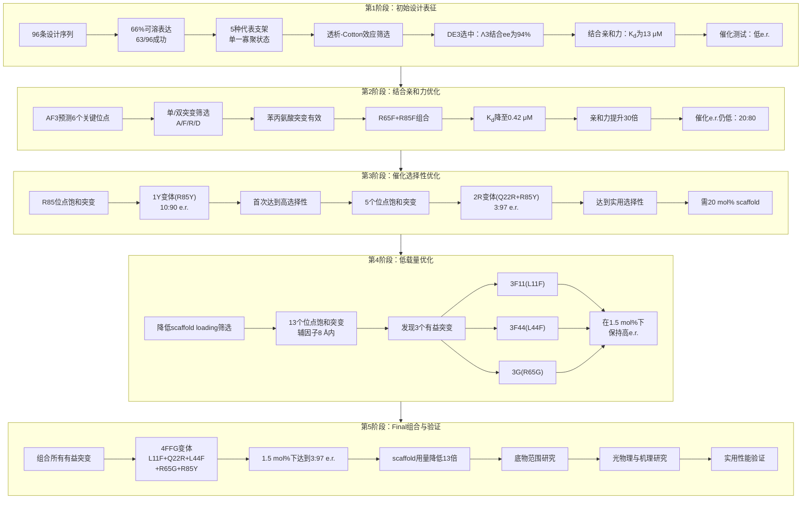

### 主要影响

- **设计策略的关键创新**：传统人工金属酶设计从已知蛋白折叠出发改造现有结合位点，受限于天然折叠的几何约束。本研究的关键创新在于**先定义目标配合物的理想结合几何形状，再让算法自由探索能够实现这一几何的蛋白骨架**，从而在原子层面更接近金属配合物的空间要求。这种方法**打破了天然折叠空间的限制**，允许为金属配合物量身定制结合环境
- **非共价结合的优势**：非共价结合**避免了复杂的化学修饰步骤**，简化了制备流程。更重要的是，**非共价结合能够主动识别并优先结合某一构型**，这是实现高对映选择性的基础。在分子层面，蛋白支架通过疏水作用、氢键网络和静电相互作用形成手性环境，对Λ和Δ两种对映体具有不同的“适配度”。**这种天然的手性识别能力是共价结合策略难以实现的**
- **路线已经跑通**：本文把“生成式蛋白设计→非共价辅因子结合→定向进化→高对映选择性光催化”这条路线完整串了起来，证明了**从头设计可以直接产生具有可进化性的功能支架**。这为人工金属酶研究提供了**可复用的设计范式**
- **性能和实用性同时提高**：除了 3:97 e.r. 这样的选择性，本文还给出了低辅因子载量、高 TON、空气中高周转和可回收使用这些更接近真实应用的指标。特别是**TTN达到53,000**，远超大多数人工光酶的报道值，证明**该体系已经超越了基础概念验证阶段**
- **支架兼容商用外消旋辅因子**：设计的支架与商用外消旋金属配合物兼容，只需简单混合蛋白和辅因子就能组装ArM，**消除了历史上将ArM研究限制在专业实验室的关键障碍**。这意味着**更多实验室可以复现和扩展这些结果**，而不需要定制合成的手性辅因子
- **同时调控结合亲和力、光物理性质和底物预组织**：本文展示了蛋白支架如何以小分子催化剂无法实现的方式同时调节结合亲和力、光物理性质和底物预组织。**量子产率从26%提升到55%**，激发态寿命延长2.2倍，这些数据直接证明了**蛋白环境对光催化性能的多维调控作用**

### 局限与未来方向

#### 反应类型与底物范围

- **当前局限**：本文最充分的数据仍然集中在分子内[2+2]光环化，其他反应家族是否同样容易迁移，还需要后续验证。特别是**分子间反应或需要不同氧化还原电势的反应**可能需要重新设计支架
- **扩展方向**：把这套支架设计路线推广到更多光催化底物，尤其是不同骨架和不同激发态机制的体系。特别是**[4+2]环化、烯烃异构化和C-H键官能团化**等反应是否适用，需要进一步探索

#### 结构表征与机制理解

- **当前局限**：目前拿到的是apo结构，不是辅因子结合态晶体结构，因此对辅因子和底物在口袋中的精确构象仍主要依赖AF3、光谱和MD共同支持。**没有真正的cofactor-bound结构，对结合模式的理解仍是间接的**
- **改进方向**：如果后续能得到cofactor-bound甚至cofactor + substrate的结构，辅因子取向和底物预组织模型会更容易验证。这将**直接揭示对映选择性控制的原子级细节**

#### 计算方法与金属特征

- **当前局限**：设计时原本打算结合$\ce{Ru^{2+}}$辅因子，但实际只有$\ce{Ir^{+}}$辅因子能结合。这说明**金属形式电荷很重要，但当前设计流程中使用的深度学习模型没有考虑这一点**。RFdiffusion和LigandMPNN**主要基于几何形状，对静电相互作用的编码还不完善**
- **改进方向**：**结合机器学习预测进化轨迹**可能进一步减少实验筛选的工作量。未来设计需要**更好地编码金属配合物的电荷特征和静电相互作用**

#### 支架构象与功能平衡

- **当前挑战**：与许多为刚性和良好packing而优化的从头设计支架不同，DE3及其变体在apo状态下显示出显著的构象柔性，这可能是容纳大体积疏水辅因子腔体的固有特征。**这种柔性虽然有利于结合大分子辅因子，但也增加了结构预测和设计的难度**
- **设计目标**：特别是**如何平衡柔性与刚性**，以同时实现辅因子结合和催化过渡态的精确控制，是未来设计需要考虑的重要因素

#### 辅因子兼容性

- **当前进展**：设计的支架与商用外消旋金属配合物兼容，只需简单混合蛋白和辅因子就能组装ArM，**消除了历史上将ArM研究限制在专业实验室的关键障碍**。商用外消旋辅因子17已经给了一个起点
- **扩展目标**：后续如果能把更多现成配合物接入，会降低复现实验和底物扩展的门槛。**目标是建立广泛的辅因子兼容性库**

#### 应用前景

本研究确立了使用AI驱动的从头蛋白设计为非天然辅因子创建定制活性位点环境的蓝图，预示着未来可以合理设计、进化和部署立体选择性光催化剂、氧化还原催化剂和多功能杂化系统。**这种方法可能扩展到所有需要手性环境的金属催化反应**。

> 这篇工作目前还是ChemRxiv预印本，很多结果已经很完整，但正式同行评审后的版本仍值得再核对一次
