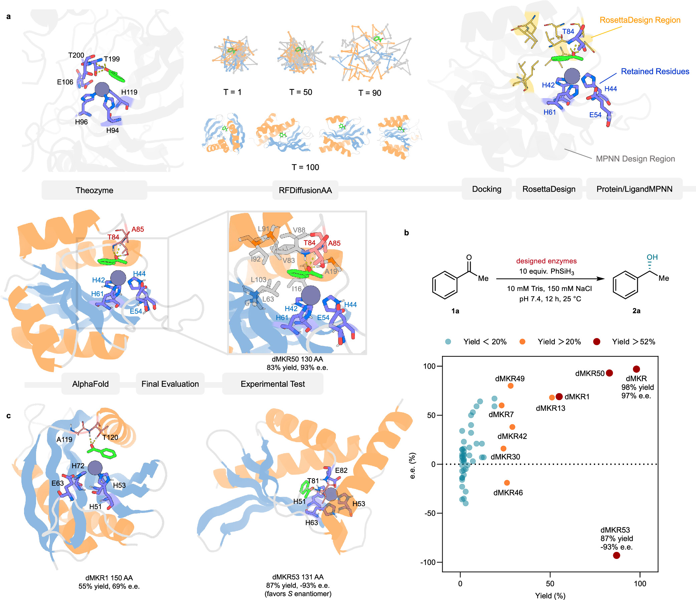
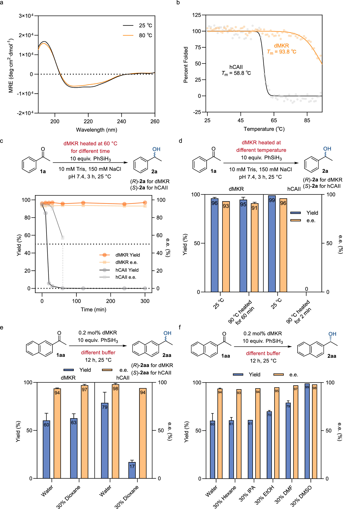
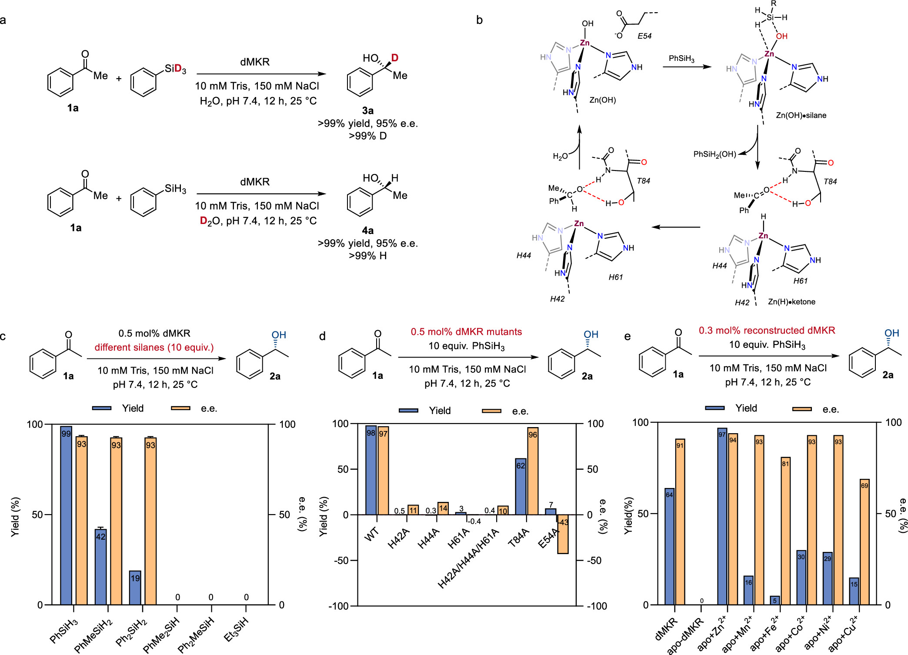
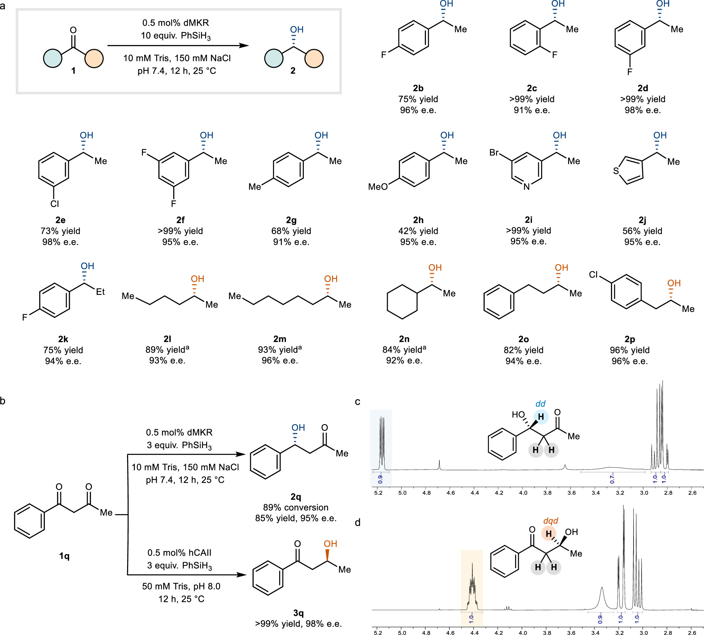
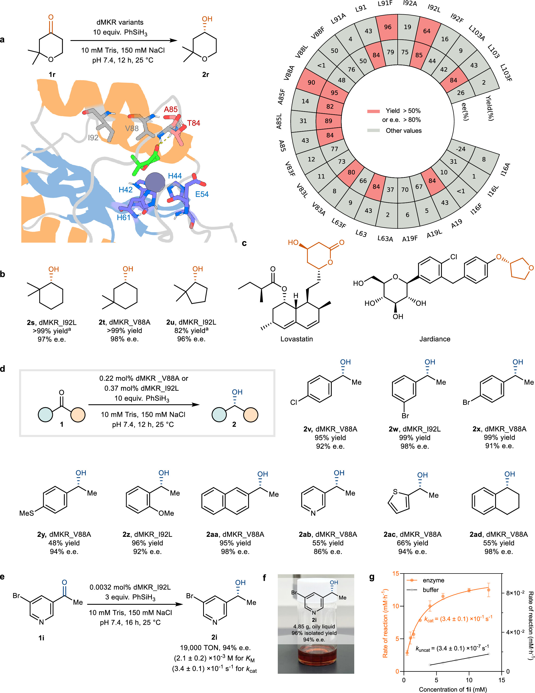

# 如何从头设计具有非生物催化机制的金属酶？深度学习设计锌基酮还原酶实现高效不对称合成

## 本文信息
- **标题**：De Novo Design of Miniature and Efficient Metallo-Ketoreductases
- **作者**：Yiling Xu, Yunhao Li, Hangwen Zheng, Elliot S. Delfosse, Yuxuan Gao, David Baker, Pengfei Ji
- **发表期刊**：Journal of the American Chemical Society
- **发表时间**：2026年4月28日
- **DOI**：https://doi.org/10.1021/jacs.6c00732
- **单位**：浙江大学化学系，华盛顿大学蛋白质设计研究所
- **引用格式**：Xu, Y., Li, Y., Zheng, H., Delfosse, E. S., Gao, Y., Baker, D., & Ji, P. (2026). De Novo Design of Miniature and Efficient Metallo-Ketoreductases. *Journal of the American Chemical Society*. https://doi.org/10.1021/jacs.6c00732
- **代码与数据**：设计模型数据（https://zenodo.org/records/15580524）

## 摘要
> 本文报道了一种**深度学习引导的工作流程**，用于从理论活性位点从头设计**金属酮还原酶**，实现通过**非生物氢负离子转移机制**的不对称酮还原。设计的微型酶仅含**130个残基**，在全细胞条件下表现出高催化性能，$k_{\text{cat}}/k_{\text{uncat}}$最高达到$1.4 \times 10^6$，**转换数（TON）达到19000**，**对映体过量（e.e.）值最高达到98%**，底物范围广，并能实现二酮的**区域选择性还原**。值得注意的是，设计支架对**90°C处理**表现出优异的**热稳定性**，热稳定性超过天然混杂还原酶，并对**多种有机溶剂耐受**。

### 核心结论
- **130残基微型酶**，分子量仅13.8 kDa，显著小于天然hCAII（29 kDa）
- **催化效率**：$k_{\text{cat}}/k_{\text{uncat}}$最高达到$1.4 \times 10^6$，TON高达19000
- **立体选择性**：e.e.值高达98%，对环酮（cyclic ketones）表现优异
- **稳定性**：熔融温度$T_m$达93.8°C，耐受30%有机溶剂
- **底物范围**：dMKR本身覆盖16种酮底物，产率高达99%，e.e.值$>90\%$；后续V88A和I92L变体进一步扩展到更多环酮、芳基酮和杂芳基酮
- **区域选择性**：对1-phenylbutane-1,3-dione实现区域选择性还原

## 背景

氧化还原酶在合成化学工业中尤为重要，特别是在药物和精细化学品的对映体中间体生产中，其中对映体纯度对生物活性至关重要。尽管天然酶具有优异的催化性能，但其催化功能通常受限于天然进化的化学机制，难以直接覆盖**非生物转化反应**。传统酮还原酶多依赖NADPH等天然辅因子，而这篇文章关注的是硅烷供氢、锌氢中间体参与的非天然还原路径。

> 锌氢负离子催化机制：**氢负离子来源于硅烷而非溶剂**，反应通过Zn-H中间体进行，而非硅烷直接插入的三元机制。具体而言，**这类非自然反应利用硅烷（如苯硅烷，$\ce{PhSiH3}$）作为终端还原剂和氢负离子（hydride）供体**。在催化过程中，硅烷首先将一个氢负离子转移给酶活性中心的锌离子，形成瞬态的“锌-氢中间体”（zinc-hydride intermediate）；随后，该中间体上的氢负离子再进攻（插入）酮的羰基碳，完成不对称还原。金属特异性验证显示，去除$\ce{Zn^{2+}}$后活性完全丧失，回补$\ce{Zn^{2+}}$恢复完整活性，证明dMKR是锌依赖金属酶。

目前，计算策略已成功设计了用于酸碱化学的酶，但**从头设计的氧化还原酶例子仍然很少**。金属酶在自然界的催化反应中扮演核心角色，但从头设计金属酶面临巨大挑战，需要**精确控制金属配位环境、底物结合口袋和反应中间体稳定性**。

> 本文的核心思想：**能否只保留理论活性位点的关键几何关系，再从头生成一个更小、更稳定、立体选择性可预设的蛋白支架**。hCAII虽然已经能通过锌氢机制还原酮，但它并不是为这个反应进化出来的：分子量约29 kDa，含较长loop和trefoil knot等结构特征，作为可移植、可重设计的工业生物催化支架并不理想。

### 关键科学问题
- 如何从理论活性位点模型出发，设计具有非生物催化机制的金属酶？
- 如何在保持催化活性的同时，大幅减小酶分子尺寸并提高稳定性？
- 如何实现对多种酮底物的高对映选择性还原，包括环酮（cyclic ketones）和二酮（diketones）？
- 如何通过计算设计精确控制区域选择性，实现二酮的特定位置还原？

### 创新点
- **深度学习引导设计**：结合RFDiffusionAA、ProteinMPNN和AlphaFold2，从理论活性位点出发设计微型金属酶
- **锌氢负离子机制**：重点不在于发现锌氢酮还原本身，而在于**首次把这一非生物还原机制植入从头设计的微型蛋白支架**
- **微型高效酶**：130残基的微型酶明显小于29 kDa的天然hCAII，并在热稳定性、溶剂耐受性和部分选择性上表现更好
- **优异稳定性**：$T_m$达93.8°C，耐受高温和有机溶剂
- **区域可控**：实现对二酮底物的精确区域选择性还原

---

## 研究内容

### 设计方法与计算流程

本文采用**深度学习引导的从头设计策略**，没有直接改造hCAII全蛋白，而是从hCAII的QM/MM优化活性位点中抽取关键几何约束，再让扩散模型生成新的蛋白骨架。具体步骤包括：

- **理论活性位点构建**：从人类碳酸酐酶II的QM/MM优化模型出发，固定$\ce{Zn^{2+}}$配位、底物和关键催化残基的相对位置。被迁移的关键残基包括三个配位组氨酸His94、His96、His119，辅助去质子化和静电稳定的Glu106，以及稳定烷氧负离子中间体的Thr199和Thr200
- **蛋白骨架生成**：使用RFDiffusionAA生成**8000个全新蛋白骨架**，每个少于155个残基，具有多样化的α/β二级结构
- **序列设计与筛选**：通过ProteinMPNN在三个温度下设计序列，生成54990个序列，经AlphaFold2预测筛选得到104个蛋白结构；随后用RIFDock对这104个骨架进行苯乙酮对接，共生成了777个对接模型（同一蛋白骨架包含不同的配体结合姿态），再按结合界面参数、底物埋藏程度和几何等条件将其筛选到148个设计模型
- **金属位点与界面精修**：用Metal3D在三个组氨酸处引入$\ce{Zn^{2+}}$，再用RosettaScripts优化配体周围残基，得到7350个设计；经过严格几何筛选、第二轮ProteinMPNN/LigandMPNN设计、ColabFold预测和FastRelax，最终选出24个dMKR进行实验测试

**图1：计算设计工作流程与初始筛选**。（a）dMKR的计算设计管线，包括关键催化残基识别、使用RFDiffusionAA从头扩散生成蛋白支架、配体和金属对接、Rosetta和MPNN方法序列设计、Colab版AlphaFold2结构预测、FastRelax最终评估和实验测试。（b）不同扩散家族的dMKR设计对acetophenone的还原活性评估。（c）除dMKR50外，产率$>50\%$和e.e.值$>50\%$的设计展示。

### 催化活性与稳定性表征

初始筛选和稳定性测试结果如下：

- **初始活性筛选**：24个从头设计的dMKR在大肠杆菌全细胞体系中测试苯乙酮还原，dMKR1、dMKR7和dMKR13显示出**显著活性**，产率$>20\%$，e.e.值$>50\%$
- **最优设计dMKR50**：来自扩散家族VII，经His-tag替换为Strep-tag后，在全细胞催化中达到**98%产率和97% e.e.值**，纯化酶产量达**175 mg/L**培养液
- **对映选择性可以预设**：dMKR50主要给出R构型1-phenylethanol，而另一个设计dMKR53给出S构型产物。原文还统计了产率$>5\%$且绝对e.e.值$>50\%$的12个设计，其中11个的产物构型与设计模型一致，说明**活性位点几何对立体化学有可预测性**
- **热稳定性优异**：圆二色谱显示dMKR在80°C仍保持折叠状态，**熔融温度$T_m$为93.8°C**，显著高于hCAII的58.8°C；dMKR在90°C孵育60 min后仍给出95%产率和91% e.e.值，而hCAII在90°C孵育2 min后完全失活
- **有机溶剂耐受性**：dMKR在30% hexane、IPA、EtOH、DMF和DMSO中均保持活性，其中30% DMSO中产率达到$>99\%$、e.e.值为98%。与hCAII的直接对照只在30% 1,4-dioxane条件下进行，hCAII产率从79%降至17%，而dMKR仍有63%产率和97% e.e.值

**图2：dMKR的热稳定性和有机溶剂耐受性**。（a）远紫外圆二色谱显示dMKR在25°C和80°C的二级结构信号相近。（b）热变性曲线显示dMKR的$T_m$为93.8°C，而hCAII为58.8°C。（c, d）预热后再测催化活性，橙色代表dMKR，灰色代表hCAII；dMKR在60°C和90°C处理后仍保持较高活性，hCAII迅速失活。（e, f）蓝色柱为产率，橙色柱为e.e.值；dMKR在多种30%有机共溶剂中仍能工作，DMSO和DMF甚至提高了疏水底物1aa的转化。

### 反应机制研究

通过系列实验揭示了锌氢负离子催化机制：

- **氘代标记实验**：使用$\ce{PhSiD3}$作为还原剂，产物在立体碳中心$>99\%$氘代，证实氢负离子来源于硅烷而非溶剂
- **锌氢负离子机制确认**：测试不同硅烷的还原效果，产物e.e.值不随硅烷结构变化，表明反应遵循**锌氢负离子机制**（即**硅烷先将一个氢负离子转移给锌中心，形成锌-氢中间体，然后再插入到酮的羰基中**），而非各种硅烷直接与酮反应的三元机制；空间位阻更大、供氢能力更弱的硅烷不给产物，也支持硅烷需要先与锌活性位点有效作用
- **关键残基鉴定**：丙氨酸扫描突变表明，His42、His44、His61和Glu54对催化活性和构型控制至关重要；任一组氨酸突变都会使活性消失或几乎消失。Thr84突变为Ala后产率从98%降至62%，但e.e.值基本不变，说明Thr84有贡献，但不是绝对必需位点，可能由主链酰胺氢键部分补偿
- **金属特异性验证**：金属取代实验显示，**去除$\ce{Zn^{2+}}$后活性完全丧失**，回补$\ce{Zn^{2+}}$恢复完整活性。Mn、Fe、Co、Ni和Cu等离子并非完全不能反应，而是只给出部分活性，因此原文的结论是dMKR是锌依赖金属酶，同时金属替换可能提供进一步调参空间

**图3：dMKR反应机制研究**。（a）氘代同位素标记实验追踪氢负离子来源。（b）dMKR催化苯乙酮还原的总体反应机制。（c）不同硅烷类型对产物e.e.值和产率的影响。（d）关键催化残基丙氨酸突变对活性的影响。（e）$\ce{Zn^{2+}}$被其他金属离子取代后的催化活性。

### 底物范围与区域选择性

在全细胞条件下，dMKR**高效还原16种酮底物**，产率最高达到99%，所有例子的e.e.值均$>90\%$。底物包括多种芳基酮（带吸电子或给电子基团）、烷基酮、杂芳基酮和二烷基酮。特别值得注意的是，dMKR对1-phenylbutane-1,3-dione（1q）实现了**区域选择性还原**，选择性还原靠近苯环的内部羰基，产率85%，e.e.值95%，与hCAII的区域选择性（优先还原末端羰基，产率$>99\%$，e.e.值98%）相反。这里的关键并非简单的“酶更强”，而是设计模型中**苯基埋藏在疏水口袋、羰基由Thr84附近氢键定位、末端羰基远离$\ce{Zn^{2+}}$中心**，从而改变了哪个羰基更容易被还原。

**图4：dMKR底物范围与区域选择性**。展示16种酮底物的还原结果，包括芳基酮、烷基酮和杂环酮，以及对1-phenylbutane-1,3-dione的区域选择性还原。

### 定向进化优化

通过定向进化进一步提升催化性能：

**图5：dMKR定向进化**。（a, b）dMKR变体对环酮还原的催化活性评估。（c）手性环醇在药物和天然产物中的应用示例。（d）dMKR变体对芳基酮和杂芳基酮的催化性能。（e）低催化剂载量下的TON测试。（f）克级不对称放大反应。（g）dMKR_I92L的动力学参数。

- **突变位点选择**：针对环酮底物，作者采用FRISM策略，对设计模型中距离配体4 Å以内的9个残基进行定点小库突变，分别用Ala、Leu和Phe调节口袋大小和空间位阻
- **V88A变体优化**：dMKR_V88A对2,2-dimethyloxan-4-one的**产率从43%提升至90%**，e.e.值从84%提升至95%
- **底物范围扩展**：dMKR_V88A和dMKR_I92L对多种环酮和芳基酮的催化性能显著提升
- **高TON实现**：在0.0032 mol% dMKR_I92L和3当量$\ce{PhSiH3}$条件下，对1i的**TON达到19000**，产率61%，e.e.值94%
- **克级放大验证**：**克级放大反应**在5小时内完成，产率96%（4.85 g），e.e.值94%，展示了实用潜力

### 动力学参数

> 动力学参数揭示了dMKR的优异催化性能：**$k_{\text{cat}}/k_{\text{uncat}}$高达$1.0 \times 10^6$**，**$k_{\text{cat}}/K_M$达到$160 \pm 20\,\mathrm{M^{-1}\cdot s^{-1}}$**，与天然或进化酮还原酶处于同一量级。

动力学研究表明dMKR变体具有优异的催化性能：

- **底物亲和力提升**：dMKR_I92L对底物1i的$K_M$为$(2.1 \pm 0.2) \times 10^{-3}\,\mathrm{M}$，低于hCAII的$(1.1 \pm 0.2) \times 10^{-2}\,\mathrm{M}$，表明**更高的底物亲和力**
- **催化速率**：dMKR_I92L对1i的$k_{\text{cat}}$为$(3.4 \pm 0.1) \times 10^{-1}\,\mathrm{s^{-1}}$，$k_{\text{cat}}/K_M$为$160 \pm 20\,\mathrm{M^{-1}\cdot s^{-1}}$
- **速率增强显著**：无酶对照反应的$k_{\text{uncat}}$仅为$(3.4 \pm 0.1) \times 10^{-7}\,\mathrm{s^{-1}}$，因此dMKR_I92L对1i的$k_{\text{cat}}/k_{\text{uncat}}$为$1.0 \times 10^6$；原文摘要中最高的$1.4 \times 10^6$来自dMKR_V88A对1i的动力学结果
- **进化变体优化**：对acetophenone的还原，dMKR_V88A的$k_{\text{cat}}/K_M$为$88 \pm 8\,\mathrm{M^{-1}\cdot s^{-1}}$，比dMKR（$21 \pm 3\,\mathrm{M^{-1}\cdot s^{-1}}$）**提升4.2倍**，与天然或进化酮还原酶（$10$至$600\,\mathrm{M^{-1}\cdot s^{-1}}$）处于同一量级

---

## 关键结论与批判性总结

### 主要贡献

- 建立了**从理论活性位点出发的深度学习引导金属酶设计流程**，为人工酶设计提供了新方法；设计的130残基dMKR在热稳定性、溶剂耐受性和部分底物的选择性方面优于hCAII，实现了分子尺寸明显缩小的同时保持高催化表现。
- 这项工作的关键不在于锌氢中间体酮还原这条机制本身，而在于**把锌氢非生物还原机制装进了从头设计的微型蛋白骨架**；同时展示了克级合成反应、TON达到19000、优异热稳定性和溶剂耐受性。

### 局限性与挑战

- 尽管dMKR本身已涵盖16种酮底物，且进化变体进一步扩大了底物范围，但对**大位阻或特殊结构底物的活性**仍需优化；$k_{\text{cat}}$（约$0.34\,\mathrm{s^{-1}}$）与很多天然酶相比**仍有提升空间**。
- **设计成功率仍然有限**：首轮24个设计中只有3个表现出显著活性；如果按全文总结的52条筛选序列计算，36条有可检测对映选择性（e.e.值$>10\%$），但真正高性能候选仍需要二次设计、标签替换和定向进化。

### 未来方向

- 将设计策略**应用于其他氧化还原反应**，如醇氧化、烯烃还原等；设计**协同双金属催化中心**，实现更复杂的转化；
- **整合QM/MM预测过渡态稳定性**，提高设计成功率；探索**工业化应用**，包括固定化酶、连续流反应、大规模生产工艺开发。

### 批判性评价

本研究展示了**深度学习在金属酶设计中的强大能力**，从理论活性位点出发实现了高性能催化剂的从头设计：

- **性能评价需要分开看**：与天然hCAII相比，dMKR在**分子尺寸显著减小**的同时，实现了**更高的热稳定性和溶剂耐受性**；但不同底物上的$k_{\text{cat}}/K_M$并非全面超过hCAII，因此更准确的说法是：它在稳定性、可设计性和特定选择性上体现了从头设计的优势
- **精确控制能力**：**区域选择性的精确控制**充分体现了计算设计的优势，实现了与天然酶相反的选择性
- **设计挑战**：然而，**设计成功率仍较低**，对过渡态的精确预测和能量学评估需要进一步改进

总体而言，这项工作为人工金属酶设计提供了一个清晰样例：**先定义金属活性位点几何，再生成小型蛋白骨架，最后通过实验和定向进化补足活性**。它的意义不在于一次性替代天然酶，而在于证明非天然氧化还原机制可以被较系统地迁移到从头设计的蛋白支架中。

> 小编锐评：具体的催化活性的优化等，AI仍无法取代基于物理的方法、定向进化等，因为精度不够。但其实选择性之类的可以通过允许给AI更多constraint来预先实现，本质上就是一些相互作用的优化，还是很有必要做的，传统办法仍然费时。骨架的设计可能也需要更多约束和更精确吧。当然酶的kinetics等更细节的、allosteric的又是AI做不了的了。
