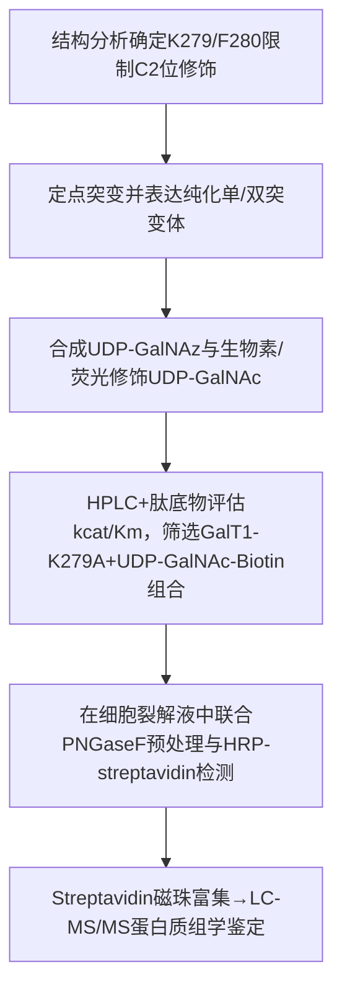
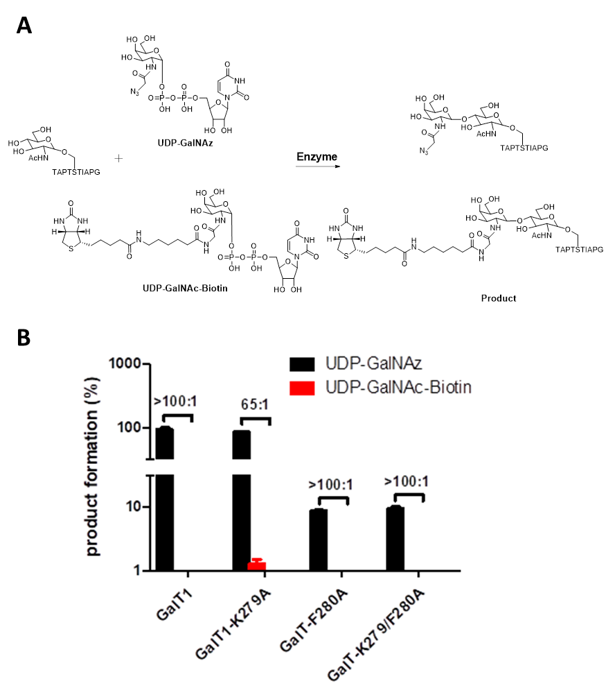
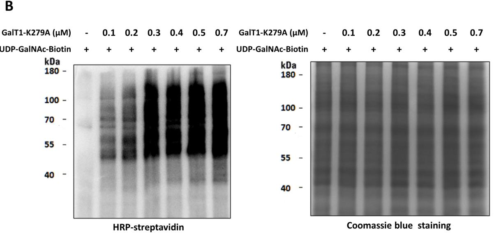
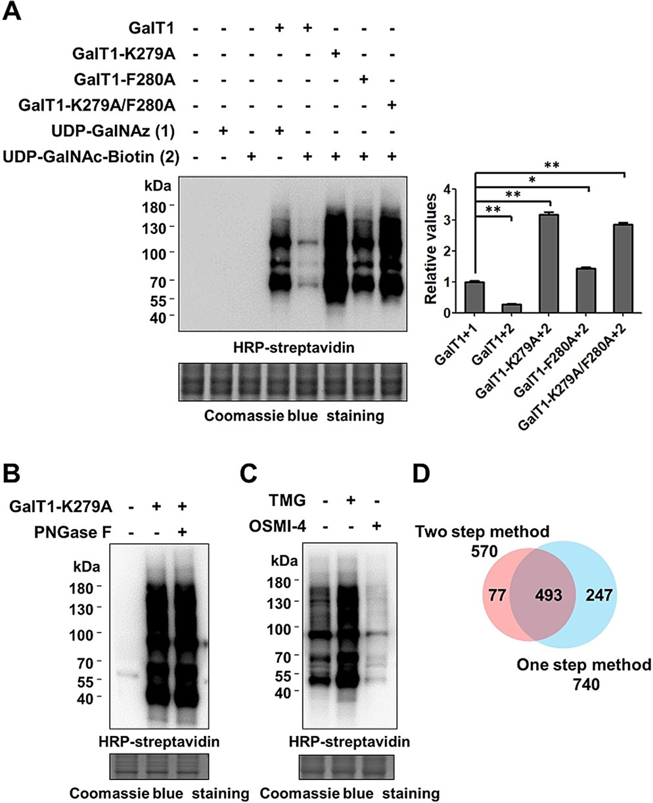
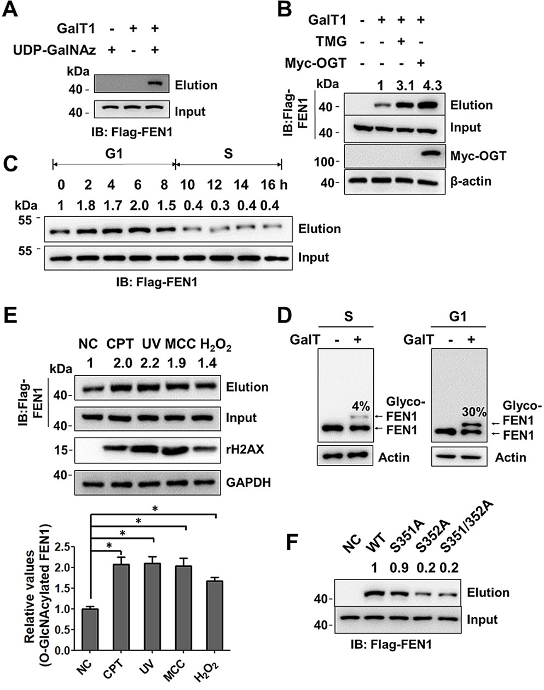
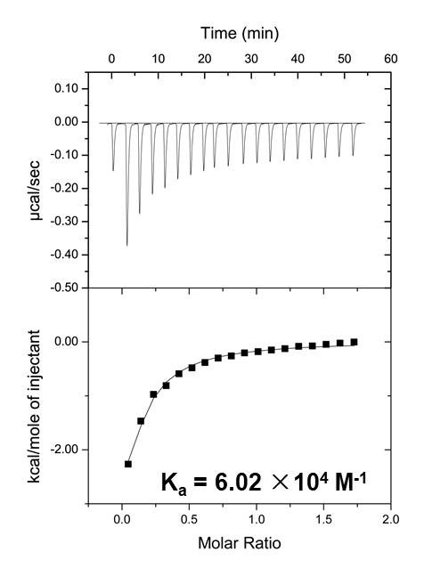
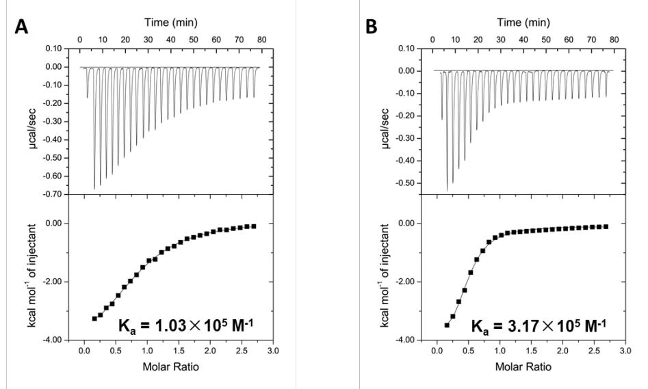
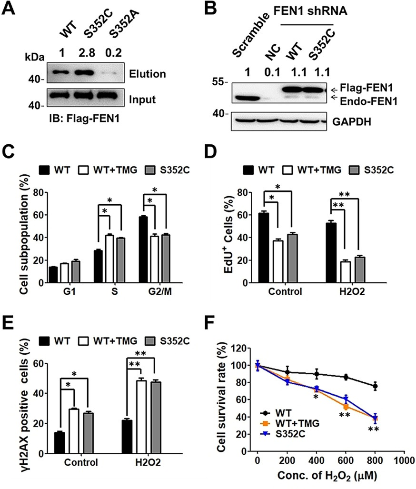
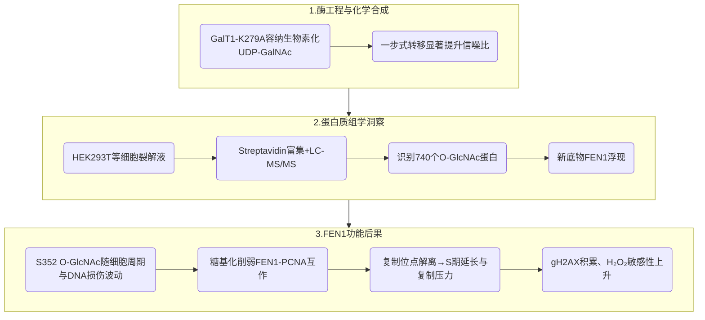

# 单步O-GlcNAc标记锁定FEN1糖基化控制细胞周期

## 本文信息
- **标题**: “一步式”酶促标记揭示O-GlcNAc参与FEN1介导的细胞周期
- **作者**: Yinping Tian, Qiang Zhu, Zeyu Sun, Didi Geng, Bingyi Lin 等，通讯作者是 Wen Yi
- 发表时间: 2021年11月2日
- **单位**: 浙江大学生命科学学院、浙江大学第一附属医院（中国杭州）；北京生命科学研究所（中国北京）；南方科技大学（中国深圳）；中科院上海药物所（中国上海）
- **引用格式**: Tian, Y., Zhu, Q., Sun, Z., Geng, D., Lin, B., Su, X., He, J., Guo, M., Xu, H., Zhao, Y., Qin, W., Wang, P. G., Wen, L., & Yi, W. (2021). One-Step Enzymatic Labeling Reveals a Critical Role of O-GlcNAcylation in Cell-Cycle Progression and DNA Damage Response. *Angewandte Chemie International Edition*, 60, 26128–26135. https://doi.org/10.1002/anie.202110053

## 摘要
> **O-连接N-乙酰葡糖胺是一种对细胞功能至关重要且遍布全蛋白质组的翻译后修饰**，其水平发生扰动会直接改变细胞周期推进与DNA损伤应答，但具体机制尚不清楚。本文开发高灵敏度的一步酶促策略，在细胞内直接捕获并描绘O-GlcNAc化蛋白。依托该策略，团队发现DNA合成必需酶FEN1是新的O-GlcNAc底物，且其修饰量在整个细胞周期中动态调控。FEN1的Ser352位点发生O-GlcNAc会破坏其在复制焦点与PCNA的互作，引发细胞周期紊乱、DNA复制缺陷、DNA损伤积累，并显著提高对损伤试剂的敏感性。**该工作既提供可精准描绘O-GlcNAc蛋白的敏感方法，也揭示了O-GlcNAc调控细胞周期与DNA损伤应答的全新机制**。

### 核心结论
- **K279A突变体** 可以高效转移生物素化UDP-GalNAc，实现一步式O-GlcNAc捕获
- **一步式流程** 在HEK293T细胞中识别出740种O-GlcNAc蛋白，较传统方案多247个低丰度靶标
- **Ser352糖基化的周期性** 体现在G1期约30%、S期约4，并对DNA损伤信号高度敏感
- **S352 O-GlcNAc的亲和力损失** 使FEN1与PCNA的结合下降一个数量级，引发S期延迟和DNA损伤累积

## 背景
**O-GlcNAc修饰是发生在丝氨酸或苏氨酸上的可逆糖基化，负责在代谢、信号转导和细胞周期之间传递单糖指令**。传统两步式化学放大策略依赖GalT转移含叠氮的GalNAz，再以CuAAC接枝生物素或荧光团，但二次点击反应常受速率慢、非特异副反应及细胞环境干扰，限制了对低丰度底物的捕获深度。

**DNA复制与损伤修复对酶促PTM高度敏感**。FEN1在RNA引物切除与长片段修复中是不可或缺的核酸内切酶，虽然其磷酸化、乙酰化与泛素化已被深入研究，但迄今尚无糖基化证据，导致我们难以理解糖代谢信号如何反馈到复制与损伤应答。

**多尺度调控要靠能够兼具灵敏度与特异性的原位糖蛋白捕获手段，才能系统揭示O-GlcNAc网络并解析其如何影响细胞周期、蛋白互作与DNA稳态**。

### 关键科学问题
- **工程化糖基转移酶的问题**：能否将含宏观报告基团的UDP-GalNAc直接转移至O-GlcNAc位点，从而省略易出错的化学点击步骤？
- **一步式方法的覆盖度与特异性**：是否优于传统两步法，并能识别此前未被发现的低丰度O-GlcNAc蛋白？
- **FEN1糖基化的周期性与机制**：是否通过特定途径影响PCNA互作、DNA复制与损伤应答？

### 创新点
- **结构引导定位GalT1瓶颈**（K279/F280）并构建K279A突变体，配合生物素化UDP-GalNAc实现“一步式”标记
- **PNGaseF预处理+HRP-streptavidin检测** 与定量蛋白质组学结合显著提升O-GlcNAc鉴定深度
- **FEN1 Ser352的动态O-GlcNAc** 被首次证明可破坏FEN1-PCNA界面、调控复制进程与DNA损伤积累

---

## 研究内容

### 方法概览：结构引导的GalT1工程与生物素化UDP-GalNAc
**研究团队从GalT1晶体结构（PDB 1OQM）切入，确认K279/F280位于活性口袋入口并构成容纳大位阻供体的瓶颈**。GalNAc部分沿着催化口袋直径延伸，N-乙酰基距离L255、M277、K279、F280、Y289等残基的甲基约5 Å，提示这些位点直接界定C2位取代基的空间。

> **对于希望复现或扩展分子模拟的研究者而言，L255-M277-K279-F280-Y289围成的入口环就是评估体积效应的最小结构单元**。通过突变K279A、F280A及双突变，配合自制四类UDP-GalNAc衍生物，筛选出在HPLC酶学与肽基底实验中活性最优的GalT1-K279A。
> **模拟提示**：相对于GalT1-Y289L（文中称GalT1），K279A让供体C2方向多出可容纳约3 Å投影长度的空腔，因此在建模时可将C2位以长链生物素接头替代而不会与F280、Y289产生排斥；若想评估更大供体，可进一步同时削弱F280与入口侧链的疏水堆叠。
> **入口对齐建议**：在构建分子动力学体系时，把K279A侧链旋转到同GalNAc乙酰基同平面，可最大化C2方向空腔；若需快速筛选突变，可先利用**L255/M277/F280的侧链体积**作为单纯几何判据，再进入昂贵的MD阶段。

GalT1-K279A对生物素化供体的$k_\text{cat}$提升约7倍，$k_\text{cat}/K_m$达$125.9\,\mathrm{M^{-1}s^{-1}}$，远高于野生型（$17.6\,\mathrm{M^{-1}s^{-1}}$），为一步式标记奠定基础。**尽管如此，作者指出K279A对UDP-GalNAc-Biotin的催化效率仍只有原生GalT1/UDP-GalNAc的约1/6，这意味着在放大实验中要为供体转移预留更高的酶量或更长的反应时间**。**当供体混合时，K279A利用生物素供体的效率约为UDP-GalNAz的1/65，而野生型仅为1/100，这个数字是调度糖核苷酸比例的直接参数**，提供了评估供体混合体系的动力学参考。

**SI中的动力学数据可为分子建模和酶工程提供更精确的边界条件**：

| 供体 | 酶 | $k_\text{cat}$ (s$^{-1}$) | $K_m$ (µM) | $k_\text{cat}/K_m$ (M$^{-1}$s$^{-1}$) | 备注 |
| --- | --- | --- | --- | --- | --- |
| UDP-GalNAc | GalT1-Y289L | $0.188 \pm 0.007$ | $228.9 \pm 23.6$ | $821.3 \pm 30.1$ | 天然底物基线 |
| UDP-GalNAz | GalT1-Y289L | $0.105 \pm 0.002$ | $127.9 \pm 10.6$ | $822.7 \pm 35.2$ | 叠氮底物亲和下降约1.8倍 |
| UDP-GalNAc-Biotin | GalT1-Y289L | $0.001 \pm 0.00004$ | $72.5 \pm 8.5$ | $17.6 \pm 4.3$ | 大位阻供体导致催化受阻 |
| UDP-GalNAc-Biotin | GalT1-K279A | $0.007 \pm 0.0002$ | $57.2 \pm 6.1$ | $125.9 \pm 26.2$ | K279A恢复催化并改善结合 |
| UDP-GalNAc-Biotin | GalT1-F280A | $0.001 \pm 0.00003$ | $49.3 \pm 5.0$ | $28.1 \pm 6.4$ | F280A主要降低$K_m$ |
| UDP-GalNAc-Biotin | GalT1-K279A/F280A | $0.002 \pm 0.00005$ | $46.8 \pm 5.4$ | $52.4 \pm 9.9$ | 结合与催化折中 |

> **表格显示K279A在催化速率上提供主要增益，而F280A偏向优化配体结合**，因此在构建势能面或筛选突变组合时，可将K279A视作“速率控制”，F280A视作“入口调谐”位点。

**SI的供体特异性筛选提供了更快速的活性优先级参考**：

| 供体 | GalT1-Y289L相对活性 | K279A | F280A | K279A/F280A |
| --- | --- | --- | --- | --- |
| UDP-GalNAc | $100 \pm 9$ | $137 \pm 4$ | $202 \pm 6$ | $200 \pm 2$ |
| UDP-GalNAz | $98 \pm 2$ | $101 \pm 5$ | $19 \pm 1$ | $21 \pm 2$ |
| UDP-GalNAc-Biotin | $2 \pm 0.3$ | $11 \pm 0.5$ | $4 \pm 1$ | $9 \pm 0.7$ |
| UDP-GalNAc-Click-Biotin | $2 \pm 0.6$ | $9 \pm 0.6$ | $2 \pm 0.6$ | $4 \pm 0.7$ |
| UDP-GalNAc-NBD | $1 \pm 0.1$ | $5 \pm 0.7$ | <$1$ | $1 \pm 0.7$ |

> **相对活性表说明K279A是唯一对所有大位阻供体保持>5%残余活性的突变**，如果在分子模拟里要同时评估不同探针，可优先以K279A结构为母本，再在局部引入F280A等额外修饰。

Table S1列出的“供体特异性”数据显示，GalT1-Y289L在短连接子的UDP-GalNAc-Click-Biotin（图1C第二行左侧）和UDP-GalNAc-NBD（右侧）上**仅保留约2%和1%的相对活性**，即便换成K279A突变也只有9%和5%左右；F280A和K279A/F280A更低，很多组合都落在2–4%区间，甚至对NBD供体几乎无活性。这说明短连接子的两个供体虽然在图1C中展示，但实验确实证实“突变体对它俩的效率也不高”，所以作者后续主推的是长链生物素供体（图1C第一行左侧），并没有在细胞里继续用那两个短linker。

**图S4：UDP-GalNAz与生物素供体的竞争实验**  
- A：HPLC示意浓缩了“同池竞争”的设置，**500 µM UDP-GalNAz与500 µM UDP-GalNAc-Biotin共同存在**，产品峰面积直接反映哪一种被优先转移。  
- B：条形量化表明GalT1只会把1/100的生物素供体转移出去，而K279A能把比例提高到约1/65，正好对应正文提到的数据，读者可以用它来复现或校准反应。

**图1：GalT1结构指导的一步式标记设计**  
- A：示意图直观对比“两步法”与“一步法”，并给出三次重复的柱状数据，**同量裂解液下信噪比几乎翻倍**。  
- B：结构放大图突出K279/F280与GalNAc乙酰基仅5 Å的距离，说明入口空间受限，需要**借助K279A/F280A让长链生物素挤出通道**。  
- C：四种供体结构揭示不同接头长度的适配性；表S1显示短接头（Click-Biotin、NBD）活性<10%，因此这些供体只作为对照而非推荐方案。  

**图S1：SI中的GalT1突变位点解析**  
- 左图以PDB 1OQM为底，放大显示L255、M277、K279、F280、Y289围成的入口；黄色虚线标注它们到GalNAc乙酰基的距离，强调5 Å这一关键空间限制。  
- 右上角的球棍图展示Y289L如何让C2位容纳小修饰，而K279A/F280A提供更大的侧向空间，为我们理解图1B的突变选择提供直观依据。  
- 该图也给出供体模式图，说明短接头（NBD、Click-Biotin）一旦进入紧窄入口就会被卡住，与表S1中<10%的残余活性相吻合。

### 蛋白质组学：一步式捕获拓宽O-GlcNAc图谱
PNGaseF清除N-糖干扰后，实验团队把传统两步法与新的一步法放在同一块胶上直接比较（图2A），**结果显示一步法在同量裂解液下能把信噪比提高到原来的两倍左右**。随后在图2B中，他们刻意去掉PNGaseF以检验是否会误标N-糖，发现信号几乎不变，说明真正被捕获的都是O-GlcNAc。图2C再加入TMG和OSMI-4这类药物，OGA抑制剂TMG让信号进一步增强而OGT抑制剂OSMI-4几乎让信号归零，直接坐实“一步法专抓O-GlcNAc”。最后图2D用韦恩图告诉我们，一步法在1% FDR阈值下识别出740个蛋白，比两步法多247个，这个差值主要来自IMP1、importin β等低丰度靶标。图S5进一步展示了25 µM UDP-GalNAc-Biotin和0.3 µM GalT1-K279A即可使信号达到平台期，使得读者可以复现实验所需的供体与酶用量。

**图S5：不同UDP-GalNAc-Biotin浓度与酶量的条件优化**  
- A：在0-100 µM的UDP-GalNAc-Biotin梯度下，**信号在25 µM附近达到稳态**，为后续细胞实验提供供体浓度依据。  
- B：改变GalT1-K279A用量可见0.3 µM即可饱和反应，**避免不必要的酶消耗**。

- **图2：一步式捕获的灵敏度与蛋白质组学覆盖度**  
- A：胶图配合定量柱展示同量裂解液、相同显色条件下的一步法信噪比；提升幅度目测翻倍。  
- B：PNGaseF前后信号重合，说明N-糖不会误标；这里强调一步法抓的确实是O-GlcNAc。  
- C：TMG（100 µM）让信号增强而OSMI-4（20 µM）几乎抹去信号，药物控制直接证明该流程的特异性。  
- D：韦恩图给出740 vs 570的数量差异，额外247个低丰度靶标构成推广该流程的核心数据。  

### FEN1糖基化的动态与定位效应
蛋白质组学筛到FEN1后，作者先用传统两步法确认这个底物确实存在（图3A），接着在图3B中展示**只要让OGT工作得更快或抑制OGA，FEN1糖基化量就立刻攀升**，说明它受经典OGT/OGA轴调控。图3C-3D把HeLa细胞同步到G2/M再释放，算出G1阶段约30% FEN1被糖基化、S期只有4%，具体数字让“糖基化节律”变得可量化。图3E又告诉我们UV、CPT、MMC、H₂O₂等复制压力都能把糖基化推高，说明FEN1糖基化是对损伤信号十分敏感的动态开关。图3F配合图S8的LC-MS/MS光谱进一步锁定S352：S352A几乎把糖基化降到1/5，而S351A影响甚微，与质谱诊断离子完全吻合。

**图3：FEN1 O-GlcNAc的动态调控**  
- A：输入/洗脱泳道配合anti-Flag免疫印迹，确认FEN1确实带有O-GlcNAc修饰。  
- B：OGT过量或TMG处理都会让条带变深，说明修饰量受经典OGT/OGA轴调控。  
- C-D：细胞同步实验定量出G1约30%、S期约4%的占比，把“糖基化节律”转化为可视化数字。  
- E：UV、CPT、MMC、H₂O₂等损伤剂全部推高糖基化，强调它对复制压力的敏感性。  
- F：S352A几乎抹去信号、S351A影响甚微，与LC-MS/MS定位的主位点完全吻合。

### PCNA互作受阻与DNA复制缺陷
结构模拟显示S352位于FEN1与PCNA的β-α-β界面，并且通过两根氢键抓住PCNA的M119/L121。Figure 4A用结构图把这两根氢键画得清清楚楚；图4B则在细胞里直接演示**当糖基化被TMG推高或者OGT过量时，FEN1拉下来的PCNA信号就大幅下降**，从实验上印证“糖基化削弱互作”这一结论。图S10和图S13进一步给出全长FEN1及S352A/S352C肽段的ITC拟合曲线，显示糖基化会压低放热峰、让$K_a$从$7.04\times10^5$跌到$5.01\times10^4\,\mathrm{M^{-1}}$。
> **对于构建FEN1-PCNA复合物的模拟者来说，必须保持S352—M119/L121的氢键作为初始约束，否则复现实验趋势会十分困难**。
免疫共沉淀与ITC验证，S352 O-GlcNAc使肽段与PCNA的亲和力从$K_a = 7.04 \times 10^5\,\mathrm{M^{-1}}$下降到$5.01 \times 10^4\,\mathrm{M^{-1}}$。全长FEN1的$K_a$约$6.02 \times 10^4\,\mathrm{M^{-1}}$。

**图S10：全长FEN1与PCNA的ITC曲线**  
- 左侧的热量变化与右侧的拟合曲线详细展示了$K_a = 6.02 \times 10^4\,\mathrm{M^{-1}}$如何拟合出来，供需要复现的读者参考注入体积、浓度与温度。  
- 曲线也表明糖基化会把放热峰大幅压低，使得拟合斜率减小，与正文“亲和力下降一个数量级”完全一致。

**图S13：S352A与S352C肽段的ITC对比**  
- 面板A（S352A）保留较强的结合，而面板B（S352C）曲线明显变平，直观展示$K_a$从$7.04 \times 10^5$跌到$5.01 \times 10^4\,\mathrm{M^{-1}}$的全过程。  
- 图中也给出了注射体积、间隔等实验参数，方便想要重复该实验或开展模拟的研究者取用。

**图4：S352糖基化破坏FEN1-PCNA互作**  
- A：结构图突出S352与PCNA M119/L121之间2.8-3.0 Å的氢键网络，**解释糖基化为何会破坏界面**。  
- B：免疫共沉淀条形图展现OGT/TMG处理导致PCNA信号显著下降，是“糖基化越高、结合越弱”的直接证据。  
- C：ITC曲线提供定量数据，未糖基化肽段$K_a = 7.04 \times 10^5\,\mathrm{M^{-1}}$，糖基化后降到$5.01 \times 10^4\,\mathrm{M^{-1}}$，全文还给出全长FEN1的$K_a = 6.02 \times 10^4\,\mathrm{M^{-1}}$供校准。

### 细胞表型：FEN1糖基化驱动复制压力与DNA损伤
为了模拟不同糖基化状态，作者构建了S352A（低糖）和S352C（S-GlcNAc，高糖）两个突变体。Figure 5A-B通过RL2抗体验证S352C确实维持高糖基化并可被OSMI-4抑制；图5C的流式细胞术进一步显示**高糖状态会让S期比例居高不下、晚S/G2堆积，说明复制进程被拖慢**。图5D的EdU实验把这一现象可视化：绿色的复制信号明显减少，尤其在H₂O₂胁迫下差距更大。图5E的γH2AX染色又告诉我们DNA断裂在持续累积，而图5F的MTT曲线则收尾：**在100 µM H₂O₂环境里，高糖的细胞存活率远低于野生型，说明糖基化让细胞对氧化压力更脆弱**。

**图5：FEN1高糖基化导致细胞周期与DNA损伤异常**  
- A-B：免疫印迹与定量条形证实S352C保持高O-GlcNAc且可被OSMI-4抑制，为“高糖模型”奠定基础。  
- C：流式细胞图展示S352C或TMG导致S期延长、晚S/G2阻滞，**复刻了复制压力升高的表型**。  
- D：EdU图像“绿色少、红色多”，特别在H₂O₂下差异更大，说明复制速度确实下降。  
- E：γH2AX免疫荧光与统计表明DNA断裂积累，与复制缺陷相呼应。  
- F：MTT曲线显示在100 µM H₂O₂条件下S352C存活率明显低于WT，体现“糖基化越高越脆弱”。

### 结果逻辑图：从酶工程到细胞周期调控

---

## Q&A
- **Q1**: 一步式GalT1-K279A策略为何能显著提升捕获灵敏度？
- **A1**: 传统两步法需在GalNAz标记后再进行CuAAC，第二步常受限于慢速点击和非特异副反应，导致部分低丰度O-GlcNAc蛋白在富集前已流失。**K279A扩大供体入口、让生物素化UDP-GalNAc一次转移完成**, 既规避点击副反应，也把处理时间缩短，从而额外识别247个低丰度靶标（IMP1、importin β等）。
- **Q2**: 为什么S352A并未完全代表“低糖”状态，反而也削弱了PCNA互作？
- **A2**: 结构分析显示S352羟基与PCNA M119/L121形成氢键网络；**Ser→Ala突变直接失去氢键，PCNA结合力随之下降**, 即使没有O-GlcNAc也无法复制天然丝氨酸。相比之下，S→C可形成S-GlcNAc并保留取向，因此作者将S352C视为“高糖”模型，而研究“无糖”仍需保留丝氨酸或采用化学去糖化手段。
- **Q3**: FEN1糖基化如何与其他PTM协同或互不干扰？
- **A3**: 作者检测K354多泛素化、S187磷酸化，发现S352C与S352A与野生型信号接近，说明**S352糖基化是独立开关，不依赖其它PTM调整**。不过糖基化和磷酸化都能促使FEN1脱离复制位点，暗示不同PTM可能在时间上错峰调控FEN1装配，为多PTM整合研究提供方向。

---

## 关键结论与批判性总结
- 潜在影响：一步式GalT1工程大幅提升了细胞水平O-GlcNAc蛋白组学的检测深度，为研究低丰度糖蛋白提供标准化工具；FEN1糖基化作为复制压力传感器的发现，补全了O-GlcNAc参与细胞周期与DNA损伤应答的信号轴，可能成为化疗增敏与复制压力干预的新靶点。
- 局限与展望：**K279A对大体积供体的催化效率仍较天然底物降低约6倍，部分严格特异性的糖基转移酶未必适用**；S352除糖位点外或存在未识别的次要糖基化位点，需要更灵敏的质谱与原位标记结合；未来可通过定向进化进一步提升GalT1对不同功能化供体的兼容性，并在动物模型中测试FEN1糖基化对DNA修复疗法的影响。
