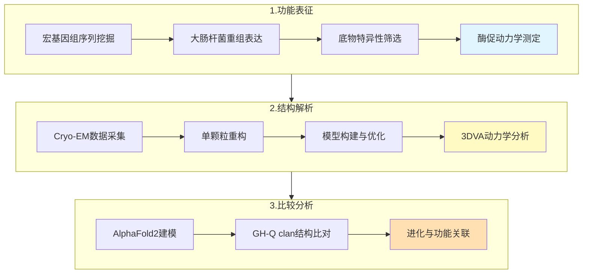
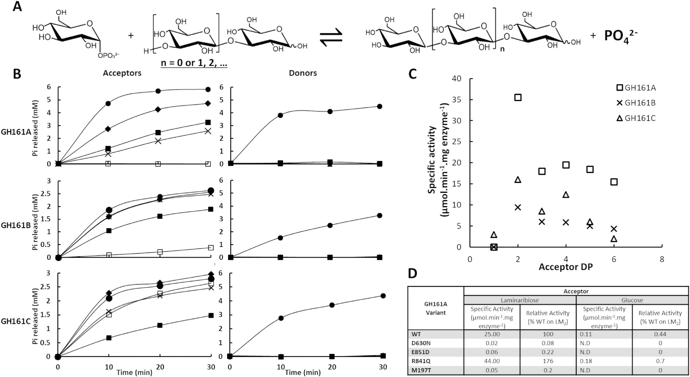
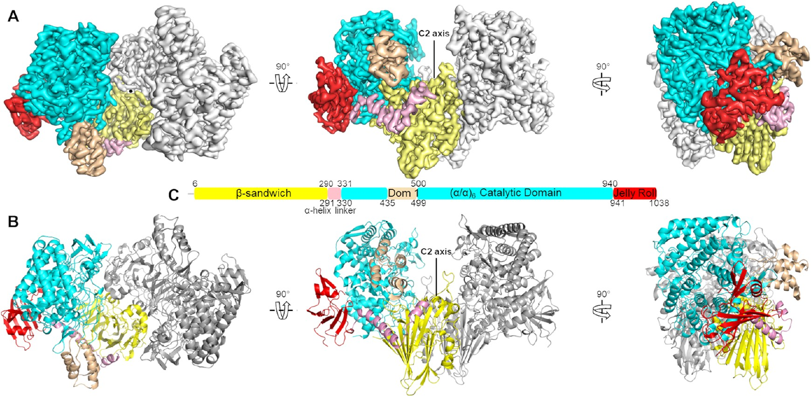
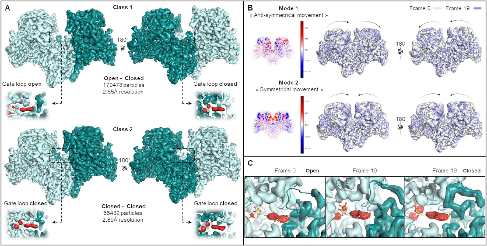
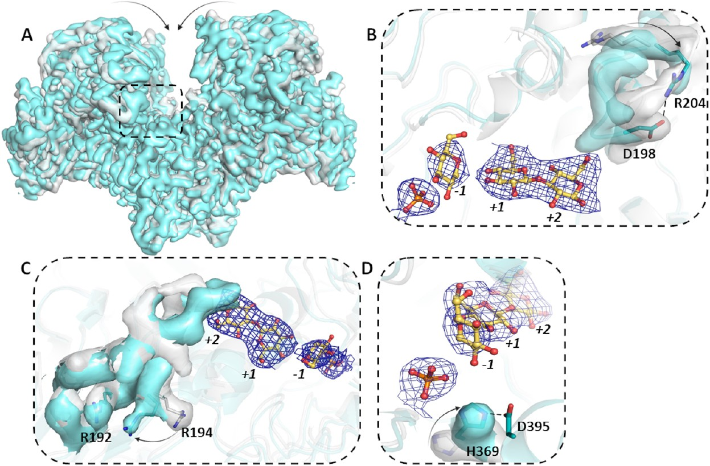
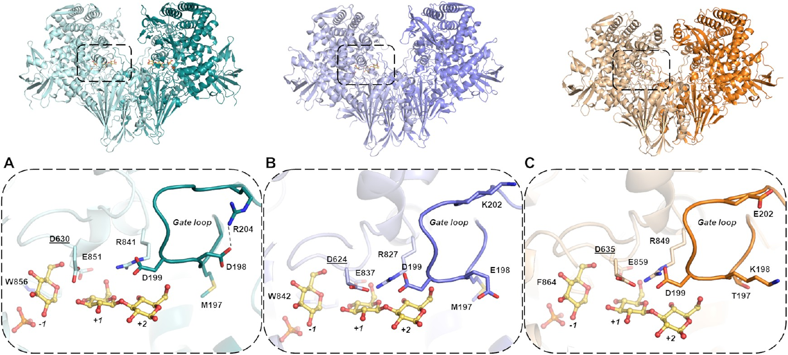
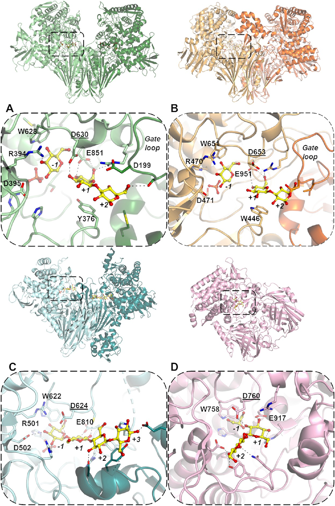

# GH161家族β-葡聚糖磷酸化酶：Gate Loop动力学如何精准调控多糖合成

## 本文信息

- **标题**: Structural and Functional Dissection of GH161 β-Glucan Phosphorylases: Molecular Specificities and Dynamics of Catalysis
- **作者**: Mikel Urresti, Pedro A. Eyers 等
- **发表时间**: 2025年11月12日
- **单位**: University of Liverpool（英国）
- **引用格式**: Urresti, M., et al. (2025). Structural and Functional Dissection of GH161 β-Glucan Phosphorylases: Molecular Specificities and Dynamics of Catalysis. *ACS Catalysis*, 15(8), 6182-6197. https://doi.org/10.1021/acscatal.4c07629
- **解析的结构**: PDB: 9GEN, 9GEO, 9GEP, 9GEQ; EMDB: EMD-51581~EMD-51584

## 摘要

> 糖苷磷酸化酶（GPs）是一类独特的碳水化合物活性酶，它们利用无机磷酸盐代替水来切割糖苷键，从而生成**糖-1-磷酸**产物。在GH-Q clan中，GH161家族是最新发现且研究最少的成员。本研究从人类肠道宏基因组中鉴定并表征了三个GH161酶（GH161A、GH161B、GH161C），证明它们都是**β-1,3-葡聚糖磷酸化酶**，以α-D-葡萄糖-1-磷酸（αGlc1P）为供体合成β-1,3-连接的葡聚糖。通过冷冻电镜解析了GH161A的高分辨率结构（2.41 Å），揭示了一个关键的**gate loop**结构域如何通过开-闭构象变化调控底物进入和产物释放。3D变异性分析（3DVA）进一步揭示了二聚体催化过程中的**反对称运动模式**，为理解磷酸化酶的催化动力学提供了新见解。

### 核心结论

- GH161家族酶是β-1,3-葡聚糖磷酸化酶，可高效合成长链β-葡聚糖
- Gate loop的开-闭动力学是催化循环的核心调控机制
- 二聚体两个亚基呈现反对称运动，可能代表催化循环的不同阶段
- GH161A具有最高的热稳定性（$T_m$ = 74.8°C）和聚合活性

## 背景

糖苷磷酸化酶（Glycoside Phosphorylases, GPs）在碳水化合物代谢中扮演着独特角色。与糖苷水解酶使用水作为亲核试剂不同，GPs利用**无机磷酸盐**进行磷酸解反应，生成糖-1-磷酸和缩短的糖链。这种反应在热力学上是可逆的，使得GPs既能降解多糖，也能在**逆向磷酸解**模式下合成多糖。

β-葡聚糖是一类具有重要生物活性的多糖，广泛存在于谷物、真菌和细菌中。它们在**生物材料**、**生物燃料**、**生物防治**以及营养保健和制药领域展现出广泛的应用潜力。然而，β-葡聚糖的酶法合成一直面临挑战：传统的糖基转移酶需要昂贵的核苷酸糖（如UDP-葡萄糖）作为供体，限制了工业应用。

GH-Q clan是CAZy数据库中的一个糖苷磷酸化酶超家族，包含GH94、GH149和GH161三个家族。其中GH94主要作用于β-1,4-连接（如纤维二糖），GH149作用于β-1,3-连接的葡聚糖。GH161是2022年才建立的新家族，其成员的底物特异性和催化机制仍不清楚。

### 关键科学问题

GH161家族酶的底物特异性是什么？它们如何识别和加工β-葡聚糖底物？与同一clan中的GH94和GH149家族相比，GH161有何独特之处？解答这些问题需要高分辨率的三维结构信息，而此前GH161家族尚无任何实验结构。

### 创新点

- **首次解析GH161家族酶的原子分辨率结构**
- 揭示gate loop的动力学行为及其在催化中的调控作用
- 发现二聚体的反对称运动模式，提出催化循环的动力学模型
- 系统比较GH-Q clan三个家族的结构与功能差异

---

## 研究内容

### 方法概述

**酶的来源与表达**：从人类肠道宏基因组数据库中鉴定了三个GH161序列（GH161A、GH161B、GH161C），在大肠杆菌BL21(DE3)中重组表达并纯化。

**功能表征**：
- 使用多种糖作为供体和受体进行活性筛选
- 通过MALDI-TOF质谱和NMR确定产物结构
- 测定稳态动力学参数和热稳定性

**结构解析**：
- 在Titan Krios上采集cryo-EM数据（300 kV）
- 使用RELION进行单颗粒重构
- 解析了四种状态：apo态、与αGlc1P复合物、与昆布三糖（laminaritriose，LM3，三个葡萄糖通过β-1,3键连接）复合物、与葡萄糖/磷酸根复合物
- **使用CryoSPARC进行3D分类和3D变异性分析**（3DVA）：这是一种基于cryo-EM数据的计算方法，无需MD模拟即可从实验数据中直接提取蛋白质的构象异质性和动力学信息

### 一、功能筛选与底物特异性

**图1：GH161酶的功能表征**
- （A）β-1,3-葡聚糖磷酸化酶的反应机制示意图，αGlc1P作为供体，β-1,3-葡聚糖作为受体
- （B）供体筛选：三个酶都特异性使用αGlc1P，不接受其他糖-1-磷酸
- （C）受体筛选：GH161A和GH161C偏好β-1,3-连接的寡糖，GH161B也能使用β-1,4-连接底物
- （D）链长特异性：GH161A可合成长链产物（DP > 10），GH161B和GH161C产物较短

三个GH161酶都表现出**β-1,3-葡聚糖磷酸化酶**活性，但在底物偏好和产物链长上存在差异：

| 酶 | 最佳受体 | 最大产物长度 | $T_m$ (°C) |
|---|---------|------------|-----------|
| GH161A | 昆布三糖 | > DP10 | 74.8 |
| GH161B | 昆布二糖/纤维二糖 | DP4-5 | 67.9 |
| GH161C | 昆布三糖 | DP5-6 | 58.9 |

GH161A是**最高效的聚合酶**，能够将短链受体延伸成长链β-1,3-葡聚糖。这种高聚合活性使其成为β-葡聚糖生物合成的潜在工具酶。

### 二、GH161A的整体结构

**图2：GH161A apo态的冷冻电镜结构**
- （A）二聚体整体结构，两个亚基以青色和深青色区分
- （B）单体结构域组成：N端结构域（NTD）、催化结构域（TIM桶）、C端结构域（CTD）
- （C）与GH94纤维二糖磷酸化酶的结构比对，显示保守的TIM桶核心
- （D）门控环（gate loop，残基348-369）的位置和构象

GH161A形成同源二聚体，每个亚基包含三个结构域：

1. **N端结构域**（NTD）：α/β折叠，功能尚不明确
2. **催化结构域**：经典的(α/β)₈ TIM桶结构，包含活性位点
3. **C端结构域**（CTD）：α-螺旋束，参与二聚化

活性位点位于TIM桶的C端开口处，被一个关键的**gate loop**（残基348-369）所覆盖。这个gate loop在底物结合前后**经历显著的构象变化**。

### 三、底物结合与活性位点

**图3：GH161A与底物的复合物结构**
- （A）与αGlc1P复合物的整体视图，显示供体结合在-1亚位点
- （B）-1亚位点的详细相互作用：αGlc1P与**Y204、R206、D138、H368**等残基形成氢键
- （C）gate loop关闭状态下的构象，**H368和Y370插入活性位点**
- （D）昆布三糖复合物结构，受体结合在+1至+3亚位点
- （E）+1/+2亚位点的相互作用网络
- （F）磷酸根/葡萄糖复合物，代表催化后的产物态
- （G）β-1,3-葡聚糖链在活性位点的延伸方向

供体结合位点（-1亚位点）的关键残基包括：
- **D138**：作为催化碱，活化进攻的羟基
- **R206**：稳定磷酸根的负电荷
- **Y204、H368**：与葡萄糖环形成堆积作用

**受体结合位点**（+1至+3亚位点）**相对开放**，解释了GH161A能够加工长链底物的能力。

### 四、Gate Loop的构象动力学

**图4：底物结合诱导的构象变化**
- （A）3D分类揭示两类颗粒：Class 1（47%）为开-闭不对称态，Class 2（53%）为闭-闭对称态
- （B）主成分分析（PCA）显示gate loop沿两种运动模式变化
- （C）Morph动画显示gate loop从开放到关闭的过渡

**Gate loop的开-闭转换是催化循环的核心**：

1. **开放态**：gate loop远离活性位点，允许底物进入
2. **关闭态**：gate loop覆盖活性位点，H368定位αGlc1P的C1位置进行催化

这种不对称分布暗示**两个亚基可能处于催化循环的不同阶段**。

### 五、二聚体的反对称运动

**图5：3D变异性分析揭示的动力学模式**
- （A）整体刚体运动（Mode 1）
- （B）反对称模式（Mode 2）：一个亚基的gate loop开放时，另一个关闭
- （C）对称模式（Mode 3）：两个亚基的gate loop同时开放或关闭
- （D）门控环运动的局部放大，显示H368残基的位移

**3DVA分析原理**：3D Variability Analysis（Punjani & Fleet, 2021）是一种基于主成分分析的cryo-EM数据处理方法。具体而言：

1. **数据准备**：对GH161A的61.9万（apo态）或49.2万（催化活性态）个单颗粒进行对称性扩展和局部优化
2. **构象空间建模**：将每个颗粒的3D密度图视为高维空间中的一个点，计算所有颗粒之间的协方差矩阵
3. **主成分提取**：通过类似PCA的降维方法，识别出解释数据变异性最大的几个主方向（即运动模式）
4. **连续轨迹重建**：沿每个主成分方向生成一系列连续的3D重构（如20帧），形成"分子电影"

这种方法的核心是**从静态快照中恢复动态信息**：尽管每张cryo-EM图像都是蛋白质某一瞬间的"冻结"状态，但通过统计分析成千上万张图像的集体行为，可以推断出蛋白质在溶液中的主要构象变化模式。

**重要局限**：3DVA只能识别出**存在哪些构象**以及它们之间的**转换路径**，但**无法确定运动的方向性**（A→B还是B→A）或转换速率。因此，本研究中gate loop"从开放到关闭"的动画方向是根据催化逻辑推断的（底物需要先进入活性位点），而非3DVA直接给出的时间序列。

这就像看一堆照片vs看视频：
- 3DVA = 从很多照片推断运动模式（但不知道拍摄顺序）
- MD = 真实的视频（但可能是"电影特效"而非纪录片）

所以最理想的研究策略是结合两者：用3DVA确定实验支持的构象空间，再用MD模拟探索这些构象之间的动力学转换。

3DVA分析揭示了三种主要的运动模式：

| 模式 | 特征 | 生物学意义 |
|-----|------|----------|
| Mode 1 | 整体刚体运动 | 样品取向变化 |
| Mode 2 | 反对称门控 | 交替催化机制 |
| Mode 3 | 对称门控 | 同步开放/关闭 |

**反对称运动模式的生物学意义**：

Mode 2（反对称模式）在催化活性态的数据集中**占主导地位**，提示这是GH161A的**主要催化运动模式**。这种模式展现了一个引人注目的特征：当一个活性位点关闭时，另一个活性位点开放，反之亦然。这与传统认为的"多聚体磷酸化酶的单体功能独立"观点形成鲜明对比。

作者提出，GH161A的两个原聚体（protomers）**偏好以交替方式工作**，这可能对催化有利。这一发现与Chen等人在2023年Chemical Reviews上发表的综述中讨论的**二聚体酶正协同性**（positive cooperativity）概念高度一致。该综述指出，影响二聚体酶协同性的因素包括：
- **空置vs占据活性位点的动力学差异**
- **亚基-亚基相互作用的重要性**

GH161A恰好展现了这些特征，提示两个活性位点之间可能存在某种**信号传递通路**（communication pathway）。

**Communication Pathway假说**：

作者尝试通过追踪两个不对称原聚体之间位移最大的区域来勾勒这条通路，发现信号可能从一个活性位点传递到对侧原聚体的gate loop。这立即引发了一个类似"先有鸡还是先有蛋"的生化悖论：**gate loop的关闭是从gate loop本身启动，还是从活性位点启动？**

答案是：两者都不是严格意义上的**首先**。正如文献57所述，loop关闭和跨二聚体的信号传递在能量上是**耦合的**，以**协同方式**（concerted manner）进行。也就是说，gate loop关闭和活性位点的底物结合是相互促进、同步发生的过程。

**对称运动模式的含义**：

Mode 3展现了一种**呼吸样运动**（breathing-like motion）：两个亚基同时向二聚体中心移动，然后再向外运动。虽然这种模式在催化活性态中不占主导，但在apo态和仅结合LM5的复合物中观察到。这提示：
- **对称运动可能代表酶在非催化状态下的构象涨落**
- **反对称运动仅在同时存在供体和受体时被触发**

值得强调的是，这些运动模式都是**从实验数据中直接观察到的**，而非通过计算机模拟预测的。这为理解磷酸化酶的催化动力学提供了坚实的实验基础

### 六、GH161家族的结构比较

**图6：GH161A、GH161B和GH161C的结构比较**
- （A）GH161A实验结构（青色）
- （B）GH161B AlphaFold2模型（紫色）
- （C）GH161C AlphaFold2模型（橙色）
- 下方面板：gate loop区域的序列和结构差异

三个GH161酶的整体结构高度相似，但**gate loop区域存在显著差异**：

- **GH161A**：gate loop最长（22残基），包含关键的H368
- **GH161B**：gate loop较短，缺少H368等效残基
- **GH161C**：gate loop长度中等，K130和K132可能参与底物识别

**这些差异可能解释了三个酶在底物特异性和聚合能力上的差异**

### 七、GH-Q Clan的进化关系

**图7：GH-Q clan三个家族的结构比较**
- （A）GH161A（本研究）
- （B）GH94纤维二糖磷酸化酶
- （C）GH149 β-1,3-葡聚糖磷酸化酶
- （D）GH94 β-1,2-寡糖磷酸化酶
- 下方面板：活性位点的关键差异

GH-Q clan的三个家族共享：
- (α/β)₈ **TIM桶催化结构域**
- **保守的催化残基**（Asp作为催化碱）
- 二聚体或多聚体组装

但**它们在连接特异性上有明显分化**：
- **GH94**：β-1,4和β-1,2连接
- **GH149**：β-1,3连接
- **GH161**：β-1,3连接（本研究确认）

GH161与GH149在底物特异性上重叠，但**结构差异表明它们是独立进化的β-1,3-葡聚糖磷酸化酶**

---

## Q&A

**Q1：为什么GH161A的聚合活性比GH161B和GH161C高得多？**

**A1**：主要原因在于**gate loop的结构差异**：
- **GH161A的gate loop包含完整的H368残基**，能够精确定位供体糖
- **GH161A的受体结合通道更开放**，允许长链产物的延伸
- GH161A的热稳定性最高（74.8°C），在反应条件下保持更好的催化活性

**Q2：反对称运动模式对催化有什么功能意义？这种协同性在其他磷酸化酶中观察到过吗？**

**A2**：反对称运动揭示了GH161A可能具有**正协同性**，这在糖苷磷酸化酶家族中非常罕见：

**功能意义**：
- **提高催化效率**：交替工作模式可能避免两个活性位点同时处于能量不利的中间态
- **产物释放优化**：一个亚基的产物释放可能促进另一个亚基的底物结合
- **能量耦合**：一个亚基的gate loop关闭释放的能量可能帮助另一个亚基的gate loop开放

**与其他磷酸化酶的对比**：
- 大多数糖苷磷酸化酶的多聚体亚基被认为是**功能独立的**，没有明显的协同性
- **唯一例外**：哺乳动物糖原磷酸化酶展现出变构调控和协同性，但其机制与GH161A不同
- GH161A的反对称运动是首次在GH-Q clan中观察到的亚基间协调行为

**需要进一步验证**：
- 动力学实验（如底物浓度依赖曲线的Hill系数）
- 单分子FRET实验验证两个活性位点的动力学相关性
- MD模拟探索communication pathway的分子机制

**Q3：GH161酶在肠道微生物组中的生理功能是什么？**

**A3**：这些酶可能参与：
- **多糖降解**：磷酸解β-葡聚糖获取能量
- **多糖合成**：在特定条件下合成β-葡聚糖作为储能物质或生物膜成分
- **共生代谢**：与宿主或其他微生物的碳水化合物代谢互作

**Q4：为什么使用cryo-EM而不是X射线晶体学？**

**A4**：Cryo-EM的优势在于：
- **可以捕获蛋白质的多种构象态**（如开放/关闭态）
- 不需要晶体，避免晶体堆积对构象的限制
- **3DVA分析可以揭示连续的构象动力学**
- 本研究中确实观察到了2种不同的3D类别和3种运动模式

---

## 关键结论与批判性总结

**主要贡献**：
- **首次提供GH161家族的原子分辨率结构信息**
- **揭示gate loop动力学是催化调控的核心机制**
- **发现二聚体反对称运动模式，挑战了传统上认为多聚体磷酸化酶亚基功能独立的观点**
- **提出亚基间存在“communication pathway”的假说**，为GH-Q clan酶的协同催化机制带来全新视角

**局限性**：
- 仅有GH161A的实验结构，GH161B和GH161C依赖AlphaFold2预测
- **3DVA无法直接提供时间信息**：运动方向和速率仍需结合生化动力学实验或MD模拟验证
- **协同性假说缺乏直接动力学证据**：需要通过Hill系数、单分子FRET或双突变循环分析来量化亚基间的相互作用强度
- 缺乏与真实生理底物（长链β-葡聚糖）的复合物结构
- **Communication pathway的分子细节尚不清楚**：Supporting Figure 13展示的路径仍是推测性的

**未来方向**：
- **验证协同性假说**：通过稳态动力学（Hill系数）、预稳态动力学（突发相）、单分子FRET实验量化亚基间的功能耦合
- **鉴定communication pathway关键残基**：结合MD模拟和双突变循环分析（double-mutant cycle analysis）
- **设计解耦突变体**：破坏二聚化界面或communication pathway，测试单体酶的催化效率
- 设计具有**更高聚合活性的GH161突变体用于工业生产**
- 解析GH161B和GH161C的实验结构，验证AlphaFold2预测
- 研究gate loop突变对催化动力学的定量影响
- 探索GH161在肠道微生物组中的生态功能

**更广泛的影响**：

本研究展示了**cryo-EM在捕获酶催化动力学快照方面的独特优势**。结合3DVA分析，研究者无需晶体化即可揭示蛋白质在溶液中的构象异质性。这为研究其他动态酶系统（如变构酶、马达蛋白）提供了方法学启示。

GH161A的反对称催化模式也提醒我们：**多聚体酶的亚基可能并非简单的“功能拷贝”，而是通过协同作用实现更高的催化效率**。正如作者引用的Chen等人的综述所言，二聚体酶的动力学远比我们过去认为的要复杂和精妙
