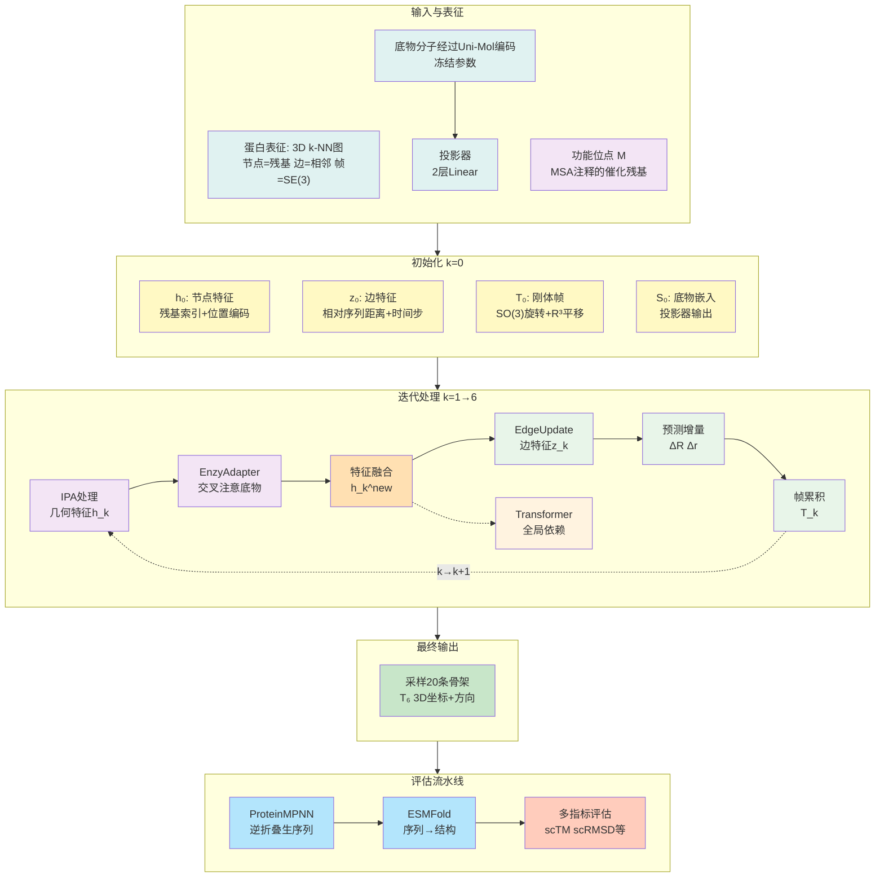

# 附录：EnzyControl：酶设计方法的技术细节与算法深解

## 核心方法：条件化酶骨架生成框架

### 总体数据流概览

EnzyControl的计算流程可以概括为三个阶段：

$$
\text{输入初始化} \to \text{6层IPA迭代（每层注入底物信息）} \to \text{采样得到骨架}
$$

每一层的内部流程：

$$
h_{k-1}, z_{k-1}, T_{k-1} \xrightarrow{\text{IPA}} h_k \xrightarrow{\text{EnzyAdapter}} c_k^{\text{new}} \xrightarrow{\text{EdgeUpdate}} z_k \xrightarrow{\text{BackboneUpdate}} T_k
$$

下面详细展开每个阶段。

## 第一部分：输入与初始化（What flows in）

### 1.1 蛋白的三维表征：k-NN图与刚体帧

蛋白质在模型中的表征方式决定了生成的效率和质量。EnzyControl 采用**3D k-NN图表示**：

- **节点表示**：每个氨基酸残基是一个节点，携带残基索引、位置编码等特征
- **边表示**：空间上相邻的残基之间有边连接，使模型能感知残基的局部几何环境
- **帧表示**：每个残基的3D位置和方向用SE(3)中的刚体帧 $T_n = (r, x)$ 表示，其中 $r \in SO(3)$ 是旋转矩阵，$x \in \mathbb{R}^3$ 是位置向量

这种表示方式是**与序列无关的纯结构表示**：输入只需拓扑信息（哪些残基相邻），不需要氨基酸序列；生成输出也是骨架的3D坐标和方向，序列由ProteinMPNN后续设计。

### 1.2 底物的化学表征：从分子图到特征向量

底物通过其**分子图**（不是3D构象）表示，原因是底物的3D位置通常未知。

**编码过程**：

- 输入分子图 $\to$ **Uni-Mol预训练编码器**（在209百万分子构象上预训练） $\to$ 分子特征向量
- 为防止11,100对数据上过拟合：**冻结Uni-Mol所有参数**（保留预训练知识）
- 仅训练**轻量级投影器**（2层线性 + LayerNorm）$\to$ 底物嵌入 $S_0 \in \mathbb{R}^{D_s}$

将底物特征从分子表示空间映射到蛋白特征空间，既保留预训练泛化能力，又适配任务。

### 1.3 系统初始化：第0步的完整状态

在迭代开始前，系统初始化以下向量：

- **节点特征向量** $h_0 \in \mathbb{R}^{N \times D_h}$：
  - $h_k$ 不是单个残基的特征，而是一个矩阵 $h_k \in \mathbb{R}^{N \times D_h}$，包含第k次迭代后所有 $N$ 个残基的特征向量。每个残基有一个维度为 $D_h$ 的向量，记录该残基在第k次迭代后的结构和化学信息。
  - 初始化信息：残基索引 + 位置编码

- **边特征向量** $z_0 \in \mathbb{R}^{N \times N \times D_z}$：
  - 每条边（残基对）是一个维度为 $D_z$ 的特征向量
  - 初始化信息的三个成分：
    - **相对序列距离**：两个残基在氨基酸序列上的距离（$|i-j|$）。例如，相邻残基距离为1，间隔一个残基距离为2。这告诉模型哪些残基在序列上接近
    - **时间步**：当前生成过程中的时间信息（0→1，从噪声到真实结构）。用正弦和学习的位置编码表示，让模型知道"现在在生成过程的哪个阶段"
    - **自条件信息**：模型根据自己在前一步对Cα原子距离的预测，将这个预测的距离矩阵（离散化为22个bin）作为额外信息反馈。这种"自我监督"机制让模型能纠正自己的错误

- **刚体帧** $T_0 = (r_0, x_0) \in SE(3)$：
  - $r_0 \in SO(3)$：初始旋转（从PDB骨架原子的方向）
  - $x_0 \in \mathbb{R}^3$：初始平移（残基的Cα原子坐标）

- **底物嵌入** $S_0 \in \mathbb{R}^{D_s}$（**每层固定不变重复使用**）

---

## 第二部分：单层处理流程（How data flows）

**"层"的含义澄清**：这里的"第k层"（k=1,2,...,6）指的是**迭代循环的第k次迭代轮次**，而非蛋白序列上残基的物理位置。在每一次迭代中，模型都会对整个蛋白骨架的所有残基更新特征和帧信息。

每一层接收上一层的输出，并按以下顺序处理：

#### **步骤1：IPA处理空间几何关系**

$$
h_k = \text{IPA}(h_{k-1}, T_{k-1})
$$

**输入**：上一层的节点特征 $h_{k-1}$ 和刚体帧 $T_{k-1}$

**操作**：

- IPA（Invariant Point Attention）在"不变点"上计算注意力
- 这些不变点与坐标系的旋转和平移无关（SE(3)等变）
- 从多个空间角度分析残基间的相对位置和方向，融合这些信息

**输出**：$h_k \in \mathbb{R}^{N \times D_h}$（等变几何特征），是**纯粹基于蛋白空间几何**的特征，捕捉残基彼此间的相对关系，但**完全不包含底物信息**。

**补充：Transformer层穿插在IPA块之间**：IPA主要处理空间上相邻残基的局部关系（基于3D k-NN图），而在IPA块之间穿插2层Transformer（每层4个注意力头）来捕捉**序列上远距离残基的全局依赖**。这样既保证了SE(3)等变性，又能感知远程序列模式。

#### **步骤2：EnzyAdapter通过交叉注意力注入底物信息**

$$
c_k = \text{Attn}(Q, K, V) = \text{Softmax}\left(\frac{Q K^\top}{\sqrt{d_k}}\right) V
$$

其中：

- $Q = h_k W_q$：查询来自第k层的残基特征。$Q$ 的含义是"蛋白现在长什么样，应该怎么调整？"
- $K = S_0 W_k$, $V = S_0 W_v$：键值来自底物嵌入 $S_0$（固定，与k无关）。$S_0$ 的含义是"底物分子的信息是什么？"
- $W_q, W_k, W_v$ 是学到的权重矩阵，用于将 $h_k$ 和 $S_0$ 投影到注意力的查询-键-值空间

**输出**：$c_k \in \mathbb{R}^{N \times D_h}$（底物-指导的特征）

**为什么用交叉注意力**：

- 注意力机制让模型学到**位置相关的调制规则**
- 同一个位点在不同底物下应该做不同的结构调整
- 比简单拼接更精细，避免底物信息的浪费

#### **步骤3：特征融合**

$$
h_k^{\text{new}} = \text{Linear}(\text{Concat}(\text{Linear}(c_k), h_k))
$$

**操作**：

1. 对 $c_k$ 做一个Linear变换
2. 与 $h_k$ 拼接（concatenate）
3. 再过一个Linear层进行融合

**含义**：将底物感知信息 $c_k$ 与几何特征 $h_k$ 结合，产生**同时考虑蛋白几何和底物约束**的融合特征。

**等变性保证**（关键）：

- 融合发生在**特征空间而非坐标空间**
- Linear运算在特征维度上，不涉及坐标变换
- 因此不会破坏SE(3)等变性

#### **步骤4：边特征更新**

$$
z_k = \text{EdgeUpdate}(h_k^{\text{new}})
$$

**操作**：标准消息传递，基于融合后的节点特征 $h_k^{\text{new}}$ 更新边特征。

#### **步骤5：BackboneUpdate预测刚体变换增量**

从融合特征 $h_k^{\text{new}}$ 预测：

$$
\Delta \mathbf{r}^{(k)} \in \mathbb{R}^3, \quad \Delta \mathbf{R}^{(k)} \in SO(3)
$$

- **平移增量** $\Delta \mathbf{r}^{(k)}$：残基Cα应该移动到哪里
- **旋转增量** $\Delta \mathbf{R}^{(k)}$：残基帧应该如何旋转

这些增量通过BackboneUpdate模块中的线性层从 $h_k^{\text{new}}$ 预测得出。

#### **步骤6：帧累积更新（SE(3)群乘法）**

$$
T_k = T_{k-1} \cdot \exp\left(\begin{bmatrix} [\Delta \mathbf{R}^{(k)}]_\times & \Delta \mathbf{r}^{(k)} \\ 0 & 0 \end{bmatrix}\right)
$$

**操作**：

- 将增量表示为SE(3)李代数元素
- 通过李群指数映射转换为SE(3)群元素
- 左乘到当前帧 $T_{k-1}$ 上，得到更新的帧 $T_k$

**等变性保证**：SE(3)群的乘法自动保持群的闭包性质，即增量的累积不会破坏等变性。

#### **第k层的输出**

$$
h_k, z_k, T_k \quad \text{（传给第k+1层）}
$$

---

## 第3部分：采样与最终输出

### 3.1 从$T_6$到骨架的采样过程

完成6层迭代后，模型得到了最终的刚体帧 $T_6 = (r_6, x_6) \in SE(3)$。但这还不是最终的蛋白质骨架，而是需要通过**采样过程**（Sampling）来生成实际的3D坐标。

**单层处理与向量场的关系**：Flow matching框架的核心是学习一个条件向量场 $\hat{v}(S_t, t|M, G)$，其中：

- $S_t = (T_t, h_t, z_t)$ 是结构在时间 $t$ 的完整状态（刚体帧、节点特征、边特征）
- $M$ 是功能位点（MSA注释的催化残基）
- $G$ 是底物（化学图表示）

这个向量场描述结构状态应如何演化。单层处理（IPA → EnzyAdapter → 融合 → EdgeUpdate → BackboneUpdate）的输出 $T_k, h_k, z_k$ 用来计算向量场的平移和旋转分量 $\{v_x, v_r\}$——这些是**帧的时间导数的近似**。整个单层计算过程隐含地定义了条件向量场：通过IPA提取几何，通过EnzyAdapter注入底物约束，通过BackboneUpdate预测帧增量。

**采样的核心思想**：流匹配框架在训练阶段学习了一个**条件向量场** $\hat{v}(x_t, t|M, G)$，在推理时**无需再训练任何参数**。采样是一个**纯前向推理的逆向去噪过程**，利用已训练的向量场从纯噪声（高斯随机）逐步演化到真实结构。具体步骤：

1. **初始化噪声**：从高斯分布采样初始的平移向量 $x_0$ 和初始的旋转矩阵 $r_0$（IGSO(3)是SO(3)群上的不变高斯分布，保证采样的旋转矩阵始终有效）
2. **反向积分**（**纯推理，无参数更新**）：使用ODE求解器（通常是Euler方法）从t=0积分到t=1
   - 在每一步 $t_i$ 到 $t_{i+1}$，调用已训练的模型预测条件向量场 $\hat{v}(x_t, t|M, G)$
   - 使用Euler步更新：$x_{t+1} = x_t + \Delta t \cdot \hat{v}(x_t, t|M, G)$（仅执行前向传播，不计算梯度）
3. **功能位点锁定**：在每个去噪步骤，将功能位点（motif）的坐标**固定为真实值**，只生成scaffold部分。这确保催化位点不会偏离目标
4. **输出骨架**：完成积分后，得到 $x_1$（平移）和 $r_1$（旋转），组合成最终的刚体帧序列 $T_6^{\text{final}}$

### 3.2 多骨架采样

模型在推理时**不是只输出一条骨架，而是多次采样**：

- **采样策略**：从同一个底物和功能位点出发，进行多轮独立的去噪过程，每次从不同的随机初始化开始
- **采样数量**：原文中对每个底物生成**20条骨架**
- **目的**：
  - **多样性**：获得不同的结构变异体，增加成功的概率
  - **筛选空间**：后续可通过对接、功能预测等筛选出最优的骨架

### 3.3 完整的推理管线

生成最终可用的蛋白质结构需要经过后处理管线（详见评估流水线）：

$$
\text{采样得到骨架} \xrightarrow{\text{ProteinMPNN}} \text{设计序列} \xrightarrow{\text{ESMFold}} \text{全原子结构}
$$

## 第四部分：训练与评估

### 4.1 训练目标与损失函数

EnzyControl采用**流匹配（Flow Matching）**框架进行训练。流匹配的核心思想是学习一个向量场，使数据从噪声分布演化到真实分布。在SE(3)等变骨架生成的约束下，训练目标最小化真实向量场与预测向量场之间的平方距离：

$$
\mathcal{L} = \mathbb{E}\left[\|v_R(x_t, t|x_1) - \hat{v}_R(S_t, t|M, G)\|_R^2 + \|v_{SO(3)}(r_t, t|r_1) - \hat{v}_{SO(3)}(S_t, t|M, G)\|_{SO(3)}^2\right]
$$

其中：

- **第一项** $\|v_R(x_t, t|x_1) - \hat{v}_R(S_t, t|M, G)\|_R^2$：**平移向量场的损失**
  - $v_R(x_t, t|x_1)$ 是真实的平移向量场（从噪声x₀演化到真实结构x₁）
  - $\hat{v}_R(S_t, t|M, G)$ 是模型预测的条件化平移向量场（条件为功能位点M和底物G）
  - 这项确保生成的残基位置正确

- **第二项** $\|v_{SO(3)}(r_t, t|r_1) - \hat{v}_{SO(3)}(S_t, t|M, G)\|_{SO(3)}^2$：**旋转向量场的损失**
  - $v_{SO(3)}(r_t, t|r_1)$ 是真实的旋转向量场（从噪声旋转r₀演化到真实旋转r₁）
  - $\hat{v}_{SO(3)}(S_t, t|M, G)$ 是模型预测的条件化旋转向量场
  - 这项确保生成的残基方向正确

两项加起来形成**SE(3)等变损失**，同时约束平移和旋转，保证生成的骨架既符合几何约束又满足功能要求。

### 4.2 两阶段训练范式

#### 第一阶段：对齐（学习底物-蛋白映射）

**冻结**：FrameFlow主干（FrameFlow是Frank Noe团队之前发表的SE(3)等变骨架生成方法，其主干包含IPA、Transformer、BackboneUpdate等模块，已在大规模数据上充分预训练）

**训练**：仅Uni-Mol投影器 + EnzyAdapter（<100K参数）

**目标**：让投影器和EnzyAdapter学会如何正确编码底物，并与FrameFlow的蛋白生成对齐

**为什么**：主干已预训练好，先稳定地建立底物-蛋白的映射关系

#### 第二阶段：微调（端到端优化）

**冻结**：无

**训练方法**：LoRA（低秩自适应）

- 在关键线性层插入低秩分解 $\Delta W = AB^\top$
- 秩 $r=16$，缩放因子 $\alpha=32$
- 参数量约8K/层，总计显著低于全参数微调

**优势**：

- 显存占用低（仅全参数的约5%）
- 训练时间节省约70%
- 低秩约束自动限制学习容量，防止过拟合

**图4：两阶段训练策略的效果**。展示了第一阶段对齐和第二阶段LoRA微调对模型性能的累积贡献，说明分步策略相比端到端直接微调更加稳定高效。

### 4.3 EnzyBind数据集与评估

#### 数据集构建

**EnzyBind**：11,100个实验验证的酶-底物复合物，来自PDBbind

**流程**：

1. 源数据筛选：从PDBbind提取酶-底物复合物，排除RDKit无法处理的
2. PDB清洗：标准化预处理，处理多链和对称单位
3. 功能位点注释：通过MSA自动识别进化保守的催化残基
4. EC分类标注：覆盖6大催化类型，从EC一级至三级

**特点**：所有结构来自实验解析（vs合成数据），口袋几何和底物构象可靠

#### 数据分割策略

传统的酶数据集分割多采用**时间顺序**（按发表日期划分训练集和测试集），但这种方法不符合条件化生成的需求。EnzyControl采用**功能性有意义的分割**方法：

- **基于序列相似性的聚类**：使用 CD-HIT 工具对所有酶序列进行聚类，确保训练集和测试集中的酶序列无重叠
- **随机分配集群**：将聚类后的集群随机分配到训练集或测试集
- **采样配对**：从每个集群中采样对应的酶-底物配对

这样做的优势是**防止数据泄露**——相同或极度相似的酶序列不会同时出现在训练和测试集中，保证评估的真实性和严格性。

#### 统一评估流水线

为了公平比较所有基线模型，EnzyControl建立了**统一的评估流水线**：

1. **生成骨架** → 模型输出候选骨架
2. **逆折叠** → ProteinMPNN 将骨架转换为氨基酸序列
3. **结构预测** → ESMFold 从序列预测完整的三维结构
4. **多指标评分** → 在预测的结构上计算所有指标

所有报告的指标都基于 ESMFold 预测的结构，确保不同方法的评估结果相互可比。

#### 评估指标详解

**结构质量指标**（衡量生成的骨架可信度）：

- **Self Consistency (scTM)**：生成骨架与 ESMFold 预测结构的 TM-score，值越高越好。衡量两个结构的全局相似度
- **设计性 (Designability, scRMSD<2Å)**：满足 scRMSD<2Å 的生成骨架比例。scRMSD 是 Cα 原子间的均方根偏差，<2Å 表示结构与已知蛋白相似，可信度高

**功能指标**（衡量生成酶的催化功能）：

- **EC 匹配率**：生成的酶序列通过 CLEAN 模型预测的 EC 号与目标 EC 号相同的比例。CLEAN 是经过 90% 以上精度验证的序列模型
- 预测的$k_{cat}$：使用 UniKP 模型根据序列和底物 SMILES 预测的催化速率常数。$k_{cat}$ 越大表示催化效率越高

**底物结合指标**（衡量酶与底物的相互作用）：

- **结合亲和力**：使用 GNINA 对接工具计算生成酶对底物的对接评分（越低越好，通常 <-6 kcal/mol 表示强结合）
- **ESP 分数**：EnzyGen 设计的统计学检验分数，用于评估生成结构的“设计合理性”。分数越高越好，表示该结构组合（骨架+序列）在自然界中出现的统计学概率越高，即设计越“自然”、越可信

**其他指标**：

- **氨基酸恢复率 (AAR)**：生成序列与原生序列的一致性
- **多样性**：生成骨架间的结构差异程度（Foldseek 聚类）
- **新颖性**：生成骨架与原生蛋白的结构差异程度

#### 评估流水线

生成骨架后的完整过程：

$$
\text{骨架} \xrightarrow{\text{ProteinMPNN}} \text{序列} \xrightarrow{\text{ESMFold}} \text{结构预测} \xrightarrow{\text{多指标}} \text{评分}
$$

**评估指标**：

- **结构指标**：scTM（TM-score）、scRMSD（<2Å定义设计性）
- **功能指标**：EC号匹配率（CLEAN模型预测）、$k_{cat}$预测（UniKP）
- **结合指标**：底物结合亲和力（GNINA对接）
- **综合指标**：ESP分数（EnzyGen统计学检验）

## 总结

EnzyControl的创新在于将**条件信息（底物）与等变骨架生成**无缝结合：

- **完整数据流**：底物 → S₀ → 每层EnzyAdapter → 融合特征 → 增量预测 → 帧累积 → 最终骨架
- **数学严谨**：特征空间融合保证SE(3)等变性自动维持
- **逐层约束**：底物信息在每一层指导结构演化，而非单次注入
- **参数高效**：两阶段训练+LoRA，以最小成本获得最大效果
