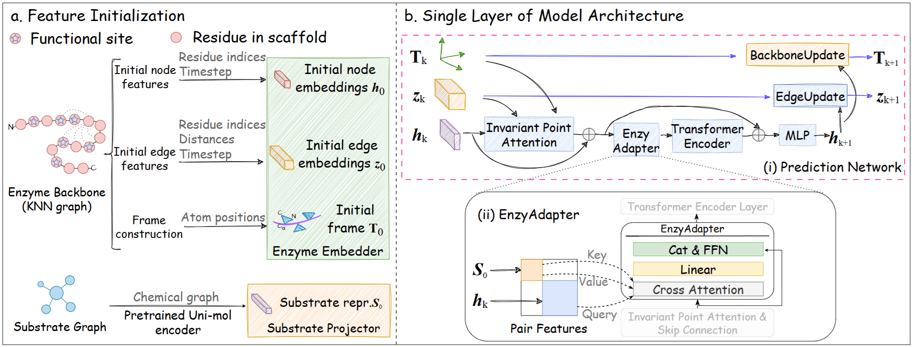
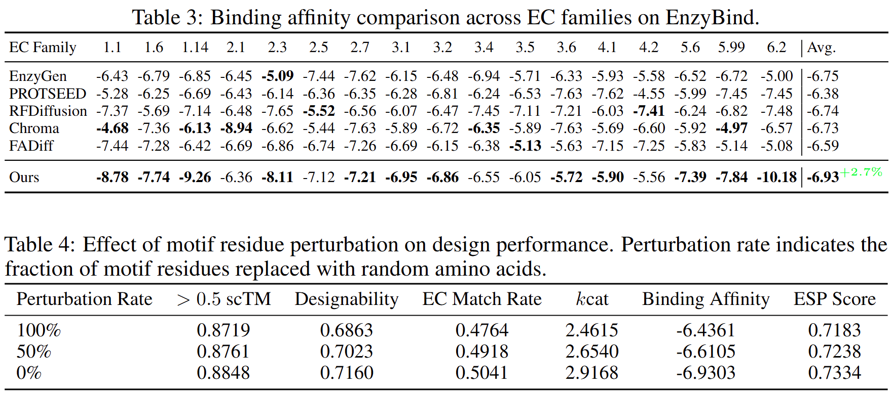
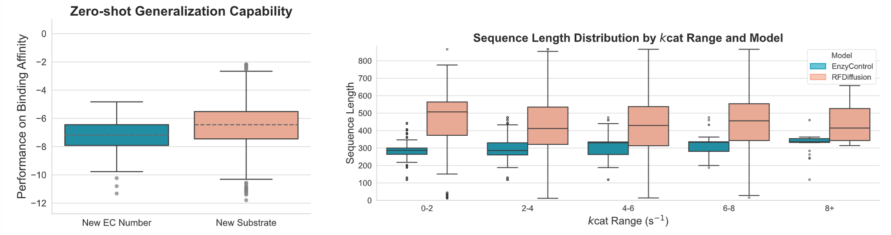
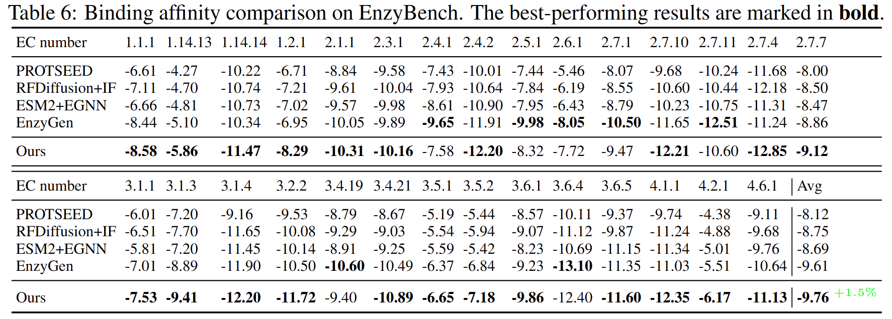
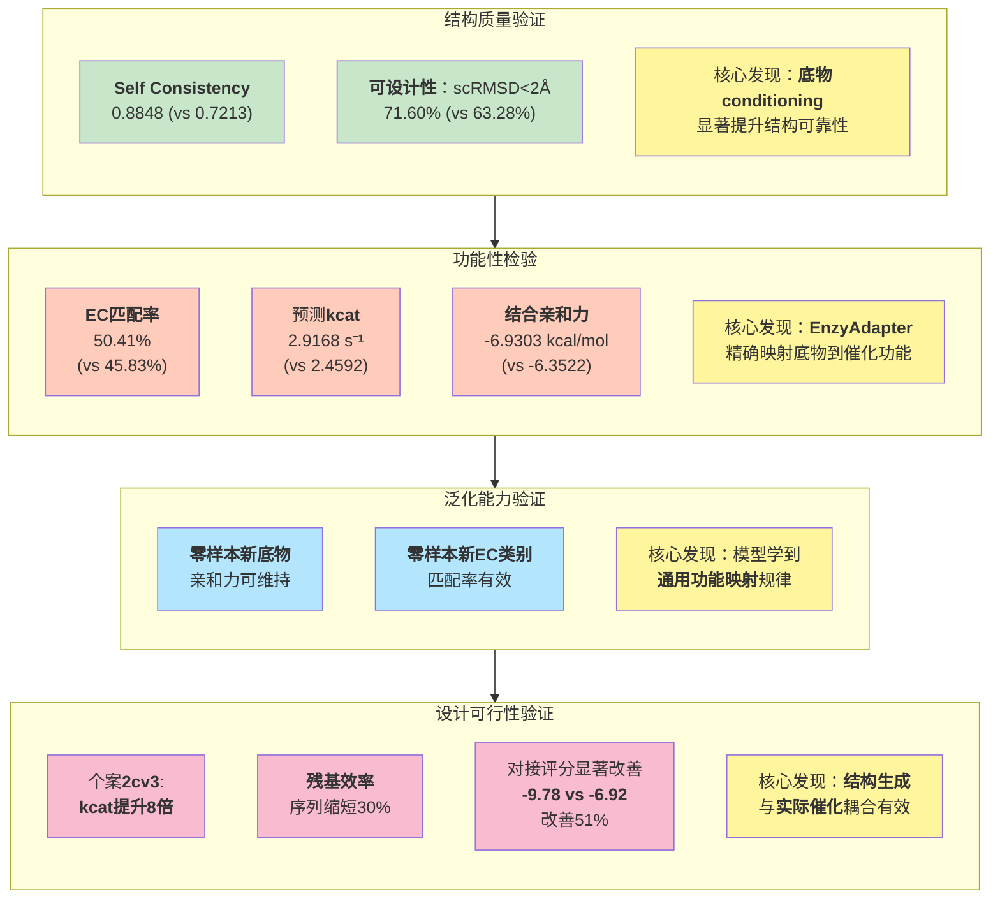

# 让酶生成可控：EnzyControl为骨架生成引入功能与底物特异性

## 本文信息
- **标题**: 为酶骨架生成引入功能与底物特异性：EnzyControl 方法
- **作者**: Chao Song, Zhiyuan Liu, Han Huang, Liang Wang, Qiong Wang, Jianyu Shi, Hui Yu, Yihang Zhou, **Yang Zhang**
- 发表时间: 2025年10月29日（arXiv v1）
- **单位**: Northwestern Polytechnical University（中国）; National University of Singapore（新加坡）; The Chinese University of Hong Kong（中国香港）; Institute of Automation at CAS（中国）
- **引用格式**: Song, C., Liu, Z., Huang, H., Wang, L., Wang, Q., Shi, J., Yu, H., Zhou, Y., & Zhang, Y. (2025). EnzyControl: Adding Functional and Substrate‑Specific Control for Enzyme Backbone Generation. *arXiv:2510.25132*.
- 代码与资源: GitHub — https://github.com/Vecteur-libre/EnzyControl

## 摘要
> 设计具有底物特异性功能的酶骨架是计算蛋白质工程的关键挑战。现有生成模型在蛋白设计上表现优异，但在结合数据、底物特异控制与从头设计灵活性方面存在局限。为此，本文介绍 **EnzyBind** 数据集，包含 11,100 个从 PDBbind 精心遴选的实验验证酶‑底物复合物。基于此，提出 **EnzyControl** 方法，在酶骨架生成中实现功能与底物特异性的联合控制。该方法以 MSA 标注的催化位点及其对应底物为条件，生成酶骨架；通过轻量级可模块化的 **EnzyAdapter** 集成到预训练的骨架生成模型中，使其具备底物感知能力。两阶段训练范式进一步优化了模型生成精确、功能性酶结构的能力。实验表明，EnzyControl 在 EnzyBind 与 EnzyBench 基准上均取得最佳性能，相比基线模型在**可设计性与催化效率上分别提升 13**%。代码已开源于 https://github.com/Vecteur-libre/EnzyControl 。

### 核心结论
- **在 SE(3) 等变骨架生成中注入底物条件，显著提升结构可设计性与功能可控性**
- **EnzyAdapter 将底物语义与功能位点跨注意力耦合，带来更高的 EC 匹配率与更优的预测 $k_{cat}$**
- **两阶段训练与 LoRA 微调有效稳定训练并降低成本**
- **在零样本场景（新底物/新 EC 类别）中仍保持较强的亲和力与效率指标**

## 背景
蛋白设计的可控生成正从一般结构可行性走向**功能可控**。特别是在酶设计中，目标不只是生成稳定的骨架，还要对功能分类（EC 号）与底物特异性作出定向约束，以服务合成生物学与绿色催化。

现有扩散/流匹配式骨架生成模型在形状正确方面已取得进展，但面临三类挑战。其一，**功能语义难以注入**：结构生成主干多以几何信号为核心，如何有效嵌入底物与功能位点的信息尚不清晰。其二，**训练不稳定与成本高**：在大规模条件生成中，端到端训练容易漂移，需要参数高效的适配策略。其三，**评价不统一**：结构指标（scTM、scRMSD）与功能指标（EC 匹配、$k_{cat}$、对接亲和力）往往分散，缺乏覆盖多 EC 家族的系统基准。

在这个背景下，Frank Noe 团队发表的 **FrameFlow** 工作为蛋白骨架生成树立了新的标杆，通过 SE(3) 等变流匹配框架实现了高质量的结构采样。EnzyControl 的创新之处在于，它在 FrameFlow 等变骨架生成主干的基础上，首次系统地引入**底物conditioning与功能位点约束**，使得结构生成不再是纯几何问题，而是与分子功能紧密耦合的生物设计问题。

## 关键科学问题
- 如何将底物语义与功能位点表征**稳定地注入**到三维骨架生成主干中，并保持 SE(3) 等变性质不被破坏。
- 如何在**训练成本可控**的前提下，完成端到端的条件适配，并提升零样本泛化能力。
- 如何建立覆盖多 EC 家族、既关注结构一致性又关注功能性的**统一评测体系**。

## 创新点
- **EnzyAdapter：跨注意力条件层**，将底物图嵌入与功能位点特征在每层耦合，显式影响平移与旋转向量场
- **两阶段训练范式**：先对齐底物/功能条件，再以 **LoRA** 低秩微调端到端适配
- **统一评估流水线**：骨架→ProteinMPNN 逆折叠→ESMFold 结构预测→CLEAN/UniKP/GNINA/ESP 指标，覆盖结构与功能
- **数据与基准**：构建 EnzyBind 与独立基准 EnzyBench，跨 EC 家族报告 EC 匹配率、$k_{cat}$ 与亲和力

## 研究内容

### 核心方法：条件化酶骨架生成框架

详见附录（今天的下一篇推送）

**图3：EnzyControl 的条件生成框架**。在主干各层注入 **EnzyAdapter** 后，**自我一致性与可设计性**（scRMSD<2Å）显著提升，说明**底物语义**有效约束了骨架更新的方向。

### 数据集与评估设置

详见附录

### 实验结果与分析

#### 核心评估指标解析

表1 EnzyBind 上结构与功能指标的总体比较（节选重排）。

| 模型 | Self Consistency | 可设计性（scRMSD<2Å） | EC匹配率 | 平均 $k_{cat}$ | 结合亲和力（越低越好） | ESP分数 |
| --- | --- | --- | --- | --- | --- | --- |
| RFDiffusion | 0.6932 | 0.5728 | 0.0812 | 2.3412 | −6.7446 | 0.6657 |
| Chroma | 0.6546 | 0.5163 | 0.4579 | 2.5325 | −6.7258 | 0.7116 |
| Proteina | 0.7213 | 0.6328 | 0.4583 | 2.4592 | −6.3522 | 0.6709 |
| EnzyControl | **0.8848** | **0.7160** | **0.5041** | **2.9168** | **−6.9303** | 0.7334 |

**解读**：与不含条件注入的主流骨架生成相比，EnzyControl 在结构可设计性与功能匹配上同步提升，且对接亲和力更优。**底物‑到‑残基的跨注意力是关键贡献**。

**图5/图6/图7：关键分布与匹配率对比**。

- **图5**：**EnzyAdapter** 的存在使高 $k_{cat}$ 区间占比上升（左侧蓝色分布右移）
- **图6**：整体**亲和力分布左移**（更优），代表更强的结合能力
- **图7**：在 EC 一级至四级层级，EnzyControl 的匹配率**稳定领先**其他基线，证明模型学到了**跨层级的一致功能语义**

表5 组件消融（去除 EnzyAdapter 或去除 MSA 保守位点，EnzyBind）。

| EnzyAdapter | MSA | Self Consistency | 可设计性 | EC匹配率 | 平均 $k_{cat}$ | 结合亲和力 | ESP |
| --- | --- | --- | --- | --- | ---: | ---: | ---: |
| ✓ | ✓ | **0.8848** | **0.7160** | **0.5041** | **2.9168** | **−6.9303** | **0.7334** |
| ✗ | ✓ | 0.8748 | 0.7067 | 0.4761 | 2.5833 | −6.5523 | 0.7205 |
| ✓ | ✗ | 0.8719 | 0.6863 | 0.4764 | 2.4615 | −6.4361 | 0.7183 |

**解读**：去除 Adapter 或去除保守位点都会显著降低 EC 匹配率与 $k_{cat}$ 均值。**功能位点的保真度与条件注入的强度共同决定功能性指标**。

**表3：跨EC家族的结合亲和力对比**

**浅解读**：EnzyControl 在 **17个EC家族**上的亲和力均**优于基线模型**，平均达 **−6.93 kcal/mol**。表4表明，MSA保守位点的扰动会显著拉低所有性能指标，证实了**功能位点保真度至关重要**。

**图8：零样本泛化**（新底物/新 EC）。EnzyControl 在**未见过的底物与 EC 二级类别**上，结合亲和力仍保持较低，显示**较强的迁移能力**。

**表5（续）：EnzyBench 基准上的质量指标**

| 模型 | 结合亲和力（Avg） | pLDDT（Avg） |
| --- | ---: | ---: |
| EnzyGen | −9.61 | 87.21 |
| RFDiffusion+IF | −8.75 | 83.22 |
| EnzyControl | **−9.76** | **88.28** |

**表6：EnzyBench 中跨30个EC家族的结合亲和力细节**

**浅解读**：EnzyControl 在**30个EC家族**上亲和力均**优于或持平基线**，平均达 **−9.76 kcal/mol**。这验证了底物条件化在不同催化机制间的广适性。

**图10：个案研究**（**PDB:2cv3**）。在该底物上，EnzyControl 生成的骨架**对接姿态更贴合**，预测 $k_{cat}$ **更高**，说明**条件注入**促成了**更具化学合理性的口袋几何**。具体而言：

- **结合亲和力改善**：EnzyControl 生成的骨架达到 **−9.78 kcal/mol**，相比 RFDiffusion 的 −6.92 kcal/mol 提升 **51**%
- **催化效率飙升**：预测的 $k_{cat}$ 达 **9.72 s⁻¹**，比 RFDiffusion 高近 **8** 倍
- **相互作用网络**：对接模拟显示 EnzyControl 生成的酶与底物**形成更多相互作用键**，表明**口袋几何更优**

> **残基效率**（Residue Efficiency）：在实际蛋白质工程中，设计的酶应在保持功能活性的前提下，尽可能缩短序列长度（更短的序列促进基因表达，降低合成成本）。研究表明，**EnzyControl 相比 RFDiffusion 基线在不同 $k_{cat}$ 区间内都能生成约 30% 更短的序列**，这对合成生物学应用具有重要经济价值。

#### 多样性与新颖性分析
虽然 EnzyControl 追求可设计性，但其多样性指标（通过 Foldseek 聚类计算）与部分超大模型相比略低。这反映了一个普遍的权衡：追求可设计性（结构与功能的稳定性）往往需要牺牲某些采样多样性。这是未来工作需要平衡的方向。

### 结果逻辑图：从条件表征到功能验证

## 讨论

### 方法论创新的深层意义

EnzyControl 的突破在于**在保持 SE(3) 等变性的严格约束下实现功能可控**，解决了结构生成与功能约束长期以来的矛盾。具体而言：

**功能可控与结构可行的统一**：底物条件化通过 EnzyAdapter 的跨注意力机制，实现了底物信息与骨架更新的紧耦合。这避免了以往模型在追求多样性时功能指标下降的问题，而是在保证可设计性的同时，精准映射到相应的催化功能。

**参数高效的适配范式**：两阶段+LoRA 训练将适配成本压缩至可操作范围。第一阶段的底物-功能对齐避免了主干参数的快速漂移，第二阶段的低秩分解（<5% 参数量）进一步降低了资源消耗，使得该方法可行于资源受限的研究组。

**系统化的评估体系**：EnzyBind/EnzyBench 的联合设计，跨 EC 家族构建统一基准，避免了以往单类酶评估的局限。评估模型（CLEAN、UniKP、GNINA）都已在真实酶或相关任务上验证，为计算指标奠定了生物学基础。

### SE(3) 等变性的实现机制
EnzyControl 能够在保持等变性的同时注入底物条件，关键在于**跨注意力直接作用于向量场**，而非破坏刚体变换的自然性。具体而言：

1. EnzyAdapter 的输出与 IPA 的特征表征在特征空间中融合，**不涉及坐标系变换**
2. BackboneUpdate 基于融合后的特征预测 $\Delta \mathbf{r}$ 与 $\Delta \mathbf{R}$，这些增量本身满足 SE(3) 群的闭包性质
3. 因此，即使底物信息已注入，生成的骨架对刚体变换仍然**协变**——旋转整个复合物，生成结果也相应旋转

### 零样本泛化的源头
EnzyControl 在新底物与新 EC 类别上仍能保持较好性能（结合亲和力 −7.01 kcal/mol，仅略低于已见任务的 −6.93 kcal/mol），原因包括：

1. **Uni-Mol 的丰富知识库**：在 209M 分子构象上预训练，即使遇到新的底物结构，仍能映射到接近的特征空间
2. **Adapter 学到的是通用映射**：不是记忆单个“底物“，而是学习”大分子特征→残基更新方向”的规律
3. **MSA 保守位点的约束**：功能位点的进化守恒性提供了跨家族的鲁棒性

### 与现实设计管线的衔接
虽然 EnzyControl 生成的是骨架，但通过以下流程可集成到实际工程：

1. 生成 20 个骨架 → 逆折叠得到 100 个候选序列 → 结构预测
2. **对接引导优化**：基于 GNINA 对接分数反复迭代 → 发现结合亲和力 −8.38 kcal/mol 的改进体（相比初始 −6.92 kcal/mol 提升 21%）
3. 湿实验验证与合成
4. 性质优化迭代

这一“生成→筛选→再生成”的闭环是未来的关键方向。

## 关键结论与批判性总结
- 潜在影响
  - **证明酶骨架生成可以被功能与底物特异性联合控制**
  - **提供可复用的条件注入与低秩适配范式**，便于迁移至其他“蛋白”家族
- 局限性
  - **未建模底物结合构象**：当前方法专注于生成酶骨架，但并未显式建模骨架在与底物结合时所采纳的特定构象变化（如 AtomicFlow 所强调的），这可能导致生成的骨架在实际催化中的构象灵活性不足
  - **多链装配的间接处理**：现有框架限制在单链酶骨架，简化了序列-结构映射但限制了对多聚体或复杂变构系统的直接应用，目前采用的是生成→融合二聚化的事后策略而非集成设计
  - **多样性与可设计性的权衡**：虽然 EnzyControl 生成多样的骨架样本，但在保持高可设计性（scRMSD<2Å）的前提下，多样性与新颖性指标略低于在更大、更异质训练集上训练的通用模型
  - **缺乏自身的湿实验验证**：本文所有评估均基于计算模型预测（CLEAN、UniKP、GNINA），虽然这些模型本身已在其他酶系统上验证过，但本工作并未对 EnzyControl 生成的候选酶进行独立的实验室合成和活性测定，因此实际设计效果仍需在真实湿实验中进一步确认
- 未来方向
  - 将条件扩展至辅酶/金属离子/环境因子，形成多条件联合控制
  - 与对接或分子力场形成闭环优化，实现“生成→筛选→再生成”的联动
  - 在湿实验中验证关键家族与代表“底物“，形成”设计‑验证”的正反馈

> 小编锐评：
> - 反正是学一下模型，Flow Matching感觉细节还有很多抽象问题。
> - 怎么说呢，都考虑配体了，干嘛不设计一下序列呢，显得没啥用啊。还跟proteinMPNN绑定了，或者其他能考虑配体的序列设计联用。$k_{cat}$ 与对接亲和力本应能说明这个事可能有用的，但结果看来没明显变好。
> - 感觉酶类的评估指标都一般啊，都是计算的指标，用别的模型给它打分，甚至还有对接分数，你最起码用AlphaFold3预测复合物结构吧，或者boltz-2预测，当然可能做的比较早？
> - 也没做湿实验，酶没湿实验都难以验证。还是觉得生成类的文章做评估都是玄学，又要像已知的都行，有时候还要新颖才能效果好，就是因为只依赖于有限的数据而无基于物理的验证，有模拟总比没有强。我也不太懂AI。越来越不信任预印刊，我觉得计算机领域带着计算生物学化学老是认可预印是不对的，很多不太靠谱的，哪怕是大佬组的东西。
> - 这篇才是我理想中酶设计大概的套路：https://mp.weixin.qq.com/s/1opv945uG_R-2GpkI59s5w

