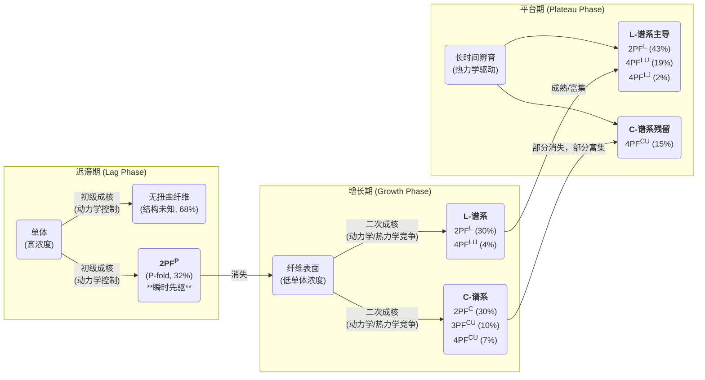

# 【cell】淀粉样纤维的结构并非一成不变，而是动态演化的"生命体"

## 本文信息

  - **标题**: 淀粉样蛋白组装过程中纤维多态性的结构演化
  - **作者**: Martin Wilkinson, Yong Xu, Dev Thacker, Sheena E. Radford, Neil A. Ranson 等
  - **发表时间**: 2023年12月21日
  - **单位**: 利兹大学 (University of Leeds)，英国
  - **引用格式**: Wilkinson, M., Xu, Y., Thacker, D., Taylor, A. I. P., Fisher, D. G., Gallardo, R. U., Radford, S. E., & Ranson, N. A. (2023). Structural evolution of fibril polymorphs during amyloid assembly. *Cell*, *186*(26), 5798–5811.e7. [https://doi.org/10.1016/j.cell.2023.11.025](https://doi.org/10.1016/j.cell.2023.11.025)
  - **数据与代码**:
      - **CryoEM数据集**: EMPIAR: 11714, 11715, 11716, 11717
      - **CryoEM电镜图**: EMDB: 15696, 15728, 15729, 15730, 15731, 15753, 15754, 15755, 15756
      - **原子坐标**: PDB: 8AWT, 8AZ0, 8AZ1, 8AZ2, 8AZ3, 8AZ4, 8AZ5, 8AZ6, 8AZ7
      - **原始数据**: University of Leeds Data Repository: [https://doi.org/10.5518/1230](https://doi.org/10.5518/1230)

-----

## 摘要

> 冷冻电子显微镜（cryo-EM）为我们理解包括疾病相关蛋白在内的淀粉样纤维结构提供了前所未有的视角。然而，这些已解析的结构通常代表了漫长组装过程的**终点产物**，它们与组装早期的纤维之间的关系仍然未知。因此，在组装过程中是否会形成具有不同结构和潜在不同病理特性的纤维，一直是一个悬而未决的问题。本研究利用cryo-EM技术，在体外解析了一种与疾病相关的**人胰岛淀粉样多肽（IAPP-S20G）在纤维化过程不同时间点**的纤维结构。惊人的是，在**迟滞期、增长期和平台期**形成的纤维具有截然不同的结构，随着纤维化进程的推进，新的构象不断出现，而另一些则会消失。对野生型hIAPP的时间序列研究也显示了类似的纤维结构随时间变化的现象，表明这是IAPP淀粉样蛋白组装的一个普遍特性。这项关于**瞬时存在的纤维结构**的发现，对于理解淀粉样蛋白的组装机制具有重要意义，并可能为揭示疾病中淀粉样蛋白的演进过程提供新的见解。

-----

## 背景

淀粉样纤维的形成，被誉为“蛋白质折叠的阴暗面”，是众多人类重大疾病的共同病理标志，包括阿尔茨海默病（AD）、帕金森病（PD）以及2型糖尿病（T2D）。这些疾病的特征是，原本可溶的功能性蛋白质错误折叠，并自发聚集成不溶性的、富含标志性“交叉β-折叠”（cross-β）结构的纤维状沉积物。这一过程通常遵循一个经典的“成核-生长”动力学模型，表现为典型的S型曲线，包含反应初期的**迟滞期（lag phase）**、纤维快速增长的**增长期（growth phase）和反应达到平衡的平台期（plateau phase）**。

近年来，随着冷冻电镜（cryo-EM）技术的革命性突破，科学家们解析了大量高分辨率的淀粉样纤维结构。这些研究揭示了一个惊人的事实：同一条多肽链可以折叠成多种不同的三维结构，这种现象被称为**结构多态性（polymorphism）**。这表明淀粉样蛋白的聚集并非简单的线性过程，而是在一个崎岖的能量景观上，通过复杂的分子事件级联发生的。不同的多态性结构（或称为“株”，strains）可能具有不同的生物毒性和传播能力，这被认为是解释同一种蛋白却能导致不同临床表型疾病（如α-突触核蛋白在PD和多系统萎缩症中的不同表现）的分子基础。

然而，当前几乎所有已报道的淀粉样纤维高分辨率结构，无论是从患者脑组织中提取的（*ex vivo*），还是在实验室中重组的（*in vitro*），都只捕捉了**单个时间点**的快照，这个时间点通常代表了疾病的终末期或体外反应的终点。这留下了一个巨大的知识空白：在漫长的聚集过程中，纤维的结构是否始终如一？或者，是否存在一些只在特定阶段出现的、**瞬时存在的中间态纤维结构**？这些早期的、可能转瞬即逝的结构，是否可能具有独特的、甚至更强的生物学危害性，却因为在终点时消失而被我们长期忽略？解答这些问题对于从根本上理解淀粉样蛋白的形成机制和疾病进展至关重要。

## 关键科学问题

本研究旨在解决淀粉样蛋白领域一个长期存在且至关重要的核心问题：**淀粉样纤维的结构多态性在聚集反应的整个时间进程中是恒定的，还是会随着时间动态演化？**

具体来说，研究团队试图通过高分辨率的结构生物学手段，直接“目睹”并回答以下几个层层递进的问题：

1.  在聚集反应的**迟滞期、增长期和平台期**，优势的纤维结构是否相同？
2.  是否存在一些只在特定阶段（尤其是早期）出现的**瞬时纤维物种**，它们在反应后期会消失或被其他结构取代？
3.  如果纤维结构确实在演化，那么这种演化遵循什么样的规律？是否存在从一种结构到另一种结构的**结构谱系（structural lineages）**？
4.  驱动这种结构演化的 underlying 物理化学和动力学机制是什么？是**动力学控制**（谁长得快谁就占优）还是**热力学控制**（谁最稳定谁就占优）在主导不同阶段的演化？

## 创新点

  - **首次实现多时间点结构解析**：首次通过高分辨率冷冻电镜技术，在**同一聚集反应的不同时间点（迟滞期、增长期、平台期）**对淀粉样纤维进行结构解析，将研究从静态终点推向了动态过程。
  - **直接证实动态演化**：提供了直接的、原子分辨率的证据，证明了淀粉样纤维多态性是**动态演化**的，颠覆了过去将纤维视为静态终产物的传统观念。
  - **发现多种瞬时与全新结构**：在IAPP-S20G的聚集过程中，总共解析了**七种**不同的纤维多态体结构，其中**五种是全新的**，并发现了一些仅在早期或中期存在的**瞬时结构**。
  - **提出结构演化模型**：基于详实的结构和动力学数据，提出了一个整合了**动力学控制和热力学驱动**的纤维结构演化模型，为理解不同阶段优势多态体的转变提供了合理的机制解释。

-----

## 研究内容

### 核心方法：多时间点冷冻电镜结构解析

为了捕捉淀粉样纤维在组装过程中的动态变化，研究团队设计了一套严谨的实验流程。他们以与早发型2型糖尿病相关的**IAPP-S20G**突变体为模型，在体外进行静态孵育，模拟其自发聚集过程。

  - **时间点采样**：基于硫黄素T（ThT）荧光（一种检测淀粉样纤维的常用染料）和高效液相色谱（HPLC）对反应进程的监测，研究人员精心挑选了三个代表性的时间点进行采样：

    1.  **3周（迟滞期后期）**：此时ThT信号很低，但已有少量可沉淀的纤维形成。
    2.  **6周（增长期中段）**：ThT信号快速上升，是纤维大量形成和增殖的阶段。
    3.  **22周（平台期）**：ThT信号达到饱和，反应进入表观上的稳态。

  - **结构解析流程**：对每个时间点的样品，研究团队都进行了冷冻电镜数据采集和复杂的图像处理分析。

    ```mermaid
    graph TD
        subgraph "实验流程"
            direction LR
            A("IAPP-S20G<br/>单体溶液") --> B("静态孵育<br/>(室温，pH 6.8)");
            B --> C1("3周采样<br/>(迟滞期)");
            B --> C2("6周采样<br/>(增长期)");
            B --> C3("22周采样<br/>(平台期)");
        end
    
        subgraph "数据处理流程"
            direction LR
            D("冷冻制样<br/>&<br/>Cryo-EM数据采集") --> E("2D分类<br/>(识别不同形态的纤维)");
            E --> F("3D分类<br/>(分离不同多态体)");
            F --> G("高分辨率<br/>三维重构");
            G --> H("原子模型搭建<br/>与精修");
        end
    
        C1 --> D;
        C2 --> D;
        C3 --> D;
    ```

    通过对数百万个纤维片段图像进行分类和重构，他们得以在原子分辨率水平上解析出每个时间点存在的主要纤维结构。

### 实验结果与分析：一场动态的结构演化“接力赛”

研究结果戏剧性地揭示了IAPP-S20G纤维群体的结构组成在不同阶段发生了深刻的演变，如同场上选手不断更替的接力赛。

**图1：淀粉样纤维多态性组装的可能模型。** (A-B) 先前研究解析的野生型hIAPP和IAPP-S20G纤维结构。(C-D) 两种理论模型：(C) 平行组装模型，不同多态体同时独立生长；(D) 序贯组装模型，一种多态体可能催化另一种的形成。下方的示意图表明，宏观的ThT生长曲线（品红色）可能掩盖了单个多态体（红色和蓝色）复杂的、截然不同的组装过程。

**图2：IAPP-S20G纤维群体随时间的初步表征。** (A) ThT荧光（红色）和上清液中剩余单体浓度（蓝色）的时间进程图，标示了迟滞期、增长期和平台期。有趣的是，早期聚集体对ThT的响应较弱。(B) 代表性的负染电镜图像显示了3周、6周和22周时纤维形态的多样性。(C) 负染电镜图像中测量的纤维交叉周期距离分布热图，显示了不同时间点纤维形态的演变。早期（2-3周）的纤维大多是无扭曲的。

#### 迟滞期（3周）：瞬时先驱者的出现

在反应的早期阶段，电镜下观察到的大部分纤维（约68%）是**没有规则扭曲的直线状纤维**，其结构无法通过常规的螺旋重构方法解析。然而，在剩余约32%的有规则结构的纤维中，研究人员解析出了一种**全新的、从未报道过的结构**。

  - **2PFP结构**：这是一种由两条原纤维（2PF）构成的纤维，每条肽链折叠成独特的**P形（P-fold）**，因此被命名为**2PFP**。
  - **结构特征**：它的交叉周期约为21 nm，与野生型（WT）IAPP纤维（约25 nm）相似。更有趣的是，尽管整体折叠不同，2PFP与WT IAPP纤维在残基15-28区域共享相似的主链构象，并且具有保守的原纤维间相互作用界面。

**图3：不同组装阶段存在不同的IAPP-S20G纤维群体。** (A) 3周、6周和22周的代表性冷冻电镜图像。(B) 每个时间点数据集的2D分类平均图，按交叉周期距离对不同的多态体进行颜色编码。(C) 精选的2D分类平均图，展示了初步识别出的不同规则纤维形式及其交叉周期。

**图4：Cryo-EM结构解析揭示了在组装的不同阶段，多种IAPP-S20G纤维多态体的差异性分布。** (A, E, H) 3周、6周和22周数据集中所有纤维片段的多态体分布饼图。(B, F, I) 每个多态体最终电镜密度图的切片视图。(C, G, K) 每个数据集中解析出的各多态体核心和表面视图。(D) 3周的2PFP结构（深绿）与WT IAPP的2PFS结构（浅绿）叠加，显示了它们共享的保守核心（蓝/红高亮）和相互作用界面。(J) 22周的2PFL电镜图中，清晰可见一个有序的水分子通道（红球）。

**这个2PFP结构是本次演化大戏的“开场角色”，但它也是一个瞬时存在的“先驱者”**。

#### 增长期（6周）：多态性的大爆发

到了反应的增长期，纤维的景象发生了翻天覆地的变化。

  - **2PFP的消失**：在6周的样品中，迟滞期出现的2PFP结构几乎完全消失（占比\<1%）。
  - **六种新结构登场**：取而代之的是一个高度复杂的混合体，研究人员从中成功解析出了**四种高分辨率结构**，并识别出另外两种稀有结构。这些结构可以被归类为两个主要的**结构谱系（lineage）**：
      - **C-谱系**：基于一个共同的、由**C形折叠（C-fold）肽链构成的双原纤维核心（2PFC）。这个核心可以进一步吸附新的肽链，形成三原纤维的3PFCU**和四原纤维的**4PFCU**。其中，2PFC和3PFCU是先前研究在终点样品中发现的结构，而4PFCU是本次发现的新结构。
      - **L-谱系**：基于一个由**L形折叠（L-fold）肽链构成的双原纤维核心（2PFL）。L-fold与早期的P-fold在结构上最为相似。此外，还存在一个由2PFL核心和另外两条肽链组成的四原纤维结构4PFLU**。

**图5：纤维化时间进程中观察到的不同IAPP-S20G纤维结构和亚基折叠。** (A) 解析出的七种独特IAPP-S20G纤维结构，按其核心分为P-谱系、L-谱系和C-谱系。(B) 五种不同的亚基折叠构象：P-fold, L-fold, C-fold, U-fold, 和 J-fold。(C) 五种折叠在保守区域的叠加。(D) 2PFL和2PFP的叠加，显示了它们虽然共享一个相似的链构象，但第二条链的堆叠方式完全不同，形成了不同的纤维架构。(E, F) L-谱系和C-谱系内部各成员的叠加，显示它们共享一个保守的2PF核心。

在这一阶段，**2PFC和2PFL是两种最主要的结构**，各占约30%，而由它们衍生出的更大结构（3PF和4PF）占比较低。

#### 平台期（22周）：向更大、更稳定的结构成熟

当反应进入平台期，纤维群体的多样性再次降低，显示出一种“优胜劣汰”的成熟过程。

  - **瞬时物种的淘汰**：增长期出现的**2PFC和3PFCU结构完全消失**。
  - **优势物种的富集**：L-谱系的**2PFL**和**4PFLU**的比例显著增加，分别达到43%和19%，成为绝对的优势物种。C-谱系中只有最大的**4PFCU**得以保留（15%）。
  - **新结构的发现**：由于4PFLU的富集，研究人员得以解析其高分辨率结构。此外，还发现了一个占比仅2%的、结构更为独特的四原纤维结构**4PFLJ**，其外部两条肽链呈现一种全新的**J形折叠（J-fold）**。

**图6：IAPP-S20G纤维多态体在组装时间进程中的结构成熟总结。** (A) 各多态体在不同时间点的分布百分比，背景为ThT荧光曲线。(B) 各亚基折叠类型在不同时间点的分布。(C) 负染电镜测量的交叉周期分布，显示纤维整体上变得更“长”（交叉周期更大）。(D) 不同尺寸（2PF, 3PF, 4PF）纤维的分布，显示了从2PF向4PF的转变。(E) 基于结构计算的每层纤维的平均自由能（ΔG°/layer），显示了随着时间推移，纤维整体变得更稳定。(F) 各谱系在不同时间点的演化示意图。

**总的来看，整个聚集过程呈现出一个清晰的演化趋势：从早期形成的、较小的（2PF）、动力学上优先的瞬时结构，演变为中期的多样化结构混合体，最终成熟为尺寸更大（4PF）、热力学上更稳定的少数优势结构。**

### 结果逻辑与机制推演

为了解释这种复杂的结构演化现象，研究者提出了一个基于**动态变化的动力学景观**的模型。

**图7：IAPP-S20G多态体演进的卡通总结与提出的不同组装阶段动力学景观机制。** (A) 结合了结构信息的ThT曲线，展示了不同阶段的物种比例。(B) 基于结构和出现顺序提出的潜在组装路径示意图。该模型假设了亚基的逐步吸附（accretion）机制，即在已形成的2PF核心上添加新的肽链形成3PF和4PF结构。(C) 不同组装阶段的示意性能量景观图。在迟滞期，能量景观可能比较简单，2PFP是动力学上最容易形成的低谷。进入增长期，随着纤维表面的出现，由二次成核主导的路径被激活，能量景观变得复杂，出现了多个能量相近的低谷（C-谱系和L-谱系）。在平台期，反应趋于平衡，体系缓慢地向能量更低的、更稳定的4PF结构演化。



这个模型的核心思想是，**驱动纤维形成的微观机制在不同阶段是不同的**。在迟滞期，单体浓度高，纤维浓度低，**初级成核**占主导，这有利于形成那些成核势垒最低、形成速度最快的结构（如2PFP）。进入增长期后，大量纤维表面出现，**二次成核**（在已有纤维表面催化新纤维的形成）成为主导，其速率比初级成核快了$10^8$倍。这开启了通往C-谱系和L-谱系的新路径，它们可能在二次成核上更具优势，从而迅速取代了2PFP。最后，在漫长的平台期，随着单体被大量消耗，反应接近平衡，**热力学稳定性**成为主导因素，体系缓慢地向能量更低的、由更多亚基组成的4PF结构演化。

-----

## Q\&A

  - **Q1**: 为什么早期的纤维（迟滞期）不怎么与ThT荧光染料结合？

  - **A1**: 这强烈暗示了早期纤维与后期纤维在结构上的根本不同。ThT染料的荧光来自于它嵌入到成熟淀粉样纤维的交叉β-折叠结构中的特定沟槽。迟滞期大量存在的无扭曲纤维和独特的2PFP结构，可能缺乏这种适合ThT紧密结合的构象，导致荧光信号很弱。这提醒我们，单独依赖ThT可能无法准确监测淀粉样蛋白聚集的全过程，尤其会低估早期物种的形成。

  - **Q2**: 文中提出的“C-谱系”和“L-谱系”是如何定义的？它们之间可以相互转化吗？

  - **A2**: 这两个谱系是根据构成其**双原纤维（2PF）核心**的肽链折叠方式来定义的。C-谱系的核心是两条C形折叠的肽链（2PFC），而L-谱系的核心是两条L形折叠的肽链（2PFL）。本文的叠加分析显示，每个谱系内部的更大结构（3PF和4PF）都是在共享的2PF核心上通过“吸附”新的肽链形成的。研究没有提供L-谱系和C-谱系之间直接相互转化的证据，它们似乎是在增长期通过二次成核平行出现的两条演化路径。

  - **Q3**: 为什么在反应后期，纤维会趋向于形成更大（更多原纤维）的结构？

  - **A3**: 这背后是热力学的驱动力。研究团队通过计算发现，虽然构成不同纤维的单个肽链折叠（P-fold, L-fold, C-fold等）在每个残基的平均稳定性上相差无几（约$-0.8\ \mathrm{kcal/mol}$），但由更多肽链组成的纤维（如4PF）在**每一层结构上的总稳定性**要显著高于较小的纤维（2PF）。因此，在反应后期，当体系有足够的时间去探索各种可能性时，它会自发地向能量更低的、更稳定的状态演化，即形成更大的4PF组装体。

  - **Q4**: 这项研究对野生型（WT）IAPP也有意义吗？它对理解人类疾病有什么启示？

  - **A4**: 是的。研究团队对WT hIAPP也进行了类似的时间序列实验，同样观察到了纤维结构随时间演变的现象，从早期的无定型结构转变为后期更均一的、有特定结构的群体。这表明**纤维的动态成熟是一个普遍现象**，而不仅仅是S20G突变体的特性。这对疾病研究有重大启示：在疾病的早期阶段，可能存在一些结构独特、毒性不同的瞬时纤维物种。我们目前从晚期患者身上看到的纤维结构可能只是“幸存者”，而真正的“始作俑者”可能早已消失。未来的诊断和治疗策略或许需要考虑这些早期、瞬时的病理结构。

-----

## 关键结论与批判性总结

### 核心结论

  - **淀粉样纤维多态性是动态演化的**：淀粉样纤维的结构在聚集过程中并非一成不变，而是经历了一个从动力学优先的瞬时物种到热力学稳定的成熟物种的复杂演化过程。
  - **瞬时纤维物种的存在**：在IAPP-S20G的聚集早期（迟滞期）存在一种独特的2PFP多态体，它在反应进入增长期后几乎完全消失。
  - **结构演化的阶段性**：迟滞期、增长期和平台期分别由不同结构特征的纤维群体主导，多样性在增长期达到顶峰，在平台期又趋于简化。
  - **向更大、更稳定结构的成熟**：随着反应的进行，纤维组装体有明显的趋势变得更大（从2PF到4PF）和更稳定，这是由热力学驱动的。
  - **机制解释**：这种演化可以通过一个动态的能量景观模型来解释，其中初级成核和二次成核在不同阶段扮演主导角色，分别青睐动力学上易于形成和热力学上更稳定的结构。

### 批判性总结

  - **潜在影响**:

      - **颠覆性认知**：这项工作从根本上改变了我们将淀粉样纤维视为静态终点的看法，揭示了其组装过程的动态性和复杂性，为整个领域提供了新的理论框架。
      - **疾病机理新视角**：提示我们疾病早期可能存在独特的、具有不同病理活性的瞬时纤维物种，这可能对解释疾病的起始和早期进展至关重要。
      - **药物研发新思路**：为药物开发提供了新的靶点思路。例如，可以设计特异性稳定无毒早期物种或抑制向有毒物种转变的药物，而不是仅仅靶向终末期的纤维。

  - **研究局限性**:

      - **体外研究**：研究是在简化的体外缓冲液系统中进行的，缺乏细胞内复杂的环境因素（如分子伴侣、脂质膜、拥挤效应等），这些因素可能会极大地影响纤维的演化路径。
      - **转化机制未知**：研究观察到了不同多态体的“此消彼长”，但无法确定其转化的具体分子机制，例如，是一种结构直接重塑为另一种，还是需要先解聚成单体再重新组装。
      - **定量分析的挑战**：由于淀粉样蛋白聚集反应的随机性和异质性，精确量化不同时间点各多态体的比例仍然是一个技术挑战，文中的百分比是基于大量图像统计的近似值。

  - **未来研究方向**:

      - **实时追踪**：开发能够实时、单分子水平上追踪单个纤维结构演变的技术（如结合特殊荧光探针的高速AFM或冷冻电镜断层成像），以直接观察结构转化过程。
      - **生物学相关性**：研究不同时间点形成的纤维物种的生物学活性，包括它们的细胞毒性、传播能力（种子活性）以及与细胞成分的相互作用。
      - **体内验证**：在细胞模型或动物模型中探究淀粉样纤维是否也存在类似的结构成熟过程，这将是验证该发现在生物学上重要性的关键一步。