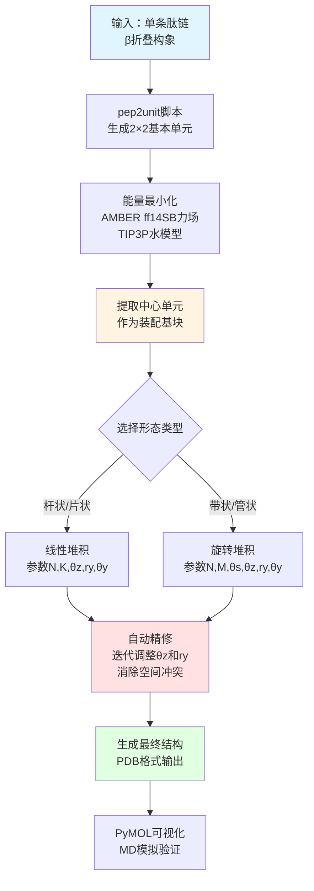
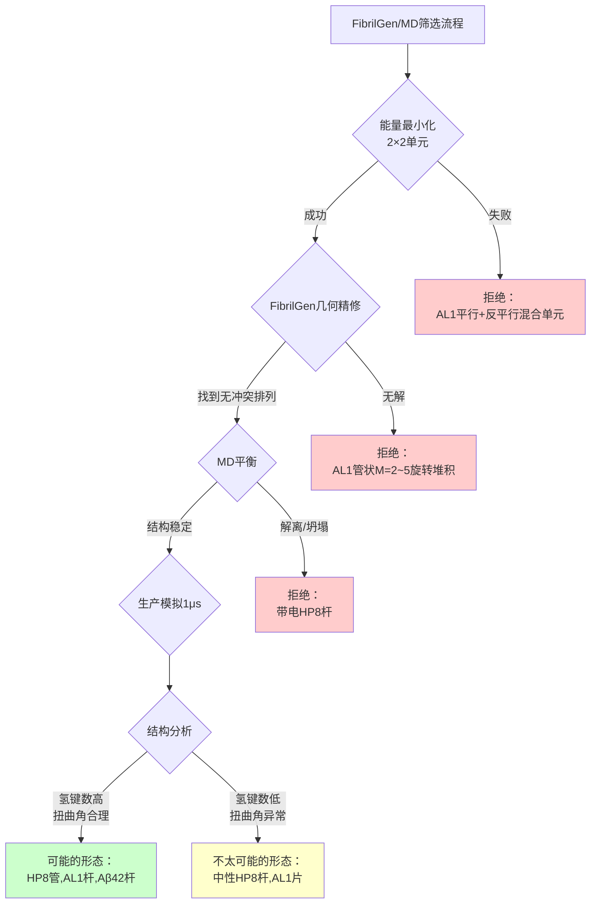

# 从序列到纳米结构：FibrilGen如何让肽自组装建模变得简单

## 本文信息

- **标题**: FibrilGen: A Python Package for Atomistic Modeling of Peptide β-Sheet Nanostructures
- **作者**: Chao-Yu Yang, Aline F. Miller, Alberto Saiani, Richard A. Bryce
- 发表时间: 2025年9月26日接收
- **单位**: 曼彻斯特大学（英国）药学与视光学系、材料系、化学工程系
- **引用格式**: Yang, C.-Y., Miller, A. F., Saiani, A., & Bryce, R. A. (2025). FibrilGen: A Python Package for Atomistic Modeling of Peptide β-Sheet Nanostructures. *Journal of Chemical Information and Modeling*, https://doi.org/10.1021/acs.jcim.5c02108
- **源代码**: https://github.com/ChaoYuYang0/FibrilGen-v0

## 摘要

> 对于依赖肽一级序列理性设计的**全新肽基纳米材料**，系统性地计算建模由自组装肽形成的多样化、复杂的潜在纳米结构具有相当大的价值。本文介绍了FibrilGen，一个**专门的Python工具包，能够在原子水平构建广泛的cross-β形态。FibrilGen通过一组输入的几何参数初始化肽堆积和纤维形态，随后通过精修步骤产生紧密的组装体**。使用FibrilGen，研究人员可以生成各种组装的cross-β结构作为分子模拟的输入；该工具包还包括**用于纤维纳米结构及其轨迹几何分析的功能**。作者通过生成不同形态的cross-β纳米结构来展示该工具的实用性，这些结构**与从冷冻电镜和固态核磁共振波谱确定的自组装排列高度吻合**。这些结构在水溶液中的微秒级分子动力学模拟中也表现出构象稳定性。作者进一步评估了建模/模拟流程过滤非实验性β折叠纤维结构的能力。因此，FibrilGen工具包提供了一条构建各种可能形态的原子级超分子肽结构的途径，用于可视化、模拟以及相互作用和稳定性的评估。

### 核心结论

- FibrilGen是首个专门用于构建cross-β纳米纤维的原子级建模工具，支持杆状、带状、管状等多种形态
- 工具包集成在PyMOL中，可通过7个几何参数控制纤维结构，并自动精修以消除空间冲突
- 通过冷冻电镜验证，FibrilGen构建的HP8、AL1和Aβ42纤维结构与实验高度吻合
- 微秒级分子动力学模拟证实FibrilGen生成的结构在水溶液中300 K下稳定
- 工具能够识别并排除非实验性的纤维形态，为肽纳米材料的理性设计提供支持

## 背景

**自组装肽纳米材料**在过去二十年中引起了广泛关注。虽然最初主要研究其在阿尔茨海默病或帕金森病等疾病中的作用，但科学家们已经开始探索利用这些短天然分子的自组装特性来设计新型材料。在各种自组装肽中，**β折叠形成肽**在生物医学领域尤其受到青睐，因为它能够设计出生物相容性和剪切变稀的纤维水凝胶支架，在3D体外细胞和类器官培养、体内药物递送等应用中展现出巨大潜力。

cross-β结构的基本特征已为人所知：肽组装成单向的cross-β梯状结构，根据肽的相对取向可以是平行或反平行排列，片内主链肽间距为4.8-4.9 Å，并通过分子间氢键稳定。尽管在肽分子水平上组装相对简单，这些自组装肽可以形成具有**多种形态的扩展超分子组装体**，从细纤维到粗纤维、管状、带状和片状。

**图1：cross-β纤维的常见周期性构建块**

该图展示了β折叠双层（红框）作为cross-β纤维的周期性构建块：（a）12肽AL1（IGSNVVTWYQQL）形成6层堆叠的平行β折叠双层，组装成左手杆状形态；（b）AL1肽形成9层堆叠的平行β折叠双层，组装成左手杆状；（c）11肽（YTIAALLSPYS）形成平行β折叠，组装成左手管状；（d）8肽HP8（N端乙酰化、C端酰胺化的FKFEFKFE）形成平行或反平行β折叠，组装成左手管状。电子密度使用Chimera 1.17.3可视化。

尽管使用冷冻电镜、X射线衍射和固态核磁共振等最先进技术在阐明这些结构的形态方面做了大量工作，但**肽序列与最终超分子结构形态之间的关联仍然知之甚少**。不仅最终自组装结构取决于肽序列本身，介质pH值和离子强度、溶剂极性和温度等环境因素也在决定最终超分子组装体的形态中起着关键作用。

现有的软件包可以从实验中重建超分子组装体：例如RELION允许从冷冻电镜图像进行单颗粒分析以重建电子密度；ROSETTA提供刚体变换将分子组装成对称组装体以模拟NMR或冷冻电镜数据；PHENIX支持从X射线、中子衍射和冷冻电镜数据推断原子模型。对于不拟合实验约束的分子建模，有多种软件程序可用于将分子打包成特定的组装模式，如PACKMOL可以将分子组装成球体、椭圆体、圆柱体、平面或盒子；Polyply可以执行粗粒化珠子的自排除随机游走以生成聚合物构象；Nanomaterial Modeler包含一个晶胞库，可组装块状金属、矿物和碳质材料。虽然这些建模工具包对于构建分子组装体很有价值，但**仍需要一个专门的工具来构建跨越广泛复杂实验观察形态的单向超分子cross-β排列**。

## 关键科学问题

本文旨在解决的核心科学问题是：**如何系统性地构建具有多样化形态的肽β折叠纳米纤维的原子级模型**。尽管冷冻电镜和固态核磁共振等实验技术能够解析cross-β结构，但从肽序列到原子级三维纳米结构的建模过程仍然是一个挑战。现有的通用分子组装工具（如PACKMOL、Polyply）无法专门处理cross-β纤维独特的几何特征，包括：

1. β折叠双层的特殊堆积方式（面对面或面对背）
2. 片内肽链的平行/反平行排列
3. 沿纤维长轴的螺旋扭曲
4. 从简单杆状到复杂管状、带状的形态变化

这个问题之所以是研究焦点和难点，是因为：**肽序列与最终纳米结构之间缺乏明确的构效关系**，同时环境因素（pH、离子强度、温度）也会显著影响形态。一个能够快速生成、可视化和筛选不同形态的工具对于肽纳米材料的理性设计至关重要。

## 创新点

- **首个专门用于cross-β纤维建模的工具包**：FibrilGen是为β折叠自组装肽纳米结构量身定制的，填补了通用分子组装工具的空白
- **参数化建模方法**：通过7个几何参数（$N, K, M, \theta_s, \theta_z, r_y, \theta_y$）系统性地控制纤维形态，涵盖杆状、带状、管状等多种结构
- **自动结构精修**：内置迭代算法自动调整螺旋扭曲参数，消除原子间空间冲突，确保生成紧密且物理合理的组装体
- **与PyMOL无缝集成**：可直接在PyMOL命令行调用，实现快速可视化和概念化
- **完整的建模-模拟-验证流程**：从初始结构生成到能量最小化、微秒级MD模拟，提供端到端的解决方案
- **实验验证的可靠性**：通过与HP8、AL1、Aβ42三个体系的冷冻电镜和固态NMR数据对比，证明了方法的准确性

## 研究内容

### 核心方法：FibrilGen建模流程

FibrilGen采用**自底向上的层次化建模策略**，将肽纳米纤维的构建分解为三个层次：单肽 → 2×2基本单元 → 完整纤维结构。

**图2：FibrilGen建模方案**

该图展示了FibrilGen中用户可控制的输入参数集合：（a）2×2单元的周期性基础和沿β折叠轴的重复数$N$；（b）2×2单元在纤维横截面上的堆积方式，使用矩阵$K$接触单元边缘，或使用重复数$M$和角度$\theta_s$接触单元角落；（c）绕β折叠轴的扭曲角$\theta_y$的符号、相对β折叠轴的倾斜角$\theta_z$（以及距β折叠轴的半径$r_y$）。用户可以指定堆积模式（通过$N, K, M, \theta_s$）和初始螺旋扭曲（通过$\theta_y, r_y, \theta_z$的符号），FibrilGen会精修螺旋扭曲并组装成紧密且无相交的纤维结构。

#### 2×2基本单元的构建

FibrilGen的核心概念是**2×2肽单元**，即4条肽链组成的基本构建块，包含两个β折叠形成双层结构。

**图3：2×2肽单元的组装**

给定一条输入肽如（a）Ac-FKFEFKFE-NH2，pep2unit脚本可将肽排列成两个β折叠（绿色、橙色），具有以下选项：（b）两个β折叠在xz平面上的片间排列（片间距用粉色标注）可以是（左）面对背或（右）面对面；（c）相邻β链的片内排列，沿x轴的配准（蓝色）和沿y轴4.8 Å的位移（紫色）；（d）反平行（标记为βa）和平行（标记为βp）β折叠的平行/反平行排列：两个反平行排列的βa（标记为βaaβa）、一个βp和一个βa反平行排列（标记为βpaβa）、两个反平行排列的βp（标记为βpaβp）、两个平行排列的βp（标记为βppβp）。此处以面对面排列的同向配准β折叠为例。

pep2unit脚本提供三个关键控制选项：

1. **片间排列**：两个β折叠在xz平面上的相对位置
   - 面对背（face-to-back）：一个折叠的"面"朝向另一个的"背"
   - 面对面（face-to-face）：两个折叠的疏水侧链相互接触

2. **片内排列**：相邻β链在同一折叠内的配准方式
   - 同向配准（in-register）：相邻链的残基一一对应
   - 错位配准（out-of-register）：相邻链沿x轴有偏移

3. **平行性**：β折叠的N端到C端方向
   - 平行β折叠：所有链方向一致
   - 反平行β折叠：相邻链方向相反

对于侧链的χ1二面角，采用简单策略：初始化为80°（靠近N端）或160°（靠近C端）以最大化侧链间距离。随后通过能量最小化精修侧链堆积。

**图4：FibrilGen中的组装操作**

该图展示了组装操作：（a）4肽基本组装单元（表示为盒子）通过仿射变换组装成纳米纤维；（b）引入称为线性堆积的操作来接触盒子的面，使用$K$在纤维横截面上排列基本单元或使用$N$延伸纤维长度；（c）引入称为旋转堆积的操作来接触盒子的边，使用半径$r_s$、扭曲角$\theta_s$将单元绕纤维轴堆积$M$次；（d）引入称为扭曲的操作来调整沿纤维轴盒子的面接触，使用半径$r_y$、扭曲角$\theta_y$和倾斜角$\theta_z$绕纤维轴旋转。

**图5：FibrilGen中的基本形态模型**

该图展示了基本形态模型：（a）通过线性堆积和扭曲构建的杆状模型基础；（b）扩展盒子堆积产生杆状模型的示例；（c）通过旋转堆积和扭曲构建的带状模型基础；（d）扩展盒子堆积产生带状模型的示例。

#### 七个几何参数的定义

**表1：FibrilGen的7个几何参数**

| 参数 | 描述 | 杆状结构 | 带状结构 |
|------|------|---------|---------|
| $N$ | 沿纤维长轴延伸的单元数量 | ✓ | ✓ |
| $K$ | 在纤维横截面上的堆积模式矩阵（线性堆积） | ✓ | ✗ |
| $M$ | 在纤维横截面上旋转堆积的单元数量 | ✗ | ✓ |
| $\theta_s$ | 旋转堆积的角度间隔（度） | ✗ | ✓ |
| $\theta_z$ | 倾斜角，使单元偏离纤维轴（度） | ✓ | ✓ |
| $r_y$ | 孔径半径，单元距纤维轴的位移（Å） | ✓ | ✓ |
| $\theta_y$ | 扭曲角，沿纤维轴旋转连续单元（度） 符号：+1为左手性，-1为右手性 | ✓ | ✓ |

**螺旋扭曲的数学关系**：

为了保持相邻肽间的氢键距离，扭曲角 $\theta_y$、倾斜角 $\theta_z$ 和半径 $r_y$ 必须满足几何约束：

$$
(b \cdot \cos\theta_z)^2 + \left(r_y \cdot \sqrt{2 - 2\cos\theta_y}\right)^2 = b^2
$$

其中，$b = 4.8$ Å是β折叠内相邻肽的间距常数。第一项是沿纤维长轴的投影距离平方，第二项是在横截面上旋转的弦长平方。

#### 自动结构精修算法

FibrilGen的精修过程基于三个条件：

1. **最小倾斜角**：$\theta_z > \theta_{z,\min}$（默认1.14°），防止结构过于平坦
2. **无空间冲突**：$0 < \theta_y < \theta_{y,\max}$，其中 $\theta_{y,\max}$ 通过逐步增加扭曲角直到出现原子间距小于阈值来确定
3. **适当的片间距离**：相邻β折叠间的最近原子距离在2-5 Å之间

迭代过程：
- 对于**杆状结构**：从用户输入的 $\theta_z$ 开始，若不满足条件1和2，则以0.02 rad的步长逐步减小 $\theta_z$
- 对于**带状结构**：同时调整 $\theta_z$（步长0.02 rad）和 $r_y$（添加≤1 Å的随机噪声），直到满足所有三个条件

最大迭代次数默认为40次。该算法确保生成的结构既物理合理又几何紧凑。

### 实验体系的重建与验证

作者选择了三个**形态差异显著**的实验体系来验证FibrilGen的能力。

#### 体系一：HP8水凝胶管（10层β折叠）

**图6：冷冻电镜电子密度与FibrilGen构建的cross-β纳米结构原子级模型的整体形态对比**

该图展示了三个体系的冷冻电镜电子密度与FibrilGen构建模型的对比：（a）HP8水凝胶管——（左）电子密度EMD-23487，（右）FibrilGen模型结构；（b）AL1杆——（左）电子密度EMD-3128，（右）FibrilGen模型结构；（c）Aβ42杆——（左）电子密度EMD-3851，（右）FibrilGen模型结构。电子密度使用Chimera 1.17.3可视化，FibrilGen模型使用PyMOL可视化。

**建模过程**：
1. 使用pep2unit生成平行+反平行面对面排列的2×2单元
2. 构建含10条肽/折叠的初步纤维（共100条肽）
3. 在显式水中能量最小化
4. 提取中心单元重新组装
5. 探索倾斜角范围：15°、20°、25°、30°、35°

**精修结果**：FibrilGen自动收敛到 $\theta_z = 25.0°$ 和 $\theta_y = 3.7°$，与实验值（30.0°和4.5°）吻合良好。

#### 体系二：AL1杆状纤维（12层β折叠）

AL1肽（IGSNVVTWYQQL）形成12层平行β折叠的杆状结构，固态NMR确认平行排列。如图1b所示，冷冻电镜电子密度图（EMD-3128）与FibrilGen构建的192肽模型在整体形态和螺旋参数上高度吻合，冷冻电镜分辨率为8.3 Å。

**建模过程**：
1. pep2unit生成两个平行β折叠面对面排列的2×2单元
2. 探索倾斜角：3°、5°、7°、9°、10°
3. 构建192肽的双折叠杆状结构

**精修结果**：与HP8不同，AL1杆允许一系列螺旋扭曲，FibrilGen给出 $\theta_z = 11.0°$ 和 $\theta_y = 1.5°$，接近实验重建的12.2°和1.4°。

#### 体系三：Aβ42淀粉样杆（2层β折叠）

Aβ42肽是阿尔茨海默病的标志性淀粉样蛋白，组装成双折叠杆状结构，冷冻电镜分辨率4.0 Å。如图1c所示，冷冻电镜电子密度图（EMD-3851）与FibrilGen构建的44肽模型高度一致。该体系展示了FibrilGen能够处理复杂含有多个转角的肽分子，并准确重建其纳米纤维结构。

**建模过程**：
1. 直接使用冷冻电镜结构（PDB: 5OQV）中的2×2单元，不做能量最小化
2. 构建44肽的双折叠纤维
3. 探索倾斜角：3°、5°、7°、9°、10°

**精修结果**：扭曲参数收敛到 $\theta_z = 3.5°$ 和 $\theta_y = 1.0°$，与实验值4.5°和1.4°非常接近。

**三个体系的共同特点**：FibrilGen模型在整体形态（管状、杆状）、螺旋参数（$\theta_z$、$\theta_y$）和骨架堆积方式上均与实验高度一致，证明了该方法的普适性。

### 分子动力学模拟稳定性评估

为了验证FibrilGen生成结构的**动力学稳定性**，作者对三个实验体系（HP8管、AL1杆、Aβ42杆）以及HP8的冷冻电镜结构进行了微秒级MD模拟。

**模拟参数**：
- 力场：AMBER ff14SB（肽）+ TIP3P（水）
- 温度：300 K（Langevin恒温器，碰撞频率1 ps⁻¹）
- 压强：1 bar（Berendsen控压器，弛豫时间2 ps）
- 时间步长：4 fs（采用氢质量重分配HMR方法）
- 时长：每个体系2条1 μs轨迹

**平衡策略**：
1. 能量最小化
2. 升温至100 K（NVT，20 ps）
3. 升温至300 K（NPT，400 ps）
4. 短平衡（2 ns，平底谐振子约束相邻β链Cα距离在2-9 Å）
5. 生产模拟（1 μs，无约束）

**图7：300 K下1 μs MD模拟中的生成（重建）结构、平均骨架氢键数/链(Hbonds)和纤维半径$R_f$**

平衡前的结构为：（a）FibrilGen构建的HP8管、（d）冷冻电镜结构7LQI的HP8管、（g）FibrilGen构建的AL1杆、（j）FibrilGen构建的Aβ42杆。从MD副本（黄色、绿色）计算的氢键数/链（b, e, h, k）和纤维半径（c, f, I, l）分别列在第二行和第三行。还显示了从冷冻电镜结构7LQI计算的基线值（b,c,e,f中的蓝色）和冷冻电镜结构5OQV的基线值（k中的蓝色）。

**HP8管的稳定性分析**：

| 指标 | FibrilGen模型（平均±标准差） | 冷冻电镜结构（平均±标准差） | 实验值 |
|------|--------------------------|------------------------|--------|
| Cα RMSD（Å） | 2.8和3.3（相对初始） | 1.7和2.0（相对初始） | - |
| 骨架氢键数/链 | 13.2 ± 0.3 | 13.1 ± 0.3 | 7.8（初始冷冻电镜） |
| 纤维半径Rf（Å） | 28.3 ± 0.2 | 30.0 ± 0.5 | 30.0 |
| x-配准tx（Å） | 7.1 ± 0.3 | 7.0 ± 0.3 | 6.4 |
| y-扭曲θd（°） | 14.3 ± 2.1 | 19.1 ± 3.3 | 13.0 |

**关键发现**：
- FibrilGen模型和冷冻电镜结构在MD模拟中表现出**相似的稳定性**
- 氢键数量（13.2 vs 13.1）几乎相同，且均高于初始冷冻电镜结构（7.8），说明MD优化了氢键网络
- 纤维半径略有差异（28.3 Å vs 30.0 Å），可能源于不同的初始条件
- **管状形态在微秒尺度上保持稳定**，未发生坍塌或解离

**图8：300 K下副本微秒级MD模拟中肽链相对排列(x-配准$t_x$、y-扭曲角$\theta_d$)的时间序列**

该图展示了（黄色、绿色）双重轨迹的时间序列：（a-c）FibrilGen构建的HP8管；（d-f）冷冻电镜结构7LQI的HP8管；（g-i）FibrilGen构建的AL1杆；（j-l）FibrilGen构建的Aβ42杆。蓝色表示实验值。四个体系的局部坐标系用于定义$t_x$和$\theta_d$，分别显示在（a）、（d）、（g）、（j）中。基线肽排列从冷冻电镜结构7LQI计算得出（b,c,e,f中的蓝色）以及从冷冻电镜结构5OQV计算得出（k,l中的蓝色）。

**AL1杆的稳定性分析**：

| 指标 | FibrilGen模型（平均±标准差） | 实验观察 |
|------|--------------------------|---------|
| Cα RMSD（Å） | 3.4（相对初始） | - |
| 骨架氢键数/链 | 14.4 ± 0.4 | 固态NMR确认平行排列 |
| 纤维半径Rf（Å） | 26.6 ± 0.0 | 冷冻电镜显示杆状形态 |
| x-配准tx（Å） | 0.0 ± 0.2 | 固态NMR示in-register排列 |
| y-扭曲θd（°） | 3.7 ± 1.0 | 固态NMR示左手扭曲 |

**关键发现**：
- 12层杆状结构在微秒模拟中**形态稳定**
- x-配准接近0（-0.0 ± 0.2 Å），与固态NMR确认的in-register排列一致
- 左手扭曲角3.7°与实验推断的扭曲方向吻合

**Aβ42杆的稳定性分析**：

| 指标 | FibrilGen模型（平均±标准差） | 冷冻电镜结构（PDB 5OQV） |
|------|--------------------------|----------------------|
| Cα RMSD（Å） | 2.4（相对FibrilGen初始） 1.4（相对5OQV） | 0.7（初始差异） |
| 骨架氢键数/链 | 56.1 ± 0.7 | 54.0 |
| 纤维半径Rf（Å） | 15.7 ± 0.1 | N/A |
| x-配准tx（Å） | -0.1 ± 0.3 | 0.2 |
| y-扭曲θd（°） | 7.0 ± 3.9 | 2.5 |

**关键发现**：
- Aβ42单体含5个转角，部分片内骨架氢键较弱
- 氢键数（56.1）与冷冻电镜结构（54.0）接近
- x-配准接近0，与固态NMR确认的in-register排列一致
- 扭曲角7.0°与实验值（约3°）的差异可能源于Aβ42复杂的五圈拓扑

**稳定性总结**：三个FibrilGen模型在300 K水溶液中经历微秒级模拟后，均保持了：
1. **形态完整性**（管状、杆状）
2. **氢键网络稳定**（每链13-56个骨架氢键）
3. **几何参数一致**（纤维半径、肽链配准、扭曲角）

这证明FibrilGen生成的原子级结构不仅几何合理，而且**动力学稳定**，可作为进一步研究的可靠起点。

### 假设性结构的筛选能力

为了评估FibrilGen/MD流程**识别非实验性形态**的能力，作者进行了"形态互换"实验：将HP8建模为杆状，将AL1建模为管状。

#### HP8杆的建模结果

作者构建了两种电荷状态的HP8杆：
1. **带正电的HP8杆**（所有谷氨酸质子化，pH 3）
2. **电中性的HP8杆**（所有谷氨酸去质子化，pH 7）

**结果**：
- **带正电HP8杆**：能量最小化成功，但在平衡阶段**解离**（图S5a）
- **电中性HP8杆**：平衡和生产模拟稳定，但收敛到**交错排列**（staggered arrangement）而非标准杆状

**表2：HP8杆与HP8管的结构参数对比**

| 结构 | x-配准tx（Å） | y-扭曲θd（°） | 纤维半径Rf（Å） | 氢键数/链 |
|------|-------------|-------------|---------------|-----------|
| HP8管（实验） | 7.1 ± 0.3 | 14.3 ± 2.1 | 28.3 ± 0.2 | **13.2 ± 0.3** |
| HP8杆（中性） | 0.0 ± 0.2 | 0.2 ± 2.2 | 25.7 ± 0.1 | **11.0 ± 0.6** |
| HP8杆（带电） | 不稳定 | 不稳定 | 不稳定 | 不稳定 |

**关键发现**：
- 电中性HP8杆的氢键数（11.0）**显著少于**HP8管（13.2），提示管状形态更稳定
- 扭曲角接近0°（0.2°），形成**扁平结构**，与AL1杆的3.7°和HP8管的14.3°形成对比
- 带电HP8杆的解离表明**静电排斥**阻止了杆状形态的稳定

#### AL1管的建模结果

作者尝试用AL1肽构建类似HP8的管状结构：
1. 首先尝试组装平行+反平行混合的2×2单元（类似HP8管）→ **能量最小化失败**（骨架氢键断裂，β折叠丧失）
2. 改用AL1杆的2×2单元尝试旋转堆积（M=2,3,4,5）→ **FibrilGen无法找到无冲突的几何排列**（图S6a）
3. 退而求其次，构建**两层平行β折叠面对面排列的片状结构**（图S6c）

**表3：AL1片与AL1杆的结构参数对比**

| 结构 | x-配准tx（Å） | y-扭曲θd（°） | 纤维半径Rf（Å） | 氢键数/链 |
|------|-------------|-------------|---------------|-----------|
| AL1杆（实验） | 0.0 ± 0.2 | **3.7 ± 1.0** | 26.6 ± 0.0 | **14.4 ± 0.4** |
| AL1片（双层） | 1.3 ± 0.3 | **0.6 ± 1.4** | 4.9 ± 0.0 | **13.6 ± 0.3** |

**关键发现**：
- AL1片的氢键数（13.6）**略少于**AL1杆（14.4），差异0.8个氢键/链
- 扭曲角显著降低（0.6° vs 3.7°），片状结构**几乎无扭曲**
- 管状形态在AL1体系中**几何不可行**，即使在宽松的FibrilGen条件下也无法生成

#### 筛选能力的总结

**FibrilGen/MD流程的三级筛选机制**：

1. **第一级：2×2单元能量最小化**
   - 排除骨架氢键无法形成的排列方式（如AL1的平行+反平行混合）

2. **第二级：FibrilGen几何精修**
   - 排除存在严重空间冲突的堆积方式（如AL1的小半径管状结构）

3. **第三级：MD平衡与生产模拟**
   - 排除静电不稳定的形态（如带电HP8杆）
   - 识别氢键较少、扭曲异常的次优形态（如中性HP8杆、AL1片）

**定量指标**：
- **氢键数差异**：实验形态（13.2-14.4个/链）vs 非实验形态（11.0-13.6个/链）
- **扭曲角差异**：实验形态（3.7°-14.3°）vs 非实验形态（0.2°-0.6°）

这些结果表明，FibrilGen/MD流程能够**部分识别**非实验性形态，尽管不是所有非实验形态都会被完全排除（如电中性HP8杆和AL1片仍能稳定），但它们在氢键数和扭曲角上的差异提供了**定量的稳定性指标**。

### FibrilGen的扩展应用

除了上述三个验证案例，FibrilGen还展示了构建多种形态的能力（详见支持信息图S10-S11），包括：

1. **扁平片状结构**：$\theta_z$ 和 $\theta_y$ 接近0
2. **细杆状纤维**：小的 $K$ 矩阵（如2×2）+ 中等 $\theta_y$
3. **粗杆状纤维**：大的 $K$ 矩阵（如3×4）+ 小 $\theta_y$
4. **紧密管状结构**：小 $M$ 值（如 $M=4$）+ 大 $\theta_s$（如90°）
5. **宽松管状结构**：大 $M$ 值（如 $M=10$）+ 小 $\theta_s$（如36°）
6. **左手/右手螺旋**：通过 $\theta_y$ 的符号控制（+1左手，-1右手）

### 结构分析工具

FibrilGen不仅能构建结构，还提供了**轨迹分析功能**：

1. **纤维长轴拟合**：通过线性回归将肽中心质量投影到长轴（y轴），计算纤维半径Rf

2. **肽链相对取向**：定义局部坐标系ref-i-j-i来量化：
   - **x-配准（tx）**：相邻肽沿x轴的位移，0表示in-register排列
   - **y-扭曲（θd）**：相邻肽在xz平面的扭曲角，$\theta_d = \arctan(d_z/d_x)$

3. **氢键分析**：统计骨架氢键数（N-O距离<3.5 Å，角度>135°）

4. **RMSD计算**：对齐后的Cα原子对距离均方根偏差

这些分析工具在Supporting Information的analysis/文件夹中提供Python实现，可直接用于MD轨迹后处理。

## Q&A

- **Q1**: FibrilGen如何处理不同肽序列的侧链多样性？

- **A1**: FibrilGen采用两步策略：
  1. **初始化阶段**：对每个残基的χ1二面角使用简化规则（80°或160°），使同侧侧链Cβ间距最大化（7.3 Å）
  2. **精修阶段**：通过AMBER力场的能量最小化（在TIP3P水和离子存在下）优化侧链堆积，自动解决空间冲突。对于复杂侧链，用户可以手动调整特定χ1值，或集成构象搜索工具（如SCWRL）进一步优化。该方法在HP8（含芳香族Phe/Tyr）、AL1（含大侧链Trp/Gln）和Aβ42（含多种残基类型）上均表现良好。

- **Q2**: 为什么AL1允许多种螺旋扭曲，而HP8和Aβ42收敛到单一扭曲？

- **A2**: 这反映了不同体系的**能量景观特征**：
  - **AL1杆**：12层平行β折叠的杆状结构具有**较宽的能量阱**，多种 $(\theta_z, \theta_y)$ 组合在FibrilGen的空间冲突筛选中都可行。例如 $(\theta_z=7°, \theta_y=1.0°)$ 和 $(\theta_z=11°, \theta_y=1.5°)$ 都不产生冲突。
  - **HP8管**：10层混合平行/反平行β折叠的管状结构具有**更窄的能量阱**，内壁和外壁的不同排列方式对几何参数更敏感，只有 $\theta_z≈25-30°$ 和 $\theta_y≈3-4°$ 能同时满足内外壁的氢键和侧链堆积要求。
  - **Aβ42杆**：双层结构且每个单体有5个转角，几何约束严格，导致参数空间窄。

  未来的自由能计算可以量化不同扭曲的相对稳定性。

- **Q3**: FibrilGen/MD流程能否预测环境因素（如pH、离子强度）对形态的影响？

- **A3**: **部分可以**，但有局限性：
  - **已展示的能力**：通过对比带电（pH 3）和中性（pH 7）HP8杆，流程成功预测带电HP8因静电排斥而解离，这与实验上HP8在pH 4形成管状而非杆状一致。
  - **局限性**：
    1. FibrilGen本身是**几何建模工具**，不直接考虑pH或离子效应。这些需在MD模拟阶段通过质子化状态和离子浓度体现。
    2. 微秒级MD可能不足以观察pH诱导的形态转变（需毫秒至秒尺度）。
    3. 离子特异性效应（如Na+ vs Ca2+）需专门的离子参数和更长模拟。
  - **建议工作流程**：对于环境敏感的体系，可以使用FibrilGen生成多种候选形态 → 用不同质子化状态/离子浓度进行短MD筛选 → 对稳定的形态进行长时间模拟。

- **Q4**: 本文的氢键数指标（实验形态13-14个/链，非实验形态11-13个/链）能否作为普遍的稳定性判据？

- **A4**: **谨慎使用**，该指标有参考价值但非绝对：
  - **支持证据**：三个实验体系均显示高氢键数（HP8管13.2，AL1杆14.4，Aβ42杆56.1），而非实验形态氢键数较低（HP8杆11.0，AL1片13.6）。
  - **局限性**：
    1. **序列依赖**：Aβ42因含5个转角，部分骨架无法形成氢键，其"正常"氢键数就低于理想β折叠。
    2. **形态依赖**：管状结构的内外壁曲率可能影响氢键几何，不能直接与杆状比较。
    3. **力场依赖**：AMBER ff14SB的氢键参数可能与其他力场（如CHARMM36m）不同。
  - **建议用法**：将氢键数与**同序列、同形态的实验结构**比较，而非跨体系比较。同时结合其他指标（RMSD、纤维半径、扭曲角）综合判断。

- **Q5**: FibrilGen适用于哪些类型的肽体系，有何限制？

- **A5**: **适用范围**：
  - ✓ **β折叠形成肽**：核心设计目标，支持平行/反平行、in-register/out-of-register
  - ✓ **短肽至中等长度肽**：验证的例子为8-12残基，理论上可扩展到20+残基
  - ✓ **单向纤维形态**：杆、管、带、片（长轴为y轴）
  - ✓ **同质组装**：所有肽为相同序列

  **限制**：
  - ✗ **α螺旋或无规则卷曲肽**：FibrilGen假设β折叠二级结构
  - ✗ **分支或网络结构**：只支持单向延伸
  - ✗ **异质组装**：需要不同序列的肽交替排列（但可通过手动修改PDB文件变通实现）
  - ✗ **非肽组分**：如脂质、DNA等，需与其他工具（如PACKMOL）结合使用

  **正在开发的功能**（根据代码结构推测）：支持侧链修饰（磷酸化、糖基化）的参数输入。

## 关键结论与批判性总结

### 潜在影响

- **加速肽纳米材料的理性设计**：FibrilGen/MD流程将构建-可视化-模拟的时间从周缩短到小时，研究人员可以快速探索序列-形态关系
- **促进计算与实验的协同**：工具生成的原子级模型可以直接与冷冻电镜密度、固态NMR约束比较，辅助实验数据解析
- **推动超分子手性的研究**：FibrilGen对左手/右手螺旋的参数化控制为研究侧链结构与超分子手性的关系提供了计算平台
- **支持淀粉样蛋白的药物设计**：Aβ42等疾病相关纤维的精确建模有助于设计β折叠破坏剂或稳定剂
- **拓展到其他β折叠体系**：方法原则上可应用于蜘蛛丝蛋白、真菌朊病毒等天然β折叠纳米材料

### 局限性

- **能量评估的不完整性**：流程主要依赖空间冲突和MD稳定性，缺乏**系统性的自由能计算**来排序不同形态的热力学稳定性。未来可集成伞形采样或元动力学方法。
- **时间尺度限制**：微秒级MD虽能评估局部稳定性，但肽自组装的**成核、生长和形态转变**发生在毫秒至秒尺度，当前流程无法预测动力学路径。可能需要结合粗粒化模拟或机器学习势。
- **环境因素的简化**：虽然MD包含pH（通过质子化）和离子浓度，但**溶剂极性、温度梯度、界面效应**（如气-液界面）等复杂因素未充分考虑。
- **假阳性风险**：电中性HP8杆和AL1片虽然在MD中稳定，但实验未观察到。流程可能**无法排除所有非实验形态**，氢键数等指标需更多体系验证。
- **人工干预需求**：侧链χ1角初始化、能量最小化中的约束设置等步骤仍需用户经验，**自动化程度**有待提高。
- **缺乏成核机制**：FibrilGen从完整纤维结构入手，未涉及**单体→寡聚体→纤维**的早期组装阶段，这在实验上往往是形态决定的关键。

### 未来研究方向

- **多尺度建模整合**：将FibrilGen与粗粒化方法（如Martini）结合，先用粗粒化快速探索组装路径，再用FibrilGen生成原子级结构进行精修
- **机器学习辅助设计**：训练神经网络从序列直接预测最优几何参数 $N, K, M, \theta_s, \theta_z, r_y, \theta_y$，减少人工试错
- **自由能景观绘制**：对关键体系（如HP8）系统性扫描 $\theta_z$-$\theta_y$ 空间，计算每个点的溶剂化自由能，绘制完整的形态相图
- **异质组装体建模**：扩展FibrilGen以支持A-B-A-B型交替序列或共组装体系（如肽-脂质混合纤维）
- **实时冷冻电镜数据拟合**：开发FibrilGen的反向建模模式，输入低分辨率电子密度，自动搜索最佳几何参数
- **计算机辅助突变设计**：结合FibrilGen和Rosetta的序列设计模块，预测哪些突变能稳定特定形态或改变手性