# 破解膜孔之谜：双CV联手揭示从成核到扩展的完整能量图景

## 本文信息

- **标题**: Free Energy of Membrane Pore Formation and Stability from Molecular Dynamics Simulations
- **作者**: Timothée Rivel, Denys Biriukov, Ivo Kabelka, Robert Vácha
- **发表时间**: 2025年1月10日
- **单位**: 马萨里克大学中欧技术研究所、国家生物分子研究中心、凝聚态物理系，捷克布尔诺
- **引用格式**: Rivel, T., Biriukov, D., Kabelka, I., & Vácha, R. (2025). Free Energy of Membrane Pore Formation and Stability from Molecular Dynamics Simulations. *Journal of Chemical Information and Modeling*, *65*, 908–920. https://doi.org/10.1021/acs.jcim.4c01960
- **开源代码**：所有拓扑文件、力场参数和输入配置均在Zenodo上公开 (DOI: 10.5281/zenodo.13950778)

## 摘要

> 理解膜孔形成的分子机制对于阐明生物学基本过程和开发治疗策略（如药物递送系统和抗菌剂的设计）至关重要。尽管实验方法可以提供有价值的信息，但它们通常缺乏必要的时空分辨率来完整捕捉孔形成的动态阶段。在这项研究中，**我们提出了两种新颖的集体变量（CV），专门用于通过分子动力学模拟表征膜孔行为**，特别是其能量学特性。第一个CV——称为Full-Path——有效地追踪孔的成核和扩展阶段。第二个CV——称为Rapid——专门用于准确评估大孔极限下的孔扩展，为评估各种条件下的膜线张力提供了快速可靠的方法。我们的结果清楚地表明，**两种CV的线张力预测结果高度一致，且与现有实验数据在定性上相符**。具体而言，它们反映了含有POPS脂质的POPC膜相比纯POPC膜具有更高的线张力，POPC囊泡的线张力随POPG含量增加而降低，以及离子浓度增加时线张力升高等实验趋势。值得注意的是，**这些实验趋势仅被全原子CHARMM36和prosECCo75力场准确捕获**。相比之下，全原子Slipids力场以及粗粒化Martini 2.2、Martini 2.2 polarizable和Martini 3模型显示出不同程度的实验符合性。

### 核心结论

- 开发了两种创新的集体变量（Full-Path和Rapid）用于表征膜孔形成和稳定性
- Full-Path CV可追踪从成核到扩展的完整孔形成过程，且无滞后现象
- Rapid CV提供了快速准确评估大孔极限下膜线张力的方法
- CHARMM36和prosECCo75力场能最准确预测实验观察到的线张力变化趋势
- 揭示了离子（$\ce{NaCl}$、$\ce{CaCl2}$）浓度和脂质组成对膜线张力的显著影响

## 背景

细胞膜中的孔形成是一个至关重要的现象，对于理解细胞防御机制和设计新型治疗策略具有重要意义。例如，**抗菌肽可以被设计成在脂质膜中诱导孔形成，从而破坏细胞屏障功能**。由此产生的物质交换失控会对细胞内过程造成严重后果，通常导致细菌、病毒或其他靶细胞的死亡。此外，研究孔形成可为细胞生物学的基本原理提供宝贵见解，例如水溶性分子跨脂质膜的转运机制，并可促进更大生物分子的受控递送，如通过电穿孔实现。

然而，在实验上捕捉膜孔的瞬态结构极具挑战性。虽然中子散射、固态NMR、原子力显微镜或电导测量可以提供关于孔大小和原子尺度特征的一些信息，在某些情况下甚至可以通过X射线晶体学成功解析孔的完整三维结构，但从这些方法通常获得的静态快照不足以完整描述孔形成的分子机制及其后续稳定性。

与此同时，**计算机建模和分子动力学模拟可以获得大量关于膜孔的结构信息**。由于涉及缓慢的脂质扩散和孔形成过程的长时间尺度，应用增强采样方法进行MD模拟是有益的。这些方法使我们能够确定孔形成的自由能景观，为孔结构的演变提供关键见解。然而，定义一个准确描述整个孔形成过程的唯一集体变量并不简单。以往的方法通常存在滞后、对孔拓扑的强加约束、收敛问题和模拟artifacts等问题。此外，**孔形成过程可能涉及两个不同的构象regime——成核和扩展——由于捕获统一方式下两个阶段的固有复杂性，使用传统CV难以准确描述**。

## 关键科学问题

本文旨在解决的核心科学问题是：**如何通过分子动力学模拟准确表征和量化膜孔形成的完整过程，包括成核和扩展阶段，并可靠预测不同脂质组成和离子条件下的膜线张力**。这个问题之所以是当前研究的焦点和难点，主要原因包括：

1. 现有集体变量难以统一描述孔成核和扩展两个截然不同的阶段
2. 传统方法常出现滞后现象和收敛问题
3. 不同力场对孔形成能量学的预测准确性存在显著差异
4. 缺乏快速准确的方法来评估不同条件下的膜稳定性

## 创新点

- **提出了基于脂质尾部密度变化的新型成核CV** $\text{CV}_{\text{cyl}}$：与传统关注极性重原子的方法不同，通过追踪圆柱体积内疏水尾部原子数量来描述膜缺陷形成
- **开发了Full-Path联合CV**：通过切换函数巧妙结合成核（$\text{CV}_{\text{cyl}}$）和扩展（$\text{CV}_{\text{radius}}$）两部分，实现对孔形成全过程的无滞后追踪
- **创新性的Rapid方法**：利用脂质条带模拟"无限孔"，通过调节盒子尺寸快速准确估算线张力，计算效率显著提高
- **系统性的力场评估**：首次全面比较了6种力场 (CHARMM36、prosECCo75、Slipids、Martini 2.2、Martini 3、Martini 2.2p) 在预测膜孔能量学方面的性能
- **开源PLUMED实现**：两种CV均通过PLUMED库实现，可轻松适配各种MD引擎，具有广泛适用性

## 研究内容

### 研究结果逻辑总览

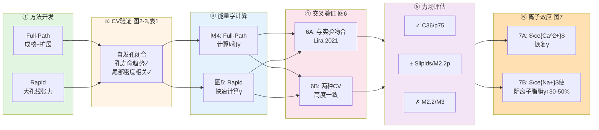

**核心逻辑路线**：

- **阶段1：方法开发** → Full-Path CV（成核+扩展）+ Rapid CV（大孔线张力）
- **阶段2：CV验证** → 自发孔闭合模拟（图2-3，表1）验证CV设计合理性
- **阶段3：能量学计算** → Full-Path获得k和γ（图4）+ Rapid快速获得γ（图5）
- **阶段4：交叉验证** → 两种方法高度一致（图6B）+ 与实验定性吻合（图6A）
- **阶段5：力场筛选** → CHARMM36/prosECCo75最优，Martini 2.2/3失败
- **阶段6：离子效应** → $\ce{Ca^2+}$恢复线张力（图7A）+ $\ce{Na+}$增加阴离子脂膜线张力（图7B）

### 方法体系：双CV策略精准表征膜孔行为

本研究的核心在于开发了两种互补的集体变量来全面描述膜孔的形成和稳定性。

#### Full-Path方法：追踪孔形成的完整路径

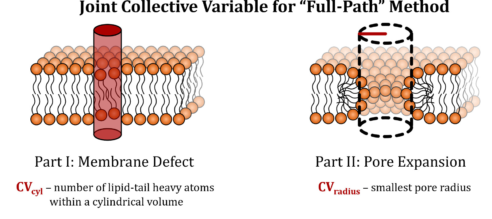

**图1：本工作中引入的集体变量的示意图**

上半部分展示联合Full-Path CV，由分别描述孔成核和孔扩展的两部分组成。孔成核的特征是通过局部圆柱体内脂肪族碳密度的变化建模的缺陷形成。孔扩展的特征是孔中心与周围脂肪族碳之间最小距离的增加。

Full-Path CV通过PLUMED库实现：

**1. 膜缺陷形成部分** $\text{CV}_{\text{cyl}}$

该部分通过追踪圆柱体积内脂质尾部重原子的数量来表征膜缺陷：

$$
\text{CV}_{\text{cyl}} = 1 - d/\text{CV}_{\text{eq}}
$$

其中$d$是圆柱体内的原子数，$\text{CV}_{\text{eq}}$是完整双层膜中的平衡原子数。圆柱半径$R_{\text{cyl}}$设为1.2 nm，沿z轴居中且跨越整个模拟盒子。

**2. 孔扩展部分** $\text{CV}_{\text{radius}}$

该部分定义为孔中心到最近脂质尾部重原子在xy平面的最小距离$r_{\text{min}}$：

$$
\text{CV}_{\text{radius}} = r_{\text{min}}/r_{\text{unit}}
$$

通过除以单位半径$r_{\text{unit}} = 1$ nm实现无量纲化。

**3. 联合CV的切换函数**

两部分通过互补切换函数$s_1$和$s_2$结合：

$$
\text{CV} = \text{CV}_{\text{cyl}} \times s_1(\text{CV}_{\text{radius}}) + \text{CV}_{\text{radius}} \times s_2(\text{CV}_{\text{radius}})
$$

其中：

$$
s_1(\text{CV}_{\text{radius}}) = \frac{1}{1 + e^{\alpha(\text{CV}_{\text{radius}} - \text{CV}_0)}}
$$

$$
s_2(\text{CV}_{\text{radius}}) = \frac{1}{1 + e^{-\alpha(\text{CV}_{\text{radius}} - \text{CV}_0)}}
$$

优化参数为$\alpha = 20$，$\text{CV}_0 = 0.95$，确保在CV < 0.95时主要追踪膜缺陷，在CV > 0.95时主要追踪孔半径。

**（类似）图S2：切换函数$s_1$和$s_2$随集体变量的变化**

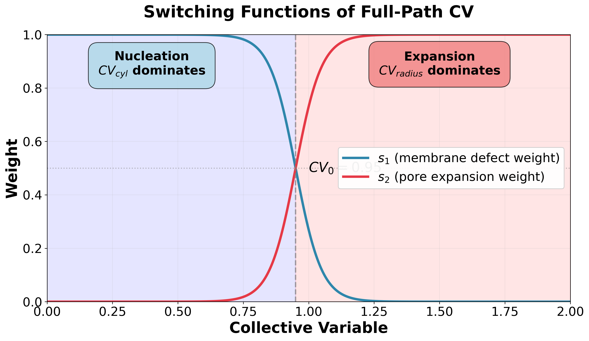

如上图所示，两个切换函数在$\text{CV}_0 = 0.95$处相交，权重各为0.5。$s_1$函数（蓝色曲线）在CV小于0.95时接近1，主导$\text{CV}_{\text{cyl}}$的贡献；而$s_2$函数（红色曲线）在CV大于0.95时接近1，主导$\text{CV}_{\text{radius}}$的贡献。这种设计确保了从成核到扩展阶段的平滑过渡，避免了不连续性导致的数值问题。参数$\alpha = 20$控制了过渡区域的陡峭程度，较大的$\alpha$值使切换更加锐利，确保在任一时刻只有一个CV占主导地位。

#### Rapid方法：快速估算线张力

Rapid方法采用创新的脂质条带构型来模拟"无限大"孔，核心思路如下：

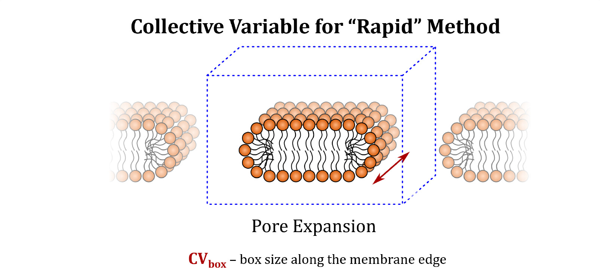

**物理图景**（参见原文Figure 1下半部分，展示使用脂质条带建模"无限"环形孔的Rapid CV。膜边缘长度（孔边缘）的变化通过调整平行于孔的模拟盒子尺寸来控制。）：
- **侧视图**：脂质条纹有两个膜边缘（孔边缘），中间是水相
- **俯视图**：通过PBC，y方向形成环形"无限长"孔
- **关键**：改变$L_x$ 即改变孔边缘总长度

**方法原理**：

1. **脂质条纹模拟无限大的孔**：从平衡的脂质双层出发，沿膜平面的一个轴（如x轴）扩展模拟盒子，x轴边缘的lipid折叠回来使得疏水尾巴朝里，形成一条脂质条纹（形状就像肯德基的红豆派，但无限延伸）。条纹的两个边缘相当于孔边缘（孔rim），通过周期性边界条件连接，模拟无限长的孔边缘。一根长条，就是半径无限大的孔。

2. **物理基础**：线张力$\gamma$是孔边缘单位长度的自由能成本。对于大孔，自由能随孔边缘长度线性增长：$\Delta G = 2 \times L \times \gamma$（其中$L$为孔边缘长度，因子2考虑两个孔边缘）。类比Full-Path方法中圆形孔的$\Delta G = 2\pi r\gamma$，现在我们的有效长度就是$L$，不用管$r$是多少。

3. **$\Delta G$的计算与参考态**：
   - **参考态定义**：理论上的"完整脂质双层"（$L_x \to \infty$，孔边缘长度为0），此时$\Delta G = 0$
   - **实际操作**：参考态**不需要实际模拟**，通过线性外推自动确定（拟合截距）
   - **分子数守恒问题**：改变$L_x$时，NPT系综的$L_y$和$L_z$会**自由涨落**以保持密度，因此分子数$N$不变但体积可变
   - **自由能贡献**：$L_y$/$L_z$的涨落对$\Delta G$的影响非常小（$\sim k_B T$量级），远小于孔边缘的贡献（数十 kJ/mol），因此可忽略（是嘛？）

4. **CV定义**：直接使用沿孔边缘方向的**盒子尺寸**$L_x$作为集体变量。这是一个特殊的CV，因为它不是原子坐标的直接函数，而是通过NPT系综中的**virial应力张量**传递力（详见附录A第4.3节）

#### 模拟技术细节

**伞形采样（Umbrella Sampling）设置**：
- Full-Path方法：力常数$\kappa = 5000$ kJ·mol⁻¹，全原子系统使用65个窗口（CV范围−0.100至2.175），粗粒化系统使用相似设置
- Rapid方法：21个均匀分布的窗口覆盖盒子尺寸6.0至6.6 nm

**自由能分析**：
- 使用加权直方图分析方法（WHAM）从伞形采样模拟中计算自由能剖面
- 全原子模拟使用最后50 ns数据（总200 ns生产运行）
- 粗粒化模拟使用最后250 ns数据（总1 μs生产运行）

**力场测试**：
- 全原子：CHARMM36、prosECCo75、Slipids、Lipid14、Berger
- 粗粒化：Martini 2.2、Martini 3、Martini 2.2 polarizable

### CV开发的实验验证：自发孔闭合模拟

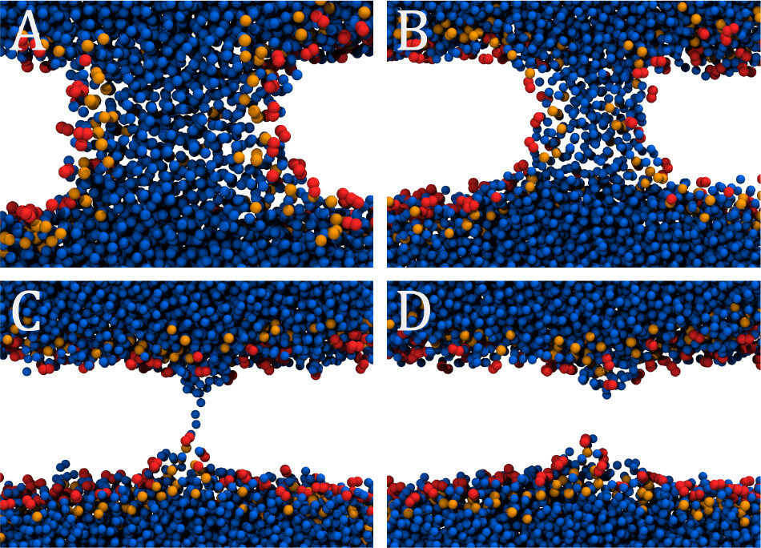

**图3：预平衡膜孔自发闭合过程的快照**

显示了穿过孔的横截面：(A) 平衡孔的初始结构。(B) 孔闭合过程中的快照，整体结构保持但半径正在缩小。(C) 自发孔闭合的最后一帧，显示定义孔的连续水线程。(D) 孔闭合后的脂质双层膜，指示孔（去）成核的早期阶段，伴有局部膜变薄。水珠显示为蓝色，脂质头部基团和羰基分别显示为橙色和红色。为清晰起见，未显示脂质尾部。

为了验证Full-Path CV的设计合理性，研究者首先进行了自发孔闭合模拟。使用四种模型膜（DMPC、DPPC、POPC、DOPC）和多种全原子力场，观察到：

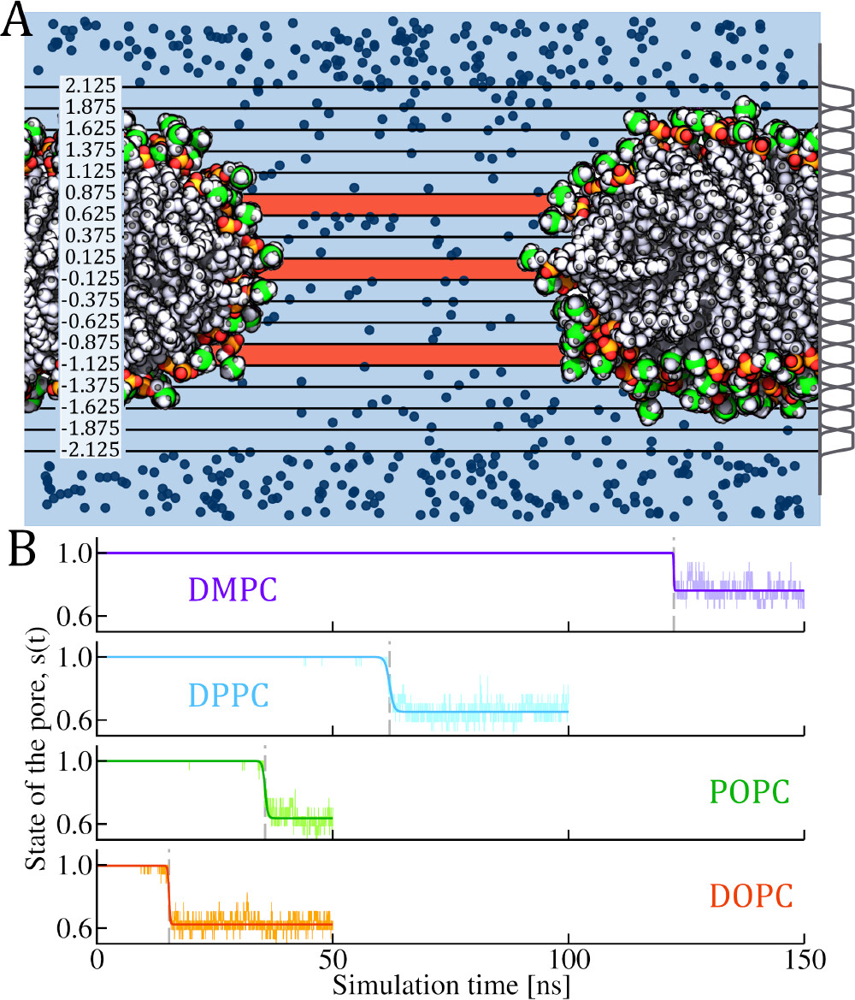

**图2：孔开放的示意图及其状态评估**

**(A) 孔状态定义的可视化示意图**：系统沿膜法线方向（z轴）被分成0.25 nm厚的切片，切片范围从-2.125到+2.125 nm，覆盖整个膜厚度并考虑膜的自然起伏。图中黑色水平线标记各切片边界，左侧数值表示距膜中心的距离（单位：nm）。右侧灰色曲线显示应用于每个切片的高斯权重函数，赋予靠近切片中心的原子更高权重。

**切片着色规则**：
- **蓝色切片**：含有至少一个水分子（$s_i = 1$），表明该深度存在跨膜水通道
- **朱红色切片**：不含水分子（$s_i = 0$），表明该深度被脂质占据
- 背景VMD快照展示了实际开放的膜孔结构：绿色和橙色球体代表脂质头部基团（磷酸和胆碱），红色球体代表羰基，白色球体代表脂质尾部，深蓝色小球表示水分子

**(B) 四种磷脂膜的孔闭合动力学**：展示使用CHARMM36力场模拟的四种模型膜（DMPC、DPPC、POPC、DOPC）的孔状态$s(t)$随时间演变。每个子图显示一个代表性重复实验的结果。浅色曲线为原始模拟数据，深色曲线为双曲正切函数拟合。

**孔状态$s(t)$的计算方法**：

研究定义了孔状态$s(t)$来定量追踪孔闭合过程。具体计算步骤如下：

1. **切片划分**：将膜沿法线方向（z轴）分成$N_S$个切片（本研究为17个），每个切片厚0.25 nm，覆盖范围[-2.125, 2.125] nm，以膜重心为中心

2. **平滑计数**：对每个切片$i$，使用PLUMED中的高斯平滑函数（GAUSSIAN function）计算该切片内的水分子数量$s_i(t)$，该函数赋予靠近切片中心的水分子更高权重

3. **二值化判定**：对每个切片应用Heaviside阶跃函数$\mathcal{H}$进行判定：
   $$\mathcal{H}(s_i(t) - 1) = \begin{cases} 0, & s_i(t) < 1 \text{（切片含水少于1个分子）} \\ 1, & s_i(t) \geq 1 \text{（切片含水至少1个分子）} \end{cases}$$

4. **平均计算**：对所有切片求平均，得到孔状态：
   $$s(t) = \frac{1}{N_S}\sum_{i=1}^{N_S} \mathcal{H}(s_i(t) - 1)$$

**物理意义**：
- $s(t) = 1$：所有17个切片都含水，表示存在完全开放的跨膜孔
- $s(t) = 0$：所有切片都不含水，表示完整无孔的膜
- $0 < s(t) < 1$：部分切片含水，表示孔正在形成或闭合的过渡状态
- **孔寿命$\tau$**：定义为$s(t)$从1下降到0的拐点时刻，即双曲正切拟合函数$s(t) = A_0 - \tanh\left(\frac{t-A_2}{A_1}\right)$中的参数$A_2$
- $s(t)$最终下降到0.6左右，因为膜的外部的一些切片始终有水。$s(t)$时常波动，可能在某个瞬间能上升，但拟合得还行。

从图2B可以看出，浅色曲线为原始模拟数据，深色曲线为拟合结果，浅灰色垂直虚线标记了孔寿命$\tau$（即孔闭合的特征时间）。

**关键观察**：
- **DMPC**（紫色）：孔寿命最长，在约120 ns时闭合
- **DPPC**（青色）：孔在约90 ns时闭合
- **POPC**（绿色）：孔在约30 ns时快速闭合
- **DOPC**（橙色）：孔寿命最短，仅约15 ns

这清晰地展示了**孔寿命趋势**：$\tau_{\text{DMPC}} > \tau_{\text{DPPC}} > \tau_{\text{POPC}} > \tau_{\text{DOPC}}$，表明饱和脂肪酸链越长、饱和度越高的膜，其孔越稳定、闭合越慢。

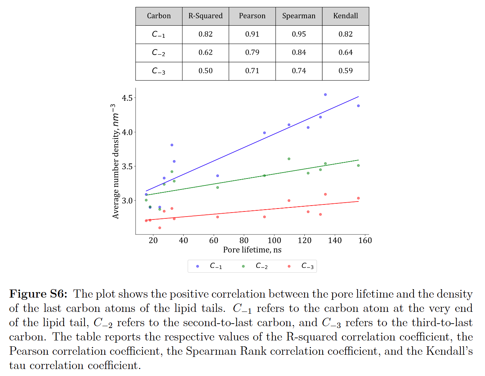

- **脂质尾部末端碳原子密度与孔寿命呈正相关**（图S6显示R² = 0.82），这启发了基于尾部密度的$\text{CV}_{\text{cyl}}$设计
- Full-Path CV在孔寿命处的值紧密分布在0.5以下，表明CV准确捕捉了缺陷到孔的转变（图S7）

**表1：不同力场下的孔寿命** (ns)

注：表中数值为多个重复实验的平均值，括号内为标准误差（standard error）。N/A表示由于测量不足无法计算标准误差。具体重复实验次数见原文Supporting Information Table S1。

| 力场 | DMPC | DPPC | POPC | DOPC |
|------|------|------|------|------|
| CHARMM36 | 122 (N/A) | 94 (40) | 34 (5) | 15 (1) |
| Slipids | 110 (24) | 32 (5) | 27 (4) | 18 (2) |
| Berger | 134 (16) | - | 156 (71) | 131 (43) |

### Full-Path方法的自由能剖面分析

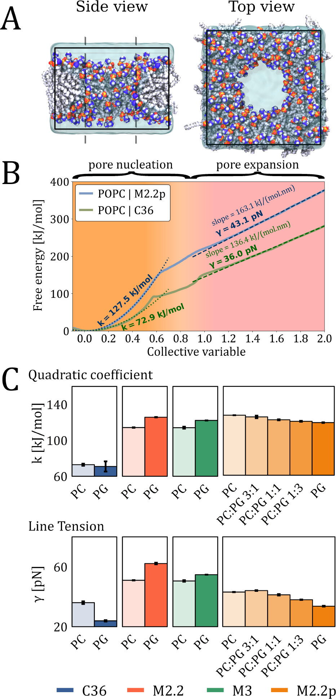

**图4：Full-Path方法的膜孔自由能剖面**

(A) 使用Full-Path方法进行MD模拟的膜孔侧视图和俯视图的代表性快照。碳、磷、氮、氧和氢原子分别显示为浅灰色、橙色、靛蓝色、红色和灰色球体。水显示为半透明青色。侧视图显示穿过孔中间的横截面。(B) 从使用Full-Path CV的伞形采样模拟获得的自由能剖面。实线表示能量剖面，虚线对应孔成核和孔扩展的拟合。拟合的二次系数$k$和线张力$\gamma$显示在自由能剖面旁边。(C) 使用不同力场计算的POPC、POPG和POPC:POPG双层膜的二次系数$k$（上）和线张力$\gamma$（下）的比较。

POPC膜的典型自由能剖面清晰展示了两个不同的区域。

**两阶段拟合结果**：

1. **孔成核阶段** (CV < 0.5)：遵循二次增长规律
   $$
   \Delta G(\text{CV}) = k \cdot \text{CV}^2 + c
   $$
   其中二次系数$k$表征成核能垒

2. **孔扩展阶段** (CV > 1.2)：遵循线性规律
   $$
   G(r) = 2\pi r\gamma
   $$
   其中$r$是孔半径，$\gamma$是线张力。由于$\text{CV}_{\text{radius}} = r/r_{\text{unit}}$且$r_{\text{unit}} = 1$ nm，在数值上CV与$r$（nm）相等，因此斜率直接对应$2\pi\gamma$。

**关键数据**：
- POPC（CHARMM36）：$k = 72.9$ kJ/mol，$\gamma = 32.5$ pN
- POPC（Martini 2.2p）：$k = 73.7$ kJ/mol，$\gamma = 49.2$ pN

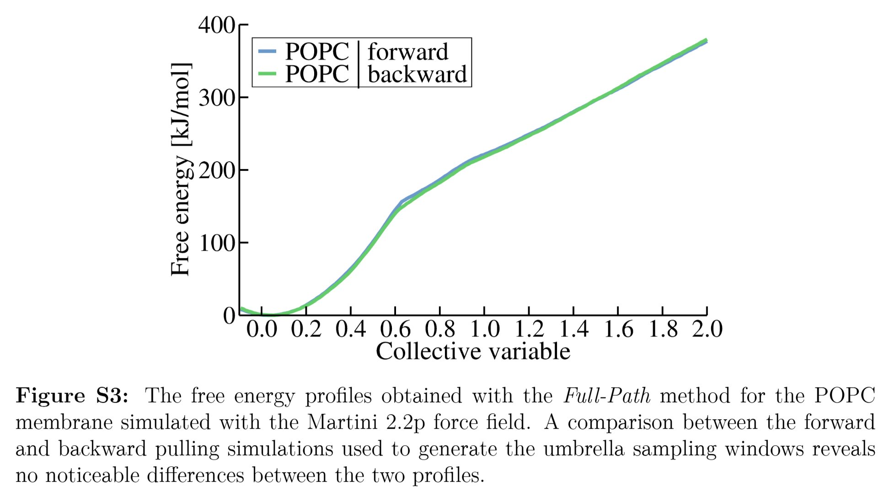

**无滞后验证**：图S3显示正向和反向拉伸生成的自由能剖面完全重合，证实CV设计的可逆性。

### 脂质组成和离子效应的系统研究

研究系统测试了阴离子脂质（POPG、POPS）和两性离子脂质（POPC、POPE）的各种混合物。

**POPC:POPG体系的关键发现**：

1. **CHARMM36和Martini 2.2p力场**：
   - PG含量增加导致$k$和$\gamma$同步降低
   - POPG纯膜：$\gamma \approx 14-33$ pN（取决于力场）
   - POPC纯膜：$\gamma \approx 33-47$ pN

2. **Martini 2.2和Martini 3力场**：
   - 显示相反趋势：POPG的$\gamma$高于POPC
   - 与实验观察不符

**POPE:POPG和POPC:POPS混合体系的拓展测试**（图S9）：

- PE:PG混合系中，PG含量增加同样导致线张力降低（CHARMM36和M2.2p）
- PC:PS混合系显示类似趋势
- **二次系数$k$与线张力$\gamma$呈强正相关**（R² = 0.93，图S10）

### Rapid方法的线张力预测

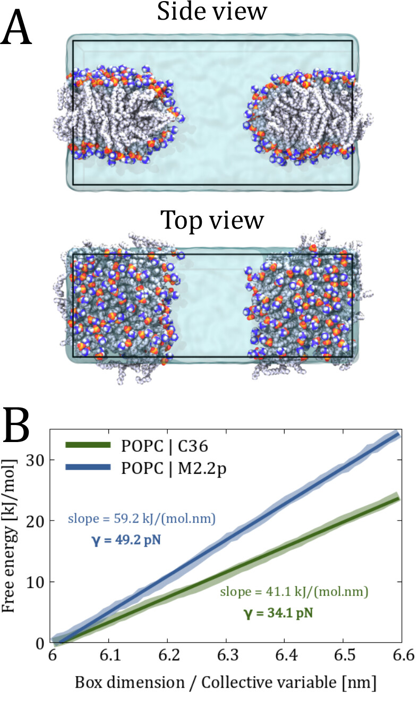

**图5：Rapid方法的系统设置和线张力预测**

(A) 使用Rapid方法进行模拟的系统设置的侧视图和俯视图的代表性快照。碳、磷、氮、氧和氢原子分别显示为浅灰色、橙色、靛蓝色、红色和灰色球体。水显示为半透明青色。(B) 从使用Rapid CV的伞形采样模拟获得的自由能剖面。较粗和较浅的线表示能量剖面，较细和较深的线对应线性拟合。斜率和计算的线张力$\gamma$显示在自由能剖面旁边。使用gmx wham工具中实现的200个bootstrap样本的bootstrap分析计算的误差比自由能剖面更细。

**关键理解**：
- **自由能参考态**：$\Delta G = 0$对应完整脂质双层（无孔边缘暴露）
- **自由能计算**：改变盒子尺寸$L_x$从6.0到6.6 nm，相当于改变孔边缘长度。每个$L_x$值通过伞形采样获得该状态的自由能
- **线性关系**：$\Delta G(L_x) = m \cdot L_x + b$，其中斜率$m = 2\gamma$（因子2来自两个孔边缘）
- **线张力提取**：$\gamma = m / (2 \times N_A)$，其中$N_A = 6.022 \times 10^{23}$ mol⁻¹是单位转换因子（kJ/mol → pN）

Rapid方法显示出优异的线性特征：
- CHARMM36（0.15 m $\ce{NaCl}$）：斜率 = 41.1 kJ/(mol·nm)，$\gamma = 34.1$ pN
- Martini 2.2p（0.15 m $\ce{NaCl}$）：斜率 = 59.2 kJ/(mol·nm)，$\gamma = 49.2$ pN

> **注**：此处使用**质量摩尔浓度** (molality, m) 而非体积摩尔浓度 (molarity, M)。Molality定义为每千克溶剂中的溶质摩尔数 (mol/kg)，不依赖于体积，因此不受温度和压力影响。在MD模拟中，由于盒子尺寸会随NPT系综涨落，使用molality可以避免浓度定义的歧义。对于稀溶液，0.15 m ≈ 0.15 M（差异<1%）。

**计算效率验证**（图S5）：使用每隔一个窗口（共11个）仍能获得几乎相同的线张力值，表明该方法的鲁棒性。

### 两种方法的交叉验证

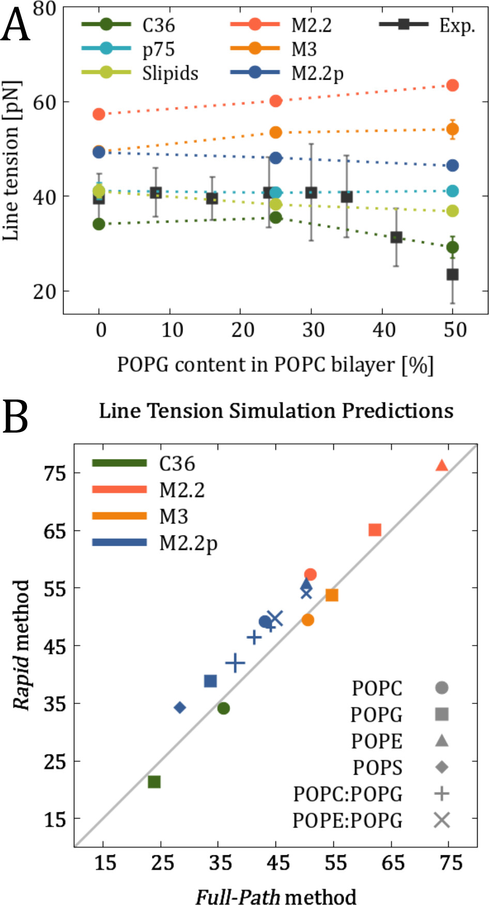

**图6：两种方法的交叉验证与实验对比**

(A) 计算的POPC双层膜中含有不同POPG脂质比例的线张力与参考实验数据的比较。MD数据的估计误差在误差条小于数据符号大小时不可见。(B) Full-Path和Rapid方法的线张力预测比较。对于混合物，较大的标记尺寸表示脂质双层膜/条带中POPG脂质的比例较高。为清晰起见，误差条小于标记，因此未显示。

对POPC、POPG、POPE、POPS及其混合物的系统比较显示：
- 两种方法的预测值高度相关
- CHARMM36：Rapid方法略低（平均偏差~2 pN）
- Martini 2.2/2.2p：Rapid方法略高（平均偏差~3-5 pN）
- 这些微小差异可能源于离子浓度定义（0.15 m vs 0.15 M）和孔几何差异

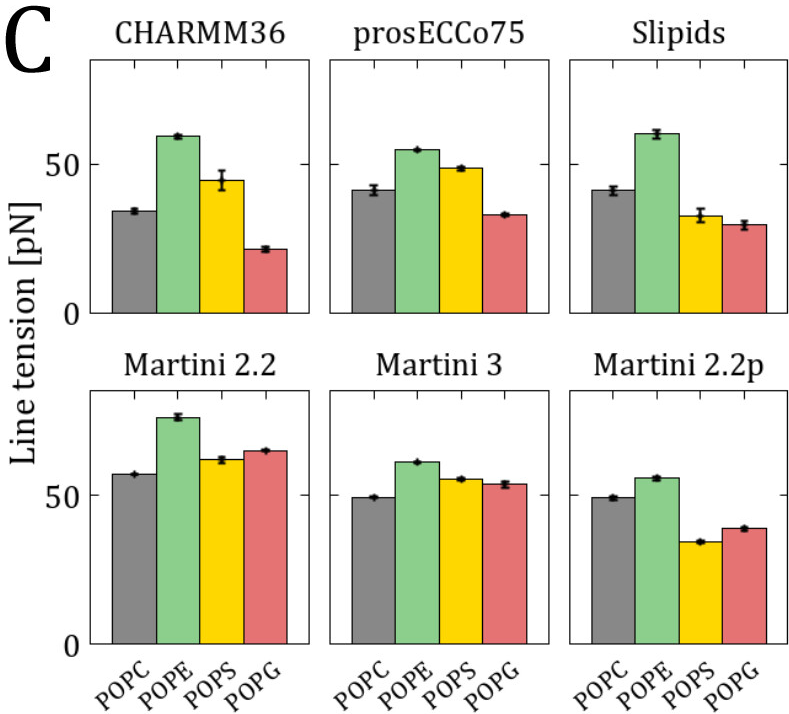

**图5C：六种力场对四种纯脂质的线张力预测**

排序趋势：
- **CHARMM36和prosECCo75**：POPE > POPS > POPC > POPG ✓（符合实验）
- **Slipids**：POPE > POPC > POPS > POPG（POPC/POPS顺序错误）
- **Martini 2.2和M3**：POPE > POPC > POPG > POPS（PG/PS顺序错误）
- **Martini 2.2p**：POPE > POPC > POPG > POPS（PG位置错误）

### 离子效应的深入分析

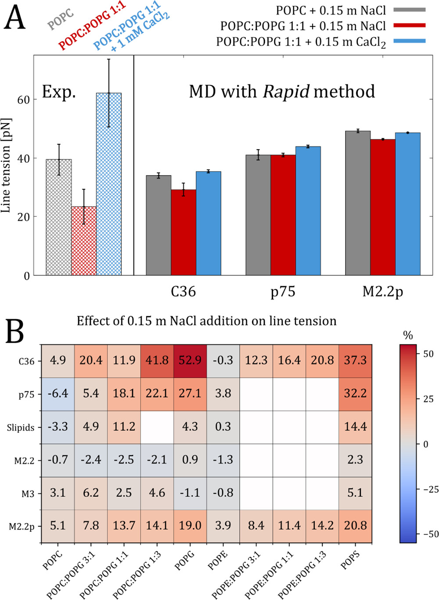

**图7：离子对膜线张力的影响**

(A) 将50 mol % POPG脂质掺入POPC双层膜后线张力的变化，以及随后添加$\ce{CaCl2}$的影响。显示了来自参考文献的实验数据以供比较。(B) 0.15 m $\ce{NaCl}$对使用不同力场的各种脂质组成的线张力的影响。

实验（Lira et al., 2021）显示添加$\ce{CaCl2}$可使线张力恢复甚至超过纯POPC水平。模拟验证：

  实验方法：GUV电穿孔法

  测量原理：
  1. 样品制备：巨单层囊泡（Giant Unilamellar Vesicles, GUVs）
  2. 孔诱导：对GUV施加电场诱导膜孔形成
  3. 张力控制：用玻璃微吸管对GUV施加控制张力
  4. 动力学观测：显微镜实时记录孔的形成、扩展和闭合过程
  5. 线张力提取：从孔动力学数据反推线张力 γ

| 体系 | 实验 | C36 | p75 | M2.2p |
|------|------|-----|-----|-------|
| POPC + $\ce{NaCl}$ | ~40 pN | 34.1 | 41.1 | 49.2 |
| PC:PG 1:1 + $\ce{NaCl}$ | ~20 pN | 29.2 | 41.1 | 46.4 |
| PC:PG 1:1 + $\ce{CaCl2}$ | ~60 pN | 35.5 | 43.9 | 48.6 |

#### 图7A的定量符合性分析

**CHARMM36的表现**：
- **趋势正确**：添加PG降低线张力（40 → 29 pN），添加$\ce{Ca^2+}$恢复线张力（29 → 35.5 pN）
- **定量偏差**：$\ce{Ca^2+}$效应的幅度明显小于实验（实验增幅~40 pN，模拟仅~6 pN）
- **可能原因**：
  1. **离子参数化局限**：CHARMM36的$\ce{Ca^2+}$参数可能低估了与PG头部的特异性结合强度
  2. **实验体系差异**：GUV电穿孔实验中的膜张力、孔大小分布与MD模拟的平衡条件不同
  3. **时间尺度问题**：MD模拟的纳秒尺度可能未完全捕捉离子诱导的膜重组
  4. **浓度效应**：实验中的离子浓度梯度和局部积累效应在均匀溶液MD中被平均化

**prosECCo75和Martini 2.2p的问题**：
- prosECCo75：对$\ce{Ca^2+}$几乎不敏感（41.1 → 43.9 pN，仅增3 pN）
- Martini 2.2p：完全错误的趋势（PG含量增加反而提高线张力）

#### 图7B的结果解读

**重要说明**：图7B显示的是添加0.15 m $\ce{NaCl}$**相对于无盐体系**的线张力**差值**（$\Delta\gamma = \gamma_{\text{+salt}} - \gamma_{\text{no salt}}$）。

**预期结果**：
- **阴离子脂质** (PG、PS)：$\Delta\gamma > 0$（离子筛选静电斥力，增加线张力）
- **中性脂质** (PC、PE)：$\Delta\gamma \approx 0$（离子效应较小）

**实际表现**：
- **CHARMM36**（✓）：阴离子脂质显示正值（30-50%增幅），中性脂质接近零
- **prosECCo75**（部分✓）：趋势正确但幅度偏小
- **Martini 2.2p**（部分✓）：增幅仅10-20%，低估离子效应
- **Slipids、M2.2、M3**（✗）：无一致趋势，完全失败

**物理机制洞察**：
- $\ce{Na+}$与阴离子脂质头部结合 → 屏蔽头部间静电斥力 → 降低孔边缘的几何约束 → 增加暴露疏水表面的能量代价 → **线张力增加**
- 只有准确描述离子-脂质相互作用的力场（C36、p75）才能捕捉这一微妙效应

添加0.15 m $\ce{NaCl}$导致线张力增加：
- CHARMM36：阴离子脂质膜增加30-50%
- prosECCo75：阴离子脂质膜增加20-40%
- Martini 2.2p：增加10-20%
- **Slipids、Martini 2.2和M3**：无一致效应

### 脂质头部基团差异的揭示

**PE vs PC vs PS脂质的线张力排序**：

所有力场一致显示PE具有最高线张力（~50-60 pN），这与其较小的头部基团和更强的氢键网络相关。PS的表现取决于力场：
- CHARMM36/prosECCo75：PS介于PC和PG之间
- Slipids/M2.2p：PS显著低于PC（可能源于与离子相互作用的描述问题）

## Q&A

- **Q1**：为什么Full-Path CV选择追踪脂质尾部而非传统的极性原子？
- **A1**：通过自发孔闭合模拟观察到，**脂质尾部末端碳原子密度与孔寿命呈显著正相关**（R² = 0.82），这表明尾部原子的重排是膜缺陷形成的关键驱动因素。相比之下，传统关注水分子和磷脂头部的CV在描述成核早期阶段时存在模糊性。此外，基于尾部密度的CV在全原子和粗粒化模型中都适用，具有更广泛的通用性。

- **Q2**：Rapid方法相比Full-Path方法有哪些优势和局限？
- **A2**：
  - **优势**：① 计算效率极高，即使在全原子水平也仅需21个窗口×150 ns = 3.15 μs总模拟时间；② 直接模拟大孔极限，避免了成核能垒；③ 线性自由能剖面使线张力提取简单直接；④ 可使用更少窗口（如每隔一个）仍保持准确性。
  - **局限**：① 无法捕捉孔成核过程和能垒；② 不适用于研究小孔行为；③ 需要确保条带宽度足够（本研究使用8.5 nm）以避免PBC artifacts；④ 孔边缘间距需≥2 nm以防止相互作用。

- **Q3**：为什么不同力场对阴离子脂质的线张力预测差异如此显著？
- **A3**：差异主要源于力场对**脂质头部-离子相互作用**的描述精度不同：
  1. **CHARMM36和prosECCo75**：基于NMR数据精细调参，准确描述了$\ce{Na+}$/$\ce{Ca^2+}$与PG/PS头部的结合，因此正确预测离子筛选效应降低静电斥力导致的线张力下降。
  2. **Slipids**：头部基团参数已知与NMR数据存在偏差，导致PS的离子相互作用过强，使PS线张力异常低。
  3. **Martini家族**：粗粒化本质上简化了静电相互作用细节，Martini 2.2/M3未能正确捕捉PC vs PG的相对稳定性，而**Martini 2.2p通过极化水模型部分改善了这一问题**。

- **Q4**：为什么二次系数$k$与线张力$\gamma$存在相关性？
- **A4**：这种相关性揭示了**膜缺陷形成和孔扩展在热力学上的内在联系**。两者都依赖于膜的基本物理性质，如弯曲刚性、厚度和脂质间相互作用强度。具体而言：① 更高的$k$值意味着形成初始缺陷需要更多能量，通常对应于更稳定、更紧密堆积的膜；② 这种膜在形成孔边缘时也需要更大的能量代价（即更高的$\gamma$）来暴露疏水尾部与水接触。然而，相关性并非完美（R² = 0.93），表明成核和扩展过程仍有一定独立性。

---

> **更多技术细节和深入问题解析**，请参阅：
> - [附录A：CV设计原理与PLUMED实现的技术细节](/pages/Specific%20Sytems/Membrane/2025-10-19-membrane-pore-appendix-a-technical)

## 关键结论与批判性总结

### 潜在影响

- **方法学进步**：提供了首个同时准确描述膜孔成核和扩展、无滞后且开源实现的集体变量，为膜孔研究建立新标准
- **力场验证基准**：系统比较揭示CHARMM36和prosECCo75在膜孔能量学预测中的优越性，为力场选择提供重要参考
- **药物递送设计**：快速准确的线张力预测可指导纳米载体和穿膜肽的理性设计
- **抗菌剂开发**：揭示离子和脂质组成对膜稳定性的影响机制，有助于开发靶向细菌膜组成的抗菌策略
- **膜生物物理研究**：成核系数与线张力的相关性为理解膜力学性质提供新视角

### 局限性

- **时间尺度限制**：尽管使用增强采样，全原子模拟仍难以达到自发孔形成的毫秒时间尺度，需依赖伞形采样的可逆性假设
- **力场依赖性**：结果对力场选择高度敏感，尤其是阴离子脂质体系，限制了定量预测的绝对精度
- **几何简化**：Rapid方法假设平面膜边缘，无法考虑囊泡曲率等几何因素对线张力的影响
- **缺乏不对称膜测试**：所有模拟使用对称双层膜，而真实细胞膜普遍存在脂质不对称性
- **有限的脂质类型**：主要测试了PC、PE、PG、PS头部基团，未涵盖鞘磷脂、糖脂等生物膜重要成分

### 未来研究方向

- **拓展至不对称膜**：开发能处理跨膜脂质组成差异的CV变体
- **曲率效应**：结合囊泡模拟评估膜曲率对孔形成能量学的影响
- **温度依赖性**：系统研究不同温度下的相态转变对孔形成的影响
- **复杂脂质混合物**：测试含胆固醇、鞘磷脂等的生理相关膜组成
- **机器学习增强**：结合神经网络势函数进一步加速大规模筛选
- **与实验直接对比**：开展定量对比研究，如与荧光法测量的孔大小分布或AFM测量的线张力进行直接比较
