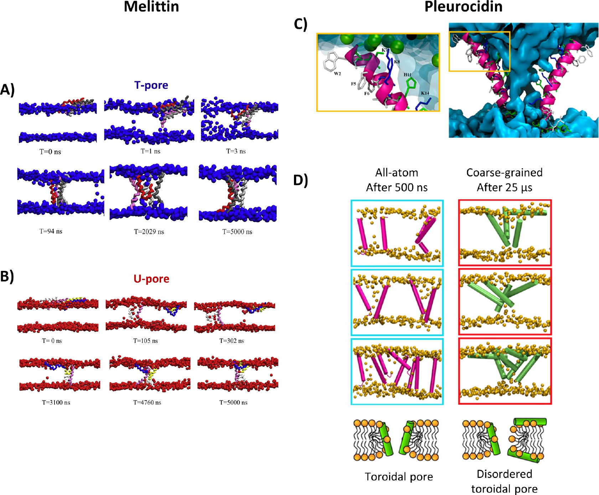
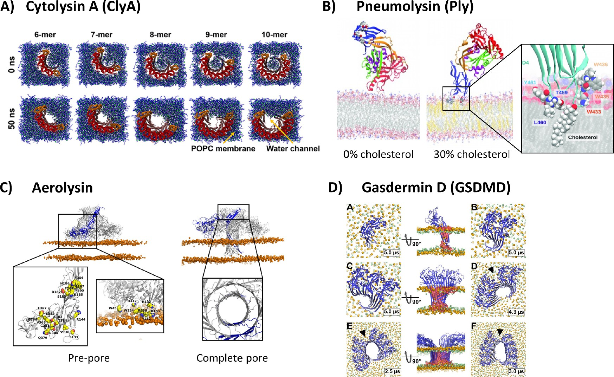

# 【综述】膜通透化的分子动力学模拟（下篇）：案例研究与机制解析

> **系列说明**：本文是膜通透化MD模拟综述的**下篇**，聚焦**代表性案例**，用具体体系解释AMPs与PFTs的成孔机制与关键分子细节。**上篇**侧重方法与机制分类。

## 本文信息

- **标题**：膜通透化的分子动力学模拟（下篇）：案例研究与机制解析
- **作者**：Sofia Cresca，Jure Borišek，Alessandra Magistrato，Igor Križaj
- **发表时间**：2026年2月9日
- **单位**：Consiglio Nazionale delle Ricerche（CNR）-IOM，意大利；International School for Advanced Studies（SISSA/ISAS），意大利；Jožef Stefan Institute，斯洛文尼亚；National Institute of Chemistry，斯洛文尼亚；University of Ljubljana，斯洛文尼亚
- **引用格式**：Cresca, S., Borišek, J., Magistrato, A., & Križaj, I.（2026）。Current Status of Molecular Dynamics Simulations of Membrane Permeabilization by Antimicrobial Peptides and Pore-Forming Proteins: A Review。*Journal of Chemical Information and Modeling*, *66*（6），1982-2005。https://doi.org/10.1021/acs.jcim.5c02731

本文以案例为主线，突出**不同分子在膜上形成孔道的具体路径**，并对比**多尺度MD如何揭示关键分子细节**。

### 抗菌肽（AMPs）案例

- Melittin：T孔与U孔的双重通道
- Pleurocidin：低溶血与环形孔机制
- Maculatin 1.1：无序聚集形成水通道
- Aurein 1.2：糖脂含量调控孔道寿命

### 成孔蛋白/毒素（PFTs）案例

- Cytolysin A（ClyA）：弧形寡聚体与脂质位移
- Pneumolysin（Ply）：胆固醇依赖成孔
- Aerolysin：前孔到孔道的构象转变
- Gasdermin D（GSDMD）：焦亡孔道与阴离子脂质稳定

## 抗菌肽的案例研究

这些案例显示，AMPs的膜通透化**高度依赖肽构象与脂质环境**，而MD模拟提供了**可直接观察的构象与相互作用细节**。

### Melittin：T孔与U孔的双重通道

Melittin是26个残基的经典模型肽。CG与AA模拟一致表明，Melittin聚集后会出现**以T肽或U肽为主导的两类孔道构象**，对应不同结构与通透性。

两类孔道的差别，核心在于**疏水与极性残基的分离方式**。T孔的疏水与亲水面分离更清晰，因此更稳定、孔径更大、通透性更高，这也是T孔在自由能上占优的关键原因。

#### T孔与U孔的对比

| 对比要点 | T孔 | U孔 |
|---|---|---|
| 主导构象 | 跨膜T肽为主 | U形肽为主 |
| 结构与能量 | 自由能更低、孔径更大、通透性更高 | 自由能更高、孔径更小、通透性更低 |

AA模拟进一步表明，成孔过程**强烈依赖初始肽构型与膜组成**，其中**K7的锚定效应是关键开关**。K7A与K7Q突变会削弱锚定，从而促进成孔并改变选择性。

在革兰氏阴性菌外膜模型中，Melittin的**C端锚定在KLA头基区域**，其N端与磷酸基接触。KLA是脂多糖（LPS，lipopolysaccharide）的重要成分，这会改变外膜通透性但不扰动双层整体结构。

这类外膜结果提示，Melittin更多表现为**通透性调节**而非整体破坏，这也是它在不同膜环境下表现差异明显的重要原因。

补充一点，从外膜到内膜的差异中可以看到**锚定位置改变了进入界面**的路径，这也解释了同一肽在不同膜体系中的"表型落差"。

### Pleurocidin：低溶血活性的分子基础

Pleurocidin具有**低溶血活性与高抗菌活性并存**的特征。多尺度模拟显示，**初始孔道可由2个肽触发**，而稳定孔道需要多个肽进一步组装。

在孔道形成过程中，Pleurocidin的**亲水面构成水通道**，而**阳离子残基会拉入脂质头基**，提示其主要形成环形或无序环形孔。

AA与CG终态都指向**环形或无序环形孔**，水外排快照中还能清楚看到极性与非极性侧链的分工，这让该机制更容易与图5的子图对应起来。

另一个值得记住的点是，Pleurocidin的**低溶血表型**并不妨碍其在原核膜上形成稳定孔道，这种“强抗菌、弱溶血”的对照在案例中非常清晰。

#### 可以这样记

- **初始孔道由少量肽触发**，但稳定孔需要更高聚集程度。
- **阳离子残基驱动脂质头基进入孔道**，形成典型的环形孔结构。
- **亲水与疏水面的空间分离**决定了水通道的连续性。
- **AA与CG结果方向一致**，说明该体系的多尺度解释具有稳定性。
- **水外排快照提供直观证据**，极性残基的指向性很明显。
- **低溶血与高抗菌并存**，提示膜选择性来自孔道结构差异。

### Melittin与Pleurocidin的机制对比

| 对比维度 | Melittin | Pleurocidin |
|---------|----------|-------------|
| **孔道类型** | T孔（跨膜肽）与U孔（U形肽）两类构象 | 环形孔或无序环形孔 |
| **孔道内壁构成** | T孔更偏肽本身，U孔更依赖脂质参与 | 亲水面构成水通道，阳离子残基拉入脂质头基 |
| **关键残基** | K7锚定效应是成孔开关 | 亲水面朝向孔腔 |
| **初始成孔** | 需要一定数量肽聚集 | 2个肽即可触发初始孔道 |
| **稳定性决定因素** | 自由能与孔径联动；疏水/亲水分离方式 | 亲水与疏水面的空间分离 |
| **膜选择性** | KLA锚定强调外膜特异性 | 低溶血与高抗菌并存 |
| **模拟验证** | AA与CG揭示不同构象路径 | AA与CG终态指向环形孔 |

**图5：不同AMPs的作用机制**。
- 子图A：Melittin在CG模拟中形成T孔的过程快照，展示跨膜孔道的逐步稳定化。
- 子图B：Melittin在CG模拟中形成U孔的过程快照，呈现U形构象主导的孔道。
- 子图C：Pleurocidin水外排快照，极性与非极性残基以不同颜色标示，侧链朝向水通道。
- 子图D：Pleurocidin的AA与CG终态对比，左列为AA 500 ns的紫色肽，右列为CG 25 μs的绿色肽，显示其形成环形或无序环形孔的倾向。

### Maculatin 1.1：无序聚集形成水通道

Maculatin 1.1的CG模拟表明，肽分子会**自发聚集并以无序跨膜簇插入DPPC双层**。AA模拟进一步显示，水通过聚集体内部的**动态狭窄通道**渗透。

定量分析给出的关键结论是：**至少需要6条肽**才能形成显著水通量。该通量主要由**Lys8、His12、Glu19与His20**等极性与带电残基提供亲水路径。

这一案例强调，**无序聚集并不等于无效**，相反它可以在缺乏规则桶状结构的情况下维持持续导水。多尺度模拟把**无序簇**与**可持续导水**直接联系起来，是该案例最有记忆点的地方。

### Aurein 1.2：糖脂含量调控孔道寿命

Aurein 1.2的CG模拟使用MARTINI并引入**极化水模型（PW）**。研究在POPG/POPE混合膜中系统改变单半乳糖甘油酯（MG，monogalactosylglycerol）含量，发现**孔道寿命与糖脂含量呈显著负相关**。

具体而言，研究将MG含量**从0%增加至96%**，定量数据显示：
- 在**无糖脂膜**中，孔道持续超过**22 μs**
- 在**96% MG膜**中，孔道仅持续约**0.3 μs**
- 孔道寿命缩短**超过70倍**

当糖脂比例升高时，**负电荷密度与氢键网络被削弱**，从而显著降低孔道寿命，提示膜组成是调控AMP通透化的重要变量。这一结果提醒读者，**膜成分梯度本身就是调控变量**，并不需要改变肽序列也能显著改变成孔行为。

#### 可以这样记

- **膜糖脂含量是强调控因子**，可显著缩短孔道寿命。
- **电荷与氢键网络是关键介质**，其削弱会削减孔道稳定性。
- **膜组成变化可改变AMP活性谱**，为选择性设计提供思路。
- **MG梯度提供了清晰因果链**，便于建立膜成分与孔道寿命的对应关系。
- **负电荷下降是直接原因之一**，也解释了高糖脂膜上的孔道短暂性。
- **实验可操作性强**，该结论适合用于设计对照膜体系。

#### 观察要点

- **MG含量被系统扫描**，因此因果关系更明确。
- **孔道寿命随糖脂升高而缩短**，趋势稳定且方向单一。
- **POPG/POPE是主背景膜**，可与其他AMP体系直接对照。
- **高糖脂削弱负电荷与氢键**，这是孔道不稳定的核心原因。
- **案例强调膜侧调控**，而不是通过肽突变来改写行为。

### AMPs案例研究的关键模拟信息（对应PDF Table 2）

| AMP | 方法 | 力场 | 关键发现 |
|---|---|---|---|
| Melittin | CG-MD | MARTINI v2.2 | 聚集形成跨膜T肽与U肽孔道 |
| Melittin | AA-MD | CHARMM36m | T孔自由能更低、孔径更大、通透性更高 |
| Melittin | AA-MD | CHARMM36m | 成孔依赖初始构型与膜组成；K7锚定，K7A与K7Q削弱锚定并促进成孔 |
| Melittin | AA-MD | CHARMM36m | C端锚定KLA头基；N端接触磷酸基，影响外膜通透性但不扰动双层 |
| Pleurocidin | AA-MD + CG-MD | CHARMM36m；MARTINI | 2条肽可触发初始孔；多肽组装形成稳定孔；亲水面构成水通道，阳离子残基拉入头基，提示环形孔 |
| Maculatin 1.1 | AA-MD + CG-MD | GROMOS96；MARTINI | 自发聚集为无序跨膜簇；水通过动态通道渗透；至少6条肽产生显著水通量 |
| Aurein 1.2 | CG-MD | MARTINI（极化水模型） | 孔道寿命与糖脂含量负相关，高糖脂削弱负电荷与氢键网络，从而缩短寿命 |

#### 读表提示

- **Melittin出现多次**，体现其在AMP研究中的模型地位，同时揭示不同力场与尺度下结果的一致性。
- **自由能与孔道形态成对出现**，T孔的稳定性与更高通透性相互印证。
- **关键残基信息具有可迁移性**，K7锚定效应与KLA相互作用可直接用于突变与设计。
- **Pleurocidin强调少量肽即可触发成孔**，但稳定孔需要多肽组装，提示协同机制。
- **Maculatin 1.1与Aurein 1.2突出膜组成作用**，显示脂质环境可显著调控孔道寿命与水通量。

### AMPs关键词速查

| AMP | 机制关键词 | 关键分子或结构 | 脂质依赖 |
|---|---|---|---|
| Melittin | T孔与U孔分流 | K7锚定、KLA头基 | 外膜LPS显著影响 |
| Pleurocidin | 环形与无序环形孔 | 亲水面朝孔腔 | 头基拉入驱动 |
| Maculatin 1.1 | 无序聚集导水 | Lys8/His12/Glu19/His20 | DPPC为主要模型 |
| Aurein 1.2 | 糖脂调控寿命 | MG含量梯度 | 糖脂升高缩短寿命 |

#### 读表提示

- **关键词用于快速定位机制**，便于在多个案例间做横向对照。
- **关键分子或结构是最小解释单元**，适合直接映射到突变或膜成分设计。
- **脂质依赖提醒环境敏感性**，避免将结果误读为“序列决定一切”。

---

## 成孔蛋白/毒素的案例研究

PFTs的成孔过程涉及更复杂的寡聚化与构象重排，MD模拟揭示了**从单体到环状孔道的关键分子步骤**。

### PFTs案例对比总览

| 对比维度 | Cytolysin A (ClyA) | Pneumolysin (Ply) | Aerolysin | Gasdermin D (GSDMD) |
|---------|-------------------|------------------|-----------|-------------------|
| **毒素类型** | α-PFT | β-PFT（胆固醇依赖性溶素） | β-PFT | 真核成孔蛋白（焦亡效应蛋白） |
| **关键结构特征** | 弧形寡聚体（6-10聚体） | D1-D4四个结构域 | 膜结合域+成孔域，双同心β桶 | 直径10-14 nm环状孔道（24-33亚基） |
| **膜结合机制** | 单体即可形成稳定跨膜水通道 | 胆固醇是必要受体与稳定因子 | DBB与stem loop驱动前孔形成 | 前孔组装对阴离子脂质高度敏感 |
| **关键结构域/残基** | N端螺旋CRAC基序、β舌 | D4结构域、十一肽、L1-L3环 | Y221构象开关、DBB区域 | PI(4,5)P2与PS稳定前孔 |
| **成孔过程** | 脂质快速位移（约50 ns） | β发夹插入→β桶→脂质斑块囊泡化 | 活塞式高幅度运动驱动插入 | 较小寡聚体形成稳定含水孔道 |
| **脂质依赖性** | 胆固醇增强成孔（双通道效应） | 胆固醇决定结合稳定性 | 膜触发活塞式运动 | 阴离子脂质（PI、PS、心磷脂） |
| **中间体** | 弧形寡聚体是稳定功能中间体 | 部分插入弯曲膜，42聚体环是结构节点 | 前孔态（双同心β桶） | 前孔组装态 |
| **孔道特征** | 单体即可导水；脂质重排成环形构型 | 外疏水、内亲水β桶 | 膜触发跨膜桶插入 | 环状孔道，直径10-14 nm |

### Cytolysin A：弧形寡聚体与脂质位移

ClyA是典型的α-PFT。AA模拟显示，**单个原聚体即可形成稳定的跨膜水通道**。此外，基于晶体结构构建的6到10聚体弧形寡聚体是**稳定的功能中间体**，并在约50 ns内驱动脂质位移，形成可导水的膜孔。

弧形寡聚体内部原先困住的脂质会被迅速排出，开放边缘的脂质再排列成**环形构型**，从而把弧形中间体转化为可持续导水的孔道。

胆固醇通过两条路径增强ClyA成孔：**一是稳定原聚体的膜结合构象**，二是在β-舌（β-tongue，即β-发夹）之间形成桥接相互作用从而促进寡聚化，整体上偏向成孔构象。

更细的描述是，胆固醇既能与N端螺旋上的**CRAC基序**（cholesterol recognition/interaction amino acid consensus，胆固醇识别/相互作用氨基酸共有基序）相互作用，也能在相邻β-舌之间形成桥接，帮助寡聚体向成孔构象偏转。

这些细节合起来指向一个清晰图景：ClyA的成孔过程既依赖**中间体稳定性**，也依赖胆固醇对寡聚化路径的"推一把"。

### Pneumolysin：胆固醇依赖成孔

Ply是典型的胆固醇依赖性溶素。AA模拟显示，D4结构域中的富Trp的十一肽以及L1至L3环**负责膜表面锚定**，且只有在胆固醇存在时，Ply才能稳定结合膜。

Ply单体由D1至D4**四个结构域**构成，其中两个螺旋束（HB1与HB2）会在成孔过程中重排为β-发夹，最终组装成β-桶，这一结构变化与胆固醇依赖的膜结合行为高度耦合。

成孔阶段的β发夹插入后会形成**外疏水、内亲水的β桶**，内壁水化驱动脂质重新排列并打开膜边缘。CG模拟进一步表明，完整的42聚体环会包裹脂质斑块，使其脱离并囊泡化，从而形成开放孔道。

这一过程中，胆固醇与十一肽及L1环发生短暂相互作用，帮助Ply**维持正确取向**，随后β桶形成并触发脂质斑块的囊泡化，是孔道真正打开的关键步骤。

### Aerolysin：前孔到孔道的构象转变

Aerolysin家族的单体包含膜结合域与成孔域，可组装成双同心β-桶（concentric double β-barrel，DBB）前孔。AA模拟显示，**DBB与茎环（stem loop）的运动驱动前孔形成**，而**Tyr221对二级结构重排至关重要**。

Y221G突变体可寡聚但停留在前孔态，这一现象从侧面说明**Y221是构象开关**，也是前孔到孔道转变的核心障碍之一。

当蛋白置于膜中时，会出现**活塞式高幅度运动**，该运动由膜触发并推动跨膜桶的插入，从而完成从前孔到孔道的转变。

### Gasdermin D：焦亡孔道与阴离子脂质稳定

GSDMD是细胞焦亡的关键效应蛋白。AA模拟表明，**较小的GSDMD寡聚体也能形成稳定含水孔道**。

其孔道稳定性依赖阴离子脂质，**前孔组装对阴离子脂质高度敏感**，其中磷脂酰肌醇-4,5-二磷酸（PI(4,5)P2，phosphatidylinositol-4,5-bisphosphate）与磷脂酰丝氨酸（PS，phosphatidylserine）可稳定前孔。PI(4,5)P2还能作为分子双面胶，桥接并稳定相邻亚基界面。

此外，Gasdermin家族总体上偏好富含磷脂酰肌醇与心磷脂的膜，并形成直径约10-14 nm的**环状孔道**，孔道由24至33个亚基构成，这为焦亡过程中分子释放提供结构基础。

这些特征说明，GSDMD的孔道在结构上属于**高亚基数的大孔道**，而其稳定性更依赖脂质环境而非单一蛋白构象。

**图6：不同PFTs的作用机制**。
- 子图A：ClyA弧形寡聚体在1-棕榈酰基-2-油酰基-sn-甘油-3-磷酸胆碱（POPC，phosphatidylcholine）膜中的快照，红色蛋白与蓝色脂质显示0 ns与50 ns内脂质位移并形成水通道。
- 子图B：Ply在无胆固醇与有胆固醇条件下的膜结合对比，插图显示与胆固醇相互作用的残基区域。
- 子图C：Aerolysin前孔与完整孔道的对比，关键残基以高亮方式标示。
- 子图D：GSDMD从单体到十聚体的寡聚化序列，展示孔道逐步形成的结构轨迹。

#### 读图时可以留意

- **ClyA弧形结构可直接产生导水通道**，并伴随脂质位移，这是其功能性中间体的关键证据。
- **Ply是否存在胆固醇决定结合稳定性**，对比图清晰展示膜结合差异与关键残基作用。
- **Aerolysin前孔与完整孔道的几何差异明显**，提示前孔到孔道的构象重排幅度很大。
- **GSDMD序列图强调寡聚化路径**，单体到十聚体的过程展示孔道逐步完成的结构基础。

### PFTs案例研究的关键模拟信息

| PFT | 方法 | 力场 | 关键发现 |
|---|---|---|---|
| ClyA | AA-MD；CG-MD（含牵引MD与PMF） | AMBER99SB-ILDN；Slipids；MARTINI（ElNeDyn，极化水模型） | 单个原聚体形成稳定水通道；弧形寡聚体为稳定中间体并快速形成跨膜通道 |
| ClyA | AA-MD | AMBER99SB-ILDN；Slipids | 胆固醇稳定原聚体构象并促进寡聚化，偏向成孔构象 |
| Ply | AA-MD + CG-MD（ElNeDyn） | CHARMM36m；MARTINI v2.2 | 胆固醇稳定Ply结合；β发夹插入后42聚体环可包裹并囊泡化脂质斑块以形成孔道 |
| Aerolysin | AA-MD | AMBER99SB | DBB与stem loop驱动前孔形成；Y221决定重排；膜触发活塞式运动推动插入 |
| GSDMD | AA-MD | CHARMM36m | 小寡聚体形成稳定含水孔；PI（4,5）P2与PS稳定前孔组装 |

#### 读表提示

- **ClyA强调弧形中间体的功能性**，并展示AA与CG结合的分析路径。
- **Ply突出胆固醇依赖性**，其成孔路径与膜组成强耦合。
- **Aerolysin展示大幅度构象重排**，体现前孔到孔道的能垒特征。
- **GSDMD体现阴离子脂质稳定效应**，并指向焦亡孔道形成的膜选择性。

### PFTs关键词速查

| PFT | 机制关键词 | 关键分子或结构 | 脂质依赖 |
|---|---|---|---|
| ClyA | 弧形中间体导水 | CRAC基序、β舌桥接 | 胆固醇促进寡聚化 |
| Ply | 囊泡化开孔 | 十一肽与L1-L3环 | 胆固醇是必要因子 |
| Aerolysin | 前孔重排插入 | DBB与stem loop | 膜触发活塞运动 |
| GSDMD | 阴离子脂质稳定 | PI（4,5）P2桥接 | PS与PI协同稳定 |

#### 读表提示

- **关键词强调机制差异**，便于把不同PFTs放在同一框架下理解。
- **关键结构指向成孔开关**，也是最可能的干预靶点。
- **脂质依赖体现宿主选择性**，与毒性谱密切相关。

---

## 案例之间的对照

- Melittin的**T孔与U孔**主要由肽构象分流，而Pleurocidin更强调**头基被拉入孔道**的环形孔特征。
- Maculatin 1.1体现**无序聚集导水**，Aurein 1.2则突出**膜糖脂含量决定孔道寿命**。
- ClyA与Ply都受胆固醇影响，但ClyA更像**稳定中间体驱动成孔**，Ply更像**寡聚环触发囊泡化**。
- Aerolysin强调**前孔到孔道的构象重排**，GSDMD强调**阴离子脂质稳定前孔**。
- Melittin与Maculatin 1.1的共同点是**构象驱动成孔**，但前者更规则，后者更无序。
- Pleurocidin与Aurein 1.2都强调**膜成分调控**，一个靠头基拉入，一个靠糖脂比例。
- ClyA与Aerolysin都涉及**大尺度构象变化**，但ClyA先功能化，Aerolysin先重排。
- Ply与GSDMD都形成大孔道，但Ply依赖**胆固醇平台**，GSDMD依赖阴离子脂质环境。
- Melittin的外膜作用展示**通透性调节**，与Ply的囊泡化路径形成鲜明对照。
- GSDMD的小寡聚体导水与ClyA弧形中间体导水**在尺度上可类比**，但脂质依赖相反。

---

## 小结

这些案例共同指向一个核心事实：膜通透化并非单一机制，而是由**肽或蛋白构象、寡聚路径与脂质环境共同塑造**。MD模拟让这些过程的关键分子步骤可视化，并为机制分类提供了直接证据。

从Melittin到GSDMD，研究显示**成孔既可能是快速的局部重排，也可能依赖长程的构象与寡聚化协同**。这些认识为后续的机制比较与实验设计提供了可操作的结构线索。

