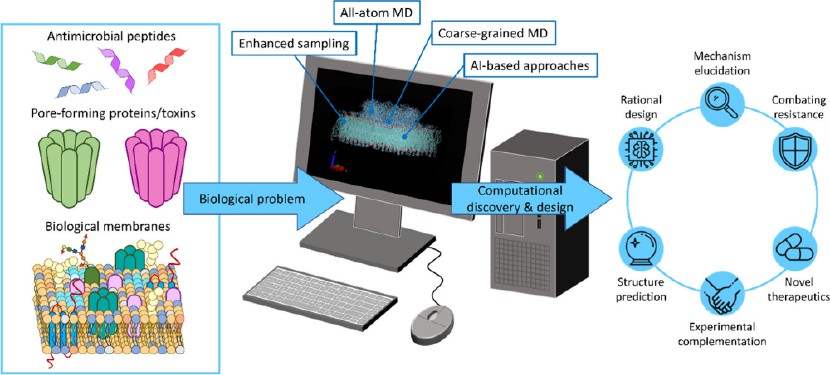
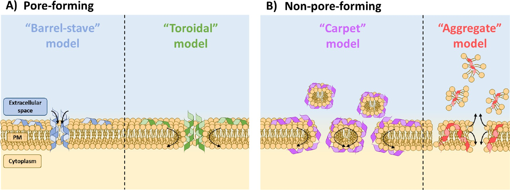
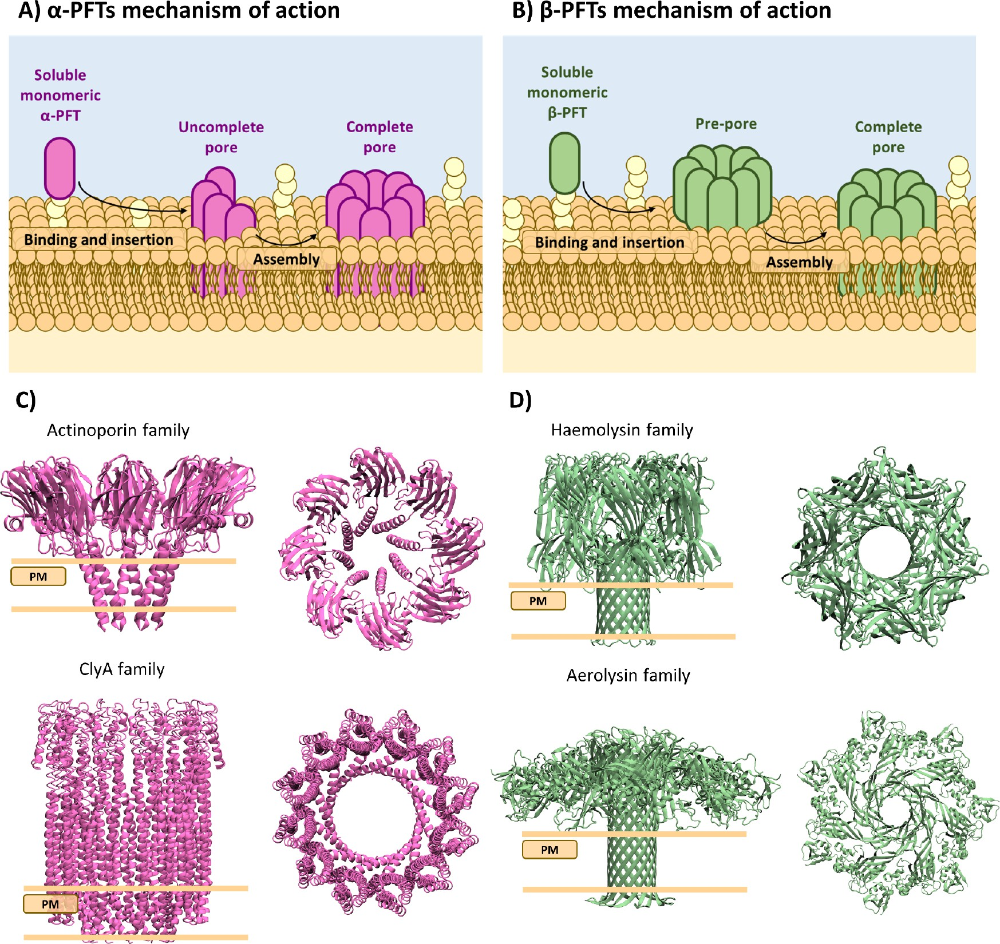
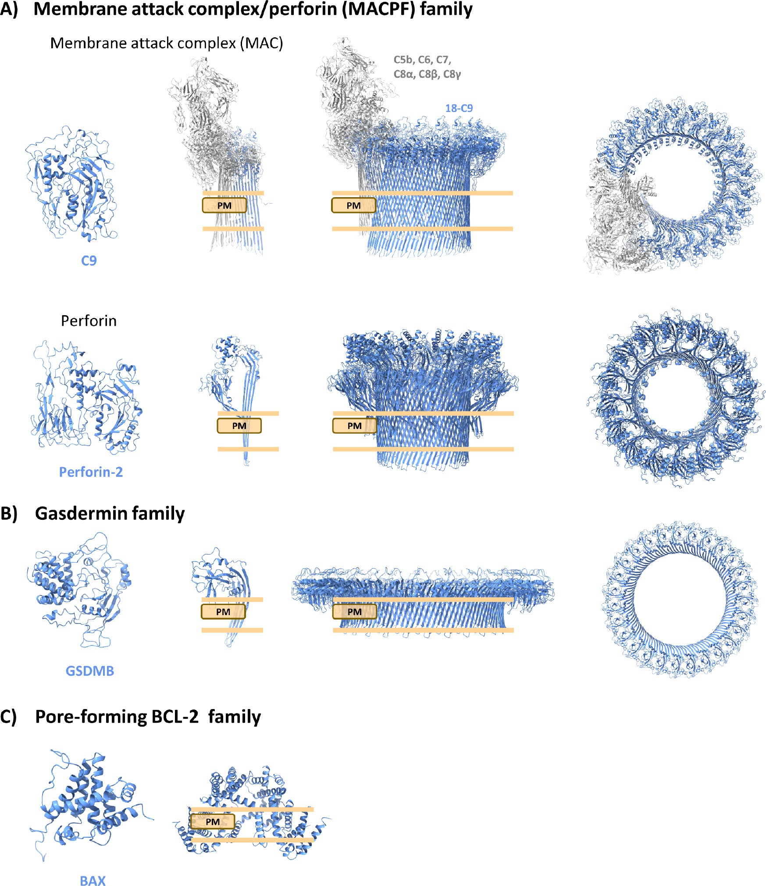
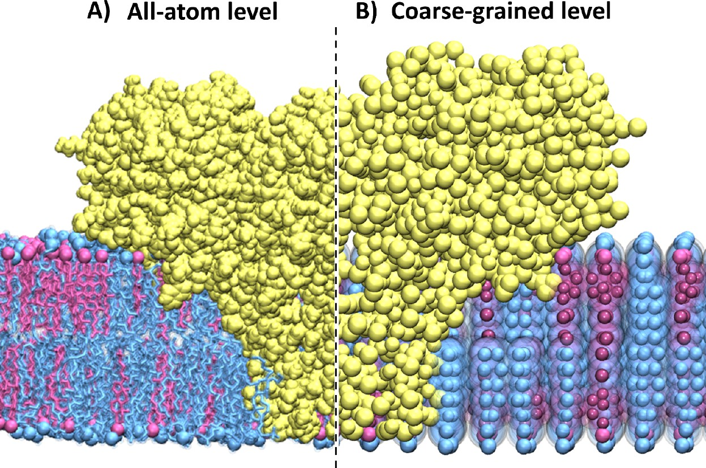
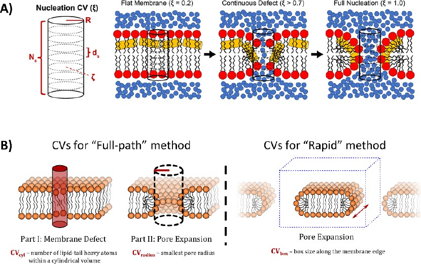

# 【综述】膜通透化的分子动力学模拟（上篇）：方法学与机制

> **系列说明**：本文是膜通透化MD模拟综述的**上篇**，涵盖方法学、机制分类和未来展望。**下篇**为案例研究文档，深入分析具体antimicrobial peptides (AMPs) 和pore-forming toxins (PFTs) 的分子机制。

## 本文信息
- **标题**：膜通透化的分子动力学模拟：抗菌肽与成孔蛋白的研究现状
- **作者**：Sofia Cresca, Jure Borovšek, Alessandra Magistrato, Igor Križaj
- **发表时间**：2026年2月
- **单位**：Consiglio Nazionale delle Ricerche (CNR)-IOM, 意大利；其他单位信息见原文
- **引用格式**：Cresca, S., Borovšek, J., Magistrato, A., & Križaj, I. (2026). Current Status of Molecular Dynamics Simulations of Membrane Permeabilization by Antimicrobial Peptides and Pore-Forming Proteins: A Review. *Journal of Chemical Information and Modeling*, *66*(6), 1982-2005. https://doi.org/10.1021/acs.jcim.5c02731

## 摘要
> 分子动力学模拟已成为研究antimicrobial peptides (AMPs, 抗菌肽) 和pore-forming toxins (PFTs, 成孔蛋白) 诱导膜通透化机制的重要工具。本综述系统总结了AMPs和PFTs的主要作用机制，包括**成孔机制（桶板模型和环形孔模型）和非成孔机制（地毯模型和聚集模型）**，以及全原子和粗粒化模拟在这些研究中的优势与局限。我们详细讨论了增强采样技术在克服时间尺度限制中的应用，并通过代表性案例研究展示了MD模拟如何揭示孔道形成的分子机制。最后，我们探讨了当前面临的主要挑战，如力场精度、生物膜的复杂性以及稀有事件采样，并展望了人工智能和机器学习在膜通透化研究中的应用前景。

### 核心结论

- **MD模拟已成为研究膜通透化的不可或缺工具**，能够提供原子级分辨率的过程信息，填补实验方法的空白
- **全原子和粗粒化模拟各有优势**，多尺度工作流程结合两者优势，能够在大系统和长时间尺度下研究膜通透化过程
- **增强采样技术**（如伞形采样、元动力学、副本交换）能够克服时间尺度限制，计算孔道形成的自由能景观
- **AMPs主要通过两种机制诱导膜通透化**：桶板模型和环形孔模型，某些AMPs还可能采用地毯模型或聚集模型。值得注意的是，**这些通透化机制并非AMPs独有**，其他膜活性肽类（如病毒融合肽、细胞穿膜肽）也采用相似的原理
- **PFTs分为α-PFTs和β-PFTs**，两者在寡聚化时机、构象变化程度和孔道结构上存在显著差异
- **未来挑战包括力场精度提升、生物膜复杂性建模以及AI/ML技术的应用**

**图形摘要：膜通透化研究的核心问题与计算路线**。该图强调抗菌肽与成孔蛋白作为生物问题入口，**分子动力学模拟与增强采样是机制解析的核心路径**，并连接理性设计、结构预测与潜在应用。

---

## 引言：为什么研究膜通透化？

生物膜是所有活细胞的基本组成部分，它们作为动态屏障定义细胞边界、区隔化细胞器并调节物质运输。生物膜的选择性透过性是维持细胞稳态的关键，它建立了电化学梯度，为能量生产和基本的细胞过程（如营养摄取和废物排出）提供必要的驱动力。然而，这种选择性透过性可能被多种肽和蛋白质破坏，主要包括**抗菌肽和成孔蛋白/毒素**。

这些分子通过**多种机制**诱导膜通透化，从形成明确的孔道到更微妙的双层结构破坏。理解膜完整性破坏的**分子机制**对于开发新型医疗、生物技术和农业应用工具至关重要。

### 生物膜的基本结构与功能

生物膜主要由**磷脂双层**构成，磷脂分子具有**两亲性特征**：亲水头部朝向水相，疏水尾部相互聚集形成双层核心。这种自组装结构创造了厚度约5-10 nm的**疏水屏障**，能够有效阻挡极性分子和离子的自由通过。生物膜展现出复杂的动态性质，包括**流动性**、**不对称性**、**微区域化**（如脂筏）以及适应曲率变化的能力。

### 膜通透化的生物学意义

膜通透化在许多生物学过程中扮演重要角色，包括**免疫防御**（宿主细胞释放AMPs和MACPF家族蛋白）、**细胞程序性死亡**（Gasdermin蛋白介导的细胞焦亡）、**细胞间通讯**以及**病原体攻击**（细菌分泌PFTs）。然而，膜通透化过程失控时会导致严重的病理后果，如**组织损伤**、**神经退行性疾病和心血管疾病**。

### 这个领域为什么重要？

- **抗生素耐药性危机**：世界卫生组织预测到2050年耐药感染可能成为全球头号死因，每年导致1000万人死亡。AMPs作为广谱抗菌剂，通过物理破坏膜结构来杀菌，不易诱导耐药性，是下一代抗生素的候选者
- **毒素致病机制**：细菌PFTs是许多病原体的关键毒力因子。理解其机制有助于**开发抗毒素和新型疗法**，如针对肺炎链球菌溶血素的中和抗体或小分子抑制剂
- **生物技术应用**：苏云金芽孢杆菌产生的Cry蛋白已广泛用作**环保杀虫剂**，某些成孔蛋白在食品工业中用作**天然防腐剂**。此外，细胞穿膜肽（CPPs）为**大分子药物递送**提供新策略，对基因治疗和癌症靶向治疗具有重要意义

### 研究膜通透化的实验挑战

膜通透化过程具有**高度的瞬态和动态性质**，孔道形成可能在纳秒到微秒时间尺度内完成，远快于大多数实验技术的时间分辨率。孔道结构存在**多种中间态和构象**，难以通过单一实验方法捕捉。此外，孔道的稳定性和结构特征高度依赖**脂质组成**、**离子强度**、**pH值**等因素，传统实验方法只能提供整体信息，**难以揭示分子层面的细节**。

### 分子动力学模拟的独特优势

分子动力学（MD）模拟作为**不可或缺的补充工具**，可以提供原子/分子水平的详细见解。

- MD模拟可以记录孔道形成的每一步，从初始脂质扰动到孔道成核、扩张和稳定的全过程，跨越从纳秒到毫秒的时间尺度。
- MD模拟揭示肽/蛋白-膜相互作用的精确细节，包括氨基酸残基与脂质的相互作用、水分子和离子的通过机制、膜厚度和曲率变化以及脂质翻转的动力学过程。
- MD模拟可以**填补实验方法的空白**，为实验数据提供分子层面的解释。结合**增强采样技术**，MD模拟可以计算孔道形成的**自由能景观**，定量比较不同AMPs或PFTs的成孔能力。

从**全原子到粗粒化**，MD模拟可以在不同分辨率下研究膜通透化过程，**多尺度工作流程**结合两者优势，提供**全景式的理解**。

### MD模拟在膜通透化研究中的里程碑

近年来，MD模拟在膜通透化研究领域取得了多项突破：

- **2008年**：Sengupta等通过CG-MD首次揭示了AMPs形成环形孔的动态过程，开创了MD研究膜通透化的先河
- **2012年**：Parton等采用多尺度模拟方法揭示了maculatin 1.1的渗透机制，展示了水如何通过肽聚集体渗透
- **2021年**：Talandashti等详细阐述了pleurocidin的孔道形成机制，发现其倾向于形成环形孔或无序环形孔
- **2022年**：Sun等发现了melittin形成两种不同孔道形态（T-pore和U-pore）的双重机制，取决于环境条件
- **2024年**：Stephani等揭示了melittin与革兰氏阴性菌外膜相互作用的分子细节，为理解AMP对复杂膜的机制提供新见解

---

## 膜通透化的分子机制：从AMP到PFT

### 抗菌肽的作用机制

抗菌肽（AMPs）通常是**小于50个氨基酸残基的小阳离子肽**，具有两亲性特征。根据二级结构可分为α-螺旋AMPs（如melittin、magainin）、β-折叠AMPs（如defensins）、混合α/β或非α/β结构（如indolicidin）以及环状AMPs（如θ-defensins）。这些结构差异影响它们与膜的相互作用方式和通透化机制。AMPs诱导膜通透化的机制可分为两大类

**图1：AMPs诱导膜破坏的主要机制**

该图展示了抗菌肽（AMPs）诱导膜破坏的主要机制分类，箭头指示AMPs插入引起的膜变形方向和性质。以下表格详细对比4种机制的特征：

这些机制并非互斥。例如：
- **同一AMP可能采用多种机制**：Melittin可根据肽浓度、脂质组成和初始构型形成T-pore（类环形孔）或U-pore（类桶板孔）
- **机制不限于AMPs**：病毒融合肽、细胞穿膜肽等其他膜活性肽类也采用相似的浓度依赖性寡聚化原理

#### AMPs的4种膜通透化机制对比

| 特征 | 桶板模型 | 环形模型 | 地毯模型 | 聚集模型 |
|------|---------|---------|---------|---------|
| **英文名称** | Barrel-stave | Toroidal pore | Carpet | Aggregate |
| **肽取向** | 近垂直（<30°） | 倾斜（30-60°） | 平行（≈90°） | 嵌入膜内，无序 |
| **亲水面排列** | 亲水侧向内形成孔道内壁 | 亲水面朝向孔道内；阳离子氨基酸将脂质头基拉入核心形成水通路 | 以平行取向覆盖膜表面 | 极性残基形成连续水传导通路 |
| **疏水面相互作用** | 疏水侧向外与脂质相互作用 | 肽和脂质头基共同构成孔道内壁 | 疏水相互作用破坏膜完整性 | 非极性残基与膜脂质酰基链相互作用 |
| **孔道组成** | 仅肽 | 肽+脂质头基 | 无孔道 | 肽-脂质聚集体 |
| **脂质排列** | 脂质保持在双层中 | 脂质连续弯曲穿过孔道 | 膜整体崩塌成胶束 | 脂质包装破坏 |
| **孔径范围** | 1-2 nm | 1-3 nm，动态变化 | 无稳定孔道 | 瞬态缺陷 |
| **动态性** | 相对稳定 | 高度动态 | 一次性崩塌 | 瞬态、可逆 |
| **形成能垒** | 较高 | 较低 | 需要阈值浓度 | 较低 |
| **孔道稳定性** | 稳定寡聚体 | 动态稳定 | 无孔道 | 瞬态结构 |
| **典型例子** | Alamethicin, Gramicidin A | Melittin, Magainin 2 | Cecropin A, Dermaseptin | Maculatin 1.1, Aurein 1.2 |
| **关键特征** | 肽-肽相互作用稳定 | 脂质持续翻转 | 阈值触发机制 | 瞬态缺陷通道 |
| **通透性** | 离子和小分子 | 离子和小分子 | 全面膜破坏 | 水和离子 |
| **可逆性** | 不可逆 | 部分可逆 | 不可逆 | 可能可逆 |

> **注**：以上4种机制并非互斥。
>
> - **同一AMP可能采用多种机制**：Melittin可根据肽浓度、脂质组成和初始构型形成T-pore（类环形孔）或U-pore（类桶板孔）
> - **机制不限于AMPs**：病毒融合肽、细胞穿膜肽等其他膜活性肽类也采用相似的浓度依赖性寡聚化原理形成类似孔道的结构

### 成孔蛋白/毒素的作用机制

成孔蛋白/毒素（PFTs）是**细菌、真菌、甚至哺乳动物自身产生的蛋白毒素**，它们在**靶细胞膜上形成孔道**，导致**离子失衡、代谢紊乱甚至细胞死亡**。与AMPs相比，PFTs通常具有**更复杂的结构**和**更精细的调控机制**。

PFTs的基本结构特征包括：

- **大小**：通常200-800个氨基酸残基，比AMPs大一个数量级，这使得它们能够形成更复杂的孔道结构
- **结构域组织**：通常包含多个结构域，分别负责膜结合、寡聚化和孔道形成，各结构域协同工作实现精确调控
- **前体形式**：许多PFTs以无活性的前体形式分泌，需要蛋白酶切割激活，这防止了对产生者自身的毒性
- **受体识别**：特定PFTs识别膜表面的特定受体（如胆固醇、糖脂等），确保靶向特异性
#### α-成孔毒素与β-成孔毒素

PFTs根据结构特征和作用机制主要分为两类，以下表格详细对比其15个特征：

| 特征 | α-PFTs | β-PFTs |
|------|--------|--------|
| **膜结合方式** | 单体直接插入膜内 | 单体先在膜表面寡聚化 |
| **寡聚化时机** | 插入后寡聚化 | 插入前寡聚化（形成前孔复合物） |
| **构象变化程度** | 较小 | 显著（α-螺旋→β-发夹，约150个残基） |
| **孔道结构** | α-螺旋束 | β-桶 |
| **典型孔径** | 1-3 nm | 10-30 nm |
| **形成速度** | 较快 | 较慢（多步骤过程） |
| **孔道组成** | 仅蛋白亚基 | 仅蛋白亚基 |
| **寡聚体大小** | 可变 | 通常固定（如7聚体、12聚体） |
| **前体形式** | 通常无前体或需蛋白酶激活 | 常以前体形式分泌，需蛋白酶切割 |
| **激活方式** | 构象变化激活 | 蛋白酶切割+构象重排 |
| **能垒** | 较低（直接插入） | 较高（多步骤、大构象变化） |
| **孔道稳定性** | 相对稳定 | 高度稳定 |
| **主要结构域** | 膜结合结构域+孔道结构域 | 受体识别结构域+寡聚化结构域+孔道结构域 |
| **典型例子** | 海葵毒素（如Equinatoxin II）、大肠菌素、溶细胞素A（ClyA） | 肺炎链球菌溶血素（Ply）、气单胞菌溶素前体、金黄色葡萄球菌α-溶血素 |
| **生物学功能** | 快速杀伤 | 需要精确调控的毒性 |

**图2：PFTs的作用机制对比（α-PFTs vs β-PFTs）**

该图展示了两类成孔毒素/蛋白（PFTs）的作用机制差异，浅黄色脂质代表膜内的特定脂质种类（如胆固醇、磷脂酰丝氨酸等），作为PFTs与质膜结合的受体位点，这种机制差异决定了不同PFTs的细胞毒性、宿主范围和生物学功能：

- **子图A：α-PFTs机制**，可溶性单体直接插入膜内，插入后逐步寡聚化形成孔道，寡聚化时机在膜插入之后，构象变化相对较小，典型的如海葵毒素（Equinatoxin II）、大肠菌素、溶细胞素A（ClyA）等采用这种机制，能够快速形成孔道
- **子图B：β-PFTs机制**，单体首先在膜表面寡聚化形成前孔复合物，随后发生显著的构象重排插入膜内，寡聚化时机在膜插入之前，经历大幅度构象变化（α-螺旋转化为β-发夹），典型的如肺炎链球菌溶血素（Ply）、气单胞菌溶素前体、金黄色葡萄球菌α-溶血素等，这种多步骤机制降低了初始结合的能垒

### 哺乳动物自身的成孔蛋白

哺乳动物细胞也利用成孔蛋白来执行重要生理功能，如**免疫防御**（MACPF家族，补体系统）、**细胞焦亡**（Gasdermin家族）和**细胞凋亡**（BCL-2家族）。这些蛋白在正常情况下受到严格调控，但在病理条件下可能过度激活导致组织损伤。

#### MACPF/CDC超家族

膜攻击复合物/穿孔素（MACPF）家族是哺乳动物最重要的成孔蛋白家族之一，包括：

- **补体成分**（C6-C9）：形成膜攻击复合物（MAC），在病原体膜上打孔
- **穿孔素**（Perforin）：由细胞毒性T细胞和NK细胞释放，在靶细胞膜上形成孔道
- **Gasdermins**：介导细胞焦亡。

哺乳动物成孔蛋白的活性受到严格调控：

- **空间隔离**：蛋白前体与激活酶分开储存
- **蛋白酶切割**：需要特定蛋白酶切割激活
- **pH依赖性**：某些蛋白仅在特定pH下激活
- **辅助因子**：需要钙离子或其他辅助因子。

**图3：哺乳动物成孔蛋白（PFP）家族的带状表示**

该图展示了哺乳动物成孔蛋白（PFP）家族的结构多样性，每个面板从左到右分别展示了可溶性单体、插入质膜（PM）的蛋白原体以及完整孔道（侧面和顶视图），这些结构展示了从α-螺旋到β-桶的多种孔道形成机制：

| 家族 | 代表蛋白 | 生物学功能 | 孔道特征 |
|------|---------|-----------|---------|
| **A）MACPF/CDC家族** | 气单胞菌溶素、胆固醇依赖性溶素 | 免疫防御，在补体系统和穿孔素途径中发挥作用 | 形成大孔道（直径>10 nm），快速破坏靶细胞膜 |
| **B）Gasdermin家族** | GSDMD | 介导细胞焦亡（pyroptosis） | 形成超大孔道（直径10-20 nm），释放炎性细胞因子如IL-1β |
| **C）BCL-2家族** | BAX、Bak | 调控线粒体外膜通透性，介导细胞凋亡 | 在线粒体外膜形成孔道，释放细胞色素c等促凋亡因子 |
| **D）Actinoporin家族** | FraC | 由海洋生物产生的成孔蛋白 | 展示了从α-螺旋到β-桶的结构转变，揭示了哺乳动物成孔蛋白的结构多样性和功能复杂性 |

---

## 分子动力学模拟方法学

### MD模拟的独特优势

MD模拟在研究膜通透化方面具有独特优势，能够解决实验方法难以应对的挑战：

- **记录孔道形成的全过程**：MD模拟可以记录孔道形成的每一步，包括初始脂质扰动、孔道成核、孔道扩张和稳定过程，跨越从纳秒到毫秒的时间尺度
- **揭示分子层面的相互作用**：MD模拟揭示肽/蛋白-膜相互作用的精确分子细节，包括氨基酸残基与脂质的相互作用、水分子的结构和动力学、离子选择性机制、膜厚度和曲率变化以及脂质翻转过程
- **填补实验方法的空白**：这些分子层面的信息对于理解膜通透化的物理机制至关重要，也是实验方法难以直接获得的，MD模拟能够为实验数据提供分子层面的解释

例如，MD模拟与实验方法形成互补：

| 实验方法 | 可提供信息 | MD模拟的补充作用 |
|---------|-----------|----------------|
| **电生理测量** | 孔道电导特征、离子选择性 | 揭示孔道内水分子排列、离子水合状态、脂质取向，解释电导的分子来源 |
| **荧光光谱** | 膜完整性破坏、染料泄漏 | 展示孔道形成的具体过程和结构特征 |
| **EPR光谱** | 肽取向和动力学信息 | 原子级分辨率展示肽-膜相互作用的细节 |
| **Cryo-EM** | 孔道高分辨率静态结构 | 揭示孔道形成的动力学过程和能量景观 |

结合增强采样技术，MD模拟可以计算孔道形成的自由能景观，定量比较不同AMPs或PFTs的成孔能力。例如：
- **伞形采样（umbrella sampling）**：计算沿反应坐标（如孔径、肽插入深度、膜厚度）的自由能变化，预测孔道的稳定性和形成概率
- **Metadynamics**：探索多维自由能面，识别孔道形成的关键路径和中间态
- **自适应偏置力**（ABF）：沿反应坐标施加偏置力以克服能垒，同时保证采样均匀性。

通过这些方法，可以计算孔道形成的能垒、孔道的相对稳定性、不同构象态之间的自由能差异等关键热力学量，为理解膜通透化的热力学驱动力提供定量基础。

### 模拟分辨率的选择：全原子 vs 粗粒化

从全原子到粗粒化，MD模拟可以在不同分辨率下研究膜通透化过程：

- **AA-MD**：提供高精度细节，能够精确描述蛋白质-脂质相互作用、水介导的氢键网络、离子效应、质子化状态
- **CG-MD**：允许研究大系统和长时间尺度过程，如多肽寡聚化、大孔道形成、膜曲率变化、脂质相分离

选择合适的模拟分辨率是**MD研究膜通透化的关键决策**。不同分辨率在**时间尺度**、**系统尺寸**、**计算成本**和**物理细节**之间提供不同的平衡。

**图4：Actinoporin-膜复合物的全原子与粗粒化表示对比**

该图展示了Actinoporin-膜复合物（PDB ID: 4TSY）在不同分辨率下的概念性可视化，两个面板都使用范德华表面表示以突出结构复杂性差异，这种多尺度方法使研究者能够在计算效率和物理精度之间找到最佳平衡：

- **子图A：全原子（AA）表示**，使用CHARMM-GUI接口生成，清晰展示所有原子细节，包括水分子、离子和脂质的每个原子，提供最高分辨率的结构信息，能够精确描述氢键网络、水合结构、质子化状态以及特定的脂质-蛋白质相互作用，**颜色说明**：Actinoporin蛋白显示为黄色，便于识别蛋白的三维结构和空间取向
- **子图B：粗粒化（CG）表示**，在MARTINI框架内构建，每个珠粒代表4个重原子，大幅简化系统但保留主要相互作用特征，显著提升计算效率，可研究更大系统和更长时间尺度过程，**颜色说明**：胆固醇显示为粉色，POPC脂质显示为浅蓝色，清晰展示了蛋白与膜的相互作用界面，有助于理解膜环境对蛋白结构的影响

| 特征 | 全原子MD（AA-MD） | 粗粒化MD（CG-MD） |
|------|------------------|-------------------|
| **分辨率** | 保留所有原子细节 | 原子组映射为珠粒 |
| **时间尺度** | 纳秒-微秒（常规可达几十微秒） | 微秒-毫秒（可达毫秒级） |
| **系统尺寸** | 数百万原子 | 数百万珠粒（对应更多原子） |
| **时间步长** | 1-2 fs | 20-40 fs |
| **计算成本** | 极高（需要GPU加速） | 大幅降低 |
| **优势** | 高精度，能描述氢键、水合结构、质子化 | 可观察稀有事件、大规模膜重组、寡聚化 |
| **局限** | 难以捕捉自发孔道形成；系统尺寸受限 | 丢失原子细节；力场精度较低； 「黏性」问题（过度稳定蛋白-脂质相互作用，亦称sticky problem） |
| **适用场景** | 蛋白-膜结合识别、预成孔稳定性、特定脂质相互作用 | 多肽寡聚化、孔道成核、膜曲率变化、脂质相分离 |

> **注**：以上表格和说明列出了AA-MD和CG-MD的主要特征对比。实际应用中，应根据研究问题的具体需求选择合适的分辨率，或采用下述多尺度策略结合两者优势。

#### 方法选择细节

- **AA-MD常用力场**：CHARMM36(m)、AMBER+Lipid21、SLipids、OPLS-AA等，不同力场对膜性质和蛋白-脂质相互作用的描述精度不同。
- **CG-MD常用力场**：MARTINI 3.0、SPICA、SIRAH等，其中MARTINI是最广泛使用的CG力场，采用4重原子映射为1个珠粒的方案。

选择合适的模拟分辨率应该基于具体的研究问题：

| 研究问题 | 推荐方法 | 理由 |
|----------|----------|------|
| 肽-膜初始识别和结合 | AA-MD | 需要精确的氢键和静电相互作用 |
| 孔道稳定性评估 | AA-MD | 需要原子级结构细节 |
| 离子选择性机制 | AA-MD | 需要精确的离子-孔道相互作用 |
| 质子化状态效应 | AA-MD | 需要精确的质子化状态描述 |
| 自发孔道成核 | CG-MD | 需要长时间尺度和大规模系统 |
| 多肽寡聚化过程 | CG-MD | 需要观察多个肽的组装过程 |
| 膜曲率变化 | CG-MD | 需要研究大尺度膜形变 |
| 变体筛选 | CG-MD | 需要高通量计算能力 |

### 多尺度模拟策略：结合两者优势

最佳实践是采用**多尺度工作流程**：先用**CG模拟快速探索**孔道形成和集体行为，识别**关键中间体和转变路径**；然后将CG构象**反向映射**（backmapping）回AA分辨率，进行**结构细化并分析详细的相互作用**。

这种策略兼具效率和精度：**CG模拟快速覆盖大构象空间**，**AA模拟提供高分辨率细节**。

#### 1. CG探索阶段

- 构建CG模型系统（包含**大量脂质和多个肽/蛋白**），使用**MARTINI等粗粒化力场**
- 运行**长时间CG模拟**，利用CG的**时间步长优势**加速模拟，能够观察**自发孔道形成等稀有事件**
- 观察肽寡聚化、孔道成核、孔道扩张等过程，记录**关键中间态的结构特征和转变时间点**，识别关键构象态和转变路径

#### 2. 构象选择与反向映射

- 从CG轨迹中选择**代表性构象**（如寡聚体、孔道中间态、稳定孔道等），确保覆盖所有重要的构象态和转变路径
  - 基于**结构特征**（如肽取向、孔径、脂质排列）选择代表性构象

- 将CG构象**反向映射**（backmapping）回AA分辨率，恢复原子级细节
  - 优化结构以消除可能的不合理几何构型
  - 添加水分子和离子以满足生理条件并平衡系统电荷

#### 3. AA模拟与分析

- 对选定的构象运行**AA模拟**，使用**CHARMM36m或AMBER Lipid21**等全原子力场，精确描述分子相互作用
- 分析详细的相互作用（**氢键、盐桥、水合结构**），识别**关键的残基-脂质相互作用**和水分子的介导作用
- 计算**孔道稳定性**（如RMSD、孔径随时间变化）
- 如需要，进行**增强采样以计算自由能**，使用**伞形采样**或Metadynamics等方法计算**孔道形成的自由能景观**

#### 4. 整合分析

- 结合CG和AA结果构建**完整的膜通透化机制图**，CG提供**长时间尺度和全局构象变化信息**，AA提供**分子细节和精确的相互作用信息**
- 通过多尺度整合，揭示从**初始肽-膜结合到孔道成核、扩张和稳定的完整动力学过程**
- **定量比较**不同突变、脂质组成或环境条件对孔道形成的影响

#### 案例研究：Richardson等人（2024）

该研究采用多尺度策略研究不同AMPs的孔道形成机制：

- **方法**：他们首先用CG模拟观察**melittin、aurein 1.2和magainin 2**诱导孔道形成，然后将CG构象反向映射到AA分辨率，应用伞形采样计算自由能面
- **关键发现**：
  - **Melittin**最有效地降低孔道成核能垒，促进特征性环形孔形成
  - **Magainin 2和aurein 1.2**效应较小，孔道排列更无序
- **科学意义**：为理解AMPs的**构效关系**提供了分子基础，展示了**多尺度方法的强大能力**

多尺度模拟也面临一些挑战：

- **反向映射的准确性**：CG到AA的映射可能产生不合理的原子位置，需要结构优化
- **时间尺度的连续性**：AA模拟时间通常短于CG模拟，可能无法观察到CG中的某些转变
- **力场的兼容性**：CG和AA使用不同力场，可能影响构象偏好
- **计算成本**：多个AA模拟仍需要大量计算资源

### 增强采样技术：克服时间尺度限制

膜通透化过程中的许多关键事件是**稀有事件**，这意味着它们发生的自由能垒很高，在常规MD模拟的时间尺度内难以观察到。这些稀有事件包括：

- 脂质**孔道的形成**可能需要毫秒级时间，远超常规AA-MD的能力
- 多肽组装成孔道涉及多个中间体，每个**寡聚化**步骤都可能存在能垒
- β-PFT的前孔到孔道转变涉及大幅度**构象变化**

在有限的模拟时间内，系统可能被困在局部自由能最小值中，无法充分采样相空间。这种现象被称为“**准非遍历性**”（quasi-non-ergodicity），导致模拟结果无法代表系统的真实统计行为。增强采样技术旨在克服这些限制，通过修改采样分布或使用广义系综策略来增强相空间探索。

#### 增强采样技术对比

由于孔道形成是稀有事件，需要使用增强采样技术来加速构象探索。以下表格对比了4种主要增强采样技术的原理、优势、局限和适用场景：

| 增强采样技术 | 原理 | 优势 | 局限 | 适用场景 |
|------------|------|------|------|----------|
| **伞形采样** | 沿反应坐标施加谐振势，多窗口采样 | 精确计算自由能；结果物理意义明确 | 需预先知道反应坐标；计算成本高 | 计算肽插入自由能；量化孔道成核能垒 |
| **Metadynamics** | 沿CV施加历史高斯偏置势，迫使系统探索新构象 | 不需预先知道精确路径；可探索多维自由能面 | CV选择影响质量；收敛性评估困难 | 发现未知中间态；探索复杂自由能面 |
| **副本交换MD** | 多个副本在不同温度/Hamilton量下运行并交换 | 不需选择CV；保证正确统计采样 | 计算成本随系统尺寸剧增；交换接受率可能低 | 肽折叠和膜结合；温度依赖性现象 |
| **适应性偏置力**（ABF） | 沿CV施加与平均力相反的偏置力 | 获得连续自由能剖面；不需预定义窗口 | 对CV质量要求高；复杂CV难收敛 | 离子穿孔道过程；构象转变路径分析 |

#### 成孔集体变量：成核CV

为了量化孔道形成过程，研究者设计了专门的集体变量（CV）来描述孔道成核和扩张。**成核CV**（nucleation CV, $\xi$）是近年来发展的重要方法，通过统计跨膜圆柱内的水和脂质分布来表征孔道形成程度。

**图7：用于研究孔道形成的集体变量（CV）设计**

该图展示了用于量化孔道形成过程的集体变量（CV）设计方法，为定量研究孔道形成的自由能景观提供了强大工具：

- **子图A：成核CV（$\xi$）的定义与应用**，$\xi$通过一个跨膜圆柱来定义，该圆柱具有半径$R$并被分为$N_s$个切片，通过统计圆柱内水分子氧原子（蓝色）和脂质头基（红色）的占比来表征孔道形成程度，低$\xi$值（$\approx 0.2$）代表完整膜，中等$\xi$值（$0.2-0.7$）表示膜开始出现缺陷，高$\xi$值（$>0.7$）代表膜缺陷显著，$\xi \approx 1$表示完整孔道已形成，这些组分在圆柱内的增加驱动膜从完整状态向膜缺陷和完整孔道转变
- **子图B：两种CV策略对比与选择**，"Full-path" CV分为描述孔道缺陷（成核）和孔道扩张两个部分，完整覆盖孔道形成的全过程；"Rapid" CV模拟"无限"环形孔，孔道尺寸由模拟盒大小控制，适合快速评估孔道稳定性

#### 最佳实践建议

根据PDF原文的Table 1，以下是MD模拟膜通透化的最佳实践建议：

| 方法组件 | 最佳实践 |
|---------|---------|
| **分辨率选择** | 根据生物学过程和相关时间/空间尺度选择：AA-MD用于初始蛋白-膜结合、特定脂-蛋白相互作用、预成孔稳定性评估；CG-MD用于自发孔道成核、协同肽组装、大尺度膜变形等稀有事件。 可行时采用多尺度工作流程：用CG探索孔道形成和集体行为，然后反向映射到AA分辨率进行结构细化 |
| **力场选择** | 脂质力场应准确重现关键双层性质（面积/脂质、厚度、序参数）并匹配膜的化学复杂性。AA用CHARMM36(m)、AMBER+Lipid21、SLipids；CG用MARTINI 3.0 |
| **增强采样** | 选择能描述孔道形成关键自由度的集体变量（CV），如孔径、脂质有序参数、肽-膜距离、多肽倾斜角等 |
| **分析验证** | 结合实验数据（EPR、NMR、荧光光谱、电生理测量等）验证模拟结果 |

---

**系列文档**：
- [上篇：方法学与机制综述](/pages/Specific-Sytems/Membrane/2026-03-02-md-simulations-amp-pore-review/) | [下篇：案例研究与机制解析](/pages/Specific-Sytems/Membrane/2026-03-02-md-simulations-amp-pore-examples/)

