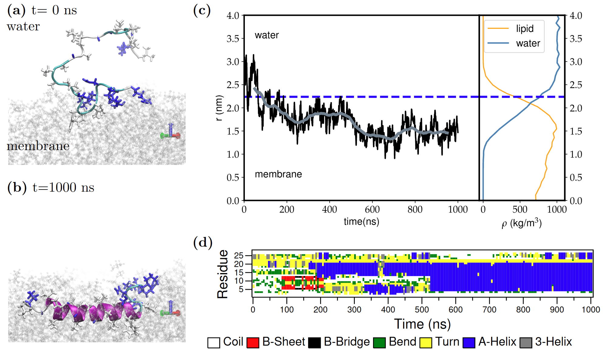
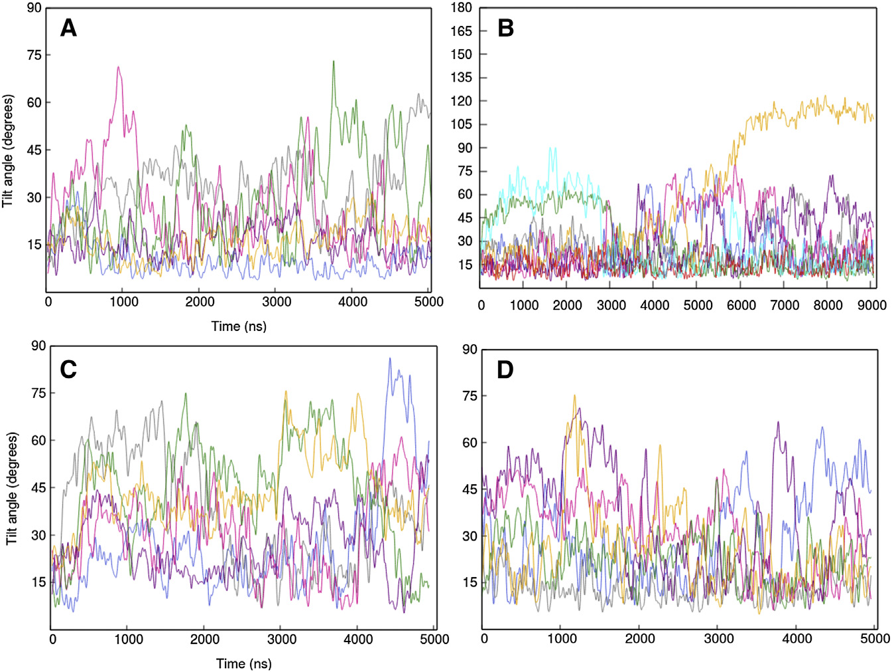
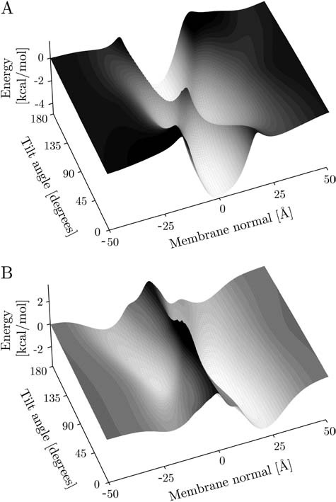
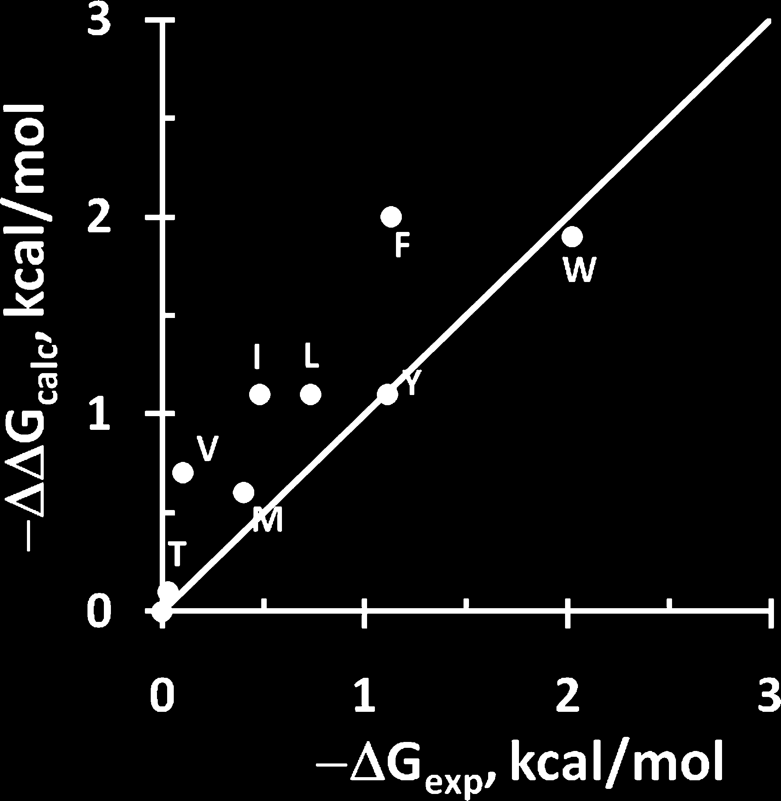

## 引言

在研究膜蛋白、抗菌肽等分子与脂质膜的相互作用时，**分子主轴相对膜法向的取向角（tilt angle, θ）**是判断其插入状态（表面吸附vs跨膜插入）的关键结构参数。这一指标可通过分子动力学模拟、固态NMR等实验手段定量测定，为理解膜-分子相互作用提供了直接的结构基础。

## 取向角的定义

**倾斜角（tilt angle, θ）**：分子主轴（如α-螺旋轴）与膜法向（z轴）之间的夹角。

- θ ≈ 0°：分子垂直于膜平面（典型跨膜构象）
- θ ≈ 90°：分子平行于膜平面（表面吸附构象）
- 中间角度：部分插入、倾斜跨膜等状态

## MD模拟案例：Fis1尾锚蛋白

### 取向角区分表面态与跨膜态

Fis1(TA)是线粒体外膜蛋白的尾锚片段，研究通过MD模拟结合增强采样技术分析了其在膜中的取向。该研究**明确使用tilt-angle（θ）和到膜中心的距离（r）作为两个集体变量**来区分单层吸附（monotopic）和跨膜（bitopic）两种状态。

**螺旋轴定义**：连接残基132-134和147-149的质心向量（这些残基保持α-螺旋构象）。

**MD模拟发现**：

| 状态 | 倾斜角θ | 描述 |
|------|--------|------|
| Monotopic（单层吸附） | 较大 | 螺旋埋藏在脂质-水界面下约0.7 nm，带电羧基末端朝向界面 |
| Bitopic（跨膜） | 较小 | 螺旋跨越整个脂质双层 |

**图1：Fis1尾锚的AA-REX模拟结果（四子图展示）**

该图展示了Fis1(TA)在298 K replica中的综合结构分析：
- **子图(a) 代表性构象快照**：立体视角展示Fis1 TA在膜中的α-螺旋结构，蓝色为肽段，灰色球棍模型为脂质分子，清晰显示肽段埋藏在脂质双层内
- **子图(b) 序列特异性α-螺旋倾向性**：从残基132到151的螺旋性概率，除羧基末端（残基147-151）的5个带电/极性残基外，其余残基呈现接近1的强α-螺旋性
- **子图(c) 残基相对膜/水界面的平均深度**：负值表示在膜内。螺旋疏水部分（残基132-146）埋藏在脂质-水界面下约0.7 nm处，而非螺旋的带电羧基末端延伸至界面附近
- **子图(d) 倾斜角分布**：定义为螺旋轴与膜法向（z轴）的夹角，monotopic态下倾斜角集中在20–40°范围内，表明取向相对稳定且接近垂直于膜平面

**自由能分析**：通过well-tempered metadynamics结合Hamiltonian replica exchange，系统采样了$(θ, r)$二维构象空间，发现单层吸附态与跨膜态之间存在较高的能垒，带电末端阻止了自发转换。

## NMR实验案例：PGLa抗菌肽

### PGLa的拓扑转变

PGLa是一种抗菌肽，在脂质膜中表现出多样的拓扑状态。**$^{15}$N固态NMR化学位移**直接反映了螺旋轴相对膜法向的取向。

**温度与相态的影响**：

| 条件 | $^{15}$N化学位移最大值 | 对应倾斜角 | 构象状态 |
|------|---------------------|-----------|----------|
| 310 K，DMPC/DMPG液晶相 | 125 ppm | 53° | 倾斜插入（可能是二聚体） |
| <297 K，凝胶相 | 87 ppm | 81° | 表面吸附态 |
| 脱水条件 | 160 ppm | 更小 | 垂直取向 |

**关键发现**：
- 倾斜角从53°（液晶相）变化到81°（凝胶相），表明PGLa的拓扑状态对膜相态高度敏感
- 低温条件下，PGLa仍保持良好的取向，适合DNP增强的NMR研究

## 跨膜螺旋的倾角变化

### hΦ19W跨膜锚定序列

对含有19个疏水残基的跨膜锚定肽（hΦ19W）的研究发现：

- **室温**：快速运动平均化，尖锐共振峰
- **低温/DNP条件**：$^{15}$N化学位移变化约20 ppm，对应倾角增大约10°
- **物理解释**：低温下脂质双分子层疏水厚度增加，导致跨膜螺旋采取更直立的取向以匹配膜厚

**模拟结果**：10°和22°倾角的螺旋轮模式与实验谱图吻合。

## 膜孔形成肽：Melittin与MelP5

### 三态分类体系

Melittin和其突变体MelP5是形成膜孔的经典模型肽。研究者**明确建立了基于tilt-angle的三态分类体系**，这一分类在膜肽研究中被广泛采用。

**标准分类**（继前人研究）：

| 状态 | 倾斜角范围 | 物理意义 |
|------|-----------|----------|
| **S-state（Surface，表面态）** | 60–120° | 肽段平行于膜表面 |
| **T-state（Tilted，倾斜态）** | 30–60°或120–150° | 部分插入/倾斜跨膜 |
| **I-state（Inserted，插入态）** | 0–30°或150–180° | 垂直跨膜插入 |

**图2：Melittin和MelP5的tilt-angle随时间演化**

该图展示了不同模拟体系中各肽单体的倾斜角随时间的变化（0–5 $\mu$s），清晰区分了三种状态：
- **子图(A) Melittin平行六聚体**：多数单体保持I-state（0–30°，绿色/蓝色曲线），少数在T-state（30–60°，黄色/橙色曲线），支持稳定的跨膜孔道
- **子图(B) Melittin平行六聚体（部分解离）**：橙色单体最终转向S-state（~113°），从孔道解离；其余单体保持I或T状态
- **子图(C) MelP5平行六聚体**：所有单体均处于T/I混合状态（15–52°），平均倾斜角39°，显著高于melittin的25°，表明MelP5更倾向于倾斜取向

**MD模拟观测到的倾斜角分布**：

| 肽段 | 状态 | 平均倾斜角 | 描述 |
|------|------|-----------|------|
| Melittin（干三聚体） | I-state | 9–19° | 完全插入，维持跨膜孔道 |
| Melittin（孔道单体） | T-state | 20–50° | 倾斜取向，支持水性孔道 |
| Melittin（解离单体） | S-state | 113° | 转向表面吸附 |
| MelP5 | T/I混合 | 15–52°（平均39°） | 比melittin倾角更大，平均39° vs 25° |

**关键发现**：
- 倾斜角与功能直接相关：I-state肽段形成稳定的跨膜孔，T-state肽段支持孔道边缘，S-state肽段脱离或表面结合
- MelP5由于亲水性增强，平均倾斜角（39°）显著高于melittin（25°），表明其更倾向于倾斜取向

## 隐式膜模型：计算方法与NMR的系统性对比

### Ulmschneider等人的开创性研究

Ulmschneider等人开发了一种隐式膜模型来计算膜相关螺旋的取向，并与固态NMR实验结果进行了系统性对比。该研究**分析了6个跨膜螺旋和9个抗菌肽**，提供了计算方法预测tilt angle能力的定量验证。

**方法特点**：
- 基于46个α-螺旋膜蛋白结构参数化的隐式膜模型
- 计算螺旋长轴相对膜法向的tilt angle和绕轴的rotation angle
- 扫描整个构象空间（位置+倾斜+旋转）寻找全局能量最小值

**跨膜螺旋vs抗菌肽的对比**：

| 肽类型 | 倾斜角特征 | 能量极小值 | 插入能 |
|------|-----------|-----------|--------|
| **跨膜螺旋**（6个） | 0–30°（接近垂直） | 膜中心（插入态）为主 | –4.7 ~ –10.2 kcal/mol |
| **抗菌肽**（9个） | 90±4°（平行于膜） | 膜表面（表面态） | +3 ~ +5 kcal/mol（插入惩罚） |

**图4：跨膜螺旋与抗菌肽的自由能面对比**

该图展示了两种截然不同的自由能景观：
- **子图(A) AchR M2跨膜螺旋**：存在两个能量极小值。深蓝色区域（膜中心，z≈0 Å，tilt≈15°）为全局最小值，代表跨膜插入态；浅蓝色区域（膜表面，z≈±10 Å，tilt≈90°）为局部极小值，代表表面吸附态。插入态比表面态低约1 kcal/mol
- **子图(B) Magainin抗菌肽**：仅在膜表面（z≈–15 Å，tilt≈90°）有一个深色极小值，表示稳定平行吸附于膜表面。若要插入膜中心需克服显著的自由能垒（+3~+5 kcal/mol），与实验观测一致

**关键发现**：
- **跨膜螺旋**：自由能面显示双重极小值，插入态（tilt ~15°）总是全局最小，表面态（tilt ~90°）为局部极小
- **抗菌肽**：自由能面仅有一个表面极小值（tilt ~90°），插入到膜中心需要显著的自由能惩罚
- **计算与实验定量一致**：6个跨膜螺旋的预测tilt angle与固态NMR测量值吻合，验证了隐式膜模型的可靠性
- **物理机制**：疏水残基驱动插入，极性/电荷/芳香残基决定螺旋在膜内的正确取向

**方法学意义**：这项工作首次系统性地证明了计算方法可以准确预测膜螺旋的tilt angle，为后续研究奠定了方法学基础。

## S4螺旋：理论计算与实验验证

### PPM模型预测的取向-膜厚关系

S4是电压门控离子通道的电压感受器螺旋。采用各向异性溶剂模型（PPM 2.0）计算了其在不同膜厚度下的取向和插入自由能。

**取向与膜厚的关系**：

| 取向状态 | 倾斜角范围 | 条件 |
|----------|-----------|------|
| **跨膜取向** | 22–40° | 取决于脂质双分子层疏水厚度 |
| **表面取向** | ~73° | 替代性表面结合态 |

**图3：S4螺旋的转移能和倾斜角与膜厚的关系**

该图展示了S4螺旋在不同膜厚度下的能量和取向特征：
- **子图(A) 能量与倾斜角**：菱形表示转移自由能$\Delta G_{\text{transf}}$，圆圈表示倾斜角。蓝色为跨膜取向，紫色为表面取向。可见跨膜态倾斜角随膜厚从22°变化到40°，而表面态保持在~73°。当膜疏水厚度小于23.5 Å时，跨膜取向能量更低；大于23.5 Å时，表面取向更稳定
- **子图(B) 两种取向的分子示意图**：直观展示S4螺旋在脂质双层中的两种取向。左侧为跨膜插入态（蓝色，倾斜~40°），右侧为表面结合态（紫色，倾斜~73°）。精氨酸侧链（R120、R123、R126）的"snorkeling"效应清晰可见——侧链伸向脂质头部磷酸基团区域形成离子桥，稳定两种取向

**理论预测与实验验证**：
- PPM计算：跨膜态倾斜角随膜厚变化，22–40°
- 固态NMR实验：在DMPC膜中观测到40°倾斜角，伴随局部膜变薄~9 Å
- 定量一致：膜变薄后疏水厚度16.4 Å，对应40°倾斜；考虑疏水失配惩罚后，最优厚度21 Å对应22.5°倾斜角

**物理机制**：
- 精氨酸残基（R120、R123、R126）的"snorkeling"效应：侧链伸向脂质头部区域，与磷酸基团形成离子桥
- 跨膜与表面取向的相对比例取决于膜厚度：
  - 膜厚 > 23.5 Å：表面态更稳定
  - 膜厚 < 23.5 Å：跨膜态更稳定
- 两种取向能垒很小（~0.5 kcal/mol），易于转换

**方法学意义**：PPM 2.0相比1.0显著改进了膜蛋白取向预测（$R^2$从0.47提升至0.78），能准确确定疏水边界和倾斜取向。

## 总结

**分子主轴相对膜法向的取向角是判断膜插入状态的关键指标**：

1. **MD模拟**：通过tilt-angle和距离两个CV可有效区分monotopic与bitopic状态，计算自由能面
2. **固态NMR**：$^{15}$N化学位移直接定量倾斜角，实验可观测拓扑转变
3. **隐式膜模型**：系统性计算6个跨膜螺旋和9个抗菌肽，预测tilt angle与NMR实验定量一致
4. **三态分类**：S/T/I体系（表面/倾斜/插入）为膜肽研究提供了统一的描述框架
5. **敏感性**：取向角对膜相态、厚度、水化、温度等环境因素高度敏感
6. **理论预测**：PPM等模型可预测膜蛋白取向，与实验结果定量吻合
7. **应用价值**：为理解膜蛋白功能、抗菌肽机制、药物设计提供结构基础

## 参考文献

1. Fis1 tail anchor MD研究：单层吸附vs跨膜由取向角判别
   - Membranes 2022, 12, 752. https://doi.org/10.3390/membranes12080752

2. PGLa的固态NMR研究：取向角随膜相态变化
   - Sci Rep 2016, 6, 20895. https://doi.org/10.1038/srep20895

3. Melittin/MelP5膜孔形成的MD模拟：建立S/T/I三态分类体系
   - Biophys J 2018, 114, 2865–2874. https://doi.org/10.1016/j.bpj.2018.05.027

4. 隐式膜模型预测螺旋倾斜角：计算方法与NMR的系统性对比
   - Biophys J 2007, 92, 724–737. https://doi.org/10.1529/biophysj.106.089672

5. S4螺旋的PPM模型：取向-膜厚关系与固态NMR验证
   - J Chem Inf Model 2011, 51, 930–946. https://doi.org/10.1021/ci200020k
