# 分子主轴相对膜法向的取向角用于识别膜肽插入状态的S/T/I三态模型与实验证据

## 核心概念：取向角作为膜插入状态的判据

在研究膜蛋白、抗菌肽等分子与脂质膜的相互作用时，**分子主轴相对膜法向的取向角**（tilt angle, θ）是判断其插入状态的核心结构参数。这一指标可通过分子动力学模拟、固态NMR等实验手段定量测定，为理解膜-分子相互作用提供了直接的结构基础。

**取向角**是分子主轴（如α-螺旋轴）与膜法向（z轴）之间的夹角，这一几何参数提供了判断膜插入状态的**定量判据**：

- **θ≈0°**：分子垂直于膜平面，对应典型的跨膜插入态，疏水核心完全埋藏在膜的疏水区域
- **θ≈90°**：分子平行于膜表面，两亲性螺旋的疏水面朝向脂质而极性面朝向水相
- **中间角度**：代表部分插入、倾斜跨膜等倾斜态，反映了膜-分子相互作用的多样性和复杂性

## S/T/I三态模型：从定义到分类

### 三态的经典定义（$\ce{^2H}$-NMR方法学）

Strandberg等人通过$\ce{^2H}$-NMR系统分析了PGLa在膜中的取向和动力学，**首次建立了S/T/I三态分类体系**，并通过涨落分析验证了这一分类的物理合理性。

#### 三种取向态的定义

| 状态        | 全称               | 倾斜角τ          | 方位角ρ    | 物理意义             |
| ----------- | ------------------ | ---------------- | ---------- | -------------------- |
| **S-state** | Surface（表面态）  | 60–120°          | 变化       | 螺旋平行于膜表面     |
| **T-state** | Tilted（倾斜态）   | 30–60°或120–150° | \~110–120° | 螺旋倾斜插入膜内     |
| **I-state** | Inserted（插入态） | 0–30°或150–180°  | \~90–100°  | 螺旋垂直跨膜形成孔道 |

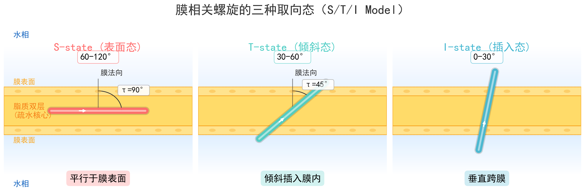

该示意图清晰展示了三种典型取向及其功能含义：

- **S-state**中螺旋平行于膜表面（τ≈90°），疏水面朝向脂质双层而亲水面朝向水相，体现表面吸附特征
- **T-state**以一定角度（τ≈45°）倾斜插入膜内，是表面吸附向跨膜插入过渡的关键中间态
- **I-state**近乎垂直于膜平面（τ≈0-10°），疏水核心完全埋藏在膜内，对应跨膜插入与成孔
- 三种状态的几何差异对应功能差异，体现从表面结合到倾斜插入再到跨膜成孔的渐进过程

#### 研究动机：为什么$\ce{^2H}$-NMR能“看穿”分子的运动？

想象一下，你想知道一根漂浮在水面上的木头是静止的还是在微微晃动。如果只拍一张照片（静态测量），你只能看到它此刻的角度；但如果录一段视频（动态测量），你就能知道它的晃动幅度有多大。

$\ce{^2H}$-NMR就是这样一种“能录制分子晃动”的技术。传统的观点认为NMR只能给出平均结构，但Strandberg团队发现：**只要精细分析谱线形状，就能同时得到两个信息**：
1. **平均角度**：分子大部分时间待在什么位置
2. **晃动幅度**：分子围绕这个位置晃了多大角度

这种方法的威力在于：不仅能区分S/T/I三种状态，还能通过**晃动幅度的差异**来验证这种分类是否物理合理。

#### 核心逻辑：从一张图里提取三个参数

$\ce{^2H}$-NMR测的是氘原子（$\ce{^{2}H}$）的核四极分裂，这个分裂值直接取决于C-D键相对磁场的取向。对于$\alpha$-螺旋上的Ala-d3标记，每个残基的分裂值可以写成：

$$
\Delta \nu_q = \frac{3}{2} \frac{e^2 q Q}{h} \left( 3\cos^2\beta - 1 \right)
$$

其中$\beta$是C-D键与磁场的夹角，背后对应两个关键几何量：倾斜角$\tau$为螺旋轴与膜法向的夹角，直接决定插入深度与跨膜程度；方位角$\rho$为螺旋绕自身轴的旋转角，决定哪一侧面朝向膜内或水相。分子晃动会把分裂值“平均化”，晃动越大分裂越小，因此可从谱线强度**同时反推出平均角度（$\tau_0$, $\rho_0$）和晃动幅度（$\sigma_\tau$, $\sigma_\rho$）**。

图2给出倾斜角$\tau$与方位角$\rho$的几何定义：$\tau$描述螺旋轴与膜法向的夹角，$\rho$描述螺旋绕自身轴的旋转角。两者共同决定“是否插入”和“朝向哪一侧”，是区分三态的几何基础。

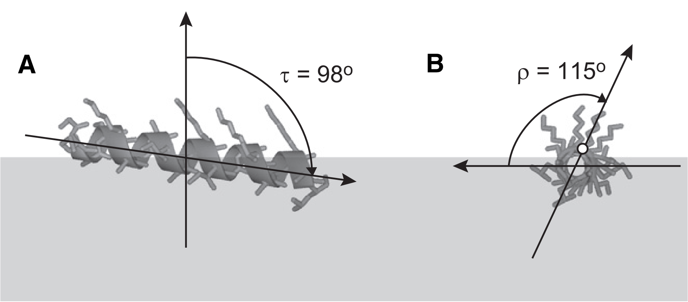

#### 倾斜角τ的数学表达

$$
\tau = \arccos(\vec{h} \cdot \vec{n})
$$

其中$\vec{h}$是螺旋轴向量，$\vec{n}$是膜法向单位向量。

#### PGLa的三态：一张图讲清抗菌肽如何“作案”

Strandberg团队选择了PGLa这个经典的抗菌肽作为研究对象。为什么选它？因为PGLa在不同条件下会表现出三种截然不同的取向，这正是建立“三态模型”的完美材料。

**表1：PGLa的三种取向状态**

| 状态 | 全称 | 条件 | 结构特征 | 角度参数 | 晃动幅度 | 物理图像 |
|------|------|------|----------|----------|----------|----------|
| **S-state** | Surface（表面态） | 低浓度（肽:脂=1:200） | 单体平躺膜表面 | $\tau = 97°$, $\rho = 117°$ | $\sigma_\tau = 17°$, $\sigma_\rho = 19°$ | 人趴在草地上，被表面吸附限制，晃动中等 |
| **T-state** | Tilted（倾斜态） | 中浓度（肽:脂=1:50） | 二聚体倾斜插入 | $\tau = 121°$, $\rho = 111°$ | $\sigma_\tau = 11°$, $\sigma_\rho = 20°$ | 两人手拉手斜插土里，二聚体约束让晃动减小 |
| **I-state** | Inserted（插入态） | 与magainin-2协同（肽:肽=1:1） | 寡聚体跨膜成孔 | $\tau = 157°$, $\rho = 97°$（等效$\tau = 23°$） | $\sigma_\tau = 8°$, $\sigma_\rho = 20°$ | 多人围圈钻透土层，刚性约束让晃动最小 |

这三个状态不仅角度不同，晃动幅度也呈系统性递减：

- 晃动幅度从17°降到11°再到8°，与“单体→二聚体→寡聚体”的物理图像高度一致
- 单体自由度最大，二聚体受限明显，寡聚体最有序，这一变化体现动力学约束的递增
- 这说明三态分类并非人为划分，而是有清晰物理差别的真实状态

#### 对照实验：WALP23的“自由爵士”

为了证明PGLa的规律不是偶然，Strandberg团队测量了WALP23这个疏水跨膜肽，得到一组强对照结果：

- WALP23倾斜角$\tau_0 = 14°$接近垂直，但晃动幅度高达$\sigma_\tau = 26°$, $\sigma_\rho = 66°$，显示极强的自由旋转
- 作为单体肽，WALP23不受寡聚体约束，可在膜内自由摆动，与PGLa的I-state形成鲜明对比
- 这一对照验证了“寡聚体越有序，晃动越小”的普遍规律，也证明$\ce{^2H}$-NMR能解析动态约束而不止于静态结构

为了直观理解S/T/I三态与对照构象的差别，见图1。子图A–C对应PGLa的S/T/I三态，子图D/E为WALP23在DMPC与DLPC中的跨膜取向，灰度阴影表示疏水性梯度，便于对照插入深度与取向变化。

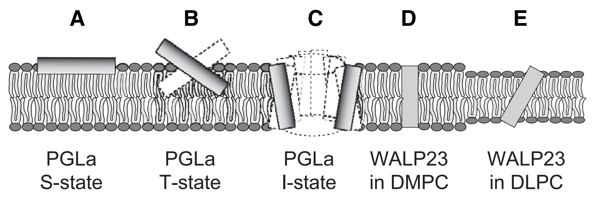

#### 为什么这篇论文重要？

这篇论文的重要性体现在四个方面：

- **方法学突破**：首次证明$\ce{^2H}$-NMR可以同时提取静态角度和动态涨落，超越传统NMR只能给出平均结构的局限
- **三态模型建立**：为膜肽研究提供统一描述框架（S/T/I），使不同实验室的数据具备可比性
- **物理合理性验证**：通过涨落分析确认三态不是人为划分，晃动幅度递减与寡聚化程度完全一致
- **普适性**：该方法随后被广泛用于多类膜肽与膜蛋白研究，成为领域内的标准工具

### PGLa：温度诱导的态转变

PGLa的温度/相态依赖（T态↔S态、低温DNP验证、脱水导致的I态）已经在《倾斜角的物理决定因素：从膜厚度到跨膜电位》中完整展开，这里不再重复。

#### $\ce{^{15}N}$ NMR化学位移与倾斜角的定量关系

$$
\delta_{\ce{^{15}N}} = \delta_{\parallel} \cos^2 \beta + \delta_{\perp} \sin^2 \beta
$$

其中$\beta$是N-H键相对磁场的取向角，$\delta_{\parallel}$和$\delta_{\perp}$是化学位移张量的主轴分量。对于α-螺旋：

$$
\beta = \arccos(\cos \tau \cos \alpha + \sin \tau \sin \alpha \cos \rho)
$$

其中$\tau$是倾斜角，$\alpha \approx 17°$是N-H键相对螺旋轴的夹角，$\rho$是方位角。通过拟合实验谱图，可精确提取$\tau$和$\rho$。

## S/T/I三态的具体观测

### Melittin/MelP5：MD直接观测三态转变

Melittin是蜜蜂毒液中的主要成分，为26个残基的阳离子短肽，具有强烈的溶膜与抗菌活性；在中性膜中可形成由多条肽支撑的跨膜toroidal孔道。MelP5则是降低正电荷数的变体，实验上在更低浓度即可活化，因此是研究“序列电荷如何调控孔道稳定性”的理想对照。

Melittin和其突变体MelP5是形成膜孔的经典模型肽。研究者**通过MD模拟直接观测到了S/T/I三态的动力学转变**，提供了三态存在的直接证据。

#### 研究动机：从“静态照片”到“动态电影”

在Strandberg的$\ce{^2H}$-NMR研究之后，科学界已经有了S/T/I三态的分类，但还缺少直接的视觉证据。$\ce{^2H}$-NMR告诉我们“有这三种状态”，但没法回答：
1. 这三种状态是如何相互转换的？
2. 转换的中间过程是什么样的？
3. 什么因素驱动了这种转换？

MD模拟的优势在于：**它可以记录每个时刻每个原子的位置**，相当于给分子拍了一部“电影”，而不仅仅是“照片”。

#### 核心设计：亲水性突变的巧妙之处

Melittin是蜜蜂毒液中的主要成分，能在膜上打孔。MelP5是它的突变体，只在几个关键位置换成了更亲水的氨基酸。为什么要这样设计？

- **Melittin的原始序列**：疏水性较强，倾向于稳定地跨膜
- **MelP5的突变序列**：增加亲水性，让它更“犹豫”于插入膜中

这种设计非常聪明：就像给一个本来喜欢潜水的人穿上了一件不那么喜欢水的衣服，他在水里的行为就会变得更加多样化——这正是研究者想要的，能够观察到更丰富的取向转变。

#### 实验设计：五种不同场景

研究者设计了5种不同的模拟体系，覆盖了从“稳定孔道”到“解离”的完整谱系：

| 体系 | 描述 | 观测到的现象 |
|------|------|------------|
| Melittin平行六聚体 | 6个Melittin肽段平行排列 | 稳定的跨膜孔道，多数在I态 |
| Melittin平行六聚体（部分解离） | 同上，但允许一个肽解离 | 一个肽从孔道逃逸到S态 |
| Melittin-MelP5混合六聚体 | 3个Melittin + 3个MelP5 | 两者的行为差异清晰可见 |
| MelP5平行六聚体 | 6个MelP5肽段 | 更大的倾斜角，更多T态 |
| Melittin-MelP5五聚体 | 最后只剩5个肽 | 观察孔道维持的最小单位 |

#### 关键发现：三种状态的动态身份识别

##### 发现1：I-state（插入态）——孔道的“骨架”

- **结构特征**：干三聚体稳定处于插入态，**倾斜角仅9–19°**
- **功能角色**：位于孔道中心，承担跨膜孔道的结构骨架功能
- **动力学特征**：5 μs模拟中始终保持I态，几乎不发生转换，显示高度结构刚性

图2展示干三聚体在平行六聚体中的逐步分离：不同颜色代表不同单体，三条螺旋从紧密结合走向轻微分开，但整体仍维持插入态；疏水侧链彼此朝内形成稳定核心，避免直接接触水性孔道。

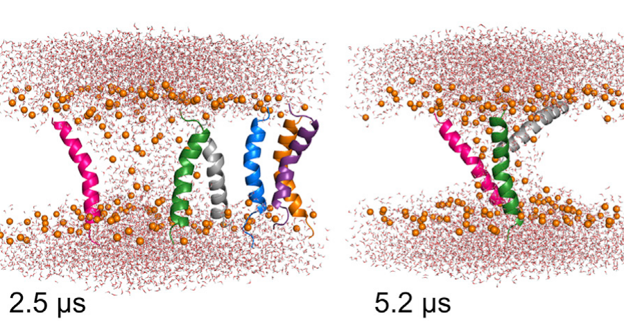

图S1进一步给出三聚体的细节构象，三条α-螺旋以反平行方式排列，疏水面朝内、亲水面朝外，解释其对孔道长期稳定的贡献。

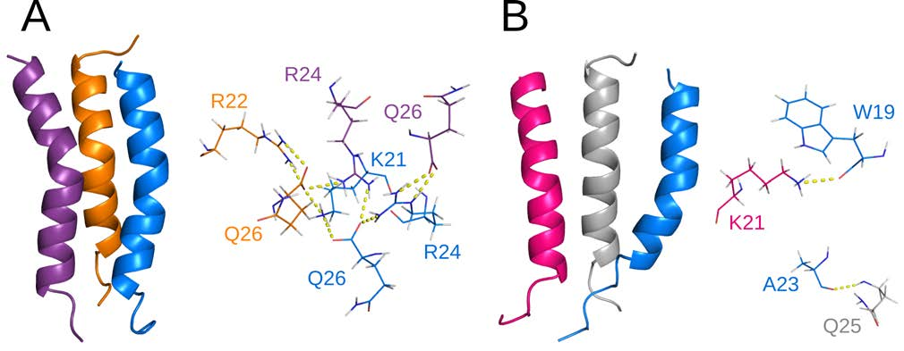

##### 发现2：T-state（倾斜态）——孔道的“边缘”

- **倾斜范围**：20–50°，明显高于干三聚体
- **功能角色**：连接跨膜孔道与膜表面的“桥梁”
- **动力学特征**：在T/I之间摇摆但更偏向T态，兼顾稳定性与柔性
- **构象直观**：文中未单独给出T态的构象图，但图5的MelP5六聚体中间态可作为参考，部分单体呈明显倾斜，符合孔道边缘的T态特征

##### 发现3：S-state（表面态）——逃逸者

- **现象特征**：个别单体跃迁到\~110°高倾斜角区间
- **结构含义**：从孔道区域回到膜表面吸附态
- **功能启示**：孔道组装可逆，单体可脱离并回到表面，这对抗菌肽毒性与选择性具有意义

图4展示平行八聚体中单体的解离轨迹，肽段从稳定孔道逐步脱离并转向膜表面，倾斜角从\~20°升至\~110°，直观对应I/T向S的转换；八聚体更容易出现逃逸，提示孔道越大越易不稳定。

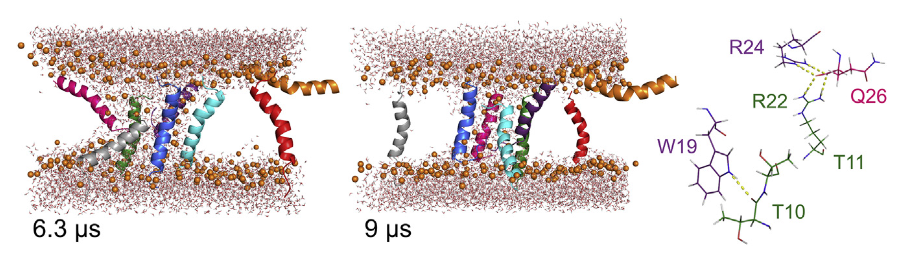

图6补充混合体系中的快速解离：异源相互作用较弱，melittin更易从混合孔道逃逸，孔径略缩小到\~0.8 nm但仍维持功能性孔道。

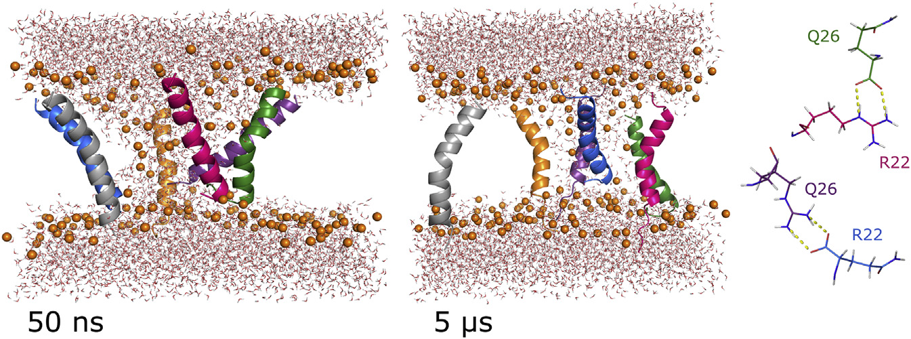

##### 发现4：Melittin vs MelP5的“性格差异”

亲水性突变对tilt angle的影响清晰可见：**Melittin的平均倾斜角为25°**（更垂直），而**MelP5的平均倾斜角达39°**（更倾斜）。这种差异的物理根源在于MelP5增加了亲水残基（Pro→His），导致螺旋“倾向于把头探出来透气”，**更大的倾斜角意味着孔道稳定性降低**，这解释了为什么MelP5在实验中表现出更快的孔道形成动力学和更低的细胞毒性。

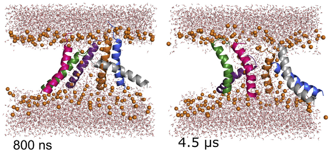

该图展示MelP5平行六聚体的构象演化：左侧为50 ns中间态，右侧为最终态，孔道逐步松散；相比melittin，MelP5倾斜角更大，部分肽段明显偏离垂直取向。不同颜色区分单体，脂质以球棍表示，直观呈现肽-膜相互作用。

#### MD模拟观测到的倾斜角分布

| 肽段 | 状态 | 平均倾斜角 | 描述 |
|------|------|-----------|------|
| Melittin（干三聚体） | I-state | 9–19° | 完全插入，维持跨膜孔道 |
| Melittin（孔道单体） | T-state | 20–50° | 倾斜取向，支持水性孔道 |
| Melittin（解离单体） | S-state | 113° | 转向表面吸附 |
| MelP5 | T/I混合 | 15–52°（平均39°） | 比melittin倾角更大，平均39° vs 25° |

MD模拟揭示**倾斜角与功能直接相关**：I-state构成孔道骨架，T-state连接孔道与表面，S-state代表脱离与回归；同时，**MelP5亲水性增强**（Pro→His）使平均倾斜角升至39°（melittin约25°），更“探头”的取向带来更快成孔与更高解离倾向并存的现象。

#### 为什么这篇论文重要？

这篇论文的重要性体现在四个方面：

- **直接视觉证据**：在原子尺度上“看到”S→T→I的完整转变过程，这是实验难以捕捉的动态事件
- **机制层面的深化**：干三聚体构成核心骨架，外围单体支撑孔道边缘，个别单体可逃逸到表面
- **序列与取向的关联**：亲水性突变使倾斜角增大、孔道稳定性下降，为理性设计提供定量线索
- **方法学示范价值**：MD补足实验静态信息，二者结合才能完整解释膜-肽相互作用

### Fis1尾锚：Monotopic vs Bitopic的取向区分

Fis1(TA)是线粒体外膜蛋白的尾锚片段，研究通过MD模拟结合增强采样技术分析了其在膜中的取向。该研究**明确使用tilt-angle**（$\theta$）和到膜中心的距离（$r$）作为两个集合变量来区分单层吸附（monotopic）和跨膜（bitopic）两种状态。其中“膜中心线”指穿过双层中心、沿膜法向（z轴）延伸的直线，$r$为肽段质心到这条直线的垂直距离（即在膜平面内的径向偏离），$\theta$为螺旋轴与膜法向的夹角。

#### 研究背景：尾锚蛋白的“身份危机”

尾锚蛋白（Tail-anchored protein, TA）面临两个相互竞争的取向：既可能单层吸附（monotopic）贴在膜表面，也可能跨膜插入（bitopic）穿透双层。Fis1作为酵母线粒体外膜蛋白，必须精准定位到膜上，因此“自发插入”还是“需要MIM复合物辅助”成为核心争论。

#### 核心设计：三步走策略攻克采样难题

MD模拟的难点在于采样稀有构象转换，研究者采用三步走策略：

| 步骤 | 目标 | 关键参数 | 结论要点 |
|------|------|---------|---------|
| Simulated Annealing | 让肽快速探索位置与取向 | 298 K → 800 K → 298 K | 11次独立运行一致收敛到monotopic，插入深度约0.7 nm |
| AA-REX | 获得平衡结构与tilt angle | 80个副本，298–471 K | α-螺旋保持完整，tilt angle集中在20–40° |
| Metadynamics + Hamiltonian REX | 定量评估能垒 | 集合变量$\theta$与$r$ | 能垒约15–20 kJ/mol（6–8 $k_BT$） |

##### 第一步：Simulated Annealing（模拟退火）——暴力破解
- **目标**：快速探索所有可能位置与取向，避免陷入局部能量谷
- **操作**：298 K升到800 K再降回298 K
- **结果**：**11次独立SA一致收敛到monotopic态**，插入深度约0.7 nm

##### 第二步：AA-REX（全原子副本交换）——精细平衡
- **目标**：获得平衡结构并精确定义tilt angle
- **操作**：80个副本覆盖298–471 K
- **结果**：α-螺旋完整保留，**tilt angle集中在20–40°**

AA-REX的结构结果见图3，可按子图理解：
- 子图(a)为代表性构象快照，显示Fis1 TA以α-螺旋形式嵌入膜内；
- 子图(b)给出序列特异性α-螺旋倾向性，残基132–151中除羧基末端5个带电/极性残基外，其余部分螺旋性接近1；
- 子图(c)展示残基相对膜/水界面的平均深度，疏水段（132–146）埋藏约0.7 nm，而带电末端延伸至界面附近；
- 子图(d)给出螺旋轴与膜法向夹角的分布，用于定义并量化倾斜角$\theta$，结果显示monotopic态主要集中在20–40°。

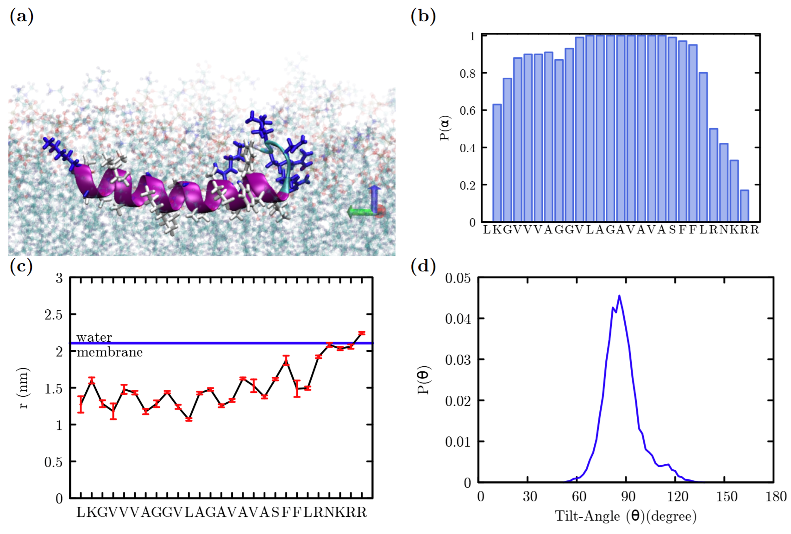

##### 第三步：Metadynamics + Hamiltonian REX——自由能面
- **目标**：定量评估monotopic↔bitopic的自由能能垒
- **操作**：以$\theta$和$r$为集合变量驱动采样
- **结果**：**能垒约15–20 kJ/mol**，解释常规模拟“看不到转换”的原因是能垒过高

#### 自由能分析

自由能面的关键结果见图4：子图(a)为$F(r,\theta)$自由能面，色条表示相对自由能高低，1和3对应monotopic态，2和4对应bitopic态，虚线标示膜-水界面；子图(b)给出各极小值代表构象，并用不同颜色球标记N端与C端。**核心结论**是monotopic与bitopic之间能垒显著，且从羧基端跨越的路径更高（文中约60 kJ/mol），与“带电末端锁定表面态”一致。

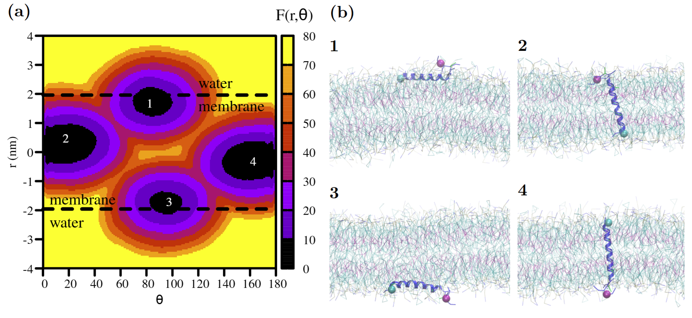

$$
F(\theta, r) = -k_B T \ln P(\theta, r)
$$

其中$P(\theta, r)$是在倾斜角$\theta$和距离$r$处的概率分布。Monotopic态对应$\theta \approx 20-40°$且$r \approx 0.7$ nm（埋藏在单层内），而bitopic态对应$\theta \approx 0-10°$且$r \approx 0$（跨越双层中心）。

#### 关键发现：带电末端的“守门员”作用

自由能面揭示了四个能量极小值（monotopic为1/3，bitopic为2/4），虽然两者能量相近，但能垒高达15–20 kJ/mol，导致monotopic→bitopic几乎不可达。

| 状态 | 典型倾斜角$\theta$ | 位置$r$ | 自由能极小值 | 物理含义 |
|------|-------------------|--------|-------------|---------|
| Monotopic | 20–40° | \~0.7 nm | 1、3 | 单层吸附稳态 |
| Bitopic | 0–10° | \~0 | 2、4 | 跨膜插入态 |

Fis1尾锚的羧基末端含**5个连续带电/极性残基**（Asn-Arg-Lys-Arg-Arg），形成“门禁”：

- **monotopic态稳定**：电荷停留在脂质头部极性区域，形成离子桥
- **bitopic态受阻**：电荷穿越疏水核心代价高（每个电荷约3–5 kcal/mol）
- **总能垒高**：累计约15–25 kJ/mol，将构象“锁”在表面态

序列分区如下：

| 片段 | 残基范围 | 组成特征 | 作用 |
|------|---------|---------|-----|
| 疏水段 | 132–146 | VAL、ALA、LEU为主 | 驱动插入与疏水匹配 |
| 带电末端 | 147–151 | R、N、K、R、R + COOH | 离子桥锁定表面态 |

##### 发现3：验证突变的“失效”机制

- **A144D**：疏水段引入负电荷，插入深度不足
- **L139P**：脯氨酸破坏α-螺旋，取向不稳定
- **综合结论**：疏水段连续性与末端电荷位置必须精确，才能维持稳定拓扑

#### 为什么这篇论文重要？

- **方法学示范**：组合SA、AA-REX与Metadynamics破解稀有事件采样难题
- **解决争议**：支持Fis1可自发插入线粒体外膜，无需MIM复合物协助
- **揭示机制**：末端电荷通过能垒“锁定”monotopic态，明确拓扑决定因素
- **可移植框架**：为其他尾锚蛋白研究提供可复用的计算路径

## 影响取向角的关键因素

### S4螺旋：膜厚度、转移能与取向机制

S4是电压门控离子通道的电压感受器螺旋。采用各向异性溶剂模型（PPM 2.0）计算了其在不同膜厚度下的取向和插入自由能，揭示了**膜厚度对tilt angle的决定性影响**。
#### PPM模型与参数化

##### 研究动机：富精氨酸螺旋如何在疏水膜核心中“生存”？

研究动机可以拆成两层张力：

- **能量悖论**：S4富含带正电的精氨酸（Arg），按传统疏水效应理论在膜内应有~+20 kcal/mol能量惩罚
- **实验事实**：固态NMR显示S4以跨膜α-螺旋存在，tilt angle在22°到40°之间变化
- **核心问题**：**为什么含4个精氨酸的S4能稳定插入疏水核心？**

此外，不同实验报告的倾斜角差异（22°到40°）究竟源于真实物理变化还是实验误差？更根本的问题是：

- **哪些物理因素决定S4的tilt angle？**
- **膜厚度是否为决定性变量？**

##### 核心设计：各向异性溶剂模型（PPM 2.0）的巧妙之处

这篇论文采用Lomize等人开发的PPM（Positioning of Proteins in Membranes）模型2.0：

- **模型类型**：隐式膜模型（implicit membrane model）
- **核心思想**：将脂质双分子层视为“各向异性溶剂”，沿膜法向（z轴）具有梯度变化的极性、介电常数、表面张力和氢键供受体能力

| 要点 | 物理含义 | 对应量或范围 |
|---------|---------|-------------|
| 实验参数化 | 模型参数来自实验而非经验拟合 | 水浓度、极性、介电常数 |
| 中极性区域 | 膜内存在水浓度较高的缓冲区 | 头部约55 M，中极性区约3.66 M，核心约0.55 M |
| snorkeling效应 | 带电侧链可部分溶剂化以降低惩罚 | 精氨酸胍基团伸向中极性区 |
| 刚性体扫描 | 自动寻找最稳定取向与深度 | 倾斜角$\tau$、方位角$\rho$与膜深度$d$ |

#### 转移能与倾斜角随膜厚变化（含机制与验证）

| 取向状态 | 倾斜角范围 | 条件 |
|----------|-----------|------|
| **跨膜取向** | 22–40° | 取决于脂质双分子层疏水厚度 |
| **表面取向** | \~73° | 替代性表面结合态 |

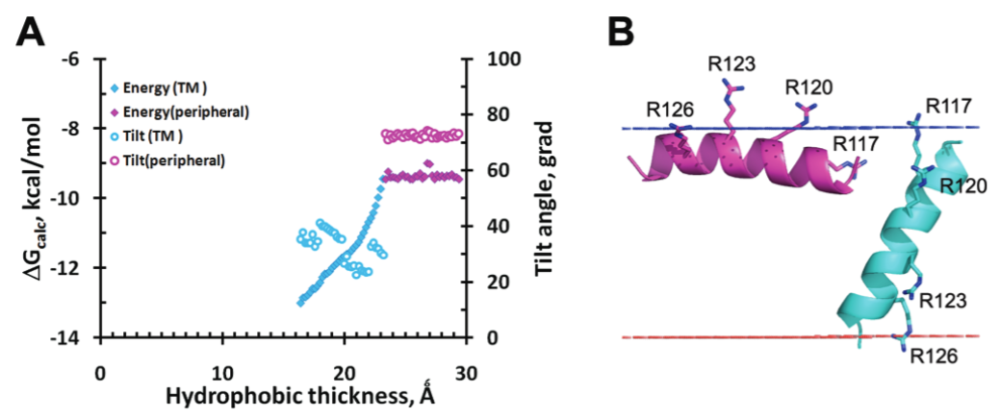

该图展示了S4螺旋在不同膜厚度下的能量和取向特征。这里的“转移能”$\Delta G_{\text{transf}}$指螺旋从水相转移到膜环境时的自由能变化，数值越低说明该取向更稳定、更容易被膜接受（图注注明$\Delta G_{\text{calc}}$未包含疏水匹配惩罚）：

- **子图(A) 能量与倾斜角**：菱形为转移自由能$\Delta G_{\text{transf}}$，圆圈为倾斜角，蓝色代表跨膜取向，紫色代表表面取向。跨膜态倾斜角随膜厚从22°增加到40°，表面态保持在\~73°
- **子图(B) 两种取向示意**：左侧为跨膜插入态（蓝色，倾斜\~40°），右侧为表面结合态（紫色，倾斜\~73°）。**snorkeling可视证据**：R120、R123、R126侧链伸向脂质头部磷酸基团区域形成离子桥，稳定两种取向

| 参数 | 文献值 | 说明 |
|------|--------|------|
| 表面取向转移能 | $\Delta G_{\text{transf}} \approx -9.5\ \mathrm{kcal/mol}$ | 表面取向的能量水平 |
| 跨膜取向转移能 | $\Delta G_{\text{transf}} \approx -9.5$ 至 $-14\ \mathrm{kcal/mol}$ | 取决于膜厚度 |
| 临界厚度 | 23.5 Å | 小于该厚度时跨膜取向更有利 |
| 表面取向倾角 | $\sim 73°$ | 替代表面结合态 |
| 跨膜倾角（薄膜） | $\sim 40°$ | DMPC变薄至16.4 Å时的插入倾角 |
| 最优厚度 | $21 \pm 6.8$ Å | 对应倾角 $22.5 \pm 11.4°$ |
| ER膜厚度 | 27.5 Å | 对应插入惩罚约0.5 kcal/mol，表面取向更占优 |

S4螺旋的取向由疏水匹配与局部溶剂化共同调控，计算与实验在关键量上吻合：

- **snorkeling效应**：R120、R123、R126侧链伸向脂质头部/中极性区域并与磷酸基团形成离子桥，降低带电残基埋藏惩罚
- **实验证据**：固态NMR显示S4在DMPC膜中以约40°倾斜插入，并诱导局部膜变薄约9 Å；DMPC疏水厚度从25.4 Å降到16.4 Å与计算预测一致
- **内质网膜情形**：原文指出在ER膜（疏水厚度约27.5 Å）**转位子介导的跨膜插入惩罚约0.5 kcal/mol**，这里的“惩罚”指插入相对表面结合的自由能代价，意味着插入仅略不利，因此表面取向相对更占优

#### 倾斜角与膜厚的定量关系

对于跨膜螺旋，倾斜角$\theta$由几何匹配条件决定：

$$
L_{\text{helix}} \cos \theta = d_{\text{hydrophobic}}
$$

其中$L_{\text{helix}}$是螺旋的疏水段长度（对S4约为30 Å），$d_{\text{hydrophobic}}$是膜的疏水厚度。因此：

$$
\theta = \arccos \left( \dfrac{d_{\text{hydrophobic}}}{L_{\text{helix}}} \right)
$$

这解释了为什么S4的倾斜角从22°（薄膜，$d \approx 28$ Å）增加到40°（厚膜，$d \approx 23$ Å）。

#### 为什么这篇论文重要？

这篇论文的重要性体现在四点：

- **统一实验观测**：用几何匹配定律解释22°到40°的倾斜角差异来自膜厚变化而非实验误差
- **揭示snorkeling机制**：PPM模型定量展示“中极性区域”对精氨酸稳定化的作用
- **建立理论框架**：$\theta = \arccos(d/L)$可预测多类跨膜螺旋的tilt angle
- **预测取向转换**：跨膜态与表面态能垒很小，提示电压感受过程中可能发生取向转换

## 第一篇的总结

本文通过$\ce{^2H}$-NMR、MD模拟等多种手段，系统阐述了**取向角作为区分膜相关螺旋插入状态的核心判据**。从经典S/T/I三态模型的定义，到实际观测中的动态转换，我们看到了这一简单指标的强大解释力：

1. **S/T/I三态的定量定义**：Surface态（60-120°）、Tilted态（30-60°）、Inserted态（0-30°）为理解膜-分子相互作用提供了清晰框架
2. **实验方法的互补性**：$\ce{^2H}$-NMR提供 ensemble average，MD模拟揭示动态轨迹，两者相互验证
3. **温度的鲁棒性**：DNP低温条件（100K）测得的取向与室温生理条件一致，验证了方法学可靠性
4. **序列决定取向**：疏水残基驱动插入，带电/极性残基决定表面结合

然而，一个核心问题仍未回答：**为什么同一条螺旋在不同膜环境里会选择不同的倾斜角，并触发S/T/I三态切换？** 第二篇将沿着疏水匹配、能量分化与静电调控三条主线展开，并用PGLa的跨膜电位耦合等案例说明如何把“角度变化”追溯到可量化的物理机制。

## 参考文献

1. 2H-NMR分析PGLa和WALP23的取向与动力学：S/T/I三态定义。Biophys J 2009, 96, 3223–3232. https://doi.org/10.1016/j.bpj.2009.01.026
2. PGLa的固态NMR研究与DNP低温验证。Sci Rep 2016, 6, 20895. https://doi.org/10.1038/srep20895
3. Melittin/MelP5膜孔形成的MD模拟：建立S/T/I三态分类体系。Biophys J 2018, 114, 2865–2874. https://doi.org/10.1016/j.bpj.2018.05.027
4. Fis1 tail anchor MD研究：单层吸附vs跨膜由取向角判别。Membranes 2022, 12, 752. https://doi.org/10.3390/membranes12080752
5. S4螺旋的PPM模型：取向-膜厚关系与固态NMR验证。J Chem Inf Model 2011, 51, 930–946. https://doi.org/10.1021/ci200020k
