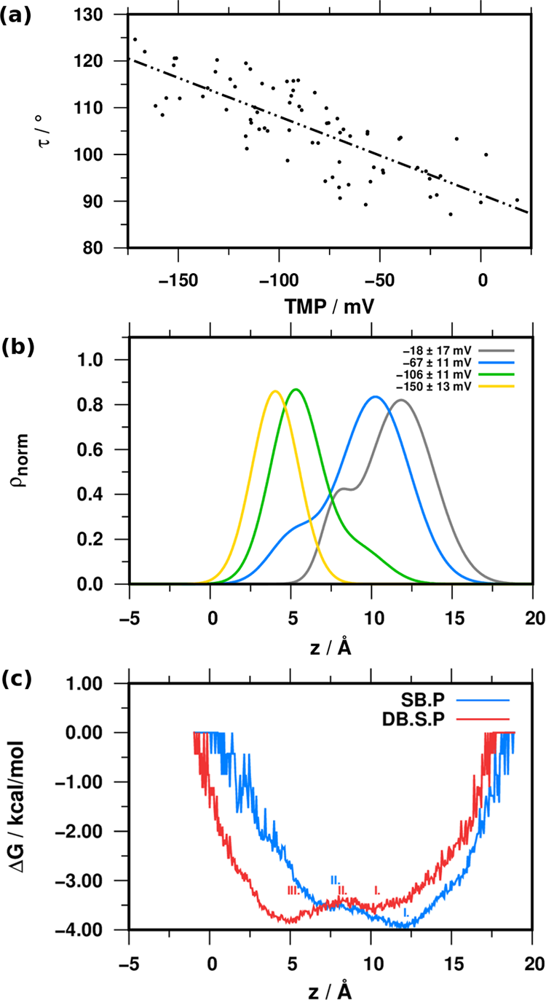
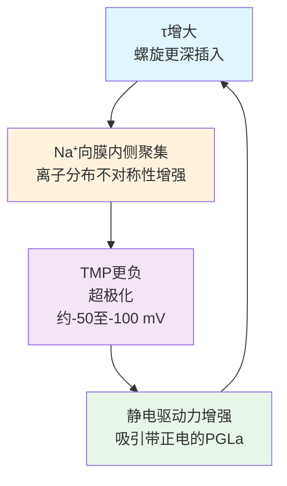
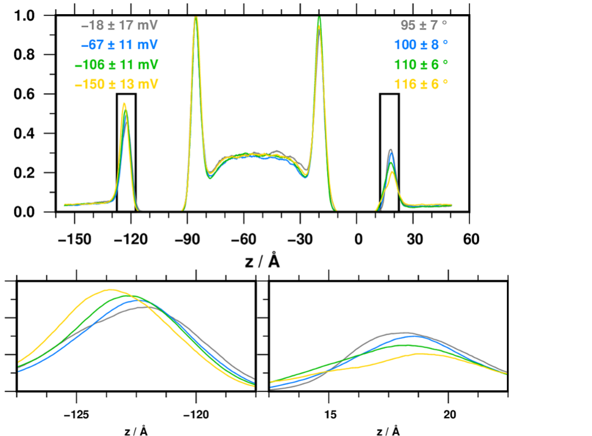
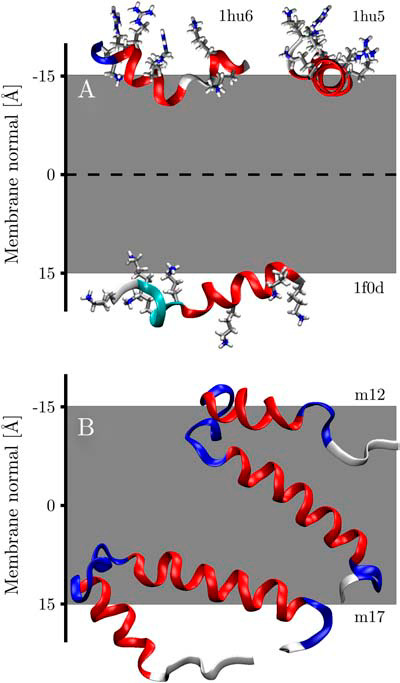
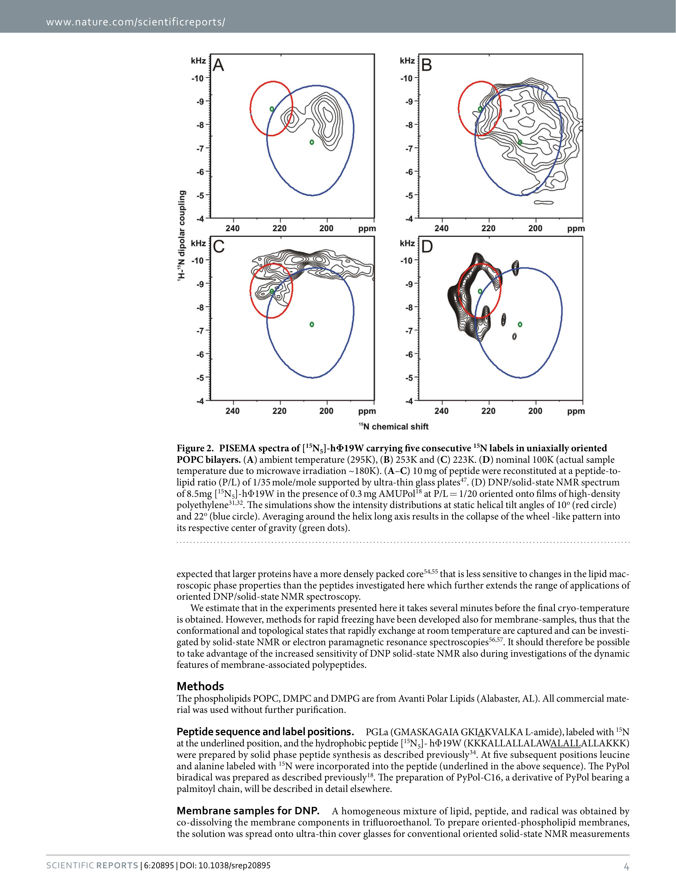
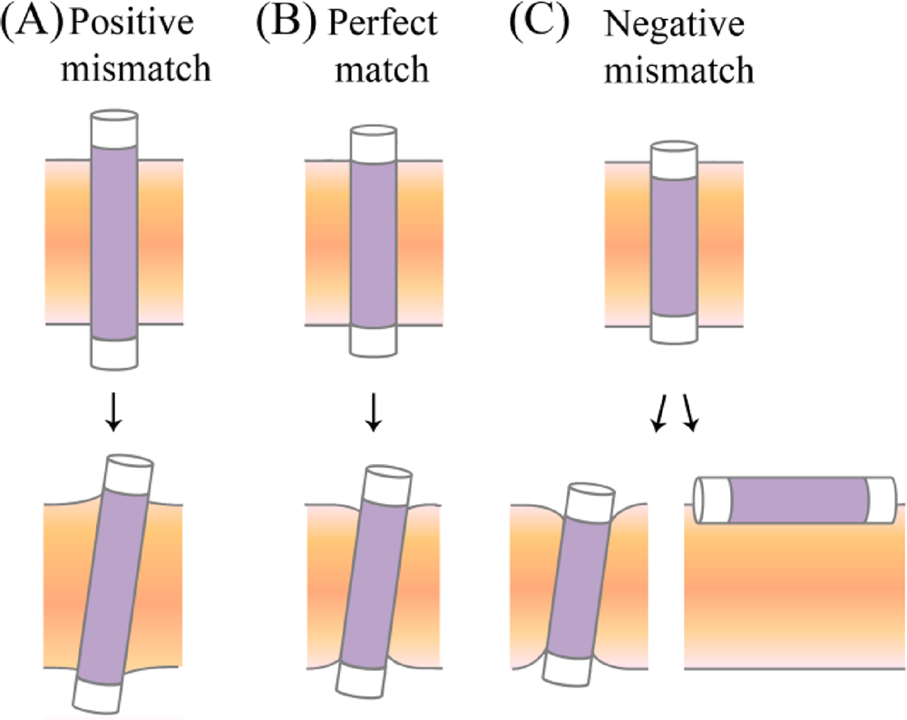
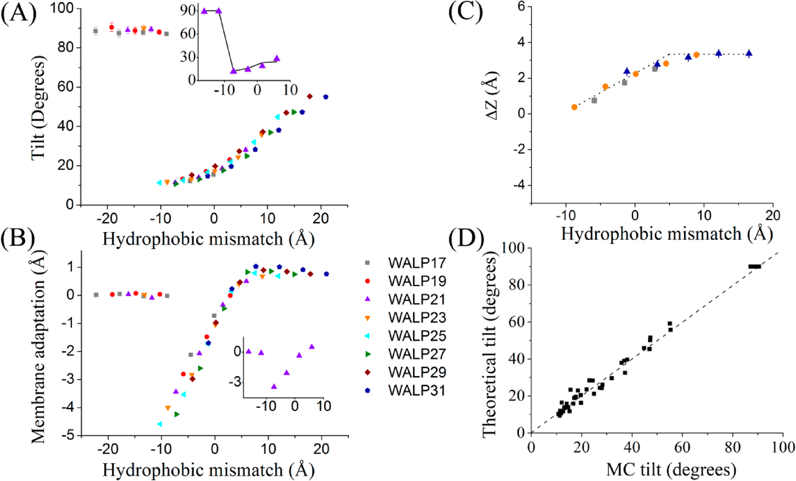
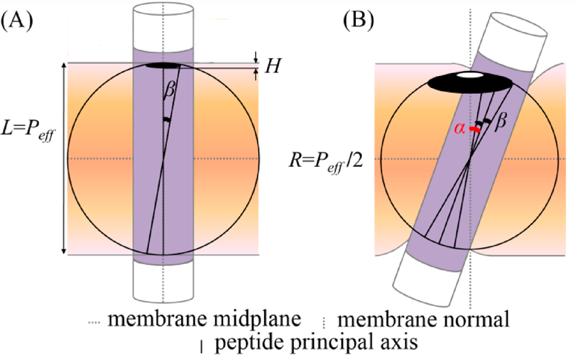
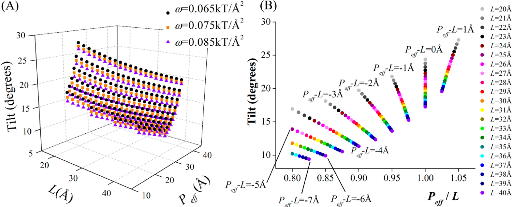

# 倾斜角的物理决定因素：从膜厚度到跨膜电位

## 引言

在《取向角即判据：用倾斜角判别膜肽表面/倾斜/插入三态，2H-NMR与MD证据》一文中，我们确立了**tilt angle作为区分膜插入状态的核心判据**。然而，仅仅“知道”一个螺旋的tilt angle是不够的，我们需要理解“为什么”它的tilt angle是这个数值，以及“如何”从序列预测取向。

本文深入探讨**决定tilt angle的三大物理定律**：疏水匹配定律、能量分化定律和静电调控定律。通过分析PGLa、hΦ19W、跨膜螺旋与抗菌肽等体系，我们将看到这些定律在不同系统中的一致性，并建立从序列到取向的定量预测框架。

### 跨膜电位对取向的调控：PGLa案例

> **本章要点**：
> - ✓ PGLa倾斜角与TMP的定量关系（r²=0.6）
> - ✓ 正反馈机制的三个环节
> - ✓ 细菌选择性的物理本质

PGLa是典型的两亲性α-螺旋抗菌肽（序列GMASKAGAIA GKIAKVALKA L-amide），对膜环境极其敏感，膜成分、肽脂比与水化条件都会显著改变其取向与拓扑，因此常被用作“电生理环境如何影响取向”的探针。

Németh等人通过MD模拟发现，**PGLa的tilt angle与跨膜电位（TMP）存在耦合关系**，揭示了电生理环境对抗菌肽取向的调控作用。

#### TMP是什么，如何控制？

| 项目 | 内容 |
|------|------|
| **定义** | TMP是膜内外静电势的差值，反映跨膜电场强度 |
| **盐梯度法** | 在双层膜中央隔室加入0.4 M $\ce{NaCl}$建立离子不对称分布 |
| **定量结果** | DB.S体系$\mathrm{TMP} \approx -66 \pm 28\ \mathrm{mV}$，加入PGLa后DB.S.P为$\mathrm{TMP} \approx -87 \pm 44\ \mathrm{mV}$ |
| **方法学对照** | 电荷分离法（NIIMB）会产生约4000 mV的非生理电位并扰乱膜结构，因此弃用 |
| **无TMP对照** | SB.P采用单层膜并依赖周期性边界条件使TMP近似为零 |

#### 跨膜电位对PGLa倾斜角的影响

该图展示PGLa倾斜角（τ）与跨膜电位（TMP）的耦合：子图(A)为τ与TMP散点图（375 ns轨迹按5 ns分段），线性回归$r^2=0.6$显示显著相关；子图(B)显示TMP越负，Ala20越靠近膜中心，对应更深的倾斜插入；子图(C)的自由能曲线对比表明TMP使最低点向膜中心移动，并改变跨越能垒形状。

#### 倾斜角τ与TMP的耦合机制

$$
\mathrm{TMP} = \phi_{\text{inner}} - \phi_{\text{outer}}
$$

其中$\phi$是沿膜法向 $z$ 方向计算得到的静电势。原文的做法是：先用 `gmx potential` 将体系中所有原子的部分电荷沿 $z$ 方向分箱求和，再把该电荷分布代入 Poisson 方程并做双重积分，得到跨膜的电势 profile；TMP就是膜两侧对应区域的电势差。PGLa插入后会重排膜-水界面的离子分布，因此改变电势 profile，最终改变TMP。

#### 定量关系

**τ增大**导致螺旋更深插入，$\ce{Na+}$离子向膜内侧聚集，从而**TMP更负**；**TMP更负**增强静电驱动力，促进带正电的PGLa倾斜插入，进而**τ增大**。这种**正反馈循环**解释了PGLa在细菌膜（TMP约-50至-100 mV）中的高活性——一旦开始插入，过程会自我加强。

定量关系可以拆成三个环节：

| 环节 | 描述 |
|------|------|
| **τ增大** | 螺旋更深插入，$\ce{Na+}$离子向膜内侧聚集 |
| **TMP更负** | 离子重排使TMP负向增强，静电驱动力增强 |
| **正反馈循环** | 更大的TMP进一步促进倾斜插入，解释细菌膜中PGLa的高活性 |

#### 关键发现

关键发现可以归纳为三点：

| 关键发现 | 详细描述 |
|----------|----------|
| **正反馈机制** | TMP更负增加tilted state population，螺旋更深插入并进一步改变TMP |
| **电生理调控** | 细菌膜内负电位（-50至-100 mV）促进倾斜插入，增强抗菌活性 |
| **物理机制** | 螺旋与膜-水界面$\ce{Na+}$离子的静电相互作用驱动耦合，离子重排成为电信号与结构变化的桥梁 |

#### Na+沿膜法向的分布揭示离子重排

该图给出四种TMP簇（对应不同平均倾斜角）的$\ce{Na+}$浓度分布。**高TMP（更负）时，膜内侧电双层的$\ce{Na+}$峰明显减弱，外侧相应增强**，体现出离子分布的不对称性；下方两个放大图进一步强调了电双层区域的变化。它直观展示了**“倾斜角越大，离子重排越明显”**这一机制性证据。

#### 深入解读：跨膜电位与PGLa取向的正反馈耦合机制

> **💡 阅读提示**：本节为深入解读，包含研究背景、实验设计和机制细节。如仅需核心结论，可跳至“为什么这篇论文重要？”部分。

##### 研究动机：细菌膜电位如何“召唤”抗菌肽？

研究动机有三层背景：

| 类别 | 内容 |
|------|------|
| **肽的生物学特性** | PGLa为阳离子抗菌肽，对多种细菌有效，机制与膜插入和破坏相关 |
| **选择性难题** | **如何在细菌膜与真核膜之间实现选择性？** |
| **电生理背景** | 细菌膜TMP约-50至-100 mV（内负外正），该电信号是否调控取向与活性仍未知 |

此前研究的核心缺口包括：

| 缺口类型 | 描述 |
|----------|------|
| **关注静态取向** | 多数研究只讨论表面态与插入态的静态分布 |
| **忽略TMP动态影响** | 体内有TMP、体外无TMP，取向行为可能显著不同 |
| **研究目标** | **建立TMP与PGLa tilt angle的定量关系** |

##### 核心设计：盐梯度法产生生理相关TMP

MD模拟中产生跨膜电位有两种主要方法：

| 方法 | 原理 | TMP大小 | 优缺点 |
|------|------|---------|--------|
| **电荷分离法（NIIMB）** | 在膜两侧放置不等数量离子直接产生电场 | ~数千mV | 远超生理范围并易导致膜破裂 |
| **盐梯度法** | 在中央隔室加入过量盐（0.4 M NaCl）形成浓度梯度 | -66至-87 mV | 生理相关，避免膜破裂 |

论文采用盐梯度法，并设置四组对照模拟：

| 模拟组 | 描述 | 目的 |
|--------|------|------|
| **DB** | 双膜，无肽 | 建立盐梯度作为空白对照 |
| **DB.S** | 双膜，无肽 | 验证盐梯度产生的TMP大小 |
| **SB.P** | 单膜，有肽 | 无TMP对照，周期性边界保证无电位差 |
| **DB.S.P** | 双膜，有肽，盐梯度 | 核心实验组，PGLa在有TMP条件下模拟 |

**关键设计**：**SB.P与DB.S.P使用相同初始结构，唯一差异是是否存在TMP**，从而干净分离电位效应。

##### 关键发现：正反馈循环的三个层次

论文通过500 ns MD模拟（分析最后375 ns），发现了PGLa tilt angle与TMP之间的**正反馈耦合**：

三层关键发现如下：

| 发现类型 | 详细描述 |
|----------|----------|
| **定量相关性（$r^2=0.6$）** | TMP越负，tilt angle越大，四个倾角-电位簇分别为：95±7°对应−18±17 mV，100±8°对应−67±11 mV，110±6°对应−106±11 mV，116±6°对应−150±13 mV |
| **population偏移** | 无TMP时以表面态（≈95°）为主，有TMP时插入态（≈110°–120°）显著增加 |
| **正反馈机制** | 倾斜插入使$\ce{Na+}$在膜内侧聚集、外侧减少，TMP更负后继续促进倾斜插入 |

这个机制的物理本质是静电耦合与离子重排的闭环：倾斜角增大使正电表面更靠近膜内侧，$\ce{Na+}$向内聚集导致离子不对称性增强，TMP因此更负并反向牵引PGLa继续倾斜。

##### 能量景观的重塑

论文计算PGLa沿膜法向（z轴）的自由能景观，显示**TMP重塑了能量面**：无TMP时全局最小值位于膜表面（z≈-15 Å），而有TMP时最小值向膜中心移动（z≈-10 Å），跨越能垒较低，插入态更容易被占据。

##### 为什么这篇论文重要？

| 重要性维度 | 具体体现 |
|-----------|----------|
| **解释细菌选择性** | 细菌膜负TMP（-50至-100 mV）放大插入与抗菌活性，而真核膜缺乏TMP驱动，多停留表面态 |
| **建立电生理-取向关系** | 首次定量显示TMP影响抗菌肽取向（$r^2=0.6$），为电生理调控提供框架 |
| **揭示自增强反馈** | 正反馈意味着一旦PGLa开始插入，过程会自我加强，解释“全有或全无”行为与协同效应 |
| **方法学创新** | 盐梯度法生成生理相关TMP，避免电荷分离法产生的过强电位（~4000 mV）与膜破裂问题 |

### 序列决定性：跨膜螺旋vs表面吸附肽

> **本章要点**：
> - ✓ 隐式膜模型揭示“序列决定取向”的物理本质
> - ✓ 跨膜螺旋与抗菌肽呈现截然不同的自由能景观
> - ✓ 计算与实验定量一致（偏差约±8°）

Ulmschneider等人开发了一种隐式膜模型来计算膜相关螺旋的取向，并与固态NMR实验结果进行了系统性对比。该研究**分析了6个跨膜螺旋和9个抗菌肽**，揭示了**序列决定tilt angle**的物理本质。

#### 跨膜螺旋vs抗菌肽的对比

| 肽类型 | 倾斜角特征 | 能量极小值 | 插入能 |
|------|-----------|-----------|--------|
| **跨膜螺旋**（6个） | 0–30°（接近垂直） | 膜中心（插入态）为主 | –4.7 ~ –10.2 kcal/mol |
| **抗菌肽**（9个） | 90±4°（平行于膜） | 膜表面（表面态） | 插入需克服约4–6 kcal/mol能垒 |

#### 跨膜螺旋与抗菌肽的自由能面对比

该图展示了两种截然不同的自由能景观：子图(A) AchR M2跨膜螺旋有两个极小值，膜中心（z≈0 Å，tilt≈15°）为全局最小值，膜表面（z≈±10 Å，tilt≈90°）为局部极小值；子图(B) Magainin仅在膜表面出现深色极小值，插入膜中心需克服约4–6 kcal/mol的能垒，与实验一致。

#### 隐式膜模型的自由能计算

$$
\Delta G(z, \theta) = \Delta G_{\text{solv}}(z, \theta) + \Delta G_{\text{elec}}(z, \theta) + \Delta G_{\text{conf}}
$$

其中包括三个主要项：

| 能量项 | 描述 |
|--------|------|
| **$\Delta G_{\text{solv}}$** | 溶剂化自由能，依赖残基在膜内的位置和取向 |
| **$\Delta G_{\text{elec}}$** | 静电相互作用能，主要来自带电残基与脂质头部的相互作用 |
| **$\Delta G_{\text{conf}}$** | 构象熵损失 |

对于跨膜螺旋，$\Delta G_{\text{solv}}$在膜中心最低（疏水残基埋藏）；对于抗菌肽，$\Delta G_{\text{elec}}$在膜表面最低（极性残基与头部相互作用）。

#### 计算结构与固态NMR结构的叠加对比

该图展示三个跨膜螺旋的计算预测结构（灰色）与固态NMR测定结构（红色）的叠加对比，验证了隐式膜模型的准确性：

| 蛋白 | 描述 | 结构一致性 |
|------|------|-----------|
| **AchR M2** | 烟碱乙酰胆碱受体δ亚基的M2通道片段 | 计算结构与NMR结构几乎完全重合 |
| **Influenza A M2** | 流感病毒A M2通道 | 取向高度一致，关键残基（Ser8、Gln13、Asp24）位置吻合 |
| **FD coat protein** | 噬菌体FD外壳蛋白，螺旋在页面平面内 | 结构一致性良好 |

#### 关键发现

**跨膜螺旋**的自由能面显示双重极小值，插入态（tilt ~15°）总是全局最小而表面态（tilt ~90°）为局部极小；**抗菌肽**的自由能面仅有一个表面极小值（tilt ~90°），插入到膜中心需要显著的自由能惩罚；**计算与实验定量一致**，6个跨膜螺旋的预测tilt angle与固态NMR测量值吻合，验证了隐式膜模型的可靠性；**物理机制**上，疏水残基驱动插入，极性/电荷/芳香残基决定螺旋在膜内的正确取向。

#### 深入解读：隐式膜模型揭示“序列决定取向”的物理本质

> **💡 阅读提示**：本节为深入解读，包含方法学细节、参数化策略和验证过程。如仅需核心结论，可跳至“为什么这篇论文重要？”部分。

##### 研究动机：计算机预测膜蛋白取向的“圣杯”

2007年，当这篇论文发表时，结构生物学领域面临一个重要挑战：**如何仅从氨基酸序列预测膜蛋白在膜中的取向？** 固态NMR实验能够测定tilt angle和rotation angle，但实验耗时费力，且无法进行大规模预测。另一方面，随着基因组测序的普及，大量膜蛋白序列被鉴定，但结构信息严重缺乏。如果能够开发一种计算方法，准确预测膜蛋白的取向，将极大推动膜蛋白结构和功能的研究。

此前已有一些隐式膜模型（如Wimley-White全息标度、生物物理模型等），但它们主要关注小分子或肽的膜结合能，**无法准确预测完整膜蛋白的tilt angle和rotation angle**。这篇论文的核心动机是填补这个gap——开发一种基于物理原理的隐式膜模型，能够准确预测跨膜螺旋和抗菌肽在膜中的取向，并与独立的固态NMR实验数据集进行系统性验证。

##### 核心设计：从“统计分布”到“物理模型”的参数化策略

论文采用的隐式膜模型基于一个巧妙的参数化策略：

1. **数据驱动的参数化**：从46个已解析的α-螺旋膜蛋白结构（分辨率<4 Å）中，统计每种氨基酸残基沿膜法向（z轴）的分布$n_i(z)$。例如，疏水残基（Leu、Ile、Val）在膜中心（z≈0 Å）富集，带电残基（Arg、Lys、Asp、Glu）在膜表面（z≈±15-20 Å）富集，芳香残基（Trp、Tyr）在膜-水界面（z≈±10-15 Å）富集。
2. **势函数拟合**：将统计分布转换为转移自由能$\Delta G_i(z)$：
   $$
   \Delta G_i(z) = -k_B T \ln \left( \frac{n_i(z)}{n_i^{\text{bulk}}} \right)
   $$
   其中$n_i^{\text{bulk}}$是残基在水中的参考浓度。这个公式将“统计频率”转换为“物理能量”，使得模型具有明确的物理意义。
3. **刚性体扫描**：将肽或蛋白视为刚性体，扫描三个变量：tilt angle（θ，0°-180°）、rotation angle（ρ，0°-360°）、膜深度（z，-30 Å至+30 Å）。计算每个构象的总转移自由能：
   $$
   \Delta G_{\text{total}}(\theta, \rho, z) = \sum_{i=1}^{N} \Delta G_i(z_i)
   $$
   其中$z_i$是第$i$个残基在给定取向下的深度。找到全局能量最小值，即为预测的最优取向。

这个设计的巧妙之处在于：**模型参数完全来自真实膜蛋白结构的统计分布，无需任何人工调整或拟合实验数据**。这使得模型具有强大的预测能力——可以用于与参数化集完全独立的体系。

##### 关键发现：三种能量景观揭示“序列决定取向”的本质

通过对6个跨膜螺旋和9个抗菌肽的计算，论文揭示了三类截然不同的自由能景观：

1. **跨膜螺旋的双重极小值景观**：插入态（tilt≈0°-30°）为全局最小值，表面态（tilt≈90°）为局部极小值，upside-down态（tilt≈150°-180°）能量较高，对应错误拓扑。三类极小值解释了跨膜螺旋可在表面短暂停留再插入，以及拓扑具有方向性。
2. **抗菌肽的单极小值景观**：表面态（tilt≈90°）是唯一极小值，插入态需克服约4–6 kcal/mol能垒，因此抗菌肽主要以表面吸附态存在，其机制依赖表面吸附而非直接跨膜插入。
3. **序列决定取向的定量规律**：疏水残基（Ala、Leu、Ile、Val、Phe）是插入驱动力，极性残基（Ser、Thr、Asn、Gln）偏向表面，带电残基（Arg、Lys、Asp、Glu）强烈偏好膜-水界面，芳香残基（Trp、Tyr、Phe）形成界面“aromatic belt”。因此疏水比例高的螺旋更易跨膜，带电/极性比例高则更易表面吸附。

##### 计算与实验的定量验证

论文将计算预测与独立的固态NMR数据集（6个跨膜螺旋）进行了对比：

| 跨膜螺旋 | 实验tilt angle (°) | 计算tilt angle (°) | 偏差 (°) |
|---------|-------------------|-------------------|---------|
| AchR M2 | 11 | 19 | +8 |
| Influenza A M2 | 37 (38±3) | 41 | +4 |
| FD coat protein | 19 (26) | 23 | +4 |
| VPU | 16 (13) | 5 | -11 |
| NMDA NR1 | - | 40 | - |

平均偏差约±8°，这处于固态NMR实验的不确定性范围内（±5°至±10°），验证了模型的准确性。

##### 为什么这篇论文重要？

1. **建立了“序列→取向”的定量预测框架**：该工作展示了隐式膜模型可用于预测tilt angle与rotation angle，为后续大规模膜蛋白取向预测与数据库建设提供了方法学基础。
2. **揭示了自由能景观的普适规律**：论文发现跨膜螺旋和抗菌肽呈现截然不同的能量景观——双重极小值 vs 单极小值。这个规律后来被多次验证，成为理解膜蛋白-脂质相互作用的基础。
3. **为药物设计提供理论指导**：通过分析残基贡献，论文揭示了哪些残基类型驱动插入，哪些残基决定取向。这为理性设计膜活性肽（如抗菌肽、细胞穿膜肽）提供了定量指导。例如，若要设计跨膜肽，应增加疏水残基比例；若要设计表面吸附肽，应增加带电/极性残基比例。
4. **方法学的创新影响**：论文采用的“统计分布→物理模型”的参数化策略影响了后续许多隐式膜模型的开发，包括HSAFT、IMM1、MEMBPLUGIN等。这种方法避免了人工调整参数，保证了模型的客观性和可迁移性。

## 方法学：计算与实验的相互验证

### 固态NMR：hΦ19W的温度效应

对含有19个疏水残基的跨膜锚定肽（hΦ19W）的研究发现：

- **室温条件**：螺旋绕长轴快速旋转导致N-H偶极耦合运动平均化，$\ce{^{15}N}$化学位移呈现尖锐共振峰，螺旋轮模式坍缩到其质心
- **低温/DNP条件**：$\ce{^{15}N}$化学位移变化约20 ppm，指示倾角减小约10°（例如从~22°减小到~10°），螺旋更直立
- **物理解释**：低温下脂质双分子层疏水厚度增加，跨膜螺旋需通过减小tilt angle来维持疏水匹配，这一定量关系验证了疏水匹配定律

#### 深入解读：PGLa的温度效应与DNP固态NMR的可靠性验证

> **💡 阅读提示**：本节为深入解读，包含技术背景、实验设计和结果分析。如仅需核心结论，可跳至“为什么这篇论文重要？”部分。

##### 研究动机：低温是否改变了膜蛋白的“真实面貌”？

研究动机来自对DNP低温条件的三重担忧：

- **技术优势**：DNP固态NMR可用微波激发电子自旋并转移极化，信号增强约10–100倍
- **关键限制**：**必须在100 K左右极低温下进行**
- **科学疑问**：低温是否改变膜相态（液晶→凝胶/亚凝胶），并冻结肽的取向与构象，从而影响生物学意义

这篇论文的核心动机就是回答这个问题：**DNP条件下的低温测量是否仍然能反映膜蛋白在生理条件下的真实取向？**

##### 核心设计：巧妙的“双线作战”策略

作者采用“一石二鸟”的双体系策略：

- **PGLa抗菌肽**：两亲性α-螺旋，约21残基，常以表面态（tilt angle≈81°）存在，取向对脂质组成与温度敏感
- **温度探针**：若低温改变取向，PGLa会最先表现出来
- **hΦ19W跨膜锚定肽**：19个连续疏水残基的典型跨膜螺旋
- **对照逻辑**：tilt angle由疏水匹配决定，若温度改变膜厚，应出现可预测的倾角调整

实验设计的关键创新是**带棕榈酰链的biradical（PyPol-C16）**：

- **传统问题**：水溶性biradical（如TOTAPOL）易从脂质双层析出，增强效率低
- **结构改造**：加入16碳脂肪酸链，相当于“膜锚”
- **机制结果**：嵌入膜疏水核心并与膜蛋白共定位，DNP增强可达约17倍
- **技术意义**：静态（无旋转）条件也能获得高增强因子，突破以往依赖MAS样品的限制

##### PGLa与hΦ19W的温度与相态响应

| 条件 | $\ce{^{15}N}$化学位移最大值 | 对应倾斜角 | 构象状态 |
|------|---------------------|-----------|----------|
| 310 K，DMPC/$\ce{DMPG}$液晶相 | 125 ppm | 53° | 倾斜插入（T-state，可能是二聚体） |
| <297 K，凝胶相 | 87 ppm | 81° | 表面吸附态（S-state） |
| 脱水条件 | 160 ppm | 更小 | 垂直取向（I-state） |

##### 关键发现：温度的影响比预期小得多

实验结果的核心结论包括：

| 结论类型 | 详细描述 |
|----------|----------|
| **PGLa取向随相变切换** | 310 K时$\ce{^{15}N}$化学位移峰在约125 ppm，对应tilt angle≈53°（T态）；温度降至Tc以下（~297 K）后峰移至87 ppm，对应tilt angle≈81°（S态），100 K下仍保持良好取向 |
| **hΦ19W温度依赖** | 倾角随低温增厚而**减小约10°**（更直立），与疏水匹配几何关系一致 |
| **膜结构保持有序** | 100K与7W微波下仍呈现清晰PISEMA螺旋轮模式 |
| **DNP信号增强** | 0.7 mg单标记样品在7 W微波下获得可测信号，无微波条件下2天仍无明显信号；相关膜样品在静态条件下可达约17倍增强 |

##### 为什么这篇论文重要？

- **为DNP应用“正名”**：低温测得的取向与生理条件一致，消除方法学疑虑
- **揭示温度鲁棒性**：PGLa在低于相变温度（≤297K）的区间内取向保持稳定，说明表面吸附由静电-疏水平衡主导
- **技术突破**：PyPol-C16“膜锚”策略显著提升DNP增强，影响后续探针设计
- **验证疏水匹配**：hΦ19W倾角由约22°减小到约10°，与膜厚增加导致“更直立”的预测一致

#### hΦ19W的PISEMA谱图展示温度对取向的影响

该图展示hΦ19W在$\ce{POPC}$双层中的PISEMA光谱，温度诱导的取向变化清晰可见：295 K时快速运动平均化，螺旋轮坍缩到质心（绿点）；降至253 K与223 K时螺旋轮逐步清晰；100 K DNP条件下出现完整螺旋轮模式。谱形与10°与22°两种模拟倾角分布相对比，低温条件更接近**更直立的倾角**，与20 ppm位移指示的“倾角减小”一致。

#### 模拟结果

10°与22°倾角的螺旋轮模式用于界定实验谱图的倾角范围，低温数据更偏向更直立的一端。

#### PISEMA谱图的螺旋轮模式解析

PISEMA谱图中的每个峰对应一个残基，其坐标为$(\delta_{\ce{^{15}N}}, \delta_{\ce{^1H-^{15}N}})$，其中$\delta_{\ce{^1H-^{15}N}}$是偶极耦合常数。对于α-螺旋：

$$
\delta_{\ce{^1H-^{15}N}} = D_{\text{max}} \left( 3\cos^2 \beta - 1 \right) / 2
$$

其中$D_{\text{max}} \approx 10.7$ kHz是最大偶极耦合常数，$\beta$是N-H键相对磁场的取向角。螺旋轮模式的形状直接反映倾斜角$\tau$：

| 倾斜角 | 螺旋轮形状 | 物理机制 |
|--------|------------|----------|
| **$\tau \approx 0°$** | 圆形 | 所有残基的N-H键相对磁场取向等价，各向同性分布导致共振峰位置一致 |
| **$\tau \approx 10-22°$** | 椭圆形 | 长轴/短轴比定量反映倾斜程度，椭圆离心率随tilt angle增大而增加 |
| **$\tau \approx 90°$** | 坍缩为质心点 | 螺旋绕长轴快速旋转导致偶极耦合平均化 |

### 理论计算方法的验证

#### 隐式膜模型

PPM 2.0相比1.0显著改进了**外围蛋白膜结合能**的预测精度（$R^2$从0.47提升至0.78，RMSE从2.73降到1.13 kcal/mol），说明模型的能量参数化更加可靠。

#### PPM模型的转移自由能计算

$$
\Delta G_{\text{transfer}}(\theta, z) = \sum_{i} \Delta G_i(z_i)
$$

其中$\Delta G_i(z_i)$是第$i$个原子在膜深度$z_i$处的转移自由能，通过原子溶剂化参数（ASP）计算。给定倾斜角$\theta$与膜中心位置$z$，对所有原子求和即可得到整体转移自由能。

## 科学共识：倾斜角的物理决定因素

通过对多篇文献的系统分析，我们可以总结出**控制膜相关螺旋取向的三大物理定律**，这些规律在跨膜螺旋、抗菌肽与电位耦合体系中得到了一致的验证。

### 定律1：疏水匹配定律

任何膜相关螺旋的最优倾斜角$\theta_{\text{optimal}}$都由螺旋疏水长度与膜疏水厚度的几何匹配决定：

$$
\theta_{\text{optimal}} = \arccos\left(\frac{d_{\text{membrane}}}{L_{\text{hydrophobic}}}\right)
$$

#### 公式的通俗解释

**核心思想**：螺旋的疏水长度$L$与膜的疏水厚度$d$必须匹配，否则会产生能量惩罚。

**形象比喻**：想象把一根长筷子（螺旋）插入一个水杯（膜）中：
- **筷子长度 = 杯口深度**：筷子可以垂直插入（θ ≈ 0°）
- **筷子长度 > 杯口深度**：筷子必须倾斜（θ > 0°）才能避免底部暴露在空气中
- **筷子长度 ≫ 杯口深度**：筷子几乎要平放在杯口（θ ≈ 90°）

**物理机制**：疏水残基必须被埋藏在膜的疏水核心内，否则暴露于水相或脂质头部会产生显著的能量惩罚（每个暴露的疏水残基约1-2 kcal/mol）。

#### 多文献验证

疏水匹配定律得到了多个实验体系的定量验证：

> **验证结论**：跨不同体系的一致性验证证明了疏水匹配定律的普适性。

| 体系 | 倾斜角 | 疏水匹配关系 |
|------|--------|--------------|
| **跨膜螺旋** | $\theta \approx 0-30°$ | 螺旋疏水长度$L$与膜厚度$d$近似相等 |
| **抗菌肽** | $\theta \approx 90°$ | 螺旋疏水长度$L$远小于膜厚度$d$ |
| **hΦ19W** | 低温下倾角减小约10°（更直立） | 膜厚增加时通过减小tilt angle来维持疏水匹配 |
| **PGLa** | 相变前后从约53°转向约81° | 体现膜厚与相态变化的调节效应 |

这些跨不同体系的一致性验证证明了疏水匹配定律的普适性。

#### 物理本质

疏水残基必须被埋藏在膜的疏水核心内，否则暴露于水相或脂质头部会产生显著的能量惩罚。

### 定律2：能量分化定律

自由能面$F(\theta, z)$的极小值位置和深度决定了螺旋的取向态。不同类型的螺旋呈现截然不同的自由能景观：

$$
\Delta G_{\text{insert}} = \Delta G_{\text{solv}} + \Delta G_{\text{elec}} + \Delta G_{\text{conf}}
$$

#### 两类体系的行为差异

| 体系类型 | $\Delta G_{\text{solv}}$主导项 | $\Delta G_{\text{elec}}$主导项 | 自由能面特征 | 最优态 |
|---------|----------------------|----------------------|-----------|-------|
| **跨膜螺旋 ⬇️** | 膜中心最低（疏水驱动） | 小（带电残基少） | 双极小值，膜中心为全局最小 | I-state (θ < 30°) |
| **表面吸附肽 ↔️** | 膜中心惩罚（疏水不足） | 膜表面最低（极性锚定） | 单极小值，膜表面 | S-state (θ > 60°) |

#### 多文献验证

- **Ulmschneider研究**：跨膜螺旋插入能为-4.7至-10.2 kcal/mol（有利插入），抗菌肽在膜表面态为能量最低，插入到膜核心需克服约4–6 kcal/mol能垒，定量解释了取向差异
- **PGLa**：310 K（T-state，53°）→ <297 K（S-state，81°），膜相态改变重塑能量面，使表面态更有利

#### 新增研究：总疏水矩控制倾斜角（Soft Matter 2025）

这项工作用粗粒化圆柱体模拟“保折叠的蛋白片段”，在圆柱表面设定可扭转的疏水条带，并系统扫描三类变量：疏水条带宽度、条带扭转角度、疏水相互作用范围。核心发现是：

- **三种相互作用态**：无相互作用、表面接触态、插入态（且插入态呈**可变倾斜角**）
- **插入态的两种稳态取向**：一种几乎平行于膜平面（与膜法向夹角约90°），另一种为倾斜态（轴线对膜法向有非零分量）
- **倾斜角的定性预测**：倾斜角随“总疏水矩”变化而调节，总疏水矩越大越偏向平行取向，减小或接近零时更容易进入倾斜态
- **膜形变证据**：在表面接触态出现与twister模型一致的膜形变模式，可用于估计施加的扭矩

#### 新增研究：进动熵与膜形变的能量平衡（JCTC 2012）

该研究提出倾斜角由**螺旋进动熵的增益**与**膜形变代价**的平衡决定，核心结论包括：

- **倾斜仍会发生**：即使在“完美匹配”或轻微负错配条件下，跨膜螺旋仍会倾斜，原因是进动熵增益可补偿膜形变自由能惩罚
- **最小倾角约10°**：在负错配区域，倾斜角随错配减小而下降，但最小值仍约10°
- **方程化预测**：推导了倾斜角与螺旋长度、膜厚度的“状态方程”，与粗粒化MC模拟和既有实验/计算吻合（理论与MC相关性$R^2=0.99$）
- **定义清晰**：倾斜角$\alpha$是螺旋轴相对膜法向的夹角，0°为垂直跨膜、90°为平行表面

该图以示意图总结三类疏水错配：**正错配**时螺旋更长、倾斜以缩短有效疏水长度并伴随膜扩张；**完美匹配**时也可能倾斜，因为进动熵增益可抵消膜形变；**负错配**时膜局部变薄以容纳螺旋，错配过大则倾向表面态。

该图给出MC模拟与理论模型的关键对比：(A) 倾斜角随错配变化，$\alpha=0°$表示螺旋轴垂直膜面，$\alpha=90°$表示平行；(B) 膜厚适配随错配变化；(C) 端部残基相对膜边界的位置变化；(D) 理论模型与MC结果高度一致（$R^2=0.99$），说明“进动熵–膜形变”平衡可定量预测倾斜角。

该图展示进动熵的几何来源：直立构象对应较小球面扇区面积，倾斜后对应更大的“带状区域”，**可达构象空间增大**带来熵增益，从而驱动倾斜。

该图给出“状态方程”的趋势：倾斜角$\alpha$随$L$增大而减小，随$P_{\mathrm{eff}}$增大而增大；膜刚性$\omega$影响较弱；在固定$\omega$下，$\alpha$与$P_{\mathrm{eff}}/L$近似线性相关。

#### 物理本质

疏水残基驱动插入，极性/电荷残基抑制插入，两者竞争决定自由能面形状。

### 定律3：静电调控定律

跨膜电位（TMP）通过静电相互作用调控倾斜角，形成正反馈循环，具体定量关系可在PGLa体系中直接观察。

> **核心发现**：PGLa的倾斜角与跨膜电位呈显著正相关（r²=0.6），细菌膜的内负电位（-50至-100 mV）通过正反馈机制促进倾斜插入，首次从物理角度解释了抗菌选择性。

#### 正反馈机制的三个环节

1. **τ增大导致螺旋更深插入**：当带正电的螺旋倾斜角增大时，螺旋更深入地插入膜内，导致$\ce{Na+}$离子向膜内侧聚集，膜内外离子分布不对称性增强，进而使**TMP更负**（hyperpolarization）
2. **TMP更负促进螺旋倾斜插入**：更负的TMP产生更强的静电驱动力，吸引带正电的螺旋进一步向膜内倾斜，导致**τ增大**，形成自增强的正反馈循环
3. **循环强化导致膜破坏**：正反馈循环的持续强化最终导致膜破坏和孔道形成，这在细菌膜（TMP约-50至-100 mV）中尤为显著，解释了抗菌肽的选择性毒性

#### 多文献验证

- **PGLa-TMP耦合**：MD模拟显示τ与TMP显著相关（$r^2=0.6$），细菌膜的内负电位（-50至-100 mV）通过静电吸引促进倾斜插入，这一正反馈机制解释了PGLa在细菌膜中的高活性（文献1）

#### 物理本质

带电螺旋与膜-水界面离子的静电相互作用提供了额外的取向调控维度。

### 预测规则：从序列到取向

基于上述三大定律，我们可以提出**膜相关螺旋的理性预测框架**。

#### 序列决定取向的定量规则

| 序列特征 | 预测取向态 | 倾斜角范围 | 物理依据 |
|---------|-----------|-----------|---------|
| 疏水残基 > 70%，带电 < 2个 | **I-state ⬇️**（跨膜螺旋） | 0–30° | 疏水驱动，$\Delta G_{\text{insert}} < 0$ |
| 疏水残基 < 40%，或带电 > 4个 | **S-state ↔️**（表面吸附肽） | 60–120° | 疏水不足，$\Delta G_{\text{insert}} > 0$ |
| 40% < 疏水 < 70%，或带电2-4个 | **T-state ↗️**（倾斜态） | 30–60° | 疏水匹配不完美 |
| 芳香残基集中在一端 | **📌 表面锚定** | θ > 60° | 芳香锚定效应 |

#### 环境调控取向的定性规则

| 环境因素 | 调控方向 | 物理机制 | 验证文献 |
|---------|---------|---------|---------|
| **膜厚度增加** | θ减小（更直立） | $L \cos \theta = d$几何匹配 | hΦ19W |
| **跨膜电位增大** | θ增大 | 静电吸引带电螺旋插入 | PGLa-TMP |
| **温度降低** | 取向发生可预测改变 | 膜厚/相态变化驱动疏水匹配调整 | PGLa、hΦ19W |
| **凝胶相** | θ→90°（表面肽） | 膜刚性增加，插入不利 | PGLa |

### 方法学共识：多维验证的必要性

没有单一方法能给出完整的取向信息，**三种方法必须互补使用**：

| 方法 | 优势 | 局限 | 提供信息 |
|------|------|------|---------|
| **固态NMR** | 原子级精度，直接测定θ和ρ | 时间平均，无法看动态转变 | 静态结构参数 |
| **MD模拟** | 动态过程，时间演化 | 力场精度，采样受限 | 转变路径、动力学 |
| **理论模型** | 快速预测，物理机制 | 需要实验验证 | 自由能面、预测 |

#### 交叉验证案例

多项研究展示了方法学互补的价值。PPM 2.0对外围蛋白膜结合能的预测精度显著提升（$R^2=0.78$），说明模型参数化更可靠；DNP固态NMR在低温条件下依然保持稳定取向，为实验测量提供可靠基准。这些案例共同表明，只有通过实验、模拟和理论的多维交叉验证，才能获得可靠的取向信息与物理机制。

### 应用价值：理性设计膜活性分子

基于这些科学共识，我们可以提出**膜蛋白/抗菌肽的理性设计原则**：

| 设计目标 | 设计规则 | 预测结果 |
|----------|----------|----------|
| **设计跨膜蛋白 ⬇️** | 疏水残基比例>70%，形成连续的疏水段（$L \approx d_{\text{membrane}}$）；净电荷数<2个，避免穿越疏水核心的巨大能量惩罚（每个电荷约3-5 kcal/mol） | I-state（θ < 30°），稳定跨膜插入，自由能面显示膜中心为全局最小值 |
| **设计表面锚定肽 ↔️** | 疏水残基比例<40%，或疏水段长度 $L \ll d_{\text{membrane}}$；引入芳香残基（Trp、Tyr）在疏水/水界面形成“锚”，利用芳香侧链偏好膜-水界面的性质 | S-state（θ > 60°），稳定表面结合，自由能面在膜表面显示单一极小值 |
| **设计环境响应型肽 ↗️** | 引入多个正电荷（Lys、Arg），利用静电调控定律，使细菌膜负电位（-50至-100 mV）触发插入；设计$L$与目标膜厚度$d$匹配的疏水段，通过疏水匹配在不同膜环境中实现最优取向 | T-state（30° < θ < 60°），环境诱导的取向转变，具有条件激活的特性 |
| **设计膜破坏性抗菌肽 💥** | 初始态为S-state（表面结合，θ > 60°），避免在正常组织中过早插入导致毒性；细菌负膜电位（-50至-100 mV）→ TMP更负 → 静电驱动促进转向T/I态，实现选择性激活；多肽协同形成跨膜孔道（I-state寡聚体），通过“地毯式”或“桶板式”机制破坏膜完整性 | PGLa、Melittin/MelP5的S→T→I转变展示了从表面吸附到倾斜插入再到跨膜成孔的完整路径 |

---

## 总结

**分子主轴相对膜法向的取向角是判断膜插入状态的关键指标**，本文围绕S/T/I三态模型系统性地总结了这一核心判据，并进一步提炼出**三大物理定律和定量预测框架**：

### 核心结论

> **🎯 三大物理定律**：通过多篇文献的交叉验证，我们发现了控制膜相关螺旋取向的普适规律

- **疏水匹配定律**：$\theta = \arccos(d/L)$，解释了跨膜螺旋、抗菌肽与hΦ19W等体系的倾角差异
- **能量分化定律**：自由能面形状（双极小值vs单极小值）决定了I/T/S态的稳定性
- **静电调控定律**：TMP与倾斜角存在正反馈耦合（$r^2=0.6$），实现了电生理调控

> **📊 S/T/I三态模型**：S-state（60–120°）表面吸附，T-state（30–60°）倾斜插入，I-state（0–30°）跨膜插入

- **实验验证**：MD模拟、固态NMR、2H-NMR多方法交叉验证，确保结论可靠性
- **方法学互补**：理论预测（PPM 2.0的能量参数化提升）、模拟采样（MD）、实验测定（NMR）三者结合
- **理性设计**：基于三大定律，可从序列预测取向，为膜蛋白/抗菌肽设计提供指导

#### 本质论点

取向角是非结合/表面态/插入态的**核心定量判据**，这一规律由三大物理定律（疏水匹配、能量分化、静电调控）控制，在跨膜螺旋与抗菌肽等体系中得到一致验证。通过多篇文献的交叉分析，我们从**现象描述**（S/T/I分类）上升到**机制理解**（三大定律），最终实现**定量预测**（序列→取向）。

## 参考文献

1. PGLa倾斜角与跨膜电位耦合的MD模拟研究。J Chem Inf Model 2022, 62, 4963–4969. https://doi.org/10.1021/acs.jcim.2c00779
2. PGLa的固态NMR研究与DNP低温验证。Sci Rep 2016, 6, 20895. https://doi.org/10.1038/srep20895
3. 隐式膜模型预测螺旋倾斜角：计算方法与NMR的系统性对比。Biophys J 2007, 92, 724–737. https://doi.org/10.1529/biophysj.106.089672
4. PPM 2.0各向异性溶剂模型与膜结合能评估。J Chem Inf Model 2011, 51, 930–946. https://doi.org/10.1021/ci200020k
5. Protein–membrane interactions with a twist：总疏水矩解释插入态倾斜角。Soft Matter 2025, 21, 4336. https://doi.org/10.1039/d4sm01494d
6. The Transmembrane Helix Tilt May Be Determined by the Balance between Precession Entropy and Lipid Perturbation. J. Chem. Theory Comput. 2012, 8, 2896–2904. https://doi.org/10.1021/ct300128x
