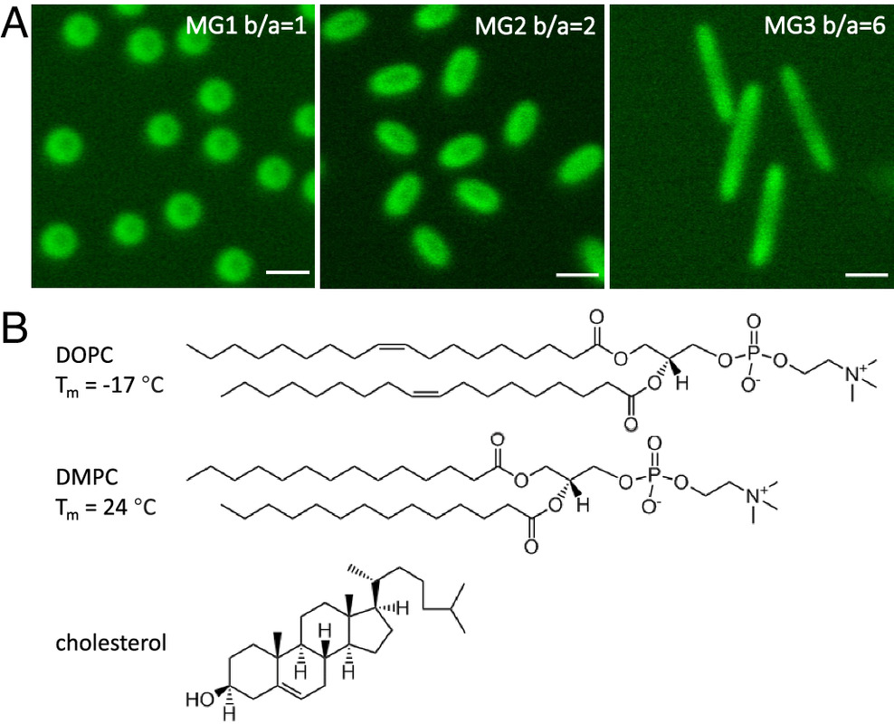
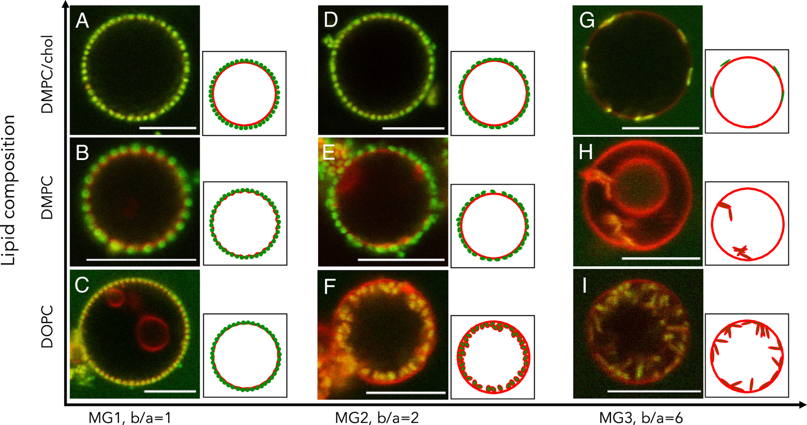
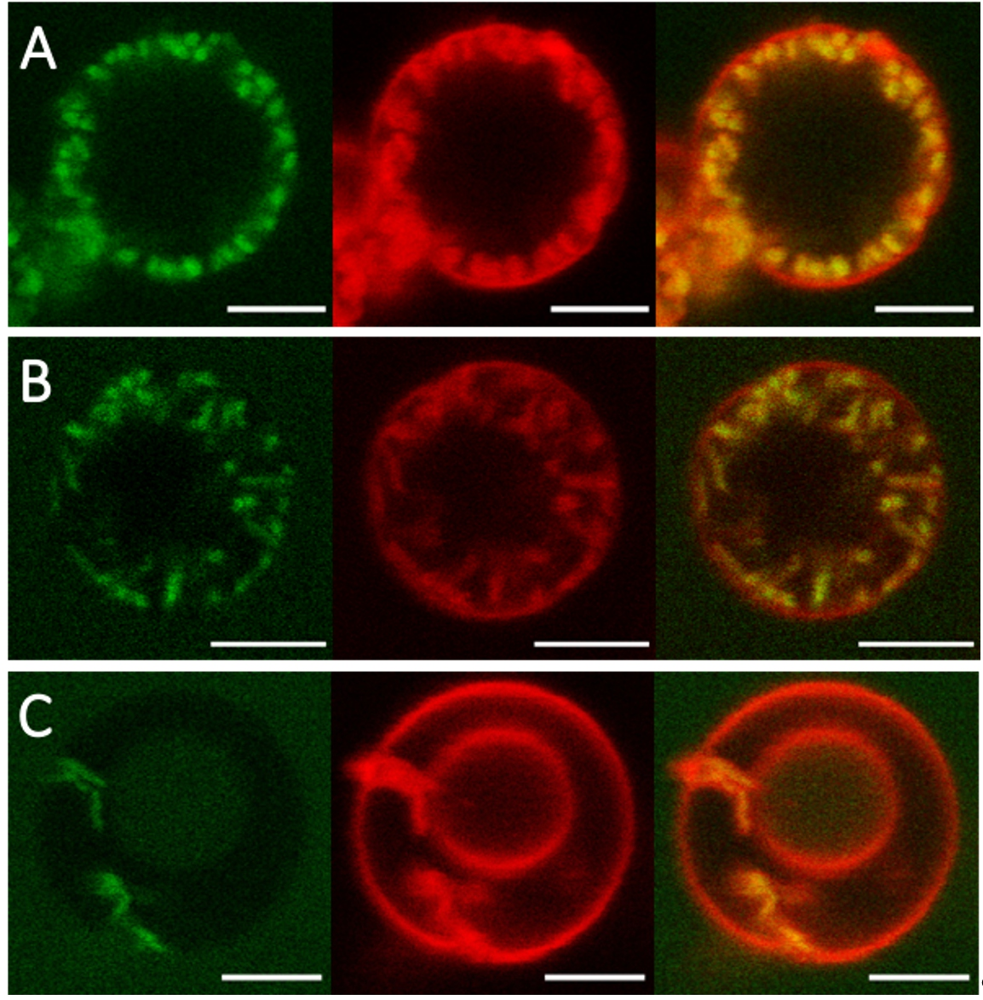
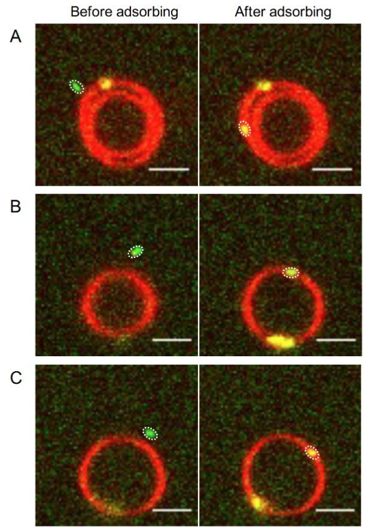
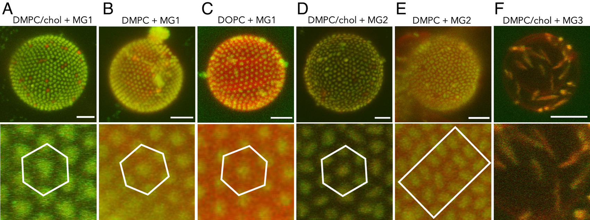
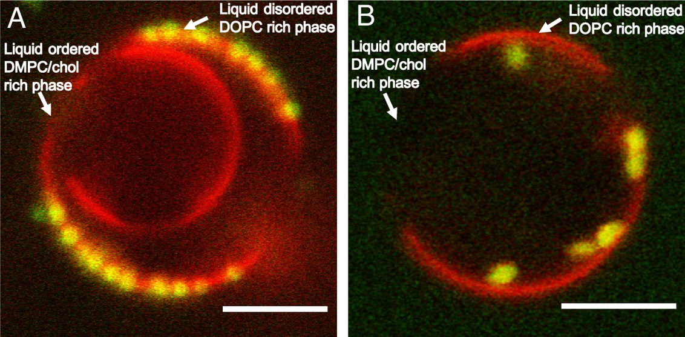
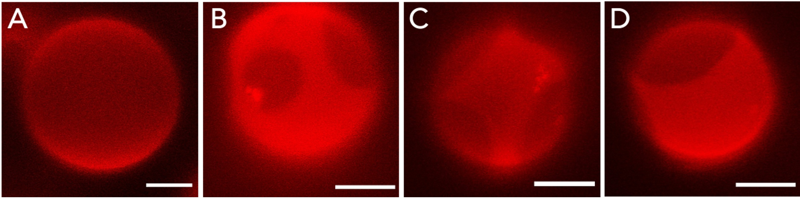
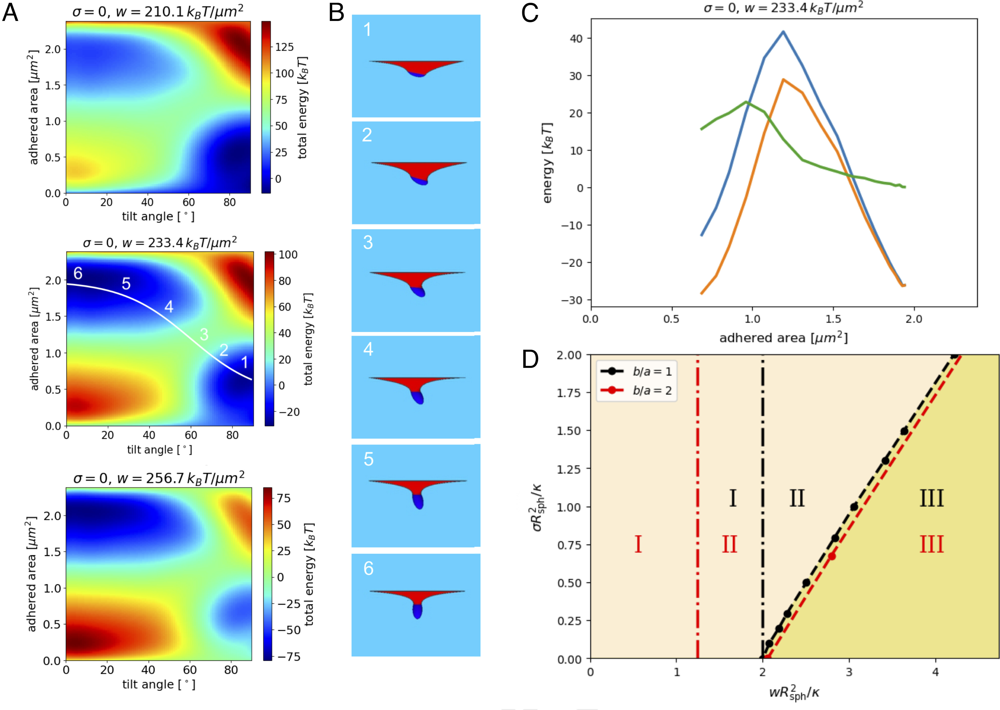
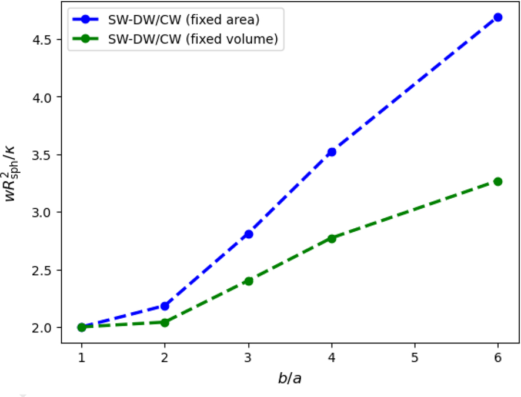

## 本文信息
- **标题**：脂质膜包裹各向异性微凝胶粒子：粒子形状与膜刚性的影响
- **作者**：Xiaoyan Liu, Thorsten Auth, Nabanita Hazra, Morten Frendø Ebbesen, Jonathan Brewer, Gerhard Gompper, Jérôme J. Crassous, Emma Sparr
- **发表时间**：2023年7月25日
- **单位**：隆德大学（瑞典）、于利希研究中心（德国）、南丹麦大学等
- **引用格式**：Liu X, Auth T, Hazra N, et al. Wrapping anisotropic microgel particles in lipid membranes: Effects of particle shape and membrane rigidity. *Proc Natl Acad Sci USA*. 2023;120(30):e2217534120. https://doi.org/10.1073/pnas.2217534120

---

## 摘要
> 细胞通过内吞作用摄取大分子组装体或纳米颗粒，这一过程既与健康和疾病相关的生物过程有关，也涉及药物纳米颗粒的递送以及污染物的潜在纳米毒性。根据系统物理化学性质的不同，吸附的颗粒可能停留在膜表面、被膜包裹或通过类似内吞的过程穿过膜。本文研究了软性核壳微凝胶粒子的形状、粒子-膜粘附能、膜的相行为和膜弯曲刚性如何调控胶体颗粒被脂质膜包裹的过程。共聚焦显微镜数据清楚地表明，通过调控粒子和膜的基本性质，可以定向控制包裹行为、膜变形以及颗粒在膜上的组织方式。**与相似体积的球形微凝胶粒子相比，椭球形微凝胶粒子的深度包裹状态更有利**。然而，基于固定粘附强度的理论计算预测了相反的行为——随着长径比增加，包裹变得更加困难，**微凝胶的粘附强度必须随粒子拉伸而增加**。考虑到微凝胶系统在不同形状、功能化和机械性能合成方面提供的多样性，这些发现进一步启发了未来涉及纳米颗粒-膜相互作用的研究，为新型生物材料和治疗应用的设计提供了指导。

### 核心结论

- **椭球形粒子更容易被深度包裹**：实验发现椭球形微凝胶粒子（长径比$b/a = 2$或$6$）比球形粒子更容易被脂质膜深度包裹，这与传统理论预测相反
- **膜刚性是关键调控因素**：膜的弯曲刚性越低、有效脂质头基面积越大，深度包裹越容易发生；液无序相（DOPC）膜比液有序相（DMPC/胆固醇）膜更容易包裹颗粒
- **粘附强度随形状变化**：实验与理论计算的差异表明，微凝胶的粘附强度不是固定的，而是随粒子拉伸程度的增加而增加，这可能是由于微凝胶变形导致的更多疏水残基暴露
- **形状调控包裹取向**：浅包裹的椭球形粒子长轴平行于膜表面，处于“潜艇”态；深度包裹的粒子长轴垂直于膜表面，处于“火箭”态，**两种状态之间存在能量势垒**
- **相分离膜的偏好性吸附**：在相分离膜中，球形和椭球形微凝胶都强烈偏好吸附到较软的液无序相，而不是较硬的液有序相

---

## 背景

细胞通过内吞作用摄取纳米颗粒的过程是生物医学和纳米技术领域的核心问题。无论是病毒感染、药物递送，还是环境污染物的毒性评估，都涉及纳米颗粒与细胞膜的相互作用。尽管过去二十年来理论预测和计算机模拟已经广泛研究了膜-颗粒相互作用，但**实验研究主要局限于球形颗粒**，而关于非球形软颗粒的包裹行为的实验研究仍然缺乏。

自然界中存在大量非球形组装体，如病毒衣壳、盘状高密度脂蛋白共组装物和各种形状的抗原颗粒。这些非球形颗粒如何被细胞膜识别和摄取，是理解细胞摄取机制的关键。然而，由于生物系统的分子复杂性，体内研究难以解耦各种分子机制。因此，**通过模型系统系统地研究物理化学参数对包裹过程的影响**，成为理解这一复杂问题的必由之路。

**核心科学矛盾**：传统理论预测椭球形粒子由于曲率大、弯曲能代价高，应该更难被膜包裹。然而，本文实验观察到相反现象——椭球形粒子反而更容易被深度包裹。这一理论与实验的矛盾揭示了**粘附强度随粒子形状变化**这一被传统包裹理论忽视的关键因素，成为本文研究的切入点。

### 关键科学问题

软性核壳微凝胶粒子的包裹行为受哪些物理参数调控？

- **形状效应**： 椭球形粒子是否比球形粒子更容易被膜包裹？理论预测和实验观察为何存在矛盾？
- **膜刚性作用**： 膜的弯曲刚性和脂质链堆积状态如何影响颗粒的包裹深度？
- **粘附强度变化**： 微凝胶的粘附强度是否随粒子形状变化而变化？这种变化如何影响包裹行为？
- **相分离膜的选择性**： 在相分离膜中颗粒如何选择性地吸附到不同的脂质相？这反映了什么物理机制？

### 创新点

本文在实验设计上运用**严格的控制变量策略**：三种微凝胶体积相同，仅长径比不同；三种脂质膜头基化学性质相同，仅弯曲刚性和链堆积状态不同。正因为变量拆得足够干净，**形状效应与膜刚性效应才能被相对独立地识别出来**。研究还采用了**多尺度验证体系**，把单粒子尺度的包裹状态与取向转变、群体尺度的膜上组装结构，以及环境尺度的均相膜与相分离膜放在同一篇文章里统一比较。

科学贡献方面，本文**首次系统研究了非球形软颗粒的膜包裹行为**，并通过实验与理论对照把问题收敛到一个核心机制上：**粘附强度并不是固定常数，而会随粒子形状变化**。文章还把粒子形状、膜刚性、膜张力和粘附能这四个关键参数放进同一个框架里讨论，并在液无序-液有序相分离膜中观察到**明显的偏好性吸附**，从而进一步指出**脂质链堆积状态会直接影响膜-颗粒相互作用**。

---

## 研究内容

### 实验系统设计

本研究采用了一个精心设计的模型系统，包括两个核心组成部分：**各向异性核壳微凝胶粒子**和**不同组成的脂质膜**

**微凝胶粒子设计**：研究使用了三种软性核壳微凝胶粒子，均由聚苯乙烯核和交联PNIPMAM（聚N-异丙基甲基丙烯酰胺）壳组成：

| 粒子类型 | 形状 | 长径比 $b/a$ | 20°C下几何尺寸 | 20°C下流体表征 | 制备方法 | 表面电荷 |
|---------|------|--------------|----------------|----------------|----------|----------|
| **MG1** | 球形 | 1 | 核心半径 $215 \pm 13~\mathrm{nm}$；水合尺寸约 $830 \times 830~\mathrm{nm}$ | 流体动力学半径 $462~\mathrm{nm}$；$D_T = 4.62 \times 10^{-13}~\mathrm{m^2\,s^{-1}}$ | 初始粒子 | 轻微正电 |
| **MG2** | 椭球形 | 2 | 长轴约1236 nm；短轴约620 nm | $D_T = 4.17 \times 10^{-13}~\mathrm{m^2\,s^{-1}}$ | 单轴拉伸 $50\%$ | 轻微正电 |
| **MG3** | 椭球形 | 6 | 长轴约2750 nm；短轴约446 nm | $D_T = 3.21 \times 10^{-13}~\mathrm{m^2\,s^{-1}}$ | 单轴拉伸 $400\%$ | 轻微正电 |

> 椭球形粒子通过对同一类球形核壳母粒进行单轴拉伸后处理获得，因此实验上**尽量把形状作为主变量，而不是重新合成另一批化学组成不同的颗粒**。不过，这里不宜把它表述成“严格等体积”：从SI Table S1给出的20°C水合尺寸粗略估算，MG2和MG3与MG1属于**相近体积量级**，但并非完全一致。
>
> 这里还要特别注意，主文中明确给出的核心半径 $215 \pm 13~\mathrm{nm}$ 和20°C下的流体动力学半径 $462~\mathrm{nm}$，只对应**母体球形核壳微凝胶MG1**。而 SI Table S1 中 MG1 的 $830 \times 830$ nm，则是基于共聚焦图像统计得到的**水合几何尺寸**。这两个量不是一回事：前者对应颗粒在溶液中的**流体动力学表征**，后者对应显微图像中的**几何外形尺寸**，因此不能直接拿来一一对照。
>
> 对于MG2和MG3，作者在SI Table S1里主要报告的是20°C下的长轴、短轴、长径比和扩散系数，而不是再压缩成一个单一的水动力学半径，因此正文表格也按原始表征方式保留这些数据。三种微凝胶都表现为**轻微正电**，这一点来自电泳迁移率测量；同时粒子还通过荧光探针Alexa488标记以便观察。

**图1**：球形和椭球形微凝胶粒子的形貌特征。（A）三种微凝胶粒子，即MG1球形、MG2椭球形（$b/a=2$）和MG3椭球形（$b/a=6$），在载玻片上的2D共聚焦激光扫描显微镜（CLSM）图像，温度28°C，标尺为1 μm。（B）DOPC和DMPC脂质的分子结构及熔点（$T_m$），以及胆固醇的分子结构。

**脂质膜设计**：使用三种不同组成的磷脂酰胆碱（PC）脂质制备巨单层囊泡（GUVs）：

| 脂质组成 | 相态 | 弯曲刚性 | 有效头基面积 | 熔点$T_m$ |
|---------|------|----------|--------------|----------|
| **DOPC** | 液无序（$L_d$） | 低 | 大 | -20°C |
| **DMPC** | 液无序（$L_d$） | 中 | 中 | 23°C |
| **DMPC/胆固醇** | 液有序（$L_o$） | 高 | 小 | - |

实验温度为28°C，确保DOPC和DMPC处于液态，而DMPC/胆固醇混合物处于液有序相。胆固醇的加入会进一步减小双层膜平面内每个脂质分子的有效面积；不过从文中引用的膜结构数据看，**每个PC头基的有效面积仍与液无序PC双层膜接近**。

这种设计的巧妙之处在于：**保持脂质头基化学性质不变，仅通过改变酰基链组成来调节膜的物理性质**，包括弯曲刚性和有效头基面积。

#### 微凝胶与膜的相互作用机制

微凝胶粒子与脂质膜的相互作用，原文更倾向于解释为：**以疏水黏附为主**，静电因素为辅。

- **静电作用不是主要差异来源**：微凝胶虽然带轻微正电，但三种模型膜都由两性离子PC脂质组成，在中性条件下整体不带净电。如果主导作用真是静电吸引，那么不同膜相乃至相分离膜的不同区域上，吸附强度应当更接近；而实验并没有看到这种结果。
- **更合理的主因是疏水链暴露差异**：液无序膜的酰基链堆积更松散，膜界面更容易暴露疏水烃链。作者据此提出，**微凝胶表面伸出的聚合物链段会部分插入这些暴露的疏水区域，从而提高粒子-膜黏附能**；DOPC膜之所以更容易发生深度包裹，也主要沿着这条机制来理解。

---

### 实验结果：形状与膜刚性调控包裹行为

#### 微凝胶在脂质膜上的吸附和包裹

通过共聚焦荧光显微镜观察，研究发现了三种不同的吸附-包裹状态：

| 状态 | 膜变形 | 粒子位置 | 典型特征 |
|------|--------|----------|----------|
| **表面吸附** | 无明显变形 | 膜表面 | 粒子仅吸附在膜表面，未嵌入膜中 |
| **浅包裹** | 轻微变形 | 部分嵌入 | 膜围绕粒子轻微变形，粒子部分嵌入膜中 |
| **深度包裹** | 显著变形 | 几乎完全被包 | 粒子几乎完全被膜包裹；对于椭球粒子，长轴通常垂直于膜表面 |

**图2**：球形和椭球形微凝胶粒子在不同脂质膜上的包裹行为。微凝胶粒子（绿色，标记为Alexa488）在GUVs脂质膜（红色，标记为Rhod-PE）上的吸附和包裹的2D CLSM图像。

- 微凝胶粒子：球形MG1（A-C）或具有不同长径比（$b/a$）的椭球形MG2（D-F）和MG3（G-I）
- 脂质组成：DMPC/胆固醇（A、D、G）、DMPC（B、E、H）和DOPC（C、F、I）
- 膜性质差异：DMPC/胆固醇的弯曲刚性最高，DOPC的有效头基面积最大

实验的核心发现可以概括为以下三个关键规律：

#### 规律1：形状依赖性

从图2出发，如果只对比两种液无序膜（DOPC与DMPC），形状效应可以简化为一句话：球形MG1在两种膜上都停留在表面吸附或浅包裹状态；而椭球形粒子更容易进入深度包裹，其中MG2只在更软的DOPC上达到深度包裹，MG3则在DOPC与DMPC上都能达到深度包裹，并伴随长轴由平行转向垂直膜面的取向重排。

**图S8**：深度包裹的直接图像证据。A为MG2被DOPC膜深度包裹，B为MG3被DOPC膜深度包裹，C为MG3被DMPC膜深度包裹。从左到右分别是粒子绿色通道、膜红色通道和合并图。原文特别指出，**深度包裹最直接的证据就是红色膜通道中出现显著膜形变**；这也是区分图2里“浅包裹”和“深度包裹”的核心判据。

#### 规律2：膜刚性依赖性

深度包裹发生在**弯曲刚性最低、有效脂质头基面积最大、同时表观界面疏水性最高**的脂质膜上，以及长径比较大的微凝胶粒子。具体趋势如下：

| 膜组成 | 弯曲刚性 | 有效头基面积 | MG1球形 | MG2椭球（$b/a=2$） | MG3椭球（$b/a=6$） |
|--------|---------|-------------|---------|-------------------|-------------------|
| **DMPC/胆固醇** | 高 | 小 | 无包裹 | 浅包裹（平行） | 浅包裹（平行） |
| **DMPC** | 中 | 中 | 浅包裹 | 浅包裹（平行） | 深度包裹（垂直） |
| **DOPC** | 低 | 大 | 浅包裹 | 深度包裹（垂直） | 深度包裹（垂直） |

#### 规律3：取向依赖性

时间分辨成像显示，无论椭球形粒子以什么角度接近膜，它们**总是以长轴平行于膜的方式着陆**（Movies S1-S3），然后在某些组成下进一步被膜包裹。这表明粒子在吸附过程中会重新取向以最大化界面接触面积，反映了微凝胶与脂质膜之间存在强吸引力。

SI 的 Fig. S6 把这个过程展示得更直接：作者跟踪了MG2在DOPC囊泡上的吸附前后图像，三组例子虽然初始入射角度不同，但**一旦真正接触膜面，都会先转成长轴平行膜面的构型**。换句话说，深度包裹并不是“直接垂直撞上去就被吞进去”，而是先经历一个平躺吸附的中间阶段，然后才可能进一步重排成深包裹终态。

**图S6**：MG2在DOPC囊泡上的吸附前后序列图。A到C给出三个不同初始取向的例子，每一行左侧是吸附前，右侧是吸附后。尽管入射角度不同，吸附后都转成长轴平行于膜面的姿态。这个补充图说明，**“先平躺、后重排”是实验上直接可见的动力学路径**，而不是仅来自理论想象。

#### 微凝胶在膜上的组织结构

**图3**：吸附在GUVs上的球形MG1微凝胶（A-C）、椭球形MG2微凝胶（D、E）和MG3微凝胶（F）的3D CLSM图像，温度28°C，标尺：5 μm。

- **上图**：3D图像由共聚焦z-stack图像重建，合并了来自微凝胶（绿色）和标记了Liss Rhod PE的膜（红色）的通道。脂质组成为DMPC/胆固醇（A、D、F）、DMPC（B、E）和DOPC（C）
- **下图**：对应的放大图像显示微凝胶在脂质膜上的组装结构

除了包裹状态，研究还发现微凝胶粒子在膜上形成了高度有序的组装结构：

**球形MG1的六方晶体排列**：球形微凝胶在所有膜系统上都形成了具有**六方结构的2D胶体晶体**。这种紧密堆积的方式类似于之前观察到的PNIPAM微凝胶在流体DMPC和DOPC膜上的行为。

#### 椭球形MG2的取向有序

| 膜类型 | 膜刚性 | 分布特征 | 取向关联 | 类比 |
|--------|--------|----------|----------|------|
| **DMPC**（液无序） | 中 | 局部边对边排列 | 有明显取向关联 | 近晶状有序（smectic-like） |
| **DMPC/胆固醇**（液有序） | 高 | 均匀分布六方位置有序 | 无明显取向关联 | 塑性晶体构型（plastic crystal） |

**椭球形MG3的无序分布**：长径比最高的椭球形MG3微凝胶在膜表面呈**随机分布和取向**。

> 至少没有全都竖起来，或者说很多是躺着的……

这些有序结构的形成表明，微凝胶-膜相互作用不仅影响单个粒子的包裹状态，还调控多个粒子在膜上的集体组装行为。

#### 相分离膜的偏好性吸附

为了进一步研究膜刚性对微凝胶吸附的影响，研究者使用了由DOPC富集的液无序相和DMPC/胆固醇富集的液有序相组成的相分离GUVs。

**图4**：球形和椭球形微凝胶在相分离膜上的选择性吸附。

- 实验对象：吸附在由DOPC、DMPC和胆固醇（摩尔比7:7:3）组成的GUVs上的球形MG1微凝胶（A）和椭球形MG2微凝胶（$b/a=2$）（B）的2D CLSM图像
- 相分离特征：形成共存的液有序（液有序相**富含DMPC/胆固醇，黑色**）和液无序膜相（液无序相**富含DOPC，红色荧光更强**）
- 实验条件：温度16°C，标尺5 μm

**关键发现**：球形MG1和椭球形MG2微凝胶**都强烈偏好吸附到较软的DOPC富集的液无序相**。这与单相DOPC囊泡的观察结果一致：球形粒子只是被膜浅包裹，位于囊泡表面；而椭球形粒子被膜深度包裹。重要的是，在微凝胶不过量的条件下，**没有观察到微凝胶在液有序DMPC/胆固醇富集域上的吸附**。这种选择性吸附表明，脂质链的堆积状态显著影响颗粒的吸附。

> SI 的 Fig. S11 还补充了一个有用背景：DOPC/DMPC/chol（7:7:3）这个体系在28°C时还是均一液相，而降到17°C、16.5°C和16°C后会逐渐出现液无序相与液有序相共存。因此，图4里看到的选择性吸附不是随手挑了一个“看起来有相分离”的囊泡，而是建立在这个三组分膜温度诱导相分离已经先被单独验证过的基础上。

**图S11**：DOPC、DMPC和胆固醇三组分GUV在不同温度下的3D CLSM图像。A为28°C，此时仍是均一液相；B到D分别为17°C、16.5°C和16°C，此时可见液无序相与液有序相共存。**图中较暗区域对应更有序的DMPC/胆固醇富集相，较亮区域对应DOPC富集的较无序相**。它为图4里的选择性吸附提供了相分离本身已经成立的直接证据。

### 理论计算：包裹能预测

为了从能量角度理解包裹过程，研究进行了详细的数值分析，计算了包裹过程中膜曲率变化和微凝胶-膜接触面积变化产生的能量。

$$
E = \int \left( 2\kappa H^2 + \sigma \right) \mathrm{d}A - \int_{A_{\mathrm{ad}}} w \, \mathrm{d}S
$$

该公式包含以下物理量：$\kappa$为膜的弯曲刚性，$\sigma$为侧向张力，$w$为微凝胶与双层膜之间的粘附强度。$H = (c_1 + c_2)/2$表示**平均曲率**（mean curvature），其中$c_1$和$c_2$是主曲率，$A_{\mathrm{ad}}$为粘附在粒子上的膜面积。

这套理论的出发点其实很朴素：**先假设微凝胶只是一个给定形状、给定体积、给定黏附强度的“等效颗粒”**，再问膜在什么条件下愿意把它包进去。也正因为模型足够简洁，它很适合回答“**几何和膜弹性本身会把系统推向哪里**”这个问题，但不擅长处理真实微凝胶表面的化学异质性、壳层可压缩性以及局部链段重排。

#### 公式的通俗解释

这个能量函数可以理解成一个很直观的“**收益减成本**”的账本：膜想要包住粒子会付出代价，但一旦贴上去又能拿到粘附收益。最终是不是会进入深度包裹，**取决于三项量的此消彼长**。后面图5的“潜艇态”与“火箭态”、以及二者之间的能垒，本质上就是这三项能量在不同取向与包裹程度下竞争的结果。

- **弯曲能项**：$\int 2\kappa H^2\,\mathrm{d}A$是把膜“掰弯”所付出的能量。$\kappa$越大，膜越硬，同样的曲率变形就越贵，因此**深度包裹更难发生**。对椭球粒子来说，**尖端曲率更大**，这一项会更容易把系统“推回”到浅包裹的构型。
- **张力项**：$\int \sigma\,\mathrm{d}A$描述把更多膜面积“拉”进包裹区域时的代价。张力越大，膜越像一张绷紧的橡皮膜，想多包一点就得付出更高代价，所以**包裹转变所需的粘附强度会随张力增大而升高**。
- **粘附能项**：$-\int_{A_{\mathrm{ad}}} w\,\mathrm{d}S$是粒子和膜贴合带来的能量收益。$w$可以理解成单位接触面积能“**赚**”到的能量，$A_{\mathrm{ad}}$越大，收益越多，系统就越倾向于**从表面吸附走向深度包裹**。

换一种更直白的说法，图5里真正竞争的不是“平躺好还是竖起来好”这么简单，而是下面这两种倾向谁更强：

- **先多贴一点，先赚到黏附能**；
- **尽量别去碰最难包的尖端，先少付一点弯曲代价**。

正因为这两种倾向同时存在，椭球粒子才会自然出现“**潜艇**”和“**火箭**”两种稳定构型，而不是只有一种单调的包裹路径。

此外，原文还有一个很容易被忽略、但对理解实验条件很重要的提醒：**在共聚焦图像里看不到明显的热涨落，并不等价于囊泡处在高张力状态**。作者指出，即使囊泡近似“无张力”，其**形状涨落幅度也可能小到低于显微镜的可分辨尺度**。理论上，准球形无张力囊泡的球谐模涨落满足

$$
\langle |u_{l,m}|^2 \rangle = \dfrac{k_\mathrm{B}T}{\kappa\,l(l-1)(l+1)(l+2)}
$$

其中$u_{l,m}$是第$l,m$阶球谐形变模式的幅度（以囊泡半径为单位）。作者给了一个数量级估算：当$\kappa/k_\mathrm{B}T = 50$、囊泡半径$R = 5~\mu\mathrm{m}$时，主导的椭球形形变模（$l = 2$）对应的**典型幅度约为150 nm**，在实验成像中可能并不显著。这意味着，不能仅凭“**膜看起来很平滑**”就武断地认为张力很大，张力效应更可靠的判断仍应来自**独立测量或系统性的物理参数对照**。

**图5**：椭球形粒子的包裹能景观和状态转变。长径比$b/a = 2$、体积$V_0 = 0.31~\mu\mathrm{m}^3$的椭球形粒子在无张力、初始平面的脂双层膜上的包裹能，弯曲刚度为$\kappa = 20 k_{\mathrm{B}}T$。

读图提示：图5A的两个坐标其实对应两个最直观的“自由度”。$A_{\mathrm{ad}}$表示**有多少膜面积贴在粒子表面**，可以粗略理解为包裹深度；$\theta$表示**长轴相对膜法线的倾角**，$90^\circ$对应长轴平行膜面（潜艇态），$0^\circ$对应长轴垂直膜面（火箭态）。

- **（A）包裹能景观**：不同粘附强度$w = 210.1$、$233.4$、$256.7~k_{\mathrm{B}}T/\mu\mathrm{m}^2$下的包裹能景观，横纵坐标分别为粘附膜面积$A_{\mathrm{ad}}$和长轴相对于膜法线的取向角$\theta$；图中可见“**潜艇**”态的能量极小值对应浅包裹、$\theta = 90^\circ$，“**火箭**”态对应深度包裹、$\theta = 0^\circ$
- **（B）转变路径快照**：在$w = 233.4~k_{\mathrm{B}}T/\mu\mathrm{m}^2$时，“潜艇”态与“火箭”态之间**转变路径上的模拟快照**，展示粒子重新取向和膜逐步包裹的过程
- **（C）能量分解**：沿转变路径$A_{\mathrm{ad}} = 0.8(1.5 - \tanh(0.03(\theta-60^\circ)))~\mu\mathrm{m}^2$的能量分解：总能量为蓝色，粘附膜能量为橙色，自由膜能量为绿色，**二者之间的峰值对应两种状态之间的能量势垒**
- **（D）包裹相图**：固定体积$V_0 = 4/3\pi R^3_{\mathrm{sph}}$时的包裹相图，给出粘附强度$w$与侧向张力$\sigma$的关系；红线表示长径比$b/a = 2$的椭球粒子，黑线表示球形粒子，**I、II、III三区分别对应未包裹、浅包裹、深度或完全包裹**

#### 理论预测的关键发现

| 发现 | 描述 | 物理意义 |
|------|------|----------|
| **两种稳定状态** | “潜艇”态（$\theta = 90^\circ$）和“火箭”态（$\theta = 0^\circ$） | 浅包裹时避免高曲率尖端，深度包裹时一个尖端被包入 |
| **能量势垒** | 两种状态间存在能量势垒 | 对应于包裹高曲率尖端所需的弯曲能代价 |
| **张力依赖性** | 转变粘附强度随张力线性增加 | 需要从膜外拉入额外面积以完成包裹 |
| **形状依赖性** | $b/a = 2$时与球形粒子转变粘附强度相近，$b/a > 2$时更难包裹 | 高长径比粒子曲率更大，弯曲能代价更高 |

这些结果里，**真正解释得最扎实的其实不是实验趋势本身，而是深包裹的几何障碍来自哪里**。理论非常清楚地指出：问题主要出在**尖端包裹**。只要系统还没开始包那个高曲率尖端，平躺的浅包裹就更划算；一旦要跨进深包裹，就必须付出一笔额外的弯曲能，这就是图5C里那道能垒的来源。

**图6**：椭球形粒子包裹转变的标度粘附强度与长径比的关系。标度粘附强度$wR_{\mathrm{sph}}^2/\kappa$与椭球形粒子长径比（$1 \le b/a \le 6$）的关系图，适用于无张力、初始平面的脂双层膜。

读图提示：这里用$wR_{\mathrm{sph}}^2/\kappa$做无量纲化，相当于把**粘附驱动力**与**弯曲代价**放到同一标度下比较（$R_{\mathrm{sph}}$是等体积球的参考长度尺度）。因此，这张图最想表达的不是某一个具体数值，而是**理论预测的总体趋势**：粒子越细长，想要达到完全包裹所需的相对粘附强度会越高。

- 两种情况的展示结果：**固定粒子表面积**$S_0$时为红色，**固定粒子体积**$V_0$时为黑色
- 关键发现：对于长径比$b/a > 2$的椭球形粒子，**完全包裹所需的标度粘附强度随长径比线性增加**，这与实验观察到的趋势相反

#### 理论与实验的矛盾：粘附强度随形状变化

- 理论计算预测：**椭球形粒子比球形粒子更难包裹**，特别是对于高长径比的粒子。
- 实验观察则是：**椭球形粒子比球形粒子更容易被深度包裹**。

如何解释这一明显矛盾？研究者给出的核心解释是：**微凝胶的粘附强度不是固定常数，而会随着粒子被拉伸而增加**。具体支持证据如下表所示：

| 证据类型 | 具体机制 | 实验基础 | 作用 |
|---------|---------|---------|------|
| **表面性质变化** | 拉伸后粒子表面性质微小变化，提高膜黏附性 | 实验与理论对照、SI表征结果 | 增强椭球形粒子黏附 |
| **疏水链插入** | 微凝胶表面聚合物链段部分插入膜界面暴露的疏水烃链区域 | 液无序膜链堆积松散 | 增强与液无序膜的黏附 |
| **粒子柔软度** | 壳层可压缩，拉伸可能导致致密化、溶胀性下降和柔软度变化 | 理论模型未考虑 | 改变有效黏附能 |
| **局部膜缺陷** | 被埋入尖端形成孔洞或blister，降低包裹代价 | 理论预测（SI） | 辅助降低高长径比粒子包裹能 |

**理论局限**：固定粘附强度、忽略粒子柔软度的模型能抓住取向转换和能垒结构，却不足以解释“越细长反而越容易深包裹”的实验结果。

#### 更尖锐一点的评价

如果说得直接一点，这里的理论部分**更像是在界定“缺了什么物理”，而不是已经完整解释了实验**。

- **它成功解释了什么**：为什么椭球粒子会先平躺吸附，为什么浅包裹与深包裹之间会有能垒，为什么膜张力会抬高深包裹门槛。
- **它没解释什么**：为什么实验里长径比更大的粒子反而更容易深包裹。这个最核心的实验现象，并不是从模型内部自然推出的。
- **它最后真正给出的结论，其实是反推**：既然固定$w$的模型失败了，那真实系统里的有效黏附强度$w$就不能当常数看待，或者尖端附近还存在模型没纳入的局部膜重构。

SI 里关于 hole 和 blister 的分析，其实进一步暴露了这个边界：**主模型默认膜必须连续地去贴合尖端，但真实膜也许会通过开孔、局部鼓包或局部脱附来绕开最贵的那部分弯曲代价**。这让理论讨论更有启发性，但也说明它离“真正解释实验”还有一段距离。

## Q&A

- **Q1**：为什么理论预测椭球形粒子更难包裹而实验观察到更容易包裹？
- **A1**：关键在于理论把粘附强度$w$当作固定常数，但原文讨论部分认为，**拉伸会轻微改变微凝胶表面性质，从而提高膜黏附性**。再叠加液无序膜更容易暴露疏水链、微凝胶表面链段可部分插入膜界面的因素，实验中椭球粒子就会比理想刚性模型表现出更强的包裹倾向。此外，真实微凝胶的柔软度变化和尖端局部形成孔洞或blister，也可能继续降低高长径比粒子的包裹代价。
- **Q2**：膜刚性如何影响微凝胶的包裹行为？
- **A2**：这里其实有两层作用。
  - 第一层是**弯曲能代价**：更硬的膜更难围着粒子弯折，因此深度包裹更吃亏。
  - 第二层是**界面结构差异**：液无序膜的酰基链堆积更松散、更容易暴露疏水区域，因而更有利于微凝胶表面链段黏附到膜上。
  - 也正因为这两层因素叠加，在相分离膜里颗粒会明显偏向较软的液无序相，而不是液有序相。
- **Q3**：椭球形微凝胶的“潜艇”态和“火箭”态有什么物理意义？
- **A3**：这两个名字对应的是**同一个粒子在能量景观中的两个局部稳定构型**。
  - 在“潜艇”态里，长轴平行膜面，系统优先回避高曲率尖端被包住时带来的弯曲能罚分；
  - 在“火箭”态里，长轴转为垂直，膜包裹更深，黏附收益更大，但也要承担更高的局部弯曲代价。
  - 两者之间那道能垒，本质上就是“要不要把尖端也包进去”的代价。

---

## 关键结论与批判性总结

本研究通过精心设计的实验系统和理论计算，揭示了形状、膜刚性和粘附能如何协同调控软性纳米颗粒的膜包裹行为。

### 主要贡献

- **把形状、膜刚性和界面结构放到同一个实验框架中比较**：论文用体积相近但形状不同的软微凝胶，配合三类膜和相分离膜，比较系统地展示了包裹深度、粒子取向和膜上组装结构如何联动变化。
- **明确指出实验与传统刚性粒子理论之间的缺口**：理论能够解释“潜艇”态与“火箭”态、张力效应和高长径比的弯曲代价，却不能直接解释实验中椭球粒子更易深包裹这一结果。这个反差本身就是本文最重要的机制信息。
- **把差异进一步收敛到黏附能并非固定这一点**：原文讨论部分认为，粒子被拉伸后表面性质会发生微小变化，从而提高膜黏附性；再加上液无序膜更容易暴露疏水链区，最终使实验结果偏向深度包裹。

### 研究的局限性

- **缺乏对粘附强度的直接测量**：文章提出的“粘附强度随形状变化”是基于理论-实验矛盾的推论，缺少AFM力谱等直接测量手段来定量验证$w(b/a)$的关系，如果能补充这部分数据，结论将更加直接。
- **分子机制不够明确**：粘附强度变化的三种可能机制（表面性质变化、疏水链插入、柔软度变化）都是定性推测，没有实验区分哪种机制占主导。未来工作可以通过荧光标记疏水区域、测量接触面积等方式深入。
- **理论模型的修正空间**：现有理论假设固定粘附强度，主要用于凸显问题。可以在模型中直接引入形状依赖的粘附强度参数$w(b/a)$，进行定量预测，这样能够建立更完整的理论框架。
- **形状效应的饱和**：实验发现MG2（$b/a=2$）和MG3（$b/a=6$）的包裹行为差异不大，说明在$b/a>2$后，形状效应可能饱和，这一点在讨论中可以更明确地指出。

| 局限性类型 | 具体描述 | 研究需求 |
|-----------|---------|---------|
| **理论模型简化** | 模拟未纳入粒子柔软度、壳层可压缩性及拉伸致密化效应 | 需要开发考虑微凝胶结构和体弹性的详细模型 |
| **局部降能机制** | 孔洞或blister等局部膜缺陷机制未定量化 | 需要更深入的理论和模拟研究这些辅助机制 |
| **模型系统简化** | 使用成分可控的PC模型膜，缺少蛋白、糖脂等复杂成分 | 需要在更接近真实细胞膜的系统中验证 |

### 对相关领域研究者的启发

- **药物递送系统设计**：不要只关注球形颗粒，各向异性颗粒可能带来意外优势，但必须同时考虑**形状 + 膜刚性 + 粘附强度可变性**的三元调控，椭球形颗粒不一定总是更好，取决于具体应用场景。
- **颗粒-膜相互作用模拟**：软颗粒的粘附强度不应设为固定常数，需要考虑粒子形变导致的接触面积变化，可以尝试在模型中引入$w = w_0 \cdot f(\text{shape}, \text{deformation})$。
- **实验方法开发**：AFM力谱、光镊等单分子技术可以直接测量颗粒-膜粘附力，原位成像技术（如冷冻电镜）可以观察接触界面的分子结构，这些技术补充将让这类研究更加完整。

### 应用启发

- **对递送颗粒设计的直接启发**：如果目标是提高膜包裹与摄取概率，单纯改变几何形状还不够，还必须同时考虑膜刚性、局部链堆积状态以及粒子表面在变形后的黏附性变化。
- **对后续模型构建的启发**：这篇文章提示，研究软颗粒摄取时，最好把粒子柔软度、壳层重排和界面黏附的可变性一起纳入，而不是继续沿用固定黏附强度的刚性粒子近似。

> **结语**：
> - 这篇文章最有价值的地方不只是发现椭球粒子更容易被深度包裹，而是进一步猜想：**一旦颗粒是软的、可变形的，黏附能本身也会成为随形状变化的变量**。这正是实验结果能偏离传统包裹理论预测的关键。所以能不能补充实验来证明那个“形状依赖的粘附能”是确有其事？分子模拟能够做吗？
> - 胆固醇这么硬的反倒导致粒子喜欢“平躺”，即使是个“长条”，似乎disprove了我们的观点，但是又说如果真能垂直又确实有利于被包裹，又算是个可能的印证。。。
