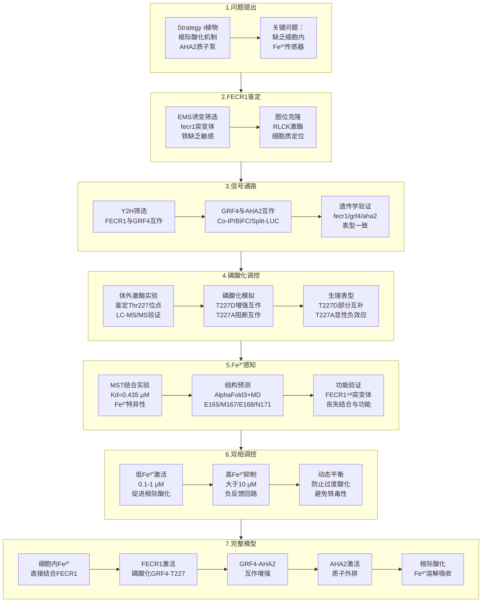

# 植物如何感知细胞内铁离子？首个$\ce{Fe^{3+}}$受体FECR1揭示根际酸化的快速调控机制

## 本文信息

- **标题**: A cellular ferric ion sensor FECR1 triggers rhizosphere acidification-based iron acquisition
- **作者**: Jie-Na Xu, Li Sun, Xu-Fan Gao, Jia-Rui Zheng, Zhi-Peng Liu, Xi-Ran Zhou, Wan-Ke Zhang, Shou-Yi Chen, Jin-Song Zhang, Zhong-Jie Ding & Shao-Jian Zheng
- 发表时间: 2024年（Cell期刊）
- **单位**: 浙江大学农业与生物技术学院、生命科学学院，中国科学院遗传与发育生物学研究所，浙江大学转化医学研究院（中国）
- **引用格式**: Xu, J.-N., Sun, L., Gao, X.-F., Zheng, J.-R., Liu, Z.-P., Zhou, X.-R., Zhang, W.-K., Chen, S.-Y., Zhang, J.-S., Ding, Z.-J., & Zheng, S.-J. (2026). A cellular ferric ion sensor FECR1 triggers rhizosphere acidification-based iron acquisition. *Cell*.

## 摘要

> 铁（Fe）缺乏是全球农业面临的最广泛的微量元素限制，在碱性土壤中尤为严重。Strategy I植物（非禾本科植物）通过**根际酸化**来溶解土壤中的三价铁（$\ce{Fe^{3+}}$），从而提高铁的生物利用度。质膜$\ce{H^{+}}$-ATPase（AHA2）在根际酸化中发挥核心作用，其活性受到**14-3-3蛋白**（GRFs）的调控。然而，植物如何感知细胞内$\ce{Fe^{3+}}$水平并快速激活AHA2，其分子机制一直不清楚。本研究鉴定出**FECR1**（Ferric Receptor 1），一个类受体细胞质激酶（RLCK），作为首个直接的**细胞内$\ce{Fe^{3+}}$传感器**。FECR1通过其激酶结构域中的关键氨基酸残基（E165/M167/E168/N171）直接结合$\ce{Fe^{3+}}$（解离常数$K_d$ = 0.435 μM）。在低$\ce{Fe^{3+}}$浓度下，FECR1被激活并磷酸化GRF4的**Thr227位点**，增强GRF4与AHA2的相互作用，从而激活质子泵并促进根际酸化。在高$\ce{Fe^{3+}}$浓度下，FECR1的活性被抑制，形成**负反馈调控**，防止过度酸化。该研究揭示了一条从细胞内铁感知到根际酸化的**快速翻译后调控通路**，为提高作物在碱性土壤中的铁利用效率提供了新的分子靶点。

### 核心结论

- FECR1是首个被鉴定的植物细胞内$\ce{Fe^{3+}}$受体，通过激酶结构域的E165/M167/E168/N171残基直接结合$\ce{Fe^{3+}}$（$K_d$ = 0.435 μM）
- FECR1在低$\ce{Fe^{3+}}$条件下磷酸化14-3-3蛋白GRF4的Thr227位点，增强GRF4与质膜$\ce{H^{+}}$-ATPase（AHA2）的互作，激活质子泵
- 该通路构成从细胞内$\ce{Fe^{3+}}$感知到根际酸化的快速翻译后调控机制，独立于转录调控
- 高浓度$\ce{Fe^{3+}}$抑制FECR1活性，形成负反馈调控，防止过度根际酸化
- FECR1功能缺失导致铁缺乏敏感性显著增加，而过表达则提高碱性土壤中的铁利用效率

## 背景

铁是植物生长发育必需的微量元素，参与光合作用、呼吸作用和众多代谢过程。尽管铁在地壳中含量丰富，但在碱性土壤（pH > 7.5，占全球耕地约30%）中，$\ce{Fe^{3+}}$极易形成不溶性的氢氧化物沉淀，导致植物可吸收的铁严重不足。铁缺乏是全球农业生产中**最普遍的微量元素限制因子**，严重影响作物产量和营养品质。

Strategy I植物（包括拟南芥和大多数双子叶植物及非禾本科单子叶植物）应对铁缺乏的主要策略是**根际酸化**，即通过质膜$\ce{H^{+}}$-ATPase将质子泵出根细胞，降低根际pH值，从而溶解土壤中的$\ce{Fe^{3+}}$，使其转化为可吸收的$\ce{Fe^{2+}}$。质膜$\ce{H^{+}}$-ATPase（在拟南芥中主要是AHA2）是这一过程的核心执行者。研究已经明确，**14-3-3蛋白**（在拟南芥中称为GRFs）通过结合AHA2的C端自抑制结构域来激活质子泵活性。

然而，一个关键问题长期悬而未决：**植物如何感知细胞内的$\ce{Fe^{3+}}$水平，并快速调控AHA2的活性**？转录水平的调控（如通过bHLH转录因子**FIT**，FER-LIKE IRON DEFICIENCY-INDUCED TRANSCRIPTION FACTOR，铁缺乏诱导的转录因子）已被广泛研究，但这种调控通常需要数小时才能产生效果。相比之下，植物对铁缺乏的响应可以在分钟级别内启动根际酸化，暗示存在一个**快速的翻译后调控机制**。此外，直接的$\ce{Fe^{3+}}$受体在植物中尚未被鉴定，这限制了我们对铁信号转导网络的完整理解。

### 关键科学问题

- 植物是否存在直接感知细胞内$\ce{Fe^{3+}}$浓度的受体蛋白？该受体的分子身份和$\ce{Fe^{3+}}$结合机制是什么？
- $\ce{Fe^{3+}}$信号如何快速传递到质膜$\ce{H^{+}}$-ATPase，驱动根际酸化？这一过程是否涉及翻译后修饰（如磷酸化）？
- FECR1-GRFs-AHA2信号通路如何实现双向调控，即在低$\ce{Fe^{3+}}$时激活根际酸化，在高$\ce{Fe^{3+}}$时抑制过度酸化？
- 这一快速翻译后调控通路与转录调控（如FIT介导的通路）之间如何协同工作？

### 创新点

- 首次鉴定并表征了植物中的**细胞内$\ce{Fe^{3+}}$受体FECR1**，并通过微量热泳动（MST）、核磁共振（NMR）和分子动力学模拟（MD）确定了$\ce{Fe^{3+}}$结合的关键氨基酸残基和解离常数
- 揭示了FECR1通过磷酸化GRF4（Thr227位点）来增强GRF4-AHA2互作的**翻译后调控新机制**，解释了植物如何在分钟级别内快速响应铁缺乏
- 发现了$\ce{Fe^{3+}}$对FECR1的**双相调控**（低浓度激活、高浓度抑制），阐明了防止过度根际酸化的负反馈机制
- 整合了遗传学、生化、结构生物学和生理学多种方法，构建了从$\ce{Fe^{3+}}$感知到根际酸化的完整信号通路模型

### 研究思路总览

---

## 研究内容

### FECR1增强植物对铁缺乏的耐受性

研究团队首先通过正向遗传学筛选，从拟南芥EMS诱变库（甲基磺酸乙酯化学诱变）中**鉴定出一个铁缺乏敏感突变体fecr1-1**。在碱性土壤（pH 7.5）条件下，fecr1-1突变体表现出严重的叶片黄化、生长抑制和铁含量显著降低。通过图位克隆（利用遗传连锁分析逐步定位并克隆目标基因的方法），确定了FECR1基因编码一个**类受体细胞质激酶**（RLCK），属于RLCK家族的VIIa-2亚家族。

为了验证FECR1的功能，研究者创建了多个独立的敲除突变体（通过CRISPR-Cas9）和过表达株系。结果表明，fecr1突变体在铁缺乏条件下生长受到严重抑制，而35S::FECR1-GFP过表达株系则表现出**显著增强的铁缺乏耐受性**，包括更高的叶绿素含量、更大的生物量和更高的铁积累量。ProFECR1:GUS 报告基因表明该基因在根部被-Fe迅速诱导，信号集中在根尖、侧根和表皮细胞；FECR1-GFP荧光则定位于质膜及邻近胞质。值得注意的是，**在Zn/Mn/Cu缺乏或Cd胁迫条件下，fecr1与野生型表型无显著差异**，说明FECR1是铁缺乏特异性的调控节点。

**图1：FECR1增强植物对铁缺乏的耐受性**

- **(A)** **幼苗表型对比**：9天龄幼苗在铁充足（+Fe）和铁缺乏（-Fe）培养基上的生长表型。**野生型在-Fe条件下根系略有抑制，而fecr1突变体（fecr1、cas9-1、cas9-2）表现出严重的根系生长抑制**，互补株系（FECR1/fecr1、FECR1/cas9-1）完全恢复。比例尺1 cm
- **(B)** **主根长度定量**：柱状图显示各基因型的主根长度。在-Fe条件下，**fecr1突变体的主根长度显著短于野生型**（约减少50%），互补株系恢复至野生型水平。数据为平均值±SD，n=40，\*\*\*\*P < 0.0001
- **(C)** **鲜重测定**：-Fe处理后，**fecr1突变体的鲜重显著降低**（约减少60%），互补株系恢复正常。数据为平均值±SD，n=15，\*\*\*\*P < 0.0001
- **(D)** **叶绿素含量**：柱状图显示-Fe条件下，**fecr1突变体的叶绿素含量显著低于野生型**（约降低70%），互补株系恢复。数据为平均值±SD，n=5，\*\*\*\*P < 0.0001
- **(E)** **碱性土壤表型**：在诱导铁缺乏的碱性土壤中生长的植株。**野生型（WT）和互补株系（com9-1）叶片保持绿色**，而**cas9-1和fecr1突变体表现严重黄化**，证明FECR1在自然土壤条件下对铁缺乏耐受性至关重要
- **(F)** **FECR1转录响应铁缺乏**：RT-qPCR显示根中FECR1相对表达量。在+Fe条件下表达量低，**-Fe处理后显著上调**（0 h基础水平，1-24 h持续高表达约4-5倍）。ACTIN2为内参，数据为平均值±SD，n=3，\*\*\*\*P < 0.0001
- **(G)** **组织特异性表达**：ProFECR1:GUS组织化学染色（蓝色信号）。**上图**：+Fe条件下几乎无染色；**下图**：-Fe条件下**GUS信号强烈集中于根尖、侧根起始部和根表皮细胞**。比例尺5 mm
- **(H)** **FECR1亚细胞定位**：proFECR1:FECR1-GFP转基因株系在铁缺乏处理后的根细胞共聚焦成像。**左图**（+Fe）：荧光信号弱；**右图**（-Fe）：**绿色荧光信号显著增强，主要定位于质膜和邻近胞质**。比例尺50 µm

### FECR1介导的根际酸化响应铁缺乏

质膜$\ce{H^{+}}$-ATPase驱动的根际酸化是Strategy I植物应对铁缺乏的核心策略。研究者使用pH指示剂和根际pH微电极测定发现，**野生型植物在铁缺乏条件下根际pH显著降低**（从约6.0降至4.5-5.0），而fecr1突变体的根际酸化能力**严重受损**，根际pH仅轻微下降。相反，FECR1过表达株系表现出更强的根际酸化能力。

进一步的生化分析显示，野生型植物在铁缺乏时质膜$\ce{H^{+}}$-ATPase的活性显著提高，而fecr1突变体中AHA2的活性提升幅度明显减弱。Western blot分析表明，AHA2蛋白的总量在不同基因型间无显著差异，说明FECR1**主要通过调控AHA2的活性而非表达量**来影响根际酸化。当培养基使用5 mM MES缓冲后，无论是否拥有FECR1，各基因型的根际酸化、铁含量和FCR活性都回复到同一水平；同样地，向缺铁培养基中补加$\ce{Fe(OH)3}$时只有野生型能够迅速恢复绿色而fecr1依旧黄化。这些对照表明**FECR1的作用依赖于根际酸化通路，而不是非特异抗逆机制**。

> 补充一句：图2的+Fe/-Fe/-Fe+MES都是在1/2 MS琼脂平板体外培养；+Fe含螯合铁盐，-Fe完全不加铁，-Fe+MES在无铁基础上再加5 mM MES稳定pH，作用是验证FECR1依赖根际酸化，而不是真在土壤里“找铁”。
>
> 换句话说，+Fe组＝“正常营养但铁足”，-Fe组＝“所有营养都有唯独不放铁”，-Fe+MES组＝“无铁且pH被锁住”。这样可以把“缺铁”与“酸化能力”分开看清：野生型靠酸化可以部分缓解缺铁，而MES把酸化堵住后所有基因型都一样缺铁。土壤里\ce{Fe(OH)3}的溶解实验另见图1E/图S2C，那里才是真正需要通过酸化去“溶铁”。

**图2：FECR1介导的质子外排响应铁缺乏**

- **(A)** **铁含量测定**：ICP-MS测定各基因型根部和地上部的铁含量。柱状图显示，在-Fe条件下，**fecr1突变体（fecr1、cas9-1、cas9-2）的根部和地上部铁含量均显著低于野生型**（约减少50-60%），而**FECR1过表达株系（FECR1ox1、FECR1ox2）的铁含量显著高于野生型**（约提高30-40%），互补株系恢复正常。数据为平均值±SD，n=9，\*\*\*\*P < 0.0001
- **(B)** **根际酸化能力**：使用溴甲酚紫pH指示剂（黄色=酸性pH < 5.2，紫色=碱性pH > 6.8）染色，指示剂初始pH调至6.5。**上图**（+Fe）：所有基因型根际均为紫色；**下图**（-Fe）：**野生型和FECR1ox株系根际变为明显黄色**（强酸化），**fecr1突变体根际仍保持紫色**（酸化能力丧失），互补株系恢复酸化能力
- **(C)** **根际酸化定量**：使用ImageJ软件对(B)中的根际黄色区域面积进行定量分析。柱状图显示，在-Fe条件下，**野生型的酸化活性约为10单位，FECR1ox株系达到约12单位，而fecr1突变体仅约1-2单位**。数据为平均值±SD，n=6，\*\*\*\*P < 0.0001
- **(D)** **根部ATPase活性**：根组织中ATP水解酶活性测定。**+Fe条件下**（绿色柱）：各基因型活性相似，约50 µg Pi/mg/h；**-Fe条件下**（黄色柱）：**野生型活性提升至约200 µg Pi/mg/h，FECR1ox株系达到约250 µg Pi/mg/h，而fecr1突变体仅提升至约100 µg Pi/mg/h**。数据为平均值±SD，n=9，\*\*\*\*P < 0.0001
- **(E)** **MES缓冲对根际酸化的影响**：在有无5 mM MES（pH稳定剂）条件下的根际pH指示剂染色。**-Fe组**（左6列）：野生型和FECR1ox株系黄色明显，fecr1突变体紫色；**-Fe+MES组**（右6列）：**所有基因型的根际均保持紫色**，说明MES缓冲消除了pH梯度，证明FECR1的作用依赖于根际酸化
- **(F)** **MES对酸化活性的定量影响**：柱状图显示，**-Fe组**（深色柱）中WT和FECR1ox的酸化活性显著高于fecr1（约1.0-1.2 vs. 0.2单位），而**-Fe+MES组**（浅色柱）中**所有基因型的酸化活性均降至基线水平**（约0.1-0.2单位），**且-Fe+MES组内各基因型彼此无显著差异（ns）**。数据为平均值±SD，n=3
- **(G)** **MES对幼苗生长的影响**：9天龄幼苗在-Fe和-Fe+MES条件下的表型照片。**左图**（-Fe+MES）：**所有基因型的生长和叶色基本一致**，fecr1突变体不再表现黄化；**右图**（-Fe）：fecr1突变体严重黄化和生长抑制，WT和FECR1ox正常。比例尺1 cm
- **(H)** **MES对主根长度的影响**：在-Fe+MES条件下（绿色柱）和-Fe条件下（黄色柱），**各基因型的主根长度无显著差异（ns）**。数据为平均值±SD，n=20，ns=无显著差异
- **(I)** **MES对鲜重的影响**：-Fe+MES组各基因型鲜重无显著差异（ns），-Fe组fecr1突变体显著降低。数据为平均值±SD，n=6
- **(J)** **MES对叶绿素含量的影响**：-Fe+MES组各基因型叶绿素含量相似（ns），**证明当根际pH被稳定后，FECR1缺失的负面效应完全消失**，说明FECR1的功能完全依赖于根际酸化通路。数据为平均值±SD，n=3

### GRF4介导FECR1与AHA2的功能连接

14-3-3蛋白（GRFs）是已知的AHA2激活因子。研究者通过酵母双杂交（Y2H）筛选发现，FECR1与多个GRF家族成员相互作用，其中**GRF4的互作最强**。进一步的Co-IP（共免疫沉淀）、BiFC（双分子荧光互补）和Split-LUC（分裂荧光素酶）实验在体内验证了FECR1与GRF4的相互作用。值得注意的是，FECR1通过其**激酶结构域**而非N端结构域与GRF4结合。

> GRF4本身不再去磷酸化AHA2，而是以14-3-3二聚体的形式**夹住AHA2的C端自抑制尾巴**（核心基序YTV，即Tyr946-Thr947-Val948，其中Thr947需先被上游激酶磷酸化），相当于把“刹车”拉开让AHA2持续泵出$\ce{H^{+}}$；FECR1对GRF4 Thr227的磷酸化则是把这只“夹子”压得更紧，提高亲和力。
>
> **结构证据**：已解析的14-3-3与AHA2 C端肽段复合物晶体结构（PDB: 2O98，Fuglsang et al., 1999）表明，14-3-3二聚体夹住AHA2末端YTV基序（Thr947必须被磷酸化），并牵开上游约50个氨基酸的自抑制尾巴，从而解除质子泵的“刹车”。这是目前最直接的结构证据。但对**GRF4特异性构象**或**完整膜泵解锁后的全长结构**尚无解析，本文关于FECR1→GRF4→AHA2通路的机制推断基于这些通用14-3-3/AHA2研究。

遗传学分析显示，单个grf突变通常没有明显表型，但双突变grf3grf4以及三突变grf1grf3grf4都会出现根际酸化减弱、叶绿素下降的铁缺乏症状，说明**多种GRF在根中具有部分冗余功能**。可以把GRF家族想象成多条备用线路，单条线路断了系统还能运行；只有多条线路同时断掉，质子泵这盏“灯”才会熄灭。关键的是，在grf1grf3grf4背景下过表达FECR1**无法恢复**铁缺乏耐受性，而在aha2突变背景中FECR1过表达也失去促酸化作用，表明**GRFs和AHA2分别位于FECR1的直接和最终效应环节**。此外，在grf4突变体中补回GRF4即可恢复表型，进一步支持“FECR1→GRFs→AHA2”的信号顺序。

进一步的Co-IP实验揭示了一个关键发现：FECR1的存在**显著增强了GRF4与AHA2的相互作用**。在FECR1过表达株系中，GRF4-AHA2复合体的形成量显著增加；而在fecr1突变体中，这一互作减弱。这表明FECR1通过某种方式（**可能是磷酸化**）修饰GRF4，从而增强其与AHA2的结合能力。

> **Pull-down与Co-IP的区别**：
>
> - **Pull-down**是**体外**蛋白互作验证，用纯化的带标签蛋白（如His-FECR1）作“诱饵”去捕获另一个纯化蛋白（如GST-GRF4），证明两者能直接结合，不依赖细胞内其他因子；
> - **Co-IP**则是**体内**实验，从完整细胞裂解液中用抗体沉淀一个蛋白（如GFP-FECR1），看能否共沉淀下来另一个蛋白（如FLAG-GRF4），反映生理条件下的复合体形成，但**无法区分直接或间接互作**（可能通过第三方蛋白桥接）。
>
> 本文**两种方法结合使用**，既证明FECR1-GRF4能直接结合（Pull-down），又确认它们在活细胞中确实形成复合物（Co-IP）。
>
> **Input对照的作用**：Western blot中的“Input”泳道是**上样对照**，取一小部分反应前的原始样品直接上样，用来证明：(1) 目标蛋白确实表达了且量足够；(2) 各样品间蛋白表达量相当，排除“拉不下来”是因为蛋白本身就没有或太少。只有Input显示蛋白都正常表达，Pull-down/IP泳道的结果才有意义——有互作就能拉下来，没互作就拉不下来。
>
> **实验逻辑的严谨性**：Pull-down中的GST单独对照（图3D）至关重要，它排除了FECR1-His非特异性结合GST标签的可能性，证明结合的特异性针对GRF4蛋白本身；Co-IP中的单独表达对照（图3E）同样排除了抗体交叉反应或非特异性沉淀。这种**多层对照设计**确保了结论的可靠性：FECR1与GRF4在体外能直接结合，在体内形成生理性复合物。

**图3：GRF4介导FECR1与AHA2的相互作用**

- **(A)** **酵母双杂交筛选**：使用FECR1激酶结构域作为诱饵（BD-FECR1），GRF4和AHA2-C端（AHA2的胞质C端结构域）作为猎物。**左侧平板**（-LWHA，高选择性）：**BD-GRF4与AD-FECR1强烈互作**（菌落生长良好），BD-AHA2-C无互作（无菌落）；**右侧平板**（-LW，低选择性）：各组合均生长。梯度稀释（1, 10⁻¹, 10⁻², 10⁻³）显示**GRF4与FECR1的互作最强**
- **(B)** **Split-LUC互作验证**：萤光素酶互补实验显示FECR1-cLUC与GRF4-nLUC共表达产生**强烈荧光信号**（10520 cps），而单独表达cLUC或nLUC仅有背景信号（65535 cps为饱和）。**右侧**：假彩色热图显示荧光强度分布
- **(C)** **BiFC荧光互补定位**：烟草叶片细胞中FECR1-nYFP与GRF4-cYFP共表达。**左上**（YFP通道）：明亮的黄色荧光；**右上**（明场）：细胞轮廓；**左下**（mCherry核定位标记）：红色核信号；**右下**（合并图）：**黄色荧光主要分布于细胞质**，证明FECR1-GRF4互作发生在胞质。比例尺10 µm
- **(D)** **Pull-down实验**：体外蛋白互作验证。使用His标签的FECR1作为诱饵，GST标签的GRF4作为猎物。**Pull-down泳道**显示，FECR1-His能够**拉下GRF4-GST**（约50 kDa条带），而单独GST无法被拉下；**Input泳道**显示蛋白表达正常（FECR1-His约70 kDa）
- **(E)** **体内Co-IP验证**：在拟南芥原生质体中共表达FECR1-GFP和GRF4-FLAG。**上图**（GAFP免疫沉淀）：抗Flag抗体检测到GRF4-FLAG（35 kDa），抗GFP抗体检测到FECR1-GFP（76 kDa），证明**两者在体内形成复合物**；**下图**（Input对照）：显示两蛋白均正常表达
- **(F)** **grf突变体表型**：9天龄幼苗在+Fe和-Fe条件下的生长表型。在-Fe条件下，**grf3grf4双突变体和grf1grf3grf4三突变体表现出与fecr1类似的严重根系抑制**，证明GRF家族在FECR1通路中发挥重要作用。比例尺1 cm
- **(G)** **主根长度定量**：在-Fe条件下，**grf3grf4和grf1grf3grf4的主根长度显著短于野生型**（约减少50-60%），与fecr1突变体相似。数据为平均值±SD，n=30，\*\*\*\*P < 0.0001
- **(H)** **鲜重测定**：grf突变体的鲜重在-Fe条件下显著降低。数据为平均值±SD，n=12，\*\*\*\*P < 0.0001
- **(I)** **叶绿素含量**：grf突变体的叶绿素含量显著低于野生型（约降低60-70%）。数据为平均值±SD，n=3，\*\*\*\*P < 0.0001
- **(J)** **根际酸化能力**：pH指示剂染色显示，在-Fe条件下，**grf3grf4和grf1grf3grf4的根际酸化能力严重受损**（保持紫色），与fecr1类似，而野生型根际变黄
- **(K)** **酸化活性定量**：grf突变体的根际酸化活性显著低于野生型（约降低80%）。数据为平均值±SD，n=6，\*\*\*\*P < 0.0001
- **(L)** **根部ATPase活性**：在-Fe条件下，**grf突变体的H⁺-ATPase活性显著低于野生型**（约降低60%），数据为平均值±SD，n=9，\*\*\*\*P < 0.0001
- **(M)** **酵母三杂交（Y3H）验证GRF4依赖性**：检测FECR1与AHA2-C端的互作是否依赖GRF4。**上图**（pBridge空载）：FECR1与AHA2-C无互作（-UWHL平板无生长）；**下图**（pBridge-AHA2-C-GRF4，同时表达GRF4）：**在GRF4存在下，FECR1与AHA2-C产生强烈互作**（菌落生长），证明**FECR1-AHA2互作依赖GRF4介导**
- **(N)** **Split-LUC验证GRF4桥接作用**：FECR1-cLUC与AHA2-C-nLUC共表达仅产生低荧光（4398 cps）；**当加入35S:GRF4-FLAG后，荧光信号显著增强至44581 cps**，而单独表达对照无信号。**右侧**：假彩色热图。证明**GRF4作为桥接蛋白连接FECR1和AHA2**

### FECR1在Thr227位点磷酸化GRF4

作为一个激酶，FECR1可能通过磷酸化GRF4来调控其功能。体外激酶实验证实，**纯化的FECR1蛋白能够磷酸化GRF4**，而激酶失活突变体FECR1K108R则丧失了这一活性。通过液相色谱-质谱联用（LC-MS/MS）分析，研究者鉴定出GRF4的**Thr227（T227）是FECR1的主要磷酸化位点**。随后制备的pT227特异性抗体在体内检测到：野生型根在-Fe处理后pT227-GRF4迅速累积，而fecr1突变体中该信号显著下降，进一步证明这一位点的磷酸化依赖FECR1激酶活性。

> **放射性激酶实验原理**：图4A使用ATP-γ-[\ce{^{32}P}]（带放射性标记的ATP）作为磷酸供体，FECR1将放射性磷酸基团转移到GRF4上。通过放射性自显影检测，被磷酸化的蛋白会发出放射性信号（显示为黑色条带）。“强信号”表示磷酸化程度高，“无信号”表示未被磷酸化。这是检测蛋白质磷酸化的金标准方法，灵敏度极高且可直接定量。

为了验证T227磷酸化的生理意义，研究者构建了磷酸化模拟突变体GRF4T227D（天冬氨酸模拟磷酸化状态）和非磷酸化突变体GRF4T227A（丙氨酸阻断磷酸化）。Co-IP实验显示，**GRF4T227D与AHA2的互作显著增强**，而GRF4T227A与AHA2的互作明显减弱。这一结果表明，T227的磷酸化状态**直接调控GRF4与AHA2的结合能力**。

遗传互补实验进一步证实了这一机制的生理重要性。在grf4突变体中表达GRF4T227D能够**部分恢复**铁缺乏耐受性和根际酸化能力，而表达GRF4T227A则无法恢复表型。更重要的是，GRF4T227D在一定程度上能够**补偿fecr1突变体的缺陷**，而GRF4T227A在野生型背景下表现出**显性负效应**，导致铁缺乏敏感性增加。这些结果共同证明，**FECR1通过磷酸化GRF4的T227位点来激活根际酸化通路**。

**图4：FECR1在Thr227位点磷酸化GRF4**

- **(A)** **体外激酶实验鉴定磷酸化位点**：使用纯化的FECR1-His和不同突变的GRF4-His进行激酶反应。**上图**（放射性自显影）：FECR1能够磷酸化野生型GRF4（强信号），但**不能磷酸化GRF4T227A突变体**（无信号），而GRF4S242A和GRF4S424A仍可被磷酸化，证明**Thr227是主要磷酸化位点**。ATP-γ-S作为阴性对照（无ATP）。**下图**（考马斯亮蓝染色）：确认各蛋白上样量相当（GRF4约35 kDa，FECR1约70 kDa）
- **(B)** **磷酸化特异性抗体验证**：体外验证抗pThr227-GRF4抗体的特异性。**上图**（Western blot，α-pT227）：抗体仅识别被FECR1磷酸化的野生型GRF4（强条带），不识别GRF4T227A或未磷酸化的GRF4；**下图**（考马斯亮蓝染色）：确认蛋白上样量一致
- **(C)** **体内GRF4磷酸化检测**：在WT/35S:GRF4-Flag和fecr1/35S:GRF4-Flag株系中检测GRF4的体内磷酸化。**上图**（α-pT227）：在野生型背景中，**-Fe处理后GRF4的T227磷酸化显著增加**（条带加深），而在fecr1背景中磷酸化信号极弱；**下图**（α-Flag）：确认GRF4-Flag表达量相当（约43 kDa）。证明**体内GRF4的T227磷酸化依赖FECR1且响应铁缺乏**
- **(D)** **Split-LUC检测突变体与AHA2互作**：GRF4突变体（nLUC融合）与AHA2-C（cLUC融合）的互作定量。假彩色热图显示，**GRF4T227D-AHA2-C互作最强**（P2，高荧光），野生型GRF4次之（P1），**GRF4T227A互作最弱**（P3），对照组无信号（P4）。荧光值：P2=23947 cps
- **(E)** **互作强度定量**：柱状图显示不同GRF4突变体与AHA2-C的相对荧光强度。**T227D显著高于WT**（约3倍），**WT显著高于T227A**（约6倍），T227A接近背景水平。数据为平均值±SD，n=6，\*\*\*\*P < 0.0001
- **(F)** **BiFC检测突变体与AHA2互作**：烟草叶片细胞中GRF4突变体（nYFP）与AHA2-C（cYFP）的BiFC成像。**左图**（GRF4-nYFP）：无荧光；**中图**（GRF4T227A-nYFP）：无荧光；**右图**（GRF4T227D-nYFP）：**强烈的黄色荧光信号**，主要分布于质膜，证明**T227D磷酸化模拟突变体增强与AHA2的互作**
- **(G)** **BiFC荧光强度定量**：对(F)中的荧光信号进行定量。**GRF4T227D的荧光强度约为250单位**，显著高于野生型GRF4（约50单位）和GRF4T227A（接近0，ns）。数据为平均值±SD，n=23，\*\*\*\*P < 0.0001
- **(H)** **Co-IP验证突变体与AHA2互作**：在原生质体中共表达GRF4突变体（FLAG标签）和AHA2-GFP。**Flag IP泳道**：抗GFP抗体检测显示，三种GRF4变体（WT、T227D、T227A）均能共沉淀AHA2-GFP（约125 kDa），**条带强度差异相对较小**，与Split-LUC（图4D-E）和BiFC（图4F-G）的显著差异不同，可能反映Co-IP方法在检测互作强度变化时的灵敏度限制；**Input泳道**：显示各蛋白表达量相当（AHA2-GFP约125 kDa，GRF4-FLAG约35 kDa）
- **(I)** **突变体互补的根际酸化能力**：在grf1grf3grf4三突变体中表达不同GRF4变体的根际pH指示剂染色。在-Fe条件下，**表达GRF4或GRF4T227D的株系根际变黄**（恢复酸化能力），而**表达GRF4T227A的株系根际仍为紫色**（无酸化），与空载对照（grf1grf3grf4）一致
- **(J)** **根际酸化活性定量**：柱状图显示，**GRF4和GRF4T227D互补株系的酸化活性显著恢复**（约4-6单位），其中**T227D的恢复效果优于WT GRF4**，而**T227A无法恢复**（约1单位，与突变体相同）。数据为平均值±SD，n=6，\*\*P < 0.01，\*\*\*\*P < 0.0001
- **(K)** **ATPase活性测定**：在grf1grf3grf4背景中表达不同GRF4变体后的根部H⁺-ATPase活性。**GRF4T227D互补株系的ATPase活性最高**（约250 µg Pi/mg/h），**野生型GRF4次之**（约150 µg Pi/mg/h），**GRF4T227A无法恢复活性**（约50 µg Pi/mg/h，与突变体相同）。数据为平均值±SD，n=9，\*\*\*\*P < 0.0001

### FECR1是细胞内$\ce{Fe^{3+}}$传感器

FECR1如何感知铁缺乏信号？研究者通过一系列生化和结构生物学实验证明，**FECR1直接结合$\ce{Fe^{3+}}$**。微量热泳动（MST）实验显示，纯化的FECR1蛋白与$\ce{Fe^{3+}}$结合，**解离常数$K_d$为0.435 μM**，表明FECR1对$\ce{Fe^{3+}}$具有高亲和力。相比之下，FECR1与$\ce{Fe^{2+}}$的结合非常弱（$K_d$ > 100 μM），表明FECR1是$\ce{Fe^{3+}}$**特异性受体**。

**MIB2服务器预测出高置信度残基簇E165/M167/E168/N171**，随后通过体外激酶实验验证该四残基簇对$\ce{Fe^{3+}}$依赖性激酶激活至关重要。通过AlphaFold3结构预测和1微秒的分子动力学（MD）模拟，研究者进一步精细化了这一结合模式：虽然**E165和E168直接提供羧基氧配位$\ce{Fe^{3+}}$**，**Y166和D225也参与配位**形成稳定的八面体几何构型（Fe–配体距离在0.2-0.3 nm之间、RMSD约0.15 nm），而**M167和N171虽不直接配位但维持结合口袋的结构完整性**。核磁共振（NMR）滴定实验同样检测到这些残基在$\ce{Fe^{3+}}$存在下发生显著化学位移，验证了模型的正确性。

定点突变实验证实了这些残基的功能重要性。**四丙氨酸替换突变体FECR14A（即FECR1E165A/M167A/E168A/N171A）完全丧失了$\ce{Fe^{3+}}$结合能力**（MST显示$K_d$显著升高，接近背景水平），并且在转基因互补实验中**无法恢复fecr1突变体的铁缺乏敏感表型**。该四突变体同时消除了$\ce{Fe^{3+}}$诱导的自磷酸化与GRF4转磷酸化，也阻断了$\ce{Fe^{3+}}$触发的FECR1-GRF4-AHA2复合体形成，证明**E165/M167/E168/N171这一四残基簇是感知细胞内$\ce{Fe^{3+}}$的核心结构单元**。

进一步的激酶活性测定揭示了$\ce{Fe^{3+}}$调控FECR1的分子机制：**低浓度$\ce{Fe^{3+}}$（0.1-1 μM）显著提升FECR1自磷酸化与GRF4转磷酸化水平**，而**当$\ce{Fe^{3+}}$浓度高于10 μM时激酶活性反而被压制**，对$\ce{Fe^{2+}}$及其他金属（$\ce{La^{3+}}$/$\ce{Zn^{2+}}$/$\ce{Cu^{2+}}$/$\ce{Mn^{2+}}$/$\ce{Cd^{2+}}$）则无响应。与之对应，野生型根际质子外排和FECR1-GRF4-AHA2复合体形成在$\ce{Fe^{3+}}$梯度下呈现类似的双相曲线，而FECR14A互补株系在任何Fe供应水平下都保持低酸化能力。由此形成了一个**负反馈回路**：低$\ce{Fe^{3+}}$激活FECR1，促进根际酸化与铁吸收；当细胞内$\ce{Fe^{3+}}$回升时则抑制FECR1，防止过度酸化。

**图5：FECR1是细胞内铁离子传感器**

> **名称说明**：
> - **COM** = Complementation（互补），指在fecr1突变体背景中转入FECR1基因的互补株系。FECR1COM（COM1、COM2）为两个独立的野生型FECR1互补株系
> - **FECR14A** = FECR1E165A/M167A/E168A/N171A四突变体，即将$\ce{Fe^{3+}}$结合位点的4个关键残基（E165、M167、E168、N171）全部替换为丙氨酸的突变体

- **(A)** $\ce{Fe^{3+}}$对FECR1激酶活性的双相调控：体外激酶实验（放射性自显影与考马斯亮蓝染色）。**上图左侧**（Western blot）：随着$\ce{Fe^{3+}}$浓度从0增至10⁴ nM，FECR1对GRF4的磷酸化呈现双相响应，在0.1-1 μM时达峰值（条带最深），在10² μM以上则被抑制（条带变浅）；**下图左侧**（CBB染色）：确认FECR1-His（约70 kDa）和GRF4-His（约35 kDa）蛋白上样量一致。**右图**：$\ce{Fe^{3+}}$对FECR1自磷酸化和GRF4转磷酸化活性的定量曲线（n=3），呈倒U型，峰值在约1 μM
- **(B)** MST测定FECR1与$\ce{Fe^{3+}}$的结合亲和力：微量热泳动曲线显示，纯化的FECR1-His蛋白与$\ce{Fe^{3+}}$（绿色S形曲线）高亲和力结合，解离常数$K_d$ = 0.435 μM（蓝色虚线标注），而未加FECR1的对照（灰色）无结合。横坐标为$\ce{Fe^{3+}}$浓度（nM，对数刻度），纵坐标为归一化荧光（Fnorm）
- **(C)** $\ce{Fe^{3+}}$结合缺陷突变体丧失激酶激活：检测FECR14A突变体（FECR14A-His）在$\ce{Fe^{3+}}$梯度下的激酶活性。**上图**（Western blot）：突变体对GRF4的磷酸化信号在所有$\ce{Fe^{3+}}$浓度下均极弱（几乎无条带），与野生型FECR1的双相响应形成鲜明对比（见A）；**下图**（CBB）：确认蛋白上样量
- **(D)** 突变体的GRF4 Thr227磷酸化缺失：使用磷酸化特异性抗体（α-pT227）检测。**上图**：野生型FECR1在$\ce{Fe^{3+}}$存在下产生强烈的pT227-GRF4信号（峰值在0.1-1 μM），而FECR14A突变体在所有浓度下均无pT227信号；**下图**（CBB）：蛋白上样对照
- **(E)** 根际质子外排响应$\ce{Fe^{3+}}$梯度（-Fe FECR1COM株系）：在缺铁培养基上，野生型FECR1互补株系的根际质子外排活性（用pH指示剂染色，黄色=酸化）随外加$\ce{Fe^{3+}}$浓度呈现双相响应。**左侧6列**（0、1、10、10²、10³、10⁴ nM $\ce{Fe^{3+}}$）：0-10 nM时根际逐渐变黄（酸化增强），10²-10⁴ nM时黄色减退（酸化减弱）
- **(F)** 根际酸化活性定量：对E和类似实验的酸化活性定量。**蓝色柱**（-Fe FECR1COM）：在1-10 nM $\ce{Fe^{3+}}$时酸化活性最高（约6单位），0 nM和10⁴ nM时较低（约2单位）；**灰色柱**（-Fe FECR1COM.1，重复株系）和**浅蓝柱**（-Fe FECR14A突变体互补株系）：突变体在所有$\ce{Fe^{3+}}$浓度下酸化活性均保持低水平（约1单位），无双相响应。数据为平均值±SD，n=4，\*P < 0.05
- **(G)** $\ce{Fe^{3+}}$结合突变体无法恢复碱性土壤表型：在fecr1突变体中表达野生型FECR1或FECR14A突变体，在碱性土壤生长21天后拍摄。**WT和FECR1COM/fecr1（COM1、COM2）**：叶片深绿；**cas9-1和FECR14A/fecr1（突变体互补株系）**：叶片严重黄化，说明$\ce{Fe^{3+}}$结合缺陷突变体完全丧失互补能力
- **(H)** AlphaFold3预测的$\ce{Fe^{3+}}$结合位点：FECR1激酶结构域的三维结构模型（卡通图，彩虹色）。**中心橙色球**：$\ce{Fe^{3+}}$；**周围黄色球棍**：关键配位残基E165、Y166、M167、E168、N171和D225（标注在右侧放大框中）。**右侧插图**：90°旋转视图，显示$\ce{Fe^{3+}}$结合口袋位于激酶活性中心附近
- **(I)** 分子动力学模拟验证$\ce{Fe^{3+}}$结合稳定性：1 μs MD轨迹中$\ce{Fe^{3+}}$与6个配位原子的距离（nm）随时间变化曲线。所有配位键距离保持在0.2-0.3 nm之间，RMSD约0.15 nm（蓝色线），证明$\ce{Fe^{3+}}$结合构型高度稳定。
- **(J)** 各配位原子对$\ce{Fe^{3+}}$结合的RMSD贡献：小提琴图显示E165、Y166、M167、E168、N171、D225各配体原子在整个MD轨迹中与$\ce{Fe^{3+}}$距离的分布。所有配体的RMSD均<0.2 nm，且分布集中（窄带），证明6个残基对$\ce{Fe^{3+}}$的配位均稳定且必需。绿色菱形为中值，蓝色箱为四分位距

### FECR1介导的铁信号感知和根际酸化工作模型

基于上述所有发现，研究者提出了一个完整的**FECR1介导的铁信号感知和根际酸化调控模型**（图6）。该模型包含三个核心蛋白：**FECR1**（$\ce{Fe^{3+}}$受体激酶，定位于细胞质和质膜附近）、**GRF4**（14-3-3蛋白，细胞质可溶蛋白）和**AHA2**（质膜$\ce{H^{+}}$-ATPase，C端伸入胞质）。

**铁缺乏条件的激活通路**：当土壤铁供应不足时，根细胞内$\ce{Fe^{3+}}$浓度降低至约0.1-1 μM范围。低$\ce{Fe^{3+}}$信号激活FECR1激酶，活化的FECR1磷酸化GRF4的**Thr227位点**（这是整个通路的关键调控开关）。携带磷酸基团的GRF4（pGRF4）与质膜AHA2的C端自抑制结构域的结合能力显著增强，解除AHA2的自抑制状态。被激活的AHA2将$\ce{H^{+}}$泵出根细胞，根际pH从约6.0降至4.5-5.0（根外环境由紫色变为黄色），酸性环境将土壤中难溶的$\ce{Fe(OH)3}$沉淀转化为可吸收的溶解态$\ce{Fe^{3+}}$，促进根系对铁的吸收。

**铁充足条件的负反馈抑制**：当根系成功吸收铁后，细胞内$\ce{Fe^{3+}}$浓度回升至>10 μM水平。高浓度$\ce{Fe^{3+}}$直接结合到FECR1激酶结构域的E165/M167/E168/N171位点，**抑制其激酶活性**。FECR1失活导致GRF4的Thr227位点磷酸化水平下降，非磷酸化的GRF4与AHA2的互作减弱，AHA2回复到自抑制状态，质子泵活性降低，根际酸化减弱（pH维持在约6-7）。这一**负反馈调控机制**形成自我限制回路，确保铁稳态在安全范围内动态平衡，避免铁过载毒性和根际过度酸化导致的营养失衡及土壤生态系统损害。

这一通路代表了**快速的翻译后调控机制**，能够在分钟至小时级别内响应细胞内$\ce{Fe^{3+}}$浓度的变化，与已知的转录调控通路（如FIT-bHLH网络，数小时至数天级别）互补，共同构成植物铁稳态的多层次、多时间尺度调控网络。

模型示意图展示根细胞内的信号级联反应。

- **左侧**（铁缺乏）：低$\ce{Fe^{3+}}$（红色Fe球较少）→ FECR1激活（绿色激酶）→ 磷酸化GRF4-Thr227（红色P标记）→ pGRF4-AHA2互作增强（蓝色互作线加粗）→ AHA2激活（橙色泵蛋白）→ $\ce{H^{+}}$泵出（黄色箭头）→ 根际酸化（紫变黄）→ $\ce{Fe(OH)3}$溶解→ 铁吸收增加。
- **右侧**（铁充足）：高$\ce{Fe^{3+}}$（Fe球密集）→ FECR1抑制（灰色激酶）→ GRF4磷酸化降低（P减少）→ GRF4-AHA2互作减弱（虚线）→ AHA2失活→ 根际酸化减弱（保持浅紫，pH 6-7）→ 防止过度酸化和铁毒性

**图6：FECR1介导的铁信号感知和根际酸化模型**

## Q&A

- **Q1**: GRF4的Thr227磷酸化如何增强其与AHA2的相互作用？是否有结构生物学证据支持这一机制？
- **A1**: 虽然本研究通过Co-IP和遗传学实验明确证明了T227磷酸化增强GRF4-AHA2互作，但**具体的结构机制尚未完全阐明**。基于14-3-3蛋白家族的已知结构和功能，可以推测以下机制：14-3-3蛋白（包括GRF4）通常以**同源二聚体**形式存在，每个单体具有一个保守的两亲性沟槽，用于识别目标蛋白上的磷酸化位点。经典的14-3-3结合基序包括Mode I（RSXpSXP）和Mode II（RXXXpSXP），其中pS代表磷酸化的丝氨酸或苏氨酸。T227的磷酸化可能**创造或增强了GRF4与AHA2结合的基序识别能力**。AHA2的C端自抑制结构域可能含有14-3-3结合基序，磷酸化的GRF4（pGRF4）对该区域的亲和力增加，从而更有效地结合并拉开C端结构域，暴露$\ce{H^{+}}$泵的活性中心。

- **Q2**: 本研究强调FECR1介导的是快速翻译后调控，但转录调控（如FIT通路）在铁缺乏响应中也非常重要。这两种调控机制如何协同工作？是否存在交叉调控？
- **A2**: FECR1-GRF4-AHA2通路与FIT介导的转录调控通路在时间尺度和功能上**互补而非冗余**。
  - FECR1通路是**分钟至小时级别**的快速响应，通过磷酸化直接激活已有的AHA2蛋白，迅速启动根际酸化；而FIT（与bHLH转录因子如bHLH38/39/100/101形成异源二聚体）通路是**小时至天级别**的慢速响应，通过转录激活铁吸收相关基因（如FRO2铁还原酶、IRT1铁转运蛋白，以及AHA2本身）的表达，提高铁吸收系统的整体能力。
  - 本研究的数据显示，fecr1突变体在铁缺乏条件下**AHA2的mRNA水平正常**（受FIT调控），但**AHA2的活性降低**（受FECR1调控），直接证明了两种通路的独立性。关于交叉调控，研究中未发现FECR1显著影响FIT或其下游基因的转录水平，反之亦然。
  - 然而，**可能存在更高层次的协同**：例如，FECR1介导的快速根际酸化提高了土壤$\ce{Fe^{3+}}$的溶解度，从而增加了细胞对铁的摄取，这可能反过来通过铁稳态传感器（如BRUTUS E3连接酶）调节FIT的稳定性。
  - 此外，两种通路都受到细胞内$\ce{Fe^{3+}}$水平的调控（FECR1直接感知$\ce{Fe^{3+}}$，FIT受铁稳态网络调控），因此它们在系统层面上整合为一个**多层次、多时间尺度的铁稳态调控网络**。未来的研究应该探讨这些通路之间更细致的交互作用，以及它们如何共同决定植物在不同铁供应条件下的生理响应。

### 补充材料（SI）图表概览

本文包含8个补充图（Figure S1-S8），提供了正文结果的详细验证和扩展数据：

- **Figure S1**：FECR1互补fecr1突变体的铁缺乏表型。包括T-DNA插入位点和CRISPR-Cas9敲除位点示意图、RT-qPCR验证、多个独立互补株系的表型分析、FECR1对其他金属缺乏/毒性的特异性测试、亚细胞定位等
- **Figure S2**：MES缓冲消除FECR1的根际酸化效应。包括水培液pH测定、FCR活性、不溶性$\ce{Fe(OH)3}$补充实验、aha2突变体中FECR1过表达失效等，证明FECR1作用依赖根际酸化
- **Figure S3**：FECR1与GRF1/2/3/4/5/7的互作验证。包括AHA2转录水平分析（证明FECR1不调控转录）、Y2H筛选FECR1与其他铁响应蛋白无互作、多个GRF同工型的Split-LUC/BiFC验证、GRF表达量分析、GRF介导FECR1-AHA2互作等
- **Figure S4**：GRF单突变和多突变体的铁缺乏表型。包括grf单突变体表型（无明显缺陷，证明冗余性）、grf3grf4双突变和grf1grf3grf4三突变的严重铁缺乏敏感性、GRF补偿性表达分析等
- **Figure S5**：FECR1位于GRF4上游。包括grf1grf3grf4背景中FECR1过表达无法恢复表型、fecr1背景中GRF4过表达的互补实验等，确立信号通路顺序
- **Figure S6**：GRF4 Thr227位点对铁响应的重要性。包括GRF同源蛋白Thr227保守性分析、体外磷酸化验证、磷酸化特异性抗体验证、T227突变体的功能分析等
- **Figure S7**：FECR1感知$\ce{Fe^{3+}}$水平调控AHA2活性的多层次验证
  - **$\ce{Fe^{3+}}$浓度梯度实验**：使用ATP-γ-S实验（非放射性硫代ATP标记）检测FECR1的激酶活性对$\ce{Fe^{3+}}$浓度的响应曲线，重现图5A的双相调控模式（0.1-1 μM激活峰，>10 μM抑制）
  - **金属离子特异性测试**：系统测试了$\ce{Fe^{2+}}$、$\ce{La^{3+}}$、$\ce{Zn^{2+}}$、$\ce{Cu^{2+}}$、$\ce{Mn^{2+}}$、$\ce{Cd^{2+}}$等多种金属离子，证明FECR1仅对$\ce{Fe^{3+}}$产生激酶活性响应，其他金属均无效，展示了高度的离子选择性
  - **体内GRF4磷酸化的$\ce{Fe^{3+}}$依赖性**：使用pT227抗体检测不同$\ce{Fe^{3+}}$供应条件下（0、1、10、100 μM外源$\ce{Fe^{3+}}$）根组织中pT227-GRF4的累积水平，与激酶活性曲线相符
  - **根际质子外排的$\ce{Fe^{3+}}$梯度响应**：在琼脂平板上添加不同浓度$\ce{Fe^{3+}}$（0-10⁴ nM），定量野生型和fecr1突变体的根际酸化活性，野生型呈双相曲线，fecr1突变体在所有浓度下均低水平
  - **MST和NMR正交验证**：MST（微量热泳动）实验精确测定FECR1与$\ce{Fe^{3+}}$（$K_d$ = 0.435 μM）和$\ce{Fe^{2+}}$（$K_d$ > 100 μM）的结合亲和力差异；NMR滴定实验观察到FECR1激酶结构域中E165/M167/E168/N171及邻近残基在$\ce{Fe^{3+}}$存在下的化学位移变化，直接证明这些残基参与配位

- **Figure S8**：$\ce{Fe^{3+}}$结合位点突变体的全方位功能丧失验证
  - **其他候选位点的排除**：MIB2服务器预测了4个可能的金属结合簇，通过体外激酶实验逐一测试，只有E165/M167/E168/N171簇的突变（FECR14A）完全消除$\ce{Fe^{3+}}$依赖性激酶激活，其他3个簇的突变体仍保留正常的$\ce{Fe^{3+}}$响应，排除了非特异性效应
  - **MST结合亲和力丧失**：纯化的FECR14A-His蛋白与$\ce{Fe^{3+}}$的结合曲线几乎平坦（$K_d$接近毫摩尔级），与野生型的0.435 μM形成鲜明对比，证明这4个残基是$\ce{Fe^{3+}}$高亲和力结合的结构基础
  - **体内磷酸化信号缺失**：在fecr1突变体中表达FECR14A-GFP，铁缺乏处理后根组织中pT227-GRF4信号仍然极弱（与fecr1突变体相同），而野生型FECR1互补株系中该信号强烈累积
  - **Split-LUC/Pull-down验证复合体形成缺陷**：FECR14A在$\ce{Fe^{3+}}$存在下无法促进FECR1-GRF4-AHA2三元复合体形成（荧光信号与无$\ce{Fe^{3+}}$对照相同），而野生型FECR1在$\ce{Fe^{3+}}$添加后复合体形成显著增强
  - **生理表型完全无法互补**：FECR14A互补株系在碱性土壤、铁缺乏培养基、根际酸化测定等所有表型测试中均与fecr1突变体无差异，证明$\ce{Fe^{3+}}$感知功能是FECR1生理作用的必要前提

---

## 关键结论与批判性总结

### 潜在影响

- FECR1被鉴定为首个细胞内$\ce{Fe^{3+}}$受体，补全了Strategy I植物“感知–酸化”链条中长期缺失的环节，为营养信号学提供新的分子框架
- 通过揭示“FECR1→GRF4→AHA2”的翻译后调控通路，说明铁稳态不仅依赖FIT等转录网络，还存在分钟级别的激酶控制层
- 论文明确提出，可通过调节FECR1表达或构建GRF4磷酸化模拟体来“定制”碱性土壤上更高效的作物，这为缺铁农业提供了具体的遗传靶点

### 存在的局限性

- 作者指出，高浓度$\ce{Fe^{3+}}$抑制FECR1活性的分子基础仍依赖 AlphaFold/MD 模型，缺乏实测结构，因此“高浓度抑制机制有待进一步结构解析”

### 未来可能的研究方向

- 正文提到“调控FECR1表达或构建GRF磷酸化模拟体，有望培育在碱性土壤上更高效吸铁的作物”，即接下来需要把该通路迁移到主要粮食作物中进行验证与利用
