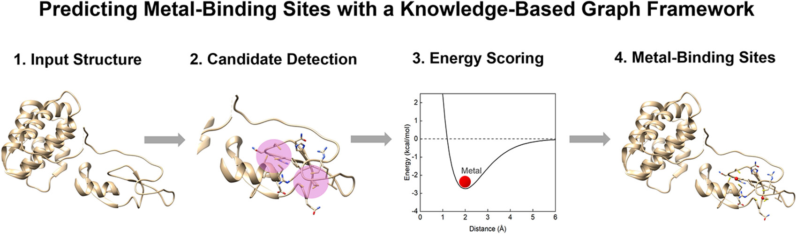
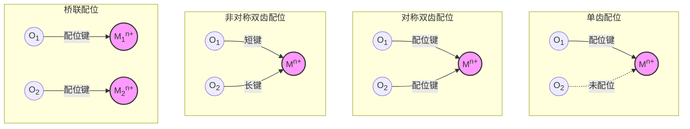
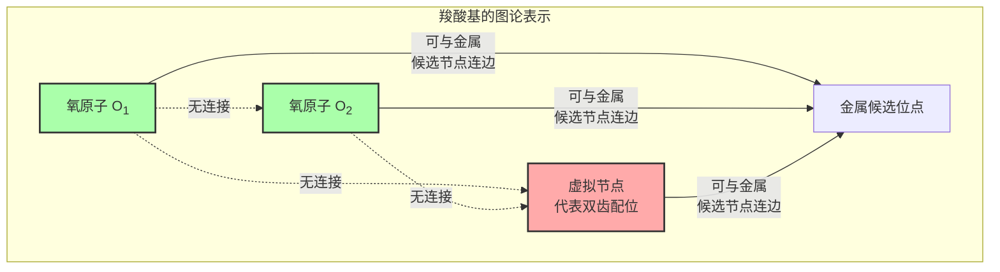

# MetalKB：用clique检测和统计势定位蛋白中的金属结合位点

## 本文信息

- **标题**：MetalKB：基于知识驱动图框架的蛋白金属结合位点预测
- **作者**：Xuejun Zhao, Hao Li, and Sheng-You Huang*
- 发表时间：2026年3月25日（论文接收）
- **单位**：华中科技大学物理学院，中国武汉
- **引用格式**：Zhao, X., Li, H., & Huang, S.-Y. MetalKB: Predicting Metal Binding Sites on Proteins with a Knowledge-Based Graph Framework. *Journal of Chemical Information and Modeling* (2026). https://doi.org/10.1021/acs.jcim.6c00453
- **代码与资源**：
  - GitHub：https://github.com/huang-laboratory/MetalKB/；
  - 网页：http://huanglab.phys.hust.edu.cn/MetalKB/；
  - Zenodo：https://doi.org/10.5281/zenodo.18999183

## 摘要

> 金属离子在蛋白质的**功能、调控和稳定性**中发挥关键作用，因此，准确预测金属离子的结合位点，对于揭示相关生物过程的分子机制具有重要价值。本文提出了 MetalKB，这是一种新的知识驱动框架，利用**原子级统计势**和**图论策略**来预测蛋白质上的金属离子结合位点。具体来说，先用 clique 检测算法识别可能的供体原子簇，并据此生成初始金属离子坐标；然后利用从蛋白—金属离子结合数据库推导得到的知识驱动统计势，对这些候选坐标进行评估和局部细化；随后再通过空间距离阈值去除冗余预测。基于 Metal3D 和 TEMSP 提供的多样化基准数据集的评估表明，MetalKB 在 precision、recall 和 F1 score 上与 7 种代表性方法相比具有**有竞争力的表现**，同时表现出较强的**鲁棒性和参数稳定性**。代表性结构案例进一步表明，MetalKB 能够识别复杂的配位环境，包括**多核金属位点**和**桥联金属位点**。此外，它还能同时给出**金属离子的三维坐标**和**残基级配位配体**的预测。

**图文摘要**。这张图把 MetalKB 的主线压缩成了三个步骤：先从蛋白结构中提取**候选供体原子**，再用**团检测**找出可能共同配位的一组原子，最后用**知识势打分与局部细化**给出金属坐标和配位残基。

### 核心结论

- MetalKB 的核心创新不是简单套用机器学习，而是把**供体原子几何约束**转写成图上的**团检测问题**，再用知识驱动统计势进行筛选和局部优化。
- 这套方法不是为每一种金属单独训练黑箱模型，而是把金属分成几类并分别构建**金属特异性统计势**，例如 Ca/Na 组、K 组、Mg 组，以及以 Zn 为代表的过渡金属组。
- 在 Metal3D 锌测试集上，MetalKB 在能量阈值 1.7 时达到 `precision = 0.955`、`recall = 0.472`、`F1 = 0.631`，与 PMM、Metal3D 相比表现稳定。
- 在 TEMSP 锌测试集上，MetalKB 的 `F1 = 0.967`，是文中比较方法里最高的一项，说明它在严格残基重叠标准下仍能兼顾精确率与召回率。
- MetalKB 的一个实际价值是同时给出**金属离子的空间坐标**和**邻近配位残基**，而不只是输出位点存在与否这一类粗粒度标签。

## 背景

金属离子在蛋白质中承担着多种角色，包括**稳定结构**、**组织蛋白—蛋白界面**、**参与催化**、**调节信号转导**以及**维持离子稳态**。已有研究估计，约 30%–40% 的蛋白需要一种或多种金属辅因子才能正常发挥功能，而锌尤其常见，在人体蛋白质组中约出现在 **10% 的蛋白**里。

实验上确定金属结合位点可以提供最直接的证据，但代价也高。**质谱**、**X 射线晶体学**等技术可以提供高精度证据，不过成本高、周期长，不适合大规模筛选。因此，基于序列或结构的计算预测方法一直都很重要。问题在于，很多金属位点并不是线性序列上的连续 motif，而是由空间上靠近、序列上相隔很远的残基共同构成，所以**只看序列往往不够**。

结构方法虽然更接近真实配位环境，但也面临几个长期存在的问题：

- **模板法依赖已知模式**，遇到新型配位环境或缺少合适模板的蛋白时，性能就容易掉下来。
- **简单几何规则的信息量有限**，距离和角度能描述一部分空间关系，却很难完整表达金属—配体相互作用。
- **QM/MM 足够准但代价太高**，不适合做常规的大规模扫描和筛选。

这里真正的问题在于：现有路线不是**过度依赖模板**，就是**几何描述太粗**，或者**训练分布过窄**，遇到多金属和复杂配位环境就容易失灵。MetalKB 针对这类空缺提出了一条不同的路线：它既不完全依赖模板，也不依赖昂贵的电子结构计算，而是利用实验结构中已经积累的大量统计规律来做预测。

### 关键科学问题

- 怎样从整条蛋白结构里先找出合适的供体原子组合：真实金属位点**通常至少包含 3 个配位供体**，必须先把**几何上可能同时配位**的一组原子筛出来，否则后面的打分空间太大。
- 怎样把几何合理性与化学合理性结合起来：单靠供体—供体距离约束，可以筛掉很多明显不可能的情况，但仍会留下**大量假阳性**；还需要**金属—原子相互作用势**来进一步区分。
- 怎样兼顾多种金属类型而不过度依赖某一类训练集：Metal3D 一类方法对锌表现突出，但对碱金属和碱土金属的泛化能力有限。MetalKB 试图用**金属特异性统计势**缓解这个问题。
- 怎样处理多核和桥联位点：如果两个金属之间距离本来就很近，简单的空间聚类很容易把真实双核位点误删掉；方法必须能识别**共享配体**和**近距离双金属构型**。

### 创新点

- **把金属位点采样写成团检测问题**，先用图论筛候选，再进入能量打分和细化。
- **从 MESPEUS 数据库推导距离依赖统计势**，并与 Lennard-Jones 12-6 势混合，增强短程排斥和整体物理合理性。
- **显式引入羧酸侧链的虚拟供体节点**，区分单齿、双齿、桥联等不同羧酸配位模式。
- **输出金属离子三维坐标与残基级配位信息**，而不只是一个二分类标签。

### MetalKB 覆盖范围

这里要把**测试覆盖范围**和**统计势构建范围**分开看。主文的多金属测试集明确包含 Zn2+、Ca2+、Mg2+、Mn2+、Fe2+、Fe3+、Cu2+、Co2+、Ni2+、Na+ 和 K+ 这 11 类金属离子；但方法本身并不是为这 11 类金属各自独立拟合一套势函数，而是按 4 个代表类别来建模：Ca/Na 组、K 组、Mg 组，以及以 Zn 为代表的过渡金属组。Al3+、Mo、W 这类离子没有出现在这篇的实际构建或测试范围里。

---

## 研究内容

**图1：MetalKB 的整体流程**

- **阶段一**：从金属蛋白结构中提取配位几何规则，并据此构建金属—蛋白原子对的**知识势**（knowledge-based/statistical potential）。
- **阶段二**：先做基于 clique 的候选位点采样，再用**混合势函数**对候选位点评分、局部细化，并去除冗余预测。

> MetalKB 的整体思想是：**先靠几何筛候选，再靠知识势与范德华势组成的混合势函数做化学判别**。它比一上来在整条蛋白上做均匀网格扫描更高效，因为**大量非结合区域根本不会进入后续步骤**。

### 方法详述：知识势从哪里来

MESPEUS 是这里的主要数据来源。这个数据库专门整理蛋白中的金属位点，且只收录**分辨率优于 2.5 Å**、由 X 射线晶体学或冷冻电镜解析的结构，不包含 NMR 或分辨率不明的条目，因此适合做几何统计。

文中先统计不同金属偏好的供体类型。Table 1 给出的不是精细电子结构，而是**残基供体频率图谱**。为了让这个统计更直观，可以把正文里的信息压缩成下面这张总结表：

| 金属类别 | 主要高频供体 | 文章强调的配位特征 |
| --- | --- | --- |
| Ca2+、Mg2+ | Asp/Glu 羧酸氧、主链羰基氧 | **偏好氧供体**，其中 Mg2+ 与 His 的统计接触不应简单解读为对氮供体有真实偏好 |
| Na+、K+ | 主链羰基氧和各类侧链氧 | **以氧供体为主**，K+ 对主链羰基氧尤其常见 |
| Mn、Fe、Co | His 咪唑氮、Asp/Glu 羧酸氧 | 兼具**His 偏好**与对酸性残基的明显使用 |
| Ni、Cu、Zn | His 咪唑氮、Cys 硫原子、Asp/Glu 羧酸氧 | **His/Cys 偏好最突出**，尤其 Cu、Zn 对 Cys 的偏好很明显 |

真正影响后续建模的是，文中并没有为每一种金属各写一套完全独立的规则，而是根据供体组成、离子半径和配位特征的共性，把**知识势**归纳成 4 类：**Ca/Na 组、K 组、Mg 组，以及以 Zn 为代表的过渡金属组**。

为了降低冗余，这里还用 CD-HIT 在 **30% 序列一致性阈值**上做了去冗余。最终用于知识势推导的数据量分别是：Zn 结合蛋白 2568 个、Ca 2375 个、Mg 3451 个、K 778 个，这意味着这些势函数建立在**规模较大的结构统计样本**之上。

#### 知识势与混合势函数

这里先把术语说清楚：本文里的 $w_{ij}(r)$ 是从结构数据库统计出来的**知识势**，英文常写作 knowledge-based potential，也属于一类 statistical potential；真正用于打分的是再与范德华势组合后的**混合势函数** $u_{ij}(r)$。知识势 $w_{ij}(r)$ 基于观测到的原子对距离分布，核心思想是：某种金属—原子相互作用在实验结构中出现得越频繁，对应的能量就越低。

##### 知识势函数（Eq 2）

本文使用逆 Boltzmann 形式把局部富集程度转换成相对能量：

$$
w_{ij}(r) = -k_B T \log \left[ \frac{\rho_{ij}^{\mathrm{obs}}(r)}{\rho_{ij,\mathrm{bulk}}^{\mathrm{obs}}} \right]
$$

这里，$\rho_{ij}^{\mathrm{obs}}(r)$ 是金属离子 $i$ 与原子类型 $j$ 在距离 $r$ 处的**观测数密度**，$\rho_{ij,\mathrm{bulk}}^{\mathrm{obs}}$ 是参考球体中的**平均背景数密度**，可以把它理解成没有特殊配位偏好时的基线水平。

> 这里的感觉和 RDF 很接近：本质上都是在比较某个距离壳层里的局部富集程度，只不过本文把参考背景写成了 10 Å 参考球内的平均数密度。计算时把 $k_B T$ 设为 1，所以这个式子更接近一种**相对打分势**，重点是比较不同相互作用在结构数据库里出现得是否异常频繁。

##### 混合势函数（Eq 5）

本文没有直接把知识势单独拿来用，而是把它和范德华势拼在一起：

$$
u_{ij}(r)=
\begin{cases}
\min \left[w_{ij}(r),\, v_{ij}(r)\right], & r \le 3.0\ \mathrm{\AA} \\
\dfrac{v_{ij}(r)e^{v_{ij}(r)} + w_{ij}(r)e^{w_{ij}(r)}}{e^{v_{ij}(r)} + e^{w_{ij}(r)}}, & r > 3.0\ \mathrm{\AA}
\end{cases}
$$

这里的 $v_{ij}(r)$ 是 **Lennard-Jones 12-6 势**。这个分段形式的意义很明确：在 **3.0 Å 以内**，直接取知识势和范德华势里更保守的那个，避免短程碰撞被知识势低估；在 **3.0 Å 以外**，再用指数加权把两者平滑拼接起来，让长程能量自然衰减到 0。这样既保留了**实验结构统计里的配位偏好**，又不会在短距离给出明显不合理的能量形状。

总打分时，会对金属离子与周围相关蛋白原子对的相互作用逐一求和。真正参与打分的是**混合势函数** $u_{ij}(r)$：它由知识势 $w_{ij}(r)$ 与 Lennard-Jones 12-6 势 $v_{ij}(r)$ 组合得到，在短距离保留保守的排斥与势阱形状，在较长距离又让能量自然衰减到 0。这个设计的重点是**同时保留配位偏好与短程排斥**。

#### 基于 clique 的候选位点采样

**图2：基于 clique 的候选位点采样**

- (a) 蛋白先被表示为供体原子集合，再转成图；节点是候选供体原子，只有当供体—供体距离落在统计得到的合理区间时，两点之间才连边。
- (b)、(c) 展示了羧酸氧参与金属配位时的两种典型模式，说明为什么仅靠均匀网格扫描很难区分这些模式。

> 这里的 clique 指的是**完全连通子图**。在 MetalKB 里，它表示一组供体原子两两之间都满足合理距离约束，因此有可能共同围成一个真实金属位点。

整个流程分成四步，而关键就在于**先把搜索空间压缩到真正像配位簇的区域**：

- 第一步，**提取候选供体原子**。过渡金属考虑 Cys 的 SG、His 的 ND1/NE2、Glu 的 OE1/OE2、Asp 的 OD1/OD2；碱土和碱金属则考虑 Asp、Glu、Asn、Gln、Ser、Thr 的侧链氧以及所有残基的主链氧。
- 第二步，**按供体—供体距离建图**。对于过渡金属，两个供体原子距离落在 `2.4–5.2 Å` 时连边；其他金属类型则用图S1 统计出来的各自区间，例如 Ca2+ 和 Mg2+ 是 `2.5–5.3 Å`，K+ 是 `2.9–5.8 Å`。
- 第三步，**识别 clique 并做子团去冗余**。这里要求 clique 至少包含 3 个供体原子；如果一个 clique 严格包含另一个较小 clique，则保留大的那个，避免重复采样。
- 第四步，**用供体原子几何质心作为初始金属坐标**。这是后续局部精修的起点，而不是最终坐标。

第四步里用到的几何质心写法是：

$$
x = \frac{1}{n}\sum_{i=1}^{n} x_i,\qquad
y = \frac{1}{n}\sum_{i=1}^{n} y_i,\qquad
z = \frac{1}{n}\sum_{i=1}^{n} z_i
$$

这里的 $n$ 是 clique 中供体原子的数量，$(x_i, y_i, z_i)$ 是第 $i$ 个供体原子的三维坐标。这个初始点不是最终答案，而是**后续局部网格细化的起点**：先识别出可能共同配位的一组供体，再用它们的几何中心给出初始金属位置。

### 候选位点的评分、局部细化与冗余去除

clique 采样给出的几何质心只是一个**初始候选位置**，还不一定正好落在最低能量点上。为了进一步提高坐标精度，MetalKB 又在每个初始坐标周围做了一轮**局部网格细化**：

- 初始坐标来自 clique 中供体原子的几何质心。
- 以这个初始坐标为中心，在 `2.5 Å` 半径内生成更密的局部候选点。
- 网格步长设为 `0.25 Å`。
- 对每个候选点用前面定义的势函数逐一评分，保留**能量最低**的坐标作为最终预测位置。

这一轮细化的作用，是把初始几何估计进一步修到**局部最低能量附近**，从而改善**金属坐标的定位精度**。

去冗余时这里也特意避开了多核位点被误删的问题。多核金属簇里**金属—金属距离多数在 3–4 Å 左右**，因此 MetalKB 把冗余删除阈值设成 **2.5 Å**。实际做法是先按能量从低到高排序，再检查预测点之间的距离；如果两个预测金属离子彼此小于 `2.5 Å`，就保留**能量更低**的那个。

另外，最终输出时只报告距离预测金属坐标 **4 Å** 以内的供体残基。例如锌位点只报告 **Cys、His、Glu、Asp** 这些符合统计规律的残基。

#### 羧酸配位的特殊处理

Asp 和 Glu 的羧酸基是这里最容易被低估的一类供体，因为**一个残基上有两个氧原子**，而这两个氧和金属的关系并不只有一种。羧酸可以形成四种不同的配位模式：

- **单齿配位**：只有一个氧与金属形成配位键，另一个氧未参与
- **对称双齿配位**：两个氧同时与同一金属配位，键长基本相等
- **非对称双齿配位**：两个氧同时配位，但键长一短一长
- **桥联配位**：两个氧分别与两个不同的金属配位，使羧酸基成为连接两个金属中心的桥梁

前三种模式都属于一个羧酸基围绕**同一个金属中心**配位的框架，只是两个氧参与的方式不同；桥联配位则更复杂，表示同一个羧酸基把配位关系延伸到**两个金属中心**。

如果直接把两个羧酸氧都当成普通供体去做网格扫描，程序往往只能看到附近有两个氧，却分不清这里到底是**一个氧单独配位**，还是**两个氧一起围住同一个金属**，还是**一个羧酸基同时参与两个金属中心**。这也是**普通均匀网格采样**容易把这些几何模式混在一起的原因。

MetalKB 的解决方案是在图论层面引入**虚拟供体节点**，专门代表把这个羧酸基当作一个双齿配位单元的情况：

这个虚拟节点不是新的真实原子，而是**图模型里的占位符**。关键在于两条不连边规则：

- **同一个羧酸基的两个氧之间不连边**：它们不能同时出现在同一个 clique 中
- **任意一个氧和它对应的虚拟节点之间也不连边**：单齿模式与双齿模式互斥

在 clique 搜索里，不连边就意味着这些节点**不能同时出现在同一个 clique** 里。因此，同一个羧酸基在一次候选采样中，只能以一种方式被表示：

- **选其中一个氧** → 当作**单齿配位**的一侧供体
- **选虚拟节点** → 当作**双齿配位单元**
- 不会把两个氧和虚拟双齿节点同时塞进同一个候选簇里，避免重复计数

这套表示方式首先解决的是**单齿与双齿配位的区分问题**。桥联配位的关键不是两个氧一定同时进入同一个 clique，而是**同一个羧酸基可以被不同金属中心共享**。虚拟节点和互斥规则有助于避免把同一个羧酸基在单个候选簇中重复计数；多核位点能否被保留，则主要取决于后续 **2.5 Å 冗余阈值**没有把彼此真实相邻的金属中心误合并。

> 这样设计的核心是**在图论采样阶段，先把羧酸这种多模式供体拆成几种互斥的几何表示**。这样后面的 clique 搜索和势函数打分才能分清：这是单齿、双齿，还是可能出现在更复杂的桥联环境里。

---

## 相关文档

**结果与评估**：[MetalKB：性能评估与案例分析](/Specific%20Sytems/Metal/2026-04-03-metalkb-results/) - Metal3D/TEMSP 基准测试性能、多金属评估与代表性案例
