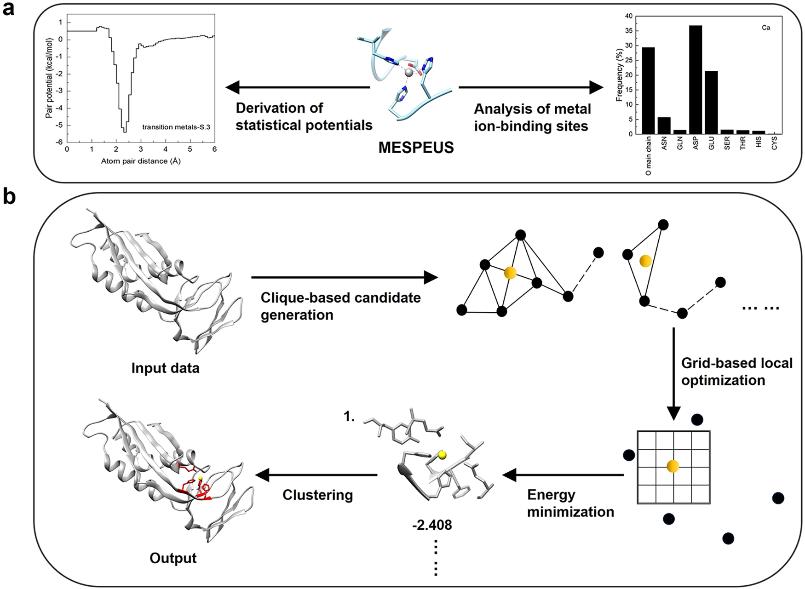
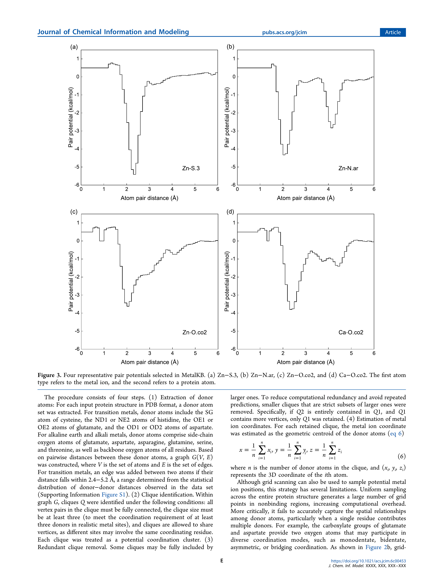
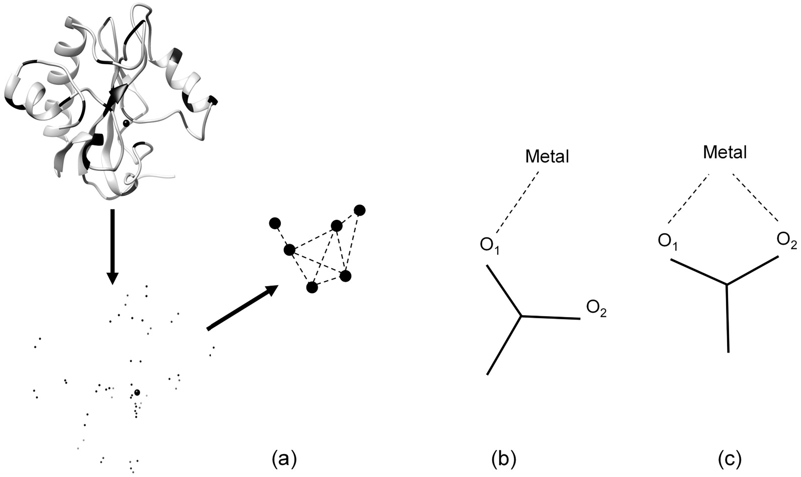

# MetalKB：用团检测和统计势定位蛋白中的金属结合位点

## 本文信息

- **标题**：MetalKB：基于知识驱动图框架的蛋白金属结合位点预测
- **作者**：Xuejun Zhao, Hao Li, and Sheng-You Huang*
- 发表时间：2026年3月25日（论文接收）
- **单位**：华中科技大学物理学院，中国武汉
- **引用格式**：Zhao, X., Li, H., & Huang, S.-Y. MetalKB: Predicting Metal Binding Sites on Proteins with a Knowledge-Based Graph Framework. *Journal of Chemical Information and Modeling* (2026). https://doi.org/10.1021/acs.jcim.6c00453
- **代码与资源**：GitHub：https://github.com/huang-laboratory/MetalKB/；网页：http://huanglab.phys.hust.edu.cn/MetalKB/；Zenodo：https://doi.org/10.5281/zenodo.18999183

## 摘要

> MetalKB 提出了一种**知识驱动的图框架**，用于从蛋白质三维结构中预测金属离子的结合位点。它先把潜在供体原子之间的几何关系表示成图，并通过**团检测**找出可能共同配位的一组原子，再利用从金属蛋白结构数据库中统计得到的**金属特异性原子对势函数**对候选位点打分和局部细化。在 Metal3D 和 TEMSP 基准上，MetalKB 在精确率、召回率和 F1 分数之间取得了有竞争力的平衡，尤其能处理**多核和桥联型金属位点**，并且还能同时输出**金属离子的三维坐标与残基级配位信息**。

### 核心结论

- MetalKB 的核心创新不是简单套用机器学习，而是把**供体原子几何约束**转写成图上的**团检测问题**，再用知识驱动的**知识势（统计势）**进行筛选和局部优化。
- 这套方法不是为每一种金属单独训练黑箱模型，而是把金属分成几类并分别构建**金属特异性的知识势（统计势）**，例如 Zn 类、Ca 类、Mg 类和 K 类。
- 在 Metal3D 锌测试集上，MetalKB 在能量阈值 1.7 时达到 `precision = 0.955`、`recall = 0.472`、`F1 = 0.631`，与 PMM、Metal3D 相比表现稳定。
- 在 TEMSP 锌测试集上，MetalKB 的 `F1 = 0.967`，是文中比较方法里最高的一项，说明它在严格残基重叠标准下仍能兼顾精确率与召回率。
- MetalKB 的一个实际价值是同时给出**金属离子的空间坐标**和**邻近配位残基**，而不只是输出“这里可能结合金属”这一类粗粒度标签。

## 背景

金属离子在蛋白质中承担着多种角色，包括**稳定结构**、**组织蛋白—蛋白界面**、**参与催化**、**调节信号转导**以及**维持离子稳态**。已有研究估计，约 30%–40% 的蛋白需要一种或多种金属辅因子才能正常发挥功能，而锌尤其常见，在人体蛋白质组中约出现在 **10% 的蛋白**里。

实验上确定金属结合位点可以提供最直接的证据，但代价也高。**质谱**、**X 射线晶体学**等技术可以提供高精度证据，不过成本高、周期长，不适合大规模筛选。因此，基于序列或结构的计算预测方法一直都很重要。问题在于，很多金属位点并不是线性序列上的连续 motif，而是由空间上靠近、序列上相隔很远的残基共同构成，所以**只看序列往往不够**。

结构方法虽然更接近真实配位环境，但也面临几个长期存在的问题：

- **模板法依赖已知模式**，遇到新型配位环境或缺少合适模板的蛋白时，性能就容易掉下来。
- **简单几何规则的信息量有限**，距离和角度能描述一部分空间关系，却很难完整表达金属—配体相互作用。
- **QM/MM 足够准但代价太高**，不适合做常规的大规模扫描和筛选。

这里真正的问题在于：现有路线不是**过度依赖模板**，就是**几何描述太粗**，或者**训练分布过窄**，遇到多金属和复杂配位环境就容易失灵。MetalKB 针对这类空缺提出了一条不同的路线：它既不完全依赖模板，也不依赖昂贵的电子结构计算，而是利用实验结构中已经积累的大量统计规律来做预测。

### 关键科学问题

- 怎样从整条蛋白结构里先找出“值得考虑”的供体原子组合：真实金属位点**通常至少包含 3 个配位供体**，必须先把**几何上可能同时配位**的一组原子筛出来，否则后面的打分空间太大。
- 怎样把“几何合理”与“化学合理”结合起来：单靠供体—供体距离约束，可以筛掉很多明显不可能的情况，但仍会留下**大量假阳性**；还需要**金属—原子相互作用势**来进一步区分。
- 怎样兼顾多种金属类型而不过度依赖某一类训练集：Metal3D 一类方法对锌表现突出，但对碱金属和碱土金属的泛化能力有限。MetalKB 试图用**金属特异性的知识势（统计势）**缓解这个问题。
- 怎样处理多核和桥联位点：如果两个金属之间距离本来就很近，简单的空间聚类很容易把真实双核位点误删掉；方法必须能识别**共享配体**和**近距离双金属构型**。

### 创新点

- **把金属位点采样写成 clique identification 问题**，先用图论筛候选，再进入能量打分和细化。
- **从 MESPEUS 数据库推导距离依赖的知识势（统计势）**，并与 Lennard-Jones 12-6 势混合，增强短程排斥和整体物理合理性。
- **显式引入羧酸侧链的虚拟供体节点**，区分单齿、双齿、桥联等不同羧酸配位模式。
- **输出金属离子三维坐标与残基级配位信息**，而不只是一个二分类标签。

### MetalKB 覆盖范围

这里要把**测试覆盖范围**和**统计势构建范围**分开看。主文的多金属测试集明确包含 Zn2+、Ca2+、Mg2+、Mn2+、Fe2+、Fe3+、Cu2+、Co2+、Ni2+、Na+ 和 K+ 这 11 类金属离子；但方法本身并不是为这 11 类金属各自独立拟合一套势函数，而是按 4 个代表类别来建模：Ca/Na 组、K 组、Mg 组，以及以 Zn 为代表的过渡金属组。Al3+、Mo、W 这类离子没有出现在这篇的实际构建或测试范围里。

---

## 研究内容

**图1：MetalKB 的整体流程**

- **阶段一**：从金属蛋白结构中提取配位几何规则，并据此构建金属—蛋白原子对的**知识势函数（统计势）**。
- **阶段二**：先做基于 clique 的候选位点采样，再用**混合势函数**对候选位点评分、局部细化，并去除冗余预测。

> MetalKB 的整体思想是：**先靠几何筛候选，再靠知识势与范德华势组成的混合势函数做化学判别**。它比一上来在整条蛋白上做均匀网格扫描更高效，因为**大量非结合区域根本不会进入后续步骤**。

### 方法详述：知识势从哪里来

MESPEUS 是这里的主要数据来源。这个数据库专门整理蛋白中的金属位点，且只收录分辨率优于 2.5 Å、由 X 射线晶体学或冷冻电镜解析的结构，不包含 NMR 或分辨率不明的条目，因此适合做几何统计。

文中先统计不同金属偏好的供体类型。Table 1 给出的不是精细电子结构，而是**残基供体频率图谱**。为了让这个统计更直观，可以把正文里的信息压缩成下面这张总结表：

| 金属类别 | 主要高频供体 | 文章强调的配位特征 |
| --- | --- | --- |
| Ca2+、Mg2+ | Asp/Glu 羧酸氧、主链羰基氧 | **偏好氧供体**，其中 Mg2+ 与 His 的统计接触不应简单解读为对氮供体有真实偏好 |
| Na+、K+ | 主链羰基氧和各类侧链氧 | **方向性较弱**，对氧供体整体较“宽容”，K+ 对主链羰基氧尤其常见 |
| Mn、Fe、Co | His 咪唑氮、Asp/Glu 羧酸氧 | 兼具**His 偏好**与对酸性残基的明显使用 |
| Ni、Cu、Zn | His 咪唑氮、Cys 硫原子、Asp/Glu 羧酸氧 | **His/Cys 偏好最突出**，尤其 Cu、Zn 对 Cys 的偏好很明显 |

真正影响后续建模的是，文中并没有为每一种金属各写一套完全独立的**知识势（统计势）**，而是根据供体组成、离子半径和配位特征的共性，把它们归纳成 4 类：**Ca/Na 组、K 组、Mg 组，以及以 Zn 为代表的过渡金属组**。

为了降低冗余，这里还用 CD-HIT 在 30% 序列一致性阈值上做了去冗余。最终用于知识势推导的数据量分别是：Zn 结合蛋白 2568 个、Ca 2375 个、Mg 3451 个、K 778 个，这意味着这些势函数并不是基于少量案例拟合出来的，而是建立在相对扎实的结构统计样本之上。

#### 知识势与混合势函数

这里先把术语说清楚：本文里的 `w_{ij}(r)` 是从结构数据库统计出来的**知识势**，它本质上就是一类**统计势**；真正用于打分的是再与范德华势组合后的**混合势函数** `u_{ij}(r)`。知识势 $w_{ij}(r)$ 基于观测到的原子对距离分布，核心思想是：某种金属-原子相互作用在实验结构中出现得越频繁，对应的能量就越低。

##### 知识势函数（Eq 2）

本文使用逆 Boltzmann 形式把“观察到得有多频繁”转换成“能量有多低”：

$$
w_{ij}(r) = -k_B T \log \left[ \frac{\rho_{ij}^{\mathrm{obs}}(r)}{\rho_{ij,\mathrm{bulk}}^{\mathrm{obs}}} \right]
$$

这里，$\rho_{ij}^{\mathrm{obs}}(r)$ 是金属离子 $i$ 与原子类型 $j$ 在距离 $r$ 处的观测数密度，$\rho_{ij,\mathrm{bulk}}^{\mathrm{obs}}$ 是参考球体中的平均背景数密度，可以把它理解成“如果没有特殊配位偏好，这类原子在金属周围本来应该有多少”的基线水平。

> 这里的感觉和 RDF 很接近：本质上都是在比较某个距离壳层里的局部富集程度，只不过本文把参考背景写成了 10 Å 参考球内的平均数密度。计算时把 $k_B T$ 设为 1，所以这个式子更接近一种**相对打分势**，重点是比较不同相互作用在结构数据库里出现得是否异常频繁。

##### 混合势函数（Eq 5）

本文没有直接把知识势单独拿来用，而是把它和范德华势拼在一起：

$$
u_{ij}(r)=
\begin{cases}
\min \left[w_{ij}(r),\, v_{ij}(r)\right], & r \le 3.0\ \mathrm{\AA} \\
\dfrac{v_{ij}(r)e^{v_{ij}(r)} + w_{ij}(r)e^{w_{ij}(r)}}{e^{v_{ij}(r)} + e^{w_{ij}(r)}}, & r > 3.0\ \mathrm{\AA}
\end{cases}
$$

这里的 $v_{ij}(r)$ 是 Lennard-Jones 12-6 势。这个分段形式的意义很明确：在 3.0 Å 以内，直接取知识势和范德华势里更保守的那个，避免短程碰撞被知识势“误拉低”；在 3.0 Å 以外，再用指数加权把两者平滑拼接起来，让长程能量自然衰减到 0。这样既保留了实验结构统计里的配位偏好，又不会在短距离给出明显不合理的能量形状。

总打分时，会对金属离子与周围相关蛋白原子对的相互作用逐一求和。真正参与打分的是混合势函数 $u_{ij}(r)$：它由知识势 $w_{ij}(r)$ 与 Lennard-Jones 12-6 势 $v_{ij}(r)$ 组合得到，在短距离保留保守的排斥与势阱形状，在较长距离又让能量自然衰减到 0。这个设计的重点是：**既保留知识势对真实配位偏好的描述，又避免出现明显不合理的短程碰撞**。

**图3：四种代表性原子对势函数**，把前面的统计规律落实到了具体势函数上：

- (a) **Zn−S.3 的势阱最深、最窄**，说明 Zn 与 Cys 硫原子的配位更强、更刚性，这与它常承担结构稳定作用一致
- (b) **Zn−N.ar 和 Zn−O.co2 的势阱更宽**，反映出更灵活的配位环境，常见于催化位点
- (c) **Zn−O.co2 的有效配位区间更长**，可从约 2.0 Å 延伸到 4.0 Å，体现了羧酸氧既可以单齿配位，也可能通过双齿或桥联方式参与配位
- (d) **Ca−O.co2 更偏好单齿或对称双齿配位**，在约 `2.2–2.4 Å` 处有主极小值，并在约 `4.5 Å` 附近出现次级势阱

### 图2：基于 clique 的候选位点采样

- (a) 蛋白先被表示为供体原子集合，再转成图；节点是候选供体原子，只有当供体—供体距离落在统计得到的合理区间时，两点之间才连边。
- (b)、(c) 展示了羧酸氧参与金属配位时的两种典型模式，说明为什么仅靠均匀网格扫描很难区分这些模式。

> 这里的 clique 指的是**完全连通子图**。在 MetalKB 里，它表示一组供体原子两两之间都满足合理距离约束，因此有可能共同围成一个真实金属位点。

整个流程分成四步，而关键就在于**先把搜索空间压缩到真正像配位簇的区域**：

- 第一步，**提取候选供体原子**。过渡金属考虑 Cys 的 SG、His 的 ND1/NE2、Glu 的 OE1/OE2、Asp 的 OD1/OD2；碱土和碱金属则考虑 Asp、Glu、Asn、Gln、Ser、Thr 的侧链氧以及所有残基的主链氧。
- 第二步，**按供体—供体距离建图**。对于过渡金属，两个供体原子距离落在 `2.4–5.2 Å` 时连边；其他金属类型则用图S1 统计出来的各自区间，例如 Ca2+ 和 Mg2+ 是 `2.5–5.3 Å`，K+ 是 `2.9–5.8 Å`。
- 第三步，**识别 clique 并做子团去冗余**。这里要求 clique 至少包含 3 个供体原子；如果一个 clique 严格包含另一个较小 clique，则保留大的那个，避免重复采样。
- 第四步，**用供体原子几何质心作为初始金属坐标**。这是后续局部精修的起点，而不是最终坐标。

##### 金属离子坐标估算（Eq 6）

第四步里用到的几何质心写法是：

$$
x = \frac{1}{n}\sum_{i=1}^{n} x_i,\qquad
y = \frac{1}{n}\sum_{i=1}^{n} y_i,\qquad
z = \frac{1}{n}\sum_{i=1}^{n} z_i
$$

这里的 $n$ 是 clique 中供体原子的数量，$(x_i, y_i, z_i)$ 是第 $i$ 个供体原子的三维坐标。这个初始点不是最终答案，而是后续局部网格细化的起点。这样讲就更符合本文的方法顺序：**先识别出可能共同配位的一组供体，再用它们的几何中心给出初始金属位置**。

#### 羧酸配位的特殊处理

对于 Asp/Glu 的羧酸基，这里在两个氧原子之间引入了**虚拟供体节点**，用来表示潜在**双齿配位**；同时禁止同一羧酸的两个氧原子彼此连边，也禁止氧原子与其对应虚拟节点连边。这样做的目的是把**单齿、对称双齿、非对称双齿和桥联**这几类模式区分开，而不是被网格扫描混成一团。

### 候选位点的评分、局部细化与冗余去除

在得到初始 clique 质心后，MetalKB 并没有用梯度下降，而是采用**局部网格细化**：

- 以初始坐标为中心，在 `2.5 Å` 半径内生成局部候选点。
- 网格步长设为 `0.25 Å`。
- 对每个候选点用**混合势函数**评分，保留**能量最低**的坐标作为最终预测位置。

这种做法适合这个问题，因为金属位点局部能量面往往比较尖锐，局部细网格足以改善**坐标精度**，而且实现简单、稳定。

去冗余时这里也特意避开了多核位点被误删的问题。多核金属簇里金属—金属距离多数在 3–4 Å 左右，因此 MetalKB 把冗余删除阈值设成 **2.5 Å**。实际做法是先按能量从低到高排序，再检查预测点之间的距离；如果两个预测金属离子彼此小于 `2.5 Å`，就保留能量更低的那个。

另外，最终输出时只报告距离预测金属坐标 **4 Å** 以内的供体残基。例如锌位点只报告 Cys、His、Glu、Asp 这些符合统计规律的残基。

---

**图4：不同能量阈值下的 precision–recall 变化**

- 这张图不是在扫“团大小阈值”或“配位距离阈值”，而是看**不同能量 cutoff** 对预测表现的影响
- 横轴是平移和缩放后的总能量绝对值，纵轴是 precision 与 recall
- 数据来自从 Ca、Zn、Mg、K 统计数据集中各随机抽取的 100 个结构

> 图 4 说明的是一个直接的权衡：**能量阈值越严格，precision 上升而 recall 下降**。文中采用 `1.7` 作为折中阈值，因为此时 precision 已经明显提高，而 recall 仍保持在可接受范围内。

这里还有两个容易忽略的限定条件：

- MetalKB 研究的是**金属—蛋白相互作用**，因此知识势推导时并不处理小分子配体
- 配位数小于 3 的特殊情况并不是这套方法的重点，所以结果解读时不能把它理解成对任意金属位点都同样适用的工具

**图S2：知识势能否区分金属类型**

SI 里专门做了一个 cross-metal prediction analysis。不同金属类型的知识势被拿去打同一批位点，并观察 true positive 预测的空间偏差分布。结果是：**正确金属类型对应的知识势通常会给出更集中、偏差更小的分布**，说明这套势函数确实带有一定金属类型特异性。

> 不过单靠当前这套基于距离和几何偏好的势函数，**还不足以做精细的金属种类判别**。MetalKB 的主要目标是找位点和坐标，不是做金属分类器。

---

**图5：MetalKB 在 Metal3D 测试集上的表现**

- (a) 比较 MetalKB、Metal3D、PMM 在不同阈值下的 precision、recall、F1
- (b) 给出 MetalKB 预测坐标的误差分布，其中灰色条表示受多核金属位点影响的预测
- (c) 比较 MetalKB（蓝色，energy threshold = 1.7）与 Metal3D（橙色，`p = 0.75`）在 11 类金属上的性能
- (d) 给出 11 类金属预测的偏差分布；图中负值代表相对参考位置的有符号偏差，不是“负的距离”

图5a 展示了 MetalKB 在不同能量阈值下的性能变化。为了便于横向比较，可以把 MetalKB 与两种对比方法的关键指标整理成下面这张对照表：

| 方法 | 参数值 | Precision | Recall | F1 |
| --- | --- | --- | --- | --- |
| MetalKB | threshold = 1.0 | 0.806 | 0.489 | 0.608 |
| MetalKB | threshold = 1.5 | 0.859 | - | 0.614 |
| MetalKB | threshold = 1.7 | 0.955 | 0.472 | 0.631 |
| PMM | p = 0.5 | 0.752 | 0.494 | - |
| PMM | p = 0.75 | 0.901 | 0.410 | 0.563 |
| Metal3D | p = 0.5 | - | - | 0.631 |
| Metal3D | p = 0.75 | 0.904 | 0.450 | 0.601 |
| Metal3D | p = 0.9 | 0.986 | 0.360 | 0.527 |

从这张对照表可以看出几个关键趋势：

- MetalKB 从 `threshold = 1.0` 提高到 `1.7` 的过程中，precision 从 `0.806` 升到 `0.955`，而 recall 只从 `0.489` 降到 `0.472`，说明收紧阈值的主要效果是**减少假阳性**，而不是明显牺牲召回率。
- PMM 在 `p = 0.5` 时 recall 与 MetalKB(1.0) 接近，但 precision 更低；当 `p = 0.75` 时 precision 虽然升高，F1 反而下降，说明它更依赖参数折中。
- Metal3D 在 `p = 0.5` 时 F1 与 MetalKB(1.7) 相当，但参数继续收紧后 recall 下降更快，说明它对阈值更敏感。

> MetalKB 在不同阈值下维持了相对稳定的**精确率—召回率折中**。

#### 坐标误差怎么理解

图5b 还展示了空间定位精度。MetalKB(1.7) 的平均坐标误差是 `1.117 ± 1.567 Å`，表面上高于 Metal3D 在 `p = 0.75` 时的 `0.710 ± 0.631 Å`。但 **MetalKB 的中位误差只有 `0.224 Å`**，反而优于 Metal3D 的 `0.508 Å`。这与多核锌位点有关：因为两个真实锌离子本来就可能相距很近，误差统计容易被这些特殊案例拉高。

文中还特别指出，误差大于 3 Å 的 15 个预测主要来自二核位点；如果把这些情况排除，MetalKB 的平均误差会降到 `0.596 ± 1.025 Å`。换句话说，**多数普通位点的坐标定位已经很准，均值主要受少数多核难例影响**。

#### 多金属测试集的结果

Metal3D 的多金属测试集包含 `11` 类金属：Ca2+、Mg2+、Na+、K+、Mn2+、Fe3+、Fe2+、Co2+、Ni2+、Cu2+、Zn2+。每个位点都至少有 3 个独特蛋白配体，且占有率大于 0.5。

图5c 显示，**MetalKB 在大多数金属类型上优于 Metal3D，尤其是 Zn2+、Ca2+ 和 Fe3+**。而 Metal3D 在 Na+、K+、Mg2+ 这些非过渡金属上的表现较差，这和它的训练集主要偏向锌有关。

图5d 里，MetalKB 在 11 类金属上的中位预测误差大约在 **0.3 Å** 左右，也就是一半以上预测已经非常接近实验坐标。更细的各金属误差统计见表S1。

**表S1：各金属的误差分布**

以 MetalKB（阈值 1.7）为例：

| 金属 | 平均误差（Å） | 中位数误差（Å） |
| --- | --- | --- |
| Zn | 0.425 ± 0.884 | 0.174 |
| Ca | 0.314 ± 0.526 | 0.178 |
| Ni | 0.371 ± 0.267 | 0.304 |
| Cu | 0.362 ± 0.424 | 0.254 |
| K | 0.407 ± 0.608 | 0.253 |

这说明 MetalKB 不局限于锌体系，在 **Ca、Ni、Cu、K** 等金属上也能给出相当靠近实验位置的预测坐标。

---

TEMSP 更接近验证“**配位组成有没有猜对**”。这个数据集包含 `100` 个蛋白结构、`136` 个实验验证的锌位点。与 Metal3D 的“坐标 5 Å 内算命中”不同，TEMSP 用的是 **IoUR**（Intersection over Union of Residues，残基层面的交并比），即预测配位残基集合与真实配位残基集合的重叠程度。文中把 `$\mathrm{IoUR} \ge 0.5$` 记为 true positive（TP），这比只比较空间距离更严格，因为你不仅要预测到附近，还得把残基组分猜对一半以上。

**图6 与表2：MetalKB 在 TEMSP 上的六方法比较**

- 柱状图展示 precision、recall、F1
- 折线显示平均坐标偏差，单位是 Å
- CHED 和 ZincBindDB 不输出显式三维坐标，所以图里没有它们的平均坐标偏差

**表2：TEMSP 上的关键数值**

| 方法 | TP | FN | FP | Precision | Recall | F1 | 坐标偏差（Å） |
| --- | --- | --- | --- | --- | --- | --- | --- |
| MetalKB | 133 | 3 | 6 | 0.957 | 0.978 | 0.967 | 0.262 |
| PMM | 134 | 2 | 21 | 0.865 | 0.985 | 0.921 | 0.237 |
| TEMSP | 117 | 19 | 5 | 0.959 | 0.860 | 0.907 | 0.380 |
| CHED | 112 | 24 | 11 | 0.911 | 0.824 | 0.865 | — |
| GRE4Zn | 101 | 35 | 5 | 0.953 | 0.743 | 0.835 | 0.267 |
| ZincBindDB | 115 | 21 | 273 | 0.296 | 0.846 | 0.439 | — |

表 2 可以直接拆成下面几点：

- MetalKB 的 **F1 = 0.967**，是表 2 里最高的一项。虽然它的 recall `0.978` 略低于 PMM 的 `0.985`，但 precision `0.957` 明显高于 PMM 的 `0.865`
- **TEMSP 和 GRE4Zn 的高 precision、低 recall** 组合意味着它们对 false positive 的控制更严格，但漏检风险也更高
- ZincBindDB 的主要问题是 **273 个 false positives**，这直接把 precision 拉到 `0.296`
- 在坐标偏差上，MetalKB 的 `0.262 Å` 虽略高于 PMM 的 `0.237 Å`，但仍然处在非常小的误差量级内

图4–图6 之间 precision/recall 的差异，与测试集组成有关。图4 和图5a 所用数据里包含一些配位数少于 3 的位点，而图5c 和图6 代表的是更典型、更规范的配位环境，因此这些数字不能直接横向混为一谈。

**图7：多核与桥联锌位点的代表性案例**

> 这里展示的不是“某个单独锌点能不能找到”，而是**共享配体、近距离双核以及多位点并存**这些更难的场景。

- (a) 乳酸杆菌二核锌氨肽酶 PepV
- (b) 人源 H3K9 histone lysine methyltransferase
- (c) RAG1 dimerization domain
- (d) RAG1 dimerization domain 中的二核锌簇
- 图中**金色球**是实验结构中的金属位置，**红色球**是 MetalKB 预测的位置

#### 案例 1：PepV 的双锌活性位点

PepV 是桥联双金属的典型例子。Zn2 由 His87、Asp119、Asp177 配位，Zn1 由 His439、Asp119、Glu154 配位，其中 **Asp119 是桥联配体**，连接两个锌离子，两个金属之间距离约 `3.8 Å`。MetalKB 不仅找到了两个锌的位置，还正确识别了共享配体 Asp119。平均金属—金属距离误差 **小于 0.18 Å**。

#### 案例 2：H3K9 甲基转移酶中的多个锌位点

在这个结构里，锌分布于 Pre-SET 和 Post-SET 区域。Pre-SET 区域有 3 个锌，由 9 个保守半胱氨酸围成三角形锌簇；Post-SET 区域还有一个四面体配位锌位点。MetalKB 对这些位点都能正确定位，说明它不仅能识别单个锌位点，也能处理**同一蛋白中的多个不同锌位点**。

#### 案例 3：RAG1 的复杂锌配位环境

RAG1 二聚化结构域里同时包含典型单核 C3H 型 RING finger、C2H2 型 zinc finger，以及一个独特的 `Zn2Cys5His2` 双核锌簇。在后者中，**Cys293 是桥联配体**，另外还有 Cys266、His270、His295 等参与配位。MetalKB 能把这些空间关系和共享配体关系一起识别出来，这恰好体现了 clique 建模比简单局部打分更适合处理复杂多中心位点。

**图S3：非锌体系的补充案例**

SI 里又补了 4 个非锌实例，分别是：

- (a) 多铜氧化酶 laccase（PDB：`1GYC`），展示催化中心的三核铜簇。
- (b) *Klebsiella aerogenes* 的镍依赖脲酶（PDB：`2KAU`），展示双核 Ni2+ 活性位点。
- (c) protein kinase C 的 Ca2+-bound C2 domain（PDB：`1A25`），展示空间上相邻的多个 Ca2+。
- (d) 钾通道 KcsA（PDB：`1K4C`），展示选择性滤过器中的 4 个 K+。

这些补充图说明，MetalKB 的多中心识别能力并不只限于锌，而是**对 Cu、Ni、Ca、K 等体系也有一定可迁移性**。

---

## 关键结论与批判性总结

### 这篇工作的主要贡献

- 方法层面，MetalKB 给出了一种组合路线：几何上先用 **clique 采样**，化学上再用**金属特异性的知识势**与范德华势组成的**混合势函数**做筛选和细化。
- 结果层面，它在 Metal3D 与 TEMSP 两个风格不同的基准上都拿到了有竞争力的结果，尤其在 TEMSP 上拿到**最高 F1**，说明残基级预测也做得不错。
- 应用层面，它输出的是**金属三维坐标**加**配位残基**，而不是只有“有/没有位点”这类粗粒度结论，因此更方便后续结构解释、对接和建模。
- 案例层面，PepV、H3K9 甲基转移酶、RAG1 等例子说明，这套方法对**多核和桥联位点**具有实际处理能力。

### 方法的优势

- **实验结构统计驱动的势函数**：物理含义比纯黑箱模型更直观。
- **对 Ca、Mg、K 和多种过渡金属的泛化性**：不只局限于锌体系。
- **对桥联和双齿配位的敏感性**：羧酸虚拟节点和 clique 建模更容易识别复杂配位模式。
- **能量阈值扫描下的稳定性**：至少在文中给出的范围内，表现没有剧烈震荡。

### 局限性与仍待解决的问题

- **金属类型需要用户预先指定**。MetalKB 不是端到端的“自动猜金属种类”工具，当前势函数只能提供有限的金属类型区分能力。
- **小分子配体和配位数低于 3 的位点处理不足**。这意味着某些依赖水分子、辅因子或非蛋白配体的位点可能不在它的强项范围内。
- **知识势主要编码几何与距离偏好**，还没有显式纳入更细的电子结构因素，所以在精细区分相近金属时仍有瓶颈。
- **对输入结构质量有依赖**。如果侧链构象本身不可靠，候选供体图的质量也会受影响。

### 我的整体看法

> MetalKB 抓住了两个真正关键的信号：**供体原子的空间组合关系**和**金属—原子相互作用的统计偏好**。这让它在解释性、可扩展性和多核位点处理上都有明显优势。

当然，它也不是最终答案。尤其在**金属种类精细判别**、**低配位位点**以及**含非蛋白配体体系**方面，这个框架还有明显改进空间。但如果目标是从蛋白结构中快速、合理地找出金属结合位点，并给出可用于后续分析的三维坐标，那么 MetalKB 仍然是一套实用且思路清晰的方法。
