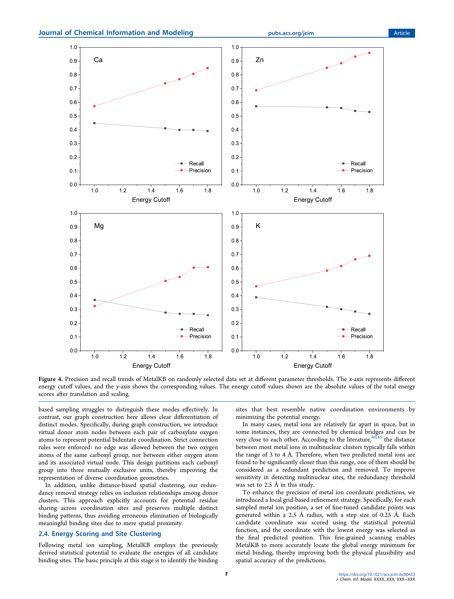
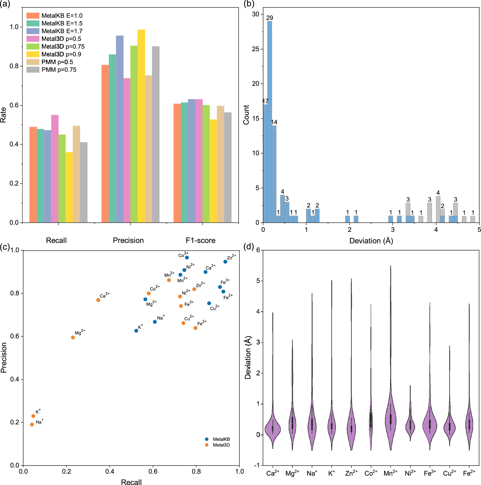
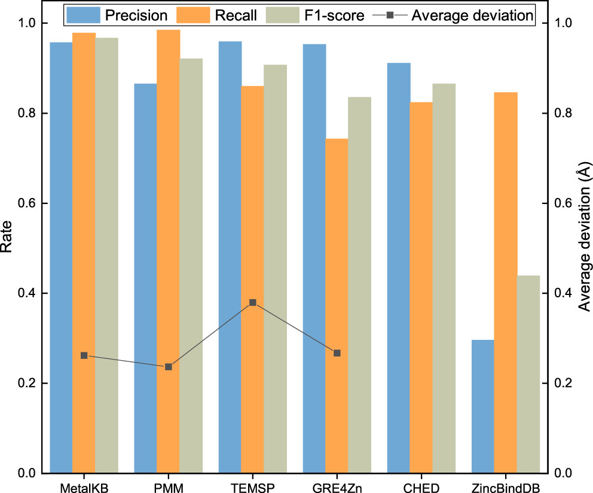
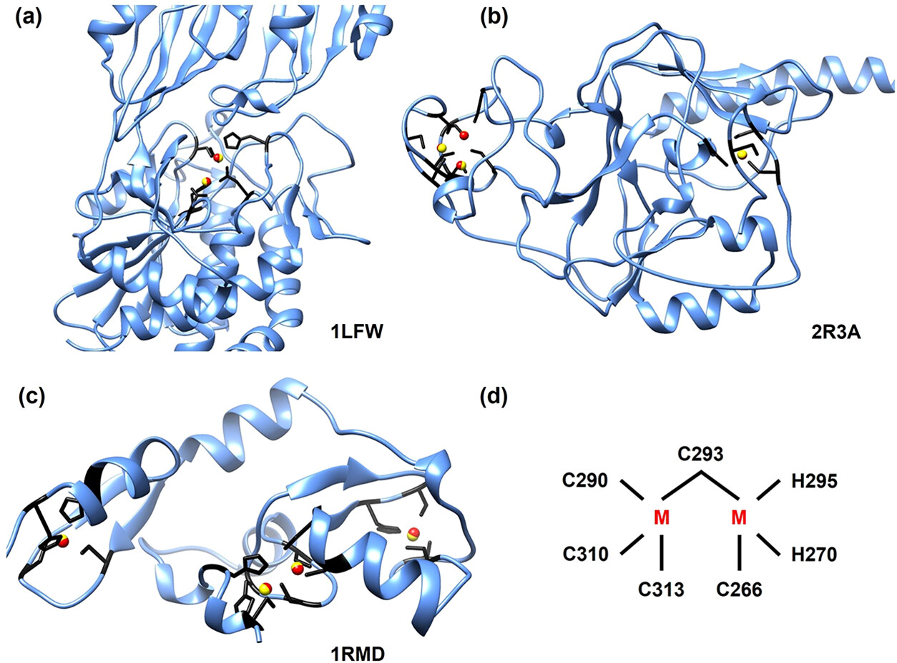
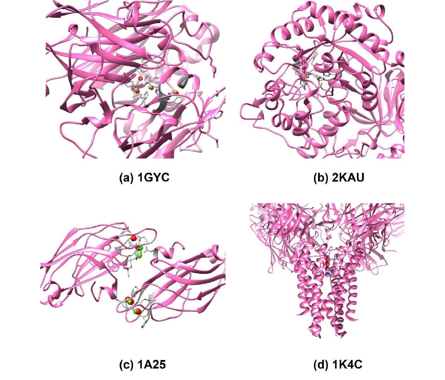
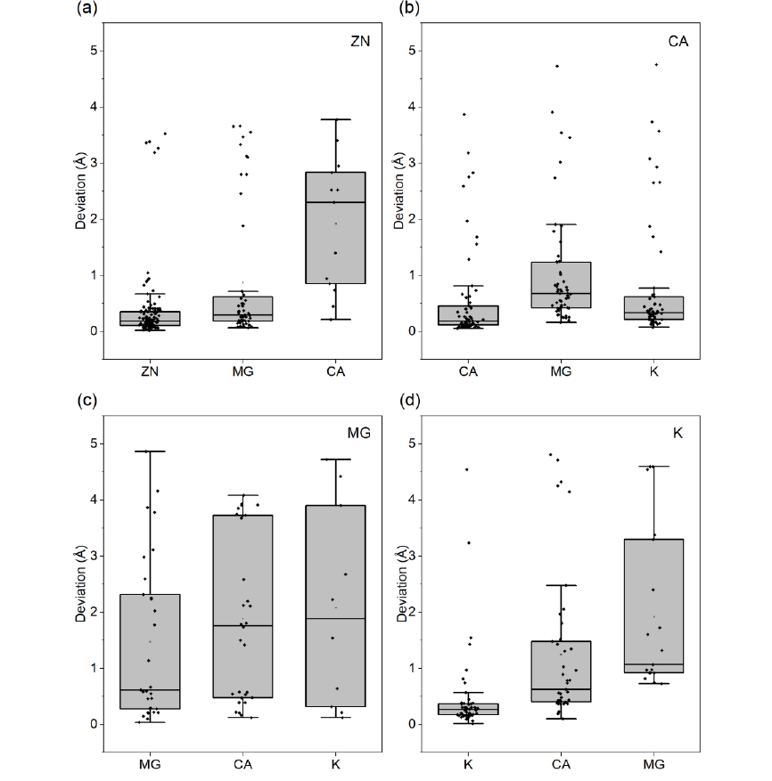

# MetalKB：用团检测和统计势定位蛋白中的金属结合位点

## 本文信息

- **标题**：MetalKB：基于知识驱动图框架的蛋白金属结合位点预测
- **作者**：Xuejun Zhao, Hao Li, and Sheng-You Huang*
- 发表时间：2026年3月25日（论文接收）
- **单位**：华中科技大学物理学院，中国武汉
- **引用格式**：Zhao, X., Li, H., & Huang, S.-Y. MetalKB: Predicting Metal Binding Sites on Proteins with a Knowledge-Based Graph Framework. *Journal of Chemical Information and Modeling* (2026). https://doi.org/10.1021/acs.jcim.6c00453
- **代码与资源**：
  - GitHub：https://github.com/huang-laboratory/MetalKB/
  - 网页：http://huanglab.phys.hust.edu.cn/MetalKB/
  - Zenodo：https://doi.org/10.5281/zenodo.18999183

## 摘要

> 金属离子在蛋白质的**功能、调控和稳定性**中发挥关键作用，因此，准确预测金属离子的结合位点，对于揭示相关生物过程的分子机制具有重要价值。本文提出了MetalKB，这是一种新的知识驱动框架，利用**原子级统计势**和**图论策略**来预测蛋白质上的金属离子结合位点。具体来说，先用clique检测算法识别可能的供体原子簇，并据此生成初始金属离子坐标；然后利用从蛋白—金属离子结合数据库推导得到的知识势，对这些候选坐标进行评估和局部细化；随后再通过空间距离阈值去除冗余预测。基于Metal3D和TEMSP提供的多样化基准数据集的评估表明，MetalKB在precision、recall和F1 score上与7种代表性方法相比具有**有竞争力的表现**，同时表现出较强的**鲁棒性和参数稳定性**。代表性结构案例进一步表明，MetalKB能够识别复杂的配位环境，包括**多核金属位点**和**桥联金属位点**。此外，它还能同时给出**金属离子的三维坐标**和**残基级配位配体**的预测。

## 结果

### 参数稳定性与阈值选择

MetalKB的结果评估做的是**候选金属位点层面的判定**：程序先输出一批预测金属坐标，再检查这些预测坐标是否命中了真实金属位点。在Metal3D这一类距离标准下，如果某个预测点距离真实金属坐标 **不超过5 Å**，它就算 **true positive**；如果一个真实位点没有被任何预测点覆盖，就算 **false negative**；那些没有靠近任何真实位点的预测点，就是 **false positive**。precision表示**保留下来的预测位点里有多少是真的**，recall表示**真实位点里有多少被程序找到了**。



**图4：不同能量阈值下的precision–recall变化**

- 这里的**能量阈值**，指的是第一篇里定义的**总能量分数阈值**：MetalKB会把候选金属位点周围所有相关金属—原子对的混合势函数 $u_{ij}(r)$ 求和，得到一个总分，再经过平移和缩放后用于筛选预测位点
- 这里扫描的是**不同能量阈值**对预测表现的影响。横轴是平移和缩放后的总能量绝对值，纵轴是precision与recall
- 数据来自从Ca、Zn、Mg、K统计数据集中各随机抽取的100个结构

> 图4说明的是一个直接的权衡：**能量阈值越严格，precision上升而recall下降**。文中采用1.7作为折中阈值，因为此时precision已经明显提高，而recall仍保持在可接受范围内。这里的cutoff之所以数值越高反而越严格，是因为程序内部的原始总能量分数本来是负的，数值越低通常表示候选位点越合理。为了便于展示和设定阈值，本文把这些分数做了平移、缩放，并**在后续分析里统一报告其绝对值**。这样一来，图4横轴上的**更大数值**，本质上对应的是要求候选位点**算出的能量更低**，因此保留条件更严格。结果就是：**假阳性会被压下去**，precision上升；但一些能量优势不够明显的真实位点也会被一起滤掉，所以recall下降。

这里还有两个容易忽略的限定条件：

- MetalKB研究的是**金属—蛋白相互作用**，因此知识势推导时并不处理小分子配体
- 配位数小于3的特殊情况并不是这套方法的重点，所以结果解读时不能把它理解成对任意金属位点都同样适用的工具

> 小编锐评：如果一个位点严重依赖**小分子、辅因子或水分子**参与配位，那么它本来就超出了MetalKB这套纯蛋白配位框架最擅长的范围，直接拿来做主比较并不完全公平。至于**低配位位点**，原文没有把它们直接归为错误数据，但Metal3D原始论文在做**其他金属选择性分析**时，明确只保留了**至少3个独特蛋白配体**且**occupancy大于0.5**的位点；而在锌测试集里，也另外剔除了一批**独特蛋白配体少于2个**且**occupancy不高**的位点。更稳的说法是：这类位点更容易受到**结构解析质量、占有率和局部环境定义不充分**的影响，也更容易给benchmark带来额外噪声。

### Metal3D测试集评估

Metal3D来自2023年发表在 *Nature Communications* 的原始工作，是近几年很有代表性的**结构型金属坐标定位方法**。这里说的 Metal3D基准，主要指Metal3D原论文使用的**锌测试集**、**其他金属选择性分析** 数据，以及统一的“**距离真实金属5 Å 内算命中**”判定标准。这套基准的价值在于**来源清楚、评价标准统一、与Metal3D和PMM这类近期结构方法可以直接横向比较**。所以这套基准更适合看“能不能把位点坐标准确放出来”，以及方法在多金属数据上能否保持泛化，残基级配体组成不是它的重点。

> 具体到数据，锌测试集来自原始论文按 **30% 序列一致性**划分得到的测试集：共59个测试结构，对应189个锌位点。MetalKB为了和PMM的处理方式对齐，又手工去冗余，实际评估的是**178个锌位点**。多金属部分则对应Metal3D原论文中的其他金属选择性分析，包含11类生物相关金属：Ca<sup>2+</sup>、Mg<sup>2+</sup>、Na<sup>+</sup>、K<sup>+</sup>、Mn<sup>2+</sup>、Fe<sup>3+</sup>、Fe<sup>2+</sup>、Co<sup>2+</sup>、Ni<sup>2+</sup>、Cu<sup>2+</sup>、Zn<sup>2+</sup>。这一部分位点要求**至少有3个unique蛋白残基配体**，且**occupancy大于0.5**。



**图5：MetalKB在Metal3D测试集上的表现**。图5把结果拆成了四个层面：总体precision、recall和F1，坐标误差分布，多金属类型上的横向比较，以及各金属的偏差统计。

- (a) 比较MetalKB、Metal3D、PMM在不同阈值下的precision、recall、F1
- (b) 给出MetalKB预测坐标的误差分布，其中灰色条表示受多核金属位点影响的预测
- (c) 比较MetalKB（蓝色，energy threshold = 1.7）与Metal3D（橙色，p = 0.75）在11类金属上的性能
- (d) 给出11类金属预测的偏差分布；图中负值代表相对参考位置的有符号偏差，不是负距离

#### 评估指标定义

Metal3D基准使用三个标准指标：

- **Precision（精确率）** = $\dfrac{\text{TP}}{\text{TP} + \text{FP}}$，预测为阳性的样本中真正为阳性的比例
- **Recall（召回率）** = $\dfrac{\text{TP}}{\text{TP} + \text{FN}}$，真实阳性样本中被正确预测的比例
- **F1-score** = $2 \times \dfrac{\text{Precision} \times \text{Recall}}{\text{Precision} + \text{Recall}}$，precision和recall的**调和平均数**

> F1-score综合考虑了精确率和召回率，是两者之间的平衡指标。

图5a展示了MetalKB在**不同能量阈值**下的性能变化。这里的 $p$ 是Metal3D和PMM输出预测位点时使用的**概率阈值**：只有概率分数高于这个阈值的位点才会被保留。阈值越高，保留下来的预测通常越保守，false positive更少，因此precision往往更高，但recall也更容易下降。为了便于横向比较，可以把MetalKB与两种对比方法的关键指标整理成下面这张对照表：

| 方法 | 参数值 | Precision | Recall | F1 |
| --- | --- | --- | --- | --- |
| MetalKB | threshold = 1.0 | 0.806 | 0.489 | 0.608 |
| MetalKB | threshold = 1.5 | 0.859 | - | 0.614 |
| MetalKB | threshold = 1.7 | 0.955 | 0.472 | 0.631 |
| PMM | p = 0.5 | 0.752 | 0.494 | - |
| PMM | p = 0.75 | 0.901 | 0.410 | 0.563 |
| Metal3D | p = 0.5 | - | - | 0.631 |
| Metal3D | p = 0.75 | 0.904 | 0.450 | 0.601 |
| Metal3D | p = 0.9 | 0.986 | 0.360 | 0.527 |

从这张对照表可以看出几个关键趋势：

> **指标差别不大**，MetalKB在不同阈值下维持了相对稳定的**精确率—召回率折中**。

#### 坐标误差怎么理解

图5b还展示了**空间定位精度**。MetalKB(1.7) 的平均坐标误差是1.117 ± 1.567 Å，数值上高于Metal3D在p = 0.75时的0.710 ± 0.631 Å。但MetalKB的**中位误差只有0.224 Å**，反而优于Metal3D的0.508 Å。这与多核锌位点有关：因为两个真实锌离子本来就可能相距很近，误差统计容易被这些特殊案例显著影响。

文中还特别指出，误差大于3 Å 的15个预测主要来自二核位点；如果把这些情况排除，MetalKB的平均误差会降到0.596 ± 1.025 Å。**多数普通位点的坐标定位已经很准，均值主要受少数多核难例影响**。

#### 多金属测试集的结果

Metal3D的这组多金属测试数据包含11类金属：Ca<sup>2+</sup>、Mg<sup>2+</sup>、Na<sup>+</sup>、K<sup>+</sup>、Mn<sup>2+</sup>、Fe<sup>3+</sup>、Fe<sup>2+</sup>、Co<sup>2+</sup>、Ni<sup>2+</sup>、Cu<sup>2+</sup>、Zn<sup>2+</sup>。这组位点都至少有3个独特蛋白配体，且占有率大于0.5。

- 图5c显示，**MetalKB在大多数金属类型上优于Metal3D，尤其是Zn<sup>2+</sup>、Ca<sup>2+</sup>和Fe<sup>3+</sup>**。而Metal3D在Na<sup>+</sup>、K<sup>+</sup>、Mg<sup>2+</sup>这些非过渡金属上的表现较差，这和它的训练集主要面向锌有关。
- 图5d里，MetalKB在11类金属上的**中位预测误差约为0.3 Å**，也就是一半以上预测已经非常接近实验坐标。更细的各金属误差统计见 表S1。

**表S1：各金属的误差分布**。表S1把图5d中的分布进一步量化成**平均误差和中位误差**。这里摘出MetalKB在阈值1.7下的几类代表性金属：

| 金属 | 平均误差（Å） | 中位数误差（Å） |
| --- | --- | --- |
| Zn | 0.425 ± 0.884 | 0.174 |
| Ca | 0.314 ± 0.526 | 0.178 |
| Ni | 0.371 ± 0.267 | 0.304 |
| Cu | 0.362 ± 0.424 | 0.254 |
| K | 0.407 ± 0.608 | 0.253 |

这说明MetalKB不局限于锌体系，在 **Ca、Ni、Cu、K** 等金属上也能给出相当靠近实验位置的预测坐标。

### TEMSP测试集评估

TEMSP全称是 **3D Template-based Metal Site Prediction**，来自2011年发表于 *Bioinformatics* 的工作。该方法把已知锌位点拆成残基对模板，再用Cα/Cβ的相对几何去匹配目标蛋白中的候选残基，因此这套基准更适合检验**配位残基组成是否预测正确**。

#### 测试集构成

本文使用的TEMSP测试集包含**100个蛋白结构**和**136个实验验证的锌位点**。TEMSP原始论文详细说明了构建流程：从含锌PDB结构中下载并过滤数据，按同源关系分组并提取代表性链，再随机拆成训练集和独立测试集。独立测试集中的蛋白及其同源序列贡献的模板都从模板库中移除，因此测试集既独立于训练阶段，也独立于模板库本身。

> TEMSP测试集只针对**锌位点**，不承担多金属泛化评估。

#### 评估指标：IoUR

> TEMSP判断**预测配位残基集合与真实配位残基集合的重叠程度**。TEMSP原始论文强调，宽松的TP定义容易把"只猜对一部分配体"的结果也算作成功，因此它更看重**尽可能多地猜对真实配位残基，同时尽量少报错残基**。

文中使用的指标是 **IoUR**（Intersection over Union of Residues，残基层面的交并比）：

$$
\mathrm{IoUR} =
\frac{N\left(\text{预测配位残基} \cap \text{真实配位残基}\right)}
{N\left(\text{预测配位残基} \cup \text{真实配位残基}\right)}
$$

分子是预测集合和真实集合的交集大小，分母是两者并集大小。这个比值同时惩罚**漏掉真实配体**和**多报无关残基**。当 $\mathrm{IoUR} \ge 0.5$ 时，预测位点才算 **true positive**；当 $\mathrm{IoUR} = 1$ 时，表示预测残基集合和真实集合完全重合。

#### 结果



**图6：在TEMSP上的比较**。图6给出六种方法在残基级位点识别上的precision、recall和F1，并同时标出可用方法的平均坐标偏差。

- 柱状图展示precision、recall、F1
- 折线显示平均坐标偏差，单位是 Å。CHED和ZincBindDB不输出显式三维坐标，所以图里没有它们的平均坐标偏差

**表2：TEMSP上的关键数值**

| 方法 | TP | FN | FP | Precision | Recall | F1 | 坐标偏差（Å） |
| --- | --- | --- | --- | --- | --- | --- | --- |
| MetalKB | 133 | 3 | 6 | 0.957 | 0.978 | 0.967 | 0.262 |
| PMM | 134 | 2 | 21 | 0.865 | 0.985 | 0.921 | 0.237 |
| TEMSP | 117 | 19 | 5 | 0.959 | 0.860 | 0.907 | 0.380 |
| CHED | 112 | 24 | 11 | 0.911 | 0.824 | 0.865 | — |
| GRE4Zn | 101 | 35 | 5 | 0.953 | 0.743 | 0.835 | 0.267 |
| ZincBindDB | 115 | 21 | 273 | 0.296 | 0.846 | 0.439 | — |

> **TEMSP** 是2011年的残基对模板方法，偏重**锌位点模板匹配**；**PMM** 是2025年发表的 **PinMyMetal**，面向**过渡金属**，先用几何规则筛候选，再结合化学和局部环境特征打分，并继续预测最可能的金属类型。

表2可以直接拆成下面几点：

- MetalKB的 **F1 = 0.967**，是表2里最高的一项。虽然它的recall 0.978略低于PMM的0.985，但precision 0.957明显高于PMM的0.865
- **TEMSP和GRE4Zn的高precision、低recall** 组合意味着它们对false positive的控制更严格，但漏检风险也更高
- ZincBindDB的主要问题是 **273个false positives**，这直接使precision降到0.296
- 在坐标偏差上，MetalKB的0.262 Å 虽略高于PMM的0.237 Å，但仍然处在非常小的误差量级内

图4–图6之间的precision/recall差异，与**测试集组成**有关。图4和图5a所用数据里包含一些配位数少于3的位点，而图5c和图6代表的是更典型、更规范的配位环境，因此这些数字不能直接横向混为一谈。

### 复杂配位环境的案例



**图7：多核与桥联锌位点的代表性案例**。图7展示的是**共享配体、近距离双核以及多位点并存**这些更难的场景。

- (a) 乳酸杆菌二核锌氨肽酶PepV
- (b) 人源H3K9 histone lysine methyltransferase
- (c) RAG1 dimerization domain
- (d) RAG1 dimerization domain中的二核锌簇
- 图中**金色球**是实验结构中的金属位置，**红色球**是MetalKB预测的位置

#### 案例1：PepV的双锌活性位点

PepV是桥联双金属的典型例子。Zn2由His87、Asp119、Asp177配位，Zn1由His439、Asp119、Glu154配位，其中 **Asp119是桥联配体**，连接两个锌离子，两个金属之间距离约3.8 Å。MetalKB不仅找到了两个锌的位置，还正确识别了共享配体Asp119。平均金属—金属距离误差 **小于0.18 Å**。

#### 案例2：H3K9甲基转移酶中的多个锌位点

在这个结构里，锌分布于Pre-SET和Post-SET区域。Pre-SET区域有3个锌，由9个保守半胱氨酸围成三角形锌簇；Post-SET区域还有一个四面体配位锌位点。MetalKB对这些位点都能正确定位，说明它不仅能识别单个锌位点，也能处理**同一蛋白中的多个不同锌位点**。

#### 案例3：RAG1的复杂锌配位环境

RAG1二聚化结构域里同时包含典型单核C3H型RING finger、C2H2型zinc finger，以及一个由Zn<sub>2</sub>Cys<sub>5</sub>His<sub>2</sub>组成的双核锌簇。在后者中，**Cys293是桥联配体**，另外还有Cys266、His270、His295等参与配位。MetalKB能把这些空间关系和共享配体关系一起识别出来，这恰好体现了clique建模比简单局部打分更适合处理复杂多中心位点。



**图S3：非锌体系的补充案例**

SI里又补了4个非锌实例，分别是：

- (a) 多铜氧化酶laccase（PDB：1GYC），展示催化中心的三核铜簇。
- (b) *Klebsiella aerogenes* 的镍依赖脲酶（PDB：2KAU），展示双核Ni<sup>2+</sup>活性位点。
- (c) protein kinase C的Ca<sup>2+</sup>-bound C2 domain（PDB：1A25），展示空间上相邻的多个Ca<sup>2+</sup>。
- (d) 钾通道KcsA（PDB：1K4C），展示选择性滤过器中的4个K<sup>+</sup>。

这些补充图说明，MetalKB对 **Cu、Ni、Ca、K** 等体系也有一定可迁移性。




**图S2：知识势能否区分金属类型**

SI里专门做了一个cross-metal prediction analysis。图里的四个panel分别固定了四类真实位点：(a) 是 **Zn位点**，横轴比较ZN / MG / CA三种知识势；(b) 是 **Ca位点**，横轴比较CA / MG / K；(c) 是 **Mg位点**，横轴比较MG / CA / K；(d) 是 **K位点**，横轴比较K / CA / MG。a/b/c/d对应的是**四类真实金属位点各自做的一次交叉测试**。

这里确实存在**交叉预测**：每个panel都先固定一类**真实金属位点**，再把**同一批真实位点**分别交给不同金属类型对应的知识势去做完整预测。图里的横轴表示“这次预测时使用的是哪一种金属特异性知识势”，分布本身统计的是那些 **true positive预测点到真实金属位置的空间偏差**。图S2比较的是**同一个真实位点在换用不同金属势之后，预测坐标的变化**。

> 图S2显示，**正确金属类型对应的知识势**通常会给出**更集中、偏差更小的坐标分布**。

做这种交叉，是为了检验 **MetalKB的能量函数里有没有金属类型信息**。如果正确金属类型对应的知识势总能给出更集中、更小的偏差分布，就说明这套势函数对“这个位点更像哪一类金属环境”确实有一定分辨力。SI里还补了两个限定条件：所有预测都统一使用1.7这个阈值，而且只展示**TP数量不少于真实位点数5%**的情况，避免极少数偶然命中把分布画得失真。

> 小编锐评：这张图更像是在测试**金属环境能否粗略区分**。如果两个金属的**供体组成和配位几何本来就很接近**，那么它们对应的最低能区域本来就可能相似，交叉之后结果接近并不奇怪。

---

## 关键结论与批判性总结

### 这篇工作的主要贡献

- 方法层面，MetalKB给出了一种组合路线：几何上先用 **clique采样**，化学上再用**金属特异性统计势**做筛选和细化。
- 结果层面，它在Metal3D与TEMSP两个风格不同的基准上都拿到了有竞争力的结果，尤其在TEMSP上拿到**最高F1**，说明残基级预测也做得不错。
- 应用层面，它输出的是**金属三维坐标**加**配位残基**，因此更方便后续结构解释、对接和建模。
- 案例层面，PepV、H3K9甲基转移酶、RAG1等例子说明，这套方法对**多核和桥联位点**具有实际处理能力。

### 方法的优势

- **实验结构统计驱动的势函数**：物理含义比纯黑箱模型更直观。
- **对Ca、Mg、K和多种过渡金属的泛化性**：不只局限于锌体系。
- **对桥联和双齿配位的敏感性**：羧酸虚拟节点和clique建模更容易识别复杂配位模式。
- **能量阈值扫描下的稳定性**：至少在文中给出的范围内，表现没有剧烈震荡。

### 局限性与仍待解决的问题

- 金属类型需要用户预先指定。当前势函数只能提供有限的金属类型区分能力。
- **小分子配体和配位数低于3的位点处理不足**。这意味着某些依赖水分子、辅因子或非蛋白配体的位点可能不在它的强项范围内。
- **统计势主要编码几何与距离偏好**，还没有显式纳入更细的电子结构因素，所以在精细区分相近金属时仍有瓶颈。
- **对输入结构质量有依赖**。本文所有评估都基于**含金属的实验结构**（MESPEUS数据库中分辨率 ≤ 2.5 Å 的X射线晶体学或冷冻电镜结构），MetalKB在这些**holo形式**的结构上表现优异。但方法严重依赖供体原子的精确空间位置，如果侧链构象本身不可靠（例如His的咪唑环rotamer错误、Asp/Glu羧基取向偏离、Cys的SG原子位置不准），候选供体图的质量就会显著下降。

> 小编锐评：
> - MetalKB依赖两个关键的信号：**供体原子的空间组合关系**和**金属—原子相互作用的统计偏好**。这些使得它相比于biometall考虑的更多，但是其实并没有对比它俩。思路不复杂，就是能发出来，也挺好。说明physics还是稍微有点用的。
> - 尤其在**金属种类精细判别**、**低配位位点**以及**含非蛋白配体体系**方面，这个框架还有明显改进空间。这些本应该是physics-based方法的优势所在。是否能把势能精确到QM层级，是未来的发展方向。
> - 当然了，没有动力学的话，还是无法从头找，面对一个很新的蛋白就可能束手无策。当然可以接入流程了。**难点在于侧链预组织**，拿一个metal-free的（比如AF3预测的）protein能不能还是准确，是个问题。

### 实际使用

MetalKB的命令行接口：

```bash
MetalKB protein_PDB_file Metal_Type Energy_Cutoff
# 例如：
MetalKB example/1DVP.pdb ZN -1.7
```

程序会输出两个文件：
- `out.pdb`：预测金属坐标及其能量分数
- `out.dat`：对应的配位残基信息
