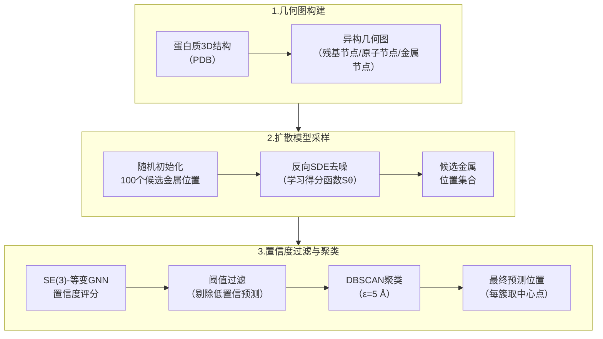
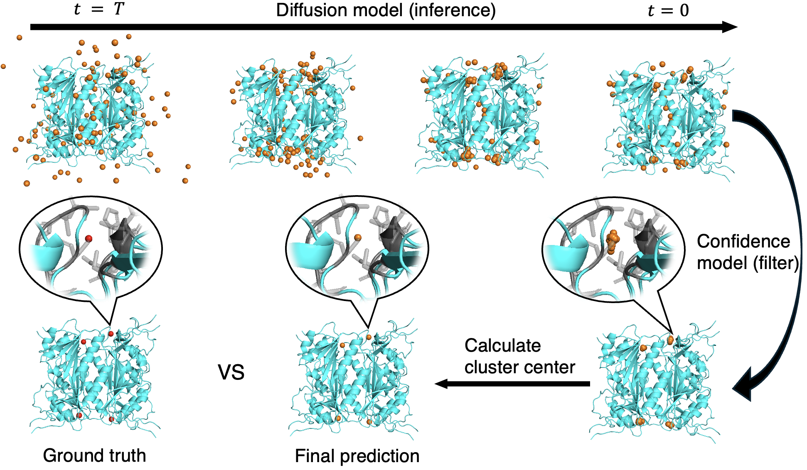
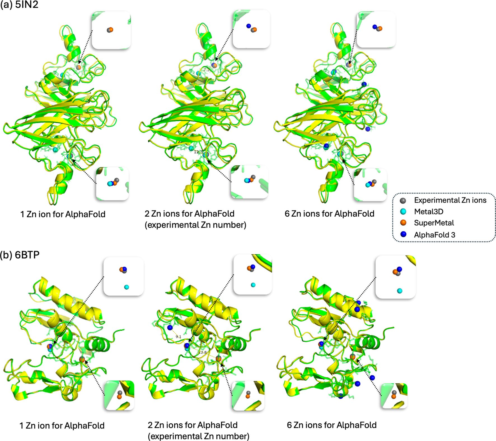
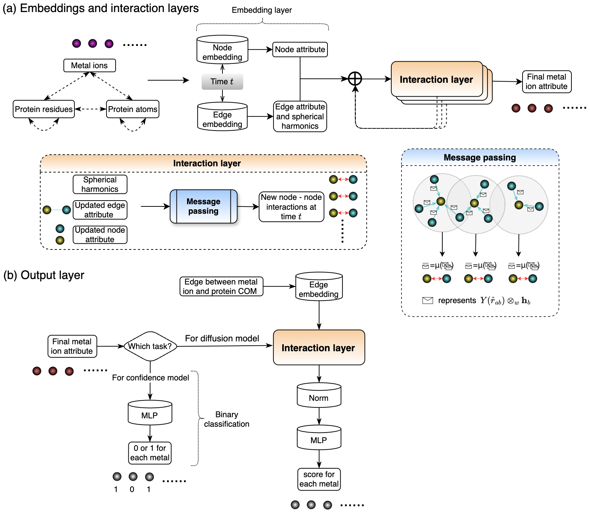
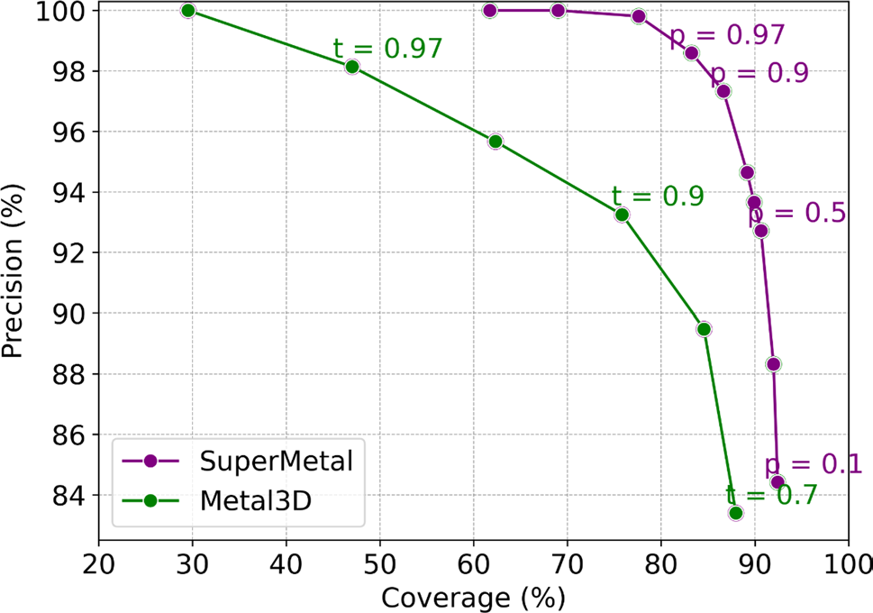
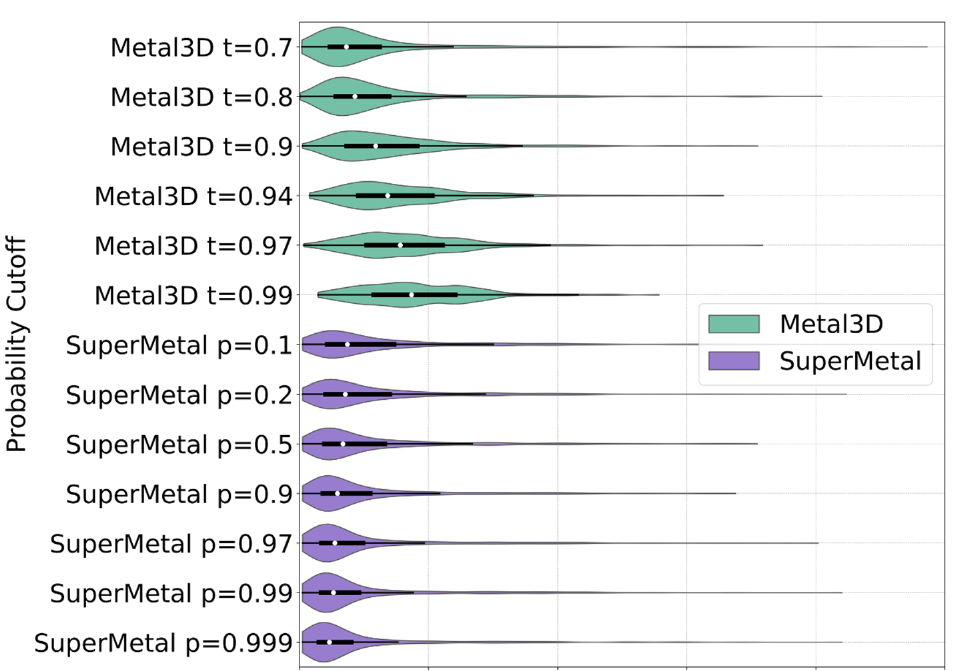
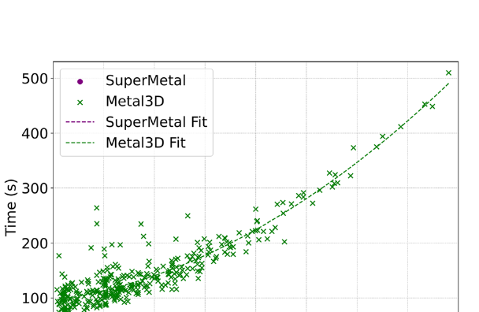
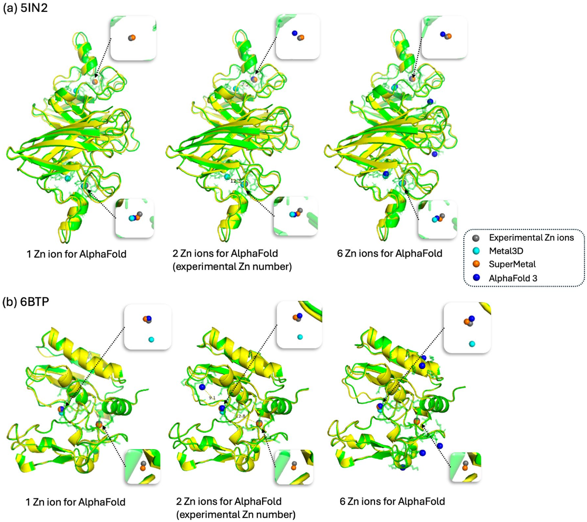

# SuperMetal：扩散生成模型以亚埃精度预测蛋白质金属离子结合位点

## 本文信息

- **标题**：SuperMetal：用于蛋白质中金属离子位置快速精确预测的生成式AI框架
- **作者**：Xiaobo Lin, Zhaoqian Su, Yunchao Lance Liu, Jingxian Liu, Xiaohan Kuang, Peter T. Cummings, Jesse Spencer-Smith, Jens Meiler
- 发表时间：2025年
- **单位**：Vanderbilt University Data Science Institute（美国），University Leipzig（德国）
- **引用格式**：Lin, X., Su, Z., Liu, Y. L., Liu, J., Kuang, X., Cummings, P. T., Spencer-Smith, J., & Meiler, J. (2025). SuperMetal: a generative AI framework for rapid and precise metal ion location prediction in proteins. *Journal of Cheminformatics*, *17*, 107. https://doi.org/10.1186/s13321-025-01038-9
- **代码**：[GitHub - XiaoboLinin/SuperMetal](https://github.com/XiaoboLinin/SuperMetal)

## 摘要

> 金属离子是大量蛋白质中不可或缺的辅助因子，对酶活性和蛋白质相互作用至关重要。鉴于其关键作用和催化效率，**准确、高效地识别金属结合位点**对阐明其生物功能至关重要，并对蛋白质工程和药物发现具有重要意义。为应对这一挑战，本文提出了SuperMetal，一种利用**基于得分的扩散模型与置信度模型**相结合的生成式AI框架，能够高精度、高效率地预测蛋白质中的金属结合位点。以锌离子为例，SuperMetal优于现有最先进模型，实现了**94%的精确率和90%的召回率**，锌离子定位在实验确定位置的 $0.52 \pm 0.55$ Å范围内。SuperMetal展示了快速预测能力（约2000个残基的蛋白质不到10秒），且**不受蛋白质规模增大的显著影响**。值得注意的是，SuperMetal不需要关于金属离子数量的先验知识（不同于AlphaFold 3），还可方便地扩展到其他金属离子或用作探针框架来识别其他类型的结合位点，如蛋白质结合口袋。

### 核心结论

- 在精确率-召回率曲线上，SuperMetal在相同召回率下始终优于Metal3D：**100**%精确率对应约**70**%召回率（Metal3D仅约**30**%）
- 金属离子定位的MAD（平均绝对偏差）为 $0.52 \pm 0.55$ Å，中位数仅0.37 Å，且置信度越高的预测空间精度越好
- 预测速度约2000个残基不到10秒，而Metal3D约需500秒（约快**60**倍），且运行时间不随蛋白质规模指数增长
- Case study中对5IN2和6BTP两个蛋白均实现**100**%精确率和**100**%召回率，AlphaFold 3在未指定正确离子数时表现不稳定

---

## 背景

约三分之一的PDB蛋白质结构含有金属离子，锌离子尤为突出，约与**10**%的人类蛋白质结合。锌的生物学功能极为多样：锌的生物学功能极为多样：

- **酶催化**：参与超过300种酶的催化活性，横跨全部六大酶类——氧化还原酶（如酒精脱氢酶ADH）、转移酶（如RNA聚合酶）、水解酶（如碳酸酐酶CA）、裂合酶（如碳酸酐酶）、异构酶（如蛋白酶）和连接酶（如DNA连接酶）
- **基因调控**：锌指蛋白作为转录因子，通过锌指结构域识别DNA序列，调控基因表达；XPA等DNA修复蛋白含锌结构域，参与核苷酸切除修复
- **细胞信号传导**：参与细胞增殖、细胞周期调控和细胞间通讯，锌依赖性蛋白在信号级联中发挥关键作用
- **结构稳定性**：锌簇结构域作为结构支架稳定蛋白质折叠，许多锌指结构的稳定性依赖锌离子的存在

锌稳态由两个家族的锌转运蛋白精密调控：ZIP家族（SLC39A）介导锌离子从细胞外或细胞器内流入细胞质，ZnT家族（SLC30A）介导锌离子从细胞质流向细胞外或细胞器内。锌稳态失调与多种疾病相关——锌缺乏可引发嗅觉味觉障碍、免疫功能紊乱和发育迟缓，锌过量则与神经退行性疾病（如阿尔茨海默病中的锌聚集）相关。

从药物发现角度，精确定位金属结合位点是金属蛋白抑制剂设计的基础。许多重要药物靶点依赖锌离子发挥催化功能：

- **碳酸酐酶（CA）**：用于青光眼治疗，其活性中心含锌离子
- **基质金属蛋白酶（MMP）**家族：用于癌症转移抑制，锌离子位于催化结构域
- **组蛋白去乙酰化酶（HDAC）**：用于癌症表观遗传治疗，锌离子与抑制剂直接结合

靶向这些位点的抑制剂设计需要原子级别的精确坐标。例如，经典锌结合基团（ZBG）如异羟肟酸在HDAC抑制剂中发挥关键作用，其与锌离子的结合几何直接影响抑制剂的potency和selectivity。

然而，通过湿实验直接确定金属结合位点成本高昂、耗时费力：

- **X射线晶体学**：需要高质量的单晶，且可能因晶体堆积改变金属位点构象
- **NMR光谱**：虽能提供溶液态信息但对大蛋白复杂且低灵敏度
- **计算预测方法**：因此成为理解金属依赖生物过程、支持蛋白质工程和药物设计的重要工具

现有计算方法大致分为四类，各有优劣：

| 方法类别 | 代表工具 | 优势 | 局限 |
|---------|---------|------|------|
| 模板法 | MIB、MIB2 | 对已知模式精确 | 难泛化到新颖结合位点 |
| 序列法 | M-Ionic | 计算高效 | 缺乏原子层面精细描述 |
| 结构法 | Metal3D、BioMetAll | 亚埃精度、结构感知 | 体素化带来计算瓶颈，旋转敏感 |
| 物理法 | QM/MM模拟 | 理论精确 | 计算开销过大，不适合常规设计 |

Metal3D是目前公认的最佳工具，能在亚埃精度下预测锌位置，但存在关键局限：

- **计算成本的立方增长**：体素网格的计算成本随分辨率呈三次方关系，提高分辨率带来急剧的计算开销
- **旋转不变性依赖数据增广**：需要对训练样本进行旋转数据增广来缓解对输入结构朝向的敏感性
- **局部预测无法利用全局信息**：每个残基独立预测局部密度，无法充分利用全局蛋白质结构信息

更重要的是，Metal3D需要为每个残基周围的16×16×16 ų体素块预测金属密度，再进行全局聚类。这种局部预测加全局后处理的方式在蛋白质较大时计算开销急剧升高，且难以捕捉长程相互作用：

- **体素分辨率与计算成本的矛盾**：提高分辨率（如从0.5 Å提升至0.25 Å）会带来**8**倍的计算量增长，而降低分辨率又可能损失定位精度
- **局部预测的局限性**：每个残基的体素预测是独立进行的，无法充分利用远距离残基对金属结合位点的协同作用，而金属结合位点的形成往往涉及多个二级结构单元的协同配合

相比之下，扩散模型近年在蛋白质设计、小分子对接（如DiffDock）等领域取得显著进展，其连续空间操作、SE(3)-等变框架和概率生成视角为金属离子预测提供了全新思路。

### 关键科学问题

- **Metal3D的规模瓶颈**：体素化方案使计算成本与分辨率呈三次方关系，2000个残基的蛋白质需要约500秒，在高通量或大规模蛋白质库场景下完全不可用；且随蛋白质越大，性能差距越显著
- **旋转不变性的处理代价**：传统3D-CNN需要对训练样本进行旋转增广来降低过拟合风险，这增加训练成本，限制结构泛化能力，并使模型对输入结构朝向仍然存在一定敏感性
- **AlphaFold 3的先验信息依赖**：在预测金属离子结合时需提前指定离子数量，而真实应用中这一信息通常未知，指定数量错误会导致预测质量急剧下降，使其在探索性场景中受到严重限制

### 创新点

- **基于得分的扩散生成框架**：将金属离子位置的预测重新表述为生成建模问题，学习条件概率分布 $p(\mathbf{x} | \mathbf{y})$ 的得分函数，绕过直接估计配分函数的困难，并避免了VAE和GAN分别面临的近似最大似然和对抗训练不稳定等问题
- **SE(3)-等变图神经网络**：在连续的三维空间中操作，天然处理旋转和平移不变性，无需旋转数据增广，且支持全蛋白质结构的多尺度表示（粗粒化 $\alpha$-碳 + 全原子）
- **置信度模型解耦**：独立训练一个SE(3)-等变分类器，根据样本MAD是否小于5 Å判断候选位置质量，从而在精确率与召回率之间提供可调节的权衡，用于不同应用场景的需求
- **无需预知离子数**：通过DBSCAN聚类机制自动确定离子数量，比AlphaFold 3更贴近实际应用场景，在未知蛋白质探索中更具实用性

---

## 研究内容

### 数据集与训练

SuperMetal使用ZincBind数据库，该数据库从RCSB PDB中提取了经过质量控制的锌结合位点，共包含19,154个非冗余位点（来自19,103个PDB文件）。质量控制标准包括：每个锌位点至少有两个配位残基和三个配位原子，并排除表面非功能性锌结合位点。ZincBind通过结构相似性和序列比对进行聚类，确保训练集中不包含高度相似的重复位点。此外，数据库考虑了蛋白质结构中的对称性单元，避免将生物组装中的对称重复位点误认为独立位点。从中提取10,253个含一个或多个符合标准位点的PDB文件，超过3000个残基的结构被排除（这些超大蛋白质在生物体系中相对罕见）。随机选取1000个结构作为验证集，测试集包含350个结构（涵盖Metal3D原始测试集及额外随机采样）。为确保公平对比，测试结构与SuperMetal和Metal3D训练集均不相似，避免了数据泄漏问题。训练硬件环境为Nvidia DGX A100，推理测试使用单CPU核心和一个Nvidia A100 40GB GPU。

### SuperMetal的三阶段预测流程

SuperMetal的预测管线由三个核心模块串联组成：

**阶段一：蛋白质几何图构建**，将蛋白质结构表示为异构几何图，节点分为三类：残基节点（以 $\alpha$-碳为中心的粗粒化表示）、原子节点（全原子结构）和金属离子节点。边根据不同类型节点间的距离截断设置，且截断距离随扩散时间步骤动态变化，由此构建能感知局部原子环境和全局蛋白折叠拓扑的多尺度表示。节点特征使用ESMFold蛋白质语言模型的嵌入进行增强，以提供进化信息和序列上下文。

**阶段二：基于得分的扩散采样**，这是SuperMetal的核心引擎。正向扩散过程将真实金属离子位置逐步演化为高斯噪声，方差调度为 $\sigma(t) = \sigma_{\min}^{1-t} \cdot \sigma_{\max}^{t}$，正向SDE为：

$$
\mathrm{d}\mathbf{x} = \sqrt{\dfrac{\mathrm{d}\sigma^2(t)}{\mathrm{d}t}}\, \mathrm{d}\mathbf{w}
$$

模型学习得分函数 $S_\theta(\mathbf{x}, \mathbf{y}, t) \approx \nabla_{\mathbf{x}} \log p_t(\Delta r | \mathbf{y})$，即条件对数概率密度相对于金属位置的梯度，物理意义是金属离子从当前位置趋向有利位置所应移动的方向向量。得分函数的估计避免了直接计算概率分布的归一化常数（配分函数），这在连续高维空间中通常是难以处理的。训练目标为最小化预测得分与真实得分之间的 $L_2$ 距离期望值（得分匹配损失）：

$$
L_\theta = \mathbb{E}_{p(\mathbf{x})} \left[ \left\| \nabla_{\mathbf{x}} \log p_t(\Delta r | \mathbf{y}) - S_\theta(\mathbf{x}, \mathbf{y}, t) \right\|_2^2 \right]
$$

其中期望值 $\mathbb{E}_{p(\mathbf{x})}$ 对训练数据中金属位置的真实分布求平均，$p(\mathbf{x})$ 是训练集中金属位置的边缘分布。该损失函数的核心优势在于：即使我们无法精确计算得分函数，也能通过随机采样训练神经网络来逼近它，这比直接建模概率分布（如VAE需要归一化常数）或训练生成对抗网络（GAN的min-max博弈易不稳定）更稳定。共训练400个epoch，使用Adam优化器，初始学习率为0.001并采用余弦退火调度至接近0，批量大小根据GPU内存调整（通常为8-32个蛋白质-金属复合物）。

推理时，100个候选金属离子从标准正态分布随机初始化（$\mathbf{x} \sim \mathcal{N}(0, I)$），通过学习到的反向SDE迭代去噪：

$$
\mathrm{d}\mathbf{x} = \left[ f(\mathbf{x}, t) - g^2(t) S_\theta(\mathbf{x}, \mathbf{y}, t) \right] \mathrm{d}t + g(t) \mathrm{d}\mathbf{w}
$$

数值实现采用欧拉-丸山方法：$\mathbf{x}_{i+1} = \mathbf{x}_i + f(\mathbf{x}_i, t_i)\Delta t + g^2(t_i) S_\theta(\mathbf{x}_i, \mathbf{y}, t_i)\Delta t + g(t_i)\sqrt{\Delta t} \cdot \epsilon$，其中 $\epsilon \sim \mathcal{N}(0, I)$。时间步长 $\Delta t$ 根据扩散时间步数确定（通常为100-1000步）。由于漂移项 $f(\mathbf{x}, t) = 0$，该式简化为纯得分匹配过程。候选金属离子逐步收敛到能量有利的位置，这些位置倾向于聚集在真实的金属结合位点附近——聚集的原因在于得分函数在训练过程中已学习了识别金属结合位点周围的"能量低谷"，多个随机初始化的候选点在反向去噪过程中会被吸引到这些低谷附近。

**阶段三：置信度过滤与聚类**，独立训练的SE(3)-等变置信度模型为每个候选位置输出一个标量置信度分数，预测该位置的MAD是否小于5 Å（通过交叉熵损失训练的二分类器）。置信度模型的训练数据生成方式为：对每个训练复合物，使用训练好的扩散模型采样多个候选金属位置，计算每个候选位置与真实金属位置的MAD，若MAD小于5 Å则标记为正类（"好"位置），否则标记为负类（"坏"位置）。5 Å的阈值选择基于经验——在金属结合位点预测中，5 Å通常被认为是可接受的精度范围，足以捕捉金属离子的正确结合位点而不过于宽松。低于设定阈值 $p$ 的候选位置被过滤掉，剩余高置信度位置通过DBSCAN算法（$\varepsilon = 5$ Å，最小样本数为2）进行聚类，每个簇的质心即为最终预测的金属离子位置，由此**自动确定离子数量**。DBSCAN的 $\varepsilon = 5$ Å参数与置信度模型的MAD阈值保持一致，确保聚类时的空间尺度与质量判断标准一致；最小样本数设为2是因为在扩散采样过程中，真实的金属结合位点通常会有多个候选位置聚集在其周围，单个孤立预测更可能是假阳性。

下图直观展示了这一推理过程：从时间 $t = T$（正态分布随机位置）出发，随着系统向 $t = 0$ 演化，候选金属离子逐步向生物学有意义的位置迁移，最终经置信度过滤和聚类得到精确预测。

图S2：SuperMetal金属离子预测过程的可视化。从 $t = T$ 时刻正态分布随机初始化的金属离子位置出发（最左），随着反向扩散过程推进至 $t = 0$，候选金属离子逐渐向蛋白质内生物学有意义的结合位点聚集；最终通过置信度过滤和DBSCAN聚类得到最终预测位置。

图1：SuperMetal预测流程示意图。橙色球代表采样的候选锌离子，蓝色为蛋白质结构（示例来自PDB中的2J9R）。扩散过程从随机初始化的候选位置出发，通过反向去噪逐步收敛到金属结合位点附近。

#### SE(3)-等变架构与扩散理论

下图展示了扩散模型的理论基础：正向SDE将真实金属离子位置（左上）逐步扩散至随机位置（右上），通过神经网络预测各中间时间步的得分函数，再通过反向SDE从随机位置恢复到真实结合位点（从右到左的去噪过程）。

图6：基于得分的生成扩散模型理论示意图。灰色蛋白质（上方）展示了金属离子原始位置周围的原子结构。正向连续时间SDE将真实金属离子位置（左上）演化至随机位置（右上），深度学习神经网络预测每个中间时间步的得分，使反向SDE过程（去噪）能够重建金属离子的有利位置。

SuperMetal架构（SI Figure S1）基于DiffDock的SE(3)-等变卷积网络改进而来，输入包括当前金属离子坐标 $\mathbf{x}$、蛋白质结构 $\mathbf{y}$ 和扩散时间 $t$，输出SE(3)-不变的预测向量。关键设计包括：

- **异构图构建**：节点包含金属离子、蛋白质残基（以 $\alpha$-碳为中心）和蛋白质原子三类。边根据距离阈值构建，且阈值随扩散时间动态变化——早期（$t$ 接近1，噪声大）使用较大的截断半径以捕捉长程相互作用，后期（$t$ 接近0，噪声小）缩小截断半径以聚焦局部精细结构。金属离子之间的边被排除，因为金属-金属距离通常较大且非直接相互作用。

- **SE(3)-等变消息传递**：利用球谐函数 $Y(\hat{r}_{ca})$ 表示边向量方向，通过不可约表示的球面张量积（$\otimes_w$）捕捉几何关系。权重 $\psi_{ca}$ 由多层感知机根据边长度（通过径向基函数嵌入）和节点特征计算。这种设计确保模型对蛋白质的刚体旋转和平移操作保持等变性，无需数据增广即可天然处理任意朝向的输入结构。

- **多尺度层次交互**：残基与金属离子间的交互按距离分为粗粒化（远距离，仅 $\alpha$-碳）和全原子（近距离）两个精度层。当金属离子距离残基较远时，只用残基的 $\alpha$-碳节点进行粗略表示；当距离拉近至截断阈值内，才引入该残基的全原子结构。这种分层设计避免了构建"金属-全蛋白原子"的巨大完全图，大大减少了计算开销。

图S1：SuperMetal模型架构概览。左侧（a）为嵌入与交互层：展示中心节点 $a$（黄色）与周围节点 $b$（蓝色）的消息传递模块，操作符 $\otimes_w$ 表示 $SO(3)$ 不可约表示的球面张量积，路径系数 $w$ 由MLP计算。右侧（b）为输出层：金属离子属性用于计算扩散模型的得分或生成置信度模型的二元分类标签。

### 精确率-召回率分析

> SuperMetal的核心优势：**在更大召回率范围内维持更高精确率**，两者不再像以往那样只能此消彼长。

评估指标定义如下：若预测位置落在实验确定位点5 Å范围内则视为正确预测（真阳性，TP），精确率（Precision）$= \mathrm{TP}/(\mathrm{TP}+\mathrm{FP})$，召回率（Coverage）$= \mathrm{TP}/(\mathrm{TP}+\mathrm{FN})$。**5 Å的距离阈值**在金属结合位点预测领域被广泛采用，原因如下：

- **配位几何容差**：金属-配体键长通常在2-3 Å范围（如锌-氮键约2.0 Å，锌-硫键约2.3 Å），5 Å的容差足以覆盖配位几何的微小变化
- **实验精度限制**：X射线晶体结构的分辨率通常在1.5-3.0 Å，原子坐标本身就有一定不确定性
- **药物设计需求**：从药物设计角度看，5 Å精度已足够将抑制剂定位到金属结合位点的正确区域

通过调节各模型的概率截断阈值（SuperMetal用置信度阈值 `p`，Metal3D用体素概率阈值 `t`），绘制精确率-召回率权衡曲线。在实际应用中，用户可根据需求调节阈值：若需最小化假阳性（如后续实验成本高昂），可提高阈值牺牲召回率；若需最大化发现潜在位点（如初步筛选），可降低阈值容忍更多假阳性。

Metal3D达到**100**%精确率时，召回率约**30**%；SuperMetal在相同精确率下，召回率约**70**%——几乎是Metal3D的两倍。在召回率**77**%时，SuperMetal保持近**100**%精确率，Metal3D已降至约**93**%；在召回率**88**%时，Metal3D精确率约**84**%，而SuperMetal约**95**%。这一差距说明SuperMetal在覆盖更多真实金属位点的同时，假阳性比例明显更低。

图2：SuperMetal与Metal3D的精确率-召回率曲线。紫色线为SuperMetal，绿色线为Metal3D。曲线上标注了各自的概率截断值（SuperMetal用 `p`，Metal3D用 `t`）。

### 空间定位精度

位点预测的存在性判断之外，还需考察预测坐标是否足够准确。对真阳性预测计算MAD（平均绝对偏差）：

$$
\text{MAD} = \dfrac{1}{n} \sum_{i=1}^{n} \|\mathbf{x}_i - \hat{\mathbf{x}}_i\|
$$

SuperMetal在 $p = 0.1$ 时，MAD为 $0.61 \pm 0.66$ Å（中位数0.37 Å），随着阈值提高至 $p = 0.9$，MAD改善至 $0.44 \pm 0.58$ Å（中位数0.23 Å）。**置信度越高，空间精度也越高**，且MAD分布随阈值升高而收窄，说明置信度分数确实捕捉到了预测质量的真实差异。在 $p=0.999$ 时，中位数MAD降至0.23 Å，这意味着高置信度预测的金属离子位置与实验确定的坐标平均仅相差约四分之一埃，已接近晶体结构解析的典型精度极限。Metal3D的MAD则随阈值升高反而增大（从0.36 Å升至0.87 Å），可能是高阈值下只保留了难以精确定位的非典型位点（如表面弱结合位点或部分占据位点），这些位点本身就是实验不确定性较大的区域。

图3：SuperMetal与Metal3D在不同概率截断下MAD的小提琴图。紫色为SuperMetal，绿色为Metal3D。白色圆圈为中位数，黑色方框为四分位范围，须线延伸至1.5倍四分位距。SuperMetal的MAD分布随阈值升高而收窄，Metal3D则相反。

### 计算速度

两种方法都在单CPU核、相同GPU（Nvidia A100 40 GB）下对比测试。Metal3D的运行时间随蛋白质大小**近指数级增长**，2000个残基的蛋白质约需500秒；SuperMetal无论蛋白质大小始终在10秒以内，约快**60**倍。这种效率差距在更小的蛋白质上已存在（**500**残基时Metal3D约需100秒，SuperMetal约5秒），且随规模增大愈发显著。

超高效率源于多尺度层次交互策略：金属离子距残基较远时只使用粗粒化表示（仅 $\alpha$-碳节点），近邻才引入全原子结构，避免构建巨大的全局图。这种分层设计确保了只有真正重要的局部原子-金属相互作用才被精细建模，大大减少了图中的节点和边数量。相比之下，Metal3D的体素化方案将复杂度与体素数量三次方挂钩，体素分辨率越高（如从0.5 Å提升至0.25 Å），计算量增加**8**倍，随蛋白质增大必然急剧升高。此外，SuperMetal支持将特别大的蛋白质分段预测再合并结果，使得原则上没有规模限制（前提是内存充足）。

图4：SuperMetal与Metal3D计算时间随蛋白质规模变化的散点图。紫色虚线（SuperMetal）和绿色虚线（Metal3D）为多项式拟合趋势线，仅用于示意趋势方向。

### Case Study：与AlphaFold 3的对比

在两个含锌蛋白质上进行了三方对比：5IN2（来自Onchocerca volvulus的胞外Cu/Zn超氧化物歧化酶，含2个锌位点）和6BTP（骨形态发生蛋白1与羟肟酸抑制剂复合物，含2个锌位点）。

AlphaFold 3有一个特殊限制：**必须提前指定输入锌离子的数量**，而SuperMetal和Metal3D均无此要求。实验分别给AlphaFold 3输入1、2、6个锌离子（从左到右），结果汇总如下：

| 方法 | 5IN2精确率 | 5IN2召回率 | 6BTP精确率 | 6BTP召回率 |
|------|-----------|-----------|-----------|-----------|
| Metal3D | **33**% | **50**% | **100**% | **50**% |
| SuperMetal | **100**% | **100**% | **100**% | **100**% |
| AlphaFold 3（1个锌） | **100**% | **50**% | **100**% | **50**% |
| AlphaFold 3（2个锌） | **100**% | **100**% | **50**% | **50**% |
| AlphaFold 3（6个锌） | **33**% | **100**% | **17**% | **50**% |

SuperMetal在两个蛋白质上均实现**100**%精确率和**100**%召回率。AlphaFold 3的结果高度依赖输入数量的准确性——输入数量正确时（5IN2给2个）可达**100**%/**100**%，但数量错误时精确率立即崩溃（**6**个锌输入时5IN2精确率降至**33**%）。更值得注意的是，在6BTP上即使给出正确数量，AlphaFold 3精确率也只有**50**%，说明还存在结构预测本身的误差（AlphaFold 3只能接受序列输入，无法直接使用已知PDB结构）。Metal3D在5IN2上仅有**33**%精确率，也明显不足。6BTP的case特别有启发性：骨形态发生蛋白1（BMP1）属于虾shellin样金属蛋白酶家族，其锌结合位点位于催化结构域深处，周围环绕着多个二级结构单元，这种复杂的局部环境可能对基于局部体素密度预测的方法（如Metal3D）构成挑战。AlphaFold 3在6BTP上的失败可能源于结构预测误差（即使给定了正确的锌离子数量，预测的蛋白质结构本身可能偏离真实构象），也说明端到端的结构预测+金属定位策略在复杂金属酶上仍有局限性。

图5：5IN2（上行）和6BTP（下行）的锌离子结合位点预测可视化对比。颜色编码：灰色为实验确定的锌离子，青色为Metal3D预测，橙色为SuperMetal预测，蓝色为AlphaFold 3预测。蛋白质结构以绿色（Metal3D/SuperMetal输入）和黄色（AlphaFold 3输入）显示。金属离子5 Å半径内的透明绿色区域高亮局部原子环境。从左至右，AlphaFold 3分别输入1、2、6个锌离子。

> **延伸阅读**：关于金属离子结合位点预测方法的三代演进（知识驱动→深度学习→生成式AI）的深度分析，包括对MetalKB、Metal3D和SuperMetal的批判性对比，详见[方法演进深度分析（附录）](./2026-04-20-supermetal-zinc-diffusion-appendix.md)。

---

## 关键结论与批判性总结

### 潜在影响

- **开源通用框架**：SuperMetal提供开源实现，可直接集成到金属蛋白工程、结构生物学分析和蛋白-配体对接流程中；其生成框架已扩展至水分子结合位点预测（SuperWater），有望成为通用的分子相互作用预测工具
- **无需预知离子数**：实用性上的关键改进，使高通量筛选和大规模蛋白质组库分析成为可能——在AlphaFold蛋白质组库等场景下，SuperMetal可以**自动识别金属位点而无需人工指定离子数量**
- **亚埃精度+实时推理**：10秒量级推理速度配合亚埃级定位精度，可在合理时间内分析整个人类蛋白质组（约2万个蛋白质）中的金属结合位点，相比Metal3D有**本质级别的效率提升**

### 未来方向

- **扩展至其他金属**：框架可扩展至铁、铜、镁、钙等金属离子，但需注意不同金属的配位化学差异——如铁常以血红素大环π体系存在，铜呈现变价态（$\ce{Cu+}$/$\ce{Cu2+}$），需专门调整模型架构
- **适配更一般结合位点**：通过调整目标粒子类型（从金属离子改为水分子或配体分子），可适配至蛋白-配体对接、蛋白-蛋白复合物等场景
- **整合辅因子环境**：未来需纳入RNA、小分子配体或水分子等结构元素，以减少复杂共因子环境金属位点的系统性漏报

### 局限性

- **锌数据局限**：训练数据目前仅限于ZincBind中的锌结合蛋白，对铁、铜等其他金属的泛化能力尚待验证；且**不同金属的训练数据规模可能不平衡**
- **Holo/Apo泛化未测试**：从AlphaFold预测结构或Apo结构出发设计的场景准确性需进一步评估——这些结构中金属结合位点常处于”预组织”状态
- **规模上限**：训练规模上限为约3000个残基，对异常大的蛋白质或多聚体复合物需分段运行，可能在截断边界引入误差
- **超参数敏感性**：扩散时间步数、置信度阈值、DBSCAN参数等敏感性分析较少，不同应用场景可能需要调参
- **可解释性有限**：深度神经网络本质上是黑盒，难以像基于物理的方法那样提供明确的物理机理解释
- **输入结构依赖**：对输入蛋白质结构的局部几何细节（如侧链二面角）仍然依赖，低质量输入可能导致预测准确性下降

## 从MetalKB到Metal3D再到SuperMetal：三代方法的范式演进

金属离子结合位点预测领域经历了三个技术范式的演进：

| 方法类别 | 代表工具 | 核心技术 | 精度 (MAD) | 速度 (2000残基) | 局限 |
|---------|---------|---------|-----------|----------------|------|
| **知识驱动** | MetalKB (2016) | 统计势+团检测 | 未明确报道 | 快（秒级） | 对新颖结合模式泛化能力有限，无法捕捉长程相互作用 |
| **深度学习** | Metal3D (2023) | 3D-CNN体素化 | $0.70 \pm 0.64$ Å | ~500秒 | 计算成本随分辨率呈立方增长，需旋转数据增广 |
| **生成式AI** | SuperMetal (2025) | 扩散模型+SE(3)-等变GNN | $0.52 \pm 0.55$ Å | ~10秒 | 仅在锌离子上充分验证，其他金属泛化能力未知 |

### MetalKB：知识统计势的巅峰

MetalKB的核心思想是用**原子级统计势能函数**评估候选金属位点质量：

1. **团检测（Clique Detection）**：用图论算法识别配位原子簇（供体原子cluster）
2. **统计势打分**：基于蛋白-金属数据库的知识势能评估候选坐标
3. **空间去冗余**：用距离阈值去除重复预测

**证据成分分析**：
- **骨架**：在Metal3D和TEMSP基准数据集上的精确率、召回率、F1分数
- **首饰**：团检测算法的图论可视化
- **肌肉**：7种代表性方法的交叉对比
- **体力活**：参数敏感性分析证明鲁棒性

**核心缺陷**：知识势依赖数据库质量，对**新颖结合模式泛化能力有限**；无法捕捉**长程协同效应**；无置信度输出。

### Metal3D：3D-CNN的精度-效率困境

Metal3D首次引入3D-CNN实现端到端深度学习：

1. **体素化**：每个残基周围16×16×16 ų空间离散为3D网格
2. **3D-CNN预测**：对每个残基预测局部金属密度概率
3. **全局聚类**：整合所有残基的密度预测

**立方诅咒**：计算成本 $\propto$ 分辨率³。从0.5 Å提升至0.25 Å，计算量增**8倍**。

**证据链矛盾**：高置信度时MAD反而增大（0.36 → 0.87 Å），解释为"非典型位点"但**未提供案例统计**。

### SuperMetal：扩散生成的范式突破

SuperMetal的核心创新在于**范式迁移**——将图像生成的得分匹配扩散引入连续三维空间：

1. **得分匹配**：学习 $\nabla_{\mathbf{x}} \log p_t(\Delta r | \mathbf{y})$ 得分函数，避免直接计算配分函数
2. **SE(3)-等变GNN**：天然处理旋转平移不变性，无需数据增广
3. **三阶段解耦**：扩散采样 → 置信度过滤 → DBSCAN聚类

**证据成分分析**：

| 证据层级 | 具体内容 | 判断 |
|---------|---------|------|
| **核心实验（骨架）** | 精确率-召回率曲线：**100**%精确率时，SuperMetal召回率**70**%，Metal3D仅**30**% MAD：整体$0.52 \pm 0.55$ Å，高置信度中位数0.23 Å 速度：**60**倍提升（10秒 vs 500秒） | 没有这些，结论完全站不住脚 |
| **求新炫技（首饰）** | 图S2扩散过程可视化（噪声→收敛） 图6得分函数理论示意图 图5与AlphaFold 3三方对比 | 视觉冲击力强，证明可解释性 |
| **交叉印证（肌肉）** | 置信度-MAD负相关（0.61→0.44 Å） 5IN2/6BTP两个case的100%/100% 计算时间接近线性增长 | 多维度闭环，可信度高 |
| **展示工作量（体力活）** | 不同置信度阈值（p=0.1-0.999）的MAD扫描 Metal3D不同阈值（t）的对比 | 证明鲁棒性但非逻辑必需 |

---

## 批判性思考：自洽与矛盾

### 性能是否接近理论边界？

**精度层面**：MAD中位数0.23 Å（高置信度）已**接近X射线晶体学分辨率极限**（1.5-3.0 Å）。这是合理的，因为训练数据来自PDB实验结构，预测精度无法超越源头。

**但未验证**：如果输入结构是AlphaFold预测而非实验PDB，精度会下降多少？

### 不同证据之间的矛盾

**Metal3D的MAD反常**：置信度↑ → MAD↑（0.36 → 0.87 Å），解释为"非典型位点"但**未提供具体示例**。SuperMetal的置信度-MAD负相关形成鲜明对比，暗示两种方法的置信度机制有本质差异。

**AlphaFold 3的6BTP失败**：输入正确离子数（2个锌）时精确率仅**50**%。

**未深入解释**：是结构预测误差还是金属定位机制问题？**关键缺失**：未对比"实验PDB vs AlphaFold预测结构"输入SuperMetal的差异。

### 结论是否过度外推？

**SuperMetal的过度外推**：
- Abstract称"可扩展至其他金属离子或用作探针框架识别其他类型结合位点"
- **实际情况**：仅在锌离子上充分验证；SI提到SuperWater（水分子），但**其他金属数据完全缺失**

**适用范围未清楚限定**：
1. **Holo/Apo泛化未测试**：真实蛋白工程常需从AlphaFold预测结构或Apo结构出发
2. **辅因子环境未建模**：不包含RNA、小分子配体（如$\ce{NAD+}$、FAD、ATP）或水分子
3. **3000残基上限**对病毒衣壳等多聚体复合物的实用性未验证

---

## 还能补什么（提精度）

### SuperMetal必须补的实验

**泛化验证**：
1. **Holo/Apo对比**：相同蛋白上，用Apo结构或AlphaFold预测结构输入SuperMetal，对比MAD变化
2. **其他金属系统测试**：铁（50-100个位点）、铜（50-100个位点）、钙（50-100个位点）
3. **辅因子场景**：**10-20个**依赖$\ce{NAD+}$、FAD的金属酶，测试忽略辅因子的误差

**失败案例分析**：
- SuperMetal预测错误（MAD > 5 Å）的位点有什么共同特征？
- 表面位点？部分占据位点？柔性loop区域？

**超参数敏感性**：
- 扩散时间步数（100-1000步）对精确率的影响
- DBSCAN的$\varepsilon$（3-7 Å）对聚类结果的影响

### 理论层面的解释

**为什么扩散模型适合金属定位**？
- 可能解释：金属结合位点数量不确定，生成模型可以自然处理变长输出
- 需要消融实验：直接回归 vs 扩散生成

**得分函数的物理意义**？
$S_\theta(\mathbf{x}, \mathbf{y}, t)$ 是否对应某种势能梯度？可以可视化得分场，看是否与静电势、疏水场等物理场相关。
