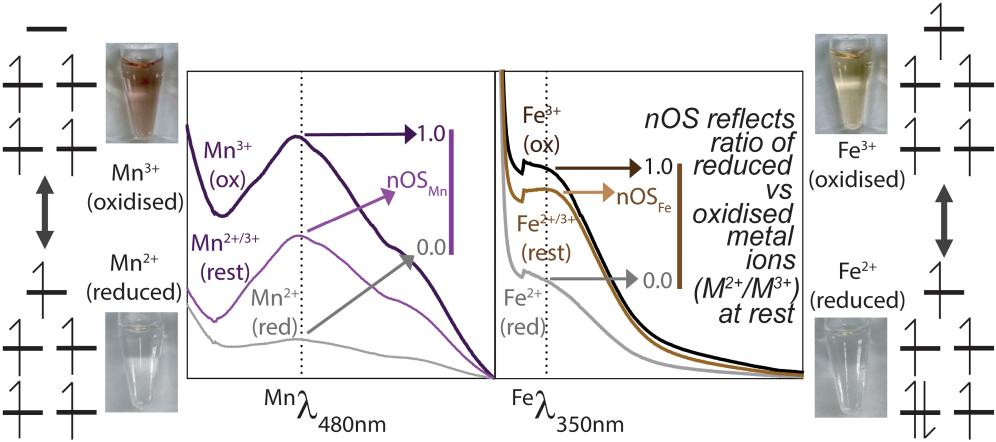
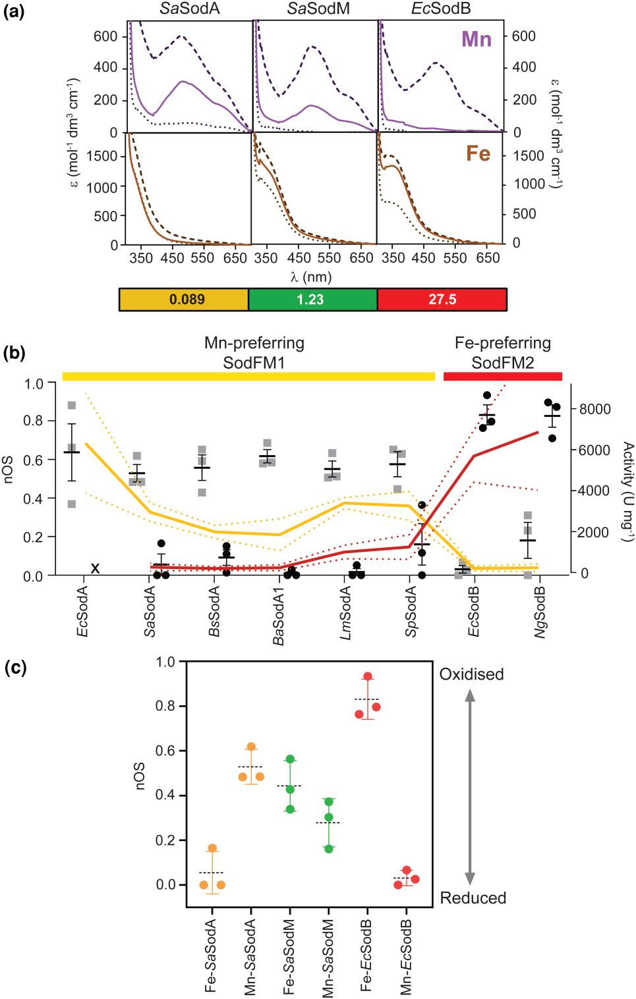
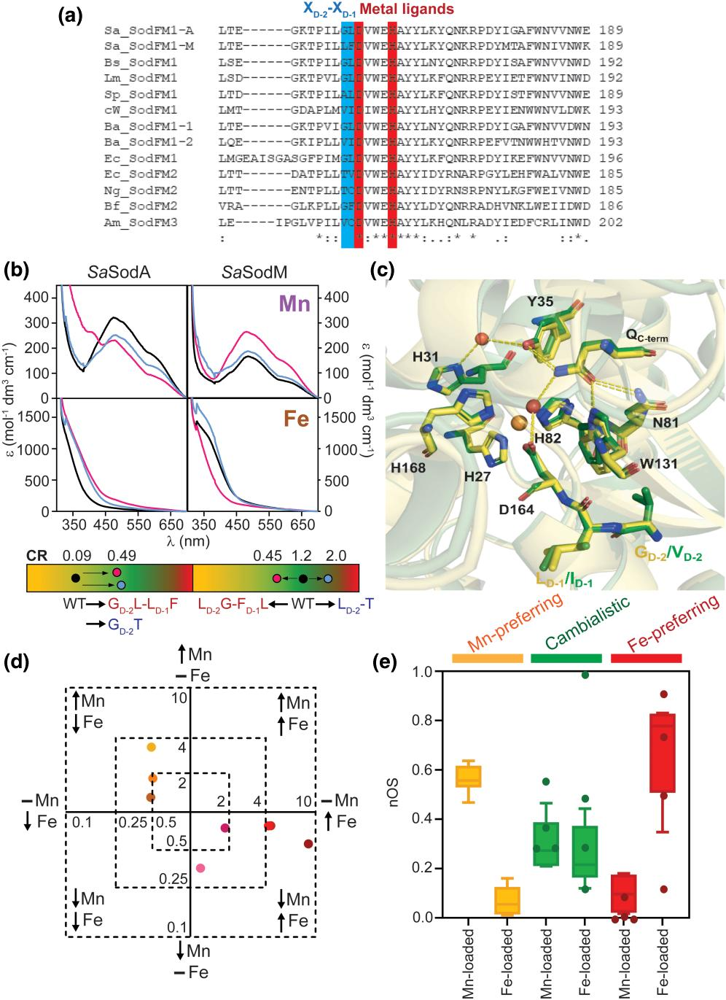
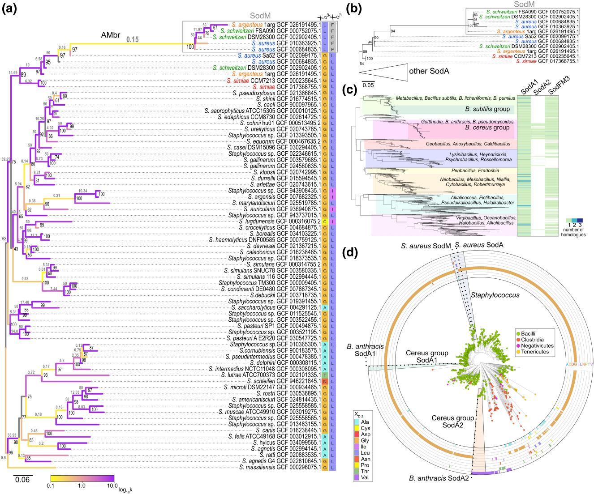
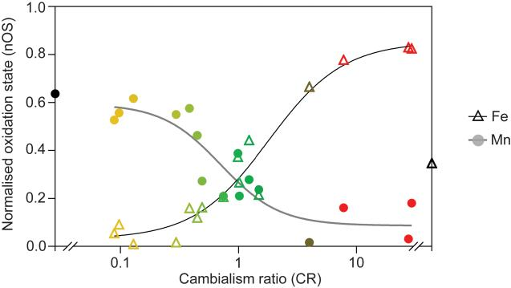

# 铁锰摇摆：超氧化物歧化酶如何通过氧化还原调谐改变金属偏好

## 本文信息

- **标题**：酶的金属偏好通过辅因子次级配位层驱动的氧化还原调控而进化
- **作者**：Eilidh S. Mackenzie, Kacper M. Sendra, Arnaud Baslé, Rafał Mazgaj, Thomas E. Kehl-Fie, Kevin J. Waldron
- **发表期刊**：*Molecular Biology and Evolution*
- **发表时间**：2026年2月13日
- **DOI**：https://doi.org/10.1093/molbev/msag040
- **单位**：Newcastle University（英国纽卡斯尔大学生物科学研究所），Polish Academy of Sciences（波兰科学院生物化学与生物物理研究所），University of Iowa（美国爱荷华大学微生物与免疫学系）
- **引用格式**：Mackenzie, E. S., Sendra, K. M., Baslé, A., Mazgaj, R., Kehl-Fie, T. E., & Waldron, K. J. (2026). An enzyme's metal preference evolves through redox modulation driven by the cofactor's secondary coordination sphere. *Molecular Biology and Evolution*, *43*, 1-18. https://doi.org/10.1093/molbev/msag040
## 摘要

> 金属蛋白在进化过程中可以通过改变金属辅因子的偏好性来适应环境压力。最近的研究发现，广泛分布的铁或锰依赖性超氧化物歧化酶家族经历了**多次金属偏好性转换**，特别是在病原菌适应宿主体内金属可利用性变化的进化过程中。然而，控制金属酶偏好性的**分子机制尚不清楚**，我们缺乏对酶的金属偏好性如何被进化调控的理解。本文利用**结合铁或锰的光谱特征**（其强度反映氧化态）来评估它们的**氧化还原性质在SodFM进化过程中如何被调节**。系统分析了来自不同系统发育群的多种SodFMs的金属氧化态，这些酶具有不同的催化金属偏好，包括已知经历进化金属偏好性转换的酶。研究观察到**静息氧化态与催化金属偏好性之间的显著关系**，说明金属结合位点的**氧化还原性质**是理解金属偏好的关键。次级配位层残基的突变实验表明，它们**同时调节金属依赖性活性和辅因子氧化态**，证明这些性质是相互关联的。数据表明，SodFM的不同金属偏好性是通过**次级配位层对其氧化还原性质的调节**而进化的。这项研究揭示了原本优化用于一种金属辅因子的金属酶如何在适当的选择压力下，通过**活性位点重新优化**来进化出新的金属偏好性。

### 核心结论

- **活性金属形式更容易处于混合氧化态**：催化活跃的金属负载形式通常有较高nOS，而不活跃的错配金属形式nOS接近0
- **nOS和CR呈两条相反趋势**：随CR升高，Fe负载型nOS升高，Mn负载型nOS降低，说明金属偏好与辅因子静息氧化还原状态紧密相连
- **次级配位层同时调节活性和nOS**：XD-2/XD-1等次级配位层残基的突变会同步改变金属依赖性活性和辅因子氧化态
---

## 背景

### 金属酶进化的双重约束

金属蛋白在进化过程中面临着**经典的功能-稳定性权衡**：既要维持催化效率，又要适应环境中金属离子的可利用性变化。大多数金属酶对**特定金属离子具有高度选择性**，这源于**金属结合位点的精确几何构型和电子性质**。然而，某些金属酶家族在进化过程中表现出**惊人的金属偏好性可塑性**，能够在**保持催化活性的同时**从一个金属辅因子切换到另一个。

这种**金属偏好性进化**在病原菌中尤其重要。宿主可以通过**营养免疫**（Nutritional Immunity）限制金属可利用性，例如金黄色葡萄球菌在感染中会遭遇锰限制。病原菌若能让关键酶在不同金属条件下维持抗氧化功能，就可能获得生存优势。

### SodFM超家族的特殊地位

**超氧化物歧化酶**（Superoxide Dismutase, SOD）是**抗氧化防御系统**的核心酶，催化超氧阴离子自由基（$\ce{O2^-}$）歧化为过氧化氢和氧气：

$$
\ce{2 O2^- + 2H+ -> H2O2 + O2}
$$

SOD分为**多个结构家族**，其中**SodFM**（Iron- or Manganese-dependent SOD）是一个古老且广泛分布的超家族，存在于细菌、古菌、真核生物的线粒体中。SodFM的**金属辅因子可以是$\ce{Fe^{2+}}$或$\ce{Mn^{2+}}$**，但单个酶可以从强Mn偏好、cambialistic（contains either of two or more different metal atoms）到强Fe偏好形成连续谱。

> **催化机制的核心**：SodFM采用**乒乓机制**（ping-pong mechanism），金属辅因子在氧化态和还原态之间循环：
> - **氧化半反应**：$\ce{M^{(n+1)+} + O2^- -> M^{(n+1)+} + O2}$
> - **还原半反应**：$\ce{M^{n+} + O2^- + 2H+ -> M^{n+} + H2O2}$

**金属离子的氧化还原性质**（特别是还原电位）直接影响催化效率。SodFM活性位点需要把相应金属的电位调到能完成两个半反应的范围内；如果蛋白结构按一种金属优化，换成另一种金属后就可能出现“过度调谐”或“调谐不足”。

### 长期未解的科学问题

金属酶研究领域存在一个基础问题：**金属偏好性的分子基础是什么**？SodFM提供了一个适合回答这个问题的体系，因为不同成员序列同源、活性位点架构保守，却能表现出从Mn偏好、cambialistic到Fe偏好的连续谱。本文通过跨物种比较、定点突变和光谱分析，把金属偏好与静息氧化还原状态联系起来。

| 假说类型 | 核心观点 | 主要证据 | 局限性 |
|---------|---------|---------|--------|
| 几何结构决定论 | 配位键长、配位角、配位数决定金属选择性 | 晶体结构数据 | 缺乏功能性验证 |
| 电子性质决定论 | 氧化还原电位、配体场强度决定催化适应性 | 生化实验数据 | 缺乏结构证据 |
| 协同调控论 | 几何结构和电子性质共同作用 | 综合证据 | 机制不明确 |

### 创新点与研究策略

- **用光谱强度近似静息氧化态**：利用Mn和Fe结合态的特征吸收峰，定义标准化氧化态（normalized oxidation state, nOS）
- **把nOS和金属依赖性活性放在同一尺度比较**：用cambialism ratio（CR）量化Fe活性相对Mn活性的偏向
- **聚焦次级配位层**：通过XD-2/XD-1位点突变，测试这些非直接配位残基是否同时改变金属偏好和nOS
- **结合进化分析**：把天然SodFM的金属偏好转换、人工突变体和系统发育结果放在同一框架下比较

---

## 研究内容

### 方法：光谱学量化静息氧化态

#### 1. 实验设计的基本原理

研究利用了$\ce{Fe^{3+}}$和$\ce{Mn^{3+}}$的**特征吸收光谱**：

- **$\ce{Mn^{3+}}$**：在**480 nm**处有**强吸收峰**（紫色），源于d–d跃迁
- **$\ce{Fe^{3+}}$**：在**350 nm**处有**弱肩峰**（棕色），源于配体-金属电荷转移（LMCT）

关键发现是：**吸收峰的强度与金属离子的氧化态直接相关**。完全氧化时吸收峰最强，完全还原时吸收峰消失。

#### 2. 标准化氧化态（nOS）的定义

为了**跨样本比较**，研究者定义了**标准化氧化态**（normalized oxidation state, nOS）：

$$
\text{nOS} = \frac{I_{\text{rest}} - I_{\text{reduced}}}{I_{\text{oxidized}} - I_{\text{reduced}}}
$$

其中：
- $I_{\text{rest}}$：静息态（aerobic equilibrium）的吸收峰强度
- $I_{\text{reduced}}$：完全还原态的吸收峰强度
- $I_{\text{oxidized}}$：完全氧化态的吸收峰强度
| nOS值 | 氧化态 | 金属辅因子状态 |
|-------|--------|--------------|
| nOS = 0 | 完全还原态 | 所有金属离子为$\ce{M^{2+}}$ |
| nOS = 1 | 完全氧化态 | 所有金属离子为$\ce{M^{3+}}$ |
| 0 < nOS < 1 | 混合氧化态 | 部分$\ce{M^{2+}}$、部分$\ce{M^{3+}}$ |

#### 3. 酶活测定与金属偏好性量化

- **活性测定**：使用**氮蓝四唑/核黄素**（NBT/riboflavin）法测定SOD活性
- **金属偏好性量化**：定义**双金属性比值**（cambialism ratio, CR）：

$$
\text{CR} = \frac{\text{Fe-dependent activity}}{\text{Mn-dependent activity}}
$$

| CR值 | 金属偏好类型 | 代表酶 |
|------|-------------|--------|
| CR >> 1 | Fe偏好型 | Fe-SOD |
| CR << 1 | Mn偏好型 | Mn-SOD |
| CR ≈ 1 | cambialistic型 | 双金属SOD |

### 结果：氧化态与金属偏好性的定量关系

#### 1. 对照实验验证光谱学方法

选择了**三个经典模型酶**：

- **SaSodA**（*Staphylococcus aureus*）：典型的**Mn-SOD**
- **SaSodM**（*S. aureus*）：**cambialistic SOD**（双金属）
- **EcSodB**（*E. coli*）：典型的**Fe-SOD**
> 对比催化活性形式与非活性形式在静息氧化态上的差异，可以看出催化活性形式（Mn-SaSodA、Fe-EcSodB等）**在静息态保留了显著比例的氧化态金属**（nOS > 0.25），而非活性形式（Fe-SaSodA、Mn-EcSodB）则几乎完全是还原态（nOS ≈ 0）。这说明**只有保留足够氧化态金属辅因子的酶才能完成完整的催化循环**。

**图1：SodFM反应机理、颜色与光谱特征以及nOS计算方法的示意图**。

- **反应机理**：上方展示SOD乒乓机制，金属辅因子在**$\ce{M^{3+}}$和$\ce{M^{2+}}$之间循环**
- **颜色特征**：左侧紫色为$\ce{Mn^{3+}}$负载型，右侧棕色为$\ce{Fe^{3+}}$负载型
- **光谱特征**：中心面板显示Mn负载的SaSodA（左）在**480 nm处有强吸收峰**（源于d–d跃迁），Fe负载的EcSodB（右）在**350 nm处有弱肩峰**（源于LMCT）
- **nOS计算**：静息光谱（浅色线）位于完全氧化光谱（深色线）和完全还原光谱（灰色线）之间，通过**吸收峰强度归一化**计算nOS

#### 2. 跨物种比较揭示普遍规律

将研究扩展到SodFM1和SodFM2两个主要亚家族的多种酶。将nOS值对CR（对数尺度）作图，发现一个重要规律：

> **nOSFe与CR成正比**，而**nOSMn与CR成反比**。这意味着随着CR升高（Fe依赖性活性相对增强），Fe负载型在静息态保留的氧化态升高，而Mn负载型保留的氧化态降低。反之类似。

两条趋势线在**CR = 0.97、nOS = 0.27处相交**，这代表hypothetical near-perfectly cambialistic isozyme的预期性质。这个发现与上一节结论完全一致。

| 金属偏好类型 | CR范围 | Fe负载型nOS | Mn负载型nOS |
|-------------|--------|--------------|--------------|
| Mn偏好型 | CR接近0 | 低 | 高 |
| Cambialistic型 | CR接近1 | 两者都处在中等范围 |
| Fe偏好型 | CR大于2 | 高 | 低 |

**图2：SodFM静息态光谱与金属依赖性活性的相关性**。

- **（A）吸收光谱**：SaSodA、SaSodM和EcSodB的Mn负载型（上，紫色）和Fe负载型（下，棕色）吸收光谱。实线为静息态，虚线和点线分别对应氧化态和还原态。**Mn-SaSodA和Fe-EcSodB的静息光谱接近氧化态**（催化活性形式），而**错配金属（Fe-SaSodA、Mn-EcSodB）的静息光谱接近还原态**（非活性形式）。
- **（B）活性与nOS相关性**：按CR排序后，Mn依赖性活性（黄线）、Fe依赖性活性（红线）和nOS柱状图显示出**相反变化趋势**——随着CR从左到右升高，Mn活性下降、Fe活性上升，同时**nOSFe升高、nOSMn下降**。
- **（C）nOS箱线图**：不同金属负载形式的nOS箱线图比较，显示**Mn偏好型（左侧）nOSMn高而nOSFe低，Fe偏好型（右侧）则相反**，证明金属偏好与静息氧化态的系统性关联。

#### 3. 次级配位层残基的双重作用

研究者对**次级配位层的关键残基**进行定点突变，重点是XD-2及其相邻的XD-1位点。核心问题是：这些非直接配位残基是否真的能同时调节金属依赖活性和辅因子氧化态？

**图3：突变体SodFM的光谱、nOS和金属偏好变化**。
- **（A）序列比对**：标出**XD-2（深蓝）和XD-1（浅蓝）**两个突变位点，以及两个保守金属配位残基（红色）。**不同物种的XD-2/XD-1残基差异对应不同金属偏好**。
- **（B）光谱变化**：SaSodA和SaSodM的野生型、XD-2/XD-1变体和XD-2T变体的静息吸收光谱。下方三色条展示**CR从Mn偏好（黑色）向cambialistic（粉色）到Fe偏好（蓝色）的移动**。**突变导致吸收峰强度显著改变**，直接反映nOS变化。
- **（C）结构叠合**：LmSodA野生型（黄色）和VD-2-ID-1变体（绿色）活性位点结构叠合，**RMSD仅0.38 Å**，说明**突变没有造成可由晶体结构分辨的大幅活性位点重排**，效应来自局部化学环境改变。
- **（D）活性变化**：不同突变体相对野生型的Mn活性和Fe活性变化（log2尺度）。**红色点表示Fe活性增强、Mn活性下降**，棕色点表示相反趋势，**证明活性与nOS同步变化**。
- **（E）nOS箱线图**：按金属偏好分组的nOS箱线图，**清晰显示nOS随金属偏好变化的系统性趋势**，XD-2/XD-1突变导致nOS和CR同步改变。

实验结果给出了明确肯定的答案：

- **光谱变化与活性变化同步**：图3B显示，当SaSodA从GD-2-LD-1突变为LD-2-FD-1后，其**Mn负载型吸收峰强度显著下降**（紫色曲线变平），而**Fe负载型吸收峰略有增强**（棕色曲线变明显）。下方三色条直观展示了**CR从黑色（Mn偏好）向粉色（cambialistic）的移动**。
- **结构无大变化但性质大变**：图3C的晶体结构叠合显示，LmSodA野生型（黄色）和VD-2-ID-1变体（绿色）的活性位点**RMSD仅0.38 Å**，氢键网络几乎完全重合。这证明**突变效应不是来自大尺度结构重排，而是来自局部化学环境的细微改变**。
- **双向验证nOS-CR关联**：图3E清晰显示，**XD-2/XD-1突变导致nOS和CR同步变化**——SaSodA突变后nOSFe升高、nOSMn下降，而SaSodM突变后呈现相反趋势。这**双向验证了金属偏好与静息氧化态的偶联关系**。
| 突变体 | 野生型CR | 突变后CR | 金属偏好变化 |
|-------|---------|---------|-------------|
| SaSodA GD-2-LD-1 → LD-2-FD-1 | Mn偏好 | 0.490 | 向cambialistic移动 |
| SaSodM LD-2-FD-1 → GD-2-LD-1 | cambialistic | 0.448 | 更偏向Mn |
| SaSodA TD-2单点替换 | 0.594 | — | Fe偏好增强 |
| SaSodM TD-2单点替换 | 1.991 | — | Fe偏好增强 |
| BsSodA/LmSodA/SpSodA + VD-2-ID-1 | Mn偏好 | — | Fe偏好增强，nOSFe↑，nOSMn↓ |

### 机制：氧化还原性质调控的分子基础

#### 1. 次级配位层的物理化学机制

**次级配位层**（Secondary Coordination Sphere）指的是**不直接与金属配位**，但通过**氢键、静电作用、疏水效应**影响第一配位层的残基。

在SodFM中，本文最强调的是XD-2和XD-1这两个位置。它们不直接配位金属，却可以改变金属辅因子的静息氧化态。LmSodA的结构比较还显示，WT和VD-2-ID-1变体的活性位点及氢键网络在当前晶体分辨率下几乎重合，因此这种效应很可能不是来自大尺度结构重排，而是来自**局部物理化学环境的细微改变**。

#### 2. 氧化还原电位调节的配位化学原理

原文没有把机制归结为简单的配位场强弱，而是采用**氧化还原调谐**（redox tuning）模型：蛋白结构需要把对应金属的还原电位调到适合SOD两个半反应的范围。Fe和Mn本征电位不同，因此同一套活性位点结构对一种金属合适，对另一种金属可能就不合适。

作者在讨论中提出，XD-2这类疏水性细微变化可能通过改变活性位点局部电场，或改变金属反应性d轨道相对底物进入路径的空间取向，来影响金属的氧化还原性质。这个机制仍是待验证假说，不是本文直接解析出的结构细节。

#### 3. 进化转换的分子轨迹

系统发育和突变实验支持一个更谨慎的结论：SodFM金属偏好的改变，常伴随nOS改变；在若干天然转换案例中，次级配位层位点也参与其中。但原文并不主张所有转换都必须沿着固定的Fe偏好到cambialistic再到Mn偏好路径推进。

**图4：SodFM1金属偏好调节的进化机制**。

- **（A）Staphylococcus核苷酸树**：来自**21,452个基因组**的sodFM1核苷酸树，显示**sodM（黑色矩形）与同物种sodA聚在一起**，支持复制-新功能化起源。分支颜色表示选择强度：**黄色（k < 1）为选择放松**，**紫色（k > 1）为选择增强**。
- **（B）蛋白树**：给出与核苷酸树相似的拓扑结构，验证系统发育关系。
- **（C）Bacillaceae物种树**：1,115个非冗余基因组的物种树，热图映射SodFM1和SodFM3同源物数量，展示不同谱系的SodFM扩增情况。
- **（D）Firmicutes和Bacillaceae蛋白树**：XD-2残基身份标在同心圆中。**B. anthracis SodA2更接近Clostridia来源的SodFM1**，提示**可能存在横向基因转移**，这与*S. aureus*的复制-新功能化路径形成对比。

图4展示了两个关键的进化故事：

- **金黄色葡萄球菌的复制-新功能化路径**：图4A的核苷酸树中，所有sodM序列（黑色矩形）与同一物种的sodA聚在一起，支持其由sodA复制后新功能化而来。分支颜色编码揭示了进化动力——连接SodA和SodM的长分支呈现黄色（k < 1，选择放松），而现存SodM分支呈现紫色（k > 1，选择增强），说明**cambialism是在选择放松后涌现，并被正选择保留**。
- **芽孢杆菌的横向基因转移**：图4D中，*B. anthracis*的SodA2（红色）更接近Clostridia来源的SodFM1，而非同物种的SodA1，提示**横向基因转移**可能参与了金属偏好的进化转换。这与*S. aureus*的复制-新功能化路径形成鲜明对比，说明**进化可以通过不同机制实现相似的金属偏好转换**。
> **进化机制的多样性**：SodFM金属偏好转换不只有一条固定路径。*S. aureus*通过基因复制+新功能化获得cambialistic SodM，而*B. anthracis*可能通过横向基因转移获得Fe偏好的SodA2。这些独立进化事件都伴随着nOS的改变，证明**氧化还原调谐是金属偏好进化的通用机制**。

**图5：Mn负载型和Fe负载型SodFM中CR与氧化态的相反趋势**。

- **数据点**：Fe负载型用空心三角表示，Mn负载型用实心圆表示，横轴是**对数尺度的CR**，覆盖**从强Mn偏好到强Fe偏好的连续谱**
- **趋势线**：使用四参数logistic模型拟合，**Fe负载型$R^2 = 0.957$，Mn负载型$R^2 = 0.841$**，表明**近乎完美的镜像关系**

- **关键发现**：随CR升高，**Fe负载型nOS升高，Mn负载型nOS降低**；**低活性金属形式在静息时氧化程度很低**，而**活性更高的金属形式在静息时氧化程度更高**。两条趋势线在**CR = 0.97、nOS = 0.27处相交**（与图2分析一致），代表hypothetical near-perfectly cambialistic isozyme的预期性质

图5整合了所有野生型和突变体数据，揭示了**跨亚家族、跨物种的普遍规律**：两条趋势线以近乎完美的镜像方式反向变化（Fe负载型$R^2 = 0.957$，Mn负载型$R^2 = 0.841$），证明**金属偏好与静息氧化态的偶联是SodFM超家族的保守特征**，而非特定物种或亚家族的偶然现象。这一发现与“跨物种比较”部分的结论完全一致。

### 进化：病原菌的适应策略

> **次级配位层的双重调控作用**：SodFM的金属偏好和nOS受次级配位层残基（特别是XD-2/XD-1）同时调控。这两个性质相互关联——改变次级配位层可以同时改变金属依赖活性和辅因子氧化态，这证明它们是偶联的。

#### 病原菌适应策略

宿主通过**营养免疫**（Nutritional Immunity）限制病原菌获取特定金属：锰限制主要通过钙卫蛋白（Calprotectin）强力螯合$\ce{Mn^{2+}}$实现，而铁限制则由转铁蛋白、乳铁蛋白等负责。本文重点展开的是SodFM的金属偏好调节，尤其是*Staphylococcus aureus*中SodM的cambialism如何帮助其在感染中绕开锰限制。

> **最小突变量的惊人效应**：单个残基的化学性质变化就足以大幅改变SodFM的金属偏好和nOS。例如，*S. aureus* SodFM对中，SaSodA（Mn偏好，XD-2为Gly）和SaSodM（cambialistic，XD-2为Leu）互换XD-2/XD-1位点后，金属偏好和nOS几乎完全反转。这说明进化不需要多次突变积累，**极微小的活性位点化学变化就能驱动金属偏好转换**。

不同病原菌采用了不同的进化策略来应对宿主的营养免疫：

| 病原菌 | SodFM类型 | 金属偏好特征 | 进化机制 | 适应意义 |
|-------|----------|-------------|---------|---------|
| *S. aureus* | SodM | Cambialistic（CR ≈ 1） | 复制-新功能化 | 在锰限制环境下维持抗氧化功能 |
| *B. anthracis* | BaSodA1/A2 | BaSodA1：Mn偏好 BaSodA2：Fe活性 | 横向基因转移 | 可能适应不同金属环境 |
| candidatus Wolfebacteria | cWSodFM1 | 从Mn偏好走向Fe偏好 | 独立进化转换 | 环境驱动的金属偏好转换 |
| *Bacteroides fragilis* | BfSodFM2 | Cambialistic | 次级配位层调节 | TD-2-CD-1变体可回归Fe偏好 |

#### 3. 进化的可预测性

> **金属偏好转换的保守机制**：所有已识别的SodFM金属偏好进化调控事件（从古老的亚家族分化到最近的*S. aureus*、芽孢杆菌、*Bacteroides*、CPR细菌的变化），都伴随着nOS的变化。这说明**活性位点氧化还原性质的改变是金属偏好进化转换的保守机制**。

| 金属偏好转换方向 | nOS变化 | 伴随的活性变化 |
|----------------|--------|----------------|
| Mn偏好 → Fe活性 | 提高nOSFe，降低nOSMn | Mn依赖活性下降 |
| Fe偏好 → Mn活性 | 提高nOSMn，降低nOSFe | Fe依赖活性下降 |
| Cambialism | 中等nOSFe和nOSMn | 两种活性都中等 |

> **Cambialism的进化意义**：Cambialism不一定是过渡态，而可能被正选择保留。*S. aureus* SodM在所有金黄色葡萄球菌基因组中都保守其LD-2残基（维持cambialism），说明这种性质本身可能被选择，而不仅仅是进化中间态。这挑战了”cambialism只是进化妥协产物”的观点。

需要注意的是，**完整金属偏好转换不一定必须经过cambialistic中间态**；但这种中间态在某些案例（如*S. aureus* SodM）中确实存在并可能被选择保留。本文的”可预测性”不是指固定进化路线，而是指**活性金属形式的nOS会随金属偏好一起改变**。

---

## 结论与批判性思考

### MD模拟的启示

> **氧化还原电位调控的分子机制**：蛋白结构如何通过局部电场、d轨道取向、氢键网络等影响金属还原电位？MD模拟可以结合QM/MM计算，**定量预测次级配位层残基突变对金属氧化还原性质的影响**，验证“电荷极化模型”或其他假说。

### 局限性

本研究的主要局限在于：

- **机制细节仍待解析**：作者提出的局部电场或d轨道取向假说仍需生物物理和结构研究验证
- **nOS是间接指标**：来自静息吸收峰强度归一化，适合大样本比较，但不是直接测得的还原电位
- **体内金属装载仍复杂**：EcSodA和BaSodA2显示出金属结合选择性，说明体内环境（金属伴侣、表达条件、蛋白稳定性）也会影响可观测金属偏好
### 证据链自洽性分析

- 光谱学数据与酶活数据高度一致
- 突变实验验证了次级配位层残基的双重作用
- 系统发育学分析与生物化学数据吻合，多个天然金属偏好变化案例都伴随nOS变化
- 跨亚家族趋势支持同一总体趋势（但远缘样本证据强度低于核心数据集）

### 结论是否过度外推

研究结论基本适度，但仍需注意：

- **推广到其他金属酶**需谨慎，SodFM的结论不一定适用于其他金属酶家族
- **病原菌适应性的因果性**尚未完全建立，并非所有SodFM金属偏好变化都能直接归因于宿主免疫压力

### 未来研究方向

| 研究方向 | 具体内容 | 技术手段 |
|---------|---------|---------|
| 结构生物学 | 时间分辨光谱观测金属氧化还原动态，高分辨率晶体结构解析不同氧化态构象 | 飞秒光谱、X射线晶体学 |
| 计算化学 | 预测氧化还原电位和配体场强度 | DFT、QM/MM |
| 体内验证 | 基因敲除/回补实验验证毒力变化，ICP-MS/XFM测定体内金属分布 | CRISPR、质谱成像 |
| 进化实验 | 定向进化重现金属偏好转换，古环境重建 | 随机突变+筛选 |
| 生物医学 | 基于结构的选择性抑制剂设计，工程酶改造 | 理性设计、定向进化 |
