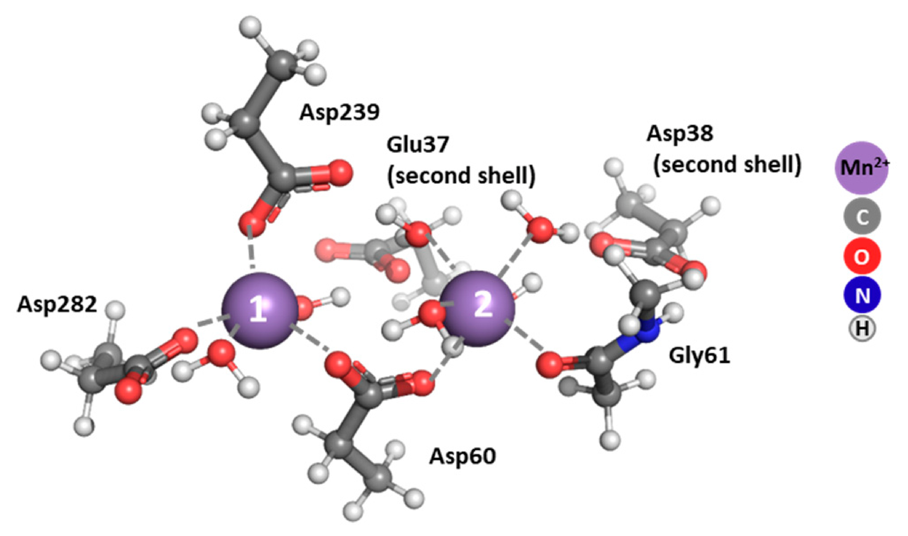
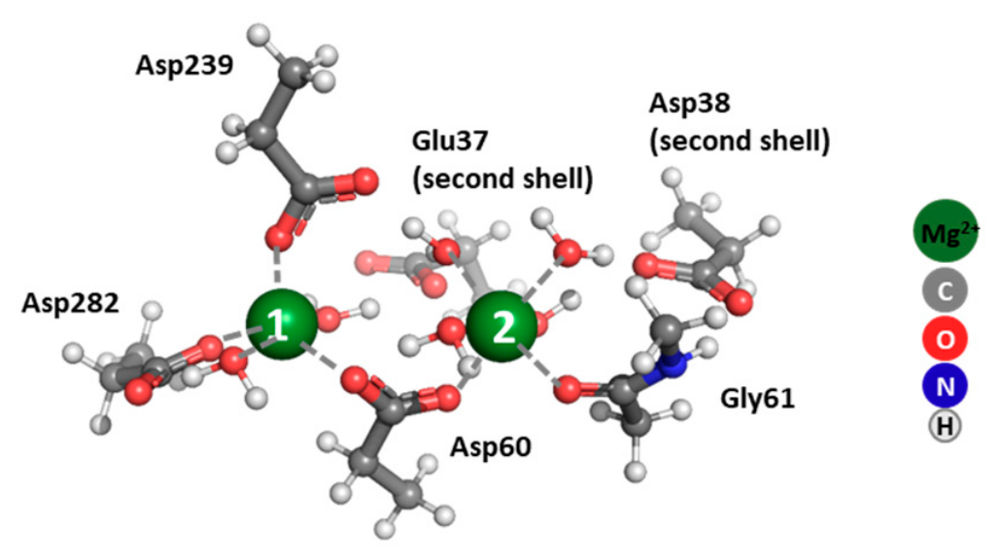
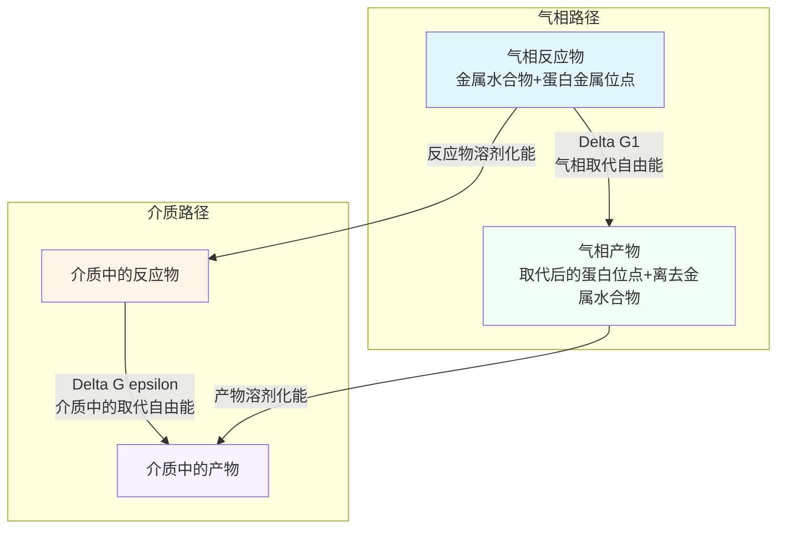
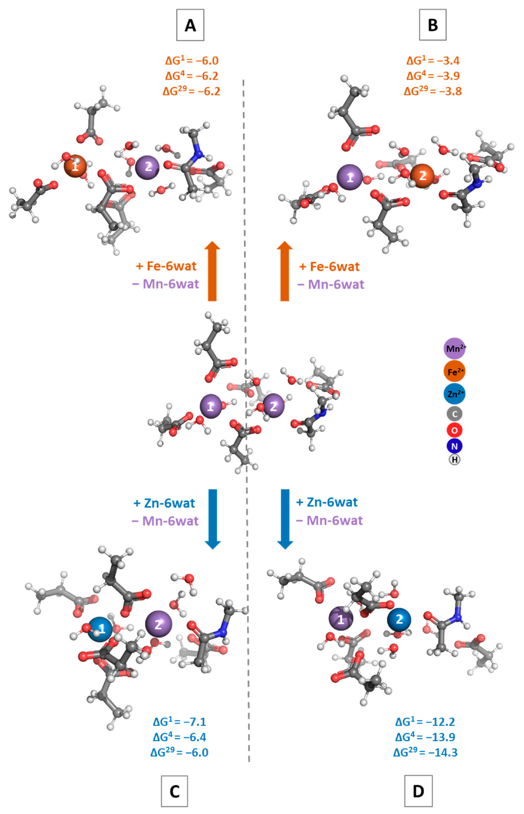
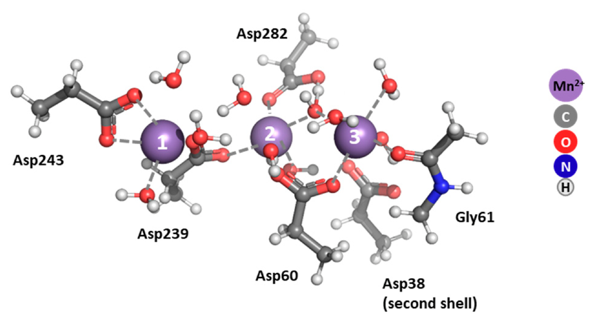
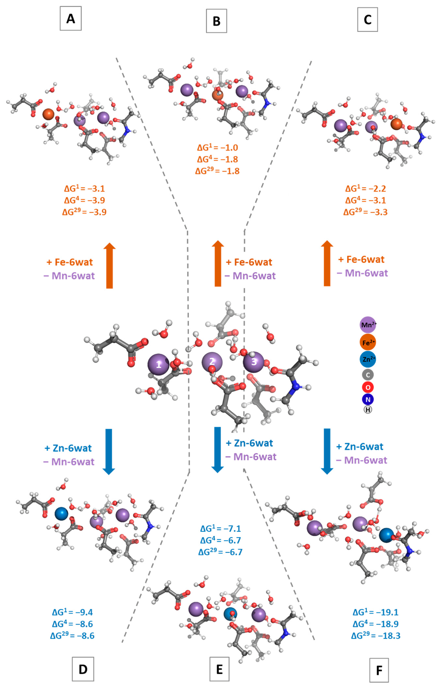
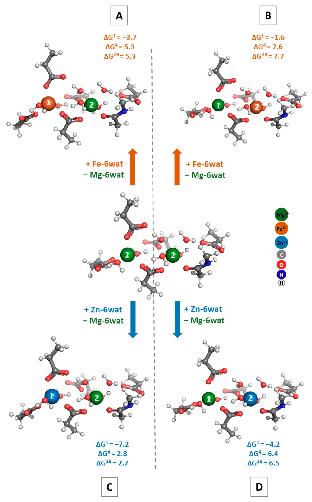
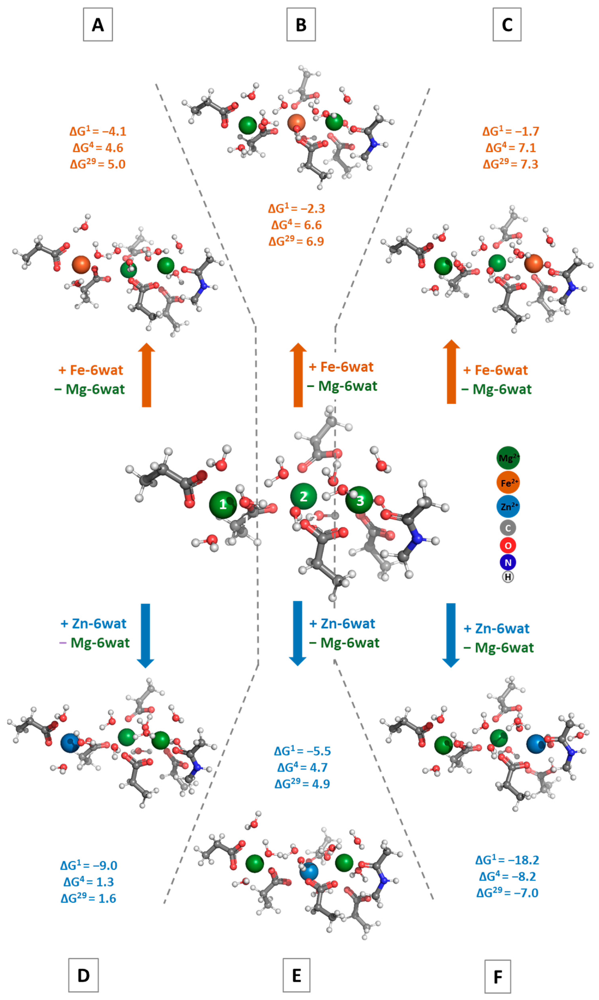

# DFT计算揭示PPM1A金属选择性：Mn位点易受攻击，Mg位点相对稳定

## 本文信息

- 标题：DFT评估蛋白磷酸酶PPM1A中金属离子选择性：原生金属类型和数量对活性位点竞争的影响
- 作者：Nikoleta Kircheva, Vladislava Petkova, Silvia Angelova, Todor Dudev
- 发表期刊：*Biomolecules*
- 发表时间：2026年6月11日
- DOI：https://doi.org/10.3390/biom16060860
- 单位：保加利亚科学院光学材料与技术研究所，普罗夫迪夫大学，索菲亚大学化学与药学系
- 引用格式：Kircheva, N., Petkova, V., Angelova, S., & Dudev, T. (2026). DFT Evaluation of Metal Ion Selectivity in Protein Phosphatase PPM1A: The Effect of Native Metal Type and Multiplicity on the Competition with Other Biogenic Contenders for the Active Site. *Biomolecules*, *16*(6), 860. https://doi.org/10.3390/biom16060860

## 摘要

> 蛋白磷酸酶PPM1A通过去磷酸化关键调节蛋白在细胞信号传导中发挥**关键作用**。实验数据显示，该酶需要$\ce{Mn^{2+}}$或$\ce{Mg^{2+}}$结合在活性中心，因此其催化活性严重依赖于螯合的金属离子。本研究使用**DFT计算**研究了PPM1A的金属离子选择性，基于双核和三核金属中心模型以及来自第一和第二金属配位层的蛋白配体。**双核Mn-Mn和三核Mn-Mn-Mn位点**对生物源性$\ce{Fe^{2+}}$和$\ce{Zn^{2+}}$的取代抵抗力较差，$\ce{Mn^{2+}} \rightarrow \ce{Fe^{2+}}/\ce{Zn^{2+}}$交换的Gibbs自由能在气相和凝聚相中均为负值。相比之下，**Mg-Mg和Mg-Mg-Mg中心更加稳健**，除Mg-Mg-Zn复合物外，$\ce{Mg^{2+}} \rightarrow \ce{Fe^{2+}}/\ce{Zn^{2+}}$取代在热力学上不利。

### 核心结论

- **Mn位点脆弱**：双核和三核Mn位点对$\ce{Fe^{2+}}$和$\ce{Zn^{2+}}$攻击抵抗力差，取代反应$\Delta G < 0$
- **Mg位点稳定**：Mg位点对金属取代更具抗性，多数情况下$\Delta G > 0$，但位点3易受$\ce{Zn^{2+}}$攻击
- **热力学决定因素**：金属竞争主要由竞争阳离子的本征性质和水合配合物的溶剂化性质决定

---

## 研究背景

PPM1A是PPM（金属依赖性蛋白磷酸酶）家族成员，通过去磷酸化关键调节蛋白参与细胞信号传导。该酶分布在几乎所有组织中，定位于细胞核和细胞质，参与伤口愈合、炎症、新血管形成、骨形态发生蛋白信号调节、胎盘形成、卵细胞合成、神经细胞分化等多种生化过程。

**图1：PPM1A活性位点结构示意图**。展示B3LYP/6-31+G(3d,p)优化后的双核Mn位点。Mn1主要由Asp60、Asp239和Asp282配位，Mn2由Asp60和Gly61主链羰基配位；Glu37和Asp38位于**第二配位层**，水分子补足**第一配位层**。

**图3：双核Mg-Mg位点的优化结构**。与Mn-Mn位点相比，Mg-Mg中心更加紧凑，平均Mg1-O和Mg2-O键长比Mn位点缩短0.102和0.122 Å，暗示Mg-Mg金属中心具有更高的稳定性。

PPM1A的催化活性严格依赖结合的金属离子类型和活性位点结构。实验表明该酶需要$\ce{Mn^{2+}}$或$\ce{Mg^{2+}}$作为辅因子，但细胞内存在$\ce{Fe^{2+}}$、$\ce{Zn^{2+}}$等其他生物源性金属离子，它们可能与**原生金属竞争活性位点**，影响酶的催化功能。

本研究使用DFT方法（B3LYP/6-31+G(3d,p)）系统评估PPM1A活性位点中双核和三核金属中心的金属选择性，重点关注$\ce{Mn^{2+}}$和$\ce{Mg^{2+}}$位点对$\ce{Fe^{2+}}$和$\ce{Zn^{2+}}$的抵抗能力。

## 计算方法

本研究采用密度泛函理论（DFT）计算系统评估PPM1A的金属选择性，方法经过充分验证。

### 理论水平与计算软件

所有DFT计算使用**Gaussian 16**软件完成，几何优化和频率分析采用**B3LYP/6-31+G(3d,p)**。作者选择这一组合，是因为它在其既往金属取代研究中能较好复现实验键长和取代自由能：

- **泛函选择**：B3LYP三参数杂化泛函用于优化簇模型，并通过无虚频确认局部极小结构
- **基组特点**：6-31+G(3d,p)包含弥散函数和极化函数，用于描述带电配体、水分子和金属配位环境
- **验证策略**：作者对双核位点中的Zn/Mg取代反应做了更大基组和色散校正测试，确认趋势不变

### 模型构建方法

- **结构基础**：基于X射线晶体结构构建活性位点模型，双核模型来自PDB **1A6Q**（分辨率2.0 Å），三核模型来自PDB **6B67**（分辨率1.8 Å）。
- **配位层定义**：模型保留金属第一、第二配位层中的蛋白配体和晶体水。Asp/Glu侧链用$\ce{CH3CH2COO-}$表示，主链肽片段用$\ce{CH3CONHCH3}$表示；优化时**不施加几何约束**。

### 热力学计算

金属取代反应的热力学可行性通过Gibbs自由能变化判断。计算采用热力学循环方法：

**热力学循环**：先在气相中计算金属取代反应的$\Delta G_1$，再把反应物和产物分别放入介质中计算SMD溶剂化能。介质中自由能$\Delta G^{\varepsilon}$等于气相自由能加上“产物溶剂化能减反应物溶剂化能”的校正项。

气相Gibbs自由能计算公式：

$$
\Delta G_1 = \Delta E_{\mathrm{elect}} + \Delta E_{\mathrm{th}} - T\Delta S
$$

这里的$\Delta$都表示**产物减反应物**，对应原文的R1或R2金属取代反应。三个量的含义是：

- $\Delta E_{\mathrm{elect}}$：**电子能变化**。来自气相优化结构的DFT电子能，按“产物总电子能减反应物总电子能”计算。
- $\Delta E_{\mathrm{th}}$：**热校正能变化**。来自频率分析，包含零点能和298 K、1 atm下的热能校正，同样按产物减反应物计算。
- $T\Delta S$：**熵贡献**。$S$由频率分析得到，包含平动、转动和振动熵；原文取$T = 298\ \mathrm{K}$，所以$-T\Delta S$表示熵对气相Gibbs自由能的贡献。

因此，$\Delta G_1$不是单纯的电子能差，而是**电子能、热校正和熵项共同给出的气相Gibbs自由能差**。优化和频率分析还用于确认结构是势能面局部极小值，因为原文说明所有结构均无虚频。

介质中的金属取代自由能通过热力学循环获得：

$$
\Delta G^{\varepsilon} = \Delta G_1 + \Delta E_{\mathrm{solv}}^{\varepsilon}(\mathrm{products}) - \Delta E_{\mathrm{solv}}^{\varepsilon}(\mathrm{reactants})
$$

其中，$\Delta E_{\mathrm{solv}}^{\varepsilon}$来自在气相优化结构上进行的SMD单点溶剂化计算。对蛋白-金属簇模型，作者分别使用$\varepsilon \approx 4$和$\varepsilon \approx 29$模拟不同暴露程度的结合口袋；对金属水合物，则用水环境$\varepsilon = 78$。

原文计算了三类环境：

- **$\Delta G_1$**：气相Gibbs自由能
- **$\Delta G^4$**：使用乙醚介电常数$\varepsilon \approx 4$，用于模拟较封闭或埋藏的结合位点
- **$\Delta G^{29}$**：使用丙腈介电常数$\varepsilon \approx 29$，用于模拟相对暴露的结合口袋

需要注意，**水合金属配合物**按水环境处理，$\varepsilon = 78$，但$\Delta G^{29}$本身不是水溶液自由能。判定标准为：$\Delta G < 0$表示取代在热力学上有利，$\Delta G > 0$表示取代不利。

### ONIOM QM/MM验证

原文并没有对所有模型都做完整QM/MM重算，而是对若干关键情形做ONIOM验证。具体包括双核Mg位点中图4C、图4D对应的Zn/Mg取代反应，以及三核Mg位点中Zn占据位点3时的构型。ONIOM水平为B3LYP/6-31+G(3d,p):UFF，结果主要用于确认簇模型得到的几何特征和能量趋势。

### 方法验证

- **键长验证**：双核Mn模型中，平均Mn1-O和Mn2-O键长分别为2.15 Å和2.22 Å，接近1A6Q实验结构中的2.15 Å和2.17 Å。三核Mg模型则是由6B67中的Ca位点替换而来，原文将优化后的Mg-O距离与Ca螯合晶体结构作**结构合理性比较**，不能简单写成”实验Mg-O键长”。
- **热力学验证**：作者列举了既往体系中计算与实验取代自由能的对比，包括18-crown-6、Li/Mg竞争、EDTA中的Zn/Cu交换和转铁蛋白中的Fe/Ga竞争；这些例子支持该方法可用于**比较金属取代趋势**。
- **方法稳健性**：原文针对双核位点中的Zn/Mg取代反应测试了更大基组和色散校正。三重ζ基组使Gibbs自由能变化约0.3-0.8 kcal/mol，加入色散后变化约1.2-1.7 kcal/mol，**均不改变趋势**。

| 验证设置 | $\Delta G$变化 | 趋势是否改变 |
|---------|--------------|--------------|
| 三重ζ基组 | 0.3-0.8 kcal/mol | 否 |
| 加入色散校正 | 1.2-1.7 kcal/mol | 否 |

因此，B3LYP/6-31+G(3d,p)更适合作为本文的统一比较水平，而不是为了给出绝对精确的蛋白自由能景观。

## 关键发现

### Mn位点高度脆弱

**图2：双核Mn位点的金属取代Gibbs自由能**。图中展示了四种金属取代反应的Gibbs自由能（$\Delta G$）：反应A和B对应$\ce{Mn^{2+}} \rightarrow \ce{Fe^{2+}}$取代，反应C和D对应$\ce{Mn^{2+}} \rightarrow \ce{Zn^{2+}}$取代。所有反应的$\Delta G$均为负值，表明热力学有利，其中C和D的Gibbs自由能更负，说明Zn是更强竞争者。

双核Mn-Mn位点的计算结果显示，$\ce{Mn^{2+}} \rightarrow \ce{Fe^{2+}}$取代的$\Delta G_1$（气相）为负值，表明热力学有利；$\ce{Mn^{2+}} \rightarrow \ce{Zn^{2+}}$取代的Gibbs自由能更低，Zn是**更强竞争者**。金属取代导致**配位键收缩**，反映了$\ce{Fe^{2+}}$和$\ce{Zn^{2+}}$与配体的更高亲和力。

| 取代反应 | 原键长（Å） | 新键长（Å） | 变化 |
|---------|------------|------------|------|
| $\ce{Mn1^{2+}} \rightarrow \ce{Fe^{2+}}$ | 2.147 | 2.106 | -0.041 |
| $\ce{Mn2^{2+}} \rightarrow \ce{Fe^{2+}}$ | 2.218 | 2.167 | -0.051 |
| $\ce{Mn1^{2+}} \rightarrow \ce{Zn^{2+}}$ | 2.147 | 2.070 | -0.077 |
| $\ce{Mn2^{2+}} \rightarrow \ce{Zn^{2+}}$ | 2.218 | 2.161 | -0.057 |

三核Mn-Mn-Mn位点的结果表明，所有三个位置的$\ce{Mn^{2+}} \rightarrow \ce{Fe^{2+}}$取代均为有利反应（$\Delta G < 0$）。$\ce{Mn^{2+}} \rightarrow \ce{Zn^{2+}}$在位点3取代的Gibbs自由能最低且最**有利**，这主要归因于结构变化：原本六配位的$\ce{Mn^{2+}}$转为更适合$\ce{Zn^{2+}}$的四配位环境。

**图7：三核Mn-Mn-Mn位点的优化结构**。整体结构与其镁对应物相似，但由于Mn²⁺的高自旋八面体配合物离子半径（0.83 Å）比Mg²⁺（0.72 Å）大，金属-配体键长长约0.1 Å。

**图8：三核Mn位点的金属取代Gibbs自由能**。反应A-C对应三个位置的$\ce{Mn^{2+}} \rightarrow \ce{Fe^{2+}}$取代，均为有利反应（$\Delta G < 0$）。反应D-F对应$\ce{Mn^{2+}} \rightarrow \ce{Zn^{2+}}$取代，其中位点3（反应F）的Gibbs自由能最低且最**有利**。关键机制在于位点3从六配位$\ce{Mn^{2+}}$重排为四配位$\ce{Zn^{2+}}$环境。

### Mg位点相对稳定

双核Mg-Mg位点的结果显示，气相$\Delta G_1$为负但数值较高（-1.6至-7.2 kcal/mol），但在凝聚相中$\Delta G_4$和$\Delta G_{29}$转为正值，表明凝聚相环境下抗取代。这种差异主要源于溶剂化效应，不同金属离子的六水合物具有不同的溶剂化自由能。

| 六水合物的溶剂化自由能（kcal/mol） | $\ce{Mg^{2+}}$ | $\ce{Fe^{2+}}$ | $\ce{Zn^{2+}}$ |
|-------------------------------|---------|---------|---------|
| 数值 | -199.9 | -209.0 | -210.2 |

由于进入位点前必须脱去水合环境，$\ce{Fe^{2+}}$和$\ce{Zn^{2+}}$水合配合物更强的溶剂化会带来**更高脱溶剂化代价**；这抵消了它们与配体结合更强的优势，从而保护Mg位点不被取代。

**图4：双核Mg位点的金属取代Gibbs自由能**。反应A和B对应$\ce{Mg^{2+}} \rightarrow \ce{Fe^{2+}}$取代，反应C和D对应$\ce{Mg^{2+}} \rightarrow \ce{Zn^{2+}}$取代。气相$\Delta G_1$仍为负值，但在$\varepsilon \approx 4$和$\varepsilon \approx 29$介质中转为正值，说明凝聚相下Mg-Mg位点对Fe和Zn取代更有抵抗力。

**图5：三核Mg-Mg-Mg位点的优化结构**。三个金属离子由天冬氨酸桥接，Mg1²⁺与Asp60呈双齿配位。与双核位点相比，增加了第三个金属位点。

三核Mg-Mg-Mg位点对$\ce{Fe^{2+}}$攻击有**抵抗力**（$\Delta G_4$和$\Delta G_{29}$在5-8 kcal/mol），但位点3对$\ce{Zn^{2+}}$脆弱（Mg-Mg-Zn结构中$\Delta G$为负值）。这种脆弱性同样归因于**配位几何变化**：位点3从六配位转为四配位，有利于Zn结合。

**图6：三核Mg位点的金属取代Gibbs自由能**。反应A-C对应$\ce{Mg^{2+}} \rightarrow \ce{Fe^{2+}}$取代，$\Delta G^4$和$\Delta G^{29}$约为5-8 kcal/mol，表明对$\ce{Fe^{2+}}$攻击有抵抗力。反应D-F对应$\ce{Mg^{2+}} \rightarrow \ce{Zn^{2+}}$取代，其中位点3（反应F）显示脆弱性，$\Delta G$为负值。结构机制在于位点3从六配位转为四配位，有利于Zn结合。

### 热力学机制：金属竞争主要由三个因素决定

- 首先，**阳离子的本征性质**在Irving-Williams序列中的位置决定了金属与配体的结合强度。
- 其次，**溶剂化性质的差异**至关重要：不同金属离子的水合配合物具有不同的溶剂化自由能，这直接影响金属取代反应的热力学驱动。
- 最后，**配位几何的变化**可以驱动某些取代反应，如位点3从六配位$\ce{Mn^{2+}}$或$\ce{Mg^{2+}}$重排为四配位$\ce{Zn^{2+}}$环境。

## 关键结论与批判性总结

本研究从热力学角度解释了PPM1A金属选择性的分子基础，为理解金属酶的辅因子特异性提供了重要见解。计算结果表明Mg负载的PPM1A局部活性位点比Mn负载形式更抗生物源性金属置换，这与实验观察一致：镁优先结合在PPM1A活性位点，锌离子通过取代原生离子阻断PPM1A酶，非原生金属如$\ce{Fe^{2+}}$可能在某些条件下激活PPM1A。这些发现对理解该酶的生物学功能和设计金属选择性抑制剂具有重要指导意义。

### 主要贡献

- **理论预测**：沿用已验证的DFT/SMD金属取代计算框架，比较PPM1A局部活性位点对竞争金属的热力学抵抗力
- **分子机制**：从配位几何、溶剂化效应和阳离子本征性质三个层面解释了金属选择性的物理起源
- **生物学意义**：指出Mg负载的PPM1A位点比Mn负载位点更抗生物源性金属置换，这与体内更偏好Mg结合、Zn/Cd可抑制PPM1A等实验观察相一致

### 局限性

- 首先，研究基于静态晶体结构，未考虑蛋白构象动力学对金属结合的影响。
- 其次，簇模型忽略了蛋白长程静电效应和溶液中的离子强度变化。
- 最后，计算仅提供了热力学参数，未考虑动力学势垒和酶催化循环中的金属交换过程。

### 未来方向

结合分子动力学模拟可以研究金属离子结合的动力学过程和构象变化。使用QM/MM方法能够研究完整蛋白环境中的金属选择性。通过金属取代实验和活性测定可以验证理论预测。
