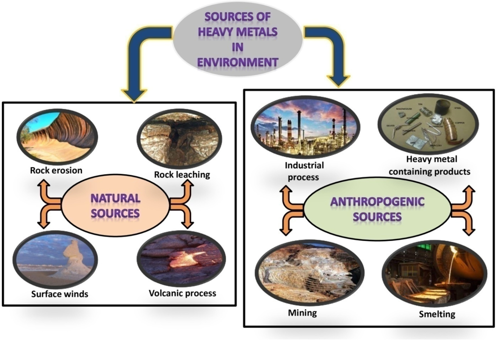
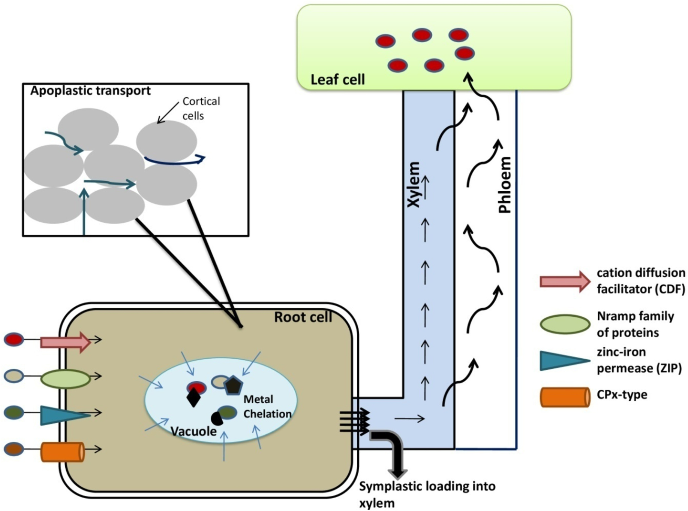
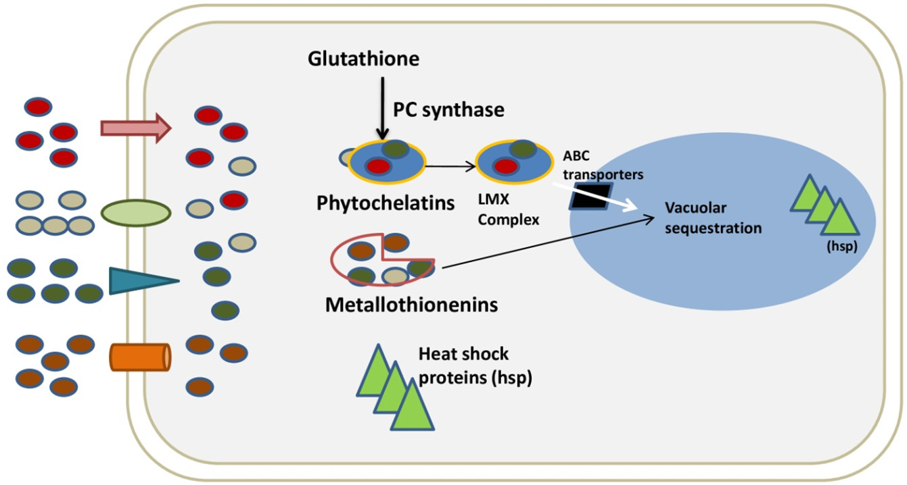

# 植物重金属解毒的分子防线：金属结合蛋白的保护机制

## 本文信息

- 标题：Uptake and toxicity of heavy metals: The protective frontiers of metal binding proteins
- 作者：Ravneet Kaur, Harleen Kaur, Ashish Sharma
- 发表期刊：Journal of Geochemical Exploration
- 发表时间：2025年（Volume 271, Article Number 107673）
- DOI：https://doi.org/10.1016/j.gexplo.2025.107673
- 单位：Department of Botany and Environment Science, DAV University, India
- 引用格式：Kaur, R., Kaur, H., & Sharma, A. (2025). Uptake and toxicity of heavy metals: The protective frontiers of metal binding proteins. *Journal of Geochemical Exploration*, 271, 107673.

## 摘要

> 环境中多种污染物和有毒物质被释放到生态系统中的含量正呈惊人增长。在所有污染物中，重金属是特别令人关注的一类。这些污染物进入环境后，通过土壤进入植物系统。植物通过质外体-共质体连续体从土壤中吸收重金属。植物需要微量浓度的营养元素，但这些元素过量时会对植物产生毒性效应。重金属会导致植物**叶片失绿、光合作用受损、脂质过氧化**等毒性，最终导致植物生物量整体下降。过量浓度的重金属如铜、铬、镍在多种植物物种诱导形态和生理畸形。为响应重金属毒性产生的活性氧，植物激活多种防御机制。此外，多种金属结合蛋白如金属硫蛋白、植物螯合肽、谷胱甘肽等被激活。这些金属结合蛋白通过结合重金属并将其区隔化到液泡中来降低重金属的毒性效应。本综述将重点介绍植物对重金属的摄取机制、常见重金属在植物中引起的毒性，以及金属结合蛋白在螯合和区隔化重金属中的作用。

### 核心结论

- **重金属摄取的双重途径**：植物通过**质外体途径**（细胞壁和胞间空间的被动扩散）和**共质体途径**（通过胞间连丝连接的细胞质连续体的主动转运）吸收土壤中的重金属，在凯氏带处必须进入共质体继续运输
- **关键转运蛋白系统**：**ZIP家族**（锌/铁摄取）、**HMA家族**（P型ATP酶重金属外排）和**NRAMP家族**（天然抵抗相关巨噬细胞蛋白）精确调控金属离子平衡，各自具有特异的底物识别和跨膜转运机制
- **金属结合蛋白的分子防线**：**金属硫蛋白**作为富含半胱氨酸的低分子量胞质蛋白，通过硫醇基团直接结合重金属；**植物螯合肽**作为从谷胱甘肽衍生的多肽，通过酶促合成响应重金属胁迫，形成PC-金属配合物并区隔化到液泡中
- **协同保护网络**：MTs和PCs形成功能互补的保护系统，MTs负责快速响应和胞质金属离子调控，PCs负责延迟响应和液泡区隔化，两者通过ROS信号、$\ce{Ca^2+}$信号和GSH代谢网络协同调控

## 背景

重金属污染已成为全球环境和食品安全的重大威胁。随着工业化和城市化的快速发展，采矿、工业排放、农业活动（污水灌溉、农药使用）和交通尾气等人为活动向环境中释放了大量重金属。与有机污染物不同，重金属具有**不可破坏性和生物累积性**——它们不会在环境中降解，而是沿着食物链传递和浓缩，最终威胁人类健康。

重金属对植物的毒性主要通过三个机制实现：**氧化应激**（重金属诱导ROS爆发，导致脂质过氧化、蛋白质氧化和DNA损伤）、**酶活性抑制**（重金属离子与酶活性位点结合，取代必需金属辅因子）和**结构损伤**（影响细胞膜完整性、叶绿素合成和光合作用）。不同重金属的毒性特异性明显：Cd、Hg、Pb、Cr等非必需金属即使低浓度也极具毒性，而Cu、Zn、Mn等必需金属在过量时同样产生毒害。

植物为了应对重金属胁迫，演化出了复杂的**金属稳态调控网络**。这包括精确的金属摄取和转运机制、高效的金属螯合系统、以及区隔化解毒策略。其中，**金属结合蛋白**是植物重金属解毒的核心组件，它们能够高亲和力地结合重金属离子，形成稳定的配合物，并将这些有毒物质区隔化到代谢非活跃的细胞区室（如液泡）中。

当前研究的核心挑战在于：**植物如何精确识别和区分必需金属和有毒金属？金属结合蛋白如何实现高选择性和高亲和力的金属配位？MTs和PCs系统如何在时空上协同调控以实现最优的重金属解毒**？对这些问题的深入理解不仅有助于揭示植物抗逆性的分子机制，还为作物遗传改良和植物修复技术提供理论基础。

### 关键科学问题

本研究综述旨在回答以下核心问题：

1. **植物重金属摄取和转运的分子机制**：质外体和共质体途径如何协同工作？关键转运蛋白家族（ZIP、HMA、NRAMP）如何实现金属离子的选择性识别和跨膜转运？

2. **金属结合蛋白的结构-功能关系**：MTs的半胱氨酸富集结构域如何决定金属选择性？PCs的多肽长度可塑性如何影响螯合能力和金属特异性？

3. **MTs和PCs的协同保护机制**：两套系统如何在时空上分工协作？它们如何通过共享的信号通路（ROS、$\ce{Ca^2+}$、GSH）实现协调调控？

4. **区隔化解毒的分子基础**：ABC转运蛋白如何识别不同的PC-金属配合物？液泡区隔化如何影响金属的生物毒性和再利用？

---

## 植物重金属摄取与转运机制

**图1：环境中重金属的各种来源**，包括自然来源（如岩石风化、火山活动）和人为来源（如工业排放、农业活动、污水灌溉等）。人为活动是环境中重金属污染最主要的危险来源。

### 根系摄取的双重途径

**图2：植物细胞中重金属的摄取和转运机制**。展示重金属通过质外体和共质体途径进入根系，通过特定的转运蛋白（如ZIP、HMA、NRAMP家族）跨膜转运，最终装载到木质部进行长途运输到地上部分。

植物根系通过两条平行的途径吸收土壤中的重金属离子：

#### 质外体途径
- **定义与过程**：重金属通过细胞壁和胞间空间的被动扩散，金属离子首先结合到果胶-纤维素细胞壁，然后扩散至内皮层
- **屏障机制**：在凯氏带处被富含软木脂的不透水屏障阻断，迫使离子进入细胞

#### 共质体途径
- **定义与机制**：重金属通过胞间连丝连接的细胞质连续体的主动转运，依赖质膜负电位和特异性转运蛋白
- **优势特点**：可控性强，能选择性吸收必需金属，排除有毒金属

### 关键转运蛋白家族

植物利用多套转运蛋白系统精确调控金属离子平衡：

| 转运蛋白家族 | 主要功能 | 底物特异性 | 组织定位 |
|-------------|---------|-----------|---------|
| **ZIP家族** | 锌/铁摄取 | $\ce{Fe^2+}$、$\ce{Zn^2+}$、$\ce{Cd^2+}$、$\ce{Mn^2+}$ | 质膜，含8个跨膜结构域和组氨酸富集金属结合域 |
| **HMA家族** | P型ATP酶，重金属外排 | $\ce{Cu^2+}$、$\ce{Zn^2+}$、$\ce{Cd^2+}$、$\ce{Pb^2+}$ | 质膜（OsHMA2,5,9）和液泡膜（OsHMA3） |
| **NRAMP家族** | 天然抵抗相关巨噬细胞蛋白 | Zn、Fe、Mn、Cu、Al、Ni、Cd、Co、Pb | 质膜，含羰基肽键金属结合位点 |

> **转运蛋白的分子识别机制**：ZIP转运蛋白通过**组氨酸富集的金属结合域**和**极性残基**形成跨膜结合位点，精确识别不同金属离子的电荷半径和配位几何。NRAMP转运蛋白的**跨膜结构域VI中的羰基肽键**，以及**一个甲硫氨酸和两个天冬氨酸残基**，构成了金属离子选择性结合的分子基础。

### 韧皮部装载与长途运输

重金属从根系向地上部的转运涉及复杂的生理过程：

1. **径向转运过程**：金属离子通过共质体连续体的径向移动，从外皮层到达中柱
2. **木质部装载机制**：在木质部薄壁细胞中，金属离子从共质体转移到木质部导管
3. **长途运输途径**：溶解在木质部汁液中的金属复合物随蒸腾流向上运输到叶片
4. **卸载与分配过程**：在叶片组织中，金属离子从木质部卸载，分配到不同细胞区室

关键调控点包括：**木质素沉积调节金属进出中柱的通量**，**液泡保留减少向地上部的金属流**，以及**螯合剂分泌促进金属的可移动性**（如组氨酸、柠檬酸）。

---

## 金属结合蛋白：植物解毒的分子防线

**图3：不同金属结合蛋白引起的金属结合、螯合和区隔化机制**。展示MTs和PCs如何与重金属离子配位结合，形成稳定的配合物，并通过ABC转运蛋白将金属-配合物区隔化到液泡中，从而实现重金属解毒。

### 金属硫蛋白（Metallothioneins, MTs）

#### 发现与基本特征

MTs于**1957年**首次在**马肾脏皮质**中发现，作为结合Cd的蛋白质被鉴定。随后研究表明，MTs是广泛存在于**原核生物（如蓝细菌Synechococcus）和植物**中的**低分子量、富含半胱氨酸的胞质蛋白**。

#### 结构分类与组织特异性

植物MTs根据**半胱氨酸残基排列**分为四个类型，各有特异的组织分布：

| MT类型 | 主要组织位置 | 金属解毒特异性 | 生理功能 |
|-------|------------|--------------|---------|
| **MT1** | 根系和叶片细胞 | Cd解毒 | 根系金属胁迫响应 |
| **MT2** | 根系和叶片细胞 | Cu、Zn解毒 | 叶片金属稳态 |
| **MT3** | 叶片和果实 | 多种金属胁迫 | 生殖组织保护 |
| **MT4** | 成熟种子和胚性细胞 | Zn解毒 | 种子萌发和早期生长 |

> **结构-功能关系的分子基础**：MTs的**金属结合域富含硫醇基团**，能通过**配位键与重金属离子形成稳定的配合物**。这种**软硬酸碱理论**的完美匹配——软酸金属（$\ce{Cd^2+}$、$\ce{Hg^2+}$、$\ce{Pb^2+}$）优先结合软碱硫醇——解释了MTs对重金属的高亲和力和选择性。

#### MTs的诱导表达调控

MTs的转录调控受到多重信号网络控制：

- **金属离子直接诱导**：Cd、Zn、Hg、Cu、Au、Ag、Co、Ni、Bi等金属直接激活MT基因转录
- **ROS信号介导**：重金属诱导的**氧化应激**通过ROS信号激活MTs表达，维持**氧化还原稳态**
- **激素信号通路**：**胁迫激素**（如脱落酸、茉莉酸）参与MTs的诱导表达
- **发育程序控制**：不同MT类型在**发育阶段特异性表达**，确保组织保护

**机制的关键创新**：MTs不仅作为**金属螯合剂**，还作为**抗氧化剂**和**信号转导分子**。研究表明，MTs能**直接清除自由基**，并通过**调节细胞内金属离子稳态**影响依赖金属的酶活性和信号转导。

### 植物螯合肽（Phytochelatins, PCs）

#### 结构特征与生物合成

PCs是**从谷胱甘肽（GSH）酶促合成**的富含半胱氨酸的多肽，具有**通用结构（-Glu-Cys）n-Gly**，其中n=2-11。其C末端的甘氨酸在不同植物中可被丙氨酸、丝氨酸、谷氨酰胺或谷氨酸取代。

#### 合成途径的分子机制

PCs的生物合成由**Glu-Cys二肽转肽酶（PC合酶）**催化：

1. **前体合成**：GSH由**谷氨酸-半胱氨酸连接酶**和**谷胱甘肽合酶**两步合成
2. **酶促聚合**：PC合酶催化GSH的**γ-Glu-Cys键转移**，延长肽链
3. **结构多样化**：根据植物种类，C末端氨基酸可被替换，产生**结构多样性**

> **PC合酶的调控机制**：PC合酶的活性受重金属离子直接激活，其中$\ce{Cd^2+}$是最有效的激活剂，其次是$\ce{Cu^2+}$、$\ce{Ag^+}$、$\ce{Hg^2+}$、$\ce{Pb^2+}$、$\ce{Zn^2+}$。这种金属依赖的激活确保了PCs只在需要时合成，避免不必要的代谢消耗。

#### PC-金属配合物的形成与区隔化

PCs与重金属形成两类配合物，具有不同的稳定性和毒性：

| 配合物类型 | 分子量特征 | 稳定性 | 毒性 | 区隔化位置 |
|-----------|-----------|-------|------|-----------|
| **LMW PC-Cd配合物** | 低分子量，简单结构 | 较低，可逆结合 | 仍有毒性 | 胞质，临时储存 |
| **HMW PC-CdS配合物** | 高分子量，含酸不稳定硫化物 | 高，不可逆结合 | 低毒性 | 液泡，长期储存 |

**HMW PC-CdS配合物的形成机制**：在酸不稳定硫化物（$\ce{S^2-}$）存在下，LMW PC-Cd配合物进一步聚合，形成更稳定的高分子量配合物。这一过程增加了金属螯合的稳定性，降低了金属的生物毒性。

#### PCs的转运与液泡区隔化

PC-金属配合物的区隔化涉及**ATP依赖的主动转运**：

1. **胞质螯合**：PCs在胞质中结合重金属离子，形成**低毒性的PC-金属配合物**
2. **主动转运**：通过**ABC转运蛋白（ABCC类型）**，PC-金属配合物被**逆浓度梯度泵入液泡**
3. **液泡储存**：在液泡的**酸性环境**中，PC-金属配合物进一步稳定化，实现**长期隔离**
4. **解毒完成**：金属离子与细胞组分隔离，**保护关键代谢过程**免受金属毒性

> **区隔化的生理意义**：液泡区隔化不仅**降低胞质中游离金属离子浓度**，还**为金属胁迫解除后的潜在再利用提供储存库**。某些超积累植物能通过液泡区隔化积累异常高浓度的重金属而不表现毒性。

---

## MTs与PCs的协同保护网络

### 功能互补与分工协作

MTs和PCs在植物重金属解毒中形成**功能互补的协同网络**：

#### 金属选择性差异
- **MTs**：主要解毒**Cu、Zn、Cd**，通过**半胱氨酸硫醇基团**配位
- **PCs**：广谱螯合$\ce{Ag^+}$、$\ce{Hg^2+}$、$\ce{Pb^2+}$、$\ce{Zn^2+}$、$\ce{Cd^2+}$、$\ce{Cu^2+}$，通过**肽链骨架和硫醇基团**协同作用

#### 时间响应动态
- **MTs**：**快速响应**（分钟到小时），通过**预存mRNA和蛋白**的快速激活
- **PCs**：**延迟响应**（小时到天），需要**从GSH重新合成**

#### 空间分布特异性
- **MTs**：**组织特异性表达**，不同MT类型在不同组织中优势表达
- **PCs**：**广泛分布**，在几乎所有细胞类型中都可诱导

### 分子机制的交叉调控

MTs和PCs系统通过多重信号通路相互协调：

1. **共同上游信号**：**ROS爆发**和$\ce{Ca^2+}$信号同时激活MTs和PCs的表达
2. **共享抗氧化系统**：**GSH**既是PCs的前体，也作为MTs的辅助抗氧化剂
3. **金属稳态平衡**：MTs主要调控**胞质金属离子浓度**，PCs负责**液泡区隔化**
4. **胁迫记忆效应**：**首次金属胁迫**诱导的MTs和PCs表达产生**胁迫记忆**，提高**后续胁迫的耐受性**

> **协同网络的关键创新**：MTs和PCs的协同不仅体现在**功能互补**上，还体现在**代谢互作**上。研究表明，**GSH合成的调控**同时影响PCs的可用性和MTs的氧化还原环境，形成**统一的胁迫响应网络**。

---

## 关键结论与批判性总结

### 优势：从分子识别到系统保护

#### 1. 结构-功能关系的精妙设计
MTs和PCs的保护机制体现了**分子层面的精密设计**：MTs的**半胱氨酸富集结构域**提供高亲和力金属结合位点，PCs的**多肽骨架长度可调性**提供金属选择性的结构基础。这种**结构可塑性**使植物能应对多样的金属胁迫。

#### 2. 诱导表达的能量经济学
MTs和PCs的**金属依赖性诱导表达**避免不必要的蛋白合成和能量消耗。只有在金属胁迫确实存在时，才启动解毒机器的合成。这种**按需保护策略**在资源受限的环境中具有明显的选择优势。

#### 3. 跨物种保护的普适性
MTs从**原核生物到人类**的广泛分布，PCs在**植物、真菌和某些藻类**中的保守存在，表明这类保护机制具有**进化起源的古老性和功能的普适性**。不同谱系的生物趋同演化出相似的金属解毒策略，说明了这一机制的有效性。

### 局限性与未来方向

1. **分子识别的特异性机制**：MTs和PCs如何区分**必需金属**（Cu、Zn）和**有毒金属**（Cd、Hg），避免必需金属的过度螯合导致微量元素缺乏？
2. **区隔化的可逆性**：液泡中的金属是否能在胁迫解除后**重新动员**供正常代谢使用？PC-金属配合物的稳定性是否阻碍这一过程？
3. **转运蛋白的分子机制**：ABC转运蛋白如何识别不同的PC-金属配合物？是否存在**配合物选择性和转运效率的权衡**？
4. **作物改良的应用潜力**：能否通过**基因工程过表达MTs或PCs**提高作物的重金属耐性？这对**植物修复**和**食品安全**有何意义？

> **未来研究方向**：需要更多**结构生物学研究**揭示MTs和PCs的金属结合位点原子细节，更多**体内动态成像**追踪金属-配合物在细胞内的实时分布，以及更多**系统生物学建模**整合金属稳态网络的复杂调控。
