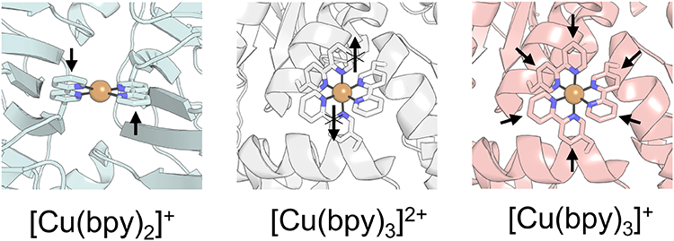
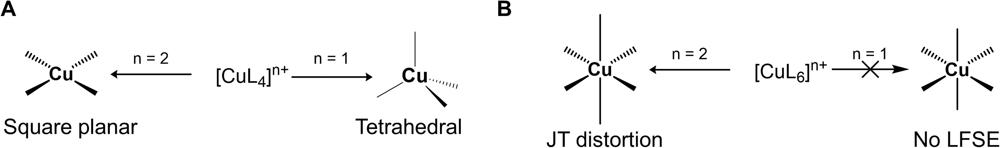
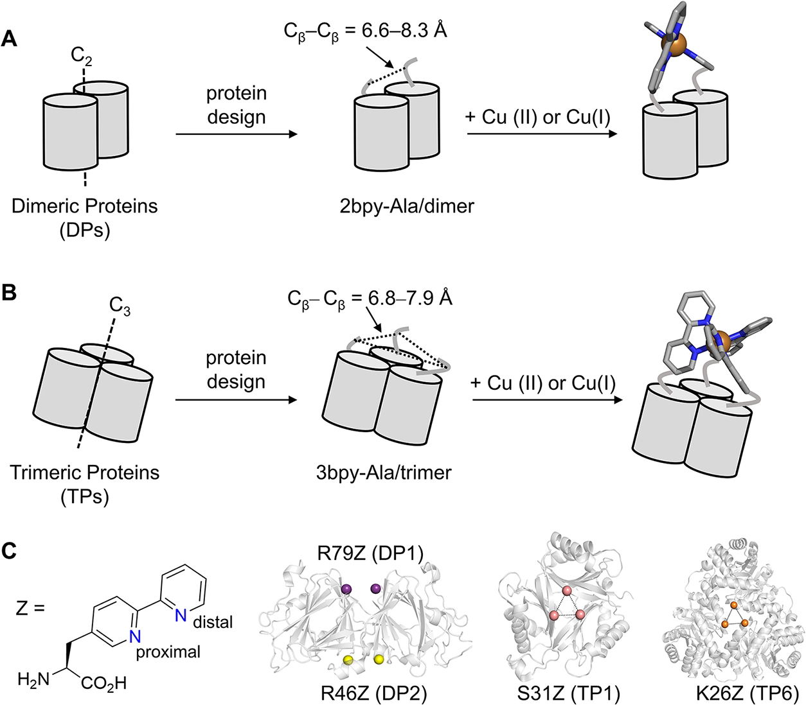
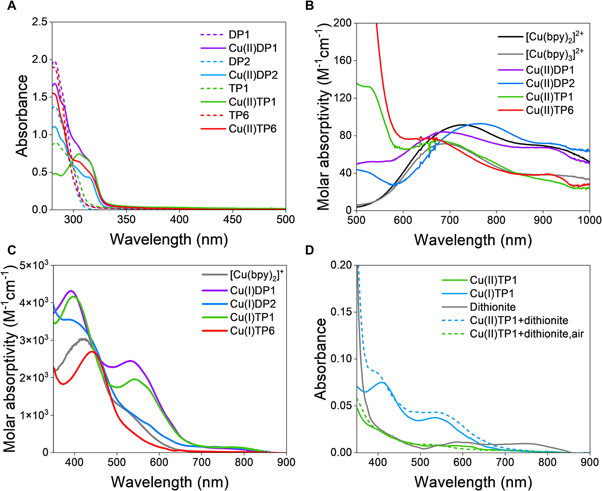
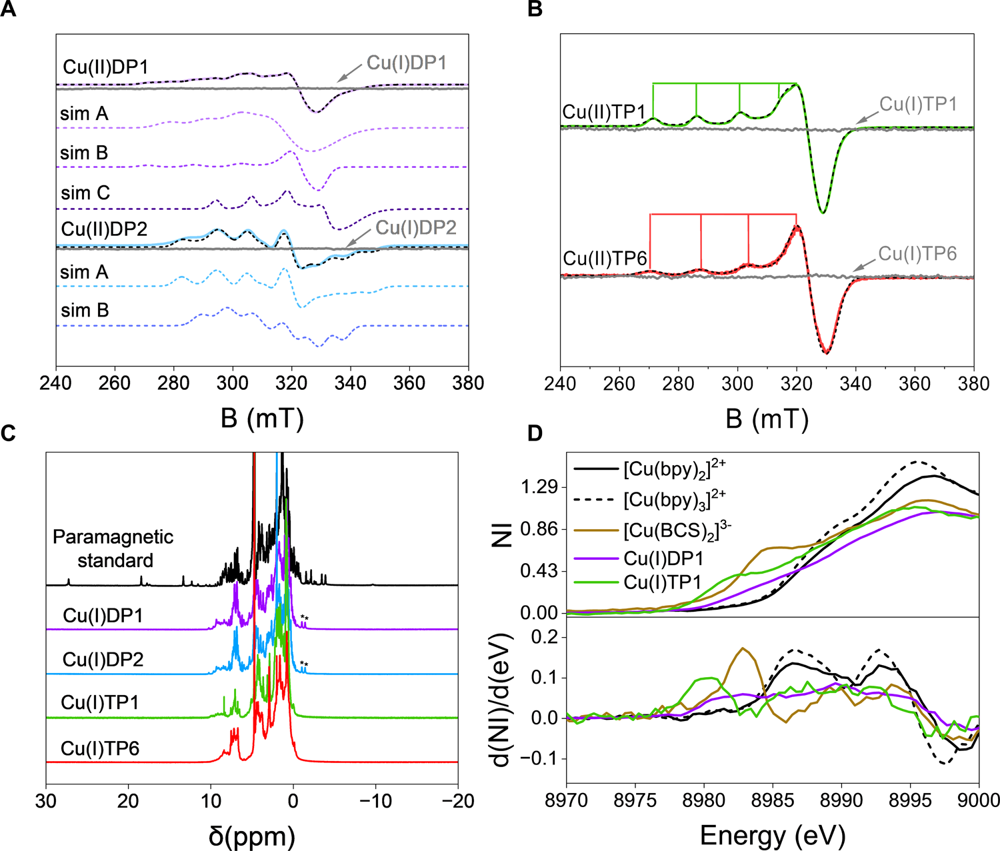
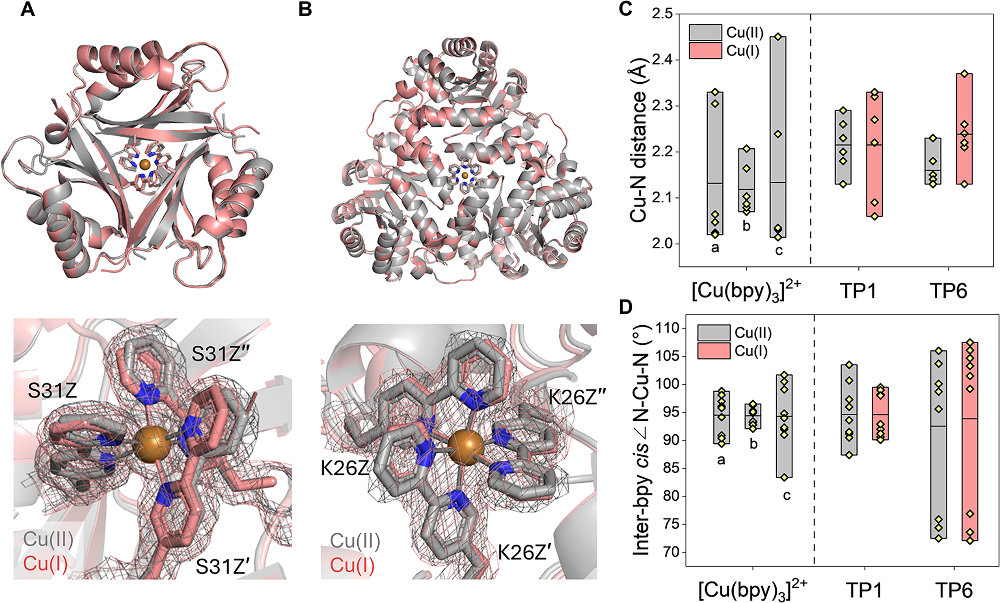
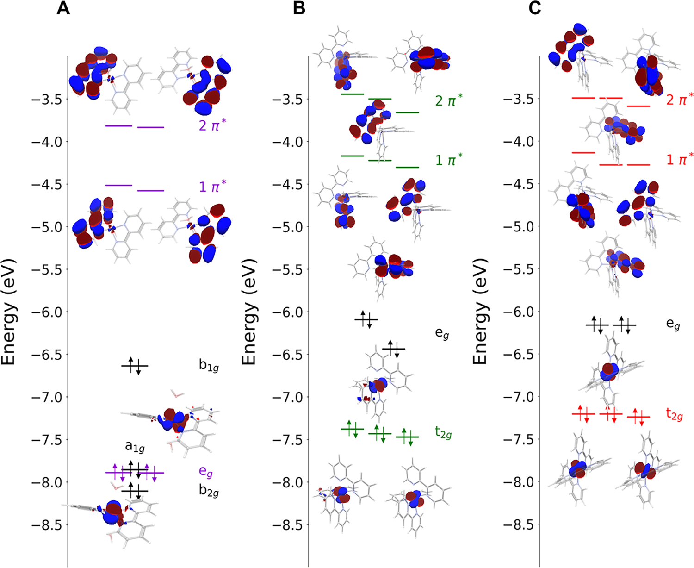
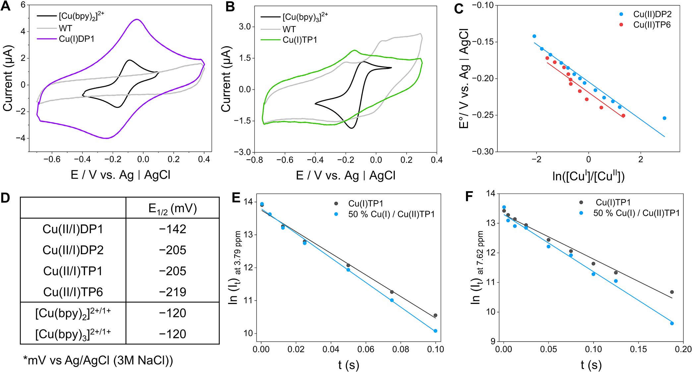

# 蛋白质迫使铜配合物打破经典配位规则：从Jahn-Teller畸变到前所未有的八面体Cu(I)

## 本文信息

- **标题**：蛋白质强制的配体环境重塑铜多联吡啶配合物中的经典配位偏好
- **作者**：Inseo Choi, Jaehee Lee, Kyohyun Hwang, Sebastian Kunze, Jae Wan Park, Seung Jun Hwang, Jongwoo Lim, Seunghoon Lee, Woon Ju Song*
- **发表期刊**：Journal of the American Chemical Society（JACS）
- **发表时间**：2026年（Advance Article）
- **DOI**：https://doi.org/10.1021/jacs.6c09177
- **单位**：Seoul National University（首尔国立大学），Korea；Pohang University of Science and Technology（POSTECH），Korea；KAIST，Korea
- **引用格式**：Choi, I., Lee, J., Hwang, K., Kunze, S., Park, J. W., Hwang, S. J., Lim, J., Lee, S., & Song, W. J. (2026). Protein-Enforced Ligand Environments Reshape Classical Coordination Preferences in Copper Polypyridyl Complexes. *J. Am. Chem. Soc.* Advance Article. https://doi.org/10.1021/jacs.6c09177
- **代码与数据**：PDB codes 23EI (Cu(II)DP1), 23EG (Cu(I)DP1), 23EF (Cu(II)DP2), 23EO (Cu(II)TP1), 23EQ (Cu(I)TP1), 24FO (Cu(II)TP6), 24GZ (Cu(I)TP6)

## 摘要

> 铜配位化学受几个公认特征的支配：八面体Cu(II)配合物的Jahn-Teller畸变，以及高配位数Cu(I)物种的匮乏。本文证明，蛋白质支架可以作为机械活性配体架构，改变这些内在的电子和结构偏好。研究者设计了四个蛋白质支架，预组织两个或三个联吡啶-丙氨酸非天然氨基酸，生成单核铜位点，分别处于Cu(II)或Cu(I)氧化态。这些蛋白质嵌入配合物表现出**独特的电荷转移特征、显著降低的Jahn-Teller畸变、前所未有的八面体Cu(I)几何构型、显著阴移的氧化还原电位**，以及与刚性态（entatic-state）行为一致的快速自交换速率常数。这项工作确立了蛋白质基多齿配体作为获取非常规配位环境、扩展金属蛋白化学空间和反应性的通用策略。

### 核心结论

- **蛋白质支架可覆盖铜配位化学的经典偏好**：通过预组织的联吡啶配体环境，蛋白质的机械约束使铜配合物偏离其在小分子体系中的天然几何构型
- **Cu(II)的Jahn-Teller畸变被显著抑制**：Cu(II)DP1和Cu(II)TP1等蛋白嵌入配合物的d-d跃迁峰位相比溶液态$\ce{[Cu(bpy)2]^{2+}}$发生约40 nm位移，结构对称性明显提高
- **前所未有的八面体Cu(I)几何构型**：Cu(I)TP1和Cu(I)TP6呈现出接近理想八面体的六配位Cu(I)，这在经典铜配位化学中极为罕见
- **氧化还原电位显著阴移**：Cu(II/I)DP1和Cu(II/I)TP1的$E_{1/2}$分别为$-142~\mathrm{mV}$和$-205~\mathrm{mV}$，表明蛋白质几何约束稳定了Cu(I)态
- **快速电子自交换速率**：Cu(II)TP1和Cu(I)TP1之间的电子自交换速率常数约$2.2\times10^4~\mathrm{M^{-1}s^{-1}}$，与蓝色铜蛋白的刚性态（entatic state）行为一致

## 背景

### 铜配位化学的经典规则

铜作为第一过渡系金属元素，其配位化学具有两个**根深蒂固的“铁律”**：

- **第一，Jahn-Teller畸变**。Cu(II)的电子构型为$\ce{d^9}$，在八面体配位场中，$\mathrm{t_{2g}^6 e_g^3}$的占据导致$\mathrm{e_g}$轨道简并，根据Jahn-Teller定理，体系会通过几何畸变降低对称性以消除简并。典型结果是拉长或压扁的八面体，轴向Cu-N键明显长于赤道键。这在溶液中的$\ce{[Cu(bpy)2]^{2+}}$等配合物中普遍存在。
- **第二，高配位数Cu(I)的匮乏**。Cu(I)为$\ce{d^{10}}$闭壳层构型，理论上不具备配体场稳定化能的驱动力。更重要的是，Cu(I)倾向于四配位四面体几何构型，配位数达到六往往伴随配体解离和配合物分解。

这两个“铁律”共同定义了铜配合物的可及化学空间。然而，自然界中的蓝色铜蛋白提供了一个经典反例：在铜蓝蛋白（azurin）、质体蓝素（plastocyanin）等体系中，蛋白质支架将Cu(II)固定在一个介于四方平面和四面体之间的中间几何构型——即所谓的**刚性态（entatic state）**。这种几何预组织最小化了氧化还原循环中的结构重排，使电子转移速率比溶液态铜配合物快数百倍。

> 刚性态（entatic state）的核心思想：蛋白质支架通过机械约束，将金属中心“锁定”在一个既不利于Cu(II)也不利于Cu(I)的几何构型上，从而降低氧化还原过程中的结构重排能垒，加速电子转移。

受这一自然启发，合成化学家们开发了各种位阻受限的合成配体框架来模拟刚性态行为。但这些小分子配体在覆盖铜配位化学更多维度（尤其是高配位数Cu(I)）方面**仍然力不从心**。

**蛋白质作为配体的独特优势**在于：蛋白质骨架不仅是静态的配体，更是具有**机械活性**的三维架构。通过蛋白质骨架的拓扑结构和序列-结构关系，可以将多个配体基团预组织在精确的几何位置上，并对金属中心施加持续的机械应力。这种应力可以在能量上预组织配合物，使其偏离天然几何构型，降低氧化还原循环中的结构重排能垒。

**Scheme 1：铜配合物在 +2 和 +1 氧化态下的偏好配位几何**。
- (A) 四配位几何：Cu(II) 倾向四方平面构型，Cu(I) 倾向四面体构型
- (B) 六配位几何：Cu(II) 在八面体场中因 Jahn-Teller 畸变（JT）发生键长不等，Cu(I) 因无配体场稳定化能（LFSE）倾向配体解离
- L 代表单齿中性配体，n 表示总电荷

本研究的核心假设是：**如果蛋白质支架能够通过机械约束将铜配合物锁定在一个偏离其天然偏好的几何构型上**，那么这种预组织不仅会改变配合物的结构特征，还会改变其光谱、氧化还原和动力学性质——而所有这些效应都可以被实验直接测量。

### 关键科学问题

铜配位化学有两个根深蒂固的铁律：Cu(II)必然发生Jahn-Teller畸变，Cu(I)不可能稳定存在于八面体几何中。这两个铁律并非经验法则，而是由电子构型决定的——Cu(II)的$\ce{d^9}$构型导致$\mathrm{e_g}$轨道简并，Cu(I)的$\ce{d^{10}}$构型无配体场稳定化能，且**Cu(I)在含水溶液中天然倾向歧化为Cu(II)和Cu(0)**。在小分子体系中被反复验证。那么问题是：

- **蛋白质能否对金属中心施加足够的机械应力，覆盖由电子构型决定的固有偏好**，还是只能提供另一种配位环境？之前的蛋白质工程（blue/red/purple copper proteins）已经证明蛋白质可以调节铜配位几何，但那些体系中的蛋白质只是容器，铜的几何构型仍服从其天然偏好。
- 这篇文章要回答的是更激进的问题：**蛋白质能否强制铜偏离其天然几何**，达到小分子配体无法实现的结构？答案如果是肯定的，蛋白质配体的本质就不是大分子配体，而是机械活性架构——这是概念上的根本区别。
- **蛋白质能否在Cu(II)和Cu(I)两种氧化态之间同时维持非经典几何**？刚性态（entatic state）的核心前提是两种氧化态的几何结构差异极小。如果蛋白质只能稳定其中一种氧化态，另一种发生结构重排或配体解离，那么所谓的预组织并未降低氧化还原能垒，整个刚性态论证就不成立。
  - 论文通过比较Cu(II)TP1和Cu(I)TP1的晶体结构——两者几何几乎一致——直接回答了这个问题。
- **蛋白质强制的几何约束能否产生可测量的功能改善**？仅仅获得一个不寻常的结构并不等于解决了任何问题。如果氧化还原电位、电子转移速率这些可测量的功能指标没有改善，那么这些结构上的改变意义就很有限。
  - 文章用循环伏安法（$E_{1/2}$ = −142 mV和−205 mV，相比无蛋白质配合物显著阴移）和NMR自交换速率测定（$2.2\times10^4~\mathrm{M^{-1}s^{-1}}$，与天然蓝色铜蛋白相当）回答了这个问题。

### 创新点

- **利用蛋白质对称性预组织配体的机械编程策略**：利用C2、C3对称性预组织配体间距和角度，使多个bpy-Ala残基围绕单一铜中心汇聚，形成刚性的短共价连接
  - 与**此前蛋白质工程常用长柔性linker**的方法有本质区别，能直接耦合蛋白质骨架和金属中心的机械应力。
- **稳定的六配位八面体Cu(I)配合物**：六个氮供体支持的八面体Cu(I)——在合成配合物和天然金属蛋白中都极为罕见，因为Cu(I)天然倾向四面体构型且易发生配体解离
  - 本文在蛋白质强制下维持了六配位（顺式N-Cu-N键角92.5°-94.6°，最大偏差约35°，但显著优于无蛋白质环境的$\ce{[Cu(bpy)3]^{2+}}$）。
- **Cu(II)的Jahn-Teller畸变在蛋白质强制下被显著抑制**：d-d跃迁峰相对溶液态$\ce{[Cu(bpy)2]^{2+}}$发生约40 nm位移，结构对称性明显提高，表明蛋白质几何约束确实能覆盖Cu(II)的固有电子-结构偏好。
- **自下而上设计体系实现了刚性态行为**：电子自交换速率$2.2\times10^4~\mathrm{M^{-1}s^{-1}}$与天然蓝色铜蛋白rusticyanin相当，而且是在蛋白质环境未优化encounter complex形成的情况下实现的
  - 通过突变去除表面暴露位点附近的带电残基，自交换速率还有进一步提升的空间。

## 方法设计：对称性适配的蛋白质配体设计策略

### 核心思路：将蛋白质的对称性与金属配位几何匹配

研究者采用了一种巧妙的“对称性适配”策略：**在具有C2或C3对称性的同源寡聚蛋白质中，将非天然氨基酸bpy-Ala引入对称性匹配的位点，使多个bpy配体围绕单一铜中心汇聚**。

**bpy-Ala（联吡啶-丙氨酸，记为Z）** 是一种含有2,2'-联吡啶配体的非天然氨基酸，其侧链的联吡啶单元可以作为强场二齿配体与铜配位。在野生型蛋白质中，将精氨酸或其他氨基酸突变为Z，即可在蛋白质骨架中引入联吡啶配体。

**图1：蛋白质设计以预组织两个或三个bpy-Ala残基用于单核铜结合**。
- (A) 二聚体蛋白质支架用于形成$\ce{[Cu(bpy)2]^{n+}}$配合物；(B) 三聚体蛋白质支架用于形成$\ce{[Cu(bpy)3]^{n+}}$配合物；
- (C) bpy-Ala（Z）结构以及三种选定的蛋白质支架（PDB 1EP0、1VFJ和1QWG分别对应DP1-2、TP1和TP6）。彩色球体表示用于bpy-Ala引入的突变位点。

### 四个蛋白质设计的详细参数

基于对Cβ-Cβ距离的结构分析，研究者构建了四个bpy-Ala变体，分别采用具有不同对称性和配体间距的寡聚蛋白质骨架：其中DP代表dimeric（二聚体）变体，TP代表trimeric（三聚体）变体，数字代表突变位点编号。

**二聚体（C2对称性）**：
| 蛋白质 | 母体蛋白质 | 突变位点 | Cβ-Cβ距离 |
|--------|-----------|---------|-----------|
| **DP1** | DTDP-6-deoxy-D-xylo-4-hexulose 3,5-epimerase | R79Z | 6.6 Å |
| **DP2** | 同上 | R46Z | 8.3 Å |

**三聚体（C3对称性）**：
| 蛋白质 | 母体蛋白质 | 突变位点 | Cβ-Cβ距离 |
|--------|-----------|---------|-----------|
| **TP1** | GlnK（氮敏感调控蛋白） | S31Z | 6.8 Å |
| **TP6** | Phosphosulfolactate synthase | K26Z | 7.9 Å |

**设计的关键挑战**在于：既要通过蛋白质骨架施加足够的机械约束来扭曲铜的天然配位偏好，又要维持目标几何构型不导致配体解离或蛋白质变性。Cβ-Cβ距离的选择直接决定了两个或三个联吡啶配体围绕铜中心的汇聚角度和配位键长。

**图2：铜结合bpy-Ala变体的UV-vis吸收光谱**。
- (A) 向apo形式的bpy-Ala突变体（虚线）中添加Cu(II)后的吸收光谱（实线）(DP1, 14.7 μM; DP2, 21 μM; TP1, 17.6 μM; TP6, 16.6 μM)。(B) Cu(II)结合bpy-Ala变体的d-d跃迁（2 mM）。
- (C) Cu(I)结合蛋白质。(D) 向Cu结合的TP1 (20 μM)中添加连二亚硫酸盐或暴露空气后的光谱。所有测量在50 mM硼酸，150 mM NaCl，pH 8.0缓冲液中进行。

## 研究结果

### 结果一：UV-vis光谱证实铜与联吡啶配体的选择性结合

四个蛋白质变体（DP1、DP2、TP1、TP6）在加入Cu(II)后，均在306-318 nm区域立即出现吸收峰增加，伴随280 nm处的吸收下降和约295 nm处的等吸收点，这表明**π→π\*跃迁发生红移**，与Cu(II)与联吡啶配体的配位一致。

- **DP1在加入1当量Cu(II)（每二聚体）时即达到饱和**，表明两个bpy配体成功汇聚于单一铜中心，形成目标$\ce{[Cu(bpy)2]^{2+}}$配合物
- **DP2需要多达2.5当量Cu(II)才能达到饱和**，暗示R46Z位点的Cu结合亲和力显著低于R79Z位点，可能形成$\ce{[Cu(bpy)]^{2+}}$而非$\ce{[Cu(bpy)2]^{2+}}$
- **TP1和TP6均在加入1当量Cu(II)（每三聚体）时达到完全光谱变化**，表明三个bpy配体选择性汇聚形成$\ce{[Cu(bpy)3]^{2+}}$

Cu(II)结合变体的**d-d跃迁**（对配位几何高度敏感）提供了进一步证据：
- Cu(II)DP1：$\lambda_{\max} = 683~\mathrm{nm}$，$\varepsilon = 84.0~\mathrm{M^{-1}cm^{-1}}$
- Cu(II)DP2：$\lambda_{\max} = 759~\mathrm{nm}$，$\varepsilon = 92.7~\mathrm{M^{-1}cm^{-1}}$
- 对照$\ce{[Cu(bpy)2]^{2+}}$：$\lambda_{\max} = 720~\mathrm{nm}$，$\varepsilon = 91.2~\mathrm{M^{-1}cm^{-1}}$

DP1和DP2的d-d峰相对于溶液态$\ce{[Cu(bpy)2]^{2+}}$发生约40 nm位移，表明蛋白质约束导致了**配位几何的显著改变**和不同程度的结构畸变。

**图3：bpy-Ala变体的光谱表征**。
- (A) 二聚体蛋白质在20 K下的EPR光谱。(B) 三聚体蛋白质在20 K下的EPR光谱。彩色实线为Cu(II)结合物种的实验光谱，虚线为模拟光谱（sim A-C）。灰色实线为Cu(I)物种。
- (C) bpy-Ala变体和氰化物结合的珠蛋白在298 K下的$\ce{^1H}$ NMR光谱。Cu(I)DP1和Cu(I)DP2中的星号代表环电流位移的脂肪族质子共振。(D) bpy-Ala变体和三个参照配合物$\ce{[Cu(bpy)2]^{2+}}$、$\ce{[Cu(bpy)3]^{2+}}$、$\ce{[Cu(BCS)2]^{3-}}$的Cu K-edge XANES光谱。NI = 归一化强度。

### 结果二：Cu(I)物种的稳定形成与前所未有的几何构型

将Cu(I)加入各蛋白质，所有蛋白质（除DP2外）在1当量Cu(I)即达到饱和。Cu(I)DP1表现出两个宽吸收带，分别位于390 nm（$\varepsilon = 4310~\mathrm{M^{-1}cm^{-1}}$）和535 nm（$\varepsilon = 2440~\mathrm{M^{-1}cm^{-1}}$），与$\ce{[Cu(bpy)2]^{+}}$类似配合物的金属到配体电荷转移（MLCT）跃迁一致，**确认了Cu(I)物种的成功形成**。

**关键发现**：Cu(I)TP1和Cu(I)TP6表现出与Cu(I)DP1类似的MLCT特征，但由于$\ce{[Cu(bpy)3]^{+}}$类似配合物的UV-vis数据此前从未被报道，无法直接比较。Cu(I)TP6显示单一宽吸收带，中心位于445 nm（$\varepsilon = 2690~\mathrm{M^{-1}cm^{-1}}$），而Cu(I)TP1显示两个吸收带，位于400 nm（$\varepsilon = 4160~\mathrm{M^{-1}cm^{-1}}$）和540 nm（$\varepsilon = 1960~\mathrm{M^{-1}cm^{-1}}$）。

**EPR和NMR进一步验证**：

- Cu(II)变体的EPR信号在还原后**完全消失**，表明形成了抗磁性的$\ce{d^{10}}$ Cu(I)物种
- Cu(I)DP1和Cu(I)DP2的$\ce{^1H}$ NMR共振完全位于0-10 ppm区域内，两个单峰分别位于-1.04 ppm和-1.46 ppm，这是**芳香环磁各向异性场中强屏蔽脂肪族质子**的特征，与之前报道的Cu(I)配合物一致

**Cu K-edge XANES光谱**提供了电子结构的直接证据：
- Cu(II)DP1的吸收边位于8996 eV，**与参考配合物一致**（$\ce{[Cu(bpy)2]^{2+}}$和$\ce{[Cu(bpy)3]^{2+}}$），对应Cu 1s→4p跃迁
- Cu(I)DP1和Cu(I)TP1分别在8983 eV和8980 eV处显示宽而强的吸收特征，**与参考配合物一致**（$\ce{[Cu(BCS)2]^{3-}}$）
- Cu(I)TP1的吸收边**相对红移**（8980 eV < 8983 eV），表明其Cu(I)中心的电子结构或配位几何与Cu(I)DP1存在显著差异，这与后续晶体结构揭示的八面体配位几何一致

**图4：二聚体蛋白质的X射线晶体结构及放大的铜结合位点**。
(A) Cu(II)DP1 (B) Cu(I)DP1 (C) Cu(II)DP2。电子密度图在$\sigma = 1.0$处显示。橙色和红色球体分别代表Cu和水衍生分子。

**图5：三聚体蛋白质的X射线晶体结构**。
- 叠合结构：(A) Cu(II)TP1（灰色）和Cu(I)TP1（浅品红）(B) Cu(II)TP6（灰色）和Cu(I)TP6（浅品红）。电子密度图在$\sigma = 1.0$处显示。
- 几何分析：(C) Cu-N键长及（D）bpy间顺式N-Cu-N键角；a、b、c分别对应CCDC 2048918、640435和654782。箱线图中的实线表示平均值。

### 结果三：X射线晶体结构揭示前所未有的配位几何

研究者在七种组合中成功解析了**七个X射线晶体结构**，分辨率从1.73到2.67 Å不等。

#### Cu(I)DP1：介于四方平面和八面体之间的几何构型

Cu(I)DP1的晶体结构揭示了两个二聚体在不对称单元中，每个二聚体通过晶体学2重对称轴在两个单体界面处形成目标的$\ce{[Cu(bpy)2]^{+}}$配位环境。

与传统$\ce{[Cu(bpy)2]^{2+}}$和$\ce{[Cu(bpy)2]^{+}}$配合物分别采用轻微畸变的四方平面和四面体几何构型不同，**Cu(I)DP1中的Cu(I)中心呈现出介于畸变四方平面和假八面体几何构型之间的配位环境**：

- 两个联吡啶配体之间的**二面角为32.6°**，$\tau_4$值为0.34
- 这接近于$\ce{[Cu(bpy)2]^{2+}}$的35.1°和0.34，**而非[Cu(bpy)2]⁺的72.5°和0.69**——Cu(I)DP1的几何构型更接近Cu(II)而非Cu(I)的天然偏好
- 蛋白质强制的几何构型允许**两个水分子以弱轴向方式关联**，Cu-O距离为2.85 Å（反式构型），并通过氢键与周围溶剂分子和D106侧链相互作用

Cu-N键长（2.07-2.24 Å，平均2.18 Å）略长于Cu(II)DP1以及小分子$\ce{[Cu(bpy)2]^{2+}}$（1.99 Å）和$\ce{[Cu(bpy)2]^{+}}$（2.03 Å）配合物，与还原过程中反键轨道的占据一致。

#### Cu(I)TP1和Cu(I)TP6：前所未有的八面体Cu(I)

三聚体TP1和TP6的结构分析揭示了**趋向八面体的六配位Cu(I)几何构型**——顺式N-Cu-N键角在92.5°-94.6°范围内，最大偏差约35°，但相比无蛋白质环境的$\ce{[Cu(bpy)3]^{2+}}$已显著更对称。这在铜配位化学中极为罕见。蛋白质约束不仅维持了六配位（Cu(I)TP1: 2.06-2.33 Å，平均2.22 Å；Cu(I)TP6: 2.13-2.37 Å，平均2.24 Å），而是将Cu(I)固定在一个明显更对称的配位环境中——此前所有已知Cu(I)配合物都倾向于低配位数、低对称性的四面体或四方平面构型，形成了鲜明对比。

#### Cu(II)DP1：Jahn-Teller畸变的抑制

Cu(II)DP1的不对称晶胞包含四个在R79Z位点带有bpy-Ala的单体，揭示四个不同的Cu结合位点。这些位点的Cu:bpy配体化学计量比和配位几何构型均不同于最初设计的$\ce{[Cu(bpy)2]^{2+}}$基序，提示结晶条件可能导致意外化学计量。

**图6：(A) Cu(I)DP1 (B) Cu(I)TP1 (C) Cu(I)TP6的TD-DFT轨道分析图**。对MLCT带贡献的轨道用颜色突出显示：
- (A) Cu(I)DP1中，紫色/红色区域为e_g轨道（MLCT供体），绿色/红色区域为bpy配体的π\*轨道（MLCT受体）
- (B) Cu(I)TP1中，紫色区域为t_{2g}轨道（MLCT供体），绿色/红色区域为bpy配体的π\*轨道（MLCT受体）
- (C) Cu(I)TP6中，紫色区域为t_{2g}轨道（MLCT供体），绿色/红色区域为bpy配体的π\*轨道（MLCT受体）

### 结果四：TD-DFT计算解释光谱特征

基于Cu(I)DP1（假四方平面）、Cu(I)TP1和Cu(I)TP6（八面体）的X射线晶体结构，研究者进行了**含时密度泛函理论（TD-DFT）计算**。计算在350-600 nm区域内的光学光谱得到了良好再现，并将实验光谱指认为从Cu d轨道到bpy配体π\*轨道的MLCT跃迁。

关键轨道分析：
- **Cu(I)DP1**：MLCT源自$\mathrm{e_g}$轨道到bpy配体的1π\*和2π\*轨道
- **Cu(I)TP1和Cu(I)TP6**：MLCT源自$\mathrm{t_{2g}}$轨道到bpy配体的1π\*和2π\*轨道

这种d轨道起源的根本性差异——$\mathrm{e_g}$ vs $\mathrm{t_{2g}}$——直接反映了蛋白质强制几何构型对d轨道能级分裂方式的系统性改变。在假四方平面Cu(I)DP1中，d轨道分裂更接近于平面正方形配合物的模式，$\mathrm{e_g}$轨道能量较高且与配体π\*轨道有较好的重叠；而在八面体Cu(I)TP1/TP6中，d轨道分裂遵循标准的八面体模式，$\mathrm{t_{2g}}$轨道处于较低能量位置。

#### Cu(I)TP6的独特不对称性

DFT优化几何结构显示一个bpy配体相对于其他两个配体发生**不对称扭转畸变**，导致MLCT光谱的显著不对称性。这种扭曲的选择性效应在于：它可能选择性保留一个π\*受体轨道的d/π\*重叠，同时削弱其余轨道的重叠，从而产生独特的光谱特征。

**图7：Cu结合bpy-Ala变体的氧化还原性质**。
- Cu结合的（A）DP1与（B）TP1的循环伏安法与相应的铜联吡啶配合物和野生型蛋白质（WT）叠加。(C) 亚甲基蓝的比色滴定实验和线性拟合到Nernst方程。(D) 半波电位总结。
- （E, F）通过测量Cu(I)TP1中选定共振峰的横向弛豫时间（$T_2$）确定电子自交换速率常数：（E）3.79 ppm处的共振峰（Cu结合位点），（F）7.62 ppm处的共振峰（bpy配体质子）。斜率代表$-1/T_2$，其中总CPMG序列时间（t）对选定共振的积分面积的自然对数作图。

### 结果五：氧化还原性质和电子自交换速率

**循环伏安法**（在厌氧条件下记录）揭示：
- **Cu(I)DP1**：$E_{1/2} = -142~\mathrm{mV}$（相对于Ag/AgCl（3 M NaCl）参考电极）
- **Cu(I)TP1**：$E_{1/2} = -205~\mathrm{mV}$

与溶液态$\ce{[Cu(bpy)2]^{2+}}$/$\ce{[Cu(bpy)2]^{+}}$的氧化还原电位相比，蛋白质嵌入配合物的$E_{1/2}$发生了**显著阴移**。

**电子自交换速率**：研究者通过比较完全还原样品和Cu(I)与Cu(II)结合的TP1 1:1混合物中选定共振峰的横向弛豫时间（$T_2$），测定了CuTP1的电子自交换速率。在1:1混合物中，Cu(I)和Cu(II)物种之间的快速交换会导致选定共振峰的弛豫加快，通过测量$T_2$随CPMG序列时间的变化可以定量确定自交换速率常数。

测得的电子自交换速率常数约$2.2\times10^4~\mathrm{M^{-1}s^{-1}}$，与rusticyanin（$1.7\times10^4~\mathrm{M^{-1}s^{-1}}$）和plastocyanin（$2.0\times10^4~\mathrm{M^{-1}s^{-1}}$）相当，但明显慢于azurin（$9.6\times10^5~\mathrm{M^{-1}s^{-1}}$）。这种与蓝色铜蛋白相当的电子自交换速率表明铜中心在两种氧化态间结构重排极小，与蛋白质强制的几何约束**促进刚性态（entatic-state）机制**。自下而上（bottom-up）设计的金属蛋白展现刚性态行为在本文中之前仍然罕见，这项工作是少有的例证。

## 关键结论与批判性总结

### 优势：蛋白质作为机械活性配体的通用策略

- **系统性覆盖经典配位偏好**：从本质上改变了铜配位化学的两个”铁律”——抑制了Cu(II)的Jahn-Teller畸变，稳定了前所未有的八面体Cu(I)
- **结构-功能关系的完整证据链**：从蛋白质设计、UV-vis、EPR、NMR、XANES到X射线晶体结构和TD-DFT计算，七个独立结构的解析构成了极为完整的证据链
- **刚性态原理的成功验证**：蛋白质预组织配体环境确实能够最小化氧化还原循环中的结构重排，获得快速电子自交换速率，为设计人工金属蛋白提供了重要范式

### 局限性与未来方向

1. **DP2位点的结合亲和力低**：DP2在R46Z位点需要2.5当量Cu(II)才能达到饱和，表明该设计尚未完全满足$\ce{[Cu(bpy)2]^{2+}}$的目标，需要进一步重新设计以优化局部结构特征（包括环柔性、Cβ-Cβ距离和邻近氨基酸相互作用）
2. **Cu(II)DP1晶体结构的意外化学计量比**：在结晶条件下，过量的铜离子不可避免，导致Cu:bpy化学计量比偏离预期，需要开发更严格的厌氧结晶策略来获得更清晰的结构
3. **蛋白质环境的优化空间**：虽然电子自交换速率与rusticyanin相当，但仍明显低于azurin。由于周围环境未经优化以形成适当取向的相遇复合体（encounter complex），通过突变（例如去除表面暴露金属位点附近的带电残基）可能进一步提高性能
4. **应用拓展的潜力**：这一策略理论上可扩展至其他过渡金属（如Fe、Mn、Co等），为扩展金属蛋白的化学空间和反应性提供通用平台。蛋白质强制的配体环境可以系统性覆盖小分子配体无法实现的化学空间。
5. **蛋白质设计的精确控制**：虽然本研究成功实现了Cu(I)和Cu(II)的稳定存在，但对蛋白质骨架的机械应力施加仍不够精确。未来需要更系统的蛋白质设计策略，实现对金属中心局部应变的定量调控，从而更精确地调节配合物的性质。
6. **从结构到功能的桥梁**：本研究提供了丰富的结构信息，但距离实际应用（如催化、传感、光化学等）仍有距离。未来的工作需要在维持几何约束的同时，优化蛋白质表面的电荷分布和动态特性，以促进底物接近和产物释放等关键功能步骤。

> **核心洞见**：蛋白质的“机械约束”不仅是一种几何限制，更是一种**能量预组织**——通过强制配合物偏离其天然几何构型，将部分能量“预存”于配合物中，从而在氧化还原过程中释放，降低结构重排能垒。这正是刚性态（entatic state）的本质，也是蛋白质能够改变铜配位化学偏好的底层逻辑。
> 
> 作为一篇蛋白质工程与配位化学交叉的工作，它的核心价值在于证明了**蛋白质可以作为一种可编程的、机械活性的配体架构，扩展可及的化学空间**——这一洞见的影响超出了铜配位化学本身。
