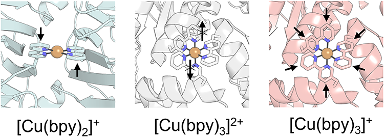
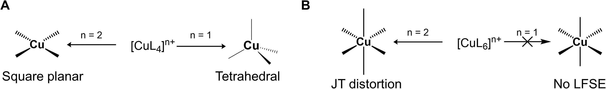
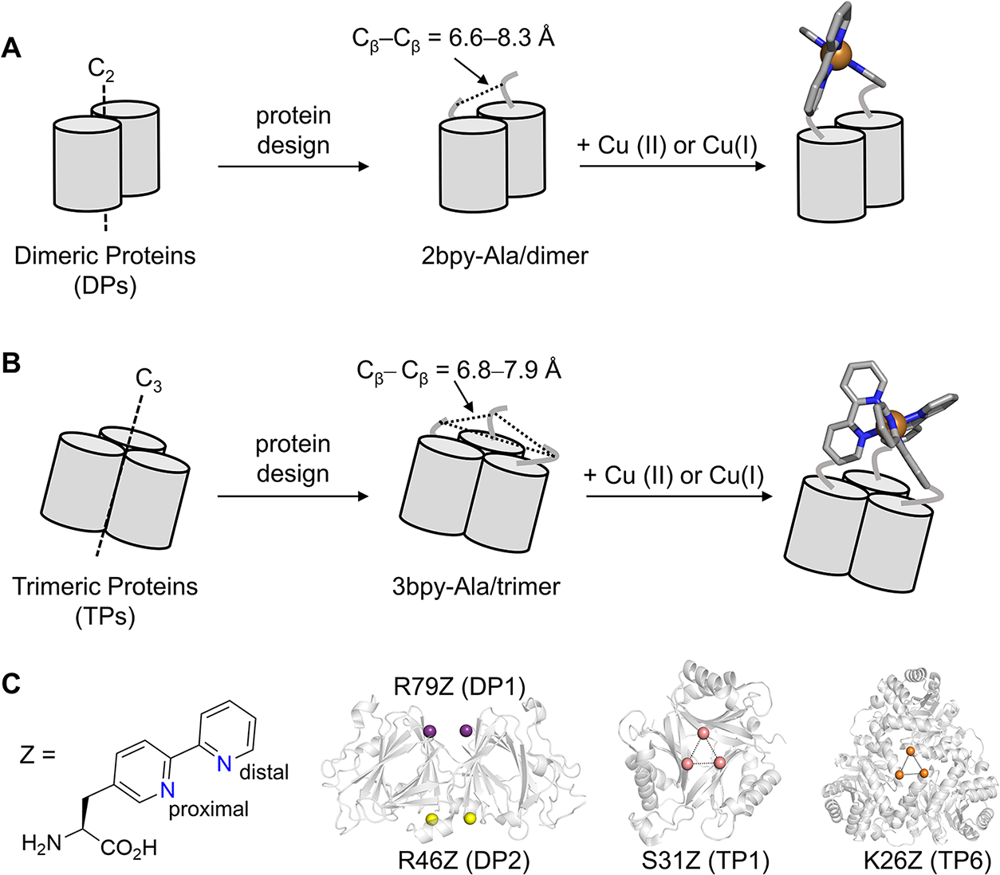
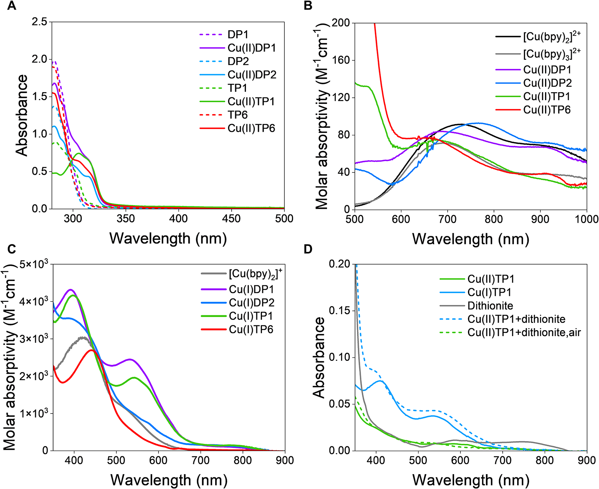
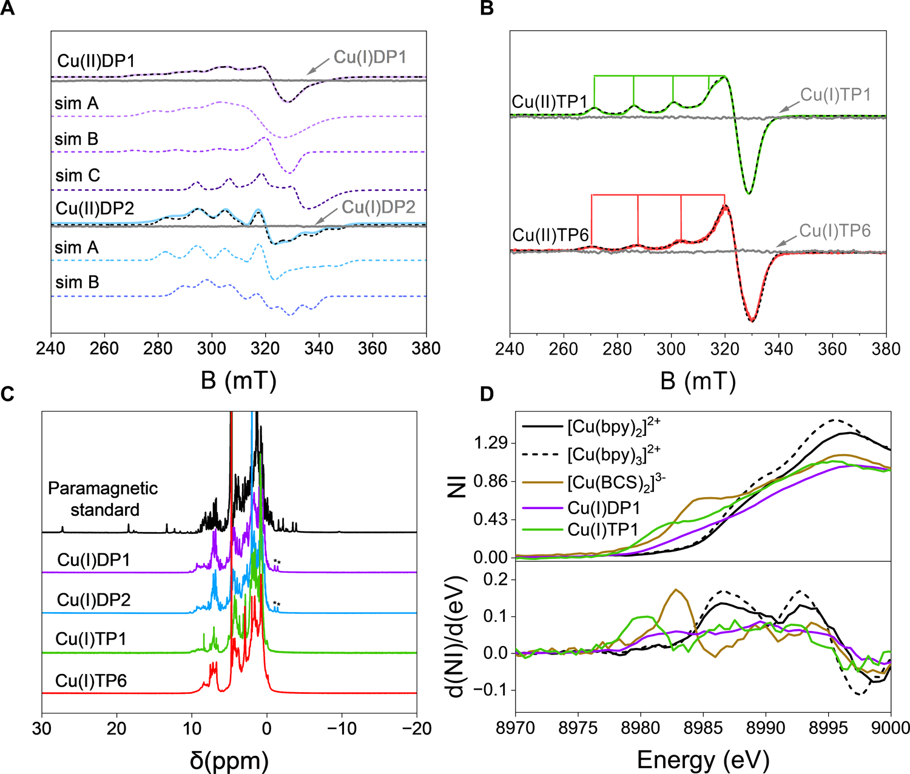
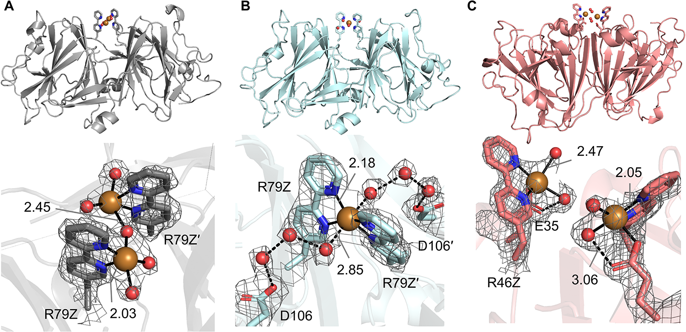
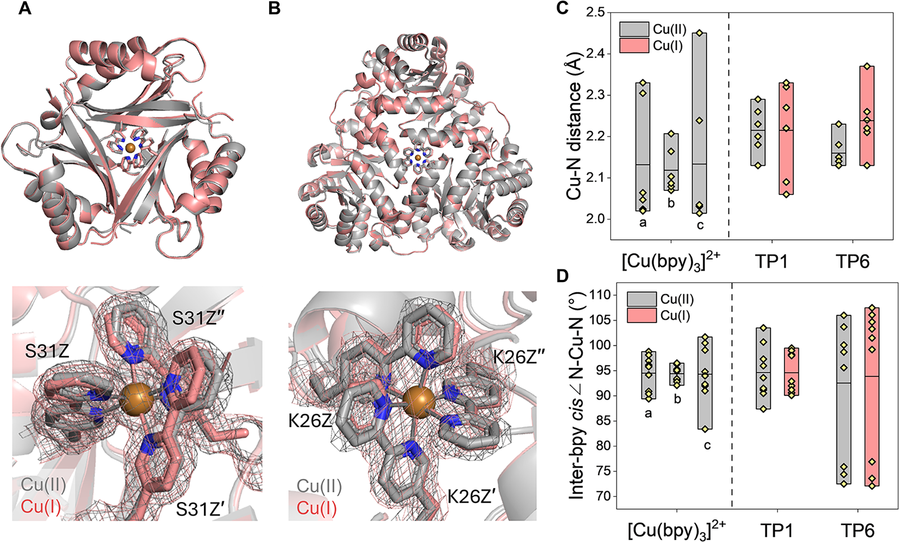
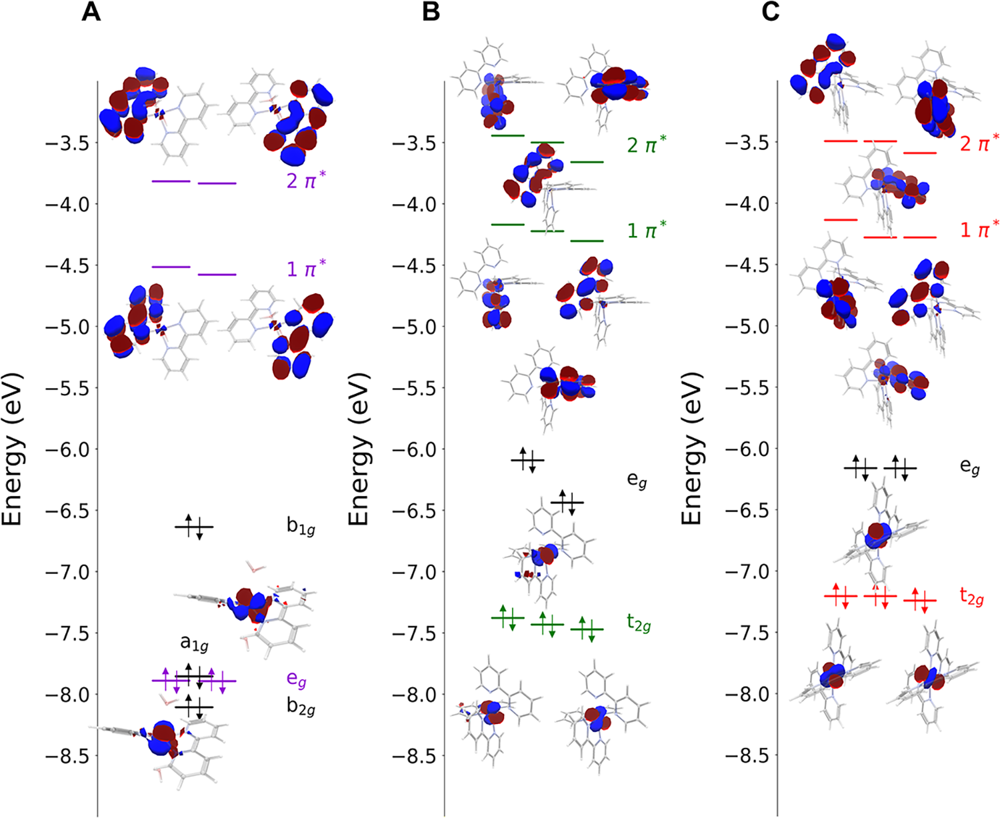
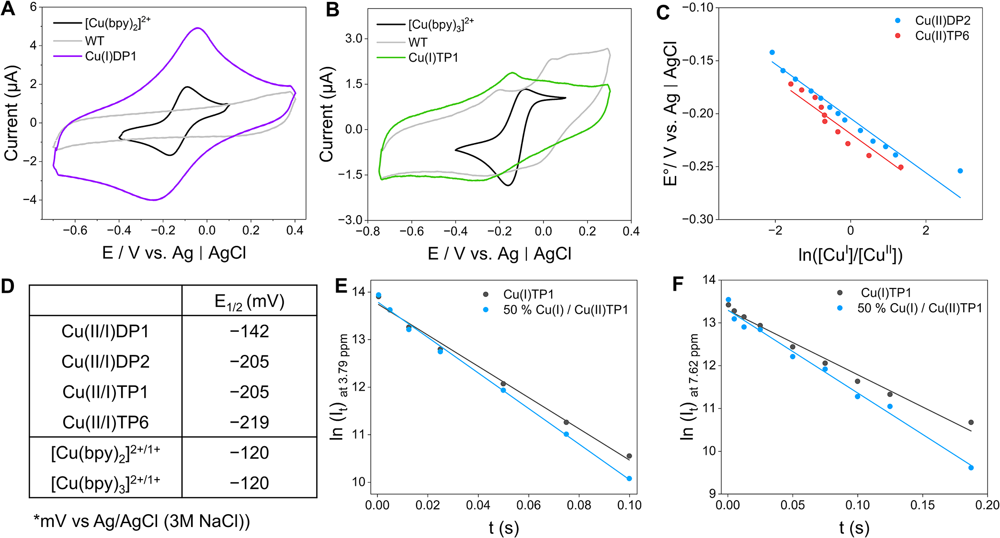

# 蛋白质迫使铜配合物打破经典配位规则：从Jahn-Teller畸变到前所未有的八面体Cu(I)

## 本文信息

- **标题**：蛋白质强制的配体环境重塑铜多联吡啶配合物中的经典配位偏好
- **作者**：Inseo Choi, Jaehee Lee, Kyohyun Hwang, Sebastian Kunze, Jae Wan Park, Seung Jun Hwang, Jongwoo Lim, Seunghoon Lee, Woon Ju Song*
- **发表期刊**：Journal of the American Chemical Society（JACS）
- **发表时间**：2026年（Advance Article）
- **DOI**：https://doi.org/10.1021/jacs.6c09177
- **单位**：Seoul National University（首尔国立大学），Korea；Pohang University of Science and Technology（POSTECH），Korea；KAIST，Korea
- **引用格式**：Choi, I., Lee, J., Hwang, K., Kunze, S., Park, J. W., Hwang, S. J., Lim, J., Lee, S., & Song, W. J. (2026). Protein-Enforced Ligand Environments Reshape Classical Coordination Preferences in Copper Polypyridyl Complexes. *J. Am. Chem. Soc.* Advance Article. https://doi.org/10.1021/jacs.6c09177
- **代码与数据**：PDB codes 23EI (Cu(II)DP1), 23EG (Cu(I)DP1), 23EF (Cu(II)DP2), 23EO (Cu(II)TP1), 23EQ (Cu(I)TP1), 24FO (Cu(II)TP6), 24GZ (Cu(I)TP6)

## 摘要

> 铜配位化学受几个公认特征的支配：八面体Cu(II)配合物的Jahn-Teller畸变，以及高配位数Cu(I)物种的匮乏。本文证明，蛋白质支架可以作为机械活性配体架构，改变这些内在的电子和结构偏好。研究者设计了四个蛋白质支架，预组织两个或三个联吡啶-丙氨酸非天然氨基酸，生成单核铜位点，分别处于Cu(II)或Cu(I)氧化态。这些蛋白质嵌入配合物表现出**独特的电荷转移特征、显著降低的Jahn-Teller畸变、前所未有的八面体Cu(I)几何构型、显著阴移的氧化还原电位**，以及与刚性态（entatic-state）行为一致的快速自交换速率常数。这项工作确立了蛋白质基多齿配体作为获取非常规配位环境、扩展金属蛋白化学空间和反应性的通用策略。

### 核心结论

- **蛋白质支架可改变铜配位化学的经典偏好**：通过预组织的联吡啶配体环境，蛋白质的机械约束使铜配合物偏离其在小分子体系中的天然几何构型
- **Cu(II)的Jahn-Teller畸变被显著抑制**：Cu(II)DP1和Cu(II)TP1等蛋白嵌入配合物的d-d跃迁峰位相比溶液态$\ce{[Cu(bpy)2]^{2+}}$发生约40 nm位移，结构对称性明显提高
- **前所未有的八面体Cu(I)几何构型**：Cu(I)TP1和Cu(I)TP6呈现出接近理想八面体的六配位Cu(I)，这在经典铜配位化学中极为罕见
- **氧化还原电位显著阴移**：Cu(II/I)DP1和Cu(II/I)TP1的$E_{1/2}$分别为$-142~\mathrm{mV}$和$-205~\mathrm{mV}$，表明蛋白质几何约束稳定了Cu(I)态
- **快速电子自交换速率**：Cu(II)TP1和Cu(I)TP1之间的电子自交换速率常数约$2.2\times10^4~\mathrm{M^{-1}s^{-1}}$，与蓝色铜蛋白的刚性态（entatic state）行为一致

## 背景

### 铜配位化学的经典规则

铜的配位化学受两条根深蒂固的约束支配：

- **Jahn-Teller畸变**。Cu(II)的电子构型为$\ce{d^9}$，在八面体配位场中，$\mathrm{t_{2g}^6 e_g^3}$的占据导致$\mathrm{e_g}$轨道简并，根据Jahn-Teller定理，体系会通过几何畸变降低对称性以消除简并。典型结果是拉长或压扁的八面体，轴向Cu-N键明显长于赤道键。这在溶液中的$\ce{[Cu(bpy)2]^{2+}}$等配合物中普遍存在。
- **高配位数Cu(I)的匮乏**。Cu(I)为$\ce{d^{10}}$闭壳层构型，理论上不具备配体场稳定化能（LFSE）的驱动力——增加配体只获得成键能，却要承担额外的空间排斥、金属中心拥挤以及锁定成八面体的构象代价。
  - Cu(I)是**较软的Lewis酸**，与P、S、卤素和软氮供体形成强而方向性的共价作用，少数强配体就已满足电子需求，没有必要再塞入六个配体。
  - 实际中最常见的几何构型包括：**二配位线形、三配位平面三角形和四配位四面体**——四面体倾向主要来自空间因素，而非电子效应
  - 配位数达到六往往伴随配体解离和配合物分解。**Cu(I)在含水溶液中还天然倾向歧化为Cu(II)和Cu(0)**，让高配位Cu(I)在水相中更难稳定
  - 作为对比：**同为$\ce{d^{10}}$的$\ce{Zn(II)}$**却可以有六配位（如六水合$\ce{[Zn(H2O)6]^{2+}}$），因为$\ce{Zn^{2+}}$电荷更高（静电吸引更强）、是较硬的Lewis酸（与水、氧供体结合良好），且几何能量面更平坦，配体由四至六配位变化能垒低。

这两条约束共同定义了铜配合物的可及化学空间。然而，自然界中的蓝色铜蛋白提供了一个经典反例：在azurin（铜蓝蛋白）、质体蓝素（plastocyanin）等体系中，蛋白质支架将Cu(II)固定在一个介于四方平面和四面体之间的中间几何构型——这种构型被称为**刚性态**（entatic state）。这种几何预组织最小化了氧化还原循环中的结构重排，使电子转移速率比溶液态铜配合物快数百倍。

> 刚性态（entatic state）的核心思想：蛋白质支架通过机械约束，将金属中心锁定在一个既不利于Cu(II)也不利于Cu(I)的几何构型上，从而降低氧化还原过程中的结构重排能垒，加速电子转移。

**蛋白质作为配体的独特优势**在于：蛋白质骨架不仅是静态的配体，更是具有**机械活性**的三维架构。通过蛋白质骨架的拓扑结构和序列-结构关系，可以将多个配体基团预组织在精确的几何位置上，并对金属中心施加持续的机械应力。这种应力可以在能量上预组织配合物，使其偏离天然几何构型，降低氧化还原循环中的结构重排能垒。

**Scheme 1：铜配合物在 +2 和 +1 氧化态下的偏好配位几何**。L 代表单齿中性配体，n 表示总电荷

- (A) 四配位几何：Cu(II) 倾向四方平面构型，Cu(I) 倾向四面体构型
- (B) 六配位几何：Cu(II) 在八面体场中因 Jahn-Teller 畸变（JT）发生键长不等，Cu(I) 因无配体场稳定化能（LFSE）倾向配体解离

受这一自然启发，合成化学家们开发了各种位阻受限的合成配体框架来模拟刚性态行为。但这些小分子配体在触及铜配位化学更多维度（尤其是高配位数Cu(I)）方面**仍然力所不及**。

本研究的核心假设是：**如果蛋白质支架能够通过机械约束将铜配合物锁定在一个偏离其天然偏好的几何构型上**，那么这种预组织不仅会改变配合物的结构特征，还会改变其光谱、氧化还原和动力学性质——而所有这些效应都可以被实验直接测量。

### 关键科学问题

- **蛋白质能否对金属中心施加足够的机械应力，覆盖由电子构型决定的固有偏好**，还是只能提供另一种配位环境？之前的蛋白质工程（blue/red/purple copper proteins）已经证明蛋白质可以调节铜配位几何，但那些体系中的蛋白质只是容器，铜的几何构型仍服从其天然偏好。
- **蛋白质能否强制铜偏离其天然几何**，达到小分子配体无法实现的结构？如果答案是肯定的，蛋白质配体的本质就不是大分子配体，而是机械活性架构。
- **蛋白质能否在Cu(II)和Cu(I)两种氧化态之间同时维持非经典几何**？刚性态（entatic state）的核心前提是两种氧化态的几何结构差异极小。如果蛋白质只能稳定其中一种氧化态，另一种发生结构重排或配体解离，那么所谓的预组织并未降低氧化还原能垒，整个刚性态论证就不成立。
  - 论文通过比较Cu(II)TP1和Cu(I)TP1的晶体结构——两者几何几乎一致——直接回答了这个问题。
- **蛋白质强制的几何约束能否产生可测量的功能改善**？仅仅获得一个不寻常的结构并不等于解决了任何问题。如果氧化还原电位、电子转移速率这些可测量的功能指标没有改善，那么这些结构上的改变意义就很有限。
  - 文章用循环伏安法（$E_{1/2}$分别为$-142$和$-205~\mathrm{mV}$，相比无蛋白质配合物显著阴移）和NMR自交换速率测定（$2.2\times10^4~\mathrm{M^{-1}s^{-1}}$，与天然蓝色铜蛋白相当）回答了这个问题。

### 创新点

- **利用蛋白质对称性预组织配体的机械编程策略**：利用C2、C3对称性预组织配体间距和角度，使多个bpy-Ala残基围绕单一铜中心汇聚，形成刚性的短共价连接
  - 与**此前蛋白质工程常用长柔性linker**的方法有本质区别，能直接耦合蛋白质骨架和金属中心的机械应力。
- **稳定的六配位八面体Cu(I)配合物**：六个氮供体支持的八面体Cu(I)——在合成配合物和天然金属蛋白中都极为罕见，因为Cu(I)天然倾向四面体构型且易发生配体解离
  - 本文在蛋白质强制下维持了六配位，Cu(I)TP1的cis-N-Cu-N角94.6°、最大偏差9.4°；Cu(I)TP6平均92.5°、最大偏差33.5°。两者均显著优于无蛋白质环境的$\ce{[Cu(bpy)3]^{2+}}$参照（$\Delta_{ax-eq}$可达0.44 Å）。
- **Cu(II)的Jahn-Teller畸变在蛋白质强制下被显著抑制**：d-d跃迁峰相对溶液态$\ce{[Cu(bpy)2]^{2+}}$发生约40 nm位移，结构对称性明显提高，表明蛋白质几何约束确实能改变Cu(II)的固有电子-结构偏好。
- **自下而上设计体系实现了刚性态行为**：电子自交换速率$2.2\times10^4~\mathrm{M^{-1}s^{-1}}$与天然蓝色铜蛋白rusticyanin相当，而且是在蛋白质环境未优化encounter complex形成的情况下实现的
  - 通过突变去除表面暴露位点附近的带电残基，自交换速率还有进一步提升的空间。

## 方法设计：对称性适配的蛋白质配体设计策略

### 核心思路：将蛋白质的对称性与金属配位几何匹配

研究者采用了一种巧妙的对称性适配策略：**在具有C2或C3对称性的同源寡聚蛋白质中，将非天然氨基酸bpy-Ala引入对称性匹配的位点，使多个bpy配体围绕单一铜中心汇聚**。

**bpy-Ala**（联吡啶-丙氨酸，记为Z）是一种含有2,2'-联吡啶配体的非天然氨基酸，其侧链的联吡啶单元可以作为强场二齿配体与铜配位。在野生型蛋白质中，将精氨酸或其他氨基酸突变为Z，即可在蛋白质骨架中引入联吡啶配体。

**图1：蛋白质设计以预组织两个或三个bpy-Ala残基用于单核铜结合**。
- (A) 二聚体蛋白质支架用于形成$\ce{[Cu(bpy)2]^{n+}}$配合物；(B) 三聚体蛋白质支架用于形成$\ce{[Cu(bpy)3]^{n+}}$配合物；
- (C) bpy-Ala（Z）结构以及三种选定的蛋白质支架（PDB 1EP0、1VFJ和1QWG分别对应DP1-2、TP1和TP6）。彩色球体表示用于bpy-Ala引入的突变位点。

### 四个蛋白质设计的详细参数

基于对Cβ-Cβ距离的结构分析，研究者构建了四个bpy-Ala变体，分别采用具有不同对称性和配体间距的寡聚蛋白质骨架：其中**DP代表dimeric（二聚体）变体，TP代表trimeric（三聚体）变体**，数字代表突变位点编号。

| 蛋白质 | 对称性 | 母体蛋白质 | 突变位点 | Cβ-Cβ距离 (Å) |
|--------|--------|-----------|---------|--------------------|
| **DP1** | C2 | DTDP-6-deoxy-D-xylo-4-hexulose 3,5-epimerase | R79Z | 6.6 |
| **DP2** | C2 | 同上 | R46Z | 8.3 |
| **TP1** | C3 | GlnK（氮敏感调控蛋白） | S31Z | 6.8 |
| **TP6** | C3 | Phosphosulfolactate synthase | K26Z | 7.9 |

设计的关键挑战在于：既要通过蛋白质骨架施加足够的机械约束来**扭曲铜的天然配位偏好**，又要维持目标几何构型**不导致配体解离或蛋白质变性**。Cβ-Cβ距离的选择直接决定了两个或三个联吡啶配体围绕铜中心的汇聚角度和配位键长。

## 研究结果

### 结果一：UV-vis光谱证实铜与联吡啶配体的选择性结合

**UV-vis（紫外-可见吸收光谱）测量的是样品对多少光有吸收**。当铜离子结合到联吡啶配体上时，bpy配体上的π→π\*跃迁（电子在分子轨道间跳动的能量）会发生变化，导致吸收峰位置移动，这是判断铜是否配位的直接方法。

四个蛋白质变体（DP1、DP2、TP1、TP6）在加入Cu(II)后，均在306-318 nm区域立即出现吸收峰增加，伴随280 nm处的吸收下降和约295 nm处的等吸收点（等吸收点=所有物种在某波长处吸收强度相同，反应前后总吸收不变的位置，说明是单一反应过程），这表明**π→π\*跃迁发生红移**，与Cu(II)与联吡啶配体的配位一致。滴定实验给出了各变体达到饱和所需的Cu(II)当量（Figure S7）：

- **DP1在加入1当量Cu(II)（每二聚体）时即达到饱和**，表明两个bpy配体成功汇聚于单一铜中心，形成目标$\ce{[Cu(bpy)2]^{2+}}$配合物
- **DP2需要多达2.5当量Cu(II)才能达到饱和**，暗示R46Z位点（DP2的bpy-Ala位点）的Cu结合亲和力显著低于R79Z位点（DP1的位点）。**失败原因来自局部结构差异**：R46Z位的Cβ−Cβ距离为8.3 Å（远离设计目标7.5 Å），加上该区域loop柔性和邻近残基相互作用不同，可能只形成了$\ce{[Cu(bpy)]^{2+}}$（1:1）而非设计目标$\ce{[Cu(bpy)2]^{2+}}$（1:2）
- **TP1和TP6均在加入1当量Cu(II)（每三聚体）时达到完全光谱变化**，表明三个bpy配体选择性汇聚形成$\ce{[Cu(bpy)3]^{2+}}$

饱和当量给出了“比多少”的答案，接下来用d-d跃迁看“配成了什么几何”。d-d跃迁指的是Cu(II)的d电子在不同能级轨道间跃迁产生的吸收峰，其峰位**对金属配体比和配位几何高度敏感**。由于d-d跃迁是Laporte禁阻的（中心对称体系中$\mathrm{g \to g}$跃迁不允许），消光系数很低（$\varepsilon$通常仅10–100 $\mathrm{M^{-1}cm^{-1}}$），需要高浓度样品（2 mM）才能获得可分辨的信号。图2(B)显示Cu(II)结合变体的d-d跃迁如下：

| 物种 | $\lambda_{\max}$ (nm) | $\varepsilon$ ($\mathrm{M^{-1}cm^{-1}}$) |
|------|----------------------|------------------------------------|
| Cu(II)DP1 | 683 | 84.0 |
| Cu(II)DP2 | 759 | 92.7 |
| Cu(II)TP1 | 687 | 74.0 |
| Cu(II)TP6 | 670 | 78.0 |
| 参照$\ce{[Cu(bpy)2]^{2+}}$ | 720 | 91.2 |
| 参照$\ce{[Cu(bpy)3]^{2+}}$ | 684 | 71.2 |

> Cu(II)DP1的d-d峰在683 nm，比$\ce{[Cu(bpy)2]^{2+}}$参照（720 nm）**往短波偏了37 nm**；Cu(II)DP2反而偏到了759 nm，**往长波方向偏了39 nm**——两者偏离方向相反，**DP2的偏离不仅来自蛋白质几何约束，更可能因为实际形成的是$\ce{[Cu(bpy)]^{2+}}$而非$\ce{[Cu(bpy)2]^{2+}}$**。Cu(II)TP1（687 nm）和Cu(II)TP6（670 nm）则**几乎落在$\ce{[Cu(bpy)3]^{2+}}$参照（684 nm）上**，证明三聚体支架下三个bpy配体确实汇聚成了目标八面体几何。

**图2：铜结合bpy-Ala变体的UV-vis吸收光谱**。所有测量在50 mM硼酸、150 mM NaCl、pH 8.0缓冲液中进行

- (A) 向apo形式的bpy-Ala突变体（虚线）中添加Cu(II)后的吸收光谱（实线），浓度分别为DP1 14.7 μM、DP2 21 μM、TP1 17.6 μM、TP6 16.6 μM——**所有四个变体在306-318 nm区域立即出现吸收峰增加，伴随280 nm处的吸收下降和约295 nm的等吸收点，表明Cu(II)与bpy配体配位**
- (B) Cu(II)结合bpy-Ala变体的d-d跃迁区（2 mM）——**DP1往短波偏、DP2往长波偏，方向相反；TP1/TP6接近$\ce{[Cu(bpy)3]^{2+}}$参照**
- (C) Cu(I)结合蛋白质的MLCT带——**Cu(I)态的光学特征与Cu(II)态的d-d带完全分离**
- (D) Cu(II)结合的TP1 (20 μM)先加0.5当量连二亚硫酸钠（2$\ce{e^-}$供体）将Cu(II)还原为Cu(I)，再暴露空气使Cu(I)重新氧化回Cu(II)——**MLCT特征带出现后又被消除，Cu(II)/Cu(I)在蛋白质结合状态下可逆转换**

**图3：bpy-Ala变体的多技术光谱表征**，在20 K（EPR）/298 K（NMR）下测量

- (A) 二聚体Cu(II)物种在20 K下的**EPR光谱**（彩色实线=实验光谱，虚线=模拟光谱sim A-C）：**Cu(II)DP1至少含三种物种**，两个主导组分（sim A、sim B）与$\ce{[Cu(bpy)2(OH2)2]^{2+}}$型水合物的轴向EPR信号一致
- (B) 三聚体Cu(II)物种在20 K下的EPR光谱：**Cu(II)TP1和Cu(II)TP6呈现良好的轴向信号**，参数与溶液态$\ce{[Cu(bpy)3]^{2+}}$接近
- (C) Cu结合蛋白质在298 K下的$\ce{^1H}$ **NMR光谱**：Cu(I)DP1/DP2有两个特征单峰位于-1.04和-1.46 ppm——芳香环磁各向异性场中强屏蔽脂肪族质子的特征，**证明Cu(II)被完全还原成抗磁性的$\ce{d^{10}}$ Cu(I)**
- (D) Cu K-edge **XANES光谱**（X射线吸收近边结构，通过测量Cu原子对X射线的吸收边能量来判断氧化态和配位环境；Cu(I)DP1 8983 eV，Cu(I)TP1 8980 eV，Cu(II)DP1 8996 eV）：**Cu(I)TP1比Cu(I)DP1红移3 eV**，提示三聚体的Cu(I)中心与二聚体有显著差异——与后面晶体结构揭示的八面体几何一致

> Figure 3四路光谱的结论：(A)(B)的EPR多组分信号说明**Jahn-Teller畸变在溶液中并未消失**——蛋白质骨架在溶液中仍有柔性，晶体中的对称性约束是骨架+晶体接触共同施加的静态约束，与溶液动态行为不完全等价；(C)NMR两个特征峰证明Cu(II)→Cu(I)还原完全；(D)XANES吸收边的红移直接给出Cu(I)TP1与Cu(I)DP1的电子结构差异。

### 结果二：Cu(I)物种的稳定形成与前所未有的几何构型

**MLCT（金属到配体电荷转移）是Cu(I)的特征光学信号**：当Cu(I)吸收光后，一个电子从Cu(I)的d轨道跳到联吡啶配体的π\*轨道上，产生特征吸收峰。只有Cu(I)态才有MLCT，Cu(II)没有，所以看到MLCT就直接证明Cu(I)存在。

将Cu(I)加入各蛋白质，所有蛋白质（除DP2外）在1当量Cu(I)即达到饱和。Cu(I)物种的MLCT吸收特征汇总如下：

| 物种 | MLCT峰位 (nm) | $\varepsilon$ ($\mathrm{M^{-1}cm^{-1}}$) | 形状特征 |
|------|------------------|------------------------------------|----------|
| Cu(I)DP1 | 390 / 535 | 4310 / 2440 | 双宽吸收带 |
| Cu(I)DP2 | 400（中心） | 3510 | 单宽峰，肩部延伸至600 nm |
| Cu(I)TP1 | 400 / 540 | 4160 / 1960 | 双吸收带 |
| Cu(I)TP6 | 445（中心） | 2690 | 单宽峰，肩部延伸至750 nm |

Cu(I)DP1的双带特征与$\ce{[Cu(bpy)2]^{+}}$类似配合物（如$\ce{[Cu(dpphen)2]^{+}}$）的MLCT跃迁一致，**确认了Cu(I)物种的成功形成**。Cu(I)TP1和Cu(I)TP6表现出与Cu(I)DP1类似的MLCT特征，但由于$\ce{[Cu(bpy)3]^{+}}$类似配合物的UV-vis数据此前从未被报道，无法直接比较。

**图4：二聚体蛋白质的X射线晶体结构及放大的铜结合位点**。(A) Cu(II)DP1 (B) Cu(I)DP1 (C) Cu(II)DP2。电子密度图在$\sigma = 1.0$处显示。橙色和红色球体分别代表Cu和水衍生分子。

晶胞里Cu(II)DP1形成的是μ-$\ce{OH_{x}}$桥联的双核物种$\ce{[Cu(bpy)(OH_{x})_{2}]_{2}}$，每个Cu(II)只与一个bpy配体配位（1:1而非设计目标的1:2），**两Cu-Cu距离仅4.73 Å**——结晶条件下过量Cu(II)不可避免，导致意外化学计量。

Cu(I)DP1的厌氧结晶+速冻条件则得到了设计目标：每个二聚体通过C2对称轴在两个单体界面处形成$\ce{[Cu(bpy)2]^{+}}$，Cu(I)正好落在C2轴上，两个bpy等价位点。Cu(II)DP2的R46Z位点只解出了Cu(II)结构，**每个单体各形成$\ce{[Cu(bpy)(Glu)(OH2)2]}$五配位四方锥物种**（$\tau_5 = 0.31$，$\tau_5$描述五配位几何：0=完美四方锥，1=完美三角双锥）——DP2的真实配位化学就是bpy+Glu+水，根本没实现设计目标。

### 结果三：X射线晶体结构揭示前所未有的配位几何

> 七个晶体结构（分辨率1.73–2.67 Å）中，DP1的Cu(II)态是**结晶artifact**（μ-$\ce{OH_{x}}$双核桥联），DP2的Cu(I)态未结晶成功；三聚体TP1/TP6的Cu(II)和Cu(I)态全部成功，Cu(I)TP1和Cu(I)TP6**首次给出了八面体Cu(I)的晶体学证据**。

**图5：三聚体蛋白质的X射线晶体结构**。

- (A) Cu(II)TP1（灰色）和Cu(I)TP1（浅品红）的叠合结构
- (B) Cu(II)TP6（灰色）和Cu(I)TP6（浅品红）的叠合结构
- (C) Cu-N键长箱线图；(D) bpy间顺式N-Cu-N键角箱线图
- a、b、c分别对应CCDC 2048918、640435、654782（小分子$\ce{[Cu(bpy)3]^{2+}}$参照）。电子密度图在$\sigma = 1.0$处显示。箱线图中实线表示平均值
- 叠合结构直接展示Cu(II)和Cu(I)态几何对比——TP1和TP6中Cu(I)为前所未见的**六配位八面体Cu(I)**；箱线图汇总了Cu-N键长和cis-N-Cu-N键角的统计分布

#### Cu(I)DP1：介于四方平面和八面体之间的几何构型

Cu(I)DP1的厌氧结晶得到了设计目标——每个二聚体通过晶体学2重对称轴形成$\ce{[Cu(bpy)2]^{+}}$，Cu(I)落在C2轴上。与传统$\ce{[Cu(bpy)2]^{2+}}$（四方平面）和$\ce{[Cu(bpy)2]^{+}}$（四面体）不同，**Cu(I)DP1的Cu(I)中心呈现出介于畸变四方平面和假八面体之间的配位环境**：

- 两个联吡啶配体之间的**二面角为32.6°**，$\tau_4$值为0.34（$\tau_4$是描述四配位几何的指标：0=完美四方平面，1=完美四面体）
- 这接近于$\ce{[Cu(bpy)2]^{2+}}$的35.1°和0.34，**而非$\ce{[Cu(bpy)2]^{+}}$的72.5°和0.69**——被蛋白质骨架强行从天然四面体拉到了四方平面区

> **Cu(I)DP1的几何构型几乎完全借用了Cu(II)的几何偏好**——蛋白质骨架把Cu(I)从天然四面体（$\tau_4$≈0.69）拉到了Cu(II)的四方平面区（$\tau_4$=0.34）。
- bpy配体间的cis N-Cu-N角度差异也只有3°（`N_proximal`对）和16.7°（`N_proximal`对），远小于游离$\ce{[Cu(bpy)2]^{+}}$的20.1°
- 蛋白质强制的几何构型允许**两个水分子以弱轴向方式关联**，Cu-O距离为2.85 Å（反式构型），并通过氢键与周围溶剂分子和D106侧链相互作用

Cu-N键长（2.07-2.24 Å，平均2.18 Å）略长于Cu(II)DP1以及小分子$\ce{[Cu(bpy)2]^{2+}}$（1.99 Å）和$\ce{[Cu(bpy)2]^{+}}$（2.03 Å）配合物，与还原过程中反键轨道的占据一致。

#### Cu(I)TP1和Cu(I)TP6：前所未有的八面体Cu(I)

> 三聚体的Cu(I)呈现出**前所未有的六配位八面体几何**——Cu(I)在经典铜化学中天然倾向四面体，这里被蛋白质骨架强制拉进八面体配位场。

三聚体结构参数与小分子参照的对比如下：

| 物种 | Cu-N范围 (Å) | Cu-N平均 (Å) | 键长分布 (Å) | cis-N-Cu-N角 | 角度偏差 |
|------|-------------|-------------|-------------|-------------|---------|
| **Cu(I)TP1** | 2.06-2.33 | 2.22 | 0.27 | 94.6° | 9.4° |
| **Cu(I)TP6** | 2.13-2.37 | 2.24 | 0.24 | 92.5° | 33.5° |
| 参照$\ce{[Cu(bpy)3]^{2+}}$ | 赤道2.01-2.10, 轴向2.16-2.45 | 赤道2.05, 轴向2.28 | $\Delta_{ax-eq}$=0.44 | — | 大 |

**两个三聚体的关键差别**：
- **Cu(I)TP1的对称性显著高于Cu(I)TP6**：Cu(I)TP1的平均cis-N-Cu-N角94.6°（角度偏差仅9.4°），**其中一个bpy配体的两根Cu-N键被拉长到2.32-2.33 Å**，其他bpy在2.06-2.27 Å——Cu(I)TP1不是完美对称的八面体，而是接近两个bpy强配位+一个bpy弱配位的不对称几何，Cu(II)TP1没有这个特征
- Cu(I)TP6的Cu-N平均2.24 Å、键长分布0.24 Å（2.13-2.37 Å），整体均匀但角度更分散——TP6更大的角度偏差源于**bpy-Ala含两个不等价N**（`N_proximal`和`N_distal`）以及TP6局部结构特征

Cu(I)TP1和Cu(I)TP6都没有达到理想$\ce{[Cu(bpy)3]^{+}}$的对称性——前者表现为两强一弱的不对称配位，后者因bpy不等价N而角度发散。这种偏离理想几何的现象，正是蛋白质骨架机械应力逐配体施加的结果。

> Cu(I)在配位化学里出了名的爱走偏锋——$\ce{d^{10}}$满壳层、没有JT驱动，总是倾向于低配位数、低对称性的四面体或四方平面。此前所有已知Cu(I)配合物都遵循这一偏好，**蛋白质约束下维持的六配位Cu(I)是铜配合物晶体学中首次给出的可靠证据**。

Cu(II)态和Cu(I)态晶体结构高度叠合、Cu-N键长几乎不变，是**刚性态原理最直接的证据**：氧化还原循环中铜中心几乎不需要结构重排，为后面快速电子自交换速率提供了结构基础。

**图6：(A) Cu(I)DP1 (B) Cu(I)TP1 (C) Cu(I)TP6的TD-DFT轨道分析图**。对MLCT带贡献的轨道用颜色突出显示：
- (A) Cu(I)DP1中，紫色/红色区域为$\mathrm{e_g}$轨道（MLCT供体），绿色/红色区域为bpy配体的π\*轨道（MLCT受体）
- (B) Cu(I)TP1中，紫色区域为$\mathrm{t_{2g}}$轨道（MLCT供体），绿色/红色区域为bpy配体的π\*轨道（MLCT受体）
- (C) Cu(I)TP6中，紫色区域为$\mathrm{t_{2g}}$轨道（MLCT供体），绿色/红色区域为bpy配体的π\*轨道（MLCT受体）

### 结果四：TD-DFT计算解释光谱特征

**TD-DFT（含时密度泛函理论）是一种计算分子吸收光谱的量子化学方法，可以预测一个分子吸收什么波长的光、为什么吸收。** 基于Cu(I)DP1（假四方平面）、Cu(I)TP1和Cu(I)TP6（八面体）的X射线晶体结构，研究者进行了TD-DFT计算。计算在350-600 nm区域内的光学光谱与实验测得的光谱吻合良好，并确认了实验光谱就是MLCT（Cu d轨道→bpy配体π\*轨道）跃迁。

关键轨道分析：
- **Cu(I)DP1**：MLCT源自$\mathrm{e_g}$轨道到bpy配体的1π\*和2π\*轨道
- **Cu(I)TP1和Cu(I)TP6**：MLCT源自$\mathrm{t_{2g}}$轨道到bpy配体的1π\*和2π\*轨道

**这个d轨道起源的差异——$\mathrm{e_g}$ vs $\mathrm{t_{2g}}$——直接反映了蛋白质强制几何构型对d轨道能级分裂方式的系统性改变**。在四方平面Cu(I)DP1中，d轨道分裂模式接近平面正方形配合物，$\mathrm{e_g}$轨道能量较高且与配体π\*轨道有较好的重叠；在八面体Cu(I)TP1/TP6中，d轨道分裂遵循标准的八面体模式，$\mathrm{t_{2g}}$轨道处于较低能量位置。

> 几何决定了d轨道能级排序，d轨道能级排序决定了MLCT跃迁从哪些轨道出发——这是TD-DFT计算最直接的物理意义。

#### Cu(I)TP6的独特不对称性

DFT优化几何结构显示一个bpy配体相对于其他两个配体发生**不对称扭转畸变**，导致MLCT光谱的显著不对称性。

> 这种扭曲的选择性效应在于：它可能选择性保留一个π\*受体轨道的d/π\*重叠，同时削弱其余轨道的重叠，从而产生独特的光谱特征。

**图7：Cu结合bpy-Ala变体的氧化还原性质**。
- Cu结合的（A）DP1与（B）TP1的循环伏安法与相应的铜联吡啶配合物和野生型蛋白质（WT）叠加。(C) 亚甲基蓝的比色滴定实验和线性拟合到Nernst方程。(D) 半波电位总结。
- （E, F）通过测量Cu(I)TP1中选定共振峰的横向弛豫时间（$T_2$）确定电子自交换速率常数：（E）3.79 ppm处的共振峰，（F）7.62 ppm处的共振峰。两个峰分别被暂定为**接近Cu结合位点的残基质子**和**bpy配体质子**。斜率代表$-1/T_2$，其中总CPMG序列时间（t）对选定共振的积分面积的自然对数作图。

### 结果五：氧化还原性质和电子自交换速率

**循环伏安法**（CV）对样品施加变化的电压并记录电流，氧化还原峰的位置（$E_{1/2}$，半波电位）直接反映Cu(II)和Cu(I)之间转换的难易程度——**电位越负，Cu(I)态越稳定**。CuDP2和CuTP6的CV不可靠，改用亚甲基蓝比色滴定（$E^{\circ\prime}=-220~\mathrm{mV}$）替代。

(E)(F)是NMR测自交换速率的原始数据：

- **自交换速率**（$k_{ex}$）：Cu(I)和Cu(II)之间直接交换电子的速度，**速率越快说明两种氧化态的结构差异越小**
- **测量方法**：跟踪3.79 ppm和7.62 ppm两个共振峰的横向弛豫时间（$T_2$），斜率$-1/T_2$对CPMG序列总时间$t$作图——1:1 Cu(I):Cu(II)混合物的信号弛豫比纯Cu(I)样品更快，**弛豫加快的幅度直接给出$k_{ex}$**

四个蛋白质变体的氧化还原电位和CuTP1的电子自交换速率汇总如下（电位参考Ag/AgCl（3 M NaCl））：

| 物种 | $E_{1/2}$ (mV) | 测量方法 | $k_{ex}$ ($\mathrm{M^{-1}s^{-1}}$) |
|------|----------------|----------|----------------------------------|
| Cu(I/II)DP1 | -142 | 循环伏安 | — |
| Cu(I/II)DP2 | -205 | 亚甲基蓝滴定 | — |
| Cu(I/II)TP1 | -205 | 循环伏安 | $2.2\times10^{4}$（平均3.79/7.62 ppm） |
| Cu(I/II)TP6 | -219 | 亚甲基蓝滴定 | — |
| 参照$\ce{[Cu(bpy)2]}/\ce{[Cu(bpy)3]}$ | -120 | 循环伏安 | — |

所有四个蛋白质嵌入配合物的$E_{1/2}$都比$\ce{[Cu(bpy)2]}$/$\ce{[Cu(bpy)3]}$参照（-120 mV）更负——蛋白质几何约束**稳定了Cu(I)态**（Cu(I)被优先稳定意味着还原态能量更低、Cu(II)态相对被抬升）

- 文献中已报道的1:1 Cu(bpy)蛋白$E_{1/2}$为+180和+250 mV；天然蓝色铜蛋白azurin、plastocyanin分别为+96和+166 mV
- 蛋白质嵌入的bpy-Ala设计**在所有类别中是最阴移的**

CuTP1的电子自交换速率常数通过NMR $T_2$弛豫测量得到，两个独立共振峰的结果高度一致（$2.3\times10^{4}$和$2.2\times10^{4}~\mathrm{M^{-1}s^{-1}}$）。与天然蓝色铜蛋白的对比：

| 蛋白质 | 类型 | $k_{ex}$ ($\mathrm{M^{-1}s^{-1}}$) |
|--------|------|----------------------------------|
| **CuTP1（本文）** | 设计蛋白 | $\mathbf{2.2\times10^{4}}$ |
| rusticyanin | 天然蓝色铜蛋白 | $1.7\times10^{4}$ |
| plastocyanin | 天然蓝色铜蛋白 | $2.0\times10^{4}$ |
| azurin | 天然蓝色铜蛋白 | $9.6\times10^{5}$（最快） |

CuTP1与rusticyanin和plastocyanin相当，但明显慢于azurin。CuTP1的环境未经特别优化以形成合适取向的encounter complex（相遇复合体，即电子转移发生前两个分子需要短暂靠近形成的瞬态复合物），这意味着通过表面电荷突变进一步提升速率仍有空间。

> 与蓝色铜蛋白相当的电子自交换速率，配合晶体结构中Cu(I)/Cu(II)几何的高度一致，是刚性态（entatic state）行为最直接的证据——铜中心在两种氧化态之间几乎不需要结构重排。自下而上（bottom-up）设计的金属蛋白在此之前展现刚性态行为极为罕见，本文是少数例证之一。

## 关键结论与批判性总结

### 优势：蛋白质作为机械活性配体的通用策略

- **改变了铜配位化学的两条核心约束**：抑制了Cu(II)的Jahn-Teller畸变，稳定了前所未有的八面体Cu(I)
- **结构-功能关系的完整证据链**：从蛋白质设计、UV-vis、EPR、NMR、XANES到X射线晶体结构和TD-DFT计算，七个独立结构的解析构成了极为完整的证据链
- **刚性态原理的成功验证**：蛋白质预组织配体环境确实能够最小化氧化还原循环中的结构重排，获得快速电子自交换速率，为设计人工金属蛋白提供了可行的结构基础

### 局限性与未来方向

1. **DP2位点的结合亲和力低**：DP2在R46Z位点需要2.5当量Cu(II)才能达到饱和，表明该设计尚未完全满足$\ce{[Cu(bpy)2]^{2+}}$的目标，需要进一步重新设计以优化局部结构特征（包括环柔性、Cβ-Cβ距离和邻近氨基酸相互作用）
2. **Cu(II)DP1晶体结构的意外化学计量比**：在结晶条件下，过量的铜离子不可避免，导致Cu:bpy化学计量比偏离预期，需要开发更严格的厌氧结晶策略来获得更清晰的结构
3. **蛋白质环境的优化空间**：虽然电子自交换速率与rusticyanin相当，但仍明显低于azurin。由于周围环境未经优化以形成适当取向的相遇复合体（encounter complex），通过突变（例如去除表面暴露金属位点附近的带电残基）可能进一步提高性能
4. **应用拓展的潜力**：这一策略理论上可扩展至其他过渡金属（如Fe、Mn、Co等），为扩展金属蛋白的化学空间和反应性提供通用平台。蛋白质强制的配体环境可以系统性覆盖小分子配体无法实现的化学空间。
5. **蛋白质设计的精确控制**：虽然本研究成功实现了Cu(I)和Cu(II)的稳定存在，但对蛋白质骨架的机械应力施加仍不够精确。未来需要更系统的蛋白质设计策略，实现对金属中心局部应变的定量调控，从而更精确地调节配合物的性质。
6. **从结构到功能的桥梁**：本研究提供了丰富的结构信息，但距离实际应用（如催化、传感、光化学等）仍有距离。未来的工作需要在维持几何约束的同时，优化蛋白质表面的电荷分布和动态特性，以促进底物接近和产物释放等关键功能步骤。

> **核心洞见**：蛋白质的机械约束不仅是一种几何限制，更是一种**能量预组织**——通过强制配合物偏离其天然几何构型，将部分能量预存于配合物中，从而在氧化还原过程中释放，降低结构重排能垒。这正是刚性态（entatic state）的本质，也是蛋白质能够改变铜配位化学偏好的底层逻辑。
> 
> 作为一篇蛋白质工程与配位化学交叉的工作，它的核心价值在于证明了**蛋白质可以作为一种可编程的、机械活性的配体架构，扩展可及的化学空间**——这一洞见的影响超出了铜配位化学本身。
