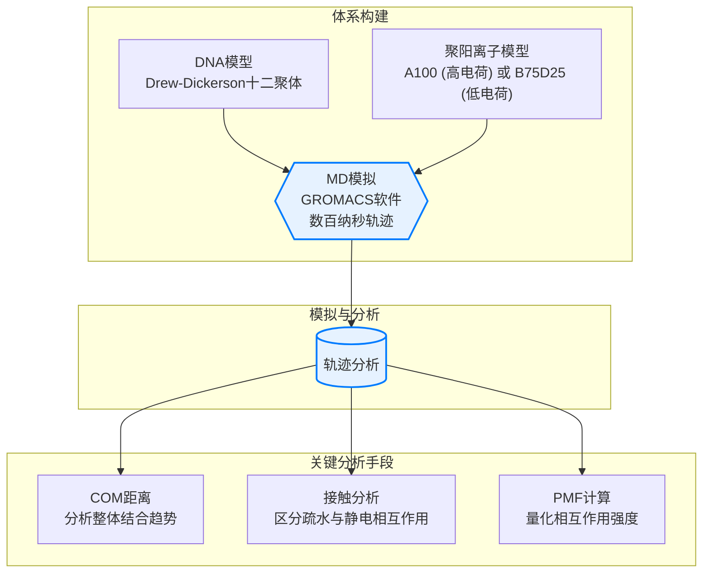
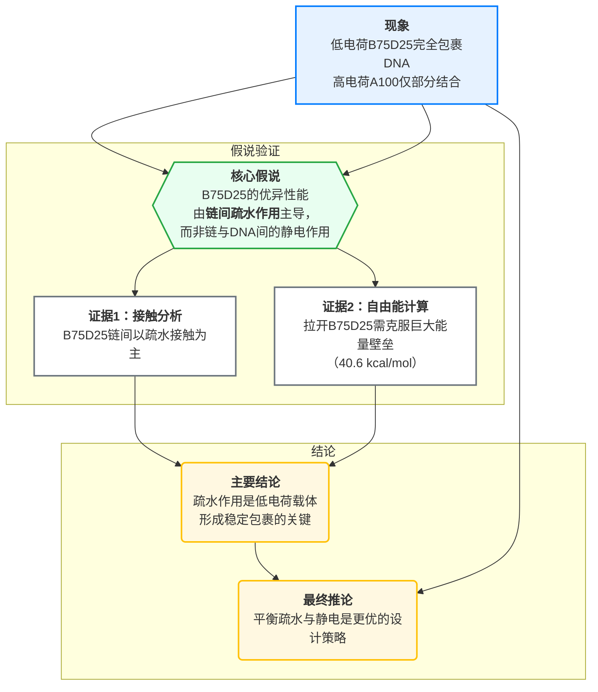

# **电荷少，效果好？解密疏水作用如何助力高效基因递送**

## **本文信息**

  - **标题**: Role of Charge Density of Polycations in DNA Complexation and Condensation
  - **作者**: Jianxiang Huang, Yangwei Jiang, Dong Zhang, Jingyuan Li, Youqing Shen, Ruhong Zhou
  - **单位**: 浙江大学生命科学学院定量生物学中心
  - **引用格式**: Huang, J., Jiang, Y., Zhang, D., Li, J., Shen, Y., & Zhou, R. (2025). Role of Charge Density of Polycations in DNA Complexation and Condensation. *Biomolecules*, *15*(7), 983. [https://doi.org/10.3390/biom15070983](https://doi.org/10.3390/biom15070983)

-----

## **摘要**

> 聚阳离子基因载体在基因递送领域已被广泛研究，其电荷密度在凝聚核酸中扮演着关键角色。最近，我们合成了两种具有不同电荷密度的聚阳离子：聚(2-(二甲氨基)乙基甲基丙烯酸酯)（表示为A100）和一种由2-(四氢亚甲基亚氨基)乙基甲基丙烯酸酯与2-(二异丙氨基)乙基甲基丙烯酸酯以3:1进料比共聚的聚合物（表示为B75D25）。尽管B75D25基载体的电荷密度较低，但其展现出比A100基载体更高的转染效率，这启发了一个假说：**疏水相互作用，而不仅仅是高电荷密度，增强了DNA的复合与基因递送**。本研究旨在通过分子动力学（MD）模拟研究DNA与B75D25和A100的复合过程，以探究这些差异背后的分子机制。我们的模拟显示，DNA被B75D25相当均匀地覆盖，并且这种复合不仅由与DNA的静电吸引驱动，更重要的是由B75D25之间的疏水相互作用驱动。相反，**由于A100之间强烈的静电排斥，只有一小部分A100能与DNA结合**。我们的结果揭示了疏水相互作用对低电荷密度B75D25与DNA复合的贡献。这些结果表明，高电荷密度可能并非DNA凝聚和高效基因递送的必要条件。

-----

## **背景**

基因治疗，通过将治疗性核酸（如DNA）递送到目标细胞以纠正遗传缺陷，正逐渐成为一种前景广阔的革命性医疗策略。然而，脆弱的核酸分子无法独自“闯荡”复杂的体内环境，它们需要被包裹在载体中，以保护其免受降解，并帮助其穿透细胞膜的壁垒。目前，临床上使用的基因疗法多依赖于病毒载体，但其高昂的成本、有限的装载能力、潜在的免疫原性和致癌风险，极大地限制了其广泛应用。

因此，开发更安全、更经济的**非病毒载体**成为了该领域的关键。其中，**聚阳离子**是一类极具潜力的非病毒载体。它们是带有正电荷的长链聚合物，能够通过静电吸引力与带负电的DNA结合，并将其“压缩”成纳米级别的致密颗粒（称为“polyplex”），从而保护DNA并促进其进入细胞。长期以来，该领域的一个核心设计准则是：**聚阳离子的电荷密度越高，其与DNA的结合力就越强，形成的颗粒就越致密，基因递送效率也理应越高**。这个直观的理论指导了许多载体的设计。

### **关键科学问题**

然而，近期的实验结果开始挑战这一传统认知。本文作者团队前期合成并测试了两种结构相似但电荷密度差异巨大的聚阳离子：**A100**（在pH 7时约有50%的单元带正电，**高电荷密度**）和**B75D25**（在pH 7时仅有约10%的单元带正电，**低电荷密度**）。实验结果惊人地发现，低电荷密度的B75D25所介导的基因转染效率，反而**显著高于**高电荷密度的A100。

这一反常现象引出了本研究的核心科学问题：**为何在静电吸引力明显更弱的情况下，低电荷密度的B75D25反而能成为更优秀的基因载体？** 是什么被忽略的关键物理化学作用力在其中扮演了更重要的角色？本研究旨在通过全原子分子动力学模拟，从分子层面深入剖析这两种聚阳离子与DNA相互作用的动态过程，揭示这一反常现象背后的物理机制。

### **创新点**

  * **挑战传统认知**：通过原子级别的模拟证据，有力地挑战了“电荷密度越高越好”的传统基因载体设计准则。
  * **揭示关键机制**：首次从分子动力学角度，清晰地揭示并量化了**聚阳离子间的疏水相互作用**在稳定DNA复合物中的主导作用。
  * **提供新设计思路**：研究结果表明，通过巧妙地平衡疏水性与静电相互作用，可以设计出电荷密度更低、潜在毒性更小且效率更高的非病毒基因载体，为未来的载体设计提供了新的方向。

-----

## **研究内容**

### **核心方法：全原子分子动力学模拟**

为了在原子尺度上“观察”DNA与聚阳离子的相互作用，研究者构建了精细的计算机模拟体系。他们将一段标准的B型DNA（Drew-Dickerson十二聚体）置于水盒子中央，周围环绕着24条聚阳离子链（A100或B75D25），并加入离子以模拟生理盐浓度。随后，利用经典的GROMACS软件进行长达数百纳秒（ns）的分子动力学模拟，追踪每一个原子的运动轨迹。

### **结果与分析**

本文的研究思路遵循着“观察反常现象 -\> 提出假说 -\> 精细化验证 -\> 得出结论”的经典科研逻辑，如下图所示：

**1. 反常识的包裹现象：为何“弱者”胜出？**

模拟结果首先从宏观上复现了实验的怪异现象。对于**低电荷密度**的B75D25体系，24条聚阳离子链在模拟开始后迅速向DNA靠拢，并在约25 ns内**全部聚集在DNA周围，形成了一个厚度可达2.5 nm的、完整且均匀的保护层**。相反，对于**高电荷密度**的A100体系，尽管其与DNA的静电吸引力更强，但由于A100链之间强烈的同种电荷排斥力，平均只有约7条（最多约10条）链能够成功结合到DNA上，其余大部分都被排斥在外，**未能形成有效的保护层**。补充材料中的数据显示（图S7），B75D25的包裹层在25 ns内就迅速稳定地包含了全部24条聚合物链，而A100的包裹层始终只有不到一半的链参与，定量地证实了这种包裹效率的巨大差异。

**图2：聚阳离子-DNA的复合过程及体系的最终模拟构象。** （a） DNA与聚阳离子之间平均质心（COM）距离随时间的变化。阴影误差带代表平均值的标准误差。（b） 从DNA开始的净电荷分布。误差棒代表平均值的标准误差。（c） B75D25/DNA复合物的最终模拟构象，虚线圆标记了电荷中和距离 $R_{0}$ 以内的区域。（d） A100/DNA复合物的最终模拟构象。

**2. 揭秘B75D25的“隐藏力量”：疏水相互作用**

既然静电吸引无法完全解释B75D25的优异包裹能力，研究者将目光投向了另一种重要的作用力：疏水相互作用。通过精细的接触分析，他们发现，在B75D25形成的保护层中，**聚阳离子链与链之间的相互作用，主要由非极性原子间的接触（即疏水相互作用）所主导**，其接触数量显著高于极性原子间的接触。这表明，B75D25链倾向于彼此“抱团”，形成一个稳定的疏水核心，从而将DNA包裹在内。

**图3：B75D25聚合物间的疏水相互作用。** （a） B75D25的疏水接触表面积随时间的变化。（b） B75D25之间的接触原子对（红色线为极性-极性对，绿色线为非极性-非极性对）。（c） B75D25与DNA之间的疏水接触表面积随时间的变化。（d） B75D25与DNA之间的接触原子对。

为了进一步量化这种“抱团”的力量有多强，研究者通过伞形采样模拟计算了将一条B75D25链从复合物中拉出的自由能代价（PMF）。结果显示，**拉出一条B75D25链需要克服高达 $40.6\ \mathrm{kcal/mol}$ 的能量壁垒**，这是一个非常巨大的数值，强有力地证明了B75D25聚合物之间的疏水聚集是其形成稳定保护层的根本原因。

**图4：沿着反应坐标（定义为被选择的B75D25链的COM与DNA的COM之间的距离）的平均力势（PMF）。** 插图显示了用于PMF计算的反应坐标。

**3. 重新审视静电相互作用**

分析同样证实，B75D25的质子化胺基与DNA的磷酸骨架之间确实存在静电吸引和氢键作用。然而，这些相互作用的强度和数量都**相对温和**。相比之下，A100与DNA形成的静电相互作用虽然更强，但这种强作用力是一把“双刃剑”，它同时也导致了A100链之间更强烈的排斥，最终阻止了它们形成有效的整体包裹。这一电荷密度的差异在补充材料的静电势表面图中（图S2）得到了直观的展示，A100表面呈现出大片的强正电势（蓝色），而B75D25表面则大部分呈中性（白色）。因此，B75D25的成功策略可以总结为：**利用温和的静电吸引将自身“锚定”在DNA表面，再依靠强大的链间疏水作用力完成“自组装”，形成稳定外壳**。

**图5：DNA与B75D25聚合物的相互作用。** （a） B75D25聚合物的质子化胺氮原子围绕DNA磷酸磷原子的径向分布函数。（b） DNA(P)与B75D25（质子化N）相互作用的代表性快照。（c） 接触数的时程演化。（d） 氢键数量的时程演化。

-----

## **Q&A**

  - **Q1：“疏水接触表面积”具体是指什么？它指的是B75D25链与链之间，还是B75D25与DNA之间的接触？**

  - **A1**：这是一个非常关键的区别。本文分析了**两种**疏水接触表面积：**一种是B75D25链与链之间的（图3a），另一种是B75D25与DNA之间的（图3c）**。结果显示，链与链之间的疏水接触表面积（最终达到约 $180\ \mathrm{nm}^2$）远大于链与DNA之间的（约 $5\ \mathrm{nm}^2$）。您观察得非常正确，DNA的疏水碱基主要位于双螺旋内部，其暴露在表面的主要是亲水的磷酸脱氧核糖骨架。因此，B75D25与DNA的直接疏水作用相对较弱。这恰恰反过来**强化了本文的核心论点**：驱动B75D25形成稳定多层包裹的主要力量，并非来自与DNA的直接作用，而是来自**B75D25链与链之间强大的疏水“抱团”效应**。

  - **Q2：B75D25的非极性接触比极性接触多，有没有可能是因为它本身的非极性原子就比极性原子多？作者是否考虑了这一点？**

  - **A2**：这是一个非常深刻的问题，触及了数据归一化的核心。确实，从化学结构上看，B75D25的疏水单元（TMI）占75%，其非极性碳氢原子在数量上就远多于极性质子化氮原子。……

    > 小编觉得就应该是说明自己跟自己是疏水，那大部分原子都是非极性的当然是非极性接触。。
    >
    > B75D25和DNA的结合仍然是静电驱动的，但大量B75D25和DNA的结合是疏水主导。

  - **Q3：为什么后续的几张图（如PMF和RDF分析）主要表征B75D25，而没有对A100进行同样的分析？**

  - **A3**：这反映了研究的逻辑聚焦。在初步的模拟中，研究已经明确了一个核心现象：B75D25成功形成了稳定的多层包裹，而A100因为强烈的内部排斥而**失败**了。因此，后续研究的核心科学问题就变成了：**“成功者”B75D25究竟是靠什么机制成功的？** 于是，后续的PMF（测量聚集强度）和RDF（测量静电作用）等精细分析，都是为了深入刻画B75D25的成功机制。对A100进行PMF分析的意义不大，因为它根本没有形成一个可供“拉开”的稳定聚集体。作者在补充材料（图S12）中确实也计算了A100的RDF，并证实了其与DNA存在很强的静电吸引。

    > 小编觉得还是可以拉的……

  - **Q4：这项研究对未来设计基因载体有何具体的指导意义？**

  - **A4**：它提供了一个全新的设计范式。传统的设计思路是尽可能增加聚合物的正电荷。而本研究表明，一个更优的策略是**“疏水与静电的协同设计”**。未来的基因载体可以设计成这样：1）保留适量的正电荷，足以让载体与核酸发生初始的静电吸引；2）引入可控的疏水基团，**利用疏水效应驱动载体分子自组装成稳定的纳米颗粒核心**。这种设计不仅可能提高包裹效率和稳定性，还可能因为总体电荷较低而降低细胞毒性。

  - **Q5：高电荷密度的A100与DNA之间存在很强的静电吸引，这个事实如何支撑“链间静电排斥是其失败主因”的结论？**

  - **A5**：这个逻辑是成立的，它通过排除法得出了结论。首先，补充材料（图S6, S12）的数据证实了A100与DNA的吸引力非常强（甚至强于B75D25）。这就排除了“吸引力不足”是A100包裹失败的原因。既然吸引力足够强，但大部分A100链依然无法靠近DNA，那么必然存在一个更强大的、阻止它们靠近的**拮抗力**。在水溶液和离子环境中，对于带有大量同种电荷的A100分子链来说，这个力只能是它们彼此之间的**静电排斥力**。因此，正是因为“与DNA的吸引力很强”这个前提，我们才能更有信心地断定，是“链间的排斥力”阻止了更多A100的结合。

    > 也不算支撑，就是排除了一个答案

  - **Q6：研究的核心论点是疏水作用“主导”了B75D25的包裹行为，但图5也显示了稳定的静电和氢键相互作用。我们如何客观评估这两种作用力的相对重要性？**

  - **A6**：这是一个非常深刻的批判性问题。作者的“疏水主导”论点主要基于两个证据：1）链间的非极性接触数量远超极性接触（图3b）；2）将一条链从聚集体中拉开需要克服巨大的能量壁垒（$40.6\ \mathrm{kcal/mol}$，图4）。然而，正如您所指出的，图5也清晰地显示了B75D25与DNA之间存在着峰值尖锐的径向分布函数（RDF）和持续存在的氢键，这证明静电相互作用同样不可或缺。
    一个更严谨的解读是：**静电吸引是“必要非充分”条件，而疏水作用是“决定性”因素**。可以这样理解：**静电吸引**像是“船锚”，负责将第一批B75D25分子链从溶液中捕获并锚定到DNA表面。没有这个初始步骤，B75D25链将只是在溶液中随机漂浮。然而，仅靠这个“船锚”不足以形成一个稳定厚实的保护层，因为链与链之间仍然存在一定的排斥。此时，**强大的链间疏水作用**开始扮演主角，它像“万能胶”一样，将已经锚定和新到来的B75D25链紧密地粘合在一起，克服了它们之间的排斥力，最终形成了那个完整的多层包裹结构。因此，静电作用负责“启动”，而疏水作用负责“建成并稳定”。

  - **Q7：研究比较了50%带电的A100和10%带电的B75D25。是否存在一个“最佳电荷密度”的甜点区？**

  - **A7**：这是一个极好的问题，也是本研究未能直接回答的。本文通过两个极端的例子，雄辩地证明了“越高越好”的理论是错误的，并揭示了疏水作用的重要性。但这确实留下了一个开放性问题：是否存在一个最佳的平衡点？例如，一个25%或30%带电、同时保持疏水性的聚合物，是否会表现出比B75D25更优的性能？**本研究的结论强烈暗示了这样一个“甜点区”的存在**，即电荷密度既要足够强以启动与DNA的结合，又要足够弱以避免过度的链间排斥。探索这个最佳区间，将是后续研究中一个非常有价值的方向。

  - **Q8：模拟使用的是一段短的、线性的DNA。真实世界中的DNA（如质粒）是环状且超螺旋的，这会对结果产生什么影响？**

  - **A8**：这个问题触及了模型简化与生物现实之间的差距。使用短链DNA是计算模拟中的常见简化，但真实情况远为复杂。**超螺旋的质粒DNA具有更紧凑的结构和更高的局部电荷密度，这可能会增强与聚阳离子的初始静电吸引**。然而，其复杂的拓扑结构也可能对聚合物的缠绕和包裹方式提出新的挑战。例如，聚合物链可能被“卡”在DNA的扭结中。此外，本文的模拟也没有考虑DNA末端效应，而补充材料（图S8）中的周期性DNA模拟初步探讨了这一点。总的来说，虽然本研究揭示的基本物理原理（静电vs疏水）很可能同样适用，但这些原理在更复杂的DNA拓扑结构上如何具体表现，仍需进一步的研究。

## **关键结论与批判性总结**

**关键结论**

本研究通过全原子分子动力学模拟，为“低电荷密度聚阳离子B75D25比高电荷密度聚阳离子A100具有更优的基因转染效率”这一反常实验现象提供了深刻的分子机制解释。研究明确指出，一个成功的基因载体不仅需要与DNA有足够的静电吸引力，**聚合物链之间的相互作用**也同样至关重要。

  * **对于B75D25**，强大的**链间疏水相互作用**是主导力量，它驱动聚合物自发地聚集、包裹在DNA周围，形成了一个稳定且完整的保护层。
  * **对于A100**，过高的电荷密度导致了强烈的**链间静电排斥**，这种排斥力超过了其与DNA的吸引力，使得大多数聚合物链无法靠近DNA，最终导致包裹失败。

**因此，本研究的核心结论是：聚阳离子的包裹能力与其电荷密度并非简单的正比关系。适度的疏水性可以有效补偿较弱的静电吸引，通过链间聚集效应，同样能形成稳定的DNA复合物，并可能因为较弱的结合力而有利于在细胞内更高效地释放DNA，从而实现更优的基因递送。**

**批判性总结**

  * **潜在影响**：这项工作为非病毒基因载体的设计提供了全新的、反传统的设计思路。未来的研究者在设计新型聚阳离子载体时，或许应该将目光从“如何最大化电荷”转向“**如何巧妙地平衡静电与疏水相互作用**”，这可能为开发出更低毒、更高效的基因治疗工具开辟新的道路。
  * **研究局限性**：作者在文中也坦诚地指出了本研究的局限性，主要包括分子动力学模拟的**时间尺度限制**和计算中使用的**力场精度**可能存在固有偏差。
  * **未来展望**：为了克服这些局限，未来的研究可以采用**粗粒化模拟**等方法来探索更长的时间和空间尺度。最重要的是，本研究的计算发现迫切需要**进一步的实验验证**，例如通过细胞摄取、内涵体逃逸等实验，来证实这种以疏水作用为主导的包裹机制是否真的能转化为最终的体内基因递送优势。