# 均聚物也能自组装：驱动力、设计策略与应用全景

## 本文信息

- **标题**：均聚物自组装：原理、驱动力与应用
- **作者**：Jianhua Li、Yirong Fan、Qianxi Gu、Xiaoyan Zhou、Hui Sun、Jianzhong Du
- 发表时间：2023年11月15日
- **单位**：同济大学材料科学与工程学院（中国上海）、宁夏大学化学化工学院（中国银川）等
- **引用格式**：Li, J., Fan, Y., Gu, Q., Zhou, X., Sun, H., & Du, J. (2023). Homopolymer Self-Assembly: Principles, Driving Forces, and Applications. *Chemistry of Materials*, *35*, 10348−10370. https://doi.org/10.1021/acs.chemmater.3c02225
- 公开资源：未在论文中明确提供代码或在线平台

## 摘要

> 均聚物自组装近年来在聚合物科学与软纳米材料领域受到广泛关注，其核心原因在于均聚物中亲水与疏水片段的边界并不清晰，形成一种独特的“模糊边界”结构特征。该特征不仅改变了自组装驱动力的构成，也带来了与传统嵌段共聚物不同的结构与形貌规律。本文系统总结了均聚物自组装的**驱动力谱系**，涵盖疏水效应、静电相互作用、氢键、π−π堆叠与结晶驱动自组装等多种机制，并梳理了两条核心设计路线：**两亲重复单元策略**与**端基策略**。在此基础上，作者强调了模糊边界引发的结构特性与形貌调控手段，并展示了其在生物医药、环境治理与能源存储中的应用潜力，最后给出未来研究方向。

### 核心结论

- **均聚物并非缺少分区的弱化版本，而是拥有模糊边界的独特体系**，这一结构特征带来新的驱动力组合与形貌窗口。
- **驱动力远不止疏水效应**，静电、氢键、π−π堆叠、结晶驱动自组装等多重机制在均聚物中更容易协同叠加。
- **两条设计路径各有优势**，两亲重复单元策略更强调分子内亲疏水共存，端基策略则用少量端基实现类嵌段共聚物的组装行为。
- **应用性能与结构细节高度耦合**，例如膜内梯度、疏水域连续性与尺寸可控性会直接影响药物装载与催化效率。

## 背景

均聚物只含一种重复单元，传统上被认为缺乏“亲疏水分区”，因此在自组装领域长期处于配角位置。与之相比，嵌段共聚物拥有清晰的亲疏水界面，能够通过packing parameter $p$ 预测形貌：当 $p \le 1/3$ 形成球形胶束，$1/3 < p \le 1/2$ 形成柱状胶束，$1/2 < p \le 1$ 形成层状或囊泡结构。这套逻辑在均聚物上并不直接适用，正是因为均聚物的分子内亲疏水并未明确分离。

近年来的研究表明，均聚物并非无法形成清晰的纳米结构，相反它们常常表现出更复杂的非共价相互作用网络。均聚物中的亲水与疏水片段在同一重复单元中并存，形成“模糊边界”效应，使得多种驱动力可以在分子内共存并协同，进而产生胶束、囊泡、纳米片甚至复杂分级结构。

这种结构特性带来两个重要现实意义。其一，均聚物的合成路线相对简单，拓展了自组装材料的化学空间。其二，模糊边界带来的梯度膜与多尺度异质性，使得均聚物材料在药物递送、污染治理和能源存储中更容易形成功能化微环境。

### 关键科学问题

- **当亲疏水界限被抹平后，均聚物为何仍能形成稳定纳米结构**，并且形貌多样化的尺度规律如何描述？
- **驱动力如何在均聚物体系中协同或竞争**，尤其是在氢键、π−π堆叠与结晶驱动共同存在时，如何判断主导机制？
- **如何将分子设计与形貌调控闭环连接**，使得端基、重复单元与外界条件可预测地映射到特定结构与应用性能？

### 创新点

- **提出以模糊边界为核心的结构框架**，强调均聚物的亲疏水共存而非分区的结构本质。
- **系统化梳理驱动力谱系**，将传统疏水效应扩展到多重非共价与结晶驱动机制。
- **总结两条分子设计路径**，并将其与形貌调控及应用结果形成可读的逻辑链条。

### 术语速览

- **两亲性均聚物**：只含一种重复单元，但该单元内部同时含有亲水与疏水片段，因此可在水溶液中形成自组装结构。
- **模糊边界**：亲水与疏水组分在空间上没有清晰界面，更多呈连续分布或渐变分布，是均聚物体系的关键结构特征。
- **结晶驱动自组装**（crystallization-driven self-assembly，CDSA）：以结晶域为生长核心的自组装机制，常导致一维或二维晶体结构形成。
- **分子内环化诱导结晶驱动自组装**（intramolecular cyclization induced CDSA，ICI-CDSA）：先发生分子内环化再驱动结晶生长，可构筑分级结构。
- **水合大复合胶束**（hydrated large compound micelles，HLCMs）：由多个小胶束聚集形成的大尺度复合结构，内部常含脱水核心。
- **动态光散射与透射电镜**：动态光散射（DLS）用于给出粒径分布，透射电子显微镜（TEM）用于观察形貌与内部结构。
- **π−π堆叠**：芳香环之间的堆叠相互作用，常与氢键协同决定纳米片或纳米碗等复杂形貌。

---

## 研究内容

### 结构起点：清晰边界与模糊边界的根本差异

均聚物自组装的“根问题”并不是能不能组装，而是**用什么结构逻辑来组织亲疏水片段**。嵌段共聚物依赖清晰的亲疏水分区，因此其结构与形貌更容易用“块段界面”来描述；均聚物则在每个重复单元里同时携带亲水与疏水基团，形成连续的“模糊边界”。这一差异会直接改变自组装的能量地形与形貌可调空间。

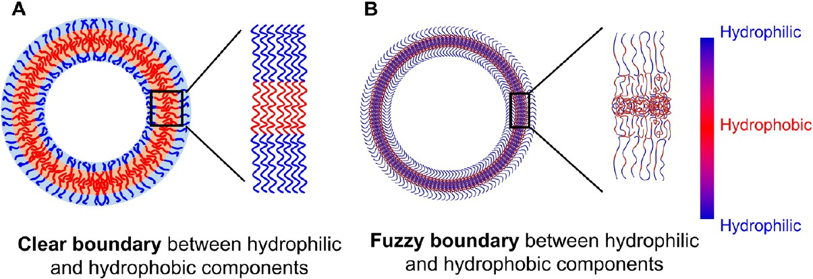

**Scheme 1：嵌段共聚物的清晰边界与均聚物的模糊边界对比**

- 图中蓝色代表亲水部分，红色代表疏水部分。嵌段共聚物具有明确界面，而均聚物更接近“连续渗透”的亲疏水分布。
- **模糊边界并不是缺陷，而是一种结构自由度**，它使得多种相互作用能够在同一链段上协同出现。

### 总体框架：均聚物自组装的逻辑地图

均聚物自组装的知识结构更像一个“驱动力—设计策略—结构特征—应用性能”的闭环。作者在综述中用体系化方式把这一闭环展开，强调多重驱动力叠加与模糊边界结构的内在关联。

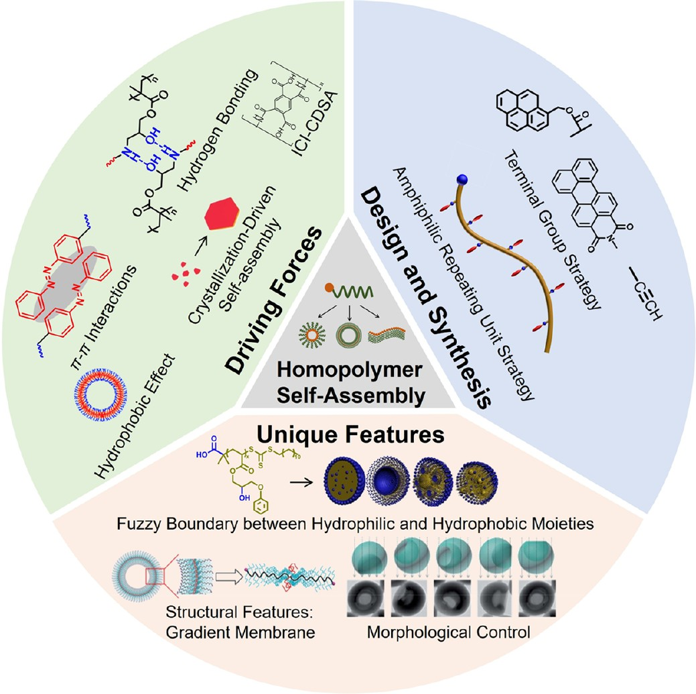

**Scheme 2：均聚物自组装的整体框架示意**

- 图中概括了驱动力、设计策略、结构特征与应用之间的逻辑顺序，强调均聚物体系中驱动力协同与形貌调控的可拓展性。
- 这一框架也提示读者：均聚物体系的复杂性主要来自**多重相互作用共存**，而不是单一疏水效应的强化。

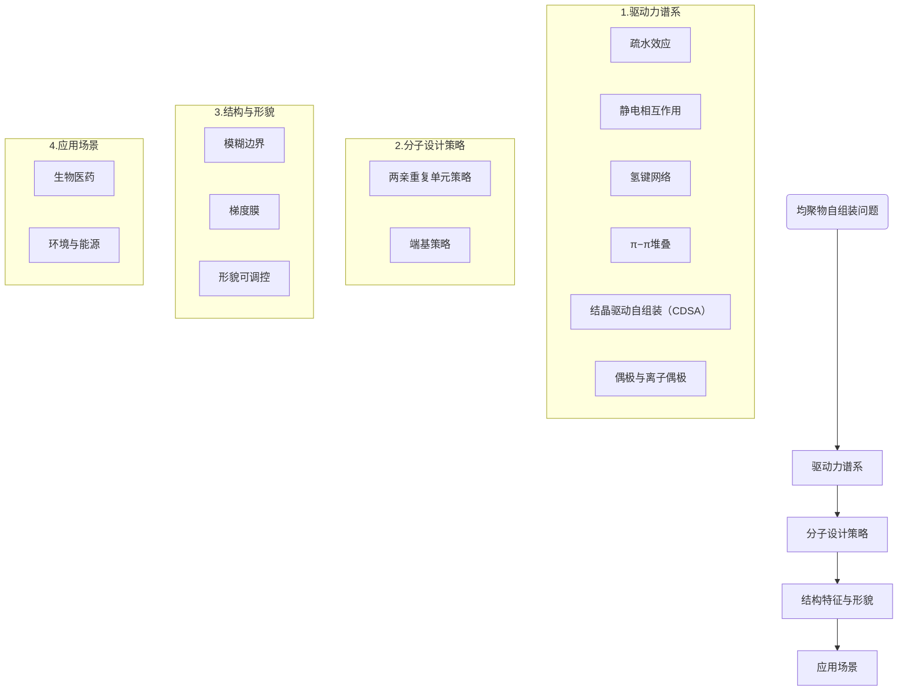
```mermaid
graph TB
    A("均聚物自组装问题") --> B["驱动力谱系"]
    B --> C["分子设计策略"]
    C --> D["结构特征与形貌"]
    D --> E["应用场景"]

    subgraph S1["1.驱动力谱系"]
        F["疏水效应"]
        G["静电相互作用"]
        H["氢键网络"]
        I["π−π堆叠"]
        J["结晶驱动自组装（CDSA）"]
        K["偶极与离子偶极"]
    end

    subgraph S2["2.分子设计策略"]
        L["两亲重复单元策略"]
        M["端基策略"]
    end

    subgraph S3["3.结构与形貌"]
        N["模糊边界"]
        O["梯度膜"]
        P["形貌可调控"]
    end

    subgraph S4["4.应用场景"]
        Q["生物医药"]
        R["环境与能源"]
    end
```

### 驱动力谱系：不是只有疏水效应

均聚物自组装的驱动力更像是一组“可叠加的工具箱”，不同体系往往呈现多种相互作用同时发挥作用的状态。以下驱动力是综述中最核心的逻辑主线，建议读者将其作为理解均聚物体系的第一层索引。

- **疏水效应仍是基础驱动力，但其作用更具分布性**，亲疏水片段分散在重复单元中，使得疏水域形成更缓慢、更连续的相互作用网络。
- **静电相互作用在多价对离子存在时更显著**，带电均聚物可通过对离子调控形成稳定聚集体，这为溶液条件可控的自组装提供了快速入口。
- **氢键与π−π堆叠常以协同形式出现**，在含芳香基或含氢键供体的重复单元中更容易诱导纳米碗、纳米片等复杂形貌。
- **结晶驱动自组装**（CDSA）提供了形貌控制的硬约束，均聚物链段的结晶性使得一维或二维结构更易生长与维持。
- **分子内环化诱导的结晶驱动机制**（ICI-CDSA）可以在合成过程中直接锁定结晶域，形成层级结构并提高形貌稳定性。
- **偶极与离子偶极相互作用补上了溶剂效应的空白**，在极性介质中，偶极相关相互作用可成为主导驱动力之一。

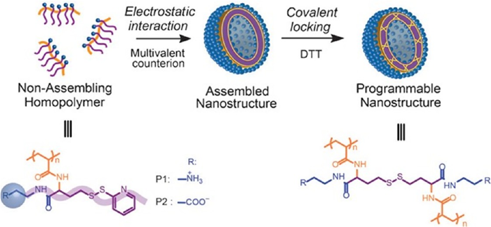

**图1：多价对离子诱导的均聚物自组装及其分子结构示意**

- 图1展示了带电均聚物在多价对离子作用下形成组装体的过程，同时给出阳离子聚合物P1与阴离子聚合物P2的结构示意。
- 该图强调静电作用在均聚物体系中的可调控性，并提示溶液条件与对离子类型对形貌具有显著影响。

### 驱动力详解：九类机制如何分工

综述将驱动力拆分为九个类别，这一拆分方式的价值在于它把“模糊边界”导致的多重相互作用拆解成可操作的设计要素。下面用更直观的方式把这九类驱动力逐一解释，并给出它们在形貌上的典型角色。

- **疏水效应是最基础的驱动力**，但在均聚物中往往呈现“分布式疏水域”，因此聚集过程更像渐进式的相互作用累积，而非清晰的相分离边界。
- **静电相互作用常用来快速聚集与稳定粒子**，当均聚物带电且溶液中存在多价对离子时，聚集速度显著提升，同时为后续形貌塑形提供初始框架。
- **氢键网络提供柔性结构稳定性**，尤其是侧链可形成多点氢键的体系，容易形成纳米碗、纳米片等非球形结构，并可在温度或溶剂改变时发生可逆重组。核磁共振与红外光谱研究表明，氢键的参与可**有效增强聚集体内部的粘度**，这是方形与球形超分子组装体形成的重要原因。
  - **温度对氢键强度具有关键影响**：氢键强度随温度升高而减弱，这会削弱偶极相互作用并促进结构柔性，因此温度调节成为形貌控制的有效手段。
  - 此外，**聚合物—溶剂氢键相互作用**也可诱导纳米结构形成，例如聚（1,3-二氧戊环）中的醚键可通过氢键与水分子结合，从而驱动自组装。
- **π−π堆叠是芳香均聚物的重要驱动力**，它常与氢键协同，决定片状或碗状结构的稳定性与尺寸，可通过芳香环密度与端基结构来调控。**端基类型对π−π堆叠强度具有决定性影响**：引入多芳香端基可增强链间π−π堆叠，从而降低纳米棒等一维结构的弯曲程度，实现对形貌曲率的精准调控。
- **氢键与π−π堆叠的协同效应是形成复杂形貌的关键**，例如纳米碗的形成往往需要二者共同作用，单一驱动力不足以维持稳定结构。协同作用的分子机制在于：氢键与π−π堆叠共同确保了预成球内部的分子间相互作用，**防止球体均匀收缩**，同时**允许内部链段保持运动性**，从而实现纳米碗等复杂结构的可控形成。
- **结晶驱动自组装**（CDSA）提供强结构约束，可显著提高一维或二维结构的规整度，是形成种子、纳米片或晶体板片的重要机制。
- **分子内环化诱导的结晶驱动机制**（ICI-CDSA）会在聚合过程中锁定结晶域，为分级结构的构筑提供更高稳定性。
- **阴离子—偶极与偶极—偶极相互作用补足了溶剂效应**，尤其在强极性溶剂或离子环境中，偶极驱动可以与疏水效应协同发挥作用。这类相互作用的强度通常在 $20\sim200\,\mathrm{kJ/mol}$ 范围内，足以驱动均聚物自组装，并提供了与其他非共价相互作用进行定量对比的基准。
- **其他驱动力包括金属配位与溶剂诱导效应**，它们并非主流机制，但在具体体系中可能成为形貌切换的关键开关。

驱动力的关键不是“谁最强”，而是“谁先触发结构分化”。例如疏水效应常提供初始成核，氢键与π−π堆叠负责结构稳定与形貌精细化，结晶驱动则在后期锁定结构并提升规整度。这种“先成核、再稳定、后锁定”的节奏，是理解均聚物自组装路径的核心思路。

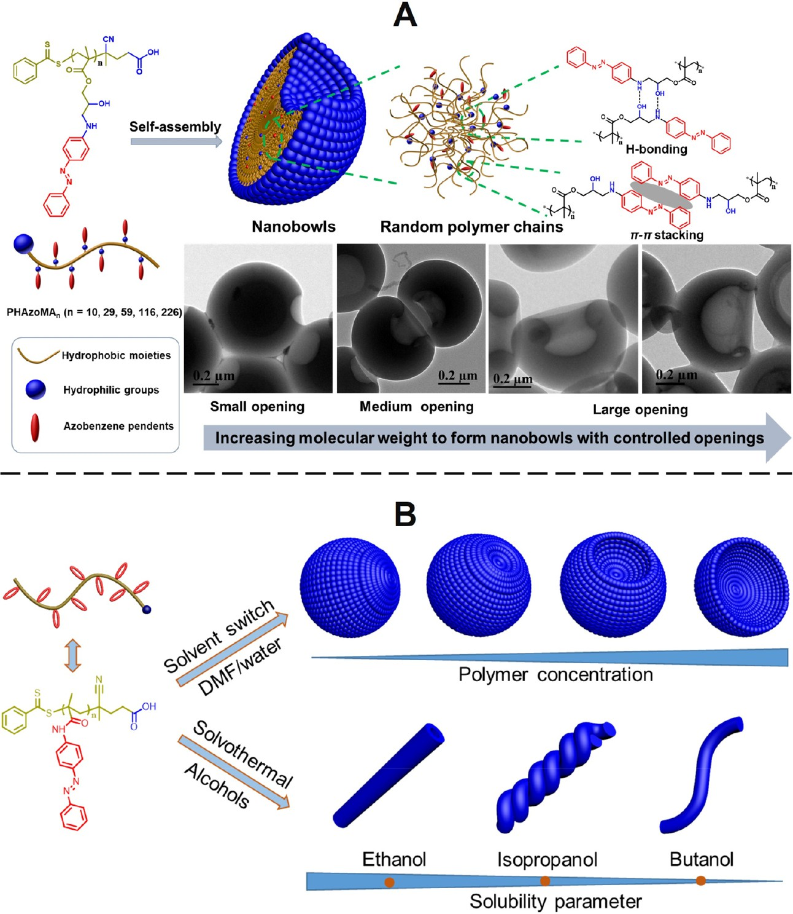

**图2：氢键与π−π堆叠协同驱动的纳米碗与碗状颗粒**

- 图2A展示PHAzoMA均聚物在氢键与π−π堆叠协同作用下形成纳米碗结构，体现双重驱动力对复杂形貌的必要性。
- 图2B展示通过调节聚合物浓度获得不同开口尺寸的碗状颗粒，说明驱动力强度与溶液条件可直接映射到形貌尺寸。

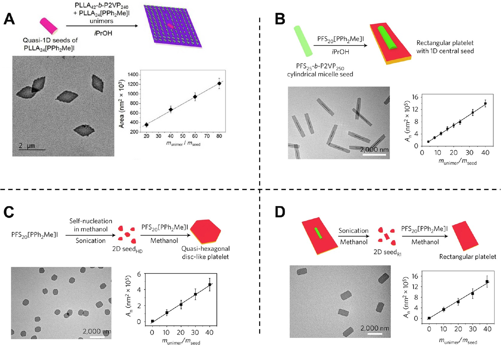

**图3：结晶驱动自组装形成多样化纳米片的例子**

- 图3A展示PLLA均聚物形成准一维种子结构，提示结晶驱动自组装可作为形貌“模板”启动源。
- 图3B至图3D展示PFS均聚物可形成矩形、准六边形盘状与矩形片状结构，强调结晶域对二维结构形貌的决定性影响。

为了让驱动力与结构结果之间的对应关系更清晰，下表对常见驱动力与其结构指向作了对照，便于从“相互作用”直接推断“形貌倾向”。

| 驱动力 | 更容易形成的结构倾向 | 典型可控参数 |
| --- | --- | --- |
| 疏水效应 | 胶束与囊泡 | 溶剂极性、温度、聚合度 |
| 静电相互作用 | 纳米球与复合胶束 | pH、离子强度、对离子价态 |
| 氢键与π−π堆叠 | 纳米片、纳米碗、分级结构 | 侧链官能团、芳香环密度 |
| 结晶驱动自组装 | 一维或二维晶体结构 | 结晶度、退火过程 |
| 偶极与离子偶极 | 形貌可逆的可溶体系 | 溶剂选择性、极性分布 |

均聚物体系中常见的协同模式大致可归纳为三类，便于在实验设计时快速定位主导机制。

- **疏水效应先成核、氢键与π−π堆叠稳定结构**，常见于含芳香侧链且可形成多点氢键的体系。
- **静电相互作用先聚集、结晶驱动再塑形**，常见于带电均聚物在高盐或多价离子环境中的形貌演化。
- **偶极相互作用塑造溶剂响应性、外场调控形貌切换**，常见于极性溶剂体系与刺激响应材料。

### 方法详述：两条设计路径与可控参数

作者将均聚物自组装的设计策略归纳为两条路径，这一点对实际材料设计极具指导意义。两条路径不是“二选一”，而是可以根据目标形貌和应用场景自由组合或迭代。

- **两亲重复单元策略的核心在于把亲疏水片段写入同一重复单元**，这种策略依赖单体结构设计与合成化学，优势是功能密度高且驱动力均匀分布。
- **端基策略则利用少量端基诱导整体组装**，通过极少数端基实现类嵌段共聚物效应，强调“少量而有效”的驱动。
- **外界条件成为方法的一部分**，温度、溶剂比例、pH、金属离子浓度等参数往往是形貌从球到片、从片到碗的关键开关。

为了便于设计决策，下表用三列对比两条策略在结构设计与调控上的差异。

| 设计策略 | 结构逻辑 | 典型调控手段 |
| --- | --- | --- |
| 两亲重复单元策略 | 亲疏水共存于重复单元，驱动力在链内分布 | 改变单体官能团、溶剂选择性、pH与温度 |
| 端基策略 | 端基驱动整体组装，少量端基决定形貌 | 端基极性与体积、离子配位、端基密度 |

**表1：两亲重复单元策略的代表性均聚物**（上）

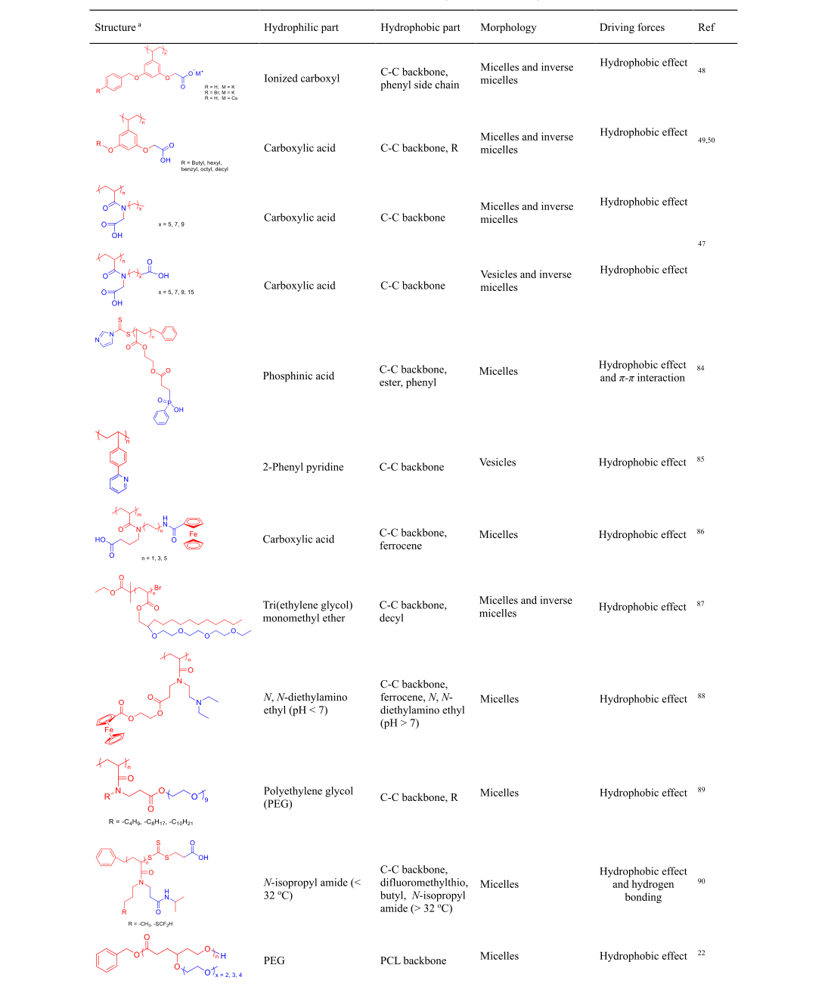

**表1：两亲重复单元策略的代表性均聚物**（下）

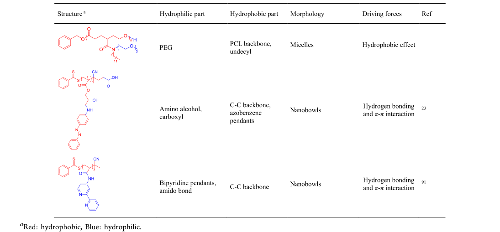

**表2：端基策略的代表性均聚物**

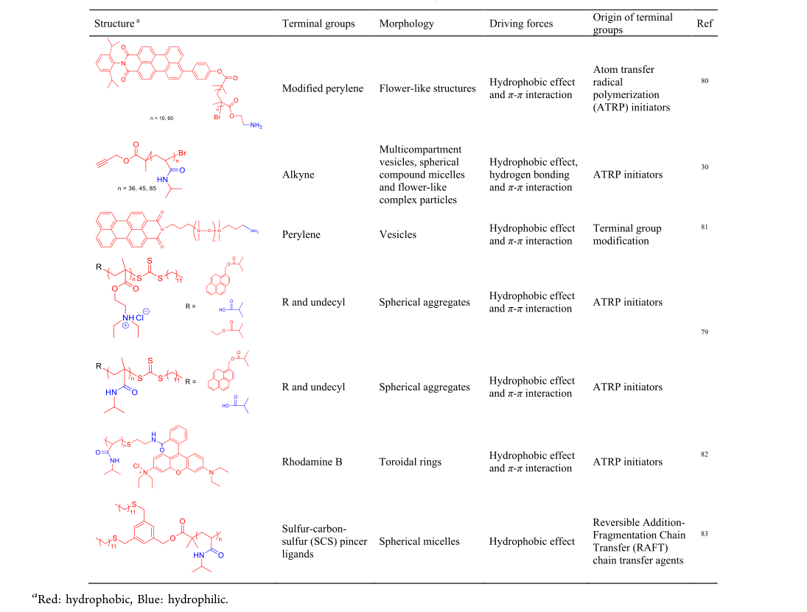

- 表1与表2展示了两条策略对应的代表性体系，图中红色标注疏水部分，蓝色标注亲水部分，便于理解重复单元与端基在结构中的功能位置。
- 这些表格强调一个关键信息：**均聚物自组装的可设计空间比直觉更大**，且结构与形貌之间存在可复用的经验映射。

在端基策略中，端基不仅是“装饰”，往往还承担结晶或配位的触发功能。综述中的PAA体系是一个典型例子，端基相关的分子内环化会引发结晶驱动生长，最终形成花状分级结构，这类案例说明**端基既能提供驱动力，也能提供形貌模板**。

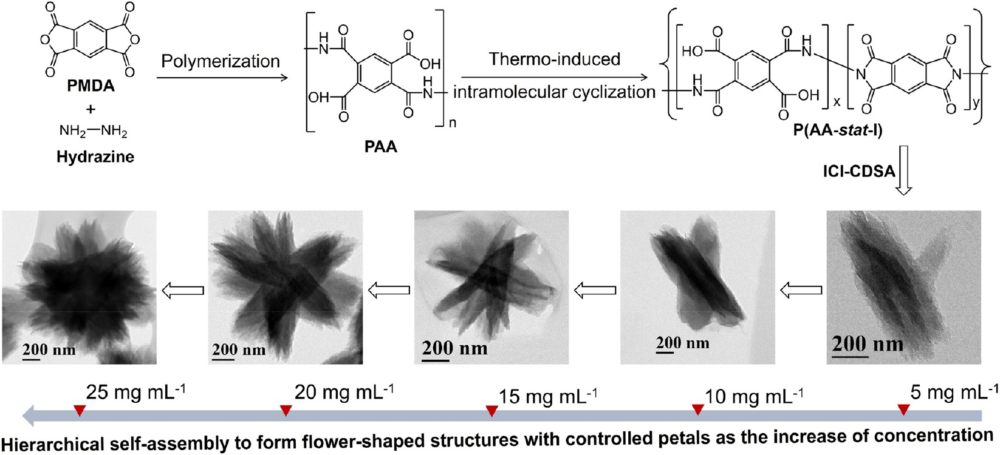

**图4：PAA的合成、ICI-CDSA与纳米花形貌的形成**

- 图4展示PAA的逐步聚合合成路线，以及其在分子内环化诱导结晶驱动自组装过程中的结构演化。
- 图中“纳米花”结构体现了分子内环化与结晶驱动协同的结果，说明端基或局部结构变化能够放大到宏观形貌层面。

两亲重复单元策略与端基策略在“设计逻辑”上有明显差异。前者更像把功能直接写进链段，强调**结构内生性**；后者更像用“少量触发”来引导整体形貌，强调**驱动力放大效应**。在实验操作上，两亲重复单元策略常伴随单体设计与合成路线的优化，而端基策略则更适合在已有聚合物上做末端改造以快速探索结构空间。

在综述给出的案例中，两亲重复单元策略更容易生成稳定的胶束或囊泡结构，端基策略则更容易形成板片、纳米碗或分级结构。换言之，如果目标是“结构稳定与功能密度”，两亲重复单元策略更合适；如果目标是“形貌多样与可快速迭代”，端基策略更具效率。

### 结构特征与形貌调控：模糊边界与梯度膜

原文在设计策略之后强调一个关键点：**均聚物的形貌不是单靠分子结构决定，而是由分子相互作用强度与溶液条件共同锁定**。换句话说，温度、pH、离子、溶剂比例这些外部条件，本质上是在“调节氢键、静电、π−π堆叠与配位的强弱”，从而决定最终结构。

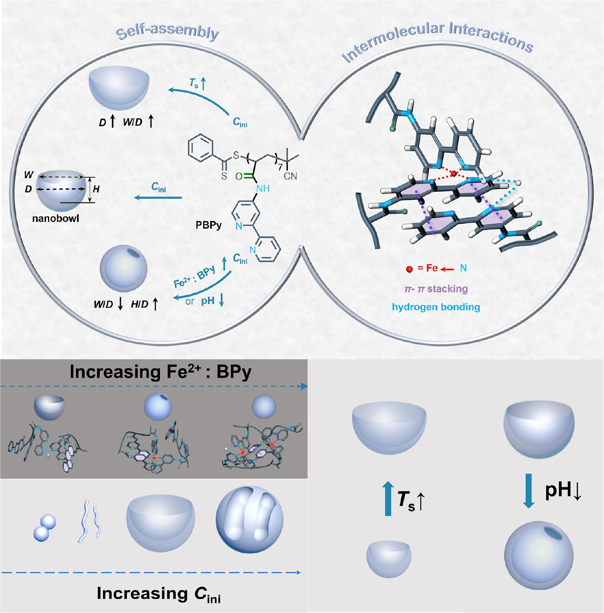

**图5：通过调控相互作用强度实现形貌可控**

- 图5以PBPy体系为例，BPy与$\ce{Fe^{2+}}$配位叠加氢键与π−π堆叠，通过调节亚铁离子浓度、PBPy浓度、温度与pH实现形貌切换。
- 这个案例说明**形貌通常由一组相互作用共同锁定**，而不是某一个参数单独决定。

均聚物的模糊边界不仅是概念差异，更直接影响纳米结构的内部组织方式。这里的“膜”指的是**囊泡的双层膜**，可以把它理解为一张“从内到外逐渐变亲水”的薄膜。原文将这种结构称为**梯度膜**：膜中心疏水性最高，膜表面疏水性最低，沿膜厚度方向连续过渡，而不是两层硬分界。

为什么会形成梯度膜？原文给出的解释是**氢键强度的空间梯度**。以PEEA体系为例，疏水组分约18 wt %，在THF与水的混合溶剂、25 °C条件下形成囊泡。寡聚乙二醇链段（OEs）与水分子的氢键作用从膜中心向外缘逐渐增强，导致疏水性逐步降低，从而形成连续的亲疏水梯度。这一趋势还可通过红外光谱中氢键特征峰的红移得到支持。

梯度膜意味着什么？它不是“形貌变化”，而是“同一囊泡内部的微观组织变化”。这会带来两个直接结果：其一，膜厚度与力学柔性可被放大，例如PHPPA体系形成直径约300 nm的囊泡，其膜厚度约60 nm，远高于传统嵌段共聚物囊泡；其二，梯度膜提供更连续的能垒与通道，有利于分子扩散与载药释放的可控性。

接下来原文的讨论重点从“梯度膜”转向“形貌调控”。也就是说，后面的内容不再聚焦膜内梯度，而是关注**外部条件如何改变形貌**，例如溶剂、pH、离子与温度如何调节相互作用强度，进而决定是球形、柱状还是片状结构。

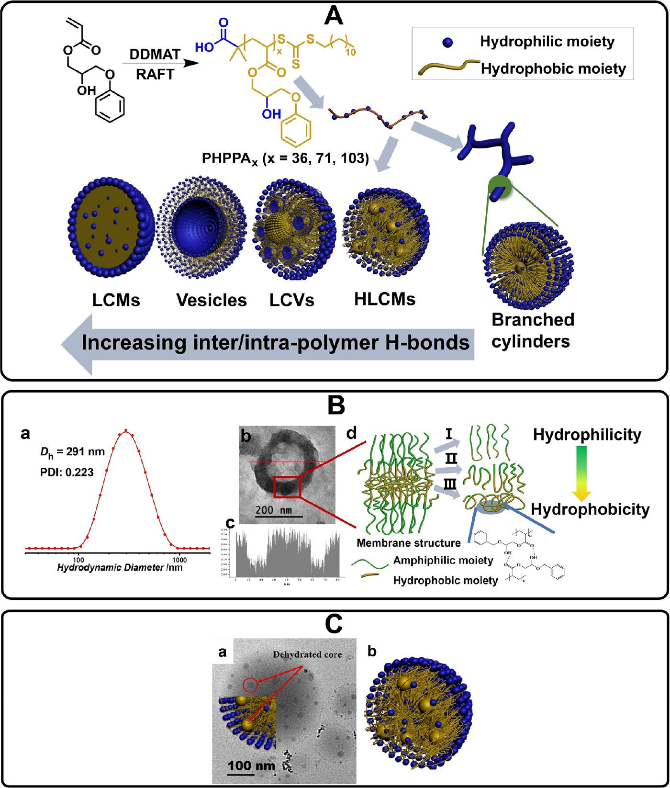

**图6：PHPPA均聚物囊泡的结构特征与氢键驱动机制**

- 图6A给出PHPPA均聚物的合成示意，强调分子间与分子内氢键对组装的驱动作用。
- 图6B-a为DLS结果，对应PHPPA71囊泡的粒径分布；图6B-b为TEM图像与结构示意；图6B-c为沿红色扫描线的电子透过率变化，用于推断膜厚，约60 nm；图6B-d示意膜内不同区域的亲疏水性分布，标出低、中、高疏水性区及对应的氢键网络差异。
- 图6C-a为HLCMs的TEM图像，图6C-b为结构示意，暗色小点对应HLCMs内部小胶束的脱水核心。

这组数据背后的分子相互作用逻辑可以简单理解为：**氢键网络决定膜的厚度与梯度**。原文给出的条件是PHPPA71在THF与水体积比1/2、聚合物浓度1.0 mg/mL、25 °C、pH 7.0条件下形成囊泡，7天透析后粒径约300 nm，膜厚约60 nm。膜比传统嵌段共聚物囊泡更厚，说明链段在膜内是多层交织，而不是薄薄一层。图6B中不同区域的氢键强度差异与红外光谱红移一起支持了膜内氢键强度梯度的结论。图6C的HLCMs进一步说明均聚物可以在大结构内部保留小胶束的脱水核心，**这是一种由疏水核心与氢键外壳共同稳定的多层级结构**。这里并不是“变成纯疏水”，而是链段内既有亲水也有疏水片段，分子内与分子间氢键会屏蔽部分亲水基团，使某些区域表现得更疏水，从而在同一膜内并存不同亲疏水性。

接下来原文的逻辑从“梯度膜”转向“形貌调控”，核心问题变成：在既定驱动力下，如何通过条件把结构推向新的形貌。下面两个图展示了两条最典型的调控路径。

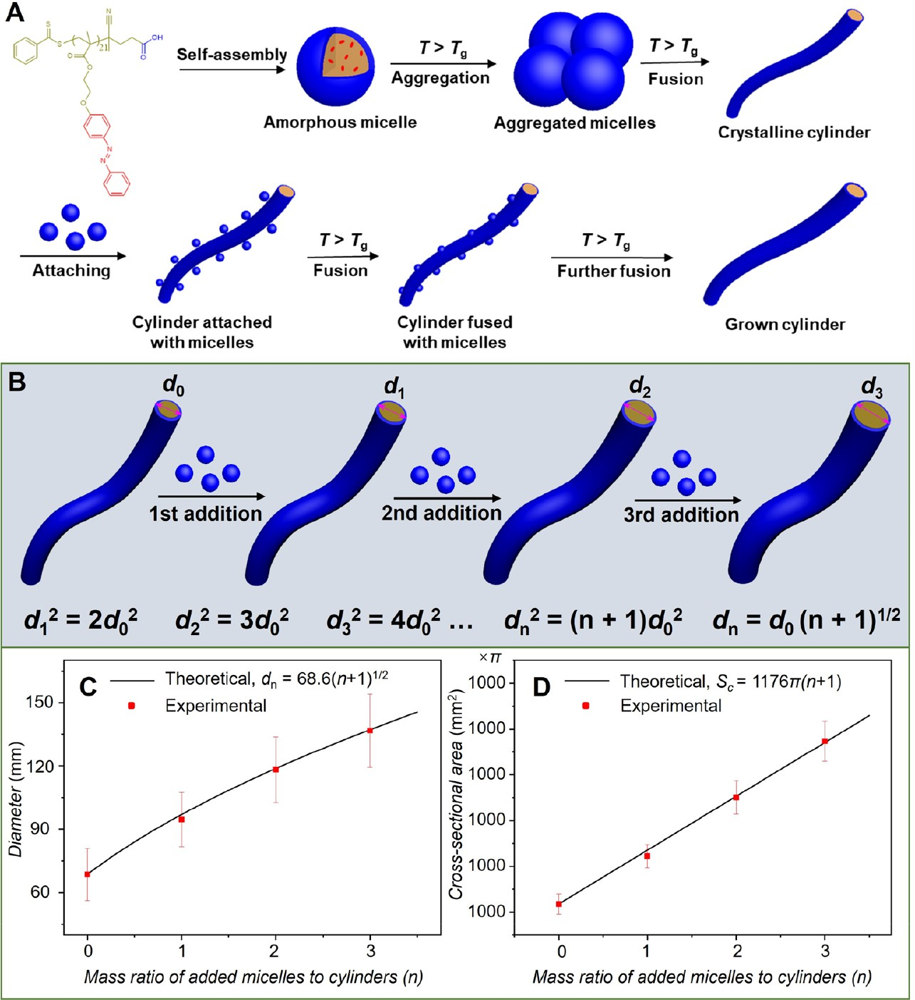

**图7：柱状结构的侧向活性生长与尺寸可调规律**

- 图7A展示PAzoMA均聚物从球形胶束出发，通过侧向生长形成柱状结构的过程，体现“活性生长”式形貌调控路径。
- 图7B给出侧向生长的示意图，强调增长并非发生在端部，而是在侧向发生融合。
- 图7C展示柱直径与加入胶束比例的关系，图7D展示柱截面积与加入胶束比例的关系，说明**通过控制种子与胶束比例可以精准调节柱状结构尺寸**。

这一过程的分子相互作用核心是**结晶驱动与链段流动性的协同**。PAzoMA具有亲水羧基端基与晶性偶氮苯侧基。这里的“晶性偶氮苯侧基”指侧链中的偶氮苯基团可以形成有序堆积并结晶，从而提供结晶域，成为驱动侧向生长的“硬骨架”。当温度高于玻璃化转变温度时，球形胶束先聚集成簇，随后在无定形向结晶的转变中发生侧向融合，从而得到柱状结构。这里的“活性”指的是结晶域在侧向持续生长，侧向生长速度由胶束供给与结晶驱动共同决定，所以柱直径可以通过胶束与柱体比例精确调节。

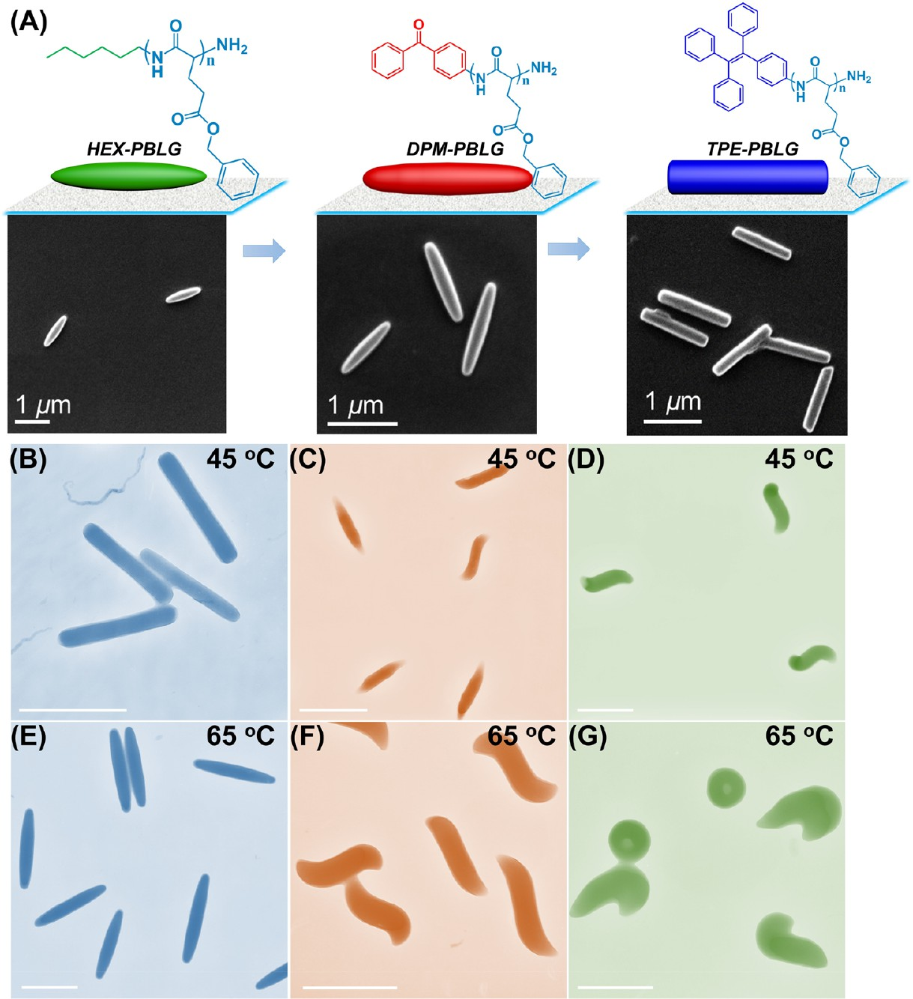

**图8：π−π堆叠与温度共同驱动的形貌调控**

- 图8A展示通过增强芳香端基的π−π堆叠可以降低曲率并拉长杆状结构，强调端基结构对形貌的直接影响。
- 图8B至图8D为45 °C条件下的TEM图像，分别对应TPE-PBLG23、DPM-PBLG25与HEX-PBLG20；图8E至图8G为65 °C条件下的TEM图像，顺序同前，刻画温度升高导致的弯曲与形貌变化。

原文给出的分子机制可以总结为：**端基决定π−π堆叠强度，温度决定柔性与弯曲程度**。作者以PBLG为骨架，引入三种端基：n-hexane、DPM与TPE。端基芳香性越强，π−π堆叠越强，杆状结构越不容易弯曲。随着温度升高，氢键与偶极作用减弱，链段柔性上升，HEX-PBLG与DPM-PBLG的杆状结构更容易失稳，而TPE-PBLG在45 °C仍保持杆状，在65 °C仅出现轻微弯曲。这一结果非常直观地说明：**形貌稳定性来自π−π堆叠强度与热扰动的竞争**。

### 应用图景：生物、环境与能源的可用性

均聚物自组装的应用优势来自结构上的“连续可调”与驱动力的多样性。文章总结的应用领域跨度较大，但可统一理解为“微结构决定功能”的典型案例。

- **生物医药方向强调载药与响应性**，例如均聚物胶束实现多柔比星（DOX）的装载效率可达**69.3**%，并能通过细胞内环境触发释放。
- **抗菌与生物检测方向强调界面电荷与光学响应**，带正电的聚合物材料通过局部电荷放大实现更强抑菌，荧光共轭聚合物可用于蛋白差异识别。
- **环境与能源方向强调模板与微孔结构**，均聚物囊泡在热处理后可形成多级孔结构，孔径分布在3.8至4.9 nm区间，并带来较高比电容。

在能源方向，PAA囊泡可作为前驱体生成含氮空心碳球，其比电容在1000次循环后仍可达到 $266.9\,\mathrm{F\cdot g^{-1}}$，并在更复杂的多级孔结构中实现 $76.5\,\mu\mathrm{F\cdot cm^{-2}}$ 的面电容表现。这些数值说明均聚物体系不仅适合精细化结构设计，也具备工程化潜力。

#### 生物应用：递送、抗肿瘤、抗菌与检测

均聚物体系在生物应用上的优势主要来自模糊边界带来的柔性与可调性。相较刚性纳米材料，均聚物囊泡与胶束更容易在生物环境中实现缓释、响应与表面功能化，这使其在递送与检测中**更具可控性与可调性**。

在药物递送与抗肿瘤应用中，均聚物胶束与囊泡通过疏水域形成药物包载空间，再借助静电或氢键稳定结构。典型的DOX装载案例说明均聚物体系不仅能实现高装载，还能通过细胞内还原环境触发释放，**核心是疏水包载与可触发释放的协同**。

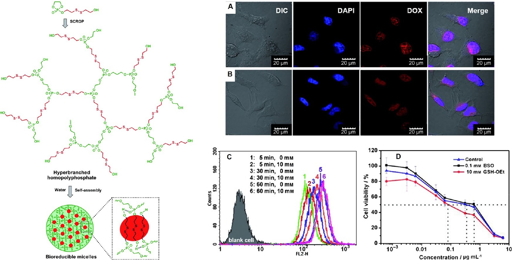

**图9：氧化还原响应胶束的结构与细胞内释放结果**

- 图9左侧给出超支化均聚物的结构及其组装为多核壳层胶束的示意，强调二硫键作为还原响应触发点。
- 图9右侧展示DOX载药胶束在细胞内的释放与细胞活性变化，体现“还原环境触发释放”的治疗逻辑。

抗菌与检测应用更多依赖电荷与光学响应。带正电的均聚物材料可以放大局部电荷密度，从而提升抑菌效率。共轭聚电解质则利用荧光响应差异实现蛋白识别，**重点在结构与信号之间的耦合**，而非单一特异性配体。

- 在抗菌方向，ε-聚赖氨酸与壳聚糖体系可通过局部正电密度放大增强抑菌效果，**关键在电荷可达性**，也就是正电荷是否暴露在表面并能接触细菌膜，而不是被埋在疏水域或被水合层屏蔽。
- 在DNA检测方向，均聚物薄膜可稳定固定DNA探针并保持其生物识别能力，**适合构建高灵敏度的阵列传感平台**。
- 在蛋白检测方向，共轭聚电解质通过多种荧光分子组合实现差异识别，**多信号耦合是均聚物体系的优势**，可以在不依赖单一配体的情况下区分复杂蛋白样本。

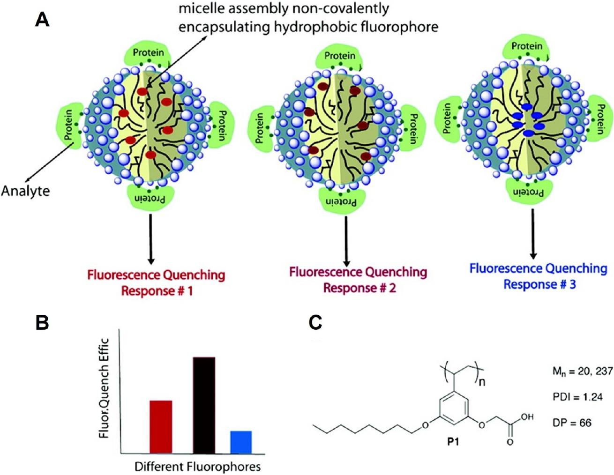

**图10：基于荧光分子组合的蛋白差异识别**

- 图10A展示不同荧光分子通过非共价作用嵌入胶束的示意，强调多信号阵列的构建方式，也就是用多种荧光分子组合形成一组可读出的信号模式，用于区分不同蛋白样本。
- 图10B给出蛋白差异响应的信号图谱，说明该体系可通过模式识别区分蛋白样本。
- 图10C展示聚合物结构与参数设置，提示“分子结构—响应信号”的可调性关系。

| 生物应用方向 | 关键结构特征 | 典型功能逻辑 |
| --- | --- | --- |
| 药物递送 | 胶束或囊泡内核 | 载药与可控释放 |
| 抗肿瘤 | 多响应结构 | 光热或化疗协同 |
| 抗菌材料 | 表面高正电密度 | 电荷放大抑菌 |
| 生物检测 | 共轭与荧光响应 | 多信号差异识别 |

#### 环境与能源应用：污染治理、催化与储能

均聚物在环境与能源领域的优势来自可模板化与可孔化。囊泡结构在热处理后可以转化为多级孔材料，孔结构尺寸可调，**适合吸附、催化与传质协同的场景**。

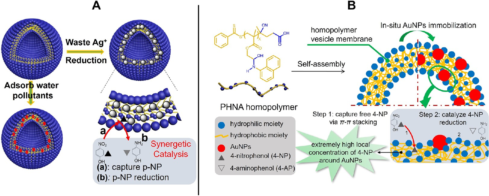

**图11：均聚物囊泡在污染治理与催化中的应用**

- 图11A展示PAA囊泡作为多功能吸附剂同时去除有机与无机污染物，并可将贵金属离子原位转化为纳米催化剂，用于对硝基苯酚的催化还原。
- 图11B展示PHNA均聚物囊泡的pH响应性以及AuNPs@囊泡体系的高效催化机制，体现模糊边界带来的“溶胀微环境”优势。

在污染治理中，均聚物囊泡可同时吸附带电染料、重金属离子与多环芳烃等污染物，并在同一平台上完成贵金属离子的原位还原，形成纳米催化剂。这个过程将“吸附”与“催化”集成在一套材料体系内，是均聚物体系的一大优势。

在能源储存中，PAA囊泡作为前驱体可形成含氮空心碳球，表现出较高循环稳定性与面电容。这里的关键不是单一性能指标，而是材料形貌与孔结构可调，**多级孔道与空心结构共同提升了传质与电化学活性**，为工程化提供了结构基础。

从分子相互作用角度看，环境与能源应用的共同逻辑是：**先用非共价相互作用组装出可控形貌，再通过热处理或反应固定为功能材料**。囊泡的模糊边界与氢键网络决定孔道与壳层结构，金属离子配位与静电作用决定吸附与原位转化效率。这种“相互作用驱动组装—结构固定”的路径，是均聚物体系走向工程应用的关键。

| 环境与能源方向 | 结构优势 | 典型功能逻辑 |
| --- | --- | --- |
| 污染治理 | 多级孔与表面官能团 | 吸附与原位转化 |
| 催化 | 模糊边界提供溶胀微环境 | 提升反应物传质 |
| 能源储存 | 空心与多孔结构 | 提升比电容与稳定性 |

### 讨论与展望：从机制理解到可规模化

作者在结论中强调了三个需要持续推进的方向：一是均聚物自组装驱动力的“**机制级**”理解仍不足，需要更多原位表征与结构解析；二是形貌控制依赖于多参数协同，需要在合成设计与溶液条件之间建立**更稳定的预测映射**；三是应用拓展需走向**可规模化与低成本**路线，尤其是在环境与能源领域。

在均聚物体系中，驱动力协同并非噪声，而是可设计变量。未来更有潜力的方向可能来自**可逆相互作用的精细调节**，例如可开关的氢键、可控的π−π堆叠，以及可逆的结晶过程。

---

## Q&A

- **Q1**：均聚物的“模糊边界”究竟是优势还是限制？
- **A1**：它既带来结构连续性和膜内梯度，也提高了形貌对环境条件的敏感性，因此更适合作为“可调控材料”而非“刚性模板”。
- **Q2**：当多种驱动力同时存在时，该如何判断主导机制？
- **A2**：可以从形貌的可逆性与结晶特征入手，例如一维晶体结构多半与CDSA相关，而溶剂敏感的球—囊泡转变更可能由疏水效应与静电协同驱动。
- **Q3**：端基策略为何能用很少的端基产生显著效应？
- **A3**：端基可以形成“局部强驱动力”，在均聚物链中产生类嵌段共聚物的作用域，从而在整体上放大形貌控制能力。

---

## 关键结论与批判性总结

#### 分子相互作用的关键 insight

结合原文各小节与具体案例，均聚物体系中的分子相互作用有几个非常实用的规律，值得单独拎出来。

- **多价对离子并不是简单屏蔽静电**，而是可以把带电链段牵引到一起，快速建立初始核，从而显著加速后续形貌演化。
- **氢键与π−π堆叠的协同关系是复杂形貌的核心推手**，单一作用力往往只能得到球形或简单结构，二者协同才更容易形成纳米碗、纳米片等非球形结构。
- **金属配位可以作为可调强度的驱动力**，例如PBPy体系中BPy与$\ce{Fe^{2+}}$配位，使氢键、π−π堆叠与配位三者叠加，形貌对pH与离子比极其敏感。
- **偶极与离子偶极作用常被低估**，在极性溶剂中，它们可以替代疏水效应成为主要驱动力，决定组装是否可逆与是否易于形貌切换。
- **梯度膜本质上是氢键强度的空间梯度**，并非两相分层，而是沿膜厚度方向的连续变化，这一结构特征会直接影响载药扩散与膜力学柔性。

#### 原文给出的关键结论

- **均聚物自组装的驱动力远不止疏水效应**，还必须系统考虑氢键、π−π堆叠、静电相互作用与结晶驱动自组装等机制。
- **两大策略是设计核心**：两亲重复单元策略需要两亲单体，端基策略依赖功能化端基，两者共同构成均聚物自组装的设计主线。
- **形貌调控依赖分子量与外界条件**，分子量、溶剂、温度、pH与外场刺激共同决定最终形貌。
- **最重要的结构特征是模糊边界**，亲水与疏水组分共存但界面不清晰，这使均聚物在生物、环境与能源领域展现独特优势。

#### 原文指出的挑战与展望

- **构建单元仍需进一步拓展**，更丰富的单体与端基库将决定未来结构多样性与功能边界。
- **机制理解仍不足**，需要通过cryo-TEM与小角X射线散射等手段解析组装中间态与微观结构。
- **真实应用范围有待扩大**，作者建议将均聚物组装体推广到更广泛的真实场景中验证其优势。
