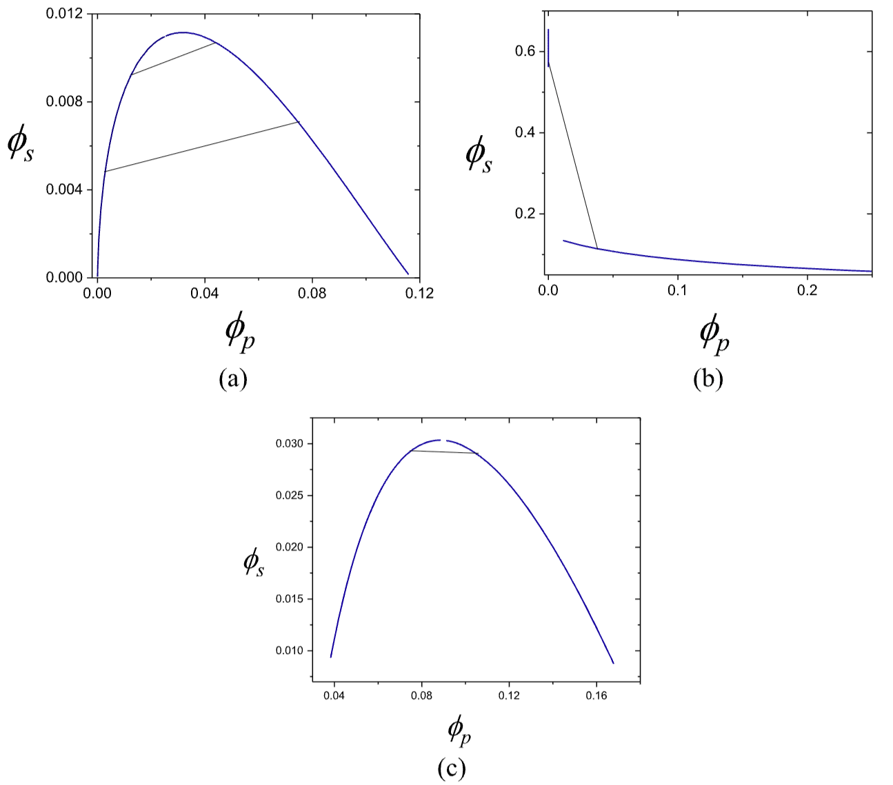
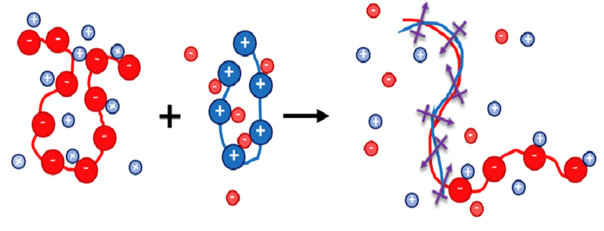
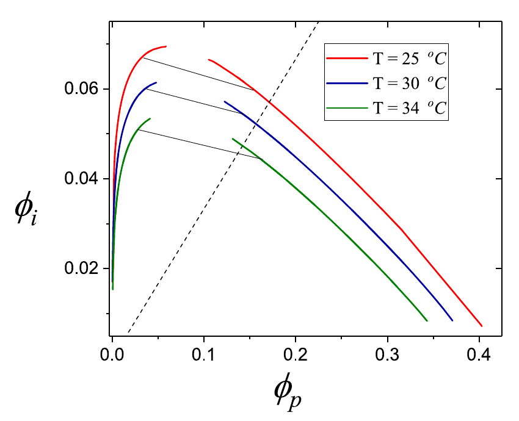
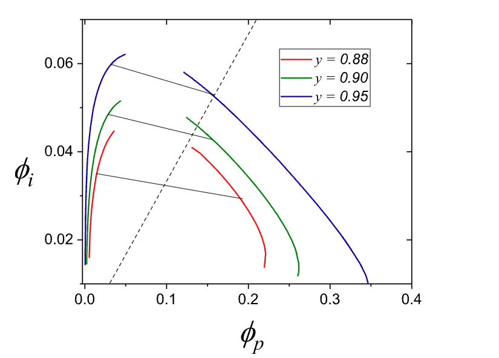
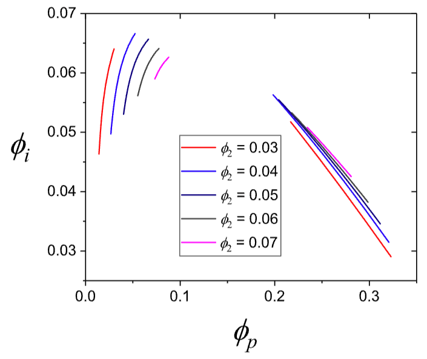
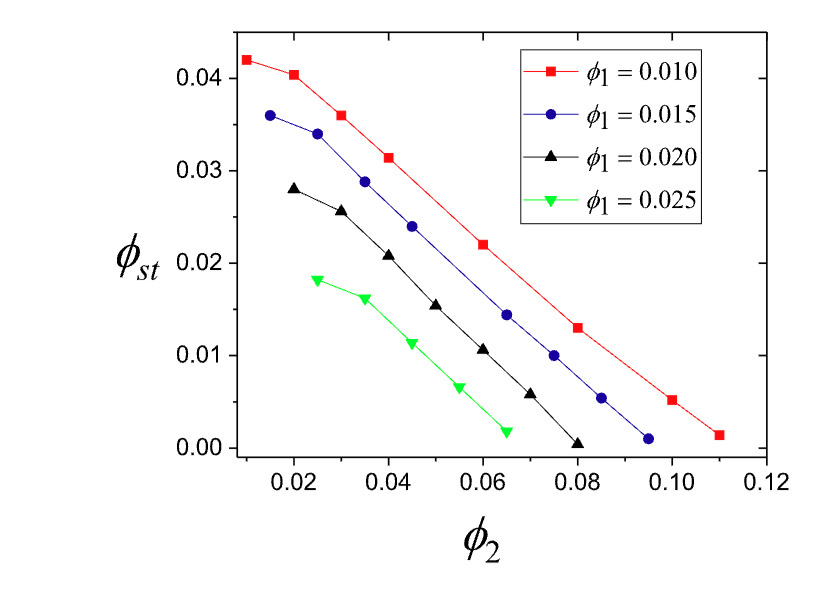
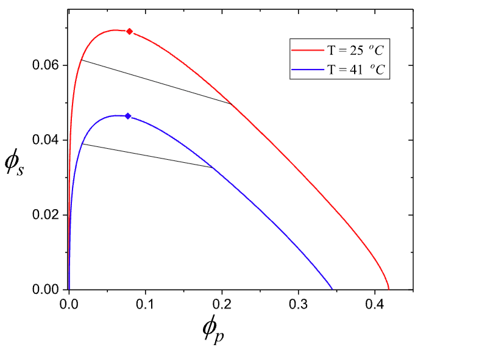
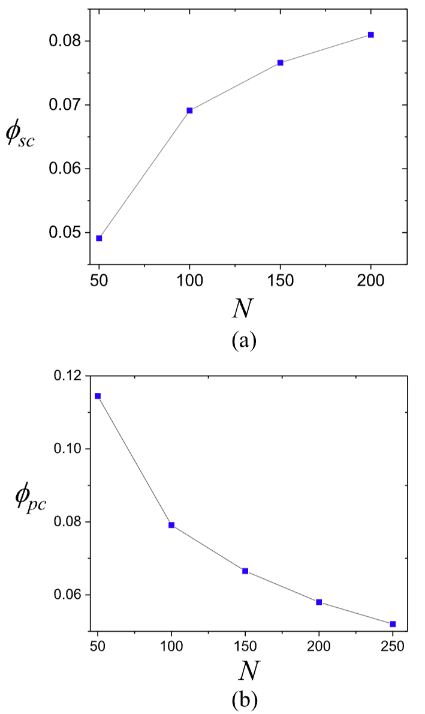
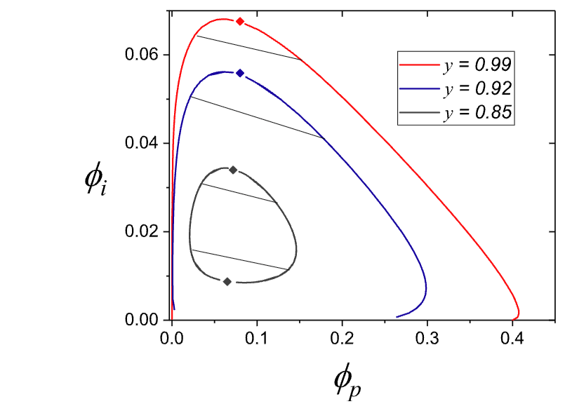

# 偶极复合驱动的聚电解质凝聚：从离子熵到相图

## 本文信息
- **标题**：电偶极相互作用驱动的聚电解质复合凝聚
- **作者**：Sabin Adhikari、Michael A. Leaf、Murugappan Muthukumar
- 发表时间：2018年7月13日
- **单位**：美国马萨诸塞大学阿默斯特分校，物理系与高分子科学与工程系
- **引用格式**：Adhikari, S., Leaf, M. A., & Muthukumar, M. (2018). Polyelectrolyte complex coacervation by electrostatic dipolar interactions. *The Journal of Chemical Physics*, *149*(16), 163308. https://doi.org/10.1063/1.5029268

## 摘要
> 论文提出了以**偶极复合链**为核心的平均场模型，描述带相反电荷的聚电解质在溶液中的复合凝聚。模型显式纳入**离子熵、偶极相互作用与溶剂相容性**，并通过自由能最小化构建相图。结果表明，偶极复合可**等效增强疏水性**，从而在中等亲水条件下仍驱动相分离；温度升高、盐度升高以及聚电解质组成不对称都会抑制凝聚；链长增加则促进凝聚。模型还预测**盐优先进入稀相**导致负斜率系线，以及**上下临界盐浓度**共同限定相分离窗口。

### 核心结论
- **偶极复合等效提升有效疏水性**，使中等亲水体系也能形成凝聚相
- **温度与盐度升高会压缩双相区**，并出现上临界盐浓度
- **组分不对称显著削弱凝聚稳定性**，链长不对称与数目不对称均如此
- **链长增加降低分相熵代价**，临界盐浓度上升而临界聚合物浓度下降
- **系线负斜率意味着盐偏向稀相**，与实验趋势一致

## 背景
聚电解质复合凝聚是带相反电荷的高分子在水溶液中形成富聚合物相与稀相的液液相分离过程。这一现象广泛存在于细胞内相分离、生物大分子复合体组装、药物递送与污水处理等场景。传统理论多强调电荷相互作用与反离子释放，但对复合后形成的**偶极结构**关注不足。

在实际体系中，相反电荷链常会局部配对，形成类似梯形的复合链段。这样的结构将电荷对折叠为偶极，从而改变链间作用与溶剂相容性。这意味着相分离驱动力不再仅来自离子熵，**偶极相互作用也可能成为稳定凝聚相的关键能量项**。

### 关键科学问题
- 偶极复合链如何改变自由能与相图的主导项
- 离子熵、偶极相互作用与溶剂相容性之间的竞争如何决定相分离窗口
- 温度、盐度、链长与组分不对称对凝聚的作用方向与强度

### 创新点
- 建立以**偶极复合链**为基本单元的平均场自由能模型
- 系统区分可区分与不可区分离子情形，并对应不同的约束方程
- 给出**负斜率系线与上下临界盐浓度**的统一解释

---

## 研究内容

### 理论框架：双组分偶极复合模型
本文理论有两层结构。第一层是对 VOT 公式与修正公式的对照，强调**反离子熵项**与正确屏蔽长度的重要性。第二层是引入偶极复合链作为新的基本单元，从而显式区分两类聚合物并给出相图预测。

#### 层一：VOT 与修正模型的差异
VOT（Voorn–Overbeek）模型使用总聚合物体积分数 $\phi_p$ 与总离子体积分数 $\phi_s$ 来写自由能，但忽略了反离子熵，并把屏蔽长度只与盐离子相关。修正模型恢复了反离子熵项，并让屏蔽长度同时依赖反离子与盐离子。这一差异直接导致图1中三种相图形状与临界温度的巨大偏离，也说明必须引入额外的吸引机制来解释实验相图。

**图1：传统 VOT 与修正模型的相图差异**。
- 子图（a）使用 VOT 公式，$N=100$，$\sigma=0.24$，$\chi=0$，$t=0.0375$（25℃）
- 子图（b）使用修正公式，$N=100$，$\alpha=0.24$，$\chi=0$，$t=0.0375$（25℃）
- 子图（c）在修正公式下引入 $\chi=0.62$，$t=0.051$（133℃）
- （a）中总离子只含盐离子，（b）（c）中总离子为盐离子与反离子之和

图1强调了一个关键事实：**忽略反离子熵会迫使模型依赖不合理高温或更大的疏水性参数**，才能得到接近实验的相图。这里的疏水性参数对应 $\\chi$。这为引入偶极复合的额外吸引作用提供了动机。

#### 层二：偶极复合链模型
模型考虑两类带相反电荷的聚电解质，链长分别为 $N_1$ 与 $N_2$，数目分别为 $n_1$ 与 $n_2$，电离度为 $\alpha$。为便于解析，取 $N_1 \leq N_2$ 且 $n_1 \leq n_2$。其核心设定是：
- 每条聚阳离子与一条聚阴离子部分配对形成梯形复合链，共有 $n_1$ 条复合链
- 仍有 $n_2' = n_2 - n_1$ 条未配对的聚阴离子残余链
- 反离子与盐离子共同构成小离子库，体系满足不可压缩与电中性约束
为简化，所有离子价数取 1，链段与小分子占据长度为 $\ell$ 的格点。

为显式区分两类聚合物，作者引入体积分数变量：

$$
\phi_1 = \frac{n_1 N_1 \ell^3}{V},\quad \phi_2 = \frac{n_2 N_2 \ell^3}{V}
$$

并定义总聚合物体积分数与多余聚合物体积分数：

$$
\phi_p = \phi_1 + \phi_2,\quad y = \frac{N_1}{N_2},\quad \phi_{ex} = \phi_2 - \frac{1}{y}\phi_1
$$

屏蔽长度显式包含两类聚合物与小离子的贡献：

$$
\kappa^2 \ell^2 = \frac{4\pi \ell_B}{\ell}\left(2\phi_1 + \alpha(\phi_2 - \phi_1) + \phi_s\right)
$$

其中 $\phi_s$ 表示外加盐离子的总浓度，$\phi_1$ 与 $\phi_2$ 的组合反映未配对链段携带的反离子贡献。

自由能密度由以下几部分组成：
- 聚合物链的平动熵与构型熵
- 聚合物段之间的电荷、偶极与排斥作用
- 小离子熵与溶剂熵
- 小离子相关能项 $f_{\mathrm{fl},i} = -\frac{1}{4\pi}[\ln(1+\kappa\ell)-\kappa\ell+\tfrac{1}{2}\kappa^2\ell^2]$

离子可区分与不可区分时，小离子熵项 $f_{Si}$ 的具体形式不同，这也是后续相图随盐处理条件变化的来源之一。两相共存时的不可压缩、电中性与杠杆规则约束详见附录。

**图2：偶极复合链的物理图像**。
- 相反电荷链局部配对，释放反离子并形成偶极列
- 在更高浓度下，可能形成更复杂的支化结构，但模型只保留成对梯形复合

图2给出的复合图像是本文模型的出发点，它使偶极相互作用在平均场自由能中占据核心地位。

### 计算设置与变量
论文给出一组代表性参数用于相图计算：
- 介电常数 $\epsilon = 80$
- 偶极长度 $p = \ell = 0.55\ \mathrm{nm}$
- 非复合段电离度 $\alpha = 1/3$
- 溶剂相容性参数 $a_{\chi} = 1.7$

主要考察变量包括温度、盐浓度、链长、聚阳离子与聚阴离子的数目不对称和链长不对称。\n\n### 结果一：含反离子的对称体系
在 $N_1 = N_2$ 且数目对称的体系中：
- 温度升高会使双相区缩小，**相分离在更高温度下消失**
- 盐度升高会屏蔽偶极吸引，形成**上临界盐浓度**
- 系线呈负斜率，表明**盐优先进入稀相**

**图3：含反离子的对称体系相图**。
- $N_1 = N_2 = 100$，$n_1 = n_2$，$\epsilon=80$，$a_{\chi}=1.7$，$p=\ell=0.55\ \mathrm{nm}$
- 红色、蓝色、绿色曲线分别对应 $t=0.06239$（25℃）、$t=0.06339$（30℃）、$t=0.06439$（34℃）
- 黑色系线为两相共存线，虚线为 $\phi_i=\alpha\phi_p$，表示仅含反离子的可达区域边界

图3显示温度升高会压缩双相区，并且系线为负斜率，反映盐离子更倾向进入稀相。

### 结果二：组分不对称的抑制效应
作者分别讨论了链长不对称与数目不对称：
- 链长不对称 $y = N_1/N_2$ 降低会显著压缩双相区
- 当 $y$ 降至约 $0.86$ 以下时，相分离消失
- 数目不对称 $n_1 < n_2$ 会降低相分离稳定性

**图4：链长不对称导致双相区收缩**。
- $n_1=n_2$，$N_2=100$，$t=0.06239$（25℃）
- $y=0.95$（蓝色）、$y=0.90$（绿色）、$y=0.88$（红色）
- 虚线为 $\phi_i=\alpha\phi_p$ 的可达边界

图4表明链长不对称越强，偶极复合越弱，凝聚越不稳定。

**图5：数目不对称下的代表性相图切片**。
- $N_1=N_2=100$，$n_1<n_2$，$t=0.06239$（25℃）
- 固定 $\phi_1=0.02$，改变 $\phi_2$ 取值为 0.03、0.04、0.05、0.06、0.07
- 曲线颜色依次对应 $\phi_2$ 从 0.03 到 0.07

图5显示当 $\phi_2$ 增大时，相分离窗口收缩，说明数目不对称同样削弱凝聚。

**图6：阈值盐浓度随组分不对称变化**。
- 纵轴为稳定单相所需的阈值盐浓度 $\phi_{st}$，横轴为 $\phi_2$
- 红色方块、蓝色圆点、黑色三角、绿色倒三角分别对应 $\phi_1=0.010$、0.015、0.020、0.025

图6进一步量化了数目不对称的抑制效应，$\phi_2$ 越大，所需阈值盐浓度越低。

### 结果三：无反离子的体系与链长效应
对先洗去反离子的体系，模型预测：
- 盐与温度仍然抑制凝聚，并出现明确的临界点
- 链长增加会提高临界盐浓度，并降低临界聚合物浓度

**图7：无反离子体系的温度与盐效应**。
- $N_1=N_2=100$，$n_1=n_2$，$\epsilon=80$，$a_{\chi}=1.7$，$p=\ell=0.55\ \mathrm{nm}$
- 红色曲线为 25℃，蓝色曲线为 41℃
- 黑色系线与菱形临界点共同标记相分离窗口

图7显示升温与加盐会同步压缩相分离区域。

**图8：链长对临界点的影响**。
- 子图（a）为临界盐浓度 $\phi_{sc}$ 随链长 $N$ 的变化
- 子图（b）为临界聚合物浓度 $\phi_{pc}$ 随链长 $N$ 的变化
- 蓝色方块为计算值，灰色线为视觉引导

图8说明链越长，凝聚越容易形成，表现为临界盐浓度上升而临界聚合物浓度下降。

### 结果四：上下临界盐浓度与离子熵
在存在残余反离子的不对称体系中，作者指出：
- **低盐区的反离子熵损失会阻止凝聚**，形成下临界盐浓度
- **高盐区的屏蔽效应会抑制凝聚**，形成上临界盐浓度

**图9：不对称体系中上下临界盐浓度的体现**。
- $n_1=n_2$，$N_2=100$，$y=N_1/N_2$ 取 0.99、0.92、0.85
- 红色、蓝色、灰色曲线依次对应 $y=0.99$、$y=0.92$、$y=0.85$
- 系线为黑色，菱形为临界点，离子包含盐与反离子

图9显示不对称越强，双相区越小，并呈现上下临界盐浓度共同限定的相分离窗口。

## 讨论与局限性
该模型属于平均场框架，仍继承 Flory–Huggins 与 Debye–Hückel 的局限性。它忽略了更复杂的复合形貌、多极相互作用、链刚性与强关联效应。作者指出，若采用场论模拟可进一步改进定量预测，但本模型已能抓住**偶极复合提升有效疏水性**这一核心机制。

---

## Q&A
- Q1：为何偶极复合会等效增强疏水性
- A1：偶极段之间的吸引相当于增加了聚合物之间的有效内聚能，使溶剂中的聚合物更倾向于相互聚集，从宏观上表现为疏水性增强
- Q2：为什么系线会呈负斜率
- A2：因为盐离子进入富聚合物相会削弱偶极吸引并提高自由能，系统倾向将盐排入稀相，从而形成负斜率系线
- Q3：链长为何会提升临界盐浓度
- A3：链越长，分相所需付出的熵代价越小，凝聚更容易发生，因此需要更高盐度才能完全屏蔽偶极吸引

---

## 关键结论与批判性总结
- 主要贡献：提出**偶极复合提升有效疏水性**的统一解释框架
- 潜在局限：平均场近似忽略强关联与多重复合结构
- 未来方向：引入更复杂的复合形貌与场论模拟，以连接具体实验体系

# 附录：偶极复合模型的约束方程

本附录整理论文原文中的约束条件，便于复现实验变量与相平衡求解。符号与正文一致，$x$ 为相 A 的体积分数。

## 可区分离子的一般情形

**不可压缩条件**：

$$
\left[\phi_{1A}\left(1 + \frac{N_2}{N_1}\right) + \phi'_{2A} + \phi_{c1A} + \phi_{c2A} + \phi_{+A} + \phi_{-A} + \phi_{0A}\right] = 1
$$

$$
\left[\phi_{1B}\left(1 + \frac{N_2}{N_1}\right) + \phi'_{2B} + \phi_{c1B} + \phi_{c2B} + \phi_{+B} + \phi_{-B} + \phi_{0B}\right] = 1
$$

**电中性条件**：

$$
\alpha \phi_{1A}\left(\frac{N_2}{N_1} - 1\right) + \alpha \phi'_{2A} + \phi_{c1A} + \phi_{-A} = \phi_{c2A} + \phi_{+A}
$$

**杠杆规则**：

$$
x\phi_{1A} + (1 - x)\phi_{1B} = \phi_1
$$

$$
x\phi'_{2A} + (1 - x)\phi'_{2B} = \phi'_2 = \phi_2 - \phi_1\frac{N_2}{N_1}
$$

$$
x\phi_{c1A} + (1 - x)\phi_{c1B} = \phi_{c1} = \phi_1
$$

$$
x\phi_{c2A} + (1 - x)\phi_{c2B} = \phi_{c2} = (1 - \alpha)\phi_1 + \alpha \phi_2
$$

$$
x\phi_{+A} + (1 - x)\phi_{+B} = \frac{\phi_s}{2}
$$

$$
x\phi_{-A} + (1 - x)\phi_{-B} = \frac{\phi_s}{2}
$$

**溶剂的冗余杠杆规则**：

$$
x\phi_{0A} + (1 - x)\phi_{0B} = \phi_0
$$

上述约束构成九个独立条件，对应两相共存时的自由能最小化问题。

## 离子不可区分的情形

当反离子与盐离子不可区分时，约束条件变为：

$$
\left[\phi_{1A}\left(1 + \frac{N_2}{N_1}\right) + \phi'_{2A} + \phi_{+A} + \phi_{-A} + \phi_{0A}\right] = 1
$$

$$
\left[\phi_{1B}\left(1 + \frac{N_2}{N_1}\right) + \phi'_{2B} + \phi_{+B} + \phi_{-B} + \phi_{0B}\right] = 1
$$

$$
\alpha \phi_{1A}\left(\frac{N_2}{N_1} - 1\right) + \alpha \phi'_{2A} + \phi_{-A} = \phi_{+A}
$$

$$
x\phi_{1A} + (1 - x)\phi_{1B} = \phi_1
$$

$$
x\phi'_{2A} + (1 - x)\phi'_{2B} = \phi'_2 = \phi_2 - \phi_1\frac{N_2}{N_1}
$$

$$
x\phi_{+A} + (1 - x)\phi_{+B} = \frac{\phi_s}{2} + (1 - \alpha)\phi_1 + \alpha \phi_2
$$

$$
x\phi_{-A} + (1 - x)\phi_{-B} = \frac{\phi_s}{2} + \phi_1
$$

该情形需要更低维度的自由能最小化。

## 对称数目情形 $n_1 = n_2$

当数目对称且离子可区分时，约束条件为：

$$
\left[\phi_{1A}\left(1 + \frac{N_2}{N_1}\right) + \phi_{c1A} + \phi_{c2A} + \phi_{+A} + \phi_{-A} + \phi_{0A}\right] = 1
$$

$$
\left[\phi_{1B}\left(1 + \frac{N_2}{N_1}\right) + \phi_{c1B} + \phi_{c2B} + \phi_{+B} + \phi_{-B} + \phi_{0B}\right] = 1
$$

$$
\alpha \phi_{1A}\left(\frac{N_2}{N_1} - 1\right) + \phi_{c1A} + \phi_{-A} = \phi_{c2A} + \phi_{+A}
$$

$$
x\phi_{1A} + (1 - x)\phi_{1B} = \phi_1
$$

$$
x\phi_{c1A} + (1 - x)\phi_{c1B} = \phi_{c1} = \phi_1
$$

$$
x\phi_{c2A} + (1 - x)\phi_{c2B} = \phi_{c2} = \left[1 + \alpha\left(\frac{N_2}{N_1} - 1\right)\right]\phi_1
$$

$$
x\phi_{+A} + (1 - x)\phi_{+B} = \frac{\phi_s}{2}
$$

$$
x\phi_{-A} + (1 - x)\phi_{-B} = \frac{\phi_s}{2}
$$

若离子不可区分，则约束进一步简化为：

$$
\left[\phi_{1A}\left(1 + \frac{N_2}{N_1}\right) + \phi_{+A} + \phi_{-A} + \phi_{0A}\right] = 1
$$

$$
\left[\phi_{1B}\left(1 + \frac{N_2}{N_1}\right) + \phi_{+B} + \phi_{-B} + \phi_{0B}\right] = 1
$$

$$
\alpha \phi_{1A}\left(\frac{N_2}{N_1} - 1\right) + \phi_{-A} = \phi_{+A}
$$

$$
x\phi_{1A} + (1 - x)\phi_{1B} = \phi_1
$$

$$
x\phi_{+A} + (1 - x)\phi_{+B} = \frac{\phi_s}{2} + \left[1 + \alpha\left(\frac{N_2}{N_1} - 1\right)\right]\phi_1
$$

$$
x\phi_{-A} + (1 - x)\phi_{-B} = \frac{\phi_s}{2} + \phi_1
$$

这些约束决定了相平衡求解的自由度维数，也对应不同的数值最小化策略。
