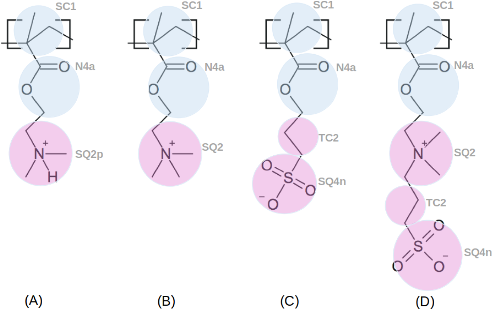
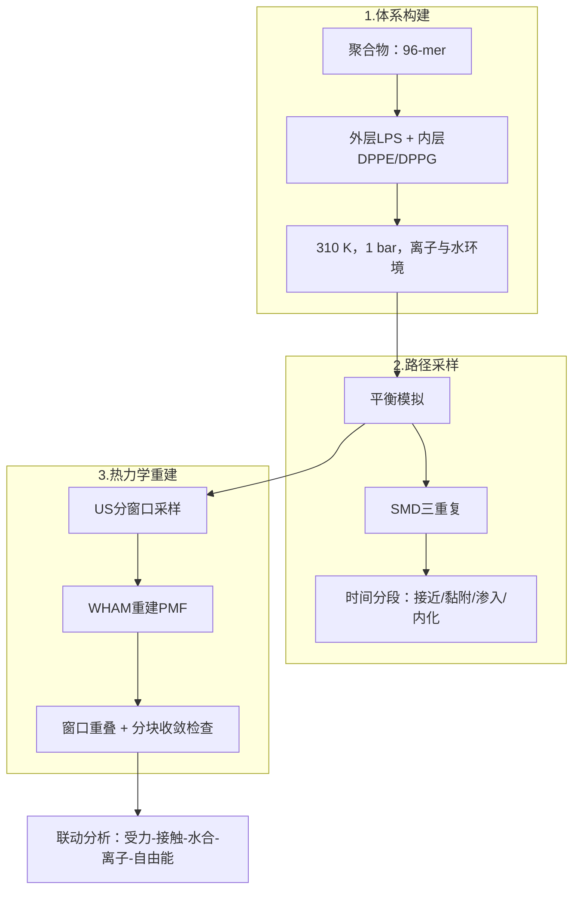
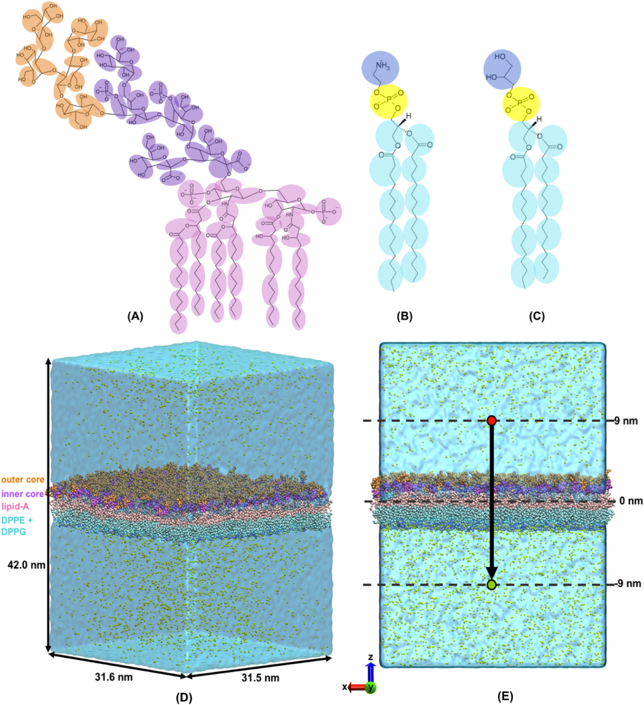
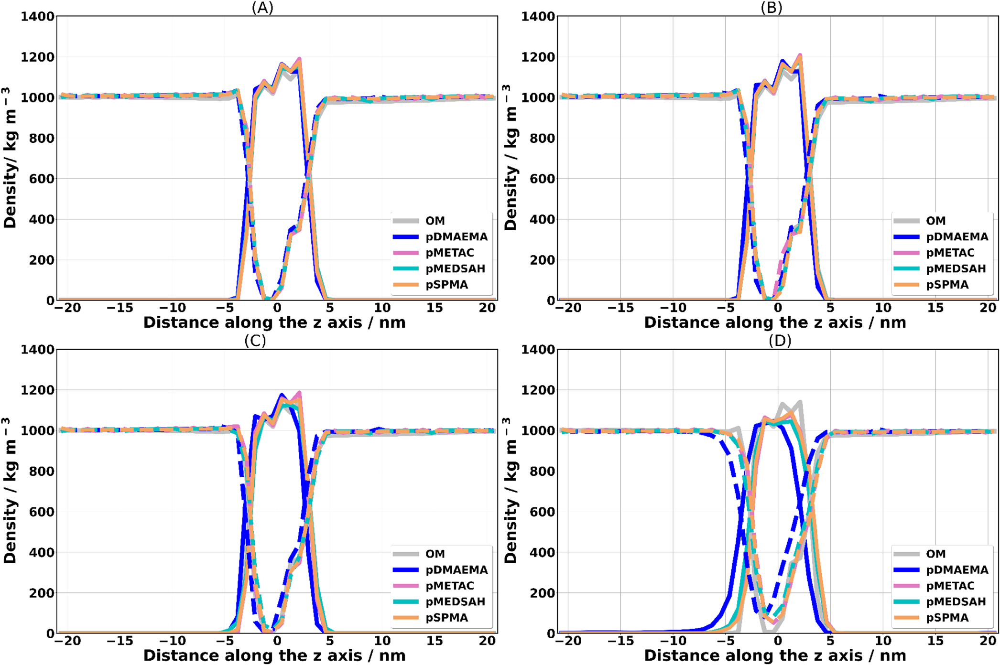
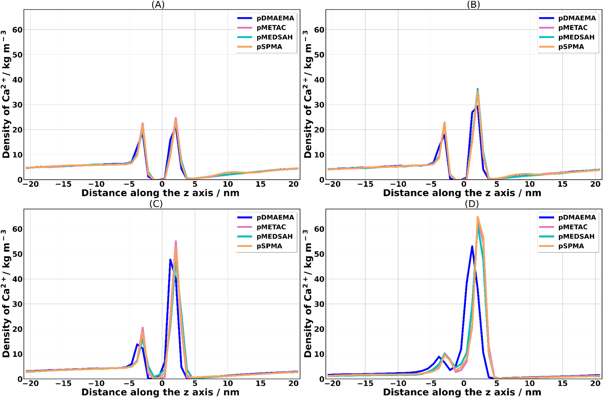
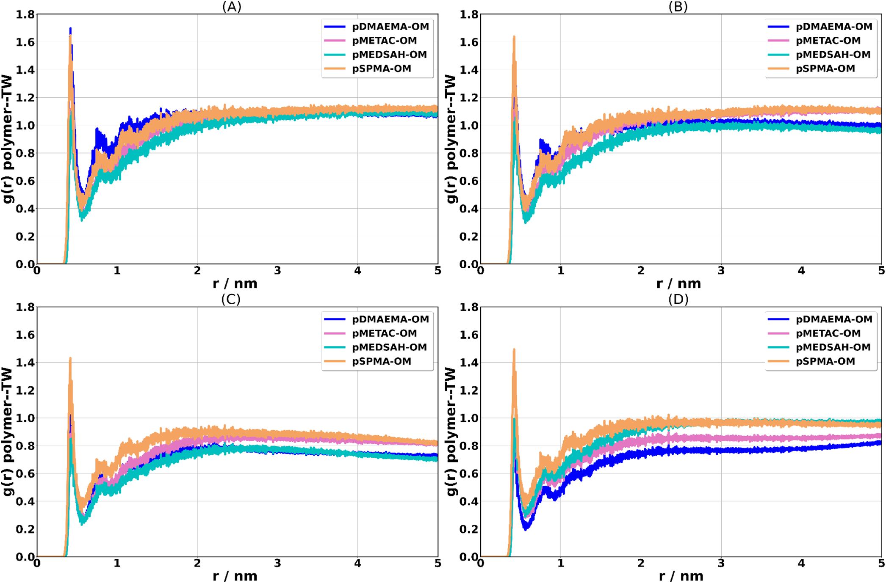
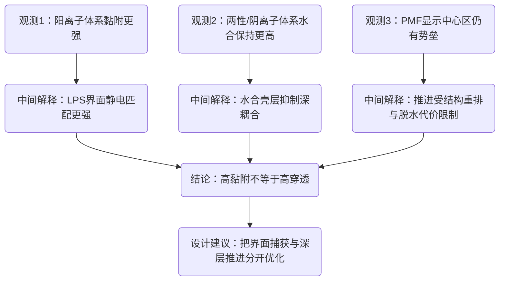

# 甲基丙烯酸酯聚合物如何作用于细菌外膜：粗粒化分子动力学给出的四阶段机制

## 本文信息

- **标题**：通过粗粒化分子动力学模拟探索甲基丙烯酸酯聚合物与细菌外膜的相互作用
- **作者**：Eduardo R. Almeida、Vinicius Firmino dos Santos、Madeleine Ramstedt、Thereza A. Soares
- 发表时间：2026年4月7日
- **单位**：圣保罗大学（巴西）、于默奥大学（瑞典）、奥斯陆大学与 Hylleraas Centre（挪威）
- **引用格式**：Almeida, E. R., Firmino dos Santos, V., Ramstedt, M., & Soares, T. A. (2026). Exploring the Interactions Between Methyl Methacrylate Polymers and the Bacterial Outer Membrane via Coarse-Grained Molecular Dynamics Simulations. *Journal of Chemical Information and Modeling*. https://doi.org/10.1021/acs.jcim.6c00729
- **源代码**：https://github.com/BioMat-USP-RP/Input-files-for-CG-simulations-of-polymers-and-bacterial-outer-membrane

## 摘要

> 聚合物刷涂层为对抗医疗器械中的细菌黏附与生物膜形成提供了一种有前景的策略。然而，不同刷层化学组成如何与细菌膜相互作用的详细分子层面理解仍不完整。在本研究中，我们使用**粗粒化分子动力学模拟**（steered molecular dynamics 与 umbrella sampling），研究了四种甲基丙烯酸甲酯衍生聚合物：`pDMAEMA`（弱阳离子）、`pMETAC`（强阳离子）、`pMEDSAH`（两性离子）和 `pSPMA`（阴离子），穿过大肠杆菌细菌外膜（OM）模型的相互作用与转运过程。模拟揭示了一个**四步转运过程**：接近、黏附、渗入和内化，并由不同的热力学与动力学特征所表征。**阳离子聚合物与外膜表面表现出明显有利的黏附**，尤其是与 LPS 分子的糖类内核结构域，这主要归因于有利的静电相互作用。在这些带正电聚合物的转运过程中，还可观察到 **LPS 单元被拖拽至细菌外膜内叶**的现象。相比之下，**两性离子与阴离子聚合物表现出较不有利的黏附**，这与其抗污行为一致。该方法提供了一个计算框架，可在分子细节层面解析与聚合物-膜相互作用相关的自由能图景与结构扰动，包括对动力学上不利过程的预测，例如聚合物向膜细胞内区域的渗入与内化。这些结果为**理解水合、电荷与聚合物结构如何影响细菌膜相互作用**提供了机制见解，并推动了抗污与抗菌表面涂层的分子设计。

### 核心结论

- **四阶段机制可稳定复现**：接近、黏附、渗入、内化的时间段与结构信号具有一致性。
- **阳离子体系界面吸附更强**：`pMETAC` 和 `pDMAEMA` 在黏附力与黏附自由能上均更占优。
- **水合作用决定“抗黏附”特征**：`pMEDSAH` 与 `pSPMA` 在后期保持更高水合，降低深层膜耦合。
- **跨膜过程动力学受限明显**：所有体系在膜中心附近都面临不同程度的渗入势垒。
- **材料设计应分目标优化**：表面捕获能力和跨膜推进能力需要拆开设计，单一电荷指标无法覆盖全流程行为。

## 背景

分子刷涂层被广泛用于医疗器械表面的抗黏附与抗菌改性，因为它们可以通过化学组成调控在生理介质中的稳定性、生物相容性和界面功能。以亲水聚电解质刷为例，体系通常分为强聚电解质和弱聚电解质两类，前者在宽 pH 范围维持带电，后者则随环境 pH 改变电离状态并形成可切换界面。对产业端而言，这决定了导管、植入物和传感界面在血液、血清、唾液等复杂体系中的失效模式；对学术端而言，这意味着**刷层化学、水合结构与生物相互作用**之间需要可量化的分子机制映射。

已有研究已经说明，抗污能力与界面水合层强度高度相关。前期 MD 与 Monte Carlo 工作表明，两性离子刷层通常比 PEG 或非两性离子亲水聚合物形成更稳定的界面水网络，从而更有效抑制蛋白吸附；同时，碳间隔长度、偶极取向与局部溶剂化排斥会进一步放大这种差异。问题在于，这些结论主要建立在“蛋白-刷层”模型上，而细菌外膜（尤其是革兰阴性菌外膜）在成分、拓扑、电荷分布和疏水性上都远比单蛋白目标复杂，外层 LPS、离子桥联和膜不对称结构共同抬高了**建模与解释难度**。

因此，这个方向的核心 gap 是**缺少能同时解释黏附、渗入与内化全过程的分子级统一框架**。尤其在带电单元比例变化时，实验已经观察到抗污与抗菌行为可被显著调制，但机制上仍不清楚：是静电吸附主导，还是水合屏障主导，或者两者在不同阶段交替主导。本文的意义就在于把问题从终点表征推进到过程分解，用粗粒化 SMD 与 US 自由能图景把“接近—黏附—渗入—内化”串成可比较路径，为后续刷层配方设计提供可执行的判据。

| 研究阶段 | 主要对象 | 常用方法 | 已有共识 | 未解决问题 |
| --- | --- | --- | --- | --- |
| 早期抗污研究 | 蛋白-聚合物刷层 | 实验吸附测试、经典 MD、MC | 两性离子刷层强水合，抗蛋白吸附更稳定 | 结论难直接外推到细菌外膜 |
| 中期机制研究 | 氨基酸类似物-刷层 | MD + 统计分析 | 水合层与溶剂化排斥是关键屏障 | 缺乏跨膜路径与动力学信息 |
| 当前前沿 | 聚合物-革兰阴性菌外膜 | 粗粒化 SMD、US、PMF | 可分离黏附有利项与渗入势垒项 | 如何把机制指标映射到材料配方与实验性能 |

### 关键科学问题

- 在 LPS 主导的外膜界面，**聚合物最先被什么物理作用抓住**，静电吸附和脱水代价谁先主导。
- 强黏附是否能自然转化成强渗入，还是会出现“**界面停留很强但向内推进困难**”的状态。
- 四类聚合物的差异能否被统一机制解释，并转换为可执行的设计参数。

### 创新点

- **同平台并行比较**：四类聚合物在同一 OM 与同一模拟流程下比较，减少跨体系偏差。
- **路径与自由能联动**：把 SMD 的时间分段与 US 的 PMF 结果联动解释，不只看单一指标。
- **指标体系更完整**：力学、自由能、水合、离子分布和接触统计共同构成解释框架。

---

## 研究内容

### 方法详述：模型、参数与流程

本文采用 MARTINI 3 粗粒化框架，核心对象是四条长度一致的聚合物链（每条 96 个单体）与不对称 *E. coli* 外膜体系。

#### 体系组成

| 模块 | 组成与参数 |
| --- | --- |
| 聚合物 | `pDMAEMA`、`pMETAC`、`pMEDSAH`、`pSPMA`，均为 96-mer |
| 外膜外层 | rough LPS |
| 外膜内层 | DPPE/DPPG = 75/25 |
| 离子与水 | $\mathrm{Ca^{2+}}$、$\mathrm{Cl^-}$、MARTINI tiny water |
| 温压条件 | 310 K，1 bar |

SI 中还给出完整组分表（Table S2）：LPS 560、DPPE 1260、DPPG 420、$\mathrm{Ca^{2+}}$ 3012、$\mathrm{Cl^-}$ 4、TW 水 616312。

**图1：四类甲基丙烯酸酯聚合物单体与粗粒化映射关系**
- **图1A–图1D**：分别对应 `pDMAEMA`、`pMETAC`、`pSPMA`、`pMEDSAH` 的单体化学结构及其 CG bead 映射。
- **颜色说明**：黑色线条为原子级化学结构，蓝色与粉色球表示映射后的粗粒化表示，灰色标记代表不同 bead 类型。

图1定义了后续相互作用分析的化学语义。后文看到的水合差异、黏附差异和离子相互作用，都由这些 bead 化学属性决定。

#### 四类聚合物参数如何构建（SI Table S1）

| 聚合物 | 离子性质 | 总电荷 | 可电离基团 | 亲水性 | 体积（nm³） |
| --- | --- | ---: | --- | --- | ---: |
| `pDMAEMA` | 阳离子 | 96（正电） | tertiary amine | hydrophilic | 1356.6 |
| `pMETAC` | 阳离子 | 96（正电） | quaternary ammonium | highly hydrophilic | 1487.6 |
| `pMEDSAH` | 两性离子 | 0 | quaternary ammonium / sulfonate | highly hydrophilic | 1315.1 |
| `pSPMA` | 阴离子 | -96 | sulfonate | hydrophilic | 1218.8 |

参数生成流程在 SI 中写得很清楚：四条链都设为 96-mer；总电荷取各单体电荷求和；体积由 GROMACS 2019.4 的 SASA 相关排除体积估算得到。这个参数化流程直接决定了后续黏附强度、去溶剂化代价和渗入势垒的排序。

#### 关键模拟设置

- 非键相互作用 cutoff 统一为 1.2 nm，静电使用 reaction field。
- 先做能量最小化，再做平衡，再进入 SMD 与 US。
- SMD 设置为沿膜法向的质心拉动，平均路径约 18 nm。
- 拉速为 $0.0001~\mathrm{nm/ps}$，弹簧常数为 $1000~\mathrm{kJ\cdot mol^{-1}\cdot nm^{-2}}$。
- 单条 SMD 轨迹约 320 ns，并进行 3 次重复。
- US 约 36 个窗口，间距约 0.3 nm，WHAM 重建 PMF，并做 bootstrap 误差估计。

#### 方法流程图

**图2：细菌外膜模型与反应坐标定义**
- **图2A–图2C**：给出 LPS、DPPE、DPPG 的结构与粗粒化表示。
- **图2D–图2E**：展示不对称外膜组装和沿膜法向推进的反应坐标。
- **颜色说明**：lipid A 为粉色，LPS inner core 为紫色，outer core 为橙色，水珠为蓝色，黑色箭头表示反应坐标方向。

图2明确了“聚合物在什么环境中前进”这个前提。尤其是 LPS 多糖区和离子分布的空间位置，直接决定后面黏附阶段的电性匹配强弱。

还需要强调一点：**外膜不对称性本身就是机制的一部分**。如果把体系简化成对称磷脂双层，很多“先被外层糖基区捕获、再向疏水核心推进”的路径特征会被弱化，最终导致对抗菌刷层设计的判断偏乐观。

### 结果一：四阶段路径的量化分段特征

SMD 轨迹把全过程稳定分为四段：approach（0–18 ns）、adhesion（18–34 ns）、permeation（34–112 ns）、internalization（112–320 ns）。

这个分段由多个信号共同定义：

- 受力曲线在不同阶段出现不同特征平台和峰值。
- 接触统计在黏附段快速上升，在渗入段重排。
- 离子和水分布在渗入到内化阶段出现显著再组织。

这一点很关键，因为它告诉我们：材料筛选不能只看终点坐标，而要看在哪个阶段“卡住”。

从工程上看，这个分段也对应了三个不同设计动作：第一步提高靠近概率，第二步提高可逆或不可逆吸附，第三步控制是否允许深入膜内。**这三步对应三个独立调控旋钮**，单一“电荷密度”无法覆盖全部阶段行为。

### 结果二：膜整体保持层状，但中心区出现瞬态含水缺陷

密度分布结果显示，外膜宏观层状结构总体稳定，没有出现持续性大破裂。与此同时，进入内化阶段后，膜中心出现局部含水增强，中心水密度约 $100~\mathrm{kg\cdot m^{-3}}$。

**图3：四阶段中外膜与水的质量密度沿 z 轴分布**
- **图3A–图3D**：分别对应接近、黏附、渗入、内化阶段。
- **线型说明**：实线表示膜组分密度，虚线表示水密度，银色参考线为无聚合物扰动时的膜分布。

图3最核心的信息是**整体结构稳定，但局部会被拉出动态缺陷**。它支撑了本文对穿膜机制的保守判断，即渗入依赖局部重排而非全局崩解。

这类信号对应**局部扰动窗口**。聚合物推进依赖局部重排与短时缺陷，体系不具备低阻力自由穿透通道。

### 结果三：离子重排解释了“强吸附但不一定易穿透”

$\mathrm{Ca^{2+}}$ 在外膜中本身承担桥联与稳定作用。在渗入和内化阶段，$\mathrm{Ca^{2+}}$ 分布发生明显重排，膜中心区域也出现增强信号（约 $4.0~\mathrm{kg\cdot m^{-3}}$）。

结合接触分析可以看到，阳离子聚合物在 LPS 内核糖基区域形成更强相互作用。这解释了它们为什么更容易在界面**站住脚**，但后续向内推进仍要承担较高的结构重排代价。

从设计角度看，这意味着**增加电荷主要改善前半程**，后半程推进仍受结构重排与脱水代价控制。

**图4：四阶段中 $\mathrm{Ca^{2+}}$ 沿膜法向的密度重排**
- **图4A–图4D**：对应接近、黏附、渗入、内化阶段下的 $\mathrm{Ca^{2+}}$ 分布变化。
- **颜色说明**：不同颜色曲线对应不同聚合物体系，横轴为膜法向坐标，曲线峰位变化反映离子桥联区域迁移。

图4把**离子是背景**变成了**离子是机制参与者**。当聚合物推进到深层时，$\mathrm{Ca^{2+}}$ 的再分布与局部结构重排同步出现，这解释了为什么后半程阻力会抬升。

原文还提到阳离子聚合物转运过程中可见 LPS 单元被“拖拽”向内叶，这一点和离子重排一起说明：**体系响应表现为聚合物推进与膜组分协同牵引**。因此，后半程的能量代价同时包含聚合物推进成本和膜环境重构成本。

### 结果四：水合层是两性离子与阴离子体系的重要缓冲器

在 permeation 阶段，四类体系的配位数下降比例分别约为：

- `pDMAEMA`：25.5%
- `pMETAC`：21.8%
- `pMEDSAH`：22.7%
- `pSPMA`：19.1%

其中 `pMEDSAH` 与 `pSPMA` 在后期保持或恢复水合层的能力更明显。这一“带水外壳”特征与常见抗污逻辑一致：水合层越稳，非特异深耦合倾向越弱。

因此，如果目标是抗污或低刺激表面，这类聚合物具有天然优势；如果目标是高效膜穿透杀菌，仅靠该特征并不足够。

**图5：四阶段中聚合物与水珠的径向分布函数 g(r)**
- **图5A–图5D**：对应接近、黏附、渗入、内化阶段的 polymer–TW 统计。
- **线条说明**：四条曲线分别对应四类聚合物，峰位和峰高变化反映局部水结构与水合壳层稳定性变化。

图5和配位数表一起构成了“水合机制证据链”。它说明两性离子和阴离子体系在后期更容易维持含水壳层，从而抑制深层非特异耦合。

### 结果五：力学与自由能给出一致排序

为避免读者在三张表之间来回切换，这里把关键量合并为一张对照表。力学单位为 $\mathrm{kJ\cdot mol^{-1}\cdot nm^{-1}}$，自由能单位为 $\mathrm{kJ\cdot mol^{-1}}$。

| 聚合物 | $F_{adh}$ | $F_{max}$ | $\Delta G_{adh}$ | $\Delta G^{\ddagger}_{per}$ |
| --- | ---: | ---: | ---: | ---: |
| `pMETAC` | $292.9 \pm 11.7$ | $1855.7 \pm 228.4$ | $-761.3 \pm 12.1$ | $82.8 \pm 12.1$ |
| `pDMAEMA` | $236.6 \pm 19.1$ | $1940.0 \pm 102.2$ | $-585.6 \pm 2.1$ | $75.9 \pm 5.4$ |
| `pMEDSAH` | $154.3 \pm 31.7$ | $1762.9 \pm 215.2$ | $-440.4 \pm 2.1$ | $266.4 \pm 4.4$ |
| `pSPMA` | $85.5 \pm 4.1$ | $1704.3 \pm 97.2$ | $-284.4 \pm 5.2$ | $134.6 \pm 7.2$ |

这张表同时给出三层信息：第一，阳离子体系在 $\Delta G_{adh}$ 上更有利；第二，`pMETAC` 与 `pDMAEMA` 都有较高界面吸附能力，但推进到膜内的势垒排序并不与吸附完全同步；第三，`pMEDSAH` 的 $\Delta G^{\ddagger}_{per}$ 明显更高，说明其水合稳定性和局部结构重排代价共同抬升了深入膜内的动力学难度。**强界面黏附与低渗入势垒属于两个独立维度**。

为了让这个结论更可操作，可以把材料设计拆成二维目标：一个轴是**界面捕获能力**，另一个轴是**向内推进能力**。在这个坐标里，`pMETAC` 与 `pDMAEMA` 更靠近高捕获区，`pMEDSAH` 更接近高水合屏障区。**不同应用场景对应不同象限**。

| 设计目标 | 更关注的指标 | 倾向的化学策略 |
| --- | --- | --- |
| 抗污优先 | 高水合、低深层耦合 | 提高两性离子特征，维持稳定水合壳层 |
| 抗菌黏附优先 | 更负的 $\Delta G_{adh}$、更高 $F_{adh}$ | 保留阳离子单元并控制局部电荷分布 |
| 穿膜递送优先 | 较低 $\Delta G^{\ddagger}_{per}$ + 适中吸附 | 平衡电荷驱动与去溶剂化代价，避免过强界面“滞留” |

### 结果逻辑图：从观测到结论

### SI 数据如何增强正文可信度

SI 提供主结论的统计支撑：

- Table S1 给出四类聚合物净电荷与体积差异，为后续力学排序提供物理背景。
- Table S3 给出 1.0 μs 自由链的 RMSD 与 Rg，证明比较是在已平衡链构象上进行。
- Table S4 给出外膜面积与厚度收敛指标，证明膜基线结构可靠。
- Table S5 给出各阶段 CN 绝对值，避免只看百分比造成误判。
- FigS5 和 FigS6 给出 US 窗口重叠与分块分析，支撑 PMF 收敛。

---

## 文献精读：逻辑结构四段法与证据分层

### 1. 逻辑拆解（每项一句话）

- **小背景**：本文切入的是抗菌/抗污聚合物刷层与革兰阴性菌外膜相互作用的分子机制问题。
- **真问题**：当前工作能观察抗菌或抗污现象，但难以给出从接近到内化的连续机制链条，这是一个明确且重要的机制问题。
- **课题设计**：作者设想通过同骨架不同电性聚合物的并行比较，把电荷、水合与膜重排的贡献在统一框架下拆分出来。
- **验证方法**：采用粗粒化 SMD 给路径、US 与 WHAM 给 PMF，再用密度分布、RDF、CN、受力曲线和接触统计交叉验证假设。

### 2. 实验证据的“成分分析”

| 证据类型 | 本文对应内容 | 在论证中的角色 |
| --- | --- | --- |
| 核心实验（骨架） | Figure 7 力曲线 + Table 3 力学指标 + Figure 8 PMF + Table 4 自由能参数 | 直接支撑“黏附强弱”和“渗入势垒”并非同一个维度 |
| 求新炫技（首饰） | 四阶段构象图和完整可视化路径呈现 | 提升可读性与说服力，结论仍由核心力学与自由能证据支撑 |
| 交叉印证（肌肉） | Figure 3/4 的膜与离子密度、Figure 5/6 + Table S5 的水合证据、SI 收敛检查 | 让“静电-水合-重排”三条证据链闭环，避免孤证 |
| Show工作量（体力活） | 三重复轨迹、窗口采样、参数扫描和 SI 扩展表格 | 提高稳健性与可复现性，降低“偶然结果”风险 |

### 3. 批判性思考

- **找茬1（边界条件）**：本文用自由链近似刷层末端并采用最小 DPPE/DPPG 内叶模型，结论更接近机制上限，真实表面仍需单独标定数值。
- **找茬2（证据一致性）**：主文中**阳离子更强黏附**与**推进势垒不必然更低**在力学和自由能表中是自洽的，没有明显互相打架的证据。
- **找茬3（可外推性）**：从 OM 模型到复杂生物环境仍缺少蛋白冠、流体剪切和多组分竞争吸附等现实因素，因此应用外推需要二次验证。

### 4. 一句话定性核心创新

本文的核心贡献是把聚合物-细菌外膜作用从**终点性能比较**升级为**可分解的四阶段机制图谱**，并用统一自由能框架揭示了**界面黏附增强与深层渗入受限可以并存**。

### 5. 这篇文档还能补什么（提精度且保留格式）

- 把 Figure 6、Figure 7、Figure 8、Figure 9 也按“图片 + 图注 + 解读”补入正文，形成从水合到力学到 PMF 的完整图文链条。
- 在结果表格后加一张“指标-结论映射表”，逐项写明每个指标支持哪个论点，降低读者跨段跳读成本。
- 在局限性里单列“哪些结论是定性稳健、哪些数值仅适用于当前模型”，让应用读者更容易判断可迁移范围。

---

## Q&A

- **Q1**：既然是 SMD 推着走，为什么还能讨论机制，不会全是“外力伪影”吗？  
  **A1**：这里的目标是构建可比较路径并提取阶段特征。不同体系共享同一 protocol 时，路径差异可直接比较，再由 US/PMF 把动力学路径与热力学代价连接起来。

- **Q2**：`pMETAC` 黏附最强，但 `pDMAEMA` 的 `F_max` 更高，怎么理解这个差异？  
  **A2**：`F_adh` 反映界面抓附能力，`F_max` 更容易受后续推进过程中的局部重排事件影响。两者排序不完全一致并不矛盾，反而说明“界面吸附”和“深层推进”是不同物理过程。

- **Q3**：两性离子聚合物势垒为什么会这么高？  
  **A3**：两性离子体系往往保持较稳定水合壳层，且内部正负基团带来局部补偿，结果是对非特异深层插入更“保守”。这对抗污有利，但对强侵入目标不一定有利。

- **Q4**：这篇工作的结论能直接外推到真实细胞环境吗？  
  **A4**：不能直接一比一外推。本文也明确把结果定位为受控机制图谱，尤其在自由链近似、外膜组分简化和时间尺度转换上，仍需和实验联合标定。

- **Q5**：对后续聚合物设计，最实用的一条建议是什么？  
  **A5**：先定义目标场景。如果目标是抗菌侵入，就增强“界面捕获 + 推进能力”的组合；如果目标是抗污低吸附，就优先维持稳定水合壳层。不要再用“净电荷越高越好”作为单一设计原则。

## 关键结论与批判性总结

### 主要影响

- **机制影响**：把聚合物-外膜作用拆成可量化四阶段，显著提升了解释力。
- **方法影响**：SMD 与 US 联动形成了可复用的比较框架，适合做系列化学空间筛选。
- **设计影响**：明确了“黏附性能”和“穿透性能”的分离性，为抗菌与抗污双赛道提供了不同优化路径。

### 局限性

- 本文使用自由链近似来代表刷层远端链段，真实接枝密度和拥挤效应仍待展开。
- PMF 主要覆盖到膜中心附近，完整跨膜后续事件需要更长尺度与更高采样成本。
- 不对称外膜导致正反向路径不可直接类比，常规滞后分析并不直接适用。

### 未来方向

- 在显式刷层接枝体系中系统扫描链长、接枝密度和侧链化学组成。
- 把模拟指标与实验中的杀菌活性、膜完整性和细胞毒性建立可预测映射。
- 引入更复杂外膜异质性与环境扰动，评估机制结论在真实菌膜中的稳健性。
