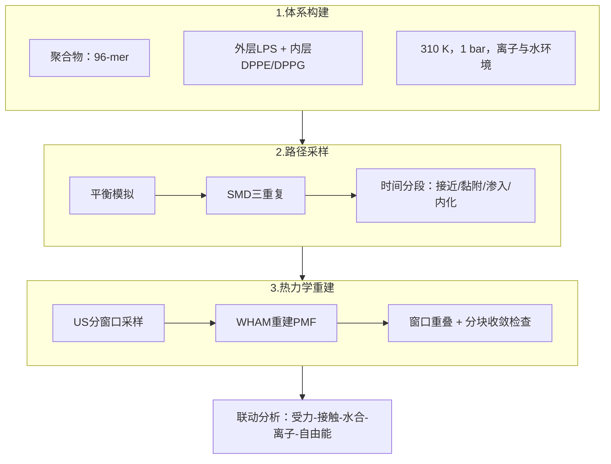
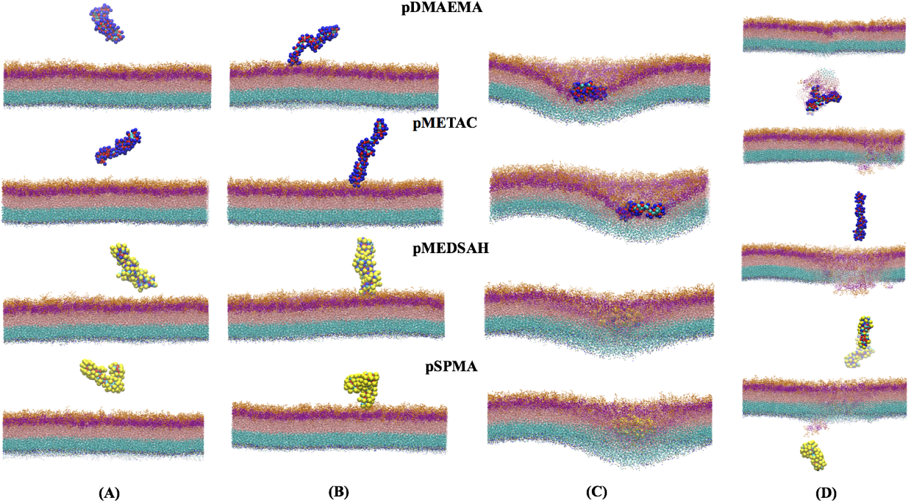
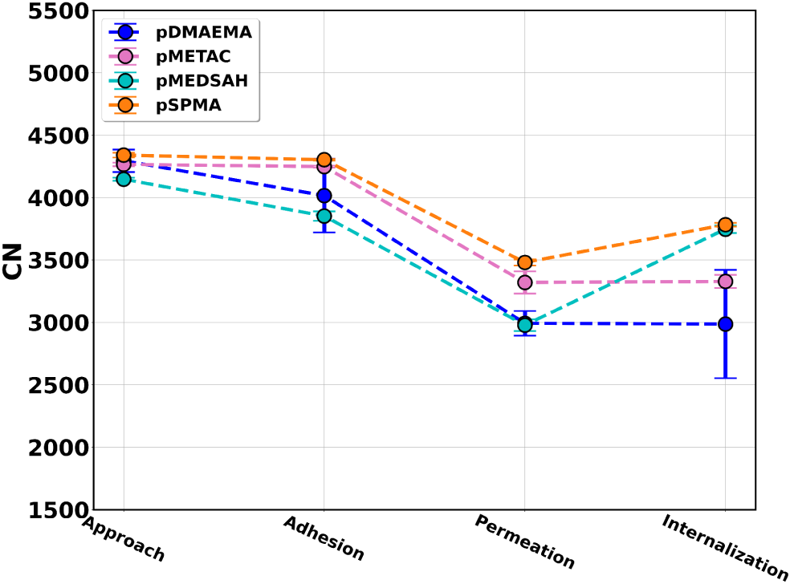
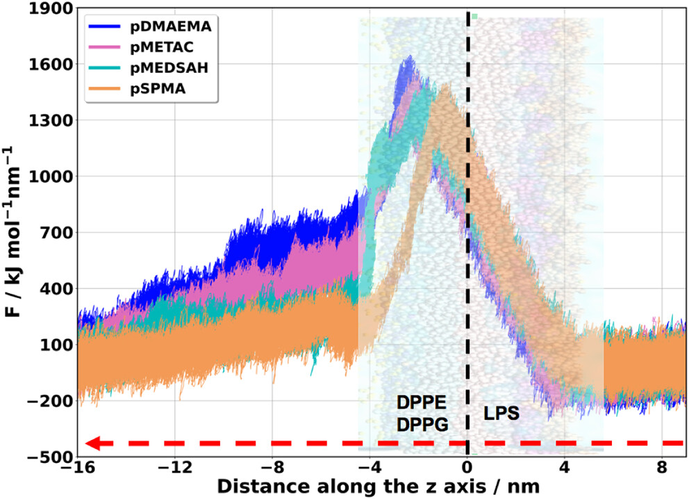
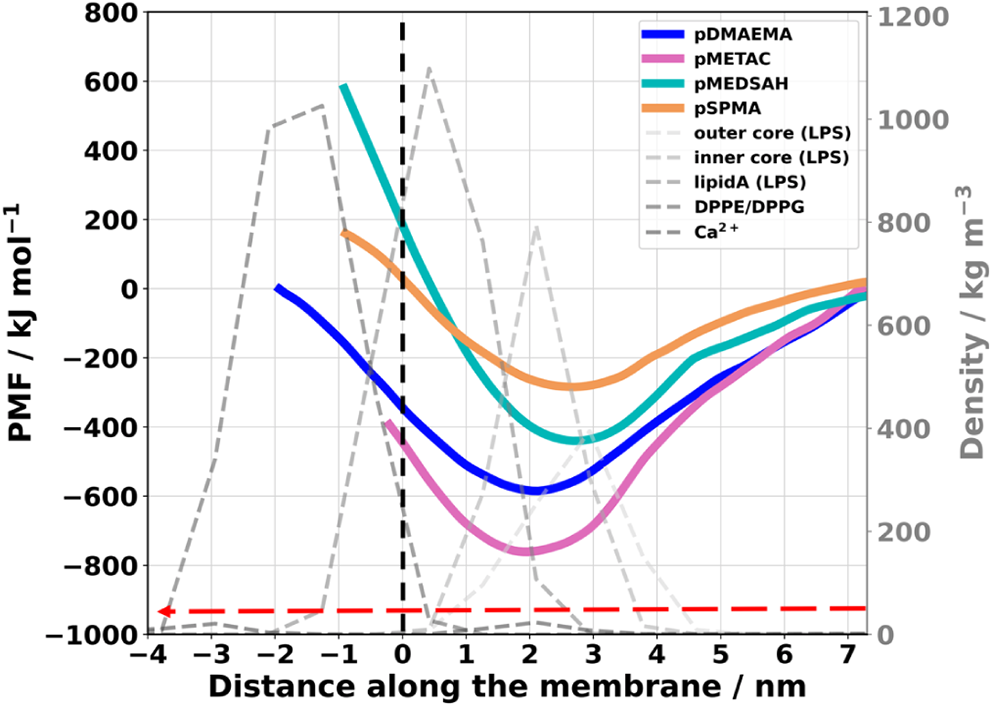
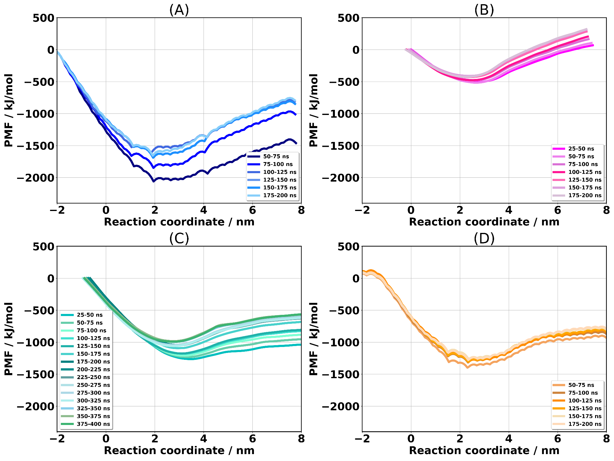
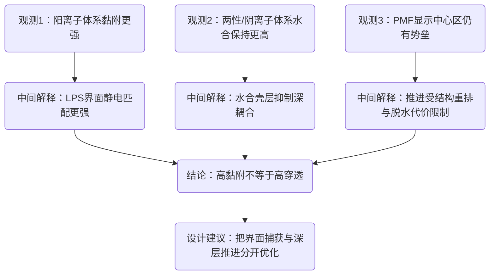

# 甲基丙烯酸酯聚合物如何作用于细菌外膜：粗粒化分子动力学给出的四阶段机制

## 本文信息

- **标题**：通过粗粒化分子动力学模拟探索甲基丙烯酸酯聚合物与细菌外膜的相互作用
- **作者**：Eduardo R. Almeida、Vinicius Firmino dos Santos、Madeleine Ramstedt、Thereza A. Soares
- 发表时间：2026年4月7日
- **单位**：圣保罗大学（巴西）、于默奥大学（瑞典）、奥斯陆大学与 Hylleraas Centre（挪威）
- **引用格式**：Almeida, E. R., Firmino dos Santos, V., Ramstedt, M., & Soares, T. A. (2026). Exploring the Interactions Between Methyl Methacrylate Polymers and the Bacterial Outer Membrane via Coarse-Grained Molecular Dynamics Simulations. *Journal of Chemical Information and Modeling*. https://doi.org/10.1021/acs.jcim.6c00729
- **源代码**：https://github.com/BioMat-USP-RP/Input-files-for-CG-simulations-of-polymers-and-bacterial-outer-membrane

## 摘要

> 聚合物刷涂层为对抗医疗器械中的细菌黏附与生物膜形成提供了一种有前景的策略。然而，不同刷层化学组成如何与细菌膜相互作用的详细分子层面理解仍不完整。在本研究中，我们使用**粗粒化分子动力学模拟**（steered molecular dynamics 与 umbrella sampling），研究了四种甲基丙烯酸甲酯衍生聚合物：pDMAEMA（弱阳离子）、pMETAC（强阳离子）、pMEDSAH（两性离子）和 pSPMA（阴离子），穿过大肠杆菌细菌外膜（OM）模型的相互作用与转运过程。模拟揭示了一个**四步转运过程**：接近、黏附、渗入和内化，并由不同的热力学与动力学特征所表征。**阳离子聚合物与外膜表面表现出明显有利的黏附**，尤其是与 LPS 分子的糖类内核结构域，这主要归因于有利的静电相互作用。在这些带正电聚合物的转运过程中，还可观察到 **LPS 单元被拖拽至细菌外膜内叶**的现象。相比之下，**两性离子与阴离子聚合物表现出较不有利的黏附**，这与其抗污行为一致。该方法提供了一个计算框架，可在分子细节层面解析与聚合物-膜相互作用相关的自由能图景与结构扰动，包括对动力学上不利过程的预测，例如聚合物向膜细胞内区域的渗入与内化。这些结果为**理解水合、电荷与聚合物结构如何影响细菌膜相互作用**提供了机制见解，并推动了抗污与抗菌表面涂层的分子设计。

### 核心结论

- **四阶段机制可稳定复现**：接近、黏附、渗入、内化的时间段与结构信号具有一致性。
- **阳离子体系界面吸附更强**：pMETAC 和 pDMAEMA 在黏附力与黏附自由能上均更占优。
- **水合作用决定“抗黏附”特征**：pMEDSAH 与 pSPMA 在后期保持更高水合，降低深层膜耦合。
- **跨膜过程动力学受限明显**：所有体系在膜中心附近都面临不同程度的渗入势垒。
- **强吸附不等于顺利穿膜**：approach 与 adhesion 可自发发生，但 permeation 与 internalization 都是动力学不利步骤。
- **阳离子链会牵引膜组分重排**：主文明确观察到 LPS 被正电聚合物拖向内侧，并在后期形成瞬态 nanopores。
- **材料设计应分目标优化**：表面捕获能力和跨膜推进能力需要拆开设计，单一电荷指标无法覆盖全流程行为。

## 背景

分子刷涂层被广泛用于医疗器械表面的抗黏附与抗菌改性，因为它们可以通过化学组成调控在生理介质中的稳定性、生物相容性和界面功能。以亲水聚电解质刷为例，体系通常分为强聚电解质和弱聚电解质两类，前者在宽 pH 范围维持带电，后者则随环境 pH 改变电离状态并形成可切换界面。对产业端而言，这决定了导管、植入物和传感界面在血液、血清、唾液等复杂体系中的**失效模式**；对学术端而言，这意味着**刷层化学、水合结构与生物相互作用**之间需要可量化的分子机制映射。

已有研究已经说明，抗污能力与界面水合层强度高度相关。前期 MD 与 Monte Carlo 工作表明，两性离子刷层通常比 PEG 或非两性离子亲水聚合物形成更稳定的界面水网络，从而更有效抑制蛋白吸附；同时，碳间隔长度、偶极取向与局部溶剂化排斥会进一步放大这种差异。问题在于，这些结论主要建立在“蛋白-刷层”模型上，而细菌外膜（尤其是革兰阴性菌外膜）在成分、拓扑、电荷分布和疏水性上都远比单蛋白目标复杂，外层 LPS、离子桥联和膜不对称结构共同抬高了**建模与解释难度**，也抬高了**机制外推门槛**。

因此，这个方向的核心 gap 是**缺少能同时解释黏附、渗入与内化全过程的分子级统一框架**。尤其在带电单元比例变化时，实验已经观察到抗污与抗菌行为可被显著调制，但机制上仍不清楚：是静电吸附主导，还是水合屏障主导，或者两者在不同阶段交替主导。本文的意义就在于把问题从终点表征推进到过程分解，用粗粒化 SMD 与 US 自由能图景把“接近—黏附—渗入—内化”串成可比较路径，为后续刷层配方设计提供**可执行判据**。

| 研究阶段 | 主要对象 | 常用方法 | 已有共识 | 未解决问题 |
| --- | --- | --- | --- | --- |
| 早期抗污研究 | 蛋白-聚合物刷层 | 实验吸附测试、经典 MD、MC | 两性离子刷层强水合，抗蛋白吸附更稳定 | 结论难直接外推到细菌外膜 |
| 中期机制研究 | 氨基酸类似物-刷层 | MD + 统计分析 | 水合层与溶剂化排斥是关键屏障 | 缺乏跨膜路径与动力学信息 |
| 当前前沿 | 聚合物-革兰阴性菌外膜 | 粗粒化 SMD、US、PMF | 可分离黏附有利项与渗入势垒项 | 如何把机制指标映射到材料配方与实验性能 |

### 关键科学问题

- 在 LPS 主导的外膜界面，**聚合物最先被什么物理作用抓住**，静电吸附和脱水代价谁先主导。
- 强黏附是否能自然转化成强渗入，还是会出现“**界面停留很强但向内推进困难**”的状态。
- 四类聚合物的差异能否被统一机制解释，并转换为可执行的设计参数。

### 创新点

- **同平台并行比较**：四类聚合物在同一 OM 与同一模拟流程下比较，减少跨体系偏差。
- **路径与自由能联动**：把 SMD 的时间分段与 US 的 PMF 结果联动解释，不只看单一指标。
- **指标体系更完整**：力学、自由能、水合、离子分布和接触统计共同构成解释框架。

---

## 研究内容

### 方法详述：模型、参数与流程

> 本文采用 MARTINI 3 粗粒化框架，核心对象是四条长度一致的聚合物链（每条 96 个单体）与不对称 *E. coli* 外膜体系，形成**同平台可比体系**。

#### 体系组成

| 模块 | 组成与参数 |
| --- | --- |
| 聚合物 | pDMAEMA、pMETAC、pMEDSAH、pSPMA，均为 96-mer |
| 外膜外层 | rough LPS |
| 外膜内层 | DPPE/DPPG = 75/25 |
| 离子与水 | $\mathrm{Ca^{2+}}$、$\mathrm{Cl^-}$、MARTINI tiny water |
| 温压条件 | 310 K，1 bar |

SI 中还给出完整组分表（Table S2）：LPS 560、DPPE 1260、DPPG 420、$\mathrm{Ca^{2+}}$ 3012、$\mathrm{Cl^-}$ 4、TW 水 616312，保证了**体系组成可复现**。

**图1：四类甲基丙烯酸酯聚合物单体与粗粒化映射关系**
- 图1A–图1D分别对应 pDMAEMA、pMETAC、pSPMA、pMEDSAH 的单体化学结构及其 CG bead 映射。
- 颜色说明：黑色线条为原子级化学结构，蓝色与粉色球表示映射后的粗粒化表示，灰色标记代表不同 bead 类型。

> 图1定义了后续相互作用分析的化学语义。后文看到的水合差异、黏附差异和离子相互作用，都由这些 bead 化学属性决定，属于**参数驱动的结构结果**。

#### 四类聚合物参数如何构建（SI Table S1）

| 聚合物 | 离子性质 | 总电荷 | 可电离基团 | 亲水性 | 体积（nm³） |
| --- | --- | ---: | --- | --- | ---: |
| pDMAEMA | 阳离子 | 96（正电） | tertiary amine | hydrophilic | 1356.6 |
| pMETAC | 阳离子 | 96（正电） | quaternary ammonium | highly hydrophilic | 1487.6 |
| pMEDSAH | 两性离子 | 0 | quaternary ammonium / sulfonate | highly hydrophilic | 1315.1 |
| pSPMA | 阴离子 | -96 | sulfonate | hydrophilic | 1218.8 |

> 参数生成流程在 SI 中：四条链都设为 96-mer；总电荷取各单体电荷求和；体积由 GROMACS 2019.4 的 SASA 相关排除体积估算得到。这个参数化流程直接决定了后续黏附强度、去溶剂化代价和渗入势垒的排序，是全文的**比较基线**。

#### 图2：细菌外膜模型与反应坐标定义

- 图2A–图2C给出 LPS、DPPE、DPPG 的结构与粗粒化表示。
- 图2D–图2E展示不对称外膜组装和沿膜法向推进的反应坐标。
- 颜色说明：lipid A 为粉色，LPS inner core 为紫色，outer core 为橙色，水珠为蓝色，黑色箭头表示反应坐标方向。

> 图2明确了“聚合物在什么环境中前进”这个前提。尤其是 LPS 多糖区和离子分布的空间位置，直接决定后面黏附阶段的**电性匹配强弱**。
>
> 还需要强调一点：**外膜不对称性本身就是机制的一部分**。如果把体系简化成对称磷脂双层，很多“先被外层糖基区捕获、再向疏水核心推进”的路径特征会被弱化，最终导致对抗菌刷层设计的判断偏乐观。

#### 关键模拟设置

- 非键相互作用 cutoff 统一为 1.2 nm，静电使用 reaction field。
- 先做能量最小化，再做平衡，再进入 SMD 与 US。
- SMD 设置为沿膜法向的质心拉动，平均路径约 18 nm。
- 拉速为 $0.0001~\mathrm{nm/ps}$，弹簧常数为 $1000~\mathrm{kJ\cdot mol^{-1}\cdot nm^{-2}}$。
- 单条 SMD 轨迹约 320 ns，并进行 3 次重复。
- US 约 36 个窗口，间距约 0.3 nm，WHAM 重建 PMF，并做 bootstrap 误差估计。

如果把这套流程说得更直白一点，本文其实做了两件互补的事。SMD 更像是在给出一条可比较的推进路径，US/PMF 则负责把这条路径转换成自由能图景。

- **第一步**，用 SMD 把一条自由聚合物链从体相水中缓慢推向外膜中心，记录这一路上受力、接触、水合和膜重排怎么变化；这一步解决的是“**过程长什么样**”。
- **第二步**，从这条路径上挑出一系列代表性构型做 umbrella sampling，再用 WHAM 重建 PMF；这一步解决的是“**哪一段热力学有利，哪一段动力学更难**”。

#### 方法流程图

### 结果一：四阶段路径

> SMD 轨迹把全过程稳定分为四段：approach（0–18 ns）、adhesion（18–34 ns）、permeation（34–112 ns）、internalization（112–320 ns），给出**可重复的阶段边界**。

**图9：聚合物跨膜转运四阶段的构象快照**。从 SMD 模拟中提取的聚合物跨细菌外膜（OM）转运的四个阶段快照：接近（A）、黏附（B）、渗入（C）和内化（D）。每个子图展示该阶段聚合物、外膜组分的典型构象及膜响应。

- A为接近阶段（0–18 ns）：聚合物位于膜外侧约 6.0 nm 范围内，开始去溶剂化但尚未与膜接触。
- B为黏附阶段（18–34 ns）：聚合物贴近 LPS 外层并形成稳定界面吸附，阳离子聚合物与 LPS 糖类内核区域相互作用更强。
- C为渗入阶段（34–112 ns）：聚合物向膜内推进，受力抬升，伴随局部膜结构重排、去溶剂化和瞬态缺陷。
- D为内化阶段（112–320 ns）：聚合物到达膜内叶，部分 LPS 分子被从外叶拖向内叶，膜表面形成纳米孔，随后膜结构自发重建。

四阶段划分来自构象快照、受力曲线、PMF 以及水合和离子分布的交叉一致性。**approach 和 adhesion 可以自发发生，permeation 和 internalization 则对应动力学不利步骤**。

### 结果二：膜整体保持层状，但中心区出现瞬态含水缺陷

密度分布结果显示，外膜宏观层状结构总体稳定，没有出现持续性大破裂。与此同时，进入内化阶段后，膜中心出现**局部含水增强**，中心水密度约 $100~\mathrm{kg\cdot m^{-3}}$。

**图3：四阶段中外膜与水的质量密度沿 z 轴分布**
- 图3A–图3D分别对应接近、黏附、渗入、内化阶段。
- 线型说明：实线表示膜组分密度，虚线表示水密度，银色参考线为无聚合物扰动时的膜分布。

> 图3最核心的信息是**整体结构稳定，但局部会被拉出动态缺陷**。这类信号对应**局部扰动窗口**，支撑了本文对穿膜机制的保守判断：聚合物推进依赖局部重排与短时缺陷，体系不具备低阻力自由穿透通道。

### 结果三：离子重排与接触分析揭示特异性相互作用

$\mathrm{Ca^{2+}}$ 在外膜中本身承担桥联与稳定作用。在渗入和内化阶段，$\mathrm{Ca^{2+}}$ 分布发生明显重排，膜中心区域也出现增强信号（约 $4.0~\mathrm{kg\cdot m^{-3}}$），对应**桥联环境重构**。

**图4：四阶段中 $\mathrm{Ca^{2+}}$ 沿膜法向的密度重排**
- 图4A–图4D对应接近、黏附、渗入、内化阶段下的 $\mathrm{Ca^{2+}}$ 分布变化
- 颜色说明：不同颜色曲线对应不同聚合物体系，横轴为膜法向坐标

$\mathrm{Ca^{2+}}$ 密度分布呈现**两个主峰**：一个位于 LPS 区域（距膜中心约 2.5 nm），另一个位于磷脂极性头基区域（约 -2.5 nm）。当聚合物推进到深层时，**$\mathrm{Ca^{2+}}$ 沿膜的重新分布与渗透进入膜中心同步出现**。原文明确指出：**聚合物内化导致 $\mathrm{Ca^{2+}}$ 离子沿膜重新分布并渗透进入膜**，这些离子通过与 LPS 和 DPPG 分子的有利相互作用来维持。

#### 接触分析揭示三类聚合物的不同相互作用模式

接触数统计（截断距离 0.6 nm）进一步揭示了聚合物与膜组分的特异性相互作用，呈现出**三种截然不同的模式**。

| 体系 | Polymer···Ca²⁺ | Polymer···Cl⁻ | Polymer···LPS |
| --- | ---: | ---: | ---: |
| **接近阶段** | | | |
| pDMAEMA-OM | 0 | 2.4 ± 0.4 | 0 |
| pMETAC-OM | 0 | 22.9 ± 3.8 | 0 |
| pMEDSAH-OM | 4.7 ± 0.6 | 0 | 0 |
| pSPMA-OM | 56.6 ± 1.4 | 0 | 96.8 ± 9.3 |
| **渗入阶段** | | | |
| pDMAEMA-OM | 0 | 2.7 ± 1.1 | 205.6 ± 15.5 |
| pMETAC-OM | 0 | 23.9 ± 6.4 | 137.5 ± 5.4 |

- **阴离子聚合物 pSPMA**：与 $\mathrm{Ca^{2+}}$ 接触数高达 56.6 ± 1.4，与 LPS 接触数达 96.8 ± 9.3，表明它**拖拽了这些离子向内推进**
- **阳离子聚合物（pDMAEMA 和 pMETAC）**：与 $\mathrm{Ca^{2+}}$ 几乎没有接触，但与 LPS 分子保持大量接触（渗入阶段分别达 205.6 ± 15.5 和 137.5 ± 5.4），解释了它们为什么更容易在界面**站住脚**

#### LPS 拖拽：聚合物推进的"代价"

原文明确观察到**阳离子聚合物转运过程中 LPS 分子被从膜外叶拖向内叶**，这一点与接触数统计高度一致：**所有聚合物与磷脂（DPPE 和 DPPG）的接触数均为 0**，说明转运过程中只有 LPS 分子被聚合物从外叶拖向内叶。pDMAEMA 甚至**携带吸附的 LPS 到达膜内介质**。

pSPMA 体系还表现出 **$\mathrm{Na^+}$ 在 LPS 叶中的优先积累**，这是由阴离子聚合物骨架携带配位 $\mathrm{Na^+}$ 离子驱动的。

#### 后半程阻力的来源

这里有一个容易忽略、但很有机制意义的细节：原文指出**平均意义上没有观察到 $\mathrm{Na^+}$ 和 $\mathrm{Cl^-}$ 穿膜扩散**，说明后半程的主角不是"小离子自己穿过去了"，而是**聚合物、LPS 和桥联离子协同重排**。

> **后半程阻力的三个来源**：
> 1. **空间位阻效应**：整个聚合物结构（包括其溶剂化壳）在膜内产生的空间位阻
> 2. **LPS 拖拽**：阳离子聚合物携带 LPS 分子从外叶拖向内叶
> 3. **局部瞬态膜缺陷**：导致局部变薄和水渗透

从设计角度看，这意味着**增加电荷主要改善前半程**（增强与LPS的静电吸附），但后半程推进仍面临上述三个挑战。

> 这里的核心物理图像是：**界面吸附的热力学有利性不等于向内推进的动力学可行性**。自由能计算允许我们将热力学有利过程（如吸附）与动力学受限过程（如渗入）分离开来，这在实验上很难区分。

### 结果四：水合层是两性离子与阴离子体系的重要缓冲器

在 permeation 阶段，四类体系的配位数下降比例如下，显示了**去溶剂化差异**：

| 聚合物 | 配位数下降比例 |
| --- | ---: |
| pDMAEMA | 25.5% |
| pMETAC | 21.8% |
| pMEDSAH | 22.7% |
| pSPMA | 19.1% |

**四类聚合物在推进过程中都会失去一部分水合壳层，但 pSPMA 和 pMEDSAH 丢得更少**。这说明它们在进入膜内时更不愿意完全脱水，也更不愿意和膜内部环境形成紧密耦合。

**图5：四阶段中聚合物与水珠的径向分布函数 $g(r)$**

- 图5A–图5D对应接近、黏附、渗入、内化阶段的 polymer–TW 统计。
- 线条说明：四条曲线分别对应四类聚合物，峰位和峰高变化反映局部水结构与水合壳层稳定性变化。

**图6：四类聚合物在跨膜转运各阶段的水合配位数（CN）**。统计四种聚合物（pDMAEMA、pMETAC、pMEDSAH 和 pSPMA）在 4.0 nm 径向范围内水珠（TW 珠，MARTINI 3 力场）的配位数，反映聚合物在转运各阶段的水合壳层稳定性。每个数值代表三次独立重复的平均值。

- 四阶段对比：依次展示接近、黏附、渗入、内化阶段的配位数变化。
- 颜色说明：不同颜色条形代表四种聚合物，高度反映配位数大小。
- 关键趋势：阳离子聚合物在后期阶段配位数下降更明显，两性离子和阴离子聚合物保持较高水合。

> 到这里，正文已经把"膜怎么变""离子怎么变""水怎么变"讲清楚了。下一步要问的，就是这些结构变化最后会不会在**受力曲线**和**自由能曲线**上留下同样的排序。如果会，前面的结构解释才算真正闭环。

### 结果五：从受力到自由能的证据闭环

前面的 Figure 3–6 已经说明，推进过程会伴随膜重排、离子重排和去溶剂化。接下来这一部分要回答的是：**这些结构变化，最后能不能在力学和自由能上闭合成一个一致的解释**。

#### 5.1 受力时序给出动力学分界（Figure 7）

**图7：SMD 模拟中聚合物跨膜转运的受力时序曲线**。展示四种聚合物（pDMAEMA、pMETAC、pMEDSAH 和 pSPMA）在 320 ns SMD 模拟中跨膜转运时的受力（F）随时间变化。每条曲线代表三次独立重复的平均值。聚合物从膜左侧接近并推向右侧。

- 受力曲线特征：不同颜色曲线对应四种聚合物，峰值位置反映各阶段的动力学阻力。
- 阶段分界：受力增长对应黏附建立，膜中心附近的峰值对应渗入和内化的势垒。
- 颜色说明：四种聚合物分别用不同颜色曲线表示，曲线高度反映该时刻施加的力大小。

#### 5.2 PMF 给出热力学锚点（Figure 8 + SI Figure S6）

**图8：聚合物向细菌外膜中心推进的势函数（PMF）曲线**。展示四种聚合物（pDMAEMA、pMETAC、pMEDSAH 和 pSPMA）向细菌外膜（OM）中心转运过程的势函数。聚合物从左侧接近膜，沿反应坐标向右侧推进，黑色虚线标示细菌外膜中心位置（$z = 0$）。

- 自由能极小值：反映黏附稳定性，阳离子聚合物在 LPS 内核区域约 $z = 2.0$ nm 处出现更深极小值。
- 中心势垒：膜中心区域的能量抬升反映渗入和内化阶段的自由能势垒。
- 颜色说明：四种聚合物分别用不同颜色曲线表示，曲线位置反映该反应坐标下的自由能值。

**图S6：PMF 分块分析与收敛性检查**

- 图S6把每条 PMF 轨迹按采样时间分成多个 block，分别重建自由能曲线，用来判断不同时间块之间的轮廓是否一致。
- 读图重点不是某一条细线，而是不同 block 的极小值位置、中心势垒高度和整体轮廓是否基本重合。
- 如果这些 block 曲线彼此接近，就说明 Figure 8 里的 PMF 不是某个短时间窗口偶然得到的结果；再结合 SI Figure S5 的窗口重叠情况，才能较有把握地说明 US 采样已经达到可接受收敛。

#### 5.4 统一指标表：把排序和设计建议放在一张图景里

| 聚合物 | $F_{\mathrm{adh}}$ | $F_{\max}$ | $\Delta G_{\mathrm{adh}}$ | $\Delta G^{\ddagger}_{\mathrm{per}}$ |
| --- | ---: | ---: | ---: | ---: |
| pMETAC | $292.9 \pm 11.7$ | $1855.7 \pm 228.4$ | $-761.3 \pm 12.1$ | $82.8 \pm 12.1$ |
| pDMAEMA | $236.6 \pm 19.1$ | $1940.0 \pm 102.2$ | $-585.6 \pm 2.1$ | $75.9 \pm 5.4$ |
| pMEDSAH | $154.3 \pm 31.7$ | $1762.9 \pm 215.2$ | $-440.4 \pm 2.1$ | $266.4 \pm 4.4$ |
| pSPMA | $85.5 \pm 4.1$ | $1704.3 \pm 97.2$ | $-284.4 \pm 5.2$ | $134.6 \pm 7.2$ |

这张表建议慢慢看，因为它把全文最重要的排序浓缩在一起了。首先，pMETAC 和 pDMAEMA 的 $\Delta G_{\mathrm{adh}}$ 更负，说明它们更容易在界面建立稳定吸附；但再看 $\Delta G^{\ddagger}_{\mathrm{per}}$，就会发现“吸得牢”并不自动等于“走得深”。尤其 pMEDSAH 的渗入势垒明显更高，提示它更像停留在界面、维持水合壳层的体系，而不是继续深入膜内的体系。

把这张表和前面的 Figure 7、Figure 8 合起来看，本文其实是在反复强调同一个结论：**界面捕获能力**和**向内推进能力**需要分开判断。

| 设计目标 | 更关注的指标 | 倾向的化学策略 |
| --- | --- | --- |
| 抗污优先 | 高水合、低深层耦合 | 提高两性离子特征，维持稳定水合壳层 |
| 抗菌黏附优先 | 更负的 $\Delta G_{\mathrm{adh}}$、更高 $F_{\mathrm{adh}}$ | 保留阳离子单元并控制局部电荷分布 |
| 穿膜递送优先 | 较低 $\Delta G^{\ddagger}_{\mathrm{per}}$ 与适中吸附 | 平衡电荷驱动与去溶剂化代价，避免过强界面“滞留” |

### 结果逻辑图：从观测到结论

### SI 数据如何增强正文可信度

SI 提供主结论的**统计支撑**：

- Table S1 给出四类聚合物净电荷与体积差异，为后续力学排序提供物理背景。
- Table S3 给出 1.0 μs 自由链的 RMSD 与 Rg，证明比较是在已平衡链构象上进行。
- Table S4 给出外膜面积与厚度收敛指标，证明膜基线结构可靠。
- Table S5 给出各阶段 CN 绝对值，避免只看百分比造成误判。
- FigS5 和 FigS6 给出 US 窗口重叠与分块分析，支撑 PMF 收敛。

---

## 讨论：证据链、可解释性与边界

### 本文真正回答了什么

- **它把“是否黏上去”和“能不能继续往里走”明确拆成两个问题**。Figure 7、Figure 8、Table 3 和 Table 4 共同说明，强黏附和低渗入势垒不是同一个维度，不能用单一电荷密度替代。
- **它把四阶段机制做成了有证据链的过程图谱**。构象快照给可视化、受力曲线给动力学分界、PMF 给热力学锚点，三者是互相支撑的，不是单靠一张示意图在讲故事。
- **它把“水合层”从泛泛而谈变成了可量化变量**。Figure 5、Figure 6 和 Table S5 让读者能直接看到，为什么两性离子与阴离子体系更像抗污材料，而不是高侵入材料。

### 证据链分层：哪些是骨架，哪些是增强项

| 证据层 | 本文对应内容 | 在论证中的角色 |
| --- | --- | --- |
| 核心主证据 | Figure 7 力曲线 + Table 3 力学指标 + Figure 8 PMF + Table 4 自由能参数 | 直接支撑“黏附强弱”和“渗入势垒”是两个独立维度 |
| 结构印证 | Figure 3/4 的膜与离子密度 + Figure 9 构象快照 | 说明聚合物推进伴随膜和离子环境的真实重排 |
| 水合印证 | Figure 5/6 + Table S5 | 证明两性离子与阴离子体系的高水合并不是口头推断，而是定量结果 |
| 稳健性印证 | 三重复轨迹 + SI 的窗口覆盖与 block analysis | 降低“单条轨迹偶然结果”的风险 |

从这个分层看，**真正支撑主结论的是力学曲线和 PMF**。Figure 9 的四阶段快照主要负责把路径讲清楚；SI 的窗口覆盖、block analysis 和 CN 绝对值则提供了收敛性和统计层面的补充证据。

### 机制上最容易误解的三点

- **SMD 不是纯粹的“外力伪影”**。这里的 SMD 主要作用是构建统一、可比较的推进路径，而不是直接把外力曲线当作唯一真相。后面的 US/PMF 又把这条路径映射回自由能图景，所以真正支撑机制结论的是“**SMD 路径差异 + PMF 热力学锚点**”的组合，而不是单条被拉过去的轨迹本身。

- **pMETAC 黏附最强，但 pDMAEMA 的 $F_{\max}$ 更高，并不矛盾**。$F_{\mathrm{adh}}$ 更像是在问界面一旦接触，谁更容易被外膜抓住；而 $F_{\max}$ 更容易受后续推进过程中的局部重排、去溶剂化和膜牵引影响。因此，pMETAC 的黏附自由能最有利，但 pDMAEMA 在某些推进片段上需要更大的最大力。这说明**界面吸附**和**深层推进**本身就是两个不同物理过程。

- **两性离子体系势垒高，不代表它“什么都做不了”**。pMEDSAH 的 $\Delta G_{\mathrm{adh}}$ 没有阳离子那么有利，而 $\Delta G^{\ddagger}_{\mathrm{per}}$ 却明显更高，核心原因是它在后半程更容易保持稳定水合壳层。这种行为对“**抗污**”恰恰是有利的，因为它减少了深层非特异耦合；只是如果目标换成“**强侵入或强膜扰动**”，那它自然就不占优。

### 哪些地方还要保留谨慎

- **自由链不等于真实刷层**。本文研究的是自由聚合物链与 OM 的相互作用，而不是显式接枝、显式高密度刷层，因此更接近“刷层末端链段如何与膜相遇”的机制上限，而不是完整表面体系的直接数值预言。
- **膜模型仍然是受控简化体系**。虽然外膜做成了 LPS 外层 + DPPE/DPPG 内层的不对称模型，但真实菌膜中的蛋白、拥挤效应、剪切环境和多组分竞争吸附都还没进入模型。
- **nanopore 与 LPS 拖拽主要来自模拟轨迹观察**。这部分可以作为机制候选或结构后果来讨论，但还不能直接当作已经被实验独立证实的普适结论。

### 对后续设计最可执行的一条建议

不要把“抗菌”和“抗污”都压缩成一个电荷优化问题。更合适的做法是先定义目标场景，再决定该往哪个方向调：

- 如果目标是**抗菌侵入或膜扰动**，就优先提高界面捕获能力，同时避免过强界面滞留。
- 如果目标是**抗污低吸附**，就优先维持稳定水合壳层，而不是盲目追求更强吸附。

本文给出的设计思路可以概括为：**把界面捕获和深层推进拆开优化，而不是只看单一电荷指标**。

## 关键结论与批判性总结

### 主要影响

- **机制影响**：把聚合物-外膜作用拆成可量化四阶段，显著提升了解释力。
- **方法影响**：SMD 与 US 联动形成了可复用的比较框架，适合做系列化学空间筛选。
- **设计影响**：明确了“黏附性能”和“穿透性能”的分离性，为抗菌与抗污双赛道提供了不同优化路径。

### 局限性

- 本文使用自由链近似来代表刷层远端链段，真实接枝密度和拥挤效应仍待展开，属于**模型边界**。
- PMF 主要覆盖到膜中心附近，完整跨膜后续事件需要更长尺度与更高采样成本，属于**采样边界**。
- 不对称外膜导致正反向路径不可直接类比，常规滞后分析并不直接适用，属于**路径边界**。
- nanopore 形成与 LPS 被牵引入内侧的现象很有机制价值，但目前仍主要是模拟观察，属于**验证边界**。

### 未来方向

- 在显式刷层接枝体系中系统扫描链长、接枝密度和侧链化学组成，建立**结构-功能曲线**。
- 把模拟指标与实验中的杀菌活性、膜完整性和细胞毒性建立可预测映射，形成**可落地判据**。
- 引入更复杂外膜异质性与环境扰动，评估机制结论在真实菌膜中的**稳健性边界**。
