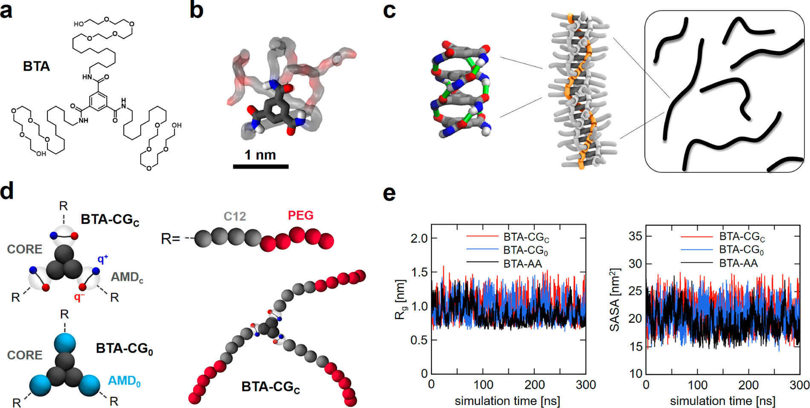
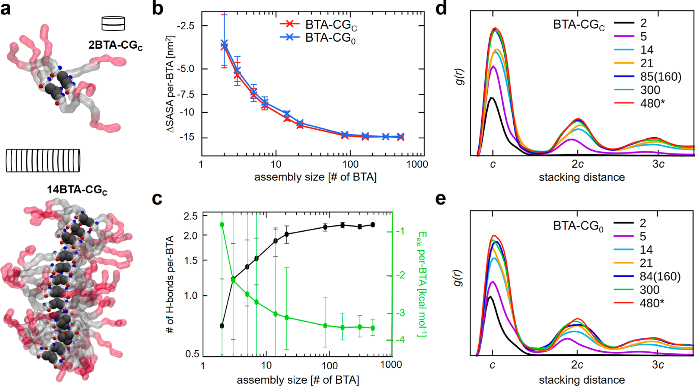
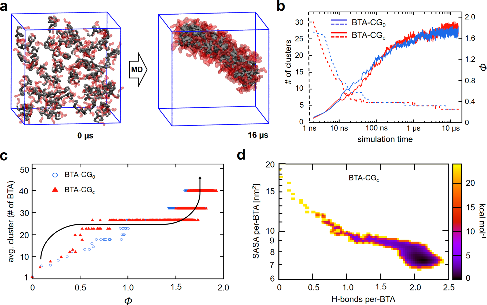
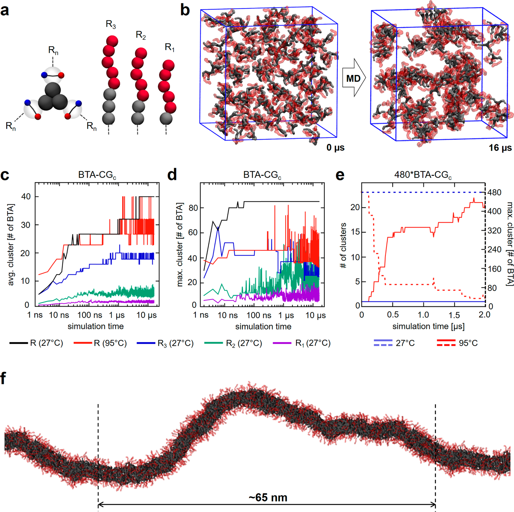

# BTA水溶性超分子聚合物——从合作自组装到粗粒化模拟的逐步聚合机制

## 本文信息

- **标题**：从合作自组装到水溶性超分子聚合物：粗粒化模拟研究
- **作者**：Davide Bochicchio，Giovanni M. Pavan*
- **发表期刊**：*ACS Nano*
- **发表时间**：2017年（Volume 11, Pages 1000-1011）
- **DOI**：https://doi.org/10.1021/acsnano.6b07628
- **单位**：瑞士南部应用科学与艺术大学创新技术系
- **引用格式**：Bochicchio, D.; Pavan, G. M. (2017). From Cooperative Self-Assembly to Water-Soluble Supramolecular Polymers Using Coarse-Grained Simulations. *ACS Nano*, 11, 1000-1011. https://doi.org/10.1021/acsnano.6b07628
- **代码与数据**：研究使用标准MARTINI力场，未提供独立代码库

## 摘要

> 超分子聚合物通过非共价自组装形成，因其动态仿生特性而极具研究价值。理解其行为需要在**保持单体结构和相互作用高分辨率**的同时访问其动力学，这在水溶液中尤其困难。聚焦于**1,3,5-苯三甲酰胺（BTA）水溶性超分子聚合物**，我们开发了一种可迁移的粗粒化模型，能够在水中研究BTA超分子聚合，同时在描述单体间关键相互作用（疏水、氢键等）、自组装合作性以及纤维中**有序放大**方面与全原子模型保持显著一致性。这使我们能够监测BTA纤维在动态聚合过程中单体间**关键相互作用（包括氢键）的放大**。我们的分子动力学模拟揭示了**逐步合作聚合机制**：首先是BTA单体在水中快速疏水聚集，随后是这些无序聚集体缓慢重组为有序定向的低聚物，超分子聚合物生长则以更慢的速率进行。我们通过**与实验证据对比**挑战了我们的模型，成功捕捉了温度变化和单体结构的微妙变化对聚合及纤维性质的影响。这项工作提供了BTA在水溶液中自组装的**多尺度时空表征**，为研究基于BTA的超分子聚合物构建结构-性质关系提供了有用的平台。

### 核心结论

- 开发了基于MARTINI力场的**可迁移BTA粗粒化模型**，能够在微秒尺度监测水溶液中的自组装过程
- 揭示了**逐步合作聚合机制**：快速疏水聚集（~20 ns）→ 无序聚集体重组为有序低聚物（~30-16 μs）→ 纤维慢速生长
- 两种BTA-CG模型（显式氢键的BTA-CG_C和隐式氢键的BTA-CG_0）都能准确重现全原子模型的**相互作用放大效应**和**有序放大效应**
- 成功预测了疏水侧链长度变化（C12→C9/C6/C3）对聚合的抑制效应，与Meijer团队的实验结果一致
- 模型能够模拟**温度诱导的纤维解聚**（95°C），验证了其研究环境条件变化的能力

## 背景

超分子聚合物通过非共价相互作用连接单体，近年来因其动态和自适应特性受到广泛关注。这些自组装结构的**实验级研究极其困难**，尤其是在水溶液环境中。这导致了分子层面自组装控制因素的普遍缺失。

在这一背景下，**分子模拟**已成为研究BTA及其他类型超分子聚合物的重要工具。之前的全原子MD模拟研究了肽两亲超分子纤维，提供了关于组装结构和自组装机制的深入见解，但仍受限于可探索的**空间和时间尺度**，无法访问自组装机制和超分子聚合物动态行为。

为解决这些限制，一种策略是开发自组装单体的**粗粒化模型**。已有重要努力开发CG模型来模拟CG肽两亲单体在水溶液中自发聚集成超分子纤维，获得关于组装结构和自组装机制的有用见解。

**MARTINI粗粒化力场**作为“通用”CG力场具有**高可迁移性**的优势，许多化学功能团/基团已经可用并经过测试，便于单体定制。这对研究多种自组装单体变体以建立**结构-性质关系**至关重要。

## 创新点

- **可迁移的BTA-CG模型**：基于MARTINI力场开发两种变体（BTA-CG_C显式氢键、BTA-CG_0隐式氢键），在描述单体在水溶液中的行为、单体-单体相互作用和自组装合作性方面与全原子模型保持显著一致性
- **逐步合作聚合机制**：首次在微秒尺度直接观测到BTA自组装的**三个阶段**——快速疏水聚集、慢速有序重组、纤维慢速生长
- **实验验证的预测能力**：成功预测疏水侧链长度变化（C12→C9/C6/C3）对聚合的抑制效应和温度诱导的纤维解聚（95°C）
- **相互作用与有序的双重放大**：CG模型重现了全原子水平的**疏水效应放大**（SASA降低）、**氢键能量放大**和**堆积有序放大**（g(r)峰高增加）

---

## 研究内容

### 一、BTA单体与粗粒化模型设计

1,3,5-苯三甲酰胺（BTA）单体通过**核心-核心堆积**和**三重氢键**形成一维自组装（Figure 1c）。研究采用的BTA单体由疏水十二烷基间隔物（C12）和四聚乙二醇（PEG）末端单元组成（Figure 1a）。

粗粒化模型基于MARTINI力场构建。对于芳香核和侧链，使用了最近优化的MARTINI参数。CG表示的BTA酰胺基团构成了参数化的关键点。由于**氢键的方向性**对MARTINI方案提出了相关挑战（MARTINI中所有相互作用通常由非方向性Lennard-Jones势表示），研究构建了两种BTA-CG模型变体，仅在酰胺基团描述上有所不同：

- **BTA-CG_C**：包含BTA-BTA氢键的显式处理，通过AMD_c珠子的刚性偶极子（±q）的静电相互作用实现方向性
- **BTA-CG_0**：酰胺基团（AMD_0）由标准MARTINI珠子表示，BTA-BTA氢键隐式包含在AMD_0-AMD_0 LJ相互作用中

两种模型的AMD_c和AMD_0珠子都经过优化，在CG水平重现全原子水平观察到的**核心+酰胺二聚自由能曲线**。

**图1：BTA单体结构及其粗粒化模型**——展示BTA的化学结构、全原子模型和两种CG变体。

- **图1a**：BTA单体的化学结构
- **图1b**：BTA单体在水中的平衡全原子模型
- **图1c**：通过核心-核心堆积和三重氢键进行一维自组装，导致纤维生长
- **图1d**：基于MARTINI的BTA核和侧链粗粒化模型。BTA-CG_C和BTA-CG_0模型在酰胺基团描述上不同（分别包含或不包含显式单体间氢键处理）
- **图1e**：MD模拟得到的单个BTA单体在水中的回转半径和溶剂可及表面积（SASA）数据，AA和CG水平的一致性

在单个单体水平，BTA-CG模型的**回转半径**和**溶剂可及表面积（SASA）**与全原子BTA单体在显式水中的数据拟合良好（Figure 1e），证明两种BTA-CG模型都能很好地代表BTA单体在水中的行为。

### 二、自组装合作性：相互作用放大与有序放大

研究构建了两个预堆积系统（160*和480*），由160和480个初始延伸的BTA-CG_C单体沿主纤维轴通过周期性边界条件复制，形成“无限”BTA纤维。

#### 疏水效应放大

随着BTA堆积体尺寸增大，**每个BTA的SASA变化（ΔSASA）**持续下降（Figure 2b），证明疏水效应在纤维生长过程中被放大。这与全原子水平最近观察到的行为一致。

#### 氢键能量放大

在BTA-CG_C系统中，**每个BTA的等效氢键平均数**和**每个BTA的平均氢键能量**都随组装尺寸增加而增加（Figure 2c）。值得注意的是，将氢键能量除以饱和时每个BTA的平均氢键数（2.2），得到水溶液中单个氢键的平均能量约为**-1.6 kcal mol⁻¹**，与水溶液中肽结构的单个氢键能量（-1.58 kcal mol⁻¹）惊人一致。

#### 堆积有序放大

BTA-CG_C超分子聚合物中堆积有序的放大通过径向分布函数监测。随着BTA-CG_C组装尺寸增大，**g(r)峰的高度**增加，在最大系统中达到饱和（Figure 2d）。这种行为再次与全原子水平最近观察到的行为一致。

**图2：BTA自组装的合作性——相互作用放大与有序放大**——展示BTA低聚物中关键相互作用和堆积有序的放大。

- **图2a**：不同尺寸的BTA堆积体
- **图2b**：疏水效应——不同尺寸堆积体中每个BTA的SASA变化（ΔSASA）随组装尺寸的变化
- **图2c**：BTA-CG_C系统中每个BTA的等效氢键平均数和每个BTA的平均氢键能量随组装尺寸的变化。CG模型中关键相互作用（疏水和氢键）的放大与全原子水平最近观察到的结果一致
- **图2d,e**：堆积有序放大到生长中的BTA超分子聚合物。不同尺寸系统中BTA核的径向分布函数，针对BTA-CG_C和BTA-CG_0两种模型

### 三、BTA自组装机制：逐步合作聚合

由160个BTA-CG_C单体最初分散在溶液中的分子系统提供了一个有趣的案例研究（Figure 3a）。在CG-MD模拟的早期步骤（前~0-20 ns），单体在溶液中**非常快速聚集**，通过溶液中BTA聚类数量的急剧减少来证明（Figure 3b，红色虚线）。

Φ指数（BTA核心间的平均配位数）在CG-MD模拟时间内的演化表明，直到约30 ns的CG-MD模拟，BTA聚集体仍然**无序**（Figure 3b，红色实线）。Φ指数随后显著增加，在16 μs CG-MD后达到最大值约1.8。在此CG-MD模拟时间内，溶液中自发形成的最大BTA组件是一个**具有细长形状的纤维片段**——一个BTA 85聚体（Figure 3a）。

**图3：BTA在水溶液中的自组装机制**——展示逐步合作聚合过程的动力学和热力学特征。

- **图3a**：160 BTA-CG_C自组装系统的起始和平衡（最终）快照（为清晰起见，仅显示CG-MD期间自发形成的最大聚类中的BTA单体，即BTA 85聚体）
- **图3b**：160 BTA自组装系统（BTA-CG_C和BTA-CG_0）的BTA聚类数量和序参数Φ（核心-核心配位）随CG-MD模拟时间的变化
- **图3c**：CG-MD轨迹作为平均聚类大小和Φ的函数。该图显示了自组装的逐步过程
- **图3d**：BTA-CG_C系统自组装的二维自由能景观，作为每个BTA的平均氢键数和每个BTA的平均SASA的函数

Figure 3c中的CG-MD轨迹图显示了一个**S形自组装路径**，可总结如下：首先，单体快速自组装，形成无序聚集体；当达到一定尺寸（本例中约~20-30个BTA）时，这些聚集体经历结构重组，演化为有序（堆积）BTA低聚物；纤维生长随后通过这些有序组装的融合进行（图中右上区域的离散步骤）。

为了更好地描述BTA聚合机制，从CG-MD模拟获得了自组装过程的**自由能景观**（Figure 3d），表示为BTAs的平均SASA和每个单体的平均氢键数的函数。较浅的颜色对应于能量最不利和最少访问的构型，而最深的颜色识别最有利和最多访问的构型。

### 四、结构修饰和温度变化的影响

Meijer团队最近的实验研究表明，BTA在水溶液中的聚合对单体结构中**疏水/亲水平衡的微妙变化**极其敏感。虽然使用C12或C11烷基间隔物产生几乎相同的超分子纤维，但将后者替换为C10被发现会抑制BTA超分子聚合物的形成。

研究挑战了BTA-CG模型与这些实验证据的一致性。为此，构建了具有较短疏水间隔物（分别包含3、2和1个疏水MARTINI珠子）的BTA-CG_C模型，对应于C9、C6和C3烷基间隔物（Figure 4a）。

CG模型与实验证据显示出一致性。在C6和C3 BTA-CG_C系统中，超分子聚合化**完全受到阻碍**（Figure 4b-d）。在模拟过程中仅自发形成非常小的BTA组件，通过平均聚类大小和形成的最大BTA聚类的大小来证明。

为了测试CG模型模拟**环境条件变化**的能力，研究了温度变化的影响。当将480*C12 BTA-CG_C“无限”纤维模型的温度从27°C升高到95°C时，观察到纤维的解聚（Figure 4e）。在CG-MD运行期间，聚类数量增加而最大BTA聚类大小减小，证明纤维在高温下不稳定。

**图4：单体中的结构修饰和温度变化的影响**——验证CG模型预测结构变化效应的能力。

- **图4a**：BTA单体变体的CG表示，其中侧链中的烷基疏水间隔物被系统性地缩短
- **图4b**：160 C6 BTA自组装系统的起始和最终快照
- **图4c**：不同160自组装系统的平均聚类大小，即标准C12 BTA和三种C9、C6和C3 BTA变体在室温（27°C）下的CG-MD模拟，以及标准C12 BTA在高温（95°C）下的模拟
- **图4d**：高温（95°C）下480*C12 BTA“无限”纤维在CG-MD运行期间解聚；分别显示CG-MD模拟期间的聚类数量和系统中最大BTA聚类的大小
- **图4e**：从室温下水溶液中480*BTA-CG_C无限纤维模型的CG-MD模拟中获取的平衡快照

---

## 关键结论

- 开发的**BTA-CG模型**成功跨越了全原子分辨率和微秒时间尺度之间的鸿沟，能够在保持关键相互作用精度的同时研究BTA超分子聚合的动态过程
- 揭示的**逐步合作聚合机制**（快速疏水聚集→慢速有序重组→纤维慢速生长）为理解超分子聚合物形成提供了新的理论框架
- CG模型对**结构修饰**（疏水侧链长度）和**环境变化**（温度升高）的预测能力得到了实验验证，证明其在**理性设计**BTA基超分子聚合物方面的价值
- 研究提供了BTA在水溶液中自组装的**多尺度时空表征**，为建立结构-性质关系和理解超分子聚合物动态行为奠定了基础

### 局限性

- 粗粒化模型虽然保持了关键相互作用的精度，但可能**丢失某些原子级细节**，如具体水分子排列或精细的氢键几何
- 模拟时间尺度（微秒级）虽然远超全原子模拟，但对于**某些非常缓慢的自组装过程**可能仍不足够
- 研究主要关注BTA体系，模型的**可迁移性**在其他类型超分子聚合物中需要进一步验证
- 实验验证主要集中在**结构变化**和**温度效应**，对其他环境因素（如pH、离子强度）的预测能力未充分测试
- 粗粒化过程中对**氢键方向性的处理**（显式vs隐式）可能影响某些体系的精度，需要根据具体系统选择合适的模型变体

对于研究超分子聚合物、自组装过程和粗粒化模拟的科研工作者，这项工作提供了一个**强大且经过验证的工具**，用于在保持足够精度的前提下探索超分子聚合物在水溶液中的形成机制和动态行为。结合MARTINI力场的**高可迁移性**，该模型可推广到其他类型的自组装系统，为超分子材料的理性设计提供了新途径。
