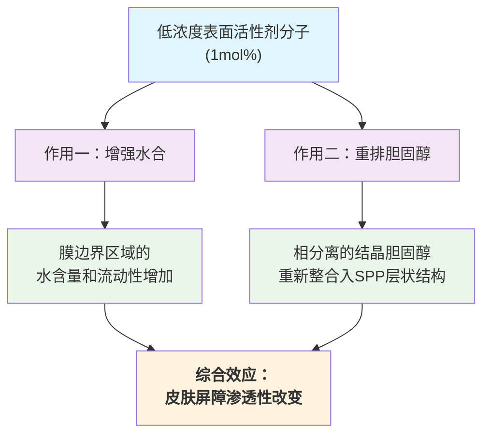

# 解密皮肤渗透的“潜规则”：表面活性剂尾链结构如何调控其与皮肤脂质屏障的相互作用

## 本文信息

  - **标题**: 表面活性剂疏水链结构对表面活性剂-皮肤脂质模型相互作用的影响
  - **作者**: Yao Chen, Mingrui Liao, Kun Ma, Zi Wang, Bruno Demé, Jeff Penfold, Jian R Lu, John R. P. Webster, Peixun Li
  - **发表时间**: 2021年9月22日
  - **单位**: 卢瑟福·阿普尔顿实验室ISIS中子源 (英国)，曼彻斯特大学 (英国)，中国石油大学 (中国)，劳厄·朗之万研究所 (法国)
  - **引用格式**: Chen, Y., Liao, M., Ma, K., Wang, Z., Demé, B., Penfold, J., Lu, J. R., Webster, J. R. P., & Li, P. (2022). Implications of surfactant hydrophobic chain architecture on the Surfactant-Skin lipid model interaction. *Journal of Colloid and Interface Science*, *608*, 405–415. [https://doi.org/10.1016/j.jcis.2021.09.098](https://doi.org/10.1016/j.jcis.2021.09.098)

-----

## 摘要

> 尽管表面活性剂已广泛应用于皮肤护理及相关领域，但我们对其如何与角质层（SC）脂质相互作用的认知仍然有限。本研究通过**中子衍射**和**分子动力学（MD）模拟**，报道了表面活性剂与SC脂质模型的相互作用，重点考察了**表面活性剂分子结构**的影响。研究构建了由等摩尔的神经酰胺/胆固醇/脂肪酸与1 mol%的表面活性剂混合而成的模型膜。通过中子散射衬度变化法，获得了膜中水分子和表面活性剂分子的中子散射长度密度（NSLD）分布图；同时，MD模拟清晰地揭示了模型膜水合作用变化的内在机制。研究发现，加入表面活性剂后，膜的短周期相（SPP）重复距离未发生剧烈变化，但显著**增强了膜的水合作用**，并**减少了相分离的结晶胆固醇**的数量，且这些效应强烈依赖于表面活性剂的**链长、支链和双键**。这项工作清晰地展示了表面活性剂的结构如何影响其与SC膜的相互作用，为筛选现有或设计新型的、用于透皮应用的表面活性剂提供了有用的指导。

-----

## 背景

皮肤作为人体最大的器官，正成为透皮给药系统（Transdermal Drug Delivery）的重要靶标。相比于传统的口服或注射，透皮给药具有无创、可自主用药、能长时间持续释放等优点。然而，其最大的挑战在于皮肤角质层（Stratum Corneum, SC）的强大屏障功能，它像一道坚固的“城墙”，阻止了绝大多数外来分子的入侵，从而严格限制了可用于透皮给药的药物种类。

角质层呈“砖墙-砂浆”结构，其中“砖块”是充满角蛋白的死细胞，“砂浆”则是由神经酰胺（CER）、胆固醇（CHOL）和游离脂肪酸（FFA）等脂质构成的连续、高度有序的层状结构。这个脂质基质是限制物质渗透的决定性因素。因此，通过改变脂质层的堆积方式来增强皮肤渗透性，是开发透皮给药系统的核心策略。表面活性剂，因其独特的两亲性和自组装能力，被广泛用作药物载体和渗透促进剂。然而，表面活性剂是一把“双刃剑”，在增强渗透的同时也可能引起皮肤刺激。

为了实现“增效减毒”，我们必须在分子层面深入理解表面活性剂与SC脂质的相互作用机制。SC脂质的层状结构极为复杂，主要包括重复距离约6 nm的短周期相（SPP）和约13 nm的长周期相（LPP）。尽管已有大量研究利用X射线衍射、中子衍射和MD模拟等手段探索了SC脂质的结构，但一个关键问题仍未得到系统解答：表面活性剂分子结构的细微变化，例如疏水尾链的长度、是否存在支链或不饱和键，究竟会如何影响其与SC脂质的相互作用，并最终改变皮肤屏障的功能？回答这个问题，将为理性设计更高效、更安全的皮肤护理产品和透皮递送系统提供关键的理论指导。

## 关键科学问题

本研究旨在回答的核心科学问题是：**表面活性剂疏水尾链的精细结构差异（链长、支链、不饱和键）究竟如何影响其与模拟皮肤角质层脂质膜的相互作用？**

具体而言，研究通过对比四种具有相同阳离子头基但不同C16-C18疏水尾链的表面活性剂，聚焦于以下几个子问题：

1.  这些表面活性剂的引入，将如何改变SC脂质膜的整体纳米结构（如层状重复距离）？
2.  它们如何影响对屏障功能至关重要的膜水合程度？
3.  它们如何影响SC脂质关键组分，特别是胆固醇，在膜中的分布和相行为？
4.  这些宏观结构和性质变化的背后，其微观分子机制是什么？

## 创新点

  - **系统性研究**：首次系统地比较了四种具有相同阳离子头基但不同疏水尾链结构（链长、支链、不饱和键）的表面活性剂对模拟皮肤脂质膜的影响，揭示了尾链结构与膜相互作用之间的构效关系。

  - **先进技术联用**：结合了**中子衍射**（特别是同位素衬度变化法）和**全原子分子动力学模拟**，从实验和理论两个层面，以前所未有的分辨率揭示了水分子和表面活性剂在脂质膜中的精确定位和作用机制。

  - **揭示了新的作用机制**：发现表面活性剂不仅是简单地“扰乱”脂质膜，还能通过促进**相分离的结晶胆固醇重新整合**到脂质层状结构中，并显著**增加膜的水合程度**来发挥作用，且这两种效应都强烈依赖于其尾链结构。

-----

## 研究内容

### 核心理论与实验方法

#### 实验体系

  * **模拟SC脂质膜**：采用等摩尔比的神经酰胺 ($\ce{CER NS (C24)}$)、胆固醇 (CHOL) 和游离脂肪酸 (FFA，$\ce{C22}$和$\ce{C24}$酸等摩尔混合) 构建，该体系能形成与真实皮肤SC结构相似的短周期相 (SPP)。
  * **表面活性剂**：选用四种阳离子表面活性剂，它们拥有完全相同的亲水头基，但疏水尾链结构各异：
      * $\ce{C16HAB}$：十六烷基双(2-羟乙基)甲基溴化铵（16碳，饱和直链）
      * $\ce{C18HAB}$：十八烷基双(2-羟乙基)甲基溴化铵（18碳，饱和直链）
      * $\ce{OHAB}$：油烯基双(2-羟乙基)甲基溴化铵（18碳，含一个顺式双键）
      * $\ce{IHAB}$：异硬脂基双(2-羟乙基)甲基溴化铵（18碳，含支链）

**图1：神经酰胺、胆固醇、脂肪酸和表面活性剂的化学结构。**

#### 实验技术解读：中子衍射与SLD剖面分析（写给模拟工作者）

本研究的核心实验技术是中子衍射，对于熟悉MD但不了解散射实验的读者，以下是关键概念的解释：

  * **衍射图的横坐标 `q`**：`q`被称为**散射矢量**，是**倒易空间（reciprocal space）中的坐标，单位是 Å⁻¹。它与实验中的散射角 $\theta$ 和中子波长 $\lambda$ 相关，关系为 $ q = \frac{4\pi \sin\theta}{\lambda} $。可以将其理解为结构在空间中的“频率”。根据布拉格定律**，当样品中存在周期性结构（如此处的脂质层状堆积）时，会在特定的 $q_h$ 值处出现尖锐的衍射峰。这些峰的位置与真实空间中的重复距离 `d` 成反比：$ d = \frac{2\pi h}{q_h} $，其中h是衍射级数。因此，通过测量衍射峰的位置，就能精确计算出脂质双层的厚度。

  * **SLD剖面图的纵坐标 $\rho(x)$**：$\rho(x)$是**中子散射长度密度（Neutron Scattering Length Density, SLD）**。可以将其类比为X射线衍射中的电子密度。每个原子核都有一个固有的、描述其与中子相互作用强弱的参数，称为“散射长度”。**SLD就是一个区域内所有原子散射长度的总和除以该区域的体积**。SLD剖面图 $\rho(x)$ 就是这个物理量沿着膜法线方向（x轴）的一维分布图。

  * **衬度变化法（Contrast Variation）**：该方法是中子散射的“独门绝技”。其原理是氢（H）和它的同位素氘（D）的散射长度值差异巨大，甚至是符号相反（H为-3.74 fm, D为+6.67 fm）。通过使用不同比例的重水（$\ce{D2O}$）和普通水（$\ce{H2O}$）来水合样品，就可以系统地改变水分子的SLD值。例如，在8% $\ce{D2O}$ / 92% $\ce{H2O}$的混合溶剂中，水的平均SLD恰好为零，此时水对中子来说是“隐形”的，衍射信号完全来自脂质和表面活性剂。而在100% $\ce{D2O}$中，水的SLD非常高。通过对不同衬度下的SLD剖面图进行差值运算（例如，用100% $\ce{D2O}$的图减去8% $\ce{D2O}$的图），就可以精确地分离出水分子自身的分布，从而确定其在膜中的精确定位。

> 1 mol%的表面活性剂换算成我们熟悉的浓度单位大概是多少？在样品制备中，所有组分（脂质+表面活性剂）的总浓度是10 mg/mL，即10 g/L。根据文中的摩尔比（1:1:1:0.03），我们可以计算出表面活性剂的质量分数约为0.9%。因此，在用于制备薄膜的初始溶液中，表面活性剂的浓度大约是 10 g/L$\times $0.9%$ \approx 0.09 \ \text{g/L}$。这个浓度远低于这些表面活性剂的临界胶束浓度（CMC，约为0.1-0.8 mM，换算后约0.04-0.36 g/L）。这表明研究的是**表面活性剂单体**与脂质膜的相互作用，而非胶束的作用，这对于理解产品在低浓度或初始接触阶段对皮肤的影响尤为重要。

#### 辅助验证：全原子分子动力学（MD）模拟

  * **建模过程**：使用CHARMM-GUI工具搭建了包含CER/CHOL/FFA以及两种代表性表面活性剂（$\ce{C16HAB}$和$\ce{IHAB}$）的脂质双层模型，并溶于TIP3P水盒子中，加入$\ce{NaCl}$维持离子强度。
  * **力场与软件**：模拟采用CHARMM36 (C36) 脂质力场和GROMACS软件。
  * **模拟方案**：体系经过能量最小化、NVT和NPT系综的平衡后，进行了50 ns的生产性模拟，并对最后5 ns的轨迹进行分析。MD模拟能够提供动态的、原子分辨率的图像，为中子衍射得到的静态、平均的结构信息提供机理上的解释。

### 结果与分析

#### 1\. 模拟基线：纯脂质膜的结构验证

**图S8：(A) CER, CHOL, 木蜡酸(LA)的化学结构。(B) 等摩尔比的CER/CHOL/LA在50 ns模拟结束时的快照。(C) CER头、尾和溶剂的质量密度分布。(D, E) CER, LA, CHOL中特定原子的RDF及相应的水合数函数。**

在研究表面活性剂的影响前，作者首先通过MD模拟验证了其纯脂质模型（CERPure）的合理性。模拟得到的层状结构厚度（由CER头基峰间距定义）为5.25 nm，与实验测得的5.31 nm高度一致。CER尾链的质量密度分布呈“W”形，证实了与实验结果相符的尾链相互嵌入（interdigitation）的排列方式。这表明所用的MD模型能够可靠地复现实验结构。

#### 2\. 表面活性剂对脂质膜整体结构的影响

**图2：在100% $\ce{D2O}$水合条件下，纯CER/CHOL/FFA膜以及添加了1 mol%不同表面活性剂的混合膜的中子衍射一维图。数字表示SPP层状结构的衍射级数，星号表示胆固醇晶体的衍射峰。**
中子衍射图谱显示，所有样品都形成了高度有序的层状结构。

  * **层间距基本不变**：纯脂质膜的SPP重复距离为 $53.4 \pm 0.5$ Å。加入1 mol%的任何一种表面活性剂后，该距离基本保持不变（约 $53.2$ Å）。
  * **有序性增强**：一个有趣的现象是，加入表面活性剂后，衍射峰（尤其是高阶峰，见图S3）变得更加尖锐明显。这表明**表面活性剂的加入反而使脂质膜的层状结构变得更加规整有序**。
  * **胆固醇峰变化**：另一个显著变化是，代表相分离结晶胆固醇的衍射峰（星号所示）强度在加入表面活性剂后有所下降。

#### 3\. 核心发现一：尾链结构决定膜的水合程度

**图3：(A) 纯脂质膜(CERPure)在8% $\ce{D2O}$和100% $\ce{D2O}$水合下的相对SLD剖面图，以及两者的差值曲线（蓝色实线），即水的SLD分布。(B) 不同模型膜中水的相对SLD剖面图。(C) 根据图3B计算出的水SLD剖面的截距和斜率。**

  * **所有表面活性剂均增强水合**：如图3B所示，与纯脂质膜（黑线）相比，所有添加了表面活性剂的膜，其边界区域（X ≈ ±27 Å，对应脂质头基位置）的水SLD信号都显著增强。这表明**表面活性剂的亲水头基吸引了更多的水分子，导致膜整体的水合程度增加**。
  * **水合程度与尾链结构相关**：如图3C所示，不同表面活性剂增强水合的能力不同。通过比较边界处的水SLD峰高（截距）和梯度（斜率），发现水合作用的强度顺序为： **$\ce{C16HAB}$ \> $\ce{IHAB}$ \> $\ce{C18HAB}$ \> $\ce{OHAB}$ \> 纯脂质膜**。这个顺序与表面活性剂尾链的亲水性/疏水性密切相关。
  * **剂量依赖性**：**图S7（水SLD剖面图对比CERPure, CER$\ce{OHAB}$-1%和CER$\ce{OHAB}$-2%）** 进一步证实了这种水合增强效应。将$\ce{OHAB}$的浓度从1 mol%增加到2 mol%，膜边界的水SLD峰变得更高，表明**水合作用的增强与表面活性剂的浓度呈正相关**。

#### 4\. 核心发现二：表面活性剂促进胆固醇重排

**图4：(A) 不同模型膜在8% D₂O水合下的相对SLD剖面图。(B) 混合膜与纯脂质膜在8% D₂O下的SLD差值图，反映了表面活性剂和重排脂质的SLD分布变化。(C) 不同模型膜中胆固醇晶体衍射峰的强度比较。**

  * **表面活性剂的定位**：在8% $\ce{D2O}$的衬度下，水的信号被“屏蔽”。如图4A和4B所示，加入表面活性剂后，膜边界区域的SLD增加，而中心区域的SLD降低。这证实了表面活性剂的分子取向：**亲水头基位于膜边界的水/脂界面，疏水尾链伸入膜中心的疏水核**。
  * **胆固醇的重排**：最关键的发现来自图4C。纯脂质膜中存在明显的结晶胆固醇衍射峰。加入表面活性剂后，该峰的强度显著下降，且下降程度与表面活性剂种类有关，顺序为： **IHAB \> $\ce{C16HAB}$ \> $\ce{C18HAB}$ \> OHAB**。这表明，**表面活性剂能够促进原本相分离出来的结晶胆固醇，重新溶解并整合到SPP的层状结构中**。其中，**支链的IHAB效果最好**，这可能是因为其较大的尾链体积能更有效地在脂质层中为胆固醇“腾出空间”。

#### 5\. 分子机制的动态模拟验证

**图5：(A-C) 含$\ce{C16HAB}$的混合膜的MD模拟结果，包括快照、质量密度分布和径向分布函数(RDF)。(D-F) 含$\ce{IHAB}$的混合膜的MD模拟结果。**
MD模拟为上述实验发现提供了微观图像。

  * **分子排布**：模拟快照和质量密度分布图（图5B, 5E）清晰地显示，表面活性剂（红色和蓝色）的头基确实位于CER头基（灰色）外侧，更靠近水层（绿色），与中子衍射结果完美吻合。
  * **水合机制**：通过计算径向分布函数（RDF），模拟揭示了水合变化的细节。**图S9（LA与表面活性剂头基的RDF）** 显示，表面活性剂的阳离子头基会与脂肪酸的阴离子头基发生强烈的静电吸引。这种离子对的形成会“挤走”原本与脂肪酸头基结合的水分子（见表S4，LA的第一水合层水分子数从3.24下降到3.07或2.96）。然而，由于表面活性剂自身的头基（特别是两个羟乙基）具有强大的水合能力（第一水合层水分子数高达27个左右），其吸引的水分子远超脂肪酸失去的水分子，因此宏观上表现为膜整体水合程度的显著增加。

#### 6\. 总结：双重作用机制模型

**示意图1：模型SC中SPP双层结构的示意图。(a) 不含表面活性剂的纯SC膜，同时存在SPP相和CHOL相。(b) 表面活性剂-脂质混合模型膜，结晶CHOL分子迁移到SPP中，双层膜的水合作用增强。**

综合所有结果，作者提出了表面活性剂作为渗透促进剂的双重作用机制。它并非简单地通过“搞乱”脂质层来增强渗透。一方面，它通过自身强大的水合能力，显著增加了SC脂质膜极性区域的含水量和流动性；另一方面，它还能促进原本以结晶形式存在的、对屏障功能不利的相分离胆固醇重新整合入有序的层状结构中。这两种看似矛盾（增加流动性 vs 增加有序组分）的作用共同决定了最终对皮肤渗透性的影响。

-----

## Q&A

  - **Q1**: 为什么添加表面活性剂后，脂质膜的层状结构反而变得更“有序”（衍射峰更尖锐）？这与我们通常认为表面活性剂会“扰乱”膜的直觉相悖。

  - **A1**: 这是一个非常好的观察。这种“反直觉”的现象可能有两个原因：首先，本研究中表面活性剂的浓度非常低（1 mol%），可能不足以造成宏观上的无序化。其次，更重要的原因是表面活性剂促进了相分离的结晶胆固醇重新整合到SPP层状结构中。胆固醇本身是维持脂质层有序性和致密性的关键分子，当更多的胆固醇被有序地插入到神经酰胺和脂肪酸之间时，整个层状结构的规整性（long-range order）可能会得到提升，从而导致衍射峰变得更尖锐。这揭示了表面活性剂在低浓度下可能扮演着“结构优化剂”而非“破坏者”的复杂角色。

  - **Q2**: MD模拟结果显示，加入表面活性剂后，脂肪酸（LA）周围的水分子变少了，但这与实验观察到的整体水合增加似乎矛盾，如何解释？

  - **A2**: 这个看似矛盾的现象恰好揭示了相互作用的复杂性。MD模拟可以“看”到更精细的局部变化。脂肪酸（LA）的羧基头基带负电，而表面活性剂的头基带正电，两者之间会形成强烈的**静电吸引**。这种离子对的形成会“挤走”原本与脂肪酸头基通过氢键结合的水分子，导致LA的局部水合下降。然而，从整个体系来看，一个表面活性剂分子（特别是其头基上的两个羟乙基）自身所能吸引和结合的水分子数量，远远超过了一个脂肪酸头基失去的水分子数量。因此，**局部的“脱水”和更强的全局“增水”效应同时发生，最终宏观表现为膜整体水合程度的显著增加**，这与中子衍射的实验结果是完全一致的。

## 关键结论与批判性总结

  * **核心结论**

      * 低浓度（1 mol%）的阳离子表面活性剂并不会破坏SC脂质模型膜（SPP）的整体层状结构，反而会使其更有序。
      * 所有测试的表面活性剂都显著增加了模型膜的水合程度，其效果与疏水尾链的结构密切相关，亲水性越强（如链越短、有支链）的尾链导致的水合作用越强。
      * 表面活性剂能够促进相分离的结晶胆固醇重新整合入SPP层状结构中，其中空间位阻较大的支链表面活性剂（$\ce{IHAB}$）效果最为显著。
      * MD模拟揭示，表面活性剂的亲水头基位于水/脂界面，疏水尾链伸入膜核心，其强大的水合能力是导致膜整体水合增加的主要原因。

  * **潜在影响**

      * 为理解表面活性剂与皮肤屏障的相互作用提供了分子层面的新视角，揭示了其作为渗透促进剂的“双重作用”机制（增强水合+重排胆固醇）。
      * 为化妆品和透皮给药系统的配方设计提供了重要的理论指导，表明可以通过精细调控表面活性剂的分子结构来定制其对皮肤屏障的功能影响。

  * **存在的局限性**

      * 研究采用了简化的SC脂质模型（仅SPP），未能包含更复杂的LPP结构以及角质层中的蛋白质等其他组分。
      * 仅研究了阳离子表面活性剂，结论是否适用于阴离子或非离子表面活性剂尚不明确。
      * 研究主要在平衡态下进行，未能完全反映真实皮肤上产品使用过程中的动态相互作用。

  * **未来研究方向**

      * 将研究扩展到包含LPP的更复杂的脂质模型，甚至离体皮肤模型。
      * 系统研究其他类型（阴离子、非离子、两性）表面活性剂的结构-效应关系。
      * 结合其他实验技术（如红外光谱、NMR等）进一步探究表面活性剂对脂质链构象和动力学的影响。

## 附录

### SLD剖面图 $\rho(x)$ 的物理意义

SLD剖面图，即**中子散射长度密度（Neutron Scattering Length Density, SLD）剖面图** $\rho(x)$，可以直观地理解为**一维的“分子地图”**，它展示了沿特定方向（在此研究中是垂直于脂质膜平面的方向，即MD模拟中的z轴）物质分布的情况。

* **基本定义**：从物理化学角度看，$\rho(x)$ 代表在位置 `x` 处单位体积内的**中子散射能力**。您可以将其类比为X射线衍射中的“电子密度图”。每个原子核都有一个固有的中子散射长度（scattering length），$\rho(x)$ 就是在`x`位置一个微小体积元内所有原子核散射长度的总和除以该体积元。

- **如何解读**：通过分析$\rho(x)$曲线的形状，我们可以推断出不同分子基团在膜中的空间排布：
    - **峰（Peak）**：$\rho(x)$值高的区域，意味着该处富含中子散射能力强的原子。在本研究中，由于重水（$\ce{D2O}$）的氘（D）原子具有很高的正散射长度，因此**SLD的峰值通常对应于水分子富集的区域**，也就是亲水性的脂质/表面活性剂头基所在的界面处。
    - **谷（Trough）**：$\rho(x)$值低的区域，意味着该处富含中子散射能力弱或为负值的原子。氢（H）的散射长度为负值，因此**SLD的谷值通常对应于富含C-H键的疏水性烷基链区域**，即膜的中心。
    - **平台（Plateau）**：相对平坦的区域表明该处的物质分布较为均匀。

- **对于MD研究者的意义**：SLD剖面图是从中子衍射实验数据（存在于倒易空间）通过傅里叶变换得到的**真实空间**图像。它提供了一个与您的MD模拟中**质量密度分布（mass density profile）**或**原子数密度分布（number density profile）**直接对应的实验验证结果。通过对比实验SLD剖面图和模拟密度分布图，可以验证您的模拟体系是否准确地复现了真实的分子排布。

### SLD剖面截距 (Intercept) 的物理意义

在这篇论文的语境中，“截距”（Intercept）是一个用于量化水合程度的参数。

* **具体定义**：作者将“截距”定义为水分子的SLD剖面图在**单位晶胞最边界处（X = ±27 Å）的$\rho(x)$值**。这个位置对应于脂质头基与体相水层接触最充分的界面。

- **物理意义**：因此，截距的物理意义是**水/脂界面处的最大水分子密度**，它直接反映了**模型膜表面的最大水合程度**。
    - **截距值越大**，意味着在膜的边界处聚集了更多的$\ce{D2O}$分子，表明该膜体系的**亲水性越强，水合能力也越强**。
    - 在图3C中，作者通过比较不同体系的截距大小，直接得出了不同表面活性剂增强膜水合能力的强弱顺序。

### SLD剖面斜率 (Slope) 的物理意义

与截距类似，“斜率”（Slope）也是一个量化水合特征的参数。

* **具体定义**：作者将“斜率”定义为水分子SLD剖面图在**亲水头基区域（从 X = 20 Å 到 27 Å）的曲线梯度**。这个区域代表了从水/脂界面向膜疏水核心过渡的地带。

- **物理意义**：斜率的物理意义是**亲水头基区域的水密度梯度**。它描述了水分子密度从膜表面向内渗透时下降的快慢程度。
    - **斜率绝对值越大（曲线越陡峭）**，表示水分子密度从界面处向内急剧下降。这通常意味着水分子被紧密地束缚在最外层的亲水头基周围，形成一个**界限分明、比较致密的水合层**。
    - **斜率绝对值越小（曲线越平缓）**，表示水分子密度向内下降得比较缓慢，水合层可能更为**弥散（diffuse）**，或者水分子能够渗透到头基区域更深的位置。

在本文中，作者将更大的斜率和更大的截距共同作为膜水合作用增强的标志，即表面活性剂的加入不仅吸引了更多的水分子（高截距），还使这些水分子在界面处形成了密度更高、梯度更陡峭的水合层（大斜率）。
