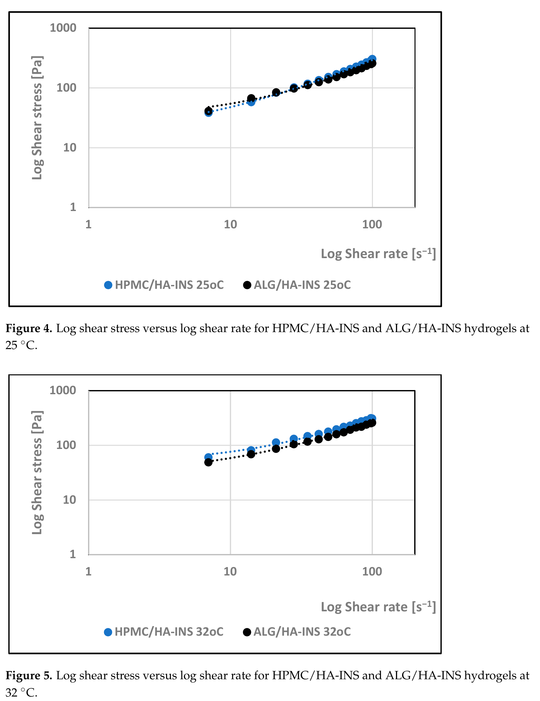
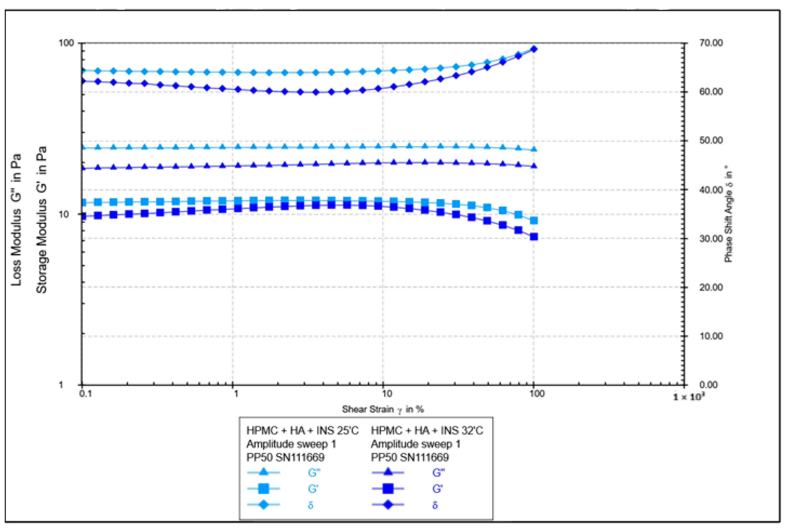
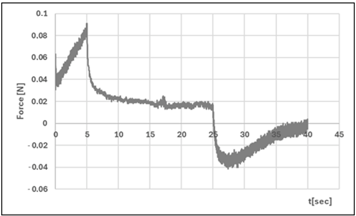

# 透明质酸基水凝胶胰岛素载体：技术细节与补充结果【附录】

本文档是[主文档](2025-12-09-hyaluronan-hydrogel-insulin-carriers.md)的附录，包含详细的技术细节、数学模型、完整的实验数据表格和补充分析。

---

## 交联机制的详细解释

### 两种水凝胶体系的交联化学

#### ALG/HA体系：化学交联（离子交联）

**交联机制**：
- **海藻酸钠（ALG）** 含有大量羧基（$\ce{-COO^-}$），在碱性或中性条件下带负电
- **$\ce{Ca^{2+}}$离子** 作为二价阳离子交联剂
- **“蛋箱”（egg-box）模型**：每个$\ce{Ca^{2+}}$离子可以同时与多条海藻酸盐链的羧基结合，形成三维网络结构

化学反应：
$$
2 \ce{-COO^- (ALG)} + \ce{Ca^{2+}} \rightarrow \ce{(-COO)2Ca} \text{（配位键）}
$$

**为什么交联**：
- $\ce{Ca^{2+}}$与羧基形成**配位共价键**（coordinate covalent bond）
- 这是**化学变化**，形成了新的化学键
- 交联是**不可逆的**（除非用螯合剂如EDTA去除$\ce{Ca^{2+}}$）

**透明质酸（HA）的角色**：
- HA也含有羧基，但在本配方中主要不参与交联
- HA主要提供生物活性功能（促进伤口愈合）
- HA可能部分与$\ce{Ca^{2+}}$竞争结合，影响凝胶网络的柔韧性

#### HPMC/HA体系：物理交联

**交联机制**：
- **羟丙基甲基纤维素（HPMC）** 是纤维素醚衍生物，含有大量羟基（$\ce{-OH}$）
- **透明质酸（HA）** 也含有大量羟基和羧基
- **无需化学交联剂**

**物理交联的三种力**：

1. **氢键网络**（主要）：
   - HPMC的$\ce{-OH}$基团与HA的$\ce{-OH}$和$\ce{-COOH}$基团形成氢键
   - 水分子也参与氢键网络，形成“水合凝胶” 

2. **聚合物链缠结**（chain entanglement）：
   - HPMC（分子量通常>100 kDa）和HA（1.5 MDa）都是高分子量聚合物
   - 长链聚合物在溶液中相互缠绕，形成物理网络

3. **疏水相互作用**（次要）：
   - HPMC的甲基和羟丙基基团提供少量疏水性
   - 在水相中，疏水基团倾向于聚集，形成物理交联点

**为什么交联**：
- 这是**物理变化**，没有形成新的化学键
- 交联是**可逆的**（加热、稀释或机械力可以破坏）
- 从流变学数据可以看出：HPMC/HA在25°C和32°C下性质不同，说明氢键对温度敏感

#### 交联过程的时间依赖性

**为什么需要“在2-8°C下交联7天”**：

**ALG/HA体系**：
- **真正的化学交联过程**
- $\ce{Ca^{2+}}$逐渐渗透到整个凝胶基质中，与羧基充分结合
- 低温（2-8°C）减缓反应速度，使交联更均匀
- 7天确保交联完全，网络结构稳定

**HPMC/HA体系**：
- **物理“老化”（aging）过程**，不是真正的化学交联
- 聚合物链逐渐重排，达到能量最低的稳定构象
- 氢键网络逐渐形成和优化
- 水分均匀分布，凝胶结构稳定
- 低温防止微生物生长，保护胰岛素活性

#### 胰岛素后加载的必要性

论文特别强调“机械引入胰岛素”是**后加载方法**，原因是：

1. **避免与$\ce{Ca^{2+}}$反应**（ALG/HA体系）：
   - 胰岛素含有羧基（天冬氨酸、谷氨酸残基）
   - 如果在交联过程中加入，$\ce{Ca^{2+}}$可能与胰岛素结合，影响其活性

2. **避免pH变化**：
   - 交联过程可能有局部pH波动
   - 胰岛素对pH敏感（最稳定pH 5-7）

3. **避免加热影响**（HPMC/HA体系）：
   - HPMC需要在80°C溶解
   - 胰岛素在高温下会变性失活

---

## 完整的流变学数据

### 旋转流变学：粘度-剪切速率关系

**实验条件**：
- 流变仪：RM 200（Lamy Rheology Instruments）
- 测量系统：平板/平板几何形状（直径24 mm，角度0.45°）
- 温度：25 ± 0.01°C和32 ± 0.01°C
- 剪切速率范围：7.0-100.0 $\mathrm{s^{-1}}$

**图S1-S2：25°C和32°C下两种水凝胶的对数剪切速率对对数粘度的影响**

**详细观察**：
- **表观粘度随剪切速率增加（7.0-100.0 $\mathrm{s^{-1}}$）而降低，然后稳定，接近极限值**
- 在剪切速率 > 40 $\mathrm{s^{-1}}$ 时，聚合物链沿流动方向表现出更强的取向，并排列成更有序的结构
- HPMC/HA-INS和ALG/HA-INS水凝胶在两个测试温度下均表现为**剪切变稀的非牛顿流体**
- 分析样品在32°C时的粘度高于25°C时的数据

### 流动曲线和剪切应力分析

**图S3-S4：25°C和32°C下两种水凝胶的对数剪切应力与对数剪切速率关系**

流动曲线分析显示，在两个分析温度（25°C和32°C）下，两种配方的剪切应力随剪切速率增加而增加。

**屈服应力完整数据**：
- 25°C：τ₀HPMC/HA-INS = 16 Pa，τ₀ALG/HA-INS = 14.4 Pa
- 32°C：τ₀HPMC/HA-INS = 28.8 Pa，τ₀ALG/HA-INS = 27.0 Pa

n值小于1表明，两种温度下的配方都表现出剪切变稀特性。

### 触变性：滞后环测试

**图S5：25°C和32°C下两种水凝胶的滞后环**

使用滞后环测试确定测试系统的触变性。在增加然后减少剪切速率时测量粘度。**滞后环的表面积反映了破坏水凝胶基质结构所需的能量量**：

- 25°C：8237.511 Pa/s（HPMC/HA-INS）和7328.551 Pa/s（ALG/HA-INS）
- 32°C：8651.133 Pa/s（HPMC/HA-INS）和6426.959 Pa/s（ALG/HA-INS）

**解释**：
- 开发的水凝胶表现出触变性，这将使其能够在皮肤上涂抹和均匀分布
- 水凝胶基质原始结构的恢复将防止水凝胶从包装中泄漏
- 在25°C和32°C下，ALG/HA-INS制剂将确保最快的结构恢复
- 滞后环面积越大，破坏水凝胶基质结构所需的能量越多
- HPMC/HA-INS的滞后环面积较大，表明与胰岛素的结合更强，这与其较低的释放速率一致

### 振荡流变学：振幅扫描

**实验条件**：
- 流变仪：Anton Paar MCR302e
- 测量系统：平板/平板（PP50，直径50 mm），间隙0.5 mm
- 频率：恒定1 Hz
- 应变振幅：0.1至100%
- 温度：25 ± 0.01°C和32 ± 0.01°C

**图S6：25°C和32°C下HPMC/HA-INS水凝胶作为剪切应变函数的振幅测试结果**

**图S7：25°C和32°C下ALG/HA-INS水凝胶作为剪切应变函数的振幅测试结果**

振荡流变学测试评估了弹性模量G'和粘度模量G''的变化。**关键观察**：
- 在线性粘弹性区域内，剪切弹性模量G'保持恒定，施加的变形不会导致结构损坏
- 温度升高导致弹性和粘度模量降低
- 相角随剪切应力增加而增加（>45°）
- 25°C下的水凝胶表现出更高的刚度

### 振荡流变学：频率扫描

**实验条件**：
- 频率范围：0.1至10 Hz
- 变形：1%
- 温度：25 ± 0.01°C和32 ± 0.01°C

**图S8：25°C和32°C下ALG/HA-INS样品的频率扫描**

频率扫描显示弹性和粘度模量曲线。**主要发现**：
- **在两个分析温度下，G'值都低于G''值，这表明粘性特征占主导地位**
- 在测量的频率范围内未观察到弹性和粘性行为之间的转变（G' = G''），表明它可能发生在更高的频率
- G'和G''曲线倾向于随频率增加而收敛
- 在更高频率下，聚合物基质呈现出更固体的形式

**不同配方的模量比较**：
- HPMC/HA-INS样品的弹性模量G'较低（与ALG/HA-INS相比），在25°C和32°C下都是如此
- ALG/HA-INS样品的粘度模量（G''）较低（与HPMC/HA-INS相比），在两个温度下都是如此
- 温度升高导致弹性和粘度模量降低

分析的水凝胶表现出类似于液体的粘弹性特性。**这可能是由于链和键重排过程中的能量分散**。一些作者在分析海藻酸盐和纤维素衍生物的分散体时，也观察到频率扫描测试中粘度模量占主导地位。

---

## 质构参数的完整数据和详细解释

### TPA（质构剖面分析）完整图谱

**实验条件**：
- 仪器：Texture Analyzer TX-700（Lamy Rheology Instruments）
- 探头：半球形探头（直径8 mm）
- 温度：25 ± 0.1°C
- 重复次数：n = 3

**图S9：ALG/HA-INS的质构剖面分析（TPA）**

**图S10：HPMC/HA-INS的质构剖面分析（TPA）**

### CRT（直接压缩松弛测试）图谱

**图S11：ALG/HA-INS的穿透测试（CRT）**

**图S12：HPMC/HA-INS的穿透测试（CRT）**

### 质构参数的详细解释

**完整质构参数表**（平均值 ± 标准差，n = 3，T = 25 ± 0.1°C）：

| 参数 | HPMC/HA-INS | ALG/HA-INS | p值 | 临床意义 |
|------|-------------|------------|-----|---------|
| 硬度1 [N] | 0.051 ± 0.01 | 0.086 ± 0.02 | p < 0.05 | 压缩所需的最大力 |
| 硬度2 [N] | 0.056 ± 0.01 | 0.089 ± 0.01 | p < 0.05 | 第二次压缩的最大力 |
| 内聚性 [-] | 1.088 ± 0.08 | 0.997 ± 0.20 | NS | 结构恢复能力 |
| 黏附性 [mJ] | 0.2 ± 0.05 | 0.2 ± 0.10 | NS | 生物黏附特性 |
| 弹性 [-] | 1.016 ± 0.05 | 1.141 ± 0.11 | NS | 弹性恢复能力 |
| 松弛率 [%] | 86.9 ± 0.88 | 81.8 ± 0.97 | p < 0.01 | 应力松弛特性 |

#### 各参数的物理意义

**硬度（Hardness）**：
- 定义：第一次和第二次压缩循环中测得的最大力
- 意义：表示水凝胶的强度和从容器中挤出的难易程度
- 理想范围：< 1 N，确保易于应用
- 本研究结果：两种配方均满足要求，ALG/HA-INS略高是由于化学交联网络的刚性

**黏附性（Adhesiveness）**：
- 定义：克服探头表面与样品之间吸引力所需的力（第一个负峰的面积）
- 意义：与粘膜黏附特性相关，确保药物保留在应用部位
- 本研究结果：两种配方均为0.2 mJ（无显著差异）
- 研究发现，制剂的生物黏附特性与其黏附性之间存在相关性

**内聚性（Cohesiveness）**：
- 定义：第二个正峰下的面积与第一个正峰下的面积之比
- 意义：压缩阶段后水凝胶的结构恢复能力
- 该参数表示制剂在负载下可逆地减小其体积的能力
- 本研究结果：两种配方无显著差异，都能良好恢复结构

**弹性（Elasticity）**：
- 定义：水凝胶在施加负载下变形并在负载移除后恢复其先前形状的能力
- 本研究结果：两种配方无显著差异

**松弛率（Relaxation）**：
- 定义：聚合物在恒定变形下释放应力的能力
- 本研究结果：HPMC/HA-INS的松弛率更高（86.9%），表明其在恒定压力下更容易释放应力，这与其物理交联的可逆性一致

### TPA图谱解读

**TPA图上正峰的高度**：
- 描述了配方的硬度特性（压缩所需的力）
- 该值应该较低，以允许从容器中轻松挤出制剂并实现最佳应用

**黏附性（第一个负峰的面积）**：
- 反映了克服探头（材料表面）与配方表面之间吸引力所需的功
- 该参数通常等同于粘膜黏附
- 水凝胶的黏附能力确保药物保留在应用部位并保持其临床疗效

**内聚性（面积比）**：
- 第二个正峰下的面积与第一个正峰下的面积之比
- 决定了压缩阶段后水凝胶的结构恢复

---

## 详细实验方法

### 材料来源

**胰岛素**：
- 产品：Insulatard Penfil（INS，100 IU/mL）
- 类型：人胰岛素悬浮液，异相，长效
- 供应商：Novo Nordisk（Bagsværd，丹麦）
- 辅料：氯化锌、甘油、鱼精蛋白硫酸盐、氢氧化钠、磷酸氢二钠二水合物、间甲酚、苯酚、盐酸和注射用水

**聚合物和试剂**：
- 羟丙基甲基纤维素（HPMC）：Sigma Chemical Co.（St. Louis, MO, USA）
- PBS（磷酸盐缓冲盐溶液；pH = 7.4）：Sigma-Aldrich（St. Louis, MO, USA）
- 透明质酸钠（分子量1.5 MDa）：Chemat（Gdańsk，波兰）
- 海藻酸钠：Agnex Sp. z o. o.（Białystok，波兰）
- 二水合氯化钙：POCH S.A.（Gliwice，波兰）
- 甘油（86%）：PPH Microfarm（Zabierzów，波兰）
- 所有物质均为分析纯

**膜材料**：
- Strat-M®膜：Merck Millipore（Burlington, MA, USA）

### 仪器设备

**释放研究**：
- Erweka DT600桨式装置（Husenstamm，德国）
- Dissolution Enhancer Cell™（暴露面积3.80 cm²）
- Cecil UV-VIS分光光度计（CE 3021，Cambridge，UK）

**pH和渗透压测量**：
- SevenCompactTM S210实验室pH计，配备InLaB®Expert Pro-ISM电极（Mettler-Toledo GmbH，Greifensee，瑞士）
- Gonotec Osmomat 3000渗透压计（Gonotec GmbH，Berlin，德国）

**流变学测试**：
- RM 200旋转流变仪（Lamy Rheology Instruments，Champagne au Mont d'Or，法国）
- 测量系统：MK-CP 2445，平板/平板几何形状（直径24 mm，角度0.45°）
- 温度控制：Lamy Rheology CP-1 PLUS加热系统
- Anton Paar MCR302e模块化紧凑型流变仪（Graz，奥地利）
- 平板/平板几何形状（PP50，直径50 mm），间隙0.5 mm

**质构分析**：
- Texture Analyzer TX-700（Lamy Rheology Instruments，Champagne au Mont d'Or，法国）
- 半球形探头（直径8 mm）

**离心和其他设备**：
- MPW-300微量离心机（MPW Med. Instruments，Warsaw，波兰）
- Fisherbrand Isotemp加热搅拌板（Thermo Fisher Scientific，Mississauga，ON，加拿大）

### 胰岛素定量分析方法验证

**分光光度法参数**：
- 分析波长：λ = 271 nm
- 线性方程：y = 0.453x + 0.0072
- 决定系数：$R^2$ = 0.999
- 标准差、相对标准差和变异系数：方法精密度评估为阳性

---

## 完整的动力学建模数据

### 释放动力学模型方程和参数

**表1：描述水凝胶胰岛素释放曲线的完整数学模型**

| 模型 | 方程 | HPMC/HA-INS参数 | ALG/HA-INS参数 |
|------|------|----------------|---------------|
| **零级模型** | F = k₀ t | k₀ = 0.099 $R^2$adj = 0.8371 AIC = 139.1119 MSC = 1.5305 | k₀ = 0.139 $R^2$adj = 0.8458 AIC = 143.5498 MSC = 1.5959 |
| **一级模型** | F = 1 − e−k₁t | k₁ = 0.001 $R^2$adj = 0.9302 AIC = 121.3200 MSC = 2.3778 | k₁ = 0.002 $R^2$adj = 0.9592 AIC = 116.9775 MSC = 2.9245 |
| **Higuchi模型** | F = kH t0.5 | kH = 1.927 $R^2$adj = 0.9735 AIC = 100.9586 MSC = 3.3474 | kH = 2.616 $R^2$adj = 0.9503 AIC = 120.9035 MSC = 2.7282 |
| **Korsmeyer-Peppas模型** | F = kKP tn | kKP = 1.181 n = 0.584 $R^2$adj = 0.9825 AIC = 93.2225 MSC = 3.7158 | kKP = 1.381 n = 0.611 $R^2$adj = 0.9644 AIC = 115.1723 MSC = 3.0148 |
| **Hixson-Crowell模型** | F = 1 − (1 − kHC t)3 | kHC = 0.001 $R^2$adj = 0.9195 AIC = 138.1944 MSC = 2.2501 | kHC = 0.001 $R^2$adj = 0.9330 AIC = 126.8927 MSC = 2.4288 |
| **Peppas-Sahlin模型** | F = kPS1 tm + kPS2 t2m | kPS1 = 0.308 kPS2 = −0.001 m = 0.890 $R^2$adj = 0.9993 AIC = 27.3617 MSC = 6.8520 | kPS1 = 0.244 kPS2 = 0.000 m = 0.998 $R^2$adj = 0.9967 AIC = 68.2465 MSC = 5.3611 |
| **Weibull模型** | F = 100(1 − e−(tβ)/α) | α = 133.388 β = 0.701 $R^2$adj = 0.9894 AIC = 82.6533 MSC = 4.2190 | α = 155.449 β = 0.801 $R^2$adj = 0.9801 AIC = 103.4961 MSC = 3.5986 |

### 模型参数符号说明

- **F**：时间t时累积释放的药物量
- **k₀**：反应速率系数
- **k₁**：速率常数
- **kH**：溶解常数
- **kHC**：Hixson-Crowell释放常数
- **kKP**：基于几何形状和剂型的实验参数常数
- **kPS1**：Peppas-Sahlin释放常数（Fickian扩散常数）
- **kPS2**：Case II松弛机制常数
- **m**：扩散指数
- **n**：释放指数
  - n ≤ 0.45：Fickian扩散
  - 0.45 < n < 0.89：非Fickian传输
  - n = 0.89：Case II（松弛）传输
  - n > 0.89：Super Case II传输机制
- **t**：时间
- **α**：尺度参数
- **β**：形状参数

### 模型选择标准

**$R^2$adj（调整后的R平方）**：
- 更高的值表示更好的拟合

**AIC（Akaike信息准则）**：

$$
\text{AIC} = n\ln(\text{WSS}) + 2p
$$

其中：
- n：数据点数量
- WSS：加权残差平方和
- p：模型中的参数数量
- 更低的AIC值表示更好的拟合

**MSC（模型选择准则）**：

$$
\text{MSC} = \ln\left[\frac{\sum_{i=1}^{n} w_i \cdot (y_{i,\text{obs}} - \bar{y}_{\text{obs}})^2}{\sum_{i=1}^{n} w_i \cdot (y_{i,\text{obs}} - y_{i,\text{pre}})^2}\right] - \frac{2p}{n}
$$

其中：
- wi：权重因子
- yi,obs：第i个观测y值
- yi,pre：第i个预测y值
- ȳobs：所有观测y数据点的平均值
- p：模型中的参数数量
- n：数据点数量
- 最高的MSC值表示最佳拟合

### 释放曲线相似性比较

**表2：HPMC/HA-INS和ALG/HA-INS水凝胶释放曲线的比较**

| 配方代码 | 方程 | 结果 | 解释 |
|---------|------|------|------|
| f1 HPMC/HA-INS vs. ALG/HA-INS | $f_1 = \left[\frac{\sum\|R_t - T_t\|}{\sum R_t}\right] \cdot 100$ | 34.63 | 不相似 |
| f2 HPMC/HA-INS vs. ALG/HA-INS | $f_2 = 50 \log\left\{\left[1 + \frac{1}{n}\sum(R_t - T_t)^2\right]^{-0.5} \cdot 100\right\}$ | 48.23 | 不相似 |

符号说明：
- f1：差异因子
- f2：相似性因子
- n：时间点数量
- Rt：参考样品在时间t的释放量
- Tt：测试样品在时间t的释放量

**相似性判断标准**：
- 当f2 > 50且f1 < 15时，认为曲线相似
- 本研究：f2 = 48.23 < 50，f1 = 34.63 > 15，因此两种配方的释放曲线不相似

---

## 详细的流变学数学建模

### 流变学模型及拟合结果

**表3：流变图数学建模的完整结果**

| 水凝胶 | 温度 | Herschel-Bulkley | Ostwald-de Waele | Bingham | Casson |
|--------|------|------------------|------------------|---------|--------|
| **HPMC/HA-INS** | **25°C** | τ₀ = 16.000 n = 0.94 K = 3.60 $R^2$ = 0.998 | n = 0.780 K = 7.66 $R^2$ = 0.994 | τ₀ = 20.533 $R^2$ = 0.997 | τ₀ = 4.309 $R^2$ = 0.997 |
| **ALG/HA-INS** | **25°C** | τ₀ = 14.400 n = 0.794 K = 5.91 $R^2$ = 0.997 | n = 0.674 K = 10.7 $R^2$ = 0.992 | τ₀ = 32.627 $R^2$ = 0.995 | τ₀ = 10.236 $R^2$ = 0.996 |
| **HPMC/HA-INS** | **32°C** | τ₀ = 28.800 n = 0.822 K = 6.34 $R^2$ = 0.997 | n = 0.633 K = 16.1 $R^2$ = 0.991 | τ₀ = 49.837 $R^2$ = 0.996 | τ₀ = 17.353 $R^2$ = 0.996 |
| **ALG/HA-INS** | **32°C** | τ₀ = 27.00 n = 0.873 K = 4.06 $R^2$ = 0.998 | n = 0.639 K = 12.7 $R^2$ = 0.988 | τ₀ = 37.722 $R^2$ = 0.997 | τ₀ = 12.920 $R^2$ = 0.997 |

### 流变学模型方程

**Herschel-Bulkley模型**（具有屈服应力的假塑性）：

$$
\tau = \tau_0 + K\dot{\gamma}^n
$$

**Ostwald-de Waele模型**（幂律模型）：

$$
\tau = K\dot{\gamma}^n
$$

**Bingham模型**：

$$
\tau = \tau_0 + \eta_p\dot{\gamma}
$$

**Casson模型**：

$$
\tau^{0.5} = \tau_0^{0.5} + K\dot{\gamma}^{0.5}
$$

符号说明：
- **τ**：剪切应力 [Pa]
- **τ₀**：屈服应力 [Pa]
- **K**：稠度指数 [Pa·sn]
- **n**：流动行为指数（无量纲）
  - n < 1：剪切变稀（假塑性）
  - n = 1：牛顿流体
  - n > 1：剪切增稠
- **$\dot{\gamma}$**：剪切速率 [s⁻¹]
- **ηp**：塑性粘度
- **$R^2$**：决定系数（回归系数）

### 粘度数据详解

**32°C下不同剪切速率的粘度值**（平均值 ± 标准差）：

| 剪切速率 [s⁻¹] | HPMC/HA-INS [Pa·s] | ALG/HA-INS [Pa·s] |
|---------------|-------------------|------------------|
| 30 | 2.841 ± 0.9088 | 2.704 ± 0.8618 |
| 50 | 2.132 ± 0.6714 | 2.087 ± 0.7376 |
| 100 | 1.619 ± 0.4982 | 1.480 ± 0.4589 |

### 滞后环面积（触变性定量）

**表4：不同温度下的滞后环面积**

| 水凝胶 | 25°C [Pa/s] | 32°C [Pa/s] |
|--------|------------|------------|
| HPMC/HA-INS | 8237.511 | 8651.133 |
| ALG/HA-INS | 7328.551 | 6426.959 |

**解释**：
- 滞后环面积越大，破坏水凝胶基质结构所需的能量越多
- ALG/HA-INS在32°C时的滞后环面积最小，表明在应用温度下结构恢复最快
- HPMC/HA-INS的滞后环面积较大，表明与胰岛素的结合更强，这与其较低的释放速率一致

---

## 振荡流变学详细数据

### 振幅扫描测试

**测试条件**：
- 频率：恒定1 Hz
- 应变振幅：0.1至100%
- 温度：25 ± 0.01°C和32 ± 0.01°C

**关键观察**：
- 在线性粘弹性区域内，剪切弹性模量G'保持恒定
- 温度升高导致弹性和粘度模量降低
- 相角随剪切应力增加而增加（>45°）
- 25°C下的水凝胶表现出更高的刚度

### 频率扫描测试

**测试条件**：
- 频率范围：0.1至10 Hz
- 变形：1%
- 温度：25 ± 0.01°C和32 ± 0.01°C

**主要发现**：
- 在两个分析温度下，G' < G''，表明粘性特征占主导
- 未观察到弹性和粘性行为之间的交叉点（G' = G''）
- G'和G''曲线随频率增加而趋于收敛
- 在整个测量范围内，HPMC/HA-INS的G'低于ALG/HA-INS
- ALG/HA-INS的G''低于HPMC/HA-INS

**粘弹性特性解释**：
- G' > G''：弹性占主导（固体样行为）
- G' < G''：粘性占主导（液体样行为）
- 研究的水凝胶为“粘弹性液体” 

---

## 质构参数的详细解释

### TPA（质构剖面分析）参数

**硬度（Hardness）**：
- 定义：第一次和第二次压缩循环中测得的最大力
- 意义：表示水凝胶的强度和从容器中挤出的难易程度
- 理想范围：< 1 N，确保易于应用
- 本研究结果：
  - HPMC/HA-INS：0.051 ± 0.01 N（硬度1），0.056 ± 0.01 N（硬度2）
  - ALG/HA-INS：0.086 ± 0.02 N（硬度1），0.089 ± 0.01 N（硬度2）

**黏附性（Adhesiveness）**：
- 定义：克服探头表面与样品之间吸引力所需的力（第一个负峰的面积）
- 意义：与粘膜黏附特性相关，确保药物保留在应用部位
- 本研究结果：两种配方均为0.2 mJ（无显著差异）

**内聚性（Cohesiveness）**：
- 定义：第二个正峰下的面积与第一个正峰下的面积之比
- 意义：压缩阶段后水凝胶的结构恢复能力
- 本研究结果：
  - HPMC/HA-INS：1.088 ± 0.08
  - ALG/HA-INS：0.997 ± 0.20
  - 无显著差异

**弹性（Elasticity）**：
- 定义：水凝胶在施加负载下变形并在负载移除后恢复其先前形状的能力
- 本研究结果：
  - HPMC/HA-INS：1.016 ± 0.05
  - ALG/HA-INS：1.141 ± 0.11
  - 无显著差异

### CRT（直接压缩/松弛/张力）参数

**松弛率（Relaxation）**：
- 定义：聚合物在恒定变形下释放应力的能力
- 本研究结果：
  - HPMC/HA-INS：86.9 ± 0.88%
  - ALG/HA-INS：81.8 ± 0.97%
  - 显著差异（p < 0.01）

---

## 比较与先前研究

### 与壳聚糖基水凝胶的比较

作者之前的研究开发了基于壳聚糖（CS）与纤维素衍生物的混合胰岛素载体。本研究与先前工作的比较：

| 配方 | 释放时间 | 释放百分比 | 基质成分 |
|------|---------|-----------|---------|
| CS/HPMC | 6.5小时 | 49% | 壳聚糖/羟丙基甲基纤维素 |
| CS/HEC | 7小时 | 42.5% | 壳聚糖/羟乙基纤维素 |
| CS/MC | 7小时 | 39.8% | 壳聚糖/甲基纤维素 |
| **HPMC/HA**（本研究） | **9小时** | **43%** | 羟丙基甲基纤维素/透明质酸 |
| **ALG/HA**（本研究） | **9小时** | **57%** | 海藻酸钠/透明质酸 |

**主要改进**：
- 更长的释放时间（9小时 vs. 6.5-7小时）
- ALG/HA系统实现了更高的释放百分比（57%）
- 透明质酸的引入增加了生物活性功能（促进伤口愈合）

### 与文献中其他水凝胶系统的对比

**海藻酸盐/透明质酸复合水凝胶（Catanzano等，2015）**：
- 在大鼠切除伤口模型中，伤口5天内闭合（与单独ALG相比，p < 0.001）
- 本研究的ALG/HA系统与该研究一致，证实了这种组合的治疗潜力

**透明质酸衍生物（Voigt和Driver，2012）**：
- 系统综述和荟萃分析证实了透明质酸衍生物对烧伤、上皮手术伤口和慢性伤口的愈合效果
- 本研究的HA基系统与文献报道的治疗益处一致

---

## 补充讨论

### 甘油的多重作用机制

甘油在配方中不仅是简单的保湿剂，其作用机制包括：

1. **氢键形成**：甘油的$\ce{-OH}$基团与神经酰胺的$\ce{-NH}$基团形成氢键，破坏皮肤屏障
2. **渗透促进**：改善胰岛素通过角质层的扩散
3. **基质调节**：影响水凝胶的水合和膨胀特性
4. **配方稳定**：作为共溶剂系统的一部分

### 钙离子在ALG/HA系统中的作用

氯化钙在ALG/HA水凝胶中的作用：
- **交联剂**：$\ce{Ca^{2+}}$离子与海藻酸盐的羧基结合，形成“蛋箱”结构
- **刚度调节**：$\ce{Ca^{2+}}$浓度增加导致G'增加，水凝胶刚度增加
- **释放控制**：影响药物释放速率和机制

### 胰岛素制剂中的抗菌成分

Insulatard Penfil含有的间甲酚和苯酚：
- **浓度**：间甲酚和苯酚在商业胰岛素制剂中的典型浓度
- **抗菌作用**：减少微生物污染风险
- **稳定性**：氯化锌可能抑制蛋白酶活性，影响伤口部位的胰岛素稳定性

### 温度对流变学特性的影响机制

32°C vs. 25°C的流变学差异反映了：
- **热运动增加**：分子热运动导致粘度变化
- **聚合物链构象**：温度影响聚合物链的柔韧性和纠缠
- **氢键网络**：温度升高可能削弱部分氢键相互作用
- **实际应用相关性**：32°C模拟皮肤温度，提供真实应用条件下的性能预测

---

## 统计分析方法

### Student's t检验

使用双侧Student's t检验（Statistica 12.0，StatSoft，Krakow，波兰）进行统计分析：
- 至少进行三次重复实验
- 平均值与标准差一起给出
- 显著性水平：p < 0.05（*），p < 0.01（**）
- NS = 无显著性

### 软件和数据分析

**DDSolver 1.0**（Microsoft Excel 2019附加程序）：
- 释放动力学建模
- f1和f2相似性因子计算
- 模型选择标准（$R^2$、AIC、MSC）

**Rheomatic-P软件**（版本2.1.0.4）：
- 旋转流变学数据分析
- 流动曲线拟合

**Rheo Compas软件**（版本1.31）：
- 振荡流变学数据分析
- G'和G''模量计算

**RheoTex软件**（TX-UK01/2019版本）：
- 质构分析数据处理
- TPA和CRT参数计算

**Statistica 13.1**（StatSoft，Krakow，波兰）：
- 统计计算和检验

---

## 未来研究建议

### 短期研究目标

1. **稳定性研究**：
   - 加速稳定性测试（40°C/75% RH）
   - 长期稳定性测试（25°C/60% RH，5°C）
   - 胰岛素活性保持率评估
   - 物理化学性质变化监测

2. **细胞毒性评估**：
   - MTT或CCK-8细胞活力测试
   - 使用人角质形成细胞和成纤维细胞
   - 浓度依赖性和时间依赖性毒性评估

3. **生物相容性测试**：
   - 溶血测试
   - 皮肤刺激性测试（ISO 10993-10）
   - 皮肤致敏性测试

### 中期研究目标

4. **体内动物研究**：
   - 大鼠或小鼠全层皮肤伤口模型
   - 糖尿病动物模型（db/db小鼠或STZ诱导的糖尿病大鼠）
   - 组织学评估（HE染色、免疫组化）
   - 伤口闭合速率、胶原沉积、血管生成评估

5. **透皮吸收研究**：
   - 使用离体人体皮肤（全厚度或去表皮）
   - Franz扩散池测试
   - 胰岛素在不同皮肤层的分布
   - 微透析技术评估局部药代动力学

6. **配方优化**：
   - 响应面法（RSM）优化聚合物比例
   - 增加其他功能性辅料（生长因子、抗菌肽）
   - 纳米颗粒混合系统（脂质体、纳米胶束）

### 长期研究目标

7. **临床前研究**：
   - GLP标准的毒理学研究
   - 药效学和药代动力学研究
   - 猪皮肤模型（与人类皮肤最相似）

8. **工艺放大**：
   - 大规模制备工艺开发
   - 质量控制标准建立
   - 稳定性指示方法验证
   - 包装材料相容性研究

9. **临床试验设计**：
   - I期：安全性和耐受性
   - II期：剂量探索和初步疗效
   - III期：大规模疗效和安全性确认
