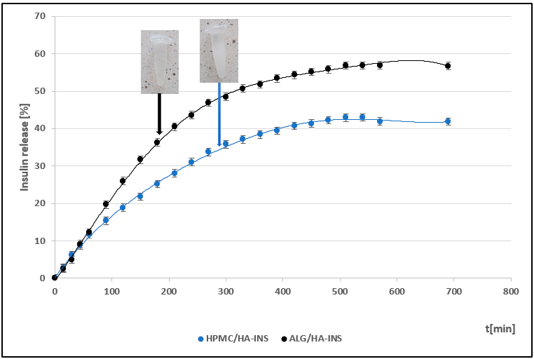
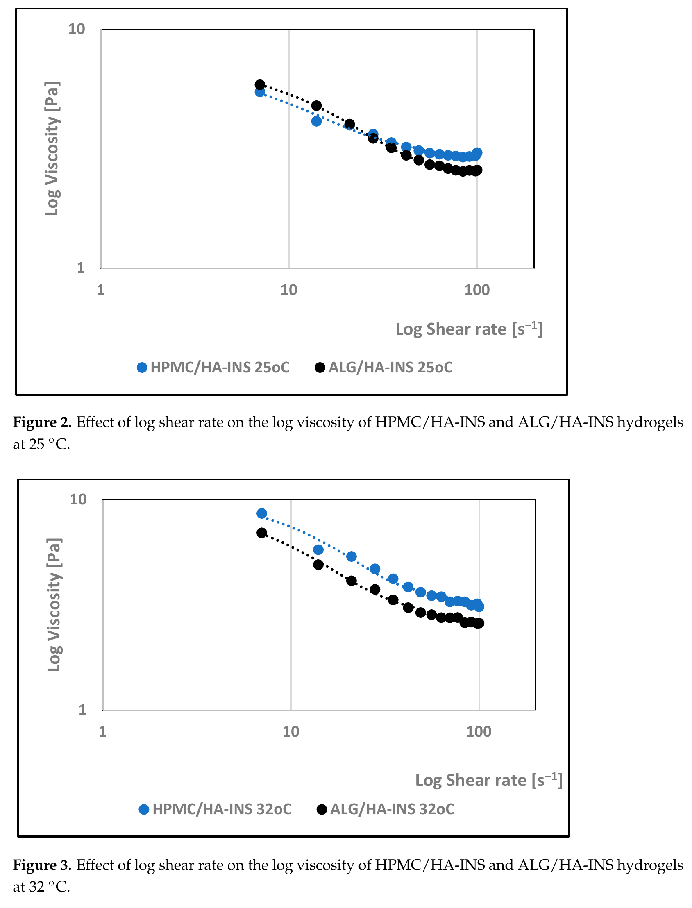
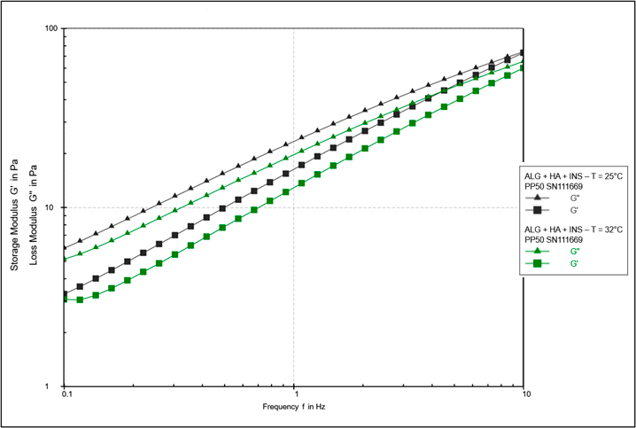
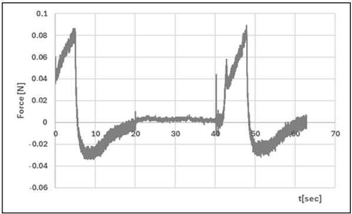

# 透明质酸基水凝胶胰岛素载体：促进慢性伤口愈合的新型递送系统

## 本文信息

- **标题**: Hyaluronan-Based Hydrogel Hybrid Insulin Carriers—Preformulation Studies
- **作者**: Aneta Ostrózka-Cieślik
- 发表时间: 2025年10月1日
- **单位**: Medical University of Silesia, Faculty of Pharmaceutical Sciences in Sosnowiec, 波兰
- **引用格式**: Ostrózka-Cieślik, A. Hyaluronan-Based Hydrogel Hybrid Insulin Carriers—Preformulation Studies. *Polymers* 2025, 17, 2661. https://doi.org/10.3390/polym17192661

## 摘要

> 本文提出了基于海藻酸钠-透明质酸（ALG/HA）和羟丙基甲基纤维素-透明质酸（HPMC/HA）的混合水凝胶胰岛素载体系统，用于局部应用。**将胰岛素纳入现代敷料可以帮助恢复病变组织的代谢平衡和正常细胞信号传导**。对开发的制剂进行了预配方研究，包括胰岛素的体外药物可用性分析、旋转和振荡流变学测试以及质构分析。研究发现，**开发的胰岛素制剂在流变学和质构特性以及易于应用之间提供了可接受的平衡，同时确保活性物质的持续释放**。所获得的结果为进一步的临床前和临床研究提供了基础。

### 核心结论

- 开发了两种混合水凝胶系统（ALG/HA-INS和HPMC/HA-INS）作为胰岛素的局部递送载体
- 540分钟后，ALG/HA-INS和HPMC/HA-INS分别释放了57%和43%的初始胰岛素剂量，呈现持续释放特性
- 胰岛素释放符合Peppas-Sahlin动力学模型（$R^2$ > 0.99），主要由扩散控制
- 两种水凝胶均表现出剪切变稀的非牛顿流体特性和触变性，有利于皮肤涂抹和保留
- 水凝胶具有良好的质构特性，硬度参数<1且在可接受范围内

## 背景

慢性伤口的治疗是现代医学面临的重大问题，也是医疗保健领域的经济挑战。据估计，约1.5%的人口受此影响，且数量稳步增长。**治疗过程的关键要素是使用具有抗菌、抗炎、再生和保湿特性的专业疗法和制剂**。特别是带有渗出液且容易发生细菌定植的慢性伤口，治疗难度极大。

水凝胶在治疗此类伤口方面表现出高效性。根据欧洲药典的定义，水凝胶是一种由水与甘油或聚乙二醇混合、并用聚合物增稠（胶凝）而成的半固体药物剂型。

### 聚合物载体的选择

**透明质酸**（HA）是一种由(β,1-4)-D-葡萄糖醛酸和(β,1-3)-N-乙酰-D-葡糖胺单元组成的天然多糖。在其高分子量形式（>100 kDa）中，HA天然存在于包括真皮和表皮在内的组织中。研究发现，**HA是组织流体动力学的调节剂，参与组织修复，调节伤口炎症，并增加角质形成细胞的迁移和增殖**。HA在大鼠和仓鼠实验性伤口愈合以及糖尿病足溃疡治疗中的有效性已得到证实。

**海藻酸盐**（ALG）是由β-D-甘露糖醛酸和α-L-古洛糖醛酸通过[1,4]糖苷键连接的天然共聚物。它们在再生医学中得到广泛应用。**海藻酸盐具有吸收伤口部位渗出液和维持湿润微环境的能力，从而促进愈合和肉芽组织形成**。在大鼠切除伤口模型中进行的研究证实，结合海藻酸盐和透明质酸的水凝胶具有治疗功效，伤口在5天内闭合（与单独使用ALG相比，p < 0.001）。

**羟丙基甲基纤维素**（HPMC）是一种纤维素醚，用作亲水性水凝胶活性药物成分（Active Pharmaceutical Ingredient, API）载体。它无毒，具有生物黏附特性，并能增加粘度。文献综述表明，纤维素衍生物对伤口愈合过程有积极影响。

### 胰岛素在伤口愈合中的作用

基于海藻酸盐、透明质酸和羟丙基甲基纤维素的水凝胶可能是生物分子（包括胰岛素）的潜在载体。**大量临床前和临床研究已证实，胰岛素是伤口愈合的强大促进剂**。研究发现，**将胰岛素纳入现代敷料可以恢复病变组织的代谢平衡和正常细胞信号传导**。有研究表明，这是加速慢性伤口愈合的有效且安全的方法。

### 关键科学问题

- 如何设计一种既能有效递送胰岛素又具有良好机械性能的水凝胶载体系统？
- 如何平衡水凝胶的流变学特性、质构特性和易于应用性？
- 如何实现胰岛素的持续释放以减少给药频率？
- 如何通过聚合物组合优化水凝胶的性能？

### 创新点

- 开发了两种新型混合水凝胶系统（ALG/HA和HPMC/HA），结合天然和合成聚合物的优势
- 系统评估了水凝胶的流变学特性、质构特性和药物释放行为
- 使用Strat-M®膜（模拟皮肤屏障）评估胰岛素的体外透皮释放
- 通过数学建模深入理解胰岛素释放机制

---

## 研究内容

### 混合水凝胶的制备

研究开发了两种混合水凝胶胰岛素载体系统，配方对比如下：

| 制备步骤/参数 | HPMC/HA-INS | ALG/HA-INS |
|------------|-------------|-----------|
| **主聚合物组分** | 4.0% HPMC 溶于93.0% PBS + 3.0%甘油（预加热至80°C） | 5.0%海藻酸钠 溶于83.0% PBS + 10.0%甘油 |
| **交联剂** | 无需化学交联剂 | 1.0 g 0.5% $\ce{CaCl2}$ （$\ce{Ca^{2+}}$与羧基形成离子交联） |
| **透明质酸组分** | 0.5% HA溶于99.5% PBS | 相同 |
| **混合比例** | 2:1（HPMC:HA） | 1:1（ALG:HA） |
| **交联条件** | 2-8°C，7天 | 相同 |
| **胰岛素加入** | 机械引入1 mL胰岛素/2.5 g基质 （28.57 IU/g） | 相同 |
| **最终pH** | 7.45 | 7.42 |
| **渗透压** | 448 mOsm/L | 974 mOsm/L |
| **外观** | 半透明，乳白色 | 透明 |

估算：

  | 组分  | 分子量          | 质量浓度     | 摩尔浓度估算         |
  |-----|--------------|----------|----------------|
  | 胰岛素 | 5.8 kDa      | 0.14%    | ~0.24 mM       |
  | HA  | 100-1000 kDa | 0.2-0.3% | ~0.003-0.03 mM |

**交联机制差异**：

两种水凝胶体系采用截然不同的交联策略：

- **ALG/HA体系（化学交联）**：$\ce{Ca^{2+}}$离子与海藻酸钠的羧基（$\ce{-COO^-}$）形成配位共价键，构建“蛋箱”（egg-box）三维网络结构。这是不可逆的化学变化，赋予凝胶较高的机械强度
- **HPMC/HA体系（物理交联）**：无需化学交联剂，通过聚合物链缠结、氢键网络和少量疏水相互作用形成凝胶。这是可逆的物理变化，对温度和稀释敏感
- **7天交联期**：ALG/HA体系需要充分时间让$\ce{Ca^{2+}}$均匀渗透并完成交联；HPMC/HA体系则是聚合物链重排和氢键网络优化的“老化”过程

**关于“机械引入胰岛素”的说明**：

在水凝胶基质交联7天后，通过机械搅拌或研磨将胰岛素制剂均匀混入凝胶中。这种后加载方法的优势是避免药物在交联过程中暴露于$\ce{Ca^{2+}}$（可能与胰岛素羧基结合）、pH变化或加热（HPMC需80°C溶解）等可能影响其活性的条件，更适合对加工条件敏感的蛋白质类药物。

**制备要点**：
- 两种水凝胶均呈均匀状态，质地光滑
- pH值接近中性（7.42-7.45），可最大限度降低伤口部位的刺激风险
- 水凝胶显示出机械稳定性，未观察到相变或分离
- ALG/HA的透明外观反映了均匀的离子交联网络，HPMC/HA的半透明乳白色则源于物理网络的微观不均匀性

### 胰岛素体外释放研究

使用Erweka DT600桨式装置和Dissolution Enhancer Cell™进行药物可用性分析。**Strat-M®膜的双层结构复制了表皮和真皮层，是测试表皮药物制剂中活性物质释放的最佳人体皮肤替代品**。

**释放实验条件**：
- 样品量：1 g水凝胶（含胰岛素）
- 接受液：50 mL PBS
- 温度：32 ± 1°C（人体皮肤表面温度）
- 搅拌速度：100 rpm
- 检测波长：271 nm

**图1：两种水凝胶制剂的胰岛素释放曲线**

分析释放曲线可以得出以下结论：
- 540分钟后，HPMC/HA-INS和ALG/HA-INS配方分别释放了43%和57%的初始API剂量
- 释放曲线相似性分析显示它们不相似：相似系数（f2）= 48.23，差异系数（f1）= 34.63
- 当f2 > 50且f1 < 15时，认为曲线相似

#### 释放动力学建模

为了解释胰岛素从开发的水凝胶中的释放机制，对获得的释放曲线进行了全面的动力学建模。使用了以下数学模型：

- **零级模型**：恒定速率释放，不依赖于剩余药物浓度，适用于渗透泵或基质侵蚀控制的系统
- **一级模型**：释放速率与剩余药物浓度成正比，常见于扩散控制系统中药物浓度较低时
- **Higuchi模型**：描述基于Fickian扩散的药物从不溶解或缓慢溶解的固体基质中的释放，释放量与时间平方根成正比
- **Korsmeyer-Peppas模型**：通过释放指数n区分扩散和溶胀/松弛控制的释放机制，是经验性半经验模型
- **Hixson-Crowell模型**：基于颗粒表面积变化，适用于通过溶解或侵蚀释放药物的系统
- **Peppas-Sahlin模型**：将Fickian扩散和Case II松弛（聚合物链松弛）两种机制分开量化，更精确地描述复杂释放过程
- **Weibull模型**：经验性模型，通过形状参数β描述释放曲线的复杂性，适用于多种释放机制

**关键发现**：
- **胰岛素释放最符合Peppas-Sahlin模型**（$R^2$ > 0.99）
- 这表明API释放主要由其从混合系统的扩散控制（kPS1 > kPS2），聚合物基质的松弛有限
- 激素释放受水凝胶的水合和基质结构调控
- 释放曲线也高度符合Weibull模型（$R^2$ > 0.98）

**Weibull形状参数**：
- βHPMC/HA-INS = 0.701：Fickian扩散占主导（β ≤ 0.75）
- βALG/HA-INS = 0.801：混合机制——Fickian扩散结合Case II传输（0.75 < β < 1）

### 流变学特性分析

水凝胶的流变学特性直接影响其涂抹性、皮肤保留能力和患者使用体验。研究在25°C（储存温度）和32°C（皮肤表面温度）下进行了全面的流变学评估。

**图2-3：25°C和32°C下两种水凝胶的粘度-剪切速率关系**

**核心流变学特征**：

- **剪切变稀行为**：两种水凝胶均表现为非牛顿流体，表观粘度随剪切速率增加（7.0-100.0 $\mathrm{s^{-1}}$）而降低。流动曲线符合Herschel-Bulkley模型（$R^2$ = 0.997-0.998），n < 1证实了剪切变稀特性
- **屈服应力**：32°C时，HPMC/HA-INS和ALG/HA-INS的屈服应力分别为28.8 Pa和27.0 Pa，**确保易于在病变组织上分布、高扩展性以及在应用部位的保留而不会泄漏**
- **触变性**：滞后环测试显示两种水凝胶具有触变性，在32°C时ALG/HA-INS的滞后环面积较小（6426.959 Pa/s vs. HPMC/HA-INS的8651.133 Pa/s），表明结构恢复更快，有利于从包装中挤出后快速稳定

**图9-10：频率扫描测试结果（振荡流变学）**

振荡流变学测试显示，在两个测试温度下，**粘度模量G''均高于弹性模量G'**，表明水凝胶呈现“粘弹性液体”特性。这种特性对于局部给药系统是理想的，既有足够的流动性便于涂抹，又有一定的弹性维持结构稳定性。温度升高导致模量降低，反映了氢键网络（HPMC/HA）或离子交联（ALG/HA）对温度的敏感性。

**临床意义**：剪切变稀和触变性的组合确保了水凝胶在涂抹时易于流动，停止施力后迅速恢复粘度，从而在伤口表面形成稳定的药物储库。（完整的流变学数据和模型拟合参数见附录）

### 质构特性分析

质构剖面分析（TPA）和直接压缩松弛测试（CRT）评估了水凝胶的机械特性，这些特性直接影响产品的使用便利性和临床效果。

**图11-12：两种水凝胶的质构剖面分析（TPA）**

**关键质构参数**（25°C）：

| 参数 | HPMC/HA-INS | ALG/HA-INS | 临床意义 |
|------|-------------|------------|---------|
| 硬度 [N] | 0.051 ± 0.01 | 0.086 ± 0.02* | 均 < 1 N，易于从容器中挤出并涂抹 |
| 黏附性 [mJ] | 0.2 ± 0.05 | 0.2 ± 0.10 | 适度的黏附确保在伤口表面保留 |
| 内聚性 | 1.088 ± 0.08 | 0.997 ± 0.20 | 良好的结构恢复能力 |
| 松弛率 [%] | 86.9 ± 0.88 | 81.8 ± 0.97** | 应力松弛特性适合长期皮肤接触 |

*p < 0.05，**p < 0.01，其余参数无显著差异

**核心结论**：
- ALG/HA-INS的硬度略高，这与其化学交联网络的刚性一致，但两种配方的硬度均在可接受范围内（< 1 N）
- 两种水凝胶的黏附性相同（0.2 mJ），**确保药物保留在应用部位并保持临床疗效**
- 内聚性和弹性参数表明两种水凝胶在压缩后都能良好恢复结构，适合反复涂抹

质构特性与流变学特性共同证明，这两种水凝胶在易用性和生物黏附性之间实现了良好平衡。（完整的TPA和CRT图谱及参数解释见附录）

---

## Q&A

- **Q1**: 为什么ALG/HA-INS比HPMC/HA-INS释放更多的胰岛素？
- **A1**: 主要有三个原因：
  - **粘度差异**：在32 ± 1°C下，HPMC/HA-INS的粘度略高于ALG/HA-INS（例如在50 s⁻¹剪切速率下，分别为2.132 ± 0.6714 Pa·s和2.087 ± 0.7376 Pa·s），较低的粘度有利于药物扩散
  - **滞后环面积**：ALG/HA-INS的滞后环面积更小（32°C时为6426.959 Pa/s vs. HPMC/HA-INS的8651.133 Pa/s），表明HPMC/HA基质系统与胰岛素之间的结合更强
  - **渗透压差异**：ALG/HA-INS的渗透压更高（974 mOsm/L vs. HPMC/HA-INS的448 mOsm/L），在生物可用性研究期间，水凝胶膨胀并增加体积，由配方与周围PBS模型液之间的压力差驱动，导致聚合物基质结构松散和API释放

- **Q2**: 甘油在配方中的作用是什么？
- **A2**: 甘油在配方中发挥多重关键作用：
  - **增强透皮渗透**：甘油结构中含有电负性-OH基团，可以与神经酰胺（皮肤脂质屏障的组成部分）的-NH基团形成氢键，破坏皮肤屏障的完整性，改善API通过皮肤的扩散
  - **抗炎和保湿特性**：有助于维持伤口部位的湿润微环境
  - **提高稳定性**：与PBS混合形成水凝胶的水相基础
  - 两种配方中甘油含量不同（HPMC/HA中3.0%，ALG/HA中10.0%），这也影响了配方的理化特性

- **Q3**: 为什么要在两个温度（25°C和32°C）下进行流变学测试？
- **A3**: 这两个温度具有不同的实际意义：
  - **25°C**：代表**储存温度和从单位包装中取出胰岛素水凝胶的温度**，用于评估产品在储存和处理过程中的稳定性和可操作性
  - **32°C**：代表**人体皮肤表面温度**，用于预测产品在实际应用时的行为特性
  - 研究发现，分析样品在32°C时显示出比25°C时更高的粘度，这对于理解产品在不同温度条件下的性能变化至关重要

- **Q4**: Strat-M®膜为什么被选为皮肤替代物？
- **A4**: Strat-M®膜是测试表皮药物制剂中活性物质释放的最佳人体皮肤替代品，原因包括：
  - **结构模拟**：双层结构（聚烯烃和聚砜醚）复制了表皮和真皮层
  - **标准化和可重复性**：相比真实人体皮肤或动物皮肤，Strat-M®膜提供了更一致和可重复的实验条件
  - **伦理优势**：避免使用动物或人体组织
  - **监管认可**：被广泛接受用于透皮递送系统的体外评估
  - 暴露面积为3.80 cm²，适合药物释放动力学研究

- **Q5**: 水凝胶的pH值和渗透压为什么重要？
- **A5**: 这两个参数对于确保产品的安全性和有效性至关重要：
  - **pH值**（HPMC/HA-INS: 7.45，ALG/HA-INS: 7.42）：
    - 接近中性pH可最大限度降低伤口部位的刺激风险
    - 透明质酸的结构对酸度/碱度敏感，在pH < 4和pH > 11时会发生解聚，导致氢键断裂
    - 生理pH范围内有助于维持胰岛素的稳定性
  - **渗透压**（HPMC/HA-INS: 448 mOsm/L，ALG/HA-INS: 974 mOsm/L）：
    - HPMC/HA-INS的值最接近生理渗透压（300 mOsm/L）
    - 两种配方均为高渗，在生物可用性研究期间会驱动水凝胶膨胀
    - 渗透压差异影响药物释放速率

- **Q6**: 根据本文数据，能否推断透明质酸（HA）和胰岛素（INS）在分子层面可能有哪些相互作用？
- **A6**: 虽然本文未直接研究HA-INS分子相互作用，但从释放动力学可推断：
  - **氢键网络（主要）**：HA的$\ce{-OH}$和$\ce{-COOH}$基团与胰岛素肽链（丝氨酸、苏氨酸、天冬酰胺等残基）形成广泛氢键，这是主要的结合力
  - **静电作用有限**：pH 7.4下HA的$\ce{-COO^-}$带负电，胰岛素（pI 5.3）整体也略带负电，静电排斥作用可能限制了两者的紧密结合。但胰岛素表面的赖氨酸、精氨酸等正电荷残基可能与HA局部形成静电吸引
  - **空间位阻效应**：HA（1.5 MDa）形成高度纠缠网络，胰岛素（5.8 kDa）在孔隙中扩散受到物理限制，增加基质粘度从而延缓释放
  - **适中的互作强度**：540分钟释放43-57%，既非快速突释也非完全滞留，表明HA-INS结合可逆且强度适中。主要通过Fickian扩散释放（Peppas-Sahlin模型kPS1 > kPS2）
  - **其他组分影响**：在ALG/HA体系中$\ce{Ca^{2+}}$与HA竞争结合；甘油可能干扰氢键网络，促进释放

---

## 关键结论与批判性总结

### 潜在影响

- 为慢性伤口治疗提供了一种新型的胰岛素递送系统，特别适用于糖尿病足溃疡等难愈合伤口
- 混合水凝胶系统结合了天然聚合物（透明质酸、海藻酸盐）和合成聚合物（HPMC）的优势，具有高生物相容性和良好的机械性能
- 持续释放特性减少了给药频率，提高了患者依从性
- 系统的预配方研究为产品优化和工业化生产提供了重要数据

### 存在的局限性

- 研究仅限于体外评估，缺乏体内数据验证药物的实际透皮吸收和治疗效果
- 未进行细胞毒性和生物相容性测试，需要进一步的安全性评估
- 胰岛素在水凝胶基质中的长期稳定性（储放稳定性）未被详细研究
- 未评估水凝胶对微生物污染的抵抗力，尽管制剂含有抗菌成分（甲酚和苯酚）
- Strat-M®膜虽然是良好的皮肤替代物，但与真实皮肤（特别是病变皮肤）仍有差异
- **载药机制局限**：胰岛素与HA之间缺乏强的非共价相互作用（两者在生理pH下均带负电，存在静电排斥），释放主要依赖**物理包埋和网络降解**而非分子识别，导致初期爆发释放较难控制

### 未来研究方向

- 进行体内动物模型研究，评估水凝胶在实际伤口环境中的性能和治疗效果
- 开展细胞毒性、生物相容性和免疫原性评估
- 研究水凝胶的储存稳定性和货架期
- 优化配方以进一步提高药物负载量和释放控制
- 探索与其他治疗剂（如生长因子、抗菌肽）的联合递送
- 开展临床试验，评估产品在患者中的安全性和有效性
- 研究水凝胶的抗菌性能和对伤口感染的预防作用
- **改进载药策略**：化学修饰HA引入正电基团、使用可断裂共价键连接胰岛素、或构建HA-壳聚糖聚电解质复合物，从被动扩散转变为主动控释
