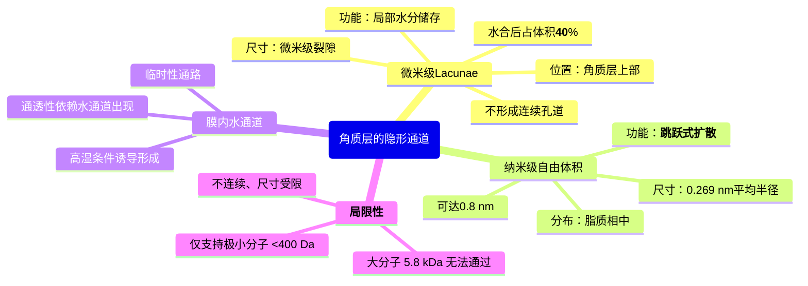
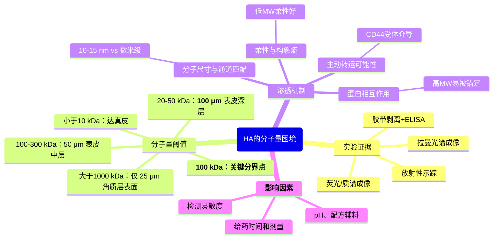
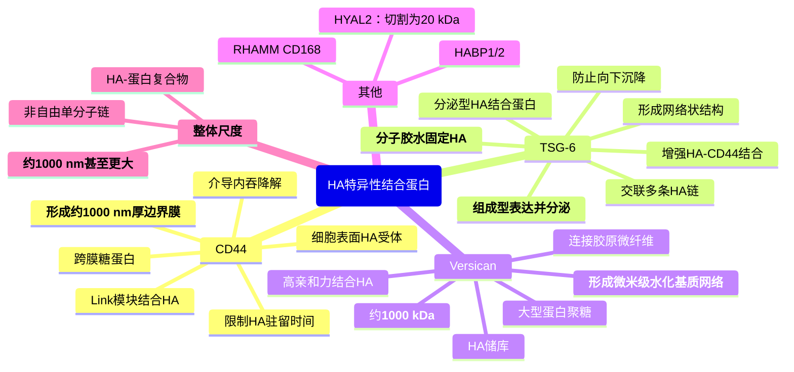
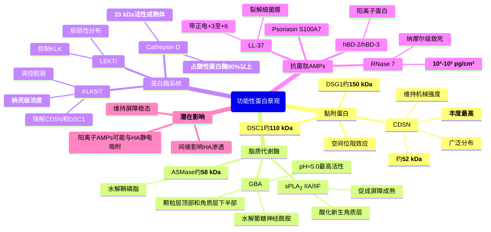
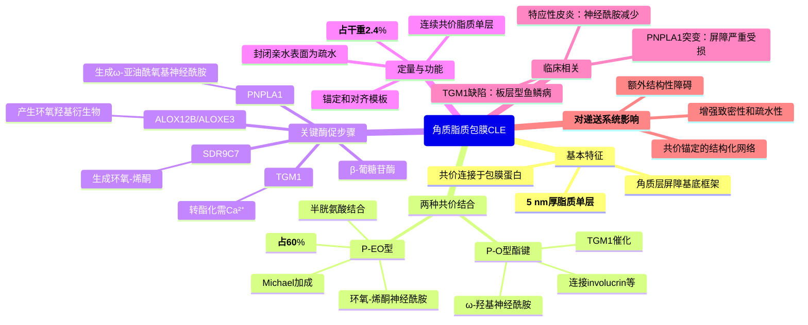
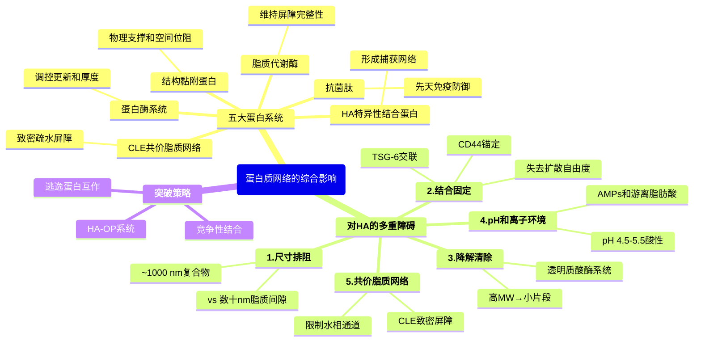

# 皮肤屏障的“水之道”：角质层水通道与透明质酸渗透机制（上）

> 都是ChatGPT调研的，我看了总体上是对的，具体细节还请自行调研确认正确性。

## 摘要

> 角质层作为人体最外层的保护屏障，其独特的“砖墙”结构赋予了皮肤优异的防护功能，但也成为经皮药物递送的主要障碍。本文基于最新研究进展，系统阐述了角质层微观尺度的**水通道结构**（lacunae空隙、纳米自由体积）及其对亲水物质渗透的意义，揭示了透明质酸（HA）**分子量依赖的渗透深度规律**（20-50 kDa可达100 μm表皮深层，而>1000 kDa仅停留于25 μm角质层表面），深入解析了角质层细胞间脂质基质中的**蛋白质网络**（CD44、TSG-6、Versican等HA结合蛋白，以及脂质代谢酶、蛋白酶、抗菌肽、角质脂质包膜CLE）对HA渗透的阻碍机制。研究表明，理解角质层的多尺度屏障结构（物理、尺寸、生化）是设计大分子经皮递送系统的第一步。

### 核心结论

- 角质层内存在自发形成的微纳米级亲水空隙（lacunae裂隙和纳米自由体积），为水分子和小亲水分子提供渗透通路
- HA的角质层渗透能力呈现明显的分子量阈值效应，约100 kDa是渗透性能的关键分界点
- 角质层表皮界面富集多种HA结合蛋白（CD44、TSG-6、Versican），**形成约1000 nm的大型HA-蛋白复合物，显著阻碍HA渗透**
- 角质层细胞间脂质基质富含脂质代谢酶、蛋白酶、抗菌肽及共价脂质包膜（CLE），共同维持屏障稳态
- 突破角质层HA渗透瓶颈不仅需要考虑分子量，更需要设计能够“逃逸”或“竞争”这些蛋白相互作用的策略

## 背景

经皮给药系统（Transdermal Drug Delivery System, TDDS）作为一种无创、患者依从性高的给药方式，在慢性病管理和持续药物释放领域展现出巨大潜力。然而，**皮肤角质层**（Stratum Corneum, SC）这一厚度仅10-20 μm的最外层结构，却构成了药物渗透的主要屏障。角质层由无核的角质细胞（corneocytes）和细胞间脂质基质组成，呈现经典的“砖墙模型”（brick-and-mortar model）：扁平的角质细胞如同砖块，细胞间高度有序的脂质双层如同灰浆，共同构筑起一道**致密的疏水屏障**，使得大多数亲水性药物分子难以通过。

### 经皮给药的挑战与机遇

传统观点认为，能够有效透过角质层的药物分子需满足Lipinski’s “Rule of 5”的变体——**分子量<500 Da、log P值在1-3之间、氢键供受体数目有限**这一严格的限制使得大分子生物药物（如蛋白质、多肽）的经皮递送面临巨大挑战。以**胰岛素**为例，其分子量约5.8 kDa，在生理pH下略带负电，且易在储存和使用过程中发生聚集形成淀粉样纤维，这些特性都极大限制了其经皮吸收。目前胰岛素主要依赖皮下注射给药，虽然有效但给患者带来疼痛、感染风险和依从性问题。开发非侵入性的胰岛素经皮递送系统成为药剂学领域的重要目标。

与此同时，**透明质酸**（Hyaluronic Acid, HA）作为一种天然的线性多糖，因其优异的生物相容性、保湿性和促进创面愈合的能力，在皮肤科学和药物递送领域受到广泛关注。HA广泛存在于真皮和表皮中，对皮肤的水合状态和机械性能至关重要。然而，HA本身也是一个大分子（分子量从几千到数百万道尔顿不等），其能否穿透角质层、如何与角质层中的内源性成分互作、以及能否作为药物载体促进其他分子的渗透，这些问题仍存在诸多争议和未解之谜。

### 多尺度屏障的系统认知需求

近年来，随着高分辨率显微技术（冷冻电镜、原子力显微镜）、光谱分析方法（拉曼光谱、正电子湮没寿命谱）和分子生物学手段的发展，我们对角质层微观结构的认识不断深化。研究发现，**角质层并非均质的疏水膜**，而是存在多种微纳米级的亲水区域和通道，这些结构可能为水分子和小亲水分子提供渗透途径。此外，角质层细胞间脂质基质中还分布着多种功能性蛋白质，包括黏附蛋白、脂质代谢酶、蛋白酶及其抑制剂、抗菌肽等，这些蛋白不仅维持角质层的结构完整性和屏障功能，还可能通过与外源性大分子（如HA）的相互作用，影响其渗透行为。

理解**HA、胰岛素及其辅助材料（如聚电解质）在角质层微环境中的分子互作机制**，对于设计高效的经皮递送系统至关重要。这需要我们从多个层面系统认知：
1. **结构层面**：角质层的微观水通道和亲水空隙如何分布？
2. **分子层面**：不同分子量的HA如何在角质层中运动？胰岛素在不同pH和离子环境下如何聚集？
3. **互作层面**：HA与角质层内源蛋白如何结合？胰岛素与HA、聚电解质之间存在何种相互作用？
4. **应用层面**：如何通过分子设计和配方优化，破坏不利的相互作用、促进有利的组装，从而实现大分子的高效经皮递送？

本文将基于近期相关领域的研究进展，系统回答上述问题，为基于HA的胰岛素经皮递送系统的理性设计提供科学依据。

## 一、角质层的隐形通道：水分子的渗透路径

虽然角质层以其致密的脂质双层结构闻名，但这并不意味着它是一个完全密不透水的屏障。事实上，**健康皮肤每天都会通过角质层蒸发约300-400 mL的水分**（经皮水分流失，Transepidermal Water Loss, TEWL），这一现象表明角质层内必然存在水分子的通过路径。同时，极性小分子药物（如甘露醇、肌醇）虽然渗透速率极低，但仍可被检测到微量的透皮通量，提示角质层中可能存在亲水性的微通道或空隙。近年来，借助先进的显微和光谱技术，科学家们逐渐揭示了角质层内自发形成的多种微纳米级亲水结构。

### 1.1 自发形成的亲水空隙：从微米到纳米的多尺度通道

#### Lacunae空隙：微米级的亲水裂隙

在角质层的形成过程中，位于颗粒层的角质细胞通过角质粘连体（corneodesmosomes）相互连接，维持组织的机械强度。然而，随着角质细胞逐渐向皮肤表面迁移，这些粘连结构会被蛋白水解酶（如KLK5、KLK7）逐步降解，最终导致角质细胞脱落（脱屑过程）**Lin等（2012）利用蒸汽固定电镜技术首次清晰观察到**，在角质层中层，角质粘连体仍完整存在，维持着细胞间的紧密连接；但在靠近表面的外层，这些粘连体被**亲水性裂隙**（称为**lacunae**空隙）取代，并横向扩展，将周围的层状脂质结构劈开。

这些lacunae空隙呈现片状或缝隙状分布，沿着原细胞连接处形成不连续的空腔**电镜下观察显示**，lacunae内充填有角质层自身产生的水解产物（如肽段、氨基酸、天然保湿因子NMF等），呈现电子密度增高，证实其为亲水性区域。更重要的是，**在水合作用下，lacunae可显著膨胀——有报道指出经充分水合后，lacunae可占据角质层体积的约40**%。此时，多个相邻的lacunae可能相互连通，形成三维网络状的亲水通路。

然而，在正常干燥条件下，lacunae主要局限于角质层上部数层细胞之间，**并不形成贯穿整个角质层的连续孔道**它们更像是分散的水池或“微型储液器”，为局部的水分储存和有限的亲水分子扩散提供空间，而非直达真皮的高速公路。

#### 纳米自由体积：脂质层内的分子级孔洞

除了细胞间的lacunae，角质层细胞间脂质双层内部也并非完美无缺的致密结构。采用**正电子湮没寿命谱（Positron Annihilation Lifetime Spectroscopy, PALS）技术**，研究者首次在实验上证实：**人角质层脂质层内存在纳米级的自由体积空隙，平均半径约0.269 nm**（理论预测约0.4 nm）。这些纳米空隙相当于分子级的孔洞，可供小分子（如水、甘油）暂时驻留和扩散。

Itoh等（2008）对猪皮角质层的PALS分析表明，角质层的孔径/自由体积大小甚至**大于环糊精的孔径**（0.5-0.8 nm），意味着角质层中存在直径可达0.8 nm甚至更大的微孔结构。虽然这些纳米空隙彼此分离、不形成连续通道，但它们广泛分布于脂质相中，**为小分子的跳跃式扩散提供了结构基础**：小分子可以在众多纳米空隙间不断转移，从而缓慢地穿越脂质层。

这种纳米自由体积的存在解释了为何即使在没有明显水孔的情况下，角质层仍然存在一定baseline水平的水通透性。水分子并非穿过一个连续的水孔，而是不断在**众多纳米空隙间接力扩散**，从而实现从真皮到皮肤表面的缓慢渗出。

#### 膜内水通道：高湿条件下的临时性通路

分子动力学模拟研究揭示了一个有趣的现象：在**高湿条件下**，角质层脂质双层会自发包裹部分水分，形成分离的小水滴。这些水滴的大小受到控制，并有特定的空间分布。随着水分含量增加，小水滴可能融合形成贯穿脂质层的**膜内水通道**（intralamellar water channels），为亲水性分子提供暂时性通路。

MacDermaid等（2020）的研究指出，**只有当这些亚稳态水通道出现时，角质层对亲水分子的通透性才不至于趋近于零**换言之，在干燥条件下，角质层的脂质相几乎完全隔绝亲水分子；但在湿润或浸泡环境下（如洗澡后、封闭敷料下），脂质层中可能暂时形成水相通道，显著增加亲水物质的渗透。

需要强调的是，这种膜内水通道**并非角质层的常态结构**，而是在外界水合作用诱导下的动态、间歇性事件。在日常环境湿度下，这类通道出现的概率很小。但这一发现提示，**通过人为增加角质层的水合程度**（如使用封闭剂、水凝胶贴片），可以暂时性地打开这些水通道，为亲水性药物的渗透创造条件。

### 1.2 水通道的功能意义

#### 经皮水分流失（TEWL）的微观机制

经皮水分流失是皮肤生理的重要指标，反映了角质层屏障的完整性。健康皮肤的TEWL主要通过以下途径实现：
- **纳米自由体积的跳跃扩散**：水分子在脂质层内的众多纳米空隙间不断转移，这是TEWL的主要路径
- **极性头基区域的扩散**：脂质双层中神经酰胺、胆固醇等脂质的极性头基区域形成相对亲水的微环境，水分子可沿此区域缓慢移动
- **Lacunae通路**：在角质层上部，lacunae空隙可能为水蒸气提供额外的扩散路径，尤其在皮肤轻度水合时

研究表明，**角质层对水分子的通透性远高于对其他小分子的通透性**，这是因为水分子体积极小（分子半径约0.14 nm）、高度极性且能够形成氢键网络，使其能够有效利用上述所有微通道。相比之下，稍大的亲水分子（如甘露醇，分子量182 Da）虽然也能利用类似途径，但其渗透速率要低几个数量级。

#### 亲水分子的有限扩散途径

对于外源性的亲水药物分子，角质层的微通道提供了**唯一但极其低效的渗透可能**经典的皮肤渗透模型将药物通过角质层的途径分为：
1. **脂质相扩散**：亲脂性药物的主要途径
2. **水孔扩散**：亲水性药物依赖的途径，但效率极低
3. **附属器官途径**：通过毛囊、汗腺等（占皮肤面积<1%）
4. **自由体积分子扩散**：微小分子可利用纳米空隙

MacDermaid等的计算表明，**如果角质层内完全不存在任何水相通道或亲水域，极性分子的通透性将趋近于零**正是由于上述lacunae、纳米自由体积和间歇性膜内水通道的存在，亲水分子才有了极其微弱但可测的渗透通量。

然而，这些天然水通道的**通透能力极为有限**：
- 纳米自由体积仅能容纳极小分子（分子量<400 Da）
- Lacunae在常态下不连续，且主要位于角质层表层
- 膜内水通道在正常条件下很少出现

因此，对于大分子（如胰岛素5.8 kDa、HA数万至数百万Da），这些天然水通道几乎不提供任何有效的渗透途径**这正是大分子药物经皮递送面临的根本性挑战**：它们既无法通过脂质相（因为亲水性强），也无法通过水相通道（因为分子尺寸远超通道孔径）。

### 小结

角质层内自发形成的微纳米级亲水空隙（lacunae裂隙、纳米自由体积、临时性膜内水通道）为水分子和极小亲水分子提供了有限的渗透通路，解释了TEWL和极低水平的极性小分子透皮现象。然而，这些通道的尺寸（**亚纳米到微米**）和连续性（多数不连贯）**远不足以支持大分子的有效渗透**理解这些天然水通道的存在及其局限性，是设计大分子经皮递送策略的第一步——我们需要寻找其他机制来克服或绕过这一尺寸屏障。

接下来，我们将聚焦于透明质酸这一重要的生物大分子，探讨其在角质层中的渗透行为如何受到分子量的严格限制。

## 二、透明质酸的分子量困境：大小决定渗透深度

透明质酸（Hyaluronic Acid, HA）是一种由D-葡萄糖醛酸和N-乙酰葡糖胺组成的线性多糖，广泛存在于结缔组织、上皮组织和神经组织中。在皮肤中，HA主要分布于真皮和表皮，对维持皮肤水合状态、调节细胞增殖分化、促进创面愈合等发挥重要作用。商业HA产品的分子量跨度极大，从几千道尔顿（低分子量，LMW）到数百万道尔顿（超高分子量，UHMW）不等**HA能否透过角质层、渗透到表皮甚至真皮**，这一问题关系到HA在化妆品和药物递送中的实际功效，但一直存在争议。

近年来，借助高分辨率的空间分析技术，研究者们获得了较为明确的答案：**HA的角质层渗透能力呈现显著的分子量依赖性**，存在明显的分子量阈值效应。

### 2.1 实验证据：从拉曼光谱到放射性示踪

#### 拉曼光谱成像：直接看见HA的分布

Essendoubi等（2016）采用**共焦拉曼显微镜**对人体皮肤冷冻切片进行了开创性研究。他们在皮肤外涂1% HA溶液（300 μL，8小时）后，对皮肤横截面进行空间扫描，空间分辨率约5 μm，轴向分辨率约3 μm**通过拟合HA的特征拉曼峰**，实现了对不同分子量HA在皮肤各层内分布的无标记检测。

实验结果令人震撼：
- **20-50 kDa（低分子量）HA**：信号延伸至皮肤约**100 μm的深层表皮**，接近表皮-真皮交界区域
- **100-300 kDa（中分子量）HA**：信号仅出现于**表皮中层**（约50 μm）
- **1000-1400 kDa（超高分子量）HA**：几乎**只分布在角质层**（约25 μm）表面

这一结果清晰表明：**HA的渗透深度随分子量增加而急剧下降**，在约300-1000 kDa之间存在一个渗透能力的**关键分界**超高分子量HA几乎无法穿透角质层，而低分子量HA则可以顺利通过角质层并深入表皮活层。

#### 放射性标记自显影：活体皮肤的直接证据

Brown等（2004）采用更为灵敏的**氚标记（³H-HA）自显影技术**，在人体前臂皮肤原位外涂³H标记的HA制剂，30分钟后取皮肤组织切片进行自显影。结果显示：
- 即使是**360-400 kDa大小的HA**，也能在活体皮肤全层检测到放射性信号，**包括表皮深层和真皮层**
- 在**血液和尿液中也检测到360-400 kDa的HA聚合物**，证实HA整分子被吸收进入循环系统

这一出乎意料的结果提示：**在体内可能存在主动转运机制**（如细胞内吞、转胞吞作用或特殊的HA受体介导转运），使得即便是中等分子量的HA也能跨越角质层屏障。这与单纯的被动扩散模型不同，暗示HA在活体皮肤中的渗透可能涉及更复杂的生物学过程。

然而，需要注意的是，Brown等的实验采用了特殊的**强酸性配方**（pH显著低于生理值），且观察到了**疏水性固体沉淀**，提示HA可能与配方中的其他成分（如胰岛素）形成了复合物，改变了其理化性质和渗透行为。这一特殊条件下的结果可能无法直接外推至常规的中性HA溶液。

#### 胶带剥离+ELISA定量：角质层的积累证据

Grégoire等（2022）采用更温和的**连续胶带剥离法**研究HA在角质层中的积累。志愿者连续7天外用含有高/低分子量HA的配方，在不同时间点采用胶带剥离收集角质层第1-5层样本，并用高灵敏度ELISA（下限约3.1 ng/mL，上限200 ng/mL）定量HA含量。

结果表明：
- **无论低分子量还是高分子量HA**，涂抹后角质层第3-5层的HA含量都**显著高于应用前**
- 经多次应用后，HA在角质层中**可积累至比初始高31倍**
- 但该方法**难以定量表皮和真皮层的HA**（因内源HA干扰）

这一结果证实，外用HA能够进入并积累于角质层深部（第3-5层），但无法直接回答其是否进一步渗透到表皮活层。

#### 荧光/质谱成像：纳米级定位

一些研究将10 kDa HA标记荧光探针或金属配合物，涂覆于人皮肤样本后借助荧光/红外显微镜检测。结果显示：
- 标记HA在**24小时后在角质层分布均匀**，并有**少量进入存活表皮**
- Legouffe等采用**MALDI质谱成像技术**，研究连续6天外用10 kDa HA配方后发现，**表皮和真皮中的HA浓度显著增加**，表明多次使用可使HA渗透至更深层

这些高空间分辨率技术进一步支持了低分子量HA（<10 kDa）能够透过角质层的结论，并提示重复给药可以增强渗透效果。

### 2.2 分子量阈值与渗透机制

综合上述多种技术手段的证据，可以得出以下共识：

#### 分子量阈值
- **<10 kDa**：极易渗透，可达真皮。有研究报道**2-5 kDa的HA能够透过表皮到达真皮**，3 kDa HA在8小时后可深入皮肤表面下约60 μm
- **20-50 kDa**：可顺利渗透角质层并深入表皮约100 μm
- **100-300 kDa**：可穿透角质层但主要停留在表皮浅层约50 μm
- **约100 kDa**（百千道尔顿）：这是渗透性能的重要分界点，以下的HA分子比较容易渗透角质层并到达表皮
- **约300-1000 kDa之间**：存在渗透能力的关键分界
- **>1000 kDa**（千千道尔顿）：几乎完全无法自然穿透，仅停留在角质层表面约25 μm

这一分子量依赖性可以从物理化学和结构角度理解：

#### 分子尺寸与通道匹配
- 低分子量HA（如20 kDa）的流体力学半径约**10-15 nm**，可能勉强通过角质层lacunae空隙和细胞间脂质的局部缺陷
- 中分子量HA（100-300 kDa）的尺寸约**50-100 nm**，仅能进入较大的lacunae或在角质细胞脱落产生的临时通道中移动
- 高分子量HA（>1000 kDa）的链长可达**微米级**（伸展状态下可达2-3 μm），即使以随机线团构象，其回旋半径也在**数百纳米以上**，远超角质层任何天然通道的尺寸

#### 柔性与构象熵
- 低分子量HA链段较短，柔性好，能够挤压通过狭窄孔隙
- 高分子量HA链段长，虽然单个糖苷键有一定旋转自由度，但整体构象受限，难以适应复杂曲折的角质层微通道

#### 与角质层成分的相互作用
- 较小的HA分子可能与角质层内的蛋白、脂质形成较弱的瞬时相互作用，通过不断解离-结合的方式缓慢移动
- 较大的HA分子一旦与角质层表面的蛋白（见下一章节）结合，就会形成大型复合物，被有效“锚定”在表层，难以继续深入

#### 主动转运的可能性
- Brown等的体内实验提示可能存在HA受体介导的转胞吞或细胞内吞途径
- CD44等HA受体在表皮基底层和棘层细胞表达，可能参与HA的摄取和转运
- 但这一机制在角质层（已无活细胞和受体）中不适用，更可能在表皮活层发挥作用

### 2.3 实验条件的影响与争议

不同研究关于HA渗透性的结论存在一定差异，主要源于以下因素：

#### 检测灵敏度与内源干扰
- 皮肤内源HA丰富（尤其真皮和表皮），背景信号高
- Grégoire等指出，**ELISA难以区分外源HA是否渗透至表皮真皮**，因为内源HA的干扰无法排除
- 只有使用**同位素标记或特殊探针标记的HA**才能确切追踪外源HA的去向

#### 表面清洗方法
- 研究表明，涂抹后采用干法擦拭会在角质层样本中残留更多HA信号
- 而“湿法”清洗（使用去洗涤剂）则更彻底去除表面配方
- 不恰当的清洗可能将表面残留误判为渗透

#### 剂量、时间与重复给药
- 多数观察基于短期单次给药（8-24小时）的体外/体内模型
- 连续多日外用往往可显著增加角质层积累，并在累积效应下将少量HA推入表皮/真皮
- Legouffe的6天连续给药结果即显示了这种累积效应

#### 配方pH与辅料
- Brown等采用强酸性配方，HA可能与配方中的胰岛素形成复合物，改变渗透行为（见第五章）
- 中性或弱酸性常规HA溶液的渗透行为可能完全不同

#### 透皮机制的不同假设
- **被动扩散vs主动转运**：Brown等认为HA并非单纯被动弥散，而可能通过细胞内吞或特殊转运途径进入皮肤深层
- **细胞间vs跨细胞途径**：有研究提示天然HA更倾向于经表皮细胞穿行（跨细胞途径），而非仅沿细胞间隙扩散
- **角质层结构改变**：部分研究表明HA与角质层角蛋白相互作用，通过改变角质层结构促进自身和其他分子的渗透，这种屏障调节效应可能是HA促渗作用的机制之一

尽管存在上述争议，**大方向的共识是明确的**：HA的渗透能力随分子量增加而递减，约100 kDa（百千道尔顿）是一个较为关键的分界点，超高分子量HA（>1000 kDa，即千千道尔顿）基本不能自发透过完整角质层。

### 小结

透明质酸的角质层渗透呈现显著的**分子量依赖性**，低分子量HA（20-50 kDa）可深入表皮约100 μm，而超高分子量HA（>1000 kDa）仅停留在角质层表面约25 μm。这一现象反映了角质层微通道尺寸限制与HA分子尺寸之间的匹配关系。理解这一规律对于选择合适分子量的HA作为药物载体或活性成分至关重要。

然而，分子量并非唯一决定因素**角质层及其下方组织中存在多种HA结合蛋白**，它们能够捕获、交联并稳定HA，形成大型复合物，进一步阻碍HA的渗透。接下来，我们将深入探讨这些蛋白质“守门员”的作用机制。

---

## 三、角质层的“蛋白质守门员”：HA结合网络与功能性蛋白景观

### 3.1 HA特异性结合蛋白：捕获与交联的分子机制

角质层及其邻近区域（颗粒层、真皮-表皮交界处）存在多种能够特异性结合透明质酸的蛋白质，这些蛋白通过非共价相互作用形成庞大的HA-蛋白复合物，显著限制HA的自由扩散。

#### CD44：细胞表面的HA受体

CD44是角质形成细胞上最主要的HA受体，属于跨膜糖蛋白，其胞外域含有Link模块用于HA结合。在活表皮（基底层和棘层），CD44高度表达并在细胞周围形成富含HA的包被（pericellular coat）。Tammi等（1998）的研究显示，角质形成细胞表面约一半的HA以离散斑块形式组织并与CD44共定位，这些HA斑块可被HA十糖竞争性释放（而六糖无效），证实了CD44对HA的特异性结合。

**CD44-HA复合物的空间尺寸**：单个细胞表面的HA-CD44斑块直径约1-2 μm，相当于约1000 nm的厚度。由于多条HA链可同时结合一个细胞表面的CD44阵列，实际上在颗粒层-角质层交界处形成了一层**约1000 nm厚的HA边界膜**，有效阻挡外源HA的向下渗透。

当角质形成细胞向角质层转化时，CD44随细胞核等细胞器一起丢失，但在颗粒层顶部（紧邻角质层下方）CD44仍可捕获向上扩散的HA，将其锚定在细胞膜上。CD44介导的结合还是HA内吞降解的第一步：**角质形成细胞通过内吞作用将HA-CD44复合物摄入溶酶体降解**，正常情况下这限制了HA的驻留时间。

#### TSG-6：胞外HA交联剂

TSG-6（TNFα-刺激基因-6蛋白）是一种分泌型透明质酸结合蛋白，在表皮角质形成细胞中**组成型表达并分泌**（非仅炎症诱导）。TSG-6同样含有**Link模块**，但其功能与CD44显著不同：TSG-6结合HA后倾向于形成寡聚体，能够**交联多条HA链**，在细胞间隙中形成网络状结构。

**TSG-6的关键作用**：
- **将HA捕获在表皮细胞外基质（ECM）中**：TSG-6结合的HA形成致密的、局部交联的HA凝胶，阻止其自由扩散
- **防止HA向下“沉降”**：研究表明TSG-6能够阻止HA从表皮向真皮下沉
- **增强HA与CD44的结合**：TSG-6结合的HA对CD44的亲和力反而增加，可能通过呈递效应将HA桥接于细胞膜与基质之间

在正常条件下，TSG-6维持低水平以组织HA；而在炎症或应激时，角质形成细胞大量分泌TSG-6，导致过度交联的HA网络（如特应性皮炎中的“海绵变性”）。从递送角度看，**TSG-6就像一把“分子胶水”，将HA牢牢固定在角质层附近**，形成了针对外源HA的第二道屏障。

#### Versican：大型蛋白聚糖复合物

Versican是一种大型**硫酸软骨素蛋白聚糖**，其N端球状域能以高亲和力（Kd在**nM范围**）结合HA。Versican主要分布于真皮结缔组织，但在表皮下层（尤其真皮-表皮交界区）也有表达。

**Versican-HA复合物的巨大尺寸**：Versican本身约**1000 kDa**，结合数百kDa的HA链后，再通过Versican的C端连接胶原微纤维，形成**数百纳米至微米级的水化基质网络**这种巨型复合物几乎完全不能移动，在角质层基底形成一个**HA储库**，进一步贡献于HA的局部富集和外源HA的阻挡。

#### 其他HA结合蛋白

- **RHAMM**（CD168）：HA介导的运动受体，主要在伤口愈合或应激时在角质形成细胞表达
- **HABP1/2**：泛在表达的HA结合蛋白，可能存在于细胞表面或分泌液中
- **透明质酸酶**（HYAL2）：锚定在角质形成细胞膜上，将高MW HA切割为约**20 kDa**片段后内吞，这一过程先结合后降解，也属于一种转短暂的HA-蛋白相互作用

**HA-蛋白复合物的整体尺度**：考虑到CD44介导的细胞周HA包被（1-2 μm）、TSG-6交联的基质网络以及Versican锚定的大型聚集体，**正常皮肤中的HA实际上以约1000 nm（1 μm）甚至更大的复合结构存在**，而非自由的单分子链。这正是后文提到HA-OP递送系统需要破解的关键障碍。

### 3.2 角质层细胞间脂质基质中的功能性蛋白景观

除了HA特异性结合蛋白，角质层细胞间脂质层中还定位着大量功能性蛋白，它们虽然不直接结合HA，但通过维持脂质屏障结构、调控脱屑和提供抗菌防御等方式，共同构成了角质层微环境，间接影响大分子如HA和胰岛素的渗透行为。

#### 黏附蛋白：维持角质层物理完整性

- **角质桥粒蛋白**（Corneodesmosin, CDSN）：是角质层细胞间基质中**丰度最高的蛋白之一**免疫电镜显示，CDSN沿角质层各层级的细胞侧面及上下表面**广泛分布**，在整个角质层细胞间隙中存在，但在最表层由于被蛋白酶降解而明显减少。CDSN以**约52 kDa**的糖蛋白形式存在，其含量仅次于角蛋白等细胞内成分。质谱成像（3D OrbiSIMS）和免疫金标记电镜证实了其在角质层中的高丰度。CDSN的**N端富含甘氨酸**，赋予强黏附性，对维持角质层机械强度至关重要。CDSN在角质层中被**KLK5/7逐步水解**以实现正常脱屑。
- **桥粒芯蛋白**（Desmoglein-1/Desmocollin-1, DSG1/DSC1）：是桥粒钙黏蛋白，在表皮颗粒层和角质层的上层高度表达。免疫金标记显示，在角质层下部和中部，这两种蛋白沿角质细胞的整个周缘均有分布**DSG1（约150 kDa）相对更持久**，由于较耐受KLK蛋白酶（KLK7不降解DSG1），在上层角质层仍维持一定水平，直到最表层才被最终分解。而**DSC1**（约110 kDa）随CDSN一起在角质层上部被逐渐降解。总体而言，这两种跨膜蛋白在角质层细胞间基质中含量高、分布广，仅次于CDSN等非跨膜组分。

这些黏附蛋白虽不与HA直接结合，但其高度糖基化的延伸结构占据细胞间隙，可能对大分子如HA或胰岛素-HA复合物形成空间位阻，进一步限制其扩散。

#### 脂质代谢酶：构建与维持屏障脂质

- **β-葡萄糖基神经酰胺酶**（GBA）：定位于角质层细胞间脂质双层，由板层小体分泌，在**pH≈5.0**的酸性环境中活性最高。利用荧光底物原位酶活组化显示，**GBA活性集中于表皮外层**，特别是在颗粒层顶部和角质层下半部达到峰值。分层提取分析表明，角质层中GBA活性显著高于真皮表皮交界处，加有胆汁盐激活剂可令其活性提高**>10倍**，说明酶蛋白以储备形式存在并可被激活。GBA将葡糖神经酰胺水解为神经酰胺，这是角质层脂质成熟的关键步骤。
- **酸性鞘磷脂酶**（ASMase）：通过免疫电镜和免疫印迹定位于颗粒层/角质层细胞间脂质域，以**约58 kDa的形式**存在。ASMase主要定位在外层表皮，即自棘层上部、颗粒层直到角质层下部的细胞间隙中，将鞘磷脂水解为神经酰胺。正常皮肤中，ASMase活性对于维持屏障脂质平衡是必需的。特应性皮炎等患者皮肤中ASMase活性降低，伴随神经酰胺减少和屏障受损。
- **分泌型磷脂酶A2**（sPLA2 IIA/IIF）：皮肤中存在多种亚型，其中**IIA和IIF型**在角质层形成过程中起重要作用。这些酶主要定位于颗粒层上部，并在表皮屏障受损时表达显著上调。sPLA2随板层小体分泌，进入紧邻角质层的细胞间空间。在新生儿皮肤中，sPLA2在出生后一周内于颗粒层/角质层交界处大量出现，以帮助迅速酸化新生角质层、促成屏障成熟。sPLA2-IIF敲除小鼠表现出角质层pH偏中性、屏障修复延迟，提示该酶在角质层中的功能剂量充足且重要。

这些脂质代谢酶确保了角质层脂质双层的完整性和流动性，间接决定了**脂质通路的致密程度**以及水相通道的空间分布。对于HA-OP这类亲水性纳米递送系统，角质层脂质层的组织状态影响着水相通道的可及性和渗透效率。

#### 蛋白酶及抑制剂：调控脱屑平衡

- **角质层激肽释放酶**（KLK5/7）：又称角质层胰蛋白酶（SCTE）和糜蛋白酶（SCCE），是角质层主要的脱屑酶。在健康皮肤中，这两种蛋白酶主要定位于角质层细胞间隙，在颗粒层中几乎无染色**它们以无活性的酶原形式由颗粒细胞的板层小体分泌至角质层下部空间**随着角质层上移，局部pH降低（至约5），KLK5/7被激活并集中于角质层上部区域行使水解功能，降解角质棘层小体连接蛋白（如CDSN和DSC1等）。ELISA定量显示，健康人角质层中**KLK7含量相对较高**，而KLK5略低，它们在角质层细胞间以**纳克级浓度**存在，并通过酶活性放大其生理作用。在特应性皮炎等疾病中，角质层KLK总量显著升高，其中KLK7增幅最为突出。
- **LEKTI**（丝氨酸蛋白酶抑制剂，SPINK5编码）：是一种多域丝氨酸蛋白酶抑制剂，主要在颗粒层最上层合成，并储存于板层小体内。免疫定位研究表明，LEKTI随板层小体分泌进入颗粒层与角质层交界处的细胞间空间**其分布呈局部性**：即仅在角质层最下方（紧邻颗粒层处）可检测到LEKTI的存在，而在角质层更上部则几乎检测不到完整的LEKTI。这是由于LEKTI在pH梯度下被剪切为小片段并逐渐失活。在正常角质层下部，LEKTI含量足以抑制大部分过早的KLK蛋白酶活性，从而维持角质层稳态**Netherton综合征患者由于LEKTI缺失**，角质层蛋白酶活性失控，说明了正常情况下LEKTI在角质层界面处以功能性浓度持续存在。
- **Cathepsin D**（组织蛋白酶D）：是一种酸性天冬酰蛋白酶，在角质层的细胞间环境中发挥脱屑作用。免疫荧光观察显示，Cathepsin D主要定位于角质层脂质包膜区域，即角质细胞表面的细胞间脂质中。更精细的免疫电镜证据表明，**Cathepsin D直接附着于角质棘层小体上**它在角质层中上部活性最高（适宜**pH≈5**），对应于脱屑发生的位置。Cathepsin D是角质层中主要的溶酶体源性蛋白酶，**约占角质层酸性蛋白酶总活性的80%以上**在人角质层提取物中可检测到两种分子量形式（活性成熟体**33 kDa**和中间体**48 kDa**），其中**33 kDa**形式为主要活性酶。相比之下，Cathepsin E在角质层中信号弱**10倍**，活性贡献不到**20**%。因此Cathepsin D可被认为是角质层细胞间基质中含量丰富且功能重要的常驻蛋白酶。

蛋白酶系统的精确调控维持了角质层的动态更新和适度厚度**过度或不足的蛋白水解都会破坏屏障完整性**，影响大分子渗透行为。

#### 抗菌肽/蛋白：角质层先天免疫防线

角质层细胞间脂质层富集多种阳离子抗菌肽（AMPs），它们与板层脂质共定位，构成抵御病原体的第一道防线：

- **Cathelicidin抗菌肽**（LL-37）：人类Cathelicidin的前体hCAP18由角质形成细胞产生并**储存在板层小体内**它在颗粒层-角质层交界处随板层小体分泌，**分布于整个角质层细胞间隙**在角质层上部经蛋白酶（如KLK5等）剪切生成成熟抗菌肽LL-37。免疫金电镜发现cathelicidin主要位于表皮浅层颗粒状结构和板层小体中，并在角质层释放。LL-37带正电（**+3至+6**，取决于pH），可裂解细菌膜磷脂。Cathelicidin前体在角质层中局部浓度较高，经激活后LL-37局部可达**几十微克每克角质层**的水平（在感染或损伤部位更高）。
- **人β-防御素**（hBD-2/hBD-3）：在表皮颗粒层内被包装于板层小体，随脂质一起分泌至细胞间。hBD-2/3为阳离子蛋白，与LL-37协同构成角质层抗菌防线。在健康皮肤的角质层中hBD-2/3有低水平表达，而在炎症或感染时表达增强。
- **核糖核酸酶7**（RNase 7）：从健康人皮肤角质层提取物中分离，是角质层抗菌活性的重要贡献者。Tape-stripping非侵袭取样结合ELISA定量显示，**健康人前臂皮肤角质层RNase 7浓度在10²–10³ pg/cm²量级**，不同部位略有差异。RNase7在角质层内层高丰度存在，具有广谱强效抗菌作用（**纳摩尔级**即可致死多种致病菌）。
- **Psoriasin**（S100A7蛋白）：属于S100钙结合蛋白家族，正常角质层低水平表达，屏障受损时显著上调。Psoriasin在健康角质层中的浓度也可被检测并与疾病状态比较（在皮炎患者中可升高数倍）。Psoriasin主要杀灭大肠杆菌，并可能通过诱导角质形成细胞分化增强紧密连接，减少病原体透过。

**定量证据**：多项研究采用胶带采样+ELISA准确测定了RNase 7、S100A7和hBD-3在皮肤角质层表面的含量，并证实这些抗菌肽可重复检测且分布于不同部位皮肤。在健康皮肤的角质层，这些抗菌肽的基础含量通常处于微摩尔或更低水平，但足以对微生物发挥抑制作用。

**AMPs与带负电大分子的潜在相互作用**：这些阳离子肽理论上可与阴离子聚合物如HA发生静电吸附。虽然目前无直接文献证明LL-37或hBD-2特异性结合HA，但考虑到它们在角质层细胞间的高浓度和正电性，**不能排除AMPs与HA发生非特异性结合的可能性**，这可能影响HA在角质层中的局部滞留。

### 3.3 角质脂质包膜（CLE）：脂质与蛋白的共价锚定

角质层细胞间脂质基质不仅包含游离的脂质双层，还存在一层特殊的**共价结合脂质单层**——角质脂质包膜（Cornified Lipid Envelope, CLE）。这是一个约**5 nm厚**的脂质单分子层，通过共价键紧密连接在每个角质细胞表面的包膜蛋白上，构成了角质层屏障结构的基底框架。

#### 两种共价结合形式

- **P-O型**（酯键连接）：ω-羟基神经酰胺（ω-hydroxyceramides）通过酯键共价连接到角质细胞包膜蛋白上。表皮特有的**转谷氨酰胺酶1**（TGM1）催化神经酰胺分子末端的ω-羟基与包膜蛋白（主要是involucrin）的谷氨酰胺残基形成酯键连接。Nemes等（1999）证实TGM1能够将ω-羟基神经酰胺共价附着于重组involucrin的特定谷氨酰胺位点（如Q107、Q118等），生成可被皂化裂解的蛋白-脂质共轭物。除involucrin外，envoplakin、periplakin、desmoplakin等结构蛋白也可共价结合ω-羟基神经酰胺。

- **P-EO型**（半胱氨酸加成）：Ohno等（2023）发现角质层中特殊的**环氧-共轭烯酮神经酰胺**（epoxy-enone ceramides）可通过Michael加成反应与蛋白质中的半胱氨酸硫醇共价结合。这类共价物可通过特定化学处理可逆地释放脂质，显示其键合相对可逆。在小鼠表皮中，这类Cys-结合神经酰胺约占蛋白结合神经酰胺总量的**60**%，提示这种非酶促、自发形成的结合形式在角质层中相当普遍。

#### 关键酶促修饰机制

CLE的形成涉及一系列酶促步骤，在表皮颗粒层向角质层过渡时，板层小体（lamellar bodies）将预先封装的脂质前体和加工酶释放到细胞间隙，启动CLE组装：

- **PNPLA1**等酶将亚油酸共价连接在神经酰胺ω位羟基上，生成ω-亚油酰氧基神经酰胺（CER[EOS]），这是角质层脂质的核心成分
- **脂氧合酶ALOX12B/ALOXE3**作用于亚油酸酰基，产生环氧羟基衍生物（epoxy-hydroxy ceramides）
- **SDR9C7**进一步生成不饱和共轭酮结构（环氧-烯酮神经酰胺），这种共轭酮结构具有高度反应活性，能够与蛋白质氨基酸发生Michael加成
- **TGM1**负责将游离的ω-羟基脂质（主要是ω-羟基神经酰胺）通过酯键转酯化到包膜蛋白上，这一过程需要Ca²⁺激活
- **β-葡糖苷酶**将糖基水解，留下裸露的神经酰胺共价连于蛋白

#### 定量与功能意义

人表皮角质层中共价结合脂质约占组织干重的**2.4**%。相比之下，口腔黏膜等角化上皮的共价脂质比例只有**0.2**%左右，说明在需要强屏障功能的皮肤中，蛋白结合脂质的含量显著更高。

虽然蛋白结合形式的脂质占角质层脂质总量比例不高，但它们在每个角质细胞表面形成**连续的共价脂质单层**，将本来亲水的细胞表面封闭为疏水界面。这个底膜样的脂质层为其它大量游离脂质的层状堆积提供了**锚定和对齐模板**实验表明，当缺少蛋白结合脂质时，细胞间释放的脂质不能正确铺展为片层结构，屏障将变得松散易漏。

#### 临床相关性

- **TGM1缺陷**导致**板层型鱼鳞病**（Lamellar ichthyosis），患者由于角质细胞缺少共价脂质包覆导致水分流失和感染风险大增
- **PNPLA1突变**（自体免疫性角化障碍）患者无法合成ω-酰基神经酰胺，其角质层中完全测不到**CER[EOS]**和蛋白结合神经酰胺，屏障功能严重受损
- **特应性皮炎患者**角质层常检测到总神经酰胺含量下降，尤其是**CER[EOS]**和长链Cer显著减少，意味着蛋白结合脂质的前体和成品都不足，导致皮肤屏障更加通透

#### 对HA-OP递送系统的影响

CLE的存在意味着角质层细胞间脂质不仅是流动的脂质双层，而是具有**共价锚定的结构化脂质网络**。这种高度有序的脂质组织进一步增强了角质层的致密性和疏水性，对大分子如HA和胰岛素的渗透构成额外的结构性障碍。

### 3.4 蛋白质网络对HA渗透的综合影响

综合上述信息，角质层细胞间脂质基质远非单纯的“灰泥”，而是一个**富含多种功能性蛋白的复杂生物界面**：

- **结构黏附蛋白**（CDSN、DSG1/DSC1）提供物理支撑和空间位阻
- **脂质代谢酶**（GBA、ASMase、sPLA2）维持脂质屏障的完整性和流动性
- **蛋白酶系统**（KLK5/7、LEKTI、Cathepsin D）调控角质层更新和厚度
- **抗菌肽**（LL-37、hBD-2、RNase7、Psoriasin）提供先天免疫防御
- **HA特异性结合蛋白**（CD44、TSG-6、Versican）形成针对HA的捕获网络
- **角质脂质包膜**（CLE）：通过共价锚定的脂质-蛋白网络构建致密疏水屏障

对于外源HA，尤其是高分子量HA，这些蛋白构成了多重障碍：
1. **尺寸排阻**：HA-蛋白复合物（**~1000 nm**）远大于角质层脂质间隙（**数十nm**），难以穿透
2. **结合固定**：TSG-6交联和CD44锚定使HA失去扩散自由度
3. **降解清除**：透明质酸酶系统快速降解高MW HA为小片段
4. **局部pH和离子环境**：AMPs、游离脂肪酸维持的酸性环境（**pH 4.5-5.5**）可能影响HA的构象和水化状态
5. **共价脂质网络**：CLE形成的致密疏水屏障增强了角质层对亲水大分子的排斥，进一步限制水相通道的可及性

因此，**突破角质层HA渗透瓶颈不仅需要考虑分子量，更需要设计能够逃逸或"竞争"这些蛋白相互作用的策略**。这正是HA-OP递送系统的核心创新点，我们将在第六章详细讨论。

---

*本文为上篇，主要阐述了角质层的微观水通道结构、透明质酸的分子量依赖性渗透规律，以及蛋白质网络对HA的捕获机制。下篇将深入探讨胰岛素的聚集行为、胰岛素-HA-聚电解质三方互作网络，以及基于这些认知的递送系统设计策略。*
