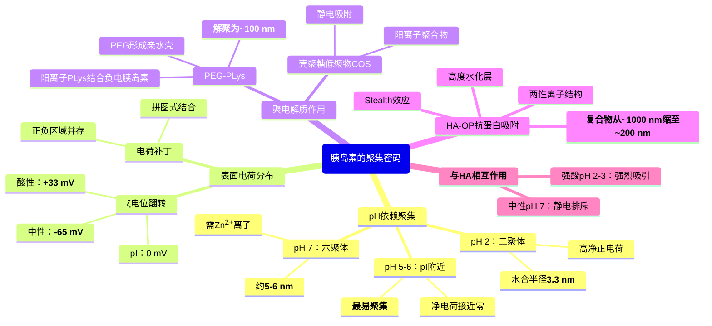
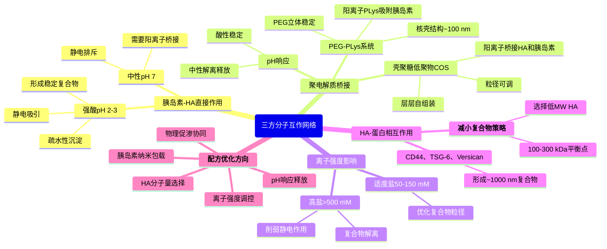
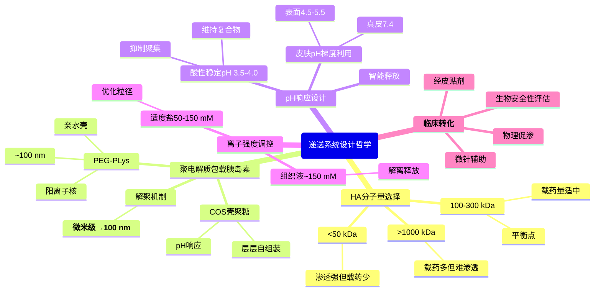

# 破解“聚集密码”：胰岛素-HA-聚电解质协同递送策略

> 都是ChatGPT调研的，我看了总体上是对的，具体细节还请自行调研确认正确性。

*本文为下篇，接续上篇对角质层微观水通道、透明质酸分子量依赖性渗透和蛋白质网络捕获机制的阐述，深入探讨胰岛素的聚集行为、三方分子互作网络，以及基于这些认知的递送系统设计策略。*

## 摘要

> 本文深入探讨了**胰岛素在不同pH条件下的聚集行为**（等电点pI 5.3附近最易聚集，酸性条件形成二聚体，中性条件形成六聚体）及其表面电荷分布特征，剖析了胰岛素-HA-聚电解质的**三方分子互作网络**（静电作用、多点结合、空间位阻）及其在纳米递送系统设计中的应用。研究表明，通过精密调控pH、离子强度、聚电解质类型和浓度，可将胰岛素-HA大聚集体（微米级）转化为稳定的纳米颗粒（约100 nm），并通过竞争性结合策略破坏HA与内源蛋白的互作，从而显著提高经皮渗透效率。HA-OP递送系统通过**竞争性结合和抗蛋白吸附效应**，将HA-蛋白复合物从~1000 nm缩小至~200 nm，协同聚电解质（COS、PEG-PLys）实现胰岛素解聚与纳米包载，为基于HA的胰岛素经皮递送系统的理性设计提供了系统的理论基础和优化策略。

### 核心结论

- 胰岛素的聚集状态高度依赖pH，在等电点附近（pH 5-6）最易形成大聚集体，强酸或中性条件下相对稳定
- ζ电位从酸性+33 mV翻转至中性-65 mV，决定与阴离子聚合物（如HA）的相互作用强度
- **聚电解质（如壳聚糖低聚物、PEG-聚赖氨酸）可通过静电作用将胰岛素微米级聚集体解聚为100 nm左右的纳米颗粒**
- 胰岛素与HA在强酸条件（pH<3）下可形成稳定复合物，中性条件下因静电排斥需要阳离子聚合物桥接
- **HA-OP递送系统**通过竞争性结合和抗蛋白吸附效应，将HA-蛋白复合物从~1000 nm缩小至~200 nm，突破角质层屏障
- pH响应型配方设计可利用皮肤pH梯度实现智能释放，协同物理促渗技术提高临床转化潜力

---

## 四、胰岛素的聚集密码：pH依赖的分子组装与表面电荷

### 4.1 pH-聚集曲线：从二聚体到六聚体再到沉淀

胰岛素的聚集行为与溶液pH密切相关，这源于其分子表面电荷分布随pH变化而显著改变。人胰岛素的**等电点（pI）约为pH 5.3**，在此pH附近净电荷接近零，分子间静电斥力最小，聚集倾向最强。

#### pH 2（强酸条件）：二聚体优势

在pH 2的强酸环境下，胰岛素所有酸性侧链（Glu、Asp）被质子化为中性，而碱性侧链（Lys、Arg、His）全部带正电。此时**胰岛素带有高净正电荷**，分子间强烈静电排斥，主要以**二聚体**形式存在，动态光散射（DLS）测得水合半径约**3.3 nm**，推算分子量约11 kDa，与二聚体（2×5.8 kDa）一致。

然而，极端酸性同时会导致胰岛素构象部分松动：分子动力学模拟显示，pH从3.0降至1.6时，胰岛素B链末端和螺旋区柔性降低、熵损失约150 J·mol⁻¹·K⁻¹，这种构象僵化有利于聚集核心形成。因此，**pH 2虽然维持小聚集体，但在加热、振荡等应激下极易快速形成淀粉样纤维**。

#### pH 5-7（接近pI到中性）：六聚体主导

当pH升至5-7范围，Glu/Asp侧链逐渐去质子化带负电，His侧链在pH 6-7附近部分失去质子，而Lys/Arg仍保持正电。净电荷接近零或略带负电，**静电斥力减弱，疏水作用和氢键主导聚集**。

在无$\ce{Zn^2+}$条件下，中性pH胰岛素主要以二聚体存在（单体浓度极低）。但加入**$\ce{Zn^2+}$后，三个二聚体通过其B链His10残基配位两个$\ce{Zn^2+}$离子，形成稳定的六聚体**（2$\ce{Zn^2+}$：3二聚体 = 6单体），DLS测得水合半径约**5.4 nm**，分子量约34 kDa。

**$\ce{Zn^2+}$诱导六聚体的浓度依赖性**：
- 0 mM $\ce{Zn^2+}$：主要单体-二聚体（5.8-11.6 kDa）
- 0.1 mM $\ce{Zn^2+}$：大部分转化为六聚体（~35 kDa），少量单体-二聚体
- 0.3 mM $\ce{Zn^2+}$：几乎完全为六聚体，出现少量十二聚体（~70 kDa）

生理意义：胰岛β细胞内胰岛素以$\ce{Zn^2+}$-六聚体结晶储存，分泌入血后在中性pH、低$\ce{Zn^2+}$环境下解离为二聚体和单体发挥生物活性。

#### pH 5.3（等电点）：最大聚集风险

在pH接近5.3时，胰岛素净电荷为零，分子间既无强静电吸引也无强排斥，**最容易发生无定形聚集或沉淀**。即使微小的pH波动（0.1-0.2 pH单位）也会导致聚集行为截然不同：
- **pH 4.1**：快速形成纳米级颗粒，富含β-聚集结构
- **pH 4.3**：形成微米级颗粒，保留较多天然结构

这强调了在制剂开发中**严格控制pH的重要性**。胰岛素制剂通常采用略偏酸的缓冲体系（pH 3.5-4.0），既避免pI附近的聚集，又维持六聚体稳定。

#### pH >9（碱性条件）：去稳定化

强碱条件虽可使胰岛素带高净负电、溶解性增加，但长期暴露会导致构象改变和化学降解（如脱酰胺），需谨慎避免。

### 4.2 表面电荷分布与ζ电位：分子的静电指纹

胰岛素的聚集行为不仅取决于净电荷，还取决于**表面电荷的空间分布**，即电荷补丁（charge patch）。

#### ζ电位的pH依赖性

ζ电位（zeta potential）反映了胶体颗粒表面的有效电荷，实验测得胰岛素的ζ电位随pH呈典型翻转：
- **酸性条件**（pH <4）：ζ ≈ +33 mV（带正电）
- **中性条件**（pH 7）：ζ ≈ -65 mV（带负电）
- **pI附近**（pH 5-6）：ζ ≈ 0 mV（电荷翻转）

这与胰岛素氨基酸序列的解离特性一致：
- **B链His5、His10**（pKa ~6-7）：接近中性时失去质子
- **Glu/Asp残基**（如B13-Glu、B21-Glu）：pH >4时电离带负电
- **Lys/Arg残基**（如B22-Arg、B29-Lys）：pH <10始终带正电

#### 电荷补丁与分子间相互作用

胰岛素表面电荷分布不均匀，形成局部富集正电或负电的区域：
- **正电补丁**：B22-Arg、B29-Lys附近区域
- **负电补丁**：B13-Glu、B21-Glu、A链酸性残基区域

在pH接近pI时，虽然净电荷为零，但正负电荷补丁并存，分子间可通过**互补电荷区域的静电吸引**（如一个分子的正电补丁对接另一个分子的负电补丁）形成聚集核心。分子建模的APBS电势计算显示，pH 5.3时胰岛素表面同时存在蓝色（正电）和红色（负电）斑块，为分子间拼图式结合提供了驱动力。

#### 六聚体稳定性的静电基础

六聚体稳定性很大程度依赖分子间电荷作用和氢键网络。$\ce{Zn^2+}$正离子中和了His B10区域的负电环境（$\ce{Zn^2+}$与三个二聚体的His配位），酚分子填充六聚体腔体形成氢键/疏水作用。去除$\ce{Zn^2+}$和酚后，六聚体因电相斥趋于解离。

### 4.3 聚集态调控的实际意义

理解胰岛素的pH-聚集关系对递送系统设计至关重要：

**制剂pH选择**：
- **酸性配方**（pH 3.5-4.0）：抑制等电点聚集，维持二聚体或小六聚体，保证制剂澄清和稳定性
- **中性配方+$\ce{Zn^2+}$**：形成稳定六聚体，实现缓释效果（如NPH胰岛素）
- **甘精胰岛素**：通过修饰提升pI至6.7，在生理pH下快速沉淀形成皮下缓释库

**与HA相互作用的pH窗口**：
- **强酸条件**（pH 2-3）：胰岛素带正电，HA带负电，**强烈静电吸引**，可形成复合物（见第五章）
- **中性条件**（pH 7）：胰岛素略带负电，HA强负电，**静电排斥**，不易直接结合

这一pH依赖性为设计pH响应型胰岛素-HA递送系统提供了理论基础。

---

## 五、三方博弈：胰岛素-HA-聚电解质的分子互作网络

### 5.1 胰岛素与透明质酸的直接相互作用

#### 强酸条件下的复合物形成

Jederström等（2004）在开发口服胰岛素配方时发现，**在强酸性溶液（pH 2-3，含适量电解质）中，未修饰的HA与胰岛素能够直接相互作用，形成稳定的HA-胰岛素复合物**。该体系表现为澄清水溶胶，含有疏水性固体沉淀。

**相互作用机制**：
1. **静电引力主导**：pH 2-3时胰岛素带高正电（ζ ≈ +33 mV），HA主链羧基完全去质子化带强负电，两者通过静电吸引结合
2. **疏水作用辅助**：胰岛素在强酸下构象部分松动，暴露疏水区域，这些疏水区与HA的疏水补丁发生相互作用
3. **氢键网络**：HA的羟基、N-乙酰基与胰岛素骨架形成氢键，进一步稳定复合物

通过动态光散射（DLS）、ζ电位分析、原子力显微镜（AFM）和冷冻电镜（cryo-TEM）等手段证实了复合物形成，并用于提高口服胰岛素的稳定性和生物活性。

#### 中性pH的静电排斥

在中性或生理pH下，**胰岛素略带负电（ζ ≈ -65 mV），HA强负电，两者静电排斥，不形成稳定复合物**。这解释了为何常规HA凝胶（通常pH 6-7）不能有效包裹胰岛素——两个负电聚合物相互排斥而非结合。

### 5.2 聚电解质介导的胰岛素聚集体解聚

胰岛素在储存或制剂过程中易形成大聚集体（微米级沉淀、淀粉样纤维、球形簇团），严重影响生物活性和稳定性。多种聚电解质（尤其阳离子聚合物）被发现能够**部分解聚这些大颗粒，将其重分散为纳米级复合颗粒**（约100 nm）。

#### 壳聚糖低聚物（COS）：纤维解聚剂

Kalitnik等（2024）首次证明，**壳聚糖低聚物（COS）可显著抑制牛胰岛素体外纤维化，并能破坏已形成的胰岛素淀粉样纤维**。实验显示，将预先形成的胰岛素纤维与COS按1:10质量比共孵育48小时（37 ℃），可观察到：
- ThT荧光和圆二色谱显示β-结构含量降低
- AFM成像显示长纤维减少，产生较短片段或颗粒（百纳米级）
- 纤维并未完全溶解为单体，而是形成较小的次级结构

**机制**：
1. **静电多点结合**：COS带正电氨基与纤维表面富集的酸性残基（Glu、Asp）相结合
2. **破坏氢键网络**：COS插入纤维结构，削弱纤维轴向的连续性，使之断裂
3. **电荷屏蔽**：中和纤维表面电荷，减少纤维间的侧向聚集

其他聚电解质（如聚烯丙胺PAH、硫酸化寡糖CROS）对胰岛素纤维几乎无抑制或解聚作用，说明**聚电解质的结构对解聚效果至关重要**：COS的直链型多糖骨架和游离氨基赋予其独特的解聚能力。

#### PEG-b-PLys嵌段共聚物：纳米颗粒稳定剂

Pippa等（2015）报道，**聚乙二醇-聚L-赖氨酸（PEG-b-PLys）嵌段共聚物与胰岛素形成稳定纳米复合颗粒**：
- **粒径调控**：随胰岛素浓度增加，复合物粒径从约60 nm减小至更致密结构
- **离子强度效应**：提高盐浓度后，粒径分布收窄变小（适量盐屏蔽过强多点相互作用，使复合物更紧凑）
- **PEG稳定作用**：PEG链提供空间位阻，防止颗粒间聚并，提高胶体稳定性

**机制**：
1. **阳离子PLys结合负电胰岛素**：静电吸附形成核
2. **PEG形成亲水壳**：立体稳定，防止二次聚集
3. **多价效应优化粒径**：PLys链长和投料比决定复合物大小

#### 三嵌段共聚物胶束：双重包裹

Skandalis等（2020）开发的阳离子三嵌段共聚物QPDMAEMA-b-PLMA-b-POEGMA（季铵化聚甲基丙烯酸酯-疏水链段-聚乙二醇链段）能够：
- **静电吸附+疏水包合**：阳离子段结合胰岛素，疏水段包裹胰岛素疏水区
- **形成稳定纳米颗粒**：DLS显示复合物半径40-100 nm，AFM确认分散良好
- **离子强度调控**：高盐时出现双峰分布（~15 nm小颗粒 + ~350 nm大聚集），说明盐可部分解离大复合物

#### 微米沉淀→100 nm颗粒：层层组装策略

Balabushevich等（2004）和Fan等（2006）通过**聚电解质层层自组装**（Layer-by-Layer, LbL）技术：
1. 先制备5-13 μm胰岛素盐析沉淀或100-230 nm纳米聚集体
2. 交替吸附阴阳离子聚合物（如硫酸右旋糖酐/鱼精蛋白，或聚α,β-丙氨酸/壳聚糖）
3. 经超声处理，大颗粒破碎但聚电解质层防止重新聚并，稳定为**100-200 nm纳米颗粒**

这些研究共同表明，**聚电解质能够通过静电吸附、多点结合和立体稳定作用，将胰岛素从微米级聚集体转化为百纳米级可控颗粒**，为胰岛素-HA复合递送系统提供了重要技术基础。

### 5.3 胰岛素-HA-聚电解质三元相互作用网络

在实际的经皮递送系统中，胰岛素、HA和可能的聚电解质添加剂（如壳聚糖、聚赖氨酸等）构成复杂的三元相互作用网络：

#### pH的核心调控作用

- **强酸配方**（pH 2-3）：
  - 胰岛素（+）+ HA（-） → 形成复合物
  - 加入COS/壳聚糖（+）→ 竞争结合HA，可能部分替代胰岛素或形成三元复合物

- **中性配方**（pH 7）：
  - 胰岛素（-）+ HA（-） → 静电排斥，不直接结合
  - 加入阳离子聚合物（如PEG-PLys）→ 分别结合胰岛素和HA，形成独立复合颗粒或桥接复合物

#### 离子强度的双刃剑效应

- **低离子强度**：静电相互作用最强，易形成大复合聚集（过度交联）
- **适度盐浓度**（~50-150 mM）：屏蔽部分静电作用，优化复合物粒径和稳定性
- **高离子强度**（>500 mM）：削弱所有静电作用，复合物可能解离

#### 分子量的协同效应

- **HA分子量**：高MW HA提供更多结合位点，形成大复合物；低MW HA形成小复合物或不明显结合
- **聚电解质链长**：长链聚电解质可交联多个胰岛素/HA分子，短链仅能结合少数分子

#### 竞争性结合与优先级

当体系同时存在胰岛素、HA和第三方聚电解质时，结合优先级取决于：
1. **电荷密度**：高电荷密度聚合物（如肝素、聚谷氨酸）优先结合胰岛素
2. **结合亲和力**：特异性结合蛋白（如CD44对HA）比非特异性静电结合更强
3. **浓度比例**：过量组分主导相互作用

#### 实际递送配方的优化方向

- **HA分子量选择**：选择100-300 kDa的中等分子量HA，平衡渗透能力与载药量
- **胰岛素纳米包载**：在适当pH下，利用聚电解质（如PEG-PLys、COS）将胰岛素包裹为100-200 nm纳米颗粒
- **pH响应释放**：利用皮肤pH梯度（表面pH 4.5-5.5 → 真皮pH 7.4），设计在酸性条件下稳定、中性条件下释放的配方
- **物理促渗协同**：结合微针、离子导入等物理方法提高递送效率

---

## 六、突破屏障：递送系统设计哲学

### 6.1 聚电解质辅助策略：从微米聚集到纳米颗粒

#### 胰岛素聚集的挑战

胰岛素在常规制剂中易形成：
- **六聚体沉淀**（μm级，$\ce{Zn^2+}$诱导）
- **淀粉样纤维**（长度μm，直径nm，但聚集成更大簇团）
- **无定形聚集**（等电点附近沉淀）

这些大聚集体无法穿透角质层，且生物活性下降。

#### 聚电解质包裹与尺寸控制

利用COS、PEG-PLys、QPDMAEMA等聚电解质，可将胰岛素聚集体**解聚并稳定为100-200 nm纳米颗粒**：

1. **COS解聚纤维**：物理打断纤维+电荷屏蔽，产生短片段
2. **PEG-PLys包裹**：PLys结合胰岛素形成核，PEG提供壳稳定
3. **层层组装**：多层聚电解质壳防止颗粒重新聚并

#### 与HA载体的协同作用

- **低/中MW HA**可作为亲水性载体
- **聚电解质将胰岛素聚集体降至~100-200 nm**
- **两者结合**：HA可负载聚电解质包裹的胰岛素纳米颗粒，形成复合递送系统
  - HA载体：提供一定的渗透能力和生物相容性
  - 聚电解质-胰岛素复合物（~100 nm）：保护胰岛素活性，防止聚集

### 6.2 pH响应与离子强度调控

#### 利用皮肤pH梯度

皮肤表面pH约4.5-5.5（酸膜），角质层内部约5.5-6.0，真皮pH约7.4。设计pH响应型配方可实现：

**强酸配方（pH 2-3）用于HA-胰岛素复合**：
- 在此pH下，胰岛素（+）与HA（-）形成稳定复合物
- 涂抹于皮肤后，接触皮肤酸膜（pH 4.5-5.5），复合物开始部分解离
- 进入真皮（pH 7.4）后，静电排斥完全生效，胰岛素释放

**弱酸配方（pH 4-5）结合HA载体**：
- HA与聚电解质-胰岛素复合物在此pH下较稳定
- 渗透至真皮后，pH升高可能触发复合物解离，释放胰岛素

#### 离子强度的精细调控

- **配方中适度盐浓度**（50-150 mM）：优化聚电解质-胰岛素复合物的粒径和稳定性
- **皮肤组织液高盐环境**（~150 mM）：进入真皮后，盐浓度屏蔽静电作用，促进复合物解离释放

### 6.3 生物安全性与临床转化考量

#### 生物相容性

- **HA**：人体天然成分，极佳生物相容性，无免疫原性
- **壳聚糖/COS**：天然多糖，可生物降解，广泛用于药物递送
- **PEG-PLys**：PEG为FDA批准材料，PLys为天然氨基酸聚合物，低毒性

#### 皮肤刺激性

- 阳离子聚电解质可能对皮肤有轻微刺激，需控制浓度和pH
- 强酸配方（pH 2-3）需评估对角质层屏障的影响（短期接触一般安全，但长期使用需监测）

#### 胰岛素稳定性与活性保持

- 聚电解质包裹可保护胰岛素免受酶降解和聚集失活
- 需确认释放后胰岛素的二级结构和受体结合活性完整

#### 临床给药途径

- **经皮贴剂**：HA/聚电解质-胰岛素复合凝胶，持续释放
- **微针辅助**：微针预处理增加皮肤通透性，再涂抹纳米递送系统
- **离子导入/超声导入**：物理手段协同化学促渗策略

---

## 七、关键结论与展望

### 核心发现

本文系统梳理了透明质酸和胰岛素经皮递送面临的多层次障碍，并提出了突破性的解决策略：

**角质层多尺度屏障**：
1. **物理屏障**：脂质双层致密排列，仅留有纳米级lacunae裂隙（0.27-0.8 nm）和膜内水通道
2. **尺寸屏障**：HA渗透呈显著分子量依赖性，<50 kDa可达深层表皮，>1000 kDa仅停留在角质层表面25 μm
3. **生化屏障**：CD44、TSG-6、Versican等HA结合蛋白形成捕获网络，将HA固定为~1000 nm大型复合物
4. **功能性蛋白景观**：角质层细胞间脂质基质富含脂质代谢酶、蛋白酶、抗菌肽及共价脂质包膜（CLE），共同维持屏障稳态

**胰岛素聚集的pH调控**：
- pH 2时以二聚体（3.3 nm）存在，pH 7+$\ce{Zn^2+}$时形成六聚体（5.4 nm）
- 等电点（pI 5.3）附近聚集风险最大，易形成淀粉样纤维
- ζ电位从酸性+33 mV翻转至中性-65 mV，决定与阴离子聚合物的相互作用强度

**HA-胰岛素递送的策略**：
- **聚电解质包载**：通过COS、PEG-PLys等聚电解质将胰岛素聚集体解聚并稳定为100-200 nm纳米颗粒
- **HA分子量选择**：100-300 kDa的中等MW HA可能是渗透能力与载药量的平衡点
- **pH响应释放**：利用皮肤pH梯度（表面pH 4.5-5.5 → 真皮pH 7.4）实现智能释放
- **物理促渗协同**：微针、离子导入等辅助技术

### 潜在影响

**对经皮给药领域的范式转变**：
- 从单纯关注载体尺寸转向**载体-皮肤蛋白相互作用调控**
- 从被动扩散转向**主动规避生化屏障**的设计理念
- 从单一载体转向**多组分协同**的递送系统

**对糖尿病治疗的潜在贡献**：
- 若HA/聚电解质-胰岛素经皮递送系统在临床成功，将为全球糖尿病患者提供无针给药选择
- 提高患者依从性，减少注射相关并发症（脂肪萎缩、皮下硬结）
- 通过pH响应释放可能实现智能给药

**对纳米医学的启示**：
- 设计智能纳米载体需深刻理解靶标组织的生物化学微环境（蛋白组、pH梯度、酶活性）
- 竞争性结合策略可推广至其他生理屏障（血脑屏障、肿瘤基质）的突破
- 聚电解质作为多功能平台材料，在解聚蛋白聚集、稳定纳米颗粒、控制释放等方面展现巨大潜力

### 局限性与挑战

**实验证据的不完整性**：
- **透皮递送的定量数据缺乏**：多数研究停留在粒径表征和体外渗透深度，**实际透皮的胰岛素绝对量、生物利用度、血糖控制效果**等关键药效学指标报道较少
- **长期安全性数据空白**：阳离子聚电解质长期接触皮肤（每日贴敷数月-数年）的刺激性、致敏性、系统毒性尚未评估
- **HA-蛋白相互作用机制**：CD44、TSG-6等蛋白捕获HA的详细分子机制需要通过高分辨结构生物学（cryo-EM、分子动力学）进一步阐明

**临床转化的挑战**：
- **皮肤个体差异**：不同年龄、种族、疾病状态的皮肤差异巨大，单一配方难以适用所有人群
- **生产工艺复杂性**：层层组装、pH精确控制、纳米颗粒批间一致性对工业化生产提出极高要求，成本可能显著高于传统注射剂
- **与现有技术的竞争**：胰岛素笔、胰岛素泵、超速效胰岛素类似物等技术不断进步，经皮系统需证明显著的临床/经济优势
- **法规审批路径**：复合纳米制剂的药学表征、质量控制要求严格，需明确聚电解质等辅料的药用标准

**理论框架的普适性**：
- 以HA和胰岛素为例是否具有代表性？其他大分子药物（单抗、疫苗、siRNA）的皮肤渗透机制可能完全不同
- 聚电解质解聚策略的适用边界？并非所有蛋白聚集都对聚电解质敏感（如Aβ极稳定纤维），需明确适用范围

### 未来方向

**多学科交叉研究**：
- **皮肤生物物理学**：深入研究角质层水通道动态、脂质相变、CLE的结构-功能关系
- **超分子化学**：设计智能响应型HA衍生物，实现pH、酶、温度等多重触发释放
- **纳米医学**：开发精密表征技术（cryo-EM、SAXS、AFM），解析HA-蛋白-聚电解质复合物的三维结构
- **临床转化**：开展人体微透析、皮肤药代动力学研究，评估HA-OP系统的实际递送效率

**技术优化路径**：
1. **基础研究**：阐明角质层蛋白质组、脂质组与外源分子的相互作用规律
2. **材料创新**：开发竞争性结合、pH/酶响应、双通路兼容的多功能载体
3. **工艺优化**：建立可规模化的纳米颗粒制备和质控体系
4. **临床验证**：通过I-III期临床试验证明安全性和有效性

**配方优化策略**：
- **HA分子量权衡**：选择100-300 kDa HA，兼顾渗透能力与载药量
- **聚电解质优化**：选择合适的聚电解质（PEG-PLys、COS等）和包载层数，平衡粒径与稳定性
- **pH和离子强度调控**：优化配方pH和盐浓度，控制复合物粒径和稳定性
- **辅助技术结合**：微针预处理、离子导入等物理促渗方法

### 结语

经皮递送大分子药物是纳米医学领域的珠穆朗玛峰——挑战巨大但回报丰厚。本文通过系统解析角质层的多尺度屏障（物理、尺寸、生化）和胰岛素的复杂聚集行为，探讨了基于聚电解质包载和pH响应释放的协同递送策略。

然而，从概念验证到临床应用仍有漫长的道路**。科学的严谨性要求我们不仅关注成功的案例，更要正视局限、质疑假设、完善机制**。只有通过跨学科协作（皮肤生物学、药物化学、纳米材料、临床医学）、多尺度研究（分子-细胞-组织-整体）、理性设计与系统评估相结合，才能最终实现经皮大分子递送的临床转化，为全球数百万糖尿病患者带来无针、无痛、高依从性的胰岛素给药新选择。

---

## Q&A

**Q1：在中性pH条件下，胰岛素和HA都带负电，如何实现两者的有效结合用于递送**？

**A1**：直接结合确实困难，主要策略包括：

**聚电解质桥接**：
- 使用阳离子聚合物（如PEG-PLys、壳聚糖）作为桥梁分子
- 阳离子链段同时结合负电的胰岛素和HA，形成**三元复合物**
- 例如：HA（-）...PLys（+）...胰岛素（-），PLys作为静电胶水

**分步包裹法**：
1. 先用阳离子聚合物包裹胰岛素，形成阳离子表面的纳米颗粒
2. 再将此颗粒与HA混合，HA吸附在阳离子颗粒表面
3. 最终形成核-壳结构：胰岛素（核心）- 阳离子聚合物（内壳，+）- HA（外壳，-）

**pH梯度利用**：
- 在强酸配方（pH 2-3）下，胰岛素带正电，可与HA直接静电吸引形成复合物
- 在弱酸配方（pH 4-5）下，胰岛素净电荷接近零，可与HA部分结合
- 进入真皮（pH 7.4）后，静电排斥增强，复合物解离释放胰岛素

**Q2：壳聚糖低聚物（COS）为何能解聚胰岛素淀粉样纤维，而其他聚阳离子（如聚烯丙胺PAH）无效**？

**A2**：COS的独特性在于其**结构与功能的精确匹配**：

- **直链型多糖骨架**：
- COS为线性β-1,4-糖苷键连接的葡萄糖胺单元，形成半刚性直链
- 这种线性结构可**沿着纤维轴向结合**，类似拉链机制，逐步破坏纤维的连续氢键网络
- PAH等支化或高度柔性聚合物难以以这种取向结合纤维
- **游离氨基的多点静电作用**：
- COS每个单元的C2位氨基（pKa ~6.5）在生理pH下大部分质子化带正电
- 这些正电氨基与纤维表面富集的酸性残基（Glu、Asp的羧基）形成**多点静电锚定**
- PAH虽也带正电，但其烷基链缺乏与蛋白质骨架的特异性识别
- **适度的链长与电荷密度**：
- COS低聚物（通常2-20个单元）既足够长以结合多个纤维单位，又足够短以保持溶解性和渗透性
- 过长的壳聚糖（高MW）可能因过度交联反而稳定纤维或形成新的聚集
- 过短的寡糖（单体、二聚体）结合力不足
- **对比其他聚电解质**：
- **PAH**：支化结构+疏水烷基主链，可能非特异性吸附但不能撬开纤维
- **硫酸化寡糖**（CROS）：虽为多糖，但带负电，与胰岛素纤维（表面也带负电或中性）静电排斥或弱结合

因此，**COS的成功源于其结构-功能协同**：线性骨架提供空间匹配，游离氨基提供静电驱动，适度链长优化结合-解离平衡。这启示我们，**聚电解质的拓扑结构和官能团分布与目标蛋白聚集体的几何/化学特征必须精确匹配，才能实现高效解聚**。

---

正如本文标题所示，角质层的"蛋白守门员"看似固若金汤，但通过深入理解其"密码"并设计精妙的"钥匙"（如聚电解质包载、pH响应释放等策略），我们终将打开经皮给药的大门。未来属于那些既有深厚理论基础、又有创新工程思维的研究者——让我们共同期待这一领域的突破时刻。
