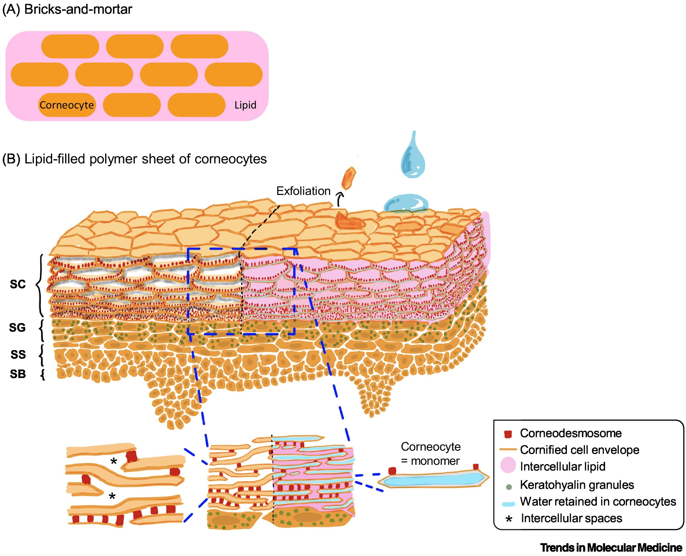
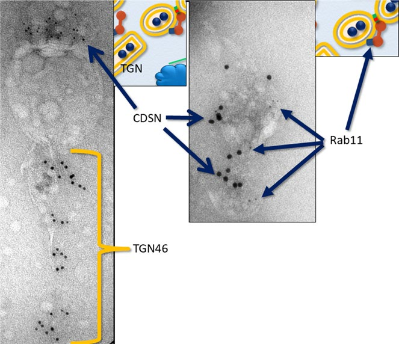
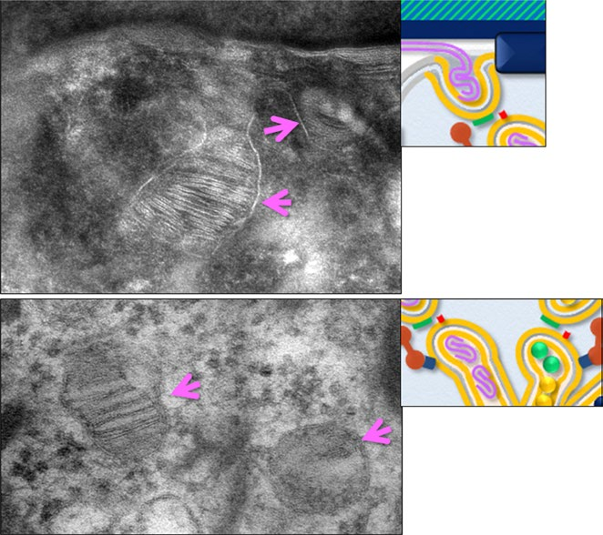
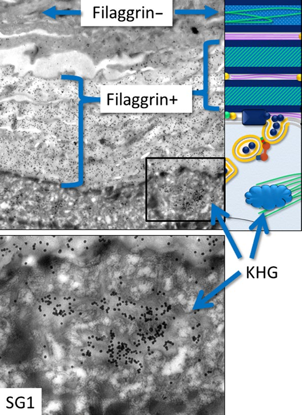

# 【番外篇】角质层结构深度解析：从纳米脂质到宏观屏障的多尺度组织

## 摘要

> 皮肤屏障的结构组织跨越从纳米级脂质双层到宏观柱状细胞排列的多个尺度。本文系统阐述了角质层的细胞间隙尺度（15-20 nm vs 40-75 nm）、水合状态的双面效应、垂直互锁柱状结构，以及外源透明质酸对角质层和活细胞层水合的影响。研究揭示：**活细胞层的水合是整个皮肤水合系统的源头**，AQP3水通道蛋白在基底层和棘层高表达维持60-70%的高水合状态。虽然外源HA能显著提高角质层水合度（即时+134%，6周+55%），但**水合本身不等于渗透**——角质层的脂质疏水排斥和柱状互锁结构、颗粒层的脂质屏障共同构成多层次阻碍。拉曼光谱证据显示，只有极低分子量HA（<50 kDa）才可能到达表皮深层。**颠覆性发现**：HA实际上**增强**而非打开紧密连接，但HA可通过**CD44受体介导的跨细胞途径**进入角质形成细胞触发信号通路，HA修饰的纳米载体系统（2024-2025）为高效经皮递送提供了新方向。

### 核心结论

1. **多尺度结构层次**：皮肤屏障跨越纳米（脂质双层6-13 nm周期）、细胞间隙（40-75 nm）、到宏观（15-26层柱状堆叠）多个尺度，形成**化学和几何双重屏障**
2. **水合的双面效应**：适度水合（15-40%）维持屏障功能，过度水合（>60%）导致脂质分层、TEWL增加、微生物定植风险
3. **活细胞层水合是系统源头**：AQP3水通道蛋白在基底层和棘层高表达，维持60-70%的高水合状态，是角质层水分的**来源**。AQP3缺失导致角质层水合降低，证明活细胞层水合对整个表皮屏障至关重要
4. **外源HA对角质层的有限作用**：虽能显著提高表层水合（+134%），但**水合本身不等于渗透**，脂质疏水排斥和柱状互锁结构仍是根本障碍
5. **分子量的权衡**：HMW-HA安全但仅表面作用，LMW-HA可渗透但破坏屏障（TEWL+55.5%），理想策略需平衡效果与安全性
6. **HA增强而非打开紧密连接**：颠覆性发现——LMW-HA和HMW-HA都上调claudin-3/4和JAM-1，**增强**屏障而非促进渗透，单纯依靠HA本身无法通过“松弛紧密连接”实现深层递送
7. **CD44介导的跨细胞途径**：HA通过CD44受体介导的内吞作用进入角质形成细胞，触发细胞内信号通路（Filaggrin +35%，AQP3 +16%），这是**跨细胞**而非旁细胞途径
8. **HA寡糖的尺寸依赖性生物活性**：100-300 kDa片段促进角质形成细胞增殖，四糖-六糖大小诱导炎症信号，二糖阻断炎症，必须精确控制分子量分布
9. **纳米载体系统的突破**（2024-2025）：HA修饰的脂质体通过CD44靶向增强角质形成细胞摄取，实现高效经皮递送，临床转化前景广阔
10. **HA衍生物的独特渗透增强机制**：阳离子HA通过静电吸附脂质头基增强渗透（水合度+67%），阳离子聚合物（如壳聚糖）通过整合素-细胞骨架途径可逆性打开紧密连接（TEER降低83%），$\ce{Mg^2+}$通过构象收缩和脂质桥接双重机制增强HMW-HA角质层累积，两亲性HA通过疏水锚嵌入脂质双层实现深度相互作用。这些衍生物提供了超越天然HA的强化渗透策略

## 背景

透明质酸（HA）作为强效保湿成分广泛用于护肤品，其保湿机制长期被认为是“吸水锁水”。然而，**HA能否真正渗透角质层进入活细胞层**？**外源HA如何影响角质层的水合状态**？这些问题直接关系到HA作为经皮递送载体的可行性。

要理解这些问题，必须首先深入了解角质层的多尺度结构组织：从纳米级的脂质双层排列（6-13 nm周期）、细胞间隙尺度（40-75 nm）、到宏观的柱状细胞堆叠（15-26层）。这些结构如何响应水合状态变化？外源HA如何与这些结构相互作用？本文基于最新文献，系统解析这些关键问题。

## 角质层的多尺度结构组织

### 细胞间隙尺度的突变

表皮不同层级的细胞间隙尺度差异显著，这是理解HA渗透屏障的关键。

#### 活细胞层（基底层/棘层/颗粒层）

- 细胞间隙：**15-20 nm**
- 填充物：亲水的HA-蛋白质复合物
- 环境：水性、负电荷

#### 角质层细胞间脂质基质

- 细胞间隙：**40-75 nm**（脂质层40-50 nm，含角质胞桥可达75-100 nm）
- 组成：**3-8层脂质双层**（典型10层）堆叠
- 环境：**极度疏水、电中性**
- 脂质双层周期性：
  - 短周期相（SPP）：**6.0-6.5 nm**（正交烃链）
  - 长周期相（LPP）：**13.0-13.9 nm**（六方烃链）

### 角质层组织尺度参数

- **细胞层数**：一般部位15-26层，手掌/足底可达**100层**
- **单细胞尺寸**：直径30-50 μm，厚度**0.5-1.0 μm**（高度扁平化）
- **总厚度**：脸颊16.8 μm，手掌**173 μm**（vs. 一般10-40 μm）

### 垂直互锁的柱状结构

角质细胞形成高度有序的**垂直互锁柱状结构**（vertical interlocking columns）：

- **柱状组织**：10-30个扁平角质细胞垂直堆叠成“柱”，整个角质层由数百个柱并排组成
- **互锁机制**：相邻柱通过**角质胞桥**（corneodesmosome）交联，细胞形状为**扁平十四面体**（Kelvin's tetrakaidecahedron），最紧密堆积
- **选择性降解**：角质层下层，角质胞桥分布在整个细胞表面；中上层仅保留在**细胞边缘**，形成**海绵状或气泡膜状结构**
- **脂质填充**：脂质基质连续填充柱内（垂直）和柱间（横向），形成**无缝三维网络**，这解释了垂直和横向间隙厚度相似（40-75 nm）
- **曲折路径**：物质渗透必须通过三维曲折路径（tortuous pathway），HA等亲水大分子无法找到“捷径”

**关键发现**：文献中**未明确区分垂直vs横向细胞间隙**，40-75 nm指相邻细胞间脂质基质厚度，方向无差异。各向异性主要体现在**扩散动力学**而非物理间隙大小。

### 板层颗粒与脂质分泌的分子机制

**板层颗粒**（lamellar granules, LGs）是颗粒层细胞中的膜包被细胞器，它分泌的内容物填充了角质层**细胞间隙**——包括构建脂质双层的脂质、修饰角质桥小体的蛋白（如corneodesmosin）、调控降解的蛋白酶系统以及抗菌肽。

#### 板层颗粒的超微结构

板层颗粒是角质形成细胞中的膜包被细胞器，具有独特的结构特征：
- **尺寸**：直径约**100-300 nm**
- **起源**：从**反式高尔基网络**（trans-Golgi network, TGN）起源，属于溶酶体相关细胞器家族
- **内部结构**：特征性的层状内含物（lamellar contents），但也可观察到非层状区域，反映了LG内容物的异质性
- **分布**：初步形成于浅层棘层，在颗粒层累积

**图：板层颗粒与trans-Golgi network的关联及Rab11介导的膜转运**（左图显示corneodesmosin阳性的LG与TGN46阳性的TGN紧密关联；右图显示Rab11标记沿CDSN阳性LG分布）

#### 板层颗粒的货物分类

LGs不仅转运脂质，还运载多种功能性货物，这些货物在LG内形成**分离的聚集体**：
- **脂质和脂质处理酶**：构建细胞间脂质层状结构
- **结构蛋白**：如corneodesmosin，释放后特异性结合到桥粒上
- **蛋白酶和蛋白酶抑制剂**：如kallikrein相关肽酶（KLKs）和LEKTI，调控角质桥小体降解
- **抗菌肽**：提供皮肤的微生物屏障功能

**关键机制**：不同货物形成离散聚集体的精密组织确保了它们在正确的时间、正确的位置发挥功能。例如，KLK8和corneodesmosin在同一LG内形成不同的聚集体，分泌后corneodesmosin专一地结合到桥粒。

#### 板层颗粒的膜转运分子机制

LGs从反式高尔基网络（TGN）到细胞顶端质膜的转运涉及多个关键蛋白：**CHEVI复合物**（VPS33B + VIPAR）调控囊泡对接，**Rab11a**介导膜转运，**SNAP29**介导囊泡-质膜融合，**ABCA12**转运脂质到LG腔内。这些蛋白的突变导致不同类型的鱼鳞病，凸显了LG转运对皮肤屏障形成的关键作用。

### 角质桥小体的分子组装与降解

角质桥小体（corneodesmosomes）是角质层细胞间粘附的主要结构，其形成和降解的精密调控对皮肤屏障功能和正常脱屑至关重要。

#### 从桥粒到角质桥小体的转变

桥粒是从基底层到颗粒层的主要细胞间粘附结构。在颗粒层，corneodesmosin从LGs释放并结合到桥粒的细胞外部分。当桥粒斑块蛋白交联形成角质细胞包膜时，桥粒转变为角质桥小体。

**图：细胞间脂质层状结构、角质桥小体和桥粒的透射电镜图**（上图A显示角质桥小体的细胞外部分充满高电子密度斑块，细胞内桥粒斑块与角质细胞包膜连续；下图B显示桥粒细胞外部分的三层结构）

#### 角质桥小体的位置选择性降解

角质桥小体在角质层下层遍布整个细胞表面，但在上层大部分被KLKs和其他蛋白酶水解。**只有位于扁平细胞边缘的角质桥小体保持未消化状态**，这导致组织学切片中看到的特征性“篮筐编织”结构。

##### 位置选择性降解的机制
- **KLKs的作用**：kallikrein相关肽酶是角质桥小体降解的主要蛋白酶，储存在LGs中，在颗粒层顶端分泌。分泌后，KLKs经过蛋白水解成熟，靶向降解corneodesmosin、desmoglein 1和desmocollin 1
- **LEKTI的调控**：作为主要的内源性KLK抑制剂，LEKTI也储存在LGs中。分泌后被蛋白水解成多个抑制性片段，结合KLKs并抑制其蛋白水解活性
- **紧密连接的保护作用**：紧密连接衍生的屏蔽结构可能保护细胞边缘的角质桥小体免受蛋白水解降解

**疾病关联**：桥粒和角质桥小体异常的遗传性疾病与屏障缺陷和特应性疾病相关。例如，Netherton综合征（LEKTI突变）、炎症性脱皮性皮肤病（corneodesmosin突变）等。

### 紧密连接的几何模型与功能延伸

紧密连接（tight junctions, TJs）在表皮中的功能超出了传统的屏障作用，其独特的几何排列和功能延伸为理解皮肤屏障的完整性提供了新视角。

#### f-TKD几何模型

Yokouchi等提出，带有紧密连接的颗粒层细胞的基本形状是**扁平的Kelvin十四面体**（flattened Kelvin's tetrakaidecahedron, f-TKD）。这一模型假设TJs规则地形成于f-TKD细胞的边缘，可以解释：
- TJ屏障如何在细胞更新的情况下保持结构完整性
- 如何形成规则的角质细胞堆叠

#### 紧密连接在角质层的功能延伸

虽然传统观点认为TJs在颗粒层第二层（SG2）形成并在第一层（SG1）消失，但使用透射电镜和冷冻断裂电镜技术，在SG1观察到了TJ蛋白阳性的连接结构，在角质层中也检测到了**TJ相关结构**。

这导致了新的认识：**TJs的功能意义不止于SG2**。TJ衍生的屏蔽结构可能围绕细胞边缘的角质桥小体，确保位置特异性的角质桥小体降解，从而维持角质层的“篮筐编织”结构和屏障完整性。

### 角质细胞包膜与角蛋白-丝聚蛋白网络

角质细胞的机械强度和屏障功能依赖于两个关键结构：外周的角质细胞包膜和内部的角蛋白-丝聚蛋白网络。

#### 角质细胞包膜的交联形成

在颗粒层和角质层交界处，细胞外周的各种蛋白通过**谷氨酰胺转移酶1**（transglutaminase 1, TGase 1）催化的转谷氨酰胺化作用共价交联，形成角质细胞包膜（cornified cell envelope, CE）。

##### 主要成分
- **Loricrin和involucrin**：CE的主要组成蛋白
- **桥粒蛋白**：当桥粒转变为角质桥小体时，桥粒蛋白被整合到CE中
- **角质化脂质包膜**：CE进一步与细胞外形成的角质化脂质包膜交联

**疾病意义**：TGase 1基因的功能缺失突变导致皮肤屏障功能严重受损、CE缺失或变薄，以及细胞内可见未交联的loricrin颗粒。

#### 丝聚蛋白-角蛋白相互作用

丝聚蛋白（filaggrin）在角质层的结构组织中扮演关键角色：

**图：Filaggrin免疫标记显示其在角质层的分布**（下层角质细胞Filaggrin阳性，上层阴性；颗粒层中Filaggrin定位于角蛋白透明颗粒KHG）

##### 丝聚蛋白的转化过程
1. **合成与储存**：前体形式profilaggrin在颗粒层合成，储存在角蛋白透明颗粒（keratohyalin granules, KHG）中
2. **水解与释放**：当颗粒细胞分化为角质细胞时，profilaggrin被蛋白水解成许多filaggrin单体。同时，细胞核和细胞器消失，但角蛋白丝保留
3. **聚集功能**：Filaggrin分子聚集角蛋白丝，形成角蛋白丝紧密嵌入基质的模式
4. **进一步降解**：在更表层的角质层，filaggrin分子进一步蛋白水解并降解为氨基酸和其他小分子（即NMF的来源）

**屏障功能**：Filaggrin缺乏导致寻常型鱼鳞病，是特应性皮炎的主要危险因素。在filaggrin基因敲除小鼠中，角蛋白模式丧失，角质细胞易于脱落，外来物质更易渗透。

### 水合状态对角质层结构的影响

#### 正常水分梯度与调控

健康皮肤存在明显的**跨层水分梯度**，这种梯度由天然保湿因子（NMF）和脂质层状排列共同维持：

| 皮肤层次 | 水分含量 | 备注 |
|---------|---------|------|
| 真皮 | 70-90% | 来自皮下组织和毛细血管 |
| 基底层和棘层 | 60-70% | 真正的活细胞层 |
| 颗粒层 | 约70% | 过渡层，正在角化 |
| 角质层下层 | 40-50% | 水分开始陡降 |
| 角质层中上层 | 30-40% | 继续脱水 |
| 角质层表面 | 15-25% | 40-60% RH环境条件下 |

NMF具有精密的环境响应性调控机制。**低湿度**时丝聚蛋白降解加速，NMF生成增加以补偿水分蒸发；**高湿度**时丝聚蛋白降解减慢，NMF生成减少以避免过度水合。这种调控依赖于狭窄的**水活度窗口**（0.6-0.8），丝聚蛋白向NMF转化只在此范围内高效进行。

#### 角质细胞的水合膨胀与病理性改变

角质细胞对水合的响应呈现明显的剂量依赖性。

- **正常膨胀**范围内，冷冻扫描电镜直接测得的单个角质细胞（corneocyte）在低水合（18-26% wt/wt）时厚度约**300-360 nm**，高水合（57-87% wt/wt）时增至**600-750 nm**（约膨胀**100**%），主要是细胞本体沿法向吸水膨胀，而**细胞间脂质层仍保持致密堆叠**。临界阈值在**85**% RH，此时脂质链发生正交→六方转变，流动性显著增加。
- **极端浸水**（>300% wt/wt，长时间浸泡）才会**在细胞间脂质中**形成直径数百纳米至数微米的“水池”，伴随脂质层状结构分层脱离、卷曲塌陷和相分离，标志着水真正闯入脂质网络并破坏屏障。
- **病理性水合**发生于长时间高湿度暴露（4-24小时后显著）。细胞间隙出现直径数百纳米至数微米的水聚集区（水池），尺寸可超过膨胀细胞厚度（>600 nm）。脂质层发生分层脱离（delamination）、卷曲塌陷（roll-up）和相分离等破坏性改变。

#### 水合的双面效应

- **适度水合**（15-40%）是维持屏障功能的必要条件：维持柔韧性防止干裂，促进KLK5/7活性确保正常脱屑，保持脂质流动性利于损伤修复。
- **过度水合**（>60%）则带来多重危害：脂质分层脱离导致屏障完整性受损，水池形成为微生物定植提供场所，TEWL增加形成恶性循环。虽然过度水合为亲水物质提供异常渗透窗口，但这伴随着屏障损伤，属于病理性状态。

---

## 外源透明质酸对角质层和活细胞层水合的影响

### 角质层水合：核心问题

**外源HA能否提高角质层水合程度？答案是肯定的，但效果高度依赖分子量、配方和使用条件。**

#### HA作为吸湿剂的机制与限制

HA是**强效吸湿剂**（humectant），能结合**1000倍自身重量的水分**：
- **从环境吸水**：高湿度（>60% RH）下从空气吸水
- **从皮肤深层吸水**：膨胀产生“充盈效应”
- **双向吸水风险**：低湿度下可能从深层吸水至表面，导致**深层脱水**

**关键限制**：HA本身**不具封闭性**，必须配合封闭剂（神经酰胺、角鲨烷等）锁住水分。

> **封闭性与封闭剂**：封闭性（occlusive property）指成分在皮肤表面形成疏水性薄膜、阻止水分蒸发的能力。封闭剂（occlusive agents）如**神经酰胺、角鲨烷、凡士林**等，通过形成物理屏障减少TEWL。HA作为吸湿剂能吸水但不能锁水，若无封闭剂保护，吸收的水分会快速蒸发，低湿度环境下甚至可能导致深层脱水。护肤配方通常采用“吸湿剂（HA）+封闭剂”的搭配策略。

#### 分子量的差异影响

分子量决定了HA的渗透能力和安全性权衡。**高分子量HA**停留表面形成薄膜，降低TEWL **15.6**%，安全但不渗透。**低分子量HA**可穿透角质层，但TEWL增加**55.5**%，破坏屏障，超低分子量还可诱导炎症。**中等分子量HA**平衡表面封闭和适度渗透，是较为理想的选择。

#### 临床证据

外源HA对角质层水合的效果已有充分临床数据支持。**即时应用**可使水合度增加**134**%（p < 0.001），**持续6周**使用水合度增加**55**%（p < 0.001），显示出即时和长期双重效应。

增强配方在标准HA基础上进一步提升效果。**阳离子HA**30秒应用后，水合度比LMW-HA高**67**%，比HMW-HA高**50**%，其正电荷与负电脂质头基的静电吸引是关键。**交联RHA**（resilient HA）使表皮水分增加7.6%，TEWL降低**27.8**%，结构稳定性更佳。**MgCl₂增强配方**显著增加HMW-HA在角质层的累积，利用金属离子改变HA构象促进渗透。

> **HA衍生物的化学修饰详解**：
> - **阳离子HA（Cationic HA）**：使用季铵盐试剂（如GTMAC，甘油三甲基氯化铵）修饰HA的羧基或羟基，引入正电荷。修饰后的HA从带负电（羧基，$\ce{-COO^-}$）转变为同时携带正电荷（季铵基团，$\ce{-N+{(CH_3)_3}}$）的两性离子聚合物，与带负电的皮肤脂质头基（磷酸基团）产生静电吸引，增强皮肤粘附和渗透
> - **交联RHA（Resilient HA）**：使用BDDE（1,4-丁二醇二缩水甘油醚）作为交联剂，在HA链间形成共价键。与传统交联HA（修饰度6-10%）相比，RHA的修饰度降低至2-4%，形成更少刚性交联的长链网络，保持HA链的动态滑动能力。这种“弹性”结构使RHA在皮肤上形成更稳定的水合薄膜，减少TEWL
> - **MgCl₂增强配方**：二价金属阳离子（$\ce{Mg^2+}$）通过静电桥接作用结合HA链上的羧基（$\ce{-COO^-}$），改变HA的分子构象。$\ce{Mg^2+}$诱导HA链从扩展构象收缩为紧凑构象，减小流体力学半径，使高分子量HA更易渗透角质层间隙。此外，$\ce{Mg^2+}$还能与皮肤脂质双层的负电荷磷脂头基桥接，促进HA在脂质界面的累积

生物标志物变化揭示了HA的间接调控机制：Filaggrin表达增加35%促进NMF生成，Aquaporin-3表达增加16%增强水分转运能力。

#### 对HA递送策略的启示

外源HA虽能显著提高角质层表层水合，但存在三大根本性局限：

- **水合的空间局限性明显**：外源HA提高的主要是角质层上层1-3层细胞的水合，通过从环境吸水和膨胀实现。这种水合未改变脂质层的疏水性质，脂质双层的SPP（6 nm）和LPP（13 nm）周期性依然完整
- **水合增加需要代价**：当水合增加到能够形成“异常渗透窗口”时，往往伴随脂质分层破坏（TEWL增加55.5%）。这是病理性状态而非生理性渗透，LMW-HA虽能穿透角质层，但其渗透过程破坏了脂质层的有序排列，导致分层脱离和相分离
- **化学不相容性是根本障碍**：即使细胞间隙从15-20 nm（活细胞层）扩大到40-75 nm（角质层），渗透困难仍未解除。关键在于填充物性质：活细胞层间隙填充亲水的HA-蛋白复合物（水性负电环境），而角质层间隙填充极度疏水的脂质双层（疏水电中性环境）。HA的带负电亲水性被脂质层完全排斥，化学不相容性远比物理间隙重要

基于这些认知，**有效的递送策略**必须采用多管齐下的联合方案：

- **化学修饰**：阳离子化增强静电吸引，疏水修饰改善脂质层亲和性
- **物理方法**：微针、超声、海绵针等瞬时微通道技术
  - **海绵针（Sponge spicules）辅助递送**：Haliclona海绵的硅质骨针可在角质层中形成微通道。研究显示，海绵针联合HA-脂质体可使**250 kDa的HMW-HA**透皮量显著增加，突破了传统方法只能递送LMW-HA的限制
  - **微针与HA的协同**：微针预处理形成微米级通道，随后应用HA配方可增强渗透，同时HA的保湿和修复功能加速微通道愈合
- **载体系统**：脂质体、纳米粒等包载策略，利用载体保护和膜融合机制

### 活细胞层水合：颗粒层脂质屏障的阻隔

虽然外源HA能够穿透角质层，但要进一步到达**棘层和基底层（典型的活细胞层）**，仍面临**颗粒层的脂质屏障**。颗粒层是角质层与活细胞层之间的过渡层，正在经历角化过程。

颗粒层扮演着关键屏障角色：

- **脂质合成中心**：颗粒层细胞合成并分泌板层小体，释放脂质到细胞间隙形成角质层的脂质双层
- **水性扩散的终点**：颗粒层合成的脂质阻止水性物质通过表皮扩散，这是皮肤屏障的核心机制。健康皮肤的水分梯度从颗粒层70%陡降至角质层表面15-25%，水合的维持本质上依赖于颗粒层

正因如此，从局部应用到深层进入的途径在富含脂质的颗粒层受阻，这一屏障阻止外源HA分子到达棘层和基底层等真正的活细胞层。

#### 拉曼光谱证据：渗透深度的实测

Essendoubi等（2016）利用共聚焦拉曼光谱首次证明HA在人体皮肤中的渗透深度。实验显示，极低分子量HA可到达表皮深层（颗粒层甚至棘层），而高分子量HA仅停留在角质层。定量分析证实渗透效率与分子量呈反比（低分子量渗透率**14-19**%，高分子量仅**2.73-10.2**%）。

#### 棘层和基底层的水合特征与AQP3的关键作用

棘层和基底层（真正的活细胞层）维持着高水合状态（**60-70**%），显著高于角质层（15-40%）。这些水分包括结合水和游离水，主要来自真皮的皮下组织和毛细血管（真皮水分含量**70-90**%）。**活细胞层水合的重要性不容忽视**。这一高水合状态是整个皮肤水合系统的**源头**，角质层的水分正是来源于活细胞层的持续供给。活细胞层的水合调控依赖于精密的分子机制：

- **AQP3水通道蛋白的核心地位**：Aquaporin-3（AQP3）是一种**水-甘油-过氧化氢转运通道**，在皮肤水合中扮演**关键角色**。AQP3**主要表达于基底层和棘层**的细胞质膜，介导**水和甘油从真皮-基底膜侧进入角质形成细胞**，再通过细胞间隙和跨细胞途径向外层表皮（颗粒层-角质层方向）转运。AQP3表达梯度（基底层高表达，向颗粒层递减）对应着从真皮到角质层的水分递减梯度，确立了真皮→活细胞层→角质层的**水分供给轴**
- **AQP3缺失的严重后果**：AQP3敲除小鼠研究显示，AQP3缺失导致表皮渗透性降低**4倍以上**，甘油渗透性降低**2倍以上**，最终使**角质层水合度显著下降**。这证明活细胞层的水分转运直接影响角质层水合，两者是**连续统一**的系统
- **甘油的双重作用**：AQP3不仅转运水分，还转运甘油。甘油在外层表皮中结合并保持水分，维持最佳皮肤水合。这解释了为何活细胞层的水合调控对整个表皮屏障功能至关重要

值得注意的是，即使极低分子量HA渗透到这些深层，其作用更多是**调节内源性水合系统**（Filaggrin表达+35%，Aquaporin-3表达+16%），而非直接补充外源水分。外源HA可能通过生物信号通路**间接增强AQP3表达**，从而促进水分转运。

#### 为何棘层和基底层难以被外源HA有效水合？

- **颗粒层脂质屏障的阻隔**：即使LMW-HA能够穿透角质层，要到达颗粒层及以下的活细胞层，仍需克服颗粒层合成的**致密脂质网络**。这一屏障的存在使得外源HA难以大量进入活细胞层。
- **活细胞层的内源性HA已充足**：活细胞层本身富含**内源性HA**（真皮和表皮活区的HA-蛋白复合物），水分含量已维持在60-70%的高水平。外源HA即使少量渗透，对水合的**边际贡献有限**。
- **紧密连接与细胞外基质**：虽然活细胞层的细胞间隙（15-20 nm）比角质层（40-75 nm）更窄，但填充的是**亲水的HA-蛋白复合物**，理论上对HA更友好。然而，颗粒层的**紧密连接**（tight junctions）和**基质组织的完整性**仍限制外源大分子的自由扩散。

**缺乏直接证据**：现有研究多关注HA在角质层的渗透和表层水合效果，**对活细胞层水合的直接测量数据极为有限**。拉曼光谱虽能检测HA分子的存在，但**无法直接量化活细胞层水分含量的变化**。

#### 结论：外源HA的深层水合效应存疑

1. **颗粒层脂质屏障**是外源HA深层递送的关键障碍，只有极低分子量HA（<50 kDa）有可能到达
2. **活细胞层本身的高水合状态**（60-70%）和充足的内源性HA使得外源补充的必要性降低
3. **外源HA的主要作用**可能是通过调节生物标志物（Filaggrin、AQP3）间接增强内源性水合系统，而非直接补水
4. **缺乏量化数据**：目前尚无充分证据证明外源HA能够显著提高活细胞层的水分含量

## 参考文献

### 角质层结构与水合

- Ishida-Yamamoto A., Igawa S., Kishibe M. [Molecular basis of the skin barrier structures revealed by electron microscopy](https://onlinelibrary.wiley.com/doi/10.1111/exd.13674). *Exp Dermatol.* 2018;27:841-846
- Warner R.R., Stone K.J., Boissy Y.L. Hydration disrupts human stratum corneum ultrastructure. *J Invest Dermatol.* 2003;120(2):275-284. https://pubmed.ncbi.nlm.nih.gov/12542533/
- Bouwstra J.A., de Graaff A., et al. Water distribution and related morphology in human stratum corneum at different hydration levels. *J Invest Dermatol.* 2003;120(5):750-758. https://pubmed.ncbi.nlm.nih.gov/12713576/
- Egawa M., Hirao T., Takahashi M. In vivo estimation of stratum corneum thickness from water concentration profiles obtained with Raman spectroscopy. *Acta Derm Venereol.* 2007;87(1):4-8. https://pubmed.ncbi.nlm.nih.gov/17225008/
- Caspers P.J., Lucassen G.W., et al. In vivo confocal Raman microspectroscopy of the skin: noninvasive determination of molecular concentration profiles. *J Invest Dermatol.* 2001;116(3):434-442. https://pubmed.ncbi.nlm.nih.gov/11231318/
- Murata T., Honda T., Mostafa A., Kabashima K. Stratum corneum as polymer sheet: concept and cornification processes. *Trends Mol Med.* 2022;28(5):350-359. https://doi.org/10.1016/j.molmed.2022.02.008

### 外源透明质酸的水合效果

- [Benefits of topical hyaluronic acid for skin quality and signs of skin aging: From literature review to clinical evidence](https://onlinelibrary.wiley.com/doi/10.1111/dth.15903) - Bravo et al. *Dermatologic Therapy.* 2022
- [Efficacy Evaluation of a Topical Hyaluronic Acid Serum in Facial Photoaging](https://pmc.ncbi.nlm.nih.gov/articles/PMC8322246/) - PMC, 2021
- [Cationic Hyaluronic Acid Improves Dry Skin Condition](https://juniperpublishers.com/jojdc/pdf/JOJDC.MS.ID.555695.pdf) - Juniper Publishers, 2025
- [Biocompatible topical delivery system of high-molecular-weight hyaluronan into human stratum corneum using magnesium chloride](https://www.nature.com/articles/s41598-023-37718-5) - *Scientific Reports* 2023
- [Pilot Comparative Study of the Topical Action of a Novel, Crosslinked Resilient Hyaluronic Acid on Skin Hydration and Barrier Function](https://pubmed.ncbi.nlm.nih.gov/27050698/) - *JDD* 2016
- [Effectiveness of topical hyaluronic acid of different molecular weights in xerosis cutis treatment in elderly](https://pubmed.ncbi.nlm.nih.gov/38829483/) - PubMed 2024

### HA分子量与渗透

- Essendoubi M., et al. [Human skin penetration of hyaluronic acid of different molecular weights as probed by Raman spectroscopy](https://pubmed.ncbi.nlm.nih.gov/25877232/). *Skin Research and Technology.* 2016;22:55-62
- [Skin Penetration Ability of 12 Hyaluronic Acids with Different Molecular Weights After Topical Application](https://juniperpublishers.com/jojdc/JOJDC.MS.ID.555665.php) - Juniper Publishers
- [Update on Low-Molecular Weight Hyaluronic Acid in Dermatology: A Scoping Review](https://www.emjreviews.com/dermatology/article/update-on-low-molecular-weight-hyaluronic-acid-in-dermatology-a-scoping-review-j030124/) - *European Medical Journal* 2024

### 颗粒层脂质屏障与活细胞层水合

- [Hyaluronic acid: A key molecule in skin aging](https://pmc.ncbi.nlm.nih.gov/articles/PMC3583886/) - PMC
- [Skin hydration: a review on its molecular mechanisms](https://onlinelibrary.wiley.com/doi/10.1111/j.1473-2165.2007.00300.x) - Verdier-Sévrain, *Journal of Cosmetic Dermatology* 2007
- [In vivo confocal Raman spectroscopy: The window into the skin](https://onlinelibrary.wiley.com/doi/10.1111/ics.12989) - Crowther, *International Journal of Cosmetic Science* 2024
- [Current Views on Noninvasive in vivo Determination of Physiological Parameters of the Stratum Corneum Using Confocal Raman Microspectroscopy](https://karger.com/spp/article/35/3/125/826926/) - *Skin Pharmacology and Physiology* 2022
- [Liposomal Hyaluronic Acid Enhances Skin Permeation and Hydration: Evidence from In Vitro, Ex Vivo, and In Vivo Studies](https://pmc.ncbi.nlm.nih.gov/articles/PMC12580642/) - PMC 2024

### AQP3水通道蛋白与活细胞层水合

- Hara-Chikuma M., Verkman A.S. [Aquaporin-3 in the epidermis: more than skin deep](https://pmc.ncbi.nlm.nih.gov/articles/PMC7311736/). *Am J Physiol Cell Physiol.* 2020
- [Aquaporins: An Introduction to a Key Factor in the Mechanism of Skin Hydration](https://pmc.ncbi.nlm.nih.gov/articles/PMC3396453/). *Dermatoendocrinol.* 2012
- [Changes in Transepidermal Water Loss and Skin Hydration according to Expression of Aquaporin-3 in Psoriasis](https://pmc.ncbi.nlm.nih.gov/articles/PMC3346907/). *Ann Dermatol.* 2012
- [Aquaporin-3 in Keratinocytes and Skin: Its Role and Interaction with Phospholipase D2](https://pmc.ncbi.nlm.nih.gov/articles/PMC3061340/). *Arch Biochem Biophys.* 2011
- [Epidermal Hyaluronan in Barrier Alteration-Related Disease](https://www.mdpi.com/2073-4409/10/11/3096). *Cells.* 2021

### CD44受体介导的跨细胞途径与紧密连接调控

- Rios de la Rosa J.M., et al. [Binding and Internalization in Receptor-Targeted Carriers: The Complex Role of CD44 in the Uptake of Hyaluronic Acid-Based Nanoparticles](https://advanced.onlinelibrary.wiley.com/doi/full/10.1002/adhm.201901182). *Adv Healthc Mater.* 2019
- [CD44-mediated uptake and degradation of hyaluronan](https://pubmed.ncbi.nlm.nih.gov/31738017/). *Matrix Biol.* 2001
- Lee H.J., et al. [Upregulation of tight junction-related proteins by hyaluronic acid in human HaCaT keratinocytes](https://www.sciencedirect.com/science/article/pii/S2212619823000281). *Tissue Barriers.* 2023
- [Keratinocyte junctions and the epidermal barrier](https://pmc.ncbi.nlm.nih.gov/articles/PMC2173466/). *Semin Cell Dev Biol.* 2007
- [Epidermal tight junctions in health and disease](https://pmc.ncbi.nlm.nih.gov/articles/PMC4372028/). *Tissue Barriers.* 2015

### HA寡糖的尺寸依赖性生物活性

- Deed R., et al. [Specific Sizes of Hyaluronan Oligosaccharides Stimulate Fibroblast Migration and Excisional Wound Repair](https://journals.plos.org/plosone/article?id=10.1371/journal.pone.0088479). *PLoS One.* 2014
- [Oligosaccharides of hyaluronic acid increased epidermal cell stemness by modulation of integrin expression](https://pubmed.ncbi.nlm.nih.gov/23174052/). *J Cosmet Dermatol.* 2013
- Jiang D., et al. [Hyaluronan, a Crucial Regulator of Inflammation](https://pmc.ncbi.nlm.nih.gov/articles/PMC3949149/). *Front Immunol.* 2011
- [Hyaluronic Acid Oligosaccharides Suppress TLR3-Dependent Cytokine Expression in a TLR4-Dependent Manner](https://pmc.ncbi.nlm.nih.gov/articles/PMC3751928/). *PLoS One.* 2013
- [The anti-inflammatory activity of specific-sized hyaluronic acid oligosaccharides](https://pubmed.ncbi.nlm.nih.gov/34823813/). *Carbohydr Polym.* 2022

### HA修饰的纳米载体系统

- Wang Y., et al. [High molecular weight hyaluronic acid-liposome delivery system for efficient transdermal treatment](https://pubmed.ncbi.nlm.nih.gov/38759743/). *Biomater Adv.* 2024
- [Oligomeric hyaluronic acid-modified liposomes effectively improved skin permeability and anti-ageing activity](https://www.nature.com/articles/s41598-025-06948-0). *Sci Rep.* 2025
- [Hyaluronic acid-liposomes hybridized with HucMSC exosomes for enhanced exosomes transdermal delivery](https://www.sciencedirect.com/science/article/abs/pii/S0141813025021579). *Int J Biol Macromol.* 2025
- [Rationalizing the Design of Hyaluronic Acid-Decorated Liposomes for Targeting Epidermal Layers](https://pubs.acs.org/doi/10.1021/acs.molpharmaceut.1c00235). *Mol Pharm.* 2021
- [Hyaluronic Acid in Nanopharmaceuticals: An Overview](https://pmc.ncbi.nlm.nih.gov/articles/PMC11431703/). *Pharmaceutics.* 2024

### HA影响角质层通透性的物理化学机制

- Witting M., et al. [Interactions of hyaluronic acid with the skin and implications for dermal delivery of biomacromolecules](https://pubmed.ncbi.nlm.nih.gov/25871518/). *Mol Pharm.* 2015;12(10):3538-3550. DOI: 10.1021/mp500676e
- Smith P., et al. [On the interaction of hyaluronic acid with synovial fluid lipid membranes](https://pubs.rsc.org/en/content/articlelanding/2019/cp/c9cp01532a). *Phys Chem Chem Phys.* 2019;21:9845-9857. DOI: 10.1039/C9CP01532A
- Zanchetta C., et al. [Hyaluronic Acid in Topical Applications: Various Forms and Biological Effects of a “Hero” Molecule](https://www.mdpi.com/2218-273X/15/12/1656). *Biomolecules.* 2025;15(12):1656. DOI: 10.3390/biom15121656
- Papino M.G., et al. [Recent Advances of Hyaluronan for Skin Delivery: From Structure to Fabrication Strategies and Applications](https://www.mdpi.com/2073-4360/14/22/4833). *Polymers.* 2022;14(22):4833. DOI: 10.3390/polym14224833
- [Ions in hyaluronic acid solutions](https://pmc.ncbi.nlm.nih.gov/articles/PMC2792326/). *J Biol Chem.* 2009
- Warner R.R., Stone K.J., Boissy Y.L. [Hydration disrupts human stratum corneum ultrastructure](https://pubmed.ncbi.nlm.nih.gov/12542533/). *J Invest Dermatol.* 2003
- Bouwstra J.A., Gooris G.S., et al. [The physics of stratum corneum lipid membranes](https://pmc.ncbi.nlm.nih.gov/articles/PMC4920276/). *J Lipid Res.* 2016
- Mori N., Morita K., et al. [New Functions of Low-Molecular-Weight Hyaluronic Acid on Epidermis Filaggrin Production and Degradation](https://www.mdpi.com/2079-9284/8/4/118). *Cosmetics.* 2021
- [Understanding the Role of Natural Moisturizing Factor in Skin Hydration](https://practicaldermatology.com/topics/general-topics/understanding-the-role-of-natural-moisturizing-factor-in-skin-hydration/21612/). *Practical Dermatology.* 2012
- Hsu C.Y., et al. [Applications and delivery mechanisms of hyaluronic acid used for topical/transdermal delivery](https://www.sciencedirect.com/science/article/abs/pii/S0378517320301113). *Int J Pharm.* 2020
- Akdeniz M., et al. [Skin Structure, Physiology, and Pathology in Topical and Transdermal Drug Delivery](https://pmc.ncbi.nlm.nih.gov/articles/PMC11597055/). *Pharmaceutics.* 2024
- [Non-invasive skin topical delivery of hyaluronan](https://www.biorxiv.org/content/10.1101/2025.04.03.646962v1.full.pdf). *bioRxiv.* 2025

### HA衍生物和阳离子聚合物的渗透增强机制

- [Cationic Hyaluronic Acid Improves Dry Skin Condition](https://juniperpublishers.com/jojdc/pdf/JOJDC.MS.ID.555695.pdf). *Juniper Publishers.* 2025
- [Hyaluronic acid and HA-modified cationic liposomes for promoting skin penetration and retention](https://pubmed.ncbi.nlm.nih.gov/37004799/). *J Control Release.* 2023
- [Biocompatible topical delivery system of high-molecular-weight hyaluronan into human stratum corneum using magnesium chloride](https://www.nature.com/articles/s41598-023-37718-5). *Sci Rep.* 2023
- [Detection of a new reaction by-product in BDDE cross-linked autoclaved hyaluronic acid hydrogels](https://pmc.ncbi.nlm.nih.gov/articles/PMC6197218/). *Med Devices.* 2018
- [Efficacy and Safety of 3 New Resilient Hyaluronic Acid Fillers](https://pubmed.ncbi.nlm.nih.gov/31343447/). *Dermatol Surg.* 2019
- [Mechanism and consequence of chitosan-mediated reversible epithelial tight junction opening](https://pubmed.ncbi.nlm.nih.gov/21641031/). *Biomaterials.* 2011
- [Effect of chitosan on epithelial cell tight junctions](https://pubmed.ncbi.nlm.nih.gov/14984256/). *Pharm Res.* 2004
- [Quaternization of high molecular weight chitosan for increasing intestinal drug absorption](https://www.nature.com/articles/s41598-023-34888-0). *Sci Rep.* 2023
- [The complex nature of calcium cation interactions with phospholipid bilayers](https://www.nature.com/articles/srep38035). *Sci Rep.* 2016
- [Effect of Calcium and Magnesium on Phosphatidylserine Membranes](https://ncbi.nlm.nih.gov/pmc/articles/PMC3341548). *Biophys J.* 2012
- [Magnesium Induced Lipid Bilayer Microdomain Reorganizations](https://www.ncbi.nlm.nih.gov/pmc/articles/PMC2754194/). *Biophys J.* 2009
- [Chemical Modification of Hyaluronan and Their Biomedical Applications](https://pmc.ncbi.nlm.nih.gov/articles/PMC8873528/). *Polymers.* 2022

---

*本文基于2023-2025年最新文献系统整理，深度解析皮肤屏障的多尺度结构组织、水合调控机制，以及外源透明质酸对角质层和活细胞层水合的影响。研究揭示了“水合≠渗透”的关键认知：虽然外源HA能显著提高角质层表层水合，但角质层脂质层的疏水排斥、柱状互锁结构以及颗粒层的脂质屏障共同构成多层次阻碍。拉曼光谱证据显示，只有极低分子量HA（<50 kDa）可能到达表皮深层，但对活细胞层水合的直接贡献仍缺乏充分证据。这些发现对于理解HA护肤品的实际作用机制和设计有效的经皮递送策略具有重要指导意义。*
