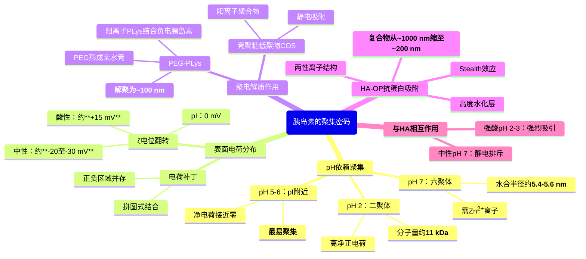
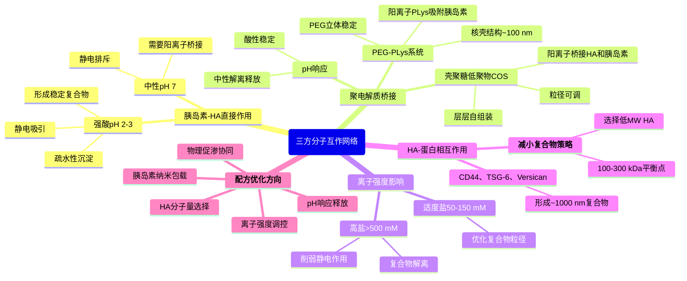
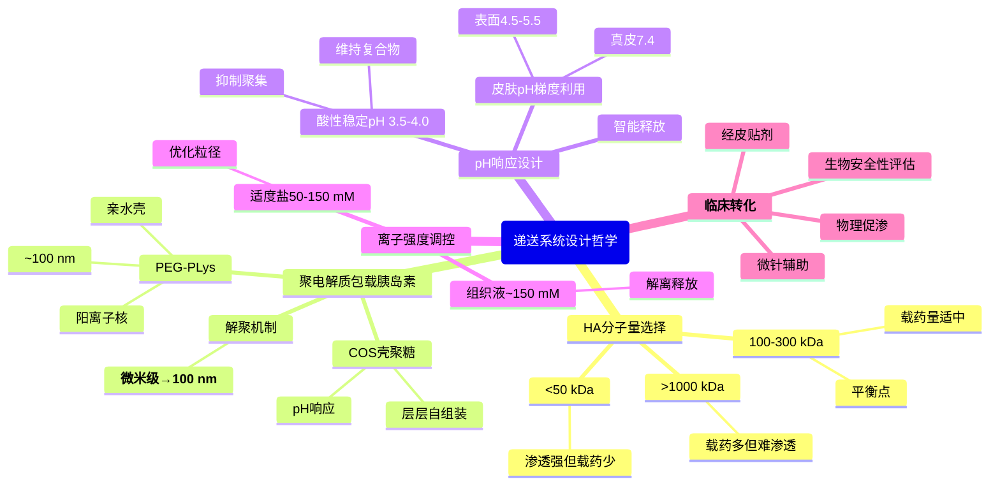

# 破解“聚集密码”：胰岛素-HA-聚电解质协同递送策略

> 都是ChatGPT调研的，我看了总体上是对的，具体细节还请自行调研确认正确性。

*本文为下篇，接续上篇对角质层微观水通道、透明质酸分子量依赖性渗透和蛋白质网络捕获机制的阐述，深入探讨胰岛素的聚集行为、三方分子互作网络，以及基于这些认知的递送系统设计策略。*

## 摘要

> 本文深入探讨了**胰岛素在不同pH条件下的聚集行为**（等电点pI 5.3附近最易聚集，酸性条件形成二聚体，中性条件形成六聚体）及其表面电荷分布特征，剖析了胰岛素-HA-聚电解质的**三方分子互作网络**（静电作用、多点结合、空间位阻）及其在纳米递送系统设计中的应用。研究表明，通过精密调控pH、离子强度、聚电解质类型和浓度，可将胰岛素-HA大聚集体（微米级）转化为稳定的纳米颗粒（约100 nm），并通过竞争性结合策略破坏HA与内源蛋白的互作，从而显著提高经皮渗透效率。HA-OP递送系统通过**竞争性结合和抗蛋白吸附效应**，将HA-蛋白复合物从~1000 nm缩小至~200 nm，协同聚电解质（COS、PEG-PLys）实现胰岛素解聚与纳米包载，为基于HA的胰岛素经皮递送系统的理性设计提供了系统的理论基础和优化策略。

### 核心结论

- 胰岛素的聚集状态高度依赖pH，在等电点附近（pH 5-6）最易形成大聚集体，强酸或中性条件下相对稳定
- ζ电位从酸性约+15 mV翻转至中性约-20至-30 mV，决定与阴离子聚合物（如HA）的相互作用强度
- **聚电解质（如壳聚糖低聚物、PEG-聚赖氨酸）可通过静电作用将胰岛素微米级聚集体解聚为100 nm左右的纳米颗粒**
- 胰岛素与HA在强酸条件（pH<3）下可形成稳定复合物，中性条件下因静电排斥需要阳离子聚合物桥接
- **HA-OP递送系统**通过竞争性结合和抗蛋白吸附效应，将HA-蛋白复合物从~1000 nm缩小至~200 nm，突破角质层屏障
- pH响应型配方设计可利用皮肤pH梯度实现智能释放，协同物理促渗技术提高临床转化潜力

## 一、胰岛素的聚集密码：pH依赖的分子组装与表面电荷

### 1.1 pH-聚集曲线：胰岛素是等电点规则的“反例”

#### 传统等电点理论与胰岛素的特殊性

**传统观点**：大多数蛋白在等电点（pI）附近净电荷为零，静电斥力最小，因此最易聚集沉淀。

**胰岛素的反常行为**：人胰岛素pI约为**pH 5.3**，但实验动力学显示，在pH≈pI(5.0–6.0)附近，**淀粉样纤维形成明显变慢或被抑制**，而非加速（[Amyloid formation of bovine insulin is retarded in moderately acidic pH](https://link.springer.com/article/10.1007/s00249-019-01420-0)，[Insights into Insulin Fibril Assembly](https://pmc.ncbi.nlm.nih.gov/articles/PMC5751154/)）。

**关键区分**：

- **可逆沉淀** vs **淀粉样聚集**：pH 5.5在pI附近确实诱导**可逆沉淀**，但这与淀粉样纤维形成是**不同的过程**
- **pH 5.0处的电荷中和似乎阻碍而非加速自组装**
- 在中等酸性pH（5.0-6.0）可以测量的半衰期范围内，淀粉样形成被强烈抑制

#### 胰岛素特有的分子因素

**1. Zn²⁺六聚体的pH依赖稳定性**（[Zinc–Ligand Interactions Modulate Assembly and Stability](https://link.springer.com/article/10.1007/s10534-005-3685-y)）

- **pH 5-6时六聚体最稳定**：Zn²⁺配位His B10残基，锁定六聚体构象
- **单体可用量下降**：六聚体形成消耗了大量单体，**初级成核受限**
- **保护作用**：六聚体阻止单体进入淀粉样聚集路径

**2. 构象可塑性的pH依赖性**（[Primary steps of pH-dependent insulin aggregation kinetics](https://pubmed.ncbi.nlm.nih.gov/19533727/)）

- **强酸区（pH 2-3）**：B链C端与α螺旋柔化，**熵损失约150 J·mol⁻¹·K⁻¹**，有利于形成聚集核心
- **pI附近（pH 5-6）**：柔性相对降低，六聚体稳定，**反而抑制初核形成**
- **机制转换**：强酸使胰岛素易走“单体→低寡聚→纤维”路径

**3. 电荷屏蔽并非唯一驱动**（[Study of Insulin Aggregation](https://pmc.ncbi.nlm.nih.gov/articles/PMC11395423/)）

- **正负电荷分布与疏水界面不匹配**：虽然净电荷趋零减小排斥，但在胰岛素中形成“无助解聚”态
- **需要破坏内稳态**：需要酸性质子化或去Zn/去盐来破坏六聚体才会聚集
- **离子/辅基效应**：硫酸根、搅拌、升温或去Zn在酸性下强烈促进聚集；相同条件在pI附近则多形成可逆寡聚而非纤维（[Elucidation of insulin assembly at acidic and neutral pH](https://pubmed.ncbi.nlm.nih.gov/28796342/)）

#### pH 2-3（强酸条件）：二聚体优势与快速纤维化风险

在pH 2的强酸环境下，胰岛素所有酸性侧链（Glu、Asp）被质子化为中性，而碱性侧链（Lys、Arg、His）全部带正电。此时**胰岛素带有高净正电荷**，分子间强烈静电排斥，主要以**二聚体或小寡聚体**形式存在。

**寡聚体分布与等周聚集模型**：

分析超速离心和光散射研究显示：
- **矿物酸中**（HCl）：主要呈二聚体（分子量约11 kDa，即2×5.8 kDa）
- **乙酸中**：平衡偏向单体
- **动态光散射**（DLS）测得pH 3溶液中平均粒径约**5-6 nm**，对应二聚体或四聚体（[Insulin at pH 2](https://www.sciencedirect.com/science/article/abs/pii/S0022283602000219), [pH-dependent self-association](https://pmc.ncbi.nlm.nih.gov/articles/PMC2856799/)）

胰岛素在pH 3时表现出**等周聚集**（isodesmic association）行为，即单体以**恒定结合常数**逐级形成更高阶寡聚体：单体⇌二聚体⇌四聚体⇌八聚体⋯，每一步的平衡常数相同。这与经典的成核-延伸模型不同，说明在强酸下胰岛素寡聚化没有明显的“成核势垒”。

**纤维化需要额外驱动**：

关键发现是，**室温下仅靠酸化通常不会形成长纤维**。Podestà等人的原子力显微镜（AFM）研究显示，在65°C加热条件下pH≈2时：
- **几分钟内**：出现一系列球形寡聚体（直径10-30 nm）
- **几小时后**：开始成核并形成交叉β结构的纤维
- **最终形态**：长达微米的淀粉样纤维

这说明酸性条件下胰岛素**可以形成β-片层富集的纤维聚集体**，但需要加热或机械搅拌等额外驱动因素破坏α螺旋稳定性（[Early events in insulin fibrillization](https://pmc.ncbi.nlm.nih.gov/articles/PMC1367137/)）。

分子动力学模拟也支持这一点：pH从3.0降至1.6时，胰岛素B链末端和螺旋区柔性降低、熵损失约150 J·mol⁻¹·K⁻¹，这种构象僵化有利于聚集核心形成，但仍需外部能量输入（热或剪切）才能跨越α→β转换势垒。

#### pH 4-4.5（弱酸窗口）：制剂常用pH

**稳定的单体/二聚体平衡**：

pH 4-5是**胰岛素制剂的常用缓冲pH**（如柠檬酸缓冲液）。此时胰岛素电荷正负接近平衡，实验观察到：

- **主要状态**：单体和少量二聚体
- **DLS粒径**：约3-4 nm（单体水合半径）
- **质谱数据**：pH 4.5溶液中主要显示**5800 Da的单体峰**，二聚体信号强度<1%（[Ultra-rapid absorption of insulin](https://pmc.ncbi.nlm.nih.gov/articles/PMC3440144/)）

在含柠檬酸/EDTA等配方中（pH≈4），$\ce{Zn^2+}$被螯合后，胰岛素迅速解离为单体/二聚体。总体而言，**中低浓度的人胰岛素在pH 4-5下保持折叠构象**，未见明显的α→β构象变化，溶液比较稳定。

**动力学特征**：

接近弱酸pH时仍属“酸性窗口”，但聚集动力学显著变慢：
- 寡聚分布最多到7-mer左右
- 成核/延伸速率低于pH 2-3
- 仍会在搅拌/升温/盐诱导下进入纤维化路径，但时间尺度为天-周而非小时

#### pH 5-7（接近pI到中性）：六聚体主导

当pH升至5-7范围，Glu/Asp侧链逐渐去质子化带负电，His侧链在pH 6-7附近部分失去质子，而Lys/Arg仍保持正电。净电荷接近零或略带负电，**静电斥力减弱，疏水作用和氢键主导聚集**。

**无Zn²⁺条件下的等周聚集**：

在无$\ce{Zn^2+}$条件下，中性pH胰岛素主要以二聚体存在（单体浓度极低）。静态/动态光散射研究显示，胰岛素在pH 3-8范围内均表现出**等周聚集特性**，即各级寡聚体（二聚体、四聚体、八聚体⋯）按同一平衡常数结合（[Self-association of Zn-insulin](https://pubmed.ncbi.nlm.nih.gov/20188445/), [pH-dependent self-association](https://pmc.ncbi.nlm.nih.gov/articles/PMC2856799/)）。这种模型适用于较宽的pH范围，说明胰岛素寡聚化的热力学驱动力在不同pH下保持一致。

**Zn²⁺诱导的六聚体稳定**：

加入$\ce{Zn^2+}$后，三个二聚体通过其B链His10残基配位两个$\ce{Zn^2+}$离子，形成**稳定的六聚体**（2$\ce{Zn^2+}$：3二聚体 = 6单体），动态光散射测得水合半径约**5.4-5.6 nm**，分子量约34-36 kDa（[Insulin hexamer characterization](https://pubmed.ncbi.nlm.nih.gov/17014767/), [Insulin hexamer DLS](https://journals.plos.org/plosone/article?id=10.1371/journal.pone.0195010)）。

**浓度与Zn²⁺依赖性**：

静态/动态光散射研究发现，在pH 7时：
- **低浓度**（<0.3 mg/mL，约0.05 mM）：主要单体-二聚体（5.8-11.6 kDa）
- **中等浓度**（>0.3 mg/mL）+ 0.1 mM $\ce{Zn^2+}$：大部分转化为六聚体（~35 kDa），少量单体-二聚体
- **高浓度** + 0.3 mM $\ce{Zn^2+}$：几乎完全为六聚体，出现少量十二聚体（~70 kDa）

关键是，**这些六聚体可以等周聚集形成更大的寡聚体**（12聚、18聚⋯），随着浓度增加，六聚体逐级聚合但仍保持相同的结合常数。

**六聚体保护作用**：

中性pH 7.4时，$\ce{Zn^2+}$稳定的六聚体是优势态，显著抑制聚集。若去Zn或添加少量变性剂（GdnHCl 0.25–0.5 M），六聚体解离后随即易聚集成纤维，说明“**解六聚→聚集**”是关键限制步骤。这解释了为何在中性pH下有Zn时聚集显著受抑。

在常温、生理盐浓度下，**胰岛素保持其本征α螺旋/环结构较为稳定**，未自动转变为β片层，除非施加外部诱导（如高温或剪切）。

**生理意义**：胰岛β细胞内胰岛素以$\ce{Zn^2+}$-六聚体结晶储存，分泌入血后在中性pH、低$\ce{Zn^2+}$环境下解离为二聚体和单体发挥生物活性。

#### pH 5.3（等电点）：最大聚集风险

在pH接近5.3时，胰岛素净电荷为零，分子间既无强静电吸引也无强排斥，**最容易发生无定形聚集或沉淀**。即使微小的pH波动（0.1-0.2 pH单位）也会导致聚集行为截然不同：
- **pH 4.1**：快速形成纳米级颗粒，富含β-聚集结构
- **pH 4.3**：形成微米级颗粒，保留较多天然结构

这强调了在制剂开发中**严格控制pH的重要性**。胰岛素制剂通常采用略偏酸的缓冲体系（pH 3.5-4.0），既避免pI附近的聚集，又维持六聚体稳定。

#### pH >9（碱性条件）：去稳定化

强碱条件虽可使胰岛素带高净负电、溶解性增加，但长期暴露会导致构象改变和化学降解（如脱酰胺），需谨慎避免。

#### 汇总表

| pH          | 优势态（DLS粒径）              | 聚集模型         | 纤维化条件                       | ζ电位范围   | Martini3 Go参数建议                                          | 时间尺度        |
| ----------- | ------------------------------ | ---------------- | -------------------------------- | ----------- | ------------------------------------------------------------ | --------------- |
| pH 2-3      | 二聚体/四聚体（5-6 nm）        | 等周聚集         | 需要加热（65°C）或搅拌           | 约+15 mV    | εintra=15, εinter=6-7 kJ/mol           | 快（小时级）    |
| pH 4-4.5    | 单体为主（3-4 nm）             | 单体-二聚体平衡  | 需要搅拌/升温/盐诱导             | +10至0 mV   | εintra=15, εinter=3-5 kJ/mol（或不需要） | 慢（天-周）     |
| pH 5.3 (pI) | 可逆沉淀                       | 可逆等电点沉淀   | 低聚集动力学，淀粉样形成被抑制   | ~0 mV       | εintra=10-15, εinter=3-5 kJ/mol        | 中等            |
| pH 7 (无Zn) | 二聚体（等周聚集）             | 等周聚集         | 室温下慢，需要去稳定因素触发     | -20至-30 mV | εintra=15, εinter=6-7 kJ/mol           | 慢（天-周）     |
| pH 7 (有Zn) | 六聚体（5.4-5.6 nm，等周聚集） | 六聚体等周聚集   | 六聚体稳定，不聚集（需去Zn触发） | -20至-30 mV | εintra=15 + Zn²⁺配位约束（不需εinter） | 不聚集          |

**表注**：
- **等周聚集**：单体/寡聚体以恒定结合常数逐级聚合（单体⇌二聚体⇌四聚体⋯），无明显成核势垒
- **εinter参数**：基于Korshunova等（2024）的Martini 3研究，6-7 kJ/mol适用于胰岛素二聚体
- **纤维化**：室温下仅靠pH调节通常不形成纤维，需要外部驱动（热、剪切）破坏α螺旋稳定性

### 1.2 表面电荷分布与ζ电位：分子的静电指纹

胰岛素的聚集行为不仅取决于净电荷，还取决于**表面电荷的空间分布**，即电荷补丁（charge patch）。

#### ζ电位的pH依赖性

ζ电位（zeta potential）反映了胶体颗粒表面的有效电荷，胰岛素的ζ电位随pH呈典型翻转：
- **酸性条件**（pH 2-3）：ζ电位为正值（约+15 mV左右，具体值取决于离子强度和胰岛素聚集状态）
- **中性条件**（pH 7）：ζ电位为负值（约-20至-30 mV，取决于制剂组成）
- **pI附近**（pH 5-6）：ζ ≈ 0 mV（电荷翻转）

注：ζ电位的绝对值受离子强度、胰岛素浓度、聚集状态（单体/二聚体/六聚体）等多种因素影响，文献报道的数值存在一定范围（[Insulin zeta potential at pH 3](https://pubs.acs.org/doi/10.1021/acsomega.3c02482), [Insulin formulation zeta potential](https://www.researchgate.net/figure/Zeta-potential-of-PNS-PNG-and-insulin-at-different-pH-in-the-water-medium_tbl1_348537185)）。

这与胰岛素氨基酸序列的解离特性一致：
- **B链His5、His10**（pKa ~6-7）：接近中性时失去质子
- **Glu/Asp残基**（如B13-Glu、B21-Glu）：pH >4时电离带负电
- **Lys/Arg残基**（如B22-Arg、B29-Lys）：pH <10始终带正电

#### 电荷补丁与分子间相互作用

胰岛素表面电荷分布不均匀，形成局部富集正电或负电的区域：
- **正电补丁**：B22-Arg、B29-Lys附近区域
- **负电补丁**：B13-Glu、B21-Glu、A链酸性残基区域

在pH接近pI时，虽然净电荷为零，但正负电荷补丁并存，分子间可通过**互补电荷区域的静电吸引**（如一个分子的正电补丁对接另一个分子的负电补丁）形成聚集核心。分子建模的APBS电势计算显示，pH 5.3时胰岛素表面同时存在蓝色（正电）和红色（负电）斑块，为分子间拼图式结合提供了驱动力。

#### 六聚体稳定性的静电基础

六聚体稳定性很大程度依赖分子间电荷作用和氢键网络。$\ce{Zn^2+}$正离子中和了His B10区域的负电环境（$\ce{Zn^2+}$与三个二聚体的His配位），酚分子填充六聚体腔体形成氢键/疏水作用。去除$\ce{Zn^2+}$和酚后，六聚体因电相斥趋于解离。

### 1.3 聚集态调控的实际意义

理解胰岛素的pH-聚集关系对递送系统设计至关重要：

**制剂pH选择**：
- **酸性配方**（pH 3.5-4.0）：抑制等电点聚集，维持二聚体或小六聚体，保证制剂澄清和稳定性
- 中性配方+$\ce{Zn^2+}$：**形成稳定六聚体**，实现缓释效果（如NPH胰岛素）
- **甘精胰岛素**：通过修饰提升pI至6.7，在生理pH下快速沉淀形成皮下缓释库

**与HA相互作用的pH窗口**：
- **强酸条件**（pH 2-3）：胰岛素带正电，HA带负电，**强烈静电吸引**，可形成复合物（见第三章）
- **中性条件**（pH 7）：胰岛素略带负电，HA强负电，**静电排斥**，不易直接结合

这一pH依赖性为设计pH响应型胰岛素-HA递送系统提供了理论基础。

## 二、胰岛素分子动力学模拟基础

### 2.1 B链C端构象变化与受体结合机制

胰岛素与胰岛素受体结合需要经历**一系列复杂的构象变化**，最新实验证据和分子动力学（MD）模拟指向**B链C端（BC-CT，残基B24-B30）**是这些变化的关键位置。

#### 拉链式开放机制

BC-CT的开放遵循**拉链式（zipper-like）**机制，按照closed → open → wide-open的顺序进行：

1. 从C端末端残基（如LeuB29）开始
2. 沿着BC-CT依次向铰链残基PheB24推进
3. PheB24和TyrB26的侧链形成**疏水核心**，维持胰岛素的闭合状态
4. **水分子进入疏水核心**是驱动开放的关键因素

**能量消耗**：开放过程消耗的能量从LeuB29到铰链残基PheB24**系统性增加**，wide-open构象是受体结合所必需的，但出现频率极低（约5%概率）。

**残基特异性柔性**（[Molecular Dynamics Simulations of Insulin](https://pmc.ncbi.nlm.nih.gov/articles/PMC4668001/)）：

- **ThrB30（C端末端残基）**：几乎随机运动，柔性最高
- **LeuB29**：次高柔性，是拉链式开放的起始点
- **B25-B28残基**：中等柔性，逐步向铰链过渡
- **PheB24（铰链残基）**：柔性最低，能量屏障最高

**溶液中的构象分布**：B链C端残基（B25-B30）在溶液中的**结构定义远不如晶体结构清晰**，这归因于自组装稳定效应在溶液中缺失。多次长时间MD模拟显示，closed/半折叠是溶液中的**优势构象**，“折回贴近A链”的紧凑态频繁出现。

#### 构象无序的普遍性

全原子MD模拟揭示单体胰岛素的**结构集合（structural ensemble）**具有显著的动态性：

**约六成结构呈现至少一种以下无序元素**：

- **A链N端α螺旋融化**（AN-helix melting）
- **B链N端脱离**（B-chain N-terminus detachment）
- **B链C端脱离**（B-chain C-terminus detachment）

这些无序元素与**微秒尺度的交换动力学**相关。

### 2.2 二硫键的差异化结构角色

胰岛素含有**三个二硫键**：两个链间二硫键（A7-B7和A20-B19）连接A链和B链，一个链内二硫键（A6-A11）位于A链内部。

#### 三个二硫键的不同角色

| 二硫键      | 溶剂暴露程度 | 删除后的结构影响                                             | 功能角色               |
| ----------- | ------------ | ------------------------------------------------------------ | ---------------------- |
| **A7-B7**   | 最暴露       | 中等影响                                                     | 链间连接               |
| **A20-B19** | 部分暴露     | **最大影响**：丧失有序二级结构、蛋白酶敏感性增加、紧密性显著降低 | **折叠核心、结构锚点** |
| **A6-A11**  | 几乎完全埋藏 | 最小影响                                                     | **变构调控A链N端柔性** |

#### A20-B19：proinsulin折叠的第一步

- **A20-B19是proinsulin折叠过程中第一个形成的二硫键**
- 部分折叠的中间体在A20和B19之间形成第一个二硫键后产生
- **长寿命氢键**仅存在于侧翼A20-B19二硫键的4个α螺旋位点
- 交换最靠近A20-B19的酰胺质子需要**全局解折叠**，说明这是分子最稳定的核心

#### A20-B19与B链C端动力学的耦合

- **ArgB22位于A20-B19二硫键正上方**，其构象和动力学变化会改变该二硫键的溶剂可及性
- **PheB24侧链**（铰链残基）位于A20-B19旁边的疏水裂缝中，稳定B20-B23的β-转角并封闭疏水核心的一侧
- 虽然A20-B19本身提供**稳定的结构锚点**，但周围区域（尤其是B链C端）的构象柔性对受体结合至关重要

> **关键结论**：A20-B19二硫键本身是“静态锚点”，其周围的动态区域才是构象变化的主角。

### 2.3 构象-功能关系的完整图景

#### 常见误解的澄清

**错误观念**：多聚体和受体结合态都是closed构象，free单体是open构象。

**正确理解**：实际情况恰好相反——受体结合需要**wide-open构象**，而多聚体和free单体主要呈现closed构象。

#### 三种功能态的B链C端构象

**1. 储存态（多聚体）：B链C端Closed**

- B链C端（B24-B30）折叠形成**反平行β折叠**，与另一个单体的B链C端配对
- 疏水相互作用（PheB24、PheB25、TyrB26）和β折叠氢键稳定二聚体
- 二聚体是六聚体（T6, T3R3, R6）的基本组装单元
- **必须是closed构象才能形成储存态的寡聚体**

**2. 受体结合态：B链C端Wide-Open** ⚠️

- “**The wide-open conformation of insulin is necessary for its binding to the insulin receptor**”
- 冷冻电镜结构显示：**head-bound胰岛素呈现open构象**，与stalk-bound的closed构象形成对比
- B链C端必须**完全解开（detach）**才能插入受体的L1-CR-L2结构域之间
- Wide-open构象暴露了跨越A链和B链的**不变受体结合表面**

**3. Free单体：动态平衡，以Closed为主**

- 溶液NMR结构显示free单体类似**T-state**（主要是closed）
- MD模拟揭示60%呈现至少一种无序元素（包括B链C端脱离）
- Closed → Open → **Wide-open的构象转换是自发的，但wide-open是罕见事件**（约5%概率）
- 胰岛素必须**等待罕见的wide-open构象出现**才能结合受体

#### T-state vs R-state的正确理解

T/R转换主要涉及**B链N端（B1-B8）**，而不是C端：

| 区域                  | T-state          | R-state          | 受体结合态     |
| --------------------- | ---------------- | ---------------- | -------------- |
| **B链N端**（B1-B8）   | 延伸构象         | α螺旋（更紧凑）  | 需要R-like构象 |
| **B链C端**（B24-B30） | Closed（二聚体） | Closed（二聚体） | **Wide-Open**  |

- **T-state**：B1-B8延伸，B9-B19为α螺旋
- **R-state**：B1-B19完全形成α螺旋（苯酚结合诱导）
- 受体结合需要B链N端采用**R-like构象**（局部负φ角）

#### 关键洞察

**1. 受体结合的速率限制不是扩散，而是构象采样**

- 胰岛素在血液中浓度足够高（nM-μM），扩散不是问题
- **真正的瓶颈是等待罕见的wide-open构象出现**
- 这解释了为什么胰岛素受体结合的$k_\text{on}$相对较慢

**2. 储存和活性形式的构象冲突**

- 储存需要closed构象（形成稳定的六聚体）
- 活性需要open构象（结合受体）
- 这种**构象冲突是胰岛素调控的内在机制**：防止储存态胰岛素过早激活受体

**3. MD模拟策略的启示**

- 研究储存态寡聚化：使用closed构象，关注二聚体界面稳定性
- 研究受体结合：必须模拟B链C端的开放过程（需要增强采样）
- 研究free单体：需要长时间轨迹或增强采样捕捉罕见的wide-open事件

> **核心结论**：胰岛素的功能循环是“**从closed储存态，通过罕见的构象采样到达wide-open态，然后结合受体**”的过程。受体结合态是**open而非closed**，这与多聚体的closed储存态形成鲜明对比。理解这一点对于正确设计递送系统至关重要。

### 2.4 粗粒化模拟的特殊考量：Martini3与Go模型

#### Martini3中胰岛素的挑战

**结构失稳问题**（[Martini 3 OliGo̅mers](https://pmc.ncbi.nlm.nih.gov/articles/PMC11391574/)）：

- **没有Go势的后果**：胰岛素结构在Martini3中会**快速解体**（within nanoseconds）
- **B链C端最先松散**：即使施加适度Go约束，B24-B30区域仍是最先塌陷或错配的部分
- **需要额外支持**：必须通过精确参数化的Go键来稳定结构

#### Go模型的参数化策略

**双层Go设置**：

1. **εintra（分子内）**：稳定三级结构
   - 对于胰岛素单体：标准Martini3参数通常不足
   - 需要根据全原子模拟校准

2. **εinter（分子间）**：稳定四级结构
   - **胰岛素二聚体的参数窗口**：Korshunova等（2024）系统研究发现，εinter = **6-7 kJ/mol**可稳定保持二聚体结构（[Martini 3 OliGo̅mers](https://pmc.ncbi.nlm.nih.gov/articles/PMC11391574/)）
   - **过低风险**（<6 kJ/mol）：二聚体界面过弱，易解离
   - **过高风险**（>10 kJ/mol）：二聚体过于刚性，内部波动不足，可能导致非物理聚集

**Korshunova等（2024）的胰岛素二聚体模拟**：

该研究是**首个系统性测试Martini 3.0.0 + Go模型用于胰岛素寡聚体**的工作：

**模拟设置**：
- **起始结构**：PDB 5BTS和3W7Y（胰岛素二聚体晶体结构）
- **粗粒化方法**：martinize2工具，保留DSSP二级结构
- **弹性网络（EN）**：在两链之间引入默认EN保持二聚体构象
- **体系大小**：约15000个水珠 + 0.15 M NaCl，盒子尺寸12.3 nm
- **模拟时间**：5 μs × 多组重复

**关键发现**：
- **Go势能量参数约6-7 kJ/mol**时，CG模型可稳定保持二聚体结构
- 二级结构（α螺旋）基本保持原样，未发生α→β转换
- 该模拟主要揭示了**胰岛素二聚体在不同相互作用强度下的稳定性边界**，而非自发纤维化过程

**弹性网络（EN）vs Go势的选择**：

| 方法              | 优势                             | 局限                             | 适用场景                   |
| ----------------- | -------------------------------- | -------------------------------- | -------------------------- |
| **弹性网络（EN）** | 简单、快速、参数少（仅一个力常数） | 不区分原生/非原生接触，过于刚性 | 稳定单体结构，短时间模拟   |
| **Go势（CG-Go）** | 基于接触图，允许构象变化         | 参数敏感，需要校准               | 寡聚化、解离、构象转换研究 |

对胰岛素二聚体，**推荐使用Go势**（εinter = 6-7 kJ/mol），而非EN，因为EN会过度限制二聚体界面的动态性。

#### 实际应用建议

**单体/自组装模拟**：

- 使用**仅εintra的Go模型**：允许B链C端柔性，但防止整体解折叠
- 如果研究B链C端开放，可能需要**switching Go-Martini**方法（允许构象转换）
- 调节εintra强度使内部波动匹配全原子参考轨迹

**二聚体/六聚体模拟**（基于Korshunova研究）：

- 使用**εintra + εinter双重Go模型**
- **推荐参数**：εinter = 6-7 kJ/mol（胰岛素二聚体）
- 测试范围：5-10 kJ/mol，观察二聚体稳定性和内部波动
- 验证：二聚体应在预期盐浓度/pH下稳定，但不应形成非特异性大聚集

**自组装聚集研究**：

- **风险**：标准Martini3可能**低估二聚体/六聚体界面稳定性**
- **策略**：使用经过校准的Go约束或增强疏水接触参数
- **验证**：对比实验的寡聚体分布（SEC、DLS）

> **警告**：在研究胰岛素聚集或自组装时，**必须确保使用调校后的Go约束或长程疏水参数**，否则可能得到非物理的折叠/聚集行为。B链C端的高度柔性使其成为Martini3粗粒化建模中的“薄弱环节”。

### 2.5 Martini3的已知问题与解决方案

#### 过度聚集问题：疏水作用的系统性放大

Martini粗粒化力场存在**蛋白-蛋白相互作用过强**的已知问题，这在多项研究中被独立验证：

**1. 膜蛋白过度聚集**（[Excessive aggregation of membrane proteins](https://journals.plos.org/plosone/article?id=10.1371/journal.pone.0187936)）

Martini模型中**膜蛋白二聚化自由能是实验值的两倍**，导致蛋白在拥挤环境下形成不可逆的大聚集簇团，严重限制了蛋白和脂质的扩散。这种过度聚集不是真实的生物学行为，而是力场artifact。

**2. 水溶性蛋白的结合能高估**（[Rescaling protein-protein interactions](https://www.nature.com/articles/s41467-024-50647-9)）

Martini 3对水溶性蛋白的**蛋白-蛋白相互作用强度高估约12-20**%，表现为：
- 内在无序蛋白（IDP）的回旋半径被低估约30%
- 小角X射线散射（SAXS）数据显示实验的蛋白-蛋白接触明显少于模拟
- 相分离体系中过度聚集，形成类固体聚集而非液-液共存相

**3. 疏水残基过于疏水**（[Improved Martini parameters](https://pubs.acs.org/doi/10.1021/ct300646g)）

Martini 2.x中芳香侧链（Phe、Pro、Trp）**过于疏水**，在Martini 3中虽有改进但仍存在不平衡：
- 疏水珠子间的Lennard-Jones势能过强
- 溶质-溶质相互作用相对于溶质-水相互作用失衡
- 碳水化合物、短肽等非蛋白体系也表现出**非物理性自聚集**

这些问题的根本原因是粗粒化过程中**熵-焓分解不准确**：Martini通过有效势（PMF）来近似原子间相互作用，但这种势函数在不同温度和浓度下的迁移性不足，导致疏水作用被系统性放大。

#### 水模型的选择与影响

**标准Martini水模型（W）**：

- **4:1映射**：一个水珠子代表4个水分子
- **早期版本需要抗冻颗粒**：Martini 2.x的水模型熔点过高（约290 K），需要添加10% antifreeze颗粒（WF）防止非物理冻结
- **Martini 3改进**：新水模型不再需要抗冻颗粒，但仍存在结构化和压缩性问题

**极化水模型（polarizable water）**（[Polarizable water model](https://journals.plos.org/ploscompbiol/article?id=10.1371/journal.pcbi.1000810)）：

为处理膜蛋白、带电脂质等需要精确静电效应的体系，Yesylevskyy等开发了三珠子极化水模型：
- **三位点模型**：中心珠子W通过LJ相互作用，两个带电位点WP（+）和WM（-）处理静电极化
- **优势**：更好地描述水的介电性质、表面张力、可压缩性，**不需要抗冻颗粒**
- **成本**：计算量增加约30-50%

**选择建议**：
- 研究胰岛素聚集等蛋白-蛋白相互作用：**标准Martini 3水模型**即可，但需要rescaling（见下）
- 涉及强静电效应（如高度带电多肽、膜蛋白跨膜）：考虑**极化水模型**

#### Rescaling策略：修正过强的蛋白相互作用

针对过度聚集问题，社区提出了多种rescaling方案：

**方案1：增强蛋白-水相互作用**（适用于膜蛋白）

对膜蛋白，通过缩放因子α=1.04-1.045增强**蛋白-脂质**LJ相互作用，可使二聚化自由能与实验值吻合，同时保持界面接触的特异性（[Addressing excessive aggregation](https://pmc.ncbi.nlm.nih.gov/articles/PMC8829890/)）。膜蛋白所需的修正幅度（约10%）远小于水溶性蛋白（60%）。

**方案2：减弱蛋白-蛋白相互作用**（推荐用于水溶性蛋白）

最新研究表明，**将蛋白-蛋白LJ势能缩放至λPP = 0.88-0.92**可显著改善：
- 12个IDP的SAXS拟合
- 15个多域蛋白的紧密度
- 但**完全丧失**跨膜蛋白自聚集和FUS液-液相分离能力

这提示**不存在通用的单一缩放因子**，需要根据体系类型调整。

**方案3：体系特异性校准**（适用于定量研究）

对特定蛋白（如胰岛素），推荐流程：
1. 用全原子MD测定**实验可验证的性质**（如二聚体解离常数、聚集动力学）
2. 在Martini中系统扫描λPP = 0.85-1.0范围
3. 选择最匹配实验或全原子参考的缩放因子
4. 验证：检查寡聚体分布、扩散系数、聚集时间尺度

#### 对胰岛素聚集模拟的具体建议

基于上述已知问题，**胰岛素在中性pH下的聚集行为模拟**需要特别注意：

**全原子 vs 粗粒化的行为差异**：

- **全原子**：中性pH无Zn²⁺时，胰岛素易聚集（如你的师兄所说“全原子倒是很快就聚集了”）
- **Martini3标准参数**：可能表现出两种极端
  - **过度聚集**：若疏水作用主导，可能形成非物理紧密簇团
  - **聚集不足**：若Go约束过强或λPP过低，二聚体界面被削弱

**推荐模拟策略**：

1. **建立全原子参考**：
   - 在相同pH/离子强度下跑全原子MD（至少100 ns × 多副本）
   - 记录聚集时间、寡聚体分布、接触界面

2. **Martini3参数调校**：
   - 使用Martini3 + Go模型
   - 测试λPP = 0.88, 0.92, 1.0三个缩放因子
   - 对比全原子的**聚集动力学**（不仅仅是最终结构）

3. **水模型选择**：
   - pH 7胰岛素（净电荷-1）：**标准W水模型**足够
   - 若需精确pKa或滴定，考虑constant-pH Martini或极化水模型

4. **验证指标**：
   - 二聚体形成/解离的平衡常数
   - 聚集体的平均大小和形态（球形 vs 纤维前体）
   - 与实验DLS、SEC数据对比

**关键洞察**：

Martini3中**胰岛素不聚集**可能意味着：
- Go约束过强，锁定了单体构象，阻止了二聚体界面形成
- 或者蛋白-水相互作用被意外增强（检查是否使用了IDP参数或rescaling）

而**全原子快速聚集**是合理的，因为中性pH无Zn²⁺时，胰岛素确实倾向于聚集（见1.1节）。Martini应该**重现这一趋势**（虽然时间尺度会加速），如果没有，说明参数需要调整。

> **总结**：粗粒化模拟胰岛素聚集是一个**参数敏感**的任务。Martini3的疏水放大问题确实存在（师兄说得对），但在胰岛素体系中可能被Go约束掩盖。建议通过全原子校准+系统扫描λPP来找到合适的平衡点。

## 三、三方博弈：胰岛素-HA-聚电解质的分子互作网络

> **与第二章的联系**：理解了胰岛素在分子层面的构象动力学后，本章探讨其在不同pH条件下如何与HA和聚电解质形成复杂的互作网络，为递送系统设计提供分子基础。

### 3.1 胰岛素与透明质酸的直接相互作用

#### 强酸条件下的复合物形成

Jederström等（2004）在开发口服胰岛素配方时发现，**在强酸性溶液（pH 2-3，含适量电解质）中，未修饰的HA与胰岛素能够直接相互作用，形成稳定的HA-胰岛素复合物**。该体系表现为澄清水溶胶，含有疏水性固体沉淀。

**相互作用机制**：
1. **静电引力主导**：pH 2-3时胰岛素带正电（ζ电位约+15 mV），HA主链羧基完全去质子化带强负电，两者通过静电吸引结合
2. **疏水作用辅助**：胰岛素在强酸下构象部分松动，暴露疏水区域，这些疏水区与HA的疏水补丁发生相互作用
3. **氢键网络**：HA的羟基、N-乙酰基与胰岛素骨架形成氢键，进一步稳定复合物

通过动态光散射（DLS）、ζ电位分析、原子力显微镜（AFM）和冷冻电镜（cryo-TEM）等手段证实了复合物形成，并用于提高口服胰岛素的稳定性和生物活性。

#### 中性pH的静电排斥

在中性或生理pH下，**胰岛素略带负电（ζ电位约-20至-30 mV），HA强负电，两者静电排斥，不形成稳定复合物**。这解释了为何常规HA凝胶（通常pH 6-7）不能有效包裹胰岛素——两个负电聚合物相互排斥而非结合。

### 3.2 聚电解质介导的胰岛素聚集体解聚

胰岛素在储存或制剂过程中易形成大聚集体（微米级沉淀、淀粉样纤维、球形簇团），严重影响生物活性和稳定性。多种聚电解质（尤其阳离子聚合物）被发现能够**部分解聚这些大颗粒，将其重分散为纳米级复合颗粒**（约100 nm）。

#### 壳聚糖低聚物（COS）：纤维解聚剂

Kalitnik等（2024）首次证明，**壳聚糖低聚物（COS）可显著抑制牛胰岛素体外纤维化，并能破坏已形成的胰岛素淀粉样纤维**。实验显示，将预先形成的胰岛素纤维与COS按1:10质量比共孵育48小时（37 ℃），可观察到：
- ThT荧光和圆二色谱显示β-结构含量降低
- AFM成像显示长纤维减少，产生较短片段或颗粒（百纳米级）
- 纤维并未完全溶解为单体，而是形成较小的次级结构

**机制**：
1. **静电多点结合**：COS带正电氨基与纤维表面富集的酸性残基（Glu、Asp）相结合
2. **破坏氢键网络**：COS插入纤维结构，削弱纤维轴向的连续性，使之断裂
3. **电荷屏蔽**：中和纤维表面电荷，减少纤维间的侧向聚集

其他聚电解质（如聚烯丙胺PAH、硫酸化寡糖CROS）对胰岛素纤维几乎无抑制或解聚作用，说明**聚电解质的结构对解聚效果至关重要**：COS的直链型多糖骨架和游离氨基赋予其独特的解聚能力。

#### PEG-b-PLys嵌段共聚物：纳米颗粒稳定剂

Pippa等（2015）报道，**聚乙二醇-聚L-赖氨酸（PEG-b-PLys）嵌段共聚物与胰岛素形成稳定纳米复合颗粒**：
- **粒径调控**：随胰岛素浓度增加，复合物粒径从约60 nm减小至更致密结构
- **离子强度效应**：提高盐浓度后，粒径分布收窄变小（适量盐屏蔽过强多点相互作用，使复合物更紧凑）
- **PEG稳定作用**：PEG链提供空间位阻，防止颗粒间聚并，提高胶体稳定性

**机制**：
1. **阳离子PLys结合负电胰岛素**：静电吸附形成核
2. **PEG形成亲水壳**：立体稳定，防止二次聚集
3. **多价效应优化粒径**：PLys链长和投料比决定复合物大小

#### 三嵌段共聚物胶束：双重包裹

Skandalis等（2020）开发的阳离子三嵌段共聚物QPDMAEMA-b-PLMA-b-POEGMA（季铵化聚甲基丙烯酸酯-疏水链段-聚乙二醇链段）能够：
- **静电吸附+疏水包合**：阳离子段结合胰岛素，疏水段包裹胰岛素疏水区
- **形成稳定纳米颗粒**：DLS显示复合物半径40-100 nm，AFM确认分散良好
- **离子强度调控**：高盐时出现双峰分布（~15 nm小颗粒 + ~350 nm大聚集），说明盐可部分解离大复合物

#### 微米沉淀→100 nm颗粒：层层组装策略

Balabushevich等（2004）和Fan等（2006）通过**聚电解质层层自组装**（Layer-by-Layer, LbL）技术：
1. 先制备5-13 μm胰岛素盐析沉淀或100-230 nm纳米聚集体
2. 交替吸附阴阳离子聚合物（如硫酸右旋糖酐/鱼精蛋白，或聚α,β-丙氨酸/壳聚糖）
3. 经超声处理，大颗粒破碎但聚电解质层防止重新聚并，稳定为**100-200 nm纳米颗粒**

这些研究共同表明，**聚电解质能够通过静电吸附、多点结合和立体稳定作用，将胰岛素从微米级聚集体转化为百纳米级可控颗粒**，为胰岛素-HA复合递送系统提供了重要技术基础。

### 3.3 胰岛素-HA-聚电解质三元相互作用网络

在实际的经皮递送系统中，胰岛素、HA和可能的聚电解质添加剂（如壳聚糖、聚赖氨酸等）构成复杂的三元相互作用网络：

#### pH的核心调控作用

- **强酸配方**（pH 2-3）：
  - 胰岛素（+）+ HA（-） → 形成复合物
  - 加入COS/壳聚糖（+）→ 竞争结合HA，可能部分替代胰岛素或形成三元复合物

- **中性配方**（pH 7）：
  - 胰岛素（-）+ HA（-） → 静电排斥，不直接结合
  - 加入阳离子聚合物（如PEG-PLys）→ 分别结合胰岛素和HA，形成独立复合颗粒或桥接复合物

#### 离子强度的双刃剑效应

- **低离子强度**：静电相互作用最强，易形成大复合聚集（过度交联）
- **适度盐浓度**（~50-150 mM）：屏蔽部分静电作用，优化复合物粒径和稳定性
- **高离子强度**（>500 mM）：削弱所有静电作用，复合物可能解离

#### 分子量的协同效应

- **HA分子量**：高MW HA提供更多结合位点，形成大复合物；低MW HA形成小复合物或不明显结合
- **聚电解质链长**：长链聚电解质可交联多个胰岛素/HA分子，短链仅能结合少数分子

#### 竞争性结合与优先级

当体系同时存在胰岛素、HA和第三方聚电解质时，结合优先级取决于：
1. **电荷密度**：高电荷密度聚合物（如肝素、聚谷氨酸）优先结合胰岛素
2. **结合亲和力**：特异性结合蛋白（如CD44对HA）比非特异性静电结合更强
3. **浓度比例**：过量组分主导相互作用

#### 实际递送配方的优化方向

- **HA分子量选择**：选择100-300 kDa的中等分子量HA，平衡渗透能力与载药量
- **胰岛素纳米包载**：在适当pH下，利用聚电解质（如PEG-PLys、COS）将胰岛素包裹为100-200 nm纳米颗粒
- **pH响应释放**：利用皮肤pH梯度（表面pH 4.5-5.5 → 真皮pH 7.4），设计在酸性条件下稳定、中性条件下释放的配方
- **物理促渗协同**：结合微针、离子导入等物理方法提高递送效率

---

## 四、突破屏障：递送系统设计哲学

> **设计原则**：基于第二章的构象-功能关系理解，并结合第一章的聚集规律与第三章的三方互作机制，本章提出理性的递送系统设计策略。关键是在维持胰岛素closed储存态稳定性的同时，确保其在靶点能够转换为生物活性的open构象。

### 4.1 聚电解质辅助策略：从微米聚集到纳米颗粒

#### 胰岛素聚集的挑战

胰岛素在常规制剂中易形成：
- **六聚体沉淀**（μm级，$\ce{Zn^2+}$诱导）
- **淀粉样纤维**（长度μm，直径nm，但聚集成更大簇团）
- **无定形聚集**（等电点附近沉淀）

这些大聚集体无法穿透角质层，且生物活性下降。

#### 聚电解质包裹与尺寸控制

利用COS、PEG-PLys、QPDMAEMA等聚电解质，可将胰岛素聚集体**解聚并稳定为100-200 nm纳米颗粒**：

1. **COS解聚纤维**：物理打断纤维+电荷屏蔽，产生短片段
2. **PEG-PLys包裹**：PLys结合胰岛素形成核，PEG提供壳稳定
3. **层层组装**：多层聚电解质壳防止颗粒重新聚并

#### 与HA载体的协同作用

- **低/中MW HA**可作为亲水性载体
- **聚电解质将胰岛素聚集体降至~100-200 nm**
- **两者结合**：HA可负载聚电解质包裹的胰岛素纳米颗粒，形成复合递送系统
  - HA载体：提供一定的渗透能力和生物相容性
  - 聚电解质-胰岛素复合物（~100 nm）：保护胰岛素活性，防止聚集

### 4.2 pH响应与离子强度调控

#### 利用皮肤pH梯度

皮肤表面pH约4.5-5.5（酸膜），角质层内部约5.5-6.0，真皮pH约7.4。设计pH响应型配方可实现：

**强酸配方（pH 2-3）用于HA-胰岛素复合**：
- 在此pH下，胰岛素（+）与HA（-）形成稳定复合物
- 涂抹于皮肤后，接触皮肤酸膜（pH 4.5-5.5），复合物开始部分解离
- 进入真皮（pH 7.4）后，静电排斥完全生效，胰岛素释放

**弱酸配方（pH 4-5）结合HA载体**：
- HA与聚电解质-胰岛素复合物在此pH下较稳定
- 渗透至真皮后，pH升高可能触发复合物解离，释放胰岛素

#### 离子强度的精细调控

- **配方中适度盐浓度**（50-150 mM）：优化聚电解质-胰岛素复合物的粒径和稳定性
- **皮肤组织液高盐环境**（~150 mM）：进入真皮后，盐浓度屏蔽静电作用，促进复合物解离释放

### 4.3 生物安全性与临床转化考量

#### 生物相容性

- **HA**：人体天然成分，极佳生物相容性，无免疫原性
- **壳聚糖/COS**：天然多糖，可生物降解，广泛用于药物递送
- **PEG-PLys**：PEG为FDA批准材料，PLys为天然氨基酸聚合物，低毒性

#### 皮肤刺激性

- 阳离子聚电解质可能对皮肤有轻微刺激，需控制浓度和pH
- 强酸配方（pH 2-3）需评估对角质层屏障的影响（短期接触一般安全，但长期使用需监测）

#### 胰岛素稳定性与活性保持

- 聚电解质包裹可保护胰岛素免受酶降解和聚集失活
- 需确认释放后胰岛素的二级结构和受体结合活性完整

#### 临床给药途径

- **经皮贴剂**：HA/聚电解质-胰岛素复合凝胶，持续释放
- **微针辅助**：微针预处理增加皮肤通透性，再涂抹纳米递送系统
- **离子导入/超声导入**：物理手段协同化学促渗策略

### 结语

经皮递送大分子药物是纳米医学领域的珠穆朗玛峰——挑战巨大但回报丰厚。本文通过系统解析角质层的多尺度屏障（物理、尺寸、生化）和胰岛素的复杂聚集行为，探讨了基于聚电解质包载和pH响应释放的协同递送策略。

然而，从概念验证到临床应用仍有漫长的道路**。科学的严谨性要求我们不仅关注成功的案例，更要正视局限、质疑假设、完善机制**。只有通过跨学科协作（皮肤生物学、药物化学、纳米材料、临床医学）、多尺度研究（分子-细胞-组织-整体）、理性设计与系统评估相结合，才能最终实现经皮大分子递送的临床转化，为全球数百万糖尿病患者带来无针、无痛、高依从性的胰岛素给药新选择。

---
## 参考文献

### 胰岛素分子动力学与构象变化

- [Molecular Dynamics Simulations of Insulin: Elucidating the Conformational Changes that Enable Its Binding](https://pmc.ncbi.nlm.nih.gov/articles/PMC4668001/)
- [Structural Ensemble of the Insulin Monomer](https://pubs.acs.org/doi/10.1021/acs.biochem.1c00583)
- [Conformational Dynamics of Insulin](https://pmc.ncbi.nlm.nih.gov/articles/PMC3355934/)
- [Insulin in motion: The A6-A11 disulfide bond allosterically modulates structural transitions](https://www.nature.com/articles/s41598-017-16876-3)
- [Additional disulfide bonds in insulin: Prediction, recombinant expression, receptor binding affinity, and stability](https://pmc.ncbi.nlm.nih.gov/articles/PMC4420526/)
- [Evolution of insulin at the edge of foldability and its medical implications](https://pmc.ncbi.nlm.nih.gov/articles/PMC7703552/)

### 胰岛素受体结合与T/R转换

- [Structure of the Insulin Receptor-Insulin Complex by Single Particle CryoEM](https://pmc.ncbi.nlm.nih.gov/articles/PMC5886813/)
- [Insight into the Structural and Biological Relevance of the T/R Transition](https://pmc.ncbi.nlm.nih.gov/articles/PMC4047818/)
- [The Structure and Function of Insulin: Decoding the TR Transition](https://pmc.ncbi.nlm.nih.gov/articles/PMC3297421/)
- [Role of C-terminal B-chain residues in insulin assembly](https://www.sciencedirect.com/science/article/pii/S0969212601001952)
- [Protective hinge in insulin opens to enable its receptor engagement](https://www.pnas.org/doi/10.1073/pnas.1412897111)

### 胰岛素寡聚化与六聚体

- [Enhanced hexamerization of insulin via assembly pathway rerouting](https://www.nature.com/articles/s42003-022-04386-6)
- [Progress in Simulation Studies of Insulin Structure and Function](https://pmc.ncbi.nlm.nih.gov/articles/PMC9252437/)
- [What Gives an Insulin Hexamer Its Unique Shape and Stability?](https://pubs.acs.org/doi/abs/10.1021/acs.jpcb.8b00453)

### pH依赖的自组装与聚集

#### 等周聚集模型与光散射研究
- [pH-dependent self-association of zinc-free Insulin characterized by concentration-gradient static light scattering](https://pmc.ncbi.nlm.nih.gov/articles/PMC2856799/)
- [Self-association of Zn-insulin at neutral pH: investigation by concentration gradient–static and dynamic light scattering](https://pmc.ncbi.nlm.nih.gov/articles/PMC2867077/)

#### 纤维化动力学与早期事件
- [Early events in insulin fibrillization studied by time-lapse atomic force microscopy](https://pmc.ncbi.nlm.nih.gov/articles/PMC1367137/)
- [Primary steps of pH-dependent insulin aggregation kinetics](https://pubmed.ncbi.nlm.nih.gov/19533727/)
- [Amyloid formation of bovine insulin is retarded in moderately acidic pH](https://link.springer.com/article/10.1007/s00249-019-01420-0)
- [Insights into Insulin Fibril Assembly at Physiological and Acidic pH](https://pmc.ncbi.nlm.nih.gov/articles/PMC5751154/)

#### 结构表征
- [Insulin at pH 2: Structural Analysis of the Conditions Promoting Insulin Fibre Formation](https://www.sciencedirect.com/science/article/abs/pii/S0022283602000219)
- [Elucidation of insulin assembly at acidic and neutral pH: Characterization of low molecular weight oligomers](https://pubmed.ncbi.nlm.nih.gov/28796342/)
- [Study of Insulin Aggregation and Fibril Structure under Different Environmental Conditions](https://pmc.ncbi.nlm.nih.gov/articles/PMC11395423/)

#### Zn²⁺与六聚体稳定性
- [Zinc–Ligand Interactions Modulate Assembly and Stability of the Insulin Hexamer](https://link.springer.com/article/10.1007/s10534-005-3685-y)
- [Ultra-rapid absorption of recombinant human insulin induced by zinc chelation and surface charge masking](https://pmc.ncbi.nlm.nih.gov/articles/PMC3440144/)

### Martini3粗粒化模拟

#### 基础方法
- [Martini 3 OliGo̅mers: A Scalable Approach for Multimers and Fibrils](https://pmc.ncbi.nlm.nih.gov/articles/PMC11391574/)（Korshunova等2024，胰岛素二聚体参数）
- [GōMartini 3: Protein Changes & Environmental Bias Corrections](https://www.nature.com/articles/s41467-025-58719-0)
- [Multiscale modeling of protofilament structures: A case study on insulin amyloid aggregates](https://www.sciencedirect.com/science/article/pii/S014181302400760X)（Puławski & Koliński 2025，多尺度纤维模拟）

#### 过度聚集问题与修正
- [Excessive aggregation of membrane proteins in the Martini model](https://journals.plos.org/plosone/article?id=10.1371/journal.pone.0187936)
- [Addressing the Excessive Aggregation of Membrane Proteins in the MARTINI Model](https://pmc.ncbi.nlm.nih.gov/articles/PMC8829890/)
- [Rescaling protein-protein interactions improves Martini 3 for flexible proteins](https://www.nature.com/articles/s41467-024-50647-9)
- [Improved Parameters for the Martini Coarse-Grained Protein Force Field](https://pubs.acs.org/doi/10.1021/ct300646g)
- [Martini3-IDP: improved Martini 3 force field for disordered proteins](https://www.nature.com/articles/s41467-025-58199-2)

#### 水模型
- [Polarizable Water Model for the Coarse-Grained MARTINI Force Field](https://journals.plos.org/ploscompbiol/article?id=10.1371/journal.pcbi.1000810)
- [Development of polarizable and hydration-focused water models for the Martini 3 force field](https://www.sciencedirect.com/science/article/abs/pii/S0927775724024002)

#### 结合能与力场验证
- [Coarse-grained versus atomistic simulations: realistic interaction free energies for real proteins](https://academic.oup.com/bioinformatics/article/30/3/326/227375)
- [Protein–ligand binding with the coarse-grained Martini model](https://www.nature.com/articles/s41467-020-17437-5)

---

正如本文标题所示，角质层的“蛋白守门员”看似固若金汤，但通过深入理解其“密码”并设计精妙的“钥匙”（如聚电解质包载、pH响应释放等策略），我们终将打开经皮给药的大门。未来属于那些既有深厚理论基础、又有创新工程思维的研究者——让我们共同期待这一领域的突破时刻。
