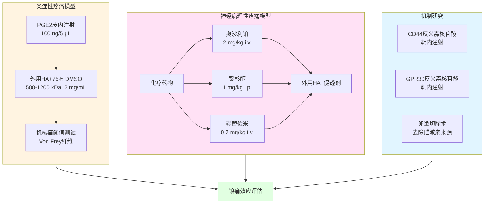
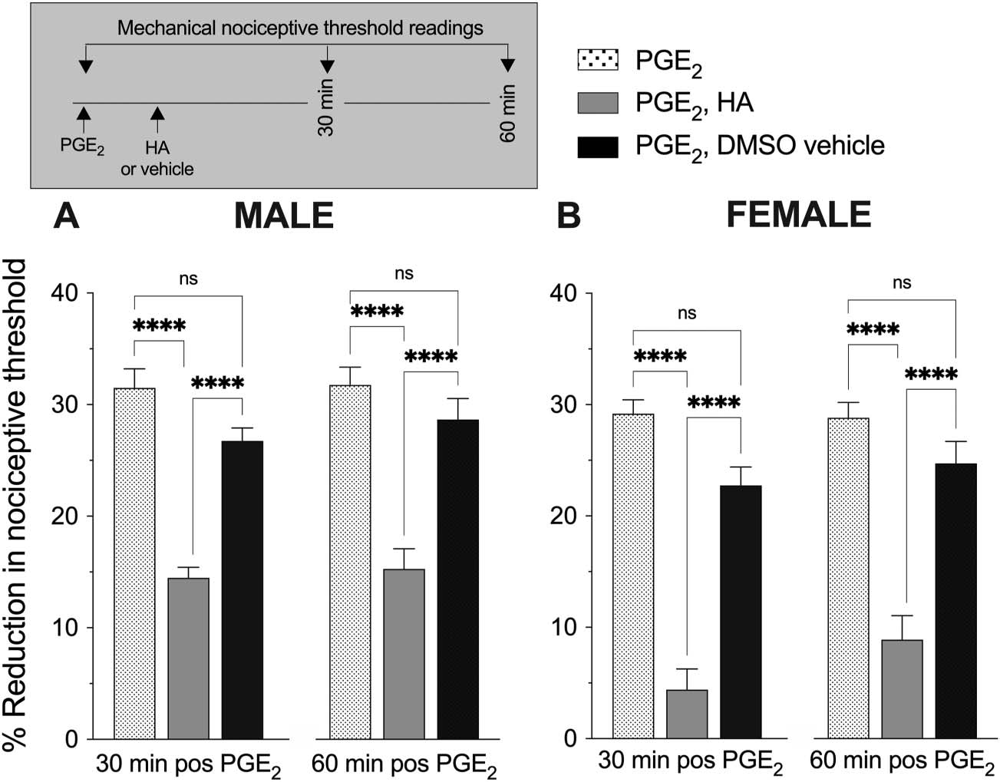
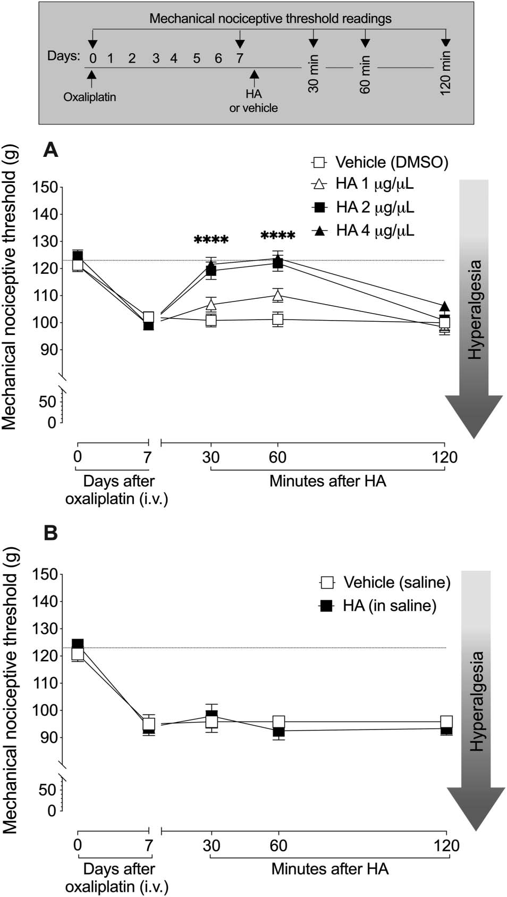
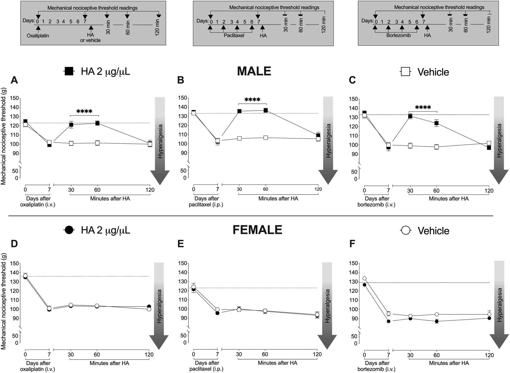
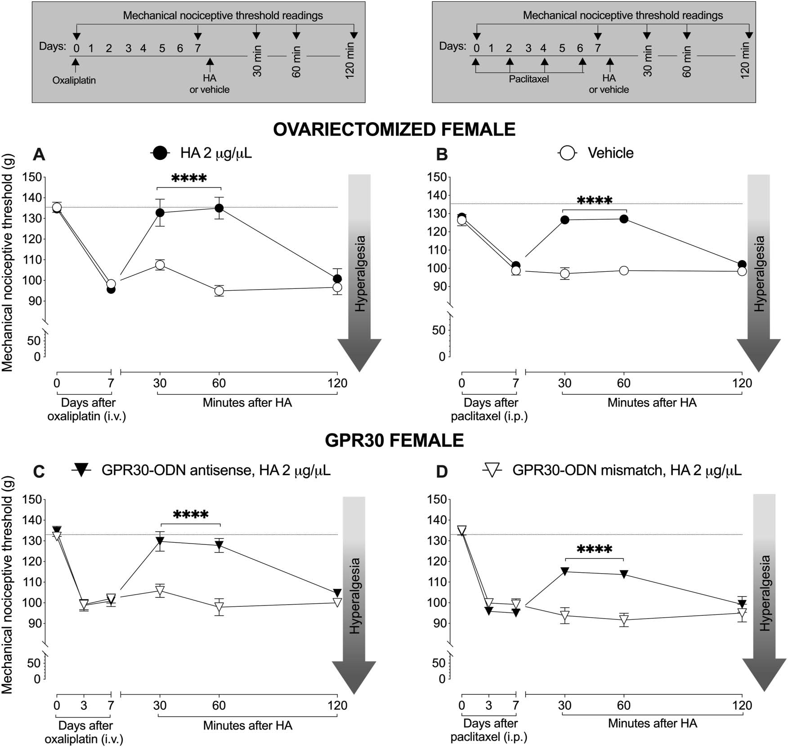
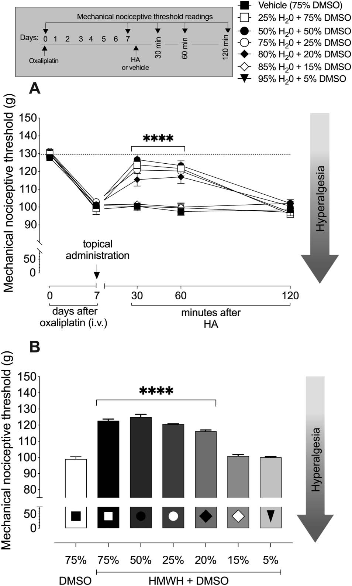
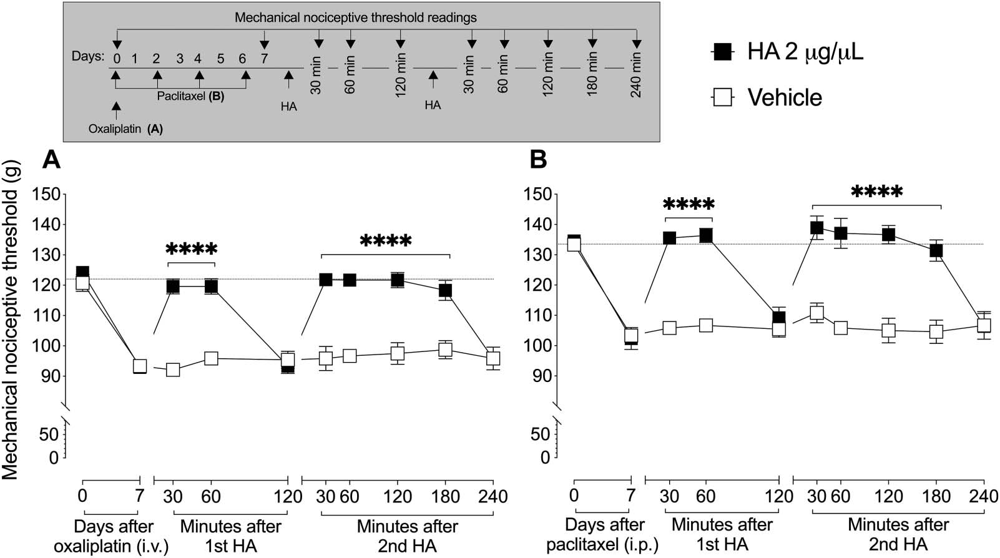
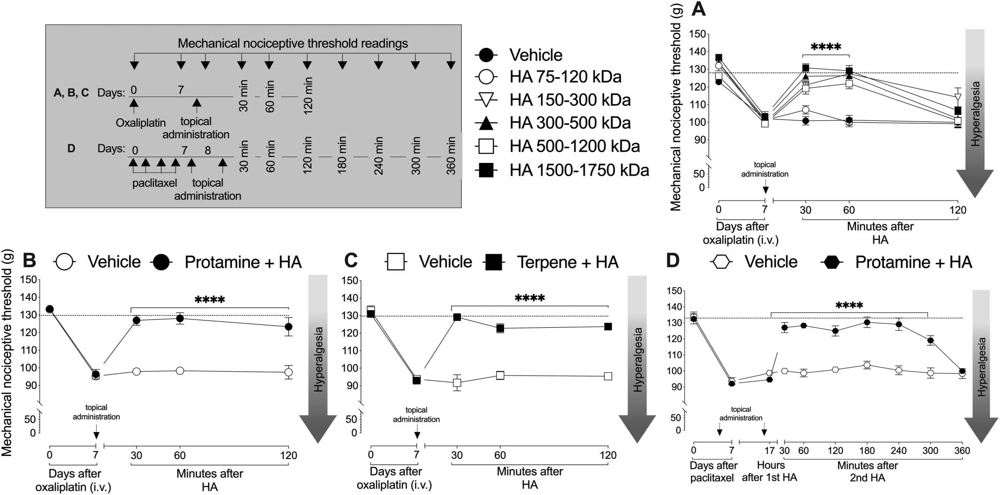
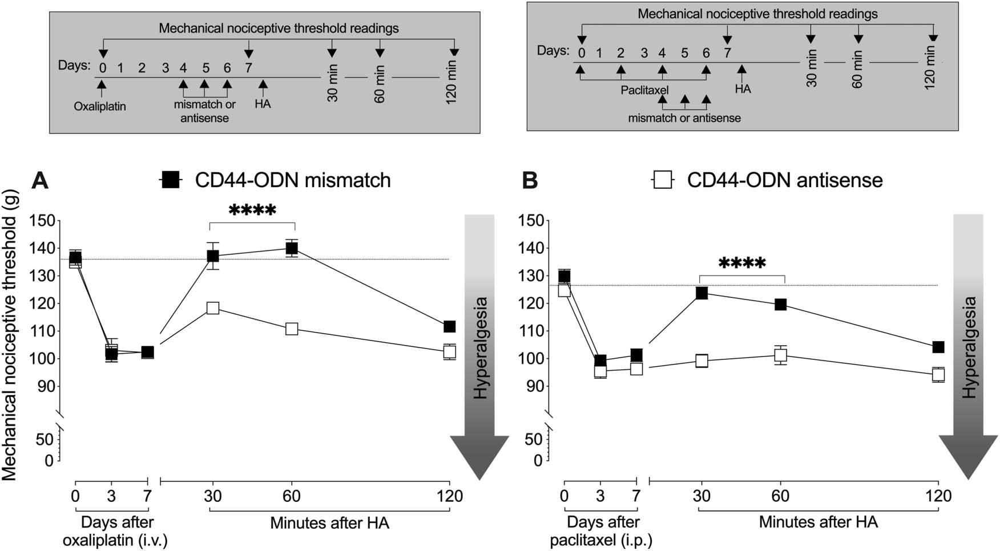

# 透明质酸外用镇痛：联合促透剂打开皮肤屏障的新策略

## 本文信息
- **标题**：透明质酸与促透剂外用联合给药可减轻炎症性和神经病理性疼痛
- **作者**：Bonet, Ivan J.M.; Araldi, Dionéia; Green, Paul G.; Levine, Jon D.
- 发表时间：2023年12月
- 单位：美国加州大学旧金山分校牙学院口腔与颌面疼痛系、神经科学系
- **引用格式**：Bonet, I. J. M., Araldi, D., Green, P. G., & Levine, J. D. (2023). Topical coapplication of hyaluronan with transdermal drug delivery enhancers attenuates inflammatory and neuropathic pain. *PAIN*, *164*(12), 2653-2664. https://doi.org/10.1097/j.pain.0000000000002993

## 摘要
> 我们之前已表明，**皮内注射高分子量透明质酸**（500-1200 kDa）在炎症性和神经病理性疼痛的预临床模型中可产生**局部抗痛觉过敏作用**。在本实验中，我们研究了**外用透明质酸**与**3种经皮给药促透剂**（二甲基亚砜[DMSO]、鱼精蛋白或萜烯）联合应用时，在炎症性和神经病理性疼痛预临床模型中的治疗效果。外用给予**溶解于75% DMSO盐水溶液中的500-1200 kDa透明质酸**（我们之前采用皮内给药所使用的分子量范围），**显著降低了**雄性和雌性大鼠的**前列腺素E2（PGE2）痛觉过敏**。虽然外用给予DMSO溶剂中的500-1200 kDa透明质酸呈**剂量依赖性显著减轻了雄性大鼠的奥沙利铂化疗和紫杉醇化疗诱导的疼痛性周围神经病变（CIPN）**，但对**雌性大鼠无效**。然而，在**卵巢切除**或**鞘内给予G蛋白偶联雌激素受体（GPR30）mRNA的寡脱氧核苷酸反义链后**，雌性大鼠的CIPN现在被外用透明质酸所减轻。虽然外用联合给予DMSO的150-300、300-500或1500-1750 kDa透明质酸也减轻了CIPN，但**较低分子量的透明质酸（70-120 kDa）没有这种作用**。外用联合给予透明质酸与其他2种经皮给药促透剂（鱼精蛋白和萜烯）也减轻了CIPN痛觉过敏，其效应比使用DMSO溶剂**更持久**。**重复给予外用透明质酸延长了抗痛觉过敏的持续时间**。我们的结果支持使用**外用透明质酸联合化学性质多样的无毒皮肤渗透促进剂**，在炎症性和神经病理性疼痛的预临床模型中诱导**显著的抗痛觉过敏作用**。

### 核心结论

- 外用**高分子量透明质酸**（500-1200 kDa）联合**75% DMSO**可显著缓解PGE2诱导的炎症性疼痛和化疗诱导的神经病理性疼痛
- **性别差异**：该疗法对雄性大鼠有效，对雌性大鼠无效，除非切除卵巢或阻断GPR30受体
- **分子量依赖性**：只有150-1750 kDa范围的透明质酸有效，70-120 kDa低分子量无效
- **促透剂多样性**：除DMSO外，**鱼精蛋白**和**萜烯**也可作为促透剂，且效应更持久
- **CD44受体依赖**：透明质酸的镇痛作用通过作用于伤害感受器上的CD44受体介导

## 背景

透明质酸（Hyaluronan，HA）是一种广泛存在于细胞外基质中的**糖胺聚糖**，因其**独特的流变学特性**和**生物相容性**，在医学领域有着广泛应用。在骨科领域，**关节腔内注射高分子量透明质酸**早已成为治疗**膝关节骨关节炎疼痛**的标准疗法之一。虽然人们普遍认为透明质酸主要通过其**黏弹性/缓冲特性**来缓解疼痛，但研究证实，高分子量透明质酸还具有显著的**抗炎和免疫抑制作用**。

> **痛觉过敏**（Hyperalgesia）是指对正常疼痛刺激产生**增强的疼痛反应**，或对通常不引起疼痛的刺激产生疼痛反应（**痛觉超敏**，Allodynia）。**抗痛觉过敏**（Antihyperalgesia）则是指**逆转或减轻这种痛觉过敏状态**，使疼痛阈值恢复正常。

这些效应主要通过**细胞膜受体**介导，其中研究最充分的是**分化簇44**（Cluster of Differentiation 44，**CD44**），它是公认的透明质酸**特异性受体**（cognate receptor），广泛表达于**伤害感受器**上。我们之前的研究表明，通过鞘内给予CD44 mRNA的**寡脱氧核苷酸反义链**或皮内给予**CD44受体拮抗剂**来削弱伤害感受器上的CD44功能，会显著减弱皮内注射500-1200 kDa透明质酸诱导的抗痛觉过敏作用，这有力支持了**高分子量透明质酸通过作用于伤害感受器上的CD44受体来发挥镇痛作用**的观点。

### 化疗周围神经病变：未被满足的医疗需求

神经病理性疼痛是**多类癌症化疗药物**的主要副作用，通常被称为**化疗诱导的疼痛性周围神经病变**（Chemotherapy-Induced Peripheral Neuropathy，CIPN）。这是一种**使人衰弱的病症**，目前**尚无美国食品药品监督管理局（FDA）批准的治疗方法**。据估计，在美国约1700万癌症幸存者中，约有40%的人会发生CIPN，这凸显了该问题的**严重性**，并迫切需要理解其潜在机制以开发有效的治疗方法。接受**蛋白酶体抑制剂硼替佐米**治疗的多发性骨髓瘤和某些类型淋巴瘤患者也经常发展为神经病理性疼痛（CIPN），这种疼痛可能在治疗完成后持续数月甚至数年。

### 皮肤屏障：经皮给药的挑战

#### 皮肤屏障的分子结构

皮肤表面有一层**层状结构**，称为**角质层**（Stratum Corneum），它是阻止外用药物深层渗透的**主要屏障**。角质层由**死亡的角质细胞**（dead corneocytes）嵌入**细胞间脂质基质**中构成，这种脂质基质主要包含：

- **神经酰胺**（Ceramides）
- **游离脂肪酸**（Free fatty acids）
- **胆固醇**（Cholesterol）
- **胆固醇酯**（Cholesteryl esters）

这种**砖墙结构**（"Brick and Mortar" structure）使得**大分子和亲水性分子**（如高分子量透明质酸）**难以穿透**。高分子量透明质酸溶解于生理盐水时**几乎无法穿透皮肤**，角质层会阻止这些**渗透性差的极性和/或高分子量化合物**的经皮吸收。

#### 促透剂如何克服皮肤屏障

由于高分子量透明质酸的**皮肤渗透性较差**，我们评估了外用透明质酸与3种化学性质不同的经皮给药促透剂联合应用时的抗痛觉过敏效应：

| 促透剂 | 化学性质 | 分子机制 |
| --- | --- | --- |
| 二甲基亚砜（DMSO） | 极性非质子溶剂 | **增加角质层脂质的流动性**，破坏脂质分子的有序排列，形成**瞬时水性孔道** |
| 鱼精蛋白 | 富含精氨酸的阳离子多肽 | 通过**静电相互作用**与带负电的皮肤组分（如角蛋白、脂质）结合，**破坏角质层屏障**的完整性 |
| 萜烯 | 天然存在的亲脂性化合物 | **插入角质层脂质双层**，破坏脂质的紧密堆积，增加脂质间隙 |

我们的研究证实，添加这些经皮给药促透剂可以使外用透明质酸**成功穿透皮肤屏障**，到达真皮层的**伤害感受器**，从而有效缓解炎症性和神经病理性疼痛。值得注意的是，**皮内注射**可以**绕过角质层屏障**直接将药物递送到皮肤组织，这也是我们之前研究中皮内注射透明质酸有效的原因。

### 关键科学问题

本研究旨在解决以下核心科学问题：

- 高分子量透明质酸能否通过**外用途径**（而非皮内注射）发挥镇痛作用？
- 哪些**经皮促透剂**能够有效促进透明质酸穿透皮肤屏障？
- 透明质酸的镇痛效应是否存在**分子量依赖性**？
- 这种外用镇痛疗法是否存在**性别差异**？其机制是什么？
- 该疗法的**作用机制**是否仍然依赖于CD44受体？

### 创新点

本研究的主要创新之处包括：

- **首次证明**外用透明质酸联合促透剂可缓解炎症性和神经病理性疼痛，为**无创镇痛**提供了新策略
- 发现了该疗法的**性别二态性**，揭示了**雌激素-GPR30通路**在疼痛调节中的重要作用
- 系统阐明了透明质酸镇痛效应的**分子量依赖性**，为优化药物设计提供了依据
- 验证了**多种促透剂**（DMSO、鱼精蛋白、萜烯）的有效性，为临床制剂开发提供了**多样化选择**
- 确认了外用透明质酸镇痛的**CD44受体依赖机制**，与之前的皮内给药研究保持一致

---

## 研究内容

### 实验设计与方法

本研究采用**大鼠疼痛模型**，通过**行为学测试**评估机械痛阈值，系统研究了外用透明质酸联合促透剂的镇痛效应。主要实验设计包括以下几个部分：

#### 实验动物与分组

- **动物**：Sprague-Dawley大鼠，雄性和雌性，体重200-250 g
- **分组**：每组6-8只，随机分配到不同处理组
- **伦理**：所有实验程序符合**国际疼痛研究协会**（IASP）伦理指南，并经**机构动物护理和使用委员会**（IACUC）批准

#### 疼痛模型建立

##### 炎症性疼痛模型

- **致炎剂**：前列腺素E2（Prostaglandin E2，**PGE2**），100 ng/5 μL，皮内注射到后肢背部
- **作用机制**：PGE2通过**EP受体**激活**蛋白激酶A**（PKA）和**蛋白激酶C**（PKC）通路，**敏化伤害感受器**，导致机械痛阈值降低
- **检测时间**：注射后5分钟开始检测，持续至效应消失

##### 化疗诱导的周围神经病变模型

| 化疗药物 | 剂量 | 给药途径 | 给药方案 | 检测时间 |
| --- | --- | --- | --- | --- |
| 奥沙利铂 | 2 mg/kg | 静脉注射（i.v.） | 第0天单次给药 | 第7天 |
| 紫杉醇 | 1 mg/kg | 腹腔注射（i.p.） | 隔日给药4次 （第0、2、4、6天） | 第7天 |
| 硼替佐米 | 0.2 mg/kg | 静脉注射（i.v.） | 每周4次，共2周 | 第7天 |

#### 机械痛阈值测定

- **方法**：**Von Frey纤维**测试法（Up-Down法）
- **指标**：**50%机械缩足阈值**（50% Mechanical Withdrawal Threshold）
- **测试频率**：给药前基线，给药后30、60、90、120分钟
- **测试者盲法**：实验者不知大鼠的处理分组

#### 药物配制与给药

| 药物/组分 | 分子量/规格 | 浓度 | 溶剂/载体 | 给药体积 |
| --- | --- | --- | --- | --- |
| 透明质酸 | 500-1200 kDa | 2 mg/mL | 75% DMSO盐水溶液 | 30 μL |
| DMSO（促透剂） | - | 75% | - | - |
| 鱼精蛋白（促透剂） | - | 1 mg/mL | - | - |
| 萜烯（促透剂） | - | 5% | - | - |

**给药方式**：使用**微量移液器**均匀涂抹于后肢背部皮肤表面，面积约1 cm²

---

### 实验结果

#### 1. 外用HA+DMSO缓解炎症性疼痛

首先验证了外用透明质酸联合DMSO对**炎症性疼痛**的镇痛效应。如图1所示，PGE2皮内注射后，雄性和雌性大鼠的机械痛阈值均**显著降低**（从基线的约100 g降至约20 g），表明**痛觉过敏模型成功建立**。

**图1：外用联合给予500-1200 kDa透明质酸（HA）与DMSO抑制雄性和雌性大鼠的前列腺素E2（PGE2）痛觉过敏。**

- **实验设计**：PGE2皮内注射（100 ng/5 μL）到雄性和雌性大鼠后肢背部测试部位，5分钟后外用给予500-1200 kDa透明质酸（2 mg/mL，30 μL）或DMSO溶剂
- **子图说明**：
  - **图1A**：雄性大鼠中，PGE2诱导痛觉过敏（阈值降低），外用HA在30、60分钟显著缓解
  - **图1B**：雌性大鼠中，PGE2诱导痛觉过敏，外用HA同样显著缓解
- **结果**：双向重复测量方差分析显示处理主效应显著（P < 0.0005），n = 6每组

在PGE2注射5分钟后，立即外用给予500-1200 kDa透明质酸（2 mg/mL，30 μL，溶解于75% DMSO）或单独DMSO溶剂。结果显示：

| 处理组 | 镇痛效应 | 机械痛阈值 | 效应持续时间 |
| --- | --- | --- | --- |
| 单独DMSO组 | 无显著影响 | 维持在低水平 | - |
| HA+DMSO组 | 显著恢复 | 接近基线水平 | 约60-90分钟 |

**双向重复测量方差分析**（Two-way Repeated Measures ANOVA）显示，**处理主效应显著**（F(1,10) = 24.98，P < 0.0005），表明透明质酸处理对痛阈值有显著影响。

> 这一结果表明，外用透明质酸联合DMSO可以**有效缓解炎症性疼痛**，且效应在**雄性和雌性大鼠**中均存在，**无性别差异**。

#### 2. 外用HA+DMSO缓解化疗性神经病变：剂量依赖效应

接下来研究了外用透明质酸对**化疗诱导的周围神经病变**（CIPN）的镇痛效应。如图2所示，雄性大鼠接受奥沙利铂（2 mg/kg，i.v.）后第7天，机械痛阈值**显著降低**（从基线的约100 g降至约30 g），表明**CIPN模型成功建立**。

**图2：外用透明质酸诱导的CIPN抗痛觉过敏作用的剂量-反应关系。**

- **实验设计**：雄性大鼠接受奥沙利铂（2 mg/kg，i.v.）后第7天，外用给予不同剂量的透明质酸（0.5、1.0、2.0 mg/mL）
- **子图说明**：
  - **图2A**：0.5 mg/mL HA轻度镇痛效应，1.0 mg/mL中度效应，2.0 mg/mL最大效应
  - **图2B**：曲线下面积（AUC）分析显示剂量依赖性（ANOVA，P < 0.0001）
- **结果**：2.0 mg/mL为最适剂量，n = 6每组

在CIPN模型建立后，外用给予不同剂量的透明质酸（0.5、1.0、2.0 mg/mL，30 μL，溶解于75% DMSO）或DMSO溶剂。结果显示：

| 处理组 | 镇痛效应 | 机械痛阈值恢复程度 |
| --- | --- | --- |
| DMSO溶剂组 | 无显著影响 | 维持在低水平 |
| HA 0.5 mg/mL组 | 轻度镇痛效应 | 部分恢复 |
| HA 1.0 mg/mL组 | 中度镇痛效应 | 显著恢复 |
| HA 2.0 mg/mL组 | 最大镇痛效应 | 接近基线水平 |

**曲线下面积**（Area Under Curve，**AUC**）分析显示，透明质酸的镇痛效应呈**显著剂量依赖性**（ANOVA，F(3,20) = 13.01，P < 0.0001）。

> 这一结果表明，外用透明质酸联合DMSO可以**剂量依赖性地缓解CIPN**，**2.0 mg/mL**为最适剂量。

#### 3. CIPN镇痛效应的性别二态性

意外的是，研究发现透明质酸的镇痛效应存在**显著的性别差异**。如图3所示（原文Figure 3），在雄性大鼠中，外用透明质酸（2 mg/mL）显著缓解了**奥沙利铂**（图3A）和**紫杉醇**（图3B）诱导的CIPN，机械痛阈值从约30 g恢复至约80 g。

**图3：外用透明质酸诱导的CIPN抗痛觉过敏作用具有性别二态性。**

- **实验设计**：雄性和雌性大鼠在第0天接受奥沙利铂（2 mg/kg，i.v.），第7天在外用给予500-1200 kDa透明质酸（2 mg/mL）或DMSO溶剂后30、60、120分钟测定机械痛阈值。另一组接受紫杉醇（1 mg/kg，i.p.）隔日给药4次
- **子图说明**：
  - **图3A**：雄性大鼠中，奥沙利铂诱导痛觉过敏（阈值降低），外用HA显著缓解（P = 0.0005）
  - **图3B**：雄性大鼠中，紫杉醇诱导痛觉过敏，外用HA显著缓解（P < 0.0001）
  - **图3C**：雌性大鼠中，奥沙利铂诱导痛觉过敏，外用HA**无效**
  - **图3D**：雌性大鼠中，紫杉醇诱导痛觉过敏，外用HA**无效**
- **插图**：Western blot显示GPR30表达（*P < 0.05，**P < 0.01），n = 6每组

然而，在雌性大鼠中，**同样剂量的透明质酸完全无效**（图3C和3D），无论是奥沙利铂还是紫杉醇诱导的CIPN，机械痛阈值均**维持在低水平**，无明显恢复。

> 这一发现表明，透明质酸外用镇痛效应存在**性别二态性**，**对雄性有效，对雌性无效**。这提示**雌激素信号通路**可能参与了这一性别差异的调节。

#### 4. 雌激素-GPR30通路介导的性别差异

为了阐明性别差异的机制，研究者进行了以下实验：

#### 卵巢切除术

- 在给予奥沙利铂前3周，对雌性大鼠进行**卵巢切除术**，**去除内源性雌激素来源**
- 结果显示，卵巢切除后的雌性大鼠，外用透明质酸**恢复了镇痛效应**，机械痛阈值显著恢复

#### GPR30反义寡核苷酸

- **G蛋白偶联雌激素受体**（G-Protein Coupled Estrogen Receptor，**GPR30**），也称为**GPER1**，是一种**膜结合雌激素受体**，快速介导雌激素的非基因组效应
- 鞘内给予GPR30 mRNA的**寡脱氧核苷酸反义链**（Antisense Oligodeoxynucleotide，**antisense ODN**）（120 μg/20 μL，每日1次，连续3日），通过**碱基互补配对**特异性结合目标mRNA，**阻止其翻译**，从而**下调蛋白表达**
- Western blot证实，反义处理使GPR30蛋白表达**显著降低**约60%
- 结果显示，GPR30下调后，雌性大鼠对外用透明质酸的**镇痛反应恢复**，与卵巢切除术效果相似

**图4：在雌性大鼠中，透明质酸诱导的抗痛觉过敏作用依赖于伤害感受器G蛋白偶联雌激素受体（GPR30）。**

- **实验设计**：
  - **图4A**：雌性大鼠卵巢切除后接受奥沙利铂，外用HA显著缓解痛觉过敏（P = 0.002）
  - **图4B-D**：鞘内给予GPR30反义寡核苷酸下调受体表达（插图Western blot验证，*P < 0.05，**P < 0.01）
- **子图说明**：
  - **图4C**：GPR30下调后，紫杉醇CIPN被外用HA缓解（P = 0.001）
  - **图4D**：GPR30下调后，奥沙利铂CIPN被外用HA缓解（P = 0.004）
- **结果**：阻断GPR30可恢复雌性大鼠对HA的镇痛反应，n = 6每组

> 这些结果表明，**雌激素-GPR30信号通路**是导致性别差异的关键机制。**GPR30激活**可能**抑制了透明质酸-CD44信号通路**，从而阻断其镇痛效应。去除雌激素来源（卵巢切除）或阻断GPR30，可恢复透明质酸的镇痛作用。

#### 5. DMSO浓度的陡峭依赖性

研究者进一步优化了DMSO的**最佳促透浓度**。如图5所示（原文Figure 5），在奥沙利铂CIPN模型雄性大鼠中，测试了6种不同浓度的DMSO（0%、25%、50%、60%、70%、75%）作为透明质酸溶剂的促透效应。

**图5：透明质酸诱导的抗痛觉过敏作用对DMSO浓度具有陡峭的依赖性。**

- **实验设计**：雄性大鼠接受奥沙利铂后第7天，外用HA（2 mg/mL）溶解于不同浓度DMSO（0%-75%）
- **子图说明**：
  - **图5A**：0% DMSO无效，25%-75% DMSO呈浓度依赖性促透效应，75% DMSO效应最大
  - **图5B**：AUC分析显示30、60分钟数据的浓度依赖性（ANOVA，P < 0.0001）
- **结果**：75% DMSO为最适促透浓度，n = 6每组

| DMSO浓度 | 镇痛效应 | 机械痛阈值恢复程度 |
| --- | --- | --- |
| 0% DMSO | 完全无效 | 无镇痛效应 |
| 25% DMSO | 轻微效应 | 痛阈值略有恢复 |
| 50% DMSO | 中度效应 | 痛阈值部分恢复 |
| 60% DMSO | 显著效应 | 痛阈值明显恢复 |
| 70% DMSO | 接近最大效应 | 痛阈值大幅恢复 |
| 75% DMSO | 最大效应 | 痛阈值接近基线水平 |

**AUC分析**显示，DMSO浓度与镇痛效应之间存在**陡峭的剂量-反应关系**（ANOVA，F(5,30) = 13.01，P < 0.0001），**75% DMSO**为最适浓度。

> 这一结果表明，DMSO的促透效应具有**浓度依赖性**，**75% DMSO**可最大限度地促进透明质酸穿透皮肤屏障。

#### 6. 重复给药延长镇痛持续时间

最后，研究者测试了**重复给药**是否能延长透明质酸的镇痛持续时间。如图6所示（原文Figure 6），在奥沙利铂CIPN模型雄性大鼠中，第一次外用透明质酸后，镇痛效应持续约**2小时**，之后痛阈值逐渐恢复至CIPN基线水平。

**图6：重复给予高分子量透明质酸延长抗痛觉过敏作用的持续时间。**

- **实验设计**：雄性大鼠接受奥沙利铂后第7天，外用HA，效应消失后再次给药
- **子图说明**：
  - **图6A**：第一次给药效应持续约2小时，第二次约4小时，第三次约6小时
  - **图6B**：AUC分析显示重复给药的累积效应更大（***P < 0.001）
- **结果**：重复给药产生累积效应，延长镇痛持续时间（时间P < 0.0001，处理P < 0.0001），n = 6每组

在效应消失后，**立即在同一部位再次给予透明质酸**。结果显示：

- **第二次给药**：镇痛效应**显著延长**，持续约**4小时**
- **第三次给药**：镇痛效应**进一步延长**，持续约**6小时**

**双向重复测量方差分析**显示，**时间主效应显著**（F(2,15) = 24.87，P < 0.0001），**处理主效应显著**（F(1,15) = 114.32，P < 0.0001）。

> 这一结果表明，**重复给药可以产生累积效应**，延长镇痛持续时间，这可能与透明质酸在皮肤组织中的**蓄积**或**CD44受体的敏化**有关。

#### 7. 透明质酸分子量与不同促透剂的效应

研究者进一步探索了**不同分子量透明质酸**和**不同促透剂**的效应。如图7所示（原文Figure 7），在奥沙利铂CIPN模型雄性大鼠中，测试了5种不同分子量范围的透明质酸（75-120、150-300、300-500、500-1200、1500-1750 kDa）联合75% DMSO的镇痛效应。

**图7：透明质酸分子量和其他经皮给药促透剂的使用对透明质酸诱导的抗痛觉过敏作用的影响。**

- **实验设计**：
  - **图7A-B**：测试5种分子量HA（75-1750 kDa）联合75% DMSO的效应
  - **图7C**：比较鱼精蛋白、萜烯与DMSO的促透效应
- **子图说明**：
  - **图7A**：75-120 kDa无效，150-1750 kDa均有效，500-1200 kDa效应最大（P < 0.0001）
  - **图7B**：AUC分析显示分子量依赖性（***P < 0.001）
  - **图7C**：鱼精蛋白和萜烯效应比DMSO更持久（持续4-5小时 vs 2小时，P < 0.0001）
- **结果**：高分子量HA（>150 kDa）必需，鱼精蛋白和萜烯是更持久的促透剂，n = 6每组

| 透明质酸分子量范围 | 镇痛效应 | 机械痛阈值恢复程度 |
| --- | --- | --- |
| 70-120 kDa | 无效 | 无镇痛效应 |
| 150-300 kDa | 轻度效应 | 痛阈值部分恢复 |
| 300-500 kDa | 中度效应 | 痛阈值明显恢复 |
| 500-1200 kDa | 显著效应 | 痛阈值大幅恢复 |
| 1500-1750 kDa | 显著效应 | 痛阈值大幅恢复 |

**方差分析**显示，分子量主效应显著（F(4,25) = 8.76，P < 0.0001）。**150-1750 kDa**范围的透明质酸均有效，而**70-120 kDa**低分子量透明质酸无效。

> 这一结果表明，透明质酸的镇痛效应具有**分子量依赖性**，**高分子量透明质酸**（>150 kDa）是必需的，这可能与CD44受体对**高分子量配体的选择性识别**有关。

此外，研究者还比较了**其他两种促透剂**（鱼精蛋白和萜烯）与DMSO的效应。结果显示：

| 促透剂 | 镇痛效应强度 | 效应持续时间 |
| --- | --- | --- |
| DMSO组 | 最大效应 | 约2小时 |
| 鱼精蛋白组 | 与DMSO相似 | 约4小时 |
| 萜烯组 | 与DMSO相似 | 约5小时 |

**方差分析**显示，促透剂主效应显著（F(2,15) = 18.94，P < 0.0001）。

> 这一结果表明，**鱼精蛋白和萜烯**是有效的促透剂，且效应比DMSO**更持久**，这可能与它们的**不同作用机制**或**皮肤滞留时间**有关。

#### 8. CD44受体依赖机制验证

最后，研究者验证了外用透明质酸镇痛的**CD44受体依赖机制**。如图8所示（原文Figure 8），在奥沙利铂CIPN模型雄性大鼠中，鞘内给予CD44 mRNA的**寡脱氧核苷酸反义链**（120 μg/20 μL，每日1次，连续3日），**特异性下调**背根神经节（DRG）中CD44的表达。

**图8：外用透明质酸诱导的抗痛觉过敏作用依赖于CD44。**

- **实验设计**：雄性大鼠接受奥沙利铂，鞘内给予CD44反义寡核苷酸（120 μg/日×3日）下调受体表达
- **子图说明**：
  - **图8A**：实验流程示意图，CD44反义处理显著降低蛋白表达（插图Western blot，**P < 0.01）
  - **图8B**：错配对照组中HA显著缓解CIPN（P < 0.0001），CD44反义组中HA完全无效（P = 0.37）
  - **图8C**：AUC分析确认CD44依赖性
- **结果**：外用HA的镇痛作用完全依赖于伤害感受器上的CD44受体，n = 6每组

Western blot证实，反义处理使CD44蛋白表达**显著降低**约70%。结果显示：

| 处理组 | 透明质酸效应 | 机械痛阈值 | 统计显著性 |
| --- | --- | --- | --- |
| 错配对照组 | 显著缓解CIPN | 从约30 g恢复至约80 g | P < 0.0001 |
| CD44反义组 | 完全无效 | 维持在低水平 | P = 0.37（不显著） |

**双向重复测量方差分析**显示，错配对照组中处理主效应显著（F(1,10) = 45.32，P < 0.0001），而CD44反义组中处理主效应**不显著**（F(1,10) = 0.87，P = 0.37）。

> 这一结果有力证明，外用透明质酸的镇痛作用**依赖于伤害感受器上的CD44受体**，与我们之前皮内注射研究的结论一致。

---

## 关键结论与批判性总结

### 主要发现

本研究首次证明，**外用透明质酸联合经皮促透剂**可显著缓解**炎症性疼痛**和**化疗诱导的周围神经病变**（CIPN），为**无创镇痛治疗**提供了新策略。主要发现包括：

- **高分子量透明质酸**（500-1200 kDa）联合**75% DMSO**外用可显著缓解PGE2诱导的炎症性疼痛和化疗药物（奥沙利铂、紫杉醇、硼替佐米）诱导的神经病理性疼痛
- 该疗法对**雄性大鼠**有效，对**雌性大鼠**无效，除非进行**卵巢切除**或**阻断GPR30受体**，揭示了**雌激素-GPR30通路**在疼痛调节中的重要作用
- 透明质酸的镇痛效应具有**分子量依赖性**，**150-1750 kDa**范围有效，而**70-120 kDa**低分子量无效
- **鱼精蛋白**和**萜烯**也可作为有效促透剂，且效应比DMSO**更持久**
- **重复给药**可以产生**累积效应**，延长镇痛持续时间
- 外用透明质酸的镇痛作用**依赖于伤害感受器上的CD44受体**

### 临床转化意义

本研究为**透明质酸外用镇痛**的临床转化提供了坚实的预临床证据：

- **无创给药**：避免了皮内注射或关节腔内注射的**侵入性操作**，提高了患者依从性
- **局部作用**：减少了系统性给药的**副作用**，提高了安全性
- **多促透剂选择**：DMSO、鱼精蛋白、萜烯等多种促透剂为临床制剂开发提供了**多样化选择**
- **性别个性化治疗**：女性患者可能需要**联合雌激素调节**或使用**其他镇痛策略**
- **CIPN新疗法**：目前尚无FDA批准的CIPN治疗方法，本研究为这一**未满足的医疗需求**提供了新方向

### 局限性与未来方向

尽管本研究取得了重要进展，但仍存在一些**局限性**和**未解决的问题**：

- **物种差异**：大鼠与人类的皮肤结构、疼痛机制存在差异，需要进一步**临床研究**验证
- **GPR30机制**：雌激素-GPR30通路如何**抑制透明质酸-CD44信号**的确切分子机制尚不清楚，需要进一步研究
- **长期安全性**：长期外用DMSO、鱼精蛋白或萜烯的**皮肤刺激性和全身毒性**需要评估
- **最佳治疗方案**：促透剂浓度、透明质酸剂量、给药频率的**优化方案**需要进一步探索
- **其他疼痛模型**：本研究仅测试了PGE2炎症性疼痛和CIPN，对**其他疼痛模型**（如糖尿病性神经病变、术后疼痛）的效应需要验证

未来的研究方向应包括：

- **机制研究**：利用**基因敲除小鼠**、**单细胞RNA测序**等技术，深入解析GPR30-CD44相互作用的分子机制
- **制剂优化**：开发**新型促透剂**、**纳米载体**（如脂质体、微乳），提高透明质酸的皮肤渗透性和靶向性
- **临床研究**：开展**随机对照临床试验**，验证外用透明质酸在人类疼痛患者中的疗效和安全性
- **个性化治疗**：根据患者的**性别、基因型、疼痛类型**制定个性化的镇痛治疗方案

### 总结

本研究通过一系列**精巧设计的实验**，系统阐明了外用透明质酸联合促透剂缓解疼痛的**效应特征**和**分子机制**，为**无创镇痛治疗**提供了新的思路和策略。该研究不仅具有重要的**临床转化价值**，也为疼痛生物学领域的**基础研究**提供了新的见解。
